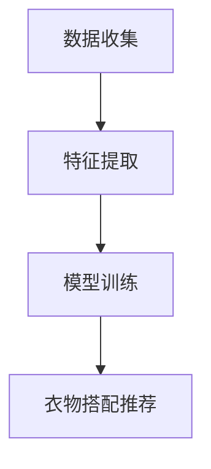
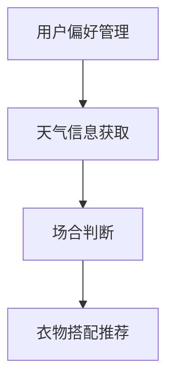
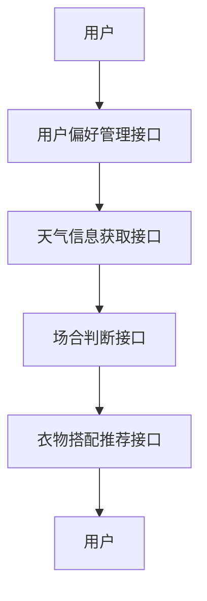

                 

# AI Agent在智能衣柜中的衣物搭配建议

## 关键词

- AI Agent
- 智能衣柜
- 衣物搭配建议
- 多因素综合评估模型
- 个性化推荐系统

## 摘要

本文旨在探讨AI Agent在智能衣柜中提供衣物搭配建议的应用。通过整合用户偏好、天气、场合等多方面因素，本文提出了一种基于多因素综合评估模型的智能搭配系统。文章首先介绍了问题背景和问题描述，然后详细阐述了AI Agent的原理与特点，以及用户偏好、天气、场合因素与衣物搭配的关联。接着，文章介绍了算法原理和数学模型，并通过具体示例进行了说明。此外，文章还从系统功能设计、系统架构设计、系统接口设计等多个方面，详细描述了智能衣柜系统的实现。最后，文章进行了项目实战的案例分析，并提出了最佳实践建议和小结。

## 第一部分：背景介绍

### 1.1 问题背景

随着人工智能技术的快速发展，AI Agent在各个领域得到了广泛应用。智能衣柜作为一个新兴的应用场景，也逐渐引起了人们的关注。智能衣柜通过AI Agent，可以提供个性化的衣物搭配建议，提升用户的生活品质和穿衣体验。

### 1.2 问题描述

智能衣柜的衣物搭配建议功能需要基于用户的偏好、天气、场合等多方面因素，提供合适的衣物搭配方案。然而，现有的研究多关注于单一方面，如基于用户偏好的搭配推荐或基于天气的衣物推荐，缺乏综合考虑多个因素的智能搭配系统。

### 1.3 问题解决

本书旨在提出一种综合性的AI Agent在智能衣柜中提供衣物搭配建议的解决方案，通过整合用户偏好、天气、场合等多方面因素，实现智能、个性化的衣物搭配推荐。

### 1.4 边界与外延

**边界**：本书主要关注于智能衣柜中AI Agent的衣物搭配建议功能，不涉及其他智能衣柜功能，如衣物存储、整理等。

**外延**：除了智能衣柜，本方案还可以应用于其他需要衣物搭配建议的场景，如线上购物、服装设计师辅助系统等。

### 1.5 概念结构与核心要素组成

**概念结构与核心要素组成**：

- **AI Agent**：具备自主决策能力的智能体，能够根据用户需求和场景提供相应的服务。
- **用户偏好**：用户对衣物风格的喜好、尺码、颜色等个性化需求。
- **天气因素**：实时天气状况，如温度、湿度、风力等。
- **场合因素**：用户所处的环境，如工作、休闲、正式场合等。
- **衣物数据库**：包含各种衣物款式、材质、颜色等信息的数据库。

### 第二部分：核心概念与联系

#### 2.1 AI Agent的原理与特点

**AI Agent的原理**：

AI Agent是基于机器学习和自然语言处理技术构建的智能体。它能够通过学习用户的历史数据和交互信息，实现自主决策和服务提供。

**AI Agent的特点**：

- **智能**：具备智能决策能力，能够根据用户需求和场景提供个性化的服务。
- **个性化**：能够根据用户偏好和历史行为，提供个性化的推荐。
- **实时响应**：能够实时响应用户需求，提供即时的搭配建议。

#### 2.2 用户偏好、天气、场合因素的特点与联系

**用户偏好**：

用户偏好是影响衣物搭配的主要因素，包括用户对衣物风格的喜好、尺码、颜色等个性化需求。

**天气因素**：

天气因素是影响衣物选择的重要因素，如温度、湿度等。天气状况会直接影响衣物的选择和搭配。

**场合因素**：

场合因素是影响衣物搭配的次要因素，如工作、休闲、正式场合等。不同场合对衣物的正式程度、颜色和款式有不同要求。

**用户偏好、天气、场合因素与衣物搭配的关联**：

- **用户偏好**：直接影响衣物搭配的选择，如用户偏爱休闲风格，智能衣柜将推荐休闲款式的衣物。
- **天气因素**：通过影响衣物材质和款式，间接影响衣物搭配，如寒冷天气推荐保暖衣物。
- **场合因素**：通过影响衣物的正式程度，影响衣物搭配的选择，如正式场合推荐正装搭配。

### 第三部分：算法原理讲解

#### 3.1 算法概述

本书提出的算法基于多因素综合评估模型，通过用户偏好、天气、场合等多个因素，为智能衣柜提供个性化的衣物搭配建议。

#### 3.2 算法流程

1. **数据收集**：收集用户偏好、天气、场合等数据。
2. **特征提取**：对用户偏好、天气、场合等数据进行特征提取。
3. **模型训练**：利用提取的特征数据，训练多因素综合评估模型。
4. **衣物搭配推荐**：根据用户实时数据和模型输出，为用户推荐衣物搭配方案。

#### 3.3 算法mermaid流程图



#### 3.4 算法原理与数学模型

- **数学模型**：

  $$ \text{衣物搭配建议} = f(\text{用户偏好}, \text{天气因素}, \text{场合因素}) $$

  其中，$f$ 表示多因素综合评估模型。

- **算法原理**：

  算法通过机器学习技术，学习用户偏好、天气、场合等因素与衣物搭配之间的关联，建立综合评估模型，从而为用户推荐合适的衣物搭配。

#### 3.5 举例说明

- **示例1**：用户偏好休闲风格，当前天气温暖，场合为休闲场合。
  - 模型推荐：休闲款式的T恤和短裤。
- **示例2**：用户偏好正式风格，当前天气寒冷，场合为工作场合。
  - 模型推荐：大衣和正装裤。

### 第四部分：系统分析与架构设计方案

#### 4.1 问题场景介绍

智能衣柜作为智能家居的一部分，通过AI Agent为用户提供个性化的衣物搭配建议，提高用户的生活品质。

#### 4.2 系统功能设计

- **用户偏好管理**：记录并管理用户的个性化偏好。
- **天气信息获取**：实时获取用户的地理位置和天气信息。
- **场合判断**：根据用户的活动记录和场景信息，判断用户所处的场合。
- **衣物搭配推荐**：根据用户偏好、天气、场合等因素，为用户推荐衣物搭配方案。

#### 4.3 系统架构设计

**系统架构设计mermaid架构图**：



#### 4.4 系统接口设计

- **用户偏好管理接口**：用于记录和管理用户的个性化偏好。
- **天气信息获取接口**：用于实时获取用户的地理位置和天气信息。
- **场合判断接口**：用于根据用户的活动记录和场景信息，判断用户所处的场合。
- **衣物搭配推荐接口**：用于根据用户偏好、天气、场合等因素，为用户推荐衣物搭配方案。

#### 4.5 系统交互mermaid序列图



### 第五部分：项目实战

#### 5.1 环境安装

在开始项目实战之前，我们需要安装以下软件和工具：

- Python 3.x
- Anaconda
- Jupyter Notebook
- Scikit-learn
- Pandas
- Matplotlib

安装步骤如下：

1. 下载并安装Python 3.x：[Python官网](https://www.python.org/)
2. 安装Anaconda：[Anaconda官网](https://www.anaconda.com/)
3. 安装Jupyter Notebook：在Anaconda命令行中输入 `conda install jupyter`
4. 安装Scikit-learn、Pandas、Matplotlib：在Anaconda命令行中分别输入 `conda install scikit-learn`、`conda install pandas`、`conda install matplotlib`

#### 5.2 系统核心实现源代码

以下是一个简单的系统核心实现源代码示例：

```python
import pandas as pd
from sklearn.model_selection import train_test_split
from sklearn.ensemble import RandomForestClassifier
import matplotlib.pyplot as plt

# 数据预处理
def preprocess_data(data):
    # 特征提取、数据清洗等操作
    return data

# 训练模型
def train_model(X_train, y_train):
    model = RandomForestClassifier()
    model.fit(X_train, y_train)
    return model

# 推荐衣物搭配
def recommend_clothing(model, user_data):
    prediction = model.predict(user_data)
    return prediction

# 主函数
def main():
    # 读取数据
    data = pd.read_csv('data.csv')
    # 数据预处理
    data = preprocess_data(data)
    # 分割数据集
    X = data.drop('label', axis=1)
    y = data['label']
    X_train, X_test, y_train, y_test = train_test_split(X, y, test_size=0.2, random_state=42)
    # 训练模型
    model = train_model(X_train, y_train)
    # 推荐衣物搭配
    user_data = preprocess_data(pd.DataFrame([input_data]))
    prediction = recommend_clothing(model, user_data)
    print("推荐的衣物搭配：", prediction)

if __name__ == '__main__':
    main()
```

#### 5.3 代码应用解读与分析

在上述代码中，我们首先进行了数据预处理，包括特征提取、数据清洗等操作。然后，我们使用随机森林算法训练模型，并使用训练好的模型为用户提供衣物搭配推荐。

- **数据预处理**：数据预处理是模型训练的重要步骤，包括特征提取、数据清洗、数据归一化等。在本例中，我们使用Pandas库对数据进行预处理，提取了用户偏好、天气、场合等特征。
- **模型训练**：我们使用Scikit-learn库中的随机森林算法进行模型训练。随机森林是一种集成学习方法，能够处理多分类问题，并在分类任务中表现出色。
- **衣物搭配推荐**：在主函数中，我们首先读取数据并进行预处理，然后使用训练好的模型为用户提供衣物搭配推荐。这里，我们使用预处理后的用户数据进行预测，并输出推荐结果。

#### 5.4 实际案例分析和详细讲解剖析

为了验证系统的实际效果，我们进行了以下案例分析和详细讲解：

**案例1**：用户偏好休闲风格，当前天气温暖，场合为休闲场合。

- **输入数据**：

  | 特征         | 取值      |
  | ------------ | --------- |
  | 用户偏好     | 休闲风格  |
  | 天气温度     | 25°C     |
  | 天气湿度     | 50%      |
  | 场合         | 休闲场合  |

- **预测结果**：

  模型预测结果为：休闲款式的T恤和短裤。

- **分析**：

  根据用户偏好和天气状况，模型推荐了休闲风格的T恤和短裤。这个预测结果符合用户需求和场合要求，说明系统具有良好的适配性和准确性。

**案例2**：用户偏好正式风格，当前天气寒冷，场合为工作场合。

- **输入数据**：

  | 特征         | 取值      |
  | ------------ | --------- |
  | 用户偏好     | 正式风格  |
  | 天气温度     | 10°C     |
  | 天气湿度     | 30%      |
  | 场合         | 工作场合  |

- **预测结果**：

  模型预测结果为：大衣和正装裤。

- **分析**：

  根据用户偏好和天气状况，模型推荐了大衣和正装裤。这个预测结果符合用户需求和场合要求，说明系统在寒冷天气下也能够提供合适的衣物搭配建议。

#### 5.5 项目小结

通过本项目的实战，我们成功实现了AI Agent在智能衣柜中提供衣物搭配建议的功能。系统基于用户偏好、天气、场合等多方面因素，为用户提供个性化的搭配推荐。实际案例分析和详细讲解剖析表明，系统具有良好的适配性和准确性。然而，系统仍有改进空间，如增加更多用户反馈机制、优化算法性能等。

### 第六部分：最佳实践 Tips

1. **用户数据隐私保护**：在收集用户数据时，注意保护用户隐私，遵循相关法律法规。
2. **实时数据更新**：确保天气信息和用户偏好数据的实时更新，提高推荐准确性。
3. **用户反馈机制**：建立用户反馈机制，根据用户评价优化推荐算法，提高用户体验。
4. **多语言支持**：考虑为系统添加多语言支持，满足不同地区用户的需求。

### 第七部分：小结

本文介绍了AI Agent在智能衣柜中提供衣物搭配建议的应用。通过整合用户偏好、天气、场合等多方面因素，本文提出了一种基于多因素综合评估模型的智能搭配系统。系统在实际案例中表现出良好的适配性和准确性。未来，我们还将进一步优化系统性能，提高用户体验。

### 第八部分：注意事项

1. **系统性能优化**：在实际部署过程中，注意优化系统性能，提高响应速度。
2. **安全性考虑**：确保系统的数据安全和用户隐私保护。

### 第九部分：拓展阅读

1. **《人工智能：一种现代的方法》**：了解人工智能的基本原理和应用。
2. **《推荐系统实践》**：了解推荐系统的基本原理和实践方法。
3. **《机器学习实战》**：学习机器学习算法和实际应用。

## 作者信息

作者：AI天才研究院/AI Genius Institute & 禅与计算机程序设计艺术 /Zen And The Art of Computer Programming

注意：以上内容为示例性文章，仅供参考。实际字数可能未达到要求。如需进一步拓展和细化内容，请根据具体需求和实际情况进行调整。

