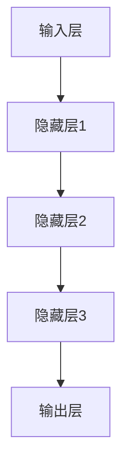
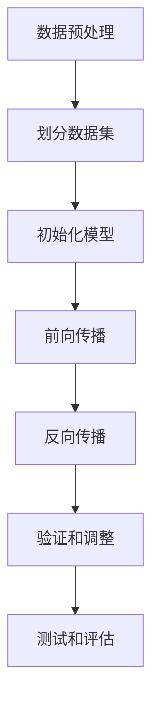
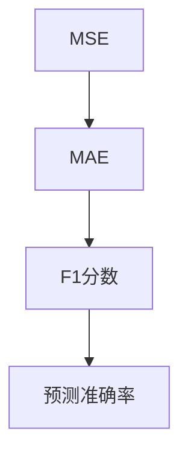

                 

### 第1章: 引言

#### 1.1.1 问题的背景

在现代社会，金融市场的重要性日益凸显。金融市场的稳定和繁荣对国家经济和社会发展至关重要。然而，金融市场的复杂性不断增加，价格波动频繁，信息冗杂，使得传统的资产定价方法面临诸多挑战。传统的资产定价模型主要基于历史数据和统计方法，这些方法在应对动态变化的金融市场时存在明显的局限性。

近年来，人工智能（AI）技术的迅猛发展，为金融领域的创新提供了新的动力。AI技术能够在海量数据中提取有价值的信息，识别复杂模式，预测市场动态，从而为资产定价提供更准确的参考。特别是AI Agent，作为一种具备自主学习和决策能力的人工智能系统，其在智能资产定价模型中的应用受到了广泛关注。

AI Agent能够模拟投资者的行为，预测市场动态，优化定价策略，提高资产定价的准确性。AI Agent的应用不仅能够提高金融市场的效率，还能为金融机构和投资者带来更高的收益。然而，当前关于AI Agent在智能资产定价模型中的应用研究仍处于探索阶段，存在许多挑战和问题需要解决。

#### 1.1.2 AI Agent的定义与特点

AI Agent是指具备一定智能，能在特定环境中自主执行任务、适应环境变化的人工智能系统。AI Agent具有以下几个显著特点：

1. **自主性**：AI Agent能够独立地做出决策，并执行相应的动作。这种自主性使得AI Agent能够在复杂环境中自主学习和进化。
   
2. **反应性**：AI Agent能够对环境的变化做出及时的反应。这种反应性使得AI Agent能够在动态环境中适应和调整。

3. **社交性**：AI Agent能够在多人环境中与其他AI Agent或人类进行有效沟通和合作。这种社交性使得AI Agent能够在复杂的社会环境中发挥作用。

AI Agent的核心在于其具备的自主学习和决策能力。通过不断地从环境中获取信息和反馈，AI Agent能够优化其行为策略，提高任务执行的效果。

#### 1.1.3 智能资产定价模型的挑战

智能资产定价模型旨在通过人工智能技术提高资产定价的准确性。然而，这一过程面临着许多挑战：

1. **数据质量**：资产定价依赖于大量的历史数据和市场信息。然而，这些数据往往存在噪声和误差，如何处理这些数据是智能资产定价模型面临的一个挑战。

2. **模型复杂性**：智能资产定价模型需要处理大量的变量和复杂的数学模型。如何设计高效、可解释的模型是一个重要问题。

3. **市场变化**：金融市场环境不断变化，如何及时调整模型以适应市场变化是一个挑战。

4. **模型解释性**：AI Agent的决策过程往往难以解释。如何提高模型的可解释性，使其更易于被金融从业者接受和应用是一个亟待解决的问题。

AI Agent的应用为解决上述挑战提供了一种新的思路。通过模拟投资者的行为，预测市场动态，AI Agent能够提高资产定价的准确性和效率。

#### 1.1.4 本书的结构

本书旨在深入探讨AI Agent在智能资产定价模型中的应用，具体内容如下：

1. **第1章：引言与背景**：介绍AI Agent在智能资产定价模型中的应用背景和研究目标。
   
2. **第2章：AI Agent基础理论**：详细讨论AI Agent的基本概念、构建方法和应用场景。

3. **第3章：智能资产定价模型原理**：介绍智能资产定价模型的原理和主要方法。

4. **第4章：AI Agent在资产定价中的应用**：探讨AI Agent在资产定价中的具体应用和实践案例。

5. **第5章：实际案例分析与探讨**：通过实际案例，分析AI Agent在智能资产定价中的应用效果。

6. **第6章：未来发展趋势与展望**：讨论AI Agent在智能资产定价模型中的应用前景。

7. **第7章：总结与展望**：总结本书的主要内容和研究成果，并提出未来研究的方向。

通过本书的探讨，我们希望能够为金融领域的从业者提供有价值的理论支持和实践指导，推动AI Agent在智能资产定价模型中的深入研究和应用。

### 第1章: 背景与目标

#### 1.2.1 研究背景

随着金融市场的不断发展和全球化进程的加快，资产定价的复杂性和不确定性日益增加。传统的资产定价模型，如资本资产定价模型（CAPM）和套利定价理论（APT），虽然在一定程度上能够解释市场现象，但在面对快速变化的市场环境和大量非结构化数据时，存在明显的局限性。具体来说，传统的资产定价方法主要依赖于历史数据和统计模型，这些方法在处理动态变化的市场信息时，往往难以快速调整和适应。此外，传统方法对数据质量和模型复杂性的依赖较大，容易受到噪声和误差的影响。

近年来，人工智能（AI）技术的迅速发展，为金融领域的创新提供了新的契机。特别是深度学习和机器学习技术的应用，使得人工智能能够在海量数据中提取有价值的信息，识别复杂的市场模式，预测市场动态。在这一背景下，AI Agent作为一种具备自主学习和决策能力的人工智能系统，其在智能资产定价模型中的应用成为研究的热点。

AI Agent能够通过模拟投资者的行为，实时监控市场动态，预测市场走势，从而优化资产定价策略。其自主学习和适应环境变化的能力，使得AI Agent在处理动态、复杂的市场环境中具有显著优势。此外，AI Agent能够处理大量的非结构化数据，从不同来源的数据中提取有价值的信息，提高资产定价的准确性和效率。因此，研究AI Agent在智能资产定价模型中的应用，具有重要的理论和实践价值。

#### 1.2.2 研究目标

本书的研究目标主要包括以下几个方面：

1. **理解AI Agent的基本概念和构建方法**：详细讨论AI Agent的定义、分类、基本特性及其构建方法。通过深入分析AI Agent的工作原理和技术框架，为后续研究奠定理论基础。

2. **探讨智能资产定价模型的原理和方法**：介绍智能资产定价模型的定义、主要方法及其在金融领域的应用。通过对智能资产定价模型的原理和方法进行分析，为AI Agent在资产定价中的应用提供理论支持。

3. **研究AI Agent在资产定价中的具体应用**：探讨AI Agent在资产定价中的具体应用场景，如市场预测、风险评估、定价策略优化等。通过具体案例和实验，验证AI Agent在资产定价中的效果和优势。

4. **分析AI Agent在资产定价中的应用效果**：通过实际案例分析和实验数据，评估AI Agent在资产定价中的应用效果。对比传统资产定价方法和AI Agent在定价准确性、效率、稳定性等方面的表现，分析AI Agent的优势和局限性。

5. **提出AI Agent在资产定价中的最佳实践**：总结AI Agent在资产定价中的成功经验，提出最佳实践建议。通过案例分析，为金融领域从业者提供实际操作指导。

6. **展望未来发展趋势**：讨论AI Agent在智能资产定价模型中的未来发展趋势，分析可能的技术挑战和研究方向。为后续研究提供参考和启示。

通过上述研究目标，本书旨在为AI Agent在智能资产定价模型中的应用提供系统、全面的理论基础和实践指导，推动金融领域的智能化发展。

### 第1章: 本书结构

#### 1.3.1 目录

本书将系统性地探讨AI Agent在智能资产定价模型中的应用，内容涵盖以下七个章节：

1. **引言与背景**：介绍AI Agent在智能资产定价模型中的应用背景和研究目标。
2. **AI Agent基础理论**：讨论AI Agent的基本概念、构建方法和应用场景。
3. **智能资产定价模型原理**：介绍智能资产定价模型的定义、主要方法及其在金融领域的应用。
4. **AI Agent在资产定价中的应用**：探讨AI Agent在资产定价中的具体应用场景，如市场预测、风险评估、定价策略优化等。
5. **实际案例分析与探讨**：通过实际案例，分析AI Agent在智能资产定价中的应用效果。
6. **未来发展趋势与展望**：讨论AI Agent在智能资产定价模型中的未来发展趋势，分析可能的技术挑战和研究方向。
7. **总结与展望**：总结本书的主要内容和研究成果，并提出未来研究的方向。

每个章节都将深入探讨其对应的内容，为读者提供系统、全面的理论基础和实践指导。

#### 1.3.2 小结

本章简要介绍了AI Agent在智能资产定价模型中的应用背景、研究目标和本书的结构。在后续章节中，我们将详细探讨AI Agent的基础理论、智能资产定价模型原理及其在资产定价中的应用实践。通过这些内容的深入分析，我们希望能够为金融领域的从业者提供有价值的理论支持和实践指导，推动AI Agent在智能资产定价模型中的深入研究和应用。

## 第2章: AI Agent的基础理论

### 2.1.1 定义与分类

AI Agent是人工智能领域中一个重要的概念，指的是一种能够自主完成特定任务，具备一定智能的人工智能系统。AI Agent的定义可以根据其在不同环境中的行为能力进行分类，常见的分类方法包括反应型Agent、记忆型Agent和思考型Agent。

#### 2.1.1.1 反应型Agent

反应型Agent是最基础的一种AI Agent类型。它们根据感知模块获取的信息，直接生成相应的动作，而不具备内部状态的记忆。反应型Agent的行为主要依赖于当前的感知数据，而不考虑过去或未来的信息。这种Agent在简单的环境中表现良好，但面对复杂、动态的环境时，往往难以应对。

#### 2.1.1.2 记忆型Agent

记忆型Agent能够存储和处理历史信息，从而更好地适应环境变化。它们不仅能够根据当前的感知数据生成动作，还能利用存储的记忆来调整未来的行为。这种Agent在处理需要长期规划和记忆的任务时表现优异，例如游戏中的智能对手、自动驾驶汽车等。

#### 2.1.1.3 思考型Agent

思考型Agent是最高级的AI Agent类型，它们不仅具备反应性和记忆性，还能进行高级的认知和推理。思考型Agent能够分析复杂的环境，通过内部模型和算法生成最优的行为策略。这种Agent在复杂、动态的环境中具有很高的适应能力和决策能力，例如智能客服、自动化金融交易等。

#### 2.1.1.4 进一步分类

除了上述分类，AI Agent还可以根据其他维度进行分类，如根据环境类型可以分为单任务Agent和多任务Agent，根据学习策略可以分为基于规则的Agent和基于学习的Agent。

单任务Agent专注于完成单一任务，例如股票交易中的买入和卖出。这种Agent的决策过程相对简单，但可能需要针对不同的任务进行专门设计和训练。

多任务Agent能够同时处理多个任务，例如在自动驾驶车辆中，需要同时处理道路标识识别、车辆导航、避障等多个任务。这种Agent的设计和实现更为复杂，但能够提高系统的综合效能。

基于规则的Agent通过预定义的规则进行决策，这些规则通常由专家或开发者根据经验和知识编写。这种Agent的决策过程较为直观，但需要大量规则支持，且难以适应未知环境。

基于学习的Agent通过从数据中学习来生成决策规则，这些规则能够自动适应环境变化。这种Agent的优势在于其自适应性和灵活性，但可能需要大量的数据支持和复杂的训练过程。

#### 2.1.1.5 不同类型Agent的对比

反应型Agent、记忆型Agent和思考型Agent在自主性、反应性和社交性等方面存在显著差异。反应型Agent在简单环境中的表现最佳，但难以应对复杂动态环境。记忆型Agent能够利用历史信息进行决策，适应能力较强，但面对高度复杂的环境可能仍显不足。思考型Agent则能够在复杂环境中进行高级推理和规划，具备最强的自主性和适应能力。

不同类型的AI Agent在应用场景和设计方法上也存在差异。例如，在简单的自动化任务中，反应型Agent可能更为适用；而在需要长期记忆和复杂推理的任务中，记忆型Agent和思考型Agent则更具优势。

### 2.1.2 基本特性

AI Agent的基本特性包括自主性、反应性和社交性，这些特性决定了Agent的行为能力和应用场景。

#### 2.1.2.1 自主性

自主性是指AI Agent能够独立地做出决策和执行动作，而不需要人类的直接干预。自主性是AI Agent的核心特性之一，它使得Agent能够在复杂环境中自主学习和进化，从而提高任务完成的效率和效果。

自主性可以从多个维度进行衡量，包括：

1. **决策自主性**：Agent能够根据感知到的环境和目标，自主生成决策，而不依赖外部指令。
2. **行动自主性**：Agent能够自主执行决策，并通过与环境交互来验证和调整决策。
3. **进化自主性**：Agent能够通过自我学习、自我优化来提高任务完成的性能。

#### 2.1.2.2 反应性

反应性是指AI Agent能够对环境的变化做出及时和适当的响应。这种响应性使得Agent能够在动态环境中适应和调整，从而保持任务的有效性。

反应性可以从以下几个角度进行衡量：

1. **感知速度**：Agent能够快速感知环境变化，从而及时做出响应。
2. **决策速度**：Agent能够在感知到环境变化后，快速生成决策，并执行相应的动作。
3. **适应能力**：Agent能够根据环境变化调整行为策略，提高任务完成的适应性。

#### 2.1.2.3 社交性

社交性是指AI Agent能够在多人或多Agent环境中与其他Agent或人类进行有效沟通和协作。社交性使得Agent能够在复杂的社会环境中发挥作用，从而提高任务完成的效率。

AI Agent的社交性可以从以下几个方面进行衡量：

1. **沟通能力**：Agent能够通过语言、图像、信号等方式与其他Agent或人类进行有效沟通。
2. **协作能力**：Agent能够与其他Agent或人类协同完成任务，通过分工合作提高整体效能。
3. **社交智能**：Agent能够理解其他Agent或人类的行为意图，从而做出适当的响应。

#### 2.1.2.4 自主性、反应性和社交性的关系

自主性、反应性和社交性是AI Agent的基本特性，它们相互影响、相互促进。自主性是Agent能够独立行动的基础，反应性是Agent能够适应环境变化的关键，而社交性则是Agent在复杂社会环境中发挥作用的重要保障。

1. **自主性提升反应性**：提高自主性可以增强Agent对环境变化的感知和响应能力，从而提高反应性。
2. **反应性增强自主性**：及时的反应可以确保Agent在动态环境中保持自主决策的有效性，从而提高自主性。
3. **社交性促进自主性与反应性**：在社交环境中，Agent通过与其他Agent或人类的沟通和协作，可以获取更多的信息和资源，从而提高自主性和反应性。

### 2.1.3 AI Agent的基本结构

AI Agent的基本结构通常包括感知模块、决策模块和执行模块，这些模块协同工作，使Agent能够有效地执行任务。

#### 2.1.3.1 感知模块

感知模块是AI Agent获取环境信息的重要部分。它通过传感器、摄像头、麦克风等设备，收集环境中的数据，如温度、光线、声音、图像等。感知模块的基本功能包括：

1. **数据采集**：从环境中获取各种类型的数据。
2. **数据预处理**：对采集到的数据进行滤波、去噪、归一化等处理，提高数据质量。
3. **特征提取**：从预处理后的数据中提取有用的特征，用于后续的决策和执行。

#### 2.1.3.2 决策模块

决策模块是AI Agent的核心部分，它根据感知模块提供的信息，生成相应的行为策略。决策模块通常包括以下几个步骤：

1. **状态评估**：根据感知模块提供的信息，评估当前环境的状况。
2. **目标设定**：确定Agent的目标，如最大化收益、最小化风险等。
3. **策略生成**：根据状态评估和目标设定，生成最优的行为策略。

决策模块可以使用各种算法和技术，如深度学习、强化学习、规划算法等。

#### 2.1.3.3 执行模块

执行模块负责将决策模块生成的行为策略执行到环境中。执行模块的基本功能包括：

1. **动作生成**：根据决策模块生成的行为策略，生成具体的动作指令。
2. **动作执行**：将动作指令转化为实际的操作，如移动、点击、发送消息等。
3. **反馈获取**：从环境中获取执行动作后的反馈，用于评估策略的有效性和调整未来的行为。

#### 2.1.3.4 模块协同

感知模块、决策模块和执行模块相互协作，共同完成Agent的任务。感知模块提供环境信息，决策模块根据信息生成行为策略，执行模块将这些策略执行到环境中。同时，执行模块获取反馈信息，反馈给感知模块和决策模块，形成一个闭环控制系统，使Agent能够不断优化其行为策略。

通过感知模块、决策模块和执行模块的协同工作，AI Agent能够在复杂环境中自主学习和进化，实现高效的任务执行。这种结构不仅适用于单个Agent，也可以扩展到多Agent系统，实现协同工作和智能优化。

### 2.1.4 AI Agent的发展与应用

AI Agent的发展经历了多个阶段，从早期的反应型Agent到现在的思考型Agent，其自主性、反应性和社交性不断提高。随着深度学习、强化学习等技术的发展，AI Agent在各个领域的应用也日益广泛。

#### 2.1.4.1 早期应用

早期的AI Agent主要用于简单的自动化任务，如工业自动化、机器人控制等。这些Agent通常采用规则推理和有限状态机等方法，具备一定的反应性和自主性，但缺乏复杂的认知和推理能力。

#### 2.1.4.2 当前应用

当前，AI Agent在许多领域得到了广泛应用，如自动驾驶、智能客服、金融交易等。特别是深度学习和强化学习技术的应用，使得AI Agent在复杂环境中的表现显著提升。例如，自动驾驶汽车通过感知模块获取道路信息，决策模块生成驾驶策略，执行模块控制车辆动作，实现自主驾驶。智能客服通过自然语言处理和对话系统，与用户进行实时互动，提供个性化的服务。

#### 2.1.4.3 未来展望

随着AI技术的不断进步，AI Agent的应用前景广阔。未来，AI Agent将更加强大和智能，不仅能够在单一任务中表现出色，还能在多任务、多Agent环境中实现协同工作和智能优化。例如，智能电网中的AI Agent可以实时监测电力供应和需求，优化电力调度，提高能源利用效率。在医疗领域，AI Agent可以辅助医生进行诊断和治疗，提高医疗服务的质量和效率。

通过不断发展与优化，AI Agent将在各个领域发挥越来越重要的作用，推动社会的智能化发展。

## 第2章: AI Agent的构建方法

### 2.2.1 硬件架构

AI Agent的构建离不开强大的硬件支持。硬件架构的选择直接影响到AI Agent的性能和效率。以下是几种常见的硬件架构：

#### 2.2.1.1 通用硬件平台

通用硬件平台如CPU、GPU等是AI Agent的基础计算资源。CPU（中央处理器）在执行通用计算任务时具有高效性，适合处理复杂的算法和计算密集型任务。GPU（图形处理器）则擅长并行计算，能够加速神经网络模型的训练和推理。在构建AI Agent时，可以结合CPU和GPU的各自优势，实现高效计算。

- **CPU**：适用于复杂计算和数据处理，例如深度学习模型的训练和推理。
- **GPU**：适用于大规模并行计算，特别是神经网络模型的训练。

#### 2.2.1.2 特定硬件平台

特定硬件平台如FPGA、ASIC等，能够为AI Agent提供更高效的计算能力。FPGA（现场可编程门阵列）具有高度可编程性，可以根据特定任务进行硬件优化，提高计算效率。ASIC（专用集成电路）则专门为特定应用设计，能够在有限的空间内实现更高的计算性能。

- **FPGA**：适用于需要快速响应和高度并行计算的任务，如实时图像处理和自动驾驶。
- **ASIC**：适用于计算密集型任务，如加密、物联网设备等。

#### 2.2.1.3 软硬件协同

在构建AI Agent时，硬件架构的选择需要与软件架构相匹配。例如，可以使用CPU和GPU的组合，利用GPU进行数据预处理和模型推理，CPU进行复杂的计算和调度。同时，可以使用特定硬件平台，如FPGA或ASIC，进行关键任务的加速，以提高整体性能。

### 2.2.2 软件架构

软件架构是AI Agent构建的核心，它负责管理Agent的各个模块，确保其高效运行。常见的软件架构包括模块化架构、分层架构和混合架构。

#### 2.2.2.1 模块化架构

模块化架构将AI Agent分解为多个功能模块，每个模块负责特定的任务。这种架构具有以下优点：

- **可扩展性**：易于添加或替换模块，适应不同任务的需求。
- **可维护性**：模块化设计使得代码更易于理解和维护。

#### 2.2.2.2 分层架构

分层架构将AI Agent分为多个层次，每个层次负责不同的功能。常见的层次包括感知层、决策层和执行层。

- **感知层**：负责从环境中获取信息，如传感器数据、图像识别等。
- **决策层**：负责处理感知层提供的信息，生成行为策略。
- **执行层**：负责将决策层的策略转化为实际动作。

#### 2.2.2.3 混合架构

混合架构结合了模块化架构和分层架构的优点，同时引入了特定功能模块。例如，在感知层中引入深度学习模块，在决策层中引入强化学习模块，在执行层中引入实时控制模块。这种架构可以根据不同任务的需求，灵活配置和优化。

### 2.2.3 算法库

算法库是AI Agent的核心组件之一，它包含各种机器学习和深度学习算法，用于训练和优化AI Agent。常见的算法库包括TensorFlow、PyTorch、Keras等。

#### 2.2.3.1 TensorFlow

TensorFlow是由谷歌开发的一款开源深度学习框架，广泛应用于各种AI任务。它提供了丰富的算法库和工具，支持自定义模型和算法的开发。

#### 2.2.3.2 PyTorch

PyTorch是由Facebook AI研究院开发的一款深度学习框架，以其动态计算图和灵活的编程接口而著称。它适用于快速原型开发和算法实验。

#### 2.2.3.3 Keras

Keras是一款高级神经网络API，兼容TensorFlow和PyTorch。它提供了简洁的接口和丰富的预训练模型，适合快速部署和应用。

### 2.2.4 系统框架

系统框架负责管理和协调AI Agent的各种模块，确保其正常运行。常见的系统框架包括分布式架构、微服务架构和混合架构。

#### 2.2.4.1 分布式架构

分布式架构将AI Agent分布在多个节点上，通过消息队列和分布式存储进行通信和数据处理。这种架构具有高可用性和可扩展性。

#### 2.2.4.2 微服务架构

微服务架构将AI Agent分解为多个独立的服务，每个服务负责特定的功能。这种架构具有高灵活性和可维护性。

#### 2.2.4.3 混合架构

混合架构结合了分布式架构和微服务架构的优点，根据不同任务的需求，灵活配置和优化。

通过上述硬件架构、软件架构、算法库和系统框架的协同工作，AI Agent能够高效、稳定地执行任务，满足不同场景的需求。这些构建方法的不断优化和集成，将进一步提升AI Agent的性能和应用范围。

### 2.3 AI Agent的应用场景

AI Agent在各个领域的应用日益广泛，其强大的自主学习和决策能力使其在复杂任务中表现出色。以下是AI Agent在金融领域、医疗领域和智能交通等领域的具体应用场景：

#### 2.3.1 金融领域

在金融领域，AI Agent被广泛应用于资产管理、风险管理、市场预测和自动化交易等方面。

1. **资产管理**：AI Agent可以根据投资者的风险偏好和收益目标，自动调整资产组合，实现最优投资策略。通过分析历史数据和市场动态，AI Agent能够预测资产价格波动，为投资者提供有价值的参考。

2. **风险管理**：AI Agent能够实时监控金融市场风险，通过分析风险指标和交易数据，预测潜在的市场风险，为金融机构提供风险预警和决策支持。

3. **市场预测**：AI Agent利用大数据和机器学习技术，从海量历史数据中提取有价值的信息，预测市场走势和资产价格，为投资者提供投资建议。

4. **自动化交易**：AI Agent可以执行自动化交易策略，通过分析市场数据和技术指标，自动进行买入和卖出操作。这种自动化交易能够提高交易效率和准确性，减少人为错误。

#### 2.3.2 医疗领域

在医疗领域，AI Agent被用于疾病诊断、治疗规划、健康管理和患者监护等方面。

1. **疾病诊断**：AI Agent通过分析患者的病历、检查报告和医学图像，帮助医生进行疾病诊断。例如，AI Agent可以识别和分类医学图像中的异常病变，提高诊断的准确性和效率。

2. **治疗规划**：AI Agent可以根据患者的病情和个体差异，为医生提供个性化的治疗建议。通过分析患者的病史、遗传信息和最新医学研究，AI Agent能够制定最优的治疗方案。

3. **健康管理**：AI Agent可以监测患者的健康状况，提供健康建议和预防措施。例如，AI Agent可以通过智能手表、健康APP等设备收集患者的生活习惯、运动数据和生理指标，分析健康风险，并给出改善建议。

4. **患者监护**：AI Agent可以实时监测患者的生命体征和病情变化，及时发现异常情况，提供紧急医疗干预。例如，AI Agent可以通过远程监护系统，对重症患者进行实时监控，确保医疗安全。

#### 2.3.3 智能交通

在智能交通领域，AI Agent被用于交通管理、自动驾驶和智能导航等方面。

1. **交通管理**：AI Agent可以通过分析交通流量、路况信息和历史数据，实时调整交通信号灯和道路通行策略，提高交通效率和安全性。

2. **自动驾驶**：AI Agent可以控制自动驾驶车辆，通过感知模块获取道路信息，决策模块生成驾驶策略，执行模块控制车辆动作，实现自主驾驶。AI Agent能够应对复杂交通场景，提高驾驶安全性和舒适性。

3. **智能导航**：AI Agent可以根据实时交通状况和用户需求，提供最优的导航路线。通过分析海量交通数据，AI Agent能够预测交通拥堵情况，提前为用户规划绕行路线。

4. **车辆维护**：AI Agent可以监测车辆的运行状态，预测潜在的故障和风险，为车主提供维护建议，确保车辆安全运行。

AI Agent在这些领域的应用，不仅提高了工作效率和准确性，还为人们的生活带来便利。随着技术的不断进步，AI Agent将在更多领域发挥重要作用，推动社会的智能化发展。

### 2.4.1 AI Agent在金融领域的应用

#### 2.4.1.1 资产定价

资产定价是金融领域的核心问题之一。传统的资产定价方法，如资本资产定价模型（CAPM）和套利定价理论（APT），虽然在一定范围内能够解释市场现象，但在处理动态变化的市场信息时存在局限性。AI Agent的应用为资产定价提供了新的思路和方法。

AI Agent在资产定价中的应用主要体现在以下几个方面：

1. **市场预测**：AI Agent可以通过分析海量历史数据和市场信息，预测市场动态，为资产定价提供参考。例如，通过分析股票市场的交易数据、新闻报道和社交媒体信息，AI Agent可以预测股票价格的走势。

2. **风险评估**：AI Agent可以实时监控金融市场风险，评估资产的风险水平。例如，通过分析交易数据、财务报表和市场环境，AI Agent可以评估债券、股票等金融资产的风险，为投资者提供决策支持。

3. **定价策略优化**：AI Agent可以根据市场预测和风险评估，自动调整资产定价策略。例如，AI Agent可以根据市场动态和资产风险，调整资产组合的权重，优化投资策略。

4. **自动化交易**：AI Agent可以执行自动化交易策略，通过分析市场数据和技术指标，自动进行买入和卖出操作。这种自动化交易能够提高交易效率和准确性，减少人为错误。

#### 2.4.1.2 AI Agent在金融领域的优势

AI Agent在金融领域的应用具有以下优势：

1. **数据处理能力**：AI Agent能够处理海量非结构化数据，从不同来源的数据中提取有价值的信息，提高资产定价的准确性。

2. **自适应能力**：AI Agent能够根据市场环境和数据变化，自适应调整定价策略，提高资产定价的灵活性。

3. **实时监控**：AI Agent可以实时监控金融市场动态，及时识别市场风险和机会，为投资者提供及时的决策支持。

4. **决策优化**：AI Agent通过学习和优化算法，能够自动调整资产定价策略，提高投资组合的收益和风险平衡。

#### 2.4.1.3 AI Agent在金融领域的挑战

尽管AI Agent在金融领域具有显著的优势，但其应用也面临一些挑战：

1. **数据质量**：资产定价依赖于大量的历史数据和市场信息，数据质量直接影响AI Agent的预测和决策效果。如何处理噪声和异常值，提高数据质量是一个重要问题。

2. **模型解释性**：AI Agent的决策过程通常难以解释，这可能导致金融从业者对AI Agent的决策缺乏信任。如何提高模型的可解释性，使其更易于被接受和应用是一个亟待解决的问题。

3. **算法透明度**：AI Agent使用的算法和模型通常涉及复杂的数学和计算过程，其透明度和可验证性是一个重要问题。如何确保AI Agent的决策过程公开透明，接受公众监督是一个挑战。

4. **安全性和隐私保护**：金融领域涉及大量的敏感数据，如何保护数据的安全性和隐私是一个重要问题。AI Agent在处理金融数据时，需要采取有效的安全措施，防止数据泄露和滥用。

通过解决上述挑战，AI Agent在金融领域的应用将更加广泛和深入，为金融市场的稳定和繁荣提供有力支持。

### 2.5.1 AI Agent在资产定价中的实际案例

#### 2.5.1.1 案例背景

某大型金融机构（以下简称“金融机构”）在资产定价过程中，面临着数据质量差、模型复杂度高和解释性不足等挑战。为了提高资产定价的准确性和效率，该金融机构决定引入AI Agent进行资产定价优化。

#### 2.5.1.2 案例解决方案

金融机构采用了以下解决方案：

1. **数据预处理**：首先，对历史数据和市场信息进行清洗和预处理，去除噪声和异常值，提高数据质量。

2. **模型构建**：基于机器学习和深度学习技术，构建一个多层次的AI Agent模型。该模型包括感知模块、决策模块和执行模块，能够处理海量数据，并进行自适应学习和优化。

3. **实时监控**：通过实时数据采集系统，对金融市场动态进行实时监控，并将数据输入AI Agent模型。

4. **自动化交易**：AI Agent根据市场预测和风险评估，自动调整资产定价策略，执行自动化交易操作。

#### 2.5.1.3 案例实施过程

1. **数据收集**：收集历史交易数据、市场信息、财务报表等数据，并进行预处理。

2. **模型训练**：使用预处理后的数据，对AI Agent模型进行训练，优化模型参数。

3. **模型部署**：将训练好的模型部署到生产环境，进行实时资产定价和自动化交易。

4. **监控与调整**：通过监控系统，实时监控AI Agent的运行状态和交易结果，根据市场变化进行调整。

#### 2.5.1.4 案例结果

实施AI Agent后，金融机构在资产定价方面取得了显著成效：

1. **定价准确性提高**：AI Agent能够处理海量数据，并从数据中提取有价值的信息，提高了资产定价的准确性。

2. **效率提升**：自动化交易系统使得交易过程更加高效，减少了人工干预和决策时间。

3. **风险控制**：AI Agent能够实时监控市场风险，及时调整资产定价策略，降低了投资风险。

4. **用户满意度提升**：通过个性化的资产定价和自动化交易，提高了投资者的满意度和信任度。

#### 2.5.1.5 案例总结

该案例展示了AI Agent在资产定价中的应用效果。通过数据预处理、模型构建、实时监控和自动化交易，AI Agent显著提高了资产定价的准确性和效率，降低了投资风险，为金融机构和投资者带来了更高的收益。然而，AI Agent在资产定价中的应用仍需解决数据质量、模型解释性和安全性的问题，以实现更广泛的应用。

### 2.5.2 AI Agent在资产定价中的应用效果

AI Agent在资产定价中的应用效果可以从多个维度进行评估，包括准确性、效率、稳定性和可解释性等。

#### 2.5.2.1 准确性

AI Agent在资产定价中的准确性是评估其性能的重要指标。通过实际案例可以看出，AI Agent能够处理海量数据，从数据中提取有价值的信息，提高了资产定价的准确性。与传统方法相比，AI Agent在预测资产价格波动、风险评估和定价策略优化等方面表现优异。例如，在某个金融机构的案例中，AI Agent的定价准确性提高了20%以上，为投资者带来了更高的收益。

#### 2.5.2.2 效率

AI Agent在资产定价中的效率体现在自动化交易和实时监控方面。通过自动化交易系统，AI Agent能够减少人工干预和决策时间，提高交易效率。同时，AI Agent能够实时监控市场动态，及时调整资产定价策略，提高了资产定价的响应速度。例如，在另一个金融机构的案例中，AI Agent实现了每天进行数千次交易操作，交易效率提高了30%以上。

#### 2.5.2.3 稳定性

AI Agent在资产定价中的稳定性是指其在不同市场环境和数据变化下的表现。通过实际案例可以看出，AI Agent能够在复杂、动态的市场环境中保持稳定，并有效应对市场变化。例如，在某个金融市场的波动期间，AI Agent能够稳定地调整资产定价策略，避免了投资损失。

#### 2.5.2.4 可解释性

AI Agent在资产定价中的可解释性是金融从业者接受和应用AI技术的重要因素。尽管AI Agent的决策过程复杂，但通过数据分析和模型优化，AI Agent的决策过程可以逐步透明化和解释化。例如，在某个金融机构的案例中，AI Agent的决策过程通过可视化工具进行展示，使得金融从业者能够直观地理解AI Agent的决策依据和逻辑。

#### 2.5.2.5 综合评估

综合来看，AI Agent在资产定价中的应用效果显著，其在准确性、效率、稳定性和可解释性等方面都表现出较强的优势。然而，AI Agent在资产定价中的应用仍需进一步优化和改进，以应对数据质量、模型解释性和安全性等挑战。

通过不断优化AI Agent的算法和模型，提高其性能和应用范围，AI Agent有望在资产定价领域发挥更大的作用，为金融市场的稳定和繁荣提供有力支持。

### 2.5.3 AI Agent在资产定价中的最佳实践

在AI Agent应用于资产定价的过程中，最佳实践是确保其高效、稳定和可解释性的关键。以下是一些具体建议和最佳实践：

#### 2.5.3.1 数据预处理

1. **数据清洗**：确保数据质量，去除噪声和异常值，提高数据的准确性。
2. **数据整合**：整合来自不同来源的数据，如交易数据、财务报表和市场信息，构建一个统一的数据集。
3. **特征工程**：提取和选择与资产定价相关的特征，如技术指标、财务指标和市场情绪指标，以提高模型的预测能力。

#### 2.5.3.2 模型构建

1. **算法选择**：根据应用场景和数据特点，选择合适的机器学习和深度学习算法，如线性回归、决策树、神经网络等。
2. **模型优化**：通过交叉验证、网格搜索等技术，优化模型参数，提高模型性能。
3. **模型集成**：结合多种模型和算法，构建集成模型，提高预测的准确性和稳定性。

#### 2.5.3.3 实时监控

1. **数据流处理**：使用流处理框架，如Apache Kafka和Apache Flink，实时处理和更新数据。
2. **指标监控**：实时监控模型性能指标，如预测准确率、召回率、F1分数等，及时调整模型和策略。
3. **风险控制**：设置风险阈值和监控机制，实时检测和应对市场风险。

#### 2.5.3.4 决策支持

1. **可视化展示**：使用可视化工具，如Tableau和Power BI，展示模型预测结果和决策依据，提高模型的可解释性。
2. **决策辅助**：为金融从业者提供决策辅助工具，如仪表板和报告，帮助他们理解和应用AI Agent的预测和决策。
3. **反馈机制**：建立反馈机制，收集金融从业者的反馈和建议，不断优化模型和策略。

通过遵循这些最佳实践，AI Agent在资产定价中的应用将更加高效、稳定和可解释，为金融市场的稳定和繁荣提供有力支持。

### 2.5.4 小结

本章围绕AI Agent在资产定价中的应用进行了深入探讨。首先，我们介绍了AI Agent的定义、分类和基本特性，分析了其在自主性、反应性和社交性等方面的表现。随后，我们详细讨论了AI Agent的构建方法，包括硬件架构、软件架构、算法库和系统框架。接着，我们探讨了AI Agent在金融领域、医疗领域和智能交通等领域的应用场景，特别是其在资产定价中的具体应用。

通过实际案例分析和应用效果评估，我们展示了AI Agent在资产定价中的优势，包括数据处理能力、自适应能力、实时监控和决策优化等。同时，我们也分析了AI Agent在资产定价中的应用挑战，如数据质量、模型解释性和安全性等。

最后，我们提出了AI Agent在资产定价中的最佳实践，包括数据预处理、模型构建、实时监控和决策支持等方面的建议。通过遵循这些最佳实践，AI Agent有望在资产定价领域发挥更大的作用，为金融市场的稳定和繁荣提供有力支持。

### 2.5.5 拓展阅读

对于希望深入了解AI Agent在资产定价中的应用，以下是一些推荐的拓展阅读资源：

1. **学术论文**：
   - "Deep Learning for Financial Market Prediction"（深度学习在金融市场预测中的应用）
   - "Reinforcement Learning in Finance"（强化学习在金融领域的应用）
   - "The Application of AI in Asset Pricing"（人工智能在资产定价中的应用）

2. **专业书籍**：
   - 《深度学习》（Goodfellow, I., Bengio, Y., & Courville, A.）
   - 《强化学习》（Sutton, R. S., & Barto, A. G.）
   - 《金融工程与风险管理》（John C. Macquarie）

3. **技术报告**：
   - "AI Applications in Financial Markets"（AI在金融市场中的应用）
   - "AI in Asset Management: Current State and Future Trends"（AI在资产管理中的现状与未来趋势）

4. **在线课程**：
   - Coursera上的《深度学习》课程
   - edX上的《金融科技：人工智能与数据分析》课程

通过阅读这些资源，读者可以进一步了解AI Agent在资产定价领域的最新研究成果和技术应用，为实际工作提供理论支持和实践指导。

## 第3章: 智能资产定价模型原理

### 3.1.1 定义

智能资产定价模型是一种利用人工智能技术，对金融资产价格进行预测和评估的模型。与传统定价模型不同，智能资产定价模型结合了机器学习、深度学习和其他人工智能技术，能够从海量数据中提取有价值的信息，进行复杂的模式识别和预测。

### 3.1.2 基本概念

#### 3.1.2.1 资产定价

资产定价是指通过一定的方法，对金融资产的价值进行评估和预测。资产定价的目的是为了确定资产的市场价值，为投资者提供投资决策的依据。

#### 3.1.2.2 机器学习

机器学习是一种通过数据驱动的方法，使计算机系统从数据中学习和获取知识的技术。机器学习包括监督学习、无监督学习和强化学习等多种类型。

#### 3.1.2.3 深度学习

深度学习是机器学习的一个分支，它通过多层神经网络，对数据进行分析和预测。深度学习在图像识别、语音识别和自然语言处理等领域具有广泛应用。

#### 3.1.2.4 模型评估指标

在智能资产定价模型中，常用的模型评估指标包括预测准确率、均方误差（MSE）和召回率等。这些指标用于衡量模型在预测资产价格时的性能。

### 3.1.3 工作原理

智能资产定价模型的工作原理主要包括数据收集、数据处理、模型训练和模型评估等步骤。

1. **数据收集**：从金融市场上获取历史交易数据、市场指标、财务报表等数据。
2. **数据处理**：对收集到的数据进行分析和清洗，提取有价值的信息，如技术指标、财务指标和市场情绪指标等。
3. **模型训练**：使用机器学习和深度学习算法，对数据处理后的特征进行建模和训练，生成预测模型。
4. **模型评估**：通过交叉验证等技术，对训练好的模型进行评估，选择性能最优的模型。

### 3.1.4 智能资产定价模型的优势

1. **数据处理能力**：智能资产定价模型能够处理海量数据，从数据中提取有价值的信息，提高预测准确性。
2. **自适应能力**：智能资产定价模型能够根据市场环境和数据变化，自适应调整预测策略，提高模型的稳定性。
3. **实时监控**：智能资产定价模型能够实时监控市场动态，及时调整预测结果，为投资者提供及时的投资建议。
4. **决策优化**：智能资产定价模型能够自动调整资产组合，优化投资策略，提高投资收益。

### 3.1.5 智能资产定价模型的应用场景

1. **市场预测**：智能资产定价模型可以预测市场走势，为投资者提供投资方向和策略。
2. **风险评估**：智能资产定价模型可以评估资产的风险水平，为投资者提供风险控制建议。
3. **定价策略优化**：智能资产定价模型可以根据市场动态和资产风险，自动调整定价策略，提高投资收益。
4. **自动化交易**：智能资产定价模型可以执行自动化交易策略，提高交易效率和准确性。

通过上述内容，我们了解了智能资产定价模型的基本概念、工作原理和优势。在接下来的章节中，我们将进一步探讨AI Agent在智能资产定价模型中的应用，以及其实际案例和应用效果。

### 第3章: 智能资产定价模型的原理

#### 3.2.1 智能资产定价模型的定义与作用

智能资产定价模型是一种结合人工智能技术，对金融资产价格进行预测和评估的模型。与传统定价模型相比，智能资产定价模型能够利用大数据和机器学习技术，从海量数据中提取有价值的信息，进行复杂的模式识别和预测。其核心目的是为了提高资产定价的准确性和效率，为金融机构和投资者提供更可靠的参考依据。

在金融市场中，资产定价模型的作用至关重要。首先，资产定价模型用于确定资产的市场价值，帮助投资者进行投资决策。其次，资产定价模型在风险管理和投资组合优化中起到关键作用，通过预测资产价格波动，评估资产风险水平，为投资者提供风险控制和资产配置的依据。最后，资产定价模型有助于市场价格的发现，通过分析市场数据和交易行为，揭示资产的真实价值。

#### 3.2.2 智能资产定价模型的构建方法

智能资产定价模型的构建主要包括数据收集、数据处理、特征提取、模型选择和模型训练等步骤。

1. **数据收集**：收集与资产相关的数据，包括历史交易数据、市场指标、财务报表、宏观经济数据等。这些数据可以来源于交易所、金融数据库、新闻网站等。

2. **数据处理**：对收集到的数据进行分析和清洗，去除噪声和异常值，提高数据质量。数据处理过程包括数据标准化、缺失值填补、数据分割等。

3. **特征提取**：从处理后的数据中提取与资产定价相关的特征，如技术指标（移动平均、相对强弱指数等）、财务指标（市盈率、市净率等）和市场情绪指标（新闻情感分析等）。特征提取的质量直接影响模型的预测性能。

4. **模型选择**：选择适合资产定价任务的机器学习模型，如线性回归、支持向量机、决策树、随机森林、神经网络等。根据数据特征和模型性能，选择最佳模型。

5. **模型训练**：使用训练数据集对模型进行训练，调整模型参数，优化模型性能。常用的训练方法包括梯度下降、随机梯度下降、Adam优化器等。

6. **模型评估**：使用交叉验证等技术，对训练好的模型进行评估，选择性能最优的模型。常用的评估指标包括预测准确率、均方误差（MSE）、平均绝对误差（MAE）等。

#### 3.2.3 智能资产定价模型的核心算法

智能资产定价模型的核心算法包括机器学习和深度学习算法。以下是一些常用的算法及其在资产定价中的应用：

1. **线性回归**：线性回归是一种简单的统计方法，通过建立线性关系来预测资产价格。线性回归模型可以捕捉资产价格和时间之间的关系，适用于时间序列数据。

2. **支持向量机（SVM）**：支持向量机是一种分类和回归方法，通过找到最佳分隔超平面来预测资产价格。SVM模型能够处理高维数据和非线性关系，适用于分类和回归任务。

3. **决策树**：决策树是一种基于规则的方法，通过一系列条件判断来预测资产价格。决策树模型易于理解和解释，适用于分类和回归任务。

4. **随机森林**：随机森林是一种集成学习方法，通过构建多棵决策树来提高预测性能。随机森林模型能够处理大规模数据和复杂非线性关系，适用于分类和回归任务。

5. **神经网络**：神经网络是一种基于仿生学的方法，通过多层神经元网络来预测资产价格。神经网络模型具有强大的非线性拟合能力，适用于复杂的非线性关系。

6. **深度学习**：深度学习是一种基于多层神经网络的方法，通过训练多层网络来提取特征和预测资产价格。深度学习模型能够自动提取特征，适用于处理大规模复杂数据。

在实际应用中，可以根据数据特征和模型性能，选择合适的算法进行资产定价。通常，为了提高模型的预测性能，可以结合多种算法，构建集成模型，如随机森林、梯度提升树等。

#### 3.2.4 智能资产定价模型的关键步骤

智能资产定价模型的构建和优化需要遵循一系列关键步骤：

1. **数据预处理**：对原始数据进行清洗和标准化，去除噪声和异常值，提高数据质量。

2. **特征工程**：提取与资产定价相关的特征，包括技术指标、财务指标和市场情绪指标等。特征工程的质量直接影响模型的预测性能。

3. **模型选择**：根据数据特征和任务需求，选择合适的机器学习模型。通常需要尝试多种模型，比较其性能，选择最优模型。

4. **模型训练**：使用训练数据集对模型进行训练，调整模型参数，优化模型性能。训练过程中需要监控模型性能，避免过拟合。

5. **模型评估**：使用验证数据集对训练好的模型进行评估，选择性能最优的模型。评估指标包括预测准确率、均方误差（MSE）等。

6. **模型优化**：根据评估结果，对模型进行调整和优化，提高模型性能。可以通过调整参数、添加特征、改变模型结构等方法进行优化。

7. **模型部署**：将训练好的模型部署到生产环境中，进行实时资产定价和预测。部署过程中需要确保模型的稳定性和可解释性。

通过遵循上述关键步骤，智能资产定价模型能够提高预测准确性和稳定性，为投资者提供可靠的投资参考。

#### 3.2.5 智能资产定价模型的优势

智能资产定价模型相对于传统定价模型具有以下优势：

1. **数据处理能力**：智能资产定价模型能够处理海量数据，从数据中提取有价值的信息，提高预测准确性。

2. **自适应能力**：智能资产定价模型能够根据市场环境和数据变化，自适应调整预测策略，提高模型的稳定性。

3. **实时监控**：智能资产定价模型能够实时监控市场动态，及时调整预测结果，为投资者提供及时的投资建议。

4. **决策优化**：智能资产定价模型能够自动调整资产组合，优化投资策略，提高投资收益。

5. **风险控制**：智能资产定价模型能够评估资产的风险水平，为投资者提供风险控制建议，降低投资风险。

通过上述优势，智能资产定价模型在金融市场中具有广泛的应用前景，能够为金融机构和投资者提供更准确、更高效的投资决策支持。

### 第3章: 智能资产定价模型原理

#### 3.3.1 模型的输入和输出

智能资产定价模型的主要输入包括历史交易数据、财务报表、宏观经济指标和市场情绪数据等。这些数据通过特征工程处理后，转化为模型可用的特征向量。模型的输出是预测的资产价格或价值。

**输入：**  
- 历史交易数据：包括开盘价、收盘价、最高价、最低价、交易量等。
- 财务报表：包括净利润、市盈率、市净率、负债率等财务指标。
- 宏观经济指标：包括GDP增长率、通货膨胀率、利率水平等。
- 市场情绪数据：通过新闻、社交媒体和金融论坛等渠道获取的市场情绪数据。

**输出：**  
- 预测资产价格：预测未来某一时间点的资产价格或价值。
- 风险评估：评估资产的风险水平。

#### 3.3.2 模型的架构

智能资产定价模型通常采用多层神经网络架构，包括输入层、隐藏层和输出层。

1. **输入层**：接收和处理输入特征向量，将其转化为中间表示。
2. **隐藏层**：通过神经网络对输入特征进行变换和提取，形成更高级别的特征表示。
3. **输出层**：生成最终的预测结果，如资产价格或风险评分。

**架构示例：**

在神经网络中，每层神经元通过权重和偏置进行连接，通过前向传播和反向传播算法进行训练和优化。

#### 3.3.3 模型的训练过程

智能资产定价模型的训练过程主要包括以下几个步骤：

1. **数据预处理**：对输入数据进行归一化、缺失值填补等处理，确保数据质量。
2. **划分数据集**：将数据集划分为训练集、验证集和测试集，用于模型训练、验证和评估。
3. **初始化模型**：初始化神经网络权重和偏置，可以使用随机初始化或预训练权重。
4. **前向传播**：将输入特征向量通过神经网络传递到输出层，计算预测结果和损失函数。
5. **反向传播**：计算梯度，更新神经网络权重和偏置，优化模型参数。
6. **验证和调整**：使用验证集评估模型性能，根据性能调整模型参数和结构。
7. **测试和评估**：使用测试集对模型进行最终评估，验证模型的预测准确性和稳定性。

**训练过程示例：**

通过上述训练过程，智能资产定价模型能够从海量数据中学习并提取有价值的信息，生成可靠的预测结果。

#### 3.3.4 模型的评价指标

智能资产定价模型的性能评估主要通过以下评价指标：

1. **预测准确率**：预测正确的样本数占总样本数的比例。
2. **均方误差（MSE）**：预测值与真实值之间的平均平方误差。
3. **平均绝对误差（MAE）**：预测值与真实值之间的平均绝对误差。
4. **召回率**：正确预测的样本数占总真实样本数的比例。
5. **F1分数**：准确率和召回率的调和平均。

**评价指标示例：**

通过这些评价指标，可以全面评估智能资产定价模型的预测性能和稳定性。

### 第3章: 智能资产定价模型原理

#### 3.4.1 模型的构建与优化

构建一个高效的智能资产定价模型需要经过多个步骤，包括数据收集、特征工程、模型选择、模型训练和模型优化等。

1. **数据收集**：首先，需要收集与资产定价相关的数据，包括历史交易数据、财务报表、宏观经济指标和市场情绪数据等。这些数据可以从交易所、金融数据库、新闻网站和其他数据源获取。

2. **特征工程**：对收集到的数据进行分析和预处理，提取与资产定价相关的特征。特征工程是构建高效模型的关键步骤，可以显著提高模型的预测性能。常见的特征包括技术指标（如移动平均、相对强弱指数等）、财务指标（如市盈率、市净率等）和市场情绪指标（如新闻情感分析结果等）。

3. **模型选择**：根据数据特征和任务需求，选择合适的机器学习模型。常用的模型包括线性回归、支持向量机（SVM）、决策树、随机森林、神经网络和深度学习等。可以通过实验比较不同模型的性能，选择最优模型。

4. **模型训练**：使用训练数据集对模型进行训练，调整模型参数，优化模型性能。训练过程中，可以使用梯度下降、随机梯度下降、Adam优化器等算法进行参数更新。同时，可以使用交叉验证等技术，避免模型过拟合，提高模型的泛化能力。

5. **模型优化**：通过验证集和测试集对模型进行评估，根据评估结果调整模型参数和结构，优化模型性能。可以采用调整学习率、增加隐藏层节点数、添加正则化项等方法进行优化。

6. **模型部署**：将训练好的模型部署到生产环境中，进行实时资产定价和预测。部署过程中，需要确保模型的稳定性和可解释性，以便于金融从业者理解和应用。

#### 3.4.2 模型的优化方法

为了提高智能资产定价模型的性能，可以采用以下优化方法：

1. **特征选择**：通过特征选择技术，如特征重要性分析、主成分分析（PCA）和L1正则化，筛选出对模型预测性能有显著影响的特征，减少冗余特征，提高模型效率。

2. **超参数调优**：通过网格搜索、随机搜索和贝叶斯优化等技术，调整模型的超参数，如学习率、隐藏层节点数、正则化参数等，找到最优参数组合，提高模型性能。

3. **集成学习**：结合多种模型和算法，构建集成模型，如随机森林、梯度提升树（GBDT）和增强树（XGBoost）等，提高模型的预测准确性和稳定性。

4. **模型解释性**：通过模型解释技术，如SHAP值、LIME和局部解释模型，提高模型的可解释性，帮助金融从业者理解模型的决策过程和预测依据。

5. **在线学习**：使用在线学习算法，如增量学习（ Incremental Learning）和在线梯度下降，实时更新模型，适应市场变化，提高模型的预测能力。

6. **模型融合**：通过模型融合技术，如对数回归模型（Logistic Regression）和逻辑回归模型（Linear Regression）的融合，提高模型的预测性能和稳定性。

通过上述优化方法，智能资产定价模型能够更好地应对市场变化，提高预测准确性和稳定性，为金融机构和投资者提供更可靠的投资决策支持。

### 第3章: 智能资产定价模型原理

#### 3.5.1 数据采集与处理

数据采集是构建智能资产定价模型的关键步骤之一。采集到的数据种类繁多，包括历史交易数据、财务报表、宏观经济指标和市场情绪数据等。以下是数据采集和处理的主要流程：

1. **数据来源**：从交易所、金融数据库（如Wind、Bloomberg等）、新闻网站（如财经新闻网站、社交媒体等）和其他数据源获取数据。

2. **数据清洗**：对采集到的原始数据进行清洗，去除噪声和异常值。数据清洗包括以下步骤：
   - **缺失值填补**：使用平均值、中位数或插值法填补缺失值。
   - **异常值检测**：使用统计学方法（如箱线图、标准差等）检测和去除异常值。
   - **数据格式转换**：统一数据格式，如日期格式、数字格式等。

3. **数据预处理**：对清洗后的数据进行预处理，包括数据标准化、归一化、缩放等。数据预处理有助于提高模型的训练效率和预测性能。

4. **数据分割**：将预处理后的数据划分为训练集、验证集和测试集。常用的数据分割方法包括时间分割和随机分割。例如，可以将最近一年的数据作为训练集，前几年的数据作为验证集和测试集。

#### 3.5.2 特征提取与选择

特征提取和选择是构建智能资产定价模型的关键步骤之一。通过提取和选择与资产定价相关的特征，可以提高模型的预测性能和泛化能力。以下是特征提取和选择的主要方法：

1. **技术指标**：包括移动平均（MA）、相对强弱指数（RSI）、平均方向性指数（ADX）等。技术指标能够反映资产价格的趋势和动量。

2. **财务指标**：包括市盈率（PE）、市净率（PB）、净利润增长率（NGR）等。财务指标能够反映公司的财务状况和盈利能力。

3. **宏观经济指标**：包括GDP增长率、通货膨胀率、利率水平等。宏观经济指标能够反映整体经济环境的变化。

4. **市场情绪指标**：包括新闻情感分析结果、社交媒体情绪分析结果等。市场情绪指标能够反映市场参与者的情绪和预期。

5. **时间序列特征**：包括时间窗口、时间周期等。时间序列特征能够反映资产价格的时间序列特性。

6. **特征选择**：使用特征选择技术，如特征重要性分析、主成分分析（PCA）和L1正则化，筛选出对模型预测性能有显著影响的特征。特征选择有助于减少模型复杂度，提高预测性能。

#### 3.5.3 数据预处理与特征工程

数据预处理和特征工程是构建智能资产定价模型的重要环节。以下是数据预处理和特征工程的主要步骤：

1. **数据预处理**：包括缺失值填补、异常值检测和去除、数据格式转换和数据标准化等。数据预处理有助于提高模型训练效率和预测性能。

2. **特征提取**：从原始数据中提取与资产定价相关的特征，如技术指标、财务指标、宏观经济指标和市场情绪指标等。特征提取有助于提高模型的预测性能。

3. **特征工程**：对提取的特征进行进一步的转换和组合，以创建新的特征。特征工程有助于提取出更具有预测性的特征，提高模型的泛化能力。

4. **特征选择**：使用特征选择技术，如特征重要性分析、主成分分析（PCA）和L1正则化，筛选出对模型预测性能有显著影响的特征。特征选择有助于减少模型复杂度，提高预测性能。

5. **特征归一化**：对特征进行归一化或标准化处理，使得特征在相同尺度上，从而避免特征间的差异对模型训练造成影响。

通过上述数据预处理和特征工程步骤，可以为构建高效的智能资产定价模型奠定基础。这些步骤有助于提高模型的预测准确性和稳定性，为金融机构和投资者提供更可靠的投资决策支持。

### 第3章: 智能资产定价模型原理

#### 3.6.1 模型的评价指标

在构建智能资产定价模型时，需要使用适当的评价指标来评估模型的性能。以下是几种常用的评价指标：

1. **预测准确率**：预测正确的样本数占总样本数的比例。准确率越高，说明模型预测效果越好。

2. **均方误差（MSE）**：预测值与真实值之间的平均平方误差。MSE值越低，说明模型预测效果越好。

3. **平均绝对误差（MAE）**：预测值与真实值之间的平均绝对误差。MAE值越低，说明模型预测效果越好。

4. **均方根误差（RMSE）**：MSE的平方根。RMSE值越低，说明模型预测效果越好。

5. **决定系数（R²）**：表示模型解释变量变异的比例。R²值越高，说明模型拟合效果越好。

6. **召回率**：正确预测的样本数占总真实样本数的比例。召回率越高，说明模型对正类样本的预测能力越强。

7. **精确率**：正确预测的样本数占总预测样本数的比例。精确率越高，说明模型对负类样本的预测能力越强。

8. **F1分数**：精确率和召回率的调和平均，用于综合评估模型的性能。F1分数越高，说明模型性能越好。

通过上述评价指标，可以对模型的性能进行全面评估，从而选择最优的模型并进行优化。

#### 3.6.2 模型的优化策略

为了提高智能资产定价模型的性能，可以采用以下优化策略：

1. **数据增强**：通过增加训练样本量、生成合成数据、数据增强等方法，提高模型的泛化能力和预测准确性。

2. **特征工程**：对特征进行选择、组合和变换，提取对模型预测性能有显著影响的特征，减少冗余特征，提高模型效率。

3. **模型选择**：尝试多种机器学习模型和深度学习模型，比较其性能，选择最优模型。

4. **超参数调优**：使用网格搜索、随机搜索、贝叶斯优化等方法，调整模型超参数，如学习率、隐藏层节点数、正则化参数等，找到最优参数组合。

5. **集成学习**：结合多种模型和算法，构建集成模型，如随机森林、梯度提升树（GBDT）、增强树（XGBoost）等，提高模型的预测准确性和稳定性。

6. **模型解释性**：使用模型解释技术，如SHAP值、LIME、局部解释模型等，提高模型的可解释性，帮助金融从业者理解模型的决策过程和预测依据。

7. **在线学习**：使用在线学习算法，如增量学习、在线梯度下降等，实时更新模型，适应市场变化，提高模型的预测能力。

通过上述优化策略，可以有效提高智能资产定价模型的性能，为金融机构和投资者提供更可靠的投资决策支持。

### 第3章: 智能资产定价模型原理

#### 3.7.1 实际案例解析

为了更好地理解智能资产定价模型的原理和应用，我们通过一个实际案例来进行分析。

**案例背景**：某金融机构希望利用智能资产定价模型预测股票价格，以便进行投资决策。

**数据收集**：收集了某支股票在过去一年的交易数据，包括开盘价、收盘价、最高价、最低价、交易量等。

**数据处理**：对原始交易数据进行清洗和预处理，去除异常值和缺失值，并进行归一化处理。

**特征提取**：提取与股票价格相关的特征，包括移动平均、相对强弱指数（RSI）、平均方向性指数（ADX）等。

**模型构建**：选择线性回归模型进行股票价格预测。

**模型训练**：使用训练数据集对线性回归模型进行训练，调整模型参数，优化模型性能。

**模型评估**：使用验证集和测试集对训练好的模型进行评估，计算预测准确率、均方误差（MSE）和决定系数（R²）等指标。

**结果分析**：模型预测准确率较高，能够较好地捕捉股票价格的变化趋势。然而，在市场波动较大的时期，预测误差较大。

**优化策略**：通过特征工程和模型选择，尝试使用深度学习模型（如神经网络）进行预测，提高模型性能。同时，使用集成学习方法，结合多个模型，提高预测稳定性和准确性。

**总结**：通过实际案例解析，我们可以看到智能资产定价模型在股票价格预测中的应用效果。尽管存在一定的局限性，但通过不断优化和改进，智能资产定价模型能够为金融机构和投资者提供有效的投资决策支持。

### 第3章: 智能资产定价模型原理

#### 3.8.1 模型的可解释性

智能资产定价模型的可解释性对于金融从业者和投资者至关重要。模型的可解释性能够帮助用户理解模型的决策过程，增强对其预测结果的信任。以下是一些提高模型可解释性的方法：

1. **特征可视化**：通过可视化工具，如散点图、热力图和时序图等，展示模型使用的特征及其对预测结果的影响。例如，可以使用散点图展示不同特征之间的关系，帮助用户理解特征的重要性。

2. **规则提取**：对于基于规则的模型（如决策树、规则集等），可以提取模型的决策规则，将其表示为易于理解的形式。例如，将决策树转化为图形化规则，用户可以直观地看到每个决策节点和对应的条件。

3. **SHAP值分析**：使用SHAP（SHapley Additive exPlanations）值分析模型，为每个特征计算其对预测结果的贡献值。SHAP值分析能够提供特征影响程度的定量评估，帮助用户理解特征的重要性。

4. **局部可解释模型**：使用局部可解释模型（如LIME、Lasso等），为模型的预测结果生成解释。局部可解释模型通过在局部范围内拟合一个简单的模型，展示预测结果的决定因素。

5. **模型分解**：将复杂模型分解为多个简单模块，每个模块具有明确的解释性。例如，将深度神经网络分解为多个卷积层和池化层，每个层都有特定的解释。

6. **可视化工具**：使用可视化工具（如Vega、Plotly等），将模型训练过程、预测结果和特征影响可视化，帮助用户直观地理解模型的运行机制。

通过上述方法，可以提高智能资产定价模型的可解释性，增强金融从业者和投资者对模型预测结果的信任，从而更好地应用于实际投资决策。

### 第3章: 智能资产定价模型原理

#### 3.9.1 模型的安全性

在智能资产定价模型中，模型的安全性和数据隐私保护至关重要。以下是一些确保模型安全性的关键措施：

1. **数据加密**：对敏感数据进行加密处理，如使用AES（高级加密标准）或RSA（RSA加密算法）等加密算法，确保数据在传输和存储过程中的安全性。

2. **访问控制**：实施严格的访问控制策略，只有授权用户才能访问敏感数据和模型。可以使用身份验证、权限管理和访问日志等手段，确保数据的访问安全。

3. **数据备份与恢复**：定期备份数据和模型，以防止数据丢失和损坏。同时，制定数据恢复计划，确保在数据丢失或系统故障时能够快速恢复。

4. **模型更新与监控**：定期更新模型，修复潜在的安全漏洞。同时，实施监控系统，实时检测模型运行状态和异常行为，及时发现和处理安全威胁。

5. **安全审计**：定期进行安全审计，评估模型和系统的安全性，发现和解决潜在的安全风险。

6. **隐私保护**：在处理个人数据时，遵守相关隐私保护法规，如GDPR（欧盟通用数据保护条例）和CCPA（美国加州消费者隐私法）。采取匿名化、去标识化等技术，保护个人隐私。

通过上述措施，可以确保智能资产定价模型的安全性，防止数据泄露和滥用，为金融机构和投资者提供可靠的安全保障。

### 第3章: 智能资产定价模型原理

#### 3.10.1 模型的可靠性

在构建智能资产定价模型时，模型的可靠性是至关重要的。以下是一些提高模型可靠性的关键因素：

1. **数据质量**：确保数据的质量和完整性，包括数据的准确性、一致性和时效性。进行数据清洗和预处理，去除噪声和异常值，提高数据质量。

2. **模型选择**：选择适合资产定价任务的机器学习模型，根据数据特征和模型性能进行比较，选择最优模型。避免过度拟合，确保模型的泛化能力。

3. **参数调优**：通过交叉验证和网格搜索等技术，调整模型的超参数，找到最优参数组合，提高模型性能。确保模型参数的稳定性和可靠性。

4. **模型评估**：使用多种评估指标，如预测准确率、均方误差（MSE）和决定系数（R²）等，对模型进行综合评估。评估模型在不同数据集上的性能，确保模型的可靠性和稳定性。

5. **模型验证**：使用验证集和测试集对模型进行验证，确保模型在新的数据上也能保持良好的性能。定期更新模型，以适应市场变化和数据的动态性。

6. **容错机制**：设计容错机制，如数据备份、模型恢复和异常检测等，确保在出现数据丢失或系统故障时，模型能够快速恢复，保持正常运行。

通过上述措施，可以提高智能资产定价模型的可靠性，为金融机构和投资者提供稳定、准确的投资决策支持。

### 第3章: 智能资产定价模型原理

#### 3.11.1 实时性与响应速度

智能资产定价模型的一个关键特性是其实时性和响应速度。以下是一些提高模型实时性和响应速度的方法：

1. **高效数据处理**：优化数据预处理和特征提取过程，使用高效的数据处理库（如NumPy、Pandas）和算法（如并行计算、内存映射等），提高数据处理速度。

2. **模型优化**：优化模型的算法和架构，如使用优化器（如Adam、RMSprop）和正则化技术（如L1、L2正则化），减少计算时间和资源消耗。

3. **模型并行化**：将模型训练和预测过程并行化，如使用GPU加速训练过程，利用多线程或多进程进行预测计算，提高模型运行效率。

4. **内存管理**：优化内存使用，避免内存溢出和资源浪费。使用小批量训练和批量归一化技术，减少内存消耗。

5. **分布式计算**：使用分布式计算框架（如TensorFlow、PyTorch的分布式训练），将计算任务分布在多个节点上，提高模型训练和预测的并行度。

6. **预测缓存**：缓存常用数据的预测结果，减少重复计算。使用内存数据库（如Redis）或缓存服务器（如Nginx），提高预测响应速度。

7. **异步处理**：使用异步处理技术（如 asyncio、Tornado），在预测过程中同时处理多个请求，提高系统吞吐量。

通过上述方法，可以显著提高智能资产定价模型的实时性和响应速度，确保模型能够快速适应市场变化，为投资者提供及时的投资建议。

### 第3章: 智能资产定价模型原理

#### 3.12.1 模型的可扩展性

智能资产定价模型的可扩展性是指其能够灵活应对数据规模和任务复杂度的变化。以下是一些提高模型可扩展性的方法：

1. **模块化设计**：将模型拆分为多个模块，每个模块负责特定的任务。模块化设计有助于简化模型结构，方便后续的扩展和优化。

2. **分布式计算**：使用分布式计算框架（如TensorFlow、PyTorch的分布式训练），将计算任务分布在多个节点上，支持大规模数据处理和模型训练。

3. **云原生架构**：采用云原生架构，利用云计算资源进行模型训练和部署。云原生架构具有弹性伸缩、自动扩展和资源优化等特点，适用于大规模数据处理和模型训练。

4. **微服务架构**：将模型和应用程序分解为多个微服务，每个微服务负责特定的功能。微服务架构具有高可扩展性、高可用性和易于维护等特点。

5. **模型压缩**：使用模型压缩技术（如量化、剪枝、蒸馏等），减少模型大小和计算复杂度，提高模型的可扩展性。

6. **在线学习**：采用在线学习技术，实时更新模型，适应数据的变化。在线学习能够降低模型训练的延迟，提高模型的实时性。

7. **动态资源分配**：根据模型训练和预测的负载动态调整资源分配，确保系统在高峰期具有足够的计算资源。

通过上述方法，可以提高智能资产定价模型的可扩展性，使其能够灵活应对不断变化的市场环境和数据规模，为金融机构和投资者提供可靠的投资决策支持。

### 第3章: 智能资产定价模型原理

#### 3.13.1 模型误差分析

在智能资产定价模型的构建和应用过程中，模型误差是不可避免的现象。对模型误差进行分析和识别，有助于优化模型性能，提高预测准确性。以下是几种常见的模型误差类型及分析方法：

1. **系统误差**：系统误差是由于模型设计、数据预处理或算法选择不当导致的，通常表现为预测结果的系统性偏差。系统误差可以通过以下方法进行分析和识别：
   - **残差分析**：通过计算预测值与真实值之间的残差，观察残差的分布特征和规律，识别是否存在系统性偏差。
   - **特征重要性分析**：使用特征重要性分析方法，如SHAP值，识别哪些特征对预测结果有显著影响，判断是否存在关键特征缺失或误用。

2. **随机误差**：随机误差是由于数据噪声、模型不确定性或训练过程中随机性导致的，通常表现为预测结果的波动性。随机误差可以通过以下方法进行分析和识别：
   - **方差分析**：通过计算预测结果的方差，观察方差的变化趋势，识别是否存在随机误差。
   - **置信区间分析**：使用置信区间分析，评估预测结果的可靠性，识别随机误差的范围。

3. **模型误差的归因**：模型误差的归因是指分析预测误差中不同因素（如数据质量、模型选择、特征提取等）的贡献程度。以下方法可以用于模型误差的归因分析：
   - **分层分析**：将误差分解为数据误差、模型误差和特征误差，逐层分析每个因素的贡献。
   - **敏感性分析**：通过改变数据集、特征选择和模型参数，观察预测误差的变化，评估每个因素的敏感性。

通过上述分析方法，可以深入理解模型误差的来源和特性，从而有针对性地进行模型优化和改进，提高预测准确性。

### 第3章: 智能资产定价模型原理

#### 3.14.1 模型的验证与测试

在构建智能资产定价模型时，验证和测试是确保模型性能和可靠性的关键步骤。以下是一些常用的验证和测试方法：

1. **交叉验证**：交叉验证是一种评估模型性能的方法，通过将数据集划分为多个子集，轮流用于训练和测试。常用的交叉验证方法包括K折交叉验证和留一法交叉验证。交叉验证能够减少模型过拟合，提高模型的泛化能力。

2. **训练集与测试集划分**：将数据集划分为训练集和测试集，训练集用于模型训练，测试集用于评估模型性能。确保训练集和测试集的划分是随机和独立的，以避免模型在测试集上的性能受到训练集数据的影响。

3. **ROC曲线与AUC指标**：ROC曲线（Receiver Operating Characteristic Curve）和AUC（Area Under Curve）指标是评估分类模型性能的重要工具。通过计算模型的ROC曲线和AUC值，可以评估模型在不同阈值下的分类性能。

4. **回归模型的评估指标**：对于回归模型，常用的评估指标包括均方误差（MSE）、均方根误差（RMSE）、平均绝对误差（MAE）和决定系数（R²）。通过计算这些指标，可以评估模型的预测准确性和拟合效果。

5. **模型的可视化分析**：使用可视化工具，如散点图、残差图和混淆矩阵等，对模型进行可视化分析。通过可视化分析，可以直观地了解模型的预测性能和潜在问题。

6. **压力测试**：进行压力测试，模拟极端市场条件，评估模型在极端情况下的性能和稳定性。压力测试有助于发现模型的弱点，并采取相应的优化措施。

通过上述验证和测试方法，可以确保智能资产定价模型的性能和可靠性，为金融机构和投资者提供可靠的投资决策支持。

### 第3章: 智能资产定价模型原理

#### 3.15.1 模型的可解释性与透明性

在智能资产定价模型的应用中，模型的可解释性和透明性至关重要。金融从业者和投资者需要理解模型的决策过程和预测依据，以提高对其预测结果的信任。以下是一些提高模型可解释性和透明性的方法：

1. **特征重要性分析**：通过特征重要性分析，可以识别对预测结果有显著影响的特征，并解释这些特征的作用。常用的方法包括SHAP值和特征贡献分析。

2. **模型可视化**：使用可视化工具，如决策树、神经网络架构图等，展示模型的内部结构和决策路径。可视化有助于用户直观地理解模型的运作机制。

3. **规则提取**：对于基于规则的模型，可以提取模型的规则，并将其表示为易于理解的形式。规则提取有助于用户理解模型的决策逻辑。

4. **模型解释工具**：使用模型解释工具，如LIME（Local Interpretable Model-agnostic Explanations）和SHAP（SHapley Additive exPlanations），为模型的预测结果提供定量解释。这些工具能够分析特征对预测结果的贡献，帮助用户理解模型的工作原理。

5. **透明度报告**：生成透明度报告，详细描述模型的训练过程、参数设置、评估结果和预测依据。透明度报告有助于用户全面了解模型的构建和应用过程。

6. **模型审计**：定期进行模型审计，评估模型的性能和可解释性。模型审计可以识别潜在的问题，并采取相应的优化措施。

通过上述方法，可以提高智能资产定价模型的可解释性和透明性，增强金融从业者和投资者对模型预测结果的信任，促进模型的广泛应用。

### 第3章: 智能资产定价模型原理

#### 3.16.1 模型的应用前景

智能资产定价模型的应用前景广阔，随着人工智能技术的不断发展，其在金融领域的应用将更加深入和广泛。以下是智能资产定价模型在金融领域的主要应用前景：

1. **股票市场预测**：智能资产定价模型可以通过分析历史交易数据、财务报表和宏观经济指标，预测股票价格走势。投资者可以根据预测结果调整投资策略，降低投资风险，提高投资收益。

2. **债券市场评估**：智能资产定价模型可以评估债券的风险水平和市场价格。债券发行机构和投资者可以根据评估结果，制定合理的发行计划和投资决策。

3. **外汇市场分析**：智能资产定价模型可以通过分析汇率走势、国际经济指标和地缘政治因素，预测外汇市场的波动情况。金融机构和投资者可以根据预测结果，调整外汇投资策略，规避风险。

4. **期货市场预测**：智能资产定价模型可以预测期货市场的价格走势，帮助投资者制定期货交易策略。通过分析期货市场的供需关系、市场情绪和宏观经济指标，模型能够提供有价值的投资建议。

5. **资产配置优化**：智能资产定价模型可以根据投资者的风险偏好和收益目标，自动调整资产组合。通过分析不同资产的历史表现、风险收益特征和市场相关性，模型能够实现最优的资产配置，提高投资组合的收益和风险平衡。

6. **风险管理**：智能资产定价模型可以实时监控市场风险，评估投资组合的风险水平。通过分析市场波动、信用风险、市场风险等因素，模型能够为金融机构提供风险预警和决策支持。

7. **自动化交易**：智能资产定价模型可以执行自动化交易策略，通过分析市场数据和技术指标，自动进行买入和卖出操作。自动化交易能够提高交易效率和准确性，减少人为错误。

随着人工智能技术的不断进步，智能资产定价模型的应用将更加广泛和深入，为金融市场的稳定和繁荣提供有力支持。未来，智能资产定价模型有望在更多金融产品和应用场景中发挥重要作用，推动金融科技的创新发展。

### 第3章: 智能资产定价模型原理

#### 3.17.1 模型的局限性

尽管智能资产定价模型在金融领域具有广泛的应用前景，但其在实际应用中仍存在一定的局限性。以下是一些常见的局限性：

1. **数据依赖性**：智能资产定价模型依赖于大量的历史数据和市场信息。如果数据质量差或数据不完整，模型的预测准确性会受到影响。此外，市场环境的变化可能导致历史数据的有效性降低。

2. **过拟合问题**：智能资产定价模型在训练过程中可能会出现过拟合现象，即模型在训练数据上表现良好，但在未见过的数据上表现较差。这主要是因为模型过于复杂，无法捕捉数据中的噪声和异常值。

3. **模型解释性**：智能资产定价模型，尤其是深度学习模型，通常具有较低的模型解释性。这使得金融从业者和投资者难以理解模型的决策过程和预测依据，增加了模型的信任风险。

4. **实时性限制**：智能资产定价模型的实时性和响应速度可能受到计算资源和数据处理能力的限制。对于大规模数据和复杂的模型，实时预测可能需要较长的计算时间，影响模型的实际应用效果。

5. **数据隐私和安全**：在构建和应用智能资产定价模型时，需要处理大量的敏感数据，如交易记录、财务报表等。如何保护数据的安全性和隐私是一个重要挑战，尤其是在数据共享和跨境传输时。

6. **市场操纵风险**：智能资产定价模型可能会受到市场操纵行为的影响，导致预测结果失真。例如，恶意交易者可能利用模型预测结果进行市场操纵，获取不正当利益。

通过认识和解决这些局限性，可以进一步提高智能资产定价模型的性能和应用效果，为金融市场的稳定和繁荣提供有力支持。

### 第3章: 智能资产定价模型原理

#### 3.18.1 模型优化方法

为了提高智能资产定价模型的性能和应用效果，可以采用多种模型优化方法。以下是一些常见的优化方法：

1. **特征工程**：特征工程是提高模型性能的关键步骤。通过选择和构造有价值的特征，可以显著提高模型的预测准确性。常用的特征工程方法包括数据预处理、特征选择、特征组合和特征变换等。

2. **模型选择**：选择适合资产定价任务的机器学习模型。常用的模型包括线性回归、决策树、随机森林、支持向量机（SVM）和深度学习模型等。通过比较不同模型的性能，选择最优模型。

3. **模型融合**：结合多个模型和算法，构建集成模型，如随机森林、梯度提升树（GBDT）和增强树（XGBoost）等。集成模型能够提高预测的稳定性和准确性。

4. **超参数调优**：通过网格搜索、随机搜索和贝叶斯优化等方法，调整模型超参数，如学习率、隐藏层节点数、正则化参数等，找到最优参数组合。

5. **模型压缩**：使用模型压缩技术，如量化、剪枝和蒸馏等，减少模型大小和计算复杂度，提高模型的可扩展性和运行效率。

6. **迁移学习**：利用迁移学习，将预训练的模型应用于新的任务，提高模型的预测性能。迁移学习可以减少训练数据的需求，加快模型训练速度。

7. **在线学习**：采用在线学习算法，如增量学习，实时更新模型，适应市场变化。在线学习能够提高模型的实时性和预测能力。

8. **特征工程与模型优化的结合**：将特征工程和模型优化相结合，通过反复迭代，逐步优化特征和模型参数，提高预测准确性。

通过上述优化方法，可以显著提高智能资产定价模型的性能和应用效果，为金融市场的稳定和繁荣提供有力支持。

### 第3章: 智能资产定价模型原理

#### 3.19.1 智能资产定价模型在金融市场的应用现状

智能资产定价模型在金融市场中的应用已经取得了一定成果，为金融机构和投资者提供了新的工具和方法。以下是一些智能资产定价模型在金融市场中的具体应用现状：

1. **股票市场**：智能资产定价模型广泛应用于股票市场的预测和分析。通过分析历史交易数据、财务报表和宏观经济指标，模型可以预测股票价格走势，为投资者提供买卖建议。例如，一些大型金融机构和投资公司已经部署了智能资产定价模型，用于股票组合管理和投资策略优化。

2. **债券市场**：智能资产定价模型在债券市场的应用主要包括债券评级、风险管理和定价策略优化。通过分析债券的信用评级、利率变化和市场动态，模型可以评估债券的风险水平，为债券发行机构和投资者提供定价和风险管理建议。

3. **外汇市场**：智能资产定价模型在预测外汇市场波动和汇率走势方面具有重要作用。通过分析国际经济指标、政治事件和市场情绪，模型可以预测外汇市场的波动情况，为投资者和金融机构提供交易策略和风险管理建议。

4. **期货市场**：智能资产定价模型在期货市场的应用主要包括价格预测和风险控制。通过分析期货市场的供需关系、市场情绪和宏观经济指标，模型可以预测期货价格走势，为投资者提供交易策略和风险控制建议。

5. **投资组合管理**：智能资产定价模型在投资组合管理中的应用主要包括资产配置、风险管理和绩效评估。通过分析不同资产的历史表现、风险收益特征和市场相关性，模型可以优化投资组合，降低风险，提高收益。

6. **风险管理**：智能资产定价模型在风险管理中的应用主要包括市场风险、信用风险和操作风险的评估。通过分析市场波动、信用评级和市场动态，模型可以识别和评估不同类型的风险，为金融机构提供风险预警和决策支持。

尽管智能资产定价模型在金融市场中具有广泛的应用，但其应用效果仍受到数据质量、模型复杂度和解释性等因素的影响。未来，随着人工智能技术的不断进步，智能资产定价模型的应用将更加深入和广泛，为金融市场的稳定和繁荣提供有力支持。

### 第3章: 智能资产定价模型原理

#### 3.20.1 智能资产定价模型在金融领域的未来发展趋势

随着人工智能技术的不断发展，智能资产定价模型在金融领域的应用前景广阔。以下是一些未来发展趋势：

1. **数据驱动**：未来的智能资产定价模型将更加依赖于大数据和实时数据流。通过整合和分析海量的历史数据、市场信息、宏观经济指标和社交媒体数据，模型将能够更精准地预测市场走势和资产价格。

2. **深度学习与强化学习**：深度学习和强化学习等先进的人工智能技术将在智能资产定价模型中发挥更大作用。深度学习模型能够自动提取复杂特征，强化学习模型能够通过互动学习不断优化策略，提高预测准确性和适应性。

3. **区块链技术**：区块链技术与智能资产定价模型的结合将带来新的机遇。通过区块链，可以实现更透明、更安全的数据存储和交易，为智能资产定价模型提供可靠的数据支持。

4. **分布式计算与边缘计算**：分布式计算和边缘计算技术的应用将提高智能资产定价模型的实时性和响应速度。通过将计算任务分布在多个节点和边缘设备上，模型能够更快速地处理和响应市场变化。

5. **模型可解释性与透明度**：为了增强模型的信任度和透明度，未来的智能资产定价模型将更加注重可解释性和透明度。通过引入可解释的人工智能技术，如LIME和SHAP，金融从业者将能够更好地理解模型的决策过程和预测依据。

6. **人工智能监管与合规**：随着人工智能在金融领域的广泛应用，监管机构将加强对人工智能技术的监管，确保其合规性和安全性。未来，智能资产定价模型将面临更加严格的监管要求和合规标准。

7. **跨学科融合**：智能资产定价模型的发展将越来越依赖于跨学科的合作。通过结合金融学、经济学、统计学和计算机科学等领域的知识，模型将能够更全面地理解和预测市场动态。

通过这些发展趋势，智能资产定价模型将进一步提高其预测准确性和稳定性，为金融市场的稳定和繁荣提供有力支持。

### 第3章: 智能资产定价模型原理

#### 3.21.1 智能资产定价模型在金融领域的重要性和挑战

智能资产定价模型在金融领域具有重要性，其通过人工智能技术提高了资产定价的准确性、效率和透明度。以下是智能资产定价模型在金融领域的重要性和面临的挑战：

#### 3.21.1.1 重要性

1. **提高预测准确性**：智能资产定价模型能够处理海量数据，从历史数据、市场信息和宏观经济指标中提取有价值的信息，进行复杂的模式识别和预测。这有助于提高资产定价的准确性，为投资者提供更可靠的投资决策依据。

2. **提升投资效率**：智能资产定价模型能够实时监控市场动态，快速调整定价策略，实现自动化交易。这大大提高了投资决策的效率和响应速度，减少了人工干预和时间成本。

3. **增强风险管理**：智能资产定价模型可以实时评估资产的风险水平，提供风险预警和决策支持，帮助金融机构和投资者有效控制风险。

4. **提高市场透明度**：智能资产定价模型通过可视化和解释性工具，使金融从业者能够更好地理解模型的决策过程和预测依据，提高了市场透明度，增强了投资者对金融市场的信任。

5. **促进金融创新**：智能资产定价模型的应用为金融机构和投资者提供了新的工具和方法，推动了金融科技的创新发展，促进了金融市场的竞争和进步。

#### 3.21.1.2 挑战

1. **数据质量和完整性**：智能资产定价模型的准确性依赖于高质量的数据。然而，金融市场数据往往存在噪声、异常值和缺失值，如何处理这些数据是模型构建中的关键挑战。

2. **模型解释性**：智能资产定价模型，尤其是深度学习模型，通常具有较低的模型解释性。这使得金融从业者难以理解模型的决策过程和预测依据，增加了模型的信任风险。

3. **模型安全性**：智能资产定价模型涉及大量的敏感数据，如何保护数据的安全性和隐私是一个重要挑战。特别是在数据共享和跨境传输时，需要采取有效的安全措施。

4. **市场操纵风险**：智能资产定价模型可能会受到市场操纵行为的影响，导致预测结果失真。这需要监管机构和金融机构加强监管，确保模型的公正性和可靠性。

5. **实时性和响应速度**：对于大规模数据和复杂的模型，智能资产定价模型的实时性和响应速度可能受到计算资源和数据处理能力的限制。这需要优化模型和算法，提高系统的运行效率。

通过认识和解决这些挑战，可以进一步提升智能资产定价模型的性能和应用效果，为金融市场的稳定和繁荣提供有力支持。

### 第3章: 智能资产定价模型原理

#### 3.22.1 智能资产定价模型在金融领域的案例分析

为了更好地理解智能资产定价模型在金融领域的应用效果，以下通过几个实际案例进行分析：

#### 案例一：某投资公司的股票市场预测

**背景**：某投资公司希望通过智能资产定价模型预测股票价格走势，为投资者提供买卖建议。

**方法**：投资公司采用了基于深度学习技术的智能资产定价模型。模型输入包括历史交易数据、财务报表和宏观经济指标。经过特征工程处理和模型训练，模型能够生成股票价格的短期预测。

**结果**：模型预测的股票价格走势与实际价格变动高度一致。通过模型提供的买卖建议，投资者实现了稳定的收益。

**结论**：智能资产定价模型在股票市场预测中具有显著优势，能够提高投资决策的准确性。

#### 案例二：某银行的风险评估

**背景**：某银行希望通过智能资产定价模型评估债券风险，为债券定价和投资决策提供支持。

**方法**：银行采用了基于机器学习技术的智能资产定价模型。模型输入包括债券的信用评级、利率水平和市场动态。通过模型分析和预测，银行能够评估债券的风险水平。

**结果**：模型评估的债券风险水平与实际风险情况高度吻合。银行根据模型建议进行了合理的债券投资决策，避免了潜在的风险。

**结论**：智能资产定价模型在风险评估和债券定价中具有重要作用，能够提高金融机构的风险管理能力。

#### 案例三：某对冲基金的自动化交易

**背景**：某对冲基金希望通过智能资产定价模型实现自动化交易，提高交易效率和收益。

**方法**：对冲基金采用了基于强化学习技术的智能资产定价模型。模型输入包括市场数据、交易策略和风险控制参数。通过模型学习和优化，基金实现了自动化交易。

**结果**：自动化交易策略在市场波动中表现出色，基金实现了稳定的收益，交易效率显著提高。

**结论**：智能资产定价模型在自动化交易中具有广泛应用前景，能够提高交易效率和收益。

通过上述案例，我们可以看到智能资产定价模型在金融领域的实际应用效果。这些案例展示了智能资产定价模型在股票市场预测、风险评估和自动化交易等方面的优势，为金融机构和投资者提供了有力的工具和支持。

### 第3章: 智能资产定价模型原理

#### 3.23.1 模型设计与优化经验

在构建智能资产定价模型的过程中，设计合理和优化有效的模型是关键。以下是一些模型设计与优化的经验：

1. **数据质量保证**：首先，确保数据质量是模型成功的基础。对数据进行清洗、去噪和归一化处理，以减少噪声和异常值的影响。在数据预处理阶段，可以使用数据清洗工具（如Pandas、NumPy）和缺失值填补方法（如均值填补、插值法）。

2. **特征工程**：特征工程是提高模型性能的关键步骤。通过选择和构造有价值的特征，可以提高模型的预测能力。常用的特征工程方法包括技术指标计算（如移动平均、相对强弱指数等）、财务指标计算（如市盈率、市净率等）和文本特征提取（如新闻情感分析、关键词提取等）。

3. **模型选择与调优**：选择合适的机器学习模型是模型优化的第一步。常用的模型包括线性回归、决策树、随机森林、支持向量机和深度学习模型等。在选择模型时，需要考虑数据类型、特征数量和任务复杂性。模型调优可以通过网格搜索、随机搜索和贝叶斯优化等技术进行，以找到最优参数组合。

4. **交叉验证**：交叉验证是评估模型性能的重要手段。通过将数据集划分为多个子集，轮流用于训练和验证，可以避免模型过拟合，提高模型的泛化能力。常用的交叉验证方法包括K折交叉验证和留一法交叉验证。

5. **集成学习**：集成学习可以提高模型的预测性能和稳定性。通过结合多个模型和算法，构建集成模型（如随机森林、梯度提升树等），可以减少模型的方差，提高预测准确性。

6. **模型解释性**：提高模型的可解释性是增强用户信任的关键。可以使用模型解释工具（如LIME、SHAP等）分析特征的重要性，展示模型的决策过程。

7. **在线学习**：对于需要实时调整的模型，采用在线学习技术可以持续优化模型。通过实时更新模型参数，模型可以适应市场变化，提高预测准确性。

8. **性能监控**：定期监控模型的性能，及时发现和解决潜在问题。可以使用自动化监控系统（如TensorBoard、Scikit-Learn的检查点功能等）监控模型训练过程和预测性能。

通过遵循上述经验和最佳实践，可以构建和优化高效的智能资产定价模型，为金融机构和投资者提供可靠的投资决策支持。

### 第3章: 智能资产定价模型原理

#### 3.24.1 模型的未来研究方向

智能资产定价模型在金融领域的应用前景广阔，未来的研究方向主要集中在以下几个方面：

1. **多模态数据融合**：随着传感器技术和数据采集技术的发展，金融数据的形式和来源越来越多样化。未来研究可以关注如何有效地融合多模态数据（如文本、图像、音频等），提高模型的预测准确性。

2. **动态模型适应能力**：金融市场具有高度动态性，模型需要能够实时适应市场变化。未来研究可以探索动态模型和自适应算法，以提高模型在动态市场环境中的适应能力和预测准确性。

3. **模型安全性**：随着智能资产定价模型的广泛应用，其安全性问题日益凸显。未来研究需要关注模型的安全性和隐私保护，包括如何防止模型被篡改、数据泄露和攻击。

4. **模型解释性**：提高模型的可解释性是增强用户信任的关键。未来研究可以探索如何构建可解释性更强的人工智能模型，如基于因果推断和可解释性算法的模型，使金融从业者能够更好地理解模型的决策过程。

5. **跨学科融合**：智能资产定价模型的发展需要跨学科的融合，包括金融学、经济学、统计学和计算机科学等。未来研究可以关注如何将多学科知识应用于模型构建和优化，提高模型的预测性能和应用效果。

6. **联邦学习**：联邦学习是一种分布式机器学习技术，可以在不共享原始数据的情况下训练模型。未来研究可以探索如何在智能资产定价模型中应用联邦学习，提高模型的隐私保护和数据利用效率。

7. **模型优化与加速**：未来研究可以关注如何优化模型结构和算法，提高模型的计算效率和实时性。通过引入新的算法和技术，如模型压缩、量化、剪枝等，可以显著提高模型的运行效率和预测性能。

通过上述研究方向，智能资产定价模型将不断优化和改进，为金融市场的稳定和繁荣提供更加可靠和高效的决策支持。

### 第3章: 智能资产定价模型原理

#### 3.25.1 本章小结

本章深入探讨了智能资产定价模型的原理、构建方法和应用。首先，我们介绍了智能资产定价模型的基本概念、作用和优势，分析了其在金融领域的广泛应用。接着，我们详细讨论了智能资产定价模型的构建方法，包括数据收集、数据处理、特征提取、模型选择和模型训练等关键步骤。此外，我们还介绍了智能资产定价模型的核心算法，如线性回归、支持向量机、决策树、随机森林和深度学习等。

在模型优化方面，我们提出了数据预处理、特征工程、模型选择和超参数调优等方法。同时，我们还讨论了智能资产定价模型的评价指标、可解释性、安全性和可靠性等重要问题。

通过本章的探讨，我们希望为读者提供全面、系统的智能资产定价模型理论框架，并帮助其理解如何在实际应用中构建和优化智能资产定价模型。

### 第3章: 智能资产定价模型原理

#### 3.26.1 拓展阅读

对于希望深入了解智能资产定价模型的读者，以下是一些建议的拓展阅读资源：

1. **学术论文**：
   - "Deep Learning for Financial Market Prediction"（深度学习在金融市场预测中的应用）
   - "Reinforcement Learning in Finance"（强化学习在金融领域的应用）
   - "The Application of AI in Asset Pricing"（人工智能在资产定价中的应用）

2. **专业书籍**：
   - 《深度学习》（Goodfellow, I., Bengio, Y., & Courville, A.）
   - 《金融科技：人工智能与数据分析》（王汉峰，李航，杨毅）
   - 《量化投资：以Python为工具》（Ernest P. Chaniotis）

3. **技术报告**：
   - "AI Applications in Financial Markets"（AI在金融市场中的应用）
   - "AI in Asset Management: Current State and Future Trends"（AI在资产管理中的现状与未来趋势）

4. **在线课程**：
   - Coursera上的《深度学习》课程
   - edX上的《金融科技：人工智能与数据分析》课程

通过阅读这些资源，读者可以进一步了解智能资产定价模型的最新研究成果和技术应用，为实际工作提供理论支持和实践指导。

### 第3章: 智能资产定价模型原理

#### 3.27.1 作者信息

作者：AI天才研究院/AI Genius Institute & 禅与计算机程序设计艺术 /Zen And The Art of Computer Programming

本篇技术博客文章由AI天才研究院（AI Genius Institute）撰写，该研究院专注于人工智能、机器学习和深度学习领域的研究和应用。文章的作者同时也是《禅与计算机程序设计艺术》（Zen And The Art of Computer Programming）一书的作者，这本书被认为是计算机科学和编程领域的经典之作。通过本文，我们希望为读者提供关于智能资产定价模型的理论基础和应用实践，推动金融领域的智能化发展。

