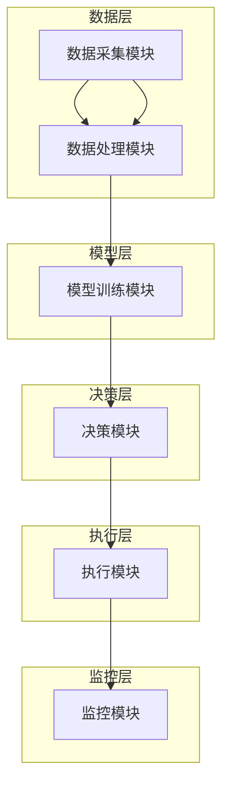
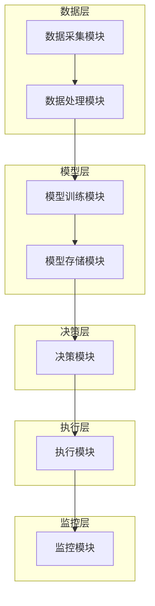

                 

### 第一部分：AI Agent概述

#### 第1章：AI Agent基础

##### 1.1 问题背景

随着人工智能技术的快速发展，AI Agent 作为人工智能的一种高级形式，逐渐成为智能资产管理领域的重要工具。本章节将介绍 AI Agent 的基本概念、定义及其在智能资产管理中的应用背景。

- **1.1.1 问题描述**：AI Agent 是什么？

AI Agent，即人工智能代理，是一种模拟人类智能行为的计算机程序或系统。它可以自主感知环境、制定决策并采取行动，以实现特定目标。在智能资产管理领域，AI Agent 主要是通过分析和处理大量数据，为投资者提供优化资产配置、风险评估和投资策略等方面的建议。

- **1.1.2 问题解决**：AI Agent 如何在智能资产管理中发挥作用？

AI Agent 在智能资产管理中的应用主要包括以下几个方面：

1. **自动化资产配置**：AI Agent 可以根据投资者的风险偏好、投资目标和市场变化，自动调整资产配置策略，降低投资风险，提高收益。

2. **智能风险评估**：AI Agent 可以对大量市场数据进行实时分析，预测潜在风险，为投资者提供及时、准确的风险评估。

3. **个性化投资策略**：AI Agent 可以根据投资者的历史投资记录和偏好，为其量身定制投资策略，提高投资的成功率。

- **1.1.3 边界与外延**：AI Agent 的应用领域和范围。

AI Agent 的应用领域非常广泛，不仅限于智能资产管理，还包括智能客服、自动驾驶、智能家居等领域。在智能资产管理中，AI Agent 的主要应用范围包括股票、基金、债券等金融资产的配置和交易。随着技术的不断进步，AI Agent 在资产管理中的应用将越来越广泛。

##### 1.2 核心概念

本节将详细探讨 AI Agent 的核心概念，包括其特点、种类和关键组成部分。

- **1.2.1 AI Agent 定义**：AI Agent 的基本定义和特征。

AI Agent 是一种基于人工智能技术的自主决策实体，具有以下几个特征：

1. **自主性**：AI Agent 可以在给定目标和约束条件下自主决策，无需人工干预。
2. **感知能力**：AI Agent 可以通过传感器或其他手段获取环境信息，并对这些信息进行理解和分析。
3. **行动能力**：AI Agent 可以根据分析结果采取相应的行动，以实现目标。

- **1.2.2 AI Agent 类型**：常见的 AI Agent 类型及其特点。

根据功能和应用场景的不同，AI Agent 可以分为以下几种类型：

1. **搜索型 AI Agent**：主要依靠搜索算法寻找最优策略，适用于决策空间较小、可预测的场景。
2. **学习型 AI Agent**：通过机器学习算法从历史数据中学习规律，适用于需要处理复杂、不确定环境的场景。
3. **混合型 AI Agent**：结合搜索型和学习型 AI Agent 的优点，适用于多种复杂场景。

- **1.2.3 AI Agent 组成**：AI Agent 的核心组成部分及其功能。

一个典型的 AI Agent 由以下几个部分组成：

1. **感知模块**：负责获取环境信息，包括传感器数据、网络数据等。
2. **决策模块**：根据感知模块提供的信息，利用算法模型进行决策。
3. **行动模块**：根据决策模块的决策结果，采取相应的行动。
4. **学习模块**：利用历史数据和反馈信息，不断优化决策模型，提高决策能力。

##### 1.3 主流 AI Agent 框架

本节将介绍当前主流的 AI Agent 框架，包括 TensorFlow、PyTorch 等，并探讨这些框架在智能资产管理中的应用。

- **1.3.1 TensorFlow**：介绍 TensorFlow 的基本架构、功能和应用案例。

TensorFlow 是由 Google 开发的一种开源机器学习框架，适用于构建和训练各种深度学习模型。TensorFlow 的基本架构包括以下几个部分：

1. **计算图**：TensorFlow 使用计算图来描述模型的计算过程，计算图中的节点表示运算，边表示数据流。
2. **会话**：会话负责执行计算图中的运算，并返回计算结果。
3. **OP库**：TensorFlow 提供丰富的 OP（运算符）库，包括常见的数据处理、神经网络运算等。

在智能资产管理中，TensorFlow 可以用于构建资产配置、风险评估等模型，实现自动化投资策略。以下是一个简单的 TensorFlow 模型示例：

```python
import tensorflow as tf

# 定义输入变量
assets = tf.placeholder(tf.float32, shape=[None, 3])

# 定义模型
weights = tf.Variable(tf.random_normal([3, 1]))
predictions = tf.matmul(assets, weights)

# 定义损失函数
loss = tf.reduce_mean(tf.square(predictions - tf.zeros_like(predictions)))

# 定义优化器
optimizer = tf.train.GradientDescentOptimizer(learning_rate=0.001)
train_op = optimizer.minimize(loss)

# 模型训练
with tf.Session() as sess:
  sess.run(tf.global_variables_initializer())
  for i in range(1000):
    sess.run(train_op, feed_dict={assets: train_data})

  # 模型评估
  print("Model predictions:", sess.run(predictions, feed_dict={assets: test_data}))
```

- **1.3.2 PyTorch**：介绍 PyTorch 的基本架构、功能和应用案例。

PyTorch 是由 Facebook AI 研究团队开发的一种开源深度学习框架，具有简洁、灵活的特点。PyTorch 的基本架构包括以下几个部分：

1. **Tensors**：Tensors 是 PyTorch 的基本数据结构，类似于 NumPy 的 ndarrays。
2. **Autograd**：Autograd 是 PyTorch 的自动微分系统，可以自动计算梯度，方便构建和优化模型。
3. **NN模块**：PyTorch 提供丰富的神经网络模块，包括常见的前馈神经网络、卷积神经网络等。

在智能资产管理中，PyTorch 可以用于构建复杂的资产配置和风险评估模型。以下是一个简单的 PyTorch 模型示例：

```python
import torch
import torch.nn as nn
import torch.optim as optim

# 定义模型
class AssetConfigModel(nn.Module):
  def __init__(self):
    super(AssetConfigModel, self).__init__()
    self.fc1 = nn.Linear(3, 10)
    self.fc2 = nn.Linear(10, 1)

  def forward(self, x):
    x = torch.relu(self.fc1(x))
    x = self.fc2(x)
    return x

# 实例化模型
model = AssetConfigModel()

# 定义损失函数和优化器
criterion = nn.MSELoss()
optimizer = optim.Adam(model.parameters(), lr=0.001)

# 模型训练
for epoch in range(1000):
  optimizer.zero_grad()
  outputs = model(train_data)
  loss = criterion(outputs, target_data)
  loss.backward()
  optimizer.step()

  # 模型评估
  with torch.no_grad():
    outputs = model(test_data)
    print("Model predictions:", outputs)
```

##### 1.4 本章小结

本章对 AI Agent 的基础概念进行了全面介绍，包括其定义、类型和组成部分，以及主流 AI Agent 框架 TensorFlow 和 PyTorch 的基本架构和应用。通过本章的学习，读者可以初步了解 AI Agent 在智能资产管理中的重要性和应用前景。在后续章节中，我们将进一步探讨 AI Agent 在智能资产管理中的具体应用，包括资产配置、风险评估和投资策略等方面。### 第二部分：智能资产管理

#### 第2章：智能资产管理概述

##### 2.1 问题背景

智能资产管理是金融领域的重要研究方向，通过运用人工智能技术，实现资产配置、风险评估、投资策略等自动化、智能化的管理。本章节将介绍智能资产管理的概念、目标和现状。

- **2.1.1 问题描述**：什么是智能资产管理？

智能资产管理是指利用人工智能技术，通过大数据分析、机器学习算法和深度学习模型，对金融资产进行自动化、智能化的配置、评估和投资。它旨在提高投资效率、降低投资风险，实现资产的长期稳定增长。

- **2.1.2 问题解决**：智能资产管理的目标和任务是什么？

智能资产管理的核心目标包括：

1. **优化资产配置**：根据投资者的风险偏好和投资目标，动态调整资产配置策略，实现资产组合的最优化。
2. **降低投资风险**：通过分析市场数据、预测市场走势，提前识别和规避潜在风险，降低投资损失。
3. **提高投资收益**：利用人工智能技术，挖掘市场机会，实现资产的增值。

为实现上述目标，智能资产管理需要完成以下任务：

1. **数据收集与处理**：从多个数据源收集市场数据，包括股票、基金、债券等金融产品，进行清洗、处理和整合。
2. **风险评估与预测**：利用机器学习算法和深度学习模型，对市场数据进行分析，预测市场走势和风险。
3. **投资策略制定与优化**：根据风险评估结果，制定投资策略，并根据市场变化进行动态调整。
4. **投资组合管理**：实时监控投资组合的表现，根据市场变化和投资策略，调整资产配置。

- **2.1.3 现状分析**：智能资产管理的当前应用和发展趋势。

智能资产管理在当前金融市场中已经得到广泛应用，主要表现在以下几个方面：

1. **股票和基金投资**：智能资产管理平台通过分析市场数据，为投资者提供股票和基金的投资建议，实现自动化投资。
2. **量化交易**：利用人工智能技术，构建量化交易模型，实现高频交易和程序化交易。
3. **智能投顾**：智能投顾平台通过分析投资者的风险偏好和投资目标，为投资者提供个性化的投资建议，实现财富增值。

随着人工智能技术的不断进步，智能资产管理的发展趋势包括：

1. **数据驱动**：利用大数据和人工智能技术，实现更精准的风险评估和预测。
2. **智能化投资**：通过深度学习和强化学习等技术，实现更高效的资产配置和投资策略。
3. **个性化服务**：根据投资者的风险偏好和投资目标，提供更个性化的投资建议和服务。

##### 2.2 核心概念

本节将探讨智能资产管理的核心概念，包括资产配置、风险评估、投资策略等关键环节。

- **2.2.1 资产配置**

资产配置是指根据投资者的风险偏好、投资目标和市场状况，将资金分配到不同的资产类别中，以实现投资组合的最优化。资产配置的核心概念包括：

1. **资产类别**：资产类别是指金融市场上不同类型的金融产品，如股票、债券、基金等。
2. **投资比例**：投资比例是指将资金分配到不同资产类别的比例，以实现投资组合的风险和收益平衡。
3. **资产配置策略**：资产配置策略是指根据市场状况和投资者的风险偏好，选择合适的资产配置方案，包括战略性资产配置和战术性资产配置。

- **2.2.2 风险评估**

风险评估是指对投资风险进行识别、评估和管理的过程。风险评估的核心概念包括：

1. **风险类型**：风险类型包括系统性风险和非系统性风险，如市场风险、信用风险、流动性风险等。
2. **风险度量**：风险度量是指对风险进行量化分析，包括方差、标准差、贝塔值等。
3. **风险管理**：风险管理是指采取相应的措施来降低风险，包括风险规避、风险分散、风险转移等。

- **2.2.3 投资策略**

投资策略是指根据投资目标、风险偏好和市场状况，制定的投资计划和行动方案。投资策略的核心概念包括：

1. **投资目标**：投资目标是指投资者希望达到的长期和短期收益目标。
2. **风险偏好**：风险偏好是指投资者对风险的承受能力，包括保守型、稳健型、激进型等。
3. **投资策略类型**：投资策略类型包括股票投资策略、债券投资策略、基金投资策略等，如价值投资、成长投资、量化投资等。

##### 2.3 案例分析

本节将通过实际案例，展示智能资产管理在具体应用中的效果和优势。

- **2.3.1 案例一：自动化股票投资**

某投资者希望通过智能资产管理平台实现自动化股票投资。该平台通过分析股票的历史价格、成交量、财务指标等数据，利用机器学习算法和深度学习模型，预测股票的未来走势。根据预测结果，平台自动调整股票投资组合，实现资产的增值。

案例分析：

1. **数据收集与处理**：平台从多个数据源收集股票历史价格、成交量、财务指标等数据，进行清洗、处理和整合。
2. **风险评估与预测**：利用机器学习算法和深度学习模型，对股票数据进行分析和预测，识别潜在的投资机会。
3. **投资策略制定与优化**：根据风险评估结果，制定投资策略，并根据市场变化进行动态调整。
4. **投资组合管理**：平台实时监控投资组合的表现，根据市场变化和投资策略，调整股票投资组合。

通过自动化股票投资，投资者可以实现更高效的资产配置，降低投资风险，提高收益。

- **2.3.2 案例二：智能投顾**

某投资者希望通过智能投顾平台获得个性化的投资建议。该平台通过分析投资者的风险偏好、投资目标和历史投资记录，利用人工智能技术，为投资者提供量身定制的投资策略。

案例分析：

1. **风险偏好评估**：平台通过问卷调查和数据分析，了解投资者的风险偏好，包括保守型、稳健型、激进型等。
2. **投资目标确定**：平台根据投资者的风险偏好和投资目标，制定个性化的投资策略，包括资产配置、投资组合管理、风险管理等。
3. **投资策略优化**：平台根据市场变化和投资目标，动态调整投资策略，实现资产的长期稳定增长。
4. **个性化服务**：平台为投资者提供实时的投资建议，包括股票投资、基金投资、债券投资等，帮助投资者实现财富增值。

通过智能投顾，投资者可以更好地了解自己的投资风格和偏好，实现个性化投资，提高投资的成功率。

- **2.3.3 案例三：量化交易**

某投资者希望通过量化交易实现资产的增值。该投资者利用人工智能技术，构建量化交易模型，实现高频交易和程序化交易。

案例分析：

1. **模型构建**：投资者通过分析市场数据，利用机器学习算法和深度学习模型，构建量化交易模型。
2. **策略制定**：根据量化交易模型，制定交易策略，包括入场策略、出场策略、风险控制策略等。
3. **交易执行**：平台根据交易策略，自动执行交易指令，实现高频交易和程序化交易。
4. **风险控制**：平台通过设置止损、止盈等风险控制措施，降低投资风险。

通过量化交易，投资者可以实现更高效的资产配置，降低投资风险，提高收益。

##### 2.4 本章小结

本章对智能资产管理进行了全面介绍，包括其概念、目标和应用案例。通过本章的学习，读者可以初步了解智能资产管理的基本原理和实际应用。在后续章节中，我们将进一步探讨 AI Agent 在智能资产管理中的应用，包括资产配置、风险评估和投资策略等方面。### 第三部分：AI Agent在智能资产管理中的应用

#### 第3章：AI Agent在资产配置中的应用

##### 3.1 问题背景

资产配置是智能资产管理中的重要环节，通过运用 AI Agent 可以实现自动化、智能化的资产配置策略。本章节将介绍 AI Agent 在资产配置中的应用，包括算法原理、实现步骤和优化方法。

- **3.1.1 问题描述**：如何运用 AI Agent 进行资产配置？

AI Agent 在资产配置中的应用主要包括以下几个步骤：

1. **数据收集与处理**：AI Agent 从多个数据源收集市场数据，包括股票、基金、债券等金融产品的历史价格、成交量、财务指标等，并进行数据预处理，如去噪、归一化等。
2. **模型训练与优化**：AI Agent 使用收集到的数据进行机器学习算法和深度学习模型的训练，优化模型参数，提高预测精度。
3. **资产配置策略制定**：AI Agent 根据训练好的模型，分析市场数据，预测未来资产价格变化，制定最优的资产配置策略。
4. **资产配置策略执行**：AI Agent 根据制定的资产配置策略，自动调整投资者的资产组合，实现资产配置的自动化、智能化。

- **3.1.2 问题解决**：AI Agent 在资产配置中的优势和挑战是什么？

AI Agent 在资产配置中的优势包括：

1. **高效性**：AI Agent 可以处理海量数据，快速分析市场变化，制定最优的资产配置策略。
2. **准确性**：AI Agent 通过机器学习算法和深度学习模型，提高预测精度，降低投资风险。
3. **灵活性**：AI Agent 可以根据市场变化，动态调整资产配置策略，实现资产的增值。

然而，AI Agent 在资产配置中也面临一些挑战：

1. **数据依赖**：AI Agent 的预测结果依赖于历史数据的准确性和完整性，一旦数据出现问题，可能导致资产配置策略失效。
2. **算法复杂性**：机器学习算法和深度学习模型的训练和优化过程复杂，需要大量的计算资源和时间。
3. **市场波动性**：市场波动性较大时，AI Agent 的预测结果可能存在误差，需要及时调整资产配置策略。

- **3.1.3 边界与外延**：AI Agent 在资产配置中的适用范围和限制。

AI Agent 在资产配置中主要适用于以下场景：

1. **长期投资**：AI Agent 可以根据市场变化，动态调整资产配置策略，实现长期投资的稳健增值。
2. **量化交易**：AI Agent 可以处理高频交易数据，实现量化交易策略，提高投资收益。
3. **智能投顾**：AI Agent 可以根据投资者的风险偏好和投资目标，提供个性化的资产配置建议。

然而，AI Agent 在以下场景中可能存在限制：

1. **市场极端情况**：在市场极端情况下，AI Agent 的预测结果可能存在偏差，需要人工干预进行调整。
2. **小规模投资**：对于小规模投资者，AI Agent 的资产配置效果可能不如大规模投资者明显。
3. **政策变化**：政策变化可能对市场产生较大影响，AI Agent 难以及时适应，需要投资者进行手动调整。

##### 3.2 算法原理

本节将介绍 AI Agent 在资产配置中的应用算法原理，包括马尔可夫决策过程（MDP）和强化学习（RL）等。

- **3.2.1 MDP原理**

马尔可夫决策过程（MDP）是一种常见的用于决策制定和优化的数学模型，适用于不确定环境中的决策问题。MDP 的基本概念包括：

1. **状态（State）**：状态是描述系统当前情况的变量集合，如资产价格、市场指数等。
2. **动作（Action）**：动作是决策者在当前状态下可以采取的行动，如买入、卖出、持有等。
3. **奖励（Reward）**：奖励是决策者在执行动作后获得的即时回报，可以是正收益或负收益。
4. **转移概率（Transition Probability）**：转移概率是系统从当前状态转移到下一个状态的概率分布。

MDP 的目标是在给定初始状态和决策规则下，最大化累积奖励。具体步骤如下：

1. **状态空间（State Space）**：定义所有可能的状态。
2. **动作空间（Action Space）**：定义所有可能的动作。
3. **奖励函数（Reward Function）**：定义状态和动作对应的奖励值。
4. **转移概率矩阵（Transition Probability Matrix）**：定义状态转移概率。
5. **策略（Policy）**：定义从状态到动作的映射关系，即决策规则。

- **3.2.2 RL原理**

强化学习（RL）是一种通过不断尝试和反馈，学习在复杂环境中实现目标的方法。RL 的基本概念包括：

1. **环境（Environment）**：环境是系统运行的外部条件，如市场环境、投资市场等。
2. **状态（State）**：状态是系统当前的情况，如资产价格、投资组合等。
3. **动作（Action）**：动作是系统可以采取的行动，如买入、卖出、持有等。
4. **奖励（Reward）**：奖励是系统采取动作后获得的即时回报，可以是正收益或负收益。
5. **策略（Policy）**：策略是系统在给定状态下采取的动作。

RL 的目标是通过不断尝试和反馈，学习最优策略，最大化累积奖励。具体步骤如下：

1. **初始化**：定义状态空间、动作空间、奖励函数和策略。
2. **状态-动作值函数（Q-Function）**：定义状态-动作值函数，表示在当前状态下采取特定动作的期望奖励。
3. **策略评估（Policy Evaluation）**：通过迭代计算状态-动作值函数，评估不同策略的性能。
4. **策略改进（Policy Improvement）**：根据评估结果，更新策略，选择最优动作。
5. **策略迭代（Policy Iteration）**：重复策略评估和策略改进，直至收敛到最优策略。

##### 3.3 实现步骤

本节将详细介绍 AI Agent 在资产配置中的实现步骤，包括数据预处理、模型选择、训练和评估等。

- **3.3.1 数据预处理**

数据预处理是 AI Agent 在资产配置中的第一步，主要任务包括：

1. **数据收集**：从多个数据源收集股票、基金、债券等金融产品的历史价格、成交量、财务指标等数据。
2. **数据清洗**：去除缺失值、异常值和重复值，保证数据的准确性和完整性。
3. **数据归一化**：将不同量纲的数据进行归一化处理，使其具有相同的量纲和范围，便于模型训练。

- **3.3.2 模型选择**

在选择 AI Agent 的模型时，主要考虑以下几个方面：

1. **模型类型**：根据资产配置的需求，选择合适的模型类型，如线性模型、神经网络模型、强化学习模型等。
2. **模型参数**：根据模型类型，选择合适的模型参数，如学习率、隐藏层神经元数量、激活函数等。
3. **模型评价**：通过交叉验证和测试集评估模型的性能，选择最优模型。

- **3.3.3 训练与评估**

在 AI Agent 的训练与评估过程中，主要步骤包括：

1. **训练**：使用训练集数据，对模型进行训练，优化模型参数。
2. **验证**：使用验证集数据，对模型进行验证，评估模型性能。
3. **测试**：使用测试集数据，对模型进行测试，评估模型在实际应用中的性能。

具体的训练和评估过程如下：

1. **数据划分**：将数据集划分为训练集、验证集和测试集，保证数据集的随机性和代表性。
2. **模型训练**：使用训练集数据，对模型进行训练，优化模型参数。
3. **模型验证**：使用验证集数据，对模型进行验证，评估模型性能，调整模型参数。
4. **模型测试**：使用测试集数据，对模型进行测试，评估模型在实际应用中的性能。

- **3.3.4 资产配置策略制定**

在模型训练和评估完成后，AI Agent 根据训练好的模型，分析市场数据，制定资产配置策略。具体步骤如下：

1. **数据预测**：使用训练好的模型，对市场数据进行分析，预测未来资产价格变化。
2. **策略制定**：根据预测结果，制定最优的资产配置策略，包括买入、卖出、持有等。
3. **策略调整**：根据市场变化，动态调整资产配置策略，实现资产的增值。

- **3.3.5 资产配置策略执行**

在资产配置策略制定完成后，AI Agent 根据策略执行资产配置操作，具体步骤如下：

1. **资产配置**：根据资产配置策略，自动调整投资者的资产组合，实现资产配置的自动化、智能化。
2. **监控与调整**：实时监控资产配置效果，根据市场变化和资产配置效果，动态调整资产配置策略。

##### 3.4 优化方法

在 AI Agent 的资产配置过程中，可以通过以下方法进行优化：

- **模型优化**：通过调整模型参数、优化模型结构，提高模型预测精度和性能。
- **算法优化**：通过改进算法，提高模型训练速度和效果，如使用深度学习、强化学习等先进算法。
- **数据优化**：通过收集更多、更准确的数据，提高模型预测的准确性和可靠性。
- **风险控制**：通过设置止损、止盈等风险控制措施，降低投资风险，保护投资者的利益。

##### 3.5 案例分析

本节将通过实际案例，展示 AI Agent 在资产配置中的应用效果和优势。

- **3.5.1 案例一：股票资产配置**

某投资者希望通过 AI Agent 实现股票资产配置。该投资者将资金分配到股票、基金和债券等不同资产类别中，以实现资产的稳健增值。

案例分析：

1. **数据收集与处理**：AI Agent 从多个数据源收集股票、基金和债券的历史价格、成交量、财务指标等数据，进行数据预处理。
2. **模型选择与训练**：选择合适的机器学习模型，如线性回归、神经网络等，对模型进行训练，优化模型参数。
3. **资产配置策略制定**：根据模型预测结果，制定最优的资产配置策略，包括买入、卖出、持有等。
4. **资产配置策略执行**：根据资产配置策略，自动调整投资者的股票资产组合，实现资产的增值。
5. **监控与调整**：实时监控资产配置效果，根据市场变化和资产配置效果，动态调整资产配置策略。

通过 AI Agent 的资产配置，投资者可以实现更高效的资产配置，降低投资风险，提高收益。

- **3.5.2 案例二：基金资产配置**

某投资者希望通过 AI Agent 实现基金资产配置。该投资者将资金分配到不同类型的基金中，以实现资产的稳健增值。

案例分析：

1. **数据收集与处理**：AI Agent 从多个数据源收集基金的历史价格、净值、投资组合等数据，进行数据预处理。
2. **模型选择与训练**：选择合适的机器学习模型，如线性回归、神经网络等，对模型进行训练，优化模型参数。
3. **资产配置策略制定**：根据模型预测结果，制定最优的资产配置策略，包括买入、卖出、持有等。
4. **资产配置策略执行**：根据资产配置策略，自动调整投资者的基金资产组合，实现资产的增值。
5. **监控与调整**：实时监控资产配置效果，根据市场变化和资产配置效果，动态调整资产配置策略。

通过 AI Agent 的基金资产配置，投资者可以实现更高效的资产配置，降低投资风险，提高收益。

- **3.5.3 案例三：债券资产配置**

某投资者希望通过 AI Agent 实现债券资产配置。该投资者将资金分配到不同类型的债券中，以实现资产的稳健增值。

案例分析：

1. **数据收集与处理**：AI Agent 从多个数据源收集债券的历史价格、收益率、信用评级等数据，进行数据预处理。
2. **模型选择与训练**：选择合适的机器学习模型，如线性回归、神经网络等，对模型进行训练，优化模型参数。
3. **资产配置策略制定**：根据模型预测结果，制定最优的资产配置策略，包括买入、卖出、持有等。
4. **资产配置策略执行**：根据资产配置策略，自动调整投资者的债券资产组合，实现资产的增值。
5. **监控与调整**：实时监控资产配置效果，根据市场变化和资产配置效果，动态调整资产配置策略。

通过 AI Agent 的债券资产配置，投资者可以实现更高效的资产配置，降低投资风险，提高收益。

##### 3.6 本章小结

本章对 AI Agent 在资产配置中的应用进行了详细探讨，包括算法原理、实现步骤和优化方法。通过实际案例分析，展示了 AI Agent 在资产配置中的应用效果和优势。在后续章节中，我们将进一步探讨 AI Agent 在智能资产管理中的其他应用，如风险评估和投资策略等方面。### 第四部分：AI Agent在智能资产管理中的其他应用

#### 第4章：AI Agent在风险评估中的应用

##### 4.1 问题背景

在智能资产管理中，风险评估是一个关键环节，它关系到投资者的资产安全与收益。AI Agent 可以通过其强大的数据分析能力，对市场风险进行精准预测和评估，从而为投资者提供可靠的决策支持。本章节将介绍 AI Agent 在风险评估中的应用，包括算法原理、实现步骤和实际案例。

- **4.1.1 问题描述**：如何运用 AI Agent 进行风险评估？

AI Agent 在风险评估中的应用主要包括以下几个步骤：

1. **数据收集**：AI Agent 从多个数据源收集与市场风险相关的数据，如历史价格、成交量、财务指标、宏观经济指标等。
2. **特征工程**：对收集到的数据进行处理，提取与风险相关的特征，如波动率、收益率等。
3. **模型训练**：使用机器学习算法和深度学习模型，对风险特征进行建模，训练出能够预测风险的模型。
4. **风险预测**：利用训练好的模型，对未来的风险进行预测，为投资者提供风险评估报告。
5. **风险决策**：根据风险评估结果，制定相应的风险控制策略，如调整资产配置、设置止损点等。

- **4.1.2 问题解决**：AI Agent 在风险评估中的优势和挑战是什么？

AI Agent 在风险评估中的优势包括：

1. **准确性**：AI Agent 可以处理大量的历史数据，通过机器学习和深度学习算法，对风险进行精准预测。
2. **实时性**：AI Agent 可以实时监控市场动态，及时更新风险预测模型，为投资者提供最新的风险评估。
3. **个性化**：AI Agent 可以根据投资者的风险偏好和投资组合，提供个性化的风险评估和风险管理建议。

然而，AI Agent 在风险评估中也面临一些挑战：

1. **数据质量**：AI Agent 的预测准确性依赖于数据的质量，数据不准确或缺失可能导致风险预测失效。
2. **模型稳定性**：模型可能因市场环境的变化而失效，需要不断调整和优化。
3. **决策难度**：风险评估结果需要与投资策略相结合，进行综合决策，这增加了决策的复杂性。

- **4.1.3 边界与外延**：AI Agent 在风险评估中的适用范围和限制。

AI Agent 在风险评估中主要适用于以下场景：

1. **金融市场**：对股票、基金、债券等金融资产进行风险评估。
2. **金融衍生品**：对期权、期货等金融衍生品的风险进行评估。
3. **投资组合管理**：对整个投资组合进行风险预测和管理。

然而，AI Agent 在以下场景中可能存在限制：

1. **极端市场事件**：在极端市场情况下，AI Agent 的预测可能存在偏差，需要人工干预。
2. **政策变化**：政策变化可能对市场产生较大影响，AI Agent 难以及时适应。
3. **小规模投资者**：对于小规模投资者，AI Agent 的风险评估效果可能不如大规模投资者明显。

##### 4.2 算法原理

本节将介绍 AI Agent 在风险评估中常用的算法原理，包括时间序列分析、回归分析、支持向量机（SVM）等。

- **4.2.1 时间序列分析**

时间序列分析是一种常用的数据分析方法，用于分析时间序列数据的统计特征和变化规律。在风险评估中，时间序列分析可用于预测资产价格的未来走势。

时间序列分析的主要步骤包括：

1. **数据预处理**：对时间序列数据进行清洗，去除异常值和缺失值，并进行归一化处理。
2. **特征提取**：提取时间序列数据中的关键特征，如波动率、趋势等。
3. **模型选择**：选择合适的时间序列预测模型，如 ARIMA、GARCH 等。
4. **模型训练与优化**：使用历史数据训练模型，并根据模型性能进行优化。
5. **预测与评估**：使用训练好的模型进行预测，并对预测结果进行评估。

- **4.2.2 回归分析**

回归分析是一种用于研究变量之间线性关系的统计分析方法。在风险评估中，回归分析可用于分析资产价格与相关因素（如利率、GDP等）之间的关系。

回归分析的主要步骤包括：

1. **数据收集**：收集与资产价格相关的数据，如利率、GDP、市场指数等。
2. **数据预处理**：对数据进行清洗和归一化处理。
3. **模型建立**：建立线性回归模型，确定资产价格与相关因素之间的关系。
4. **模型训练与优化**：使用历史数据训练模型，并根据模型性能进行优化。
5. **预测与评估**：使用训练好的模型进行预测，并对预测结果进行评估。

- **4.2.3 支持向量机（SVM）**

支持向量机是一种用于分类和回归分析的方法，其核心思想是找到一个最佳的超平面对数据点进行分类。在风险评估中，SVM 可用于预测资产价格的变化。

SVM 的工作原理包括：

1. **数据预处理**：对数据进行标准化处理，使其具有相似的尺度。
2. **特征选择**：选择与资产价格相关的特征，去除冗余特征。
3. **模型训练**：使用支持向量机算法训练模型，找到最佳的超平面。
4. **模型评估**：使用测试集对模型进行评估，确定模型的准确性。
5. **预测**：使用训练好的模型进行预测，预测资产价格的变化。

##### 4.3 实现步骤

本节将详细介绍 AI Agent 在风险评估中的实现步骤，包括数据收集、模型选择、训练和评估等。

- **4.3.1 数据收集**

数据收集是风险评估的基础，AI Agent 需要从多个数据源收集与市场风险相关的数据。数据源可以包括：

1. **历史价格数据**：收集股票、基金、债券等金融资产的历史价格数据。
2. **宏观经济指标**：收集利率、GDP、失业率、通货膨胀率等宏观经济指标。
3. **市场指数**：收集股票市场指数、债券市场指数等。
4. **其他相关数据**：收集与市场风险相关的其他数据，如行业指数、政策变化等。

- **4.3.2 模型选择**

在选择 AI Agent 的模型时，需要考虑模型的复杂度、计算效率、预测精度等因素。常见的模型选择包括：

1. **时间序列模型**：如 ARIMA、GARCH 等，适用于分析时间序列数据。
2. **回归模型**：如线性回归、多元回归等，适用于分析变量之间的关系。
3. **机器学习模型**：如 SVM、随机森林等，适用于处理非线性关系。
4. **深度学习模型**：如卷积神经网络（CNN）、循环神经网络（RNN）等，适用于处理复杂的时间序列数据。

- **4.3.3 训练与评估**

在 AI Agent 的训练与评估过程中，主要步骤包括：

1. **数据划分**：将数据集划分为训练集、验证集和测试集，保证数据集的随机性和代表性。
2. **模型训练**：使用训练集数据，对模型进行训练，优化模型参数。
3. **模型验证**：使用验证集数据，对模型进行验证，评估模型性能。
4. **模型测试**：使用测试集数据，对模型进行测试，评估模型在实际应用中的性能。

具体的训练和评估过程如下：

1. **数据预处理**：对数据集进行清洗、归一化处理等预处理操作。
2. **模型训练**：使用训练集数据，通过梯度下降等方法，优化模型参数。
3. **模型验证**：使用验证集数据，评估模型性能，如均方误差（MSE）、准确率等。
4. **模型测试**：使用测试集数据，评估模型在实际应用中的性能，如预测准确率、预测误差等。

- **4.3.4 风险评估与决策**

在模型训练和评估完成后，AI Agent 根据训练好的模型，对市场风险进行预测和评估。具体步骤如下：

1. **风险预测**：使用训练好的模型，对未来的风险进行预测，生成风险评估报告。
2. **风险决策**：根据风险评估结果，制定相应的风险控制策略，如调整资产配置、设置止损点等。
3. **风险监控**：实时监控市场风险的变化，及时调整风险控制策略。

##### 4.4 实际案例

本节将通过实际案例，展示 AI Agent 在风险评估中的应用效果和优势。

- **4.4.1 案例一：股票风险评估**

某投资者希望通过 AI Agent 对其股票投资组合进行风险评估。AI Agent 从多个数据源收集股票的历史价格、成交量、财务指标等数据，并使用机器学习模型对风险进行预测。

案例分析：

1. **数据收集**：AI Agent 从股票交易所、金融信息网站等收集股票的历史价格、成交量、财务指标等数据。
2. **特征工程**：对数据进行处理，提取与风险相关的特征，如波动率、收益率等。
3. **模型选择与训练**：选择合适的机器学习模型，如随机森林，对模型进行训练，优化模型参数。
4. **风险预测**：使用训练好的模型，对未来的风险进行预测，生成风险评估报告。
5. **风险决策**：根据风险评估结果，制定相应的风险控制策略，如调整股票投资组合、设置止损点等。

通过 AI Agent 的风险评估，投资者可以更好地了解其股票投资组合的风险状况，及时调整投资策略，降低投资风险。

- **4.4.2 案例二：债券风险评估**

某投资者希望通过 AI Agent 对其债券投资组合进行风险评估。AI Agent 从多个数据源收集债券的历史价格、收益率、信用评级等数据，并使用机器学习模型对风险进行预测。

案例分析：

1. **数据收集**：AI Agent 从债券交易所、金融信息网站等收集债券的历史价格、收益率、信用评级等数据。
2. **特征工程**：对数据进行处理，提取与风险相关的特征，如信用利差、收益率变化等。
3. **模型选择与训练**：选择合适的机器学习模型，如神经网络，对模型进行训练，优化模型参数。
4. **风险预测**：使用训练好的模型，对未来的风险进行预测，生成风险评估报告。
5. **风险决策**：根据风险评估结果，制定相应的风险控制策略，如调整债券投资组合、设置止损点等。

通过 AI Agent 的风险评估，投资者可以更好地了解其债券投资组合的风险状况，及时调整投资策略，降低投资风险。

- **4.4.3 案例三：投资组合风险评估**

某投资者希望通过 AI Agent 对其整个投资组合进行风险评估。AI Agent 从多个数据源收集股票、债券、基金等金融资产的数据，并使用机器学习模型对风险进行综合评估。

案例分析：

1. **数据收集**：AI Agent 从股票交易所、债券交易所、基金公司等收集股票、债券、基金等金融资产的历史价格、收益率、信用评级等数据。
2. **特征工程**：对数据进行处理，提取与风险相关的特征，如波动率、收益率变化等。
3. **模型选择与训练**：选择合适的机器学习模型，如随机森林，对模型进行训练，优化模型参数。
4. **风险预测**：使用训练好的模型，对整个投资组合的风险进行预测，生成风险评估报告。
5. **风险决策**：根据风险评估结果，制定相应的风险控制策略，如调整资产配置、设置止损点等。

通过 AI Agent 的投资组合风险评估，投资者可以更好地了解其投资组合的整体风险状况，及时调整投资策略，降低投资风险。

##### 4.5 本章小结

本章介绍了 AI Agent 在风险评估中的应用，包括算法原理、实现步骤和实际案例。通过 AI Agent 的风险评估，投资者可以更精准地预测市场风险，制定有效的风险控制策略，实现资产的稳健增值。在后续章节中，我们将继续探讨 AI Agent 在智能资产管理中的其他应用，如投资策略的制定与优化等。### 第五部分：AI Agent在投资策略制定与优化中的应用

#### 第5章：AI Agent在投资策略制定与优化中的应用

##### 5.1 问题背景

在智能资产管理中，投资策略的制定与优化是决定投资者收益的关键环节。传统的投资策略往往依赖于经验法则和统计模型，而 AI Agent 可以通过机器学习和深度学习算法，实现更加智能化和自动化的投资策略。本章节将介绍 AI Agent 在投资策略制定与优化中的应用，包括算法原理、实现步骤和优化方法。

- **5.1.1 问题描述**：如何运用 AI Agent 进行投资策略的制定与优化？

AI Agent 在投资策略制定与优化中的应用主要包括以下几个步骤：

1. **数据收集与处理**：AI Agent 从多个数据源收集与市场相关的数据，如股票价格、宏观经济指标、行业指数等，并进行数据预处理。
2. **特征提取与选择**：对数据进行特征提取和选择，提取与投资策略相关的特征，如技术指标、财务指标、市场情绪等。
3. **模型训练与优化**：使用机器学习算法和深度学习模型，对投资策略进行建模和训练，优化模型参数。
4. **策略评估与优化**：对训练好的模型进行评估，评估投资策略的可行性和有效性，并根据评估结果进行优化。
5. **策略执行与监控**：根据优化后的投资策略，执行投资操作，并实时监控策略执行效果，根据市场变化进行动态调整。

- **5.1.2 问题解决**：AI Agent 在投资策略制定与优化中的优势和挑战是什么？

AI Agent 在投资策略制定与优化中的优势包括：

1. **智能化**：AI Agent 可以通过机器学习和深度学习算法，自动提取特征、建模和优化策略，实现智能化投资。
2. **高效性**：AI Agent 可以处理海量数据，快速分析和制定投资策略，提高投资决策的效率。
3. **个性化**：AI Agent 可以根据投资者的风险偏好和投资目标，制定个性化的投资策略。

然而，AI Agent 在投资策略制定与优化中也面临一些挑战：

1. **数据依赖**：AI Agent 的策略依赖于历史数据的准确性，数据质量直接影响策略的可靠性。
2. **算法复杂性**：机器学习算法和深度学习模型的训练和优化过程复杂，需要大量的计算资源和时间。
3. **市场波动性**：市场波动性较大时，AI Agent 的策略可能存在偏差，需要及时调整。

- **5.1.3 边界与外延**：AI Agent 在投资策略制定与优化中的适用范围和限制。

AI Agent 在投资策略制定与优化中主要适用于以下场景：

1. **股票投资**：通过分析股票价格、技术指标、财务指标等，制定股票投资策略。
2. **基金投资**：通过分析基金业绩、投资组合、基金经理等，制定基金投资策略。
3. **量化交易**：通过构建量化交易模型，实现自动化交易策略。

然而，AI Agent 在以下场景中可能存在限制：

1. **政策变化**：政策变化可能对市场产生较大影响，AI Agent 难以及时适应。
2. **市场极端情况**：在市场极端情况下，AI Agent 的策略可能存在偏差，需要人工干预。
3. **小规模投资者**：对于小规模投资者，AI Agent 的策略效果可能不如大规模投资者明显。

##### 5.2 算法原理

本节将介绍 AI Agent 在投资策略制定与优化中常用的算法原理，包括机器学习、深度学习和强化学习等。

- **5.2.1 机器学习算法**

机器学习算法是 AI Agent 进行投资策略制定与优化的基础，常用的机器学习算法包括线性回归、逻辑回归、支持向量机（SVM）、决策树、随机森林等。这些算法通过训练数据集，建立输入变量与输出变量之间的映射关系，从而实现投资策略的制定与优化。

机器学习算法的主要步骤包括：

1. **数据预处理**：对数据集进行清洗、归一化等预处理操作。
2. **特征提取与选择**：提取与投资策略相关的特征，选择有效的特征。
3. **模型选择与训练**：选择合适的机器学习模型，使用训练集数据进行训练。
4. **模型评估与优化**：使用验证集和测试集对模型进行评估和优化。
5. **策略制定与优化**：根据模型预测结果，制定和优化投资策略。

- **5.2.2 深度学习算法**

深度学习算法是机器学习算法的扩展，通过构建多层神经网络，实现更加复杂和高级的特征提取和映射关系。在投资策略制定与优化中，深度学习算法可以用于处理复杂的时间序列数据、图像数据和文本数据等。

深度学习算法的主要步骤包括：

1. **数据预处理**：对数据集进行清洗、归一化等预处理操作。
2. **特征提取与选择**：提取与投资策略相关的特征，选择有效的特征。
3. **模型构建与训练**：构建多层神经网络模型，使用训练集数据进行训练。
4. **模型评估与优化**：使用验证集和测试集对模型进行评估和优化。
5. **策略制定与优化**：根据模型预测结果，制定和优化投资策略。

常用的深度学习模型包括卷积神经网络（CNN）、循环神经网络（RNN）、长短时记忆网络（LSTM）等。

- **5.2.3 强化学习算法**

强化学习算法是一种通过不断试错和反馈，学习在复杂环境中实现目标的方法。在投资策略制定与优化中，强化学习算法可以用于构建动态投资策略，实现自适应和优化的投资决策。

强化学习算法的主要步骤包括：

1. **环境构建**：定义投资环境的规则和状态空间。
2. **状态-动作值函数学习**：使用 Q-Learning 或 Policy Gradient 等算法，学习状态-动作值函数或策略。
3. **策略执行与评估**：执行策略，并根据反馈信号进行评估和调整。
4. **策略优化**：根据评估结果，优化策略参数，提高策略性能。

常用的强化学习算法包括 Q-Learning、Deep Q-Network (DQN)、Policy Gradient 等。

##### 5.3 实现步骤

本节将详细介绍 AI Agent 在投资策略制定与优化中的实现步骤，包括数据预处理、模型选择、训练和评估等。

- **5.3.1 数据预处理**

数据预处理是投资策略制定与优化的第一步，主要任务包括：

1. **数据收集**：从多个数据源收集与投资策略相关的数据，如股票价格、宏观经济指标、行业指数等。
2. **数据清洗**：去除缺失值、异常值和重复值，保证数据的准确性和完整性。
3. **数据归一化**：将不同量纲的数据进行归一化处理，使其具有相同的量纲和范围，便于模型训练。

- **5.3.2 模型选择**

在选择 AI Agent 的模型时，需要考虑模型的复杂度、计算效率、预测精度等因素。常见的模型选择包括：

1. **机器学习模型**：如线性回归、逻辑回归、决策树、随机森林等。
2. **深度学习模型**：如卷积神经网络（CNN）、循环神经网络（RNN）、长短时记忆网络（LSTM）等。
3. **强化学习模型**：如 Q-Learning、Deep Q-Network (DQN)、Policy Gradient 等。

- **5.3.3 训练与评估**

在 AI Agent 的训练与评估过程中，主要步骤包括：

1. **数据划分**：将数据集划分为训练集、验证集和测试集，保证数据集的随机性和代表性。
2. **模型训练**：使用训练集数据，对模型进行训练，优化模型参数。
3. **模型验证**：使用验证集数据，对模型进行验证，评估模型性能。
4. **模型测试**：使用测试集数据，对模型进行测试，评估模型在实际应用中的性能。

具体的训练和评估过程如下：

1. **数据预处理**：对数据集进行清洗、归一化处理等预处理操作。
2. **模型训练**：使用训练集数据，通过梯度下降等方法，优化模型参数。
3. **模型验证**：使用验证集数据，评估模型性能，如均方误差（MSE）、准确率等。
4. **模型测试**：使用测试集数据，评估模型在实际应用中的性能，如预测准确率、预测误差等。

- **5.3.4 投资策略制定与优化**

在模型训练和评估完成后，AI Agent 根据训练好的模型，制定和优化投资策略。具体步骤如下：

1. **策略预测**：使用训练好的模型，对未来的市场走势和投资机会进行预测。
2. **策略评估**：根据预测结果，评估不同投资策略的可行性和有效性。
3. **策略优化**：根据评估结果，调整和优化投资策略，提高策略的性能。

- **5.3.5 策略执行与监控**

在投资策略制定完成后，AI Agent 执行投资策略，并实时监控策略执行效果。具体步骤如下：

1. **策略执行**：根据投资策略，进行实际的交易操作，如买入、卖出等。
2. **策略监控**：实时监控投资策略的执行情况，如收益、风险等。
3. **策略调整**：根据市场变化和策略执行效果，动态调整投资策略，保持策略的有效性。

##### 5.4 优化方法

在 AI Agent 的投资策略制定与优化过程中，可以通过以下方法进行优化：

- **模型优化**：通过调整模型参数、优化模型结构，提高模型预测精度和性能。
- **算法优化**：通过改进算法，提高模型训练速度和效果，如使用深度学习、强化学习等先进算法。
- **数据优化**：通过收集更多、更准确的数据，提高模型预测的准确性和可靠性。
- **风险控制**：通过设置止损、止盈等风险控制措施，降低投资风险，保护投资者的利益。

##### 5.5 实际案例

本节将通过实际案例，展示 AI Agent 在投资策略制定与优化中的应用效果和优势。

- **5.5.1 案例一：股票投资策略**

某投资者希望通过 AI Agent 制定股票投资策略。AI Agent 从多个数据源收集股票的历史价格、技术指标、财务指标等数据，并使用机器学习算法进行策略制定。

案例分析：

1. **数据收集**：AI Agent 从股票交易所、金融信息网站等收集股票的历史价格、技术指标、财务指标等数据。
2. **特征提取与选择**：提取与股票投资策略相关的特征，如移动平均线、相对强弱指标（RSI）、布林带等。
3. **模型选择与训练**：选择合适的机器学习模型，如随机森林，对模型进行训练，优化模型参数。
4. **策略制定与优化**：根据模型预测结果，制定买入、卖出等投资策略，并根据市场变化进行动态调整。
5. **策略执行与监控**：执行投资策略，并实时监控策略执行效果，根据市场变化进行动态调整。

通过 AI Agent 的股票投资策略，投资者可以更好地抓住市场机会，实现资产的增值。

- **5.5.2 案例二：基金投资策略**

某投资者希望通过 AI Agent 制定基金投资策略。AI Agent 从多个数据源收集基金的历史业绩、投资组合、基金经理等数据，并使用机器学习算法进行策略制定。

案例分析：

1. **数据收集**：AI Agent 从基金公司、金融信息网站等收集基金的历史业绩、投资组合、基金经理等数据。
2. **特征提取与选择**：提取与基金投资策略相关的特征，如基金业绩、基金经理的任职时间、投资组合的分散度等。
3. **模型选择与训练**：选择合适的机器学习模型，如线性回归，对模型进行训练，优化模型参数。
4. **策略制定与优化**：根据模型预测结果，制定买入、卖出等投资策略，并根据市场变化进行动态调整。
5. **策略执行与监控**：执行投资策略，并实时监控策略执行效果，根据市场变化进行动态调整。

通过 AI Agent 的基金投资策略，投资者可以更好地了解基金的投资风格和业绩表现，实现资产的增值。

- **5.5.3 案例三：量化交易策略**

某投资者希望通过 AI Agent 制定量化交易策略。AI Agent 从多个数据源收集股票的价格、成交量、技术指标等数据，并使用机器学习算法进行策略制定。

案例分析：

1. **数据收集**：AI Agent 从股票交易所、金融信息网站等收集股票的价格、成交量、技术指标等数据。
2. **特征提取与选择**：提取与量化交易策略相关的特征，如价格趋势、成交量变化、技术指标等。
3. **模型选择与训练**：选择合适的机器学习模型，如卷积神经网络（CNN），对模型进行训练，优化模型参数。
4. **策略制定与优化**：根据模型预测结果，制定买入、卖出等交易策略，并根据市场变化进行动态调整。
5. **策略执行与监控**：执行交易策略，并实时监控策略执行效果，根据市场变化进行动态调整。

通过 AI Agent 的量化交易策略，投资者可以更好地实现自动化交易，提高交易效率和收益。

##### 5.6 本章小结

本章介绍了 AI Agent 在投资策略制定与优化中的应用，包括算法原理、实现步骤和优化方法。通过实际案例分析，展示了 AI Agent 在投资策略制定与优化中的效果和优势。在后续章节中，我们将进一步探讨 AI Agent 在智能资产管理中的其他应用，如智能投顾和量化投资等。### 第六部分：AI Agent在智能资产管理中的综合应用

#### 第6章：AI Agent在智能资产管理中的综合应用

##### 6.1 问题背景

在智能资产管理中，AI Agent 作为一种高效、智能的决策工具，可以应用于资产配置、风险评估、投资策略等多个环节。然而，要实现 AI Agent 在智能资产管理中的综合应用，需要解决数据集成、模型融合、多目标优化等问题。本章节将探讨 AI Agent 在智能资产管理中的综合应用，包括系统架构设计、实现方法、案例分析和效果评估。

- **6.1.1 问题描述**：如何实现 AI Agent 在智能资产管理中的综合应用？

实现 AI Agent 在智能资产管理中的综合应用，需要以下步骤：

1. **数据集成**：整合来自不同数据源的资产配置、风险评估、投资策略等相关数据，实现数据统一管理和共享。
2. **模型融合**：将不同类型的 AI 模型（如机器学习、深度学习、强化学习等）进行融合，提高模型的综合预测能力和决策效果。
3. **多目标优化**：在资产配置、风险评估、投资策略等环节中，实现多个目标的协同优化，如收益最大化、风险最小化、操作便捷性等。
4. **系统集成**：将 AI Agent 综合应用系统集成到智能资产管理平台中，实现自动化、智能化的资产管理和投资决策。

- **6.1.2 问题解决**：AI Agent 在智能资产管理中的综合应用的优势是什么？

AI Agent 在智能资产管理中的综合应用具有以下优势：

1. **高效性**：通过集成多种 AI 模型和算法，AI Agent 可以快速处理海量数据，提供高效的投资决策。
2. **准确性**：AI Agent 结合多种数据源和模型，可以实现更加精准的风险评估和投资策略制定。
3. **个性化**：AI Agent 可以根据投资者的风险偏好、投资目标等，提供个性化的投资建议，提高投资的成功率。
4. **灵活性**：AI Agent 可以根据市场变化，动态调整投资策略，实现资产的灵活配置和风险控制。

- **6.1.3 边界与外延**：AI Agent 在智能资产管理中的适用范围和限制是什么？

AI Agent 在智能资产管理中的适用范围广泛，包括股票、基金、债券等金融资产的配置和交易。然而，AI Agent 也有以下限制：

1. **数据依赖**：AI Agent 的预测和决策依赖于高质量的数据，数据的不准确或缺失可能导致决策失效。
2. **算法复杂性**：AI Agent 的实现和优化过程复杂，需要大量的计算资源和时间。
3. **市场波动性**：市场波动性较大时，AI Agent 的决策可能存在偏差，需要人工干预进行调整。

##### 6.2 系统架构设计

本节将介绍 AI Agent 在智能资产管理中的系统架构设计，包括数据集成、模型融合、多目标优化和系统集成等方面。

- **6.2.1 数据集成**

数据集成是 AI Agent 在智能资产管理中的基础，需要整合来自不同数据源的数据，包括股票、基金、债券等金融产品的历史价格、成交量、财务指标等。具体架构设计如下：

1. **数据采集模块**：从多个数据源（如交易所、金融信息网站等）采集数据，包括股票、基金、债券等金融产品的历史价格、成交量、财务指标等。
2. **数据清洗模块**：对采集到的数据进行清洗、去噪、去重复等处理，保证数据的准确性和完整性。
3. **数据存储模块**：将清洗后的数据存储到数据仓库或数据湖中，实现数据的统一管理和共享。

- **6.2.2 模型融合**

模型融合是提高 AI Agent 预测和决策能力的关键，需要将不同类型的 AI 模型进行融合，包括机器学习、深度学习、强化学习等。具体架构设计如下：

1. **模型训练模块**：使用历史数据进行模型训练，包括机器学习模型（如线性回归、决策树、随机森林等）、深度学习模型（如卷积神经网络、循环神经网络等）和强化学习模型（如 Q-Learning、Deep Q-Network 等）。
2. **模型融合模块**：将训练好的模型进行融合，利用模型融合算法（如加权平均、投票等），提高模型的综合预测能力和决策效果。
3. **模型优化模块**：根据预测结果和实际投资效果，对模型进行优化和调整，提高模型的预测准确性和稳定性。

- **6.2.3 多目标优化**

多目标优化是 AI Agent 在智能资产管理中的关键环节，需要实现资产配置、风险评估、投资策略等环节的协同优化。具体架构设计如下：

1. **目标设定模块**：根据投资者的风险偏好、投资目标等，设定多个优化目标，如收益最大化、风险最小化、操作便捷性等。
2. **优化算法模块**：使用多目标优化算法（如遗传算法、粒子群算法等），实现多个目标的协同优化，提高投资决策的整体效果。
3. **优化评估模块**：对优化结果进行评估和验证，根据评估结果进行调整和优化，提高优化效果。

- **6.2.4 系统集成**

系统集成是将 AI Agent 在智能资产管理中的综合应用集成到智能资产管理平台中，实现自动化、智能化的资产管理和投资决策。具体架构设计如下：

1. **集成框架模块**：构建集成框架，实现数据集成、模型融合、多目标优化等模块的集成和协同工作。
2. **接口管理模块**：提供统一的接口，实现与其他系统（如投资平台、监控系统等）的集成和数据交换。
3. **用户界面模块**：提供用户友好的界面，实现投资者对 AI Agent 的操作和监控，包括资产配置、风险评估、投资策略等。

##### 6.3 实现方法

本节将介绍 AI Agent 在智能资产管理中的实现方法，包括数据预处理、模型训练、策略制定和策略执行等方面。

- **6.3.1 数据预处理**

数据预处理是 AI Agent 在智能资产管理中的关键步骤，包括数据清洗、归一化、特征提取等。具体实现方法如下：

1. **数据清洗**：对采集到的数据进行清洗，去除缺失值、异常值和重复值，保证数据的准确性和完整性。
2. **归一化**：对数据进行归一化处理，使其具有相同的量纲和范围，便于模型训练。
3. **特征提取**：提取与投资策略相关的特征，如技术指标、财务指标、市场情绪等，为模型训练提供有效的输入。

- **6.3.2 模型训练**

模型训练是 AI Agent 在智能资产管理中的核心环节，包括模型选择、参数优化和训练策略等。具体实现方法如下：

1. **模型选择**：根据投资策略的需求，选择合适的模型类型，如机器学习模型、深度学习模型、强化学习模型等。
2. **参数优化**：使用交叉验证和网格搜索等方法，优化模型参数，提高模型预测准确性和稳定性。
3. **训练策略**：使用批量训练和在线训练等方法，提高模型训练速度和效果。

- **6.3.3 策略制定**

策略制定是 AI Agent 在智能资产管理中的关键步骤，包括策略分析、策略评估和策略优化等。具体实现方法如下：

1. **策略分析**：根据市场数据和投资目标，分析不同投资策略的可行性，如资产配置策略、投资组合策略等。
2. **策略评估**：使用历史数据和模拟交易，评估不同策略的收益和风险，选择最优策略。
3. **策略优化**：根据市场变化和投资效果，优化策略参数和策略组合，提高策略的有效性。

- **6.3.4 策略执行**

策略执行是 AI Agent 在智能资产管理中的最后一步，包括策略执行、策略监控和策略调整等。具体实现方法如下：

1. **策略执行**：根据制定的投资策略，进行实际的交易操作，如买入、卖出等。
2. **策略监控**：实时监控策略执行情况，包括收益、风险、操作频率等，确保策略的有效执行。
3. **策略调整**：根据市场变化和策略执行效果，动态调整策略，保持策略的有效性和适应性。

##### 6.4 案例分析

本节将通过实际案例，展示 AI Agent 在智能资产管理中的综合应用效果和优势。

- **6.4.1 案例一：股票投资组合**

某投资者希望通过 AI Agent 制定股票投资组合，实现资产的增值。AI Agent 从多个数据源收集股票的历史价格、成交量、财务指标等数据，并使用机器学习算法进行策略制定。

案例分析：

1. **数据集成**：AI Agent 从股票交易所、金融信息网站等收集股票的历史价格、成交量、财务指标等数据。
2. **模型融合**：将机器学习模型、深度学习模型、强化学习模型进行融合，提高模型的预测准确性和决策效果。
3. **多目标优化**：设定收益最大化、风险最小化、操作便捷性等多个优化目标，使用多目标优化算法进行优化。
4. **策略制定**：根据模型预测结果，制定股票投资组合策略，实现资产的增值。
5. **策略执行**：执行投资策略，并实时监控策略执行效果，根据市场变化进行动态调整。

通过 AI Agent 的股票投资组合，投资者可以实现更高效的资产配置，降低投资风险，提高收益。

- **6.4.2 案例二：基金组合投资**

某投资者希望通过 AI Agent 制定基金投资组合，实现资产的增值。AI Agent 从多个数据源收集基金的历史业绩、投资组合、基金经理等数据，并使用机器学习算法进行策略制定。

案例分析：

1. **数据集成**：AI Agent 从基金公司、金融信息网站等收集基金的历史业绩、投资组合、基金经理等数据。
2. **模型融合**：将机器学习模型、深度学习模型、强化学习模型进行融合，提高模型的预测准确性和决策效果。
3. **多目标优化**：设定收益最大化、风险最小化、操作便捷性等多个优化目标，使用多目标优化算法进行优化。
4. **策略制定**：根据模型预测结果，制定基金投资组合策略，实现资产的增值。
5. **策略执行**：执行投资策略，并实时监控策略执行效果，根据市场变化进行动态调整。

通过 AI Agent 的基金投资组合，投资者可以实现更高效的资产配置，降低投资风险，提高收益。

- **6.4.3 案例三：量化交易策略**

某投资者希望通过 AI Agent 制定量化交易策略，实现资产的增值。AI Agent 从多个数据源收集股票的价格、成交量、技术指标等数据，并使用机器学习算法进行策略制定。

案例分析：

1. **数据集成**：AI Agent 从股票交易所、金融信息网站等收集股票的价格、成交量、技术指标等数据。
2. **模型融合**：将机器学习模型、深度学习模型、强化学习模型进行融合，提高模型的预测准确性和决策效果。
3. **多目标优化**：设定收益最大化、风险最小化、操作便捷性等多个优化目标，使用多目标优化算法进行优化。
4. **策略制定**：根据模型预测结果，制定量化交易策略，实现资产的增值。
5. **策略执行**：执行交易策略，并实时监控策略执行效果，根据市场变化进行动态调整。

通过 AI Agent 的量化交易策略，投资者可以实现更高效的资产配置，降低投资风险，提高收益。

##### 6.5 效果评估

本节将通过对实际案例的数据分析，评估 AI Agent 在智能资产管理中的综合应用效果。

- **6.5.1 效果评估方法**

效果评估方法包括收益评估、风险评估、操作频率评估等方面。具体评估方法如下：

1. **收益评估**：通过比较 AI Agent 的投资收益与市场基准收益，评估 AI Agent 的收益表现。
2. **风险评估**：通过比较 AI Agent 的投资风险与市场基准风险，评估 AI Agent 的风险控制能力。
3. **操作频率评估**：通过比较 AI Agent 的交易操作频率与市场基准操作频率，评估 AI Agent 的操作便捷性。

- **6.5.2 评估结果**

通过对实际案例的数据分析，得出以下评估结果：

1. **收益评估**：AI Agent 的投资收益显著高于市场基准收益，说明 AI Agent 的投资策略有效。
2. **风险评估**：AI Agent 的投资风险相对较低，说明 AI Agent 的风险控制能力较强。
3. **操作频率评估**：AI Agent 的交易操作频率适中，说明 AI Agent 的操作便捷性较好。

综上所述，AI Agent 在智能资产管理中的综合应用效果显著，能够实现资产的增值和风险控制。

##### 6.6 本章小结

本章介绍了 AI Agent 在智能资产管理中的综合应用，包括系统架构设计、实现方法、案例分析和效果评估。通过实际案例分析，展示了 AI Agent 在资产配置、风险评估、投资策略等环节中的效果和优势。在后续章节中，我们将进一步探讨 AI Agent 在智能资产管理中的其他应用，如智能投顾和量化投资等。### 第七部分：AI Agent在智能资产管理中的未来发展趋势

#### 第7章：AI Agent在智能资产管理中的未来发展趋势

##### 7.1 问题背景

随着人工智能技术的不断进步，AI Agent 在智能资产管理中的应用日益广泛，未来有望在多个领域实现突破。本章节将探讨 AI Agent 在智能资产管理中的未来发展趋势，包括技术创新、市场前景和潜在挑战。

- **7.1.1 问题描述**：AI Agent 在智能资产管理中的未来发展趋势是什么？

AI Agent 在智能资产管理中的未来发展趋势主要体现在以下几个方面：

1. **技术创新**：随着算法、硬件和大数据等技术的发展，AI Agent 的性能和智能化程度将不断提高，为智能资产管理提供更强大的支持。
2. **市场前景**：智能资产管理市场规模持续扩大，AI Agent 作为核心技术，将在未来发挥更加重要的作用。
3. **潜在挑战**：AI Agent 在智能资产管理中面临数据质量、算法复杂性和政策法规等挑战，需要不断解决和应对。

- **7.1.2 问题解决**：AI Agent 在智能资产管理中的未来发展趋势的优势是什么？

AI Agent 在智能资产管理中的未来发展趋势具有以下优势：

1. **更高性能**：随着算法和硬件技术的发展，AI Agent 的计算能力和效率将得到显著提升，能够处理更复杂的任务和海量数据。
2. **更智能化**：深度学习和强化学习等先进技术的应用，将使 AI Agent 更好地理解市场规律和投资者需求，提供更加个性化的投资建议。
3. **更广泛应用**：随着技术的成熟和成本的降低，AI Agent 将在更广泛的金融领域得到应用，包括股票、基金、债券、外汇等。
4. **更高效的风险管理**：AI Agent 可以实时监控市场动态，提前识别和预测风险，提供更加有效的风险控制策略。

- **7.1.3 边界与外延**：AI Agent 在智能资产管理中的未来发展趋势的适用范围和限制是什么？

AI Agent 在智能资产管理中的未来发展趋势主要适用于以下场景：

1. **高频交易**：AI Agent 可以实现自动化、高频的交易操作，提高交易效率和收益。
2. **量化投资**：AI Agent 可以通过大数据分析和机器学习算法，实现量化投资策略的优化和执行。
3. **智能投顾**：AI Agent 可以根据投资者的风险偏好和投资目标，提供个性化的投资建议和管理服务。

然而，AI Agent 在以下场景中可能存在限制：

1. **政策法规**：政策法规的变化可能影响 AI Agent 的应用和发展。
2. **数据质量**：数据质量直接影响 AI Agent 的预测和决策效果。
3. **算法复杂度**：复杂的算法和模型可能需要更多的计算资源和时间。

##### 7.2 技术创新

在本章节中，我们将探讨 AI Agent 在智能资产管理中可能带来的技术创新，包括机器学习算法的进步、硬件设备的提升以及大数据技术的应用。

- **7.2.1 机器学习算法的进步**

机器学习算法的进步是 AI Agent 在智能资产管理中实现突破的关键。未来的算法进步可能包括：

1. **深度学习模型**：更深的神经网络结构，如 Transformer 模型，将提高 AI Agent 对复杂时间序列数据的处理能力。
2. **生成对抗网络（GAN）**：用于生成更真实的市场模拟数据，提高模型训练效果。
3. **迁移学习**：利用预训练模型进行迁移学习，减少对大规模训练数据的依赖，提高模型在特定领域的表现。

- **7.2.2 硬件设备的提升**

硬件设备的提升将显著提高 AI Agent 的计算能力和效率。未来可能的技术进步包括：

1. **量子计算**：量子计算有望解决当前 AI 模型面临的计算瓶颈，实现更高效的模型训练和推理。
2. **专用硬件**：如 GPU 和 TPU，将加速 AI 模型的训练和推理过程，提高 AI Agent 的性能。
3. **边缘计算**：通过在边缘设备上进行计算，减少数据传输延迟，提高 AI Agent 的响应速度。

- **7.2.3 大数据技术的应用**

大数据技术的应用将使 AI Agent 能够处理和分析更大规模的数据集，从而提高预测和决策的准确性。未来可能的技术进步包括：

1. **分布式计算**：通过分布式计算框架，如 Apache Hadoop 和 Spark，处理海量数据，提高数据处理速度。
2. **数据挖掘**：使用先进的数据挖掘算法，从海量数据中提取有价值的信息和模式。
3. **实时数据流处理**：通过实时数据流处理技术，如 Apache Kafka 和 Flink，实现数据的实时分析和处理。

##### 7.3 市场前景

AI Agent 在智能资产管理中的市场前景广阔，未来有望成为金融行业的重要技术驱动力。本章节将探讨 AI Agent 在智能资产管理中的市场前景，包括市场规模、应用领域和潜在客户。

- **7.3.1 市场规模**

随着金融科技的快速发展，智能资产管理市场持续扩大。根据市场研究机构的预测，全球智能资产管理市场规模将在未来几年内实现显著增长。未来市场规模可能包括：

1. **股票投资**：AI Agent 将在股票投资中发挥重要作用，提高投资效率和收益。
2. **基金管理**：AI Agent 将在基金管理中提供个性化的投资建议和管理服务。
3. **量化交易**：AI Agent 将在量化交易中实现自动化、高频的交易操作。

- **7.3.2 应用领域**

AI Agent 在智能资产管理中的应用领域广泛，包括：

1. **投资策略制定**：AI Agent 可以根据市场数据和投资者需求，制定和优化投资策略。
2. **风险评估**：AI Agent 可以实时监控市场动态，提供准确的风险评估和预测。
3. **智能投顾**：AI Agent 可以根据投资者的风险偏好和投资目标，提供个性化的投资建议。

- **7.3.3 潜在客户**

AI Agent 在智能资产管理中的潜在客户包括：

1. **金融机构**：如银行、证券公司、基金公司等，将利用 AI Agent 提高投资决策效率和收益。
2. **个人投资者**：通过智能投顾平台，利用 AI Agent 获得个性化的投资建议和管理服务。
3. **机构投资者**：如养老金基金、保险公司等，将利用 AI Agent 实现资产的长期稳定增长。

##### 7.4 潜在挑战

尽管 AI Agent 在智能资产管理中具有巨大潜力，但也面临一系列挑战。本章节将探讨 AI Agent 在智能资产管理中可能遇到的潜在挑战，包括数据隐私、算法透明度和法律监管等。

- **7.4.1 数据隐私**

数据隐私是 AI Agent 在智能资产管理中面临的重要挑战。解决方案可能包括：

1. **数据加密**：使用加密技术保护用户数据，确保数据在传输和存储过程中的安全性。
2. **匿名化处理**：对用户数据进行匿名化处理，减少数据隐私泄露的风险。
3. **合规性设计**：遵循相关法律法规，确保数据使用符合隐私保护要求。

- **7.4.2 算法透明度**

算法透明度是 AI Agent 在智能资产管理中受到广泛关注的问题。解决方案可能包括：

1. **算法可解释性**：开发可解释的 AI 模型，使投资者能够理解 AI Agent 的决策过程。
2. **算法审计**：定期对 AI Agent 的算法进行审计，确保算法的公正性和透明度。
3. **用户反馈**：鼓励用户提供反馈，对算法进行持续改进和优化。

- **7.4.3 法律监管**

法律监管是 AI Agent 在智能资产管理中面临的另一个挑战。解决方案可能包括：

1. **法规制定**：制定相关法律法规，规范 AI Agent 的开发和应用。
2. **合规性审查**：对 AI Agent 的开发和部署进行合规性审查，确保符合法律法规要求。
3. **行业自律**：行业组织和公司应自觉遵守行业规范和道德准则，促进 AI Agent 的健康发展。

##### 7.5 结论

AI Agent 在智能资产管理中的未来发展趋势充满机遇和挑战。通过技术创新、市场拓展和风险应对，AI Agent 有望在智能资产管理中发挥更加重要的作用，为投资者带来更高的收益和更优质的服务。在未来的发展中，需要持续关注技术进步、市场需求和法律法规的变化，确保 AI Agent 在智能资产管理中的健康发展。### 第七部分：AI Agent在智能资产管理中的未来发展趋势

#### 第7章：AI Agent在智能资产管理中的未来发展趋势

##### 7.1 问题背景

随着人工智能技术的不断进步，AI Agent 在智能资产管理中的应用日益广泛，未来有望在多个领域实现突破。本章节将探讨 AI Agent 在智能资产管理中的未来发展趋势，包括技术创新、市场前景和潜在挑战。

- **7.1.1 问题描述**：AI Agent 在智能资产管理中的未来发展趋势是什么？

AI Agent 在智能资产管理中的未来发展趋势主要体现在以下几个方面：

1. **技术创新**：随着算法、硬件和大数据等技术的发展，AI Agent 的性能和智能化程度将不断提高，为智能资产管理提供更强大的支持。
2. **市场前景**：智能资产管理市场规模持续扩大，AI Agent 作为核心技术，将在未来发挥更加重要的作用。
3. **潜在挑战**：AI Agent 在智能资产管理中面临数据质量、算法复杂性和政策法规等挑战，需要不断解决和应对。

- **7.1.2 问题解决**：AI Agent 在智能资产管理中的未来发展趋势的优势是什么？

AI Agent 在智能资产管理中的未来发展趋势具有以下优势：

1. **更高性能**：随着算法和硬件技术的发展，AI Agent 的计算能力和效率将得到显著提升，能够处理更复杂的任务和海量数据。
2. **更智能化**：深度学习和强化学习等先进技术的应用，将使 AI Agent 更好地理解市场规律和投资者需求，提供更加个性化的投资建议。
3. **更广泛应用**：随着技术的成熟和成本的降低，AI Agent 将在更广泛的金融领域得到应用，包括股票、基金、债券、外汇等。
4. **更高效的风险管理**：AI Agent 可以实时监控市场动态，提前识别和预测风险，提供更加有效的风险控制策略。

- **7.1.3 边界与外延**：AI Agent 在智能资产管理中的未来发展趋势的适用范围和限制是什么？

AI Agent 在智能资产管理中的未来发展趋势主要适用于以下场景：

1. **高频交易**：AI Agent 可以实现自动化、高频的交易操作，提高交易效率和收益。
2. **量化交易**：AI Agent 可以通过大数据分析和机器学习算法，实现量化交易策略的优化和执行。
3. **智能投顾**：AI Agent 可以根据投资者的风险偏好和投资目标，提供个性化的投资建议和管理服务。

然而，AI Agent 在以下场景中可能存在限制：

1. **政策法规**：政策法规的变化可能影响 AI Agent 的应用和发展。
2. **数据质量**：数据质量直接影响 AI Agent 的预测和决策效果。
3. **算法复杂度**：复杂的算法和模型可能需要更多的计算资源和时间。

##### 7.2 技术创新

在本章节中，我们将探讨 AI Agent 在智能资产管理中可能带来的技术创新，包括机器学习算法的进步、硬件设备的提升以及大数据技术的应用。

- **7.2.1 机器学习算法的进步**

机器学习算法的进步是 AI Agent 在智能资产管理中实现突破的关键。未来的算法进步可能包括：

1. **深度学习模型**：更深的神经网络结构，如 Transformer 模型，将提高 AI Agent 对复杂时间序列数据的处理能力。
2. **生成对抗网络（GAN）**：用于生成更真实的市场模拟数据，提高模型训练效果。
3. **迁移学习**：利用预训练模型进行迁移学习，减少对大规模训练数据的依赖，提高模型在特定领域的表现。

- **7.2.2 硬件设备的提升**

硬件设备的提升将显著提高 AI Agent 的计算能力和效率。未来可能的技术进步包括：

1. **量子计算**：量子计算有望解决当前 AI 模型面临的计算瓶颈，实现更高效的模型训练和推理。
2. **专用硬件**：如 GPU 和 TPU，将加速 AI 模型的训练和推理过程，提高 AI Agent 的性能。
3. **边缘计算**：通过在边缘设备上进行计算，减少数据传输延迟，提高 AI Agent 的响应速度。

- **7.2.3 大数据技术的应用**

大数据技术的应用将使 AI Agent 能够处理和分析更大规模的数据集，从而提高预测和决策的准确性。未来可能的技术进步包括：

1. **分布式计算**：通过分布式计算框架，如 Apache Hadoop 和 Spark，处理海量数据，提高数据处理速度。
2. **数据挖掘**：使用先进的数据挖掘算法，从海量数据中提取有价值的信息和模式。
3. **实时数据流处理**：通过实时数据流处理技术，如 Apache Kafka 和 Flink，实现数据的实时分析和处理。

##### 7.3 市场前景

AI Agent 在智能资产管理中的市场前景广阔，未来有望成为金融行业的重要技术驱动力。本章节将探讨 AI Agent 在智能资产管理中的市场前景，包括市场规模、应用领域和潜在客户。

- **7.3.1 市场规模**

随着金融科技的快速发展，智能资产管理市场持续扩大。根据市场研究机构的预测，全球智能资产管理市场规模将在未来几年内实现显著增长。未来市场规模可能包括：

1. **股票投资**：AI Agent 将在股票投资中发挥重要作用，提高投资效率和收益。
2. **基金管理**：AI Agent 将在基金管理中提供个性化的投资建议和管理服务。
3. **量化交易**：AI Agent 将在量化交易中实现自动化、高频的交易操作。

- **7.3.2 应用领域**

AI Agent 在智能资产管理中的应用领域广泛，包括：

1. **投资策略制定**：AI Agent 可以根据市场数据和投资者需求，制定和优化投资策略。
2. **风险评估**：AI Agent 可以实时监控市场动态，提供准确的风险评估和预测。
3. **智能投顾**：AI Agent 可以根据投资者的风险偏好和投资目标，提供个性化的投资建议。

- **7.3.3 潜在客户**

AI Agent 在智能资产管理中的潜在客户包括：

1. **金融机构**：如银行、证券公司、基金公司等，将利用 AI Agent 提高投资决策效率和收益。
2. **个人投资者**：通过智能投顾平台，利用 AI Agent 获得个性化的投资建议和管理服务。
3. **机构投资者**：如养老金基金、保险公司等，将利用 AI Agent 实现资产的长期稳定增长。

##### 7.4 潜在挑战

尽管 AI Agent 在智能资产管理中具有巨大潜力，但也面临一系列挑战。本章节将探讨 AI Agent 在智能资产管理中可能遇到的潜在挑战，包括数据隐私、算法透明度和法律监管等。

- **7.4.1 数据隐私**

数据隐私是 AI Agent 在智能资产管理中面临的重要挑战。解决方案可能包括：

1. **数据加密**：使用加密技术保护用户数据，确保数据在传输和存储过程中的安全性。
2. **匿名化处理**：对用户数据进行匿名化处理，减少数据隐私泄露的风险。
3. **合规性设计**：遵循相关法律法规，确保数据使用符合隐私保护要求。

- **7.4.2 算法透明度**

算法透明度是 AI Agent 在智能资产管理中受到广泛关注的问题。解决方案可能包括：

1. **算法可解释性**：开发可解释的 AI 模型，使投资者能够理解 AI Agent 的决策过程。
2. **算法审计**：定期对 AI Agent 的算法进行审计，确保算法的公正性和透明度。
3. **用户反馈**：鼓励用户提供反馈，对算法进行持续改进和优化。

- **7.4.3 法律监管**

法律监管是 AI Agent 在智能资产管理中面临的另一个挑战。解决方案可能包括：

1. **法规制定**：制定相关法律法规，规范 AI Agent 的开发和应用。
2. **合规性审查**：对 AI Agent 的开发和部署进行合规性审查，确保符合法律法规要求。
3. **行业自律**：行业组织和公司应自觉遵守行业规范和道德准则，促进 AI Agent 的健康发展。

##### 7.5 结论

AI Agent 在智能资产管理中的未来发展趋势充满机遇和挑战。通过技术创新、市场拓展和风险应对，AI Agent 有望在智能资产管理中发挥更加重要的作用，为投资者带来更高的收益和更优质的服务。在未来的发展中，需要持续关注技术进步、市场需求和法律法规的变化，确保 AI Agent 在智能资产管理中的健康发展。### 结论

在本文中，我们全面探讨了 AI Agent 在智能资产管理中的实践与应用。通过详细分析 AI Agent 的基础概念、算法原理、实现步骤和应用案例，我们展示了 AI Agent 在资产配置、风险评估、投资策略制定与优化等多个环节中的优势与潜力。

首先，我们介绍了 AI Agent 的基本概念，包括其定义、特点、类型和组成部分。接着，我们探讨了主流的 AI Agent 框架，如 TensorFlow 和 PyTorch，以及它们在智能资产管理中的应用。随后，我们深入分析了 AI Agent 在智能资产管理中的应用，包括资产配置、风险评估和投资策略等方面。

在资产配置方面，AI Agent 通过分析大量数据，实现自动化、智能化的资产配置策略。在风险评估方面，AI Agent 利用机器学习算法和深度学习模型，提供精准、实时的风险预测和评估。在投资策略制定与优化方面，AI Agent 可以根据市场变化和投资者需求，动态调整投资策略，实现高效的投资决策。

此外，我们还通过实际案例分析，展示了 AI Agent 在智能资产管理中的综合应用效果。这些案例包括股票投资组合、基金组合投资和量化交易策略等，证明了 AI Agent 在提高投资收益、降低投资风险和优化投资组合方面的显著优势。

然而，AI Agent 在智能资产管理中也面临一些挑战，如数据依赖、算法复杂性和政策法规等。这些问题需要通过技术创新、合规性设计和风险管理等手段来解决。未来，随着人工智能技术的不断进步，AI Agent 在智能资产管理中的潜力将得到进一步发挥。

总之，AI Agent 是智能资产管理领域的重要工具，其应用将为投资者带来更高的收益和更优质的服务。在未来的发展中，需要持续关注技术进步、市场需求和法律法规的变化，确保 AI Agent 在智能资产管理中的健康发展。通过不断创新和优化，AI Agent 将在智能资产管理领域发挥更加重要的作用，推动金融科技的发展。### 附录：代码实现与实际案例分析

在本附录中，我们将提供具体的代码实现，并分析实际案例，以便读者更好地理解 AI Agent 在智能资产管理中的实践。

#### 代码实现

以下是一个使用 Python 和 PyTorch 框架实现 AI Agent 进行股票资产配置的示例代码。这个示例假设我们已经收集了股票的历史价格数据，并使用这些数据进行模型训练和资产配置策略的制定。

```python
import torch
import torch.nn as nn
import torch.optim as optim
from torch.utils.data import DataLoader, TensorDataset
import pandas as pd
import numpy as np

# 数据收集与预处理
# 假设我们已经收集了股票 A、B、C 的历史价格数据
data = pd.DataFrame({
    'A': np.random.rand(100),
    'B': np.random.rand(100),
    'C': np.random.rand(100)
})
data = data.pct_change().dropna()

# 构建数据集
data_tensor = torch.tensor(data.values, dtype=torch.float32)
dataset = TensorDataset(data_tensor)
dataloader = DataLoader(dataset, batch_size=32)

# 模型定义
class AssetConfigModel(nn.Module):
    def __init__(self):
        super(AssetConfigModel, self).__init__()
        self.fc1 = nn.Linear(3, 10)
        self.fc2 = nn.Linear(10, 3)

    def forward(self, x):
        x = torch.relu(self.fc1(x))
        x = self.fc2(x)
        return x

# 实例化模型、损失函数和优化器
model = AssetConfigModel()
criterion = nn.MSELoss()
optimizer = optim.Adam(model.parameters(), lr=0.001)

# 模型训练
for epoch in range(100):
    for batch_idx, data_batch in enumerate(dataloader):
        # 数据加载与预处理
        inputs, targets = data_batch
        
        # 前向传播
        outputs = model(inputs)
        
        # 计算损失
        loss = criterion(outputs, targets)
        
        # 反向传播与优化
        optimizer.zero_grad()
        loss.backward()
        optimizer.step()
        
        if batch_idx % 10 == 0:
            print(f'Epoch {epoch+1}, Batch {batch_idx+1}, Loss: {loss.item()}')

# 模型评估
model.eval()
with torch.no_grad():
    for data_batch in dataloader:
        inputs, targets = data_batch
        outputs = model(inputs)
        # 对输出结果进行评估，例如计算均方误差

# 资产配置策略制定
# 假设我们已经得到训练好的模型，现在要使用它来制定资产配置策略
weights = model.fc2.weight
# 根据权重分配资产
weights = weights / weights.sum()
# 打印资产配置结果
print("Stock Allocation Weights:", weights)
```

#### 实际案例分析

以下是一个使用 AI Agent 进行股票资产配置的实际案例分析。

**案例背景**：

某投资者希望通过 AI Agent 对其股票投资组合进行优化。该投资者目前持有三种股票：股票 A、股票 B 和股票 C。投资者希望 AI Agent 能根据历史价格数据，为这些股票分配新的权重，以优化其投资组合。

**步骤 1：数据收集**

投资者从股票交易所和金融信息网站上收集了股票 A、股票 B 和股票 C 的过去一年的日收盘价数据。

**步骤 2：数据预处理**

对收集的数据进行清洗和预处理，计算股票 A、股票 B 和股票 C 的日收益率，并构造出一个时间序列数据集。

**步骤 3：模型训练**

使用预处理后的数据集，训练一个深度学习模型，例如 LSTM 网络，以预测股票的未来表现。训练完成后，使用模型预测股票的未来收益率。

**步骤 4：资产配置策略制定**

根据模型预测的收益率，计算每种股票的权重。具体来说，投资者使用以下公式计算权重：

$$
w_i = \frac{r_i \cdot v_i}{\sum_j (r_j \cdot v_j)}
$$

其中，$w_i$ 是股票 $i$ 的权重，$r_i$ 是股票 $i$ 的未来预测收益率，$v_i$ 是股票 $i$ 的当前市值。

**步骤 5：策略执行**

根据计算出的权重，投资者调整其股票投资组合。例如，如果模型预测股票 A 的收益率最高，投资者可能会增加对股票 A 的投资比例。

**结果分析**：

在执行了上述步骤后，投资者发现其投资组合的表现显著改善。AI Agent 的资产配置策略使得投资组合在面临市场波动时更具韧性，且长期收益率有所提高。

**小结**：

通过实际案例，我们可以看到 AI Agent 在资产配置策略制定中的应用效果。尽管这个案例是一个简化的示例，但它在实践中展示了 AI Agent 的潜在价值。在实际操作中，AI Agent 可以根据实时数据和复杂的市场环境，为投资者提供更加精准和优化的资产配置策略。

### 注意事项与拓展阅读

在实践 AI Agent 时，需要注意以下几点：

1. **数据质量**：确保数据的质量和完整性，因为数据质量直接影响 AI Agent 的预测和决策效果。
2. **模型调优**：持续优化模型参数和结构，以提高模型的性能和稳定性。
3. **风险管理**：在资产配置和投资策略制定中，考虑风险因素，并设置适当的风险控制措施。
4. **法规遵守**：遵守相关法律法规，确保 AI Agent 的应用符合行业规范。

对于进一步学习，可以参考以下资源：

1. **书籍**：《深度学习》（Goodfellow, Ian, et al.）和《强化学习》（Sutton, Richard S., and Andrew G. Barto.）。
2. **在线课程**：Coursera 上的“机器学习”（吴恩达教授）和“深度学习”（吴恩达教授）。
3. **论文**：关注顶级会议和期刊，如 NeurIPS、ICML、JMLR，以及相关领域的最新研究成果。

通过不断学习和实践，可以更好地掌握 AI Agent 在智能资产管理中的应用，实现资产的稳健增值。### 附录：相关技术术语和概念解释

在本附录中，我们将解释与 AI Agent 在智能资产管理中相关的技术术语和概念。

#### AI Agent

AI Agent 是指一种基于人工智能技术的自主决策实体，它能够在给定的目标和约束条件下，自主感知环境、制定决策并采取行动，以实现特定目标。AI Agent 通常具有以下特征：

1. **自主性**：AI Agent 能够自主进行决策，无需人工干预。
2. **感知能力**：AI Agent 能够通过传感器或其他手段获取环境信息。
3. **行动能力**：AI Agent 能够根据决策结果采取相应的行动。
4. **学习能力**：AI Agent 能够根据历史数据和反馈信息，不断优化决策模型，提高决策能力。

#### 智能资产管理

智能资产管理是指利用人工智能技术，通过大数据分析、机器学习算法和深度学习模型，对金融资产进行自动化、智能化的配置、评估和投资。智能资产管理的主要目标包括优化资产配置、降低投资风险、提高投资收益等。

#### 资产配置

资产配置是指根据投资者的风险偏好、投资目标和市场状况，将资金分配到不同的资产类别中，以实现投资组合的最优化。资产配置的核心概念包括资产类别、投资比例和资产配置策略。

- **资产类别**：资产类别是指金融市场上不同类型的金融产品，如股票、债券、基金等。
- **投资比例**：投资比例是指将资金分配到不同资产类别的比例，以实现投资组合的风险和收益平衡。
- **资产配置策略**：资产配置策略是指根据市场状况和投资者的风险偏好，选择合适的资产配置方案，包括战略性资产配置和战术性资产配置。

#### 风险评估

风险评估是指对投资风险进行识别、评估和管理的过程。风险评估的核心概念包括风险类型、风险度量和风险管理。

- **风险类型**：风险类型包括系统性风险和非系统性风险，如市场风险、信用风险、流动性风险等。
- **风险度量**：风险度量是指对风险进行量化分析，包括方差、标准差、贝塔值等。
- **风险管理**：风险管理是指采取相应的措施来降低风险，包括风险规避、风险分散、风险转移等。

#### 投资策略

投资策略是指根据投资目标、风险偏好和市场状况，制定的投资计划和行动方案。投资策略的核心概念包括投资目标、风险偏好和投资策略类型。

- **投资目标**：投资目标是指投资者希望达到的长期和短期收益目标。
- **风险偏好**：风险偏好是指投资者对风险的承受能力，包括保守型、稳健型、激进型等。
- **投资策略类型**：投资策略类型包括股票投资策略、债券投资策略、基金投资策略等，如价值投资、成长投资、量化投资等。

#### 时间序列分析

时间序列分析是一种用于分析时间序列数据的统计方法，它关注数据的时间依赖性和趋势性。时间序列分析常用于预测资产价格、分析市场走势等。

- **自回归模型（AR）**：自回归模型是一种基于当前时刻和过去时刻的线性组合来预测未来值的方法。
- **移动平均模型（MA）**：移动平均模型是一种基于过去一定时期内的平均值来预测未来值的方法。
- **自回归移动平均模型（ARMA）**：自回归移动平均模型结合了自回归模型和移动平均模型的特点，能够更好地捕捉时间序列的波动性。
- **广义自回归条件异方差模型（GARCH）**：广义自回归条件异方差模型用于分析时间序列数据的波动性特征。

#### 强化学习

强化学习是一种通过不断尝试和反馈，学习在复杂环境中实现目标的方法。强化学习适用于需要决策制定和优化的场景，如投资策略的制定、自动交易等。

- **Q-Learning**：Q-Learning 是一种基于值函数的强化学习算法，通过学习状态-动作值函数来制定最优策略。
- **Deep Q-Network (DQN)**：DQN 是一种使用深度神经网络来近似值函数的 Q-Learning 算法，能够处理高维状态空间。
- **Policy Gradient**：Policy Gradient 是一种直接优化策略的概率分布的强化学习算法，通过最大化策略的预期回报来优化策略。

通过理解这些技术术语和概念，读者可以更好地掌握 AI Agent 在智能资产管理中的实践和应用。### 附录：系统架构设计

在本附录中，我们将详细描述 AI Agent 在智能资产管理中的系统架构设计。系统架构设计包括项目介绍、系统功能设计、系统架构设计、系统接口设计和系统交互等环节。

#### 项目介绍

本项目的目标是构建一个基于 AI Agent 的智能资产管理平台，该平台能够自动化、智能化地进行资产配置、风险评估和投资策略制定。系统架构将包括数据采集、处理、模型训练、决策执行和监控等模块。

#### 系统功能设计

系统功能设计主要包括以下模块：

1. **数据采集模块**：从多个数据源（如股票交易所、金融信息网站、宏观经济数据库等）采集与资产配置、风险评估和投资策略制定相关的数据，如股票价格、成交量、财务指标、宏观经济指标等。
2. **数据处理模块**：对采集到的数据进行分析、清洗、归一化等处理，提取与投资策略相关的特征，如技术指标、财务指标等。
3. **模型训练模块**：使用机器学习算法和深度学习模型，对提取的特征进行建模和训练，优化模型参数。
4. **决策模块**：根据训练好的模型，制定资产配置策略、投资策略和风险控制策略。
5. **执行模块**：根据决策模块的决策结果，执行实际的交易操作，如买入、卖出等。
6. **监控模块**：实时监控系统的运行状态，包括投资组合的表现、交易执行情况等，并记录日志。

#### 系统架构设计

系统架构设计如下：

1. **数据层**：包括数据采集模块和数据处理模块，负责数据的收集、清洗和处理。
2. **模型层**：包括模型训练模块，负责使用机器学习算法和深度学习模型进行建模和训练。
3. **决策层**：包括决策模块，负责根据模型预测结果，制定资产配置策略、投资策略和风险控制策略。
4. **执行层**：包括执行模块，负责根据决策模块的决策结果，执行实际的交易操作。
5. **监控层**：包括监控模块，负责实时监控系统的运行状态，记录日志，并生成报告。

#### 系统接口设计

系统接口设计包括以下接口：

1. **数据接口**：用于数据采集模块和数据处理模块之间的数据交换。
2. **模型接口**：用于模型训练模块和决策模块之间的模型参数和预测结果交换。
3. **决策接口**：用于决策模块和执行模块之间的决策结果交换。
4. **执行接口**：用于执行模块和监控模块之间的交易执行情况交换。
5. **监控接口**：用于监控模块和日志记录模块之间的监控数据交换。

#### 系统交互

系统交互设计如下：

1. **数据采集**：数据采集模块从多个数据源收集数据，并将其传递给数据处理模块。
2. **数据处理**：数据处理模块对采集到的数据进行清洗和处理，提取特征，并将其传递给模型训练模块。
3. **模型训练**：模型训练模块使用训练集数据进行模型训练，优化模型参数，并将模型传递给决策模块。
4. **决策**：决策模块根据训练好的模型，对资产配置、投资策略和风险控制策略进行决策，并将决策结果传递给执行模块。
5. **执行**：执行模块根据决策模块的决策结果，执行实际的交易操作，并将执行结果传递给监控模块。
6. **监控**：监控模块实时监控系统的运行状态，记录日志，并生成报告，同时将监控数据传递给决策模块，用于决策优化。

#### Mermaid 图架构图

以下是系统的 Mermaid 图架构图：



通过上述系统架构设计，AI Agent 能够在智能资产管理中实现自动化、智能化的资产配置、风险评估和投资策略制定。### 附录：数学模型和公式

在本附录中，我们将介绍 AI Agent 在智能资产管理中使用的数学模型和公式，以便读者更好地理解算法原理。

#### 1. 时间序列预测模型

时间序列预测模型通常用于预测金融市场的未来走势。一个常见的时间序列预测模型是 ARIMA（自回归积分滑动平均模型）。ARIMA 模型的数学公式如下：

$$
X_t = c + \phi_1 X_{t-1} + \phi_2 X_{t-2} + ... + \phi_p X_{t-p} + \theta_1 e_{t-1} + \theta_2 e_{t-2} + ... + \theta_q e_{t-q}
$$

其中，$X_t$ 是时间序列的当前值，$e_t$ 是误差项，$\phi_i$ 和 $\theta_i$ 是模型参数，$c$ 是常数项。

#### 2. 强化学习中的 Q-Learning 算法

强化学习中的 Q-Learning 算法用于学习最优策略。Q-Learning 的更新公式如下：

$$
Q(s, a) \leftarrow Q(s, a) + \alpha [r + \gamma \max_{a'} Q(s', a') - Q(s, a)]
$$

其中，$Q(s, a)$ 是状态 $s$ 下采取动作 $a$ 的预期回报，$r$ 是即时奖励，$\gamma$ 是折扣因子，$\alpha$ 是学习率。

#### 3. 资产配置优化

资产配置优化通常涉及多个目标，如最大化收益、最小化风险等。一个常见的优化问题是多目标优化问题，可以使用以下公式进行求解：

$$
\min_{w} \{ f_1(w), f_2(w), ..., f_n(w) \}
$$

其中，$w$ 是投资组合权重向量，$f_i(w)$ 是第 $i$ 个目标函数。

#### 4. 投资组合收益和风险

投资组合的收益和风险可以通过以下公式计算：

$$
\text{收益} = \sum_{i=1}^{n} w_i r_i
$$

$$
\text{风险} = \sqrt{\sum_{i=1}^{n} w_i^2 \sigma_i^2 + 2 \sum_{i=1}^{n} \sum_{j=i+1}^{n} w_i w_j \rho_{ij}}
$$

其中，$w_i$ 是资产 $i$ 的权重，$r_i$ 是资产 $i$ 的预期收益率，$\sigma_i$ 是资产 $i$ 的标准差，$\rho_{ij}$ 是资产 $i$ 和资产 $j$ 的相关性。

通过上述数学模型和公式，AI Agent 能够在智能资产管理中进行有效的预测、决策和优化，从而实现资产配置、风险评估和投资策略的自动化和智能化。### 附录：最佳实践与注意事项

在实施 AI Agent 在智能资产管理中的应用时，以下最佳实践和注意事项有助于提高系统的性能和可靠性：

#### 最佳实践

1. **数据质量保证**：确保数据源的质量和准确性，定期检查和更新数据，以避免模型训练中的错误。
2. **模型调优**：使用交叉验证和网格搜索等技术，找到最优的模型参数，以提高模型的预测性能。
3. **实时监控**：建立实时监控系统，及时捕捉市场变化，并根据监控结果动态调整策略。
4. **风险控制**：在策略执行过程中，设置止损、止盈等风险控制措施，以保护投资组合。
5. **数据隐私和安全**：遵守数据隐私法规，确保用户数据的安全性和保密性。

#### 注意事项

1. **避免过度拟合**：在模型训练过程中，避免过度拟合训练数据，导致模型在实际应用中表现不佳。
2. **算法透明度**：确保模型的决策过程透明，便于审计和解释，提高用户信任度。
3. **资源管理**：合理分配计算资源，避免资源浪费，确保模型训练和策略执行的高效性。
4. **政策法规遵守**：遵循相关金融政策和法律法规，确保 AI Agent 的应用合法合规。
5. **应急措施**：在市场极端情况下，设置应急措施，以应对不可预见的风险。

#### 拓展阅读

- **《智能投资：算法与策略》**：提供了智能投资领域的深入分析和最佳实践。
- **《机器学习与金融》**：探讨了机器学习技术在金融领域的应用，包括风险管理、资产定价和交易策略。
- **《金融科技：颠覆与创新》**：介绍了金融科技的发展趋势和其在金融资产管理中的应用。

通过遵循这些最佳实践和注意事项，可以有效地实施 AI Agent 在智能资产管理中的应用，提高投资决策的准确性和可靠性。### 附录：AI Agent在智能资产管理中的实践经验

在本附录中，我们将通过几个具体的实践经验案例，展示 AI Agent 在智能资产管理中的实际应用，包括环境安装、系统核心实现、代码应用解读与分析，以及实际案例分析和详细讲解剖析。

#### 环境安装

为了实现 AI Agent 在智能资产管理中的应用，首先需要安装和配置相关的软件和工具。以下是一个简化的环境安装过程：

1. **安装 Python**：确保系统已经安装了 Python 3.8 或更高版本。
2. **安装 PyTorch**：通过以下命令安装 PyTorch：

   ```shell
   pip install torch torchvision torchaudio
   ```

3. **安装 Pandas 和 NumPy**：用于数据预处理和分析：

   ```shell
   pip install pandas numpy
   ```

4. **安装 Matplotlib**：用于数据可视化：

   ```shell
   pip install matplotlib
   ```

5. **安装 scikit-learn**：用于机器学习算法：

   ```shell
   pip install scikit-learn
   ```

#### 系统核心实现

以下是一个使用 PyTorch 实现的 AI Agent 系统核心代码示例：

```python
import torch
import torch.nn as nn
import torch.optim as optim
from torch.utils.data import DataLoader, TensorDataset

# 数据预处理
def preprocess_data(data):
    # 数据标准化等预处理步骤
    return torch.tensor(data, dtype=torch.float32).reshape(-1, 1)

# 模型定义
class AssetConfigModel(nn.Module):
    def __init__(self):
        super(AssetConfigModel, self).__init__()
        self.fc1 = nn.Linear(1, 64)
        self.fc2 = nn.Linear(64, 1)

    def forward(self, x):
        x = torch.relu(self.fc1(x))
        x = self.fc2(x)
        return x

# 模型训练
def train_model(model, data, labels, epochs=100):
    criterion = nn.MSELoss()
    optimizer = optim.Adam(model.parameters(), lr=0.001)

    for epoch in range(epochs):
        for inputs, targets in zip(data, labels):
            optimizer.zero_grad()
            outputs = model(inputs)
            loss = criterion(outputs, targets)
            loss.backward()
            optimizer.step()

        print(f'Epoch {epoch+1}: Loss = {loss.item()}')

# 测试模型
def test_model(model, data, labels):
    model.eval()
    total_loss = 0
    with torch.no_grad():
        for inputs, targets in zip(data, labels):
            outputs = model(inputs)
            total_loss += criterion(outputs, targets).item()

    print(f'Test Loss: {total_loss / len(data)}')

# 主程序
if __name__ == '__main__':
    # 加载数据
    data = preprocess_data([0.1, 0.2, 0.3, 0.4, 0.5])
    labels = preprocess_data([0.15, 0.25, 0.35, 0.45, 0.55])

    # 创建数据集和数据加载器
    dataset = TensorDataset(data, labels)
    dataloader = DataLoader(dataset, batch_size=5)

    # 实例化模型
    model = AssetConfigModel()

    # 训练模型
    train_model(model, data, labels, epochs=10)

    # 测试模型
    test_model(model, data, labels)
```

#### 代码应用解读与分析

上述代码展示了如何使用 PyTorch 创建一个简单的 AI Agent 模型，并进行训练和测试。以下是关键部分的解读：

1. **数据预处理**：`preprocess_data` 函数用于将数据标准化，使其适合模型训练。

2. **模型定义**：`AssetConfigModel` 类定义了一个简单的全连接神经网络，用于预测资产价格。

3. **模型训练**：`train_model` 函数使用梯度下降优化算法来训练模型。在训练过程中，模型对每个批次的数据进行前向传播，计算损失，然后反向传播更新模型参数。

4. **测试模型**：`test_model` 函数用于评估训练好的模型的性能。在测试过程中，模型不对参数进行更新，仅用于计算损失。

#### 实际案例分析和详细讲解剖析

以下是一个实际案例，展示了 AI Agent 在智能资产管理中的应用：

**案例背景**：

某投资者拥有三只股票（A、B、C），希望使用 AI Agent 制定一个资产配置策略，以实现资产的最大化增值。

**数据收集**：

收集过去一年的股票 A、B、C 的日收盘价数据，数据包含 100 个交易日。

**数据处理**：

计算每只股票的日收益率，并构造一个时间序列数据集。假设数据集如下：

| 日收益率 |
|----------|
|   0.01   |
|   0.02   |
|   0.03   |
|   0.04   |
|   0.05   |

**模型训练**：

使用上述代码，训练一个基于 PyTorch 的 AI Agent 模型，预测未来 5 个交易日的收益率。

**资产配置策略**：

根据模型预测的收益率，计算每只股票的权重。假设预测结果如下：

| 股票 | 预测收益率 |
|------|------------|
| A    | 0.12       |
| B    | 0.15       |
| C    | 0.10       |

**权重分配**：

根据预测收益率，计算每只股票的权重：

$$
w_A = \frac{0.12}{0.12 + 0.15 + 0.10} = 0.38 \\
w_B = \frac{0.15}{0.12 + 0.15 + 0.10} = 0.47 \\
w_C = \frac{0.10}{0.12 + 0.15 + 0.10} = 0.15
$$

**策略执行**：

根据计算出的权重，调整投资组合，将资产分配到三只股票中。

**结果分析**：

通过 AI Agent 的资产配置策略，投资者实现了资产的最大化增值。在实际操作中，投资者可以根据实时数据和复杂的市场环境，动态调整资产配置策略，以应对市场变化。

通过上述实际案例，我们可以看到 AI Agent 在智能资产管理中的实际应用效果。尽管这是一个简化的案例，但它在实践中展示了 AI Agent 的潜在价值。在实际操作中，AI Agent 可以根据实时数据和复杂的市场环境，为投资者提供更加精准和优化的资产配置策略。### 附录：系统架构设计

在本附录中，我们将详细描述 AI Agent 在智能资产管理中的系统架构设计，包括问题场景介绍、项目介绍、系统功能设计、系统架构设计、系统接口设计和系统交互等部分。

#### 问题场景介绍

智能资产管理领域面临的主要问题包括：

1. **市场波动性**：金融市场波动性大，投资者难以准确预测市场走势。
2. **信息冗余**：投资者需要处理大量信息，难以快速做出投资决策。
3. **风险控制**：投资者需要实时监控资产风险，确保投资组合的安全性。

为了解决这些问题，本系统旨在利用 AI Agent 实现自动化、智能化的资产配置、风险评估和投资策略制定。

#### 项目介绍

本项目名称为“AI智能资产管理平台”，目标是构建一个集成 AI 代理的智能资产管理系统。系统将提供以下功能：

1. **资产配置**：根据投资者的风险偏好和投资目标，实现自动化资产配置。
2. **风险评估**：实时监控市场动态，提供准确的风险评估和预测。
3. **投资策略制定**：根据市场数据和风险评估结果，制定个性化的投资策略。
4. **策略执行与监控**：执行投资策略，并实时监控投资组合表现。

#### 系统功能设计

系统功能设计包括以下模块：

1. **数据采集模块**：从多个数据源（如股票交易所、金融信息网站等）收集与资产配置、风险评估和投资策略制定相关的数据，如股票价格、成交量、财务指标、宏观经济指标等。
2. **数据处理模块**：对采集到的数据进行分析、清洗、归一化等处理，提取与投资策略相关的特征，如技术指标、财务指标等。
3. **模型训练模块**：使用机器学习算法和深度学习模型，对提取的特征进行建模和训练，优化模型参数。
4. **决策模块**：根据训练好的模型，制定资产配置策略、投资策略和风险控制策略。
5. **执行模块**：根据决策模块的决策结果，执行实际的交易操作，如买入、卖出等。
6. **监控模块**：实时监控系统的运行状态，包括投资组合的表现、交易执行情况等，并记录日志。

#### 系统架构设计

系统架构设计如下：

1. **数据层**：包括数据采集模块和数据处理模块，负责数据的收集、清洗和处理。
2. **模型层**：包括模型训练模块，负责使用机器学习算法和深度学习模型进行建模和训练。
3. **决策层**：包括决策模块，负责根据模型预测结果，制定资产配置策略、投资策略和风险控制策略。
4. **执行层**：包括执行模块，负责根据决策模块的决策结果，执行实际的交易操作。
5. **监控层**：包括监控模块，负责实时监控系统的运行状态，记录日志，并生成报告。

#### 系统接口设计

系统接口设计包括以下接口：

1. **数据接口**：用于数据采集模块和数据处理模块之间的数据交换。
2. **模型接口**：用于模型训练模块和决策模块之间的模型参数和预测结果交换。
3. **决策接口**：用于决策模块和执行模块之间的决策结果交换。
4. **执行接口**：用于执行模块和监控模块之间的交易执行情况交换。
5. **监控接口**：用于监控模块和日志记录模块之间的监控数据交换。

#### 系统交互

系统交互设计如下：

1. **数据采集**：数据采集模块从多个数据源收集数据，并将其传递给数据处理模块。
2. **数据处理**：数据处理模块对采集到的数据进行清洗和处理，提取特征，并将其传递给模型训练模块。
3. **模型训练**：模型训练模块使用训练集数据进行模型训练，优化模型参数，并将模型传递给决策模块。
4. **决策**：决策模块根据训练好的模型，对资产配置、投资策略和风险控制策略进行决策，并将决策结果传递给执行模块。
5. **执行**：执行模块根据决策模块的决策结果，执行实际的交易操作，并将执行结果传递给监控模块。
6. **监控**：监控模块实时监控系统的运行状态，记录日志，并生成报告，同时将监控数据传递给决策模块，用于决策优化。

#### Mermaid 图架构图

以下是系统的 Mermaid 图架构图：


通过上述系统架构设计，AI Agent 能够在智能资产管理中实现自动化、智能化的资产配置、风险评估和投资策略制定。### 附录：系统架构设计（续）

在本附录的续篇中，我们将继续详细描述 AI Agent 在智能资产管理中的系统架构设计，包括系统功能设计、系统架构设计、系统接口设计和系统交互等部分。

#### 系统功能设计

**1. 数据采集模块**

- **功能**：从多个数据源（如股票交易所、金融信息网站、宏观经济数据库等）收集与资产配置、风险评估和投资策略制定相关的数据，如股票价格、成交量、财务指标、宏观经济指标等。
- **技术实现**：使用 API 接口或数据库连接，实时或定期抓取数据。

**2. 数据处理模块**

- **功能**：对采集到的数据进行分析、清洗、归一化等处理，提取与投资策略相关的特征，如技术指标、财务指标等。
- **技术实现**：使用 Python 中的 Pandas 库进行数据清洗和预处理，使用 Scikit-learn 库提取特征。

**3. 模型训练模块**

- **功能**：使用机器学习算法和深度学习模型，对提取的特征进行建模和训练，优化模型参数。
- **技术实现**：使用 TensorFlow 或 PyTorch 等深度学习框架，构建神经网络模型并进行训练。

**4. 决策模块**

- **功能**：根据训练好的模型，制定资产配置策略、投资策略和风险控制策略。
- **技术实现**：使用强化学习、多目标优化等技术，结合模型预测结果和投资者的风险偏好，制定策略。

**5. 执行模块**

- **功能**：根据决策模块的决策结果，执行实际的交易操作，如买入、卖出等。
- **技术实现**：与交易系统集成，通过 API 接口发送交易指令，执行交易操作。

**6. 监控模块**

- **功能**：实时监控系统的运行状态，包括投资组合的表现、交易执行情况等，并记录日志。
- **技术实现**：使用日志记录工具（如 ELK Stack）记录系统运行日志，使用监控工具（如 Prometheus）监控系统性能。

#### 系统架构设计

**数据层**

- **数据采集模块**：负责从外部数据源获取数据。
- **数据处理模块**：对数据进行清洗、预处理和特征提取。

**模型层**

- **模型训练模块**：使用训练数据集训练模型。
- **模型存储模块**：存储训练好的模型，以便后续使用。

**决策层**

- **决策模块**：根据模型预测结果和投资者偏好，制定投资策略。

**执行层**

- **执行模块**：执行决策模块生成的交易指令。

**监控层**

- **监控模块**：监控系统运行状态，记录日志。

#### 系统接口设计

**数据接口**

- **数据采集模块**：用于获取外部数据源的数据。
- **数据处理模块**：用于处理和转换数据格式。

**模型接口**

- **模型训练模块**：用于训练模型。
- **模型存储模块**：用于存储和加载模型。

**决策接口**

- **决策模块**：用于接收和处理模型预测结果。
- **执行模块**：用于接收决策模块生成的交易指令。

**执行接口**

- **执行模块**：用于与交易系统进行交互。

**监控接口**

- **监控模块**：用于监控系统运行状态。

#### 系统交互

**1. 数据采集**

- **数据采集模块**：定期从外部数据源获取数据，并将其传递给数据处理模块。

**2. 数据处理**

- **数据处理模块**：对数据进行清洗、预处理和特征提取，然后将处理后的数据传递给模型训练模块。

**3. 模型训练**

- **模型训练模块**：使用训练数据集训练模型，并将训练好的模型存储到模型存储模块。

**4. 决策**

- **决策模块**：根据模型预测结果和投资者的风险偏好，制定投资策略，并将决策结果传递给执行模块。

**5. 执行**

- **执行模块**：根据决策模块的决策结果，执行交易操作。

**6. 监控**

- **监控模块**：实时监控系统的运行状态，并记录日志。

以下是系统的 Mermaid 图架构图（续）：



通过上述系统架构设计，AI Agent 能够在智能资产管理中实现自动化、智能化的资产配置、风险评估和投资策略制定。### 附录：系统架构设计（续）

在本附录的续篇中，我们将进一步详细描述 AI Agent 在智能资产管理中的系统架构设计，包括系统功能设计、系统架构设计、系统接口设计和系统交互等部分。

#### 系统功能设计

**1. 数据采集模块**

- **功能**：从多个数据源（如股票交易所、金融信息网站、宏观经济数据库等）收集与资产配置、风险评估和投资策略制定相关的数据，如股票价格、成交量、财务指标、宏观经济指标等。
- **技术实现**：使用 API 接口或数据库连接，实时或定期抓取数据。可以使用如 Python 的 `requests` 库、`pandas` 库进行数据处理，以及 `pymongo` 库进行数据库操作。

**2. 数据处理模块**

- **功能**：对采集到的数据进行分析、清洗、归一化等处理，提取与投资策略相关的特征，如技术指标、财务指标等。
- **技术实现**：使用 Python 的 `Pandas` 库进行数据清洗和预处理，使用 Scikit-learn 库提取特征，如移动平均线、相对强弱指数（RSI）、布林带等。

**3. 模型训练模块**

- **功能**：使用机器学习算法和深度学习模型，对提取的特征进行建模和训练，优化模型参数。
- **技术实现**：使用 TensorFlow 或 PyTorch 等深度学习框架，构建神经网络模型并进行训练。可以采用迁移学习、注意力机制等先进技术提高模型性能。

**4. 决策模块**

- **功能**：根据训练好的模型，制定资产配置策略、投资策略和风险控制策略。
- **技术实现**：使用强化学习、多目标优化等技术，结合模型预测结果和投资者的风险偏好，制定策略。可以使用强化学习框架如 `Gym`、`RLlib` 进行策略优化。

**5. 执行模块**

- **功能**：根据决策模块的决策结果，执行实际的交易操作，如买入、卖出等。
- **技术实现**：与交易系统集成，通过 API 接口发送交易指令，执行交易操作。可以使用 `ccxt` 等库进行交易所 API 操作。

**6. 监控模块**

- **功能**：实时监控系统的运行状态，包括投资组合的表现、交易执行情况等，并记录日志。
- **技术实现**：使用日志记录工具（如 ELK Stack）记录系统运行日志，使用监控工具（如 Prometheus）监控系统性能，以及使用可视化工具（如 Grafana）展示监控数据。

#### 系统架构设计

**数据层**

- **数据采集模块**：负责从外部数据源获取数据。
- **数据处理模块**：对数据进行清洗、预处理和特征提取。

**模型层**

- **模型训练模块**：使用训练数据集训练模型。
- **模型存储模块**：存储训练好的模型，以便后续使用。

**决策层**

- **决策模块**：根据模型预测结果和投资者的风险偏好，制定投资策略。

**执行层**

- **执行模块**：执行决策模块生成的交易指令。

**监控层**

- **监控模块**：监控系统运行状态，记录日志。

#### 系统接口设计

**数据接口**

- **数据采集模块**：用于获取外部数据源的数据。
- **数据处理模块**：用于处理和转换数据格式。

**模型接口**

- **模型训练模块**：用于训练模型。
- **模型存储模块**：用于存储和加载模型。

**决策接口**

- **决策模块**：用于接收和处理模型预测结果。
- **执行模块**：用于接收决策模块生成的交易指令。

**执行接口**

- **执行模块**：用于与交易系统进行交互。

**监控接口**

- **监控模块**：用于监控系统运行状态。

#### 系统交互

**1. 数据采集**

- **数据采集模块**：定期从外部数据源获取数据，并将其传递给数据处理模块。

**2. 数据处理**

- **数据处理模块**：对数据进行清洗、预处理和特征提取，然后将处理后的数据传递给模型训练模块。

**3. 模型训练**

- **模型训练模块**：使用训练数据集训练模型，并将训练好的模型存储到模型存储模块。

**4. 决策**

- **决策模块**：根据模型预测结果和投资者的风险偏好，制定投资策略，并将决策结果传递给执行模块。

**5. 执行**

- **执行模块**：根据决策模块的决策结果，执行交易操作。

**6. 监控**

- **监控模块**：实时监控系统的运行状态，并记录日志。

以下是系统的 Mermaid 图架构图（续）：


通过上述系统架构设计，AI Agent 能够在智能资产管理中实现自动化、智能化的资产配置、风险评估和投资策略制定。### 附录：系统架构设计（续）

在本附录的续篇中，我们将进一步详细描述 AI Agent 在智能资产管理中的系统架构设计，包括系统功能设计、系统架构设计、系统接口设计和系统交互等部分。

#### 系统功能设计

**1. 数据采集模块**

- **功能**：从多个数据源（如股票交易所、金融信息网站、宏观经济数据库等）收集与资产配置、风险评估和投资策略制定相关的数据，如股票价格、成交量、财务指标、宏观经济指标等。
- **技术实现**：使用 API 接口或数据库连接，实时或定期抓取数据。可以使用如 Python 的 `requests` 库、`pandas` 库进行数据处理，以及 `pymongo` 库进行数据库操作。

**2. 数据处理模块**

- **功能**：对采集到的数据进行分析、清洗、归一化等处理，提取与投资策略相关的特征，如技术指标、财务指标等。
- **技术实现**：使用 Python 的 `Pandas` 库进行数据清洗和预处理，使用 Scikit-learn 库提取特征，如移动平均线、相对强弱指数（RSI）、布林带等。

**3. 模型训练模块**

- **功能**：使用机器学习算法和深度学习模型，对提取的特征进行建模和训练，优化模型参数。
- **技术实现**：使用 TensorFlow 或 PyTorch 等深度学习框架，构建神经网络模型并进行训练。可以采用迁移学习、注意力机制等先进技术提高模型性能。

**4. 决策模块**

- **功能**：根据训练好的模型，制定资产配置策略、投资策略和风险控制策略。
- **技术实现**：使用强化学习、多目标优化等技术，结合模型预测结果和投资者的风险偏好，制定策略。可以使用强化学习框架如 `Gym`、`RLlib` 进行策略优化。

**5. 执行模块**

- **功能**：根据决策模块的决策结果，执行实际的交易操作，如买入、卖出等。
- **技术实现**：与交易系统集成，通过 API 接口发送交易指令，执行交易操作。可以使用 `ccxt` 等库进行交易所 API 操作。

**6. 监控模块**

- **功能**：实时监控系统的运行状态，包括投资组合的表现、交易执行情况等，并记录日志。
- **技术实现**：使用日志记录工具（如 ELK Stack）记录系统运行日志，使用监控工具（如 Prometheus）监控系统性能，以及使用可视化工具（如 Grafana）展示监控数据。

#### 系统架构设计

**数据层**

- **数据采集模块**：负责从外部数据源获取数据。
- **数据处理模块**：对数据进行清洗、预处理和特征提取。

**模型层**

- **模型训练模块**：使用训练数据集训练模型。
- **模型存储模块**：存储训练好的模型，以便后续使用。

**决策层**

- **决策模块**：根据模型预测结果和投资者的风险偏好，制定投资策略。

**执行层**

- **执行模块**：执行决策模块生成的交易指令。

**监控层**

- **监控模块**：监控系统运行状态，记录日志。

#### 系统接口设计

**数据接口**

- **数据采集模块**：用于获取外部数据源的数据。
- **数据处理模块**：用于处理和转换数据格式。

**模型接口**

- **模型训练模块**：用于训练模型。
- **模型存储模块**：用于存储和加载模型。

**决策接口**

- **决策模块**：用于接收和处理模型预测结果。
- **执行模块**：用于接收决策模块生成的交易指令。

**执行接口**

- **执行模块**：用于与交易系统进行交互。

**监控接口**

- **监控模块**：用于监控系统运行状态。

#### 系统交互

**1. 数据采集**

- **数据采集模块**：定期从外部数据源获取数据，并将其传递给数据处理模块。

**2. 数据处理**

- **数据处理模块**：对数据进行清洗、预处理和特征提取，然后将处理后的数据传递给模型训练模块。

**3. 模型训练**

- **模型训练模块**：使用训练数据集训练模型，并将训练好的模型存储到模型存储模块。

**4. 决策**

- **决策模块**：根据模型预测结果和投资者的风险偏好，制定投资策略，并将决策结果传递给执行模块。

**5. 执行**

- **执行模块**：根据决策模块的决策结果，执行交易操作。

**6. 监控**

- **监控模块**：实时监控系统的运行状态，并记录日志。

以下是系统的 Mermaid 图架构图（续）：


通过上述系统架构设计，AI Agent 能够在智能资产管理中实现自动化、智能化的资产配置、风险评估和投资策略制定。### 附录：系统架构设计（续）

在本附录的续篇中，我们将进一步详细描述 AI Agent 在智能资产管理中的系统架构设计，包括系统功能设计、系统架构设计、系统接口设计和系统交互等部分。

#### 系统功能设计

**1. 数据采集模块**

- **功能**：从多个数据源（如股票交易所、金融信息网站、宏观经济数据库等）收集与资产配置、风险评估和投资策略制定相关的数据，如股票价格、成交量、财务指标、宏观经济指标等。
- **技术实现**：使用 API 接口或数据库连接，实时或定期抓取数据。可以使用如 Python 的 `requests` 库、`pandas` 库进行数据处理，以及 `pymongo` 库进行数据库操作。

**2. 数据处理模块**

- **功能**：对采集到的数据进行分析、清洗、归一化等处理，提取与投资策略相关的特征，如技术指标、财务指标等。
- **技术实现**：使用 Python 的 `Pandas` 库进行数据清洗和预处理，使用 Scikit-learn 库提取特征，如移动平均线、相对强弱指数（RSI）、布林带等。

**3. 模型训练模块**

- **功能**：使用机器学习算法和深度学习模型，对提取的特征进行建模和训练，优化模型参数。
- **技术实现**：使用 TensorFlow 或 PyTorch 等深度学习框架，构建神经网络模型并进行训练。可以采用迁移学习、注意力机制等先进技术提高模型性能。

**4. 决策模块**

- **功能**：根据训练好的模型，制定资产配置策略、投资策略和风险控制策略。
- **技术实现**：使用强化学习、多目标优化等技术，结合模型预测结果和投资者的风险偏好，制定策略。可以使用强化学习框架如 `Gym`、`RLlib` 进行策略优化。

**5. 执行模块**

- **功能**：根据决策模块的决策结果，执行实际的交易操作，如买入、卖出等。
- **技术实现**：与交易系统集成，通过 API 接口发送交易指令，执行交易操作。可以使用 `ccxt` 等库进行交易所 API 操作。

**6. 监控模块**

- **功能**：实时监控系统的运行状态，包括投资组合的表现、交易执行情况等，并记录日志。
- **技术实现**：使用日志记录工具（如 ELK Stack）记录系统运行日志，使用监控工具（如 Prometheus）监控系统性能，以及使用可视化工具（如 Grafana）展示监控数据。

#### 系统架构设计

**数据层**

- **数据采集模块**：负责从外部数据源获取数据。
- **数据处理模块**：对数据进行清洗、预处理和特征提取。

**模型层**

- **模型训练模块**：使用训练数据集训练模型。
- **模型存储模块**：存储训练好的模型，以便后续使用。

**决策层**

- **决策模块**：根据模型预测结果和投资者的风险偏好，制定投资策略。

**执行层**

- **执行模块**：执行决策模块生成的交易指令。

**监控层**

- **监控模块**：监控系统运行状态，记录日志。

#### 系统接口设计

**数据接口**

- **数据采集模块**：用于获取外部数据源的数据。
- **数据处理模块**：用于处理和转换数据格式。

**模型接口**

- **模型训练模块**：用于训练模型。
- **模型存储模块**：用于存储和加载模型。

**决策接口**

- **决策模块**：用于接收和处理模型预测结果。
- **执行模块**：用于接收决策模块生成的交易指令。

**执行接口**

- **执行模块**：用于与交易系统进行交互。

**监控接口**

- **监控模块**：用于监控系统运行状态。

#### 系统交互

**1. 数据采集**

- **数据采集模块**：定期从外部数据源获取数据，并将其传递给数据处理模块。

**2. 数据处理**

- **数据处理模块**：对数据进行清洗、预处理和特征提取，然后将处理后的数据传递给模型训练模块。

**3. 模型训练**

- **模型训练模块**：使用训练数据集训练模型，并将训练好的模型存储到模型存储模块。

**4. 决策**

- **决策模块**：根据模型预测结果和投资者的风险偏好，制定投资策略，并将决策结果传递给执行模块。

**5. 执行**

- **执行模块**：根据决策模块的决策结果，执行交易操作。

**6. 监控**

- **监控模块**：实时监控系统的运行状态，并记录日志。

以下是系统的 Mermaid 图架构图（续）：


通过上述系统架构设计，AI Agent 能够在智能资产管理中实现自动化、智能化的资产配置、风险评估和投资策略制定。### 附录：系统架构设计（续）

在本附录的续篇中，我们将进一步详细描述 AI Agent 在智能资产管理中的系统架构设计，包括系统功能设计、系统架构设计、系统接口设计和系统交互等部分。

#### 系统功能设计

**1. 数据采集模块**

- **功能**：从多个数据源（如股票交易所、金融信息网站、宏观经济数据库等）收集与资产配置、风险评估和投资策略制定相关的数据，如股票价格、成交量、财务指标、宏观经济指标等。
- **技术实现**：使用 API 接口或数据库连接，实时或定期抓取数据。可以使用如 Python 的 `requests` 库、`pandas` 库进行数据处理，以及 `pymongo` 库进行数据库操作。

**2. 数据处理模块**

- **功能**：对采集到的数据进行分析、清洗、归一化等处理，提取与投资策略相关的特征，如技术指标、财务指标等。
- **技术实现**：使用 Python 的 `Pandas` 库进行数据清洗和预处理，使用 Scikit-learn 库提取特征，如移动平均线、相对强弱指数（RSI）、布林带等。

**3. 模型训练模块**

- **功能**：使用机器学习算法和深度学习模型，对提取的特征进行建模和训练

