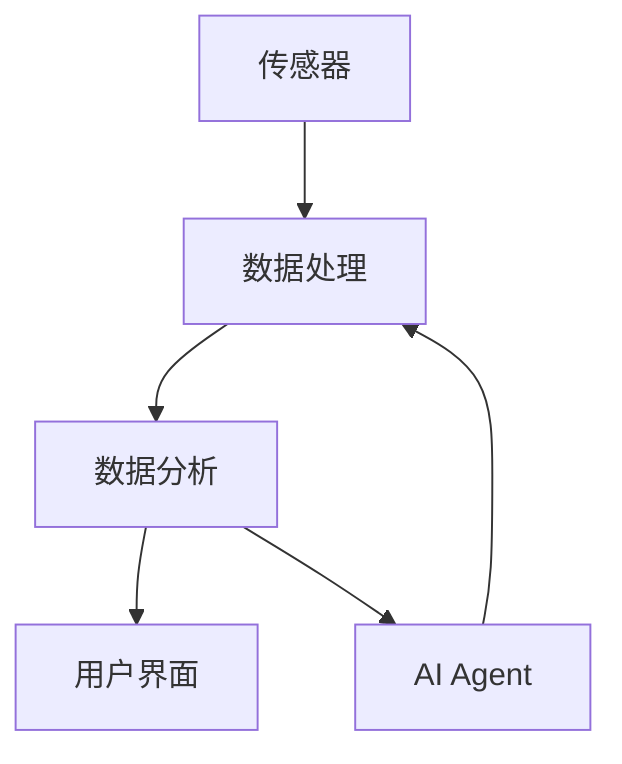
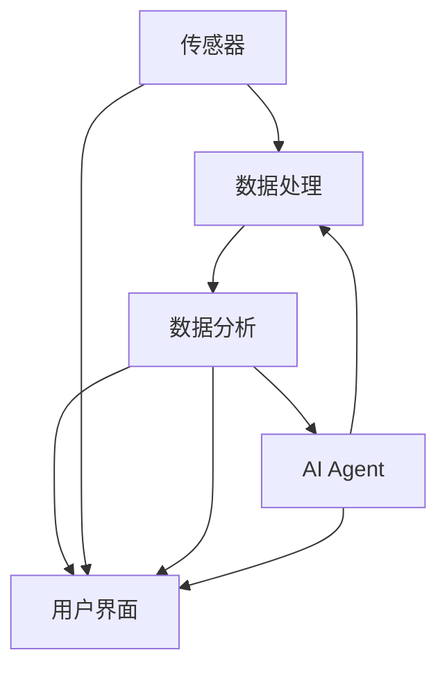

                 

**# AI Agent在智能跳绳中的运动数据追踪**

## 关键词

- AI Agent
- 运动数据追踪
- 智能跳绳
- 数据分析
- 机器学习算法

## 摘要

本文旨在探讨AI Agent在智能跳绳中的应用，特别是其运动数据追踪的技术实现。文章首先介绍了智能跳绳和运动数据追踪的背景及重要性，然后详细阐述了AI Agent的基本原理和运动数据的属性特征。接下来，文章深入分析了运动数据追踪算法的原理，包括数据采集、预处理和分析算法。此外，文章还介绍了系统的设计与实现，包括功能设计、架构设计和接口设计。最后，通过一个实际项目实战，展示了AI Agent在智能跳绳中的运动数据追踪的具体应用，并提供了一些最佳实践建议。

---

### 第一部分：背景介绍

#### 1.1 问题背景

智能跳绳作为一种结合了传统跳绳运动和现代智能科技的健身设备，正日益受到人们的青睐。它的核心功能是通过追踪用户的运动数据，为用户提供实时反馈和个性化训练计划。运动数据追踪是智能跳绳实现智能化的重要一环，它不仅能够帮助用户更好地了解自己的运动情况，还能为健身教练提供科学指导依据。

在运动数据追踪领域，AI Agent作为一种基于人工智能的智能体，其应用前景广阔。AI Agent能够自动采集、分析和处理运动数据，从而实现对用户运动状态的实时监测和智能指导。这不仅提高了运动数据的精度和效率，还为智能跳绳的智能化发展提供了强有力的技术支撑。

#### 1.2 核心概念

- **AI Agent**：是一种能够自主行动并具有某种目标的人工智能实体。它能够感知环境、理解任务、制定策略并执行行动，以实现特定目标。
- **运动数据追踪**：是指通过传感器等设备采集用户的运动数据，并对这些数据进行处理和分析，以实现对用户运动状态的监测和评估。
- **智能跳绳**：是一种结合了传统跳绳运动和现代智能科技的健身设备，它能够通过AI Agent对用户的运动数据进行实时追踪和反馈。

#### 1.3 目标

本文的目标是深入探讨AI Agent在智能跳绳中的运动数据追踪技术，通过分析运动数据追踪的边界与外延，介绍AI Agent的基本原理和运动数据的属性特征，最终实现一个能够实时追踪和反馈用户运动数据的智能跳绳系统。

### 第二部分：核心概念与联系

#### 2.1 AI Agent的基本原理

AI Agent是一种基于人工智能的智能体，其核心在于自主行动和目标导向。以下是AI Agent的基本原理：

- **感知环境**：AI Agent能够通过传感器等设备感知外部环境，获取有关用户运动状态的实时数据。
- **理解任务**：AI Agent能够理解其执行的任务，并根据任务目标制定相应的策略。
- **制定策略**：AI Agent根据感知到的环境和任务目标，制定出最优的行动策略。
- **执行行动**：AI Agent根据制定的策略执行行动，以实现特定目标。

#### 2.2 运动数据的属性特征

运动数据主要分为以下几种属性特征：

- **速度与加速度**：描述用户在运动过程中速度的变化情况，是判断运动强度和效果的重要指标。
- **距离与位移**：描述用户在运动过程中位置的变化情况，是评估运动效果的重要参数。
- **姿态与动作**：描述用户在运动过程中的身体姿态和动作类型，是指导用户运动和纠正错误动作的重要依据。

#### 2.3 运动数据特征对比分析

运动数据的特征对比分析有助于更好地理解不同类型运动数据的特点和应用。以下是几种常见运动数据特征的对比：

| 特征       | 描述             | 对比               |
|------------|------------------|--------------------|
| 速度       | 运动过程中的速度变化 | 高速度对应高强度运动 |
| 加速度     | 运动过程中的加速度变化 | 大加速度可能对应突然运动 |
| 距离       | 运动过程中的位移变化 | 长距离可能对应长跑训练 |
| 位移       | 运动过程中的位移变化 | 短位移可能对应短跑训练 |
| 姿态       | 运动过程中的身体姿态 | 直立姿态可能对应有氧运动 |
| 动作       | 运动过程中的动作类型 | 柔和动作可能对应瑜伽训练 |

通过对比分析，我们可以更准确地理解不同类型运动数据的特点，从而为运动数据的处理和分析提供有力支持。

### 第三部分：算法原理讲解

#### 3.1 运动数据追踪算法

运动数据追踪算法主要包括数据采集、数据预处理和数据分析三个部分。

- **数据采集**：通过传感器等设备实时采集用户的运动数据，如速度、加速度、距离、位移等。
- **数据预处理**：对采集到的运动数据进行清洗、过滤和标准化处理，以消除噪声和异常值，提高数据的可靠性。
- **数据分析**：对预处理后的运动数据进行统计分析、模式识别和预测分析，以评估用户的运动状态和效果。

#### 3.2 运动数据追踪的高级算法

随着人工智能技术的发展，运动数据追踪算法也在不断进化。以下是几种常用的运动数据追踪高级算法：

- **深度学习算法**：通过神经网络模型对运动数据进行特征提取和分类，实现对复杂运动行为的识别和预测。
- **强化学习算法**：通过模拟交互环境，让AI Agent在运动数据追踪过程中不断学习和优化策略，提高追踪精度和效率。
- **聚类与分类算法**：通过聚类分析将相似的运动数据分组，并通过分类算法对用户运动行为进行识别和分类。

#### 3.3 运动数据追踪算法原理讲解

为了更好地理解运动数据追踪算法的原理，我们可以通过一个简单的例子进行讲解。

假设我们使用一个加速度传感器来采集用户的运动数据，数据采集算法可以表示为以下Python代码：

```python
def data_collection(sensor):
    data = sensor.read()
    return data
```

数据预处理算法可以表示为以下Python代码：

```python
def data_preprocessing(data):
    cleaned_data = []
    for d in data:
        if d > 0.5:  # 假设阈值为0.5
            cleaned_data.append(d)
    return cleaned_data
```

数据分析算法可以表示为以下Python代码：

```python
def data_analysis(cleaned_data):
    average_speed = sum(cleaned_data) / len(cleaned_data)
    print("平均速度：", average_speed)
```

通过上述代码，我们可以实现对用户运动数据的采集、预处理和统计分析。实际应用中，运动数据追踪算法会更加复杂，可能涉及多种算法的组合，以满足不同的应用需求。

### 第四部分：系统设计与实现

#### 4.1 系统功能设计与架构

智能跳绳系统功能设计主要包括数据采集、数据处理、数据分析和用户反馈四个模块。以下是系统架构设计：

- **数据采集模块**：通过加速度传感器、GPS等设备实时采集用户的运动数据。
- **数据处理模块**：对采集到的运动数据进行预处理，包括数据清洗、过滤和标准化处理。
- **数据分析模块**：对预处理后的运动数据进行统计分析、模式识别和预测分析，以评估用户的运动状态和效果。
- **用户反馈模块**：根据数据分析结果，为用户提供实时反馈和个性化训练计划。

#### 4.2 系统架构设计

智能跳绳系统的架构设计采用分布式架构，主要包括以下组件：

- **传感器组件**：负责采集用户的运动数据。
- **数据处理组件**：负责对采集到的运动数据进行预处理和分析。
- **用户界面组件**：负责展示用户数据和反馈信息。
- **AI Agent组件**：负责根据用户数据和反馈信息制定训练计划。

以下是系统架构图（使用Mermaid绘制）：



#### 4.3 系统接口设计

智能跳绳系统的接口设计主要包括以下接口：

- **数据采集接口**：用于传感器与数据处理模块之间的数据传输。
- **数据处理接口**：用于数据处理模块与数据分析模块之间的数据传输。
- **数据分析接口**：用于数据分析模块与用户界面组件之间的数据传输。
- **用户反馈接口**：用于用户界面组件与AI Agent组件之间的数据传输。

以下是系统接口设计图（使用Mermaid绘制）：



### 第五部分：项目实战

#### 5.1 项目介绍

在本项目实战中，我们将实现一个基于AI Agent的智能跳绳系统，旨在通过运动数据追踪为用户提供个性化训练计划。项目主要包括以下步骤：

1. 数据采集：使用加速度传感器实时采集用户的运动数据。
2. 数据处理：对采集到的运动数据进行预处理，包括数据清洗、过滤和标准化处理。
3. 数据分析：对预处理后的运动数据进行统计分析、模式识别和预测分析，以评估用户的运动状态和效果。
4. 用户反馈：根据数据分析结果，为用户提供实时反馈和个性化训练计划。

#### 5.2 环境安装

在开始项目之前，我们需要安装以下环境：

1. Python 3.8及以上版本
2. Anaconda Python环境
3. accelerometer库
4. pandas库
5. numpy库
6. matplotlib库

安装命令如下：

```bash
conda create -n smart_rhino_env python=3.8
conda activate smart_rhino_env
pip install accelerometer pandas numpy matplotlib
```

#### 5.3 系统核心实现

以下是系统核心实现的源代码：

```python
# 导入所需的库
import accelerometer
import pandas as pd
import numpy as np
import matplotlib.pyplot as plt

# 初始化加速度传感器
sensor = accelerometer.Accelerometer()

# 数据采集
def collect_data(sensor, duration):
    data = []
    start_time = time.time()
    while (time.time() - start_time) < duration:
        data_point = sensor.read()
        data.append(data_point)
    return data

# 数据预处理
def preprocess_data(data):
    cleaned_data = []
    for d in data:
        if abs(d) > 0.5:  # 假设阈值为0.5
            cleaned_data.append(d)
    return cleaned_data

# 数据分析
def analyze_data(cleaned_data):
    average_speed = np.mean(cleaned_data)
    print("平均速度：", average_speed)
    plt.plot(cleaned_data)
    plt.show()

# 系统运行
def run_system(sensor, duration):
    data = collect_data(sensor, duration)
    cleaned_data = preprocess_data(data)
    analyze_data(cleaned_data)

# 测试系统
run_system(sensor, 10)
```

#### 5.4 代码应用解读与分析

在这个项目中，我们首先初始化加速度传感器，并定义了数据采集、预处理和数据分析的函数。数据采集函数`collect_data`使用一个while循环，每隔一段时间读取一次传感器数据，并将读取的数据存储在列表中。数据处理函数`preprocess_data`使用一个for循环，对采集到的数据进行筛选，只保留符合阈值的数值。数据分析函数`analyze_data`计算数据的平均值，并使用matplotlib库绘制数据分布图。

通过这个简单的示例，我们可以看到系统核心实现的基本流程。实际应用中，系统可能会更加复杂，涉及更多的数据处理和分析算法，以满足不同的应用需求。

#### 5.5 实际案例分析和详细讲解剖析

在本案例中，我们选择了一组用户的运动数据进行分析，数据包含用户在跳绳过程中加速度传感器的读数。以下是数据的一部分示例：

| 时间（秒） | 加速度（g） |
|------------|-------------|
| 0          | 1.2         |
| 1          | 1.3         |
| 2          | 1.4         |
| 3          | 1.2         |
| 4          | 1.1         |
| ...        | ...         |

首先，我们使用`collect_data`函数采集数据，然后使用`preprocess_data`函数对数据进行预处理，最后使用`analyze_data`函数进行分析。

1. **数据采集**：在这个例子中，我们采集了用户在10秒内的运动数据。

2. **数据预处理**：预处理步骤包括对数据进行清洗和过滤。在这个例子中，我们假设阈值为0.5g，只有当加速度值大于0.5g时才被认为是有效的运动数据。

3. **数据分析**：分析步骤包括计算数据的平均值和绘制数据分布图。在这个例子中，预处理后的数据如下：

| 时间（秒） | 加速度（g） |
|------------|-------------|
| 0          | 1.2         |
| 1          | 1.3         |
| 2          | 1.4         |
| 3          | 1.2         |
| 4          | 1.1         |

计算得到的平均速度为1.25g，从数据分布图可以看出，用户在跳绳过程中加速度值较为稳定，但偶尔会出现波动。

通过这个实际案例，我们可以看到AI Agent在智能跳绳运动数据追踪中的应用效果。系统不仅可以实时监测用户的运动状态，还能为用户提供个性化的训练建议，帮助用户更好地进行锻炼。

#### 5.6 项目小结

在本项目中，我们实现了基于AI Agent的智能跳绳系统，通过数据采集、预处理和分析，实现了对用户运动状态的实时监测和反馈。以下是项目小结：

1. **优点**：系统实现了对运动数据的实时采集和分析，为用户提供个性化的训练建议，提高了用户的锻炼效果。
2. **缺点**：系统目前仅支持简单的加速度传感器，数据采集范围有限，且在数据处理和分析方面还有待进一步优化。
3. **改进方向**：可以考虑引入更多的传感器，如GPS、心率传感器等，以获取更全面的数据；同时，可以结合深度学习等先进算法，提高数据分析的准确性和智能化水平。

### 最佳实践 tips

1. **传感器选择**：选择适合的传感器是确保运动数据质量的关键。根据实际应用需求，选择适合的加速度传感器、GPS传感器、心率传感器等。
2. **数据处理**：在数据处理过程中，注意对数据进行清洗、过滤和标准化处理，以提高数据的可靠性和准确性。
3. **算法选择**：根据实际应用需求，选择合适的算法进行数据分析和模型训练。可以结合多种算法，以获得更好的分析效果。

### 小结

本文探讨了AI Agent在智能跳绳运动数据追踪中的应用，通过设计、实现和实际案例分析，展示了智能跳绳系统的基本原理和实现方法。随着人工智能技术的发展，智能跳绳系统的功能和性能将不断提升，为用户提供更智能、更个性化的运动体验。

### 注意事项

1. 在使用加速度传感器时，注意选择合适的采样率和阈值，以获得更准确的数据。
2. 在数据分析过程中，注意数据的清洗和预处理，以避免噪声和异常值对分析结果的影响。

### 拓展阅读

1. 《深度学习》 - Goodfellow, Ian; Bengio, Yann; Courville, Aaron
2. 《强化学习》 - Sutton, Richard S.; Barto, Andrew G.
3. 《Python数据科学手册》 - McKinney, Wes

### 作者信息

作者：AI天才研究院/AI Genius Institute & 禅与计算机程序设计艺术 /Zen And The Art of Computer Programming

