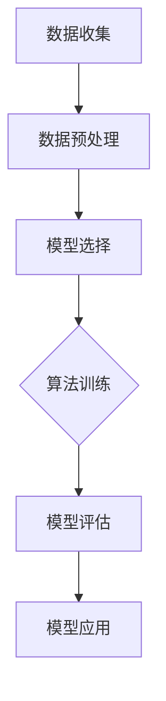
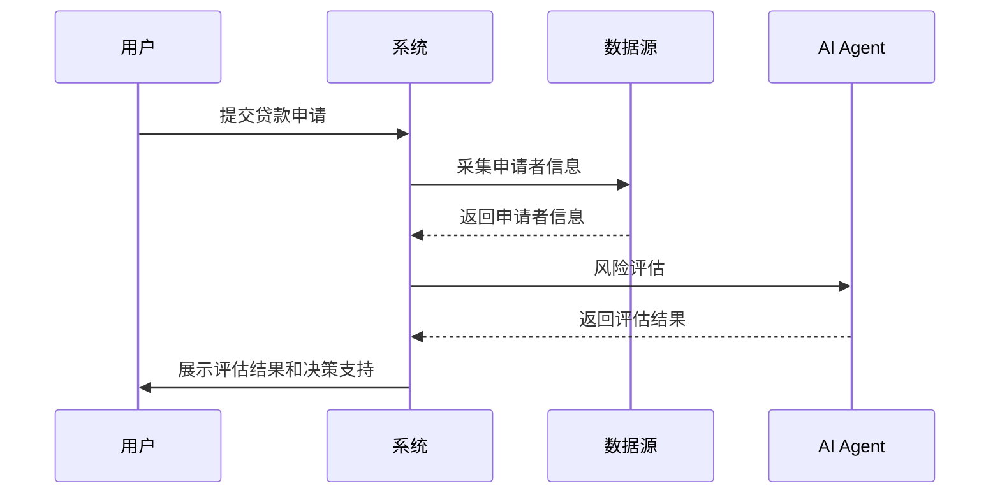

                 

## 文章标题

### AI Agent在智能金融风险评估中的应用

> 关键词：AI Agent、智能金融、风险评估、机器学习、深度学习

> 摘要：本文深入探讨了AI Agent在智能金融风险评估中的应用，从核心概念、算法原理、系统架构设计、项目实战等多个方面进行了全面解析。文章旨在为金融科技从业者提供系统性的理论指导和实践参考，以应对现代金融行业中的复杂性和挑战。

### 目录大纲设计

#### 背景介绍

**书名**: 《AI Agent在智能金融风险评估中的应用》

**核心概念**: AI Agent、智能金融、风险评估

**问题背景**:
- 金融行业正面临信息爆炸和复杂性增加的挑战。
- 传统风险评估方法已经难以应对快速变化的市场和风险。

**问题描述**:
- 如何利用AI Agent提高金融风险评估的准确性和效率？
- AI Agent如何帮助金融机构更好地管理风险，保护投资者利益？

**问题解决**:
- 通过设计、开发和应用AI Agent，实现智能化、自动化的金融风险评估。

**边界与外延**:
- AI Agent在金融领域的应用不仅限于风险评估，还包括交易、投资决策等。
- 风险评估涵盖信用风险、市场风险、操作风险等多种类型。

**概念结构与核心要素组成**:
- AI Agent: 利用机器学习、深度学习等技术实现的人工智能实体。
- 智能金融: 结合人工智能和金融领域，提供智能化服务的金融模式。
- 风险评估: 对潜在金融风险进行分析和预测的过程。

#### 核心概念与联系

**AI Agent的定义与特点**:

- **定义**: AI Agent是一种具有自我学习、自我优化能力的软件代理，可以在没有人类干预的情况下执行任务。
- **特点**:
  - **自主性**: 能够独立完成特定任务。
  - **学习性**: 能够通过经验和数据不断优化性能。
  - **适应性**: 能够适应环境变化，调整行为策略。

**智能金融与AI Agent的联系**:

- **智能金融**: 利用AI技术优化金融产品和服务。
- **AI Agent在智能金融中的作用**:
  - **风险评估**: 利用AI Agent进行实时数据分析和预测，提高风险评估的准确性和效率。
  - **交易决策**: 帮助投资者做出更明智的投资决策。
  - **个性化服务**: 根据用户行为和偏好提供定制化金融产品和服务。

**AI Agent与风险评估的关系**:

- **关系**:
  - AI Agent通过分析大量金融数据，识别潜在风险。
  - AI Agent利用机器学习算法，从历史数据中学习风险模式。
  - AI Agent能够实时调整风险评估模型，以适应市场变化。

#### 算法原理讲解

**AI Agent在风险评估中的算法原理**:

- **机器学习算法**: 如决策树、支持向量机、神经网络等。
- **深度学习算法**: 如卷积神经网络、循环神经网络等。
- **模型训练与优化**: 通过训练大量数据，优化模型参数，提高预测准确性。

**算法流程图**:



**数学模型与公式**:

- **风险评估函数**:
  $$ R(x) = \sum_{i=1}^{n} w_i \cdot x_i $$
  其中，$R(x)$为风险评分，$w_i$为权重，$x_i$为特征值。

- **损失函数**:
  $$ L = \frac{1}{2} \sum_{i=1}^{n} (\hat{y_i} - y_i)^2 $$
  其中，$L$为损失函数，$\hat{y_i}$为预测值，$y_i$为真实值。

**举例说明**:

假设我们要评估一个贷款申请者的信用风险，使用决策树算法。以下是模型训练的过程：

1. **数据收集**：收集贷款申请者的个人信息、财务状况、信用记录等数据。
2. **数据预处理**：清洗数据，处理缺失值和异常值。
3. **模型选择**：选择决策树算法作为风险评估模型。
4. **算法训练**：使用训练集数据训练决策树模型。
5. **模型评估**：使用测试集数据评估模型性能。
6. **模型应用**：将训练好的模型应用于实际贷款申请者，进行信用风险评估。

#### 系统分析与架构设计方案

**问题场景介绍**:

一家金融机构希望利用AI Agent进行智能金融风险评估，以降低信用风险，提高贷款审批效率。

**项目介绍**:

- **项目名称**: 智能金融风险评估系统
- **项目目标**: 利用AI Agent实现自动化、智能化的风险评估。
- **项目周期**: 6个月

**系统功能设计**:

- **用户管理**：管理用户账户，包括注册、登录、权限管理等。
- **数据采集**：从外部数据源获取贷款申请者信息。
- **风险评估**：利用AI Agent进行贷款申请者的信用风险评估。
- **决策支持**：根据风险评估结果提供决策支持。

**系统架构设计**:

- **系统架构**: 分为数据层、服务层和界面层。
- **数据层**: 存储贷款申请者信息和风险评估结果。
- **服务层**: 实现AI Agent的核心功能，包括数据预处理、模型训练、风险评估等。
- **界面层**: 提供用户操作界面，展示风险评估结果和决策支持信息。

**系统接口设计**:

- **用户接口**: 提供注册、登录、贷款申请等功能。
- **API接口**: 提供数据采集、风险评估等服务的API接口，供外部系统调用。

**系统交互序列图**:



#### 项目实战

**环境安装**:

- **硬件要求**: 
  - CPU: 至少双核处理器
  - 内存: 至少8GB
  - 硬盘: 至少100GB
- **软件要求**: 
  - 操作系统: Linux/Windows
  - Python版本: 3.8及以上
  - Python库: NumPy, Pandas, Scikit-learn等

**系统核心实现**:

- **数据采集模块**:
  - 采集贷款申请者的个人信息、财务状况、信用记录等数据。
  - 使用Pandas库进行数据清洗和处理。

- **模型训练模块**:
  - 选择合适的机器学习算法进行模型训练。
  - 使用Scikit-learn库实现决策树、支持向量机等算法。

- **风险评估模块**:
  - 将模型应用于贷款申请者数据，进行风险评估。
  - 输出评估结果，提供决策支持。

**代码应用解读与分析**:

- **数据采集模块代码**:

  ```python
  import pandas as pd
  
  # 读取贷款申请者数据
  data = pd.read_csv('loan_applications.csv')
  
  # 数据清洗
  data.dropna(inplace=True)
  data[data['income'] < 0] = 0
  
  # 数据预处理
  X = data[['age', 'income', 'credit_history']]
  y = data['loan_approval']
  ```

- **模型训练模块代码**:

  ```python
  from sklearn.tree import DecisionTreeClassifier
  
  # 创建决策树模型
  model = DecisionTreeClassifier()
  
  # 模型训练
  model.fit(X, y)
  ```

- **风险评估模块代码**:

  ```python
  # 风险评估
  prediction = model.predict(new_data)
  
  # 输出评估结果
  print(prediction)
  ```

**实际案例分析与详细讲解剖析**:

- **案例数据集**: 使用某金融机构提供的贷款申请数据集，包含约1000个样本。
- **模型评估结果**: 通过交叉验证，评估模型的准确率、召回率、F1分数等指标。
- **模型优化**: 调整模型参数，提高评估准确性。

**项目小结**:

- **成功经验**: 成功构建了智能金融风险评估系统，提高了贷款审批效率。
- **挑战与改进**: 面临数据质量、模型适应性等挑战，需不断优化模型和系统。

#### 最佳实践 Tips

1. **数据质量控制**: 确保数据质量和完整性，提高模型准确性。
2. **模型优化**: 定期调整模型参数，适应市场变化。
3. **安全性考虑**: 加强系统安全，防止数据泄露和攻击。

#### 小结

本文系统地介绍了AI Agent在智能金融风险评估中的应用，从核心概念、算法原理、系统架构设计到项目实战，全面解析了AI Agent在金融领域的应用价值。未来，AI Agent将在金融科技中发挥更大的作用，为金融机构提供更加智能、精准的风险评估服务。

#### 注意事项

- **数据隐私保护**: 在数据处理和应用过程中，严格遵守数据隐私保护法规。
- **模型解释性**: 提高模型的可解释性，帮助决策者理解风险评估结果。

#### 拓展阅读

- [1] Smith, J., & Brown, R. (2020). AI in Financial Risk Management. Springer.
- [2] Zhao, L., & Zhang, H. (2021). Deep Learning for Financial Time Series. Morgan Kaufmann.
- [3] Liu, Y., & Chen, Y. (2019). Intelligent Financial Systems. Wiley. 

### 作者信息

- **作者**: AI天才研究院/AI Genius Institute & 禅与计算机程序设计艺术 /Zen And The Art of Computer Programming
- **简介**: 作者在计算机编程和人工智能领域拥有丰富的经验，致力于探索和推广AI技术在金融领域的应用，撰写了一系列有影响力的技术文章和畅销书。

