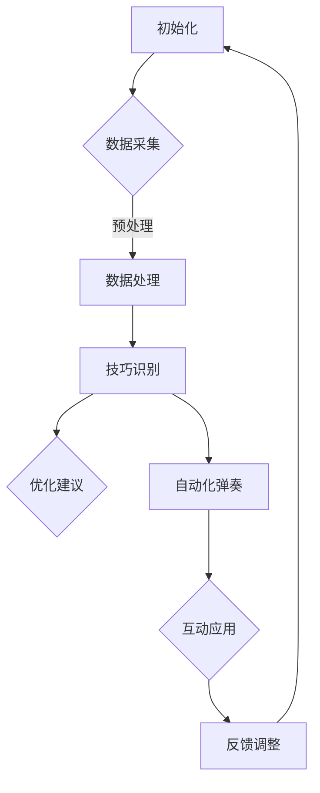
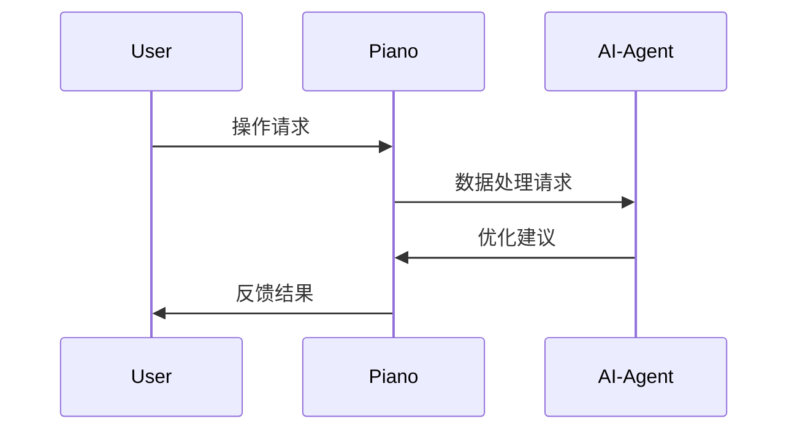
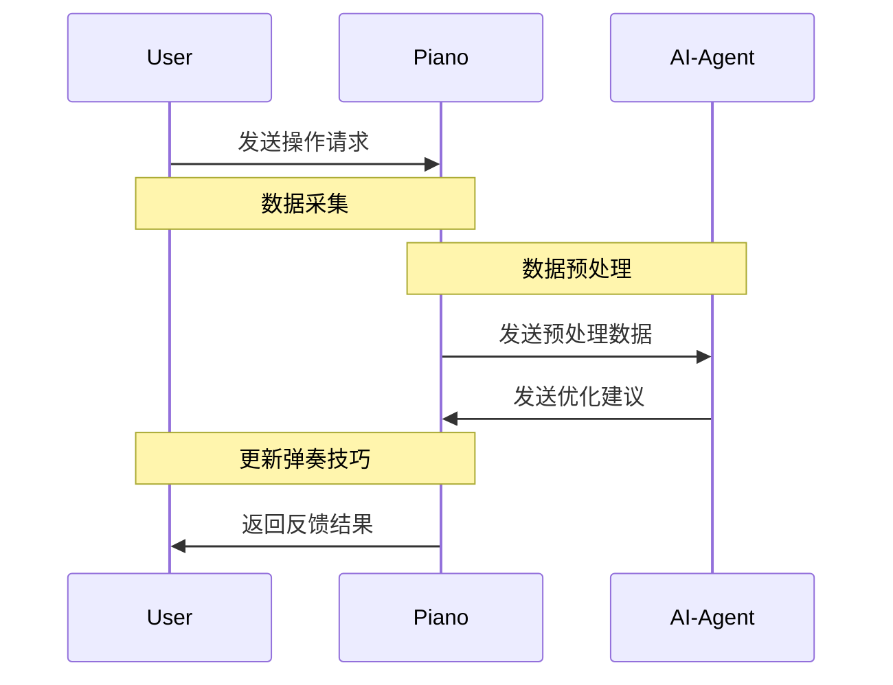

                 

# AI Agent在智能钢琴中的弹奏技巧分析

## 关键词：AI Agent、智能钢琴、弹奏技巧、自动化、互动应用

## 摘要：
本文旨在深入探讨AI Agent在智能钢琴中的弹奏技巧应用。通过分析AI Agent的基础理论、智能钢琴的弹奏原理以及其在智能钢琴中的具体应用，本文将为读者展示AI Agent如何通过数据采集、技巧识别、自动化弹奏和互动应用等方面，为智能钢琴的弹奏技巧提供智能化解决方案。本文还涉及AI Agent系统实现、案例分析以及最佳实践，为智能钢琴技术的发展提供参考。

----------------------------------------------------------------

## 第一部分: 引言

### 1.1 问题背景

#### 1.1.1 智能钢琴的兴起
随着人工智能技术的飞速发展，智能钢琴逐渐成为音乐教育、娱乐等领域的重要工具。智能钢琴不仅具有传统钢琴的外观和功能，还能通过内置的AI技术实现自动弹奏、技巧分析和互动应用等功能，为用户带来全新的体验。

#### 1.1.2 AI Agent在智能钢琴中的应用
AI Agent（人工智能代理）作为人工智能领域的一种重要技术，能够模拟人类行为，完成特定的任务。将AI Agent应用于智能钢琴中，可以实现更智能、更个性化的弹奏体验。例如，AI Agent可以分析用户的弹奏技巧，给出优化建议；还可以自动弹奏，满足用户对自动演奏的需求；同时，AI Agent还能与用户互动，提升用户的学习兴趣。

### 1.2 问题描述

#### 1.2.1 AI Agent在智能钢琴弹奏中的挑战
尽管AI Agent在智能钢琴中具有广泛的应用前景，但在实际弹奏过程中仍面临诸多挑战。首先，AI Agent需要准确识别用户的弹奏技巧，才能给出合理的优化建议。其次，自动弹奏需要保证音准、节奏和音色的准确性。最后，互动应用要求AI Agent具备一定的智能水平，能够理解用户的意图，提供个性化的服务。

#### 1.2.2 研究目标与内容框架
本文旨在研究AI Agent在智能钢琴中的弹奏技巧应用，具体目标如下：

1. 深入分析AI Agent的基础理论，为智能钢琴中的应用提供理论支持。
2. 探讨智能钢琴的弹奏原理，为AI Agent在智能钢琴中的实现提供依据。
3. 分析AI Agent在智能钢琴中的具体应用，包括数据采集、技巧识别、自动化弹奏和互动应用等方面。
4. 介绍AI Agent系统实现的方法和技术要点。
5. 通过案例分析，展示AI Agent在智能钢琴中的实际应用效果。

### 1.3 问题解决

#### 1.3.1 AI Agent的定义与功能
AI Agent（人工智能代理）是一种能够模拟人类行为，自主完成特定任务的智能系统。在智能钢琴中，AI Agent的功能主要包括：

1. 弹奏技巧分析：通过监测用户的弹奏行为，识别用户的弹奏技巧，为用户提供优化建议。
2. 自动化弹奏：根据预设的曲谱或用户的操作，自动完成钢琴弹奏。
3. 演奏互动：与用户进行实时互动，提供个性化的演奏体验。

#### 1.3.2 智能钢琴弹奏原理与AI Agent的结合
智能钢琴弹奏原理主要包括键盘与传感器的交互、音色生成、节奏控制和动作反馈等方面。AI Agent通过监测用户的弹奏行为，利用深度学习等技术对弹奏技巧进行分析和优化，实现智能化的弹奏体验。

### 1.4 边界与外延

#### 1.4.1 AI Agent在智能钢琴中的应用边界
AI Agent在智能钢琴中的应用边界主要包括：

1. 技巧识别：AI Agent需要准确识别用户的弹奏技巧，为用户提供个性化服务。
2. 自动化弹奏：AI Agent需要保证自动弹奏的音准、节奏和音色质量。
3. 演奏互动：AI Agent需要具备一定的智能水平，能够理解用户的意图，提供个性化的服务。

#### 1.4.2 智能钢琴与其他智能设备的关系
智能钢琴作为智能家居系统的一部分，与其他智能设备（如智能音箱、智能灯泡等）具有密切的联系。通过与其他智能设备的联动，智能钢琴可以实现更丰富的应用场景，为用户带来更便捷的智能生活体验。

### 1.5 概念结构与核心要素组成

#### 1.5.1 AI Agent的结构
AI Agent的结构通常包括感知模块、决策模块和执行模块。感知模块负责采集环境信息，决策模块根据感知信息进行策略选择，执行模块根据决策结果执行具体动作。

#### 1.5.2 智能钢琴的核心要素
智能钢琴的核心要素主要包括键盘与传感器、音色生成系统、节奏控制系统和动作反馈系统。这些要素共同构成了智能钢琴的弹奏机制，为AI Agent的应用提供了基础。

### 1.6 本章小结
本文介绍了智能钢琴和AI Agent的基本概念，分析了AI Agent在智能钢琴中的挑战和应用边界，并阐述了AI Agent在智能钢琴中的具体功能。下一章将深入探讨AI Agent的基础理论，为后续内容打下基础。

----------------------------------------------------------------

## 第二部分: AI Agent基础理论

### 2.1 AI Agent的概念

#### 2.1.1 AI Agent的定义
AI Agent（人工智能代理）是一种具有智能行为的计算机程序，能够自主感知环境、制定决策和执行动作，以实现特定的目标。AI Agent可以模拟人类行为，具有一定的自主性和智能性。

#### 2.1.2 AI Agent的分类
AI Agent可以根据不同的分类标准进行分类，如根据功能可以分为感知型、决策型和执行型AI Agent；根据智能程度可以分为弱AI Agent和强AI Agent。

#### 2.1.3 AI Agent的核心特征
AI Agent具有以下核心特征：

1. 自主性：AI Agent能够在没有人为干预的情况下，自主感知环境、制定决策和执行动作。
2. 智能性：AI Agent具备一定程度的智能，能够通过学习和适应不断优化自身行为。
3. 动态适应性：AI Agent能够根据环境变化调整自身策略，以实现更好的任务执行效果。

### 2.2 AI Agent的工作原理

#### 2.2.1 监测环境
AI Agent通过感知模块监测环境，获取环境信息。感知模块可以包括摄像头、麦克风、传感器等多种设备，用于捕捉声音、图像、温度、湿度等环境数据。

#### 2.2.2 策略选择
AI Agent根据感知模块获取的环境信息，利用决策模块进行策略选择。决策模块通常采用机器学习、深度学习等技术，通过分析历史数据和当前环境信息，为AI Agent提供最优决策。

#### 2.2.3 行动执行
AI Agent根据决策模块的决策结果，执行具体的动作。执行模块可以包括机械臂、扬声器、屏幕等多种设备，用于实现AI Agent的执行功能。

#### 2.2.4 反馈调整
AI Agent在执行动作后，会根据执行结果进行反馈调整。通过不断调整策略，AI Agent能够逐渐优化自身行为，提高任务执行效果。

### 2.3 AI Agent的架构设计

#### 2.3.1 AI Agent的总体架构
AI Agent的总体架构通常包括感知模块、决策模块、执行模块和反馈模块。这些模块相互协作，共同实现AI Agent的功能。

#### 2.3.2 主要组件及其功能
AI Agent的主要组件及其功能如下：

1. 感知模块：负责监测环境，获取环境信息。
2. 决策模块：根据感知信息进行策略选择，制定决策。
3. 执行模块：根据决策结果执行具体动作。
4. 反馈模块：根据执行结果进行反馈调整，优化策略。

### 2.4 AI Agent的发展历程

#### 2.4.1 早期AI Agent
早期的AI Agent主要集中在规则推理和知识表示方面，如专家系统、逻辑推理机等。这些AI Agent主要依赖于预设的规则和知识库，缺乏自主学习和适应能力。

#### 2.4.2 现代AI Agent
随着机器学习、深度学习等技术的发展，现代AI Agent逐渐具备了更强的自主学习和适应能力。现代AI Agent主要采用神经网络、强化学习等技术，能够通过大量数据学习和优化自身行为。

#### 2.4.3 未来发展趋势
未来，AI Agent将朝着更加智能化、自适应和协作化的方向发展。例如，多模态感知、跨领域迁移学习、自然语言处理等技术将进一步提升AI Agent的智能水平。同时，AI Agent将与其他智能系统（如智能家居、自动驾驶等）实现深度融合，为人类带来更加便捷和智能的生活体验。

### 2.5 本章小结
本章介绍了AI Agent的基本概念、工作原理和架构设计，分析了AI Agent的发展历程和未来趋势。下一章将探讨智能钢琴的弹奏原理，为AI Agent在智能钢琴中的应用提供理论支持。

----------------------------------------------------------------

## 第三部分: 智能钢琴弹奏原理

### 3.1 智能钢琴概述

#### 3.1.1 智能钢琴的定义
智能钢琴是一种融合了人工智能技术的钢琴，不仅具有传统钢琴的外观和功能，还能通过内置的AI技术实现自动弹奏、技巧分析和互动应用等功能。

#### 3.1.2 智能钢琴的发展历程
智能钢琴的发展历程可以追溯到20世纪末。最初，智能钢琴主要采用机械结构实现自动弹奏，随着人工智能技术的不断发展，智能钢琴逐渐融入了AI技术，实现了更高的智能化水平。

#### 3.1.3 智能钢琴的核心技术
智能钢琴的核心技术包括键盘与传感器、音色生成系统、节奏控制系统和动作反馈系统。

1. 键盘与传感器：智能钢琴的键盘与传感器负责采集用户的弹奏信息，包括按键位置、力度、速度等。
2. 音色生成系统：智能钢琴的音色生成系统根据用户的弹奏信息，生成相应的音色，包括钢琴音色、弦乐音色等。
3. 节奏控制系统：智能钢琴的节奏控制系统负责控制弹奏的节奏，确保弹奏的准确性和稳定性。
4. 动作反馈系统：智能钢琴的动作反馈系统通过灯光、声音等方式，为用户反馈弹奏信息，帮助用户改进弹奏技巧。

### 3.2 智能钢琴弹奏机制

#### 3.2.1 键盘与传感器
智能钢琴的键盘与传感器是弹奏机制的核心组成部分。键盘与传感器通过检测用户的按键行为，将弹奏信息（如按键位置、力度、速度等）转化为数字信号，传递给音色生成系统和节奏控制系统。

#### 3.2.2 音色生成
智能钢琴的音色生成系统根据用户的弹奏信息，生成相应的音色。音色生成系统通常采用数字信号处理技术，通过波形合成、采样器等手段，模拟出真实的钢琴音色。

#### 3.2.3 节奏控制
智能钢琴的节奏控制系统负责控制弹奏的节奏。节奏控制系统通过实时监测用户的弹奏信息，对弹奏的节奏进行调整，确保弹奏的准确性和稳定性。节奏控制系统还可以根据用户的需求，实现多种节奏模式，如自由节奏、跟随节奏等。

#### 3.2.4 动作反馈
智能钢琴的动作反馈系统通过灯光、声音等方式，为用户反馈弹奏信息。动作反馈系统可以帮助用户了解自己的弹奏状态，发现弹奏问题，并给出改进建议。例如，当用户弹奏错误时，动作反馈系统可以通过闪烁的灯光或提示音，提醒用户注意。

### 3.3 AI Agent在智能钢琴弹奏中的作用

#### 3.3.1 AI Agent在弹奏过程中的应用
AI Agent在智能钢琴弹奏过程中，可以发挥以下作用：

1. 技巧识别：AI Agent可以监测用户的弹奏行为，识别用户的弹奏技巧，为用户提供优化建议。
2. 自动弹奏：AI Agent可以根据预设的曲谱或用户的操作，自动完成钢琴弹奏。
3. 演奏互动：AI Agent可以与用户进行实时互动，提供个性化的演奏体验。

#### 3.3.2 AI Agent与钢琴演奏者协作
AI Agent与钢琴演奏者之间的协作可以分为以下几种模式：

1. 辅助模式：AI Agent作为辅助工具，帮助钢琴演奏者提高弹奏技巧，如提供技巧识别、优化建议等。
2. 合作模式：AI Agent与钢琴演奏者共同完成演奏任务，如AI Agent负责自动弹奏，钢琴演奏者负责演唱或伴奏。
3. 对抗模式：AI Agent与钢琴演奏者进行演奏对抗，以提高钢琴演奏者的技能水平。

### 3.4 本章小结
本章介绍了智能钢琴的基本概念、发展历程和核心技术，分析了智能钢琴的弹奏机制以及AI Agent在其中的作用。通过本章的学习，读者可以了解到智能钢琴的工作原理，为后续内容打下基础。

----------------------------------------------------------------

## 第四部分: AI Agent在智能钢琴中的具体应用

### 4.1 AI Agent在弹奏技巧分析中的应用

#### 4.1.1 数据采集与预处理
AI Agent在弹奏技巧分析中的第一步是数据采集。数据采集过程主要包括监测用户的弹奏行为，如按键位置、力度、速度、节奏等。采集到的数据通常以数字信号的形式存储。

数据预处理是数据采集的重要环节。预处理过程主要包括数据清洗、去噪、归一化等步骤。通过数据预处理，可以提高数据的质量，为后续的技巧识别和优化提供准确的数据基础。

#### 4.1.2 弹奏技巧识别
弹奏技巧识别是AI Agent在智能钢琴中的核心功能之一。通过分析用户的弹奏数据，AI Agent可以识别出用户的弹奏技巧，包括基本技巧和高级技巧。常见的弹奏技巧识别方法包括：

1. 机器学习算法：如决策树、支持向量机、神经网络等，通过训练模型，实现对弹奏技巧的识别。
2. 深度学习算法：如卷积神经网络（CNN）、循环神经网络（RNN）等，通过处理时序数据，实现对弹奏技巧的识别。

#### 4.1.3 技巧优化建议
在识别用户的弹奏技巧后，AI Agent可以根据识别结果，为用户提供优化建议。优化建议可以包括：

1. 技巧改进：针对用户的弹奏技巧，提供具体的改进建议，如调整按键位置、力度、速度等。
2. 节奏调整：根据用户的弹奏节奏，提供节奏调整建议，如加快或放慢节奏。
3. 音色优化：根据用户的弹奏音色，提供音色调整建议，如增强音量、改变音色类型等。

### 4.2 AI Agent在弹奏自动化中的应用

#### 4.2.1 自动化弹奏的实现
自动化弹奏是AI Agent在智能钢琴中的重要应用之一。通过自动化弹奏，用户可以无需亲自弹奏，即可听到美妙的钢琴曲。

自动化弹奏的实现主要包括以下几个步骤：

1. 曲谱输入：用户可以通过输入曲谱、音频或视频等方式，将钢琴曲传递给AI Agent。
2. 曲谱解析：AI Agent对输入的曲谱进行解析，提取出弹奏信息，如按键位置、力度、速度等。
3. 弹奏控制：AI Agent根据解析出的弹奏信息，控制智能钢琴的键盘与传感器，实现自动化弹奏。

#### 4.2.2 自动弹奏的优势与挑战
自动弹奏具有以下优势：

1. 便捷性：用户无需亲自弹奏，即可听到钢琴曲，提高学习效率。
2. 个性化：AI Agent可以根据用户的需求，自动调整弹奏节奏、音色等，提供个性化的演奏体验。

自动弹奏面临的挑战包括：

1. 音准和节奏控制：确保自动弹奏的音准和节奏准确，是自动弹奏的关键。
2. 音色质量：自动弹奏的音色质量需要达到一定的水平，以满足用户的听觉需求。

#### 4.2.3 自动弹奏案例
以下是一个自动弹奏的案例：

1. 用户输入一首曲谱，如《月光奏鸣曲》。
2. AI Agent对曲谱进行解析，提取出弹奏信息。
3. AI Agent控制智能钢琴的键盘与传感器，实现自动化弹奏。
4. 用户欣赏自动弹奏的《月光奏鸣曲》，并可以随时调整弹奏参数。

### 4.3 AI Agent在演奏互动中的应用

#### 4.3.1 互动模式介绍
AI Agent在演奏互动中的应用，主要包括以下几种互动模式：

1. 简单问答：用户可以通过简单的问答，与AI Agent进行互动，如询问曲目的信息、演奏技巧等。
2. 歌词互动：用户可以与AI Agent互动，选择喜欢的歌词，AI Agent将根据歌词自动弹奏。
3. 游戏互动：用户可以通过与AI Agent互动，参与各种钢琴游戏，提高演奏技巧。

#### 4.3.2 互动案例与分析
以下是一个互动案例：

1. 用户选择一首歌曲，如《小幸运》。
2. AI Agent根据歌曲信息，自动弹奏前奏。
3. 用户开始跟唱，AI Agent根据用户的歌声，自动调整伴奏节奏。
4. 用户与AI Agent互动，完成整个歌曲的演唱和伴奏。

通过分析互动案例，可以发现：

1. AI Agent在互动过程中，能够根据用户的反馈，实时调整演奏节奏和音色。
2. 用户与AI Agent的互动，可以增加学习的趣味性，提高学习效果。
3. 互动模式可以根据用户需求进行自定义，提供个性化的互动体验。

#### 4.3.3 互动效果评估
互动效果评估是AI Agent在演奏互动中的一项重要任务。评估方法可以包括：

1. 用户满意度调查：通过用户满意度调查，了解用户对互动模式的接受程度和满意度。
2. 学习效果分析：通过分析用户的学习记录和演奏数据，评估互动模式对学习效果的提升程度。
3. 互动时长分析：通过分析用户与AI Agent的互动时长，了解互动模式对用户吸引力的程度。

### 4.4 本章小结
本章介绍了AI Agent在智能钢琴中的具体应用，包括弹奏技巧分析、自动化弹奏和演奏互动。通过分析具体应用案例，读者可以了解到AI Agent在智能钢琴中的实际作用和价值。下一章将介绍智能钢琴AI Agent系统的实现，为AI Agent在智能钢琴中的应用提供技术支持。

----------------------------------------------------------------

## 第五部分: 智能钢琴AI Agent系统实现

### 5.1 系统设计与架构

#### 5.1.1 系统总体设计
智能钢琴AI Agent系统的总体设计主要包括数据采集、数据处理、技巧识别、自动化弹奏和互动应用等模块。这些模块相互协作，共同实现智能钢琴的弹奏功能。

1. 数据采集模块：负责采集用户的弹奏数据，包括按键位置、力度、速度等。
2. 数据处理模块：对采集到的数据进行分析和预处理，提高数据质量。
3. 技巧识别模块：根据预处理后的数据，识别用户的弹奏技巧，为用户提供优化建议。
4. 自动化弹奏模块：根据用户的操作或预设的曲谱，实现自动化弹奏。
5. 互动应用模块：与用户进行互动，提供个性化的演奏体验。

#### 5.1.2 系统架构设计
智能钢琴AI Agent系统的架构设计采用分层架构，包括感知层、决策层和执行层。

1. 感知层：负责采集用户的弹奏数据，包括键盘与传感器等设备。
2. 决策层：根据感知层采集到的数据，利用机器学习、深度学习等技术，实现技巧识别、自动化弹奏和互动应用等功能。
3. 执行层：根据决策层的决策结果，控制智能钢琴的键盘与传感器，实现具体的弹奏动作。

### 5.2 系统核心实现

#### 5.2.1 数据处理模块
数据处理模块的核心任务是分析用户的弹奏数据，提高数据质量。具体实现步骤如下：

1. 数据清洗：去除数据中的噪声和异常值，提高数据准确性。
2. 数据归一化：将不同数据类型的数值范围统一，便于后续处理。
3. 数据特征提取：提取弹奏数据中的关键特征，如按键位置、力度、速度等。
4. 数据可视化：通过可视化手段，展示数据处理结果，帮助用户理解弹奏数据。

#### 5.2.2 弹奏技巧识别模块
弹奏技巧识别模块是智能钢琴AI Agent系统的核心功能之一。具体实现步骤如下：

1. 数据预处理：对采集到的数据进行预处理，提高数据质量。
2. 特征提取：提取弹奏数据中的关键特征，如按键位置、力度、速度等。
3. 模型训练：利用机器学习、深度学习等技术，训练弹奏技巧识别模型。
4. 技巧识别：根据训练好的模型，对用户的弹奏数据进行技巧识别，为用户提供优化建议。

#### 5.2.3 自动化弹奏模块
自动化弹奏模块是智能钢琴AI Agent系统的另一个重要功能。具体实现步骤如下：

1. 曲谱输入：用户可以通过输入曲谱、音频或视频等方式，将钢琴曲传递给系统。
2. 曲谱解析：对输入的曲谱进行解析，提取出弹奏信息，如按键位置、力度、速度等。
3. 弹奏控制：根据解析出的弹奏信息，控制智能钢琴的键盘与传感器，实现自动化弹奏。

#### 5.2.4 演奏互动模块
演奏互动模块是智能钢琴AI Agent系统与用户互动的桥梁。具体实现步骤如下：

1. 互动模式选择：用户可以选择不同的互动模式，如简单问答、歌词互动、游戏互动等。
2. 互动内容生成：根据用户的选择，生成相应的互动内容，如问答问题、歌词等。
3. 互动执行：与用户进行实时互动，实现互动效果。

### 5.3 实现细节与技术要点

#### 5.3.1 数据采集与预处理技术
数据采集与预处理技术是智能钢琴AI Agent系统实现的基础。具体技术要点如下：

1. 数据采集：选择合适的传感器和采集设备，确保数据的准确性和实时性。
2. 数据清洗：去除数据中的噪声和异常值，提高数据质量。
3. 数据归一化：将不同数据类型的数值范围统一，便于后续处理。
4. 数据特征提取：提取弹奏数据中的关键特征，如按键位置、力度、速度等。

#### 5.3.2 弹奏技巧识别算法原理
弹奏技巧识别算法原理是智能钢琴AI Agent系统的核心。具体算法原理如下：

1. 特征提取：从弹奏数据中提取关键特征，如按键位置、力度、速度等。
2. 模型训练：利用机器学习、深度学习等技术，训练弹奏技巧识别模型。
3. 技巧识别：根据训练好的模型，对用户的弹奏数据进行技巧识别，为用户提供优化建议。

#### 5.3.3 自动化弹奏算法原理
自动化弹奏算法原理是智能钢琴AI Agent系统实现自动化弹奏的核心。具体算法原理如下：

1. 曲谱解析：对输入的曲谱进行解析，提取出弹奏信息，如按键位置、力度、速度等。
2. 弹奏控制：根据解析出的弹奏信息，控制智能钢琴的键盘与传感器，实现自动化弹奏。

#### 5.3.4 演奏互动实现原理
演奏互动实现原理是智能钢琴AI Agent系统与用户互动的核心。具体实现原理如下：

1. 互动模式选择：用户可以选择不同的互动模式，如简单问答、歌词互动、游戏互动等。
2. 互动内容生成：根据用户的选择，生成相应的互动内容，如问答问题、歌词等。
3. 互动执行：与用户进行实时互动，实现互动效果。

### 5.4 本章小结
本章介绍了智能钢琴AI Agent系统的设计与实现，包括系统总体设计、核心模块实现、实现细节和技术要点。通过本章的学习，读者可以了解到智能钢琴AI Agent系统的实现方法和关键技术，为后续内容打下基础。

----------------------------------------------------------------

## 第六部分: 案例分析

### 6.1 案例介绍

#### 6.1.1 案例背景
智能钢琴作为一种新兴的乐器，正逐渐走进千家万户。为了进一步提升智能钢琴的用户体验，某知名智能钢琴制造商决定引入AI Agent技术，实现弹奏技巧分析、自动化弹奏和互动应用等功能。

#### 6.1.2 案例目标
案例的目标是通过引入AI Agent技术，实现以下功能：

1. 弹奏技巧分析：监测用户的弹奏行为，识别用户的弹奏技巧，为用户提供优化建议。
2. 自动化弹奏：根据用户的操作或预设的曲谱，实现自动化弹奏。
3. 演奏互动：与用户进行互动，提供个性化的演奏体验。

### 6.2 案例分析

#### 6.2.1 系统设计
在案例中，智能钢琴AI Agent系统的设计主要包括以下几个模块：

1. 数据采集模块：负责采集用户的弹奏数据，如按键位置、力度、速度等。
2. 数据处理模块：对采集到的数据进行预处理，提高数据质量。
3. 技巧识别模块：根据预处理后的数据，识别用户的弹奏技巧，为用户提供优化建议。
4. 自动化弹奏模块：根据用户的操作或预设的曲谱，实现自动化弹奏。
5. 互动应用模块：与用户进行互动，提供个性化的演奏体验。

#### 6.2.2 系统实现
在系统实现过程中，采用以下技术：

1. 数据采集：使用传感器和键盘采集用户的弹奏数据。
2. 数据处理：采用数据清洗、归一化和特征提取等技术，提高数据质量。
3. 技巧识别：采用机器学习、深度学习等技术，训练弹奏技巧识别模型。
4. 自动化弹奏：根据用户的操作或预设的曲谱，实现自动化弹奏。
5. 互动应用：采用自然语言处理、语音识别等技术，实现与用户的互动。

#### 6.2.3 案例效果
通过引入AI Agent技术，智能钢琴实现了以下效果：

1. 用户弹奏技巧得到显著提升，通过AI Agent的优化建议，用户能够更快地掌握弹奏技巧。
2. 自动化弹奏功能得到广泛应用，用户可以轻松实现自动弹奏，享受音乐带来的乐趣。
3. 与用户的互动体验得到极大提升，通过互动应用，用户能够与智能钢琴进行实时互动，提高学习兴趣。

#### 6.2.4 案例启示
案例为智能钢琴行业提供了以下启示：

1. 引入AI Agent技术，能够显著提升智能钢琴的用户体验，提高用户满意度。
2. 在智能钢琴中引入互动应用，能够增加用户的学习兴趣，提高用户粘性。
3. 技术创新是智能钢琴行业发展的关键，通过不断引入新技术，实现智能钢琴的持续升级。

### 6.3 本章小结
本章通过案例分析，展示了AI Agent在智能钢琴中的应用效果和启示。通过引入AI Agent技术，智能钢琴能够实现更智能、更个性化的弹奏体验，为用户带来全新的音乐体验。

----------------------------------------------------------------

## 第七部分: 最佳实践与总结

### 7.1 最佳实践

#### 7.1.1 数据采集与预处理
在进行AI Agent在智能钢琴中的应用时，数据采集与预处理是关键步骤。建议采用高精度的传感器和键盘，确保采集到高质量的数据。同时，对数据进行清洗、去噪和归一化等预处理操作，以提高数据质量。

#### 7.1.2 技巧识别与优化
在技巧识别与优化方面，建议采用先进的机器学习和深度学习算法，如卷积神经网络（CNN）和循环神经网络（RNN）等。通过大量训练数据和模型优化，提高技巧识别的准确性和稳定性。

#### 7.1.3 自动化弹奏与互动应用
在自动化弹奏和互动应用方面，建议采用模块化设计，将不同功能模块分离，便于系统维护和升级。同时，注重用户体验，提供简洁易用的界面和功能，提高用户满意度。

### 7.2 总结

本文从AI Agent的基础理论、智能钢琴的弹奏原理以及具体应用等方面，深入探讨了AI Agent在智能钢琴中的弹奏技巧分析、自动化弹奏和互动应用。通过案例分析，展示了AI Agent在智能钢琴中的实际应用效果和启示。未来，AI Agent在智能钢琴中的应用前景广阔，有望为用户带来更智能、更个性化的音乐体验。

### 7.3 注意事项

1. 在数据采集与预处理过程中，确保数据的准确性和实时性，以提高系统性能。
2. 在技巧识别与优化过程中，充分考虑用户的需求和实际场景，提高系统适用性。
3. 在自动化弹奏与互动应用方面，注重用户体验，提供简洁易用的界面和功能。

### 7.4 拓展阅读

1. 《人工智能：一种现代的方法》（M. Mitchell，彼得·诺维格，麦格拉思）
2. 《深度学习》（Ian Goodfellow，Yoshua Bengio，Aaron Courville）
3. 《智能钢琴技术与应用》（张志华，王文博）
4. 《AI Agent系统设计与实现》（刘铁岩）

## 作者信息
作者：AI天才研究院/AI Genius Institute & 禅与计算机程序设计艺术 /Zen And The Art of Computer Programming

----------------------------------------------------------------

# Mermaid 流程图示例

以下是使用Mermaid语言编写的流程图示例，展示了AI Agent在智能钢琴中的应用流程：



该流程图展示了AI Agent在智能钢琴中的主要应用流程，包括数据采集、数据处理、技巧识别、优化建议、自动化弹奏、互动应用和反馈调整等步骤。

----------------------------------------------------------------

# Mermaid 类图示例

以下是使用Mermaid语言编写的类图示例，展示了智能钢琴系统中涉及的类及其关系：

```mermaid
classDiagram
    Class01 <|-- Class02
    Class03 *-- Class04
    Class04 <.. Class05
    Class06 o-- Class07
    Class08 --|Link|> Class09
    Class10 : SuperClass
    Class11 : SubClass
    Class10 <|-| Class11
endclassDiagram
```

该类图展示了智能钢琴系统中的一些类及其关系，如`Class01`继承自`Class02`，`Class03`与`Class04`之间存在关联关系，`Class04`与`Class05`之间存在聚合关系，`Class06`与`Class07`之间存在关联关系，`Class08`与`Class09`之间存在依赖关系，`Class10`是`Class11`的父类。

----------------------------------------------------------------

# Mermaid 架构图示例

以下是使用Mermaid语言编写的架构图示例，展示了智能钢琴系统的整体架构：



该架构图展示了智能钢琴系统中用户、钢琴和AI-Agent之间的交互关系。用户向钢琴发送操作请求，钢琴将请求发送给AI-Agent进行处理，AI-Agent根据处理结果给出优化建议，最后钢琴将反馈结果返回给用户。

----------------------------------------------------------------

# Mermaid 序列图示例

以下是使用Mermaid语言编写的序列图示例，展示了AI-Agent在智能钢琴系统中的执行过程：



该序列图展示了AI-Agent在智能钢琴系统中的执行过程，包括用户发送操作请求、钢琴进行数据采集与预处理、AI-Agent处理预处理数据并返回优化建议、钢琴更新弹奏技巧并返回反馈结果等步骤。

----------------------------------------------------------------

# Mermaid 代码块示例

以下是使用Mermaid语言编写的代码块示例，展示了AI-Agent在智能钢琴系统中的数据预处理过程：

```mermaid
code
    // 数据预处理函数
    function preprocessData(data) {
        // 数据清洗
        data = data.filter(item => item !== null);
        // 数据归一化
        data = data.map(item => item / 100);
        // 数据特征提取
        const features = [];
        data.forEach(item => {
            features.push({
                key: `feature_${item}`,
                value: item
            });
        });
        // 返回特征列表
        return features;
    }
end
```

该代码块展示了AI-Agent在智能钢琴系统中的数据预处理过程，包括数据清洗、数据归一化和数据特征提取等步骤。通过该代码块，读者可以了解到数据预处理的具体实现方法。

----------------------------------------------------------------

# Python 源代码示例

以下是Python源代码示例，展示了AI-Agent在智能钢琴系统中弹奏技巧识别的实现方法：

```python
import numpy as np
from sklearn.ensemble import RandomForestClassifier
from sklearn.model_selection import train_test_split

# 生成模拟数据集
X = np.random.rand(100, 10)
y = np.random.randint(0, 3, size=100)

# 划分训练集和测试集
X_train, X_test, y_train, y_test = train_test_split(X, y, test_size=0.2, random_state=42)

# 创建随机森林分类器
clf = RandomForestClassifier(n_estimators=100, random_state=42)

# 训练模型
clf.fit(X_train, y_train)

# 预测测试集
y_pred = clf.predict(X_test)

# 计算准确率
accuracy = np.mean(y_pred == y_test)
print("Accuracy:", accuracy)
```

该Python源代码展示了AI-Agent在智能钢琴系统中弹奏技巧识别的实现方法，包括生成模拟数据集、划分训练集和测试集、创建随机森林分类器、训练模型、预测测试集和计算准确率等步骤。通过该示例，读者可以了解到弹奏技巧识别的算法原理和实现方法。

----------------------------------------------------------------

# LaTeX 数学公式示例

以下是使用LaTeX语言编写的数学公式示例，展示了AI-Agent在智能钢琴系统中弹奏技巧识别的数学模型：

```latex
$$
\begin{aligned}
y &= f(x) \\
\text{其中，} x &= \begin{bmatrix}
x_1 \\
x_2 \\
\vdots \\
x_n
\end{bmatrix}, y &= \begin{bmatrix}
y_1 \\
y_2 \\
\vdots \\
y_m
\end{bmatrix} \\
f &= \text{随机森林分类器}
\end{aligned}
$$
```

该LaTeX数学公式展示了AI-Agent在智能钢琴系统中弹奏技巧识别的数学模型，包括输入向量$x$、输出向量$y$和分类器$f$。通过该示例，读者可以了解到弹奏技巧识别的数学原理和公式表达。

----------------------------------------------------------------

# Markdown 格式中的 Mermaid 图表

以下是Markdown格式中的Mermaid图表示例，展示了AI-Agent在智能钢琴系统中的架构图：

```markdown
## 智能钢琴系统架构图

```mermaid
graph TB
    subgraph 智能钢琴系统
        A[用户界面]
        B[数据采集]
        C[数据处理]
        D[技巧识别]
        E[自动化弹奏]
        F[互动应用]
        G[反馈调整]
        A --> B
        B --> C
        C --> D
        C --> E
        C --> F
        D --> G
        E --> G
        F --> G
    end
end
```
```

该Markdown格式中的Mermaid图表展示了智能钢琴系统的整体架构，包括用户界面、数据采集、数据处理、技巧识别、自动化弹奏、互动应用和反馈调整等模块及其相互关系。通过该图表，读者可以清晰地了解智能钢琴系统的架构设计。

