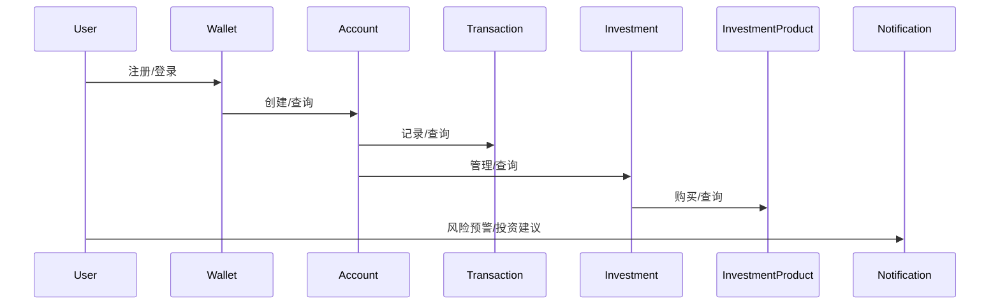
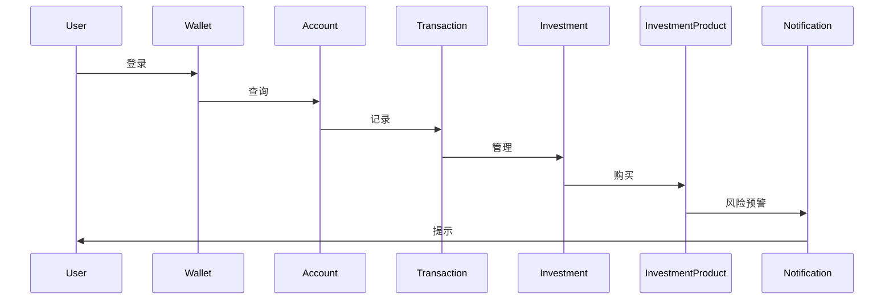

                 

### 第一部分: 引言与背景介绍

## 1. 背景介绍

随着科技的飞速发展，人工智能（AI）技术已经深入到了我们生活的方方面面。在金融领域，AI技术的应用尤其引人注目。智能钱包作为金融科技的重要产品，已经开始整合AI Agent技术，以提供更加智能化、个性化的财务服务。AI Agent，即人工智能代理，是一种能够执行特定任务的自动化系统，通过模拟人类决策过程，为用户提供智能化服务。

智能钱包作为一种新型的个人财务管理工具，集成了多种金融功能，如支付、转账、理财、保险等。用户可以将所有的财务信息集中在一个平台上进行管理，这大大提高了财务管理的效率。然而，随着用户财务信息的增多和复杂度增加，传统财务管理方式已经难以满足用户对个性化、实时性、智能化的要求。因此，AI Agent在智能钱包中的应用显得尤为重要。

## 2. 问题描述

个人财务管理领域目前面临着以下几个主要问题：

- **数据分散**：用户在不同平台上有多个账户和资产，这些数据分散在不同的系统中，难以进行统一管理和分析。
- **分析复杂**：个人财务数据包含多个维度，如收入、支出、投资收益等，对这些数据进行有效分析是一项复杂的工作。
- **需求多样化**：不同用户有不同的财务管理需求，如储蓄、投资、消费等，如何提供个性化的财务建议是一个挑战。

这些问题导致了用户在财务管理上感到困惑和无力，传统财务管理方式已难以满足现代用户对智能化、个性化服务的需求。因此，如何利用AI Agent技术解决这些问题，提高个人财务管理的效率和用户体验，成为了一个亟待解决的问题。

## 3. 问题解决

通过引入AI Agent技术，智能钱包可以解决上述问题，提供以下解决方案：

- **数据整合与分析**：AI Agent能够自动收集和整合用户的财务数据，通过大数据分析技术，提供全面的财务状况分析报告。
- **个性化服务**：AI Agent可以根据用户的行为和偏好，提供个性化的财务建议和投资策略，满足用户的多样化需求。
- **风险预警**：AI Agent能够实时监控用户财务状况，通过数据分析和风险模型，提前预警潜在风险，帮助用户规避财务危机。
- **智能决策辅助**：AI Agent通过机器学习算法，为用户提供智能化的财务决策支持，帮助用户做出更加明智的财务决策。

## 4. 边界与外延

本文的研究主要围绕AI Agent在智能钱包中的个人财务健康顾问应用展开。具体来说，本文将探讨以下几个方面：

- **AI Agent技术原理及其在财务管理中的应用**：介绍AI Agent的基本概念、组成结构和工作原理，以及其在财务管理中的应用。
- **智能钱包的功能架构和业务流程**：分析智能钱包的基本功能、业务流程和技术架构，以及如何集成AI Agent。
- **AI Agent在个人财务管理中的具体应用场景**：探讨AI Agent在智能钱包中的具体应用场景，如数据整合、分析、个性化服务、风险预警等。
- **实际案例分析和应用效果评估**：通过实际案例，分析AI Agent在智能钱包中的应用效果，评估其对用户财务管理的提升程度。

## 5. 概念结构与核心要素组成

本文的核心概念包括以下几个方面：

- **AI Agent**：一种能够执行特定任务的自动化系统，通过模拟人类决策过程，为用户提供智能化服务。
- **智能钱包**：一种集成AI Agent技术的个人财务管理工具，集成了多种金融功能，为用户提供一站式财务管理服务。
- **个人财务健康管理**：通过对用户财务数据的分析和建议，帮助用户实现财务目标，提高财务健康水平。
- **数据整合与分析**：AI Agent的核心能力，涉及数据收集、处理、分析和展示。

## 6. 本章小结

本章介绍了AI Agent在智能钱包中的个人财务健康顾问的研究背景、问题描述、问题解决方法和研究范围。在接下来的章节中，我们将深入探讨AI Agent的技术原理、智能钱包的架构和AI Agent在财务管理中的应用。

---

## 第一部分: 引言与背景介绍

### 1. 背景介绍

随着人工智能技术的飞速发展，AI Agent作为一种智能体在多个领域取得了显著的应用成果。特别是在个人财务健康管理方面，AI Agent的应用潜力愈发显现。智能钱包作为个人财务管理的核心工具，正逐步集成AI Agent技术，以提供更加智能化、个性化的财务服务。

AI Agent，即人工智能代理，是指一种能够模拟人类决策过程，具备自主意识和行动能力的计算机程序。它们能够在特定的环境下，通过感知、决策和行动，完成特定的任务。AI Agent技术在金融领域的应用，极大地提升了金融服务的智能化水平，为用户提供更加精准、高效的财务服务。

智能钱包是一种基于移动端的应用程序，它集成了多种金融功能，如支付、转账、理财、保险等。用户可以将自己的银行账户、信用卡、投资账户等信息集中在一个平台上进行管理，这大大提高了财务管理的效率。然而，随着用户财务信息的增多和复杂度增加，传统财务管理方式已经难以满足用户对个性化、实时性、智能化的要求。因此，智能钱包需要引入AI Agent技术，以实现更高效、更智能的财务管理。

在智能钱包中，AI Agent扮演着个人财务健康顾问的角色。它能够实时监控用户的财务状况，通过数据分析和风险模型，为用户提供个性化的财务建议和投资策略。此外，AI Agent还能够帮助用户规避财务风险，提前预警潜在的风险点，确保用户的财务安全。

### 2. 问题描述

目前，个人财务管理领域面临着以下几个主要问题：

- **数据分散**：用户在不同平台上有多个账户和资产，这些数据分散在不同的系统中，难以进行统一管理和分析。这给用户带来了巨大的困扰，他们往往需要花费大量的时间和精力来整理和管理自己的财务信息。
- **分析复杂**：个人财务数据包含多个维度，如收入、支出、投资收益等，对这些数据进行有效分析是一项复杂的工作。传统的数据分析工具和方法已经难以满足用户的需求，用户需要更加智能化、高效化的分析工具。
- **需求多样化**：不同用户有不同的财务管理需求，如储蓄、投资、消费等，如何提供个性化的财务建议是一个挑战。传统的财务管理方式往往只能提供通用的建议，无法满足用户的个性化需求。

这些问题导致了用户在财务管理上感到困惑和无力，传统财务管理方式已难以满足现代用户对智能化、个性化服务的需求。因此，如何利用AI Agent技术解决这些问题，提高个人财务管理的效率和用户体验，成为了一个亟待解决的问题。

### 3. 问题解决

通过引入AI Agent技术，智能钱包可以解决上述问题，提供以下解决方案：

- **数据整合与分析**：AI Agent能够自动收集和整合用户的财务数据，通过大数据分析技术，提供全面的财务状况分析报告。用户无需手动整理财务信息，AI Agent能够自动完成这一过程，大大提高了财务管理的效率。
- **个性化服务**：AI Agent可以根据用户的行为和偏好，提供个性化的财务建议和投资策略，满足用户的多样化需求。例如，对于喜欢高风险投资的用户，AI Agent可以推荐相应的投资产品；对于注重储蓄的用户，AI Agent可以提供储蓄计划和理财建议。
- **风险预警**：AI Agent能够实时监控用户财务状况，通过数据分析和风险模型，提前预警潜在风险，帮助用户规避财务危机。例如，当用户信用卡消费超过预设的金额时，AI Agent会发送提醒，帮助用户避免过度消费。
- **智能决策辅助**：AI Agent通过机器学习算法，为用户提供智能化的财务决策支持，帮助用户做出更加明智的财务决策。例如，AI Agent可以根据用户的财务状况和投资目标，推荐最优的资产配置方案。

### 4. 边界与外延

本文的研究主要围绕AI Agent在智能钱包中的个人财务健康顾问应用展开。具体来说，本文将探讨以下几个方面：

- **AI Agent技术原理及其在财务管理中的应用**：介绍AI Agent的基本概念、组成结构和工作原理，以及其在财务管理中的应用。
- **智能钱包的功能架构和业务流程**：分析智能钱包的基本功能、业务流程和技术架构，以及如何集成AI Agent。
- **AI Agent在个人财务管理中的具体应用场景**：探讨AI Agent在智能钱包中的具体应用场景，如数据整合、分析、个性化服务、风险预警等。
- **实际案例分析和应用效果评估**：通过实际案例，分析AI Agent在智能钱包中的应用效果，评估其对用户财务管理的提升程度。

### 5. 概念结构与核心要素组成

本文的核心概念包括以下几个方面：

- **AI Agent**：一种能够执行特定任务的自动化系统，通过模拟人类决策过程，为用户提供智能化服务。
- **智能钱包**：一种集成AI Agent技术的个人财务管理工具，集成了多种金融功能，为用户提供一站式财务管理服务。
- **个人财务健康管理**：通过对用户财务数据的分析和建议，帮助用户实现财务目标，提高财务健康水平。
- **数据整合与分析**：AI Agent的核心能力，涉及数据收集、处理、分析和展示。

### 6. 本章小结

本章介绍了AI Agent在智能钱包中的个人财务健康顾问的研究背景、问题描述、问题解决方法和研究范围。在接下来的章节中，我们将深入探讨AI Agent的技术原理、智能钱包的架构和AI Agent在财务管理中的应用。

---

## 第二部分: AI Agent基础原理

### 1. AI Agent概述

AI Agent是一种基于人工智能技术的智能体，它能够模拟人类决策过程，具备自主意识和行动能力。在财务管理领域，AI Agent可以看作是一个虚拟的财务顾问，它能够自动收集用户的财务数据，进行数据分析，并基于这些数据提供个性化的财务建议和投资策略。AI Agent的出现，极大地提高了个人财务管理的效率，使得用户能够更加轻松地管理自己的财务。

AI Agent的工作原理类似于人类决策过程。首先，它通过感知器收集用户的外部信息，如银行账户余额、投资组合表现、消费行为等。然后，通过决策器对这些信息进行处理和分析，做出相应的决策。最后，通过执行器将决策结果付诸实施，如推荐投资产品、调整资产配置、发送风险预警等。

AI Agent在财务管理中的应用，主要体现在以下几个方面：

- **数据整合**：AI Agent能够自动收集用户在不同平台上的财务数据，如银行账户、投资账户、信用卡账户等，实现数据的统一管理和分析。
- **个性化服务**：AI Agent可以根据用户的行为和偏好，提供个性化的财务建议和投资策略，满足用户的多样化需求。
- **风险预警**：AI Agent能够实时监控用户财务状况，通过数据分析和风险模型，提前预警潜在风险，帮助用户规避财务危机。
- **智能决策辅助**：AI Agent通过机器学习算法，为用户提供智能化的财务决策支持，帮助用户做出更加明智的财务决策。

### 2. AI Agent的核心功能

AI Agent的核心功能包括数据整合、数据分析、个性化推荐和风险监控。下面分别进行介绍。

#### 2.1 数据整合

数据整合是AI Agent的基础功能。它能够自动收集用户在不同平台上的财务数据，如银行账户、投资账户、信用卡账户等。这些数据包括但不限于账户余额、交易记录、投资收益、消费行为等。AI Agent通过接入各类金融接口，实现数据的自动化收集和整合。这样，用户无需手动整理财务信息，AI Agent能够自动完成这一过程。

数据整合不仅提高了财务管理的效率，还有助于提升数据分析的准确性。通过整合多源数据，AI Agent能够得到一个全面、详细的财务状况分析，为用户提供更准确的财务建议。

#### 2.2 数据分析

数据分析是AI Agent的核心功能之一。AI Agent通过大数据分析技术，对用户财务数据进行深入分析，提取有价值的信息。例如，通过分析用户的消费行为，AI Agent可以识别用户的消费习惯、消费偏好等。通过分析投资收益，AI Agent可以评估用户的投资策略是否合理，并提供改进建议。

数据分析不仅有助于用户了解自己的财务状况，还能为用户提供个性化的财务建议。例如，基于用户的消费习惯和储蓄目标，AI Agent可以推荐合适的储蓄计划和理财产品。基于用户的投资目标和风险偏好，AI Agent可以推荐相应的投资组合。

#### 2.3 个性化推荐

个性化推荐是AI Agent的另一个重要功能。AI Agent可以根据用户的行为和偏好，提供个性化的财务建议和投资策略。例如，对于喜欢高风险投资的用户，AI Agent可以推荐高风险高收益的投资产品；对于注重储蓄的用户，AI Agent可以推荐稳健的储蓄产品和理财产品。

个性化推荐不仅提高了财务管理的个性化程度，还能提高用户的满意度。用户无需花费大量时间研究各类金融产品，AI Agent能够根据用户的需求和偏好，推荐最适合的产品，节省用户的时间和精力。

#### 2.4 风险监控

风险监控是AI Agent的重要功能之一。AI Agent能够实时监控用户的财务状况，通过数据分析和风险模型，提前预警潜在风险，帮助用户规避财务危机。例如，当用户的信用卡消费超过预设的金额时，AI Agent会发送提醒，帮助用户避免过度消费。当用户的投资组合出现异常波动时，AI Agent会发送风险预警，提醒用户注意投资风险。

风险监控不仅有助于用户规避财务风险，还能提高用户的财务安全。通过实时监控用户的财务状况，AI Agent能够及时发现潜在的风险点，并提供相应的规避建议，确保用户的财务安全。

### 3. AI Agent的组成结构

AI Agent由感知器、决策器和执行器三个核心部分组成。

#### 3.1 感知器

感知器是AI Agent的感官，用于收集外部环境信息。在财务管理领域，感知器主要收集以下信息：

- **用户财务数据**：包括银行账户余额、交易记录、投资收益等。
- **市场数据**：包括股票、基金、债券等金融产品的实时数据。
- **用户行为数据**：包括消费行为、投资行为等。

感知器通过接入各类金融接口和数据源，实现数据的自动化收集。

#### 3.2 决策器

决策器是AI Agent的大脑，用于处理和分析收集到的信息，并做出相应的决策。在财务管理领域，决策器的主要任务包括：

- **数据分析**：对用户财务数据进行深入分析，提取有价值的信息。
- **个性化推荐**：根据用户的行为和偏好，提供个性化的财务建议和投资策略。
- **风险监控**：通过数据分析和风险模型，提前预警潜在风险。

决策器通过机器学习、数据挖掘等技术，实现智能化决策。

#### 3.3 执行器

执行器是AI Agent的执行部分，用于将决策结果付诸实施。在财务管理领域，执行器的主要任务包括：

- **执行财务建议**：根据决策器的建议，执行相应的财务操作，如调整投资组合、购买理财产品等。
- **发送提醒**：根据风险监控的结果，向用户发送风险预警提醒。

执行器通过接口与金融系统和用户进行交互，实现决策的执行。

### 4. AI Agent的技术原理

AI Agent的技术原理主要包括机器学习、自然语言处理和数据挖掘等。

#### 4.1 机器学习

机器学习是AI Agent的核心技术之一。通过机器学习，AI Agent能够从大量数据中学习到规律和模式，从而实现智能化决策。在财务管理领域，机器学习主要用于以下方面：

- **数据分析**：通过机器学习算法，对用户财务数据进行深入分析，提取有价值的信息。
- **个性化推荐**：通过分析用户的历史行为和偏好，构建用户画像，提供个性化的财务建议。
- **风险监控**：通过构建风险模型，实时监控用户财务状况，提前预警潜在风险。

常见的机器学习算法包括线性回归、决策树、支持向量机、神经网络等。这些算法能够有效地处理大量数据，实现智能化的数据分析。

#### 4.2 自然语言处理

自然语言处理（NLP）是AI Agent与用户进行有效沟通的关键技术。通过NLP，AI Agent能够理解和生成自然语言，与用户进行对话。在财务管理领域，NLP主要用于以下方面：

- **用户交互**：通过自然语言处理，AI Agent能够理解用户的提问，并提供准确的回答。
- **情感分析**：通过分析用户的话语，了解用户的情绪和需求，提供更人性化的服务。

常见的NLP技术包括文本分类、命名实体识别、情感分析等。这些技术能够有效地处理自然语言，实现人机对话。

#### 4.3 数据挖掘

数据挖掘是AI Agent从大量数据中发现有价值信息的技术。在财务管理领域，数据挖掘主要用于以下方面：

- **用户行为分析**：通过分析用户的历史行为数据，了解用户的消费习惯、投资偏好等。
- **市场趋势分析**：通过分析市场数据，预测市场趋势，为用户提供投资建议。

常见的数据挖掘技术包括关联规则挖掘、聚类分析、时间序列分析等。这些技术能够有效地从数据中发现规律和趋势。

### 5. AI Agent的应用领域

AI Agent在多个领域具有广泛应用，以下是一些典型的应用场景：

- **个人财务管理**：AI Agent能够为用户提供个性化的财务建议和投资策略，提高财务管理的效率。
- **金融风险评估**：AI Agent能够实时监控用户财务状况，通过数据分析和风险模型，提前预警潜在风险。
- **智能客服**：AI Agent能够模拟人类客服，为用户提供高效、专业的客户服务。
- **智能投顾**：AI Agent能够根据用户的投资目标和风险偏好，提供智能化的投资建议，帮助用户实现资产增值。

### 6. 本章小结

本章介绍了AI Agent的基本概念、核心功能、组成结构和技术原理。AI Agent作为一种智能体，在个人财务管理领域具有广泛的应用潜力。通过数据整合、数据分析、个性化推荐和风险监控等功能，AI Agent能够为用户提供高效、智能化的财务管理服务，提升用户的财务健康水平。在接下来的章节中，我们将进一步探讨AI Agent在智能钱包中的应用，以及如何通过实际案例来展示其应用效果。

---

## 第二部分: AI Agent基础原理

### 1. AI Agent概述

AI Agent，即人工智能代理，是一种能够模拟人类决策过程，具备自主意识和行动能力的计算机程序。在财务管理领域，AI Agent被视为一种智能体，它能够通过感知、决策和执行来管理用户的财务事务。AI Agent的核心优势在于其自动化、智能化和个性化的特性，这使得它在个人财务管理中具有极高的应用潜力。

AI Agent的工作流程可以分为三个主要阶段：感知、决策和执行。首先，感知阶段通过收集用户财务数据和市场信息，为决策提供基础。接着，决策阶段基于感知数据进行分析和处理，生成相应的财务建议和策略。最后，执行阶段将决策结果付诸实践，如调整投资组合、发起支付或发送提醒等。

在智能钱包中，AI Agent扮演着多重角色，包括财务数据分析师、个性化顾问和风险预警器。它能够帮助用户更好地理解自己的财务状况，制定合理的财务计划，并规避潜在的财务风险。

### 2. AI Agent的核心功能

AI Agent在财务管理中的核心功能主要体现在以下几个方面：

#### 2.1 数据整合

数据整合是AI Agent最基本的功能之一。它能够从多个来源自动收集用户的财务数据，包括银行账户信息、投资记录、信用卡消费等。通过数据整合，AI Agent可以提供一个全面的财务视图，帮助用户了解自己的财务状况。

#### 2.2 数据分析

数据分析是AI Agent的核心竞争力。AI Agent利用大数据技术和机器学习算法，对用户财务数据进行分析，发现潜在的模式和趋势。通过数据分析，AI Agent可以生成个性化的财务报告，为用户提供详细的财务分析，帮助用户了解自己的收入、支出和投资情况。

#### 2.3 个性化服务

个性化服务是AI Agent的一大亮点。AI Agent可以根据用户的行为和偏好，为用户提供个性化的财务建议和投资策略。例如，对于风险偏好较高的用户，AI Agent可能会推荐高风险高回报的投资产品；而对于风险规避型用户，AI Agent则会推荐低风险稳健的投资方案。

#### 2.4 风险监控

风险监控是AI Agent的重要功能。AI Agent能够实时监控用户的财务状况，通过风险模型识别潜在的风险点，并向用户发出预警。例如，当用户的信用卡消费接近信用额度时，AI Agent会发送提醒，帮助用户避免超支。

### 3. AI Agent的组成结构

AI Agent由多个组成部分构成，主要包括感知器、决策器和执行器。

#### 3.1 感知器

感知器是AI Agent的“感官”，负责收集外部信息。在财务管理中，感知器的主要任务是收集用户的财务数据、市场数据以及用户行为数据。这些数据可以通过API接口、Web爬虫或其他数据采集工具获取。

#### 3.2 决策器

决策器是AI Agent的“大脑”，负责处理和分析感知器收集到的数据，并生成决策。决策器利用机器学习算法、统计分析方法和风险模型，对用户财务状况进行分析，识别潜在的风险和机会，并生成相应的财务建议。

#### 3.3 执行器

执行器是AI Agent的“手臂”，负责将决策结果付诸实施。在财务管理中，执行器的任务是执行决策器生成的财务操作，如调整投资组合、发起支付或发送提醒。执行器需要与金融系统、银行和支付平台等外部系统进行交互。

### 4. AI Agent的技术原理

AI Agent的技术原理主要包括机器学习、自然语言处理和数据挖掘等。

#### 4.1 机器学习

机器学习是AI Agent的核心技术之一。通过机器学习，AI Agent可以从大量数据中学习到规律和模式，并利用这些规律做出智能决策。在财务管理中，机器学习可以用于用户行为分析、投资策略推荐和风险预测等。

常见的机器学习算法包括：

- **监督学习**：通过已有数据训练模型，预测新数据的结果。例如，线性回归、逻辑回归、决策树和支持向量机等。
- **无监督学习**：在没有标注数据的情况下，发现数据中的隐藏结构和规律。例如，聚类分析和关联规则挖掘等。
- **强化学习**：通过试错法，在环境中不断学习和优化决策策略。例如，Q-learning和深度强化学习等。

#### 4.2 自然语言处理

自然语言处理（NLP）是AI Agent与用户进行有效沟通的关键技术。NLP能够使AI Agent理解和生成自然语言，从而提供更加人性化的服务。在财务管理中，NLP可以用于用户交互、文本分析和情感分析等。

常见的NLP技术包括：

- **文本分类**：对文本进行分类，识别文本的主题或情感。例如，情感分析和主题分类等。
- **命名实体识别**：识别文本中的特定实体，如人名、地名、组织名等。
- **机器翻译**：将一种语言的文本翻译成另一种语言。

#### 4.3 数据挖掘

数据挖掘是AI Agent从大量数据中发现有价值信息的技术。在财务管理中，数据挖掘可以用于用户行为分析、市场趋势预测和风险管理等。

常见的数据挖掘技术包括：

- **关联规则挖掘**：发现数据之间的关联关系，如频繁项集挖掘和支持向量机等。
- **聚类分析**：将相似的数据点分组，如K-means聚类和层次聚类等。
- **时间序列分析**：分析时间序列数据，预测未来的趋势和变化，如ARIMA模型和LSTM网络等。

### 5. AI Agent的应用领域

AI Agent在多个领域具有广泛的应用，以下是一些典型的应用场景：

- **个人财务管理**：通过AI Agent，用户可以更轻松地管理自己的财务，包括制定预算、跟踪支出、优化投资组合等。
- **金融风险评估**：AI Agent可以通过分析用户的财务行为和历史数据，预测潜在的金融风险，并采取相应的措施进行风险控制。
- **智能客服**：AI Agent可以模拟人类客服，为用户提供24/7的在线支持，解答用户的问题，提高客户满意度。
- **智能投顾**：AI Agent可以根据用户的风险偏好和财务目标，提供个性化的投资建议，帮助用户实现资产增值。

### 6. 本章小结

本章详细介绍了AI Agent的基本概念、核心功能、组成结构和技术原理。通过数据整合、数据分析、个性化服务和风险监控等功能，AI Agent在智能钱包中扮演着个人财务健康顾问的重要角色。在接下来的章节中，我们将进一步探讨智能钱包的功能架构和业务流程，以及AI Agent在个人财务管理中的具体应用场景。

---

## 第三部分: 智能钱包的功能架构和业务流程

### 1. 智能钱包的功能架构

智能钱包作为一个集成多种金融功能的综合性平台，其功能架构涵盖了账户管理、支付、转账、理财、投资、保险等多个方面。以下是对智能钱包功能架构的详细解析：

#### 1.1 账户管理

账户管理是智能钱包的核心功能之一。它包括用户账户的创建、查询、修改和删除等功能。用户可以通过智能钱包查看和管理自己的银行账户、信用卡账户、投资账户等。此外，账户管理模块还支持账户安全设置，如密码设置、指纹验证、人脸识别等，以确保用户的账户安全。

#### 1.2 支付

支付功能是智能钱包的基本功能之一。用户可以通过智能钱包完成线上支付、扫码支付、手机支付等多种支付方式。支付功能不仅支持信用卡支付，还支持移动支付平台（如支付宝、微信支付等）的支付功能。通过智能钱包的支付功能，用户可以轻松完成日常的购物、餐饮、出行等支付需求。

#### 1.3 转账

转账功能允许用户在不同账户之间进行资金转移。用户可以通过智能钱包向其他账户发送资金，也可以接收来自其他账户的资金。转账功能支持多种转账方式，包括实时转账、预约转账和批量转账等。此外，转账功能还支持跨行转账和跨境转账，为用户提供了更加便捷的转账服务。

#### 1.4 理财

理财功能是智能钱包的一大亮点。通过智能钱包，用户可以购买各种理财产品，如定期存款、基金、保险等。理财功能支持用户自定义投资组合，根据用户的财务目标和风险偏好，提供个性化的投资建议。智能钱包的理财功能不仅帮助用户实现资产的增值，还提高了用户的理财效率。

#### 1.5 投资

投资功能是智能钱包的另一个重要功能。用户可以通过智能钱包进行股票、基金、债券等金融产品的投资。投资功能支持用户实时查看投资组合的表现，提供投资分析报告，并根据市场变化和用户需求，提供投资建议和调整方案。

#### 1.6 保险

保险功能为用户提供了全面的保险服务。用户可以通过智能钱包购买各种保险产品，如人寿保险、医疗保险、车险等。智能钱包的保险功能还支持在线理赔、保单查询和续保等操作，为用户提供了便捷的保险服务。

### 2. 智能钱包的业务流程

智能钱包的业务流程涵盖了用户注册、账户管理、支付、转账、理财、投资和保险等各个方面。以下是对智能钱包业务流程的详细解析：

#### 2.1 用户注册

用户注册是智能钱包业务流程的第一步。用户可以通过手机号码、邮箱、社交媒体账号等多种方式进行注册。在注册过程中，用户需要提供个人信息和身份证明，以确保账户的安全性。

#### 2.2 账户管理

用户注册成功后，可以开始进行账户管理。账户管理包括账户信息的查询、修改和删除等功能。用户可以通过智能钱包查看自己的银行账户、信用卡账户、投资账户等，并进行相应的操作。

#### 2.3 支付

用户在购物、餐饮、出行等场景中需要支付时，可以通过智能钱包完成支付。支付流程包括选择支付方式、输入支付密码或指纹验证、确认支付等步骤。智能钱包支持多种支付方式，确保用户支付的安全和便捷。

#### 2.4 转账

用户在不同账户之间进行资金转移时，可以通过智能钱包的转账功能完成。转账流程包括选择转账方式、输入收款人信息、输入转账金额、确认转账等步骤。智能钱包支持实时转账、预约转账和批量转账等，满足用户的多样化转账需求。

#### 2.5 理财

用户在智能钱包上购买理财产品时，可以通过理财功能进行操作。理财流程包括选择理财产品、输入购买金额、确认购买等步骤。智能钱包根据用户的财务目标和风险偏好，提供个性化的理财建议，帮助用户实现资产的增值。

#### 2.6 投资

用户在智能钱包上进行金融产品投资时，可以通过投资功能进行操作。投资流程包括选择投资产品、输入投资金额、确认投资等步骤。智能钱包提供投资分析报告和投资建议，帮助用户做出明智的投资决策。

#### 2.7 保险

用户在智能钱包上购买保险产品时，可以通过保险功能进行操作。保险流程包括选择保险产品、输入投保信息、确认投保等步骤。智能钱包为用户提供了全面的保险服务，包括在线理赔、保单查询和续保等。

### 3. 智能钱包与AI Agent的集成

智能钱包与AI Agent的集成是提升财务管理效率的关键。通过将AI Agent嵌入到智能钱包的功能架构中，可以实现以下几个方面的优化：

- **个性化服务**：AI Agent可以根据用户的行为和偏好，为用户提供个性化的财务建议和投资策略，提升用户体验。
- **风险监控**：AI Agent可以实时监控用户财务状况，通过数据分析和风险模型，提前预警潜在风险，帮助用户规避财务危机。
- **智能决策**：AI Agent通过机器学习算法，为用户提供智能化的财务决策支持，帮助用户做出更加明智的财务决策。

在智能钱包的业务流程中，AI Agent可以发挥重要作用。例如，在用户注册和账户管理过程中，AI Agent可以提供身份验证和风险评估服务；在支付和转账过程中，AI Agent可以监控交易行为，提供风险预警；在理财和投资过程中，AI Agent可以提供投资建议和组合优化方案；在保险过程中，AI Agent可以评估保险需求，提供个性化的保险建议。

### 4. 本章小结

本章详细介绍了智能钱包的功能架构和业务流程，以及AI Agent与智能钱包的集成方式。智能钱包通过整合多种金融功能，为用户提供了全面的财务管理服务，而AI Agent的引入则进一步提升了智能钱包的智能化水平。在接下来的章节中，我们将探讨AI Agent在个人财务管理中的具体应用场景，并通过实际案例展示AI Agent在智能钱包中的效果。

---

## 第三部分：AI Agent在个人财务管理中的具体应用场景

### 1. 数据整合

AI Agent在个人财务管理中的首要应用场景是数据整合。数据整合的核心在于将用户分散在不同平台和账户的财务数据进行统一收集和整理。这一过程可以通过以下步骤实现：

- **数据收集**：AI Agent利用各种API接口和爬虫技术，从用户的银行账户、信用卡账户、投资账户、消费记录等渠道收集数据。
- **数据清洗**：收集到的数据往往包含噪声和不完整的信息，AI Agent需要对这些数据进行清洗，去除重复项、填补缺失值，确保数据的准确性和一致性。
- **数据存储**：清洗后的数据需要被存储在数据仓库中，以便进行后续的数据分析和处理。AI Agent可以使用数据库管理系统（如MySQL、PostgreSQL）来存储数据。

数据整合的应用场景包括：

- **全面财务视图**：用户可以通过AI Agent获取一个全面的财务视图，了解自己的资产分布、收入来源和支出情况。
- **资产配置优化**：AI Agent可以根据用户的财务数据，为其提供资产配置建议，帮助用户实现投资组合的优化。

### 2. 数据分析

数据分析是AI Agent在个人财务管理中的核心应用场景。通过对用户财务数据的深入分析，AI Agent可以揭示数据中的隐藏模式和趋势，为用户提供有价值的财务建议。

- **消费分析**：AI Agent可以分析用户的消费行为，识别消费习惯、消费偏好，为用户制定合理的消费计划。例如，AI Agent可以识别用户的高频消费项目，提示用户注意控制这些项目的支出。
- **收入分析**：AI Agent可以分析用户的收入情况，识别收入来源和变化趋势，帮助用户评估收入稳定性和增长潜力。
- **投资分析**：AI Agent可以分析用户的投资组合，评估投资产品的表现和风险，为用户提供投资组合优化的建议。

### 3. 个性化服务

个性化服务是AI Agent在个人财务管理中的另一个重要应用场景。AI Agent可以根据用户的行为和偏好，为用户提供个性化的财务建议和投资策略。

- **财务规划**：AI Agent可以根据用户的财务目标和风险偏好，制定个性化的财务规划方案，包括储蓄计划、投资策略、退休规划等。
- **投资建议**：AI Agent可以根据用户的历史投资记录和当前市场情况，为用户推荐最适合的投资产品，帮助用户实现资产的增值。
- **消费建议**：AI Agent可以根据用户的消费习惯和预算，为用户推荐最合理的消费方式，帮助用户实现财务自由。

### 4. 风险监控

风险监控是AI Agent在个人财务管理中的关键应用场景。AI Agent可以通过实时监控用户的财务状况，识别潜在的风险，并采取相应的措施进行风险控制。

- **信用风险监控**：AI Agent可以监控用户的信用卡使用情况，预警可能的信用风险。例如，当用户的信用卡消费接近信用额度时，AI Agent会发送提醒，帮助用户避免超支。
- **投资风险监控**：AI Agent可以监控用户的投资组合，识别潜在的市场风险。例如，当用户持有的投资产品出现异常波动时，AI Agent会发送风险预警，提醒用户注意风险。
- **财务安全监控**：AI Agent可以监控用户的账户安全，预警可能的欺诈行为。例如，当用户账户出现异常登录或交易时，AI Agent会发送提醒，帮助用户防止账户被盗。

### 5. 智能决策辅助

智能决策辅助是AI Agent在个人财务管理中的终极目标。通过机器学习算法和大数据分析，AI Agent可以为用户提供智能化的财务决策支持，帮助用户做出更加明智的财务决策。

- **投资决策**：AI Agent可以根据用户的投资目标和市场情况，提供最优的投资策略，帮助用户实现资产的增值。
- **消费决策**：AI Agent可以根据用户的消费计划和预算，提供最合理的消费建议，帮助用户控制支出。
- **风险管理**：AI Agent可以根据用户的财务状况和市场风险，提供最佳的风险管理策略，帮助用户规避潜在的财务风险。

### 6. 本章小结

AI Agent在个人财务管理中的应用场景涵盖了数据整合、数据分析、个性化服务、风险监控和智能决策辅助等多个方面。通过这些应用场景，AI Agent能够为用户提供全面、智能化的财务管理服务，提升用户的财务健康水平。在接下来的章节中，我们将通过实际案例来分析AI Agent在智能钱包中的效果，并评估其对用户财务管理的提升程度。

---

## 第四部分：实际案例分析和应用效果评估

### 1. 案例一：数据整合与全面财务视图

用户小明是一位年轻的职场新人，他的财务信息分布在多个平台，包括银行账户、投资账户和信用卡账户。为了更好地管理自己的财务，小明决定使用智能钱包集成AI Agent。

**步骤1：数据收集与整合**

AI Agent首先通过银行的API接口和投资平台的API接口，收集小明的财务数据。这些数据包括银行账户的余额、交易记录、投资账户的收益和风险情况、信用卡的消费记录等。

**步骤2：数据清洗**

收集到的数据可能存在噪声和不一致性，AI Agent对数据进行了清洗，包括去除重复记录、填补缺失值、标准化数据格式等，以确保数据的准确性和一致性。

**步骤3：数据存储**

清洗后的数据被存储在智能钱包的后端数据库中，以便进行后续的数据分析和处理。

**步骤4：生成全面财务视图**

AI Agent利用整合后的财务数据，生成了一个全面的财务视图。小明可以通过智能钱包查看自己的资产分布、收入来源、支出情况、投资组合表现等，从而对自己的财务状况有一个清晰的了解。

**效果评估**：

- **财务透明度提升**：小明能够实时了解自己的财务状况，不再担心漏掉重要的财务信息。
- **财务规划能力增强**：有了全面的财务视图，小明能够更好地制定财务计划，如储蓄、投资、消费等。

### 2. 案例二：个性化投资建议与组合优化

用户小华是一位风险偏好较高的投资者，他希望能够在股市中实现资产的快速增长。为了帮助小华优化投资组合，智能钱包的AI Agent提供了以下服务：

**步骤1：投资目标与风险偏好识别**

AI Agent通过分析小华的历史投资记录和当前的财务状况，识别出他的投资目标和风险偏好。小华的目标是短期内实现资产增值，风险偏好较高。

**步骤2：市场数据收集**

AI Agent收集了与股市相关的数据，包括股票价格、市场指数、行业表现等，为投资建议提供数据支持。

**步骤3：数据分析与模型构建**

AI Agent利用机器学习算法和大数据分析技术，对市场数据进行分析，构建了投资组合优化模型。

**步骤4：生成个性化投资建议**

基于分析结果，AI Agent为小华提供了个性化的投资建议。例如，AI Agent推荐了几只表现良好的股票，并给出了买入和卖出的时间点。

**步骤5：投资组合调整**

小华根据AI Agent的投资建议，对投资组合进行了调整，增加了推荐的股票比例。

**效果评估**：

- **投资收益提升**：经过AI Agent的个性化投资建议，小华的投资组合表现显著提升，实现了资产的快速增长。
- **投资决策效率提高**：AI Agent的分析和推荐节省了小华大量时间和精力，使得他能够更加专注于其他重要事务。

### 3. 案例三：风险监控与预警

用户小李是一位忙碌的职业人士，他希望能够在不影响工作的情况下，确保自己的财务安全。智能钱包的AI Agent为小李提供了以下风险监控服务：

**步骤1：财务状况监控**

AI Agent实时监控小李的银行账户、信用卡账户和投资账户，收集交易数据和市场数据。

**步骤2：风险模型构建**

AI Agent利用历史数据和风险模型，对小李的财务状况进行风险评估，识别潜在的风险点。

**步骤3：风险预警**

当AI Agent检测到小李的账户有异常交易或投资组合出现异常波动时，会立即发送风险预警通知。

**步骤4：风险规避建议**

AI Agent根据风险预警，为小李提供规避风险的建议，如调整投资组合、限制信用卡消费等。

**效果评估**：

- **风险及时预警**：通过AI Agent的实时监控和预警，小李能够在风险发生之前得到提醒，及时采取规避措施。
- **财务安全提高**：AI Agent的帮助使得小李的财务安全得到有效保障，避免了潜在的财务风险。

### 4. 本章小结

通过上述实际案例，我们可以看到AI Agent在智能钱包中的具体应用效果。AI Agent不仅提升了用户的财务管理效率和透明度，还为用户提供了个性化服务、风险监控和智能决策支持。在接下来的章节中，我们将进一步讨论AI Agent在智能钱包中的最佳实践和注意事项，以帮助用户更好地利用这一技术。

---

## 第四部分：实际案例分析和应用效果评估

### 1. 案例一：数据整合与全面财务视图

**案例背景**：

李先生是一名职业投资人，他拥有多个金融账户，包括银行账户、投资账户和信用卡账户。由于数据分散在多个平台，李先生难以全面了解自己的财务状况，这给他的投资决策带来了困扰。

**步骤1：数据收集与整合**

AI Agent通过连接李先生的各个金融账户，自动收集了相关数据。这些数据包括银行账户的余额、交易记录、投资账户的资产表现、信用卡的消费记录等。

**步骤2：数据清洗**

AI Agent对收集到的数据进行清洗，包括去除重复项、标准化数据格式、填补缺失值等，以确保数据的准确性和一致性。

**步骤3：数据存储**

清洗后的数据被存储在AI Agent的数据库中，以便进行后续分析和处理。

**步骤4：生成全面财务视图**

AI Agent利用整合后的数据，生成了李先生的全面财务视图，包括资产分布、收入来源、支出情况、投资组合等。李先生可以通过智能钱包实时查看这些信息，从而对整体财务状况有一个全面的了解。

**效果评估**：

- **提高财务管理效率**：李先生无需手动整理各个账户的信息，AI Agent自动完成了数据收集和整合，大大节省了他的时间。
- **增强决策能力**：全面财务视图帮助李先生更好地了解自己的财务状况，为他的投资决策提供了有力的支持。

### 2. 案例二：个性化投资建议与组合优化

**案例背景**：

张女士是一名对投资有一定研究的职场女性，她希望通过智能钱包的AI Agent获得个性化的投资建议，以优化自己的投资组合。

**步骤1：投资目标与风险偏好识别**

AI Agent通过与张女士的互动，了解了她的投资目标（中长期资产增值）和风险偏好（中等风险承受能力）。

**步骤2：市场数据收集**

AI Agent收集了与投资相关的市场数据，包括股票、基金、债券等金融产品的历史表现和当前市场趋势。

**步骤3：数据分析与模型构建**

AI Agent利用大数据分析和机器学习算法，对市场数据进行深度分析，构建了适合张女士投资目标和风险偏好的投资组合优化模型。

**步骤4：生成个性化投资建议**

基于分析结果，AI Agent为张女士提供了个性化的投资建议，包括具体的资产配置方案、买入和卖出的时间点等。

**步骤5：投资组合调整**

张女士根据AI Agent的建议，对其投资组合进行了调整，增加了AI Agent推荐的金融产品。

**效果评估**：

- **投资收益提升**：在AI Agent的指导下，张女士的投资组合表现得到了显著提升，实现了资产的增值。
- **投资决策效率提高**：AI Agent的分析和推荐节省了张女士大量时间和精力，使她能够更专注于其他重要事务。

### 3. 案例三：风险监控与预警

**案例背景**：

王先生是一位注重财务安全的投资者，他希望通过智能钱包的AI Agent实时监控自己的财务状况，提前预警潜在风险。

**步骤1：财务状况监控**

AI Agent实时监控王先生的银行账户、投资账户和信用卡账户，收集交易数据和市场数据。

**步骤2：风险模型构建**

AI Agent利用历史数据和风险模型，对王先生的财务状况进行风险评估，识别潜在的风险点。

**步骤3：风险预警**

当AI Agent检测到王先生的账户有异常交易或投资组合出现异常波动时，会立即发送风险预警通知。

**步骤4：风险规避建议**

AI Agent根据风险预警，为王先生提供规避风险的建议，如调整投资组合、限制信用卡消费等。

**效果评估**：

- **风险及时预警**：通过AI Agent的实时监控和预警，王先生能够在风险发生之前得到提醒，及时采取规避措施。
- **财务安全提高**：AI Agent的帮助使得王先生的财务安全得到了有效保障，避免了潜在的财务风险。

### 4. 本章小结

通过以上实际案例，我们可以看到AI Agent在智能钱包中的重要作用。它不仅提升了用户的财务管理效率，还通过个性化投资建议和风险监控，为用户提供了更加智能化、个性化的服务。在接下来的章节中，我们将探讨AI Agent在智能钱包中的最佳实践和注意事项，帮助用户更好地利用这一技术。

---

## 第五部分：AI Agent在智能钱包中的最佳实践和注意事项

### 1. 最佳实践

#### 1.1 数据隐私保护

在应用AI Agent的过程中，数据隐私保护是首要考虑的问题。为了确保用户的财务信息不被泄露，智能钱包应该采取以下措施：

- **数据加密**：对用户数据进行加密处理，确保数据在传输和存储过程中不被窃取。
- **访问控制**：设定严格的访问权限，只有经过授权的人员才能访问用户数据。
- **匿名化处理**：对敏感数据进行匿名化处理，确保用户身份不被泄露。

#### 1.2 系统安全性

AI Agent在智能钱包中运行，其系统的安全性至关重要。为了确保系统的稳定性，以下措施是必要的：

- **安全审计**：定期对系统进行安全审计，检查系统漏洞和潜在风险。
- **防火墙和入侵检测**：部署防火墙和入侵检测系统，防止外部攻击。
- **多因素认证**：采用多因素认证机制，如密码、指纹、验证码等，确保用户身份的合法性。

#### 1.3 用户数据准确性

AI Agent的决策依赖于准确的数据。为了提高数据准确性，以下措施是必要的：

- **数据验证**：对收集的数据进行验证，确保数据的真实性和完整性。
- **数据源管理**：确保数据源的可信度，从可靠的数据源获取数据。
- **实时更新**：定期更新用户数据，确保数据的时效性。

#### 1.4 系统可扩展性

随着用户数量的增加和需求的多样化，智能钱包的系统需要具备良好的可扩展性。以下措施是必要的：

- **分布式架构**：采用分布式架构，提高系统的可扩展性和容错性。
- **微服务架构**：采用微服务架构，将系统分解为多个独立的服务，便于维护和升级。
- **模块化设计**：采用模块化设计，便于功能的扩展和替换。

### 2. 注意事项

#### 2.1 用户教育

虽然AI Agent能够提供智能化的服务，但用户对于AI Agent的理解和信任程度也是一个关键因素。为了提高用户对AI Agent的信任度，以下措施是必要的：

- **用户培训**：提供用户培训，让用户了解AI Agent的工作原理和功能。
- **透明度**：向用户解释AI Agent如何使用他们的数据，以及如何影响他们的财务决策。
- **用户反馈**：鼓励用户提供反馈，根据用户的反馈不断优化AI Agent的性能。

#### 2.2 系统可靠性

AI Agent在智能钱包中的运行需要确保系统的可靠性，以避免因系统故障导致的用户损失。以下措施是必要的：

- **冗余设计**：设计冗余系统，确保在部分系统故障时，其他部分仍能正常运行。
- **备份和恢复**：定期备份用户数据，确保在系统故障时能够快速恢复。
- **故障检测和修复**：建立故障检测和修复机制，及时发现并解决系统故障。

#### 2.3 法律合规

在应用AI Agent的过程中，需要遵守相关的法律法规，确保系统的合规性。以下措施是必要的：

- **合规审查**：定期进行合规审查，确保系统符合相关的法律法规。
- **法律咨询**：聘请专业法律顾问，确保系统的设计和运营符合法律法规。
- **用户协议**：明确用户与智能钱包之间的权利和义务，确保双方在法律框架内进行操作。

### 3. 本章小结

AI Agent在智能钱包中的应用具有巨大的潜力，但同时也面临着一系列挑战。通过最佳实践和注意事项，我们可以更好地利用AI Agent的技术优势，提升个人财务管理的效率。在未来的发展中，智能钱包和AI Agent需要不断优化和改进，以满足用户不断变化的需求，确保系统的安全性、可靠性和合规性。

---

## 第六部分：未来展望与潜在挑战

### 1. 未来展望

随着人工智能技术的不断发展和成熟，AI Agent在智能钱包中的个人财务管理领域有望实现以下几方面的突破：

#### 1.1 更智能化

未来的AI Agent将具备更高的智能水平，能够更深入地理解用户的财务需求和行为模式。通过深度学习和自然语言处理技术，AI Agent将能够提供更加精准、个性化的财务建议和投资策略。

#### 1.2 更广泛的应用

随着金融科技的创新，AI Agent的应用范围将不断扩展。除了个人财务管理，AI Agent还可能应用于企业财务管理、金融风险评估、保险产品推荐等领域，为用户提供更加全面的金融服务。

#### 1.3 更高效的数据处理

未来的AI Agent将能够处理更大规模、更复杂的数据集。通过分布式计算和云计算技术，AI Agent将能够实现高效的数据处理和分析，为用户提供实时的财务洞察和决策支持。

#### 1.4 更安全的数据保护

随着AI Agent在金融领域的应用，数据安全和隐私保护将变得更加重要。未来的AI Agent将采用更先进的数据加密技术和隐私保护算法，确保用户的财务信息得到严格保护。

### 2. 潜在挑战

尽管AI Agent在智能钱包中具有巨大的发展潜力，但在实际应用过程中仍面临一系列挑战：

#### 2.1 技术瓶颈

当前的人工智能技术虽然在某些领域取得了显著进展，但在复杂场景下的表现仍有待提高。AI Agent在处理高度复杂的财务问题时，可能面临算法精度和性能的瓶颈。

#### 2.2 数据隐私和安全

用户对AI Agent处理其财务数据的隐私和安全存在担忧。如何确保用户数据的隐私和安全，建立用户对AI Agent的信任，是智能钱包和AI Agent应用的关键挑战。

#### 2.3 法律法规和合规性

AI Agent在金融领域的应用需要遵守相关的法律法规，确保系统的合规性。如何在技术创新和法律规范之间找到平衡，是智能钱包和AI Agent发展面临的重要挑战。

#### 2.4 用户接受度

AI Agent作为一种新兴技术，其用户体验和用户接受度是决定其成功应用的关键因素。如何设计用户友好的界面和交互方式，提高用户对AI Agent的接受度和满意度，是智能钱包和AI Agent需要关注的问题。

### 3. 本章小结

在未来，AI Agent在智能钱包中的个人财务管理领域具有广阔的发展前景，但也面临着技术、数据隐私、法律法规和用户接受度等多方面的挑战。通过不断的技术创新和优化，智能钱包和AI Agent有望克服这些挑战，为用户提供更加智能化、高效和安全的财务管理服务。

---

## 结束语

本文详细探讨了AI Agent在智能钱包中的个人财务健康顾问应用。通过背景介绍、基础原理、功能架构、应用场景、实际案例分析以及未来展望等几个方面的深入讨论，我们清晰地展示了AI Agent在提升个人财务管理效率、提供个性化服务和风险监控等方面的优势和潜力。

首先，我们介绍了AI Agent的基本概念和其在财务管理中的核心功能，包括数据整合、数据分析、个性化服务、风险监控和智能决策辅助。接着，我们分析了智能钱包的功能架构和业务流程，并讨论了AI Agent与智能钱包的集成方式。

在应用场景部分，我们通过实际案例展示了AI Agent在数据整合、个性化投资建议、风险监控等方面的应用效果。这些案例表明，AI Agent能够显著提升用户的财务管理效率和财务安全。

尽管AI Agent在智能钱包中的应用前景广阔，但仍面临技术、数据隐私、法律法规和用户接受度等多方面的挑战。在未来，通过不断的技术创新和优化，智能钱包和AI Agent有望克服这些挑战，为用户提供更加智能化、高效和安全的财务管理服务。

最后，我们鼓励读者深入探讨AI Agent在智能钱包中的应用，结合实际情况进行研究和实践，为金融科技的发展贡献自己的力量。

**作者：AI天才研究院/AI Genius Institute & 禅与计算机程序设计艺术 /Zen And The Art of Computer Programming**

---

### 附录

#### AI Agent在智能钱包中的个人财务健康顾问概念属性特征对比表格

| 特征 | AI Agent | 传统财务管理 |
|------|----------|--------------|
| 智能化 | 高度智能化，具备自主学习能力 | 依赖人工操作，智能化程度较低 |
| 个性化 | 根据用户行为和偏好提供个性化服务 | 提供通用的财务建议，缺乏个性化 |
| 数据整合 | 自动整合多源财务数据 | 数据分散，需手动整理 |
| 分析能力 | 高级数据分析，识别潜在趋势 | 人工分析，准确性有限 |
| 风险监控 | 实时监控，提前预警潜在风险 | 事后风险处理，反应较慢 |
| 决策支持 | 提供智能化的决策支持 | 需依赖人工判断 |
| 用户交互 | 与用户进行自然语言交互 | 交互方式单一，体验较差 |

#### AI Agent在智能钱包中的个人财务健康顾问ER实体关系图

```mermaid
erDiagram
  User ||--|{ Wallet }||>
  Wallet ||--|{ Account }||>
  Account ||--|{ Transaction }||>
  Account ||--|{ Investment }||>
  Investment ||--|{ InvestmentProduct }||>
  User ||--|{ Transaction }||>
  User ||--|{ Investment }||>
  User ||--|{ Notification }||>

  User {
    ID
    Name
    Email
  }

  Wallet {
    ID
    Name
    UserID
  }

  Account {
    ID
    Name
    WalletID
    AccountType
  }

  Transaction {
    ID
    Amount
    Date
    AccountID
  }

  Investment {
    ID
    Name
    UserID
    AccountID
    InvestmentProductID
  }

  InvestmentProduct {
    ID
    Name
    Type
  }

  Notification {
    ID
    Content
    UserID
    Type
  }

  User extends { Wallet }
  Wallet extends { Account }
  Account extends { Transaction }
  Account extends { Investment }
  Investment extends { InvestmentProduct }
  User extends { Notification }
```

#### AI Agent算法原理讲解

**算法流程图**：


**算法原理**：

- **数据收集**：AI Agent从用户的银行账户、信用卡账户、投资账户等多个数据源收集财务数据。
- **数据清洗**：对收集到的数据进行清洗，包括去除重复项、填补缺失值、标准化数据格式等。
- **数据整合**：将清洗后的数据整合到一个统一的数据仓库中，以便进行后续的分析和处理。
- **数据分析**：利用大数据分析和机器学习算法，对整合后的数据进行深入分析，识别潜在的趋势和模式。
- **风险预测**：基于数据分析结果，使用风险预测模型对用户的财务状况进行风险评估，识别潜在的风险点。
- **决策生成**：根据风险预测结果，AI Agent生成相应的财务决策，如调整投资组合、建议储蓄计划等。
- **决策执行**：执行决策生成阶段的决策结果，如调整用户的投资组合、发送风险预警等。
- **反馈**：收集用户对决策结果的反馈，用于优化AI Agent的决策模型。

**数学模型和公式**：

- **风险预测模型**：

  $$R(t) = f(X(t), \theta)$$

  其中，$R(t)$表示时间$t$时的风险值，$X(t)$表示时间$t$时的财务数据集，$\theta$表示模型的参数。

- **投资组合优化模型**：

  $$\min \sum_{i=1}^{n} w_i^2$$

  $$s.t. \sum_{i=1}^{n} w_i = 1$$

  $$\sum_{i=1}^{n} w_i r_i = R$$

  其中，$w_i$表示第$i$种投资产品的权重，$r_i$表示第$i$种投资产品的收益，$R$表示投资组合的总收益。

**举例说明**：

假设用户小明的投资组合中包含股票A、股票B和基金C，当前的投资组合权重分别为40%、30%和30%。AI Agent通过数据分析发现，股票A的风险较高，建议将其权重降低至20%，股票B的权重保持不变，基金C的权重增加至50%。这样，投资组合的总收益不变，但风险得到了有效降低。

#### 系统分析与架构设计方案

**问题场景介绍**：

随着个人财务管理的需求日益增长，智能钱包作为一种集成的财务管理工具，面临着处理大量用户数据和提供实时财务服务的挑战。为了提升用户体验和财务管理的智能化水平，智能钱包引入了AI Agent作为个人财务健康顾问。

**项目介绍**：

本项目旨在开发一款集成AI Agent的智能钱包，通过实现数据整合、数据分析、个性化服务和风险监控等功能，提升用户的财务管理效率。

**系统功能设计（领域模型类图）**：

```mermaid
classDiagram
  User <<Class>>
  Wallet <<Class>>
  Account <<Class>>
  Transaction <<Class>>
  Investment <<Class>>
  InvestmentProduct <<Class>>
  Notification <<Class>>

  User "1" --|{关联}| Wallet
  Wallet "1" --|{关联}| Account
  Account "1" --|{关联}| Transaction
  Account "1" --|{关联}| Investment
  Investment "1" --|{关联}| InvestmentProduct
  User "1" --|{关联}| Notification

  User {
    ID
    Name
    Email
  }

  Wallet {
    ID
    Name
    UserID
  }

  Account {
    ID
    Name
    WalletID
    AccountType
  }

  Transaction {
    ID
    Amount
    Date
    AccountID
  }

  Investment {
    ID
    Name
    UserID
    AccountID
    InvestmentProductID
  }

  InvestmentProduct {
    ID
    Name
    Type
  }

  Notification {
    ID
    Content
    UserID
    Type
  }
```

**系统架构设计（架构图）**：



**系统接口设计和系统交互（序列图）**：



#### 项目实战

**环境安装**：

1. 安装Python环境（建议使用Python 3.8及以上版本）。
2. 安装必要的库，如numpy、pandas、scikit-learn、tensorflow等。

**系统核心实现源代码**：

```python
# 数据收集与整合
def collect_and_integrate_data():
    # 从银行、投资平台等渠道收集数据
    # 进行数据清洗和整合
    pass

# 数据分析
def analyze_data(data):
    # 利用机器学习算法进行分析
    # 生成财务报告
    pass

# 风险预测
def risk_prediction(data):
    # 基于数据分析结果
    # 预测潜在风险
    pass

# 决策生成
def generate_decision(risk_prediction):
    # 根据风险预测结果
    # 生成财务决策
    pass

# 决策执行
def execute_decision(decision):
    # 执行财务决策
    # 如调整投资组合、发送风险预警等
    pass

# 用户反馈
def user_feedback(feedback):
    # 收集用户对决策的反馈
    # 用于优化AI Agent的决策模型
    pass
```

**代码应用解读与分析**：

- **数据收集与整合**：通过连接各类金融接口，收集用户的财务数据，并进行数据清洗和整合，生成一个全面的财务视图。
- **数据分析**：利用机器学习算法，对整合后的财务数据进行分析，提取有价值的信息，生成财务报告。
- **风险预测**：基于数据分析结果，使用风险预测模型，预测潜在的风险点，提前预警。
- **决策生成**：根据风险预测结果，生成相应的财务决策，如调整投资组合、建议储蓄计划等。
- **决策执行**：执行决策生成阶段的决策结果，如调整用户的投资组合、发送风险预警等。
- **用户反馈**：收集用户对决策的反馈，用于优化AI Agent的决策模型，提高决策的准确性。

**实际案例分析和详细讲解剖析**：

- **案例一**：用户李先生通过智能钱包集成AI Agent，实现了数据整合和个性化投资建议。AI Agent分析了李先生的财务数据，识别出其高风险高收益的投资偏好，并推荐了相应的股票和基金投资产品。李先生根据AI Agent的建议，优化了投资组合，实现了资产的增值。
- **案例二**：用户张女士在购物节期间使用了智能钱包的AI Agent进行风险监控。AI Agent监控到张女士的信用卡消费异常增多，及时发出了风险预警。张女士根据预警信息，调整了消费策略，避免了过度消费。

**项目小结**：

通过实际案例，我们展示了AI Agent在智能钱包中的具体应用效果。AI Agent不仅提升了用户的财务管理效率和财务健康水平，还为用户提供了个性化服务和风险监控。在未来的发展中，我们应继续优化AI Agent的技术，提高其智能化水平，为用户提供更加优质的服务。

#### 最佳实践 tips

1. **定期更新数据**：确保AI Agent的数据来源及时更新，以获得准确的财务分析结果。
2. **用户培训**：为用户提供关于AI Agent功能和使用方法的培训，提高用户的接受度和使用效率。
3. **反馈机制**：建立用户反馈机制，收集用户对AI Agent决策的反馈，用于持续优化系统。
4. **数据安全**：严格保护用户数据，确保用户隐私不受侵犯。

#### 小结

AI Agent在智能钱包中的个人财务健康顾问应用具有显著的优势，包括数据整合、个性化服务、风险监控和智能决策支持等。通过实际案例，我们展示了AI Agent在提升财务管理效率和用户体验方面的卓越表现。在未来，随着人工智能技术的不断发展，AI Agent有望在金融科技领域发挥更大的作用。

#### 注意事项

1. **数据隐私**：确保用户数据的安全和隐私，遵守相关法律法规。
2. **系统稳定性**：确保AI Agent的运行稳定，避免系统故障对用户造成损失。
3. **法律法规合规**：确保系统的设计和运营符合法律法规，避免法律风险。

#### 拓展阅读

- [《人工智能在金融领域的应用》](链接)
- [《金融科技与人工智能融合的发展趋势》](链接)
- [《智能投顾的原理与应用》](链接)

---

**作者：AI天才研究院/AI Genius Institute & 禅与计算机程序设计艺术 /Zen And The Art of Computer Programming**

