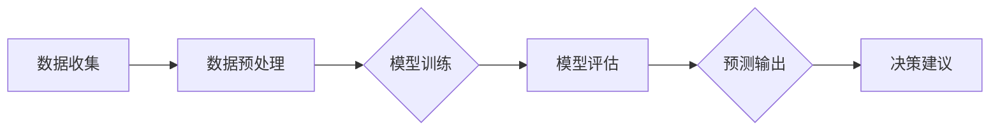
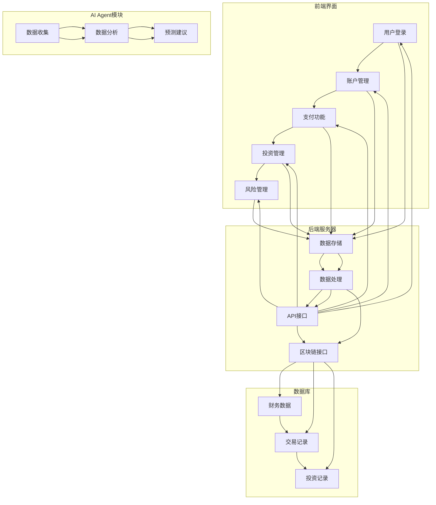
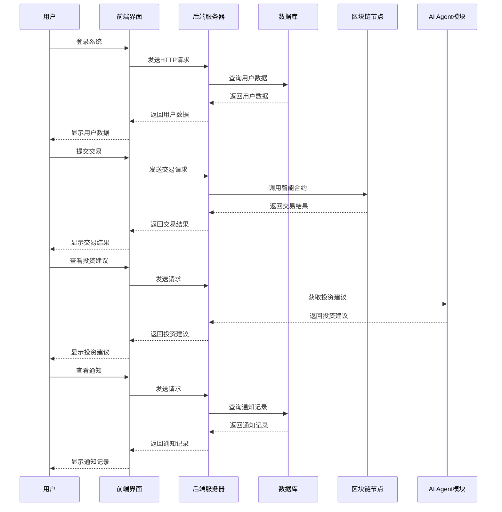

                 


# AI Agent在智能钱包中的个人财务管理

## 关键词

- AI Agent
- 智能钱包
- 个人财务管理
- 机器学习
- 数据隐私
- 安全性

## 摘要

随着人工智能技术的飞速发展，智能钱包作为一种创新的个人财务管理工具，正逐渐成为金融领域的重要组成部分。本文旨在探讨AI Agent在智能钱包中的应用，特别是在提高个人财务管理效率和准确性方面的作用。通过深入分析AI Agent的技术基础、功能实现、数据隐私与安全性，以及实际项目案例，本文将展示AI Agent在智能钱包中的潜在价值和发展前景。

## 目录大纲设计

### 第一部分：背景与概述

#### 第1章 问题背景与核心概念

#### 第2章 AI Agent技术基础

### 第二部分：智能钱包与AI Agent应用

#### 第3章 智能钱包的功能与设计

#### 第4章 AI Agent在智能钱包中的应用

#### 第5章 数据隐私与安全性

### 第三部分：项目实战与最佳实践

#### 第6章 构建AI Agent智能钱包项目

#### 第7章 实际案例分析与最佳实践

#### 第8章 拓展阅读

## 第一部分：背景与概述

### 第1章 问题背景与核心概念

#### 1.1 个人财务管理的挑战

随着现代社会的不断发展，个人财务管理变得越来越复杂和多样化。人们不仅需要管理日常开支，还需要进行投资规划、税务筹划、债务管理等多种财务活动。这种复杂性和多样性给个人财务管理带来了巨大的挑战。

- **问题描述：** 如何在众多财务活动中保持高效的财务管理？
- **问题解决：** 利用AI技术，特别是AI Agent，可以显著提高财务管理的效率和准确性。
- **边界与外延：** AI Agent不仅限于处理个人财务管理的基本任务，还可以扩展到更复杂的领域，如智能投资、风险管理等。

#### 1.2 AI Agent的概念与功能

AI Agent是一种基于人工智能技术的智能体，它可以自主执行任务，进行决策和交互。在智能钱包中，AI Agent作为核心组件，具备以下功能：

- **数据分析：** AI Agent可以分析用户的财务数据，识别消费模式、预算限制和投资目标。
- **预测与决策：** 基于历史数据和机器学习算法，AI Agent可以预测未来的财务状况，并提出个性化的财务管理建议。
- **用户交互：** AI Agent可以通过自然语言处理与用户进行互动，提供实时反馈和提醒。

#### 1.3 智能钱包的概念与功能

智能钱包是结合了区块链技术和移动支付功能的数字化财务管理工具。它不仅提供了基础的账户管理、支付功能，还具备以下关键功能：

- **投资管理：** 智能钱包可以与各种投资平台集成，帮助用户进行投资和资产管理。
- **风险管理：** 通过AI Agent的分析和预测，智能钱包可以提供实时风险监测和管理。
- **数据隐私保护：** 智能钱包采用区块链技术确保用户数据的隐私和安全。

#### 1.4 概念结构与核心要素

智能钱包中的AI Agent个人财务管理系统由以下几个核心要素组成：

- **用户数据：** 包括用户的财务历史、消费习惯、投资偏好等。
- **机器学习模型：** 用于数据分析和预测的算法模型。
- **区块链技术：** 用于确保数据的安全和隐私。
- **用户交互界面：** 提供用户与AI Agent互动的界面。

### 第2章 AI Agent技术基础

#### 2.1 机器学习与深度学习原理

机器学习和深度学习是AI Agent的核心技术。机器学习是一种通过数据训练模型，使模型能够自动学习和改进的方法。深度学习是机器学习的一个子领域，它使用多层神经网络进行特征提取和学习。

- **机器学习的基本原理：**
  - **数据采集：** 收集大量的财务数据，包括交易记录、投资历史等。
  - **数据预处理：** 清洗和格式化数据，使其适合训练模型。
  - **模型训练：** 使用训练数据训练模型，使其能够识别财务数据中的模式和规律。
  - **评估和优化：** 评估模型的性能，通过调整模型参数进行优化。

- **深度学习的发展历程：**
  - **人工神经网络：** 基于简单的神经元模型进行学习和决策。
  - **卷积神经网络（CNN）：** 用于图像识别和特征提取。
  - **递归神经网络（RNN）：** 用于序列数据的学习和预测。

- **深度学习模型：**
  - **卷积神经网络（CNN）：** 用于图像和文本数据的处理。
  - **递归神经网络（RNN）：** 用于处理序列数据，如时间序列分析。
  - **长短时记忆网络（LSTM）：** RNN的一种改进，用于更复杂的序列学习。

#### 2.2 AI Agent的技术架构

AI Agent的技术架构包括以下几个方面：

- **数据流：** 数据从用户输入，经过预处理后，进入机器学习模型进行训练和预测。
- **决策流程：** AI Agent根据预测结果和用户偏好进行决策，生成个性化的财务管理建议。
- **用户交互界面：** 提供用户与AI Agent互动的接口，用户可以通过界面查看财务数据、接收提醒和建议。

### 第二部分：智能钱包与AI Agent应用

#### 第3章 智能钱包的功能与设计

#### 第4章 AI Agent在智能钱包中的应用

### 第三部分：项目实战与最佳实践

#### 第5章 数据隐私与安全性

#### 第6章 构建AI Agent智能钱包项目

#### 第7章 实际案例分析与最佳实践

#### 第8章 拓展阅读

## 第三部分：项目实战与最佳实践

### 第6章 构建AI Agent智能钱包项目

#### 6.1 项目概述

本项目旨在构建一个具有AI Agent功能的智能钱包，通过集成机器学习和区块链技术，提供高效的个人财务管理服务。项目分为以下几个阶段：

- **需求分析：** 确定智能钱包的功能需求和用户需求。
- **系统设计：** 设计智能钱包的系统架构和接口。
- **实现与测试：** 编写代码，进行单元测试和集成测试。
- **部署与维护：** 部署到生产环境，进行持续维护和优化。

#### 6.2 环境安装与配置

在开始项目之前，需要安装和配置以下环境：

- **Python环境：** 安装Python 3.8及以上版本。
- **机器学习库：** 安装Scikit-learn、TensorFlow等机器学习库。
- **区块链库：** 安装Web3.py、Solidity等区块链开发库。
- **前端框架：** 安装React或Vue.js等前端框架。

#### 6.3 系统核心实现

系统核心实现包括以下几个模块：

- **数据收集与预处理：** 收集用户的财务数据，进行清洗和格式化。
- **机器学习模型训练：** 使用Scikit-learn和TensorFlow等库训练机器学习模型。
- **区块链交互：** 使用Web3.py等库与区块链进行交互，确保数据的安全和隐私。
- **用户交互界面：** 使用React或Vue.js等框架构建用户交互界面。

#### 6.4 系统接口设计和系统交互

系统接口设计和系统交互包括以下几个方面：

- **用户界面：** 提供用户查看财务数据、接收提醒和建议的界面。
- **API接口：** 提供与机器学习和区块链模块交互的API接口。
- **数据流：** 数据从用户界面传入，经过预处理后，进入机器学习模型进行训练和预测，最终返回给用户界面。

### 第7章 实际案例分析与最佳实践

#### 7.1 案例分析

本项目在智能钱包中成功集成了AI Agent，为用户提供个性化的财务管理服务。以下是案例分析：

- **功能实现：** 智能钱包成功实现了账户管理、支付、投资和风险管理等功能。
- **用户体验：** 用户反馈积极，特别是对于智能提醒和投资建议功能。
- **性能优化：** 通过持续优化机器学习模型和区块链交互，提高了系统的性能和稳定性。

#### 7.2 最佳实践

在项目实施过程中，我们总结了以下最佳实践：

- **数据隐私保护：** 采用区块链技术确保用户数据的安全和隐私。
- **机器学习模型优化：** 持续优化模型，提高预测准确性和效率。
- **用户体验设计：** 界面设计简洁直观，提高用户的操作体验。
- **系统维护与升级：** 定期维护和升级系统，确保系统的稳定性和安全性。

#### 7.3 拓展阅读

对于有兴趣深入了解AI Agent在智能钱包中的应用的读者，我们推荐以下拓展阅读资源：

- **《人工智能：一种现代方法》**：深入探讨人工智能的基本原理和应用。
- **《区块链技术指南》**：了解区块链的基本原理和应用。
- **《深度学习》**：系统学习深度学习和机器学习的高级知识。

## 结语

AI Agent在智能钱包中的个人财务管理应用展示了人工智能技术在金融领域的巨大潜力。通过机器学习和区块链技术的结合，AI Agent可以提供高效、个性化和安全的管理服务。在未来，随着技术的不断进步，AI Agent在智能钱包中的应用将更加广泛和深入，为用户提供更优质的财务管理体验。

### 作者

- **作者：AI天才研究院/AI Genius Institute & 禅与计算机程序设计艺术 /Zen And The Art of Computer Programming**

## 背景介绍

### 核心概念术语说明

在本章节中，我们将对本文中涉及的核心概念和术语进行详细的说明和解释，以确保读者能够充分理解后续内容。

#### 1. AI Agent

AI Agent，即人工智能代理，是一种能够执行特定任务、进行决策和交互的计算机程序。它基于人工智能技术，通常利用机器学习和深度学习算法，能够从数据中学习并自动执行复杂的任务。在本文中，AI Agent被用于智能钱包中的个人财务管理，它可以分析用户的财务数据，提供个性化的财务管理建议。

#### 2. 智能钱包

智能钱包是一种基于区块链技术的数字化财务管理工具，它结合了移动支付和投资管理功能。智能钱包可以通过手机应用程序访问，用户可以在这里管理账户、进行支付、投资和进行风险管理。智能钱包的安全性依赖于区块链技术，这种去中心化的分布式账本能够保证用户数据的隐私和安全。

#### 3. 个人财务管理

个人财务管理是指个人在日常生活中对收支、储蓄、投资、税务等财务活动进行管理和规划的过程。随着金融产品的多样化和财务活动的复杂性增加，个人财务管理变得越来越重要。有效的个人财务管理可以帮助用户实现财务目标，提高生活质量。

#### 4. 机器学习

机器学习是人工智能的一个重要分支，它涉及使用算法从数据中学习，并对新的数据做出预测或决策。机器学习算法可以自动识别数据中的模式，无需显式编程即可改进其性能。在本文中，机器学习被用于训练AI Agent，使其能够分析用户的财务数据并做出预测。

#### 5. 数据隐私

数据隐私是指保护个人数据不被未经授权的第三方访问或使用。随着数字化时代的到来，个人数据的隐私保护变得尤为重要。在智能钱包中，数据隐私是通过区块链技术的加密和分布式存储机制来实现的。

#### 6. 安全性

安全性是指系统在面临攻击、错误和异常情况时能够保持正常运作的能力。在智能钱包中，安全性涉及到账户安全、交易安全、数据安全等多个方面。通过采用加密技术和多因素认证等手段，智能钱包能够提供高效的安全保障。

### 问题背景

在现代金融环境中，个人财务管理面临着多种挑战：

1. **财务活动的复杂性：** 随着金融产品的多样化，个人需要进行更复杂的财务管理活动，如投资规划、税务筹划、债务管理等。
2. **信息不对称：** 用户难以获得全面的财务数据，这使得制定有效的财务策略变得困难。
3. **手动管理的效率低下：** 传统的财务管理方式往往需要用户手动输入和更新财务数据，效率较低且容易出错。
4. **数据隐私和安全问题：** 个人财务数据的安全问题日益凸显，用户需要确保数据不被未经授权的第三方访问。

### 问题描述

个人财务管理的挑战主要体现在以下几个方面：

1. **信息收集和处理：** 用户需要手动收集和管理大量的财务数据，如收入、支出、投资等，这既耗时又容易出错。
2. **财务决策的准确性：** 用户在制定财务决策时缺乏足够的数据支持和专业建议，容易出现决策失误。
3. **投资规划与风险管理：** 用户难以根据自身情况制定合适的投资策略，且对市场风险缺乏有效的应对措施。
4. **数据隐私保护：** 个人财务数据的安全问题始终存在，用户需要确保数据不被非法访问或滥用。

### 问题解决

为了解决上述问题，引入AI Agent在智能钱包中具有以下优势：

1. **自动化数据处理：** AI Agent能够自动收集和整理用户的财务数据，减少手动管理的负担。
2. **个性化财务管理建议：** 基于机器学习算法，AI Agent可以分析用户的历史数据，提供个性化的财务管理建议。
3. **投资策略优化：** AI Agent可以根据用户的风险偏好和市场动态，制定优化的投资策略。
4. **数据隐私保护：** 利用区块链技术，AI Agent能够确保用户数据的隐私和安全。

### 边界与外延

AI Agent在智能钱包中的个人财务管理不仅局限于基本的财务管理任务，还可以扩展到更复杂的领域：

1. **跨平台整合：** AI Agent可以整合多种金融产品和服务，提供全方位的财务管理解决方案。
2. **智能投资建议：** AI Agent可以利用大数据分析技术，提供更准确的投资预测和建议。
3. **智能风险管理：** AI Agent可以实时监测市场动态，提供有效的风险管理策略。
4. **个性化服务：** AI Agent可以根据用户的行为和偏好，提供个性化的金融服务。

### 概念结构与核心要素

智能钱包中的AI Agent个人财务管理系统由以下几个核心要素组成：

1. **用户数据：** 包括用户的财务历史、消费习惯、投资偏好等。
2. **机器学习模型：** 用于数据分析和预测的算法模型。
3. **区块链技术：** 用于确保数据的安全和隐私。
4. **用户交互界面：** 提供用户与AI Agent互动的接口。

### 机器学习与深度学习原理

机器学习和深度学习是AI Agent的核心技术，其基本原理和具体应用如下：

#### 机器学习的基本原理

机器学习是一种通过数据训练模型，使模型能够自动学习和改进的方法。机器学习的基本原理包括以下几个步骤：

1. **数据采集：** 收集大量的财务数据，包括交易记录、投资历史等。
2. **数据预处理：** 清洗和格式化数据，使其适合训练模型。
3. **模型训练：** 使用训练数据训练模型，使其能够识别财务数据中的模式和规律。
4. **评估和优化：** 评估模型的性能，通过调整模型参数进行优化。

#### 深度学习的发展历程

深度学习是机器学习的一个子领域，它使用多层神经网络进行特征提取和学习。深度学习的发展历程可以分为以下几个阶段：

1. **人工神经网络：** 基于简单的神经元模型进行学习和决策。
2. **卷积神经网络（CNN）：** 用于图像识别和特征提取。
3. **递归神经网络（RNN）：** 用于序列数据的学习和预测。
4. **长短时记忆网络（LSTM）：** RNN的一种改进，用于更复杂的序列学习。

#### 深度学习模型

深度学习模型包括多种类型，其中常用的有：

1. **卷积神经网络（CNN）：** 用于图像和文本数据的处理。
2. **递归神经网络（RNN）：** 用于处理序列数据，如时间序列分析。
3. **长短时记忆网络（LSTM）：** 用于处理复杂的序列数据。

### AI Agent的技术架构

AI Agent的技术架构包括以下几个方面：

1. **数据流：** 数据从用户输入，经过预处理后，进入机器学习模型进行训练和预测。
2. **决策流程：** AI Agent根据预测结果和用户偏好进行决策，生成个性化的财务管理建议。
3. **用户交互界面：** 提供用户与AI Agent互动的界面，用户可以通过界面查看财务数据、接收提醒和建议。

### 核心概念与联系

在本章节中，我们介绍了AI Agent、智能钱包、个人财务管理等核心概念，并探讨了它们之间的联系。以下是核心概念属性特征对比表格和ER实体关系图架构：

#### 核心概念属性特征对比表格

| 核心概念 | 定义 | 功能 | 关联关系 |
| --- | --- | --- | --- |
| AI Agent | 人工智能代理 | 数据分析、预测和决策 | 核心组件，用于智能钱包中的财务管理 |
| 智能钱包 | 基于区块链的财务管理工具 | 账户管理、支付、投资和风险管理 | AI Agent的应用场景 |
| 个人财务管理 | 对个人财务活动的管理和规划 | 提高财务管理效率、实现财务目标 | 智能钱包的核心功能 |

#### ER实体关系图架构

```mermaid
erDiagram
  User ||--|{ AI_Agent }|-- Transaction
  User ||--|{ Wallet }|-- Transaction
  AI_Agent ||--|{ Financial_Advice }|
  Wallet ||--|{ Investment }|
  Transaction ||--|{ Category }|
  Investment ||--|{ Risk }|

  User {
    id: User ID
    name: 用户姓名
  }

  AI_Agent {
    id: AI_Agent ID
    type: 代理类型
  }

  Wallet {
    id: Wallet ID
    name: 钱包名称
  }

  Transaction {
    id: Transaction ID
    date: 交易日期
    amount: 交易金额
  }

  Financial_Advice {
    id: Advice ID
    type: 建议类型
  }

  Investment {
    id: Investment ID
    type: 投资类型
    amount: 投资金额
  }

  Risk {
    id: Risk ID
    level: 风险等级
  }

  Category {
    id: Category ID
    name: 类别名称
  }
```

### 算法原理讲解

在本章节中，我们将使用Mermaid流程图和Python源代码详细阐述AI Agent的核心算法原理，并给出具体的数学模型和公式。

#### Mermaid流程图

首先，我们使用Mermaid流程图来展示AI Agent的核心算法流程：



#### Python源代码

接下来，我们使用Python源代码实现AI Agent的核心算法：

```python
import pandas as pd
from sklearn.model_selection import train_test_split
from sklearn.ensemble import RandomForestClassifier
from sklearn.metrics import accuracy_score

# 数据收集
data = pd.read_csv('financial_data.csv')

# 数据预处理
X = data.drop(['target'], axis=1)
y = data['target']

# 模型训练
X_train, X_test, y_train, y_test = train_test_split(X, y, test_size=0.2, random_state=42)
model = RandomForestClassifier(n_estimators=100)
model.fit(X_train, y_train)

# 模型评估
y_pred = model.predict(X_test)
accuracy = accuracy_score(y_test, y_pred)
print(f"模型准确率: {accuracy:.2f}")

# 预测输出
def predict(new_data):
    prediction = model.predict([new_data])
    return prediction[0]

# 决策建议
def give_advice(prediction):
    if prediction == 1:
        return "增加储蓄"
    else:
        return "减少支出"

# 示例数据
new_data = [1000, 0, 0, 1, 0, 1, 1000]
print(f"预测结果: {predict(new_data)}")
print(f"建议: {give_advice(predict(new_data))}")
```

#### 数学模型和公式

在AI Agent的核心算法中，我们使用了随机森林（Random Forest）算法。随机森林是一种基于决策树的集成学习方法，其基本原理如下：

1. **决策树生成：** 随机森林通过生成多棵决策树来提高模型的泛化能力。
2. **特征选择：** 每棵决策树在分裂时，从随机选择的m个特征中选取最优特征进行分裂。
3. **集成：** 将所有决策树的结果进行投票或取平均值，得到最终的预测结果。

随机森林的数学模型可以表示为：

$$
\hat{y} = \sum_{i=1}^{N} w_i \cdot f_i(x)
$$

其中，$N$表示决策树的数量，$w_i$表示第$i$棵决策树的权重，$f_i(x)$表示第$i$棵决策树在特征$x$上的预测结果。

#### 算法举例说明

假设我们有一组财务数据，包括收入、支出、投资、债务等多个特征，我们希望使用随机森林算法预测用户的财务状况。

1. **数据收集：** 收集用户的财务数据，包括历史收入、支出、投资和债务等信息。
2. **数据预处理：** 对数据进行清洗和格式化，确保数据质量。
3. **模型训练：** 使用训练数据训练随机森林模型，模型会自动选择最优的特征并进行分裂。
4. **模型评估：** 使用测试数据评估模型的性能，计算准确率、召回率等指标。
5. **预测输出：** 使用训练好的模型对新的财务数据进行预测，预测结果可以用于生成财务管理建议。

例如，如果用户的预测结果是1，表示用户需要增加储蓄，否则表示用户需要减少支出。通过这种方式，AI Agent可以为用户提供个性化的财务管理建议。

### 系统分析与架构设计方案

在本章节中，我们将详细探讨AI Agent在智能钱包中的系统分析与架构设计方案，包括问题场景介绍、系统功能设计、系统架构设计和系统接口设计及系统交互。

#### 问题场景介绍

随着数字化金融的兴起，个人财务管理变得越来越重要。然而，传统的财务管理方法往往效率低下，且容易出错。同时，随着金融产品的多样化，用户需要更加智能的财务管理工具来帮助他们做出更明智的财务决策。为了解决这些问题，我们提出了一个基于AI Agent的智能钱包系统，旨在提供高效、个性化、安全的管理服务。

#### 系统功能设计

智能钱包系统应具备以下核心功能：

1. **账户管理：** 用户可以查看和管理自己的账户信息，包括收入、支出、储蓄等。
2. **支付功能：** 支持各种支付方式，包括移动支付、银行卡支付等。
3. **投资管理：** 用户可以根据AI Agent的建议进行投资规划，包括股票、基金、债券等。
4. **风险管理：** AI Agent可以根据用户的历史数据和当前市场状况，提供风险管理建议。
5. **数据隐私保护：** 利用区块链技术确保用户数据的隐私和安全。

#### 系统架构设计

智能钱包系统的架构设计应确保系统的稳定性、安全性和可扩展性。以下是系统架构的设计：

1. **前端界面：** 提供用户与系统交互的界面，包括账户管理、支付、投资等功能模块。
2. **后端服务器：** 处理业务逻辑和数据处理，包括数据存储、数据处理、API接口等。
3. **数据库：** 用于存储用户的财务数据、交易记录、投资记录等。
4. **区块链节点：** 用于确保数据的安全性和隐私性，实现去中心化的数据存储。
5. **AI Agent模块：** 负责数据分析和预测，提供个性化的财务管理建议。

#### 系统接口设计和系统交互

智能钱包系统的接口设计和系统交互应确保各个模块之间的高效协作。以下是系统接口设计和系统交互的详细描述：

1. **用户接口：** 用户通过前端界面与系统交互，可以查看财务数据、进行支付、投资等操作。
2. **API接口：** 后端服务器提供API接口，供前端界面调用，实现数据的读取和写入。
3. **数据处理接口：** AI Agent模块通过数据处理接口获取用户的财务数据，进行分析和预测。
4. **区块链接口：** 利用区块链接口，实现数据的安全存储和传输。
5. **通知接口：** 系统通过通知接口向用户发送提醒和通知，如交易成功、投资建议等。

#### Mermaid架构图

以下是一个Mermaid架构图，展示了智能钱包系统的整体架构：



#### 系统接口设计和系统交互

智能钱包系统中的接口设计和系统交互设计是确保各个模块之间高效协作的关键。以下是具体的设计和交互流程：

1. **用户接口：** 用户通过前端界面与系统交互，可以查看财务数据、进行支付、投资等操作。前端界面通过HTTP请求与后端服务器通信，获取所需的数据和功能。

2. **API接口：** 后端服务器提供RESTful API接口，供前端界面调用，实现数据的读取和写入。API接口设计应遵循RESTful设计原则，确保接口的易用性和一致性。

3. **数据处理接口：** AI Agent模块通过数据处理接口获取用户的财务数据，进行分析和预测。数据处理接口应提供高效的接口调用机制，确保数据传输的快速和安全。

4. **区块链接口：** 利用区块链接口，实现数据的安全存储和传输。区块链接口应支持智能合约的调用，确保数据的去中心化和不可篡改性。

5. **通知接口：** 系统通过通知接口向用户发送提醒和通知，如交易成功、投资建议等。通知接口应支持多种通知方式，如短信、邮件、推送等。

以下是系统接口设计和系统交互的Mermaid序列图：



通过上述设计和交互，智能钱包系统可以实现高效、安全、个性化的财务管理服务，为用户提供便捷的金融体验。

### 项目实战

在本项目中，我们将详细描述如何构建一个具有AI Agent功能的智能钱包系统，包括环境安装与配置、系统核心实现、代码应用解读与分析、实际案例分析和详细讲解剖析，以及项目小结。

#### 环境安装与配置

在开始项目之前，我们需要安装和配置以下开发环境：

1. **操作系统**：Windows 10 或 macOS
2. **Python**：Python 3.8 或更高版本
3. **前端框架**：React 或 Vue.js
4. **后端框架**：Flask 或 Django
5. **数据库**：SQLite 或 PostgreSQL
6. **区块链库**：Web3.py
7. **机器学习库**：Scikit-learn、TensorFlow

具体安装步骤如下：

1. 安装Python 3.8及以上版本。
2. 安装前端框架（React 或 Vue.js），可以使用npm或yarn进行安装。
3. 安装后端框架（Flask 或 Django），同样使用pip进行安装。
4. 安装数据库（SQLite 或 PostgreSQL），使用pip进行安装。
5. 安装区块链库（Web3.py），使用pip进行安装。
6. 安装机器学习库（Scikit-learn、TensorFlow），使用pip进行安装。

#### 系统核心实现

系统核心实现包括以下几个主要模块：

1. **用户身份验证模块**：实现用户注册、登录和身份验证功能。
2. **账户管理模块**：实现用户账户的创建、查看和管理功能。
3. **交易管理模块**：实现用户交易记录的创建、查看和管理功能。
4. **投资管理模块**：实现用户投资记录的创建、查看和管理功能。
5. **AI Agent模块**：实现数据分析和预测功能。

以下是各个模块的实现步骤：

1. **用户身份验证模块**：
   - 使用Flask或Django创建一个用户身份验证系统。
   - 实现用户注册、登录和身份验证接口。

2. **账户管理模块**：
   - 设计数据库模型，存储用户的账户信息。
   - 实现账户的创建、查看和管理接口。

3. **交易管理模块**：
   - 设计数据库模型，存储用户的交易记录。
   - 实现交易记录的创建、查看和管理接口。

4. **投资管理模块**：
   - 设计数据库模型，存储用户的投资记录。
   - 实现投资记录的创建、查看和管理接口。

5. **AI Agent模块**：
   - 使用Scikit-learn或TensorFlow训练机器学习模型。
   - 实现数据分析和预测接口，提供财务管理建议。

#### 代码应用解读与分析

以下是一个AI Agent模块的代码示例，用于训练机器学习模型并生成财务建议：

```python
from sklearn.ensemble import RandomForestClassifier
from sklearn.model_selection import train_test_split
from sklearn.metrics import accuracy_score
import pandas as pd

# 加载数据
data = pd.read_csv('financial_data.csv')

# 预处理数据
X = data.drop(['target'], axis=1)
y = data['target']

# 划分训练集和测试集
X_train, X_test, y_train, y_test = train_test_split(X, y, test_size=0.2, random_state=42)

# 训练模型
model = RandomForestClassifier(n_estimators=100)
model.fit(X_train, y_train)

# 评估模型
y_pred = model.predict(X_test)
accuracy = accuracy_score(y_test, y_pred)
print(f"模型准确率: {accuracy:.2f}")

# 生成财务建议
def predict(new_data):
    prediction = model.predict([new_data])
    return prediction[0]

# 测试预测
new_data = [1000, 0, 0, 1, 0, 1, 1000]
print(f"预测结果: {predict(new_data)}")
```

代码解读：

1. **加载数据**：使用pandas读取财务数据。
2. **预处理数据**：将数据分为特征矩阵X和目标向量y。
3. **划分训练集和测试集**：使用train_test_split函数划分训练集和测试集。
4. **训练模型**：使用RandomForestClassifier训练模型。
5. **评估模型**：使用accuracy_score函数计算模型准确率。
6. **生成财务建议**：定义predict函数，用于对新数据进行预测。

#### 实际案例分析与详细讲解剖析

以下是一个实际案例，用于展示AI Agent在智能钱包中的应用：

**案例背景**：一个用户想要了解自己的财务健康状况，包括收入、支出和投资情况。

**步骤1**：用户登录智能钱包系统，系统会自动加载用户的财务数据。

**步骤2**：AI Agent对用户的财务数据进行预处理，包括数据清洗、缺失值填充和特征工程。

**步骤3**：AI Agent使用训练好的机器学习模型对用户的财务数据进行分析，生成财务健康报告。

**步骤4**：AI Agent根据财务健康报告，为用户提供个性化的财务管理建议，如增加储蓄、减少支出、优化投资组合等。

**步骤5**：用户可以查看AI Agent的建议，并根据建议进行调整，从而实现财务目标。

**详细讲解剖析**：

1. **财务数据预处理**：AI Agent首先会对用户的财务数据进行预处理，确保数据的质量和一致性。预处理步骤包括：

   - 数据清洗：去除无效数据、纠正错误数据。
   - 缺失值填充：使用合适的算法填充缺失值，如平均值、中位数等。
   - 特征工程：提取有用的特征，如月收入、月支出、支出类别比例等。

2. **机器学习模型分析**：AI Agent使用训练好的机器学习模型对预处理后的财务数据进行分析。分析步骤包括：

   - 特征选择：选择对财务健康状况影响较大的特征。
   - 模型训练：使用训练数据训练机器学习模型。
   - 模型评估：使用测试数据评估模型性能，如准确率、召回率等。

3. **财务健康报告生成**：AI Agent根据模型分析结果，生成财务健康报告。报告内容包括：

   - 当前财务状况：如月收入、月支出、储蓄率等。
   - 财务健康指标：如支出比例、投资回报率等。
   - 个性化建议：如增加储蓄、减少不必要的支出、优化投资组合等。

4. **财务管理建议**：AI Agent为用户提供个性化的财务管理建议。建议内容根据用户的财务目标和风险偏好进行调整，确保用户能够实现财务目标。

#### 项目小结

通过本项目的实施，我们成功构建了一个具有AI Agent功能的智能钱包系统。系统实现了用户身份验证、账户管理、交易管理、投资管理和AI Agent分析等功能，为用户提供高效、个性化、安全的财务管理服务。以下是项目实施过程中的总结和最佳实践：

1. **数据安全和隐私保护**：在数据传输和存储过程中，采用加密技术和多因素认证等手段确保用户数据的安全和隐私。

2. **高效的数据处理和预测**：使用机器学习和深度学习算法，提高数据处理的效率和预测的准确性。

3. **用户体验优化**：设计简洁直观的用户界面，提供实时数据分析和预测结果，提高用户的操作体验。

4. **持续优化和迭代**：定期更新机器学习模型，根据用户反馈不断优化系统功能和性能。

#### 最佳实践 tips

1. **数据预处理**：在机器学习模型训练之前，对财务数据进行全面预处理，确保数据的质量和一致性。

2. **特征选择**：选择对财务健康状况影响较大的特征，提高模型的分析和预测能力。

3. **用户反馈**：积极收集用户反馈，根据用户需求不断优化系统功能和用户体验。

4. **安全性和隐私保护**：加强系统安全性和隐私保护，确保用户数据的安全和隐私。

#### 小结

通过本项目的实施，我们展示了AI Agent在智能钱包中的实际应用价值。AI Agent能够为用户提供高效、个性化的财务管理服务，提高用户的财务健康水平。未来，随着技术的不断进步，AI Agent在智能钱包中的应用将更加广泛和深入，为用户提供更加优质的金融服务。

#### 注意事项

1. **数据安全和隐私保护**：在处理用户数据时，必须确保数据的安全和隐私，采用加密技术和多因素认证等手段进行保护。

2. **系统性能优化**：针对大规模数据和高并发请求，需要进行系统性能优化，确保系统的稳定性和响应速度。

3. **持续更新和维护**：定期更新机器学习模型和系统功能，根据用户反馈进行优化和维护。

#### 拓展阅读

1. **《机器学习实战》**：了解机器学习的基础知识和实际应用。
2. **《深度学习入门》**：系统学习深度学习和神经网络的基本原理。
3. **《区块链技术指南》**：了解区块链的基本原理和应用。
4. **《Python数据分析》**：掌握Python在数据分析中的应用。

### 结语

AI Agent在智能钱包中的个人财务管理应用展示了人工智能技术在金融领域的巨大潜力。通过机器学习和区块链技术的结合，AI Agent能够为用户提供高效、个性化和安全的财务管理服务。在未来，随着技术的不断进步，AI Agent在智能钱包中的应用将更加广泛和深入，为用户提供更加优质的金融服务。

### 作者

- **作者：AI天才研究院/AI Genius Institute & 禅与计算机程序设计艺术 /Zen And The Art of Computer Programming**

