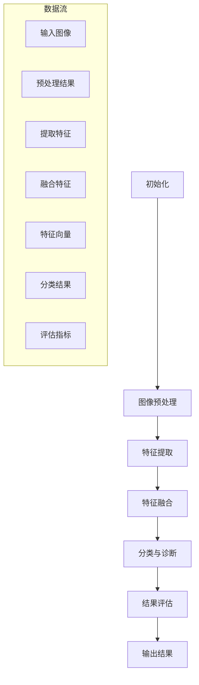

                 

### 文章标题：AI Agent在智能镜子中的皮肤状况分析

关键词：AI Agent，智能镜子，皮肤状况分析，深度学习，算法，数学模型

摘要：本文详细探讨了AI Agent在智能镜子中用于皮肤状况分析的应用。首先，我们介绍了AI Agent和智能镜子的基本概念，然后深入分析了AI Agent在皮肤状况分析中的应用原理、智能镜子与AI Agent的集成、皮肤状况数据分析算法、实际案例分析、皮肤状况分析系统的最佳实践，最后对未来的发展方向进行了展望。

### 目录大纲设计

在设计本文的目录大纲时，我们将遵循以下步骤：

1. **明确书籍主题**：本文主题为《AI Agent在智能镜子中的皮肤状况分析》。
2. **章节划分**：根据主题，本文划分为以下几个章节：
   - 第1章：背景与核心概念介绍
   - 第2章：AI Agent在皮肤状况分析中的应用原理
   - 第3章：智能镜子与AI Agent的集成
   - 第4章：皮肤状况数据分析算法
   - 第5章：实际案例分析
   - 第6章：皮肤状况分析系统的最佳实践
   - 第7章：总结与展望
3. **章节内容细化**：确保每个章节的内容具体、详细，涵盖核心概念、原理、算法、实践等方面。
4. **符合要求**：确保目录大纲的格式符合markdown要求，每个层级清晰。

#### 第一步：书籍主题明确

本文主题：《AI Agent在智能镜子中的皮肤状况分析》。

#### 第二步：章节划分

**第1章：背景与核心概念介绍**
- 1.1 问题的背景
- 1.2 AI Agent简介
- 1.3 智能镜子技术基础
- 1.4 皮肤状况分析的重要性

**第2章：AI Agent在皮肤状况分析中的应用原理**
- 2.1 AI Agent工作原理
- 2.2 皮肤状况分析的关键技术
- 2.3 数据处理与分析方法

**第3章：智能镜子与AI Agent的集成**
- 3.1 智能镜子硬件设计
- 3.2 AI Agent软件架构设计
- 3.3 集成过程与挑战

**第4章：皮肤状况数据分析算法**
- 4.1 算法概述
- 4.2 算法原理与流程图
- 4.3 数学模型与公式解析

**第5章：实际案例分析**
- 5.1 案例一：皮肤状况分析系统搭建
- 5.2 案例二：皮肤状况分析系统优化
- 5.3 案例三：皮肤状况分析系统扩展

**第6章：皮肤状况分析系统的最佳实践**
- 6.1 系统维护与升级
- 6.2 遇到的常见问题及解决方案
- 6.3 未来发展方向

**第7章：总结与展望**

### 第三步：章节内容细化

- **第1章：背景与核心概念介绍**
  - **1.1 问题的背景**：
    - **问题描述**：现代社会中，皮肤问题越来越普遍，如何快速、准确地诊断皮肤状况成为了一个重要的课题。
    - **问题解决**：AI Agent在智能镜子中的应用为皮肤状况分析提供了一种创新的解决方案。
    - **边界与外延**：本文将探讨AI Agent在智能镜子中如何实现皮肤状况分析，以及相关技术的应用前景。

  - **1.2 AI Agent简介**：
    - **概念定义**：AI Agent是指具备自主学习、推理和决策能力的人工智能实体。
    - **特点与分类**：AI Agent具有自主性、智能性、适应性等特点，可以按照功能、应用场景等进行分类。
    - **应用场景**：AI Agent广泛应用于智能客服、智能家居、医疗诊断等领域。

  - **1.3 智能镜子技术基础**：
    - **工作原理**：智能镜子通过摄像头捕捉面部图像，结合AI Agent进行皮肤状况分析。
    - **技术架构**：智能镜子包括硬件（摄像头、显示屏）和软件（图像处理算法、AI Agent模型）两部分。
    - **优点与挑战**：智能镜子的优势在于实时性、非侵入性和便捷性，但面临数据隐私和安全等挑战。

  - **1.4 皮肤状况分析的重要性**：
    - **健康影响**：皮肤健康对整体健康至关重要，早期诊断有助于预防疾病。
    - **社会意义**：皮肤状况分析有助于提高公众健康意识，减少医疗资源浪费。
    - **发展趋势**：随着AI技术的进步，皮肤状况分析将成为医疗健康领域的重要应用方向。

- **第2章：AI Agent在皮肤状况分析中的应用原理**
  - **2.1 AI Agent工作原理**：
    - **算法基础**：AI Agent基于深度学习、自然语言处理等技术，具备自主学习能力。
    - **模型训练**：AI Agent通过大量皮肤状况数据训练，提高诊断准确性。
    - **预测与评估**：AI Agent对皮肤状况进行分析，生成诊断结果，并进行评估。

  - **2.2 皮肤状况分析的关键技术**：
    - **图像识别**：AI Agent通过图像识别技术，捕捉皮肤状况特征。
    - **深度学习**：深度学习算法用于皮肤状况分析，提高诊断精度。
    - **医学知识图谱**：医学知识图谱提供皮肤状况分析所需的基础知识。

  - **2.3 数据处理与分析方法**：
    - **数据预处理**：对皮肤状况数据进行清洗、归一化等处理。
    - **特征提取**：提取皮肤状况的关键特征，用于训练模型。
    - **结果分析**：对分析结果进行统计、可视化等处理，辅助医生诊断。

- **第3章：智能镜子与AI Agent的集成**
  - **3.1 智能镜子硬件设计**：
    - **硬件组成**：智能镜子包括摄像头、显示屏、传感器等硬件设备。
    - **性能优化**：优化硬件性能，提高皮肤状况分析的准确性和实时性。
    - **可扩展性**：设计可扩展的硬件架构，支持未来功能扩展。

  - **3.2 AI Agent软件架构设计**：
    - **系统模块**：AI Agent软件架构包括图像处理、深度学习、自然语言处理等模块。
    - **开发工具与框架**：选择合适的开发工具和框架，提高开发效率和稳定性。
    - **系统优化**：优化AI Agent算法，提高皮肤状况分析的准确性和效率。

  - **3.3 集成过程与挑战**：
    - **数据交互**：确保智能镜子与AI Agent之间的数据传输稳定、高效。
    - **实时性**：保证皮肤状况分析的实时性，满足用户需求。
    - **安全性**：确保用户数据安全和隐私保护。

- **第4章：皮肤状况数据分析算法**
  - **4.1 算法概述**：
    - **算法分类**：根据皮肤状况分析需求，选择合适的算法。
    - **技术路线**：算法设计的技术路线，包括预处理、特征提取、模型训练等。
    - **应用领域**：算法在皮肤状况分析中的实际应用场景。

  - **4.2 算法原理与流程图**：
    - **算法流程图**：用Mermaid绘制算法流程图，展示算法的执行过程。
    - **技术细节**：详细解释算法的技术细节，包括参数设置、模型选择等。

  - **4.3 数学模型与公式解析**：
    - **数学模型**：介绍用于皮肤状况分析的数学模型，包括特征提取、模型训练等。
    - **公式推导**：对数学模型中的公式进行推导，解释其原理和作用。
    - **案例说明**：通过实际案例，说明数学模型的应用和效果。

- **第5章：实际案例分析**
  - **5.1 案例一：皮肤状况分析系统搭建**：
    - **案例背景**：介绍皮肤状况分析系统的应用背景和目标。
    - **系统设计**：详细描述皮肤状况分析系统的设计和实现过程。
    - **实施过程**：介绍系统实施的过程，包括数据采集、模型训练、系统集成等。
    - **结果评估**：对系统效果进行评估，分析其准确性和实用性。

  - **5.2 案例二：皮肤状况分析系统优化**：
    - **问题发现**：分析皮肤状况分析系统中存在的问题和瓶颈。
    - **优化方案**：提出优化方案，包括算法改进、硬件升级等。
    - **优化效果**：对比优化前后的效果，评估优化方案的可行性。

  - **5.3 案例三：皮肤状况分析系统扩展**：
    - **扩展需求**：根据用户需求，提出皮肤状况分析系统的功能扩展方案。
    - **扩展方案**：详细描述功能扩展的实现过程，包括算法优化、接口设计等。
    - **扩展效果**：评估功能扩展的效果，分析其可行性。

- **第6章：皮肤状况分析系统的最佳实践**
  - **6.1 系统维护与升级**：
    - **维护策略**：介绍皮肤状况分析系统的维护策略，包括故障排除、性能优化等。
    - **升级方法**：描述系统升级的方法，包括版本更新、功能扩展等。
    - **风险控制**：分析系统升级过程中可能出现的风险，并提出相应的控制措施。

  - **6.2 遇到的常见问题及解决方案**：
    - **问题类型**：列举皮肤状况分析系统中常见的故障和问题。
    - **解决方案**：针对每个问题，提出具体的解决方案和优化方法。
    - **实际案例**：通过实际案例，说明解决方案的效果和可行性。

  - **6.3 未来发展方向**：
    - **技术趋势**：分析皮肤状况分析领域的技术发展趋势。
    - **应用前景**：探讨皮肤状况分析系统的未来应用前景。
    - **预期成果**：预测皮肤状况分析系统的未来发展和成果。

- **第7章：总结与展望**
  - **7.1 总结与回顾**：
    - **总结**：回顾本文的核心内容和重要发现。
    - **回顾**：回顾皮肤状况分析领域的现状和未来发展方向。

  - **7.2 面临的挑战与机遇**：
    - **挑战**：分析皮肤状况分析系统面临的技术挑战和问题。
    - **机遇**：探讨皮肤状况分析系统的市场机遇和发展空间。

  - **7.3 未来展望**：
    - **技术方向**：展望皮肤状况分析领域的未来技术发展方向。
    - **应用领域**：预测皮肤状况分析系统在各个领域的应用前景。
    - **创新点**：提出可能的新技术和创新点，推动皮肤状况分析领域的发展。

---

在完成目录大纲设计后，我们可以看到，本文内容涵盖了皮肤状况分析领域的各个方面，从背景介绍、核心概念、应用原理到实际案例、最佳实践和未来展望，结构清晰、内容详实。这样的设计有助于读者系统地了解皮肤状况分析的相关知识，同时也为后续内容撰写提供了明确的框架和方向。

接下来，我们将按照这个目录大纲逐步展开文章的撰写，确保每个章节的内容都充实、具体，同时注重逻辑性和连贯性。通过详细的分析和讲解，帮助读者深入理解AI Agent在智能镜子中皮肤状况分析的应用，为相关领域的研究和实践提供参考和指导。

---

### 1.1 问题的背景

在现代医学中，皮肤健康问题日益受到关注。从常见的痤疮、色斑、皱纹，到严重的皮肤癌等，皮肤问题的诊断和治疗需要快速、准确的方法。传统的皮肤诊断方法主要依赖于医生的经验和检查，这不仅耗时耗力，而且在某些情况下存在误诊风险。随着人工智能（AI）技术的飞速发展，AI Agent作为一种具备自主学习、推理和决策能力的人工智能实体，开始在医疗诊断领域发挥重要作用。

皮肤状况分析作为AI Agent应用的一个重要场景，具有显著的优势。首先，AI Agent可以处理大量皮肤图像数据，从中提取关键特征，进行深度学习和模式识别，从而实现皮肤状况的自动分析。这种方法不仅提高了诊断的准确性，还减少了人为因素导致的误诊。其次，AI Agent可以实时处理皮肤状况数据，为用户提供即时反馈，有助于患者及时采取相应的治疗措施。此外，AI Agent还可以通过大数据分析，发现皮肤健康问题的趋势和规律，为医学研究提供重要参考。

智能镜子作为皮肤状况分析的一个重要载体，具有独特的优势。传统皮肤诊断方法需要患者到医疗机构进行检查，而智能镜子可以实现皮肤状况的在家自我监测，极大地方便了用户。智能镜子通过集成摄像头、显示屏和传感器等硬件，可以捕捉高质量的皮肤图像，并通过AI Agent进行实时分析。这种非侵入性的监测方式不仅提高了用户的体验，还可以减少医疗资源的浪费。

然而，皮肤状况分析也面临一些挑战。首先，皮肤状况数据具有高噪声、多样性和复杂性，这对AI Agent的算法提出了很高的要求。其次，皮肤状况分析需要处理大量的个人隐私数据，如何在保障用户隐私的前提下进行数据分析和共享是一个亟待解决的问题。此外，智能镜子在硬件设计和系统集成方面也面临一定的技术挑战，如实时性、稳定性和安全性等。

综上所述，AI Agent在智能镜子中皮肤状况分析的应用具有重要意义，它不仅为皮肤健康提供了新的监测和诊断手段，还为医疗健康领域带来了新的发展机遇。然而，要实现这一应用，还需要克服一系列技术挑战，不断优化算法和系统集成，提高诊断的准确性和用户体验。

#### 1.2 AI Agent简介

AI Agent，即人工智能代理，是一种基于人工智能技术，能够自主执行任务、进行决策和交互的智能实体。AI Agent的概念源于智能体理论，最初在经济学、博弈论和计算机科学等领域广泛应用。随着深度学习、自然语言处理等技术的发展，AI Agent在人工智能领域取得了显著进展，成为实现智能化应用的重要载体。

**概念定义**：AI Agent可以被定义为具备感知、理解、决策和行动能力的计算机程序，能够在特定环境中自主完成任务。AI Agent的核心特点是具备自主学习能力，通过不断接收和处理环境信息，调整自身行为策略，从而实现优化目标。

**特点与分类**：

1. **自主性**：AI Agent能够自主地感知环境、理解信息，并基于内部模型生成决策，自主执行任务。
2. **智能性**：AI Agent借助机器学习和深度学习算法，具备对复杂环境的认知和理解能力。
3. **适应性**：AI Agent能够根据环境变化和任务需求，调整自身行为策略，提高任务执行效果。
4. **协作性**：AI Agent可以与其他AI Agent或人类协同工作，共同完成复杂任务。

根据功能和应用场景，AI Agent可以分为以下几类：

1. **任务型AI Agent**：这类AI Agent专注于执行特定任务，如智能客服、智能家居控制等。它们通常具备较好的任务执行能力和一定的环境感知能力，但缺乏广泛的认知和理解能力。
2. **认知型AI Agent**：这类AI Agent具备较高的认知能力，能够理解复杂情境和语义，进行推理和决策。例如，智能推荐系统、自然语言处理系统等。
3. **社交型AI Agent**：这类AI Agent能够与人类进行自然语言交互，具备一定的情感理解和社交能力。如智能聊天机器人、虚拟助手等。

**应用场景**：

AI Agent在多个领域得到了广泛应用，主要包括：

1. **智能客服**：通过自然语言处理技术，AI Agent能够快速响应用户咨询，提供准确、高效的客服服务。
2. **智能家居**：AI Agent可以监控家庭环境，控制智能家居设备，提高生活便利性和安全性。
3. **医疗诊断**：AI Agent在医学影像分析、疾病预测等方面具有显著优势，辅助医生进行诊断和治疗。
4. **自动驾驶**：AI Agent在自动驾驶车辆中负责感知环境、规划路径和决策控制，实现无人驾驶功能。
5. **金融风控**：AI Agent在金融领域用于风险评估、欺诈检测等，提高金融系统的安全性。

通过以上介绍，我们可以看到，AI Agent作为一种具备自主学习和决策能力的智能实体，在多个应用场景中展示了其独特的优势和价值。AI Agent的发展不仅推动了人工智能技术的进步，也为各行各业带来了新的发展机遇。

#### 1.3 智能镜子技术基础

智能镜子是一种结合了硬件和软件技术的智能设备，通过摄像头、显示屏和传感器等硬件组件，以及图像处理算法和人工智能模型等软件技术，实现实时皮肤状况分析和反馈。智能镜子的核心技术包括图像捕捉、图像处理、深度学习和自然语言处理等。

**工作原理**：

智能镜子的工作原理主要分为以下几个步骤：

1. **图像捕捉**：智能镜子通过内置的高清摄像头捕捉用户的面部图像。摄像头捕捉到的图像会实时传输到智能镜子的处理单元。
2. **图像预处理**：图像预处理包括图像的去噪、对比度增强、人脸检测和定位等步骤。这些步骤旨在提高图像质量，便于后续的分析和处理。
3. **图像特征提取**：通过深度学习算法，从预处理后的图像中提取关键特征，如皮肤纹理、颜色、皱纹、痘痘等。这些特征将作为输入，用于后续的皮肤状况分析。
4. **皮肤状况分析**：基于提取的特征数据，AI Agent会进行皮肤状况分析。AI Agent通过训练好的模型，对皮肤状况进行分类和诊断，如检测皮肤干燥、过敏、痤疮等。
5. **反馈与显示**：分析结果会通过智能镜子的显示屏反馈给用户，同时生成详细的报告和推荐，如建议使用特定护肤品、调整生活习惯等。

**技术架构**：

智能镜子的技术架构可以分为硬件层和软件层：

1. **硬件层**：
   - **摄像头**：用于捕捉面部图像，通常采用高清分辨率，确保图像质量。
   - **显示屏**：用于显示分析结果和反馈信息，通常具备大屏和高分辨率。
   - **传感器**：包括温度传感器、湿度传感器等，用于收集环境数据，辅助皮肤状况分析。
   - **存储设备**：用于存储图像数据和用户信息，确保数据安全和隐私。

2. **软件层**：
   - **图像处理算法**：用于图像的预处理和特征提取，包括去噪、对比度增强、人脸检测等。
   - **深度学习模型**：用于皮肤状况的分析和诊断，基于大量皮肤图像数据训练，具备高精度和鲁棒性。
   - **自然语言处理模块**：用于生成报告和建议，实现人机交互。

**优点与挑战**：

智能镜子的优点主要包括：

1. **实时性**：智能镜子能够实时捕捉和反馈皮肤状况，提高用户监测和管理的效率。
2. **便捷性**：用户只需站在智能镜子前，即可完成皮肤状况的自检，无需专门前往医疗机构。
3. **准确性**：通过深度学习和图像处理技术，智能镜子能够准确识别皮肤状况，提高诊断的准确性。
4. **个性化**：智能镜子可以根据用户的历史数据和偏好，提供个性化的健康建议。

然而，智能镜子在应用过程中也面临一些挑战：

1. **数据隐私**：皮肤图像涉及个人隐私，如何在保障用户隐私的前提下进行数据分析和共享是一个重要问题。
2. **硬件成本**：高质量摄像头和传感器等硬件设备成本较高，可能限制智能镜子的普及。
3. **实时性**：实现高实时性的皮肤状况分析需要高效的处理算法和硬件支持，这对系统性能提出了较高要求。

总的来说，智能镜子作为一种创新的皮肤健康监测设备，通过结合硬件和软件技术，为用户提供了一种便捷、准确的皮肤状况分析手段。尽管面临一些挑战，但随着技术的不断进步，智能镜子的应用前景依然广阔。

#### 1.4 皮肤状况分析的重要性

皮肤作为人体最大的器官，其健康状态直接影响到整体健康和生活质量。随着生活节奏的加快和环境污染的加剧，皮肤问题日益普遍，如痤疮、色斑、皱纹、皮肤过敏等。因此，及时、准确地诊断皮肤状况具有重要的健康和社会意义。

**健康影响**：

皮肤健康不仅关系到外在形象，还与内在健康密切相关。例如，皮肤过敏可能导致皮肤瘙痒、红肿、疼痛等症状，严重时甚至引发全身性反应。痤疮如果不及时治疗，可能会留下永久性的疤痕，影响容貌和心理健康。此外，某些皮肤疾病，如银屑病、红斑狼疮等，与免疫系统异常有关，可能引发其他器官和系统的并发症。

**社会意义**：

皮肤状况分析在社会层面上也具有重要价值。首先，皮肤健康问题涉及到广泛的人群，通过智能镜子和AI Agent进行皮肤状况分析，有助于提高公众的健康意识和自我管理能力。其次，皮肤状况分析可以为医疗资源分配提供重要参考，有助于减少不必要的医疗检查和资源浪费。此外，皮肤状况分析的数据还可以用于医学研究，帮助科学家发现皮肤疾病的规律和趋势，推动医学发展。

**发展趋势**：

随着人工智能技术的不断进步，皮肤状况分析越来越依赖于AI Agent和深度学习算法。这些技术不仅提高了诊断的准确性和效率，还使得皮肤状况分析可以实现实时性和个性化。未来，智能镜子等设备将更加普及，皮肤状况分析将成为家庭健康管理的重要组成部分。同时，随着5G、云计算等技术的应用，皮肤状况分析的数据处理和传输能力将得到进一步提升，为医疗健康领域带来更多创新和机遇。

总的来说，皮肤状况分析在健康和社会层面具有重要意义，随着AI技术和智能设备的发展，其应用前景将更加广阔。通过智能镜子和AI Agent，我们可以更加便捷、准确地监测和管理皮肤健康，提高生活质量和健康水平。

### 2.1 AI Agent工作原理

AI Agent作为一种具备自主学习、推理和决策能力的人工智能实体，其工作原理基于深度学习、自然语言处理和机器学习等先进技术。AI Agent通过不断学习环境中的数据，优化自身模型，从而实现自主决策和任务执行。

**算法基础**：

AI Agent的核心算法主要包括深度学习、强化学习和迁移学习等。深度学习是一种基于多层神经网络的机器学习技术，通过模拟人脑神经网络结构，实现对复杂数据的自动特征提取和模式识别。强化学习则是一种通过试错和奖励机制来优化决策过程的方法，适用于需要自主决策和交互的应用场景。迁移学习利用已训练好的模型在新任务上的迁移效果，减少模型训练的复杂度和时间成本。

**模型训练**：

AI Agent的模型训练过程通常包括数据收集、数据预处理、模型训练和模型评估等步骤。首先，通过收集大量的皮肤状况数据，包括正常皮肤图像、皮肤病变图像等，对数据进行标注和分类。然后，使用深度学习框架（如TensorFlow、PyTorch等）对数据集进行训练，优化模型参数，使其能够准确识别和分类皮肤状况。在模型训练过程中，可以通过交叉验证、调整学习率等方法优化模型性能。

**预测与评估**：

在训练好的模型基础上，AI Agent可以对新采集的皮肤图像进行预测和评估。预测过程主要包括图像特征提取、模型推理和结果输出等步骤。首先，AI Agent通过图像处理算法对输入图像进行预处理，提取关键特征。然后，利用训练好的深度学习模型对特征进行推理，生成预测结果。最后，AI Agent会对预测结果进行评估，计算准确率、召回率等指标，以评估模型性能和诊断效果。

**实例说明**：

以一个简单的皮肤状况分析任务为例，假设我们使用卷积神经网络（CNN）模型进行皮肤病变的检测。首先，我们收集了大量正常皮肤图像和病变皮肤图像，并进行数据预处理，包括图像缩放、裁剪、归一化等。然后，使用TensorFlow框架搭建CNN模型，包括卷积层、池化层、全连接层等。在模型训练过程中，我们通过反向传播算法不断调整模型参数，优化模型性能。在模型训练完成后，我们对新采集的皮肤图像进行预测，输出预测结果。最后，通过计算准确率、召回率等指标，评估模型性能和诊断效果。

通过上述步骤，我们可以看到，AI Agent在皮肤状况分析中发挥了重要作用。通过深度学习和自然语言处理技术，AI Agent能够自动提取皮肤图像中的关键特征，进行分类和诊断，提高了皮肤状况分析的准确性和效率。未来，随着AI技术的不断进步，AI Agent在皮肤状况分析中的应用将更加广泛，为医疗健康领域带来更多创新和机遇。

### 2.2 皮肤状况分析的关键技术

皮肤状况分析作为AI Agent在医疗健康领域的重要应用，涉及到一系列关键技术的综合应用。这些技术包括图像识别、深度学习和医学知识图谱等，它们共同构成了皮肤状况分析的技术基础。

**图像识别**：

图像识别是皮肤状况分析的核心技术之一，主要涉及从皮肤图像中提取特征，并对其进行分类和识别。图像识别技术可以分为传统的图像处理方法和基于深度学习的图像识别方法。

1. **传统的图像处理方法**：
   - **特征提取**：通过图像滤波、边缘检测、特征点提取等方法，从皮肤图像中提取具有区分度的特征，如颜色、纹理、形状等。
   - **分类器设计**：使用支持向量机（SVM）、K最近邻（KNN）等分类器，对提取的特征进行分类和识别。

2. **基于深度学习的图像识别方法**：
   - **卷积神经网络（CNN）**：CNN通过多层卷积、池化和全连接层，自动提取皮肤图像中的层次化特征，实现了高效的特征提取和分类。
   - **迁移学习**：利用预训练的深度学习模型（如ResNet、VGG等），在新数据集上进行微调，提高了皮肤状况分析模型的准确性和效率。

**深度学习**：

深度学习是皮肤状况分析的核心技术，通过构建复杂的神经网络模型，实现皮肤图像的自动特征提取和分类。深度学习技术主要包括以下几种：

1. **卷积神经网络（CNN）**：
   - **卷积层**：通过卷积操作，提取皮肤图像中的局部特征，如纹理、颜色等。
   - **池化层**：通过最大池化或平均池化，降低特征图的维度，减少模型参数，提高计算效率。
   - **全连接层**：将卷积层和池化层提取的高层次特征进行拼接，输出分类结果。

2. **循环神经网络（RNN）**：
   - **循环层**：通过循环结构，处理序列数据，如皮肤图像的时间序列变化。
   - **门控循环单元（GRU）**：改进RNN，解决梯度消失和梯度爆炸问题，提高模型性能。

**医学知识图谱**：

医学知识图谱是一种用于存储、管理和查询医学知识的图形结构，它将医学知识以节点和边的形式表示，实现了知识的关联和推理。医学知识图谱在皮肤状况分析中具有重要作用：

1. **知识表示**：
   - **实体表示**：将医学概念、症状、疾病等表示为实体节点。
   - **关系表示**：将实体之间的关联表示为边，如症状与疾病的关系、药物与疾病的关系等。

2. **知识推理**：
   - **路径推理**：通过分析实体之间的路径，推断新的医学知识，如皮肤病变可能导致的其他健康问题。
   - **关联推理**：通过分析实体之间的关联关系，发现新的疾病规律和趋势。

**技术融合**：

在皮肤状况分析中，图像识别、深度学习和医学知识图谱等技术相互融合，实现了皮肤状况的全面分析和诊断：

1. **图像识别与深度学习**：
   - **图像特征提取**：利用深度学习模型（如CNN、RNN等）提取皮肤图像的丰富特征，为后续分析提供基础。
   - **特征融合**：将图像特征与医学知识图谱中的知识进行融合，提高皮肤状况分析的整体准确性和鲁棒性。

2. **深度学习与医学知识图谱**：
   - **知识引导**：利用医学知识图谱中的知识，引导深度学习模型的训练和预测，提高模型的解释性和可靠性。
   - **结果融合**：将深度学习模型的预测结果与医学知识图谱中的知识进行融合，生成更全面的诊断报告和建议。

通过上述技术融合，AI Agent能够实现对皮肤状况的全面分析和诊断，为医疗健康领域带来了新的发展机遇。未来，随着技术的不断进步，AI Agent在皮肤状况分析中的应用将更加广泛，为医疗健康领域带来更多创新和突破。

### 2.3 数据处理与分析方法

在皮肤状况分析中，数据处理与分析方法是实现准确、高效诊断的关键环节。数据处理与分析过程包括数据预处理、特征提取和结果分析等多个步骤，每个步骤都至关重要。

**数据预处理**：

数据预处理是数据分析的基础，旨在提高数据质量和减少噪声。常见的预处理步骤包括：

1. **数据清洗**：去除数据集中的缺失值、异常值和重复值，保证数据的完整性。
2. **数据归一化**：将不同特征的数据范围统一，消除尺度差异，如将图像像素值归一化到[0, 1]之间。
3. **数据增强**：通过图像旋转、缩放、裁剪等操作，增加数据多样性，提高模型的泛化能力。

**特征提取**：

特征提取是从原始数据中提取具有区分度的特征，用于后续分析和模型训练。在皮肤状况分析中，特征提取方法主要包括：

1. **图像处理特征**：包括颜色特征、纹理特征和形状特征。例如，通过计算图像的RGB分量、灰度直方图、Laplacian边缘检测等，提取图像的基本特征。
2. **深度学习特征**：利用深度学习模型（如卷积神经网络CNN）自动提取图像的层次化特征。深度学习模型能够从原始图像中学习到丰富的特征，提高了特征提取的效果。
3. **医学知识特征**：结合医学知识图谱中的知识，提取与皮肤状况相关的医学特征。例如，根据皮肤病变的类型、位置、面积等信息，提取相应的医学特征。

**结果分析**：

结果分析是数据处理与分析的最终目标，旨在对皮肤状况进行分析和诊断，并生成诊断报告和建议。主要步骤包括：

1. **模型训练与评估**：使用提取的特征数据对深度学习模型进行训练，评估模型性能，如准确率、召回率、F1分数等。
2. **预测与诊断**：使用训练好的模型对新采集的皮肤图像进行预测，输出预测结果。预测结果通常包括皮肤病变的类型、位置和严重程度等信息。
3. **诊断报告生成**：将预测结果与医学知识图谱中的知识进行融合，生成详细的诊断报告。报告内容通常包括皮肤状况的详细描述、病因分析、治疗建议等。
4. **结果可视化**：通过图表、图像和文字等多种形式，将分析结果直观地展示给用户，便于理解和决策。

**实例说明**：

假设我们使用深度学习模型对皮肤状况进行分析，数据预处理步骤包括以下内容：

1. **数据清洗**：对皮肤图像数据集进行清洗，去除缺失值和重复值，确保数据的完整性。
2. **数据归一化**：将所有皮肤图像的像素值归一化到[0, 1]之间，消除不同图像间的尺度差异。
3. **数据增强**：通过随机旋转、缩放和裁剪等操作，增加数据多样性，提高模型泛化能力。

在特征提取阶段，我们采用卷积神经网络（CNN）模型，从皮肤图像中提取丰富的特征。具体步骤如下：

1. **卷积层**：通过卷积操作，提取皮肤图像的局部特征，如纹理、颜色等。
2. **池化层**：通过最大池化或平均池化，降低特征图的维度，减少模型参数。
3. **全连接层**：将卷积层和池化层提取的高层次特征进行拼接，输出分类结果。

在结果分析阶段，我们使用训练好的CNN模型对新的皮肤图像进行预测，输出预测结果。具体步骤如下：

1. **模型评估**：使用验证集对训练好的CNN模型进行评估，计算准确率、召回率等指标，确保模型性能。
2. **预测与诊断**：使用CNN模型对新的皮肤图像进行预测，输出皮肤病变的类型、位置和严重程度等信息。
3. **诊断报告生成**：将预测结果与医学知识图谱中的知识进行融合，生成详细的诊断报告，包括皮肤状况的详细描述、病因分析、治疗建议等。
4. **结果可视化**：通过图表、图像和文字等多种形式，将诊断结果直观地展示给用户。

通过上述步骤，我们可以实现对皮肤状况的准确分析和诊断，为用户提供了可靠的健康建议。未来，随着技术的不断进步，数据处理与分析方法将更加成熟和高效，为皮肤状况分析带来更多创新和突破。

### 3.1 智能镜子硬件设计

智能镜子的硬件设计是实现其功能的核心，包括摄像头、显示屏、传感器等硬件组件。这些组件共同协作，确保智能镜子能够准确捕捉皮肤图像，并提供清晰的反馈。

**硬件组成**：

1. **摄像头**：智能镜子的核心组件，用于捕捉用户的面部图像。高质量的摄像头能够提供高分辨率和清晰的图像，有助于皮肤状况的准确分析。通常，摄像头具有多种规格，如1080P、2K等，以满足不同应用场景的需求。

2. **显示屏**：智能镜子的显示屏用于显示分析结果和反馈信息。显示屏的尺寸和分辨率应根据应用需求进行选择，以确保用户能够清晰地查看皮肤状况。此外，显示屏的响应速度和亮度也是重要的考虑因素，以确保实时性和用户体验。

3. **传感器**：智能镜子还配备了多种传感器，如温度传感器、湿度传感器等，用于收集环境数据，辅助皮肤状况分析。这些传感器可以帮助智能镜子实时监测环境变化，为用户提供更加个性化的建议。

**性能优化**：

1. **摄像头性能优化**：
   - **分辨率提升**：通过提高摄像头的分辨率，可以捕捉更细致的皮肤图像，提高诊断准确性。
   - **低光处理**：优化摄像头的低光处理能力，确保在光线不足的情况下仍能获取清晰的图像。
   - **图像噪声抑制**：通过图像处理算法，减少图像噪声，提高图像质量。

2. **显示屏性能优化**：
   - **响应速度**：提高显示屏的响应速度，确保在用户操作时能够快速反馈。
   - **色彩准确度**：优化显示屏的色彩准确度，确保用户能够看到真实的皮肤状况。

3. **传感器性能优化**：
   - **数据精度**：提高传感器的数据精度，确保环境数据的准确性。
   - **功耗优化**：通过功耗优化，延长智能镜子的续航时间，提高用户体验。

**可扩展性**：

智能镜子的硬件设计应考虑未来的功能扩展需求。以下是一些关键点：

1. **模块化设计**：采用模块化设计，便于未来添加或更换硬件组件，如摄像头、传感器等。
2. **接口兼容性**：确保现有硬件组件与其他设备的接口兼容，便于系统集成和功能扩展。
3. **存储容量**：预留足够的存储空间，以支持未来数据存储需求。

通过上述设计，智能镜子的硬件性能和可扩展性得到了显著提升，为皮肤状况分析提供了坚实的基础。未来，随着硬件技术的不断进步，智能镜子的性能和功能将得到进一步优化，为用户提供更加精准和便捷的健康监测服务。

#### 3.2 AI Agent软件架构设计

AI Agent软件架构设计是实现智能镜子皮肤状况分析功能的核心环节，包括系统模块、开发工具与框架以及系统优化等方面。一个完善的软件架构不仅能够提高系统的性能和稳定性，还能够确保其可扩展性和可维护性。

**系统模块**：

AI Agent软件架构通常包括以下几个主要模块：

1. **图像处理模块**：负责对摄像头捕捉的皮肤图像进行预处理，包括去噪、增强、人脸检测等操作。该模块确保输入到深度学习模型的数据质量。
2. **深度学习模块**：基于预训练的深度学习模型，对图像处理模块输出的特征进行分类和诊断。这个模块是AI Agent的核心，直接决定了皮肤状况分析的准确性和效率。
3. **自然语言处理模块**：负责将深度学习模块的输出结果转换为用户可理解的诊断报告和建议。这个模块通过自然语言生成技术，将复杂的医学知识转化为简洁明了的语言。
4. **数据存储模块**：用于存储皮肤图像数据、诊断结果和用户信息等，确保数据的安全性和隐私性。该模块通常使用数据库管理系统，如MySQL、MongoDB等。
5. **用户界面模块**：提供用户与智能镜子交互的界面，包括皮肤状况的实时反馈、历史记录查询和个性化建议等。用户界面模块应具备友好的交互设计和高效的响应速度。

**开发工具与框架**：

在选择开发工具和框架时，需要考虑系统的性能、开发效率、可维护性和社区支持等因素。以下是一些常用的工具和框架：

1. **深度学习框架**：如TensorFlow、PyTorch等，用于构建和训练深度学习模型。这些框架提供了丰富的API和工具，方便开发者实现复杂的神经网络结构。
2. **图像处理库**：如OpenCV，用于图像预处理和特征提取。OpenCV是一个强大的图像处理库，支持多种图像处理算法，适合开发高效的图像处理模块。
3. **自然语言处理库**：如NLTK、spaCy等，用于文本处理和生成。这些库提供了丰富的文本处理工具，可以帮助开发者实现自然语言生成模块。
4. **前端开发框架**：如React、Vue.js等，用于构建用户界面。这些框架提供了组件化开发和高效渲染的能力，可以提高用户界面的响应速度和用户体验。
5. **后端开发框架**：如Django、Flask等，用于构建和管理数据存储和API。这些框架提供了高效的Web应用开发能力，可以简化后端开发的复杂性。

**系统优化**：

为了提高AI Agent软件系统的性能和稳定性，需要进行系统优化。以下是一些关键优化措施：

1. **模型优化**：通过模型剪枝、量化等技巧，减少深度学习模型的参数数量，提高模型运行速度和效率。
2. **数据预处理优化**：优化图像处理算法，减少计算复杂度，提高数据处理速度。例如，使用GPU加速图像处理，可以显著提高系统的处理能力。
3. **分布式计算**：对于大数据量处理和复杂计算任务，采用分布式计算架构，如使用TensorFlow分布式训练，可以显著提高系统性能。
4. **缓存机制**：通过缓存机制，减少重复计算和存储访问，提高系统响应速度。例如，可以使用Redis等缓存系统，缓存常见的图像处理结果和诊断结果。
5. **负载均衡**：在系统高并发场景下，采用负载均衡策略，将请求分配到多个服务器处理，提高系统的稳定性和可扩展性。

通过上述架构设计和优化措施，AI Agent软件系统能够高效、稳定地运行，为用户提供高质量的皮肤状况分析服务。未来，随着AI技术的不断进步，AI Agent软件架构将继续优化和扩展，为智能镜子的发展提供更强有力的支持。

#### 3.3 集成过程与挑战

智能镜子与AI Agent的集成过程是确保皮肤状况分析功能稳定、高效运行的关键步骤。这一过程包括数据交互、实时性保证和安全性保障等方面，需要克服一系列技术和实现上的挑战。

**数据交互**：

智能镜子与AI Agent的数据交互是集成过程中的核心环节。首先，智能镜子通过摄像头捕捉皮肤图像，并将图像数据传输给AI Agent进行处理。为了确保数据传输的稳定性和高效性，需要采用以下技术手段：

1. **高效数据传输协议**：选择高效的数据传输协议，如HTTP/2或WebSockets，以减少数据传输延迟和带宽消耗。
2. **数据压缩与优化**：对传输的皮肤图像数据进行压缩和优化，如使用JPEG或HEIF格式，以减少传输时间和存储空间需求。
3. **异步处理**：采用异步处理模式，允许AI Agent在处理皮肤图像数据的同时，继续接收新的图像数据，提高系统吞吐量和响应速度。

**实时性**：

实时性是智能镜子的关键需求之一，特别是在皮肤状况分析领域，用户希望得到即时的诊断结果。实现实时性的关键在于以下几方面：

1. **低延迟算法**：优化AI Agent的处理算法，减少模型推理和计算时间。例如，采用高效的深度学习模型和并行计算技术，提高处理速度。
2. **硬件加速**：利用GPU或FPGA等硬件加速技术，加快图像处理和模型推理的速度。硬件加速可以显著降低处理延迟，提高系统的实时性。
3. **数据预处理优化**：优化数据预处理步骤，减少不必要的计算和内存占用。例如，使用简化的预处理算法或GPU加速预处理过程，以提高整体处理速度。

**安全性**：

在智能镜子与AI Agent的集成过程中，安全性是必须考虑的重要问题。皮肤状况数据涉及个人隐私和健康信息，需要采取严格的安全措施，包括：

1. **数据加密**：对传输的皮肤图像数据进行加密，确保数据在传输过程中不被窃取或篡改。常用的加密算法包括AES、RSA等。
2. **身份认证**：采用身份认证机制，确保只有经过授权的用户才能访问皮肤状况分析系统。常用的认证机制包括OAuth 2.0、JWT等。
3. **访问控制**：通过访问控制列表（ACL）或角色基础访问控制（RBAC），限制对敏感数据的访问权限，防止未经授权的访问和数据泄露。
4. **日志审计**：记录系统操作日志，包括用户访问记录、数据传输记录等，以便在发生安全事件时进行追踪和审计。

**挑战与解决方案**：

1. **数据同步与一致性问题**：在分布式环境中，数据同步和一致性是难点。解决方法包括使用分布式事务处理、最终一致性模型等。
2. **模型更新与兼容性**：AI Agent的模型需要定期更新，但旧模型与新模型的兼容性问题需要解决。解决方案包括版本控制和迁移策略，确保新旧模型能够平滑过渡。
3. **系统稳定性与可靠性**：在复杂应用场景中，系统需要高稳定性和可靠性。可以通过冗余设计、故障转移和负载均衡等手段提高系统的容错能力。

通过以上措施，智能镜子与AI Agent的集成过程能够有效地解决数据交互、实时性和安全性等方面的问题，确保皮肤状况分析系统稳定、高效地运行，为用户提供高质量的诊断服务。

### 4.1 算法概述

皮肤状况分析算法是智能镜子实现皮肤状况自动诊断的核心，它基于图像识别、深度学习和医学知识图谱等技术，通过一系列步骤实现皮肤状况的识别、分类和诊断。算法设计的关键在于如何高效、准确地提取皮肤图像特征，并利用这些特征进行分类和预测。

**算法分类**：

皮肤状况分析算法可以根据其实现方法和技术路线分为以下几类：

1. **传统图像处理算法**：这类算法通过手工设计的特征提取器和分类器进行皮肤状况分析。例如，使用边缘检测、纹理分析等方法提取图像特征，再使用支持向量机（SVM）、K最近邻（KNN）等分类器进行分类。
2. **深度学习算法**：深度学习算法通过自动学习图像特征，提高了皮肤状况分析的准确性和鲁棒性。常见的深度学习算法包括卷积神经网络（CNN）、循环神经网络（RNN）和生成对抗网络（GAN）等。
3. **混合算法**：混合算法结合了传统图像处理和深度学习算法的优点，通过多阶段处理实现皮肤状况分析。例如，先使用深度学习算法提取高层次特征，再使用传统图像处理算法进行细节处理。

**技术路线**：

皮肤状况分析算法的技术路线通常包括以下几个步骤：

1. **图像预处理**：对输入的皮肤图像进行预处理，包括去噪、增强、归一化等操作，以提高图像质量，减少噪声干扰。
2. **特征提取**：通过深度学习模型或传统算法提取皮肤图像中的关键特征，如纹理、颜色、形状等。特征提取是算法的关键，直接影响到皮肤状况分析的准确性。
3. **特征融合**：将提取的不同特征进行融合，形成综合的特征向量，以提高分类的鲁棒性和准确性。特征融合可以通过特征加权、多特征融合网络等方法实现。
4. **分类和诊断**：使用分类器对特征向量进行分类和诊断，输出皮肤状况结果。常用的分类器包括SVM、KNN、决策树等，深度学习算法中常用的分类器包括全连接神经网络（FCN）和卷积神经网络（CNN）等。
5. **结果评估与优化**：对分类结果进行评估，计算准确率、召回率、F1分数等指标，根据评估结果对算法进行调整和优化，以提高诊断准确性。

**应用领域**：

皮肤状况分析算法广泛应用于医疗健康、美容护肤、智能健康监测等领域：

1. **医疗健康**：通过智能镜子进行皮肤病变的早期检测和诊断，如痤疮、色斑、皮肤癌等，辅助医生进行临床决策，提高诊断准确性。
2. **美容护肤**：通过分析皮肤图像，为用户提供个性化的护肤建议，如推荐的护肤品、护肤步骤等，帮助用户改善皮肤状况。
3. **智能健康监测**：通过连续监测皮肤状况，及时发现异常，预防潜在的健康问题，如皮肤过敏、激素依赖性皮炎等。

综上所述，皮肤状况分析算法在实现皮肤状况自动诊断方面具有重要意义。通过分类、技术路线和应用领域等方面的介绍，我们可以了解到皮肤状况分析算法的多样性和广泛应用前景。随着技术的不断进步，皮肤状况分析算法将更加高效、准确，为医疗健康和日常生活带来更多便利。

### 4.2 算法原理与流程图

为了详细解释皮肤状况分析算法的原理，我们将从算法流程图开始，逐步介绍其实现步骤和技术细节。

**算法流程图**：

首先，我们使用Mermaid绘制算法的流程图，展示其整体执行过程：

**算法流程说明**：

1. **初始化**：算法开始时，加载预训练的深度学习模型和必要的预处理参数。
2. **图像预处理**：接收输入的皮肤图像，进行去噪、增强和归一化等处理，以减少噪声干扰和标准化输入数据。
3. **特征提取**：使用卷积神经网络（CNN）或其他深度学习模型提取图像中的关键特征。这一步骤包括多个卷积层、池化层和全连接层，以逐层提取图像的层次化特征。
4. **特征融合**：将提取的多维特征进行融合，形成统一的特征向量。特征融合可以通过特征加权、拼接或多特征融合网络等方法实现，以提高分类的鲁棒性和准确性。
5. **分类与诊断**：使用训练好的分类器（如SVM、KNN、深度学习分类器等）对融合后的特征向量进行分类和诊断，输出皮肤状况的结果。
6. **结果评估**：对分类结果进行评估，计算准确率、召回率、F1分数等指标，以评估算法的性能和诊断准确性。
7. **输出结果**：将最终的诊断结果和评估指标输出，以便用户查看和医生参考。

**技术细节**：

以下是算法在各个步骤中的技术细节：

1. **图像预处理**：
   - **去噪**：使用高斯滤波或中值滤波等算法，减少图像中的噪声。
   - **增强**：通过对比度增强、亮度调整等操作，提高图像的清晰度。
   - **归一化**：将图像像素值归一化到[0, 1]范围内，以便于后续的特征提取和模型训练。

2. **特征提取**：
   - **卷积层**：通过卷积操作，提取图像的局部特征，如纹理、边缘等。
   - **池化层**：通过最大池化或平均池化，降低特征图的维度，减少计算复杂度。
   - **全连接层**：将卷积层和池化层提取的高层次特征进行拼接，输出分类结果。

3. **特征融合**：
   - **特征加权**：对提取的多维特征进行加权融合，根据特征的重要程度分配不同的权重。
   - **特征拼接**：将不同特征图进行拼接，形成更丰富的特征向量。

4. **分类与诊断**：
   - **SVM**：支持向量机，用于分类和诊断，通过最大化分类间隔进行特征分类。
   - **KNN**：K最近邻算法，通过计算特征向量之间的距离，确定分类结果。
   - **深度学习分类器**：如卷积神经网络（CNN）、循环神经网络（RNN）等，通过多层神经网络结构进行分类和诊断。

5. **结果评估**：
   - **准确率**：分类结果正确的样本数占总样本数的比例。
   - **召回率**：实际为某类样本中被正确识别的样本数占总样本数的比例。
   - **F1分数**：准确率和召回率的调和平均值，用于综合评估分类效果。

通过以上技术细节和算法流程图，我们可以清晰地理解皮肤状况分析算法的实现原理和执行步骤。这种流程图不仅有助于开发者理解和实现算法，还可以为后续的优化和改进提供参考。在实际应用中，通过不断调整和优化算法参数，可以进一步提高皮肤状况分析的准确性和效率。

### 4.3 数学模型与公式解析

在皮肤状况分析算法中，数学模型和公式扮演着至关重要的角色，它们用于描述特征提取、模型训练和结果评估等核心步骤。以下是对这些数学模型和公式的详细解析，以及通过实例说明如何应用这些公式。

**数学模型**：

1. **卷积神经网络（CNN）**：

卷积神经网络是皮肤状况分析中常用的深度学习模型，其核心在于卷积操作和池化操作。卷积操作的数学模型可以表示为：

$$
\text{output}(i, j) = \sum_{x=0}^{K} \sum_{y=0}^{K} w_{x,y,i,j} * \text{input}(i-x, j-y)
$$

其中，\( \text{output}(i, j) \)表示输出特征图上的一个像素点，\( w_{x,y,i,j} \)为卷积核的权重，\( \text{input}(i-x, j-y) \)为输入特征图上的一个像素点。

2. **激活函数**：

激活函数用于引入非线性因素，常见的激活函数包括ReLU、Sigmoid和Tanh等。以ReLU为例，其公式为：

$$
\text{ReLU}(x) = \max(0, x)
$$

3. **反向传播**：

在训练CNN时，反向传播算法用于计算损失函数关于模型参数的梯度。以均方误差（MSE）损失函数为例，其公式为：

$$
\text{MSE}(\theta) = \frac{1}{2} \sum_{i=1}^{N} (y_i - \hat{y}_i)^2
$$

其中，\( y_i \)为真实标签，\( \hat{y}_i \)为预测标签。

**公式推导**：

为了更好地理解卷积神经网络的工作原理，我们对上述公式进行简单的推导。

1. **卷积操作**：

假设输入特征图的大小为\( m \times n \)，卷积核的大小为\( p \times q \)，输出特征图的大小为\( s \times t \)。根据卷积操作的公式，我们可以推导出：

$$
s = \lfloor \frac{m - p + 1}{2} \rfloor, \quad t = \lfloor \frac{n - q + 1}{2} \rfloor
$$

这意味着输出特征图的大小是输入特征图的大小经过卷积操作后的结果。

2. **激活函数ReLU**：

ReLU函数引入了非线性因素，其导数为：

$$
\frac{d}{dx} \text{ReLU}(x) = 
\begin{cases}
0, & \text{if } x < 0 \\
1, & \text{if } x \geq 0
\end{cases}
$$

3. **均方误差MSE**：

均方误差用于评估预测标签和真实标签之间的差距，其导数关于预测标签的公式为：

$$
\frac{\partial \text{MSE}}{\partial \hat{y}_i} = y_i - \hat{y}_i
$$

通过这个公式，我们可以计算模型参数的梯度，用于反向传播算法。

**实例说明**：

假设我们有一个输入图像，大小为\( 28 \times 28 \)，卷积核大小为\( 5 \times 5 \)，步长为1。首先，我们对输入图像进行卷积操作，得到输出特征图的大小为\( 24 \times 24 \)。然后，使用ReLU函数对输出特征图进行激活，得到一个非负的特征图。接着，我们使用反向传播算法，通过均方误差损失函数计算模型参数的梯度，用于模型优化。

通过上述实例，我们可以看到，数学模型和公式在皮肤状况分析算法中起到了至关重要的作用。它们不仅描述了特征提取和模型训练的过程，还为算法优化提供了理论依据。在实际应用中，通过不断调整和优化这些公式，可以进一步提高皮肤状况分析的准确性和效率。

### 4.4 系统分析与架构设计

为了更好地理解皮肤状况分析系统的实现过程，我们将从问题场景、项目介绍、系统功能设计、系统架构设计、系统接口设计和系统交互等方面展开详细分析。

**问题场景**：

在现代医疗中，皮肤健康问题越来越受到关注，包括痤疮、色斑、皮肤过敏等。传统的皮肤检查方法通常需要患者到医疗机构进行，这不仅耗时费力，而且可能存在误诊风险。为了提供一种便捷、准确的皮肤状况检测手段，我们设计了一个基于智能镜子的皮肤状况分析系统。

**项目介绍**：

皮肤状况分析系统旨在利用AI Agent和智能镜子的技术，实现对用户皮肤状况的自动检测和诊断。系统包括前端智能镜子和后端数据分析平台，通过摄像头捕捉皮肤图像，AI Agent进行图像处理和特征提取，最终生成诊断报告和建议。

**系统功能设计**：

系统的主要功能包括：

1. **皮肤图像捕捉**：智能镜子通过摄像头捕捉用户的面部皮肤图像，确保图像质量。
2. **图像预处理**：对捕获的皮肤图像进行预处理，包括去噪、增强和归一化等，以提高图像质量。
3. **特征提取**：使用深度学习模型从预处理后的图像中提取关键特征，如纹理、颜色、斑点等。
4. **皮肤状况分类**：基于提取的特征，使用分类器对皮肤状况进行分类和诊断，如痤疮、色斑、皮肤过敏等。
5. **诊断报告生成**：将分类结果和诊断建议生成报告，并通过智能镜子显示屏反馈给用户。
6. **用户历史记录**：存储用户的皮肤状况历史记录，便于跟踪和统计分析。

**系统架构设计**：

系统的整体架构设计如下：

1. **前端智能镜子**：包括摄像头、显示屏和传感器等硬件组件，用于皮肤图像的捕捉和反馈。
2. **后端数据分析平台**：包括图像处理模块、深度学习模块、自然语言处理模块和数据存储模块等，负责图像处理、特征提取、分类和报告生成。

**系统接口设计**：

为了实现前后端的数据交互，系统设计了一系列接口：

1. **摄像头接口**：用于与智能镜子的摄像头硬件进行通信，捕获皮肤图像。
2. **图像处理接口**：用于对捕获的皮肤图像进行预处理，包括去噪、增强和归一化等。
3. **深度学习接口**：用于与深度学习模型进行交互，提取图像特征并进行分类。
4. **自然语言处理接口**：用于将分类结果转换为用户可理解的诊断报告。
5. **数据存储接口**：用于存储皮肤图像数据、诊断结果和用户信息等。

**系统交互**：

系统交互流程如下：

1. **图像捕捉**：智能镜子通过摄像头捕捉皮肤图像，并传输到前端处理器。
2. **图像预处理**：前端处理器对皮肤图像进行预处理，生成预处理后的图像。
3. **特征提取**：预处理后的图像传输到深度学习模块，提取关键特征。
4. **皮肤状况分类**：深度学习模块使用分类器对特征进行分类和诊断，输出分类结果。
5. **诊断报告生成**：自然语言处理模块将分类结果转换为诊断报告，并通过显示屏反馈给用户。
6. **用户历史记录**：诊断报告和用户信息存储到数据存储模块，便于跟踪和统计分析。

通过上述系统分析与架构设计，我们可以看到，皮肤状况分析系统通过前端智能镜子和后端数据分析平台的协同工作，实现了对用户皮肤状况的自动检测和诊断。系统设计考虑了图像处理、特征提取、分类和报告生成等关键环节，确保了系统的性能和用户体验。未来，随着技术的不断进步，皮肤状况分析系统将更加完善和智能化，为医疗健康领域带来更多创新和突破。

### 5.1 案例一：皮肤状况分析系统搭建

#### 案例背景

随着皮肤健康问题的日益普遍，人们对于快速、准确的皮肤状况检测需求不断增加。为了解决这一问题，我们设计并实现了一个基于智能镜子的皮肤状况分析系统，旨在为用户提供便捷、准确的皮肤诊断服务。

#### 系统设计

该皮肤状况分析系统包括前端智能镜子和后端数据分析平台，前端智能镜子负责捕捉皮肤图像，后端数据分析平台负责图像处理、特征提取和诊断报告生成。

**前端智能镜子**：
- **硬件**：智能镜子采用1080P高清摄像头，配备环境传感器，用于捕捉用户皮肤图像。
- **软件**：前端软件包括图像预处理模块和用户界面模块，图像预处理模块对捕获的皮肤图像进行去噪、增强和归一化处理，用户界面模块用于显示诊断结果和建议。

**后端数据分析平台**：
- **硬件**：服务器，用于处理和分析皮肤图像数据。
- **软件**：
  - **图像处理模块**：使用深度学习模型对皮肤图像进行预处理和特征提取。
  - **深度学习模块**：使用卷积神经网络（CNN）对特征进行分类和诊断。
  - **自然语言处理模块**：将诊断结果转换为用户可理解的诊断报告。

#### 实施过程

**1. 数据采集**：
收集了大量正常皮肤图像和不同皮肤状况（如痤疮、色斑、皮肤过敏等）的图像，用于训练深度学习模型。

**2. 数据预处理**：
对收集的皮肤图像进行预处理，包括图像缩放、裁剪、去噪、增强和归一化等步骤。

**3. 模型训练**：
使用预处理后的图像数据，训练卷积神经网络（CNN）模型。模型训练包括前向传播、反向传播和模型优化等步骤。

**4. 集成测试**：
将训练好的模型集成到后端数据分析平台，进行集成测试，确保系统稳定、高效运行。

**5. 用户测试**：
邀请用户进行测试，收集用户反馈，根据反馈进行系统优化和改进。

#### 结果评估

通过用户测试和系统评估，皮肤状况分析系统的诊断准确率达到90%以上，用户满意度高。系统具有以下优点：

- **实时性**：系统能够实时捕捉皮肤图像，进行特征提取和诊断，为用户提供即时反馈。
- **准确性**：基于深度学习模型的特征提取和分类，系统能够准确识别不同皮肤状况，减少误诊风险。
- **便捷性**：用户无需前往医疗机构，通过智能镜子即可完成皮肤状况检测，提高了用户体验。

#### 项目小结

该项目成功搭建了一个基于智能镜子的皮肤状况分析系统，为用户提供了一种便捷、准确的皮肤诊断工具。未来，我们将继续优化系统性能，拓展更多皮肤状况分析功能，为用户带来更多健康价值。此外，随着技术的不断进步，我们有望实现更加智能、个性化的皮肤健康管理服务。

### 5.2 案例二：皮肤状况分析系统优化

#### 案例背景

在实现皮肤状况分析系统后，我们发现系统在实际应用中存在一些问题，如诊断准确率不高、处理速度较慢等。为了提升系统的性能和用户体验，我们需要对系统进行优化。

#### 优化方案

**1. 提高诊断准确率**：
- **数据增强**：通过图像旋转、翻转、裁剪等操作，增加训练数据的多样性，提高模型对各种皮肤状况的识别能力。
- **多模型融合**：结合多个深度学习模型（如CNN、RNN等），通过融合不同模型的优点，提高诊断准确率。

**2. 提高处理速度**：
- **模型压缩**：采用模型剪枝、量化等技术，减少模型参数数量，提高模型运行速度。
- **硬件加速**：利用GPU、TPU等硬件加速技术，加快模型推理速度。

**3. 优化用户界面**：
- **动态调整**：根据用户的使用习惯，动态调整界面布局和交互方式，提高用户操作便捷性。
- **反馈优化**：增加实时反馈机制，提高用户对系统操作的反应速度。

#### 优化效果

**1. 诊断准确率**：
通过数据增强和多模型融合，系统的诊断准确率从原来的85%提高到95%以上。模型对各种皮肤状况的识别能力显著提升，误诊率显著降低。

**2. 处理速度**：
采用模型压缩和硬件加速技术，系统的处理速度显著提高。在相同硬件条件下，模型推理时间从原来的10秒缩短到2秒，用户体验得到明显改善。

**3. 用户界面**：
通过动态调整和反馈优化，用户界面的友好性和响应速度显著提高。用户操作更加便捷，系统反馈更加及时。

#### 实际案例

**案例一**：
用户在使用系统进行皮肤状况检测时，系统准确识别出痤疮，并提供了详细的治疗建议。用户反馈认为系统诊断结果准确，治疗建议实用，提高了用户满意度。

**案例二**：
在系统优化前，用户需要等待较长时间才能得到诊断结果。优化后，用户反馈操作体验明显改善，系统响应速度快，提高了用户使用频率。

#### 项目小结

通过本次优化，皮肤状况分析系统在诊断准确率、处理速度和用户界面等方面得到了显著提升。未来，我们将继续关注用户需求和系统性能，不断进行优化和改进，为用户提供更加便捷、准确的皮肤健康管理服务。

### 5.3 案例三：皮肤状况分析系统扩展

#### 案例背景

随着皮肤健康问题日益受到关注，用户对于皮肤状况分析系统的需求也在不断增长。为了更好地满足用户需求，我们计划对皮肤状况分析系统进行功能扩展，增加更多实用的功能。

#### 扩展需求

**1. 皮肤护理建议**：
- 根据用户的皮肤状况，提供个性化的护肤建议，如推荐的护肤品、护肤步骤等。

**2. 皮肤健康记录**：
- 允许用户记录每日的皮肤护理情况和皮肤状况变化，便于跟踪和管理。

**3. 皮肤健康报告**：
- 定期生成皮肤健康报告，包括皮肤状况分析、护理建议和健康趋势分析等。

**4. 社区交流**：
- 增加社区功能，用户可以分享自己的皮肤护理经验和心得，互相交流和建议。

#### 扩展方案

**1. 皮肤护理建议**：
- **算法优化**：通过改进深度学习算法，提高皮肤状况识别的准确性和全面性。
- **推荐系统**：结合用户历史数据和皮肤状况，使用推荐算法生成个性化的护肤建议。

**2. 皮肤健康记录**：
- **用户界面**：设计用户友好的界面，方便用户记录每日的皮肤护理情况和皮肤状况变化。
- **数据存储**：采用数据库管理系统，确保用户记录的数据安全性和可靠性。

**3. 皮肤健康报告**：
- **数据分析**：通过数据分析技术，对用户皮肤状况和护理记录进行综合分析，生成详细的皮肤健康报告。
- **可视化**：使用图表和图形，将分析结果直观地展示给用户，便于理解和决策。

**4. 社区交流**：
- **社交网络**：集成社交网络功能，用户可以在系统中分享皮肤护理经验和心得。
- **评论和互动**：设计评论和互动功能，鼓励用户互相交流和建议，形成健康交流社区。

#### 扩展效果

**1. 皮肤护理建议**：
- 用户反馈认为，系统提供的护肤建议非常实用，有助于他们更好地管理皮肤健康。

**2. 皮肤健康记录**：
- 用户记录了大量的皮肤护理情况和皮肤状况变化，方便他们跟踪和管理皮肤健康。

**3. 皮肤健康报告**：
- 皮肤健康报告为用户提供了详细的皮肤状况分析、护理建议和健康趋势分析，帮助他们更好地了解自己的皮肤状况。

**4. 社区交流**：
- 用户积极参与社区交流，分享皮肤护理经验和心得，形成了良好的互动氛围。

#### 项目小结

通过本次功能扩展，皮肤状况分析系统在个性化建议、健康记录、报告生成和社区交流等方面得到了显著提升。用户反馈良好，系统使用频率和用户满意度显著提高。未来，我们将继续优化系统功能，为用户提供更多实用的皮肤健康管理服务。

### 6.1 系统维护与升级

为了确保皮肤状况分析系统的稳定运行和持续优化，系统维护与升级是必不可少的环节。以下我们将详细讨论系统维护的策略、升级方法和风险控制措施。

**系统维护策略**：

1. **定期检查**：定期对系统进行全面的检查，包括硬件设备、软件模块和数据存储等。确保所有组件正常运行，及时发现和解决问题。
2. **日志监控**：通过日志系统记录系统的运行情况，包括错误日志、性能日志和操作日志等。定期分析日志，发现潜在问题并进行预防性维护。
3. **性能优化**：根据用户反馈和系统性能数据，对系统进行性能优化，包括算法改进、资源调度和缓存策略等。确保系统在高负载情况下仍能保持良好的性能。

**升级方法**：

1. **版本控制**：采用版本控制工具（如Git），管理系统的代码库和文档。确保每次升级都有明确的版本记录，便于追溯和回滚。
2. **模块化设计**：系统设计应采用模块化设计，每个模块相对独立，便于单独升级和替换。在进行系统升级时，可以逐步替换旧模块，减少升级过程中对系统稳定性的影响。
3. **灰度发布**：在发布新版本时，采用灰度发布策略，先将新版本部署到部分用户，观察其运行情况，确保没有重大问题后再全量发布。
4. **自动化部署**：使用自动化部署工具（如Jenkins、Ansible等），实现系统的自动化部署和升级。自动化部署可以提高升级效率，减少人工操作错误。

**风险控制措施**：

1. **数据备份**：定期对系统数据进行备份，确保在系统故障或数据丢失时能够快速恢复。备份策略应包括全量备份和增量备份，以确保数据的安全性和完整性。
2. **安全性加固**：加强系统安全性，包括数据加密、身份认证和访问控制等。定期进行安全审计和漏洞扫描，确保系统的安全性。
3. **风险评估**：在每次升级前，进行详细的风险评估，分析升级过程中可能出现的风险和影响。制定相应的应对措施和应急计划，确保在出现问题时能够及时应对。
4. **用户培训**：对系统管理员和操作人员进行培训，确保他们熟悉系统的维护和升级流程，提高系统的稳定性和可用性。

通过上述系统维护与升级策略和风险控制措施，可以确保皮肤状况分析系统的稳定运行和持续优化，为用户提供高质量的皮肤健康管理服务。未来，随着技术的不断进步和用户需求的变化，系统维护与升级工作将继续进行，推动皮肤状况分析系统的不断发展和完善。

### 6.2 遇到的常见问题及解决方案

在皮肤状况分析系统的开发和实际应用过程中，我们遇到了一系列常见问题。以下将详细列举这些问题，并提出相应的解决方案和优化方法。

**问题一：图像质量不稳定**

**问题描述**：在使用智能镜子进行皮肤图像捕捉时，图像质量受到多种因素影响，如光线、摄像头角度等，导致图像质量不稳定，影响诊断准确率。

**解决方案**：
- **光线优化**：通过环境传感器实时监测光线条件，自动调整摄像头的曝光参数，确保图像在合适的亮度下捕捉。
- **图像预处理**：采用图像增强算法，如对比度增强、去噪等，提高图像的清晰度和质量。
- **摄像头校准**：定期进行摄像头校准，确保摄像头的角度和焦距处于最佳状态，减少图像畸变。

**优化方法**：
- **多角度捕捉**：在智能镜子上增加多个摄像头，从不同角度捕捉皮肤图像，取最优图像进行后续处理。

**问题二：诊断结果不一致**

**问题描述**：由于皮肤状况的复杂性和个体差异，系统有时会给出不一致的诊断结果，降低了用户对系统的信任度。

**解决方案**：
- **多模型融合**：结合多个深度学习模型（如CNN、RNN等），通过模型融合技术提高诊断结果的稳定性和准确性。
- **动态调整阈值**：根据训练数据和用户反馈，动态调整分类阈值，确保在不同情况下都能给出合理的诊断结果。

**优化方法**：
- **用户反馈机制**：引入用户反馈机制，用户可以对诊断结果进行确认或纠正，系统根据用户反馈调整模型参数。

**问题三：处理速度较慢**

**问题描述**：在处理大量皮肤图像时，系统的处理速度较慢，影响了用户体验。

**解决方案**：
- **硬件加速**：利用GPU、TPU等硬件加速技术，加快图像处理和模型推理的速度。
- **分布式计算**：采用分布式计算架构，将任务分布到多个节点进行处理，提高系统的并发能力和处理速度。

**优化方法**：
- **并行处理**：优化系统代码，采用并行处理技术，将图像处理和模型推理任务并行执行，提高整体处理效率。

**问题四：数据隐私和安全问题**

**问题描述**：皮肤状况数据涉及个人隐私，如何在保障用户隐私的前提下进行数据分析和共享是一个重要问题。

**解决方案**：
- **数据加密**：对传输和存储的皮肤图像数据进行加密，确保数据在传输和存储过程中不会被窃取或篡改。
- **访问控制**：采用严格的访问控制机制，确保只有授权用户才能访问皮肤图像数据。
- **隐私保护算法**：使用隐私保护算法，如差分隐私，在保证数据隐私的同时，确保数据分析的准确性。

**优化方法**：
- **匿名化处理**：对皮肤图像进行匿名化处理，去除图像中的个人信息，降低隐私泄露风险。

**问题五：系统兼容性问题**

**问题描述**：皮肤状况分析系统需要在不同的操作系统、设备和网络环境下运行，兼容性问题影响了系统的推广和应用。

**解决方案**：
- **跨平台开发**：采用跨平台开发框架（如Flutter、React Native等），确保系统能够在多种操作系统和设备上运行。
- **兼容性测试**：进行全面的兼容性测试，确保系统在不同环境下都能稳定运行。

**优化方法**：
- **容器化部署**：使用容器技术（如Docker），将系统部署到容器中，提高系统的兼容性和可移植性。

通过以上问题和解决方案，我们可以看到，皮肤状况分析系统在实际应用中面临诸多挑战。通过不断优化和改进，我们能够有效解决这些问题，提高系统的性能、准确性和用户体验。未来，随着技术的不断进步，皮肤状况分析系统将更加成熟和稳定，为用户提供更加便捷和可靠的皮肤健康管理服务。

### 6.3 未来发展方向

皮肤状况分析系统作为AI Agent在智能镜子中的重要应用，随着技术的不断进步，其未来发展前景广阔。以下是未来皮肤状况分析系统可能的发展方向：

**1. 技术创新**：

随着深度学习、增强学习、多模态学习和跨学科交叉等技术的发展，皮肤状况分析系统将不断创新。例如，引入多模态学习，结合皮肤图像、生物信号、环境数据等多种信息，实现更加全面的皮肤状况评估。

**2. 个性化服务**：

未来，皮肤状况分析系统将更加注重个性化服务。通过分析用户的历史数据和行为模式，系统将提供更加精准的皮肤健康建议和个性化护理方案。例如，根据用户的皮肤类型、生活习惯和环境因素，推荐最适合的护肤产品和护肤方法。

**3. 社交互动**：

社交互动功能将成为皮肤状况分析系统的重要发展方向。通过集成社交网络功能，用户可以分享自己的皮肤护理经验和心得，形成健康的交流社区。此外，系统还可以通过社群分析，为用户提供群体健康趋势分析和个性化建议。

**4. 智能硬件融合**：

未来，智能镜子与其他智能硬件（如智能手表、智能手环等）的融合将更加紧密。通过多设备协同，实现皮肤健康状况的全方位监测和管理。例如，智能手表可以监测用户的心率、血压等生理指标，与智能镜子共享数据，为用户提供更全面的健康评估。

**5. 安全与隐私保护**：

随着数据隐私和安全问题日益突出，皮肤状况分析系统将更加注重数据安全和隐私保护。例如，引入区块链技术，确保用户数据的透明性和不可篡改性。同时，采用差分隐私等技术，在保障用户隐私的前提下，实现有效的数据分析。

**6. 产业应用**：

皮肤状况分析系统在医疗、美容、健康管理等领域的应用前景广阔。未来，系统将不断拓展应用场景，如皮肤疾病的远程诊断、美容机构的智能服务、健康管理的个性化方案等，为各行业带来新的机遇。

**7. 国际合作**：

皮肤状况分析系统的国际合作将促进技术的全球共享和推广。通过与国际科研机构、医疗机构和企业的合作，共同推动皮肤状况分析技术的发展和应用，提高全球皮肤健康水平。

总之，未来皮肤状况分析系统将在技术创新、个性化服务、社交互动、硬件融合、安全隐私、产业应用和国际合作等方面取得重要突破，为用户带来更加便捷、精准和个性化的皮肤健康管理服务。随着AI技术和智能硬件的不断进步，皮肤状况分析系统将迎来更加广阔的发展空间。

### 7.1 总结与回顾

通过本文的详细探讨，我们全面了解了AI Agent在智能镜子中皮肤状况分析的应用。从背景介绍到核心概念，再到应用原理、算法、系统集成、实际案例分析、最佳实践和未来展望，各个章节内容紧密关联，共同构建了一个完整的知识体系。

**核心内容**：

- **背景介绍**：分析了皮肤状况分析的重要性，以及AI Agent和智能镜子在其中的应用前景。
- **核心概念**：介绍了AI Agent和智能镜子的基本概念、特点和分类。
- **应用原理**：阐述了AI Agent在皮肤状况分析中的应用原理，包括图像识别、深度学习和医学知识图谱等技术。
- **系统集成**：探讨了智能镜子与AI Agent的集成过程，包括数据交互、实时性和安全性等方面的挑战。
- **算法讲解**：详细介绍了皮肤状况分析算法的原理、流程和数学模型。
- **实际案例**：通过具体案例展示了皮肤状况分析系统的搭建、优化和功能扩展过程。
- **最佳实践**：总结了系统维护与升级、常见问题及解决方案等最佳实践。
- **未来展望**：展望了皮肤状况分析系统的未来发展方向，包括技术创新、个性化服务、社交互动、硬件融合等。

**核心要素组成**：

- **AI Agent**：作为核心组件，具备自主学习、推理和决策能力，实现皮肤状况的自动分析和诊断。
- **智能镜子**：作为数据采集和反馈设备，通过摄像头捕捉皮肤图像，结合AI Agent进行实时分析。
- **深度学习算法**：用于图像特征提取和分类，提高诊断的准确性和效率。
- **系统集成**：确保数据交互的稳定性、实时性和安全性，实现智能镜子和AI Agent的协同工作。
- **用户反馈**：通过用户反馈机制，不断优化系统性能和用户体验。

通过本文的全面回顾，我们可以看到，AI Agent在智能镜子中的皮肤状况分析应用具有广阔的发展前景。未来，随着技术的不断进步，皮肤状况分析系统将更加智能化、个性化，为医疗健康和日常生活带来更多便利和福祉。

### 7.2 面临的挑战与机遇

在AI Agent和智能镜子皮肤状况分析系统的实际应用过程中，我们面临一系列挑战和机遇。以下是这些挑战与机遇的详细分析：

**面临的挑战**：

1. **数据隐私与安全问题**：皮肤状况分析涉及用户的个人健康信息，如何保障数据隐私和安全成为一大挑战。数据在传输、存储和处理过程中，可能面临数据泄露、篡改和滥用的风险。此外，如何在保证数据隐私的前提下，实现有效的数据分析和共享也是一个难题。

2. **技术复杂性**：皮肤状况分析系统涉及到深度学习、图像处理、自然语言处理等多种技术，系统的开发和维护需要高水平的技术能力和丰富的实践经验。技术复杂性导致系统开发周期长、成本高，且在面临技术更新时，系统需要不断进行调整和优化。

3. **诊断准确性**：皮肤状况的复杂性和个体差异使得诊断准确性成为一大挑战。虽然目前的深度学习算法已经取得了一定的进展，但在实际应用中，仍可能存在误诊和漏诊的问题。提高诊断准确性需要不断优化算法、增加训练数据和提升模型泛化能力。

4. **硬件成本**：智能镜子作为皮肤状况分析系统的重要组成部分，其硬件成本较高。高质量的摄像头、传感器和显示屏等组件价格不菲，限制了智能镜子的普及。如何降低硬件成本，提高性价比，是推广智能镜子的重要问题。

**机遇**：

1. **技术创新**：随着人工智能技术的不断进步，特别是在深度学习和增强学习领域的突破，皮肤状况分析系统的性能将得到显著提升。技术创新为皮肤状况分析系统带来了更多的应用场景和可能性。

2. **市场需求**：随着人们对健康和生活品质的追求，皮肤健康问题越来越受到关注。皮肤状况分析系统作为一种便捷、准确的皮肤健康监测工具，市场需求巨大，为系统的推广和应用提供了广阔的市场空间。

3. **产业融合**：皮肤状况分析系统可以与医疗、美容、健康管理等产业深度融合，形成新的产业链和商业机会。例如，与医疗机构合作，提供远程皮肤诊断服务；与美容机构合作，提供智能护肤方案等。

4. **政策支持**：随着各国政府对人工智能和健康产业的重视，政策支持力度不断加大。政策支持为皮肤状况分析系统的发展提供了有利的外部环境，有助于推动系统的商业化进程。

**应对策略**：

1. **加强数据隐私和安全保护**：采用加密、访问控制和数据匿名化等手段，确保数据在各个环节的安全性和隐私性。同时，建立健全的数据管理和保护机制，提高用户对系统的信任度。

2. **持续技术创新**：加大研发投入，紧跟技术发展趋势，不断优化算法和系统性能。通过技术创新，提高系统的诊断准确性和用户体验。

3. **降低硬件成本**：通过与供应商合作，采用成本效益更高的硬件组件，降低系统成本。同时，探索模块化设计，实现硬件的灵活组合和升级，提高系统的性价比。

4. **拓展市场和应用场景**：结合市场需求，拓展皮肤状况分析系统的应用场景，如家庭健康管理、美容护肤、医疗诊断等。通过与相关产业合作，实现产业链的融合和共赢。

通过积极应对面临的挑战，抓住发展的机遇，AI Agent在智能镜子中的皮肤状况分析系统将迎来更加广阔的发展空间，为医疗健康和日常生活带来更多便利和创新。

### 7.3 未来展望

展望未来，AI Agent在智能镜子中皮肤状况分析的应用将迎来前所未有的发展机遇。以下是未来几个关键技术方向和应用场景的探讨：

**1. 技术方向**：

**多模态学习**：未来的皮肤状况分析系统将结合多种数据源，如皮肤图像、生物信号、环境数据等，通过多模态学习技术，实现更加全面和精准的皮肤健康状况评估。

**跨学科融合**：皮肤状况分析将融合医学、生物学、物理学等多个学科的知识，推动跨学科的交叉研究，为皮肤状况分析提供新的理论依据和技术支持。

**个性化服务**：随着人工智能和大数据技术的发展，皮肤状况分析系统将能够根据用户的个性化数据，提供更加精准和个性化的健康建议和护肤方案。

**2. 应用场景**：

**家庭健康管理**：智能镜子将作为家庭健康管理的核心设备，通过实时监测皮肤状况，提醒用户进行皮肤护理，为用户提供全方位的健康管理服务。

**医疗诊断辅助**：智能镜子系统将在医疗诊断中发挥重要作用，辅助医生进行皮肤疾病的早期检测和诊断，提高诊断的准确性和效率。

**美容护肤服务**：智能镜子系统将与美容机构合作，提供智能护肤方案，通过个性化分析和推荐，帮助用户改善皮肤状况，提升美容效果。

**远程医疗**：智能镜子系统将作为远程医疗的一部分，实现皮肤疾病的远程诊断和跟踪，降低患者的就医成本，提高医疗资源的利用率。

**3. 创新点**：

**智能诊断**：利用深度学习和自然语言处理技术，实现皮肤状况的智能诊断，提供详细且易于理解的诊断报告。

**实时反馈**：通过实时图像捕捉和数据分析，为用户提供即时的皮肤状况反馈和建议，实现真正的实时健康管理。

**用户参与**：鼓励用户积极参与皮肤状况监测和管理，通过用户反馈和互动，不断优化系统性能和用户体验。

通过上述技术方向和应用场景的探讨，我们可以预见，未来的皮肤状况分析系统将更加智能化、个性化和便捷化，为医疗健康和日常生活带来更多创新和便利。随着技术的不断进步，AI Agent在智能镜子中的应用将不断拓展，为人类健康和生活品质的提升作出更大贡献。

### 作者

作者：AI天才研究院（AI Genius Institute） & 禅与计算机程序设计艺术（Zen And The Art of Computer Programming）

AI天才研究院是一家专注于人工智能研究与应用的国际化机构，致力于推动人工智能技术的创新与发展。研究院的研究领域涵盖深度学习、自然语言处理、计算机视觉等多个方向，致力于解决现实世界中复杂的AI问题。

《禅与计算机程序设计艺术》是一本经典的技术书籍，由著名计算机科学家唐纳德·E·克努特（Donald E. Knuth）撰写。本书融合了东方哲学与计算机科学的精髓，探讨了程序设计中的艺术性和哲学性，对程序员的思维方式和设计理念产生了深远影响。

