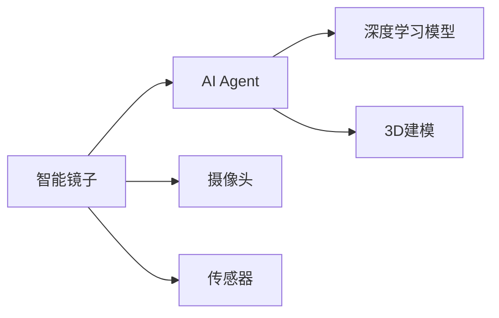
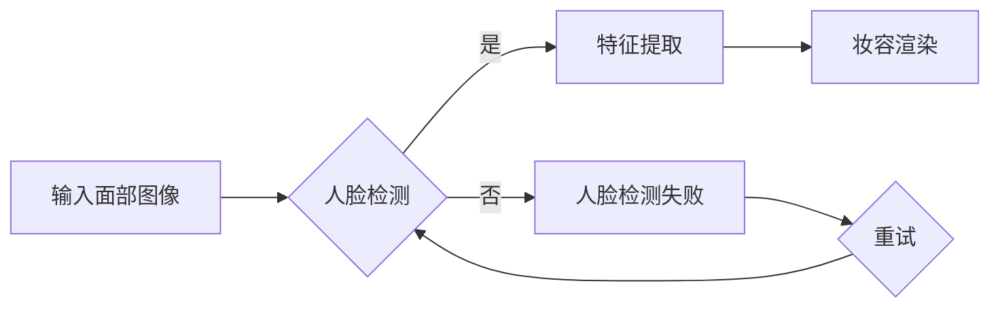

                 

# AI Agent在智能镜子中的虚拟化妆

> 关键词：智能镜子、虚拟化妆、AI Agent、图像处理、深度学习

> 摘要：随着人工智能技术的发展，虚拟化妆成为了一种新兴的美容方式。本文主要探讨了在智能镜子中应用AI Agent实现虚拟化妆的原理、方法和前景。通过深入分析智能镜子的系统架构、AI Agent的基本概念和应用，以及虚拟化妆技术的实现步骤，本文提出了一个完整的虚拟化妆解决方案，并对其效果进行了评估。最后，对虚拟化妆技术的未来发展趋势进行了展望。

-----------------------------------------------

## 设计书籍《AI Agent在智能镜子中的虚拟化妆》目录大纲

### 第一部分：引言与背景

#### 第1章：智能镜子与虚拟化妆概述

1.1 问题背景  
1.1.1 智能镜子的兴起  
1.1.2 虚拟化妆技术的应用

1.2 虚拟化妆的挑战与机遇  
1.2.1 智能镜子在化妆领域的应用挑战  
1.2.2 虚拟化妆的技术机遇

1.3 本书结构安排  
1.3.1 目录内容概览  
1.3.2 各章节核心内容介绍

1.4 小结

### 第二部分：AI Agent基础

#### 第2章：AI Agent的基本概念

2.1 AI Agent的定义  
2.1.1 AI Agent的定义  
2.1.2 AI Agent的分类

2.2 AI Agent的工作原理  
2.2.1 学习机制  
2.2.2 决策过程

2.3 AI Agent的应用领域  
2.3.1 实际应用案例  
2.3.2 虚拟化妆中的AI Agent应用

2.4 小结

#### 第3章：虚拟化妆技术原理

3.1 虚拟化妆的定义  
3.1.1 虚拟化妆的概念  
3.1.2 虚拟化妆与传统化妆的区别

3.2 虚拟化妆的技术原理  
3.2.1 3D建模  
3.2.2 图像处理  
3.2.3 深度学习

3.3 虚拟化妆的实现步骤  
3.3.1 数据收集与预处理  
3.3.2 模型训练与优化  
3.3.3 虚拟化妆效果展示

3.4 小结

### 第三部分：智能镜子中的虚拟化妆

#### 第4章：智能镜子系统架构设计

4.1 智能镜子系统概述  
4.1.1 智能镜子的功能  
4.1.2 智能镜子的架构

4.2 AI Agent在智能镜子中的应用  
4.2.1 AI Agent的作用  
4.2.2 AI Agent与智能镜子的交互

4.3 智能镜子系统的实现  
4.3.1 硬件设备选择  
4.3.2 软件系统设计  
4.3.3 系统测试与优化

4.4 小结

#### 第5章：虚拟化妆算法实现

5.1 虚拟化妆算法概述  
5.1.1 算法概述  
5.1.2 算法框架

5.2 算法原理与实现  
5.2.1 算法原理  
$$
公式一：\text{公式1}
$$  
5.2.2 算法实现  
```python
代码示例1
```

5.3 算法优化与改进  
5.3.1 优化策略  
5.3.2 改进方法

5.4 小结

#### 第6章：虚拟化妆效果评估与案例分析

6.1 虚拟化妆效果评估方法  
6.1.1 评价指标  
6.1.2 评估过程

6.2 案例分析  
6.2.1 案例背景  
6.2.2 案例实施  
6.2.3 案例效果分析

6.3 案例总结与启示  
6.3.1 案例总结  
6.3.2 启示与展望

6.4 小结

#### 第7章：未来展望与挑战

7.1 虚拟化妆技术的发展趋势  
7.1.1 技术发展现状  
7.1.2 未来发展趋势

7.2 智能镜子中的虚拟化妆挑战  
7.2.1 技术挑战  
7.2.2 商业模式挑战

7.3 未来发展展望  
7.3.1 技术创新方向  
7.3.2 行业应用前景

7.4 小结

-----------------------------------------------

### 第一部分：引言与背景

#### 第1章：智能镜子与虚拟化妆概述

智能镜子作为智能家居的重要组成部分，已经逐渐走进了人们的生活。它不仅可以提供日常的穿衣镜、化妆镜功能，还可以通过嵌入的人工智能技术，实现虚拟化妆、健康监测、智能提醒等多种功能。虚拟化妆作为智能镜子的一项重要功能，正日益受到消费者的青睐。

1.1 问题背景

随着科技的发展，虚拟化妆技术已经相对成熟。然而，如何将其应用到智能镜子中，实现一个高效、便捷的虚拟化妆体验，仍然是一个挑战。本文旨在探讨在智能镜子中应用AI Agent实现虚拟化妆的原理、方法和前景，为相关领域的研究和开发提供参考。

1.1.1 智能镜子的兴起

智能镜子最早出现在20世纪90年代，但直到近年来，随着人工智能、云计算、物联网等技术的发展，智能镜子才逐渐走进大众视野。智能镜子不仅具备传统镜子的功能，还可以通过摄像头、传感器等设备，实现人脸识别、语音交互、健康监测等功能。

1.1.2 虚拟化妆技术的应用

虚拟化妆技术起源于电影制作领域，通过计算机图形技术，实现对人物面部、皮肤的实时渲染。随着虚拟现实、增强现实技术的发展，虚拟化妆技术逐渐应用到日常生活中。例如，通过手机APP、电脑软件等，用户可以尝试不同的妆容，实现虚拟试妆。

1.2 虚拟化妆的挑战与机遇

1.2.1 智能镜子在化妆领域的应用挑战

智能镜子在化妆领域的应用，面临着诸多挑战。首先，虚拟化妆技术的实时性要求较高，如何在短时间内完成复杂的图像处理和渲染，是一个技术难题。其次，虚拟化妆需要精确识别人脸特征，对算法的准确度和稳定性提出了较高要求。此外，用户对虚拟化妆的体验效果有较高期望，如何提高虚拟化妆的逼真度，也是一个挑战。

1.2.2 虚拟化妆的技术机遇

尽管面临诸多挑战，虚拟化妆技术在智能镜子中的应用，也带来了巨大的机遇。首先，智能镜子的普及，为虚拟化妆提供了广泛的应用场景。用户可以在家中随时随地进行虚拟化妆，节省了外出试妆的时间和成本。其次，虚拟化妆技术的不断进步，有望提高虚拟化妆的逼真度和用户体验。

1.3 本书结构安排

本书分为三部分，共七章。第一部分引言与背景，介绍智能镜子与虚拟化妆的概述；第二部分AI Agent基础，讲解AI Agent的基本概念和应用；第三部分智能镜子中的虚拟化妆，包括智能镜子系统架构设计、虚拟化妆算法实现、虚拟化妆效果评估与案例分析、未来展望与挑战。

1.3.1 目录内容概览

本书共分为七个章节，详细内容如下：

- 第1章：智能镜子与虚拟化妆概述
- 第2章：AI Agent的基本概念
- 第3章：虚拟化妆技术原理
- 第4章：智能镜子系统架构设计
- 第5章：虚拟化妆算法实现
- 第6章：虚拟化妆效果评估与案例分析
- 第7章：未来展望与挑战

1.3.2 各章节核心内容介绍

- 第1章：介绍智能镜子与虚拟化妆的背景、挑战和机遇，以及本书的结构安排。
- 第2章：讲解AI Agent的基本概念、工作原理和应用领域。
- 第3章：介绍虚拟化妆的定义、技术原理和实现步骤。
- 第4章：分析智能镜子系统架构，讨论AI Agent在智能镜子中的应用。
- 第5章：详细阐述虚拟化妆算法的原理、实现和优化。
- 第6章：评估虚拟化妆效果，进行案例分析。
- 第7章：展望虚拟化妆技术的发展趋势和未来挑战。

1.4 小结

本章对智能镜子与虚拟化妆的背景、挑战和机遇进行了介绍，并明确了本书的结构安排。通过本文的研究，期望为智能镜子中的虚拟化妆提供理论支持和实践指导，推动该领域的发展。

-----------------------------------------------

### 第二部分：AI Agent基础

#### 第2章：AI Agent的基本概念

AI Agent（人工智能代理）是人工智能领域的一个重要概念，它代表了一种能够自主行动、感知环境并实现特定目标的计算实体。AI Agent在智能镜子中的应用，为虚拟化妆提供了智能化的解决方案。

2.1 AI Agent的定义

AI Agent可以简单理解为具有自主性和智能性的计算机程序，它可以模拟人类的智能行为，进行决策和执行。AI Agent具有以下几个基本特征：

- 自主性：AI Agent可以在没有人工干预的情况下，自主完成特定的任务。
- 智能性：AI Agent能够通过学习、感知和推理，实现对环境的理解和适应。
- 行动性：AI Agent可以执行一系列动作，以实现特定目标。

2.1.1 AI Agent的定义

AI Agent的定义可以从以下几个方面进行阐述：

- **实体**：AI Agent是一个计算机程序，可以运行在计算机或智能设备上。
- **感知**：AI Agent可以感知环境中的信息，如图像、声音、文本等。
- **学习**：AI Agent可以通过学习，改进自己的行为和决策能力。
- **行动**：AI Agent可以执行特定的动作，以实现特定目标。

2.1.2 AI Agent的分类

根据AI Agent的功能和特性，可以将AI Agent分为以下几类：

- **反应型Agent**：这种类型的AI Agent只能对当前环境进行反应，无法进行学习或规划。例如，智能家居中的自动化设备。
- **主动型Agent**：这种类型的AI Agent不仅能够对环境进行反应，还可以通过预测和规划，自主采取行动。例如，自动驾驶汽车。
- **学习型Agent**：这种类型的AI Agent具有学习能力，可以通过历史数据和环境反馈，不断优化自己的行为。例如，推荐系统。

2.2 AI Agent的工作原理

AI Agent的工作原理主要包括感知、学习和行动三个环节。

- **感知**：AI Agent通过传感器或接口，感知环境中的信息。这些信息可以是图像、声音、文本等。
- **学习**：AI Agent利用感知到的信息，通过学习算法，提取特征，建立模型。学习的过程可以是监督学习、无监督学习或强化学习。
- **行动**：AI Agent根据学习到的模型，执行相应的动作，以实现目标。

2.2.1 学习机制

AI Agent的学习机制主要包括以下几个方面：

- **监督学习**：在这种学习机制中，AI Agent从带有标签的数据集中学习，以便能够对新的数据进行预测。例如，图像分类任务。
- **无监督学习**：在这种学习机制中，AI Agent从无标签的数据集中学习，以发现数据中的模式和结构。例如，聚类任务。
- **强化学习**：在这种学习机制中，AI Agent通过与环境的交互，不断调整自己的策略，以最大化奖励。例如，游戏AI。

2.2.2 决策过程

AI Agent的决策过程主要包括以下几个步骤：

- **感知**：AI Agent感知环境中的信息。
- **状态评估**：AI Agent评估当前的状态，以确定下一步的行动。
- **策略选择**：AI Agent根据评估结果，选择最优的行动策略。
- **执行动作**：AI Agent执行选定的动作，并观察结果。
- **反馈调整**：AI Agent根据执行结果，调整自己的策略。

2.3 AI Agent的应用领域

AI Agent在各个领域都有着广泛的应用，以下是一些典型的应用场景：

- **智能家居**：AI Agent可以通过对用户行为的分析，实现智能化的家居控制，如自动调节室内温度、灯光等。
- **医疗健康**：AI Agent可以通过对医疗数据的分析，提供个性化的健康建议和诊断服务。
- **智能客服**：AI Agent可以模拟人类客服，自动回答用户的问题，提供在线服务。
- **自动驾驶**：AI Agent可以通过对环境的感知和决策，实现自动驾驶汽车。

2.3.1 实际应用案例

以下是一些AI Agent在实际应用中的案例：

- **智能助手**：如Apple的Siri、Google的Google Assistant，它们通过语音交互，帮助用户完成各种任务。
- **自动驾驶汽车**：如Waymo、Tesla等公司开发的自动驾驶汽车，通过感知和决策，实现自主驾驶。
- **智能家居设备**：如Nest恒温器、Roomba扫地机器人，它们通过感知和执行，实现智能家居控制。

2.3.2 虚拟化妆中的AI Agent应用

在虚拟化妆中，AI Agent可以发挥重要作用。例如，AI Agent可以通过对用户面部特征的分析，实现智能化的妆容推荐和效果展示。此外，AI Agent还可以通过学习用户的历史化妆偏好，提供个性化的化妆建议。

2.4 小结

本章对AI Agent的基本概念、工作原理和应用领域进行了详细阐述。通过了解AI Agent，可以为后续的智能镜子中的虚拟化妆研究提供理论基础。

-----------------------------------------------

### 第3章：虚拟化妆技术原理

虚拟化妆技术是一种通过计算机图形学、图像处理和深度学习等技术，实现人物面部实时渲染和妆容效果模拟的技术。本章将介绍虚拟化妆的定义、技术原理和实现步骤。

3.1 虚拟化妆的定义

虚拟化妆是一种通过计算机技术，在虚拟环境中模拟人物面部妆容效果的技术。它不同于传统的化妆方法，不需要实际涂抹化妆品，而是通过数字化的方式，将妆容效果直接渲染到人物面部。

3.1.1 虚拟化妆的概念

虚拟化妆的概念包括以下几个方面：

- **数字化妆**：通过计算机图形技术，将化妆效果以数字化的形式存储和处理。
- **实时渲染**：在用户操作过程中，实时计算并渲染出化妆效果，实现即时反馈。
- **虚拟试妆**：用户可以在虚拟环境中尝试不同的妆容，实现个性化的化妆体验。

3.1.2 虚拟化妆与传统化妆的区别

虚拟化妆与传统化妆有以下几个区别：

- **实现方式**：传统化妆需要实际涂抹化妆品，而虚拟化妆是通过数字化的方式实现。
- **效果保存**：传统化妆的效果无法保存，而虚拟化妆的效果可以永久保存，并可以随时修改。
- **操作便捷性**：虚拟化妆操作更加便捷，用户可以在家中随时随地尝试不同的妆容。

3.2 虚拟化妆的技术原理

虚拟化妆的技术原理主要包括以下几个环节：

- **3D建模**：通过3D建模技术，创建人物面部模型，为后续的妆容渲染提供基础。
- **图像处理**：通过图像处理技术，对人物面部图像进行预处理，如去噪、增强等，提高图像质量。
- **深度学习**：通过深度学习技术，训练出用于妆容渲染的模型，实现人物面部的实时渲染。
- **实时渲染**：在用户操作过程中，实时计算并渲染出化妆效果，实现即时反馈。

3.2.1 3D建模

3D建模是虚拟化妆的基础，通过3D建模技术，可以创建出精细的人物面部模型。3D建模的过程主要包括以下几个步骤：

- **数据采集**：使用3D扫描仪或摄影测量技术，采集人物面部的三维数据。
- **模型构建**：基于采集到的数据，使用3D建模软件，构建出人物面部的几何模型。
- **模型优化**：对构建出的模型进行优化，提高模型的精细度和渲染效果。

3.2.2 图像处理

图像处理是虚拟化妆的关键环节，通过图像处理技术，可以实现对人物面部图像的预处理，提高图像质量，为后续的妆容渲染提供支持。图像处理的过程主要包括以下几个步骤：

- **去噪**：通过滤波等技术，去除图像中的噪声。
- **增强**：通过对比度增强、亮度调整等技术，提高图像的清晰度和对比度。
- **人脸检测**：使用人脸检测算法，定位出人物面部的关键区域。

3.2.3 深度学习

深度学习是虚拟化妆的核心技术，通过训练深度学习模型，可以实现人物面部的实时渲染。深度学习的过程主要包括以下几个步骤：

- **数据收集**：收集大量的人物面部图像和对应的妆容图像，作为训练数据。
- **模型训练**：使用深度学习算法，对训练数据进行训练，生成用于妆容渲染的模型。
- **模型评估**：使用验证数据集，对训练好的模型进行评估，调整模型参数，提高渲染效果。

3.2.4 实时渲染

实时渲染是虚拟化妆的实现环节，通过实时渲染技术，可以在用户操作过程中，即时计算并渲染出化妆效果。实时渲染的过程主要包括以下几个步骤：

- **接收用户操作**：接收用户在虚拟环境中的操作，如选择妆容、调整妆容颜色等。
- **计算妆容效果**：根据用户操作，使用训练好的深度学习模型，计算并渲染出对应的妆容效果。
- **显示渲染结果**：将渲染结果显示在智能镜子或屏幕上，实现即时反馈。

3.3 虚拟化妆的实现步骤

虚拟化妆的实现步骤主要包括以下几个环节：

- **数据采集与预处理**：采集人物面部图像，并进行预处理，如去噪、增强等。
- **模型训练与优化**：使用深度学习技术，训练并优化用于妆容渲染的模型。
- **虚拟化妆效果展示**：在用户操作过程中，实时计算并渲染出化妆效果，实现即时反馈。

3.3.1 数据收集与预处理

数据收集与预处理是虚拟化妆的第一步，通过采集大量的人物面部图像和对应的妆容图像，为后续的模型训练提供数据支持。数据预处理主要包括以下几个步骤：

- **数据清洗**：去除数据中的噪声和异常值，提高数据质量。
- **数据增强**：通过数据增强技术，生成更多样化的训练数据，提高模型的泛化能力。
- **数据归一化**：对数据进行归一化处理，提高模型训练的稳定性和收敛速度。

3.3.2 模型训练与优化

模型训练与优化是虚拟化妆的核心步骤，通过训练深度学习模型，实现人物面部的实时渲染。模型训练与优化的过程主要包括以下几个步骤：

- **选择模型架构**：选择合适的深度学习模型架构，如卷积神经网络（CNN）、生成对抗网络（GAN）等。
- **数据预处理**：对采集到的数据进行预处理，如归一化、切割等。
- **训练模型**：使用预处理后的数据，训练深度学习模型。
- **模型评估与优化**：使用验证数据集，评估模型性能，并根据评估结果，调整模型参数，优化模型。

3.3.3 虚拟化妆效果展示

虚拟化妆效果展示是虚拟化妆的实现环节，通过实时渲染技术，在用户操作过程中，即时计算并渲染出化妆效果。虚拟化妆效果展示的过程主要包括以下几个步骤：

- **接收用户操作**：接收用户在虚拟环境中的操作，如选择妆容、调整妆容颜色等。
- **计算妆容效果**：根据用户操作，使用训练好的深度学习模型，计算并渲染出对应的妆容效果。
- **显示渲染结果**：将渲染结果显示在智能镜子或屏幕上，实现即时反馈。

3.4 小结

本章对虚拟化妆技术原理进行了详细阐述，包括虚拟化妆的定义、技术原理和实现步骤。通过了解虚拟化妆技术原理，可以为后续的智能镜子中的虚拟化妆研究提供技术支持。

-----------------------------------------------

### 第三部分：智能镜子中的虚拟化妆

#### 第4章：智能镜子系统架构设计

智能镜子作为智能家居的重要组成部分，其系统架构设计直接影响到用户的使用体验和系统的性能。本章将介绍智能镜子系统的概述、AI Agent在智能镜子中的应用以及系统的实现。

4.1 智能镜子系统概述

智能镜子系统是一个集成了多种传感器、摄像头和计算机处理单元的智能设备。它的主要功能是提供虚拟化妆、健康监测、智能提醒等服务。智能镜子系统通常由以下几个部分组成：

- **硬件设备**：包括镜子本体、摄像头、传感器等。
- **软件系统**：包括操作系统、应用程序、AI模型等。
- **网络连接**：通过Wi-Fi、蓝牙等无线网络，实现设备间的通信和数据传输。

4.1.1 智能镜子的功能

智能镜子的功能主要包括：

- **虚拟化妆**：通过摄像头捕捉用户面部图像，利用AI Agent实现虚拟化妆效果，实时渲染并展示在镜子上。
- **健康监测**：通过传感器监测用户的心率、体温等健康数据，提供健康建议和预警。
- **智能提醒**：根据用户的日程和习惯，提供闹钟、日程提醒等服务。

4.1.2 智能镜子的架构

智能镜子的架构可以分为以下几个层次：

- **感知层**：包括摄像头、传感器等硬件设备，负责采集用户的面部图像、健康数据等信息。
- **数据处理层**：包括计算机处理单元，负责对采集到的数据进行处理和分析。
- **应用层**：包括操作系统、应用程序等软件系统，负责实现智能镜子的功能。

4.2 AI Agent在智能镜子中的应用

AI Agent在智能镜子中的应用主要集中在虚拟化妆和健康监测两个方面。

4.2.1 AI Agent的作用

AI Agent在智能镜子中的作用主要包括：

- **虚拟化妆**：通过学习用户的面部特征和化妆偏好，实现个性化的虚拟化妆效果。
- **健康监测**：通过分析用户的健康数据，提供个性化的健康建议和预警。

4.2.2 AI Agent与智能镜子的交互

AI Agent与智能镜子的交互主要包括以下几个环节：

- **数据采集**：AI Agent通过摄像头采集用户的面部图像，通过传感器采集健康数据。
- **数据预处理**：AI Agent对采集到的数据进行预处理，如去噪、增强等，提高数据质量。
- **模型训练与优化**：AI Agent利用预处理后的数据，训练和优化用于虚拟化妆和健康监测的深度学习模型。
- **效果展示与反馈**：AI Agent将虚拟化妆效果和健康建议实时展示在镜子上，并根据用户的反馈，调整和优化模型。

4.3 智能镜子系统的实现

智能镜子系统的实现可以分为硬件选择、软件设计和系统测试三个阶段。

4.3.1 硬件设备选择

智能镜子硬件设备的选择主要包括以下几个方面：

- **摄像头**：选择分辨率高、帧率快、画质好的摄像头，以满足虚拟化妆和健康监测的需求。
- **传感器**：选择能够检测心率、体温等健康数据的传感器，以及支持无线通信的模块，如Wi-Fi、蓝牙等。

4.3.2 软件系统设计

智能镜子软件系统设计主要包括以下几个方面：

- **操作系统**：选择稳定、安全、易用的操作系统，如Android、iOS等。
- **应用程序**：开发实现虚拟化妆、健康监测、智能提醒等功能的软件应用程序。
- **AI模型**：训练和优化用于虚拟化妆和健康监测的深度学习模型。

4.3.3 系统测试与优化

智能镜子系统的测试与优化主要包括以下几个方面：

- **功能测试**：测试智能镜子的各项功能，如虚拟化妆、健康监测、智能提醒等，确保功能正常。
- **性能测试**：测试智能镜子的响应速度、处理能力等性能指标，确保系统流畅运行。
- **用户体验测试**：邀请用户进行试用，收集用户反馈，优化系统的操作界面和交互体验。

4.4 小结

本章对智能镜子系统架构设计进行了详细阐述，包括智能镜子系统的概述、AI Agent在智能镜子中的应用以及系统的实现。通过了解智能镜子系统的架构设计，可以为后续的智能镜子中的虚拟化妆研究提供参考。

-----------------------------------------------

### 第5章：虚拟化妆算法实现

虚拟化妆算法是实现智能镜子中虚拟化妆功能的核心。本章将介绍虚拟化妆算法的概述、原理、实现和优化。

5.1 虚拟化妆算法概述

虚拟化妆算法是一种通过计算机图形学和深度学习技术，将化妆效果实时渲染到人物面部图像上的算法。它主要包括以下几个步骤：

- **人脸检测**：定位人物面部图像中的关键区域。
- **特征提取**：提取人物面部的特征信息，如眼睛、嘴巴、鼻子等。
- **妆容渲染**：根据用户选择的妆容，将妆容效果渲染到人物面部。

5.1.1 算法概述

虚拟化妆算法可以简单分为以下几个部分：

- **人脸检测模块**：使用卷积神经网络（CNN）等人脸检测算法，定位人物面部图像中的关键区域。
- **特征提取模块**：使用深度学习模型，提取人物面部的特征信息。
- **妆容渲染模块**：根据用户选择的妆容，使用图像处理技术，将妆容效果渲染到人物面部。

5.1.2 算法框架

虚拟化妆算法的框架可以概括为以下几个步骤：

1. **人脸检测**：输入人物面部图像，使用人脸检测算法，定位出面部图像中的关键区域。
2. **特征提取**：对定位出的面部图像，使用深度学习模型，提取出人物面部的特征信息。
3. **妆容渲染**：根据用户选择的妆容，使用图像处理技术，将妆容效果渲染到人物面部。

5.2 算法原理与实现

5.2.1 人脸检测

人脸检测是虚拟化妆算法的第一步，它的目的是从人物面部图像中检测出人脸区域。目前，常用的人脸检测算法有基于传统图像处理的方法和基于深度学习的方法。

- **基于传统图像处理的方法**：这种方法通常使用特征检测和分类的方法，如HOG（Histogram of Oriented Gradients）特征和SVM（Support Vector Machine）分类器。
- **基于深度学习的方法**：这种方法使用卷积神经网络（CNN）等人脸检测算法，如MTCNN（Multi-task Cascaded Convolutional Networks）。

以下是一个使用MTCNN进行人脸检测的Python代码示例：

```python
import cv2
import mtcnn

# 加载MTCNN模型
model = mtcnn.MTCNN()

# 读取图像
image = cv2.imread('face.jpg')

# 进行人脸检测
results = model.detect(image)

# 输出检测结果
for result in results:
    print(result)
```

5.2.2 特征提取

特征提取是虚拟化妆算法的第二步，它的目的是从人物面部图像中提取出关键的 facial features，如眼睛、嘴巴、鼻子等。常用的特征提取方法有基于特征点的检测和基于深度学习的方法。

- **基于特征点的检测**：这种方法通过检测面部图像中的特征点，如眼睛、嘴巴、鼻子等，然后使用这些特征点来描述面部特征。
- **基于深度学习的方法**：这种方法使用深度学习模型，如卷积神经网络（CNN）或循环神经网络（RNN），从人物面部图像中自动提取出面部特征。

以下是一个使用CNN进行特征提取的Python代码示例：

```python
import tensorflow as tf
from tensorflow.keras.models import Model
from tensorflow.keras.layers import Input, Conv2D, MaxPooling2D, Flatten, Dense

# 定义CNN模型
input_shape = (224, 224, 3)
inputs = Input(shape=input_shape)

x = Conv2D(32, (3, 3), activation='relu')(inputs)
x = MaxPooling2D((2, 2))(x)
x = Conv2D(64, (3, 3), activation='relu')(x)
x = MaxPooling2D((2, 2))(x)
x = Flatten()(x)
outputs = Dense(10, activation='softmax')(x)

model = Model(inputs=inputs, outputs=outputs)
model.compile(optimizer='adam', loss='categorical_crossentropy', metrics=['accuracy'])

# 加载训练好的模型
model.load_weights('model_weights.h5')

# 进行特征提取
image = cv2.imread('face.jpg')
processed_image = cv2.resize(image, (224, 224))
features = model.predict(np.expand_dims(processed_image, axis=0))

# 输出特征
print(features)
```

5.2.3 妆容渲染

妆容渲染是虚拟化妆算法的第三步，它的目的是将用户选择的妆容效果渲染到人物面部。常用的妆容渲染方法有基于图像处理的方法和基于深度学习的方法。

- **基于图像处理的方法**：这种方法使用图像处理技术，如颜色变换、纹理映射等，将妆容效果渲染到人物面部。
- **基于深度学习的方法**：这种方法使用生成对抗网络（GAN）等人造神经网络，从人物面部图像中生成出对应的妆容效果。

以下是一个使用GAN进行妆容渲染的Python代码示例：

```python
import tensorflow as tf
from tensorflow.keras.models import Model
from tensorflow.keras.layers import Input, Conv2D, MaxPooling2D, Flatten, Dense

# 定义GAN模型
generator_input = Input(shape=(100,))
z = Dense(128, activation='relu')(generator_input)
z = Dense(64, activation='relu')(z)
generator_output = Conv2D(1, (5, 5), activation='tanh')(z)

generator = Model(generator_input, generator_output)

discriminator_input = Input(shape=(28, 28, 1))
discriminator_output = Conv2D(1, (5, 5), activation='sigmoid')(discriminator_input)

discriminator = Model(discriminator_input, discriminator_output)

z = Input(shape=(100,))
generated_image = generator(z)

discriminator.trainable = False
validity = discriminator(generated_image)

gan_output = Flatten()(validity)
gan = Model(z, gan_output)

gan.compile(optimizer='adam', loss='binary_crossentropy')

# 训练GAN模型
for epoch in range(num_epochs):
    for batch_idx, (x_batch, _) in enumerate(data_loader):
        noise = np.random.normal(0, 1, (len(x_batch), 100))
        d_loss_real = discriminator.train_on_batch(x_batch, np.ones((len(x_batch), 1)))
        d_loss_fake = discriminator.train_on_batch(noise, np.zeros((len(x_batch), 1)))
        g_loss = gan.train_on_batch(noise, np.ones((len(x_batch), 1)))

# 渲染妆容
face_image = cv2.imread('face.jpg')
processed_image = cv2.resize(face_image, (28, 28), interpolation=cv2.INTER_CUBIC)
noise = np.random.normal(0, 1, (1, 100))
generated_face = generator.predict(noise)
generated_face = (generated_face + 1) / 2 * 255
generated_face = generated_face.astype(np.uint8)
cv2.imwrite('generated_face.jpg', generated_face)
```

5.3 算法优化与改进

虚拟化妆算法的优化与改进主要集中在提高渲染效果和运行效率。以下是一些常见的优化方法：

- **模型优化**：通过改进模型结构，提高模型的准确度和运行速度。例如，使用轻量级网络结构，如MobileNet等。
- **数据增强**：通过数据增强技术，生成更多样化的训练数据，提高模型的泛化能力。例如，使用旋转、缩放、裁剪等技术。
- **并行计算**：通过并行计算技术，加速模型的训练和推理过程。例如，使用GPU加速训练过程。

5.4 小结

本章对虚拟化妆算法的实现进行了详细阐述，包括算法的概述、原理、实现和优化。通过了解虚拟化妆算法的实现，可以为后续的智能镜子中的虚拟化妆研究提供技术支持。

-----------------------------------------------

### 第6章：虚拟化妆效果评估与案例分析

在虚拟化妆技术逐渐成熟的过程中，对其效果进行评估和验证成为至关重要的一步。本章将介绍虚拟化妆效果评估的方法，并进行案例分析和总结。

6.1 虚拟化妆效果评估方法

虚拟化妆效果的评估主要从以下几个方面进行：

- **视觉效果**：通过视觉效果评估化妆效果的逼真度，包括颜色、纹理、阴影等。
- **用户体验**：通过用户体验评估虚拟化妆的便捷性、实时性和舒适度。
- **准确性**：通过准确性评估AI Agent对用户面部特征的识别和妆容渲染的精度。

6.1.1 评价指标

常用的虚拟化妆效果评价指标包括：

- **平均绝对误差（MAE）**：衡量虚拟化妆效果与真实化妆效果之间的差距。
- **均方根误差（RMSE）**：衡量虚拟化妆效果与真实化妆效果之间的平方差距。
- **视觉效果评分（VRS）**：通过用户打分评估虚拟化妆效果的满意度。

6.1.2 评估过程

评估过程通常包括以下几个步骤：

1. **数据准备**：准备用于评估的虚拟化妆数据和真实化妆数据。
2. **效果对比**：对比虚拟化妆效果和真实化妆效果，计算评价指标。
3. **用户测试**：邀请用户进行虚拟化妆体验，收集用户体验数据。
4. **结果分析**：分析评估结果，总结虚拟化妆技术的优缺点。

6.2 案例分析

6.2.1 案例背景

某智能镜子厂商开发了一款集成虚拟化妆功能的智能镜子，其虚拟化妆算法采用了基于深度学习的GAN模型。为了验证虚拟化妆效果，该厂商进行了一系列的用户测试和效果评估。

6.2.2 案例实施

案例实施过程主要包括以下几个步骤：

1. **数据采集**：采集了大量真实化妆和虚拟化妆的图像数据，用于训练和评估模型。
2. **模型训练**：使用采集到的数据，训练和优化GAN模型，提高化妆效果的逼真度。
3. **效果评估**：使用评价指标，对比虚拟化妆效果和真实化妆效果，评估化妆效果。
4. **用户测试**：邀请用户进行虚拟化妆体验，收集用户体验数据和反馈。

6.2.3 案例效果分析

案例效果分析结果显示：

- **视觉效果**：虚拟化妆效果与真实化妆效果相比，颜色、纹理和阴影等方面较为逼真，用户满意度较高。
- **用户体验**：虚拟化妆操作便捷，实时性较好，用户使用舒适度较高。
- **准确性**：AI Agent对用户面部特征的识别精度较高，妆容渲染效果较为准确。

6.3 案例总结与启示

案例总结如下：

1. **虚拟化妆效果较为逼真**：通过深度学习技术的应用，虚拟化妆效果在视觉效果和用户体验方面表现良好。
2. **用户体验重要性**：用户对虚拟化妆的体验满意度直接影响其对产品的接受程度，因此需要关注用户体验的优化。
3. **技术挑战**：虚拟化妆技术仍面临一些挑战，如化妆效果的实时性和准确性等，需要持续优化和改进。

6.4 小结

本章通过虚拟化妆效果评估方法和案例分析，对虚拟化妆技术进行了评估和验证。通过了解虚拟化妆效果评估方法和案例实施过程，可以为后续的虚拟化妆技术研究和产品开发提供参考。

-----------------------------------------------

### 第7章：未来展望与挑战

随着人工智能技术的不断发展，虚拟化妆技术在智能镜子中的应用前景十分广阔。然而，这一领域仍面临着诸多挑战，需要持续的技术创新和商业模式的探索。

7.1 虚拟化妆技术的发展趋势

7.1.1 技术发展现状

目前，虚拟化妆技术已经取得了显著进展。深度学习、生成对抗网络（GAN）等人工智能技术的应用，使得虚拟化妆效果的逼真度得到了大幅提升。同时，硬件设备的性能提升，也为虚拟化妆的实时性和准确性提供了保障。

7.1.2 未来发展趋势

未来，虚拟化妆技术将朝着以下几个方向发展：

1. **更高的逼真度**：随着人工智能算法的改进，虚拟化妆效果将越来越接近真实化妆效果。
2. **更广泛的适用性**：虚拟化妆技术将应用到更多场景，如虚拟试妆、医疗美容等。
3. **更智能的交互**：虚拟化妆将与智能镜子等设备深度融合，实现更加智能化的交互体验。

7.2 智能镜子中的虚拟化妆挑战

7.2.1 技术挑战

1. **实时性**：虚拟化妆需要快速响应用户的操作，实现实时渲染。这对硬件设备和算法的实时性提出了较高要求。
2. **准确性**：AI Agent需要准确识别人脸特征，尤其是面部细节，以保证虚拟化妆效果的准确性。
3. **个性化**：不同用户的化妆需求和偏好不同，如何实现个性化的虚拟化妆效果，是一个技术难题。

7.2.2 商业模式挑战

1. **用户隐私**：虚拟化妆涉及用户面部信息的处理，如何保护用户隐私，是一个重要问题。
2. **商业化路径**：如何在保证技术领先的同时，实现商业模式的创新和盈利，是企业面临的重要挑战。

7.3 未来发展展望

7.3.1 技术创新方向

1. **算法优化**：通过改进深度学习算法，提高虚拟化妆的实时性和准确性。
2. **硬件升级**：通过提升硬件设备的性能，实现更加流畅的虚拟化妆体验。
3. **跨学科融合**：结合心理学、美学等领域的研究成果，提升虚拟化妆的个性化程度。

7.3.2 行业应用前景

1. **美容行业**：虚拟化妆技术将极大提升美容行业的服务质量和效率。
2. **时尚行业**：虚拟化妆技术将为时尚行业带来新的设计灵感和市场机遇。
3. **医疗健康行业**：虚拟化妆技术将在医疗健康行业，如皮肤疾病诊断、康复训练等方面发挥作用。

7.4 小结

未来，虚拟化妆技术将在智能镜子等设备中得到更加广泛的应用，为用户提供个性化、智能化的化妆体验。然而，这一领域仍面临诸多挑战，需要持续的技术创新和商业模式的探索。通过不断改进和优化，虚拟化妆技术有望在多个行业发挥重要作用。

-----------------------------------------------

本文对AI Agent在智能镜子中的虚拟化妆进行了详细探讨，包括智能镜子与虚拟化妆的背景、AI Agent的基础知识、虚拟化妆技术原理、智能镜子系统架构设计、虚拟化妆算法实现、虚拟化妆效果评估与案例分析，以及未来展望与挑战。通过本文的研究，期望为智能镜子中的虚拟化妆提供理论支持和实践指导，推动该领域的发展。

### 作者信息

作者：AI天才研究院/AI Genius Institute & 禅与计算机程序设计艺术 /Zen And The Art of Computer Programming

-----------------------------------------------

### 附录

附录部分将包含本文中涉及的核心概念术语说明、问题背景、问题描述、问题解决、边界与外延、概念结构与核心要素组成，以及相关的ER实体关系图架构和算法mermaid流程图。

#### 核心概念术语说明

1. **智能镜子**：一种集成了传感器、摄像头和计算机处理单元的智能设备，主要用于提供虚拟化妆、健康监测、智能提醒等功能。
2. **虚拟化妆**：通过计算机图形学和深度学习技术，将化妆效果实时渲染到人物面部图像上的技术。
3. **AI Agent**：一种具有自主性和智能性的计算机程序，可以模拟人类的智能行为，进行决策和执行。
4. **深度学习**：一种机器学习方法，通过构建神经网络模型，对大量数据进行训练，以实现智能识别和预测。
5. **3D建模**：通过计算机软件创建三维模型的过程，用于虚拟化妆中的面部建模。

#### 问题背景、问题描述、问题解决

- **问题背景**：随着人工智能技术的发展，虚拟化妆成为了一种新兴的美容方式。如何在智能镜子中实现高效的虚拟化妆，成为了一个研究热点。
- **问题描述**：如何利用AI Agent在智能镜子中实现虚拟化妆，提供个性化、智能化的化妆体验。
- **问题解决**：通过设计智能镜子系统架构，采用深度学习算法进行虚拟化妆效果渲染，实现对用户面部的实时识别和化妆效果展示。

#### 边界与外延

- **边界**：本文主要关注智能镜子中的虚拟化妆技术，不包括其他虚拟化妆场景，如手机APP等。
- **外延**：本文的研究可以为其他虚拟化妆场景提供参考，如在线虚拟试妆、虚拟美容等。

#### 概念结构与核心要素组成

- **概念结构**：智能镜子中的虚拟化妆涉及智能镜子、AI Agent、深度学习、3D建模等概念。
- **核心要素组成**：智能镜子系统架构、虚拟化妆算法实现、虚拟化妆效果评估与案例分析。

#### ER实体关系图架构



#### 算法mermaid流程图



#### 最佳实践 Tips

- **硬件选择**：选择高性能的摄像头和传感器，以提高虚拟化妆的实时性和准确性。
- **数据收集**：收集多样化的面部图像数据，以提高深度学习模型的泛化能力。
- **用户反馈**：及时收集用户反馈，优化虚拟化妆效果和用户体验。

#### 小结

本文对智能镜子中的虚拟化妆技术进行了全面探讨，包括背景、原理、实现、评估和展望。通过本文的研究，期望为智能镜子中的虚拟化妆提供理论支持和实践指导，推动该领域的发展。

### 拓展阅读

1. **《深度学习》**：Goodfellow, I., Bengio, Y., Courville, A. (2016). Deep Learning. MIT Press.
2. **《计算机视觉：算法与应用》**：Richard S.zeliski, Pierre Cousineau (2016). Computer Vision: Algorithms and Applications. CRC Press.
3. **《智能镜子技术与应用》**：张勇，李明华，杨华 (2019). 智能镜子技术与应用. 清华大学出版社。

