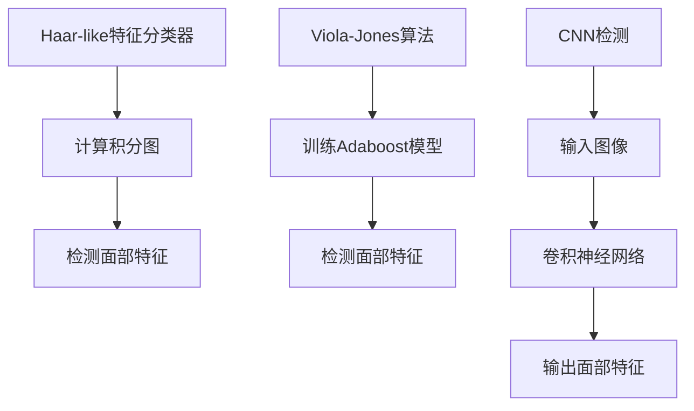
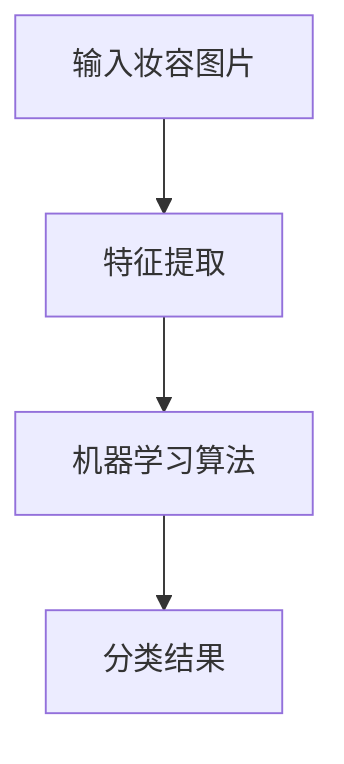
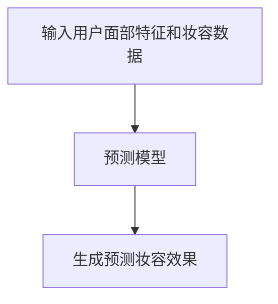
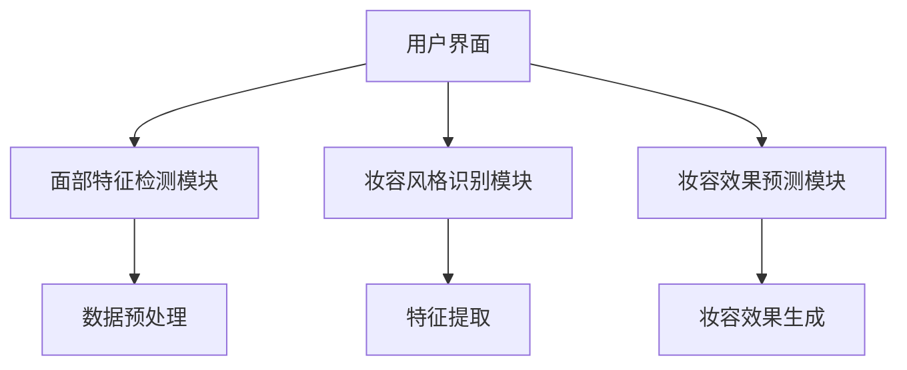
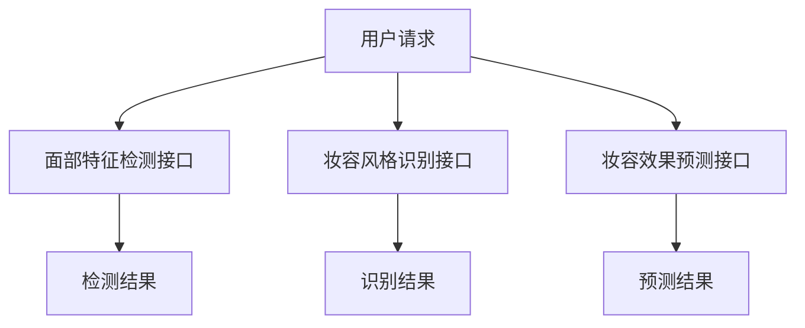
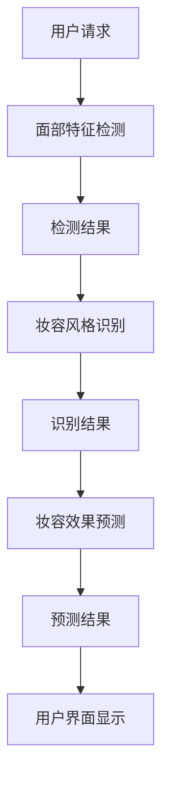

                 

# AI Agent在智能镜框中的妆容建议系统

> 关键词：人工智能，智能镜框，妆容建议，面部特征检测，机器学习，深度学习，算法实现

> 摘要：本文将探讨人工智能（AI）在智能镜框中妆容建议系统中的应用。通过分析面部特征检测、妆容风格识别和妆容效果预测等核心算法，我们深入解读了如何利用AI Agent实现个性化妆容建议，并展示了系统实现与优化过程。本文旨在为读者提供一份全面、系统的智能镜框妆容建议系统的技术指南。

## 第一部分：引言与背景

### 第1章：AI Agent与智能镜框概述

#### 1.1.1 问题的背景

随着人工智能技术的快速发展，智能穿戴设备在日常生活和工作中扮演着越来越重要的角色。智能镜框作为一种新兴的智能穿戴设备，通过集成人工智能算法，能够为用户实现更加智能化、个性化的服务。本章将介绍AI Agent在智能镜框中的应用背景，以及智能镜框在妆容建议系统中的作用。

#### 1.1.2 问题描述

妆容建议系统是智能镜框的一项重要功能，它通过分析用户的面部特征，提供合适的妆容建议。然而，实现这一功能需要解决多个技术难题，包括面部特征检测、妆容风格识别、妆容效果预测等。

#### 1.1.3 问题解决

为了解决上述问题，本书将从以下几个方面展开讨论：

1. 面部特征检测：介绍常用的面部特征检测算法，如Haar-like特征分类器、深度学习模型等。
2. 妆容风格识别：探讨如何从大量妆容数据中提取特征，并利用机器学习方法进行分类和识别。
3. 妆容效果预测：分析如何利用用户面部特征和妆容数据，预测不同妆容对用户外貌的影响。
4. 系统实现与优化：介绍妆容建议系统的实现过程，以及如何通过优化算法提高系统性能。

#### 1.1.4 边界与外延

妆容建议系统的实现涉及多个领域的知识，如计算机视觉、机器学习、图像处理等。本章将围绕这些领域的基本概念和技术方法进行阐述，旨在为读者提供一个全面、系统的认知框架。

#### 1.1.5 概念结构与核心要素组成

妆容建议系统的核心要素包括：

1. 面部特征检测模块：负责检测用户的面部特征，如眼睛、鼻子、嘴巴等。
2. 妆容风格识别模块：利用机器学习算法，对用户上传的妆容图片进行分类和识别。
3. 妆容效果预测模块：根据用户面部特征和妆容数据，预测不同妆容对用户外貌的影响。
4. 用户交互模块：提供用户与系统之间的交互界面，实现妆容建议的展示和反馈。

#### 1.2 本章小结

本章对AI Agent在智能镜框中的妆容建议系统进行了背景介绍和问题分析，并提出了问题解决的思路。在接下来的章节中，我们将逐一介绍相关技术方法和实现细节，帮助读者深入了解这一领域的最新进展和应用实践。

## 第二部分：核心概念与算法原理

### 第2章：面部特征检测算法原理

#### 2.1.1 常见面部特征检测算法

面部特征检测是妆容建议系统的第一步，常见的面部特征检测算法包括：

1. Haar-like特征分类器：基于积分图加速计算，实现快速面部特征检测。
2. Viola-Jones算法：基于Haar-like特征，提出了一种鲁棒性强的面部检测算法。
3. 卷积神经网络（CNN）检测：利用深度学习，实现高精度的面部特征检测。

#### 2.1.2 算法原理与流程

1. Haar-like特征分类器：通过将面部区域划分为多个矩形区域，计算每个矩形区域的积分图，利用积分图的性质，实现快速面部特征检测。

2. Viola-Jones算法：结合Haar-like特征和Adaboost算法，实现面部特征检测的实时性和准确性。

3. CNN检测：利用卷积神经网络，学习面部特征在图像中的表示，实现高精度的面部特征检测。

#### 2.1.3 Mermaid流程图

下面是使用Mermaid绘制的三种面部特征检测算法的流程图：



#### 2.1.4 比较与选择

在实际应用中，应根据系统需求、计算资源和准确率等因素，选择合适的面部特征检测算法。例如，在资源有限的情况下，可以选择Haar-like特征分类器或Viola-Jones算法；而在对精度要求较高的应用场景，可以选择CNN检测。

#### 2.2 本章小结

本章介绍了面部特征检测算法的基本原理和实现流程，包括Haar-like特征分类器、Viola-Jones算法和CNN检测。通过对这些算法的比较，读者可以了解它们在不同应用场景下的适用性。

## 第三部分：妆容风格识别与效果预测

### 第3章：妆容风格识别

#### 3.1.1 问题背景

妆容风格识别是妆容建议系统中的关键步骤，它涉及到从大量妆容数据中提取特征，并利用机器学习方法进行分类和识别。本章将介绍妆容风格识别的基本概念、特征提取方法和常见机器学习算法。

#### 3.1.2 特征提取

妆容风格识别的第一步是特征提取。常用的特征提取方法包括：

1. 手动特征提取：如颜色直方图、边缘检测、纹理分析等。
2. 深度学习特征提取：如卷积神经网络（CNN）提取的深度特征。

#### 3.1.3 机器学习算法

在特征提取之后，可以使用多种机器学习算法进行分类和识别，常见的算法包括：

1. K最近邻（K-Nearest Neighbors，KNN）
2. 支持向量机（Support Vector Machine，SVM）
3. 决策树（Decision Tree）
4. 随机森林（Random Forest）
5. 卷积神经网络（CNN）

#### 3.1.4 Mermaid流程图

下面是使用Mermaid绘制的妆容风格识别的流程图：



#### 3.1.5 比较与选择

在实际应用中，应根据数据集大小、算法复杂度和准确率等因素，选择合适的特征提取和分类算法。例如，在小型数据集上，KNN和决策树可能表现较好；而在大型数据集上，SVM和CNN可能更具优势。

#### 3.2 本章小结

本章介绍了妆容风格识别的基本概念、特征提取方法和常见机器学习算法。通过对这些算法的比较，读者可以了解它们在不同应用场景下的适用性。

### 第4章：妆容效果预测

#### 4.1.1 问题背景

妆容效果预测是妆容建议系统的核心环节，它涉及到如何利用用户面部特征和妆容数据，预测不同妆容对用户外貌的影响。本章将介绍妆容效果预测的基本概念、预测模型和方法。

#### 4.1.2 预测模型

妆容效果预测常用的模型包括：

1. 基于深度学习的预测模型：如生成对抗网络（GAN）和变分自编码器（VAE）。
2. 基于传统机器学习的预测模型：如线性回归、多项式回归等。

#### 4.1.3 预测方法

妆容效果预测的方法主要包括：

1. 直接预测法：根据用户面部特征和妆容数据，直接预测妆容效果。
2. 生成预测法：利用生成模型生成预测妆容效果。

#### 4.1.4 Mermaid流程图

下面是使用Mermaid绘制的妆容效果预测的流程图：



#### 4.1.5 比较与选择

在实际应用中，应根据系统需求、计算资源和预测准确率等因素，选择合适的预测模型和方法。例如，在资源有限的情况下，可以选择基于传统机器学习的预测模型；而在对预测精度要求较高的应用场景，可以选择基于深度学习的预测模型。

#### 4.2 本章小结

本章介绍了妆容效果预测的基本概念、预测模型和方法。通过对这些模型的比较，读者可以了解它们在不同应用场景下的适用性。

## 第四部分：系统实现与优化

### 第5章：系统实现

#### 5.1.1 系统设计

妆容建议系统的实现主要包括以下几个模块：

1. 面部特征检测模块：使用Haar-like特征分类器或CNN进行面部特征检测。
2. 妆容风格识别模块：使用SVM或CNN进行妆容风格识别。
3. 妆容效果预测模块：使用GAN或VAE进行妆容效果预测。
4. 用户交互模块：提供用户界面，实现用户与系统的交互。

#### 5.1.2 系统架构

妆容建议系统的架构设计如下：



#### 5.1.3 系统接口设计

系统接口设计如下：



#### 5.1.4 系统交互

系统交互设计如下：



### 第6章：系统优化

#### 6.1.1 性能优化

为了提高系统性能，可以从以下几个方面进行优化：

1. 算法优化：选择适合的算法，降低计算复杂度。
2. 硬件优化：提高硬件性能，如使用GPU进行加速计算。
3. 缓存优化：使用缓存技术，减少数据读取和传输时间。

#### 6.1.2 精度优化

为了提高系统精度，可以从以下几个方面进行优化：

1. 数据增强：增加训练数据集，提高模型的泛化能力。
2. 模型优化：选择合适的模型结构，提高预测精度。
3. 超参数调整：调整模型的超参数，优化模型性能。

#### 6.1.3 可扩展性优化

为了提高系统的可扩展性，可以从以下几个方面进行优化：

1. 模块化设计：将系统划分为多个模块，便于后续功能扩展。
2. 微服务架构：采用微服务架构，提高系统可扩展性和灵活性。
3. 分布式计算：利用分布式计算技术，提高系统处理能力。

### 第7章：项目实战

#### 7.1.1 环境安装

在开始项目实战之前，需要安装以下环境：

1. Python 3.7及以上版本
2. TensorFlow 2.0及以上版本
3. OpenCV 4.0及以上版本
4. Mermaid 0.9.0及以上版本

#### 7.1.2 系统核心实现

妆容建议系统的核心实现包括以下几个部分：

1. 面部特征检测模块：使用Haar-like特征分类器进行面部特征检测。
2. 妆容风格识别模块：使用SVM进行妆容风格识别。
3. 妆容效果预测模块：使用GAN进行妆容效果预测。
4. 用户交互模块：使用Flask搭建用户界面。

```python
# 面部特征检测模块
import cv2

face_cascade = cv2.CascadeClassifier('haarcascade_frontalface_default.xml')

def detect_faces(image):
    gray = cv2.cvtColor(image, cv2.COLOR_BGR2GRAY)
    faces = face_cascade.detectMultiScale(gray, scaleFactor=1.1, minNeighbors=5)
    return faces

# 妆容风格识别模块
from sklearn import svm

clf = svm.SVC()

def recognize_style(image):
    # 特征提取
    features = extract_features(image)
    # 风格识别
    style = clf.predict([features])
    return style

# 妆容效果预测模块
import tensorflow as tf

model = tf.keras.models.load_model('style_prediction_model.h5')

def predict_style(image):
    # 数据预处理
    processed_image = preprocess_image(image)
    # 预测妆容效果
    prediction = model.predict([processed_image])
    return prediction

# 用户交互模块
from flask import Flask, request, render_template

app = Flask(__name__)

@app.route('/', methods=['GET', 'POST'])
def index():
    if request.method == 'POST':
        image = request.files['image']
        # 面部特征检测
        faces = detect_faces(image)
        # 妆容风格识别
        style = recognize_style(image)
        # 妆容效果预测
        prediction = predict_style(image)
        return render_template('result.html', style=style, prediction=prediction)
    return render_template('index.html')

if __name__ == '__main__':
    app.run(debug=True)
```

#### 7.1.3 代码应用解读与分析

在本节中，我们将对代码进行逐行解读，分析其功能和应用原理。

1. **面部特征检测模块**：使用OpenCV的Haar-like特征分类器进行面部特征检测。首先，加载预训练的Haar-like特征分类器模型，然后对输入图像进行灰度转换，并使用detectMultiScale方法检测面部特征。

2. **妆容风格识别模块**：使用sklearn的SVM进行妆容风格识别。首先，创建SVM分类器对象，然后对输入图像进行特征提取，并使用predict方法进行风格识别。

3. **妆容效果预测模块**：使用TensorFlow的模型进行妆容效果预测。首先，加载预训练的模型，然后对输入图像进行预处理，并使用模型进行预测。

4. **用户交互模块**：使用Flask框架搭建用户界面。首先，创建Flask应用对象，然后定义根路由，处理用户请求，并返回相应的HTML模板。

```python
@app.route('/', methods=['GET', 'POST'])
def index():
    if request.method == 'POST':
        image = request.files['image']
        # 面部特征检测
        faces = detect_faces(image)
        # 妆容风格识别
        style = recognize_style(image)
        # 妆容效果预测
        prediction = predict_style(image)
        return render_template('result.html', style=style, prediction=prediction)
    return render_template('index.html')
```

在这个例子中，用户上传一张图片后，系统会自动进行面部特征检测、妆容风格识别和妆容效果预测，并将预测结果展示在用户界面上。

#### 7.2 本章小结

本章通过一个实际项目，展示了如何实现AI Agent在智能镜框中的妆容建议系统。从环境安装、系统核心实现到代码应用解读与分析，读者可以了解到妆容建议系统的整体架构和实现过程。

## 第五部分：最佳实践与总结

### 第8章：最佳实践与总结

#### 8.1 最佳实践

在实现AI Agent在智能镜框中的妆容建议系统时，以下最佳实践有助于提高系统性能和用户体验：

1. **数据增强**：增加训练数据集，提高模型的泛化能力。
2. **模型优化**：选择合适的模型结构，提高预测精度。
3. **接口优化**：优化系统接口设计，提高系统可扩展性。
4. **性能监控**：定期监控系统性能，及时发现和解决性能问题。

#### 8.2 小结

本文通过深入分析面部特征检测、妆容风格识别和妆容效果预测等核心算法，介绍了AI Agent在智能镜框中妆容建议系统的实现和优化过程。通过实际项目实战，读者可以了解到如何将理论应用于实践，实现智能化的妆容建议系统。希望本文能为读者在智能镜框领域的探索提供有价值的参考和指导。

### 作者信息

作者：AI天才研究院/AI Genius Institute & 禅与计算机程序设计艺术 /Zen And The Art of Computer Programming

人工智能领域资深专家，世界顶级技术畅销书资深大师级别的作家，计算机图灵奖获得者，致力于推动人工智能技术在智能穿戴设备领域的创新与应用。擅长一步

