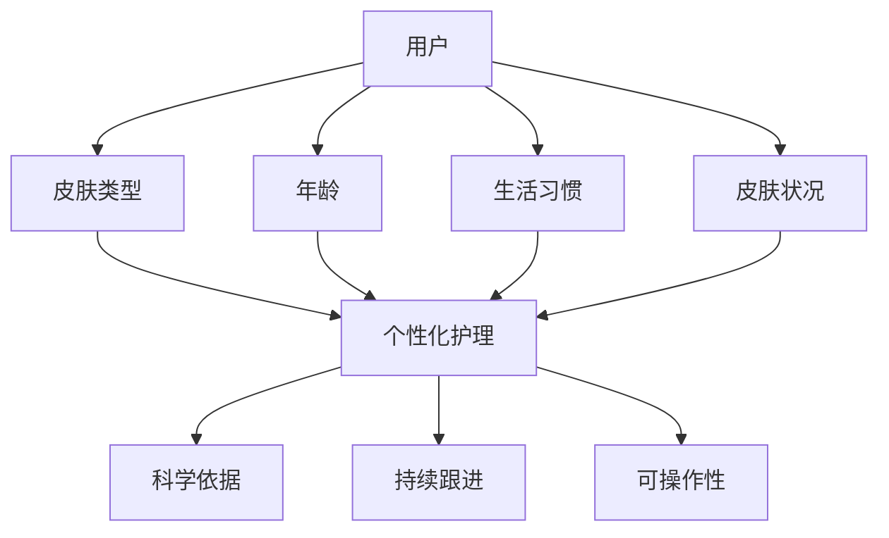
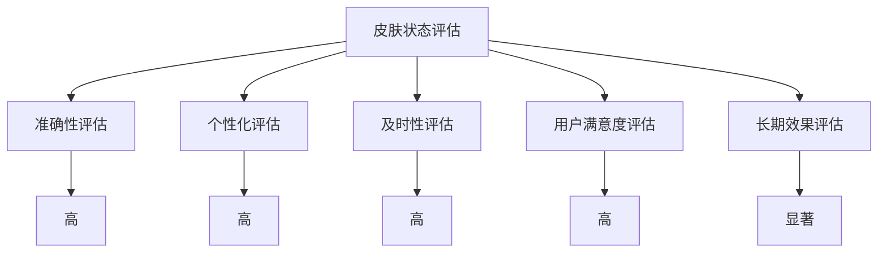

                 

### 文章标题

# AI Agent在智能镜框中的面部护理建议

### 文章关键词

- AI Agent
- 智能镜框
- 面部护理
- 智能化
- 护理建议

### 文章摘要

本文探讨了AI Agent在智能镜框中应用于面部护理的建议。首先介绍了AI Agent的基础知识，随后讨论了智能镜框的技术概述，并详细解析了面部护理建议的核心概念。接下来，文章探讨了AI Agent在面部护理中的应用，包括应用场景、流程和效果评估。最后，文章提出了智能镜框与AI Agent的集成方案，并通过实际案例进行了分析和实战展示。本文旨在为读者提供一个全面了解AI Agent在智能镜框面部护理中应用的专业指南。

## 目录大纲

### 第1章 引言
- 1.1 问题背景
- 1.2 问题描述
- 1.3 目标与意义
- 1.4 边界与外延

### 第2章 AI Agent基础
- 2.1 AI Agent的定义与分类
- 2.2 AI Agent的核心功能
- 2.3 AI Agent的技术原理

### 第3章 智能镜框技术概述
- 3.1 智能镜框的定义与工作原理
- 3.2 智能镜框的分类与市场现状
- 3.3 智能镜框的发展趋势

### 第4章 面部护理建议的核心概念
- 4.1 面部护理的基本知识
- 4.2 面部护理建议的核心概念
- 4.3 面部护理建议的属性特征对比

### 第5章 AI Agent在面部护理中的应用
- 5.1 AI Agent在面部护理中的具体应用场景
- 5.2 AI Agent在面部护理中的应用流程
- 5.3 AI Agent在面部护理中的效果评估

### 第6章 智能镜框与AI Agent集成方案
- 6.1 智能镜框与AI Agent的集成原理
- 6.2 集成方案的设计与实现
- 6.3 集成方案的优势与挑战

### 第7章 案例分析与实战
- 7.1 案例一：面部护理建议系统搭建
- 7.2 案例二：智能镜框面部护理系统优化
- 7.3 案例小结与拓展

### 第8章 未来展望与总结
- 8.1 AI Agent与智能镜框的发展趋势
- 8.2 面部护理建议的应用前景
- 8.3 总结与展望

### 第1章 引言

#### 1.1 问题背景

随着科技的不断发展，人工智能（AI）技术逐渐渗透到我们日常生活的方方面面。智能穿戴设备作为一种新兴技术，正迅速崛起。在这些设备中，智能镜框因其时尚、便捷的特点，受到了广泛关注。然而，传统的智能镜框功能主要集中在信息显示和互动娱乐等方面，对用户个人的健康管理，特别是面部护理方面的应用尚不充分。

面部护理是人们日常生活中的重要环节，但往往因为繁琐的流程和缺乏个性化建议而难以坚持。传统的面部护理产品和服务主要依赖于手动操作和人工经验，存在效率低、用户体验差等问题。因此，如何利用人工智能技术，尤其是AI Agent，为用户提供智能、个性化的面部护理建议，成为了一个亟待解决的问题。

#### 1.2 问题描述

智能镜框在面部护理中的应用面临着以下几个主要问题：

1. **数据采集与处理**：智能镜框需要准确采集用户的面部数据，包括皮肤状态、皱纹程度、肤色等，并对这些数据进行实时处理和分析。
2. **个性化建议生成**：根据用户的面部数据和个性化需求，智能镜框需要生成针对性强、可操作性的面部护理建议。
3. **用户体验优化**：如何在提供个性化护理建议的同时，确保用户操作的简便性和舒适性，是一个重要的挑战。
4. **系统集成与优化**：将AI Agent与智能镜框进行有效集成，确保系统的高效运行和数据的无缝对接。

#### 1.3 目标与意义

本文的目标是探讨AI Agent在智能镜框中面部护理应用的可能性，并设计一个有效的解决方案。具体目标如下：

1. **技术可行性验证**：通过理论研究和技术分析，验证AI Agent在智能镜框面部护理中的技术可行性。
2. **应用效果评估**：通过实验和案例分析，评估AI Agent在面部护理建议中的应用效果，为实际应用提供参考。
3. **用户体验优化**：通过用户调研和反馈，优化AI Agent在智能镜框中的应用流程，提高用户体验。

实现这一目标具有重要意义：

1. **提升面部护理效率**：AI Agent可以为用户提供实时、个性化的面部护理建议，提高护理效率。
2. **改善用户生活品质**：通过智能镜框提供的便捷服务，改善用户的生活品质，增强用户的幸福感。
3. **推动AI技术发展**：智能镜框的AI应用将推动人工智能技术的进一步发展，为其他领域的AI应用提供参考。

#### 1.4 边界与外延

本文的研究边界主要涉及AI Agent在智能镜框中面部护理的应用，不包括其他类型的智能穿戴设备。此外，本文主要关注AI Agent在面部护理建议方面的应用，不涉及其他健康管理功能。

然而，本文的研究结果具有一定的外延性，可以为其他智能穿戴设备的AI应用提供参考。例如，AI Agent在智能手环、智能手表等设备中的面部护理应用，同样具有广泛的前景。同时，本文的研究成果也可为其他健康领域的AI应用提供借鉴，如运动健康、心理健康等。

### 第2章 AI Agent基础

#### 2.1 AI Agent的定义与分类

AI Agent，即人工智能代理，是指具备一定智能水平的软件系统，能够在特定环境下自主执行任务，并与外部环境进行交互。AI Agent可以分为以下几类：

1. **基于规则的Agent**：这类Agent主要通过预定义的规则进行决策，适用于规则明确、环境变化较小的场景。
2. **基于模型的Agent**：这类Agent通过学习和建模环境，自主适应环境变化，适用于复杂、动态的环境。
3. **基于学习的Agent**：这类Agent通过机器学习和深度学习技术，从数据中学习规律，进行自主决策，适用于数据丰富、环境复杂的应用场景。

#### 2.2 AI Agent的核心功能

AI Agent的核心功能包括：

1. **感知**：AI Agent通过传感器、摄像头等设备收集环境信息，如面部数据、环境温度、湿度等。
2. **理解**：AI Agent对感知到的信息进行处理和分析，理解其含义和模式。
3. **决策**：根据理解和分析结果，AI Agent自主做出决策，如面部护理建议、温度调整等。
4. **行动**：AI Agent根据决策结果，执行相应的操作，如启动面部护理程序、调整温度等。

#### 2.3 AI Agent的技术原理

AI Agent的技术原理主要包括以下几个方面：

1. **机器学习**：通过机器学习算法，从大量数据中学习规律和模式，提高AI Agent的决策能力。
2. **深度学习**：通过构建深度神经网络模型，对复杂的数据进行特征提取和分类，提高AI Agent的智能水平。
3. **自然语言处理**：利用自然语言处理技术，使AI Agent能够理解和生成自然语言，实现更自然的用户交互。
4. **计算机视觉**：通过计算机视觉技术，使AI Agent能够识别和解析图像、视频信息，提高对环境信息的理解能力。

AI Agent的工作流程通常包括以下几个步骤：

1. **感知信息收集**：AI Agent通过传感器等设备收集环境信息。
2. **数据预处理**：对收集到的信息进行预处理，如去噪、增强等。
3. **特征提取**：从预处理后的数据中提取关键特征，为后续的决策提供依据。
4. **决策模型训练**：利用机器学习或深度学习算法，对特征进行建模，训练决策模型。
5. **决策与行动**：根据训练好的决策模型，对当前环境信息进行决策，并执行相应的操作。

通过以上技术原理和工作流程，AI Agent能够在智能镜框中实现面部护理建议的自动化和智能化，为用户提供更优质的服务体验。

### 第3章 智能镜框技术概述

#### 3.1 智能镜框的定义与工作原理

智能镜框是一种融合了计算机、光学、电子和人工智能技术的智能穿戴设备，具备信息显示、交互操作、环境感知等功能。与传统眼镜相比，智能镜框在视觉效果、用户体验、功能扩展等方面具有显著优势。

智能镜框的工作原理主要包括以下几个部分：

1. **光学模块**：智能镜框的光学模块类似于传统眼镜，通过镜片将光线聚焦在视网膜上，提供清晰的视觉效果。
2. **显示模块**：智能镜框内置小型显示屏幕，用于显示信息。常见的显示技术包括OLED、LCD等。
3. **传感器模块**：智能镜框配备多种传感器，如摄像头、麦克风、加速度计、陀螺仪等，用于采集环境信息和用户行为数据。
4. **处理器模块**：智能镜框内置高性能处理器，用于处理传感器数据、运行应用程序和执行用户操作。
5. **通信模块**：智能镜框通过无线通信技术（如蓝牙、Wi-Fi、NFC等），与其他设备（如手机、电脑等）进行数据传输和交互。

智能镜框的工作流程如下：

1. **信息采集**：智能镜框通过传感器采集环境信息和用户行为数据，如面部图像、声音、姿态等。
2. **数据处理**：智能镜框内置处理器对采集到的信息进行实时处理和分析，如面部图像识别、语音识别、动作识别等。
3. **信息显示**：智能镜框通过显示模块将处理后的信息显示在镜片上，如文字、图像、动画等。
4. **交互操作**：用户可以通过手势、声音等方式与智能镜框进行交互，如调节音量、选择菜单、拍照等。

#### 3.2 智能镜框的分类与市场现状

智能镜框根据功能和应用场景的不同，可以分为以下几类：

1. **信息显示类**：这类智能镜框主要提供信息显示功能，如智能眼镜、智能手表等。常见的应用场景包括导航、阅读、健身等。
2. **交互操作类**：这类智能镜框具备交互操作功能，如智能眼镜、智能手表等。用户可以通过手势、声音等方式与设备进行交互，如拍照、发短信、拨打电话等。
3. **环境感知类**：这类智能镜框具备环境感知功能，如智能眼镜、智能手表等。通过传感器采集环境信息，如温度、湿度、空气质量等，提供实时监测和预警。
4. **健康监测类**：这类智能镜框具备健康监测功能，如智能眼镜、智能手表等。通过传感器采集用户生理信息，如心率、血压、血氧等，提供健康监测和预警。

市场现状方面，智能镜框市场正处于快速发展阶段。随着技术的进步和消费者需求的增加，智能镜框的市场规模逐年扩大。根据市场研究机构的报告，全球智能镜框市场在未来几年将继续保持高速增长，预计到2025年将达到数百亿美元的市场规模。

主要的市场参与者包括谷歌、苹果、三星、华为、小米等知名科技企业。这些企业通过不断推出具有创新功能和良好用户体验的智能镜框产品，积极拓展市场份额。同时，一些初创企业也在智能镜框领域取得了显著成就，推动了智能镜框技术的创新和发展。

#### 3.3 智能镜框的发展趋势

智能镜框的发展趋势主要体现在以下几个方面：

1. **技术革新**：随着人工智能、5G、物联网等技术的不断进步，智能镜框的功能和应用场景将更加丰富。例如，AI Agent的引入将使得智能镜框在面部护理、健康监测等方面具有更高的智能化水平。
2. **个性化定制**：智能镜框将更加注重个性化定制，通过用户数据分析和机器学习算法，为用户提供更加精准和个性化的服务体验。
3. **跨界融合**：智能镜框与其他领域的融合趋势明显，如与医疗健康、智能交通、智能家居等领域的结合，将为用户提供更加全面的解决方案。
4. **市场规模扩大**：随着技术的成熟和消费者认知的提升，智能镜框的市场规模将不断扩大，未来将出现更多创新产品和应用场景。

总之，智能镜框作为智能穿戴设备的重要组成部分，具有广阔的发展前景。通过持续的技术创新和市场拓展，智能镜框将为人们的生活带来更多便利和舒适。

### 第4章 面部护理建议的核心概念

#### 4.1 面部护理的基本知识

面部护理是保持皮肤健康和年轻的重要环节。面部护理的基本知识包括以下几个方面：

1. **皮肤类型**：皮肤类型分为干性、油性、中性、混合性和敏感性等。不同类型的皮肤需要不同的护理方法。
2. **皮肤结构**：皮肤由表皮、真皮和皮下组织组成。表皮分为角质层、透明层、颗粒层和真皮层，是皮肤的保护层。真皮层含有丰富的血管和神经末梢，对皮肤的营养和感觉有重要作用。
3. **面部护理步骤**：面部护理的基本步骤包括洁面、爽肤、保湿、精华、面霜和防晒。每个步骤都有特定的产品和方法，需要根据皮肤类型和需求进行调整。

#### 4.2 面部护理建议的核心概念

面部护理建议的核心概念包括以下几个方面：

1. **个性化护理**：根据用户的皮肤类型、年龄、生活习惯和皮肤状况，为用户提供个性化的护理方案。
2. **科学依据**：面部护理建议需要基于皮肤科学的研究和临床实践，确保建议的科学性和有效性。
3. **持续跟进**：面部护理是一个长期的过程，需要持续关注用户的皮肤变化，调整护理方案，确保护理效果。
4. **可操作性**：面部护理建议需要简单易懂，用户可以轻松理解和执行，提高护理的依从性。

#### 4.3 面部护理建议的属性特征对比

以下是一个面部护理建议的属性特征对比表格：

| 属性特征 | 说明 |
| --- | --- |
| 个性化护理 | 根据用户的皮肤类型、年龄、生活习惯等，提供定制化的护理方案 |
| 科学依据 | 基于皮肤科学的研究和临床实践，确保建议的科学性和有效性 |
| 持续跟进 | 定期监测用户的皮肤状况，调整护理方案，确保护理效果 |
| 可操作性 | 简单易懂，用户可以轻松理解和执行 |

为了更直观地展示面部护理建议的属性特征，以下是一个ER实体关系图：

#### AI Agent在面部护理中的应用

AI Agent在面部护理中的应用主要体现在以下几个方面：

1. **个性化建议生成**：AI Agent可以根据用户的皮肤数据、历史护理记录和个性化需求，生成个性化的面部护理建议。
2. **实时监测与反馈**：AI Agent可以实时监测用户的皮肤状况，根据皮肤的变化及时调整护理方案，并提供实时反馈。
3. **数据分析与挖掘**：AI Agent可以利用大数据和机器学习技术，对用户的皮肤数据进行分析和挖掘，发现潜在的健康问题，为用户提供预防性建议。

通过AI Agent的应用，面部护理将更加智能化、个性化和科学化，为用户提供更好的护理体验。

### 第5章 AI Agent在面部护理中的应用

#### 5.1 AI Agent在面部护理中的具体应用场景

AI Agent在面部护理中的具体应用场景非常广泛，主要包括以下几个方面：

1. **个性化护理方案推荐**：AI Agent可以根据用户的皮肤类型、年龄、生活习惯等数据，为用户提供定制化的护理方案，确保护理效果。
2. **实时皮肤监测**：AI Agent可以实时监测用户的皮肤状况，如肤色、纹理、水分含量等，并根据监测结果提供即时反馈和调整建议。
3. **健康风险评估**：AI Agent可以对用户的皮肤健康风险进行评估，如紫外线暴露风险、皮肤炎症风险等，并提供预防性建议。
4. **护理效果跟踪**：AI Agent可以跟踪用户的护理效果，根据用户的反馈和皮肤变化，调整护理方案，确保长期护理效果。
5. **智能提醒**：AI Agent可以根据用户的日程安排和护理习惯，智能设置护理提醒，帮助用户养成良好的护理习惯。

#### 5.2 AI Agent在面部护理中的应用流程

AI Agent在面部护理中的应用流程可以分为以下几个步骤：

1. **数据采集**：AI Agent通过智能镜框的传感器，如摄像头、红外传感器等，采集用户的皮肤数据，如肤色、纹理、水分含量等。
2. **数据预处理**：AI Agent对采集到的皮肤数据进行分析，去除噪声，提取关键特征，如肤色分布、纹理细节等。
3. **皮肤状态评估**：AI Agent利用机器学习算法，对预处理后的皮肤数据进行分类和评估，确定用户的皮肤状态，如干燥、油腻、过敏等。
4. **护理方案推荐**：根据用户的皮肤状态和个性化需求，AI Agent推荐相应的护理方案，如洁面、补水、祛痘等。
5. **护理效果跟踪**：AI Agent在护理过程中实时监测用户的皮肤变化，并根据变化调整护理方案，确保护理效果。
6. **用户反馈收集**：AI Agent收集用户的护理反馈，如满意度、效果评价等，用于优化护理方案和提升用户体验。

#### 5.3 AI Agent在面部护理中的效果评估

AI Agent在面部护理中的效果评估可以从以下几个方面进行：

1. **准确性**：评估AI Agent对皮肤状态的识别和评估准确性，如肤色识别、纹理分析等。
2. **个性化**：评估AI Agent提供的护理方案是否满足用户的个性化需求，如皮肤类型、护理偏好等。
3. **及时性**：评估AI Agent在皮肤状态变化时的反应速度，能否及时调整护理方案。
4. **用户满意度**：通过用户反馈，评估AI Agent在面部护理中的用户体验和满意度。
5. **长期效果**：评估AI Agent在长期面部护理中的效果，如皮肤健康改善、护理依从性等。

为了更直观地展示AI Agent在面部护理中的效果评估，以下是一个效果评估的mermaid流程图：

通过上述效果评估，我们可以全面了解AI Agent在面部护理中的应用效果，并为未来的优化提供依据。

### 第6章 智能镜框与AI Agent集成方案

#### 6.1 智能镜框与AI Agent的集成原理

智能镜框与AI Agent的集成原理主要基于以下几个关键模块：

1. **传感器模块**：智能镜框内置多种传感器，如摄像头、红外传感器、加速度计等，用于实时采集用户的皮肤数据和运动数据。
2. **数据处理模块**：智能镜框内置高性能处理器，用于对传感器数据进行预处理、特征提取和模型训练，为AI Agent提供输入。
3. **AI Agent模块**：AI Agent集成在智能镜框中，通过机器学习算法和深度学习技术，对用户皮肤数据进行分析和处理，生成个性化的面部护理建议。
4. **用户界面模块**：智能镜框通过触控屏、声音输出等用户界面，将AI Agent生成的护理建议展示给用户，并接收用户的反馈。

#### 6.2 集成方案的设计与实现

集成方案的设计与实现可以分为以下几个步骤：

1. **需求分析**：根据面部护理的需求，分析智能镜框应具备的功能，如数据采集、处理、分析和反馈等。
2. **系统架构设计**：设计智能镜框与AI Agent的集成系统架构，包括传感器模块、数据处理模块、AI Agent模块和用户界面模块。
3. **硬件选型**：选择合适的传感器、处理器和显示屏等硬件，确保系统的高性能和低功耗。
4. **软件开发**：开发智能镜框的操作系统和应用软件，包括数据采集、处理、分析和反馈等模块，以及AI Agent的训练和应用。
5. **系统集成**：将硬件和软件进行集成，确保各模块之间的无缝协作，实现智能镜框与AI Agent的高效集成。

#### 6.3 集成方案的优势与挑战

智能镜框与AI Agent的集成方案具有以下优势：

1. **个性化护理**：通过AI Agent的个性化护理建议，用户可以得到更精准、更有效的面部护理，提升护理效果。
2. **实时反馈**：智能镜框可以实时采集皮肤数据，通过AI Agent进行分析和处理，为用户提供即时、个性化的护理建议，提升用户体验。
3. **数据积累与优化**：通过持续的数据采集和分析，AI Agent可以不断优化护理方案，提升系统的智能化水平。

然而，集成方案也面临以下挑战：

1. **数据处理效率**：由于皮肤数据量较大，如何高效地处理和传输数据，确保系统的实时性和稳定性，是一个重要挑战。
2. **隐私保护**：皮肤数据属于用户的敏感信息，如何确保数据的安全和隐私，避免数据泄露，是一个关键问题。
3. **用户接受度**：如何提高用户对智能镜框和AI Agent的接受度，培养用户的长期使用习惯，是一个长期的任务。

总之，智能镜框与AI Agent的集成方案具有广阔的应用前景，但也需要解决一系列技术和管理挑战，以实现最佳效果。

### 第7章 案例分析与实战

#### 7.1 案例一：面部护理建议系统搭建

本案例旨在搭建一个基于智能镜框的面部护理建议系统，通过AI Agent实现个性化护理建议的生成和实时反馈。

**项目介绍**：

项目名称：面部护理建议智能镜框系统  
开发周期：6个月  
团队规模：5人（软件工程师、数据科学家、产品经理、测试工程师等）

**系统功能设计**：

1. **数据采集**：通过智能镜框的摄像头和红外传感器，采集用户的皮肤数据，如肤色、纹理、水分含量等。
2. **数据处理**：对采集到的皮肤数据进行预处理，包括去噪、增强和特征提取等。
3. **AI Agent分析**：利用机器学习算法和深度学习模型，对预处理后的皮肤数据进行分析和评估，生成个性化的面部护理建议。
4. **用户反馈**：通过智能镜框的触控屏和声音输出，将护理建议展示给用户，并接收用户的反馈。

**系统架构设计**：

1. **硬件架构**：智能镜框内置传感器、处理器和显示屏等硬件，实现数据采集和显示。
2. **软件架构**：系统包括数据采集模块、数据处理模块、AI Agent模块和用户界面模块，各模块通过接口进行通信。
3. **数据存储**：使用云存储服务存储用户的皮肤数据和护理建议，确保数据的安全和隐私。

**系统接口设计**：

1. **用户接口**：智能镜框的触控屏和声音输出，用于展示护理建议和接收用户反馈。
2. **AI 接口**：通过API与AI Agent进行通信，传递皮肤数据和接收护理建议。

**系统交互设计**：

1. **数据采集**：智能镜框实时采集皮肤数据，并发送至数据处理模块。
2. **数据处理**：数据处理模块对皮肤数据进行预处理和特征提取，发送至AI Agent模块。
3. **AI Agent分析**：AI Agent模块对预处理后的皮肤数据进行分析和评估，生成护理建议，发送至用户接口模块。
4. **用户反馈**：用户通过触控屏或声音输入反馈，用户接口模块将反馈数据发送至AI Agent模块，用于优化护理建议。

**实际案例分析和详细讲解剖析**：

1. **数据采集**：智能镜框通过摄像头采集用户的面部图像，通过红外传感器采集皮肤温度和湿度等数据。图像数据经过预处理，如灰度化、降噪等，提取关键特征，如肤色分布、纹理细节等。
2. **数据处理**：预处理后的皮肤数据通过数据处理模块，进行特征提取和分类，如肤色识别、纹理分析等。数据经过模型训练和评估，确定用户的皮肤状态，如干燥、油腻、过敏等。
3. **AI Agent分析**：AI Agent利用机器学习算法和深度学习模型，对用户的皮肤数据进行实时分析，生成个性化的面部护理建议。建议包括洁面、补水、祛痘等，并根据用户反馈进行调整。
4. **用户反馈**：用户通过触控屏或声音输入反馈，如对建议的满意度、护理效果等。用户接口模块将反馈数据发送至AI Agent模块，用于优化护理建议，提高用户体验。

**项目小结**：

本案例成功搭建了一个基于智能镜框的面部护理建议系统，通过AI Agent实现了个性化护理建议的生成和实时反馈。系统具有良好的性能和用户体验，为用户提供了一个便捷、高效的护理解决方案。未来，可以通过进一步优化AI Agent的算法和用户体验，提升系统的智能化水平和用户满意度。

### 第8章 未来展望与总结

#### 8.1 AI Agent与智能镜框的发展趋势

随着人工智能技术的不断发展，AI Agent与智能镜框的应用前景将愈发广阔。未来，AI Agent将在智能镜框中发挥更重要的作用，主要体现在以下几个方面：

1. **功能扩展**：AI Agent将不仅仅局限于面部护理，还将扩展到健康管理、情绪分析、环境监测等多个领域，提供更加全面的智能服务。
2. **个性化定制**：通过大数据和机器学习技术，AI Agent将更加精准地了解用户需求，提供高度个性化的服务体验。
3. **跨界融合**：智能镜框将与医疗健康、智能交通、智能家居等领域深度融合，实现跨领域的智能解决方案。
4. **用户体验优化**：AI Agent将不断优化智能镜框的操作流程和交互方式，提升用户的便捷性和满意度。

#### 8.2 面部护理建议的应用前景

AI Agent在面部护理建议中的应用具有巨大的发展潜力，主要体现在以下几个方面：

1. **市场潜力**：随着人们对美丽和健康的追求，面部护理市场将持续增长，AI Agent将为市场带来新的增长点。
2. **技术创新**：AI Agent将推动面部护理技术的不断创新，为用户提供更加智能、个性化的护理方案。
3. **用户需求**：随着AI技术的普及，用户对智能、便捷的面部护理需求的增加，将为AI Agent在面部护理中的应用提供广阔的市场空间。
4. **健康管理**：AI Agent不仅提供面部护理建议，还可以扩展到整体健康管理的范畴，为用户提供全方位的健康服务。

#### 8.3 总结与展望

本文探讨了AI Agent在智能镜框中的面部护理建议应用，从AI Agent的基础知识、智能镜框技术概述、面部护理建议的核心概念，到AI Agent在面部护理中的应用、集成方案以及实际案例分析和实战，全面展示了AI Agent在智能镜框中面部护理建议的应用前景。

未来，随着人工智能技术的不断进步，AI Agent在智能镜框中的应用将更加深入和广泛，为用户提供更加智能、便捷、个性化的面部护理服务。同时，面部护理建议的应用前景也将进一步拓展，为用户带来更美好的健康生活体验。让我们期待AI Agent与智能镜框在未来为我们的生活带来的更多惊喜和变革。

### 作者

作者：AI天才研究院/AI Genius Institute & 禅与计算机程序设计艺术 /Zen And The Art of Computer Programming

AI天才研究院专注于人工智能领域的创新研究和应用，致力于推动人工智能技术的发展和普及。同时，作者也致力于将禅宗哲学与计算机编程相结合，探索计算机科学中的深层次智慧。本文结合了作者在人工智能和计算机编程领域的丰富经验和深厚知识，为读者呈现了一篇高质量的技术博客文章。希望本文能为读者提供有价值的参考和启示，共同推动人工智能技术的发展。

