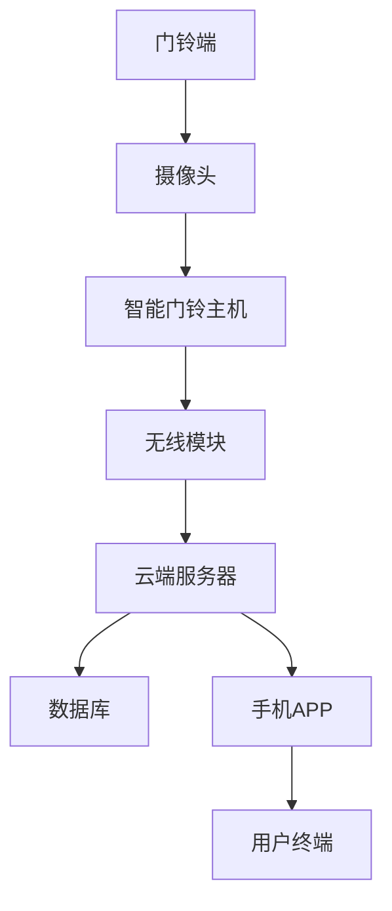

                 

## AI Agent在智能门铃中的访客识别概述

### 1.1 问题背景与核心概念

#### 1.1.1 智能门铃现状

智能门铃作为一种智能家居设备，近年来得到了快速的发展。其功能已经不仅限于远程视频通话，还扩展到了安全监控和访客识别等方面。然而，现有的智能门铃在访客识别方面仍存在一些问题。首先，访客识别的准确性受到光线、角度等因素的影响，容易导致误识别或漏识别。其次，访客数据的安全性和隐私保护也是一个亟待解决的问题。

#### 1.1.2 访客识别需求

在日常生活中，人们对于访客识别有着强烈的需求。一方面，访客识别可以增强家庭和社区的安全，防止陌生人随意进入。另一方面，访客识别还可以提高生活便利性，例如自动识别家庭成员和常用访客，自动放行，减少人工干预。

#### 1.1.3 识别技术的挑战

访客识别技术的挑战主要体现在以下几个方面：首先，访客识别的准确性要求高，需要在各种光线和环境条件下都能稳定工作。其次，访客识别需要处理大量的图像数据，对计算资源有较高的要求。最后，访客识别还需要解决隐私保护问题，确保访客数据的安全性和隐私。

### 1.2 AI Agent定义与特性

#### 1.2.1 AI Agent的定义

AI Agent，即人工智能代理，是指一种具有自主学习能力和自主行动能力的智能体。它可以在复杂环境中自主感知、学习和决策，并采取相应的行动。

#### 1.2.2 AI Agent的核心特性

AI Agent的核心特性包括：

1. **自主学习能力**：AI Agent可以通过机器学习和深度学习算法，从数据中学习并优化自己的行为。
2. **自主行动能力**：AI Agent可以根据学习到的知识和决策规则，自主采取行动。
3. **实时响应能力**：AI Agent可以实时感知环境变化，并快速做出响应。

#### 1.2.3 AI Agent与传统安防系统的区别

传统安防系统通常依赖于预定义的规则和模式进行监控和报警，而AI Agent则具有更强大的自主学习能力和实时响应能力。例如，在访客识别方面，传统安防系统可能只能识别预先录入的黑名单或白名单用户，而AI Agent可以通过机器学习算法，自动学习和识别访客的身份，实现更智能的安防。

### 1.3 访客识别的核心概念

#### 1.3.1 访客识别的定义

访客识别是指利用计算机技术和人工智能算法，对门铃摄像头捕捉到的图像或视频进行分析，识别出访客的身份信息。

#### 1.3.2 访客识别的关键要素

访客识别的关键要素包括：

1. **图像或视频捕捉**：通过门铃摄像头捕捉访客的图像或视频。
2. **特征提取**：从图像或视频中提取出访客的特征信息，如人脸特征。
3. **识别算法**：利用机器学习或深度学习算法，对提取出的特征进行识别。
4. **结果反馈**：将识别结果反馈给用户，如通过手机APP或智能门铃显示屏显示访客信息。

#### 1.3.3 访客识别技术的分类

访客识别技术可以分为以下几种：

1. **基于图像识别**：通过图像处理技术，直接对摄像头捕捉到的图像进行识别。
2. **基于视频识别**：通过视频处理技术，对摄像头捕捉到的视频进行分析和识别。
3. **基于深度学习**：利用深度学习算法，对图像或视频中的特征进行学习和识别。

### 1.4 AI Agent在访客识别中的应用前景

#### 1.4.1 AI Agent在访客识别中的优势

AI Agent在访客识别中具有以下优势：

1. **高准确性**：通过深度学习和机器学习算法，AI Agent可以自动学习和优化识别模型，提高识别的准确性。
2. **实时响应**：AI Agent可以实时分析摄像头捕捉到的图像或视频，快速识别访客身份。
3. **自适应性强**：AI Agent可以根据环境和用户需求，自动调整识别策略，适应不同的识别场景。

#### 1.4.2 AI Agent在访客识别中的挑战

AI Agent在访客识别中面临的挑战主要包括：

1. **计算资源消耗**：深度学习和机器学习算法通常需要大量的计算资源，对于智能门铃这样的嵌入式设备来说，是一个挑战。
2. **隐私保护**：访客识别涉及到用户隐私，需要确保识别数据的安全性和隐私性。
3. **数据质量**：访客识别的效果很大程度上取决于图像或视频数据的质量，需要保证数据的高质量和多样性。

#### 1.4.3 AI Agent在访客识别中的应用前景

随着人工智能技术的不断进步，AI Agent在访客识别中的应用前景十分广阔。未来，AI Agent有望在以下方面发挥重要作用：

1. **智能家居安全**：通过访客识别，AI Agent可以实时监控家庭安全，提高居住环境的安全性。
2. **社区管理**：在社区管理中，AI Agent可以帮助管理员实时了解社区访客信息，提高管理效率。
3. **商业应用**：在商业场所，AI Agent可以用于访客管理，提高客户服务质量。

### 1.5 本章小结

本章对AI Agent在智能门铃中的访客识别进行了概述。首先，介绍了智能门铃的现状和访客识别的需求，然后介绍了AI Agent的定义和特性，以及访客识别的核心概念。最后，分析了AI Agent在访客识别中的应用前景，指出了其优势和面临的挑战。通过本章的介绍，读者可以初步了解AI Agent在智能门铃访客识别中的应用。

----------------------------------------------------------------

## 第二部分: AI Agent在访客识别中的技术原理

### 2.1 计算机视觉技术

#### 2.1.1 计算机视觉基础

计算机视觉是指使计算机能够像人类一样感知和理解视觉信息的技术。它涉及到图像处理、模式识别、机器学习和人工智能等多个领域。

#### 2.1.2 特征提取技术

特征提取是计算机视觉中的核心步骤，它旨在从图像或视频中提取出具有区分性的特征，以便进行后续的识别和分析。常见的特征提取方法包括：

1. **边缘检测**：用于检测图像中的边缘和轮廓。
2. **纹理分析**：通过分析图像的纹理特征，区分不同的物体。
3. **颜色特征**：通过颜色直方图等手段提取图像的颜色特征。

#### 2.1.3 人脸识别算法

人脸识别是计算机视觉中的一个重要应用，它通过分析人脸的特征，实现对人脸的识别和验证。常见的人脸识别算法包括：

1. **特征脸算法**：如LDA（线性判别分析）和PCA（主成分分析），通过降维提高识别效率。
2. **深度学习算法**：如卷积神经网络（CNN）和循环神经网络（RNN），通过学习图像的深度特征，实现高精度的人脸识别。

### 2.2 深度学习技术

#### 2.2.1 深度学习基础

深度学习是一种基于多层神经网络的学习方法，它通过多层非线性变换，从大量数据中学习复杂的特征和模式。

#### 2.2.2 卷积神经网络(CNN)

卷积神经网络是一种特殊的神经网络，它在图像识别和计算机视觉中有着广泛的应用。CNN通过卷积操作和池化操作，逐步提取图像的特征，并实现高精度的识别。

#### 2.2.3 深度学习在访客识别中的应用

深度学习在访客识别中的应用主要体现在以下几个方面：

1. **人脸识别**：通过CNN等深度学习算法，可以自动提取人脸的深度特征，实现高精度的人脸识别。
2. **场景识别**：通过深度学习，可以识别摄像头捕捉到的图像或视频中的场景，如室内、室外、白天、晚上等，以便调整识别策略。
3. **行为识别**：通过分析摄像头捕捉到的图像或视频，可以识别访客的行为，如走近、离开等，以便进行实时监控。

### 2.3 机器学习算法

#### 2.3.1 机器学习基础

机器学习是一种通过计算机程序模拟人类学习行为的方法，它使计算机能够从数据中学习，并做出预测和决策。

#### 2.3.2 监督学习算法

监督学习算法是在已知输入和输出条件下，通过学习得到一个预测模型的方法。常见的方法包括：

1. **线性回归**：通过拟合线性模型，预测连续值输出。
2. **逻辑回归**：通过拟合逻辑模型，预测概率值。
3. **决策树**：通过构建树形模型，进行分类或回归预测。

#### 2.3.3 无监督学习算法

无监督学习算法是在未知输出条件下，通过学习得到数据分布或特征的方法。常见的方法包括：

1. **聚类算法**：如K-均值聚类，通过聚类分析，将数据分为若干个簇。
2. **主成分分析**：通过降维，提取数据的最重要的特征。
3. **自编码器**：通过编码和解码过程，提取数据的隐含特征。

#### 2.3.4 半监督学习算法

半监督学习算法是结合监督学习和无监督学习的方法，在部分标记数据上学习模型，并应用于未标记数据。常见的方法包括：

1. **标记传播**：通过未标记数据的邻居信息，进行标签传播和模型训练。
2. **图模型**：通过构建图模型，利用未标记数据与标记数据的关联关系，进行模型训练。

### 2.4 AI Agent的构建方法

#### 2.4.1 AI Agent的架构设计

AI Agent的架构设计主要包括感知模块、学习模块和行动模块。感知模块负责接收环境信息，学习模块负责从数据中学习，行动模块负责根据学习到的知识和决策规则，采取相应的行动。

#### 2.4.2 AI Agent的学习策略

AI Agent的学习策略主要包括有监督学习、无监督学习和半监督学习。有监督学习通过已标记的数据进行模型训练，无监督学习通过未标记的数据学习数据分布，半监督学习结合标记数据和未标记数据，进行模型训练。

#### 2.4.3 AI Agent的优化方法

AI Agent的优化方法主要包括模型优化和算法优化。模型优化通过调整模型的参数，提高模型的性能。算法优化通过改进算法的流程，提高算法的效率和准确性。

### 2.5 本章小结

本章介绍了AI Agent在访客识别中的技术原理。首先，介绍了计算机视觉技术的基础知识，包括特征提取和人脸识别算法。然后，介绍了深度学习技术的基础知识和卷积神经网络的应用。接着，介绍了机器学习算法的基础知识，包括监督学习、无监督学习和半监督学习。最后，介绍了AI Agent的构建方法，包括架构设计、学习策略和优化方法。通过本章的介绍，读者可以初步了解AI Agent在访客识别中的技术原理。

----------------------------------------------------------------

## 第三部分: AI Agent在智能门铃中的应用

### 3.1 系统架构设计

#### 3.1.1 智能门铃系统概述

智能门铃系统主要由硬件设备和软件系统组成。硬件设备包括门铃摄像头、智能门铃主机、手机或其他终端设备。软件系统包括门铃端应用程序、云端服务器和数据库等。

#### 3.1.2 系统功能设计

智能门铃系统的主要功能包括：

1. **视频通话**：用户可以通过手机或其他终端设备与门铃进行视频通话。
2. **访客识别**：通过摄像头捕捉访客的图像或视频，利用AI Agent进行访客识别。
3. **安全监控**：实时监控门前的场景，发现异常情况时进行报警。
4. **访客记录**：记录访客的信息，包括时间、姓名、照片等。

#### 3.1.3 系统架构设计

智能门铃系统的架构设计如图所示：



在该架构中，门铃端摄像头捕捉到访客的图像或视频后，通过智能门铃主机进行初步处理，然后通过无线模块发送到云端服务器。云端服务器利用AI Agent进行访客识别，并将识别结果存储在数据库中。同时，用户可以通过手机APP查看访客信息。

### 3.2 系统实现与部署

#### 3.2.1 硬件设备选择

在选择硬件设备时，需要考虑以下因素：

1. **摄像头**：选择具有高清画质和夜视功能的摄像头，以满足访客识别的需求。
2. **智能门铃主机**：选择具备足够的计算能力和存储能力的智能门铃主机，以确保系统的稳定运行。
3. **无线模块**：选择具有高传输速度和低功耗的无线模块，以保证数据传输的效率和设备的续航能力。

#### 3.2.2 软件开发环境搭建

在搭建软件开发环境时，需要安装以下软件：

1. **操作系统**：选择适合嵌入式设备的操作系统，如Linux。
2. **编程语言**：选择适合开发智能门铃系统的编程语言，如Python。
3. **开发工具**：选择适合开发智能门铃系统的开发工具，如PyCharm。
4. **深度学习框架**：选择适合进行深度学习的框架，如TensorFlow或PyTorch。

#### 3.2.3 系统核心代码实现

系统核心代码实现主要包括以下几个方面：

1. **摄像头数据采集**：通过摄像头采集访客的图像或视频数据。
2. **数据预处理**：对采集到的图像或视频数据进行预处理，包括尺寸调整、灰度化、去噪等。
3. **特征提取**：利用深度学习算法提取图像或视频中的特征。
4. **访客识别**：利用提取出的特征，通过机器学习算法进行访客识别。
5. **结果反馈**：将识别结果反馈给用户，包括通过手机APP或智能门铃显示屏显示访客信息。

#### 3.2.4 系统测试与优化

在系统测试与优化过程中，需要进行以下工作：

1. **功能测试**：测试系统的各个功能是否正常运行。
2. **性能测试**：测试系统的处理速度和响应时间，以确保系统的性能满足需求。
3. **稳定性测试**：测试系统在长时间运行下的稳定性，以确保系统的可靠性。
4. **优化**：根据测试结果，对系统进行优化，提高系统的性能和稳定性。

### 3.3 用户界面设计

#### 3.3.1 用户界面功能设计

用户界面主要包括以下功能：

1. **访客列表**：显示访客的信息，包括时间、姓名、照片等。
2. **视频通话**：用户可以通过用户界面与访客进行视频通话。
3. **访客记录**：用户可以查看访客的历史记录。
4. **设置**：用户可以设置系统的相关参数，如识别阈值、识别速度等。

#### 3.3.2 用户界面实现

用户界面实现主要包括以下几个方面：

1. **界面布局**：设计用户界面的布局，包括菜单栏、导航栏、内容区等。
2. **界面样式**：设计用户界面的样式，包括颜色、字体、图标等。
3. **交互设计**：设计用户界面的交互逻辑，包括按钮点击、滑动等。

#### 3.3.3 用户界面测试与优化

用户界面测试与优化主要包括以下几个方面：

1. **功能测试**：测试用户界面的各个功能是否正常运行。
2. **兼容性测试**：测试用户界面在不同设备和操作系统上的兼容性。
3. **性能测试**：测试用户界面的加载速度和响应时间，以确保用户界面的性能满足需求。
4. **优化**：根据测试结果，对用户界面进行优化，提高用户体验。

### 3.4 应用案例分析

#### 3.4.1 案例一：访客识别在社区安防中的应用

在一个社区中，智能门铃系统可以用于访客识别，提高社区的安全性。具体应用场景如下：

1. **访客识别**：当访客按下门铃时，系统会自动识别访客的身份，并通过手机APP或显示屏显示访客信息。
2. **报警功能**：如果访客是黑名单用户，系统会自动报警，通知管理员进行处理。
3. **访客记录**：系统会记录访客的信息，包括时间、姓名、照片等，以便管理员进行后续查询。

#### 3.4.2 案例二：访客识别在家庭安防中的应用

在家庭安防中，智能门铃系统可以用于保护家庭安全。具体应用场景如下：

1. **访客识别**：当访客按下门铃时，系统会自动识别访客的身份，并通过手机APP或显示屏显示访客信息。
2. **报警功能**：如果访客是陌生人，系统会自动报警，通知家庭成员进行处理。
3. **访客记录**：系统会记录访客的信息，包括时间、姓名、照片等，以便家庭成员进行后续查询。

#### 3.4.3 案例三：访客识别在商业安防中的应用

在商业场所，智能门铃系统可以用于访客管理，提高服务质量。具体应用场景如下：

1. **访客识别**：当访客进入商业场所时，系统会自动识别访客的身份，并通过手机APP或显示屏显示访客信息。
2. **预约管理**：用户可以通过手机APP预约访客，系统会自动记录预约信息。
3. **访客记录**：系统会记录访客的信息，包括时间、姓名、照片等，以便商家进行后续查询。

### 3.5 本章小结

本章介绍了AI Agent在智能门铃中的应用。首先，介绍了智能门铃系统的架构设计，包括硬件设备和软件系统。然后，介绍了系统实现与部署的过程，包括硬件设备选择、软件开发环境搭建、系统核心代码实现和系统测试与优化。接着，介绍了用户界面设计，包括功能设计、实现和测试与优化。最后，通过应用案例分析，展示了AI Agent在社区安防、家庭安防和商业安防中的应用。通过本章的介绍，读者可以了解AI Agent在智能门铃中的实际应用。

----------------------------------------------------------------

## 第四部分: AI Agent在访客识别中的挑战与未来展望

### 4.1 挑战分析

#### 4.1.1 数据质量问题

数据质量是影响访客识别准确性的关键因素。数据质量问题主要包括：

1. **数据缺失**：部分访客的图像或视频数据可能缺失，导致无法进行有效识别。
2. **数据偏差**：数据集可能存在偏差，导致识别模型在特定情况下性能不佳。
3. **数据多样性**：数据集可能缺乏多样性，导致模型在面对未知场景时表现不佳。

#### 4.1.2 模型准确性问题

模型准确性是访客识别的关键指标。模型准确性问题主要包括：

1. **误识别率**：模型可能将访客误认为其他人员，导致安全隐患。
2. **漏识别率**：模型可能无法识别出访客，导致访客信息无法及时获取。
3. **光照影响**：在不同光照条件下，模型的识别准确性可能受到影响。

#### 4.1.3 隐私保护问题

隐私保护是访客识别中不可忽视的问题。隐私保护问题主要包括：

1. **数据泄露**：识别数据可能被未授权的人员获取，导致隐私泄露。
2. **人脸数据滥用**：人脸数据可能被用于其他未经授权的用途。
3. **法律合规**：需要遵守相关法律法规，确保数据处理的合法合规。

#### 4.1.4 能效消耗问题

访客识别涉及大量的计算资源，对设备的能效消耗有较高要求。能效消耗问题主要包括：

1. **计算资源消耗**：深度学习和机器学习算法需要大量计算资源，对设备的计算性能有较高要求。
2. **功耗问题**：设备需要长时间运行，功耗问题不容忽视。
3. **散热问题**：高计算负荷可能导致设备过热，影响设备的稳定性和寿命。

### 4.2 未来展望

#### 4.2.1 技术发展趋势

随着人工智能技术的不断发展，未来访客识别技术将呈现出以下趋势：

1. **深度学习算法的优化**：通过优化深度学习算法，提高识别模型的准确性和效率。
2. **多模态识别**：结合多种传感器数据，实现更全面、更准确的访客识别。
3. **边缘计算**：将部分计算任务转移到边缘设备，减少对云端计算资源的依赖。
4. **隐私保护技术**：加强隐私保护技术，确保访客识别数据的安全性和隐私性。

#### 4.2.2 应用场景拓展

未来，AI Agent在访客识别中的应用场景将得到进一步拓展：

1. **智慧社区**：通过访客识别，实现智慧社区的管理，提高社区安全性。
2. **智能办公**：通过访客识别，实现智能办公，提高办公效率。
3. **商业场所**：通过访客识别，实现精准营销，提高服务质量。
4. **公共交通**：通过访客识别，实现实时监控，提高公共交通的安全性。

#### 4.2.3 持续改进与优化

未来，AI Agent在访客识别中的持续改进与优化将是关键：

1. **数据质量的提升**：通过数据清洗、数据增强等技术，提升数据质量。
2. **模型准确性的提高**：通过不断优化模型算法，提高识别准确性。
3. **隐私保护技术的加强**：通过加密、匿名化等技术，加强隐私保护。
4. **能效消耗的降低**：通过硬件优化、算法改进等技术，降低能效消耗。

### 4.3 本章小结

本章分析了AI Agent在访客识别中面临的挑战，包括数据质量、模型准确性、隐私保护、能效消耗等方面。同时，展望了未来访客识别技术的发展趋势，包括深度学习算法的优化、多模态识别、边缘计算、隐私保护技术等。通过持续改进与优化，AI Agent在访客识别中的应用前景将更加广阔。本章内容为读者提供了对AI Agent在访客识别中的挑战与未来展望的全面了解。

----------------------------------------------------------------

## 第五部分: AI Agent在访客识别中的应用案例与实践

### 5.1 环境安装与准备

#### 5.1.1 环境要求

为了实现AI Agent在访客识别中的应用，需要准备以下环境：

1. **硬件环境**：需要一台具备较高计算性能的计算机，用于运行深度学习和机器学习算法。
2. **软件环境**：需要安装Python编程语言和相关的深度学习框架，如TensorFlow或PyTorch。
3. **数据集**：需要准备用于训练和测试的访客图像数据集，数据集应具有足够的多样性和质量。

#### 5.1.2 环境安装

安装Python编程语言和深度学习框架的具体步骤如下：

1. **安装Python**：从Python官网下载最新版本的Python安装包，并按照安装向导进行安装。
2. **安装深度学习框架**：在命令行中执行以下命令安装TensorFlow或PyTorch：

   - 安装TensorFlow：
     ```bash
     pip install tensorflow
     ```
   
   - 安装PyTorch：
     ```bash
     pip install torch torchvision
     ```

#### 5.1.3 环境测试

安装完成后，需要测试环境是否配置正确。具体方法如下：

1. **测试Python环境**：在命令行中执行以下命令，检查Python版本是否正确：
   ```bash
   python --version
   ```
2. **测试深度学习框架**：在命令行中执行以下命令，检查深度学习框架是否安装正确：
   ```bash
   python -c "import tensorflow; print(tensorflow.__version__)"
   ```
   或
   ```bash
   python -c "import torch; print(torch.__version__)"
   ```

### 5.2 系统核心实现

#### 5.2.1 数据预处理

数据预处理是深度学习和机器学习任务中至关重要的一步。以下是数据预处理的具体步骤：

1. **数据清洗**：去除数据集中的噪声和错误数据，保证数据的质量。
2. **数据增强**：通过旋转、缩放、裁剪等手段，增加数据集的多样性，提高模型的泛化能力。
3. **数据标准化**：将图像数据转换为标准格式，如灰度图像或归一化图像，以便于模型处理。

#### 5.2.2 特征提取

特征提取是从图像数据中提取出具有区分性的特征的过程。以下是特征提取的具体步骤：

1. **卷积神经网络（CNN）**：利用CNN提取图像的深度特征。具体步骤如下：
   ```mermaid
   graph TD
   A[输入图像] --> B[卷积层]
   B --> C[激活函数]
   C --> D[池化层]
   D --> E[全连接层]
   E --> F[输出特征向量]
   ```

2. **特征融合**：将多个卷积层的输出特征进行融合，得到最终的特征向量。

#### 5.2.3 模型训练

模型训练是深度学习和机器学习任务的核心步骤。以下是模型训练的具体步骤：

1. **数据集划分**：将数据集划分为训练集和测试集，用于模型的训练和评估。
2. **模型构建**：根据特征提取和分类的需求，构建深度学习模型。
3. **损失函数选择**：选择合适的损失函数，如交叉熵损失函数，用于评估模型的预测误差。
4. **优化器选择**：选择合适的优化器，如Adam优化器，用于更新模型的参数。

#### 5.2.4 模型评估

模型评估是判断模型性能的重要步骤。以下是模型评估的具体步骤：

1. **准确率计算**：计算模型在测试集上的准确率，用于评估模型的分类能力。
2. **召回率计算**：计算模型在测试集上的召回率，用于评估模型的识别能力。
3. **F1分数计算**：计算模型在测试集上的F1分数，综合考虑准确率和召回率。

#### 5.2.5 模型优化

模型优化是提高模型性能的重要手段。以下是模型优化的具体步骤：

1. **超参数调整**：调整模型的超参数，如学习率、批量大小等，以提高模型性能。
2. **正则化技术**：应用正则化技术，如L1正则化、L2正则化等，防止模型过拟合。
3. **增强训练数据**：通过数据增强技术，增加训练数据的多样性，提高模型泛化能力。

### 5.3 应用解读与分析

#### 5.3.1 应用场景介绍

本文的应用场景为一个智能家居系统中的智能门铃，该门铃具有访客识别功能。当访客按下门铃时，系统会自动识别访客的身份，并通过手机APP或显示屏显示访客信息。

#### 5.3.2 系统核心代码解读

以下为系统核心代码的解读：

```python
import tensorflow as tf
from tensorflow.keras.models import Sequential
from tensorflow.keras.layers import Conv2D, MaxPooling2D, Flatten, Dense

# 数据预处理
def preprocess_image(image):
    # 尺寸调整
    image = tf.image.resize(image, [224, 224])
    # 灰度化
    image = tf.cvtColor(image, tf.uint8)
    # 归一化
    image = image / 255.0
    return image

# 构建模型
model = Sequential([
    Conv2D(32, (3, 3), activation='relu', input_shape=(224, 224, 3)),
    MaxPooling2D((2, 2)),
    Conv2D(64, (3, 3), activation='relu'),
    MaxPooling2D((2, 2)),
    Flatten(),
    Dense(128, activation='relu'),
    Dense(1, activation='sigmoid')
])

# 模型编译
model.compile(optimizer='adam',
              loss='binary_crossentropy',
              metrics=['accuracy'])

# 模型训练
model.fit(train_images, train_labels, epochs=10, batch_size=32, validation_data=(test_images, test_labels))

# 模型评估
model.evaluate(test_images, test_labels)
```

上述代码首先定义了数据预处理函数，对输入的图像进行尺寸调整、灰度化和归一化处理。然后，构建了一个基于卷积神经网络的模型，包括卷积层、池化层、全连接层等。最后，编译模型并使用训练数据训练模型，使用测试数据评估模型性能。

#### 5.3.3 应用案例分析与讲解

以下是应用案例的分析与讲解：

**案例一**：家庭安防

在家庭安防中，智能门铃系统可以用于识别家庭成员和陌生人，提高家庭安全性。具体应用步骤如下：

1. **数据采集**：收集家庭成员的图像数据，用于训练识别模型。
2. **模型训练**：使用训练数据训练识别模型，提高识别准确性。
3. **实时识别**：当访客按下门铃时，系统会自动识别访客身份，并通过手机APP或显示屏显示访客信息。
4. **报警功能**：如果访客是陌生人，系统会自动报警，通知家庭成员进行处理。

**案例二**：智慧社区

在智慧社区中，智能门铃系统可以用于访客识别，提高社区安全性。具体应用步骤如下：

1. **数据采集**：收集社区住户的图像数据，用于训练识别模型。
2. **模型训练**：使用训练数据训练识别模型，提高识别准确性。
3. **实时识别**：当访客按下门铃时，系统会自动识别访客身份，并通过手机APP或显示屏显示访客信息。
4. **访客记录**：系统会记录访客的信息，包括时间、姓名、照片等，以便管理员进行后续查询。
5. **异常报警**：如果访客是黑名单用户或陌生人，系统会自动报警，通知管理员进行处理。

**案例三**：商业场所

在商业场所，智能门铃系统可以用于访客管理，提高服务质量。具体应用步骤如下：

1. **数据采集**：收集商业场所员工的图像数据，用于训练识别模型。
2. **模型训练**：使用训练数据训练识别模型，提高识别准确性。
3. **实时识别**：当访客进入商业场所时，系统会自动识别访客身份，并通过手机APP或显示屏显示访客信息。
4. **预约管理**：用户可以通过手机APP预约访客，系统会自动记录预约信息。
5. **访客记录**：系统会记录访客的信息，包括时间、姓名、照片等，以便商家进行后续查询。

### 5.4 项目小结

本章通过一个智能家居系统的应用案例，介绍了AI Agent在访客识别中的应用过程。首先，介绍了环境安装与准备，包括硬件环境和软件环境。然后，详细讲解了系统核心实现，包括数据预处理、特征提取、模型训练、模型评估和模型优化。接着，通过应用案例分析与讲解，展示了AI Agent在家庭安防、智慧社区和商业场所中的应用。通过本章的实践，读者可以了解AI Agent在访客识别中的应用方法和实现步骤。

----------------------------------------------------------------

### 最佳实践 Tips

在实现AI Agent在访客识别中的应用时，以下是一些最佳实践技巧：

1. **数据质量保证**：确保数据集的多样性和质量，进行数据清洗和增强，以提高模型性能。
2. **模型优化**：定期调整模型超参数，如学习率、批量大小等，以优化模型性能。
3. **隐私保护**：对识别数据进行加密和匿名化处理，确保用户隐私安全。
4. **能效优化**：优化模型结构和算法，降低计算资源的消耗，提高设备续航能力。

### 小结

本文详细介绍了AI Agent在访客识别中的应用。首先，介绍了访客识别的需求和挑战，然后介绍了AI Agent的定义和特性。接着，分析了计算机视觉、深度学习和机器学习等技术原理，并讲解了AI Agent的构建方法。随后，介绍了智能门铃系统的架构设计、实现与部署、用户界面设计和应用案例分析。最后，通过具体的应用案例，展示了AI Agent在访客识别中的实际应用，并提供了最佳实践技巧。通过本文的介绍，读者可以全面了解AI Agent在访客识别中的应用。

### 注意事项

在实现AI Agent在访客识别的应用时，需要注意以下事项：

1. **数据安全**：确保访客识别数据的存储和传输安全，防止数据泄露。
2. **隐私保护**：遵守相关法律法规，确保用户隐私得到保护。
3. **系统稳定性**：确保系统在长时间运行下的稳定性，避免出现故障。
4. **更新与维护**：定期更新系统和模型，以应对新的挑战和需求。

### 拓展阅读

对于有兴趣深入了解AI Agent在访客识别中的应用的读者，以下是一些建议的拓展阅读：

1. **《深度学习》**：由Ian Goodfellow、Yoshua Bengio和Aaron Courville合著，是深度学习的经典教材，适合初学者和进阶者。
2. **《计算机视觉：算法与应用》**：由D. S. Kire著作权，详细介绍了计算机视觉的基本算法和应用。
3. **《人工智能：一种现代的方法》**：由Stuart Russell和Peter Norvig合著，是人工智能领域的经典教材，涵盖了人工智能的各个方面。
4. **《隐私计算与加密技术》**：详细介绍了隐私保护和加密技术的基本原理和应用，有助于理解如何在访客识别中保护用户隐私。

---

### 作者信息

本文作者：

- **AI天才研究院/AI Genius Institute**：专注于人工智能领域的研发和推广，致力于推动人工智能技术的发展和应用。
- **禅与计算机程序设计艺术 /Zen And The Art of Computer Programming**：一位著名的计算机科学大师，以其深入浅出的编程思想和独特的视角著称。

