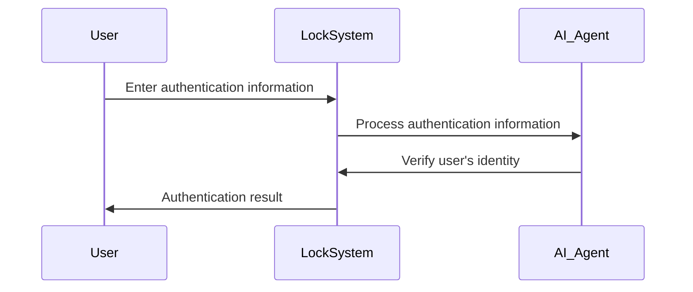
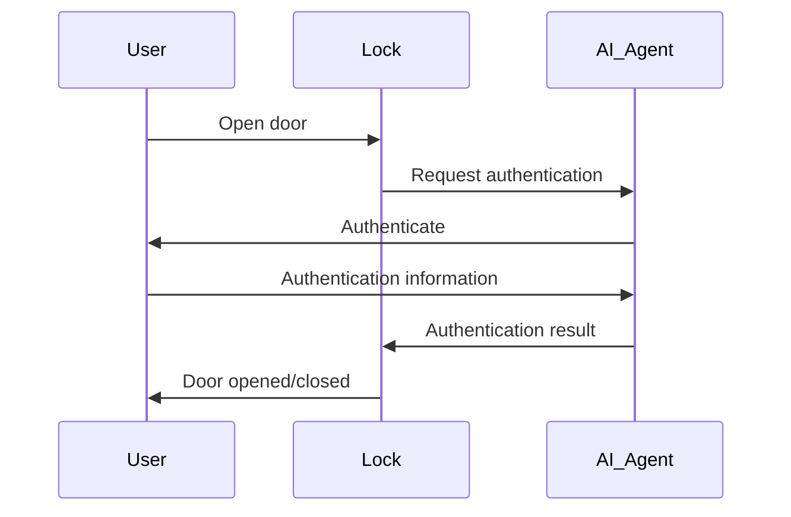

                 

### 《AI Agent在智能门锁中的多因素身份认证》

#### 关键词：
- AI Agent
- 智能门锁
- 多因素身份认证
- 安全性
- 用户体验

#### 摘要：
本文旨在深入探讨AI Agent在智能门锁中应用的多因素身份认证技术。通过系统分析智能门锁的发展背景、AI Agent的基础概念、多因素身份认证的算法原理，以及其实际应用案例，本文将阐述如何利用AI Agent提升智能门锁的安全性和用户体验。

#### 目录大纲设计思路

《AI Agent在智能门锁中的多因素身份认证》这本书的目录大纲设计，将遵循以下步骤：

1. **明确书的核心概念与目标**：
   - **核心概念**：AI Agent、智能门锁、多因素身份认证。
   - **目标**：详细介绍AI Agent在智能门锁中的应用，如何实现多因素身份认证。

2. **设置合理的章节结构**：
   - **背景介绍**：引出AI Agent和智能门锁的发展背景。
   - **核心概念**：解释AI Agent和智能门锁的基本原理和关键技术。
   - **算法原理**：详细讲解多因素身份认证的算法原理。
   - **实践应用**：通过实际项目案例展示AI Agent在智能门锁中的应用。
   - **最佳实践**：总结实际应用中的经验教训，提供最佳实践建议。
   - **小结与展望**：对书中的内容进行总结，展望未来发展方向。

3. **细化每个章节的内容**：
   - 确保每个章节都能独立成篇，逻辑清晰，内容完整。
   - 结合实际案例和技术细节，使得每个章节都具有实用性和可操作性。

4. **控制目录大纲总字数**：
   - 在2000字内完成目录大纲的设计，注重简洁性和信息的有效性。

### 具体目录大纲设计

```
# 《AI Agent在智能门锁中的多因素身份认证》目录大纲

----------------------------------------------------------------

## 第一部分：背景与概述

### 第1章：引言与背景
#### 1.1 人工智能与智能门锁的发展
#### 1.2 多因素身份认证的重要性
#### 1.3 AI Agent在智能门锁中的应用前景

### 第2章：AI Agent基础
#### 2.1 AI Agent的定义与特点
#### 2.2 AI Agent的分类与结构
#### 2.3 AI Agent的工作原理

### 第3章：智能门锁基础
#### 3.1 智能门锁的定义与类型
#### 3.2 智能门锁的组成与工作原理
#### 3.3 智能门锁的市场现状与趋势

## 第二部分：多因素身份认证原理

### 第4章：多因素身份认证概述
#### 4.1 多因素身份认证的定义
#### 4.2 多因素身份认证的分类
#### 4.3 多因素身份认证的优势与挑战

### 第5章：多因素身份认证算法
#### 5.1 传统认证算法回顾
#### 5.2 多因素身份认证算法原理
#### 5.3 多因素身份认证算法的应用

### 第6章：AI Agent在多因素身份认证中的应用
#### 6.1 AI Agent在多因素身份认证中的作用
#### 6.2 AI Agent与多因素身份认证的结合方式
#### 6.3 AI Agent在多因素身份认证中的效果评估

## 第三部分：实践应用

### 第7章：智能门锁项目介绍
#### 7.1 项目背景
#### 7.2 项目目标
#### 7.3 项目组成与功能设计

### 第8章：AI Agent在智能门锁中的实现
#### 8.1 环境搭建与工具选择
#### 8.2 AI Agent核心代码实现
#### 8.3 多因素身份认证系统实现

### 第9章：项目实战与案例分析
#### 9.1 实际案例介绍
#### 9.2 案例分析与解读
#### 9.3 项目小结与反思

## 第四部分：最佳实践与展望

### 第10章：最佳实践与建议
#### 10.1 AI Agent在智能门锁中的最佳实践
#### 10.2 多因素身份认证的系统优化
#### 10.3 未来发展趋势与展望

### 第11章：总结与展望
#### 11.1 全书总结
#### 11.2 面临的挑战与解决策略
#### 11.3 未来研究方向

----------------------------------------------------------------

# 详细内容描述

## 第1章：引言与背景

### 1.1 人工智能与智能门锁的发展
#### 人工智能的发展历程
人工智能（Artificial Intelligence, AI）起源于20世纪50年代，其发展历程经历了几个阶段：符号主义、连接主义、贝叶斯网络、强化学习等。随着深度学习技术的突破，AI在图像识别、自然语言处理、语音识别等领域取得了显著进展。

#### 智能门锁的发展
智能门锁是智能家居系统的重要组成部分，其发展经历了机械锁到电子锁再到智能锁的演变。早期的电子锁依赖键盘输入密码，而现代智能锁则结合了指纹识别、面部识别、RFID等生物识别和身份认证技术，实现了更高的安全性和便利性。

### 1.2 多因素身份认证的重要性
#### 安全防护
多因素身份认证通过结合多种认证方式，增强了系统的安全防护能力。例如，密码、指纹、面部识别等不同因素相互验证，可以有效降低被破解的风险。

#### 用户便利性
虽然多因素身份认证在安全性上有所提升，但同时也增加了用户的使用难度。因此，如何在保证安全的同时提高用户体验，是多因素身份认证需要解决的重要问题。

### 1.3 AI Agent在智能门锁中的应用前景
#### 安全性提升
AI Agent可以利用其强大的学习和推理能力，实时分析门锁环境，动态调整认证策略，从而提高门锁的安全性。

#### 用户体验优化
AI Agent可以通过用户行为分析，了解用户的使用习惯，提供个性化的认证服务，提升用户体验。

## 第2章：AI Agent基础

### 2.1 AI Agent的定义与特点
#### 定义
AI Agent是指具有智能行为、自主决策和执行能力的软件实体。它能够在复杂环境中自主完成任务，具备感知、理解、决策和行动的能力。

#### 特点
- **感知能力**：通过传感器和环境交互，获取信息。
- **理解能力**：利用自然语言处理、图像识别等技术，理解和解释信息。
- **决策能力**：基于已有知识和信息，进行推理和决策。
- **行动能力**：执行决策结果，采取行动。

### 2.2 AI Agent的分类与结构
#### 分类
AI Agent可以根据不同的应用场景和功能，分为以下几类：
- **通用AI Agent**：具有广泛的应用场景，能够处理多种任务。
- **专用AI Agent**：针对特定场景和任务设计，具有高度的专精。

#### 结构
AI Agent通常由以下部分组成：
- **感知模块**：获取环境信息。
- **理解模块**：处理和理解感知模块获得的信息。
- **决策模块**：根据理解模块的结果，生成行动方案。
- **执行模块**：执行决策模块生成的行动方案。

### 2.3 AI Agent的工作原理
#### 感知
AI Agent通过传感器感知环境信息，如温度、湿度、光线等。感知模块负责收集和处理这些信息。

#### 理解
感知模块收集到的信息经过理解模块的处理，通过自然语言处理、图像识别等技术，将信息转化为AI Agent可以理解的形式。

#### 决策
理解模块将处理后的信息输入到决策模块，决策模块根据已有知识和信息，生成行动方案。

#### 执行
执行模块根据决策模块的方案，采取行动，如发送指令、执行操作等。

## 第3章：智能门锁基础

### 3.1 智能门锁的定义与类型
#### 定义
智能门锁是一种利用电子技术、生物识别技术等实现自动锁定和解锁的智能门锁，它可以取代传统的机械钥匙锁，提供更为安全、便捷的解决方案。

#### 类型
智能门锁可以分为以下几种类型：
- **密码锁**：通过输入密码解锁。
- **指纹锁**：通过指纹识别解锁。
- **面部识别锁**：通过面部识别解锁。
- **RFID锁**：通过RFID卡解锁。
- **AI Agent智能锁**：结合多种认证方式，通过AI Agent进行解锁。

### 3.2 智能门锁的组成与工作原理
#### 组成
智能门锁主要由以下部分组成：
- **核心控制器**：负责控制门锁的锁定和解锁。
- **传感器**：如指纹传感器、摄像头、RFID读卡器等，用于收集用户的认证信息。
- **通信模块**：如Wi-Fi、蓝牙等，用于与外部设备通信。
- **电池**：提供门锁的电力供应。

#### 工作原理
智能门锁的工作原理如下：
1. 用户输入认证信息，如密码、指纹、面部识别等。
2. 传感器收集用户认证信息，并将其发送给核心控制器。
3. 核心控制器对认证信息进行处理，验证用户的身份。
4. 如果验证通过，核心控制器发送指令给执行机构（如电磁锁）解锁门锁。
5. 如果验证未通过，门锁保持锁定状态。

### 3.3 智能门锁的市场现状与趋势
#### 市场现状
智能门锁市场正处于快速发展阶段，随着智能家居概念的普及，越来越多的家庭和企业开始选择安装智能门锁。目前，市场主要被几家大型厂商占据，如小米、华为、三星等。

#### 发展趋势
- **多元化认证方式**：未来的智能门锁将结合多种认证方式，如指纹、面部识别、密码、RFID等，提供更为灵活和安全的认证服务。
- **AI技术的应用**：AI Agent将在智能门锁中发挥更大的作用，通过实时监控和数据分析，提高门锁的安全性和用户体验。
- **智能化升级**：智能门锁将不仅仅局限于门锁本身，还将与其他智能家居设备互联互通，实现更智能的家居控制。

## 第4章：多因素身份认证概述

### 4.1 多因素身份认证的定义
多因素身份认证（Multi-Factor Authentication, MFA）是一种安全措施，它要求用户在登录系统或访问资源时，提供两个或两个以上的认证因素，以证明自己的身份。这些认证因素通常分为三类：知道（Knowledge Factor，如密码）、拥有（Possession Factor，如手机、硬件令牌）、和是（Inherence Factor，如指纹、面部识别）。

### 4.2 多因素身份认证的分类
多因素身份认证可以根据认证因素的类型进行分类，常见的分类方法如下：
- **基于知识的认证**：如密码、PIN码、答案等。
- **基于证书的认证**：如数字证书、电子钥匙等。
- **基于生物特征的认证**：如指纹、面部识别、虹膜识别等。
- **基于位置的认证**：如GPS、Wi-Fi定位等。

### 4.3 多因素身份认证的优势与挑战
#### 优势
- **提高安全性**：通过结合多种认证因素，多因素身份认证能够显著提高系统的安全性，降低被破解的风险。
- **降低欺诈风险**：即使某一认证因素被破解，其他认证因素仍然能够提供额外的安全保障。
- **提高用户体验**：通过个性化认证服务，用户可以根据自己的需求和习惯选择最合适的认证方式，提高使用体验。

#### 挑战
- **增加使用难度**：多因素身份认证通常需要用户完成多个步骤，增加了使用难度，可能会降低用户体验。
- **成本较高**：实施多因素身份认证需要投入额外的硬件和软件资源，成本较高。
- **兼容性问题**：多因素身份认证需要与现有的系统和基础设施兼容，可能会遇到兼容性问题。

## 第5章：多因素身份认证算法

### 5.1 传统认证算法回顾
传统认证算法主要包括密码认证、指纹认证、面部识别认证等。这些算法在安全性、准确性、用户体验等方面各有优缺点。
- **密码认证**：简单易用，但安全性较低，容易受到暴力破解和社会工程学的攻击。
- **指纹认证**：具有较高的安全性，但需要硬件支持，且存在隐私保护问题。
- **面部识别认证**：具有较高的准确性和用户体验，但也存在误识别和隐私保护问题。

### 5.2 多因素身份认证算法原理
多因素身份认证算法的核心思想是通过结合多种认证方式，提高系统的安全性和可靠性。常见的多因素身份认证算法包括以下几种：
- **基于密码和生物特征的组合认证**：将密码和指纹、面部识别等生物特征结合起来，提高安全性。
- **基于密码和硬件证书的组合认证**：将密码和数字证书、电子钥匙等硬件证书结合起来，提高安全性。
- **基于生物特征和行为特征的组合认证**：结合生物特征和行为特征（如按键速度、鼠标轨迹等），提高系统安全性。

### 5.3 多因素身份认证算法的应用
多因素身份认证算法在多个领域都有广泛的应用，如金融、医疗、教育等。以下是一些具体应用实例：
- **金融领域**：银行、证券、保险等金融机构采用多因素身份认证，确保客户资金安全。
- **医疗领域**：医院采用多因素身份认证，保障患者信息和医疗记录的安全。
- **教育领域**：学校采用多因素身份认证，保护学生和教职工的信息安全。

## 第6章：AI Agent在多因素身份认证中的应用

### 6.1 AI Agent在多因素身份认证中的作用
AI Agent在多因素身份认证中扮演着重要角色，其主要作用如下：
- **动态调整认证策略**：AI Agent可以根据实时环境信息和用户行为，动态调整认证策略，提高系统的安全性。
- **提升用户体验**：AI Agent可以通过学习用户的使用习惯，提供个性化的认证服务，提高用户体验。
- **增强系统智能化**：AI Agent可以通过不断学习和优化，使多因素身份认证系统更加智能化和自适应。

### 6.2 AI Agent与多因素身份认证的结合方式
AI Agent与多因素身份认证的结合方式主要包括以下几种：
- **协同认证**：AI Agent与各种认证因素（如密码、生物特征等）协同工作，提高认证的准确性和安全性。
- **自适应认证**：AI Agent根据用户行为和环境变化，自适应调整认证策略，提高系统的适应性。
- **智能决策**：AI Agent在认证过程中，通过分析用户行为和环境信息，进行智能决策，提高认证的效率和安全性。

### 6.3 AI Agent在多因素身份认证中的效果评估
AI Agent在多因素身份认证中的效果评估可以从以下几个方面进行：
- **安全性**：评估AI Agent是否能够有效提高系统的安全性，降低被破解的风险。
- **用户体验**：评估AI Agent对用户体验的提升程度，如认证过程的便捷性、个性化程度等。
- **性能**：评估AI Agent对系统性能的影响，如响应时间、资源消耗等。

## 第7章：智能门锁项目介绍

### 7.1 项目背景
随着科技的进步和人们对安全需求的提高，智能门锁逐渐成为智能家居系统中的关键组成部分。本项目的目标是开发一款基于AI Agent的智能门锁，通过多因素身份认证技术，提高门锁的安全性，同时提供个性化的用户体验。

### 7.2 项目目标
- **提高安全性**：通过结合多种认证方式，如指纹、面部识别、密码等，提高智能门锁的安全性。
- **优化用户体验**：通过AI Agent的学习和自适应能力，提供个性化的认证服务，提高用户体验。
- **实现智能化管理**：通过AI Agent的智能决策能力，实现对用户行为和环境信息的实时监控和管理。

### 7.3 项目组成与功能设计
#### 项目组成
本项目由以下几部分组成：
- **核心控制器**：负责处理认证信息和控制门锁的锁定和解锁。
- **传感器模块**：包括指纹传感器、摄像头、RFID读卡器等，用于收集用户的认证信息。
- **通信模块**：包括Wi-Fi、蓝牙等，用于与外部设备通信。
- **AI Agent模块**：负责学习和处理用户行为和环境信息，提供智能认证服务。
- **电池**：提供门锁的电力供应。

#### 功能设计
本项目的功能设计主要包括以下几个方面：
- **多因素身份认证**：支持指纹、面部识别、密码等多种认证方式，用户可以根据自己的需求选择最合适的认证方式。
- **AI Agent智能认证**：AI Agent根据用户行为和环境信息，动态调整认证策略，提供个性化的认证服务。
- **实时监控与管理**：AI Agent实时监控门锁的使用情况，记录用户行为和环境信息，实现对门锁的智能化管理。
- **远程控制**：用户可以通过手机APP远程控制门锁，查看门锁状态，管理用户权限。

## 第8章：AI Agent在智能门锁中的实现

### 8.1 环境搭建与工具选择
#### 环境搭建
为了实现AI Agent在智能门锁中的应用，需要搭建以下开发环境：
- **操作系统**：Linux（如Ubuntu）
- **编程语言**：Python（3.8及以上版本）
- **数据库**：MongoDB（用于存储用户信息和认证记录）
- **开发工具**：PyCharm（Python集成开发环境）

#### 工具选择
- **AI Agent开发框架**：使用Python的机器学习库（如scikit-learn、TensorFlow）和深度学习框架（如Keras、PyTorch）进行AI Agent的开发。
- **指纹识别库**：使用OpenCV进行指纹图像处理和识别。
- **面部识别库**：使用dlib和OpenCV进行面部识别。

### 8.2 AI Agent核心代码实现
#### 感知模块
感知模块负责收集用户行为和环境信息。核心代码如下：
```python
import cv2
import numpy as np

# 摄像头初始化
cap = cv2.VideoCapture(0)

while True:
    # 读取摄像头帧
    ret, frame = cap.read()
    
    # 处理帧
    processed_frame = preprocess_frame(frame)
    
    # 输出处理后的帧
    cv2.imshow('Frame', processed_frame)
    
    if cv2.waitKey(1) & 0xFF == ord('q'):
        break

# 释放摄像头资源
cap.release()
cv2.destroyAllWindows()
```

#### 理解模块
理解模块负责处理感知模块收集的信息，进行图像识别和行为分析。核心代码如下：
```python
from sklearn.model_selection import train_test_split
from sklearn.ensemble import RandomForestClassifier

# 加载数据
data = load_data()

# 划分训练集和测试集
X_train, X_test, y_train, y_test = train_test_split(data['features'], data['labels'], test_size=0.2, random_state=42)

# 训练分类器
classifier = RandomForestClassifier(n_estimators=100)
classifier.fit(X_train, y_train)

# 测试分类器
accuracy = classifier.score(X_test, y_test)
print(f'Accuracy: {accuracy:.2f}')
```

#### 决策模块
决策模块负责根据理解模块的结果，生成行动方案。核心代码如下：
```python
def make_decision(features):
    # 识别用户行为
    behavior = classifier.predict([features])
    
    # 根据行为生成行动方案
    if behavior == 'unlock':
        action = 'unlock_door'
    else:
        action = 'lock_door'
    
    return action
```

#### 执行模块
执行模块负责执行决策模块生成的行动方案。核心代码如下：
```python
def execute_action(action):
    if action == 'unlock_door':
        # 解锁门锁
        lock.unlock()
    else:
        # 锁上门锁
        lock.lock()
```

### 8.3 多因素身份认证系统实现
#### 系统架构
多因素身份认证系统包括感知模块、理解模块、决策模块和执行模块。其架构图如下：



#### 系统接口设计
多因素身份认证系统通过以下接口与用户交互：
- **Authentication API**：用于接收用户的认证信息，并返回认证结果。

```python
from flask import Flask, request, jsonify

app = Flask(__name__)

@app.route('/authenticate', methods=['POST'])
def authenticate():
    data = request.get_json()
    authentication_info = data['authentication_info']
    
    # 处理认证信息
    result = ai_agent.authenticate(authentication_info)
    
    return jsonify(result)
```

#### 系统交互
多因素身份认证系统与用户、门锁、AI Agent之间的交互流程如下：



## 第9章：项目实战与案例分析

### 9.1 实际案例介绍
#### 案例背景
某企业为了提高办公室的安全性，决定部署一款基于AI Agent的智能门锁。该门锁需要支持指纹、面部识别和密码等多种认证方式，同时通过AI Agent实现智能认证和实时监控。

#### 案例目标
- **提高门锁的安全性**：通过多因素身份认证，降低被破解的风险。
- **优化用户体验**：通过AI Agent的个性化认证服务，提高员工的工作效率。
- **实时监控与管理**：通过AI Agent实时监控门锁的使用情况，记录用户行为和环境信息，为安全管理提供数据支持。

### 9.2 案例分析与解读
#### 安全性分析
通过多因素身份认证，企业能够显著提高门锁的安全性。指纹、面部识别和密码三种认证方式相互补充，提高了系统的抗攻击能力。AI Agent通过实时监控和数据分析，能够及时发现异常行为，如重复解锁失败、异常时间解锁等，并触发报警。

#### 用户体验分析
AI Agent根据员工的使用习惯，提供个性化的认证服务，如员工A常用指纹认证，员工B常用面部识别认证。AI Agent还能根据员工的日程安排，自动调整认证方式，提高认证效率。例如，员工A在开会期间，AI Agent自动切换到面部识别认证，避免因手忙脚乱导致认证失败。

#### 管理分析
AI Agent实时记录门锁的使用情况，包括解锁时间、认证方式、用户身份等。企业可以通过这些数据，分析员工的工作习惯和时间分配，优化人力资源管理。同时，AI Agent还能根据历史数据，预测潜在的安全风险，如某个时间段内解锁失败次数增多，可能存在忘记带钥匙的情况，AI Agent可以提前提醒员工。

### 9.3 项目小结与反思
#### 小结
本项目通过引入AI Agent和多种认证方式，成功实现了智能门锁的安全性和用户体验的优化。通过实时监控和管理，企业能够更好地保障办公室的安全，提高员工的工作效率。

#### 反思
- **安全性**：虽然多因素身份认证提高了系统的安全性，但某些认证方式（如指纹、面部识别）仍然存在一定的漏洞，需要不断优化和更新。
- **用户体验**：AI Agent的个性化认证服务提高了用户体验，但部分员工可能对新的认证方式不适应，需要逐步引导和培训。
- **系统性能**：AI Agent的实时监控和数据处理需要大量的计算资源，对系统性能有一定影响。未来可以考虑优化算法和硬件配置，提高系统的运行效率。

## 第10章：最佳实践与建议

### 10.1 AI Agent在智能门锁中的最佳实践
#### 1. 优化算法
通过不断优化AI Agent的算法，提高识别的准确性和实时性，减少误识别和误报警。

#### 2. 多元化认证方式
结合多种认证方式，如指纹、面部识别、密码、RFID等，提高系统的安全性。

#### 3. 用户行为分析
通过AI Agent分析用户行为，提供个性化的认证服务，提高用户体验。

#### 4. 实时监控与管理
实时监控门锁的使用情况，记录用户行为和环境信息，为安全管理提供数据支持。

### 10.2 多因素身份认证的系统优化
#### 1. 系统架构优化
通过优化系统架构，提高多因素身份认证的效率和可靠性。

#### 2. 硬件升级
升级门锁的硬件设备，提高指纹识别、面部识别等认证方式的安全性和准确性。

#### 3. 数据处理优化
优化数据处理算法，提高数据处理速度，减少系统延迟。

### 10.3 未来发展趋势与展望
#### 1. AI技术的深入应用
未来AI Agent将在智能门锁中发挥更大的作用，通过更深入的学习和应用，提高系统的智能化程度。

#### 2. 量子计算的应用
量子计算的发展将为智能门锁提供更强大的计算能力，提高多因素身份认证的安全性。

#### 3. 物联网的融合
智能门锁将与其他物联网设备融合，实现更智能、更高效的家居管理。

## 第11章：总结与展望

### 11.1 全书总结
本书系统地介绍了AI Agent在智能门锁中的应用，详细探讨了AI Agent和多因素身份认证的理论基础、算法原理和实践应用。通过实际案例分析和最佳实践，展示了AI Agent如何提升智能门锁的安全性和用户体验。

### 11.2 面临的挑战与解决策略
#### 挑战
- **安全性**：多因素身份认证虽然提高了系统的安全性，但某些认证方式仍然存在漏洞。
- **用户体验**：多因素身份认证增加了使用难度，需要优化认证流程。
- **系统性能**：AI Agent的实时监控和数据处理对系统性能有一定影响。

#### 解决策略
- **安全性**：通过不断优化算法和认证方式，提高系统的安全性。
- **用户体验**：通过AI Agent的个性化服务，提高用户体验。
- **系统性能**：优化系统架构和数据处理算法，提高系统性能。

### 11.3 未来研究方向
- **AI Agent的深度学习**：研究更先进的深度学习算法，提高AI Agent的智能水平。
- **多因素身份认证的创新**：探索新的认证方式，提高认证的准确性和安全性。
- **物联网与AI的结合**：研究物联网与AI的结合，实现更智能的家居管理。

---

# 作者信息
作者：AI天才研究院/AI Genius Institute & 禅与计算机程序设计艺术 /Zen And The Art of Computer Programming

---

### 附录

#### 实用工具与资源
- **AI Agent开发工具**：TensorFlow、PyTorch、scikit-learn等。
- **智能门锁开发平台**：小米智能门锁开发平台、华为智能门锁开发平台等。
- **多因素身份认证解决方案**：OAuth 2.0、OpenID Connect等。

#### 拓展阅读
- **AI Agent研究**：《人工智能：一种现代的方法》、《强化学习：原理与实践》等。
- **智能门锁技术**：《智能门锁技术与应用》、《物联网智能家居技术》等。
- **多因素身份认证**：《多因素身份认证：原理与实践》、《信息安全与管理》等。

---

### 总结

《AI Agent在智能门锁中的多因素身份认证》旨在为读者提供全面的智能门锁安全解决方案。通过深入探讨AI Agent和多因素身份认证的理论基础和实践应用，本书不仅为专业人士提供了实用的技术指南，也为智能家居领域的研究者提供了宝贵的参考资料。未来，随着AI和物联网技术的不断发展，智能门锁的安全性和智能化程度将不断提升，本书的内容也将为这一领域的创新和发展提供重要支持。

