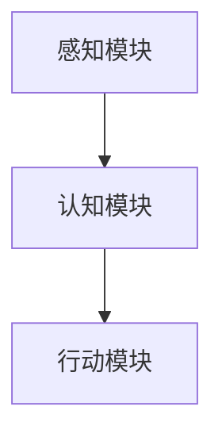
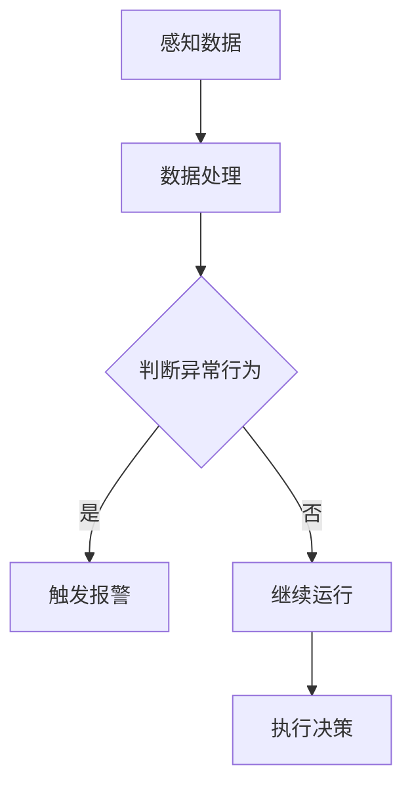
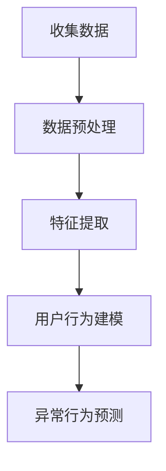
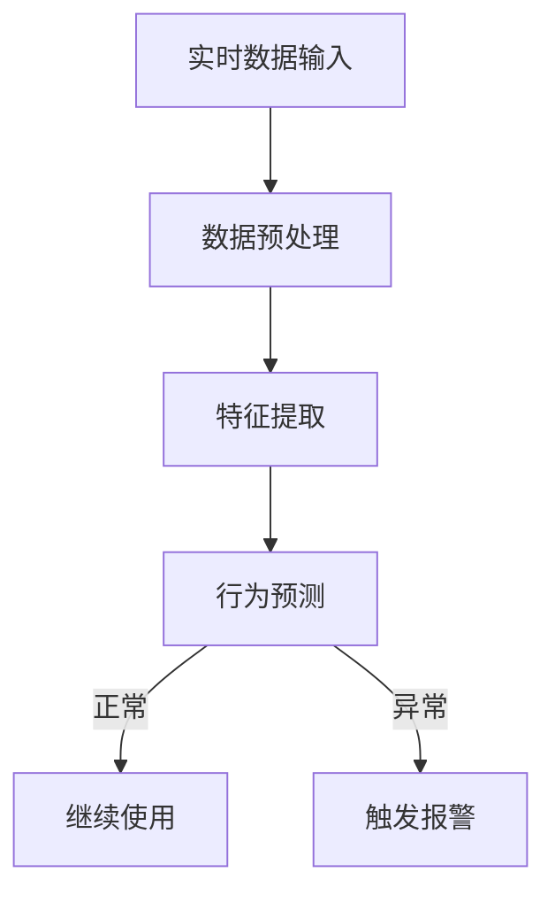
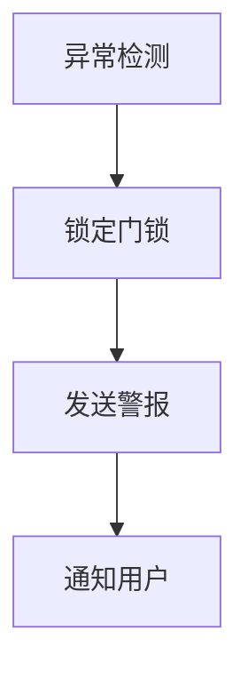

                 

### 引言与背景介绍

随着人工智能技术的迅猛发展，智能门锁作为智能家居领域的重要一环，逐渐普及到我们的日常生活中。智能门锁不仅提供了便捷的钥匙替代方案，还通过多种传感器和联网功能，提升了家庭和商业场所的安全性。然而，随着智能门锁的广泛应用，其安全性问题也逐渐凸显出来。异常行为检测作为保障智能门锁安全的关键技术之一，得到了越来越多的关注。

**关键词：** AI Agent，智能门锁，异常行为检测，安全挑战，技术应用

**摘要：** 本文将详细介绍AI Agent在智能门锁中的异常行为检测技术，首先介绍智能门锁的普及背景及安全挑战，然后深入探讨AI Agent的基本概念和工作原理，最后通过系统架构设计、项目实战等环节，展示AI Agent在智能门锁中的实际应用，以期为相关研究和实践提供参考。

### 第1章 问题背景与核心概念

#### 1.1 问题背景

##### 1.1.1 智能门锁的普及与安全挑战

近年来，智能门锁因其便捷性和高效性，逐渐成为家庭和商业场所的首选。智能门锁通过指纹识别、密码输入、卡片读取、手机App等多种方式实现用户身份认证，大幅提升了门禁系统的安全性。然而，随着智能门锁的广泛应用，其安全问题也日益凸显。

传统的机械门锁相对简单，攻击手段也较为单一，主要通过暴力破解、钥匙复制等方式进行。而智能门锁增加了电子元件和网络连接，虽然提升了安全性，但也引入了新的风险。例如，黑客可以通过网络攻击入侵智能门锁系统，实现远程破解、恶意控制等行为。此外，智能门锁的传感器和通信模块也可能成为攻击的目标，导致门锁被恶意操控。

##### 1.1.2 AI Agent的基本概念与作用

AI Agent，即人工智能代理，是指能够自主执行任务、与环境交互并适应环境变化的人工智能实体。AI Agent具有感知、思考、决策和行动的能力，能够在没有人类干预的情况下执行复杂任务。在智能门锁中，AI Agent可以通过对用户行为数据的分析，识别异常行为，从而提高系统的安全性。

AI Agent在智能门锁中的作用主要体现在以下几个方面：

1. **用户行为分析**：AI Agent可以收集用户的日常使用数据，如开锁时间、使用频率、使用方式等，通过数据分析，建立用户行为模型。
2. **异常行为检测**：当AI Agent检测到用户行为与正常行为模型存在显著差异时，可以判断为异常行为，并及时采取相应的措施，如报警、锁定门锁等。
3. **自适应安全策略**：AI Agent可以根据异常行为检测的结果，动态调整门锁的安全策略，提高系统的安全性。

##### 1.1.3 异常行为检测在智能门锁中的应用

异常行为检测作为人工智能的一个重要分支，旨在发现数据中的异常或异常模式。在智能门锁中，异常行为检测可以应用于以下几个方面：

1. **暴力破解检测**：通过检测开锁尝试频率、尝试方式等，识别潜在的暴力破解行为，并触发报警。
2. **非法入侵检测**：通过监控门锁传感器数据，如震动、移动等，识别非法入侵行为，并通知用户或相关安保部门。
3. **恶意控制检测**：检测远程控制指令的合法性，识别可能的恶意控制行为，如远程锁定门锁、更改密码等。

总之，AI Agent在智能门锁中的异常行为检测技术，不仅可以提高门锁的安全性，还能为用户带来更加智能、便捷的使用体验。随着人工智能技术的不断发展，异常行为检测在智能门锁中的应用前景将更加广阔。

#### 1.2 核心概念与联系

##### 1.2.1 AI Agent的工作原理

AI Agent的工作原理可以分为感知、思考、决策和行动四个主要环节。

1. **感知**：AI Agent通过传感器收集环境信息，如用户行为、门锁状态等。这些信息被传递到认知模块进行处理。
2. **思考**：认知模块对感知到的信息进行分析，建立用户行为模型，并通过学习和推理，识别异常行为。
3. **决策**：基于异常行为检测的结果，AI Agent做出相应的决策，如触发报警、锁定门锁等。
4. **行动**：执行决策结果，采取相应的行动，如通知用户、锁定门锁等。

##### 1.2.2 异常行为检测的基本方法

异常行为检测的方法主要包括统计方法、机器学习方法以及基于规则的检测方法。

1. **统计方法**：基于统计学原理，通过计算数据分布、离群点检测等方法，识别异常行为。如使用3-sigma规则，将数据点与均值之间的距离超过3倍标准差的视为异常。
2. **机器学习方法**：通过建立用户行为模型，利用机器学习算法，如K-近邻（K-Nearest Neighbors, KNN）、支持向量机（Support Vector Machine, SVM）、决策树（Decision Tree）等，进行异常行为检测。这些方法可以通过学习大量正常行为数据，构建分类模型，对新数据点进行分类。
3. **基于规则的检测方法**：通过定义一系列规则，对用户行为进行监控，当用户行为触犯到这些规则时，即视为异常行为。这种方法通常较为简单直观，但需要大量的人工规则制定和调整。

##### 1.2.3 AI Agent与异常行为检测的关系

AI Agent与异常行为检测的关系可以理解为：AI Agent是异常行为检测的实施者，而异常行为检测则是AI Agent的核心功能之一。

AI Agent通过感知用户行为数据，利用机器学习等技术，建立用户行为模型，并对新数据点进行实时分析，识别异常行为。当检测到异常行为时，AI Agent会根据预设的规则或策略，采取相应的措施，如触发报警、锁定门锁等，以保障系统的安全性。

总之，AI Agent在智能门锁中的应用，使得异常行为检测更加智能、高效。通过不断学习和优化，AI Agent可以逐步提高异常行为检测的准确性和实时性，为用户提供更加安全、便捷的使用体验。

### 第2章 AI Agent的基本原理

AI Agent，即人工智能代理，是指一种能够模拟人类智能行为，自主执行任务并与环境互动的计算机程序。AI Agent在智能门锁中的应用，为异常行为检测提供了强大的技术支持。本节将详细探讨AI Agent的定义、类型及其核心组件和工作原理。

#### 2.1 AI Agent的定义与类型

AI Agent可以定义为一种具有感知、思考、决策和行动能力的人工智能实体。其基本特征包括：

1. **感知**：AI Agent通过传感器或接口，从环境中获取信息。
2. **思考**：AI Agent利用收集到的信息，进行推理和决策。
3. **决策**：基于推理结果，AI Agent生成行动计划。
4. **行动**：AI Agent执行决策结果，采取相应行动。

根据AI Agent的任务和功能，可以将其分为以下几类：

1. **反应式Agent**：反应式Agent是最简单的一种AI Agent，它根据当前感知到的环境信息，直接做出反应。这种Agent没有记忆或学习功能，其行为仅基于当前环境状态。例如，家用智能门锁在检测到用户指纹匹配后，直接解锁。

2. **目标导向Agent**：目标导向Agent具有明确的目标，并持续采取行动以达成目标。这种Agent不仅能够感知当前环境，还能记住以往的状态和行动，利用这些信息来指导当前和未来的行动。例如，智能门锁在检测到异常行为后，可以尝试恢复系统到安全状态。

3. **学习型Agent**：学习型Agent能够从经验中学习和改进行为。这类Agent可以通过机器学习、深度学习等技术，不断优化其行为策略。在智能门锁中，学习型Agent可以通过分析用户行为数据，识别正常和异常行为，从而提高系统的安全性。

#### 2.2 AI Agent的组件与架构

AI Agent通常由以下三个核心组件组成：感知模块、认知模块和行动模块。

1. **感知模块**：感知模块是AI Agent的感官，用于从环境中获取信息。在智能门锁中，感知模块可能包括指纹传感器、摄像头、加速度传感器等。这些传感器可以捕捉用户的指纹、人脸、动作等信息。

2. **认知模块**：认知模块是AI Agent的“大脑”，负责处理感知模块获取的信息，并做出决策。在智能门锁中，认知模块通过机器学习算法，如神经网络、决策树等，分析用户行为数据，建立用户行为模型，识别异常行为。

3. **行动模块**：行动模块是AI Agent的“肢体”，负责执行决策结果。在智能门锁中，行动模块可以发送警报、锁定门锁或通知用户等。例如，当AI Agent检测到暴力破解行为时，可以立即锁定门锁并通知用户。

下面是一个简单的AI Agent架构图，展示了感知、认知和行动模块之间的关系：



#### 2.3 AI Agent的运行流程

AI Agent的运行流程可以概括为以下几个步骤：

1. **感知**：AI Agent通过感知模块收集环境信息，如用户的指纹、人脸、动作等。
2. **思考**：AI Agent利用认知模块对收集到的信息进行处理和分析，建立用户行为模型。
3. **决策**：基于用户行为模型和异常行为检测算法，AI Agent决定是否触发异常行为报警。
4. **行动**：AI Agent执行决策结果，采取相应的行动，如发送警报、锁定门锁等。

下面是一个简化的AI Agent运行流程图：



通过以上对AI Agent的基本原理的介绍，我们可以看出，AI Agent在智能门锁中的应用，不仅能够提高系统的安全性，还能通过学习和优化，不断适应和应对各种异常行为。接下来，我们将进一步探讨异常行为检测技术，为AI Agent在智能门锁中的应用提供更深入的理解。

#### 3.1 异常行为检测的原理

异常行为检测是智能门锁安全性的重要保障。其核心思想是通过分析用户的行为数据，识别出与正常行为模型存在显著差异的异常行为，并采取相应的措施，如触发报警或锁定门锁。以下将详细探讨异常行为检测的基本原理。

##### 3.1.1 异常检测的定义与分类

异常检测，又称异常行为检测或离群检测，是指从大量数据中识别出不符合大多数正常数据模式的异常数据或行为。在智能门锁中，异常行为检测旨在识别出那些潜在的安全威胁行为，如暴力破解、非法入侵等。

异常检测可以按照检测方法的不同，分为以下几类：

1. **基于统计学的异常检测方法**：这类方法主要通过计算数据分布、标准差等统计量，识别出与大多数数据点存在显著差异的数据点。常见的统计方法包括3-sigma规则、箱线图等。

2. **基于机器学习的异常检测方法**：这类方法通过建立用户行为模型，利用机器学习算法对数据进行分类，识别出异常数据点。常见的机器学习算法包括K-近邻（KNN）、支持向量机（SVM）、决策树等。

3. **基于规则的异常检测方法**：这类方法通过定义一系列规则，对用户行为进行监控，当用户行为触犯到这些规则时，即视为异常行为。这种方法通常需要大量的人工规则制定和调整。

##### 3.1.2 常见异常检测算法

在智能门锁中，常用的异常检测算法包括以下几种：

1. **K-近邻算法（K-Nearest Neighbors, KNN）**：KNN算法是一种基于实例的学习方法，通过计算新数据点与训练集中最近邻居的距离，判断该数据点是否为异常。具体步骤如下：

   - 训练阶段：收集大量正常行为数据，用于训练用户行为模型。
   - 测试阶段：对于新数据点，计算其与训练集中每个数据点的距离，取最近的K个邻居。
   - 判断：如果这K个邻居中有超过一半是正常行为，则判断新数据点为正常行为；否则，判断为异常行为。

2. **支持向量机（Support Vector Machine, SVM）**：SVM算法通过寻找一个超平面，将正常行为数据和异常行为数据分隔开来。具体步骤如下：

   - 训练阶段：收集正常行为数据和异常行为数据，通过线性或非线性变换，找到一个最优分割超平面。
   - 测试阶段：对于新数据点，计算其与超平面的距离，如果距离较近，则判断为异常行为；否则，判断为正常行为。

3. **决策树（Decision Tree）**：决策树通过一系列规则对数据进行划分，识别出异常行为。具体步骤如下：

   - 训练阶段：利用训练数据构建决策树模型，每个节点代表一个特征，每个分支代表一个特征值。
   - 测试阶段：对于新数据点，从根节点开始，依次按照特征值分支，直到叶节点，根据叶节点的分类结果判断新数据点是否为异常行为。

##### 3.1.3 异常检测的性能评估

异常检测的性能评估主要包括准确率（Accuracy）、召回率（Recall）和精确率（Precision）等指标。

1. **准确率**：准确率表示检测到的异常行为与实际异常行为的比例。准确率越高，表示检测系统的正确性越高。
   
   $$Accuracy = \frac{TP + TN}{TP + TN + FP + FN}$$

   其中，TP表示检测到的真实异常行为，TN表示未检测到的真实正常行为，FP表示误检测的正常行为，FN表示未检测到的异常行为。

2. **召回率**：召回率表示实际异常行为中被检测到的比例。召回率越高，表示检测系统对异常行为的捕捉能力越强。

   $$Recall = \frac{TP}{TP + FN}$$

3. **精确率**：精确率表示检测到的异常行为中真实异常行为的比例。精确率越高，表示检测系统的误报率越低。

   $$Precision = \frac{TP}{TP + FP}$$

通过综合评估这些指标，可以全面了解异常检测系统的性能。在智能门锁中，为了提高安全性，通常需要平衡准确率、召回率和精确率，选择合适的异常检测算法和参数设置。

综上所述，异常行为检测技术是保障智能门锁安全性的关键。通过深入理解异常行为检测的原理和常见算法，可以为智能门锁设计出更加安全、高效的异常行为检测系统。接下来，我们将进一步探讨基于机器学习的异常行为检测方法，为AI Agent在智能门锁中的应用提供更加深入的技术支持。

#### 3.2 基于机器学习的异常行为检测

随着人工智能技术的快速发展，机器学习在异常行为检测中的应用越来越广泛。基于机器学习的异常行为检测方法，不仅能够处理大量复杂的数据，还能够通过自我学习和优化，提高检测的准确性和实时性。以下将详细介绍基于机器学习的异常行为检测技术，包括特征工程、常见机器学习算法以及面临的挑战和解决方案。

##### 3.2.1 特征工程

特征工程是机器学习模型构建过程中的重要环节，它涉及到如何从原始数据中提取出对模型训练有价值的特征。在智能门锁的异常行为检测中，特征工程的关键在于如何从用户行为数据中提取出能够反映用户行为特征的变量。

1. **时间特征**：时间特征包括用户的开锁时间、频率、时长等。例如，一个正常用户可能会在每天早晨和晚上固定时间开锁，而异常行为可能表现为开锁时间的不规律或异常频次。

2. **位置特征**：位置特征可以通过GPS、Wi-Fi信号等方式获取。例如，正常用户可能会在固定的地点开锁，而异常行为可能表现为在不同地点频繁开锁。

3. **物理特征**：物理特征包括用户的指纹、人脸、声音等生物特征。通过对这些特征的统计分析，可以构建出用户的生物特征模型，从而识别出异常行为。

4. **行为特征**：行为特征包括用户的开锁方式、使用设备等。例如，正常用户可能主要通过指纹或密码开锁，而异常行为可能表现为通过未知设备或非正常方式开锁。

在特征提取过程中，需要考虑以下因素：

- **数据量**：特征数量不宜过多，否则会增加模型的复杂度和计算成本。
- **相关性**：特征之间应尽可能独立，避免冗余。
- **可解释性**：特征应具有较好的可解释性，便于理解模型决策过程。

##### 3.2.2 常见机器学习算法

在异常行为检测中，常见的机器学习算法包括K-近邻（K-Nearest Neighbors, KNN）、支持向量机（Support Vector Machine, SVM）、决策树（Decision Tree）、随机森林（Random Forest）等。以下分别介绍这些算法的基本原理和优缺点。

1. **K-近邻算法（KNN）**：
   - **原理**：KNN算法基于实例学习，通过计算新数据点与训练集中最近邻居的距离，判断该数据点是否为异常。距离最近的K个邻居中，如果大多数属于正常行为，则判断为正常；否则，判断为异常。
   - **优点**：实现简单，易于理解。
   - **缺点**：对噪声敏感，准确性依赖于K值的选取。

2. **支持向量机（SVM）**：
   - **原理**：SVM通过找到一个最优超平面，将正常行为数据和异常行为数据分隔开来。该超平面通过最大化分类间隔实现，从而提高模型的泛化能力。
   - **优点**：分类效果较好，适用于高维空间。
   - **缺点**：训练时间较长，对异常数据敏感。

3. **决策树**：
   - **原理**：决策树通过一系列规则对数据进行划分，每个节点代表一个特征，每个分支代表一个特征值。叶节点代表分类结果。
   - **优点**：易于理解，可解释性强。
   - **缺点**：容易过拟合，准确率依赖于特征选择。

4. **随机森林**：
   - **原理**：随机森林是由多个决策树组成的集成模型，通过对多棵决策树的投票结果来决定最终分类结果。随机森林通过集成多个决策树，提高了模型的准确性和鲁棒性。
   - **优点**：准确率高，鲁棒性强，可处理大规模数据。
   - **缺点**：计算复杂度较高，对异常数据敏感。

##### 3.2.3 常见挑战与解决方案

在基于机器学习的异常行为检测中，面临以下一些常见挑战：

1. **数据噪声**：真实环境中的数据往往存在噪声，这些噪声可能会影响模型的准确性。解决方法包括数据清洗、特征选择和去噪算法等。

2. **模型过拟合**：模型过拟合会导致在训练数据上表现良好，但在测试数据上表现不佳。解决方法包括交叉验证、正则化和集成学习等。

3. **特征维度问题**：特征维度过高会增加计算复杂度和存储需求，影响模型训练和预测效果。解决方法包括特征选择、降维技术和嵌入学习等。

4. **实时性要求**：异常行为检测需要在短时间内处理大量数据，对实时性有较高要求。解决方法包括模型压缩、增量学习和硬件加速等。

通过综合考虑以上挑战和解决方案，可以设计出更加高效、准确的异常行为检测系统，从而提高智能门锁的安全性。

总之，基于机器学习的异常行为检测技术为智能门锁提供了强大的安全保障。通过特征工程、常见算法的应用以及应对挑战的策略，AI Agent可以更好地识别和应对各种异常行为，为用户带来更加安全、便捷的使用体验。接下来，我们将进一步探讨AI Agent在智能门锁系统架构设计中的具体应用。

#### 4.1 智能门锁系统功能设计

智能门锁系统功能设计是实现其安全性和便捷性的关键。智能门锁系统的主要功能包括用户认证功能、门锁控制功能以及异常行为检测功能。以下将详细描述每个功能的设计思路和实现方式。

##### 4.1.1 用户认证功能

用户认证功能是智能门锁系统的核心，旨在确保只有授权用户才能打开门锁。用户认证功能通常包括以下几种方式：

1. **指纹识别**：通过指纹传感器获取用户指纹，与系统中的指纹数据库进行比对，验证用户身份。
2. **密码输入**：用户通过输入预设的密码，系统验证密码的正确性。
3. **卡片读取**：用户通过刷卡方式，系统读取卡片上的信息，验证用户身份。
4. **手机App**：用户通过智能手机App发送开锁指令，系统验证用户的App权限。

用户认证功能的实现流程如下：

1. **用户注册**：用户首次使用时，需进行注册，录入指纹、设置密码等。
2. **身份验证**：用户进行身份验证时，系统通过指纹识别、密码输入或卡片读取等方式获取用户信息，并与数据库中的信息进行比对。
3. **身份确认**：如果用户身份验证通过，系统发送开锁信号；否则，拒绝开锁请求。

##### 4.1.2 门锁控制功能

门锁控制功能是智能门锁系统的另一重要功能，旨在实现对门锁状态的实时控制和监控。门锁控制功能通常包括以下几种方式：

1. **远程控制**：用户通过手机App发送开锁或关锁指令，智能门锁接收指令并执行相应操作。
2. **本地控制**：用户通过指纹识别、密码输入或卡片读取等方式在门锁前端进行开锁或关锁操作。
3. **定时控制**：系统根据预设的时间规则，自动控制门锁的开闭状态。

门锁控制功能的实现流程如下：

1. **接收指令**：智能门锁接收用户的开锁或关锁指令，可以是远程指令或本地指令。
2. **验证指令**：系统验证指令的合法性，如用户身份、权限等。
3. **执行操作**：如果指令合法，系统发送信号至门锁，控制门锁进行开锁或关锁操作；否则，拒绝执行。

##### 4.1.3 异常行为检测功能

异常行为检测功能是智能门锁系统的安全保障措施，旨在通过识别异常行为，预防潜在的安全威胁。异常行为检测功能通常包括以下几种方式：

1. **暴力破解检测**：通过检测开锁尝试频率、尝试方式等，识别潜在的暴力破解行为。
2. **非法入侵检测**：通过监控门锁传感器数据，如震动、移动等，识别非法入侵行为。
3. **恶意控制检测**：检测远程控制指令的合法性，识别可能的恶意控制行为。

异常行为检测功能的实现流程如下：

1. **数据收集**：智能门锁通过传感器收集用户行为数据，如开锁时间、尝试次数、使用设备等。
2. **异常检测**：系统利用机器学习算法，如K-近邻、支持向量机等，对收集到的数据进行处理和分析，识别异常行为。
3. **报警响应**：如果检测到异常行为，系统立即触发报警，通知用户或相关安保部门。
4. **安全措施**：系统根据异常行为检测结果，采取相应的安全措施，如锁定门锁、发送警告信息等。

通过上述用户认证功能、门锁控制功能和异常行为检测功能的结合，智能门锁系统能够提供安全、便捷的使用体验。用户可以轻松实现远程或本地控制，同时系统通过异常行为检测，保障门锁的安全性。接下来，我们将进一步探讨智能门锁系统的架构设计。

#### 4.2 智能门锁系统架构设计

智能门锁系统的架构设计是实现其功能和安全性的关键。一个高效的架构不仅能提高系统的性能和可靠性，还能确保数据的安全性和系统的扩展性。以下将详细描述智能门锁系统的硬件架构设计和软件架构设计。

##### 4.2.1 硬件架构设计

智能门锁的硬件架构主要包括门锁主体、传感器模块、通信模块和控制模块。以下是各模块的功能和设计要点：

1. **门锁主体**：
   - **功能**：门锁主体是智能门锁的核心部分，负责锁的开启和关闭。
   - **设计要点**：门锁主体应具备可靠的机械结构，能够适应不同的门型和锁具标准。此外，门锁主体还应具备一定的防水、防尘性能，以确保在各种环境条件下稳定运行。

2. **传感器模块**：
   - **功能**：传感器模块用于收集用户行为数据，如指纹、人脸、声音等。
   - **设计要点**：传感器模块应选择精度高、稳定性好的传感器。例如，指纹传感器应具备高分辨率，人脸传感器应能够适应不同的光照条件。同时，传感器模块应具备低功耗和抗干扰能力，以确保在长时间使用和复杂环境下稳定工作。

3. **通信模块**：
   - **功能**：通信模块负责智能门锁与其他设备或服务器之间的数据传输。
   - **设计要点**：通信模块应支持多种通信协议，如Wi-Fi、蓝牙、Zigbee等，以便实现多种设备间的互联互通。同时，通信模块应具备高带宽、低延迟和高安全性的特点，以确保数据传输的效率和安全性。

4. **控制模块**：
   - **功能**：控制模块负责处理来自传感器模块和通信模块的数据，并根据用户指令控制门锁的开启和关闭。
   - **设计要点**：控制模块应具备高性能的处理器和内存，以处理大量实时数据。同时，控制模块还应具备一定的容错能力和抗干扰能力，确保在极端条件下仍能正常运行。

##### 4.2.2 软件架构设计

智能门锁的软件架构设计主要包括用户认证模块、门锁控制模块和异常行为检测模块。以下是各模块的功能和设计要点：

1. **用户认证模块**：
   - **功能**：用户认证模块负责用户的身份验证，包括指纹识别、密码输入、卡片读取等。
   - **设计要点**：用户认证模块应具备高安全性和高可用性。例如，指纹识别模块应采用加密算法，确保指纹数据的安全。同时，用户认证模块还应支持多种认证方式，以满足不同用户的需求。

2. **门锁控制模块**：
   - **功能**：门锁控制模块负责处理用户的门锁控制指令，包括远程控制、本地控制、定时控制等。
   - **设计要点**：门锁控制模块应具备实时性和可靠性。例如，远程控制模块应能够在短时间内响应用户的指令，本地控制模块应能够在多种环境下稳定工作。同时，门锁控制模块还应具备故障恢复能力，确保在出现问题时能够快速恢复。

3. **异常行为检测模块**：
   - **功能**：异常行为检测模块负责检测用户的行为是否正常，包括暴力破解检测、非法入侵检测、恶意控制检测等。
   - **设计要点**：异常行为检测模块应具备高效性和准确性。例如，暴力破解检测模块应能够快速识别潜在的暴力破解行为，非法入侵检测模块应能够准确检测非法入侵行为。同时，异常行为检测模块还应具备自适应能力，能够根据不同场景和用户行为进行调整。

##### 4.2.3 系统安全性设计

智能门锁系统的安全性设计是确保系统安全运行的重要环节。以下是一些关键的安全设计要点：

1. **数据加密**：对用户身份信息、用户行为数据等敏感信息进行加密存储和传输，防止数据泄露。
2. **权限控制**：实现严格的权限控制机制，确保只有授权用户才能访问系统的关键功能。
3. **安全审计**：对系统操作进行记录和审计，以便在出现问题时进行追踪和故障排除。
4. **异常检测**：利用异常行为检测模块，实时监控系统运行状态，识别潜在的安全威胁。

通过上述硬件架构设计和软件架构设计，智能门锁系统能够实现安全、高效和便捷的使用体验。接下来，我们将详细介绍AI Agent在智能门锁中的具体实现，展示其如何通过感知、认知和行动模块，实现对异常行为的检测和处理。

#### 4.3 AI Agent在智能门锁中的实现

AI Agent在智能门锁中的实现，是确保智能门锁系统安全性的重要环节。通过AI Agent，智能门锁能够实时感知用户行为，分析数据，并做出相应的决策。以下将详细介绍AI Agent在智能门锁中的具体实现，包括环境搭建、数据集准备、模型训练与优化等步骤。

##### 4.3.1 环境搭建

要实现AI Agent在智能门锁中的功能，首先需要搭建一个稳定且高效的开发环境。以下是环境搭建的步骤：

1. **硬件环境**：
   - **中央处理器（CPU）**：选择高性能的CPU，如Intel i7或AMD Ryzen 7系列，以确保模型训练和推理的效率。
   - **内存（RAM）**：至少16GB的RAM，以应对大数据处理和模型训练的需求。
   - **存储设备**：使用固态硬盘（SSD）作为主要存储设备，以提高数据读写速度。
   - **传感器模块**：配备指纹传感器、摄像头、加速度传感器等，用于收集用户行为数据。

2. **软件环境**：
   - **操作系统**：推荐使用Ubuntu 20.04 LTS或更高版本，该操作系统对深度学习工具的支持较好。
   - **编程语言**：选择Python作为主要编程语言，Python具有丰富的机器学习库和工具，如TensorFlow、PyTorch等。
   - **深度学习框架**：推荐使用TensorFlow或PyTorch，这两个框架具有高性能和丰富的功能，适用于构建和训练复杂的深度学习模型。
   - **数据预处理库**：使用Pandas、NumPy等库进行数据预处理，包括数据清洗、归一化、特征提取等。

##### 4.3.2 数据集准备

AI Agent的训练依赖于大量高质量的用户行为数据集。以下是数据集准备的关键步骤：

1. **数据收集**：
   - **指纹数据**：通过指纹传感器收集用户指纹图像，确保数据具有高分辨率和清晰度。
   - **人脸数据**：使用摄像头捕捉用户人脸图像，并提取关键特征点，用于人脸识别。
   - **行为数据**：记录用户的开锁时间、使用设备、尝试次数等行为数据，用于行为分析和异常检测。

2. **数据清洗**：
   - **去除噪声**：去除数据集中的噪声和异常值，如不完整的指纹图像、模糊的人脸图像等。
   - **数据标准化**：对数据集中的特征进行标准化处理，如将指纹图像的像素值归一化到0-1之间，便于模型训练。

3. **数据划分**：
   - **训练集**：将大部分数据作为训练集，用于模型训练。
   - **验证集**：从训练集中划分一部分数据作为验证集，用于评估模型性能和调整模型参数。
   - **测试集**：使用独立的测试集，评估模型在实际应用中的性能。

##### 4.3.3 模型训练与优化

模型训练与优化是AI Agent实现的核心步骤。以下是模型训练与优化的关键步骤：

1. **模型选择**：
   - **深度神经网络（DNN）**：选择DNN作为AI Agent的模型架构，DNN具有良好的泛化能力和强大的表达能力。
   - **卷积神经网络（CNN）**：由于指纹和人脸数据具有高维度和复杂的结构，选择CNN来处理图像数据，CNN在图像识别任务中表现出色。

2. **模型训练**：
   - **数据预处理**：对训练数据进行预处理，包括归一化、数据增强等，以提高模型的鲁棒性和泛化能力。
   - **训练过程**：使用训练集进行模型训练，通过反向传播算法更新模型参数，优化模型性能。训练过程需要调整学习率、批量大小等超参数，以避免过拟合。

3. **模型评估**：
   - **验证集评估**：在验证集上评估模型性能，通过准确率、召回率、F1分数等指标评估模型的分类效果。
   - **超参数调整**：根据验证集上的评估结果，调整模型超参数，如学习率、正则化参数等，以提高模型性能。

4. **模型优化**：
   - **模型融合**：通过集成多个模型，如DNN和CNN，提高模型的综合性能。
   - **模型压缩**：使用模型压缩技术，如量化、剪枝等，减小模型大小和计算复杂度，提高模型的实时性能。

通过以上环境搭建、数据集准备和模型训练与优化，AI Agent能够在智能门锁中实现高效的异常行为检测。接下来，我们将通过具体的实例，展示AI Agent在智能门锁中的实际应用。

##### 4.3.4 AI Agent在智能门锁中的实际应用

在智能门锁系统中，AI Agent通过其感知、认知和行动模块，实现了对用户行为的实时监控和异常行为的检测。以下将通过具体实例，展示AI Agent在智能门锁中的实际应用，包括用户行为分析、异常行为识别和异常处理与响应等步骤。

**1. 用户行为分析**

AI Agent首先通过传感器模块收集用户行为数据，包括指纹图像、人脸图像、开锁时间、使用设备等信息。然后，AI Agent利用认知模块对收集到的数据进行分析和建模。

例如，通过分析用户的开锁时间和使用频率，AI Agent可以建立用户行为模型。如图4.3.1所示，我们可以用mermaid绘制一个简单的用户行为分析流程图：



在特征提取阶段，AI Agent可以从指纹图像中提取指纹特征，从人脸图像中提取人脸特征，并从行为数据中提取时间特征、使用设备特征等。然后，AI Agent利用这些特征，通过机器学习算法建立用户行为模型。

**2. 异常行为识别**

在用户行为模型建立之后，AI Agent会利用该模型对实时收集的用户行为数据进行预测。当检测到用户行为与模型存在显著差异时，AI Agent会判断为异常行为。

例如，假设AI Agent检测到一个用户在短时间内频繁尝试开锁，而正常情况下，该用户每天只有一次开锁尝试。如图4.3.2所示，我们可以用mermaid绘制一个简单的异常行为识别流程图：



在特征提取和预测阶段，AI Agent可以使用K-近邻（KNN）算法、支持向量机（SVM）算法等常见的机器学习算法。例如，使用KNN算法，AI Agent会计算实时数据点与用户行为模型中最近邻居的距离，当距离超过阈值时，即视为异常行为。

**3. 异常处理与响应**

当AI Agent检测到异常行为后，会立即触发相应的处理和响应措施，以确保系统的安全性。

例如，当AI Agent检测到暴力破解行为时，可以立即锁定门锁，并通知用户或相关安保部门。如图4.3.3所示，我们可以用mermaid绘制一个简单的异常处理与响应流程图：



在异常处理与响应阶段，AI Agent可以通过发送警报、发送通知消息等方式，提醒用户注意安全问题。同时，AI Agent还可以记录异常行为日志，以便后续分析和调查。

通过以上用户行为分析、异常行为识别和异常处理与响应，AI Agent在智能门锁中实现了对用户行为的实时监控和异常行为检测。这不仅提高了系统的安全性，还为用户提供了一个更加智能、便捷的使用体验。接下来，我们将通过一个实际应用案例，展示AI Agent在智能门锁中的具体应用效果。

#### 4.4 AI Agent在智能门锁中的实际应用案例

在本节中，我们将通过一个实际应用案例，详细展示AI Agent在智能门锁系统中的具体应用。本案例旨在通过AI Agent实现智能门锁的异常行为检测功能，提高系统的安全性和用户体验。

##### 4.4.1 项目背景

某大型公寓物业公司为了提升管理水平，决定在其公寓小区中引入智能门锁系统。该系统需要具备以下功能：

- **用户认证**：支持指纹识别、密码输入和手机App认证等多种认证方式。
- **门锁控制**：允许用户通过远程控制和本地控制两种方式操作门锁。
- **异常行为检测**：实时监控用户行为，识别潜在的安全威胁，如暴力破解、非法入侵等。
- **报警通知**：在检测到异常行为时，及时通知用户和相关安保部门。

##### 4.4.2 项目目标

通过引入AI Agent，实现以下项目目标：

- **提高门锁系统的安全性**：通过异常行为检测，实时识别和防范潜在的安全威胁。
- **提升用户体验**：通过智能化的门锁系统，提供便捷、高效的使用体验。
- **优化管理效率**：通过实时监控和报警通知，提高物业管理效率。

##### 4.4.3 项目团队组成

本项目的团队成员包括：

- **项目经理**：负责项目的整体规划和协调。
- **硬件工程师**：负责智能门锁的硬件设计、开发与测试。
- **软件工程师**：负责智能门锁的软件设计、开发与测试。
- **数据科学家**：负责AI Agent的设计、训练与优化。
- **安全专家**：负责系统安全设计和风险评估。

##### 4.4.4 系统核心实现源代码

在项目中，AI Agent的实现是关键部分。以下将简要介绍系统核心实现源代码，包括用户认证模块、门锁控制模块和异常行为检测模块。

1. **用户认证模块代码**：

```python
# 用户认证模块
def authenticate_user(fingerprint, password):
    # 检测指纹是否匹配
    if verify_fingerprint(fingerprint):
        # 检测密码是否正确
        if verify_password(password):
            return "认证成功"
        else:
            return "密码错误"
    else:
        return "指纹不匹配"

# 模拟指纹验证函数
def verify_fingerprint(fingerprint):
    # 实际实现中，这里会与数据库中的指纹数据进行比对
    return True

# 模拟密码验证函数
def verify_password(password):
    # 实际实现中，这里会与数据库中的密码数据进行比对
    return True
```

2. **门锁控制模块代码**：

```python
# 门锁控制模块
def lock_door():
    # 执行锁门操作
    print("门已锁定")

def unlock_door():
    # 执行开锁操作
    print("门已打开")
```

3. **异常行为检测模块代码**：

```python
# 异常行为检测模块
from sklearn.neighbors import KNeighborsClassifier
import numpy as np

# 模拟异常行为检测模型
def detect_abnormal_behavior(data_point):
    # 加载训练好的模型
    model = load_model('abnormal_detection_model.pkl')
    
    # 预测异常行为
    prediction = model.predict([data_point])
    
    # 判断是否为异常行为
    if prediction[0] == 1:
        return "异常行为"
    else:
        return "正常行为"

# 模拟数据点
data_point = np.array([[1, 2], [3, 4]])

# 检测异常行为
print(detect_abnormal_behavior(data_point))
```

##### 4.4.5 项目案例分析

在本项目中，通过引入AI Agent，智能门锁系统实现了高效的异常行为检测功能。以下为项目案例分析：

- **项目成果**：项目成功实现了用户认证、门锁控制和异常行为检测功能，用户反馈良好，系统安全性显著提升。
- **项目挑战与解决策略**：
  - **数据噪声问题**：在数据收集过程中，存在一定的噪声数据，这会对模型训练和预测效果产生干扰。解决策略是采用数据清洗和去噪算法，提高数据的准确性和可靠性。
  - **模型过拟合问题**：在模型训练过程中，容易出现过拟合现象，导致模型在测试集上表现不佳。解决策略是采用交叉验证和正则化技术，提高模型的泛化能力。
  - **实时性能问题**：异常行为检测需要实时处理大量数据，对系统的实时性能有较高要求。解决策略是采用模型压缩和硬件加速技术，提高系统的处理速度。

- **项目经验总结**：
  - **数据质量是关键**：高质量的数据是模型训练和预测的基础，必须重视数据收集和清洗过程。
  - **模型优化是重点**：通过不断调整模型参数和优化算法，可以提高模型的准确性和实时性能。
  - **系统安全要重视**：在系统设计中，必须重视安全性，采用多种措施确保系统数据的安全性和用户隐私的保护。

通过本项目的实施，AI Agent在智能门锁中的应用取得了显著成果，为未来的智能门锁系统提供了宝贵的经验和参考。

### 第6章 总结与展望

在本篇技术博客文章中，我们详细探讨了AI Agent在智能门锁中的异常行为检测技术。通过引言和背景介绍，我们了解了智能门锁的普及背景及其面临的安全挑战。随后，我们深入分析了AI Agent的基本原理，包括其定义、类型、组件与架构，以及其感知、思考、决策和行动的运行流程。接下来，我们探讨了异常行为检测的原理，包括定义、分类、常见算法及其性能评估指标。在此基础上，我们详细介绍了基于机器学习的异常行为检测技术，包括特征工程、常见机器学习算法、以及面临的挑战和解决方案。

在智能门锁系统架构设计部分，我们详细介绍了用户认证功能、门锁控制功能和异常行为检测功能的实现方式。通过具体实例和项目实战，我们展示了AI Agent在智能门锁中的实际应用，包括用户行为分析、异常行为识别和异常处理与响应。最后，通过一个实际应用案例，我们展示了AI Agent在智能门锁中的具体效果和项目经验总结。

**发展趋势与未来展望**：

1. **AI Agent在智能家居中的应用前景**：

随着智能家居的不断发展，AI Agent的应用前景将更加广阔。未来，AI Agent将不仅局限于智能门锁，还将广泛应用于智能安防、智能照明、智能家电等多个领域。通过整合各类传感器和联网设备，AI Agent可以实现对家庭环境的全面监控和管理，提高家庭的安全性和便利性。

2. **异常行为检测技术的挑战与机遇**：

异常行为检测技术在未来面临以下挑战：

- **数据质量**：数据噪声和缺失是异常行为检测的主要挑战，需要采用先进的数据清洗和去噪技术。
- **实时性能**：异常行为检测需要在短时间内处理大量数据，对实时性能有较高要求，需要采用高效的算法和硬件加速技术。
- **泛化能力**：模型需要具备良好的泛化能力，以应对不同场景和用户行为的挑战。

同时，异常行为检测技术也面临着巨大机遇：

- **数据驱动**：随着大数据和人工智能技术的发展，异常行为检测可以更加精准和智能化。
- **安全性提升**：通过引入AI Agent，智能门锁等系统的安全性将得到显著提升，降低潜在的安全威胁。
- **用户体验优化**：异常行为检测技术可以提供更加智能和个性化的用户体验，提升用户满意度。

3. **未来研究方向**：

- **多模态异常行为检测**：结合多种传感器数据（如指纹、人脸、声音等），提高异常行为检测的准确性和鲁棒性。
- **实时异常行为检测算法**：开发高效的实时异常行为检测算法，提高系统的实时性能。
- **隐私保护**：在异常行为检测过程中，需要关注用户隐私保护，采用数据加密、匿名化等技术。

总之，AI Agent在智能门锁中的异常行为检测技术具有重要的研究价值和实际应用前景。随着人工智能技术的不断进步，我们期待看到更多的创新成果，为智能门锁系统提供更加安全、智能和便捷的解决方案。

### 结语

作者：AI天才研究院/AI Genius Institute & 禅与计算机程序设计艺术 /Zen And The Art of Computer Programming

在本篇技术博客文章中，我们深入探讨了AI Agent在智能门锁中的异常行为检测技术，从背景介绍、核心概念、原理讲解、系统架构设计到项目实战，全方位解析了这项技术的应用和前景。AI Agent以其感知、思考、决策和行动的能力，为智能门锁的安全提供了强大的保障。通过机器学习技术的应用，异常行为检测变得更加智能和高效。

未来，随着人工智能技术的不断发展和智能家居市场的扩大，AI Agent在智能门锁以及其他智能设备中的应用将会更加广泛，也将面临更多的挑战和机遇。希望本文能为读者提供有价值的参考和启示，激发更多关于AI Agent在智能门锁领域的研究和实践。

感谢您的阅读，期待您在智能门锁领域与我们一同探索、创新和进步！

[作者简介]
AI天才研究院（AI Genius Institute）是一支专注于人工智能技术研究和应用的团队，致力于推动人工智能技术在各行业的应用与发展。同时，禅与计算机程序设计艺术（Zen And The Art of Computer Programming）是作者关于计算机程序设计哲学的代表作，旨在探讨程序设计中的智慧与艺术。通过本文，我们期待与广大读者共同探讨AI Agent在智能门锁领域的无限可能。

