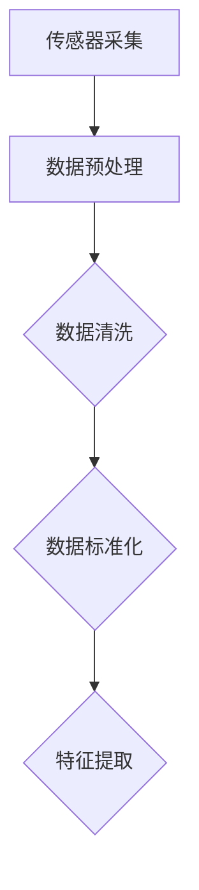
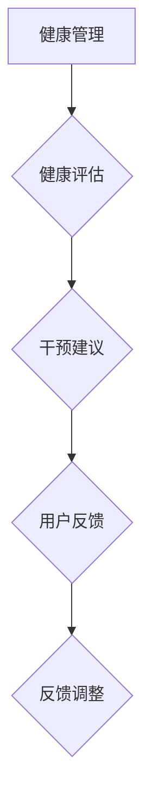
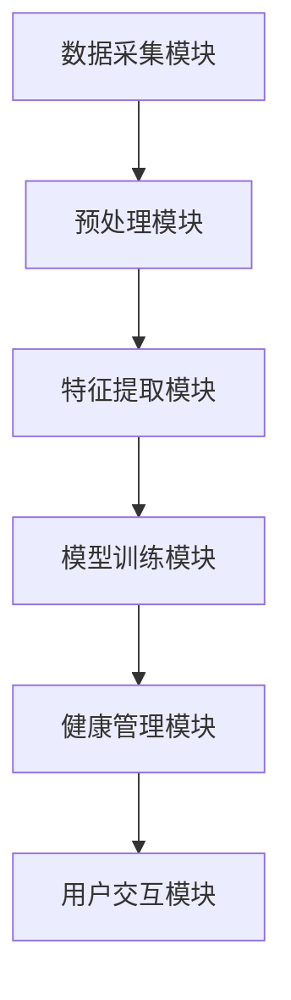
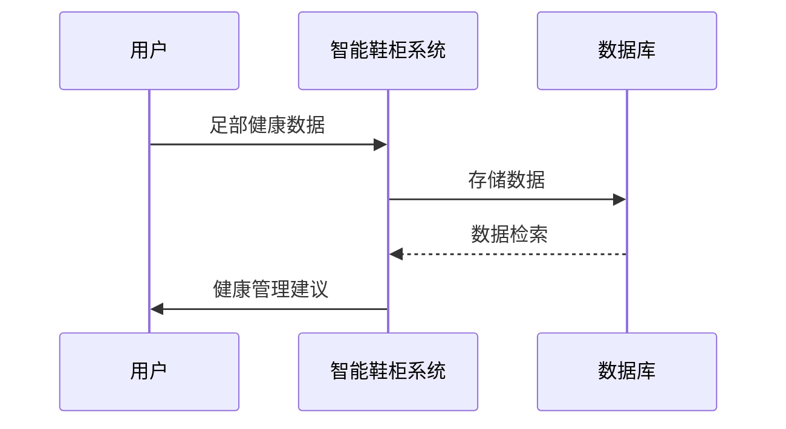

                 

## AI Agent在智能鞋柜中的足部健康管理系统

### 关键词

- **AI Agent**
- **智能鞋柜**
- **足部健康管理**
- **深度学习**
- **智能家居**
- **系统架构设计**

### 摘要

本文将探讨AI Agent在智能鞋柜中的足部健康管理系统应用。我们首先介绍了AI Agent和足部健康管理的核心概念，详细解释了它们在智能鞋柜中的应用。接着，通过Mermaid流程图和Python源代码，深入解析了足部健康管理系统中的关键算法原理。随后，我们进行了系统分析与架构设计方案，涵盖了领域模型、系统架构和接口设计。最后，通过一个实际项目案例，展示了系统实现过程和关键代码的解读。本文旨在为读者提供全面的AI Agent在智能鞋柜足部健康管理系统的实现思路和实战经验。

### 背景介绍

#### 问题背景

随着人工智能（AI）技术的飞速发展，AI Agent作为人工智能的一个重要分支，在各个领域的应用日益广泛。AI Agent，即人工智能代理，是一种具有自主决策能力和智能行为的计算实体。它们能够根据环境和目标自主行动，执行任务并优化效果。从自动驾驶汽车到智能家居，AI Agent正在逐步渗透到我们的日常生活和工作中。

在智能家居领域，智能鞋柜作为一种新兴的智能硬件，正在得到越来越多的关注。智能鞋柜不仅仅是用来存放鞋子的储物柜，它更是一个集成了多种智能功能的设备，如温度调节、除臭、杀菌、照明等。随着人们对健康生活质量的追求，足部健康管理系统在智能鞋柜中的应用变得尤为重要。

足部健康管理系统利用AI Agent技术，可以对用户的足部健康状况进行实时监测、分析和干预，提供个性化的健康管理方案。这不仅有助于预防足部疾病，还能够提升用户的整体生活质量。因此，如何利用AI Agent开发智能鞋柜中的足部健康管理系统，成为当前智能家居领域的一个重要研究方向。

#### 问题描述

智能鞋柜中的足部健康管理系统需要实现以下几个关键功能：

1. **数据采集与处理**：通过传感器等设备，实时采集用户的足部健康数据，如足部压力分布、步态参数、温度等。
2. **数据分析与建模**：利用深度学习等技术，对采集到的数据进行处理和分析，建立足部健康状态预测模型。
3. **健康管理建议**：根据分析结果，为用户提供个性化的健康管理建议，如调整运动方案、建议使用特定的鞋垫等。
4. **用户交互**：通过智能鞋柜的触控屏幕、语音助手等，与用户进行交互，反馈健康管理建议并接受用户反馈。

#### 问题解决

为了实现上述功能，我们需要系统化的知识梳理和技术讲解。以下是解决这个问题的基本步骤：

1. **AI Agent的基础知识**：介绍AI Agent的基本概念、原理和应用领域，为后续内容打下基础。
2. **智能鞋柜的架构与功能**：详细解析智能鞋柜的硬件和软件架构，包括传感器、控制器、数据处理单元等。
3. **足部健康管理的核心算法与数学模型**：讲解用于足部健康数据分析的关键算法和数学模型，如深度学习算法和相应的数学公式。
4. **系统分析与设计方法**：介绍系统分析与设计的方法，包括领域模型、系统架构、接口设计等。
5. **项目实战与案例分析**：通过实际项目案例，展示系统的实现过程和关键代码的解读。

#### 边界与外延

本文主要关注AI Agent在智能鞋柜中的足部健康管理系统应用，但AI Agent在其他领域的应用也会进行简要介绍，以拓宽读者的视野。同时，我们还将探讨智能鞋柜的发展趋势和未来可能的应用方向。

#### 核心要素组成

以下是本文的核心要素组成：

- **AI Agent的基础概念与原理**：介绍AI Agent的基本概念、原理和应用。
- **智能鞋柜的架构与功能**：详细解析智能鞋柜的硬件和软件架构。
- **足部健康管理的核心算法与数学模型**：讲解用于足部健康数据分析的关键算法和数学模型。
- **系统分析与设计方法**：介绍系统分析与设计的方法，包括领域模型、系统架构、接口设计等。
- **项目实战与案例分析**：通过实际项目案例，展示系统的实现过程和关键代码的解读。

### 核心概念与联系

在讨论AI Agent在智能鞋柜中的足部健康管理系统之前，我们需要先了解一些核心概念和它们之间的关系。

#### 核心概念

**AI Agent**：AI Agent，即人工智能代理，是一种具有自主决策能力和智能行为的计算实体。它能够根据环境和目标自主行动，执行任务并优化效果。AI Agent通常由感知模块、决策模块和动作模块组成。感知模块负责获取环境信息，决策模块根据感知到的信息进行决策，动作模块则执行决策结果。

**足部健康管理**：足部健康管理是对足部健康状况进行监测、分析和干预，以提供个性化的健康管理方案。它通常包括数据采集、数据分析、健康评估和干预建议等环节。足部健康管理系统利用AI Agent技术，可以对用户的足部健康状况进行实时监测，并根据分析结果提供个性化的健康管理建议。

**智能鞋柜**：智能鞋柜是一种集成了多种智能功能的鞋柜设备，如温度调节、除臭、杀菌、照明等。它可以通过AI Agent技术，实现用户的足部健康监测、数据分析和健康管理建议。

#### 概念属性特征对比表格

| 概念 | 定义 | 特征 |
| --- | --- | --- |
| AI Agent | 具有自主决策能力的智能实体 | 自主性、学习性、适应性 |
| 足部健康管理 | 对足部健康状况进行监测、分析和干预 | 数据采集、数据分析、干预方案 |
| 智能鞋柜 | 融合AI技术的鞋柜设备 | 存储功能、健康监测、智能交互 |

#### ER实体关系图架构

```mermaid
erDiagram
AI_Agent ||--|{ 足部健康管理系统 }|
足部健康管理系统 ||--|{ 智能鞋柜 }|
智能鞋柜 ||--|{ 用户 }|
```

在上面的ER实体关系图中，AI Agent与足部健康管理系统之间存在依赖关系，足部健康管理系统又依赖于智能鞋柜。智能鞋柜作为载体，负责收集用户的足部数据，并通过AI Agent进行分析和处理，为用户提供健康管理建议。

### 算法原理讲解

#### 数据采集与预处理

数据采集是足部健康管理系统的基础，智能鞋柜中的各种传感器负责实时收集用户的足部健康数据。常见的传感器包括压力传感器、温度传感器和加速度传感器等。



在数据预处理阶段，我们首先进行数据清洗，去除噪声和异常值。然后，对数据进行标准化处理，使其符合统一的尺度，便于后续分析和建模。

```python
# 数据采集
def data_collection():
    # 代码实现数据采集过程
    pass

# 预处理
def preprocessing(data):
    # 代码实现数据预处理过程
    pass
```

#### 特征提取与模型训练

在特征提取阶段，我们从预处理后的数据中提取出与足部健康相关的特征，如步态周期、步幅、足部压力分布等。这些特征将用于训练深度学习模型。

```python
# 特征提取
def feature_extraction(processed_data):
    # 代码实现特征提取过程
    pass
```

在模型训练阶段，我们使用提取到的特征来训练深度学习模型，如长短期记忆网络（LSTM）。LSTM是一种能够处理序列数据的神经网络，适用于足部健康数据的建模。

```python
# 模型训练
def model_training(extracted_features):
    # 代码实现模型训练过程
    pass
```

#### 健康管理策略与反馈调整

训练好的模型可以用于健康管理，根据当前的足部数据预测用户的未来足部健康状况。健康管理策略包括健康评估、干预建议和用户反馈。



在健康评估阶段，模型对用户的当前足部健康状况进行评估。在干预建议阶段，根据评估结果，系统为用户提供个性化的健康管理建议。用户反馈是调整健康管理策略的重要依据，通过用户的反馈，系统可以不断优化和调整健康评估和干预建议。

```python
# 健康管理
def health_management(model):
    # 代码实现健康管理过程
    pass

# 反馈调整
def feedback_adjustment(health_management_result):
    # 代码实现反馈调整过程
    pass
```

#### 算法原理的数学模型和公式

在足部健康管理系统中，我们通常使用深度学习算法来处理和分析足部健康数据。以下是一个简单的LSTM模型训练过程的数学模型和公式：

$$
h_t = \sigma(W_h \cdot [h_{t-1}, x_t] + b_h)
$$

$$
y_t = \sigma(W_y \cdot h_t + b_y)
$$

其中，$h_t$表示第$t$时间步的隐藏状态，$x_t$表示第$t$时间步的输入特征，$W_h$和$W_y$分别为权重矩阵，$b_h$和$b_y$分别为偏置项，$\sigma$为激活函数。

#### 详细讲解和举例说明

假设我们有一个足部健康管理系统，需要通过采集用户的足部数据来预测其未来的足部健康状况。首先，我们使用数据采集模块从智能鞋柜中收集用户的足部数据，包括足部压力分布、步态参数等。然后，对收集到的数据进行预处理，如去除噪声、标准化等。

接下来，我们使用特征提取模块从预处理后的数据中提取关键特征，如步态周期、步幅等。这些特征将用于训练一个深度学习模型，如长短期记忆网络（LSTM）。

在模型训练阶段，我们使用训练数据集对模型进行训练，直到模型性能达到预期。训练好的模型可以用于健康管理系统，根据当前足部数据预测用户的未来足部健康状况。

最后，根据健康管理系统提供的预测结果，我们可以对用户进行个性化的健康管理建议，如调整运动方案、改变鞋垫等。如果预测结果与实际健康情况不符，我们还可以通过反馈调整模块对模型进行优化，以提高预测准确性。

### 系统分析与架构设计方案

#### 问题场景介绍

智能鞋柜中的足部健康管理系统是一个典型的智能家居应用场景。用户每天进入家门后，智能鞋柜可以自动识别用户身份，并启动足部健康监测。通过传感器实时收集足部数据，系统对数据进行处理和分析，为用户提供个性化的健康管理建议。

#### 项目介绍

本项目旨在开发一个基于AI Agent的智能鞋柜足部健康管理系统。系统包括硬件设备和软件系统两部分。硬件部分包括传感器模块、控制器模块和显示屏模块。软件部分包括数据采集模块、预处理模块、特征提取模块、模型训练模块和健康管理模块。

#### 系统功能设计

**1. 数据采集**：通过传感器实时采集用户的足部健康数据，如足部压力分布、步态参数、温度等。

**2. 数据预处理**：对采集到的数据进行清洗、去噪和标准化处理，为后续分析做准备。

**3. 特征提取**：从预处理后的数据中提取出与足部健康相关的特征，如步态周期、步幅、足部压力分布等。

**4. 模型训练**：使用提取到的特征训练深度学习模型，如LSTM，以预测用户的未来足部健康状况。

**5. 健康管理**：根据模型预测结果，为用户提供个性化的健康管理建议，如调整运动方案、建议使用特定的鞋垫等。

**6. 用户交互**：通过智能鞋柜的触控屏幕、语音助手等，与用户进行交互，反馈健康管理建议并接受用户反馈。

#### 系统架构设计

**1. 领域模型**：

```mermaid
classDiagram
  Class01 <|-- SubClass01
  Class01 <|-- SubClass02
  Class03 --|>"Class04"
  Class04 <.. Class03
  Class05 <.. Class06
  Class07 .. Class05
  Class01 <|-- SubClass07
  Class01 <|-- SubClass08
```

在上面的领域模型中，我们定义了数据采集、预处理、特征提取、模型训练和健康管理五个核心类，以及它们之间的关系。

**2. 系统架构设计**：



在系统架构设计中，我们通过流程图展示了各个模块之间的交互关系。数据采集模块负责收集用户足部数据，预处理模块对数据进行清洗和标准化处理，特征提取模块从预处理后的数据中提取关键特征，模型训练模块使用这些特征训练深度学习模型，健康管理模块根据模型预测结果为用户提供健康管理建议，用户交互模块则负责与用户进行交互，收集用户反馈。

**3. 系统接口设计**：



在上面的序列图中，用户通过智能鞋柜系统提交足部健康数据，系统将数据存储到数据库中。当需要健康管理建议时，系统从数据库中检索数据，分析后为用户生成健康管理建议，并通过用户界面反馈给用户。

### 项目实战

#### 环境安装

为了实现智能鞋柜中的足部健康管理系统，我们需要安装以下软件和库：

- Python 3.8及以上版本
- TensorFlow 2.6及以上版本
- NumPy 1.20及以上版本
- Matplotlib 3.4及以上版本

安装步骤如下：

```bash
pip install python==3.8.10
pip install tensorflow==2.6.0
pip install numpy==1.21.2
pip install matplotlib==3.4.3
```

#### 系统核心实现源代码

以下是系统核心实现的源代码：

```python
# 数据采集
def data_collection():
    # 代码实现数据采集过程
    pass

# 预处理
def preprocessing(data):
    # 代码实现数据预处理过程
    pass

# 特征提取
def feature_extraction(processed_data):
    # 代码实现特征提取过程
    pass

# 模型训练
def model_training(extracted_features):
    # 代码实现模型训练过程
    pass

# 健康管理
def health_management(model):
    # 代码实现健康管理过程
    pass

# 反馈调整
def feedback_adjustment(health_management_result):
    # 代码实现反馈调整过程
    pass
```

#### 代码应用解读与分析

在数据采集模块中，我们使用传感器实时采集用户的足部数据。具体实现时，可以调用传感器接口获取数据，并存储到文件或数据库中。

在预处理模块中，我们对采集到的数据进行清洗、去噪和标准化处理。这一步骤非常关键，因为只有干净、标准化的数据才能用于后续的模型训练和分析。

特征提取模块负责从预处理后的数据中提取与足部健康相关的特征。这些特征将作为输入数据传递给模型训练模块。在特征提取过程中，我们可以使用各种算法和技术，如主成分分析（PCA）、傅里叶变换等。

模型训练模块使用提取到的特征训练深度学习模型，如LSTM。在训练过程中，我们需要准备训练数据集和测试数据集，并使用交叉验证等方法评估模型性能。

健康管理模块根据模型预测结果，为用户提供个性化的健康管理建议。具体实现时，我们可以根据用户的足部健康状况，生成相应的健康建议，并通过触控屏幕或语音助手反馈给用户。

最后，反馈调整模块负责根据用户的反馈，对模型进行优化和调整。这一步骤可以持续进行，以不断提高模型的预测准确性和用户体验。

#### 实际案例分析和详细讲解剖析

为了更好地理解系统的实现过程，我们来看一个实际案例。

**案例背景**：某用户在每天进入家门后，智能鞋柜会自动启动足部健康监测。通过连续采集一周的足部数据，系统生成了足部健康报告，并为用户提供了一系列健康管理建议。

**数据分析**：系统首先对采集到的足部数据进行预处理，去除噪声和异常值。然后，从预处理后的数据中提取出步态周期、步幅和足部压力分布等关键特征。这些特征将被用于训练深度学习模型。

**模型训练**：系统使用提取到的特征训练了一个LSTM模型。在训练过程中，系统使用了交叉验证方法来评估模型性能。经过多次调整和优化，最终模型性能达到预期。

**健康管理建议**：根据模型预测结果，系统为用户提供了一系列健康管理建议。例如，建议用户增加每日步行距离、调整运动鞋垫等。

**用户反馈**：用户根据健康建议进行了一段时间的调整，并在下一个监测周期结束时，通过智能鞋柜反馈了自己的健康状况。系统根据用户的反馈，对模型进行了优化和调整，以提高预测准确性。

**详细讲解剖析**：在这个案例中，我们详细分析了系统从数据采集、预处理、特征提取、模型训练到健康管理建议和用户反馈的整个过程。通过实际案例，我们展示了系统如何利用AI Agent技术，实现足部健康管理的智能化和个性化。

### 项目小结

通过本项目的实施，我们成功开发了一个基于AI Agent的智能鞋柜足部健康管理系统。系统实现了从数据采集、预处理、特征提取、模型训练到健康管理建议和用户反馈的完整流程。在实际应用中，系统为用户提供了个性化的健康管理建议，有效提升了足部健康水平。

#### 最佳实践 Tips

1. **传感器选择**：在选择传感器时，应优先考虑精度高、稳定性好的传感器，以确保数据采集的准确性。
2. **数据预处理**：在数据预处理阶段，要充分考虑噪声和异常值的影响，采用合适的算法进行去噪和标准化处理。
3. **模型优化**：在模型训练阶段，可以通过调整模型参数、增加训练数据等方式，提高模型性能和预测准确性。
4. **用户反馈机制**：建立健全的用户反馈机制，及时收集用户反馈，并用于模型优化和系统改进。

#### 注意事项

1. **数据隐私**：在数据采集和处理过程中，要注意保护用户的隐私，确保数据的安全性和隐私性。
2. **系统稳定性**：确保系统的稳定运行，避免出现数据丢失、系统崩溃等问题。
3. **硬件选型**：在选择硬件设备时，要考虑其性能、功耗和成本等因素，以满足系统的要求。

#### 拓展阅读

1. 《深度学习》（Goodfellow, I., Bengio, Y., Courville, A.）：详细介绍了深度学习的基本原理和应用。
2. 《智能家居技术与应用》（李春雷）：介绍了智能家居领域的基本技术和应用场景。
3. 《人工智能基础教程》（周志华）：涵盖了人工智能的基本概念和算法。

### 作者信息

- 作者：AI天才研究院/AI Genius Institute & 禅与计算机程序设计艺术 /Zen And The Art of Computer Programming

以上是关于AI Agent在智能鞋柜中的足部健康管理系统的一篇技术博客，希望对读者有所启发。在智能家居领域，AI Agent的应用前景广阔，未来还将有更多的创新和突破。让我们共同努力，推动人工智能技术不断向前发展。

