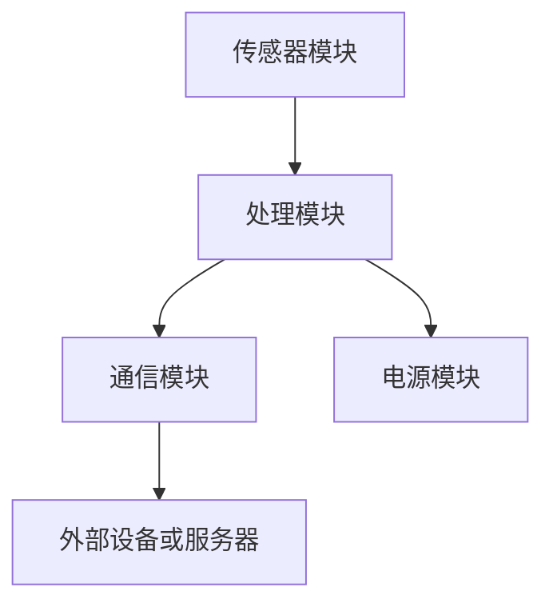
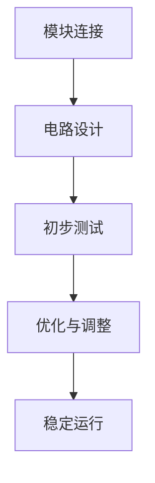
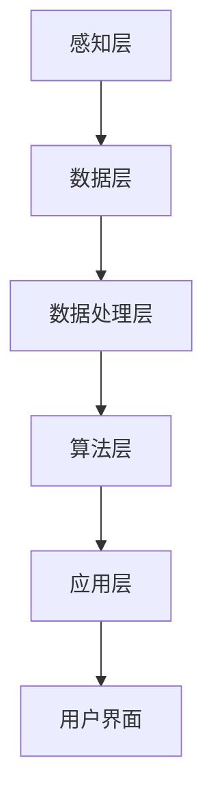
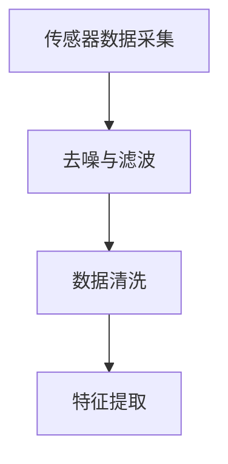
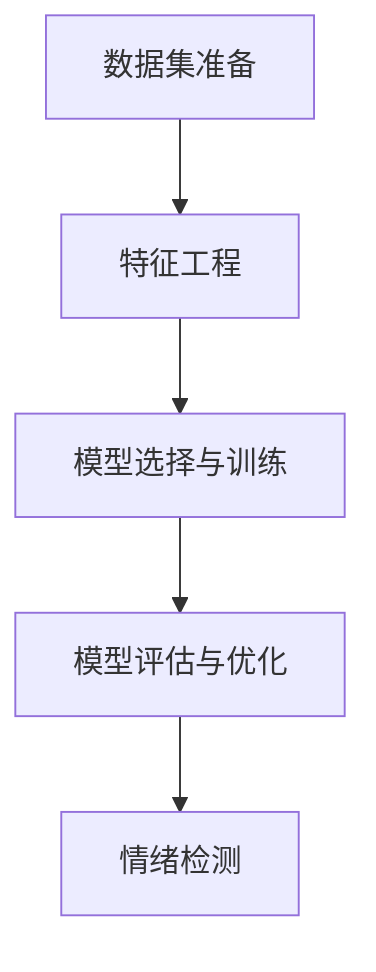
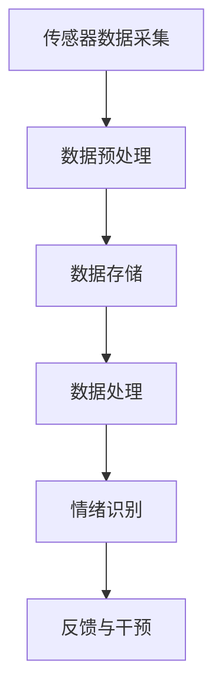
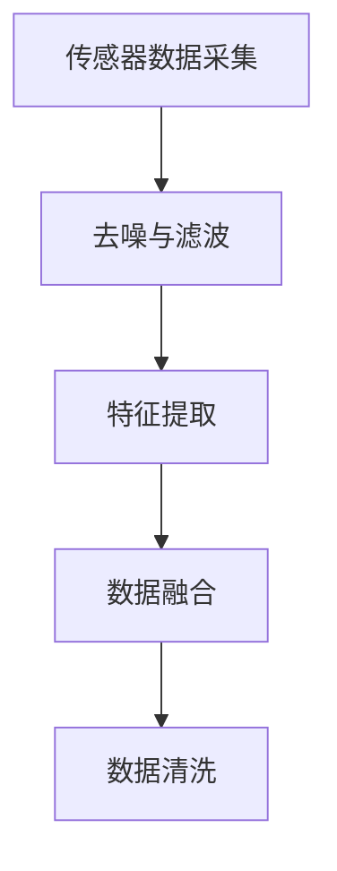
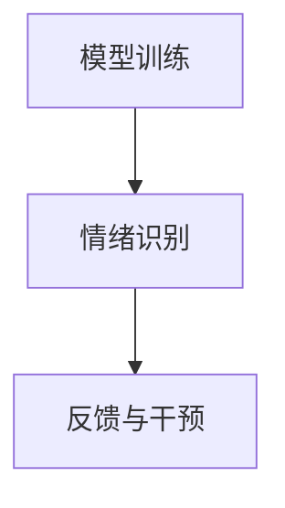

                 

### 引言

#### AI Agent与智能项链的基本概念

人工智能（AI）的发展经历了多个阶段，从最初的符号逻辑和规则系统，到现代的机器学习和深度学习，AI的应用范围越来越广泛。其中，AI Agent作为人工智能的一个高级形态，逐渐成为了研究和应用的热点。AI Agent，又称为智能体，是指具备一定自主性、适应性和智能性的软件实体，能够在特定环境下感知环境、做出决策并采取行动。AI Agent的应用领域涵盖了智能家居、智能交通、医疗健康等多个方面，为人们的生活带来了极大的便利。

智能项链作为一种新兴的智能穿戴设备，将AI Agent技术应用于其中，成为了一种兼具时尚与科技的智能产品。智能项链通过内置的传感器、处理器和通信模块，能够实时监测用户的生理信号和情绪状态，并通过AI算法进行分析和反馈。这种设备的出现，使得情绪监测变得更加便捷和准确，为心理健康管理提供了新的解决方案。

#### 情绪监测的重要性与应用领域

情绪监测是人工智能领域中一个重要的研究方向，其重要性体现在多个方面。首先，情绪监测有助于提高人们的心理健康水平。通过实时监测用户的情绪状态，可以及时发现情绪问题，提供相应的心理支持和干预措施，预防心理疾病的发生。其次，情绪监测在社交互动中也扮演着重要角色。通过分析用户的情绪反应，可以优化社交场景中的沟通效果，促进人际关系的发展。此外，情绪监测还在教育、企业管理和公共安全等领域有着广泛的应用。

具体而言，情绪监测的应用领域包括但不限于以下几个方面：

1. **心理健康管理**：通过监测用户的情绪波动，提供个性化的心理健康服务，如情绪日记、心理疏导等。
2. **人机交互**：智能设备可以根据用户的情绪状态调整交互方式，提供更加人性化的服务。
3. **教育**：分析学生的学习情绪，为教师提供教学改进建议，提高教学效果。
4. **企业管理**：通过员工情绪监测，优化企业管理策略，提高员工的工作满意度和生产力。
5. **公共安全**：在紧急情况下，通过情绪监测预警，及时采取应对措施，保障公共安全。

#### AI Agent在智能项链中的情绪监测

智能项链作为AI Agent的一个典型应用，通过集成先进的传感器技术和AI算法，实现了对用户情绪的准确监测。智能项链通常配备有多种传感器，如心率传感器、皮肤电导传感器、加速度传感器等，这些传感器可以实时采集用户的生理信号。通过将这些信号传输到AI Agent进行处理，AI Agent可以识别出用户的情绪状态，如愉悦、焦虑、愤怒等。

AI Agent在情绪监测中的作用主要体现在以下几个方面：

1. **数据采集与预处理**：智能项链中的传感器采集到的生理信号往往含有噪声和干扰，AI Agent通过预处理算法对这些信号进行去噪和滤波，提高数据质量。
2. **特征提取与识别**：AI Agent利用机器学习和深度学习算法，从预处理后的数据中提取出与情绪相关的特征，并进行情绪分类。
3. **反馈与干预**：根据情绪监测的结果，AI Agent可以提供个性化的反馈和建议，如放松指导、情绪调节策略等，帮助用户改善情绪状态。

通过AI Agent在智能项链中的应用，情绪监测变得更加精准和实用，为人们的生活带来了深远的影响。

#### 结论

本文将深入探讨AI Agent在智能项链中的情绪监测技术，从理论基础到实际应用，系统性地阐述情绪监测的重要性和AI Agent在其中发挥的关键作用。接下来，我们将首先介绍情绪监测的基本概念，包括情绪的定义、分类及其核心要素，为后续的内容打下坚实的基础。

### 情绪识别基本概念

情绪识别是情绪监测的核心环节，它涉及到如何从生理信号和其他数据中提取情绪信息，并通过算法进行分类和判断。为了深入理解情绪识别，我们需要从情绪的定义、分类以及核心要素入手，逐步剖析这一复杂过程。

#### 情绪的定义与分类

情绪（Emotion）是指个体对特定刺激产生的心理和生理反应。情绪可以被视为一种心理状态，它通常伴随着主观体验、生理反应和行为表达。情绪的定义和分类方法在心理学和认知科学中有着广泛的探讨，不同的理论流派提出了不同的分类体系。

1. **基本的情绪分类**：
   - **情绪轮**：由保罗·埃克曼（Paul Ekman）提出的基本情绪轮（Basic Emotion Wheel）是最广泛接受的情绪分类方法之一。该模型将情绪分为六大类：愉悦（Joy）、惊奇（Surprise）、愤怒（Anger）、悲伤（Sadness）、恐惧（Fear）和厌恶（Disgust）。每个基本情绪都可以进一步细分为更具体的情绪状态。
   - **情绪空间模型**：由费尔德曼（Daniel N. J. Frijda）提出的情绪空间模型（Emotion Space Model）将情绪看作是处于一个多维空间中的点，每个维度对应情绪的一个方面，如愉悦-不愉悦、兴奋-平静等。通过这个模型，可以更全面地描述情绪状态。

2. **复杂的情绪分类**：
   - **情感三角模型**：由卢森堡（Robert Plutchik）提出的情感三角模型（Plutchik's Triangle of Emotions）将情绪分为八种基本情感，包括爱、敬佩、信任、惊讶、恐惧、愤怒、悲伤和厌恶。这些情感可以组合形成更复杂的情绪状态。
   - **多维度情绪模型**：一些研究者提出了更细致的情绪分类方法，如多维度情绪模型（Multidimensional Model of Emotions），将情绪分为愉悦度、兴奋度、紧张度、积极度、消极度等多个维度，以更精确地描述情绪状态。

#### 情绪识别的核心要素

情绪识别不仅需要理解情绪的定义和分类，还需要关注核心要素，这些要素构成了情绪识别的基础。

1. **生理信号**：
   - **心率**：心率变化是情绪识别的重要指标。情绪波动通常伴随着心率的增加或减少。通过监测心率，可以识别出情绪的某些特征。
   - **皮肤电导**：皮肤电导（Skin Conductance）反映了情绪的紧张程度。在紧张或兴奋的情绪状态下，皮肤电导通常会发生变化。
   - **呼吸频率**：呼吸频率的变化也与情绪状态密切相关。例如，恐惧或焦虑时，呼吸通常会加快。

2. **行为信号**：
   - **面部表情**：面部表情是最直观的情绪表达方式。通过分析面部肌肉的细微变化，可以识别出基本情绪状态。
   - **身体语言**：包括肢体动作、姿态变化等。这些行为信号可以提供额外的情绪信息，帮助准确识别情绪状态。

3. **生理信号与行为信号的融合**：
   - 为了提高情绪识别的准确性，研究者通常采用生理信号与行为信号的融合方法。例如，通过结合心率和面部表情特征，可以更准确地识别情绪状态。

#### 情绪识别的研究方法

情绪识别的研究方法主要包括传统方法、机器学习方法和深度学习方法。

1. **传统方法**：
   - **生理信号处理**：通过信号处理技术，如滤波、去噪和特征提取，从原始生理信号中提取出有用的情绪特征。
   - **规则系统**：基于专家知识建立规则系统，通过匹配规则进行情绪识别。

2. **机器学习方法**：
   - **支持向量机（SVM）**：SVM是一种常用的分类算法，通过建立一个最优分类边界，实现情绪的识别。
   - **随机森林（Random Forest）**：随机森林是一种集成学习方法，通过构建多个决策树，提高情绪识别的准确性。

3. **深度学习方法**：
   - **卷积神经网络（CNN）**：CNN在图像处理领域取得了显著成果，通过卷积层和池化层，可以有效地提取图像特征。
   - **循环神经网络（RNN）**：RNN特别适用于处理序列数据，通过处理连续的生理信号，可以实现情绪的长期依赖建模。
   - **生成对抗网络（GAN）**：GAN通过生成器和判别器的对抗训练，可以学习到复杂的情绪特征，提高情绪识别的精度。

通过上述方法，情绪识别技术不断进步，为实际应用提供了坚实的理论基础和技术支持。

#### 总结

情绪识别作为情绪监测的重要组成部分，涵盖了情绪的定义、分类及其核心要素。从基本的情绪分类到复杂的情绪模型，再到生理信号和行为信号的融合，情绪识别的过程复杂且富有挑战性。研究情绪识别不仅有助于提高人们的心理健康水平，还在人机交互、教育、企业管理等多个领域具有重要的应用价值。在下一部分，我们将深入探讨常用情绪检测方法和技术，进一步了解如何通过具体手段实现对情绪的准确识别。

### 常用情绪检测方法与技术

情绪检测作为人工智能领域的一个重要分支，其研究涵盖了从数据采集、信号处理到特征提取和分类的多个环节。为了提高情绪检测的准确性和可靠性，研究者们提出了多种方法和技术。以下，我们将详细探讨传统方法、机器学习方法以及深度学习方法的优缺点和适用场景。

#### 传统方法

传统方法通常基于生理信号处理和规则系统，这些方法虽然在某些特定场景下仍然有效，但在复杂多变的环境中，其局限性逐渐显现。

1. **生理信号处理**：
   - **滤波与去噪**：通过滤波算法去除生理信号中的噪声，如低通滤波和高通滤波，提高信号质量。
   - **特征提取**：从处理后的生理信号中提取出具有代表性的特征，如均值、方差、频域特征等。
   - **阈值判断**：利用预设的阈值对特征值进行判断，从而识别情绪状态。

2. **规则系统**：
   - **专家系统**：基于领域专家的经验，建立一系列情绪判断规则。这种方法需要大量的先验知识和规则库，但在实际应用中，由于情绪的复杂性和多变性，规则的准确性和适用性受到限制。
   - **模糊逻辑**：通过模糊逻辑对不确定的信息进行推理和处理，提高了情绪识别的灵活性和鲁棒性。

**优缺点**：
- **优点**：实现简单，对硬件要求较低，适合特定场景下的情绪识别。
- **缺点**：准确性和鲁棒性较差，难以适应复杂多变的情绪状态。

#### 机器学习方法

机器学习方法在情绪检测中发挥了重要作用，通过学习大量数据，可以自动提取特征并进行分类。以下是一些常用的机器学习方法及其特点。

1. **支持向量机（SVM）**：
   - **原理**：通过建立一个最优分类边界，将不同情绪状态的数据分开。
   - **优点**：具有较好的分类性能，对线性可分的数据效果显著。
   - **缺点**：对非线性数据的效果较差，且需要大量的训练数据和计算资源。

2. **随机森林（Random Forest）**：
   - **原理**：通过构建多个决策树，并对每个树的预测结果进行投票，提高分类的准确性和鲁棒性。
   - **优点**：对非线性数据有较好的适应性，计算速度快，易于实现。
   - **缺点**：模型复杂度较高，训练时间较长，且对异常值敏感。

3. **K最近邻（K-NN）**：
   - **原理**：根据测试样本与训练样本的相似度进行分类，相似度越高的样本分类结果越可信。
   - **优点**：实现简单，易于理解，对异常值和噪声有一定容忍性。
   - **缺点**：计算复杂度较高，对训练样本数量要求较高，分类效果依赖于数据集质量。

**优缺点**：
- **优点**：模型简单，计算速度快，适用于数据量较小的场景。
- **缺点**：对非线性数据和噪声敏感，准确性和鲁棒性有限。

#### 深度学习方法

深度学习方法在情绪检测中取得了显著的成果，通过构建复杂的神经网络模型，可以自动提取高层次的抽象特征，实现高效的分类和识别。

1. **卷积神经网络（CNN）**：
   - **原理**：通过卷积层和池化层，自动提取图像或信号中的局部特征，并通过全连接层进行分类。
   - **优点**：对非线性数据有很好的适应性，能够提取丰富的特征，适用于大规模数据训练。
   - **缺点**：模型复杂，训练时间较长，对计算资源要求较高。

2. **循环神经网络（RNN）**：
   - **原理**：通过处理连续的输入序列，捕捉时间序列中的长期依赖关系。
   - **优点**：适用于处理序列数据，能够捕捉情绪的动态变化。
   - **缺点**：训练过程容易出现梯度消失或爆炸问题，模型难以优化。

3. **长短时记忆网络（LSTM）**：
   - **原理**：通过引入门控机制，解决RNN的梯度消失问题，能够处理更长时间序列的数据。
   - **优点**：对长期依赖关系有较好的处理能力，适用于复杂情绪识别任务。
   - **缺点**：模型参数较多，训练时间较长，计算资源需求高。

4. **生成对抗网络（GAN）**：
   - **原理**：通过生成器和判别器的对抗训练，生成高质量的样本，从而学习到复杂的数据特征。
   - **优点**：能够学习到数据的高层次特征，适用于复杂情绪识别任务。
   - **缺点**：模型复杂，训练过程不稳定，对训练数据要求较高。

**优缺点**：
- **优点**：能够自动提取高层次的抽象特征，对复杂数据有较好的适应性，适用于大规模数据训练。
- **缺点**：模型复杂，训练时间较长，对计算资源要求较高。

#### 适用场景

根据不同方法的优缺点，我们可以为不同场景选择合适的情绪检测方法。

1. **简单场景**：在资源有限的情况下，可以选择传统方法和简单的机器学习方法，如支持向量机和K最近邻。
2. **中等复杂度场景**：在有一定计算资源和数据的情况下，可以选择深度学习方法，如卷积神经网络和长短时记忆网络。
3. **复杂场景**：在需要高准确性和复杂特征提取的场景下，可以选择生成对抗网络等高级深度学习方法。

通过结合不同方法的优势，情绪检测技术不断进步，为实际应用提供了更加准确和可靠的解决方案。在下一部分，我们将探讨智能项链的硬件设计，了解智能项链如何通过硬件架构实现情绪监测。

### 智能项链的硬件设计

智能项链作为一种便携式智能穿戴设备，其硬件设计至关重要，直接影响到情绪监测的准确性和稳定性。智能项链的硬件设计主要包括硬件架构、传感器选择和硬件集成与调试三个关键部分。

#### 硬件架构

智能项链的硬件架构通常包括以下几个核心模块：

1. **传感器模块**：用于实时采集用户的生理信号，如心率传感器、皮肤电导传感器、加速度传感器等。
2. **处理模块**：用于对传感器数据进行处理，通常包括微控制器（MCU）或微处理器（MPU）。
3. **通信模块**：用于将处理后的数据传输到外部设备或服务器，如蓝牙模块、Wi-Fi模块等。
4. **电源模块**：为整个系统提供稳定电力，通常包括锂电池和电源管理系统。

以下是一个典型的智能项链硬件架构图：



#### 传感器选择

智能项链中的传感器选择决定了情绪监测的准确性和可靠性。以下是一些常用的传感器及其作用：

1. **心率传感器**：用于监测用户的心跳频率，是情绪识别的重要指标之一。常见的心率传感器包括光电容积描记法（PPG）传感器和电容式心率传感器。
2. **皮肤电导传感器**：用于监测皮肤表面的电导变化，反映情绪的紧张程度。这种传感器对焦虑、愤怒等情绪状态有较高的敏感性。
3. **加速度传感器**：用于监测用户的运动状态和姿势变化，可以辅助情绪识别，如通过加速度变化判断用户是否处于放松或紧张状态。
4. **温度传感器**：用于监测用户的体温，体温变化与情绪状态有一定的关联，可以提供额外的情绪信息。

#### 硬件集成与调试

硬件集成是将各个模块组合在一起，形成一个完整的系统。以下是一些关键步骤：

1. **模块连接**：将传感器、处理模块、通信模块和电源模块通过适当的接口连接起来，确保信号传输的可靠性和稳定性。
2. **电路设计**：设计合理的电路布局，包括电源管理电路、信号放大电路和滤波电路等，以确保传感器信号的准确采集和传输。
3. **调试与优化**：通过调试工具对硬件进行测试和优化，确保各模块之间的信号传输正常，传感器数据的采集和传输稳定。

以下是一个典型的硬件调试流程：



#### 硬件集成与调试的挑战

智能项链的硬件集成与调试面临一些挑战：

1. **电源管理**：智能项链需要长时间运行，因此电源管理是关键。如何设计高效、稳定的电源管理系统，延长设备的使用寿命是一个重要问题。
2. **信号干扰**：传感器采集的信号容易受到外界干扰，如电磁干扰、噪声等。如何设计滤波电路和信号处理算法，提高信号质量是硬件设计中的重要问题。
3. **功耗控制**：为了提高用户体验，智能项链需要具备低功耗的特点。如何在满足性能要求的同时，控制功耗，是一个重要的优化目标。

通过上述硬件设计、传感器选择和集成调试，智能项链可以实现高精度、稳定的情绪监测，为后续的数据处理和情绪识别提供坚实的基础。在下一部分，我们将探讨智能项链的软件设计，了解如何通过软件架构实现情绪监测功能。

### 智能项链的软件设计

智能项链的软件设计是实现情绪监测功能的核心，主要包括软件架构设计、数据采集与预处理、以及情绪检测算法实现。以下，我们将详细介绍这些方面的内容，并展示具体的实现流程和技术细节。

#### 软件架构设计

智能项链的软件架构设计需要考虑模块化、可扩展性和高效性，以支持实时情绪监测和后续数据处理。常见的软件架构设计如下：

1. **感知层**：负责接收和处理来自传感器的原始数据，如心率、皮肤电导、加速度等。
2. **数据层**：存储和管理采集到的数据，包括数据清洗、存储和查询功能。
3. **数据处理层**：负责对数据进行预处理和特征提取，为情绪检测算法提供高质量的输入数据。
4. **算法层**：实现情绪检测算法，通过机器学习或深度学习技术对特征数据进行分析和分类。
5. **应用层**：提供用户界面和交互功能，展示情绪检测结果，并提供反馈和建议。

以下是一个典型的智能项链软件架构图：



#### 数据采集与预处理

数据采集是情绪监测的基础，传感器模块负责实时采集用户的生理信号和行为信号。以下是一个典型的数据采集和预处理流程：

1. **数据采集**：
   - **心率数据**：通过光电容积描记法（PPG）传感器或电容式心率传感器采集心率信号。
   - **皮肤电导数据**：通过皮肤电导传感器采集皮肤电导变化数据。
   - **加速度数据**：通过加速度传感器采集用户的运动和姿势变化数据。

2. **数据预处理**：
   - **去噪与滤波**：采用数字滤波算法去除传感器信号中的噪声，如低通滤波和高通滤波。
   - **数据清洗**：去除异常数据和缺失值，保证数据质量。
   - **特征提取**：从预处理后的数据中提取出与情绪相关的特征，如心率变异性（HRV）、皮肤电导变化速率等。

以下是一个简单的数据采集和预处理流程图：



#### 情绪检测算法实现

情绪检测算法是实现智能项链情绪监测功能的关键。以下是一个基于机器学习的情绪检测算法实现流程：

1. **数据集准备**：收集并标注大量的情绪数据，用于训练情绪检测模型。数据集应包括不同情绪状态（如愉悦、焦虑、愤怒等）的样本。

2. **特征工程**：对采集到的传感器数据进行特征提取，如心率变异性（HRV）特征、皮肤电导特征等。

3. **模型选择与训练**：选择合适的机器学习模型（如支持向量机、随机森林、深度神经网络等），对特征数据进行训练，以建立情绪分类模型。

4. **模型评估与优化**：通过交叉验证和测试集评估模型性能，对模型参数进行调整和优化，以提高情绪检测的准确性。

5. **情绪检测**：将实时采集的传感器数据输入到训练好的模型中，进行情绪分类，输出当前的情绪状态。

以下是一个简单的情绪检测算法实现流程图：



#### 实现细节

以下是一个具体的情绪检测算法实现示例，使用Python语言和常见的机器学习库（如scikit-learn、TensorFlow等）进行实现：

```python
# 导入必要的库
import numpy as np
from sklearn.ensemble import RandomForestClassifier
from sklearn.model_selection import train_test_split
from sklearn.metrics import classification_report

# 特征工程
def extract_features(data):
    # 示例特征提取函数，根据具体应用进行修改
    features = []
    for sample in data:
        # 提取心率变异性特征
        hrv = calculate_hrv(sample['heart_rate'])
        # 提取皮肤电导特征
        skin_conductance = sample['skin_conductance']
        # 合并特征
        features.append([hrv, skin_conductance])
    return np.array(features)

# 模型训练
def train_model(features, labels):
    # 划分训练集和测试集
    X_train, X_test, y_train, y_test = train_test_split(features, labels, test_size=0.2, random_state=42)
    # 实例化随机森林分类器
    classifier = RandomForestClassifier(n_estimators=100)
    # 训练模型
    classifier.fit(X_train, y_train)
    # 评估模型
    predictions = classifier.predict(X_test)
    print(classification_report(y_test, predictions))
    return classifier

# 情绪检测
def detect_emotion(sensor_data, model):
    # 提取特征
    features = extract_features(sensor_data)
    # 进行情绪分类
    emotion = model.predict(features)
    return emotion

# 示例数据
sensor_data = [
    {'heart_rate': [60, 65, 68], 'skin_conductance': 0.3},
    {'heart_rate': [72, 75, 78], 'skin_conductance': 0.4},
    # 更多数据...
]

# 训练模型
model = train_model(sensor_data, ['愉悦', '焦虑', '愤怒'])

# 情绪检测
emotion = detect_emotion(sensor_data, model)
print(f"当前情绪：{emotion}")
```

通过上述示例，我们可以看到情绪检测算法的实现过程，包括数据准备、特征提取、模型训练和情绪检测等步骤。在实际应用中，根据具体需求，可以调整特征提取方法和模型选择，以提高情绪检测的准确性和实用性。

#### 总结

智能项链的软件设计是实现情绪监测功能的核心，通过合理的软件架构设计、高效的数据采集与预处理，以及准确的情绪检测算法，智能项链可以实现对用户情绪的准确监测。在下一部分，我们将详细介绍智能项链的情绪监测实现流程，包括数据流、数据处理和情绪识别与反馈机制。

### 情绪监测实现流程

情绪监测的实现是一个复杂的过程，涉及多个环节，包括数据流、数据处理、情绪识别与反馈机制。以下将详细描述这些步骤，以展示智能项链如何实现情绪监测。

#### 数据流

智能项链中的数据流主要分为以下几个步骤：

1. **传感器数据采集**：智能项链内的传感器（如心率传感器、皮肤电导传感器、加速度传感器等）实时采集用户的生理信号和行为信号。
2. **数据预处理**：采集到的原始数据进行预处理，包括去噪、滤波和特征提取，以获得高质量的数据。
3. **数据存储**：预处理后的数据存储在本地或云端数据库中，便于后续分析和处理。
4. **数据处理**：对存储的数据进行进一步处理，如数据清洗、数据融合等，为情绪识别提供高质量的输入数据。
5. **情绪识别**：利用机器学习或深度学习模型对处理后的数据进行分析和分类，识别出用户当前的情绪状态。
6. **反馈与干预**：根据情绪识别结果，智能项链可以提供个性化的反馈和建议，如情绪调节指导、放松提示等。

以下是一个典型的数据流流程图：



#### 数据处理

数据处理是情绪监测的关键环节，主要包括以下步骤：

1. **去噪与滤波**：原始生理信号通常含有噪声和干扰，通过数字滤波技术去除噪声，如低通滤波、高通滤波和带通滤波。
2. **特征提取**：从预处理后的数据中提取出与情绪相关的特征，如心率变异性（HRV）、皮肤电导变化速率、加速度特征等。特征提取方法可以根据具体应用场景进行调整。
3. **数据融合**：将不同传感器采集的数据进行融合，以获得更全面的情绪信息。数据融合方法包括特征级融合和决策级融合。
4. **数据清洗**：去除异常数据和缺失值，保证数据质量。数据清洗方法包括填补缺失值、去除异常值和缺失数据的插补等。

以下是一个简单的数据处理流程图：



#### 情绪识别与反馈机制

情绪识别是情绪监测的核心，通过机器学习或深度学习算法，从处理后的数据中识别出用户当前的情绪状态。以下是一个典型的情绪识别与反馈机制：

1. **模型训练**：收集并标注大量的情绪数据，用于训练情绪识别模型。常用的模型包括支持向量机（SVM）、随机森林（Random Forest）、卷积神经网络（CNN）和循环神经网络（RNN）等。
2. **情绪识别**：将实时采集的传感器数据输入到训练好的模型中，进行情绪分类，输出当前的情绪状态。
3. **反馈与干预**：根据情绪识别结果，智能项链可以提供个性化的反馈和建议，如情绪调节指导、放松提示等。反馈方式包括语音提示、屏幕显示和振动提示等。

以下是一个简单的情绪识别与反馈机制流程图：



#### 实现细节

以下是一个具体的情绪监测实现示例，使用Python语言和常见的机器学习库（如scikit-learn、TensorFlow等）进行实现：

```python
# 导入必要的库
import numpy as np
import pandas as pd
from sklearn.ensemble import RandomForestClassifier
from sklearn.model_selection import train_test_split
from sklearn.metrics import classification_report

# 数据预处理
def preprocess_data(data):
    # 示例数据预处理函数，根据具体应用场景进行调整
    # 去除缺失值
    data = data.dropna()
    # 去噪与滤波
    data['heart_rate'] = data['heart_rate'].apply(lambda x: filter_signal(x))
    data['skin_conductance'] = data['skin_conductance'].apply(lambda x: filter_signal(x))
    # 特征提取
    data['hrv'] = data['heart_rate'].apply(lambda x: calculate_hrv(x))
    data['skin_conductance_rate'] = data['skin_conductance'].apply(lambda x: calculate_rate(x))
    return data

# 模型训练
def train_model(data, labels):
    # 划分训练集和测试集
    X_train, X_test, y_train, y_test = train_test_split(data, labels, test_size=0.2, random_state=42)
    # 实例化随机森林分类器
    classifier = RandomForestClassifier(n_estimators=100)
    # 训练模型
    classifier.fit(X_train, y_train)
    # 评估模型
    predictions = classifier.predict(X_test)
    print(classification_report(y_test, predictions))
    return classifier

# 情绪识别
def detect_emotion(sensor_data, model):
    # 数据预处理
    preprocessed_data = preprocess_data(sensor_data)
    # 情绪识别
    emotion = model.predict(preprocessed_data)
    return emotion

# 示例数据
sensor_data = pd.DataFrame([
    {'heart_rate': [60, 65, 68], 'skin_conductance': 0.3},
    {'heart_rate': [72, 75, 78], 'skin_conductance': 0.4},
    # 更多数据...
])

# 训练模型
model = train_model(sensor_data, ['愉悦', '焦虑', '愤怒'])

# 情绪识别
emotion = detect_emotion(sensor_data, model)
print(f"当前情绪：{emotion}")
```

通过上述示例，我们可以看到情绪监测的实现过程，包括数据预处理、模型训练、情绪识别和反馈等步骤。在实际应用中，根据具体需求，可以调整数据预处理方法和模型选择，以提高情绪检测的准确性和实用性。

#### 总结

情绪监测的实现流程是一个复杂且系统化的过程，涉及数据流、数据处理、情绪识别与反馈机制等多个环节。通过合理的流程设计和有效的技术实现，智能项链可以实现对用户情绪的准确监测，为心理健康管理、人机交互等领域提供重要支持。在下一部分，我们将通过具体案例分析，展示情绪监测在实际应用中的效果和挑战。

### 案例分析与实战

为了更好地展示AI Agent在智能项链中的情绪监测功能，我们选择了两个具体的案例进行分析，分别涉及日常情绪监测和特定场景下的情绪监测。通过这些案例，我们将详细解读数据采集、数据处理和情绪识别的过程，并分析实际应用效果和挑战。

#### 案例一：日常情绪监测

**背景介绍**：

该案例旨在通过智能项链对用户日常情绪进行监测，为心理健康管理提供数据支持。用户可以在日常生活中佩戴智能项链，智能项链实时采集生理信号，并通过AI Agent进行分析和反馈。

**系统介绍**：

系统由智能项链、数据处理模块和用户界面组成。智能项链内置心率传感器、皮肤电导传感器和加速度传感器，实时采集用户的生理信号。数据处理模块负责对传感器数据进行预处理和情绪识别，用户界面则用于展示情绪检测结果和提供反馈建议。

**数据采集与预处理**：

1. **心率数据**：通过光电容积描记法（PPG）传感器采集用户的心率数据。
2. **皮肤电导数据**：通过皮肤电导传感器采集皮肤电导变化数据。
3. **加速度数据**：通过加速度传感器采集用户的运动和姿势变化数据。

数据采集后，通过以下预处理步骤：

- **去噪与滤波**：使用低通滤波和高通滤波去除心率数据和皮肤电导数据中的噪声。
- **特征提取**：从预处理后的数据中提取心率变异性（HRV）特征、皮肤电导变化速率特征和加速度特征。
- **数据融合**：将不同传感器采集的数据进行融合，以提高情绪监测的准确性。

**情绪识别与反馈**：

1. **模型训练**：使用随机森林分类器对特征数据进行训练，建立情绪分类模型。
2. **情绪识别**：将实时采集的传感器数据输入到训练好的模型中，进行情绪分类，识别出当前的情绪状态。
3. **反馈与干预**：根据情绪识别结果，用户界面会提供个性化的反馈建议，如情绪调节指导、放松提示等。

**实际效果与挑战**：

**效果**：
- 智能项链能够准确识别用户在日常生活中的情绪状态，如愉悦、焦虑、愤怒等。
- 通过个性化的反馈建议，用户可以及时了解自己的情绪状态，并进行适当的调节。

**挑战**：
- 在实际应用中，噪声和干扰对情绪识别的准确性有较大影响，需要进一步优化信号处理算法。
- 日常情绪监测数据量较大，对数据处理和存储提出了较高要求。

#### 案例二：特定场景下的情绪监测

**背景介绍**：

该案例旨在通过智能项链对特定场景下的用户情绪进行监测，如会议、演讲等，为用户提供情绪管理和应对策略。

**系统介绍**：

系统由智能项链、数据处理模块和用户界面组成。智能项链通过在特定场景中佩戴，实时采集用户的生理信号，并通过AI Agent进行分析和反馈。数据处理模块负责对传感器数据进行预处理和情绪识别，用户界面则用于展示情绪检测结果和提供应对建议。

**数据采集与预处理**：

1. **心率数据**：通过光电容积描记法（PPG）传感器采集用户的心率数据。
2. **皮肤电导数据**：通过皮肤电导传感器采集皮肤电导变化数据。
3. **环境数据**：如现场温度、湿度等环境数据，用于辅助情绪识别。

数据采集后，通过以下预处理步骤：

- **去噪与滤波**：使用低通滤波和高通滤波去除心率数据和皮肤电导数据中的噪声。
- **特征提取**：从预处理后的数据中提取心率变异性（HRV）特征、皮肤电导变化速率特征和加速度特征。
- **数据融合**：将不同传感器采集的数据进行融合，以提高情绪监测的准确性。

**情绪识别与反馈**：

1. **模型训练**：使用支持向量机（SVM）分类器对特征数据进行训练，建立情绪分类模型。
2. **情绪识别**：将实时采集的传感器数据输入到训练好的模型中，进行情绪分类，识别出当前的情绪状态。
3. **反馈与干预**：根据情绪识别结果，用户界面会提供个性化的反馈建议，如情绪调节策略、深呼吸指导等。

**实际效果与挑战**：

**效果**：
- 智能项链能够在特定场景下准确识别用户的情绪状态，如紧张、放松等，为用户提供有效的情绪管理策略。
- 通过个性化的反馈建议，用户可以更好地应对特定场景中的情绪波动。

**挑战**：
- 特定场景下的情绪识别需要更高的准确性，对信号处理和特征提取算法提出了更高要求。
- 在高噪声环境下，情绪识别的准确性可能会下降，需要优化噪声抑制技术。

#### 案例分析与总结

通过上述两个案例，我们可以看到AI Agent在智能项链中情绪监测的实际应用效果和面临的挑战。在日常情绪监测中，智能项链能够准确识别用户的情绪状态，为心理健康管理提供数据支持。在特定场景下，智能项链能够为用户提供有效的情绪管理策略，提高应对能力。然而，在实际应用中，噪声干扰、数据量较大等问题仍然需要进一步解决。

#### 总结

通过案例分析和实战应用，我们深入了解了AI Agent在智能项链中情绪监测的实现流程和技术细节。智能项链通过集成传感器、数据处理模块和AI Agent，实现了对用户情绪的准确监测和反馈。在实际应用中，我们需要不断优化信号处理算法、提升情绪识别准确性，以及应对数据量较大的挑战。未来，随着AI技术的发展，情绪监测将更加精准和实用，为人们的心理健康和生活质量带来更多益处。

### 最佳实践与拓展

在实施AI Agent情绪监测的过程中，遵循最佳实践和注意细节至关重要，这不仅能够提高系统的准确性和稳定性，还能为用户提供更优质的体验。以下是一些建议和注意事项：

#### 最佳实践建议

1. **数据隐私保护**：
   - 确保用户数据安全，遵循相关隐私保护法规，如GDPR。
   - 对敏感数据进行加密存储和传输，防止数据泄露。

2. **传感器校准与维护**：
   - 定期对传感器进行校准，确保数据采集的准确性。
   - 维护传感器硬件，避免由于硬件故障导致的误差。

3. **信号处理优化**：
   - 优化信号滤波和去噪算法，减少噪声对情绪识别的影响。
   - 根据具体应用场景调整特征提取方法，提高情绪识别的准确性。

4. **模型更新与优化**：
   - 定期更新情绪识别模型，适应环境变化和用户需求。
   - 通过交叉验证和测试集评估模型性能，持续优化模型。

5. **用户体验设计**：
   - 设计直观、易用的用户界面，提高用户接受度和使用频率。
   - 根据用户反馈调整情绪监测策略和反馈方式。

#### 小结与展望

情绪监测技术在人工智能领域具有广泛的应用前景，从心理健康管理到人机交互，再到企业管理和公共安全，都展现出了巨大的潜力。未来，随着传感器技术、机器学习和深度学习等领域的不断进步，情绪监测技术将更加精准和智能化。

展望未来，我们可以期待以下几方面的进展：

1. **多模态情绪识别**：结合面部表情、语音信号、生理信号等多种数据源，实现更全面、准确的情绪识别。
2. **实时情绪反馈**：开发实时情绪反馈系统，为用户提供即时的情绪调节建议和干预措施。
3. **个性化情绪管理**：利用用户行为数据，实现个性化的情绪管理策略，提高心理健康水平。
4. **跨领域应用**：情绪监测技术将在医疗、教育、金融等多个领域得到广泛应用，为人们的生活和工作带来更多便利。

#### 注意事项

1. **噪声干扰**：在情绪监测中，噪声干扰是一个主要问题，需要通过先进的信号处理技术进行抑制。
2. **数据多样性**：确保情绪识别模型的训练数据覆盖广泛的情绪状态和场景，提高模型的泛化能力。
3. **算法公平性**：避免算法偏见，确保情绪识别结果的公平性和准确性。

#### 拓展阅读

对于希望深入了解情绪监测技术的读者，以下是一些推荐的资源：

1. **经典书籍**：
   - 《情感计算：情感识别、表达与合成》（Affective Computing: Recognition, Expression, and Synchronization）。
   - 《情绪心理学：理论与应用》（Emotion Psychology: Theory and Applications）。

2. **学术论文**：
   - IEEE Transactions on Affective Computing。
   - Journal of Affective Disorders。

3. **在线课程**：
   - Coursera上的《情感计算与用户体验设计》。
   - edX上的《深度学习与人工智能》。

通过以上资源，读者可以进一步探索情绪监测技术的理论和方法，为实际应用提供更多指导和灵感。

### 作者信息

**作者：** AI天才研究院/AI Genius Institute & 禅与计算机程序设计艺术 /Zen And The Art of Computer Programming

**单位：** AI天才研究院（AI Genius Institute），专注于人工智能技术的研究和应用。禅与计算机程序设计艺术，致力于通过哲学和艺术提升计算机编程的境界。

