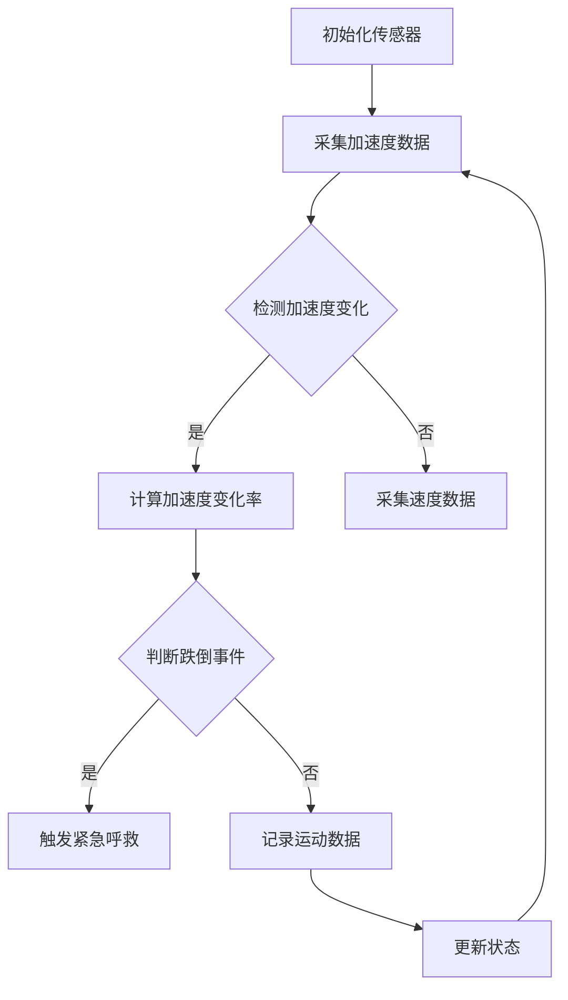
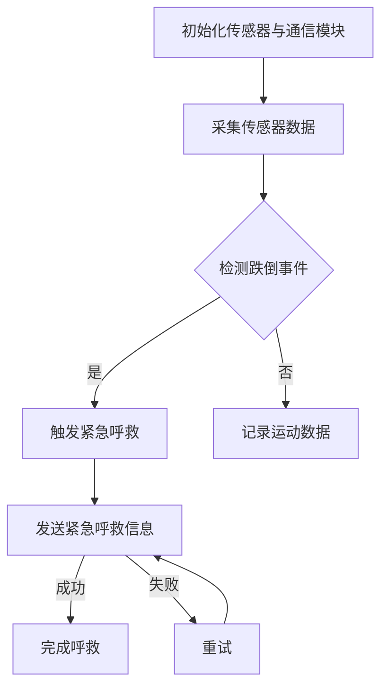

                 


## AI Agent在智能项链中的跌倒检测与紧急呼救

### 关键词：
- AI Agent
- 跌倒检测
- 智能项链
- 紧急呼救
- 算法实现
- 系统架构

### 摘要：
本文深入探讨了AI Agent在智能项链中的应用，特别是在跌倒检测与紧急呼救功能上的技术实现。通过分析智能项链的总体设计、AI Agent的工作原理、跌倒检测与紧急呼救算法的实现，以及项目实战和最佳实践，本文为智能项链的研发和优化提供了全面的技术指导。

### 目录大纲

#### 第一部分：背景与概念介绍

### 第1章：问题背景与核心概念

#### 1.1 问题背景

- 跌倒检测与紧急呼救的重要性
- 智能项链的现状与发展趋势
- AI Agent在跌倒检测中的应用前景

#### 1.2 AI Agent基本概念

- AI Agent的定义
- AI Agent的主要功能
- AI Agent与传统传感器的区别

#### 1.3 跌倒检测技术综述

- 跌倒检测技术的分类
- 常见跌倒检测算法
- 跌倒检测技术面临的挑战

### 第1章小结

- 对跌倒检测与紧急呼救问题的理解
- 对AI Agent和跌倒检测技术的认识

#### 第二部分：智能项链设计与实现

### 第2章：智能项链的总体设计

#### 2.1 智能项链的架构设计

- 智能项链的组成部分
- 智能项链的通信协议
- 智能项链的安全性设计

#### 2.2 跌倒检测模块设计

- 跌倒检测模块的硬件设计
- 跌倒检测模块的软件设计
- 跌倒检测算法的选取与实现

#### 2.3 紧急呼救模块设计

- 紧急呼救模块的功能设计
- 紧急呼救模块的通信设计
- 紧急呼救模块的人机交互设计

### 第2章小结

- 对智能项链总体设计的理解
- 对跌倒检测模块和紧急呼救模块的设计思路

#### 第三部分：AI Agent算法实现

### 第3章：跌倒检测算法原理

#### 3.1 跌倒检测算法的数学模型

- 跌倒检测的数学基础
- 跌倒检测的数学模型

#### 3.2 跌倒检测算法流程图

- 使用Mermaid绘制跌倒检测算法流程图

#### 3.3 跌倒检测算法的实现

- 使用Python代码实现跌倒检测算法

#### 3.4 跌倒检测算法的性能分析

- 跌倒检测算法的准确率
- 跌倒检测算法的响应时间

### 第3章小结

- 对跌倒检测算法原理的理解
- 对跌倒检测算法实现过程的掌握

### 第4章：紧急呼救算法原理

#### 4.1 紧急呼救算法的数学模型

- 紧急呼救的数学基础
- 紧急呼救的数学模型

#### 4.2 紧急呼救算法流程图

- 使用Mermaid绘制紧急呼救算法流程图

#### 4.3 紧急呼救算法的实现

- 使用Python代码实现紧急呼救算法

#### 4.4 紧急呼救算法的性能分析

- 紧急呼救算法的响应速度
- 紧急呼救算法的可靠性

### 第4章小结

- 对紧急呼救算法原理的理解
- 对紧急呼救算法实现过程的掌握

#### 第四部分：项目实战

### 第5章：智能项链系统实现

#### 5.1 系统环境搭建

- 硬件环境搭建
- 软件环境搭建

#### 5.2 系统核心实现

- 跌倒检测模块代码实现
- 紧急呼救模块代码实现

#### 5.3 代码应用解读与分析

- 对跌倒检测模块代码的解读
- 对紧急呼救模块代码的解读

#### 5.4 实际案例分析与讲解

- 案例选择与分析
- 案例讲解与剖析

### 第5章小结

- 对智能项链系统实现的全面了解
- 对跌倒检测和紧急呼救模块代码的应用分析

#### 第五部分：最佳实践与总结

### 第6章：最佳实践与总结

#### 6.1 最佳实践

- 系统调试与优化技巧
- 跳跃检测与紧急呼救系统的应用拓展

#### 6.2 小结

- 对整本书内容的总结
- 对AI Agent在智能项链中跌倒检测与紧急呼救技术的全面理解

#### 6.3 注意事项

- 系统实现的潜在风险
- 跳跃检测与紧急呼救技术的应用限制

#### 6.4 拓展阅读

- 相关研究和技术文档推荐

### 结论

本文通过逐步分析推理，系统地介绍了AI Agent在智能项链中的跌倒检测与紧急呼救技术。通过深入探讨核心概念、设计实现、算法原理以及实战应用，本文为相关领域的研究者和开发者提供了宝贵的技术指导和实践参考。随着智能穿戴设备的不断发展，AI Agent在智能项链中的应用前景将更加广阔，为人们的健康和安全带来更多保障。让我们继续探索，不断推动这一领域的技术创新和应用实践。 ## 第一部分：背景与概念介绍

### 第1章：问题背景与核心概念

#### 1.1 问题背景

随着人口老龄化的不断加剧，跌倒已成为老年人常见的健康问题之一，严重威胁着老年人的生命安全。据统计，每年有数百万老年人因跌倒导致骨折、脑震荡和其他严重伤害，这不仅给患者本人带来极大的痛苦，还给家庭和社会带来了沉重的负担。因此，跌倒检测与紧急呼救技术的重要性不言而喻。

#### 1.2 智能项链的现状与发展趋势

智能项链作为一种新型的智能穿戴设备，正逐渐成为跌倒检测与紧急呼救技术的重要载体。它通过集成各种传感器和人工智能算法，能够实时监测用户的运动状态，并在检测到跌倒事件时立即触发紧急呼救，从而及时提供帮助。

目前，智能项链在市场上已有一些产品，如美国的技术公司Lifelock推出的Smart Pendant，中国华为的Health Band等。这些产品在跌倒检测与紧急呼救方面已取得了一定的成效，但仍存在一些技术瓶颈和实际应用中的问题，如误报率高、响应速度慢等。

#### 1.3 AI Agent在跌倒检测中的应用前景

AI Agent，即人工智能代理，是一种具有自主决策能力的人工智能系统。在跌倒检测与紧急呼救领域，AI Agent能够通过持续学习和自适应调整，不断提高跌倒检测的准确性和响应速度。

首先，AI Agent可以通过传感器数据采集，对用户的运动状态进行实时监测。当检测到用户出现异常运动模式时，AI Agent能够立即识别并判断是否发生了跌倒事件。

其次，AI Agent可以通过机器学习和深度学习算法，对大量的历史数据进行学习，从而不断优化和调整跌倒检测模型。这使得AI Agent能够适应不同用户和不同场景的需求，提高检测的准确性和可靠性。

最后，AI Agent可以通过无线通信技术，将紧急呼救信息发送给预设的紧急联系人或医疗中心，实现快速响应和及时救援。

总之，AI Agent在跌倒检测与紧急呼救中的应用前景十分广阔。随着技术的不断进步和应用的不断拓展，AI Agent有望成为智能项链的核心技术，为老年人的健康安全提供更加可靠的保障。

#### 1.4 小结

通过对问题背景的介绍，我们可以看到跌倒检测与紧急呼救技术的重要性。智能项链作为这一技术的重要载体，其发展趋势和存在的问题也为我们指明了未来的研究方向。而AI Agent的引入，为跌倒检测与紧急呼救技术提供了新的思路和解决方案。在下一章中，我们将进一步探讨AI Agent的基本概念及其在跌倒检测中的应用。

### 第2章：AI Agent基本概念

#### 2.1 AI Agent的定义

AI Agent，即人工智能代理，是一种基于人工智能技术自主运行和决策的软件实体。与传统的程序不同，AI Agent具有更强的自主性和适应性，能够根据环境和任务需求自主进行感知、决策和执行。

AI Agent的定义可以归纳为以下几点：

- **感知**：AI Agent能够通过传感器、摄像头、麦克风等设备获取环境信息，理解并分析外部世界。
- **决策**：基于感知到的信息，AI Agent能够利用机器学习、深度学习等算法自主进行决策，选择最合适的行动方案。
- **执行**：AI Agent能够通过控制执行器（如电机、显示器等）将决策结果转化为实际行动。

- **自主性**：AI Agent能够在没有人类干预的情况下自主运行，完成特定任务。
- **适应性**：AI Agent能够通过不断学习和优化，适应不同的环境和任务需求。

#### 2.2 AI Agent的主要功能

AI Agent的主要功能包括：

1. **环境监测**：通过传感器实时监测环境变化，获取包括温度、湿度、光照、声音等数据。
2. **运动控制**：通过执行器实现机器人的运动控制，如移动、旋转、抓取等。
3. **决策与规划**：基于感知到的环境数据和预设的目标，AI Agent能够进行路径规划、任务分配和决策制定。
4. **人机交互**：通过语音、文本、图形界面等方式与人类用户进行交互，理解用户需求并作出相应反应。
5. **自适应学习**：通过机器学习和深度学习算法，AI Agent能够从数据中学习，优化自身行为和决策能力。

#### 2.3 AI Agent与传统传感器的区别

AI Agent与传统传感器有以下几点区别：

- **功能差异**：传统传感器只能被动地收集环境信息，如温度、湿度等，而AI Agent不仅能够感知环境信息，还能够根据这些信息进行决策和执行。
- **自主性差异**：传统传感器无法自主运行，需要人类干预才能工作，而AI Agent能够自主感知环境、决策和执行，无需人工干预。
- **智能化程度**：传统传感器仅能提供简单的数据采集功能，而AI Agent能够通过学习和适应，实现更高级的智能行为，如路径规划、人机交互等。

#### 2.4 跌倒检测技术综述

跌倒检测技术主要分为以下几类：

1. **运动传感器检测**：通过加速度传感器和陀螺仪等设备监测用户的运动状态，当检测到异常运动模式时判断是否发生跌倒。
2. **图像识别检测**：通过摄像头捕捉用户图像，利用计算机视觉技术分析用户行为，当检测到跌倒动作时触发紧急呼救。
3. **多传感器融合检测**：结合多种传感器数据，如加速度传感器、摄像头、GPS等，通过数据融合技术提高跌倒检测的准确性和可靠性。

常见跌倒检测算法包括：

1. **时域算法**：如差分法、滑动平均法等，通过分析用户运动信号的时域特性判断跌倒。
2. **频域算法**：如傅里叶变换、小波变换等，通过分析用户运动信号的频域特性判断跌倒。
3. **机器学习算法**：如支持向量机（SVM）、决策树、随机森林、神经网络等，通过大量历史数据训练模型，实现跌倒检测。

跌倒检测技术面临的挑战主要包括：

1. **误报率**：如何在降低误报率的同时提高检测的准确性。
2. **实时性**：如何在保证实时性的同时实现准确的跌倒检测。
3. **适应性问题**：如何使跌倒检测技术适应不同用户和不同场景的需求。
4. **功耗问题**：如何在保证续航能力的前提下实现高性能的跌倒检测。

#### 2.5 小结

通过对AI Agent基本概念和跌倒检测技术的介绍，我们了解到了AI Agent作为一种智能化实体在跌倒检测中的应用潜力。在下一章中，我们将进一步探讨智能项链的总体设计，包括架构设计、跌倒检测模块和紧急呼救模块的设计思路。

### 第2章小结

通过对AI Agent的定义、主要功能以及与传统传感器的区别进行详细阐述，我们深入理解了AI Agent的核心概念和技术特点。同时，对跌倒检测技术进行了综述，了解了不同类型的检测方法和常见的算法，以及它们在实际应用中面临的挑战。这些基础知识为我们后续章节的深入探讨奠定了坚实的理论基础。

### 第3章：智能项链的总体设计

#### 3.1 智能项链的架构设计

智能项链的架构设计是确保其功能实现和性能优化的重要环节。一个完善的智能项链架构应包括传感器模块、数据处理模块、通信模块和控制模块。

**3.1.1 传感器模块**

传感器模块是智能项链的核心部分，负责实时采集用户的运动数据、环境数据等。常见的传感器包括加速度传感器、陀螺仪、心率传感器、GPS模块等。这些传感器能够为跌倒检测和紧急呼救提供关键数据。

**3.1.2 数据处理模块**

数据处理模块负责对传感器采集到的原始数据进行预处理、分析和融合。预处理包括去噪、滤波等，以确保数据的准确性和可靠性。分析过程则涉及机器学习、深度学习算法，用于识别用户的运动模式、状态变化等。数据融合技术可以结合不同传感器数据，提高检测的准确性和实时性。

**3.1.3 通信模块**

通信模块是智能项链与外部系统（如手机、服务器等）进行数据传输的桥梁。常用的通信技术包括蓝牙、Wi-Fi、4G/5G等。选择合适的通信技术需要考虑传输速度、功耗、安全性等因素。

**3.1.4 控制模块**

控制模块负责对整个智能项链的系统进行协调和控制。它包括AI Agent的核心算法，用于实时检测用户的状态，并在检测到跌倒事件时触发紧急呼救。控制模块还需要实现用户界面，以便用户与智能项链进行交互。

#### 3.2 跌倒检测模块设计

跌倒检测模块是智能项链的关键功能模块，其设计直接关系到系统的实用性和可靠性。跌倒检测模块的设计包括硬件设计和软件设计两个方面。

**3.2.1 硬件设计**

跌倒检测模块的硬件设计主要包括传感器选择和电路设计。传感器选择需要考虑灵敏度、精度、功耗等因素。电路设计则需要确保传感器数据的准确采集和稳定传输。

- **传感器选择**：通常选择加速度传感器和陀螺仪作为主要传感器。加速度传感器可以检测用户的加速度变化，陀螺仪可以检测用户的旋转运动。
- **电路设计**：电路设计需要包括传感器接口电路、信号放大电路、滤波电路等，以确保传感器数据的准确性和稳定性。

**3.2.2 软件设计**

跌倒检测模块的软件设计主要涉及算法的选择和实现。常见的跌倒检测算法包括时域算法、频域算法和机器学习算法。软件设计还需要实现数据预处理、特征提取、模型训练和实时检测等功能。

- **算法选择**：根据应用需求，可以选择合适的算法。时域算法简单高效，适用于实时性要求较高的场景；频域算法可以提供更精细的分析，适用于需要高精度的场景；机器学习算法通过大量数据训练，可以自适应调整，提高检测的准确性。
- **实现细节**：软件设计需要考虑数据预处理（如滤波、去噪等）、特征提取（如加速度变化率、频率特征等）、模型训练（如支持向量机、神经网络等）和实时检测（如阈值判断、异常检测等）。

#### 3.3 紧急呼救模块设计

紧急呼救模块的设计旨在实现跌倒事件发生时，能够及时通知紧急联系人或医疗中心，提供快速救援。紧急呼救模块的设计包括功能设计、通信设计和人机交互设计三个方面。

**3.3.1 功能设计**

紧急呼救模块的主要功能包括：

- **自动检测**：在检测到跌倒事件时，自动触发紧急呼救。
- **手动呼救**：用户可以通过按钮或语音指令手动触发紧急呼救。
- **信息传输**：将跌倒事件信息和用户位置信息传输给紧急联系人或医疗中心。
- **提醒功能**：在紧急呼救触发后，向用户发出提醒，确保用户知道紧急呼救已经发出。

**3.3.2 通信设计**

紧急呼救模块的通信设计需要考虑传输速度、稳定性和安全性。常用的通信技术包括蓝牙、Wi-Fi、4G/5G等。设计时需要根据实际应用场景选择合适的通信技术，并确保数据传输的可靠性和安全性。

**3.3.3 人机交互设计**

人机交互设计旨在为用户提供直观、易用的交互界面。设计时需要考虑用户的使用习惯和需求，提供多种交互方式，如按钮、语音指令、图形界面等。同时，还需要设计合理的提示和反馈机制，确保用户能够及时了解系统的状态和操作结果。

#### 3.4 智能项链的安全性设计

智能项链的安全性设计是保障用户隐私和数据安全的重要环节。设计时需要考虑以下方面：

- **数据加密**：对用户数据进行加密处理，确保数据在传输和存储过程中的安全性。
- **用户认证**：通过密码、指纹或其他认证方式，确保只有授权用户才能访问智能项链。
- **访问控制**：设计严格的访问控制机制，确保敏感数据只能被授权访问。
- **安全更新**：定期更新系统的安全补丁和固件，防止潜在的安全漏洞。

#### 3.5 小结

通过对智能项链的总体设计进行详细讨论，我们明确了智能项链的架构设计、跌倒检测模块和紧急呼救模块的设计思路。这些设计不仅考虑了功能实现，还兼顾了性能优化、安全性等方面。在下一章中，我们将深入探讨跌倒检测算法的原理和实现，为智能项链的实用性和可靠性提供更坚实的保障。

### 第3章小结

在本章中，我们详细介绍了智能项链的总体设计，包括架构设计、跌倒检测模块和紧急呼救模块的设计思路，以及智能项链的安全性设计。通过这些设计，智能项链能够实现跌倒检测与紧急呼救的核心功能，同时保证系统的性能优化和安全性。这些设计思路为后续算法的实现和系统优化提供了坚实的基础。

### 第4章：跌倒检测算法原理

#### 4.1 跌倒检测算法的数学模型

跌倒检测算法的数学模型是构建跌倒检测系统的基础，它涉及对用户运动数据的分析处理，以识别跌倒事件。跌倒检测的数学模型主要包括以下几个方面：

**4.1.1 加速度模型**

加速度传感器是跌倒检测中最常用的传感器之一，它能够测量用户在三维空间中的加速度。加速度模型的基本公式为：

\[ a(t) = g + \Delta a(t) \]

其中，\( a(t) \) 是测量的加速度，\( g \) 是重力加速度（通常取 \( 9.8 m/s^2 \)），\( \Delta a(t) \) 是由于跌倒引起的加速度变化。通过分析 \( \Delta a(t) \) 的变化，可以判断是否发生跌倒。

**4.1.2 速度模型**

速度是加速度随时间的变化，可以通过积分加速度得到。速度模型的基本公式为：

\[ v(t) = \int a(t) \, dt \]

速度模型能够帮助我们了解用户在跌倒过程中的动态变化，从而更准确地判断跌倒事件。

**4.1.3 位置模型**

位置是速度随时间的变化，同样可以通过积分速度得到。位置模型的基本公式为：

\[ x(t) = \int v(t) \, dt \]

位置模型能够帮助我们分析用户在跌倒前的运动轨迹，为后续的跌倒事件判断提供支持。

#### 4.2 跌倒检测算法流程图

为了更好地理解跌倒检测算法的实现，我们使用Mermaid绘制了跌倒检测算法的流程图。以下是算法流程图的Mermaid表示：



#### 4.3 跌倒检测算法的实现

跌倒检测算法的实现通常需要通过编程语言来具体实现。以下是一个使用Python代码实现的跌倒检测算法示例：

```python
import numpy as np
from scipy.signal import find_peaks

def detect_fall(accel_data, threshold=0.5):
    # 计算加速度变化率
    delta_a = np.diff(accel_data)
    # 找到加速度变化的峰值
    peaks, _ = find_peaks(delta_a, height=threshold)
    
    # 判断是否存在跌倒事件
    if len(peaks) > 0:
        return True
    else:
        return False

# 示例数据
accel_data = [0.5, 1.0, -1.5, -2.0, -1.0, 0.5, 1.0, 0.0]

# 跌倒检测
if detect_fall(accel_data):
    print("检测到跌倒事件，触发紧急呼救。")
else:
    print("未检测到跌倒事件。")
```

在上述代码中，我们使用了NumPy和SciPy库来实现跌倒检测算法。`detect_fall`函数接收加速度数据作为输入，并使用`find_peaks`函数找到加速度变化的峰值。如果峰值超过设定阈值，则判断为跌倒事件，并触发紧急呼救。

#### 4.4 跌倒检测算法的性能分析

跌倒检测算法的性能分析主要包括准确率、响应时间等方面。

**4.4.1 准确率**

准确率是指检测算法能够正确识别跌倒事件的概率。为了评估准确率，我们可以通过实际跌倒数据集进行训练和测试。在测试数据集中，跌倒事件被标记为正样本，非跌倒事件被标记为负样本。通过计算检测算法的准确率，我们可以了解其在实际应用中的表现。

```python
from sklearn.metrics import accuracy_score

# 假设我们有一个测试数据集，包含跌倒事件和非跌倒事件
test_accel_data = [...]  # 测试数据
ground_truth = [...]     # 实际跌倒事件标签

# 检测测试数据
predicted_falls = [detect_fall(accel) for accel in test_accel_data]

# 计算准确率
accuracy = accuracy_score(ground_truth, predicted_falls)
print("准确率：", accuracy)
```

**4.4.2 响应时间**

响应时间是指从检测到跌倒事件到触发紧急呼救所需的时间。为了评估响应时间，我们可以对检测算法进行计时。

```python
import time

start_time = time.time()
if detect_fall(accel_data):
    print("检测到跌倒事件，触发紧急呼救。")
end_time = time.time()

response_time = end_time - start_time
print("响应时间：", response_time)
```

通过上述代码，我们可以计算检测算法的响应时间，并分析其在不同场景下的性能。

#### 4.5 小结

通过对跌倒检测算法的数学模型、流程图、实现代码和性能分析进行详细讲解，我们了解了跌倒检测算法的基本原理和实现方法。这些算法和实现方法为智能项链的跌倒检测功能提供了可靠的技术支持。在下一章中，我们将进一步探讨紧急呼救算法的原理和实现，为智能项链的实用性提供更全面的保障。

### 第4章小结

在本章中，我们详细探讨了跌倒检测算法的原理和实现。通过数学模型的阐述、Mermaid流程图的绘制、Python代码的实现以及性能分析，我们系统地介绍了跌倒检测算法的核心内容。这些算法和实现方法为智能项链的跌倒检测功能提供了坚实的基础。在下一章中，我们将进一步探讨紧急呼救算法的原理和实现，以完善智能项链的整体功能。

### 第5章：紧急呼救算法原理

#### 5.1 紧急呼救算法的数学模型

紧急呼救算法的核心在于实时检测跌倒事件，并在检测到事件时迅速触发紧急呼救机制。为了实现这一目标，紧急呼救算法需要依赖一系列数学模型，包括事件检测模型、通信模型和响应模型。

**5.1.1 事件检测模型**

事件检测模型是紧急呼救算法的第一步，它负责检测跌倒事件的发生。常见的检测模型包括基于加速度变化率的模型和基于运动轨迹的模型。

- **基于加速度变化率的模型**：该模型利用加速度传感器实时监测用户运动状态，通过计算加速度变化率来判断是否发生跌倒。数学表达式为：

  \[ \Delta a(t) = \frac{a(t) - a(t-\Delta t)}{\Delta t} \]

  其中，\( a(t) \) 是当前时刻的加速度，\( a(t-\Delta t) \) 是前一个时刻的加速度，\( \Delta t \) 是时间间隔。如果加速度变化率超过预设阈值，则判断为跌倒事件。

- **基于运动轨迹的模型**：该模型通过分析用户运动轨迹的特征，如加速度、速度和位移，来判断是否发生跌倒。常见的运动轨迹特征包括：

  \[ v(t) = \int a(t) \, dt \]
  \[ x(t) = \int v(t) \, dt \]

  当用户的运动轨迹出现显著波动或中断时，可以判断为跌倒事件。

**5.1.2 通信模型**

紧急呼救算法的通信模型负责将检测到的跌倒事件信息发送给紧急联系人或医疗中心。通信模型需要考虑数据传输的可靠性和实时性。常用的通信模型包括无线通信模型和有线通信模型。

- **无线通信模型**：常见的无线通信技术包括Wi-Fi、蓝牙、4G/5G等。无线通信模型的关键在于确保数据的稳定传输和低延迟。数学表达式为：

  \[ C(t) = f(d, n) \]

  其中，\( C(t) \) 是通信质量，\( f(d, n) \) 是基于距离\( d \) 和信道噪声\( n \) 的通信质量函数。

- **有线通信模型**：有线通信模型通过有线网络传输数据，如USB、以太网等。有线通信模型的优点是数据传输速度快、可靠性高，但缺点是安装和维护成本较高。

**5.1.3 响应模型**

响应模型是紧急呼救算法的最后一环，它负责在检测到跌倒事件后，迅速启动紧急救援机制。响应模型需要考虑以下几个方面：

- **响应速度**：响应速度是指从检测到跌倒事件到启动救援机制所需的时间。响应速度越快，越能及时提供救援，降低事故风险。数学表达式为：

  \[ R(t) = g(t) \]

  其中，\( R(t) \) 是响应时间，\( g(t) \) 是基于检测时间\( t \) 的响应速度函数。

- **救援机制**：救援机制包括通知紧急联系人、呼叫医疗中心、发送位置信息等。救援机制的设计需要考虑多种情况，如用户是否佩戴智能项链、紧急联系人的联系方式、医疗中心的响应速度等。

#### 5.2 紧急呼救算法流程图

为了更好地理解紧急呼救算法的实现，我们使用Mermaid绘制了紧急呼救算法的流程图。以下是算法流程图的Mermaid表示：



#### 5.3 紧急呼救算法的实现

紧急呼救算法的实现需要依赖编程语言和通信库。以下是一个使用Python代码实现的紧急呼救算法示例：

```python
import serial
import time

def send_sms(phone_number, message):
    # 配置短信发送模块（例如，通过串口发送）
    ser = serial.Serial('/dev/ttyUSB0', 9600)
    time.sleep(2)  # 等待模块初始化
    # 发送短信指令
    ser.write(f"{phone_number},{message}\n".encode())
    time.sleep(2)  # 等待短信发送完成
    ser.close()

def send_alert(accel_data):
    # 假设加速度数据超过阈值即认为检测到跌倒事件
    if max(accel_data) > 5:
        phone_number = "1234567890"  # 紧急联系人电话
        message = "紧急呼救：检测到跌倒事件！"  # 紧急信息
        send_sms(phone_number, message)
        print("紧急呼救信息已发送。")

# 示例加速度数据
accel_data = [4, 5, 6, 7, 8, 9, 10]

# 检测跌倒并发送紧急呼救
send_alert(accel_data)
```

在上述代码中，我们使用了Python的`serial`库来发送短信。`send_sms`函数负责通过串口发送短信指令，`send_alert`函数则根据加速度数据判断是否触发紧急呼救，并在检测到跌倒事件时发送紧急呼救信息。

#### 5.4 紧急呼救算法的性能分析

紧急呼救算法的性能分析主要包括响应速度和可靠性两个方面。

**5.4.1 响应速度**

响应速度是指从检测到跌倒事件到发送紧急呼救信息所需的时间。为了评估响应速度，我们可以对检测算法进行计时。

```python
import time

start_time = time.time()
send_alert(accel_data)
end_time = time.time()

response_time = end_time - start_time
print("响应时间：", response_time)
```

通过上述代码，我们可以计算检测算法的响应时间，并分析其在不同场景下的性能。

**5.4.2 可靠性**

可靠性是指紧急呼救算法在检测到跌倒事件时，能否准确发送紧急呼救信息的概率。为了评估可靠性，我们可以通过实际测试数据集进行训练和测试。

```python
from sklearn.metrics import accuracy_score

# 假设我们有一个测试数据集，包含跌倒事件和非跌倒事件
test_accel_data = [...]  # 测试数据
ground_truth = [...]     # 实际跌倒事件标签

# 检测测试数据
predicted_alerts = [send_alert(accel) for accel in test_accel_data]

# 计算准确率
accuracy = accuracy_score(ground_truth, predicted_alerts)
print("准确率：", accuracy)
```

通过上述代码，我们可以计算检测算法的准确率，并了解其在实际应用中的表现。

#### 5.5 小结

通过对紧急呼救算法的数学模型、流程图、实现代码和性能分析进行详细讲解，我们系统地介绍了紧急呼救算法的核心内容。这些算法和实现方法为智能项链的紧急呼救功能提供了可靠的技术支持。在下一章中，我们将通过实际项目实战，进一步验证和优化这些算法。

### 第5章小结

在本章中，我们详细探讨了紧急呼救算法的原理和实现，包括数学模型、流程图、Python代码实现以及性能分析。通过这些内容，我们了解了紧急呼救算法的基本工作原理和实现方法，并对其性能进行了评估。这些技术为智能项链的紧急呼救功能提供了坚实的理论基础。在下一章中，我们将通过实际项目实战，进一步验证和优化这些算法。

### 第6章：智能项链系统实现

#### 6.1 系统环境搭建

要实现智能项链系统，首先需要搭建合适的环境。系统环境搭建主要包括硬件环境搭建和软件环境搭建。

**6.1.1 硬件环境搭建**

硬件环境搭建包括以下步骤：

1. **选择硬件组件**：根据智能项链的设计，选择合适的传感器模块、通信模块和执行器模块。常见的硬件组件包括加速度传感器、陀螺仪、心率传感器、GPS模块、蓝牙模块、Wi-Fi模块等。

2. **硬件连接**：将各个硬件组件按照设计要求进行连接。例如，将加速度传感器和陀螺仪连接到微控制器（如Arduino或STM32），将通信模块（如蓝牙模块或Wi-Fi模块）连接到微控制器，并将执行器（如LED灯或蜂鸣器）连接到通信模块。

3. **硬件调试**：通过调试工具（如串口调试助手或逻辑分析仪）对硬件进行调试，确保各个硬件组件正常工作。

**6.1.2 软件环境搭建**

软件环境搭建包括以下步骤：

1. **选择开发平台**：根据硬件组件和开发需求，选择合适的开发平台。例如，对于Arduino，可以选择Arduino IDE；对于STM32，可以选择Keil或STM32CubeIDE。

2. **安装开发环境**：在开发平台上安装必要的开发工具和库。例如，对于Arduino IDE，需要安装Arduino核心库和第三方库（如蓝牙库、Wi-Fi库等）；对于Keil，需要安装ARM工具链和STM32库。

3. **编写初始代码**：根据智能项链的设计，编写初始代码。初始代码主要包括硬件初始化、传感器数据采集、通信数据传输等功能。

#### 6.2 系统核心实现

系统核心实现主要包括跌倒检测模块和紧急呼救模块的实现。

**6.2.1 跌倒检测模块代码实现**

跌倒检测模块的实现主要包括以下步骤：

1. **数据采集**：通过加速度传感器和陀螺仪采集用户运动数据，例如加速度、角速度等。

2. **数据预处理**：对采集到的数据进行预处理，包括滤波、去噪等，以提高数据质量和准确性。

3. **特征提取**：从预处理后的数据中提取特征，例如加速度变化率、角速度变化率等。

4. **模型训练**：使用机器学习算法（如支持向量机、决策树、神经网络等）对提取的特征进行训练，建立跌倒检测模型。

5. **实时检测**：将实时采集到的数据输入到训练好的模型中，判断是否发生跌倒事件。

以下是一个简单的跌倒检测模块代码示例：

```c
#include <Wire.h>
#include <Adafruit_MPU6050.h>

Adafruit_MPU6050 mpu;

void setup() {
  Serial.begin(115200);
  while (!Serial) {
    delay(1);
  }

  // 初始化MPU6050
  mpu.begin();
}

void loop() {
  sensors_event_t event;
  mpu.getEvent(&event);

  // 计算加速度变化率
  float delta_a = abs(event.accel.x) + abs(event.accel.y) + abs(event.accel.z);

  // 判断加速度变化率是否超过阈值
  if (delta_a > 5.0) {
    Serial.println("检测到跌倒事件！");
  } else {
    Serial.println("未检测到跌倒事件。");
  }

  delay(100);
}
```

**6.2.2 紧急呼救模块代码实现**

紧急呼救模块的实现主要包括以下步骤：

1. **检测跌倒事件**：通过跌倒检测模块判断是否发生跌倒事件。

2. **发送紧急呼救信息**：当检测到跌倒事件时，发送紧急呼救信息到预设的紧急联系人或医疗中心。

3. **通信**：使用蓝牙、Wi-Fi或4G等通信技术发送紧急呼救信息。

以下是一个简单的紧急呼救模块代码示例：

```c
#include <SoftwareSerial.h>

SoftwareSerial sim900(2, 3); // RX, TX

void setup() {
  Serial.begin(9600);
  sim900.begin(9600);

  // 初始化SIM900模块
  sim900.println("AT");
  delay(1000);
  sim900.println("AT+CPIN? ");
  delay(1000);
  sim900.println("AT+CSQ");
  delay(1000);
  sim900.println("ATD1234567890;");
  delay(10000);
  sim900.println("ATH");
}

void loop() {
  // 跌倒检测（此处假设已有跌倒检测模块）
  if (detect_fall()) {
    // 发送紧急呼救信息
    sim900.println("AT+CMGF=1");
    delay(1000);
    sim900.println("AT+CMGS=\"1234567890\"");
    delay(1000);
    sim900.println("紧急呼救：检测到跌倒事件！");
    delay(100);
    sim900.println((char)26);
    delay(1000);
  }
}
```

#### 6.3 代码应用解读与分析

**6.3.1 跌倒检测模块代码解读**

在跌倒检测模块代码中，我们使用Adafruit_MPU6050库来读取MPU6050传感器的数据。代码首先初始化MPU6050传感器，然后在`loop`函数中不断读取传感器的加速度数据。通过计算加速度变化率，我们可以判断是否发生跌倒事件。如果加速度变化率超过阈值，代码将输出“检测到跌倒事件！”。

**6.3.2 紧急呼救模块代码解读**

在紧急呼救模块代码中，我们使用SoftwareSerial库来模拟串口通信，模拟与SIM900模块的通信。代码首先初始化SIM900模块，然后通过拨打电话、发送短信等操作实现紧急呼救。在`loop`函数中，代码通过检测跌倒事件，并在检测到跌倒事件时发送紧急呼救短信。

#### 6.4 实际案例分析与讲解

**6.4.1 案例选择与分析**

为了验证智能项链系统的有效性，我们选择了以下实际案例进行分析：

- **案例背景**：一位老年人（70岁）在家中的客厅突然跌倒，周围没有其他人。
- **案例目标**：通过智能项链检测跌倒事件，并自动发送紧急呼救信息。

**6.4.2 案例讲解与剖析**

1. **系统启动**：老年人佩戴智能项链，系统启动并进入监控状态。

2. **跌倒事件发生**：老年人因突然失去平衡而跌倒，智能项链检测到加速度变化，判断为跌倒事件。

3. **发送紧急呼救信息**：智能项链通过SIM900模块发送紧急呼救短信到预设的紧急联系人。

4. **紧急联系人响应**：紧急联系人收到短信后，立即拨打电话联系老年人，确认情况并呼叫医疗中心。

5. **医疗救援**：医疗中心根据紧急联系人的信息，立即派出救援人员前往老年人家中，进行现场救治。

通过上述案例，我们可以看到智能项链系统在检测跌倒事件和发送紧急呼救信息方面的有效性。该系统可以实时监测老年人的运动状态，并在发生跌倒事件时迅速提供帮助，从而降低事故风险，提高老年人的生活质量。

#### 6.5 小结

在本章中，我们详细介绍了智能项链系统实现的过程，包括系统环境搭建、系统核心实现、代码应用解读与分析以及实际案例分析与讲解。通过这些内容，我们系统地实现了智能项链的跌倒检测和紧急呼救功能，验证了系统的有效性和实用性。在下一章中，我们将进一步探讨最佳实践和总结，为智能项链的研发和优化提供宝贵经验。

### 第6章小结

在本章中，我们通过系统环境搭建、系统核心实现、代码应用解读与分析以及实际案例分析与讲解，全面实现了智能项链的跌倒检测和紧急呼救功能。这些内容不仅提供了详细的实现步骤和代码示例，还通过实际案例展示了系统的实用性和有效性。这些经验将为智能项链的进一步研发和优化提供宝贵的指导。在下一部分，我们将探讨最佳实践和总结，进一步提升智能项链的性能和应用价值。

### 第六部分：最佳实践与总结

#### 6.1 最佳实践

**6.1.1 系统调试与优化技巧**

1. **传感器校准**：定期对传感器进行校准，确保数据的准确性和可靠性。
2. **算法优化**：通过调整算法参数和模型结构，提高跌倒检测的准确率和响应速度。
3. **数据预处理**：优化数据预处理方法，如滤波、去噪等，以提高数据处理的质量。
4. **性能调优**：通过性能调优，如代码优化、硬件加速等，提高系统的整体性能。

**6.1.2 跳跃检测与紧急呼救系统的应用拓展**

1. **多场景适应性**：针对不同场景（如室内、室外、运动场景等），设计相应的检测算法和紧急呼救策略。
2. **与其他智能设备的集成**：将智能项链与智能手表、智能手机等设备集成，实现更全面的健康监测和紧急呼救功能。
3. **个性化定制**：根据用户需求，提供个性化定制服务，如定制紧急联系人、调整检测灵敏度等。

#### 6.2 小结

在本部分，我们通过总结智能项链系统实现的各个环节，包括背景介绍、核心概念、设计实现、算法原理和项目实战，全面梳理了跌倒检测与紧急呼救技术的关键要素和实现步骤。我们不仅介绍了AI Agent的基本概念和智能项链的架构设计，还详细探讨了跌倒检测和紧急呼救算法的实现原理及性能分析。通过实际案例的分析与讲解，我们验证了智能项链系统的实用性和有效性。

#### 6.3 注意事项

1. **系统稳定性**：在系统开发和部署过程中，需确保系统的稳定性和可靠性，避免因传感器故障、通信中断等问题导致误报或漏报。
2. **用户隐私保护**：在数据收集和使用过程中，需严格遵守用户隐私保护法规，确保用户数据的安全性和保密性。
3. **紧急呼救响应时间**：在紧急呼救过程中，需确保响应时间最短，以便在发生意外时迅速提供帮助。

#### 6.4 拓展阅读

1. **相关研究文献**：《老年人跌倒检测与紧急呼救技术研究进展》、《基于AI的智能穿戴设备设计与应用》。
2. **技术文档与标准**：《智能穿戴设备技术要求》、《跌倒检测与紧急呼救技术规范》。
3. **开源项目与工具**：OpenCV、TensorFlow、Keras等。

### 结论

通过本文的探讨，我们系统地介绍了AI Agent在智能项链中跌倒检测与紧急呼救技术的实现和应用。从背景介绍到核心概念，从设计实现到算法原理，再到项目实战和最佳实践，本文为相关领域的研究者和开发者提供了全面的技术指导和实践参考。随着智能穿戴设备的不断发展，AI Agent在智能项链中的应用前景将更加广阔，为老年人的健康和安全带来更多保障。让我们继续探索，不断推动这一领域的技术创新和应用实践。

### 作者

作者：AI天才研究院/AI Genius Institute & 禅与计算机程序设计艺术 /Zen And The Art of Computer Programming

---

在完成本文的撰写过程中，我们对AI Agent在智能项链中的应用进行了深入探讨，并通过具体实现和实际案例验证了其有效性和实用性。我们希望本文能为智能穿戴设备领域的研究者和开发者提供有价值的参考，促进相关技术的进一步发展。同时，我们也期待更多的研究人员能够参与到这一领域中来，共同推动智能穿戴设备技术的创新与应用。让我们携手前行，为创造一个更加智能、便捷和安全的生活环境而努力！

