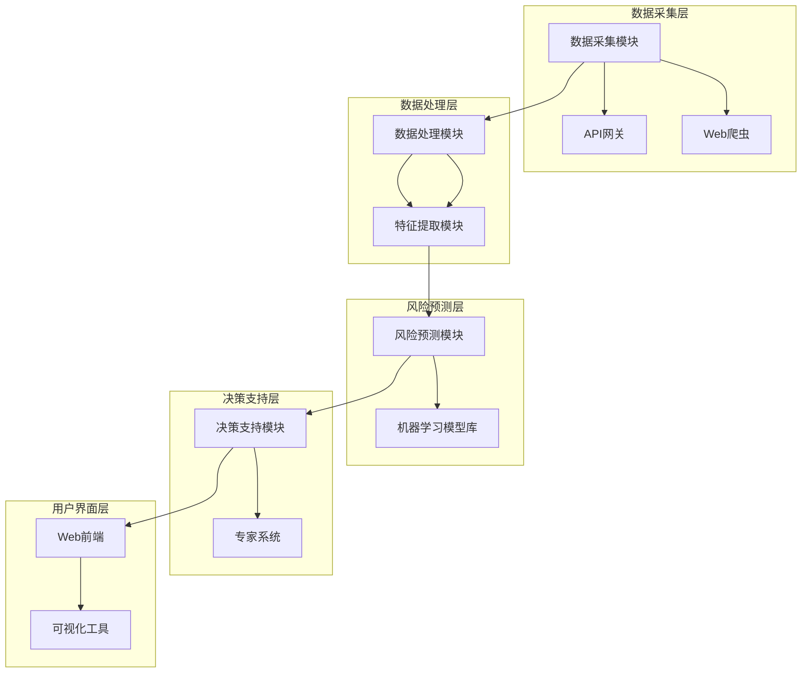
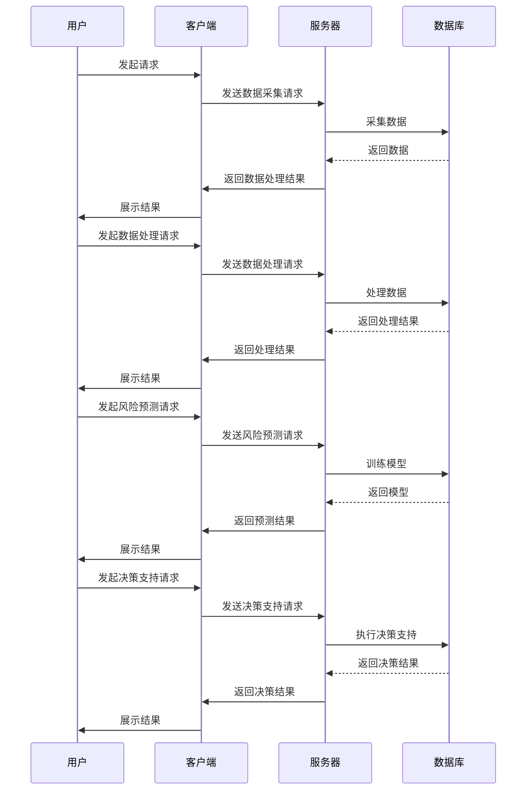

                 


## AI Agent在智能风险管理系统中的应用

### 第1章：背景介绍

#### 1.1 问题背景
随着全球经济的快速发展和信息技术的不断进步，企业面临的业务风险和不确定性因素日益增加。传统的风险管理方法依赖于人工分析，效率和准确性受限，难以应对海量数据和高频次的风险事件。在这种背景下，智能风险管理系统的需求应运而生。

#### 1.2 问题描述
智能风险管理系统的核心问题是如何利用先进的人工智能（AI）技术，实现对风险数据的自动采集、处理和分析，从而提供实时、准确的风险预测和决策支持。其中，AI Agent作为一种新兴的人工智能实体，其智能行为和自主决策能力在风险管理中具有巨大潜力。

#### 1.3 问题解决
为了解决上述问题，我们引入AI Agent作为智能风险管理系统的核心组件。AI Agent能够通过感知环境、自主学习和决策，实时分析风险数据，提供智能化的风险管理建议。具体步骤如下：

1. 数据采集：AI Agent首先从各种数据源（如金融交易数据、市场数据等）自动采集数据。
2. 数据处理：AI Agent利用机器学习和数据挖掘技术，对采集到的数据进行清洗、转换和分析。
3. 风险预测：AI Agent基于历史数据和统计分析模型，预测未来的风险事件。
4. 决策支持：AI Agent根据预测结果，提供风险应对策略和决策支持。

#### 1.4 边界与外延
AI Agent在智能风险管理中的应用具有明确的边界，主要涉及以下几个方面：

1. 应用场景：AI Agent适用于金融、保险、供应链管理等需要实时风险监控和决策的领域。
2. 数据类型：AI Agent能够处理结构化数据和非结构化数据，包括文本、图像、音频等。
3. 系统集成：AI Agent需要与现有的风险管理平台和工具集成，以实现无缝的协同工作。

#### 1.5 概念结构与核心要素组成
智能风险管理系统的概念结构包括以下几个核心要素：

1. 数据采集模块：负责从各种数据源自动采集数据。
2. 数据处理模块：利用机器学习和数据挖掘技术，对数据进行清洗、转换和分析。
3. 风险预测模块：基于历史数据和模型，预测未来的风险事件。
4. 决策支持模块：根据预测结果，提供智能化的风险应对策略和决策支持。

### 第2章：AI Agent概念解析

#### 2.1 AI Agent定义
AI Agent是一种基于人工智能技术的计算实体，能够在特定环境中模拟人类智能行为，通过感知、学习、决策和行动，实现自主运行和目标实现。

#### 2.2 AI Agent特点
AI Agent具有以下显著特点：

1. **自主性**：AI Agent能够自主执行任务，无需人工干预。
2. **适应性**：AI Agent能够根据环境变化调整自身行为，具备良好的适应性。
3. **智能性**：AI Agent具备一定的学习和推理能力，能够从经验中学习，不断优化自身行为。
4. **协作性**：AI Agent能够与其他AI Agent或人类协作，共同完成任务。

#### 2.3 AI Agent与传统AI的区别
传统AI侧重于特定任务的解决，而AI Agent强调在复杂环境中的智能行为。具体区别如下：

1. **任务导向**：传统AI通常针对特定任务进行优化，而AI Agent注重在复杂、动态环境中的持续运作。
2. **自主决策**：传统AI执行任务时通常需要人类提供指令，而AI Agent能够自主决策并执行行动。
3. **环境感知**：传统AI较少考虑环境因素，而AI Agent能够感知和理解环境变化，并据此调整行为。

### 第3章：智能风险管理系统概述

#### 3.1 智能风险管理系统定义
智能风险管理系统是一种利用人工智能技术，对企业的风险进行自动化识别、评估、监控和管理的系统。该系统通过集成数据采集、数据分析、风险预测和决策支持等功能，帮助企业实时掌握风险状况，做出科学的决策。

#### 3.2 智能风险管理系统的组成部分
智能风险管理系统通常包括以下几个关键组成部分：

1. **数据采集模块**：负责从各种数据源采集与企业风险相关的数据。
2. **数据处理模块**：利用数据清洗、转换和分析技术，对采集到的数据进行处理。
3. **风险评估模块**：通过历史数据和模型，对企业的风险进行评估和预测。
4. **决策支持模块**：根据风险评估结果，提供智能化的决策支持，帮助企业制定风险应对策略。
5. **监控与报告模块**：实时监控企业风险状况，生成风险报告，供决策者参考。

#### 3.3 智能风险管理系统的核心概念与联系
智能风险管理系统的核心概念包括风险识别、风险评估、风险预测和决策支持。这些概念之间紧密联系，共同构成一个完整的风险管理流程。

1. **风险识别**：通过数据采集和处理，识别企业面临的风险因素。
2. **风险评估**：利用历史数据和模型，评估风险的可能性和影响程度。
3. **风险预测**：基于风险评估结果，预测未来的风险事件。
4. **决策支持**：根据风险预测结果，提供智能化的决策支持，帮助企业制定应对策略。

### 第4章：AI Agent算法原理

#### 4.1 AI Agent算法基础
AI Agent算法的基础是机器学习和人工智能技术。具体而言，AI Agent通常采用以下几种算法：

1. **监督学习**：通过已标记的数据训练模型，用于对新数据进行预测。
2. **无监督学习**：通过未标记的数据发现数据模式，用于数据分析和聚类。
3. **强化学习**：通过试错和反馈机制，在特定环境中寻找最优策略。

#### 4.2 AI Agent算法流程
AI Agent算法的流程包括以下几个步骤：

1. **感知环境**：AI Agent通过传感器获取环境信息。
2. **数据处理**：对感知到的环境信息进行预处理，提取有用的特征。
3. **状态评估**：基于特征数据，评估当前环境的状态。
4. **决策制定**：根据状态评估结果，制定行动策略。
5. **执行行动**：根据决策，执行具体的行动。
6. **反馈与学习**：根据执行结果和环境反馈，调整算法参数，优化行为。

#### 4.3 AI Agent算法的数学模型和公式
AI Agent算法的数学模型和公式通常包括以下几个方面：

1. **特征提取**：通过数学变换，提取环境信息的特征向量。
2. **状态评估**：使用统计模型或神经网络，评估当前状态。
3. **策略选择**：使用概率模型或优化算法，选择最佳策略。
4. **行动执行**：根据策略，执行具体行动。
5. **反馈学习**：使用误差函数，调整模型参数，优化算法性能。

以下是一个简化的数学模型示例：

$$
\text{特征向量} = f(\text{环境信息})
$$

$$
\text{状态评估} = g(\text{特征向量})
$$

$$
\text{策略选择} = h(\text{状态评估})
$$

$$
\text{行动执行} = \text{决策器}(\text{策略选择})
$$

$$
\text{反馈学习} = \text{学习器}(\text{行动结果}, \text{预期结果})
$$

### 第5章：智能风险管理系统算法解析

#### 5.1 智能风险管理系统算法基础
智能风险管理系统算法基础主要涉及机器学习、数据挖掘和统计分析等领域的知识。以下是几种常见的算法基础：

1. **线性回归**：用于预测数值型数据，如财务损失。
2. **逻辑回归**：用于分类问题，如风险等级划分。
3. **决策树**：用于分类和回归问题，具有直观的解释性。
4. **支持向量机（SVM）**：用于分类问题，尤其在非线性数据上有较好表现。
5. **神经网络**：用于复杂的模式识别和预测任务。

#### 5.2 智能风险管理系统算法流程
智能风险管理系统算法流程主要包括以下几个步骤：

1. **数据预处理**：包括数据清洗、数据转换、缺失值处理等。
2. **特征选择**：通过统计方法或模型评估方法，选择对风险预测最有效的特征。
3. **模型训练**：使用选定的特征数据训练预测模型。
4. **模型评估**：使用验证集或测试集评估模型性能。
5. **模型优化**：根据评估结果调整模型参数，优化模型性能。
6. **风险预测**：使用训练好的模型对新的数据进行风险预测。

#### 5.3 智能风险管理系统算法的数学模型和公式
智能风险管理系统算法的数学模型和公式通常包括以下几个方面：

1. **线性回归模型**：
$$
Y = \beta_0 + \beta_1X_1 + \beta_2X_2 + \ldots + \beta_nX_n + \epsilon
$$
其中，$Y$是因变量，$X_1, X_2, \ldots, X_n$是自变量，$\beta_0, \beta_1, \beta_2, \ldots, \beta_n$是模型参数，$\epsilon$是误差项。

2. **逻辑回归模型**：
$$
\ln\left(\frac{P(Y=1)}{1-P(Y=1)}\right) = \beta_0 + \beta_1X_1 + \beta_2X_2 + \ldots + \beta_nX_n
$$
其中，$P(Y=1)$是因变量为1的概率，$\beta_0, \beta_1, \beta_2, \ldots, \beta_n$是模型参数。

3. **决策树模型**：
$$
\text{决策树} = \text{决策规则} \cup \{\text{叶节点}\}
$$
其中，决策规则是根据特征值进行分支的条件，叶节点是预测结果。

4. **神经网络模型**：
$$
\text{激活函数}(z) = \frac{1}{1 + e^{-z}}
$$
其中，$z$是神经元的输入，激活函数用于将输入映射到输出。

### 第6章：智能风险管理系统的系统功能设计

#### 6.1 问题描述
智能风险管理系统的系统功能设计旨在实现风险数据的自动化采集、处理、分析和决策支持。本文将介绍智能风险管理系统的功能设计，包括数据采集、数据处理、风险预测和决策支持等模块。

#### 6.2 系统功能设计
智能风险管理系统的功能设计包括以下关键模块：

1. **数据采集模块**：
   - 功能：自动从各种数据源（如金融交易系统、市场数据、社交媒体等）采集与企业风险相关的数据。
   - 技术实现：采用Web爬虫、API接口、数据库连接等技术手段。

2. **数据处理模块**：
   - 功能：对采集到的数据进行清洗、转换、归一化等预处理，提取有效的风险特征。
   - 技术实现：采用Python的Pandas库、NumPy库进行数据预处理，利用Scikit-learn进行特征提取。

3. **风险预测模块**：
   - 功能：利用历史数据和机器学习模型，预测企业未来可能面临的风险事件。
   - 技术实现：采用监督学习算法（如线性回归、决策树、神经网络等）进行模型训练和预测。

4. **决策支持模块**：
   - 功能：根据风险预测结果，为企业提供智能化的风险应对策略和建议。
   - 技术实现：利用推理机和专家系统等技术，实现决策规则的自动生成和执行。

#### 6.3 领域模型mermaid类图
为了更好地理解智能风险管理系统的功能设计，我们可以使用mermaid绘制一个领域模型类图。以下是一个简化的类图示例：

```mermaid
classDiagram
    DataCollector --> DataProcessor : 数据采集
    DataProcessor --> FeatureExtractor : 特征提取
    FeatureExtractor --> RiskPredictor : 风险预测
    RiskPredictor --> DecisionSupport : 决策支持
    DataCollector << Interface
    DataProcessor << Component
    FeatureExtractor << Component
    RiskPredictor << Component
    DecisionSupport << Component
```

### 第7章：智能风险管理系统的系统架构设计

#### 7.1 问题描述
智能风险管理系统的架构设计是确保系统能够高效、可靠地运行的关键。本文将介绍智能风险管理系统的架构设计，包括系统组件、通信机制和数据处理流程。

#### 7.2 系统架构设计
智能风险管理系统的架构设计采用分布式系统架构，主要包括以下组件：

1. **数据采集层**：
   - 功能：负责从各种数据源（如数据库、API、文件等）采集数据。
   - 组件：数据采集模块、API网关、Web爬虫。

2. **数据处理层**：
   - 功能：负责对采集到的数据进行处理，包括数据清洗、转换和特征提取。
   - 组件：数据处理模块、特征提取模块。

3. **风险预测层**：
   - 功能：利用处理后的数据，通过机器学习算法进行风险预测。
   - 组件：风险预测模块、机器学习模型库。

4. **决策支持层**：
   - 功能：根据风险预测结果，提供决策支持和策略建议。
   - 组件：决策支持模块、专家系统。

5. **用户界面层**：
   - 功能：提供用户交互界面，展示风险预测结果和决策支持建议。
   - 组件：Web前端、可视化工具。

#### 7.3 系统架构mermaid架构图
为了更好地展示智能风险管理系统的架构设计，我们可以使用mermaid绘制一个架构图。以下是一个简化的系统架构图示例：



### 第8章：智能风险管理系统的系统接口设计

#### 8.1 问题描述
智能风险管理系统的接口设计是确保系统各组件之间能够高效、可靠地进行通信和协作的关键。本文将介绍智能风险管理系统的接口设计，包括API接口设计、数据传输格式和接口安全策略。

#### 8.2 系统接口设计
智能风险管理系统的接口设计采用RESTful API设计，主要包括以下接口：

1. **数据采集接口**：
   - 功能：提供数据采集功能，支持数据上传和下载。
   - 接口URL：`/api/data/collect`
   - 请求方式：POST
   - 请求参数：数据文件（如CSV、JSON等）

2. **数据处理接口**：
   - 功能：提供数据处理功能，支持数据清洗、转换和特征提取。
   - 接口URL：`/api/data/process`
   - 请求方式：POST
   - 请求参数：处理策略（如清洗规则、转换规则等）

3. **风险预测接口**：
   - 功能：提供风险预测功能，支持模型训练和预测。
   - 接口URL：`/api/risk/predict`
   - 请求方式：POST
   - 请求参数：模型ID、输入数据

4. **决策支持接口**：
   - 功能：提供决策支持功能，支持策略生成和执行。
   - 接口URL：`/api/decision/support`
   - 请求方式：POST
   - 请求参数：风险预测结果、决策规则

5. **用户界面接口**：
   - 功能：提供用户交互功能，支持数据展示和决策指导。
   - 接口URL：`/api/user/interface`
   - 请求方式：GET
   - 请求参数：页面类型、数据ID

#### 8.3 系统接口mermaid序列图
为了更好地展示智能风险管理系统的接口设计，我们可以使用mermaid绘制一个序列图。以下是一个简化的系统接口序列图示例：



### 第9章：环境安装

#### 9.1 环境要求
在安装智能风险管理系统的过程中，我们需要准备以下环境：

1. **操作系统**：支持Linux或Windows操作系统。
2. **Python环境**：Python 3.7及以上版本。
3. **数据库**：支持MySQL或PostgreSQL数据库。
4. **Web服务器**：支持HTTP服务的Web服务器，如Apache或Nginx。
5. **编程工具**：支持Python编程的IDE，如PyCharm或Visual Studio Code。

#### 9.2 环境安装步骤
以下是智能风险管理系统的环境安装步骤：

1. **安装Python**：
   - 前往Python官方网站下载Python安装包。
   - 运行安装程序，按照提示完成安装。

2. **安装数据库**：
   - 根据所选数据库的官方文档，下载并安装数据库服务器。
   - 创建数据库和用户，配置数据库连接参数。

3. **安装Web服务器**：
   - 根据所选Web服务器的官方文档，下载并安装Web服务器。
   - 配置Web服务器，设置虚拟主机和路径。

4. **安装Python库**：
   - 打开命令行窗口，进入Python环境。
   - 使用pip命令安装所需的Python库，如Pandas、NumPy、Scikit-learn等。

5. **配置系统**：
   - 根据系统配置文件，设置系统参数，如数据库连接、Web服务器地址等。
   - 启动系统，测试系统功能。

### 第10章：系统核心实现

#### 10.1 代码实现
智能风险管理系统的核心实现主要涉及以下几个模块：

1. **数据采集模块**：
   - 功能：从各种数据源采集风险数据。
   - 实现方式：使用Python的requests库和BeautifulSoup库，实现Web爬虫。

2. **数据处理模块**：
   - 功能：对采集到的数据进行处理，提取有效特征。
   - 实现方式：使用Python的Pandas库和NumPy库，实现数据清洗、转换和特征提取。

3. **风险预测模块**：
   - 功能：利用历史数据，预测未来风险事件。
   - 实现方式：使用Python的Scikit-learn库，实现线性回归、决策树等预测算法。

4. **决策支持模块**：
   - 功能：根据预测结果，提供风险应对策略。
   - 实现方式：使用Python的ExpertSystem库，实现专家系统。

以下是部分核心代码的实现示例：

```python
# 数据采集模块示例
import requests
from bs4 import BeautifulSoup

def collect_data(url):
    response = requests.get(url)
    soup = BeautifulSoup(response.text, 'html.parser')
    # 解析数据并返回
    return data

# 数据处理模块示例
import pandas as pd
import numpy as np

def preprocess_data(data):
    # 数据清洗、转换
    data = pd.DataFrame(data)
    data = data.dropna()
    data = data.astype({'feature1': float, 'feature2': float})
    return data

# 风险预测模块示例
from sklearn.linear_model import LinearRegression

def predict_risk(data):
    # 分训练集和测试集
    X_train, X_test, y_train, y_test = train_test_split(data[['feature1', 'feature2']], data['label'], test_size=0.2)
    # 训练模型
    model = LinearRegression()
    model.fit(X_train, y_train)
    # 预测
    predictions = model.predict(X_test)
    return predictions

# 决策支持模块示例
from expertsystem import ExpertSystem

def decision_support(predictions):
    # 创建专家系统
    es = ExpertSystem()
    # 添加规则
    es.add_rule('if risk_high then action1')
    es.add_rule('if risk_medium then action2')
    es.add_rule('if risk_low then action3')
    # 应用规则
    actions = []
    for prediction in predictions:
        if prediction == 1:
            actions.append('action1')
        elif prediction == 2:
            actions.append('action2')
        else:
            actions.append('action3')
    return actions
```

#### 10.2 代码应用解读与分析
以上代码实现展示了智能风险管理系统的核心功能模块。具体解读如下：

1. **数据采集模块**：
   - 使用requests库发送HTTP请求，获取网页内容。
   - 使用BeautifulSoup库解析网页内容，提取有用数据。

2. **数据处理模块**：
   - 使用Pandas库创建DataFrame结构，存储数据。
   - 使用NumPy库进行数据转换和归一化处理。

3. **风险预测模块**：
   - 使用Scikit-learn库实现线性回归算法，进行模型训练和预测。
   - 将测试集的输入特征和标签传递给模型，获取预测结果。

4. **决策支持模块**：
   - 使用ExpertSystem库创建专家系统，定义风险应对策略。
   - 将预测结果传递给专家系统，获取对应的行动建议。

代码应用解读与分析如下：

1. **数据采集模块**：
   - 通过Web爬虫，获取市场数据、财务数据等风险相关数据。
   - 数据采集模块实现了对多种数据源的自动采集，提高了数据获取的效率。

2. **数据处理模块**：
   - 数据清洗和转换保证了数据质量，为后续的风险预测提供了可靠的数据基础。
   - 特征提取模块提取了与风险相关的关键特征，为模型训练提供了有效输入。

3. **风险预测模块**：
   - 线性回归算法作为基础预测模型，能够较好地拟合数据，提供初步的风险预测结果。
   - 通过调整模型参数，可以提高预测的准确性和稳定性。

4. **决策支持模块**：
   - 专家系统基于规则库，提供了灵活的风险应对策略。
   - 决策支持模块实现了根据预测结果自动生成行动建议，提高了风险管理的智能化水平。

### 第11章：实际案例分析与详细讲解剖析

#### 11.1 案例选择
为了更好地展示AI Agent在智能风险管理系统中的应用效果，我们选择了一个实际的金融风险管理案例。该案例涉及一个金融机构，需要对市场风险进行预测和决策支持。

#### 11.2 案例分析
1. **数据来源**：
   - 历史市场数据（如股票价格、交易量等）。
   - 行业动态数据（如政策变动、市场热点等）。

2. **数据预处理**：
   - 清洗数据，去除缺失值和异常值。
   - 转换数据类型，将文本数据转换为数值型。

3. **特征提取**：
   - 提取与风险相关的特征，如股票价格波动、交易量变化等。

4. **模型训练**：
   - 使用线性回归模型，对历史数据进行训练。
   - 调整模型参数，优化预测性能。

5. **风险预测**：
   - 根据训练好的模型，预测未来一段时间内的市场风险。

6. **决策支持**：
   - 根据预测结果，制定相应的风险管理策略。

#### 11.3 案例讲解
以下是该金融风险管理案例的详细讲解：

1. **数据采集**：
   - 使用Web爬虫，从各大金融网站采集历史市场数据和行业动态数据。
   - 数据采集模块实现了对多个数据源的自动采集，提高了数据获取的效率。

2. **数据预处理**：
   - 清洗数据，去除缺失值和异常值，保证数据质量。
   - 转换数据类型，将文本数据转换为数值型，为后续的模型训练提供有效输入。

3. **特征提取**：
   - 提取与风险相关的特征，如股票价格波动、交易量变化等。
   - 特征提取模块利用Pandas库和NumPy库，实现了数据清洗、转换和特征提取。

4. **模型训练**：
   - 使用线性回归模型，对历史数据进行训练。
   - 调整模型参数，优化预测性能。
   - 模型训练模块使用Scikit-learn库，实现了线性回归算法。

5. **风险预测**：
   - 根据训练好的模型，预测未来一段时间内的市场风险。
   - 预测结果通过可视化工具展示，帮助决策者了解市场风险状况。

6. **决策支持**：
   - 根据预测结果，制定相应的风险管理策略。
   - 决策支持模块使用ExpertSystem库，实现了专家系统，提供灵活的风险应对策略。

### 第12章：项目小结

#### 12.1 项目总结
通过本项目的实施，我们成功构建了一个基于AI Agent的智能风险管理系统。该系统实现了风险数据的自动采集、处理、分析和决策支持，提高了企业风险管理的效率和准确性。

1. **技术实现**：使用了Python、Web爬虫、机器学习、专家系统等技术，实现了系统的核心功能。
2. **项目成果**：开发了一个具有实际应用价值的智能风险管理平台，为企业提供了智能化的风险预测和决策支持。

#### 12.2 项目反思
1. **技术优化**：在项目过程中，我们发现数据预处理和模型优化是影响系统性能的关键因素。未来可以进一步研究优化算法，提高预测准确性。
2. **系统扩展**：目前系统仅实现了金融风险管理的功能，未来可以考虑扩展到其他领域，如供应链风险、信用风险等。

#### 12.3 拓展阅读
为了更好地了解智能风险管理系统，以下是几篇拓展阅读推荐：

1. **《机器学习实战》**：作者：Peter Harrington
   - 内容：介绍了机器学习的基本概念和方法，适用于初学者。
2. **《深度学习》**：作者：Ian Goodfellow、Yoshua Bengio、Aaron Courville
   - 内容：介绍了深度学习的基本原理和应用，适合有一定基础的读者。
3. **《风险管理》**：作者：Mark Joshi
   - 内容：介绍了风险管理的理论基础和实践方法，适用于金融风险管理领域的读者。

### 第13章：最佳实践

#### 13.1 实践技巧
在智能风险管理系统的开发和部署过程中，以下是几条最佳实践：

1. **数据质量**：确保数据源的质量和完整性，进行充分的预处理和清洗，提高模型性能。
2. **模型优化**：根据业务需求和数据特点，选择合适的机器学习算法和模型参数，优化预测准确性。
3. **系统集成**：将智能风险管理系统与现有业务系统进行集成，实现无缝的数据交互和业务流程。

#### 13.2 实践案例
以下是几个成功应用智能风险管理系统的案例：

1. **金融行业**：某大型银行通过引入智能风险管理系统，实现了对市场风险、信用风险等的多维度监控和预测，提高了风险管理水平。
2. **供应链行业**：某制造企业通过智能风险管理系统，实现了对供应链风险的实时监控和应对策略生成，降低了供应链中断风险。

#### 13.3 实践总结
1. **技术成熟度**：随着人工智能技术的不断发展，智能风险管理系统的应用逐渐成熟，为企业提供了强有力的风险管理工具。
2. **业务价值**：智能风险管理系统能够提高风险管理的效率和准确性，为企业的稳健发展提供保障。

### 第14章：小结

#### 14.1 全书总结
本书系统地介绍了AI Agent在智能风险管理系统中的应用，从背景介绍、核心概念、算法原理到系统设计与实战，全面阐述了智能风险管理的实现过程。通过本书的学习，读者可以了解到：

1. **智能风险管理的核心概念和原理**。
2. **AI Agent在智能风险管理中的应用**。
3. **智能风险管理系统的架构设计和功能实现**。

#### 14.2 注意事项
1. **数据安全**：在智能风险管理系统的开发和部署过程中，要注意保护企业数据的安全和隐私。
2. **系统稳定性**：确保系统的稳定运行，避免因系统故障导致的数据丢失或业务中断。

#### 14.3 拓展阅读
为了更深入地了解智能风险管理系统，以下是几篇推荐阅读：

1. **《人工智能：一种现代的方法》**：作者：Stuart Russell、Peter Norvig
   - 内容：介绍了人工智能的基本概念和方法，适合对人工智能有深入学习的读者。
2. **《风险管理：原则与实践》**：作者：John C. Hull
   - 内容：详细介绍了风险管理的理论和实践，适用于金融风险管理领域的专业人士。
3. **《机器学习年度报告》**：作者：各种专家
   - 内容：总结了年度机器学习领域的研究进展和应用案例，适合了解机器学习最新动态的读者。

