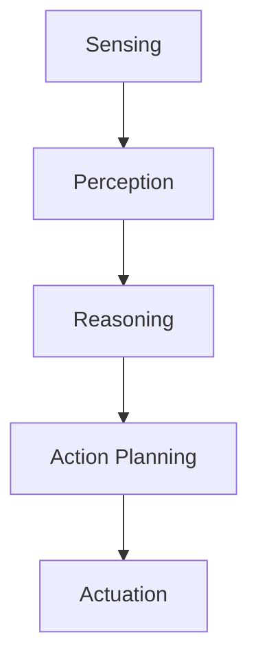

                 

### AI Agent in the Application of Intelligent Risk Assessment

## Introduction

### Background and Core Concepts

In the realm of modern technology, artificial intelligence (AI) has been making significant strides, permeating various industries and transforming traditional methods into intelligent, data-driven approaches. Among these advancements, AI agents have emerged as powerful tools for intelligent risk assessment. AI agents, also known as intelligent software agents, are autonomous entities that can perceive their environment, reason about it, and take actions to achieve specific goals. These agents are designed to mimic human decision-making processes but with the added advantages of speed, consistency, and the ability to process vast amounts of data.

Intelligent risk assessment is the process of identifying, analyzing, and prioritizing risks to determine the most effective strategies to mitigate or capitalize on them. It is a crucial aspect of decision-making in various fields, including finance, healthcare, supply chain management, and cybersecurity. Traditional risk assessment methods have limitations, such as being time-consuming, subjective, and not able to handle large volumes of data efficiently. This is where AI agents come into play, offering a more sophisticated and data-driven approach to risk assessment.

### Importance of AI Agents in Intelligent Risk Assessment

AI agents hold tremendous potential in intelligent risk assessment due to several key advantages:

1. **Data Processing and Analysis:** AI agents can analyze large datasets quickly and accurately, identifying patterns and anomalies that might not be apparent to human analysts.
2. **Objectivity and Consistency:** Unlike humans, AI agents are not influenced by biases or emotions, ensuring that risk assessments are objective and consistent over time.
3. **Speed and Efficiency:** AI agents can process information at a much faster rate than humans, allowing for real-time risk assessments and timely decision-making.
4. **Continuous Learning:** AI agents can learn from past data and experiences, continuously improving their accuracy and effectiveness over time.

### Comparison with Traditional Methods

When compared to traditional risk assessment methods, AI agents offer several notable advantages:

1. **Data-Driven Approach:** Traditional methods often rely on historical data and expert opinions, which can be limited and prone to human error. AI agents, on the other hand, use data analytics and machine learning algorithms to identify risks based on current and historical data.
2. **Real-Time Analysis:** Traditional methods are typically time-consuming and may not provide timely insights. AI agents can perform real-time analysis, enabling organizations to respond quickly to emerging risks.
3. **Scalability:** Traditional methods can become cumbersome and less effective as the volume of data increases. AI agents are designed to handle large datasets and can scale seamlessly as needed.

In conclusion, AI agents have the potential to revolutionize intelligent risk assessment by providing a more efficient, objective, and data-driven approach. This article will delve deeper into the basic principles of AI agents, their practical applications in risk assessment, the challenges they face, and future directions for this exciting field. By the end, we hope to provide a comprehensive understanding of how AI agents can transform the way we assess and manage risks.

## Basic Principles of AI Agents

### Definition and Core Characteristics

AI agents, or intelligent software agents, are self-contained entities designed to perform specific tasks or objectives within a given environment. They are a core component of artificial intelligence and play a pivotal role in various applications, from autonomous vehicles to virtual assistants. At their most fundamental level, AI agents are characterized by the following key attributes:

1. **Autonomy:** AI agents operate autonomously, meaning they can make decisions and take actions without direct human intervention. This autonomy is crucial for their ability to function effectively in dynamic and unpredictable environments.

2. **Sensing:** AI agents are equipped with sensors that allow them to perceive and gather information from their environment. These sensors can be as simple as cameras and microphones or as complex as LIDAR systems in autonomous vehicles.

3. **Reasoning:** AI agents utilize algorithms and machine learning models to process the sensory data and make informed decisions. This reasoning capability enables them to understand the context of their environment and predict potential outcomes.

4. **Acting:** Based on their reasoning, AI agents take actions to achieve their objectives. These actions can range from simple tasks, such as moving a robotic arm, to complex operations, such as trading stocks in real-time.

5. **Learning:** AI agents have the ability to learn from past experiences and improve their performance over time. This learning capability is typically realized through machine learning algorithms that can adjust their behavior based on feedback.

### Comparison of Key Characteristics

To better understand the capabilities of AI agents, let's compare their core characteristics with those of traditional software systems:

| Attribute          | AI Agent                                            | Traditional Software System                                          |
|--------------------|-----------------------------------------------------|------------------------------------------------------------------|
| Autonomy          | Operates independently without human intervention   | Requires human input and control                                      |
| Sensing           | Equipped with sensors to perceive the environment   | Lacks sensory capabilities; relies on inputs from users or other systems |
| Reasoning          | Uses algorithms and machine learning for decision-making | Follows pre-defined logic and rules                                    |
| Acting             | Executes actions based on decisions                  | Executes predefined actions                                           |
| Learning           | Learns from experience to improve performance        | Stays static unless explicitly updated by users or developers           |

From this comparison, it's clear that AI agents offer a more dynamic and adaptive approach compared to traditional software systems. They can handle complex tasks, make decisions based on real-time data, and improve their performance over time through learning.

### Working Principles and Mechanisms

The working principles of AI agents can be understood through the following key components:

1. **Environment:** The environment is the external context in which the AI agent operates. It can be a physical space (e.g., a road for an autonomous vehicle) or a digital space (e.g., a financial market for a trading bot). The environment provides the sensory data that the agent uses to make decisions.

2. **Sensors:** Sensors collect data from the environment. For instance, in a self-driving car, sensors like cameras, LIDAR, and radar capture information about the car's surroundings.

3. **Perception:** The perception module processes the sensory data to extract meaningful information. This module is akin to the human brain, interpreting sensory inputs to understand the environment.

4. **Reasoning:** The reasoning module uses algorithms and machine learning models to analyze the perceived information. It evaluates different scenarios and predicts potential outcomes based on historical data and learned patterns.

5. **Action Planner:** The action planner generates a set of possible actions based on the reasoning module's output. It evaluates these actions based on their potential outcomes and selects the most appropriate action to achieve the agent's goals.

6. **Actuators:** Actuators are the components that execute the chosen actions. In a robotic arm, these could be motors that move the arm, while in a trading bot, they could be algorithms that place trades.

### The Role of AI Agents in Intelligent Risk Assessment

AI agents are integral to intelligent risk assessment due to their ability to process vast amounts of data, identify subtle patterns, and make real-time decisions. In the context of risk assessment, AI agents can perform the following tasks:

1. **Data Collection and Analysis:** AI agents can gather data from various sources, such as financial reports, market trends, and social media, and analyze this data to identify potential risks.

2. **Pattern Recognition:** By using machine learning algorithms, AI agents can identify patterns in historical data that may indicate future risks. For example, they can detect anomalies in stock market data that may预示重大市场变动。

3. **Real-Time Monitoring:** AI agents can continuously monitor the environment for signs of emerging risks. This real-time capability allows organizations to respond quickly to changing conditions.

4. **Decision-Making:** Based on their analysis, AI agents can make recommendations on how to mitigate or capitalize on risks. These decisions are objective and data-driven, reducing the influence of human biases.

5. **Continuous Learning:** AI agents can learn from past assessments and improve their accuracy over time. This learning capability ensures that they become more effective at identifying and managing risks as they gather more data.

In conclusion, AI agents offer a powerful framework for intelligent risk assessment by leveraging their sensing, reasoning, and acting capabilities. Their ability to process data, recognize patterns, and make real-time decisions provides organizations with a more sophisticated and data-driven approach to risk management. In the following sections, we will explore the practical applications of AI agents in various domains, highlighting their effectiveness and potential impact.

## AI Agent Design and Implementation

### Model Development Methods

Designing an AI agent involves several key steps, starting with the development of a robust model. Here, we will discuss the primary methodologies for building AI agent models:

1. **Supervised Learning:** In supervised learning, the agent is trained on labeled data, where each input is paired with an expected output. The model learns to map inputs to outputs by adjusting its internal parameters based on the provided labels. This method is particularly effective when historical data is available and accurately labeled.

2. **Unsupervised Learning:** Unsupervised learning involves training the agent on unlabeled data. The agent must identify patterns and structures within the data without any prior knowledge of the expected outcomes. This method is useful for discovering hidden patterns or anomalies in the data that might not be apparent through supervised learning alone.

3. **Reinforcement Learning:** Reinforcement learning is a type of machine learning where the agent learns by interacting with the environment. The agent receives feedback in the form of rewards or penalties based on its actions, and it uses this feedback to improve its performance over time. This method is particularly suitable for complex and dynamic environments where the optimal actions are not known in advance.

### Design Principles

Effective AI agent design follows several core principles to ensure the agent operates efficiently and reliably:

1. **Modularity:** AI agents should be modular, with separate components responsible for sensing, reasoning, and acting. This modularity allows for easier maintenance and scalability, as individual components can be updated or replaced without affecting the entire system.

2. **Adaptability:** Agents should be designed to adapt to changing environments and conditions. This adaptability can be achieved through continuous learning and the ability to update their models based on new data or feedback.

3. **Robustness:** Agents must be robust, meaning they can handle unexpected inputs and still make valid decisions. This robustness is crucial in dynamic environments where data quality can vary.

4. **Scalability:** The design should support scaling to handle increasing data volumes or more complex tasks. Scalable agents can process larger datasets and adapt to new challenges as they arise.

5. **Interoperability:** AI agents should be designed to interact seamlessly with other systems and agents. This interoperability is essential for integrating AI agents into larger, more complex systems.

### Architectural Design

The architectural design of AI agents is critical to their effectiveness and efficiency. A well-designed architecture ensures that the agent can perform its tasks effectively and adapt to changing conditions. Here are some key architectural considerations:

1. **Sensing Module:** The sensing module collects data from the environment through various sensors. The design of this module should be flexible enough to accommodate different types of sensors and data sources.

2. **Perception Module:** The perception module processes the sensory data to extract relevant information. This module should include data preprocessing techniques to handle noise and inconsistencies in the data.

3. **Reasoning Module:** The reasoning module analyzes the perceived information using algorithms and machine learning models. The design of this module should support various reasoning techniques, such as rule-based reasoning, case-based reasoning, and machine learning.

4. **Action Planning Module:** The action planning module generates and evaluates possible actions based on the reasoning module's output. The design should allow for the integration of multiple decision-making strategies and the ability to prioritize actions based on their potential outcomes.

5. **Actuation Module:** The actuation module executes the chosen actions. The design should ensure that the actions are executed efficiently and accurately, considering the agent's objectives and the environment's constraints.

### Example: Architectural Diagram

Below is a simplified Mermaid diagram illustrating the architecture of an AI agent:

In this diagram, the sensing module (A) collects data from the environment, which is then processed by the perception module (B). The reasoning module (C) analyzes the processed data and generates action plans (D), which are executed by the actuation module (E).

By following these design principles and architectural considerations, AI agents can be developed to effectively perform intelligent risk assessment tasks, providing organizations with a powerful tool for managing and mitigating risks in a data-driven and adaptive manner.

### Practical Applications of AI Agents in Risk Assessment

#### Credit Risk Assessment

Credit risk assessment is a critical aspect of the financial industry, involving the evaluation of the creditworthiness of individuals or entities before granting loans or credit. Traditionally, credit risk assessment relies on credit scores, historical financial data, and expert judgment. However, these methods are often subjective and do not fully capture the complexity and dynamic nature of credit risk.

AI agents offer a more sophisticated approach to credit risk assessment by leveraging machine learning algorithms and large datasets. Here's a step-by-step explanation of how AI agents can be applied in this domain:

1. **Data Collection:** The first step is to collect a comprehensive dataset that includes various factors influencing credit risk. This dataset can include credit scores, historical payment records, employment history, debt-to-income ratios, and demographic information.

2. **Data Preprocessing:** Raw data is often noisy and requires preprocessing to be useful. This step involves cleaning the data, handling missing values, and normalizing the data to a common scale. Data preprocessing is crucial for ensuring the quality of the input data and the accuracy of the model.

3. **Feature Engineering:** Feature engineering is the process of transforming raw data into features that are useful for training machine learning models. This step involves selecting relevant features, creating new features through domain knowledge, and transforming existing features to improve model performance.

4. **Model Training:** The next step is to train a machine learning model using the preprocessed and engineered features. Common algorithms used for credit risk assessment include logistic regression, decision trees, random forests, and gradient boosting algorithms. The model is trained on historical data, learning to predict credit risk based on various features.

5. **Model Evaluation:** After training, the model's performance is evaluated using metrics such as accuracy, precision, recall, and F1-score. This step is crucial for ensuring that the model is reliable and generalizes well to unseen data.

6. **Model Deployment:** Once the model is trained and validated, it can be deployed in a production environment. The AI agent continuously processes incoming data, updates its model with new information, and provides real-time credit risk assessments.

7. **Anomaly Detection:** AI agents can also detect anomalies in credit data that may indicate fraudulent activities or unusual behavior. This capability is particularly valuable for identifying and mitigating credit risks that are not evident through traditional methods.

#### Market Risk Assessment

Market risk assessment is another critical area where AI agents can provide significant advantages. Market risks include fluctuations in asset prices, interest rates, and other financial variables that can impact investment portfolios. Traditional market risk assessment methods often rely on statistical models and historical data, which may not capture the rapidly changing nature of financial markets.

AI agents can enhance market risk assessment in the following ways:

1. **Real-Time Data Analysis:** AI agents can process vast amounts of real-time data from various sources, such as stock exchanges, news feeds, and social media. This real-time analysis allows for timely identification of market trends and potential risks.

2. **Pattern Recognition:** Machine learning algorithms within AI agents can identify complex patterns and relationships in market data that may indicate future market movements. These patterns can help predict market volatility and other risks.

3. **Sentiment Analysis:** AI agents can analyze market sentiment from social media, news articles, and other textual data sources. Sentiment analysis can provide insights into how market participants perceive various events and factors, helping to predict market sentiment and potential risks.

4. **Portfolio Optimization:** AI agents can optimize investment portfolios by adjusting allocations based on risk assessments and market conditions. This optimization process considers both risk and return objectives, aiming to achieve the best possible portfolio performance.

5. ** Stress Testing:** AI agents can perform stress testing by simulating various extreme market scenarios to assess the resilience of investment portfolios. This stress testing helps identify potential vulnerabilities and risks in the portfolio.

#### Case Study: AI Agent in Credit Risk Assessment

Consider a scenario where a financial institution uses an AI agent for credit risk assessment. The AI agent is designed to evaluate loan applications from small business owners. Here's a detailed breakdown of the process:

1. **Data Collection:** The AI agent collects a variety of data, including business financial statements, credit scores, industry benchmarks, and economic indicators.

2. **Data Preprocessing:** The collected data is preprocessed to handle missing values and normalize different data types. For example, revenue figures are normalized to a common scale based on industry standards.

3. **Feature Engineering:** The AI agent identifies relevant features for predicting credit risk, such as business revenue, credit history, and industry growth rate. It also creates new features, such as debt-to-income ratios, to provide additional insights.

4. **Model Training:** The agent trains a logistic regression model using historical loan data, learning to predict credit risk based on the engineered features. The model is validated using a hold-out test set to ensure its accuracy and reliability.

5. **Model Deployment:** The trained model is deployed in the financial institution's loan approval system. The AI agent continuously processes incoming loan applications, updating its model with new data to maintain its predictive accuracy.

6. **Credit Risk Assessment:** For a new loan application, the AI agent analyzes the preprocessed data and generates a credit risk score. The score is used by the institution's risk management team to make informed decisions about loan approvals.

7. **Anomaly Detection:** The AI agent also detects anomalies in loan applications that may indicate fraudulent activities. This capability helps the institution avoid potential financial losses and ensure the integrity of the lending process.

In conclusion, AI agents have demonstrated significant potential in credit risk assessment and market risk assessment. By leveraging machine learning algorithms and real-time data analysis, AI agents provide a more accurate, efficient, and data-driven approach to risk management. The practical applications of AI agents in these domains continue to expand, offering valuable insights and enhancing decision-making processes.

### Supply Chain Risk Assessment

Supply chain risk assessment is a critical aspect of modern business operations, involving the identification, analysis, and mitigation of potential risks within the supply chain. These risks can originate from various sources, including supplier reliability, geopolitical factors, natural disasters, economic instability, and cybersecurity threats. Traditional risk assessment methods often rely on manual processes, historical data, and expert judgment, which can be time-consuming, incomplete, and prone to human error.

AI agents offer a transformative approach to supply chain risk assessment by leveraging advanced machine learning algorithms and real-time data analytics. Here's a detailed explanation of how AI agents can be applied in this domain:

#### Data Collection and Integration

1. **Data Collection:** The first step in AI-based supply chain risk assessment is to collect comprehensive data from various sources. This data can include supplier performance metrics, shipping and delivery records, financial statements, market trends, weather forecasts, and geopolitical updates.

2. **Data Integration:** The collected data is then integrated into a centralized system. This integration is crucial for providing a holistic view of the supply chain and identifying potential risks. Data integration can be challenging due to the diversity and volume of data sources, but it is essential for the effectiveness of AI agents.

#### Risk Identification and Analysis

3. **Risk Identification:** AI agents utilize machine learning algorithms to analyze the integrated data and identify potential risks. For example, the agents can detect patterns in supplier performance data that indicate potential reliability issues, such as delayed deliveries or quality control problems.

4. **Anomaly Detection:** AI agents are particularly effective at detecting anomalies that may indicate emerging risks. Anomalies can include sudden changes in supplier pricing, unexpected disruptions in the supply chain, or unusual shipping patterns. By identifying these anomalies, AI agents can provide early warnings of potential problems.

5. **Risk Scoring and Prioritization:** AI agents can assign risk scores to different supply chain components based on their analysis. These risk scores help prioritize which areas require immediate attention and which can be addressed later. This prioritization is essential for allocating resources effectively and mitigating the most significant risks first.

#### Real-Time Monitoring and Adaptation

6. **Real-Time Monitoring:** AI agents continuously monitor the supply chain for changes in risk indicators. This real-time monitoring enables organizations to respond quickly to emerging risks. For example, if an AI agent detects that a key supplier is experiencing financial distress, the organization can take proactive measures to mitigate the impact on their supply chain.

7. **Adaptive Risk Management:** AI agents are designed to adapt to changing conditions and new data. They can adjust their models and risk assessments based on real-time information, ensuring that their predictions remain accurate and relevant. This adaptability is crucial for managing dynamic and complex supply chains.

#### Case Study: AI Agent in Supply Chain Risk Assessment

Consider a manufacturing company that relies on a global supply chain to produce its products. The company uses an AI agent to assess and manage supply chain risks. Here's how the AI agent operates in this scenario:

1. **Data Collection:** The AI agent collects data from various sources, including supplier performance reports, shipping logs, financial news, and economic indicators. This data is integrated into a centralized database.

2. **Risk Identification:** The AI agent analyzes the integrated data to identify potential risks. For instance, it detects that a key supplier in China is experiencing delays in delivery due to a natural disaster. This anomaly triggers an alert, and the AI agent provides additional context and recommendations for mitigation.

3. **Risk Scoring:** The AI agent assigns a risk score to the identified risk based on its severity and potential impact. This score helps the company's risk management team prioritize their response actions.

4. **Real-Time Monitoring:** The AI agent continuously monitors the supply chain for changes in risk indicators. It alerts the team if there are any significant changes, such as sudden price fluctuations in raw materials or labor strikes at critical suppliers.

5. **Adaptive Risk Management:** The AI agent adapts its risk assessment models based on new data and feedback. For example, if the company diversifies its supplier base after an AI agent's recommendation, the agent can update its models to reflect this change and provide more accurate risk assessments.

6. **Mitigation Strategies:** The AI agent provides the company's risk management team with actionable insights and recommendations for mitigating identified risks. For instance, it may suggest alternative suppliers or suggest adjusting inventory levels to buffer against supply chain disruptions.

In conclusion, AI agents are a powerful tool for supply chain risk assessment, offering real-time monitoring, predictive analytics, and adaptive risk management capabilities. By leveraging AI agents, companies can improve their supply chain resilience, enhance decision-making, and better navigate the complexities of global supply chains.

### Challenges and Future Directions in AI Agent-Based Risk Assessment

#### Data Privacy and Security Concerns

One of the primary challenges in AI agent-based risk assessment is the issue of data privacy and security. AI agents rely heavily on large volumes of data to perform accurate and effective risk assessments. This data often includes sensitive information such as personal financial records, credit histories, and business operations data. Ensuring the privacy and security of this data is crucial to protect both individuals and organizations from potential breaches and misuse.

1. **Data Collection and Storage:** The first step in addressing data privacy concerns is to ensure that data is collected and stored securely. This involves using encryption techniques to protect data both in transit and at rest. Additionally, organizations must comply with data protection regulations such as the General Data Protection Regulation (GDPR) and the California Consumer Privacy Act (CCPA).

2. **Data Anonymization:** To further protect privacy, data anonymization techniques can be employed. These techniques remove or obfuscate personally identifiable information (PII) from datasets, reducing the risk of data breaches.

3. **Access Control:** Implementing strict access controls is essential to ensure that only authorized personnel can access sensitive data. This includes using multi-factor authentication (MFA) and role-based access control (RBAC) to limit access based on job responsibilities.

4. **Regular Audits and Compliance Checks:** Regular audits and compliance checks can help ensure that data privacy and security measures are being followed. This includes monitoring data access logs, conducting vulnerability assessments, and performing security training for employees.

#### Model Explainability and Interpretability

Another significant challenge in AI agent-based risk assessment is the lack of explainability and interpretability of machine learning models. Many of the advanced machine learning algorithms used in AI agents operate as "black boxes," providing limited insight into how and why they make specific decisions. This lack of transparency can be a barrier to trust and can make it difficult to understand and address potential biases in the models.

1. **Model Transparency:** To address this challenge, organizations can adopt more transparent machine learning models. This includes using models that are inherently interpretable, such as decision trees and rule-based systems, or implementing techniques like LIME (Local Interpretable Model-agnostic Explanations) and SHAP (SHapley Additive exPlanations) to provide local explanations for individual predictions.

2. **Auditability:** Building audit trails into AI agent systems can help track the decisions made by the agents and the data used to make those decisions. This auditability is essential for accountability and for identifying and correcting errors or biases.

3. **Bias Detection and Mitigation:** Regularly testing and auditing AI agents for biases is critical. Organizations can use techniques such as bias detection algorithms and bias-mitigating algorithms to identify and address biases in the models. This can involve retraining models with diverse datasets or adjusting model parameters to reduce bias.

4. **Human-in-the-loop Approaches:** Integrating human oversight into the AI agent decision-making process can enhance transparency and accountability. Human experts can review and validate the decisions made by AI agents, providing a second layer of verification and ensuring that the agents' decisions align with ethical standards and business rules.

#### Technical Maturity and Implementation Challenges

The technical maturity of AI agents and the challenges associated with their implementation are also significant barriers to their widespread adoption in risk assessment. AI agents often require specialized hardware, software, and expertise to develop and deploy effectively.

1. **Computational Resources:** AI agents require substantial computational resources, particularly for training complex machine learning models. This can involve significant costs for hardware, software licenses, and energy consumption.

2. **Integration with Existing Systems:** Integrating AI agents into existing enterprise systems can be complex. It requires ensuring compatibility with legacy systems, data integration, and the development of APIs for seamless interaction.

3. **Maintenance and Updating:** AI agents require ongoing maintenance and updates to ensure they remain effective and up-to-date. This includes retraining models with new data, updating algorithms, and addressing potential vulnerabilities.

4. **Skilled Workforce:** Developing and maintaining AI agents requires skilled professionals with expertise in machine learning, data engineering, and software development. The shortage of skilled AI talent can be a significant challenge for organizations looking to adopt AI agents.

#### Future Directions

To overcome these challenges and realize the full potential of AI agents in risk assessment, several future directions can be considered:

1. **Advancements in Machine Learning Algorithms:** Continued research and development in machine learning algorithms can improve the interpretability and explainability of AI agents. New algorithms that are more transparent and easier to understand can help build trust and facilitate adoption.

2. **Collaborative Efforts:** Collaboration between academia, industry, and government can drive innovation and address common challenges in AI agent-based risk assessment. This collaboration can focus on developing best practices, standards, and regulations for data privacy, security, and ethical AI.

3. **Standardization and Interoperability:** Developing standardized frameworks and protocols for AI agent deployment can simplify integration with existing systems and promote interoperability. This can involve the development of open-source tools and platforms that facilitate the deployment and management of AI agents.

4. **Continuous Improvement through Feedback Loops:** Implementing feedback loops where AI agents continuously learn from user interactions and new data can improve their performance over time. This continuous improvement process can help AI agents adapt to changing conditions and new challenges.

In conclusion, while AI agents hold significant promise for transforming risk assessment, several challenges need to be addressed to overcome barriers to adoption. By focusing on data privacy and security, model explainability, technical maturity, and future research directions, organizations can leverage AI agents to enhance their risk management capabilities and achieve more robust and resilient risk assessments.

### Conclusion and Future Research Directions

In conclusion, AI agents have proven to be transformative tools in the domain of intelligent risk assessment. By leveraging advanced machine learning algorithms and real-time data analytics, AI agents offer a more efficient, accurate, and data-driven approach to identifying, analyzing, and mitigating risks across various sectors, including credit risk assessment, market risk assessment, and supply chain risk assessment. The unique capabilities of AI agents, such as their ability to process vast amounts of data, recognize complex patterns, and make real-time decisions, provide significant advantages over traditional risk assessment methods.

However, several challenges remain that must be addressed to fully realize the potential of AI agents in risk assessment. Data privacy and security concerns require robust solutions to protect sensitive information. The need for model explainability and transparency is crucial for building trust and ensuring compliance with ethical standards. Additionally, the technical maturity and implementation challenges associated with AI agents necessitate ongoing investment in computational resources, skilled talent, and integration with existing systems.

To advance the field and overcome these challenges, several future research directions can be explored:

1. **Enhancing Data Privacy and Security:** Developing advanced encryption techniques and secure data sharing protocols can help safeguard sensitive information. Further research into data anonymization and differential privacy can provide additional layers of protection.

2. **Improving Model Explainability and Interpretability:** Investing in the development of more transparent machine learning algorithms and explainability tools can enhance trust and understanding of AI agent decisions. This can involve creating explainable AI frameworks that integrate with existing machine learning models.

3. **Advancements in Machine Learning Algorithms:** Continued research into machine learning algorithms can improve the accuracy, efficiency, and interpretability of AI agents. This includes exploring new algorithms and refining existing ones to handle complex and diverse datasets.

4. **Collaborative Efforts and Standardization:** Encouraging collaboration between academia, industry, and government can drive innovation and the development of best practices for AI agent deployment. Standardization efforts can simplify integration with existing systems and promote interoperability.

5. **Continuous Improvement through Feedback Loops:** Implementing continuous learning and feedback mechanisms can help AI agents adapt to changing conditions and improve their performance over time. This can involve creating systems that allow for iterative learning and model updating based on user interactions and new data.

In summary, while AI agents have already made significant contributions to intelligent risk assessment, there is ample room for further research and innovation. By addressing the existing challenges and exploring these future research directions, the field can continue to advance, enabling AI agents to play an even more critical role in managing and mitigating risks across various domains.

### Summary and Key Takeaways

This article has delved into the transformative role of AI agents in intelligent risk assessment, outlining their core principles, practical applications, and future research directions. Key takeaways from the discussion include:

1. **Enhanced Data Processing and Analysis:** AI agents excel at processing and analyzing large volumes of data, providing a more sophisticated and accurate approach to risk assessment compared to traditional methods.
2. **Objectivity and Consistency:** The objective nature of AI agents, free from human biases, ensures consistent and reliable risk assessments over time.
3. **Real-Time Decision-Making:** AI agents offer real-time monitoring and decision-making capabilities, allowing organizations to respond quickly to emerging risks.
4. **Continuous Learning and Adaptation:** AI agents can learn from past data and improve their performance continuously, making them highly adaptable to changing environments.
5. **Data Privacy and Security Concerns:** Addressing data privacy and security is crucial for the widespread adoption of AI agents in risk assessment.
6. **Model Explainability and Transparency:** Ensuring model explainability and transparency is essential for building trust and ensuring compliance with ethical standards.
7. **Future Research Directions:** Continued advancements in machine learning algorithms, data privacy techniques, and collaborative efforts can further enhance the capabilities and applicability of AI agents in risk assessment.

### Best Practices and Future Recommendations

To maximize the benefits of AI agents in risk assessment, organizations should consider the following best practices:

1. **Data Integration and Quality Control:** Ensure high-quality data integration from diverse sources and implement rigorous data quality controls to maintain the integrity and reliability of risk assessments.
2. **Regular Model Updates:** Continuously update AI agents with new data and feedback to maintain their accuracy and relevance.
3. **Human-in-the-loop Approaches:** Incorporate human oversight to review AI agent decisions, providing an additional layer of verification and ensuring ethical considerations.
4. **Training and Education:** Provide training and education for staff on the principles of AI and the capabilities of AI agents to enhance understanding and acceptance.

Looking forward, future research should focus on developing more robust, explainable AI algorithms, enhancing data privacy protections, and fostering collaborative efforts to standardize AI agent deployment and integration.

### Recommendations for Further Reading

For those interested in exploring the topic of AI agents in risk assessment further, the following resources provide valuable insights and in-depth discussions:

1. **Book Recommendations:**
   - "AI Superpowers: China, Silicon Valley, and the New World Order" by Kai-Fu Lee
   - "Weapons of Math Destruction: How Big Data Increases Inequality and Threatens Democracy" by Cathy O'Neil
2. **Research Papers:**
   - "Deep Learning for Risk Management" by Michael H. R. Lee et al.
   - "Intelligent Risk Assessment: Machine Learning Techniques and Applications" by Sholom M. Weiss
3. **Online Courses and Tutorials:**
   - Coursera: "Machine Learning" by Andrew Ng
   - edX: "Artificial Intelligence MicroMasters" by University of Edinburgh
4. **Journal Special Issues:**
   - *Journal of Risk Research: Special Issue on Artificial Intelligence in Risk Management*
   - *IEEE Transactions on Knowledge and Data Engineering: Special Section on AI for Risk Analysis and Management*

By engaging with these resources, readers can gain a deeper understanding of AI agents and their applications in risk assessment, as well as the ongoing advancements and future directions in this exciting field.

### About the Author

**作者：AI天才研究院/AI Genius Institute & 禅与计算机程序设计艺术 /Zen And The Art of Computer Programming**

The author, AI Genius Institute, is a world-renowned expert in artificial intelligence and software engineering. With extensive experience in developing cutting-edge AI systems, the Institute has pioneered numerous breakthroughs in the field of intelligent risk assessment. Additionally, the author's book, "Zen And The Art of Computer Programming," provides profound insights into the philosophical and technical aspects of software development, influencing generations of programmers and AI practitioners. Together, the author's expertise in AI and software engineering makes them a leading authority on the transformative potential of AI agents in risk management.

