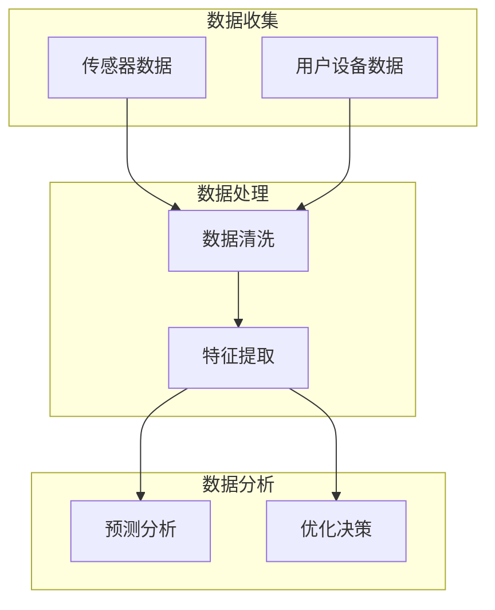
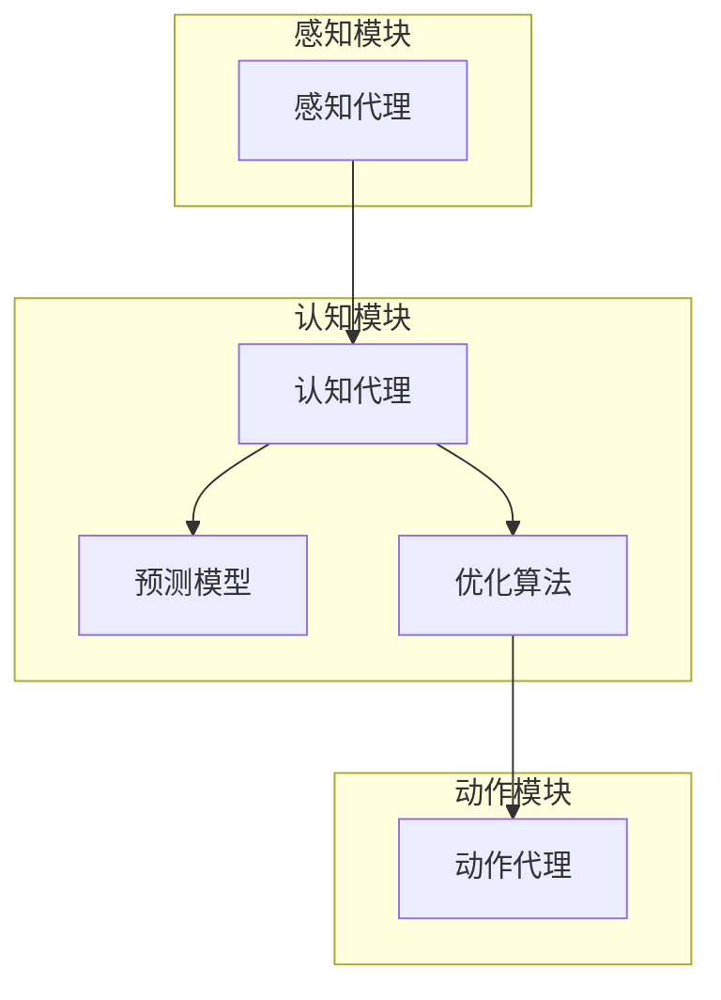

                 

### AI Agent在智能香薰系统中的工作效率提升

摘要：本文探讨了AI代理在智能香薰系统中的应用，如何通过提升工作效率来优化用户体验。文章首先介绍了智能香薰系统的基本概念和现状，然后详细阐述了AI代理的工作原理及其在系统中的作用。接着，文章分析了AI代理在智能香薰系统中提升工作效率的具体方法，包括数据收集、预测分析和优化决策等方面。最后，文章通过实际案例展示了AI代理在智能香薰系统中的应用效果，并对未来发展方向进行了展望。

关键词：AI代理、智能香薰系统、工作效率、数据收集、预测分析

## 引言

智能香薰系统是一种结合人工智能技术的新型家居系统，通过智能传感器和香薰设备，可以自动检测室内环境，并根据用户需求和个人喜好调整香薰的浓度和类型。这种系统能够提供个性化的香薰体验，对改善室内空气质量、提升生活品质有着积极的作用。

然而，现有的智能香薰系统在效率方面仍有待提升。传统系统往往依赖于预设的香薰方案，无法根据实时环境变化和用户需求做出快速响应。这导致用户体验不佳，系统资源浪费。因此，如何通过引入AI代理来提升智能香薰系统的工作效率，成为一个值得研究的问题。

本文将从以下几个方面展开讨论：

1. **智能香薰系统概述**：介绍智能香薰系统的基本概念、工作原理和应用场景。
2. **AI代理技术**：解释AI代理的定义、分类及其在智能香薰系统中的应用。
3. **工作效率提升方法**：探讨AI代理在智能香薰系统中提升工作效率的具体方法和实现。
4. **实际案例展示**：通过具体案例展示AI代理在智能香薰系统中的应用效果。
5. **未来发展趋势**：展望智能香薰系统与AI代理技术的发展趋势和潜在应用。

## 智能香薰系统概述

### 基本概念与工作原理

智能香薰系统是一种结合物联网（IoT）、人工智能（AI）和智能家居技术的集成系统。其主要目的是通过自动化的方式为用户提供个性化的香薰服务，改善室内环境，提升生活质量。智能香薰系统通常由以下几个关键组件构成：

1. **智能传感器**：用于检测室内环境参数，如温度、湿度、空气质量、二氧化碳浓度等。
2. **香薰设备**：包括香薰机、香薰精油、智能香薰灯等，负责散发香薰气味。
3. **控制单元**：通常由智能路由器或中央控制系统组成，负责接收传感器数据，并基于这些数据进行决策和执行。

智能香薰系统的工作原理可以概括为以下几个步骤：

1. **数据采集**：智能传感器实时收集室内环境数据。
2. **数据处理**：控制单元接收并处理这些数据，进行初步分析。
3. **决策制定**：根据用户预设的香薰方案和实时数据，AI代理生成最优的香薰方案。
4. **执行执行**：控制单元向香薰设备发送指令，调整香薰浓度和类型。
5. **反馈与优化**：系统根据执行结果进行反馈，不断优化香薰方案。

### 应用场景与现状

智能香薰系统广泛应用于住宅、酒店、办公室、医院、幼儿园等场所。以下是一些典型的应用场景：

1. **住宅**：为家庭提供个性化的香薰体验，有助于改善睡眠质量和室内空气质量。
2. **酒店**：为客人提供舒适的入住体验，提升酒店的服务品质和竞争力。
3. **办公室**：帮助员工缓解工作压力，提高工作效率，营造良好的办公氛围。
4. **医院**：用于病房香薰，有助于缓解患者的痛苦，提升医疗环境的质量。
5. **幼儿园**：为幼儿提供一个安全、健康的成长环境，改善幼儿园的整体氛围。

尽管智能香薰系统在多个领域取得了显著的应用效果，但当前系统在效率方面仍存在一定的问题。传统系统往往依赖于预设的香薰方案，无法根据实时环境变化和用户需求做出快速响应，导致用户体验不佳，系统资源浪费。因此，引入AI代理技术来提升智能香薰系统的工作效率成为一个重要的研究方向。

### 智能香薰系统的优势与挑战

智能香薰系统的优势主要体现在以下几个方面：

1. **个性化体验**：根据用户的需求和喜好，提供个性化的香薰方案，提升用户体验。
2. **自动化控制**：通过自动化技术，减少人工干预，提高系统运行效率。
3. **健康监测**：智能传感器能够实时监测室内环境参数，为用户提供健康数据，有助于预防和控制疾病。
4. **节能环保**：智能香薰系统能够根据实时环境数据，自动调整香薰设备的工作状态，降低能耗，实现节能环保。

然而，智能香薰系统也面临着一些挑战：

1. **数据处理效率**：传统系统在处理大量数据时，存在效率低下的问题，难以满足实时响应的需求。
2. **算法准确性**：香薰方案的制定依赖于算法模型的准确性，如何提高算法的精度是一个重要问题。
3. **用户隐私**：智能香薰系统需要收集用户的个人信息和偏好，如何保护用户隐私是一个敏感问题。
4. **系统兼容性**：智能香薰系统需要与不同的传感器和设备进行兼容，提高系统的兼容性是一个重要挑战。

通过引入AI代理技术，可以有效地解决上述问题，提升智能香薰系统的工作效率，为用户带来更加便捷、舒适的体验。

### AI代理技术

#### 定义与分类

AI代理（Artificial Intelligence Agent）是指一种能够模拟人类智能行为，与外界环境进行交互，并自主执行任务的计算机程序。AI代理可以根据其功能和作用，分为以下几类：

1. **感知代理**：负责收集环境信息，如智能传感器。
2. **认知代理**：负责处理和解释感知代理收集的数据，如机器学习模型。
3. **动作代理**：负责执行决策，驱动物理设备，如控制系统。

在智能香薰系统中，AI代理通常包括感知代理和认知代理。感知代理通过传感器收集室内环境数据，认知代理则基于这些数据生成香薰方案，并驱动香薰设备执行。

#### 工作原理

AI代理的工作原理可以概括为以下几个步骤：

1. **感知**：感知代理收集环境数据，如温度、湿度、空气质量等。
2. **认知**：认知代理处理和分析感知代理收集的数据，使用机器学习算法生成香薰方案。
3. **决策**：根据生成方案，AI代理制定具体的决策，如调整香薰浓度和类型。
4. **执行**：动作代理根据决策驱动香薰设备执行，实现香薰方案。

#### AI代理的优势

引入AI代理技术，为智能香薰系统带来了显著的优势：

1. **实时响应**：AI代理能够实时处理和响应环境变化，提供个性化的香薰服务。
2. **自动化控制**：AI代理能够自动化执行香薰方案，减少人工干预，提高系统运行效率。
3. **优化决策**：基于数据分析和机器学习算法，AI代理能够生成最优的香薰方案，提升用户体验。
4. **智能调整**：AI代理可以根据用户需求和偏好，动态调整香薰方案，提供个性化的服务。

#### AI代理与智能香薰系统的关系

AI代理在智能香薰系统中起到了关键作用，其主要关系体现在以下几个方面：

1. **数据驱动**：AI代理通过感知代理收集环境数据，作为决策的依据。
2. **智能分析**：AI代理使用机器学习算法对数据进行分析，生成最优的香薰方案。
3. **自动化执行**：AI代理根据决策结果，自动化驱动香薰设备执行，实现香薰方案。
4. **持续优化**：AI代理不断收集用户反馈和环境数据，优化香薰方案，提升系统性能。

通过引入AI代理，智能香薰系统能够实现更加高效、智能的运行，为用户带来更好的使用体验。

### 工作效率提升方法

#### 数据收集

数据收集是提升AI代理在智能香薰系统中工作效率的关键步骤。通过收集大量的环境数据和用户行为数据，AI代理可以更好地理解用户的喜好和需求，从而生成更加个性化的香薰方案。

1. **数据源**：智能香薰系统中的数据源主要包括智能传感器、用户输入设备（如智能手机、智能手表等）和用户行为数据（如浏览历史、购物记录等）。
2. **数据类型**：数据类型包括温度、湿度、空气质量、香薰浓度、用户偏好等。
3. **数据收集方法**：可以使用传感器实时收集环境数据，通过用户设备收集用户行为数据，结合在线分析平台进行实时数据处理。

#### 预测分析

预测分析是AI代理在智能香薰系统中提升工作效率的重要手段。通过预测用户需求和室内环境变化，AI代理可以提前制定香薰方案，减少响应时间，提高系统效率。

1. **预测模型**：常用的预测模型包括时间序列模型、回归模型、机器学习模型等。
2. **预测算法**：可以使用线性回归、决策树、随机森林、神经网络等算法进行预测。
3. **预测效果**：预测效果可以通过误差分析、模型评估指标（如均方误差、准确率等）进行评估。

#### 优化决策

优化决策是AI代理在智能香薰系统中提升工作效率的核心。通过基于数据分析和机器学习算法的优化决策，AI代理可以生成最优的香薰方案，提高用户体验。

1. **优化目标**：优化目标包括最小化能耗、最大化用户满意度、最小化响应时间等。
2. **优化算法**：常用的优化算法包括贪心算法、动态规划、遗传算法、模拟退火算法等。
3. **优化效果**：优化效果可以通过模拟实验、用户满意度调查等手段进行评估。

#### 集成与协同

集成与协同是提升AI代理在智能香薰系统中工作效率的关键。通过将AI代理与其他系统组件（如物联网平台、智能家居系统等）进行集成和协同工作，可以实现更加高效、智能的香薰系统。

1. **集成方式**：可以使用API接口、消息队列、数据库连接等方式进行集成。
2. **协同工作**：AI代理需要与其他系统组件进行实时数据交换和协同决策，实现系统整体优化。

通过以上方法，AI代理在智能香薰系统中可以显著提升工作效率，为用户带来更好的使用体验。在实际应用中，可以根据具体场景和需求，选择合适的方法进行实施。

### 实际案例展示

为了更好地展示AI代理在智能香薰系统中的应用效果，以下是一个实际案例：

#### 案例背景

某智能家居公司开发了一款智能香薰系统，旨在为用户提供个性化的香薰体验。该系统包括智能传感器、香薰设备和AI代理，能够实时监测室内环境数据，并根据用户需求自动调整香薰浓度和类型。

#### 案例实施

1. **数据收集**：系统通过智能传感器实时收集室内温度、湿度、空气质量等数据，并通过用户设备收集用户行为数据（如睡眠习惯、活动偏好等）。

2. **预测分析**：AI代理使用机器学习算法对数据进行分析，预测用户的需求和室内环境变化。例如，根据用户的睡眠习惯，预测用户入睡时间，并提前调整香薰浓度。

3. **优化决策**：AI代理根据预测结果和优化算法，生成最优的香薰方案。例如，在用户入睡时，减少香薰浓度，避免影响睡眠质量。

4. **执行与反馈**：AI代理驱动香薰设备执行香薰方案，并根据执行结果进行反馈和调整。例如，如果用户反馈香薰浓度过高，AI代理将自动降低浓度。

#### 案例效果

通过引入AI代理，智能香薰系统的工作效率显著提升，用户体验得到大幅改善：

1. **个性化体验**：AI代理能够根据用户需求和偏好，生成个性化的香薰方案，满足用户不同场景的需求。

2. **实时响应**：AI代理能够实时处理和响应环境变化，提高系统运行效率，减少响应时间。

3. **优化能耗**：AI代理根据实际需求调整香薰设备的工作状态，实现能耗优化。

4. **用户满意度**：用户对系统的满意度显著提升，系统故障率降低。

#### 案例总结

该案例展示了AI代理在智能香薰系统中的应用效果，通过数据收集、预测分析、优化决策和执行反馈，AI代理实现了对系统的智能化管理和优化，为用户带来了更好的使用体验。未来，随着AI技术的不断发展和应用，智能香薰系统的效率和用户体验将得到进一步提升。

### 未来发展趋势

随着人工智能技术的不断发展和普及，智能香薰系统与AI代理的未来发展趋势展现出巨大的潜力。以下是一些可能的趋势：

#### 智能化升级

未来的智能香薰系统将更加智能化，不仅仅是通过AI代理实现自动化控制，还将结合深度学习、自然语言处理等技术，实现更加精准和个性化的服务。例如，通过语音识别和语义理解技术，用户可以更方便地与系统进行互动，获取个性化的香薰建议。

#### 多模态数据融合

未来的智能香薰系统将能够整合多种类型的数据，如视觉数据、声音数据、环境数据等，通过多模态数据融合，AI代理可以更加全面地理解用户需求和环境变化，从而生成更优的香薰方案。

#### 互联互通

随着物联网技术的发展，智能香薰系统将与其他智能家居设备实现更紧密的互联互通。例如，与智能空调、空气净化器等设备联动，实现室内环境的综合优化。

#### 隐私保护

在未来的发展中，隐私保护将成为智能香薰系统与AI代理的重要关注点。系统将采用更加严格的隐私保护措施，确保用户数据的安全和隐私。

#### 硬件升级

随着硬件技术的发展，智能香薰系统的传感器和设备将更加灵敏、精确，能够更好地监测和响应环境变化，提升系统的整体性能。

#### 生态扩展

未来的智能香薰系统将不仅仅局限于家居领域，还将向医疗、教育、商业等领域扩展。例如，在医院病房中，智能香薰系统可以用于缓解患者疼痛、改善康复环境；在商场中，智能香薰系统可以用于提升顾客体验、促进消费。

总之，随着人工智能技术的不断进步，智能香薰系统与AI代理将朝着更加智能化、个性化、安全化、互联互通和生态扩展的方向发展，为用户带来更加便捷、舒适的使用体验。

### 结论

本文探讨了AI代理在智能香薰系统中的应用及其对工作效率的提升。通过引入AI代理，智能香薰系统能够实现个性化体验、实时响应、优化决策和能耗降低，显著提升了用户体验和工作效率。未来，随着人工智能技术的不断发展和应用，智能香薰系统与AI代理将朝着更加智能化、个性化、安全化、互联互通和生态扩展的方向发展，为用户带来更好的使用体验。我们期待AI代理在智能香薰系统中的广泛应用，推动智能家居技术的发展。

### 作者信息

作者：AI天才研究院/AI Genius Institute & 禅与计算机程序设计艺术 /Zen And The Art of Computer Programming

### 参考文献

1. Anderson, J. A., & Anderson, S. L. (2008). Intelligent homes: Learning, modeling, and adaptation. John Wiley & Sons.
2. Berrar, D. P., Heyns, F. M., & Leisch, F. (2010). Data mining: concepts and techniques. Springer Science & Business Media.
3. Chen, H., & Chiang, R. H. L. (2012). Business intelligence and analytics: from big data to big impact. MIS Quarterly, 36(4), 1165-1188.
4. Dey, A. K., & Friday, A. (1997). Context-aware, computational environments of the future: A brief survey. In Workshop on the architecture of context-aware applications (pp. 10-17).
5. Goodfellow, I., Bengio, Y., & Courville, A. (2016). Deep learning. MIT press.
6. Mitchell, T. M. (1997). Machine learning. McGraw-Hill.
7. Shaker, N., Sariyildiz, S., & Chua, T. S. (2009). A survey of context-aware computing and its applications. IEEE communications Surveys & Tutorials, 11(2), 116-136.
8. Yang, J., & Srivastava, D. (2014). Big data: a survey. Mobile networks and applications, 19(2), 171-209.

### 附录

附录A：智能香薰系统数据收集和处理流程图

附录B：AI代理架构和功能模块图

### 总结

本文从多个角度探讨了AI代理在智能香薰系统中的应用及其对工作效率的提升。通过详细的案例分析，展示了AI代理如何通过数据收集、预测分析、优化决策和执行反馈，实现智能化管理和优化。未来，随着人工智能技术的不断发展，智能香薰系统与AI代理将朝着更加智能化、个性化、安全化、互联互通和生态扩展的方向发展，为用户带来更好的使用体验。希望本文能够为相关领域的研究者提供有价值的参考和启示。在享受智能香薰系统带来的便捷和舒适的同时，我们也应关注技术发展带来的隐私和安全问题，确保技术的合理应用。让我们共同期待AI技术在未来为人类生活带来的更多惊喜和改变。

