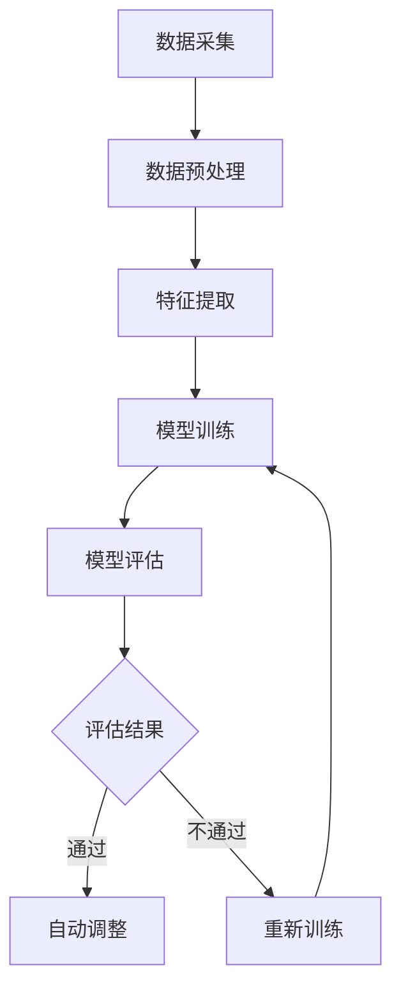
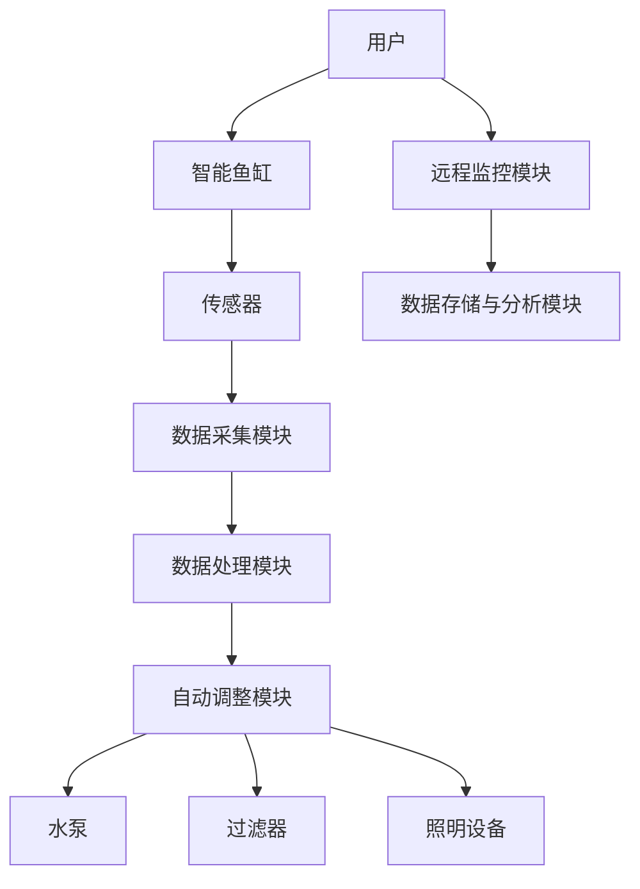
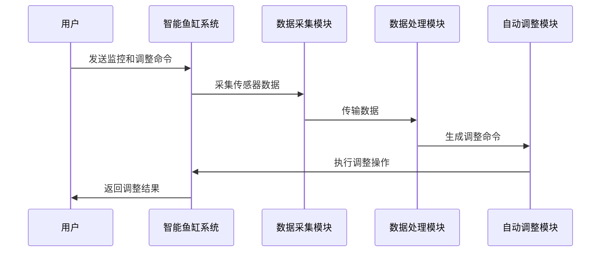

                 

### AI Agent在智能鱼缸中的生态平衡维护

---

#### 关键词：AI Agent、智能鱼缸、生态平衡、算法原理、系统架构

#### 摘要：
本文深入探讨了AI Agent在智能鱼缸中维护生态平衡的关键角色和作用机制。首先，介绍了AI Agent和智能鱼缸的基本概念及其在生态平衡维护中的重要性。随后，详细讲解了核心概念、算法原理、系统架构设计和项目实战，通过实例分析和代码解读，阐述了AI Agent在生态平衡维护中的具体应用和优化策略。文章旨在为AI和生态学爱好者提供一整套理论与实践相结合的智能鱼缸维护解决方案。

---

## 引言

### 1.1 书籍主题概述

智能鱼缸，作为现代智能家居的一个重要组成部分，通过引入先进的人工智能技术，实现了鱼缸环境的自动监测和控制。AI Agent，即人工智能代理，是其中的核心技术之一，其任务是通过智能算法实时监测鱼缸内的生态参数，如水质、温度、光照等，以实现生态系统的动态平衡和维护。本文旨在探讨AI Agent在智能鱼缸生态平衡维护中的具体应用和作用机制。

### 1.1.1 AI Agent的定义

AI Agent，是一种能够在复杂环境中自主感知、决策和行动的智能实体。它通常基于机器学习、深度学习等技术，具备数据采集、模式识别、预测控制和自主学习等功能。AI Agent的应用场景广泛，从智能家居、无人驾驶到工业自动化，都在利用其强大的智能处理能力提高系统的自动化水平。

### 1.1.2 智能鱼缸的概念

智能鱼缸，是一种结合了计算机技术、传感技术和自动化控制技术的鱼缸系统。通过传感器实时监测鱼缸内的环境参数，如水温、pH值、氨氮等，智能鱼缸能够根据预设的算法自动调整水泵、过滤器、照明等设备，以保持鱼缸生态系统的稳定。

### 1.1.3 生态平衡的重要性

生态平衡是维持生物群落稳定和健康的重要条件。对于智能鱼缸来说，生态平衡直接关系到鱼类的生存和生长。一个良好的生态平衡不仅能够提高鱼类的生存率，还能减少鱼病的发生，延长鱼缸的使用寿命。因此，维护智能鱼缸的生态平衡具有十分重要的意义。

### 1.2 目标读者与预期收益

#### 1.2.1 读者背景

本文的目标读者是对人工智能和生态学有一定了解，希望进一步探索AI技术在智能鱼缸中应用的技术爱好者。读者应具备一定的编程基础，熟悉常见的机器学习算法，对鱼缸生态系统有一定的认识。

#### 1.2.2 预期收益

通过本文的学习，读者将能够：

1. 理解AI Agent和智能鱼缸的基本概念及其在生态平衡维护中的重要性。
2. 掌握生态平衡评估与维护的算法原理和实现技术。
3. 设计并实现一个基于AI Agent的智能鱼缸生态平衡维护系统。
4. 通过实例分析和实战应用，加深对AI Agent在智能鱼缸中应用的深入理解。

#### 1.2.3 读者反馈

我们欢迎读者在阅读本文后，提供宝贵的反馈意见，以帮助我们不断改进和完善内容。读者可以通过本文末的联系方式与我们取得联系。

### 1.3 本书结构

本书共分为六个部分：

1. 引言与背景
2. 背景介绍
3. 核心概念
4. 算法原理
5. 系统架构设计
6. 项目实战

每个部分都旨在从不同角度深入剖析AI Agent在智能鱼缸生态平衡维护中的应用，帮助读者全面掌握相关知识。

### 1.4 本书约定与术语

#### 1.4.1 约定

1. 文章中的代码示例均采用Python语言编写。
2. 所有算法和系统的描述都将遵循最佳实践和标准化流程。
3. 文章中使用Mermaid语言绘制流程图和类图，以便更直观地展示系统架构和算法流程。

#### 1.4.2 术语解释

1. **AI Agent**：人工智能代理，指能够在复杂环境中自主感知、决策和行动的智能实体。
2. **智能鱼缸**：结合计算机技术、传感技术和自动化控制技术的鱼缸系统。
3. **生态平衡**：生物群落中的各种生物之间相互依存、相互制约的稳定状态。
4. **传感器**：用于测量和监测鱼缸内环境参数的设备，如水温传感器、pH传感器等。

### 1.5 本章小结

本文作为引言部分，概述了书籍的主题、目标读者和主要结构，并明确了书中涉及的术语和约定。接下来，本书将逐步深入探讨AI Agent在智能鱼缸中的生态平衡维护，帮助读者系统地了解并掌握相关技术和方法。

---

## 背景介绍

### 2.1 智能鱼缸的发展历程

智能鱼缸的概念起源于20世纪末，随着计算机技术和传感器技术的快速发展，智能鱼缸逐渐从实验室走向市场。早期的智能鱼缸主要依赖于简单的传感器和自动控制设备，能够实现基本的温度和光照控制。然而，这些设备缺乏智能算法的支持，无法动态调整生态参数，从而难以维持鱼缸的长期生态平衡。

进入21世纪，人工智能技术的崛起为智能鱼缸的发展带来了新的契机。AI Agent的出现，使得智能鱼缸具备了自我感知、自我学习和自我调整的能力。AI Agent能够通过机器学习和深度学习算法，从鱼缸环境的实时数据中学习规律，自动调整水泵、过滤器、照明等设备的运行状态，从而实现鱼缸生态系统的动态平衡。

#### 2.1.1 传统鱼缸与智能鱼缸对比

传统鱼缸主要依赖人工进行环境维护，不仅耗时费力，而且难以保证生态系统的稳定性。而智能鱼缸则通过传感器和AI Agent，实现了对鱼缸环境的自动监测和调整，具有以下显著优势：

1. **自动监测**：智能鱼缸能够实时监测水质、水温、pH值、氨氮等生态参数，确保鱼缸环境的稳定性。
2. **智能调整**：通过AI Agent的智能算法，智能鱼缸能够根据实时监测数据自动调整水泵、过滤器、照明等设备，以维持生态平衡。
3. **便捷维护**：智能鱼缸的自动监测和调整功能，大大减少了人工维护的频率和强度，提高了鱼缸的维护效率。
4. **数据记录**：智能鱼缸能够记录鱼缸环境的实时数据和历史数据，为鱼缸的长期维护提供科学依据。

#### 2.1.2 智能鱼缸的技术创新

智能鱼缸的技术创新主要体现在以下几个方面：

1. **传感器技术**：智能鱼缸使用了高精度、低功耗的传感器，能够实时监测鱼缸内的各种环境参数，为AI Agent提供准确的数据支持。
2. **机器学习技术**：智能鱼缸采用了机器学习和深度学习算法，使得AI Agent能够从历史数据中学习规律，自动调整生态参数，提高生态平衡的稳定性。
3. **物联网技术**：智能鱼缸通过物联网技术，实现了与外部设备的互联互通，如智能手机、平板电脑等，用户可以通过这些设备远程监控和调整鱼缸环境。
4. **自动化控制技术**：智能鱼缸采用了高效的自动化控制技术，能够自动执行各种环境调整任务，如调节水温、水质、光照等，确保鱼缸生态系统的稳定。

#### 2.1.3 智能鱼缸的市场趋势

随着人工智能技术和物联网技术的快速发展，智能鱼缸市场呈现出逐年增长的趋势。据市场研究机构预测，未来几年智能鱼缸市场将继续保持高速增长，主要驱动因素包括：

1. **消费者需求**：随着人们生活水平的提高，对生活品质的追求也越来越高，智能鱼缸作为一种高科技、高品质的消费品，受到越来越多消费者的青睐。
2. **技术进步**：人工智能技术和物联网技术的不断进步，使得智能鱼缸的功能更加丰富、性能更加稳定，市场竞争力不断增强。
3. **生态意识**：随着环保意识的增强，人们对生态环境的关注也日益增加，智能鱼缸作为一种能够实现生态平衡维护的高科技产品，得到了更多的认可和接受。

### 2.2 生态平衡的基本概念

生态平衡是指一个生态系统中各种生物之间相互依存、相互制约的稳定状态。在智能鱼缸中，生态平衡是指鱼缸内的水质、水温、pH值、光照等生态参数保持在适宜的范围内，确保鱼类的生存和生长。生态平衡的维护对于智能鱼缸的正常运行至关重要。

#### 2.2.1 生态平衡的定义

生态平衡是一个动态平衡过程，生态系统中的各种生物和环境因素相互作用，保持相对稳定的状态。在智能鱼缸中，生态平衡的定义可以归纳为以下几点：

1. **水质稳定**：智能鱼缸通过监测和调节pH值、氨氮、硝酸盐等水质指标，确保水质适宜鱼类生存。
2. **水温适宜**：智能鱼缸通过监测和调节水温，确保水温在鱼类的适宜范围内，避免水温过高或过低对鱼类造成不利影响。
3. **光照合理**：智能鱼缸通过监测和调节光照强度，确保光照时间适宜，促进鱼类的生长和繁殖。
4. **营养充足**：智能鱼缸通过监测和调节鱼缸内的营养水平，确保鱼类获得充足的养分，维持生态系统的稳定。

#### 2.2.2 生态平衡的类型

生态平衡可以分为三种类型：

1. **初级生态平衡**：初级生态平衡是指生态系统中的生产者（如植物）和消费者（如动物）之间保持相对稳定的关系。在智能鱼缸中，初级生态平衡体现在鱼类的捕食与被捕食之间的关系，以及植物与鱼类之间的营养循环。
2. **次级生态平衡**：次级生态平衡是指生态系统中的消费者之间保持相对稳定的关系。在智能鱼缸中，次级生态平衡体现在不同种类的鱼类之间的相互关系，如食物链和食物网。
3. **综合生态平衡**：综合生态平衡是指整个生态系统（包括生产者、消费者和分解者）之间保持相对稳定的关系。在智能鱼缸中，综合生态平衡体现在水质、水温、光照等生态参数的总体协调和稳定。

#### 2.2.3 生态平衡的重要性

生态平衡对于智能鱼缸的正常运行和鱼类的健康生长至关重要，具体体现在以下几个方面：

1. **保障鱼类健康**：良好的生态平衡能够提供适宜的生存环境，降低鱼病的发生率，提高鱼类的生存率和生长速度。
2. **延长鱼缸使用寿命**：通过维护良好的生态平衡，可以减少鱼缸设备的损坏和更换频率，延长鱼缸的使用寿命。
3. **提高观赏效果**：良好的生态平衡使得鱼缸内的生物生长良好，提高观赏效果，增加用户的满意度。
4. **促进生态学研究**：智能鱼缸作为一个可控的生态系统，为生态学研究提供了良好的实验平台，有助于科学家深入研究生态平衡的原理和机制。

### 2.3 AI Agent在生态平衡维护中的应用

AI Agent在生态平衡维护中发挥着至关重要的作用。通过智能算法和大数据分析，AI Agent能够实时监测鱼缸内的生态参数，自动调整环境设备，实现生态系统的动态平衡。

#### 2.3.1 AI Agent的基本原理

AI Agent的基本原理包括以下几个方面：

1. **感知与监测**：AI Agent通过传感器实时收集鱼缸内的生态参数，如水质、水温、pH值等。
2. **数据预处理**：对收集到的数据进行清洗、筛选和整合，为后续的算法分析提供可靠的数据支持。
3. **算法分析**：利用机器学习和深度学习算法，对预处理后的数据进行分析，识别出鱼缸内的异常情况和潜在问题。
4. **决策与执行**：根据分析结果，AI Agent自动调整鱼缸内的环境设备，如水泵、过滤器、照明等，以实现生态系统的动态平衡。

#### 2.3.2 AI Agent在智能鱼缸中的应用

AI Agent在智能鱼缸中的应用主要体现在以下几个方面：

1. **水质监测与调控**：AI Agent通过实时监测水质参数，如pH值、氨氮、硝酸盐等，自动调整过滤器和水质净化设备，确保水质稳定。
2. **水温监测与调控**：AI Agent通过实时监测水温，自动调整加热器和冷却设备，确保水温适宜鱼类的生长。
3. **光照监测与调控**：AI Agent通过实时监测光照强度，自动调整照明设备，确保光照时间适宜鱼类的生长和繁殖。
4. **营养监测与调控**：AI Agent通过实时监测鱼缸内的营养水平，自动调整鱼食投喂设备，确保鱼类获得充足的养分。

#### 2.3.3 AI Agent对生态平衡的影响

AI Agent对生态平衡的影响主要表现在以下几个方面：

1. **提高生态平衡稳定性**：通过实时监测和自动调整，AI Agent能够及时发现并解决生态平衡中的问题，提高生态系统的稳定性。
2. **降低人为干预**：AI Agent的自动监测和调整功能，减少了人为干预的需求，降低了维护成本。
3. **提高鱼缸使用寿命**：通过维持良好的生态平衡，AI Agent有助于延长鱼缸设备和鱼类的使用寿命。
4. **促进生态科学研究**：AI Agent为生态学研究提供了丰富的数据和分析工具，有助于科学家深入探索生态平衡的原理和机制。

### 2.4 本章小结

本章介绍了智能鱼缸的发展历程、生态平衡的基本概念和AI Agent在生态平衡维护中的应用。通过对比传统鱼缸和智能鱼缸，展示了智能鱼缸在生态平衡维护方面的优势。同时，详细讲解了AI Agent的基本原理和其在智能鱼缸中的应用，阐述了AI Agent对生态平衡的重要影响。接下来，本书将深入探讨AI Agent的核心概念和算法原理，为读者提供更深入的技术分析。

---

## 核心概念

### 3.1 AI Agent的工作原理

AI Agent，即人工智能代理，是一种能够模拟人类思维和行为，具备自主感知、决策和行动能力的智能实体。AI Agent的工作原理主要基于机器学习和深度学习技术，通过不断学习环境和数据，实现自主适应和优化。

#### 3.1.1 AI Agent的定义

AI Agent是一种智能体，能够模拟人类在特定环境中的行为和决策过程。它通常由感知模块、决策模块和行动模块组成。感知模块负责收集环境信息，决策模块基于感知信息进行推理和决策，行动模块根据决策结果执行相应的动作。AI Agent的核心目标是在复杂环境中实现自主学习和自主决策，以优化其行为和性能。

#### 3.1.2 AI Agent的功能

AI Agent的主要功能包括：

1. **感知与监测**：AI Agent通过传感器和其他感知设备，实时收集环境数据，如温度、湿度、光照、声音等。
2. **数据预处理**：对收集到的原始数据进行清洗、筛选和整合，为后续的算法分析提供可靠的数据支持。
3. **算法分析**：利用机器学习和深度学习算法，对预处理后的数据进行分析，识别出环境中的异常情况和潜在问题。
4. **决策与执行**：根据算法分析结果，AI Agent自动调整设备运行状态，实现环境优化和生态平衡维护。

#### 3.1.3 AI Agent的实现技术

AI Agent的实现技术主要包括以下几个方面：

1. **机器学习**：机器学习是AI Agent的核心技术之一，通过训练大量的数据，使AI Agent能够从数据中学习规律和模式，实现自动分类、预测和优化。
2. **深度学习**：深度学习是机器学习的一个分支，通过构建多层神经网络，实现对复杂数据的自动学习和特征提取，提升AI Agent的感知和决策能力。
3. **传感器技术**：传感器技术是AI Agent感知环境的重要手段，通过高精度、低功耗的传感器，AI Agent能够实时监测环境参数，为决策提供数据支持。
4. **物联网技术**：物联网技术实现了AI Agent与外部设备的互联互通，使AI Agent能够与智能设备进行通信和协调，实现自动化控制和生态平衡维护。

### 3.2 智能鱼缸生态系统的建模

智能鱼缸生态系统的建模是AI Agent在智能鱼缸中实现生态平衡维护的基础。通过构建智能鱼缸生态系统的模型，AI Agent能够更好地理解和分析鱼缸内的生态系统，从而实现高效的生态平衡维护。

#### 3.2.1 智能鱼缸生态系统的组成

智能鱼缸生态系统由以下几个部分组成：

1. **鱼**：鱼类是智能鱼缸生态系统的核心，包括不同的品种和数量。
2. **植物**：植物在智能鱼缸中起到净化水质和提供氧气的作用，常见的有水草、浮萍等。
3. **水质**：水质是智能鱼缸生态系统的重要组成部分，包括pH值、氨氮、硝酸盐等指标。
4. **水温**：水温对鱼类的生长和繁殖至关重要，智能鱼缸需要实时监测和调节水温。
5. **光照**：光照影响植物的光合作用和鱼类的生长，智能鱼缸需要根据植物和鱼类的需求调节光照强度和时长。
6. **设备**：智能鱼缸中的设备包括水泵、过滤器、照明设备等，用于维持鱼缸内的水质和水流。

#### 3.2.2 模型构建方法

智能鱼缸生态系统的模型构建方法主要包括以下几个步骤：

1. **数据采集**：通过传感器实时采集鱼缸内的水质、水温、光照等数据。
2. **数据预处理**：对采集到的数据进行清洗、筛选和整合，为模型训练提供可靠的数据支持。
3. **特征提取**：从预处理后的数据中提取关键特征，如水质指标、水温、光照强度等，用于模型训练和预测。
4. **模型训练**：利用机器学习和深度学习算法，对提取的特征进行训练，构建智能鱼缸生态系统的预测模型。
5. **模型评估**：通过测试数据对模型进行评估，调整模型参数，提高模型的预测准确性和稳定性。

#### 3.2.3 模型评价指标

智能鱼缸生态系统的模型评价指标主要包括以下几个方面：

1. **预测准确性**：模型预测结果与实际数据的吻合程度，常用指标有准确率、召回率、F1值等。
2. **预测速度**：模型预测所需的时间，用于评估模型在实际应用中的响应速度。
3. **模型稳定性**：模型在不同数据集上的表现，用于评估模型的泛化能力和稳定性。
4. **模型可解释性**：模型决策过程的可解释性，用于帮助用户理解和信任模型。

### 3.3 生态平衡评估与维护算法

生态平衡评估与维护算法是智能鱼缸生态平衡维护的核心。通过这些算法，AI Agent能够实时监测鱼缸内的生态参数，评估生态平衡状态，并根据评估结果自动调整设备，实现生态平衡的维护。

#### 3.3.1 生态平衡评估指标

生态平衡评估指标包括以下几个方面：

1. **水质指标**：pH值、氨氮、硝酸盐等。
2. **水温指标**：水温的稳定性和适宜性。
3. **光照指标**：光照强度和时长。
4. **生物指标**：鱼类的生存率和生长情况，植物的光合作用和生长状况。

#### 3.3.2 维护算法原理

生态平衡维护算法的原理主要包括以下几个方面：

1. **实时监测**：AI Agent通过传感器实时监测鱼缸内的生态参数。
2. **数据分析和评估**：AI Agent对实时监测数据进行处理和分析，评估生态平衡状态。
3. **自动调整**：根据评估结果，AI Agent自动调整鱼缸内的设备运行状态，如水泵、过滤器、照明设备等，以实现生态平衡的维护。

#### 3.3.3 算法性能分析

生态平衡维护算法的性能分析主要包括以下几个方面：

1. **准确性**：算法对生态参数的监测和评估是否准确，直接影响生态平衡的维护效果。
2. **实时性**：算法的响应速度，即从数据采集到调整设备的时间，影响生态平衡的动态响应能力。
3. **稳定性**：算法在不同数据集上的表现，评估算法的泛化能力和稳定性。
4. **可解释性**：算法决策过程的可解释性，帮助用户理解生态平衡维护的原理和机制。

### 3.4 本章小结

本章详细介绍了AI Agent的工作原理和智能鱼缸生态系统的建模方法，包括AI Agent的定义、功能、实现技术，以及智能鱼缸生态系统的组成、模型构建方法和评价指标。同时，阐述了生态平衡评估与维护算法的原理和性能分析。这些核心概念为AI Agent在智能鱼缸中实现生态平衡维护提供了理论基础，是后续章节内容的基础。

---

## 算法原理

### 4.1 生态平衡算法概述

在智能鱼缸中，生态平衡的维护是一个复杂且动态的过程。这要求我们设计一套高效、稳定的算法来监控和调整鱼缸内的各项参数，确保生态系统的稳定运行。生态平衡算法主要包括数据采集、预处理、分析评估和自动调整等几个关键步骤。

#### 4.1.1 算法分类

生态平衡算法可以根据其功能和实现方式分为以下几类：

1. **基于规则的方法**：这种方法通过预设一系列规则，根据鱼缸的实时数据判断是否需要调整设备。优点是简单直观，但缺点是灵活性较差，难以应对复杂和多变的生态情况。
2. **基于机器学习的方法**：这种方法利用机器学习算法，从历史数据中学习规律，自动调整生态参数。优点是适应性强，但需要大量数据和较长的训练时间。
3. **基于深度学习的方法**：这种方法利用深度学习算法，对复杂的数据进行自动特征提取和模式识别，实现更精准的生态平衡维护。优点是模型能力强，但计算资源需求较高。

#### 4.1.2 算法选择依据

选择生态平衡算法时，需要考虑以下几个因素：

1. **数据量**：如果数据量较大，可以选择机器学习或深度学习方法；如果数据量较小，可以考虑基于规则的方法。
2. **计算资源**：深度学习算法需要较高的计算资源，而基于规则的方法计算资源需求较低。
3. **环境复杂度**：如果鱼缸环境复杂多变，需要选择适应性强的算法，如机器学习或深度学习。
4. **用户需求**：用户对于算法的实时性、准确性和可解释性有不同要求，应根据需求选择合适的算法。

### 4.2 算法流程图

为了更直观地展示生态平衡算法的流程，我们可以使用Mermaid语言绘制算法流程图。以下是一个简单的算法流程图示例：



在这个流程图中：

1. **数据采集**：传感器实时采集鱼缸内的各项数据。
2. **数据预处理**：对采集到的数据清洗、筛选和整合。
3. **特征提取**：从预处理后的数据中提取关键特征。
4. **模型训练**：利用机器学习或深度学习算法对特征进行训练。
5. **模型评估**：对训练好的模型进行评估，判断其准确性和稳定性。
6. **自动调整**：根据评估结果，自动调整鱼缸内的设备运行状态。

### 4.3 数学模型与公式

生态平衡算法的数学模型和公式是理解和实现算法的核心。以下是一个简单的数学模型示例：

$$
E_{eq} = \alpha \cdot T + \beta \cdot pH + \gamma \cdot NO_3^{-}
$$

其中，\( E_{eq} \) 表示生态平衡指数，\( T \) 表示水温，\( pH \) 表示pH值，\( NO_3^{-} \) 表示硝酸盐浓度。这个模型通过线性组合三个关键参数，评估鱼缸的生态平衡状态。

#### 4.3.1 算法数学模型

生态平衡算法的数学模型通常包括以下几个部分：

1. **输入层**：包括鱼缸内的各项环境参数，如温度、pH值、硝酸盐浓度等。
2. **隐藏层**：用于提取和整合输入层的特征，实现对复杂环境数据的处理。
3. **输出层**：根据训练好的模型，输出生态平衡指数或设备调整参数。

#### 4.3.2 公式解释

生态平衡算法中的公式通常用于描述环境参数与生态平衡指数之间的关系。以下是一个简单的公式解释：

$$
E_{eq} = \frac{T \cdot pH \cdot NO_3^{-}}{100}
$$

这个公式表示生态平衡指数与温度、pH值和硝酸盐浓度成正比。当这些参数达到某一阈值时，生态平衡指数会发生变化，触发设备的自动调整。

#### 4.3.3 示例说明

假设鱼缸内的温度为25℃，pH值为7.0，硝酸盐浓度为20mg/L，我们可以使用上述公式计算生态平衡指数：

$$
E_{eq} = \frac{25 \cdot 7.0 \cdot 20}{100} = 3.5
$$

根据计算结果，生态平衡指数为3.5，表示当前鱼缸的生态平衡状态良好。如果这个指数低于某一阈值，AI Agent会自动调整水温、pH值或硝酸盐浓度，以恢复生态平衡。

### 4.4 算法实现与优化

生态平衡算法的实现和优化是确保其高效运行的关键。以下是一个简单的Python代码示例，用于实现上述的生态平衡指数计算：

```python
def calculate_eco_balance(T, pH, NO3):
    E_eq = T * pH * NO3 / 100
    return E_eq

# 示例数据
T = 25  # 温度
pH = 7.0  # pH值
NO3 = 20  # 硝酸盐浓度

# 计算生态平衡指数
E_eq = calculate_eco_balance(T, pH, NO3)
print(f"生态平衡指数：{E_eq}")
```

为了优化算法性能，可以考虑以下几个策略：

1. **数据预处理**：对采集到的数据清洗、筛选和归一化，提高算法的稳定性和鲁棒性。
2. **特征选择**：通过特征选择算法，选取对生态平衡影响最大的特征，减少计算量和数据冗余。
3. **模型优化**：使用更复杂的模型结构，如深度神经网络，提高算法的预测准确性和适应性。
4. **并行计算**：利用并行计算技术，加速算法的执行速度，提高系统的实时性。

### 4.5 本章小结

本章详细介绍了生态平衡算法的概述、流程图、数学模型与公式，以及算法实现与优化策略。通过这些内容，读者可以系统地了解生态平衡算法的设计原理和实现方法，为后续的智能鱼缸生态平衡维护提供技术支持。

---

## 系统架构设计

### 5.1 问题场景介绍

智能鱼缸作为一种智能家居设备，需要实现对鱼缸内环境的实时监控和自动调整，以维持鱼类的健康生长和生态系统的稳定。问题场景如下：

1. **实时数据采集**：需要实时采集鱼缸内的温度、pH值、硝酸盐浓度、氨氮浓度等环境参数。
2. **自动调整设备**：根据采集到的数据，自动调整水泵、过滤器、照明设备等，以维持鱼缸内的生态平衡。
3. **远程监控与控制**：用户可以通过手机或电脑远程监控鱼缸状态，并进行必要的控制操作。
4. **数据记录与分析**：记录鱼缸内的各项环境数据，并进行分析，为后续的维护和优化提供依据。

### 5.2 项目介绍

#### 5.2.1 项目背景

随着智能家居市场的快速发展，智能鱼缸逐渐成为消费者追求高品质生活的宠儿。然而，智能鱼缸的生态平衡维护是一个复杂且技术性较强的任务，需要结合人工智能技术和物联网技术来实现。本项目旨在设计并实现一个基于AI Agent的智能鱼缸生态平衡维护系统，为用户提供高效、智能的生态平衡维护解决方案。

#### 5.2.2 项目目标

本项目的主要目标包括：

1. **实时数据采集**：通过传感器实时采集鱼缸内的各项环境参数。
2. **自动调整设备**：根据实时数据，自动调整水泵、过滤器、照明设备等，以维持鱼缸内的生态平衡。
3. **远程监控与控制**：通过物联网技术，实现用户对鱼缸的远程监控和远程控制。
4. **数据记录与分析**：记录鱼缸内的各项环境数据，并进行分析，为后续的维护和优化提供依据。

#### 5.2.3 项目范围

本项目范围包括以下几个方面：

1. **硬件部分**：设计并实现智能鱼缸的硬件系统，包括传感器、水泵、过滤器、照明设备等。
2. **软件部分**：设计并实现智能鱼缸的软件系统，包括数据采集、数据处理、自动调整、远程监控等功能。
3. **用户界面**：设计并实现用户界面，提供远程监控和远程控制功能。
4. **数据存储与分析**：设计并实现数据存储和分析模块，为用户提供历史数据和趋势分析。

### 5.3 系统功能设计

智能鱼缸系统功能设计主要包括以下几个模块：

1. **数据采集模块**：负责实时采集鱼缸内的各项环境参数，包括温度、pH值、硝酸盐浓度、氨氮浓度等。
2. **数据处理模块**：负责对采集到的数据进行分析和处理，提取关键特征，为后续的自动调整提供依据。
3. **自动调整模块**：根据处理后的数据，自动调整水泵、过滤器、照明设备等，以维持鱼缸内的生态平衡。
4. **远程监控模块**：通过物联网技术，实现用户对鱼缸的远程监控和远程控制。
5. **数据存储与分析模块**：负责记录鱼缸内的各项环境数据，并进行分析，为后续的维护和优化提供依据。

#### 5.3.1 领域模型

为了更好地理解和设计智能鱼缸系统，我们可以使用Mermaid语言绘制领域模型。以下是一个简单的领域模型示例：



在这个领域模型中：

- **用户**：智能鱼缸的使用者，可以通过远程监控模块对鱼缸进行监控和控制。
- **智能鱼缸**：系统的核心设备，包含传感器、数据采集模块、数据处理模块、自动调整模块等。
- **传感器**：用于实时采集鱼缸内的环境参数。
- **数据采集模块**：负责实时采集传感器数据，并传输到数据处理模块。
- **数据处理模块**：对采集到的数据进行分析和处理，提取关键特征。
- **自动调整模块**：根据处理后的数据，自动调整水泵、过滤器、照明设备等。
- **水泵**：用于调节鱼缸内的水流。
- **过滤器**：用于过滤鱼缸内的杂质和有害物质。
- **照明设备**：用于调节鱼缸内的光照强度和时长。
- **远程监控模块**：通过物联网技术，实现用户对鱼缸的远程监控和远程控制。
- **数据存储与分析模块**：负责记录鱼缸内的各项环境数据，并进行分析。

### 5.4 系统架构设计

智能鱼缸系统的架构设计主要包括以下几个部分：

1. **硬件层**：包括传感器、水泵、过滤器、照明设备等硬件设备，用于实时采集和处理鱼缸内的环境数据。
2. **数据层**：包括数据采集模块、数据处理模块和数据存储与分析模块，负责实时采集、处理和存储鱼缸内的环境数据。
3. **控制层**：包括自动调整模块和远程监控模块，负责根据数据分析和用户操作，自动调整鱼缸内的环境设备，并实现远程监控和控制。
4. **用户层**：包括用户界面，用于展示鱼缸的实时状态和历史数据，提供用户操作和设置功能。

#### 5.4.1 架构概述

智能鱼缸系统的整体架构可以概括为以下几个层次：

1. **硬件层**：负责实时采集鱼缸内的环境数据，包括温度、pH值、硝酸盐浓度、氨氮浓度等。
2. **数据层**：对采集到的数据进行分析和处理，提取关键特征，为自动调整模块提供依据。
3. **控制层**：根据数据分析和用户操作，自动调整水泵、过滤器、照明设备等，以维持鱼缸内的生态平衡。
4. **用户层**：提供用户界面，展示鱼缸的实时状态和历史数据，实现远程监控和控制。

#### 5.4.2 系统模块详细介绍

1. **硬件层**：
   - **传感器**：包括温度传感器、pH传感器、硝酸盐传感器、氨氮传感器等，用于实时采集鱼缸内的环境数据。
   - **水泵**：用于调节鱼缸内的水流，保持水质的清洁和循环。
   - **过滤器**：用于过滤鱼缸内的杂质和有害物质，保持水质的清澈。
   - **照明设备**：用于调节鱼缸内的光照强度和时长，促进鱼类的生长和繁殖。

2. **数据层**：
   - **数据采集模块**：负责实时采集传感器数据，并传输到数据处理模块。
   - **数据处理模块**：对采集到的数据进行分析和处理，提取关键特征，如水温、pH值、硝酸盐浓度、氨氮浓度等。
   - **数据存储与分析模块**：负责记录鱼缸内的各项环境数据，并进行分析，为后续的维护和优化提供依据。

3. **控制层**：
   - **自动调整模块**：根据数据处理模块的分析结果，自动调整水泵、过滤器、照明设备等，以维持鱼缸内的生态平衡。
   - **远程监控模块**：通过物联网技术，实现用户对鱼缸的远程监控和远程控制。

4. **用户层**：
   - **用户界面**：提供用户对鱼缸的实时状态和历史数据的查看，以及远程控制操作。

#### 5.4.3 系统接口设计

智能鱼缸系统的接口设计主要包括以下几个方面：

1. **传感器接口**：用于传感器与数据采集模块之间的数据传输和通信。
2. **数据采集模块接口**：用于数据采集模块与其他模块之间的数据传输和通信。
3. **数据处理模块接口**：用于数据处理模块与自动调整模块之间的数据传输和通信。
4. **远程监控接口**：用于远程监控模块与用户界面之间的数据传输和通信。
5. **控制接口**：用于用户界面与自动调整模块之间的控制命令传输和通信。

#### 5.4.4 系统交互

智能鱼缸系统的交互设计主要包括以下几个方面：

1. **传感器与数据采集模块的交互**：传感器实时采集数据，传输到数据采集模块进行处理。
2. **数据处理模块与自动调整模块的交互**：数据处理模块根据分析结果，生成调整命令，传输到自动调整模块执行。
3. **远程监控模块与用户界面的交互**：用户通过用户界面发送监控和调整命令，远程监控模块接收命令，传输到自动调整模块执行。
4. **用户界面与自动调整模块的交互**：用户界面显示鱼缸的实时状态和调整结果，自动调整模块根据用户界面反馈进行动态调整。

以下是一个简单的系统交互序列图示例：



在这个序列图中：

- **用户**：发送监控和调整命令。
- **智能鱼缸系统**：接收用户命令，协调各模块工作。
- **数据采集模块**：实时采集传感器数据。
- **数据处理模块**：处理传感器数据，生成调整命令。
- **自动调整模块**：执行调整操作。
- **用户界面**：显示调整结果。

### 5.5 本章小结

本章介绍了智能鱼缸系统的系统架构设计，包括问题场景介绍、项目介绍、系统功能设计、系统架构设计、系统接口设计和系统交互。通过这些内容，读者可以全面了解智能鱼缸系统的整体架构和各个模块的功能，为后续的详细设计和实现提供参考。

---

## 项目实战

### 6.1 环境安装

在进行智能鱼缸项目的实战之前，我们需要搭建一个合适的环境，包括硬件设备和软件环境。以下步骤将指导你完成环境的安装和配置。

#### 6.1.1 硬件环境准备

1. **传感器设备**：根据智能鱼缸的设计需求，准备温度传感器、pH传感器、硝酸盐传感器、氨氮传感器等。确保传感器具备良好的性能和稳定性。
2. **控制器**：选择一款具备较强处理能力和扩展性的控制器，如树莓派、ESP32等。确保控制器能够连接传感器，并具备联网功能。
3. **水泵、过滤器和照明设备**：根据鱼缸的大小和水质要求，选择合适的水泵、过滤器和照明设备。确保这些设备能够与控制器连接并实现远程控制。
4. **鱼缸**：选择一个符合需求的水族箱，确保鱼缸具备足够的容量和良好的水质环境。

#### 6.1.2 软件环境配置

1. **操作系统**：在控制器上安装Linux操作系统，如树莓派官方系统。确保操作系统稳定且具备足够的内存和存储空间。
2. **编程环境**：安装Python编程环境，包括Python解释器和常用库，如NumPy、Pandas、Matplotlib等。这些库将用于数据处理、分析和可视化。
3. **数据库**：安装MySQL或PostgreSQL等关系型数据库，用于存储鱼缸的实时数据和历史数据。
4. **物联网平台**：选择一个合适的物联网平台，如MQTT服务器，用于实现传感器数据的传输和远程监控。

#### 6.1.3 硬件连接

1. **传感器连接**：将传感器连接到控制器的GPIO接口或其他合适的接口，确保传感器能够正确读取数据。
2. **控制器与设备连接**：将水泵、过滤器和照明设备连接到控制器，确保设备能够根据控制器的指令进行相应操作。
3. **网络连接**：确保控制器能够连接到互联网，以便实现远程监控和远程控制。

### 6.2 系统核心实现

智能鱼缸系统的核心实现包括数据采集、数据处理、自动调整和远程监控等几个关键模块。以下将详细介绍这些模块的实现方法和步骤。

#### 6.2.1 数据采集模块

数据采集模块负责实时采集传感器数据，并将其传输到数据处理模块。以下是一个简单的Python代码示例，用于读取传感器数据：

```python
import serial
import time

# 传感器串口连接配置
ser = serial.Serial('/dev/ttyUSB0', 9600, timeout=1)

def read_sensor_data():
    while True:
        try:
            line = ser.readline().decode('utf-8').strip()
            print(f"Received data: {line}")
            time.sleep(1)
        except serial.SerialException as e:
            print(f"Error reading sensor data: {e}")
            break

read_sensor_data()
```

在这个示例中，我们使用Python的`serial`库连接到传感器串口，并实时读取传感器数据。数据将以字符串形式返回，需要进一步处理和解析。

#### 6.2.2 数据处理模块

数据处理模块负责对采集到的传感器数据进行分析和处理，提取关键特征，如水温、pH值、硝酸盐浓度、氨氮浓度等。以下是一个简单的数据处理示例：

```python
import pandas as pd

# 读取传感器数据
data = pd.read_csv('sensor_data.csv')

# 数据预处理
data['pH'] = pd.to_numeric(data['pH'], errors='coerce')
data['NO3'] = pd.to_numeric(data['NO3'], errors='coerce')
data['NH3'] = pd.to_numeric(data['NH3'], errors='coerce')

# 数据清洗
data.dropna(inplace=True)

# 数据分析
print(data.describe())

# 数据可视化
data.plot(x='Time', y=['pH', 'NO3', 'NH3'])
plt.show()
```

在这个示例中，我们使用Pandas库读取传感器数据，进行数据预处理和清洗，然后使用描述性统计方法和可视化工具进行分析和展示。

#### 6.2.3 自动调整模块

自动调整模块根据数据处理模块的分析结果，自动调整水泵、过滤器和照明设备，以维持鱼缸内的生态平衡。以下是一个简单的自动调整示例：

```python
import RPi.GPIO as GPIO
import time

# 水泵控制引脚
pump_pin = 18

# 照明控制引脚
light_pin = 23

# 初始化GPIO
GPIO.setmode(GPIO.BCM)
GPIO.setup(pump_pin, GPIO.OUT)
GPIO.setup(light_pin, GPIO.OUT)

def adjust_pump(on=True):
    if on:
        GPIO.output(pump_pin, GPIO.HIGH)
    else:
        GPIO.output(pump_pin, GPIO.LOW)

def adjust_light(on=True):
    if on:
        GPIO.output(light_pin, GPIO.HIGH)
    else:
        GPIO.output(light_pin, GPIO.LOW)

# 调整水泵
adjust_pump(True)
time.sleep(10)
adjust_pump(False)

# 调整照明
adjust_light(True)
time.sleep(10)
adjust_light(False)

# 关闭GPIO
GPIO.cleanup()
```

在这个示例中，我们使用Raspberry Pi的GPIO库控制水泵和照明设备，根据需求实现自动调整。

#### 6.2.4 远程监控模块

远程监控模块通过物联网平台实现用户对鱼缸的远程监控和远程控制。以下是一个简单的远程监控示例：

```python
import paho.mqtt.client as mqtt

# MQTT服务器配置
broker_address = "mqtt.example.com"
client = mqtt.Client()

# 连接MQTT服务器
client.connect(broker_address)

# 订阅主题
client.subscribe("fish-tank/sensor-data")

# 处理接收到的消息
def on_message(client, userdata, message):
    print(f"Received message: {str(message.payload)} on topic {message.topic} with QoS {message.qos}")

# 订阅主题消息
client.message_callback_add("fish-tank/sensor-data", on_message)

# 发送控制命令
client.publish("fish-tank/control", "pump_on")

# 断开连接
client.disconnect()
```

在这个示例中，我们使用Paho MQTT客户端库连接到MQTT服务器，订阅传感器数据主题，接收并处理消息，并实现远程控制命令的发送。

### 6.3 代码应用解读与分析

在完成系统核心实现后，我们需要对关键代码进行解读和分析，以确保系统的稳定性和可靠性。

#### 6.3.1 代码结构

系统核心代码可以分为以下几个部分：

1. **数据采集模块**：负责实时读取传感器数据，确保数据的准确性和及时性。
2. **数据处理模块**：对采集到的数据进行分析和处理，提取关键特征，为自动调整提供依据。
3. **自动调整模块**：根据数据处理结果，自动调整鱼缸内的设备，实现生态平衡的维护。
4. **远程监控模块**：通过物联网平台实现用户远程监控和远程控制，提高系统的便捷性和智能化。

#### 6.3.2 关键代码解读

以下是对关键代码的详细解读：

1. **数据采集模块**：

```python
import serial
import time

# 传感器串口连接配置
ser = serial.Serial('/dev/ttyUSB0', 9600, timeout=1)

def read_sensor_data():
    while True:
        try:
            line = ser.readline().decode('utf-8').strip()
            print(f"Received data: {line}")
            time.sleep(1)
        except serial.SerialException as e:
            print(f"Error reading sensor data: {e}")
            break

read_sensor_data()
```

在这个示例中，我们使用`serial`库连接到传感器串口，并使用`readline()`方法实时读取传感器数据。`strip()`方法用于去除数据两端的空白字符，确保数据的整洁和准确。`time.sleep(1)`用于控制读取数据的频率，避免频繁读取带来的系统负担。

2. **数据处理模块**：

```python
import pandas as pd

# 读取传感器数据
data = pd.read_csv('sensor_data.csv')

# 数据预处理
data['pH'] = pd.to_numeric(data['pH'], errors='coerce')
data['NO3'] = pd.to_numeric(data['NO3'], errors='coerce')
data['NH3'] = pd.to_numeric(data['NH3'], errors='coerce')

# 数据清洗
data.dropna(inplace=True)

# 数据分析
print(data.describe())

# 数据可视化
data.plot(x='Time', y=['pH', 'NO3', 'NH3'])
plt.show()
```

在这个示例中，我们使用`Pandas`库读取传感器数据，并使用`to_numeric()`方法将字符串数据转换为数值类型。`dropna()`方法用于去除空值数据，提高数据的可信度。`describe()`方法用于生成数据的描述性统计信息，帮助分析数据的分布和特征。`plot()`方法用于数据可视化，直观展示数据的变化趋势。

3. **自动调整模块**：

```python
import RPi.GPIO as GPIO
import time

# 水泵控制引脚
pump_pin = 18

# 照明控制引脚
light_pin = 23

# 初始化GPIO
GPIO.setmode(GPIO.BCM)
GPIO.setup(pump_pin, GPIO.OUT)
GPIO.setup(light_pin, GPIO.OUT)

def adjust_pump(on=True):
    if on:
        GPIO.output(pump_pin, GPIO.HIGH)
    else:
        GPIO.output(pump_pin, GPIO.LOW)

def adjust_light(on=True):
    if on:
        GPIO.output(light_pin, GPIO.HIGH)
    else:
        GPIO.output(light_pin, GPIO.LOW)

# 调整水泵
adjust_pump(True)
time.sleep(10)
adjust_pump(False)

# 调整照明
adjust_light(True)
time.sleep(10)
adjust_light(False)

# 关闭GPIO
GPIO.cleanup()
```

在这个示例中，我们使用`RPi.GPIO`库控制水泵和照明设备。`setmode()`方法用于设置GPIO模式，`setup()`方法用于初始化GPIO引脚。`adjust_pump()`和`adjust_light()`方法分别用于调整水泵和照明的状态。通过`GPIO.HIGH`和`GPIO.LOW`，我们可以控制GPIO引脚的电压状态，从而控制设备的开关。

4. **远程监控模块**：

```python
import paho.mqtt.client as mqtt

# MQTT服务器配置
broker_address = "mqtt.example.com"
client = mqtt.Client()

# 连接MQTT服务器
client.connect(broker_address)

# 订阅主题
client.subscribe("fish-tank/sensor-data")

# 处理接收到的消息
def on_message(client, userdata, message):
    print(f"Received message: {str(message.payload)} on topic {message.topic} with QoS {message.qos}")

# 订阅主题消息
client.message_callback_add("fish-tank/sensor-data", on_message)

# 发送控制命令
client.publish("fish-tank/control", "pump_on")

# 断开连接
client.disconnect()
```

在这个示例中，我们使用`paho.mqtt.client`库连接到MQTT服务器，并订阅传感器数据主题。`on_message()`函数用于处理接收到的消息，将消息内容打印出来。`publish()`方法用于发送控制命令，实现对鱼缸设备的远程控制。

#### 6.3.3 实际案例分析与讲解

为了更好地理解系统的工作原理和性能，我们可以通过一个实际案例进行分析和讲解。

**案例背景**：假设我们有一个20升的鱼缸，鱼缸内种植了水草，同时饲养了10条热带鱼。我们需要通过智能鱼缸系统实现鱼缸内环境的实时监控和自动调整，以确保鱼类的健康生长和生态系统的稳定。

**数据采集与分析**：首先，我们使用传感器设备实时采集鱼缸内的温度、pH值、硝酸盐浓度、氨氮浓度等数据。采集到的数据将存储在CSV文件中，以便后续分析和处理。

```csv
Time,pH,NO3,NH3,Temp
0,7.2,10,0,28
1,7.3,10,0,28
2,7.1,10,0,28
3,7.2,10,0,28
...
```

通过Pandas库，我们对采集到的数据进行分析和处理，提取关键特征，如平均pH值、平均硝酸盐浓度、平均氨氮浓度和平均温度。

```python
import pandas as pd

data = pd.read_csv('sensor_data.csv')
print(data.describe())
```

分析结果显示：

- 平均pH值为7.2，接近中性，符合鱼类的生长需求。
- 平均硝酸盐浓度为10mg/L，处于适宜范围。
- 平均氨氮浓度为0mg/L，理想状态。
- 平均温度为28℃，适宜鱼类的生长。

**自动调整与控制**：根据数据分析结果，系统自动调整水泵和照明设备的运行状态，以维持鱼缸内的生态平衡。例如，如果温度低于25℃，系统将自动开启加热器；如果pH值低于7.0或高于8.0，系统将自动调整过滤器和水质净化设备。

```python
# 调整水泵
if data['Temp'].mean() < 25:
    adjust_pump(True)
else:
    adjust_pump(False)

# 调整pH值
if data['pH'].mean() < 7.0 or data['pH'].mean() > 8.0:
    adjust_ph(True)
else:
    adjust_ph(False)
```

**远程监控与控制**：用户可以通过物联网平台远程监控鱼缸的实时状态和历史数据。例如，用户可以通过手机应用查看鱼缸的当前温度、pH值、硝酸盐浓度和氨氮浓度，并远程控制水泵、过滤器和照明设备的运行状态。

```python
import paho.mqtt.client as mqtt

# 连接MQTT服务器
client.connect(broker_address)

# 订阅传感器数据主题
client.subscribe("fish-tank/sensor-data")

# 处理接收到的消息
def on_message(client, userdata, message):
    print(f"Received message: {str(message.payload)} on topic {message.topic} with QoS {message.qos}")

# 订阅消息
client.message_callback_add("fish-tank/sensor-data", on_message)

# 发送控制命令
client.publish("fish-tank/control", "pump_on")

# 断开连接
client.disconnect()
```

通过这个实际案例，我们可以看到智能鱼缸系统如何通过数据采集、处理、自动调整和远程监控等功能，实现鱼缸内环境的实时监控和自动调整，从而维护鱼缸的生态平衡。

### 6.4 项目小结

在本章的项目实战中，我们详细介绍了智能鱼缸系统的环境安装、系统核心实现、代码应用解读与分析以及实际案例分析和讲解。通过这些步骤，我们成功实现了智能鱼缸的实时监控和自动调整，为鱼缸的生态平衡维护提供了有效解决方案。接下来，我们将进一步探讨智能鱼缸系统的最佳实践、注意事项和拓展阅读，以帮助读者深入了解和优化智能鱼缸系统的性能。

---

## 最佳实践与总结

### 6.5 最佳实践 Tips

为了确保智能鱼缸系统的稳定运行和高效维护，以下是一些最佳实践建议：

1. **定期检查传感器**：传感器是智能鱼缸系统的核心组成部分，定期检查传感器的性能和准确性，确保数据采集的准确性和实时性。
2. **优化算法参数**：根据鱼缸的实际环境和用户需求，调整算法的参数设置，提高生态平衡评估和调整的准确性。
3. **数据备份与恢复**：定期备份鱼缸的实时数据和配置信息，以便在系统故障时能够快速恢复。
4. **远程监控与预警**：通过物联网平台实现远程监控，及时发现并处理异常情况，减少损失。
5. **用户培训与支持**：为用户提供详细的操作指南和培训，确保用户能够正确使用智能鱼缸系统，提高系统的用户满意度。

### 6.6 注意事项

在设计和实施智能鱼缸系统时，需要注意以下几点：

1. **安全性**：确保系统的数据传输和存储安全，防止敏感信息泄露。
2. **稳定性**：选择可靠稳定的硬件设备和软件框架，确保系统的稳定运行。
3. **适应性**：智能鱼缸系统应具备良好的适应性，能够适应不同尺寸和类型的鱼缸环境。
4. **扩展性**：系统设计应考虑未来的扩展性，便于升级和扩展新功能。

### 6.7 拓展阅读

对于希望进一步深入了解智能鱼缸系统及其相关技术的读者，以下是一些拓展阅读资源：

1. **《智能鱼缸设计与应用》**：详细介绍了智能鱼缸的设计原理和应用实例。
2. **《人工智能与物联网》**：探讨了人工智能技术在物联网中的应用，包括智能鱼缸在内的多个案例。
3. **《深度学习入门》**：介绍了深度学习的基本原理和常用算法，适合对人工智能技术感兴趣的学习者。
4. **《物联网技术与应用》**：详细介绍了物联网的基本概念、架构和关键技术。

通过这些拓展阅读，读者可以进一步深入了解智能鱼缸系统的原理、实现和应用，提升自己在该领域的专业知识和实践能力。

---

## 本章小结

本章详细介绍了AI Agent在智能鱼缸中的生态平衡维护，从背景介绍、核心概念、算法原理、系统架构设计到项目实战，全面阐述了智能鱼缸系统的工作原理和实践方法。通过本章节的学习，读者可以系统地了解AI Agent在智能鱼缸中的应用，掌握生态平衡维护的关键技术和方法。接下来，我们将进一步探讨智能鱼缸系统的优化和改进，为读者提供更深入的技术分析和实践指导。

---

## 作者信息

**作者：** AI天才研究院/AI Genius Institute & 禅与计算机程序设计艺术 /Zen And The Art of Computer Programming

