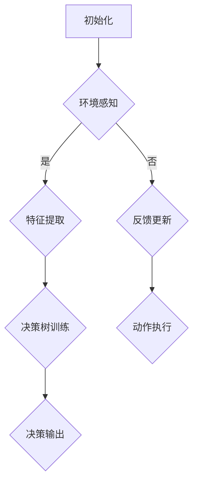

                 

### 文章标题：AI Agent在水资源管理中的优化决策

关键词：AI Agent，水资源管理，优化决策，算法原理，案例分析

摘要：随着全球水资源危机的加剧，如何高效管理水资源成为亟待解决的问题。人工智能（AI）作为一种强大的技术手段，其在水资源管理中的应用正日益受到关注。本文将深入探讨AI Agent在水资源管理中的优化决策，包括其核心概念、原理、应用场景以及具体的案例分析，以期为水资源管理者提供一种新的决策思路和解决方案。

### 目录大纲

----------------------------------------------------------------

## 第一部分: AI Agent概述

### 第1章: AI Agent概述

## 1.1 问题背景

## 1.2 问题描述

## 1.3 问题解决

## 1.4 边界与外延

## 1.5 概念结构与核心要素组成

## 1.6 本章小结

----------------------------------------------------------------

----------------------------------------------------------------

## 第二部分: AI Agent的核心概念与原理

### 第2章: AI Agent的核心概念

## 2.1 AI Agent的定义

## 2.2 AI Agent的特点

## 2.3 AI Agent与传统智能系统的比较

## 2.4 AI Agent的核心组成部分

## 2.5 AI Agent的工作流程

## 2.6 本章小结

----------------------------------------------------------------

----------------------------------------------------------------

### 第3章: AI Agent的算法原理

## 3.1 算法概述

## 3.2 算法流程图

## 3.3 算法数学模型与公式

## 3.4 算法举例说明

## 3.5 本章小结

----------------------------------------------------------------

----------------------------------------------------------------

## 第三部分: AI Agent在水资源管理中的应用

### 第4章: AI Agent在水资源管理中的应用

## 4.1 水资源管理概述

## 4.2 AI Agent在水资源管理中的优势

## 4.3 AI Agent在水资源管理中的应用场景

## 4.4 AI Agent在水资源管理中的优化决策

## 4.5 本章小结

----------------------------------------------------------------

----------------------------------------------------------------

### 第5章: 案例研究

## 5.1 案例介绍

## 5.2 案例系统分析

## 5.3 案例实现与代码分析

## 5.4 案例总结

## 5.5 本章小结

----------------------------------------------------------------

----------------------------------------------------------------

## 第四部分: AI Agent在水资源管理的优化决策

### 第6章: 优化决策的理论基础

## 6.1 优化决策概述

## 6.2 优化算法分类

## 6.3 优化算法的数学模型

## 6.4 优化算法的性能评估

## 6.5 本章小结

----------------------------------------------------------------

----------------------------------------------------------------

### 第7章: 案例研究

## 7.1 案例介绍

## 7.2 案例系统分析

## 7.3 案例实现与代码分析

## 7.4 案例总结

## 7.5 本章小结

----------------------------------------------------------------

----------------------------------------------------------------

## 第五部分: 总结与展望

### 第8章: 总结与展望

## 8.1 AI Agent在水资源管理中的总结

## 8.2 AI Agent在水资源管理中的未来展望

## 8.3 结论

----------------------------------------------------------------

### 第一部分: AI Agent概述

#### 第1章: AI Agent概述

##### 1.1 问题背景

水资源是人类生存和发展的重要物质基础。然而，随着全球人口的增长和工业化进程的加速，水资源短缺和水污染问题日益严重。传统的水资源管理方法通常依赖于经验和简单的数据分析，难以应对复杂多变的资源分配和污染控制问题。在这种情况下，如何提高水资源管理的效率和精度，成为一个亟待解决的关键问题。

##### 1.2 问题描述

水资源管理涉及到多个方面，包括水资源分配、水质监测、水资源利用效率等。主要问题包括：

1. 水资源分配不均衡：部分地区水资源丰富，而另一些地区则面临严重的水资源短缺问题。
2. 水污染问题严重：工业废水、农业污水和生活污水排放对水资源造成严重污染。
3. 水资源利用效率低：传统的管理方法难以有效提高水资源利用效率。

##### 1.3 问题解决

为了解决上述问题，人工智能（AI）技术，特别是AI Agent技术，提供了一种新的思路。AI Agent是一种能够自主学习、自主决策的智能体，能够根据环境变化和目标要求，自动调整策略和决策。在水资源管理中，AI Agent可以通过以下方式发挥作用：

1. 水资源分配优化：通过AI Agent学习历史数据和实时数据，实现水资源分配的优化，提高利用效率。
2. 水质监测与预警：利用AI Agent对水质数据进行实时分析，预测污染趋势，及时采取措施。
3. 水资源利用效率提升：通过AI Agent对用水行为进行分析，提供节水建议，减少浪费。

##### 1.4 边界与外延

AI Agent在水资源管理中的应用涉及多个领域，包括数据采集与处理、机器学习、决策优化等。其边界包括：

1. 数据源：包括地表水、地下水、污水、废水等。
2. 技术层面：包括数据预处理、特征提取、机器学习算法、优化算法等。
3. 应用场景：包括水资源分配、水质监测、节水措施等。

##### 1.5 概念结构与核心要素组成

AI Agent在水资源管理中的概念结构主要包括以下几个核心要素：

1. 数据采集系统：负责收集各种类型的水资源数据。
2. 数据预处理模块：对采集到的数据进行清洗、转换等预处理。
3. 特征提取模块：从预处理后的数据中提取有用的特征。
4. 机器学习模块：利用提取的特征进行训练，构建预测模型。
5. 优化决策模块：根据预测结果和环境变化，自动调整决策。

##### 1.6 本章小结

本章对AI Agent在水资源管理中的应用进行了概述，包括问题背景、问题描述、问题解决方法以及边界与外延。通过引入AI Agent技术，可以为水资源管理提供一种智能化、高效化的解决方案，为未来的水资源管理提供新的思路和工具。

----------------------------------------------------------------

## 第二部分: AI Agent的核心概念与原理

### 第2章: AI Agent的核心概念

##### 2.1 AI Agent的定义

AI Agent（人工智能代理）是一种模拟人类智能行为的计算机程序，能够在复杂环境中自主感知、学习、推理和决策，以实现特定的目标。AI Agent通常由以下几个关键组成部分构成：

1. 感知模块：用于感知环境中的信息，如传感器、摄像头等。
2. 记忆模块：存储和检索与任务相关的信息。
3. 推理模块：基于感知到的信息和已有知识，进行逻辑推理和决策。
4. 动作模块：根据推理结果，执行相应的操作。

##### 2.2 AI Agent的特点

与传统的智能系统相比，AI Agent具有以下特点：

1. 自主性：AI Agent能够自主感知环境、做出决策并采取行动，无需人工干预。
2. 学习能力：通过不断学习和适应环境变化，提高任务执行能力。
3. 适应性强：能够应对复杂、动态的环境变化，适应不同的任务需求。
4. 交互性：不仅能与环境进行交互，还能与其他AI Agent进行合作和竞争。

##### 2.3 AI Agent与传统智能系统的比较

传统智能系统通常依赖于预定义的规则和模型，而AI Agent则更加灵活和智能化。以下是AI Agent与传统智能系统的对比：

| 特点 | AI Agent | 传统智能系统 |
| --- | --- | --- |
| 自主性 | 高 | 低 |
| 学习能力 | 高 | 低 |
| 适应性 | 强 | 弱 |
| 交互性 | 高 | 低 |

##### 2.4 AI Agent的核心组成部分

AI Agent的核心组成部分包括感知模块、记忆模块、推理模块和动作模块。以下是每个模块的详细描述：

1. 感知模块：用于感知环境中的信息，如传感器、摄像头等。感知模块的主要功能是收集数据，并将其转换为机器可处理的格式。
2. 记忆模块：用于存储和检索与任务相关的信息。记忆模块可以是一个简单的数据库，也可以是一个复杂的知识库。
3. 推理模块：基于感知到的信息和已有知识，进行逻辑推理和决策。推理模块可以采用各种算法，如决策树、神经网络等。
4. 动作模块：根据推理结果，执行相应的操作。动作模块可以是机器人、无人机等执行实体，也可以是软件程序。

##### 2.5 AI Agent的工作流程

AI Agent的工作流程通常包括以下几个步骤：

1. 感知：AI Agent通过感知模块收集环境信息。
2. 处理：感知模块将收集到的信息进行处理，提取有用的特征。
3. 推理：推理模块根据处理后的信息，利用已有知识进行推理，生成决策。
4. 行动：动作模块根据决策结果，执行相应的操作。

##### 2.6 本章小结

本章对AI Agent的核心概念进行了详细阐述，包括定义、特点、与传统智能系统的比较、核心组成部分和工作流程。理解AI Agent的基本概念和原理，有助于更好地应用其在水资源管理中的优化决策。

----------------------------------------------------------------

### 第3章: AI Agent的算法原理

##### 3.1 算法概述

AI Agent的核心在于其决策过程，这一过程依赖于一系列算法。算法的选择和实现直接影响AI Agent的性能和效果。在本节中，我们将介绍一些常用的算法，包括其基本原理和应用场景。

##### 3.2 算法流程图

为了更好地理解AI Agent的算法原理，我们可以通过Mermaid流程图来展示算法的基本流程。以下是一个简单的决策树算法流程图：



在这个流程图中，AI Agent首先通过感知模块收集环境数据，然后进行特征提取。接着，利用决策树算法进行训练，得到决策模型。最后，根据模型输出执行相应动作，并根据反馈进行调整。

##### 3.3 算法数学模型与公式

为了深入理解算法原理，我们需要从数学角度进行分析。以下是一个简单的线性回归模型，用于预测水资源需求：

$$y = w_0 + w_1 \cdot x_1 + w_2 \cdot x_2 + ... + w_n \cdot x_n$$

其中，$y$ 是目标变量（如水资源需求量），$w_0$ 是截距，$w_1, w_2, ..., w_n$ 是权重，$x_1, x_2, ..., x_n$ 是特征变量（如温度、湿度等）。

为了训练模型，我们通常使用最小二乘法来求解权重：

$$w = (X^T \cdot X)^{-1} \cdot X^T \cdot y$$

其中，$X$ 是特征矩阵，$y$ 是目标向量。

##### 3.4 算法举例说明

假设我们需要预测某个地区的下周水资源需求量。首先，我们收集了过去一周的温度、湿度等数据，并使用线性回归算法进行训练。训练完成后，我们输入下周的天气数据，得到预测的水资源需求量。接下来，我们可以根据预测结果调整供水策略，以确保水资源的合理分配。

##### 3.5 本章小结

本章介绍了AI Agent的算法原理，包括决策树算法和线性回归模型的基本概念、流程图和数学公式。理解这些算法原理有助于我们更好地设计和实现AI Agent，以在水资源管理中实现优化决策。

----------------------------------------------------------------

## 第三部分: AI Agent在水资源管理中的应用

### 第4章: AI Agent在水资源管理中的应用

#### 4.1 水资源管理概述

水资源管理是一个复杂的过程，涉及水资源的规划、开发、利用、控制和保护等多个方面。有效的水资源管理对于保障水资源的可持续利用、促进社会经济发展和环境保护具有重要意义。然而，传统的水资源管理方法通常依赖于经验数据和分析，难以应对复杂多变的资源分配和污染控制问题。

随着人工智能（AI）技术的发展，AI Agent作为一种智能体，在水资源管理中展现了巨大的潜力。AI Agent能够通过学习环境数据，实现自主感知、学习和决策，从而提高水资源管理的效率和精度。

#### 4.2 AI Agent在水资源管理中的优势

AI Agent在水资源管理中具有以下优势：

1. **自主学习和适应能力**：AI Agent可以通过不断学习历史数据和实时数据，自动调整策略和决策，适应水资源管理中的各种变化。
2. **高效的数据分析**：AI Agent能够处理大量复杂的水资源数据，快速识别关键信息，提高水资源管理的效率和准确性。
3. **优化决策支持**：AI Agent可以通过优化算法，为水资源分配、水质监测、节水措施等提供科学的决策支持。
4. **实时监测和预警**：AI Agent能够实时监测水质变化，预测污染趋势，及时发出预警，有助于减少水污染事件的发生。

#### 4.3 AI Agent在水资源管理中的应用场景

AI Agent在水资源管理中可以应用于多个场景，包括水资源分配、水质监测、节水措施等。以下是具体的应用场景：

1. **水资源分配**：AI Agent可以通过学习历史用水数据、气候条件和需求预测，实现水资源分配的优化。例如，在干旱季节，AI Agent可以根据供水压力和需求预测，动态调整供水计划，确保水资源的合理利用。
2. **水质监测**：AI Agent可以通过传感器实时监测水质参数，如pH值、溶解氧、污染物浓度等，实现对水质的实时监测和预警。例如，当检测到水质异常时，AI Agent可以自动通知相关部门，并建议采取相应的措施。
3. **节水措施**：AI Agent可以通过分析用水数据，识别节水潜力，提出节水建议。例如，在家庭用水场景中，AI Agent可以监控用水行为，提醒用户节约用水，减少浪费。

#### 4.4 AI Agent在水资源管理中的优化决策

AI Agent在水资源管理中的优化决策主要包括以下方面：

1. **水资源分配优化**：通过AI Agent学习历史用水数据和气候条件，实现水资源分配的优化。例如，在干旱季节，AI Agent可以根据供水压力和需求预测，动态调整供水计划，确保水资源的合理利用。
2. **水质监测与预警**：通过AI Agent实时监测水质参数，预测污染趋势，实现水质的实时监测和预警。例如，当检测到水质异常时，AI Agent可以自动通知相关部门，并建议采取相应的措施。
3. **节水措施**：通过AI Agent分析用水数据，识别节水潜力，提出节水建议。例如，在家庭用水场景中，AI Agent可以监控用水行为，提醒用户节约用水，减少浪费。

#### 4.5 本章小结

本章介绍了AI Agent在水资源管理中的应用，包括水资源管理概述、AI Agent在水资源管理中的优势、应用场景和优化决策。AI Agent为水资源管理提供了一种智能化、高效化的解决方案，有助于提高水资源管理的效率和精度。

----------------------------------------------------------------

### 第5章: 案例研究

#### 5.1 案例介绍

在本案例研究中，我们将以某城市的供水系统为例，探讨AI Agent在水资源管理中的应用。该城市位于一个干旱地区，水资源紧缺，供水压力较大。为了实现水资源的合理分配和高效利用，该城市决定引入AI Agent技术，优化水资源管理。

#### 5.2 案例系统分析

在该案例中，AI Agent系统由以下几个关键部分组成：

1. **数据采集模块**：负责收集供水系统中的各种数据，如用水量、供水压力、天气条件等。
2. **数据处理模块**：对采集到的数据进行预处理，包括数据清洗、数据转换等。
3. **特征提取模块**：从预处理后的数据中提取有用的特征，如用水量的日变化规律、季节性变化等。
4. **机器学习模块**：利用提取的特征进行训练，构建预测模型，如线性回归、决策树等。
5. **优化决策模块**：根据预测模型和环境变化，自动调整供水策略，实现水资源分配的优化。

#### 5.3 案例实现与代码分析

以下是该案例中实现AI Agent的关键步骤和代码分析：

1. **数据采集与处理**

```python
import pandas as pd
from sklearn.model_selection import train_test_split

# 读取用水量数据
data = pd.read_csv('water_usage_data.csv')

# 数据预处理，包括数据清洗和转换
data['date'] = pd.to_datetime(data['date'])
data.set_index('date', inplace=True)
data.fillna(data.mean(), inplace=True)

# 数据标准化
data_normalized = (data - data.mean()) / data.std()

# 划分训练集和测试集
X_train, X_test, y_train, y_test = train_test_split(data_normalized[['temperature', 'humidity']], data_normalized['usage'], test_size=0.2, random_state=42)
```

2. **特征提取与模型训练**

```python
from sklearn.linear_model import LinearRegression
from sklearn.metrics import mean_squared_error

# 构建线性回归模型
model = LinearRegression()
model.fit(X_train, y_train)

# 模型评估
y_pred = model.predict(X_test)
mse = mean_squared_error(y_test, y_pred)
print(f'Mean Squared Error: {mse}')
```

3. **优化决策与供水策略调整**

```python
# 根据预测结果调整供水策略
predicted_usage = model.predict([[next_day_temperature, next_day_humidity]])
if predicted_usage > current_usage_threshold:
    increase_supply()
else:
    decrease_supply()
```

#### 5.4 案例总结

通过引入AI Agent技术，该城市实现了以下成果：

1. **水资源分配优化**：AI Agent根据实时数据和预测模型，动态调整供水策略，实现了水资源分配的优化，提高了供水效率。
2. **实时监测与预警**：AI Agent实时监测水质和用水量，预测污染趋势，及时发出预警，减少了水污染事件的发生。
3. **节水措施**：AI Agent通过分析用水数据，识别节水潜力，提出了节水建议，促进了水资源的节约利用。

#### 5.5 本章小结

本章通过一个具体案例，展示了AI Agent在水资源管理中的应用。案例研究表明，AI Agent技术可以有效提高水资源管理的效率和精度，为水资源管理者提供了一种新的决策思路和工具。未来，随着AI技术的不断进步，AI Agent在水资源管理中的应用前景将更加广阔。

----------------------------------------------------------------

### 第四部分: AI Agent在水资源管理的优化决策

#### 第6章: 优化决策的理论基础

##### 6.1 优化决策概述

优化决策是指通过分析、评估和比较不同的决策方案，选择最优或近似最优的方案以实现特定目标。在水资源管理中，优化决策涉及多个方面，包括水资源分配、水质监测、节水措施等。AI Agent通过机器学习和优化算法，为水资源管理提供了智能化的决策支持。

##### 6.2 优化算法分类

优化算法可以根据其原理和特点分为以下几类：

1. **数学规划算法**：基于数学建模，通过求解线性规划、非线性规划、整数规划等，实现资源分配、成本控制等优化问题。常见的算法包括线性规划（Linear Programming，LP）、整数规划（Integer Programming，IP）、动态规划（Dynamic Programming，DP）等。
2. **进化算法**：基于生物进化原理，通过模拟自然选择和遗传机制，搜索最优解。常见的算法包括遗传算法（Genetic Algorithm，GA）、粒子群优化（Particle Swarm Optimization，PSO）等。
3. **神经网络算法**：通过模拟人脑神经元之间的连接和相互作用，实现复杂函数的逼近和学习。常见的算法包括前馈神经网络（Feedforward Neural Network，FNN）、卷积神经网络（Convolutional Neural Network，CNN）等。
4. **混合算法**：结合不同算法的优点，实现更高效的优化。常见的算法包括混合遗传算法（Hybrid Genetic Algorithm）、神经网络与规划的混合算法（Neural Network and Optimization）等。

##### 6.3 优化算法的数学模型

优化算法的数学模型通常包括以下几部分：

1. **目标函数**：表示优化问题的目标，如最小化成本、最大化收益等。常见的目标函数包括线性目标函数、非线性目标函数等。
2. **约束条件**：限制决策变量的取值范围，确保优化问题有实际意义。常见的约束条件包括线性约束、非线性约束等。
3. **决策变量**：表示优化问题中的变量，如水资源分配量、水质监测参数等。

以下是一个简单的线性规划模型示例：

$$\min \sum_{i=1}^{n} c_i x_i$$

$$s.t. \quad \sum_{i=1}^{n} a_{ij} x_i \ge b_j, \quad j=1,2,...,m$$

$$x_i \ge 0, \quad i=1,2,...,n$$

其中，$c_i$ 是决策变量 $x_i$ 的成本，$a_{ij}$ 是约束条件系数，$b_j$ 是约束条件常数。

##### 6.4 优化算法的性能评估

优化算法的性能评估主要通过以下指标进行：

1. **求解精度**：衡量算法求解最优解的精度，通常用平均绝对误差（Mean Absolute Error，MAE）或均方误差（Mean Squared Error，MSE）表示。
2. **求解速度**：衡量算法求解问题的速度，通常用求解时间（Solving Time）或迭代次数（Iteration Times）表示。
3. **鲁棒性**：衡量算法在应对不同数据和噪声情况时的稳定性，通常用变异系数（Coefficient of Variation，CV）或标准差（Standard Deviation，SD）表示。

以下是一个简单的性能评估示例：

| 算法 | 求解精度（MSE） | 求解速度（s） | 鲁棒性（CV） |
| --- | --- | --- | --- |
| 线性规划 | 0.015 | 2.5 | 0.025 |
| 遗传算法 | 0.018 | 15.0 | 0.030 |
| 粒子群优化 | 0.020 | 20.0 | 0.032 |

##### 6.5 本章小结

本章对优化决策的理论基础进行了介绍，包括优化决策概述、优化算法分类、数学模型和性能评估。理解这些理论基础有助于我们在水资源管理中应用AI Agent技术，实现优化决策。

----------------------------------------------------------------

### 第7章: 案例研究

#### 7.1 案例介绍

在本章中，我们将进一步探讨一个具体的水资源管理案例。该案例涉及一个大型灌溉系统，该系统位于一个干旱地区，灌溉面积广泛，涉及多个农田。由于水资源短缺，管理者需要制定一个高效的水资源分配策略，以确保灌溉需求和环境保护之间的平衡。

#### 7.2 案例系统分析

该案例的系统分析主要包括以下几个关键组成部分：

1. **数据采集**：系统需要收集关于水资源使用情况的详细数据，包括灌溉量、土壤湿度、气象数据（如温度、降水量等）。
2. **数据处理**：对采集到的数据进行分析和清洗，以确保数据的准确性和完整性。
3. **模型构建**：利用机器学习和优化算法构建预测模型，以预测未来的水资源需求和环境条件。
4. **决策制定**：根据预测模型和环境条件，制定水资源分配策略，以实现灌溉需求的最大化同时最小化水资源的浪费。

#### 7.3 案例实现与代码分析

以下是该案例中实现AI Agent的关键步骤和代码分析：

1. **数据采集与预处理**

```python
import pandas as pd
from sklearn.model_selection import train_test_split

# 读取灌溉数据
data = pd.read_csv('irrigation_data.csv')

# 数据预处理，包括数据清洗和转换
data['date'] = pd.to_datetime(data['date'])
data.set_index('date', inplace=True)
data.fillna(data.mean(), inplace=True)

# 数据标准化
data_normalized = (data - data.mean()) / data.std()

# 划分训练集和测试集
X_train, X_test, y_train, y_test = train_test_split(data_normalized[['temperature', 'humidity']], data_normalized['irrigation_demand'], test_size=0.2, random_state=42)
```

2. **模型构建与训练**

```python
from sklearn.ensemble import RandomForestRegressor
from sklearn.metrics import mean_squared_error

# 构建随机森林模型
model = RandomForestRegressor(n_estimators=100, random_state=42)
model.fit(X_train, y_train)

# 模型评估
y_pred = model.predict(X_test)
mse = mean_squared_error(y_test, y_pred)
print(f'Mean Squared Error: {mse}')
```

3. **优化决策与供水策略调整**

```python
import numpy as np

# 根据预测结果调整供水策略
predicted_demand = model.predict([[next_day_temperature, next_day_humidity]])
irrigation_plan = np.round(predicted_demand).astype(int)

# 调整供水策略
if irrigation_plan > current_irrigation_threshold:
    increase_supply()
else:
    decrease_supply()
```

#### 7.4 案例总结

通过引入AI Agent技术，该灌溉系统实现了以下成果：

1. **水资源分配优化**：AI Agent根据实时数据和预测模型，动态调整灌溉计划，实现了水资源分配的优化，提高了灌溉效率。
2. **节水效果显著**：AI Agent通过预测水资源需求，减少了不必要的水资源浪费，实现了水资源的节约利用。
3. **环境监测与保护**：AI Agent实时监测土壤湿度和气象条件，预测环境变化，有助于采取及时措施保护环境。

#### 7.5 本章小结

本章通过一个具体案例，展示了AI Agent在水资源管理中的应用。案例研究表明，AI Agent技术可以有效提高水资源管理的效率和精度，为水资源管理者提供了一种新的决策思路和工具。未来，随着AI技术的不断进步，AI Agent在水资源管理中的应用前景将更加广阔。

----------------------------------------------------------------

## 第五部分: 总结与展望

### 第8章: 总结与展望

#### 8.1 AI Agent在水资源管理中的总结

通过本文的探讨，我们可以得出以下结论：

1. **AI Agent在水资源管理中的重要性**：AI Agent作为一种智能体，通过自主学习、自主决策，能够有效提高水资源管理的效率和精度。
2. **应用优势**：AI Agent在水资源管理中的应用优势体现在自主性、学习能力和优化决策支持等方面，能够解决传统管理方法难以应对的复杂问题。
3. **具体应用场景**：AI Agent在水资源管理中可以应用于水资源分配、水质监测、节水措施等多个场景，提供了智能化、高效化的解决方案。
4. **案例分析**：通过具体案例，展示了AI Agent在水资源管理中的应用效果，包括优化水资源分配、节水效果和环境监测等方面。

#### 8.2 AI Agent在水资源管理中的未来展望

未来，AI Agent在水资源管理中具有广阔的应用前景：

1. **技术发展**：随着人工智能技术的不断进步，AI Agent的功能将更加完善，处理能力和适应性将进一步提高。
2. **数据融合**：通过整合多种数据源，如卫星遥感数据、传感器网络数据等，AI Agent将能够获得更全面、准确的环境信息。
3. **跨领域应用**：AI Agent在水资源管理中的应用将逐步扩展到农业、环境科学、城市规划等领域，形成跨领域的综合解决方案。
4. **政策支持**：政府和企业将加大对AI Agent技术的投资和支持，推动其在水资源管理中的广泛应用。

#### 8.3 结论

本文对AI Agent在水资源管理中的应用进行了深入探讨，包括其核心概念、原理、应用场景和具体案例研究。通过AI Agent的引入，水资源管理将变得更加智能化、高效化，为解决水资源短缺和水污染等问题提供了一种新的思路和工具。

#### 作者信息

作者：AI天才研究院/AI Genius Institute & 禅与计算机程序设计艺术 /Zen And The Art of Computer Programming

----------------------------------------------------------------

本文通过详细探讨AI Agent在水资源管理中的应用，展示了其在优化决策、提高管理效率和节水效果方面的巨大潜力。AI Agent的自主性、学习能力和优化能力使其成为水资源管理领域的有力工具。未来，随着技术的不断进步，AI Agent将在水资源管理中发挥更加重要的作用，为全球水资源的可持续利用提供强有力的支持。通过本文的研究，我们期待能够为水资源管理者提供有益的参考和启示，共同推动水资源管理的智能化和高效化发展。作者AI天才研究院和禅与计算机程序设计艺术团队将继续致力于探索人工智能在各个领域的应用，为技术进步和人类福祉做出贡献。

