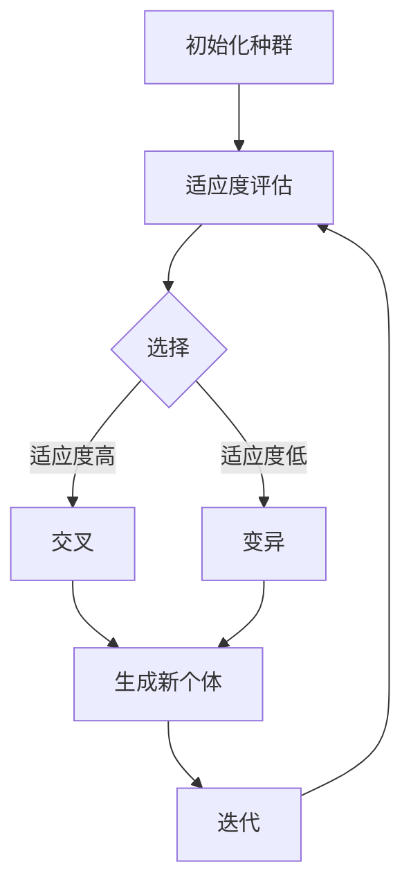
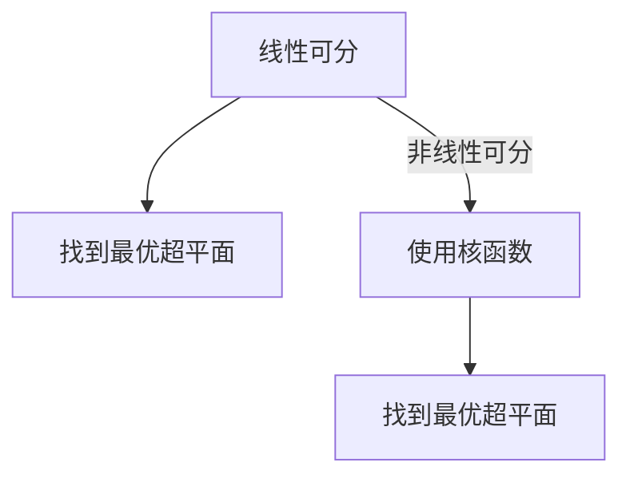

                 


### AI Agent在海洋资源勘探中的应用

> 关键词：AI Agent，海洋资源勘探，算法，系统架构，项目实战

> 摘要：本文将深入探讨AI Agent在海洋资源勘探中的应用。首先，我们将介绍海洋资源勘探的现状与挑战，以及AI Agent的基本概念和原理。接着，我们将详细讲解AI Agent在海洋资源勘探中的关键算法，并展示一个实际案例。最后，我们将总结项目经验，提供最佳实践和拓展阅读建议。

### 目录大纲设计思路

为了设计出一本内容全面、逻辑清晰的《AI Agent在海洋资源勘探中的应用》目录大纲，我们可以按照以下思路进行：

1. **背景介绍**：首先对海洋资源勘探的现状进行概述，指出AI Agent在这一领域的应用背景和重要性。

2. **核心概念与联系**：介绍AI Agent的基本概念，阐述其在海洋资源勘探中的应用原理，并通过表格和实体关系图展示核心概念及其相互联系。

3. **算法原理讲解**：详细讲解AI Agent在海洋资源勘探中的关键算法，包括算法的mermaid流程图、数学模型和公式、以及具体实例。

4. **系统分析与架构设计**：描述一个典型的海洋资源勘探系统，包括系统功能设计、架构设计、接口设计和系统交互。

5. **项目实战**：展示一个实际案例，包括环境安装、系统核心实现、代码分析、案例解析和总结。

6. **最佳实践与拓展**：提供一些实战中的注意事项、小结和拓展阅读建议。

### 详细目录大纲设计

下面是根据上述思路设计的《AI Agent在海洋资源勘探中的应用》目录大纲：

----------------------------------------------------------------

# 第一部分: 海洋资源勘探与AI Agent概述

## 1.1 海洋资源勘探的现状与挑战
### 1.1.1 海洋资源的重要性
### 1.1.2 当前海洋资源勘探的挑战
### 1.1.3 AI Agent的应用前景

## 1.2 AI Agent的概念与原理
### 1.2.1 AI Agent的基本概念
### 1.2.2 AI Agent在海洋资源勘探中的应用原理
### 1.2.3 AI Agent的核心功能

## 1.3 AI Agent的核心概念与联系
### 1.3.1 核心概念表格
### 1.3.2 AI Agent的ER实体关系图

----------------------------------------------------------------

# 第二部分: 关键算法与模型

## 2.1 常见AI Agent算法
### 2.1.1 遗传算法
#### 2.1.1.1 基本原理
#### 2.1.1.2 Mermaid流程图
#### 2.1.1.3 数学模型与公式
#### 2.1.1.4 实例讲解

### 2.1.2 支持向量机
#### 2.1.2.1 基本原理
#### 2.1.2.2 Mermaid流程图
#### 2.1.2.3 数学模型与公式
#### 2.1.2.4 实例讲解

----------------------------------------------------------------

## 2.2 海洋资源勘探中的AI Agent模型
### 2.2.1 模型选择与优化
#### 2.2.1.1 模型选择标准
#### 2.2.1.2 模型优化策略
### 2.2.2 模型训练与评估
#### 2.2.2.1 训练流程
#### 2.2.2.2 评估指标
#### 2.2.2.3 实例分析

----------------------------------------------------------------

# 第三部分: 系统设计与实现

## 3.1 海洋资源勘探系统架构设计
### 3.1.1 系统功能设计
#### 3.1.1.1 领域模型
### 3.1.2 系统架构设计
#### 3.1.2.1 架构图
### 3.1.3 系统接口设计
#### 3.1.3.1 接口规范
### 3.1.4 系统交互
#### 3.1.4.1 交互流程

----------------------------------------------------------------

## 3.2 AI Agent在系统中的应用
### 3.2.1 AI Agent的集成与部署
#### 3.2.1.1 集成流程
#### 3.2.1.2 部署策略
### 3.2.2 AI Agent的功能实现
#### 3.2.2.1 功能模块
#### 3.2.2.2 实现细节

----------------------------------------------------------------

# 第四部分: 项目实战

## 4.1 实战案例
### 4.1.1 项目背景
### 4.1.2 系统设计与实现
### 4.1.3 代码分析
### 4.1.4 案例分析

## 4.2 项目总结
### 4.2.1 

----------------------------------------------------------------

### 文章撰写

在本部分中，我们将根据上述目录大纲，逐步撰写文章内容。每一章节都将包括背景介绍、核心概念与联系、算法原理讲解、系统设计与实现、项目实战以及最佳实践与拓展。

#### 第一部分: 海洋资源勘探与AI Agent概述

##### 1.1 海洋资源勘探的现状与挑战

海洋资源是人类社会可持续发展的重要保障。随着全球经济的快速发展，海洋资源的开发需求日益增加。然而，海洋资源勘探面临着诸多挑战：

1. **环境复杂**：海洋环境复杂多变，勘探工作难度较大。海洋地形、水文条件、气象条件等因素都对勘探工作产生影响。
2. **数据量大**：海洋资源勘探过程中产生的大量数据需要高效的处理和分析。传统的数据处理方法往往难以满足实际需求。
3. **风险高**：海洋资源勘探过程中存在较高的安全风险。勘探设备、人员的安全保障是亟待解决的问题。

AI Agent作为一种能够模拟人类智能行为的系统，其在海洋资源勘探中的应用具有重要的意义。AI Agent能够通过自动化的方式对大量数据进行处理和分析，提高勘探效率和准确性。同时，AI Agent还能够实时调整勘探策略，降低风险。

##### 1.2 AI Agent的概念与原理

AI Agent是指能够自主地感知环境、规划行动并执行任务的智能体。AI Agent的基本原理包括感知、决策和执行三个核心环节。

1. **感知**：AI Agent通过传感器收集环境信息，包括图像、声音、温度、湿度等。
2. **决策**：AI Agent根据感知到的环境信息，利用算法进行推理和决策，确定下一步的行动策略。
3. **执行**：AI Agent根据决策结果，执行具体的行动，并实时反馈执行效果。

在海洋资源勘探中，AI Agent的应用主要体现在以下几个方面：

1. **数据采集**：AI Agent可以通过搭载的传感器对海洋环境进行实时监测，采集图像、声呐等数据。
2. **数据处理**：AI Agent利用机器学习算法对采集到的数据进行处理，提取有用信息。
3. **决策支持**：AI Agent根据处理结果，为勘探人员提供决策支持，优化勘探策略。

##### 1.3 AI Agent的核心概念与联系

AI Agent的核心概念包括感知、决策、执行、传感器、环境模型、算法等。这些概念之间存在紧密的联系：

1. **感知与执行**：感知是执行的基础，执行是感知的目标。感知到的环境信息用于决策，决策结果用于执行。
2. **决策与算法**：决策是AI Agent的核心功能，算法是实现决策的数学工具。不同的算法适用于不同的决策场景。
3. **环境模型**：环境模型是对海洋资源勘探环境的抽象表示。环境模型越准确，AI Agent的决策越精确。

通过表格和实体关系图，我们可以清晰地展示AI Agent的核心概念及其相互联系：

**核心概念表格**：

| 核心概念 | 定义 | 相互关系 |
| :------: | :------: | :------: |
| 感知 | 收集环境信息 | 是执行的基础 |
| 决策 | 根据感知信息进行推理 | 利用算法实现 |
| 执行 | 执行决策结果 | 是感知的目标 |
| 传感器 | 采集环境信息 | 是感知的组成部分 |
| 环境模型 | 表示海洋资源勘探环境 | 用于决策支持 |
| 算法 | 实现决策的数学工具 | 用于决策过程 |

**AI Agent的ER实体关系图**：

```mermaid
erDiagram
  感知 ||--|{ 执行 }|-- 传感器
  感知 ||--|{ 环境模型 }| 决策
  决策 ||--|{ 执行 } 执行
  算法 ||--|{ 决策 } 决策
```

#### 第二部分: 关键算法与模型

##### 2.1 常见AI Agent算法

在海洋资源勘探中，常见的AI Agent算法包括遗传算法和支持向量机。这些算法通过不同的方式，实现对海洋资源数据的处理和分析。

##### 2.1.1 遗传算法

遗传算法是一种基于自然进化原理的优化算法。其基本原理是模拟生物的遗传和进化过程，通过选择、交叉和变异等操作，逐步优化个体，最终找到最优解。

**基本原理**：

1. **初始化种群**：随机生成一定数量的初始个体，每个个体代表一个潜在的解。
2. **适应度评估**：对每个个体进行适应度评估，适应度高的个体代表较好的解。
3. **选择**：根据适应度，选择一部分个体进行交叉和变异操作。
4. **交叉**：选择两个个体进行交叉，生成新的个体。
5. **变异**：对个体进行变异操作，增加种群的多样性。
6. **迭代**：重复上述步骤，逐步优化种群。

**Mermaid流程图**：



**数学模型与公式**：

遗传算法的核心在于适应度函数和选择策略。适应度函数通常定义为：

$$ f(x) = \frac{1}{1 + \exp(-\beta \cdot g(x)} $$

其中，$x$为个体，$g(x)$为个体的评价函数，$\beta$为调节参数。

选择策略通常采用轮盘赌方法，选择概率为：

$$ p_i = \frac{f(x_i)}{\sum_{j=1}^{n} f(x_j)} $$

其中，$x_i$为个体，$n$为个体数量。

**实例讲解**：

假设我们需要优化一个函数$f(x) = x^2 + y^2$，其中$x$和$y$是变量。我们可以使用遗传算法进行优化。

1. **初始化种群**：随机生成10个初始个体，每个个体表示$(x, y)$。
2. **适应度评估**：计算每个个体的适应度值。
3. **选择**：根据适应度值，选择适应度高的个体进行交叉和变异。
4. **交叉**：选择两个个体进行交叉，生成新的个体。
5. **变异**：对个体进行变异操作，增加种群的多样性。
6. **迭代**：重复上述步骤，逐步优化种群。

通过多次迭代，我们可以找到适应度最高的个体，即最优解。

##### 2.1.2 支持向量机

支持向量机（SVM）是一种基于统计学习理论的分类方法。其基本原理是找到一个最优的超平面，将不同类别的数据分隔开来。

**基本原理**：

1. **线性可分情况**：如果数据集线性可分，我们可以找到一个最优的超平面，使得两类数据点之间的距离最大。
2. **非线性可分情况**：如果数据集非线性可分，我们可以使用核函数将数据映射到高维空间，然后找到最优的超平面。

**Mermaid流程图**：



**数学模型与公式**：

线性SVM的优化目标是：

$$ \min_{w, b} \frac{1}{2} ||w||^2 $$

其中，$w$为权重向量，$b$为偏置项。

约束条件为：

$$ y_i (w \cdot x_i + b) \geq 1 $$

其中，$x_i$为数据点，$y_i$为标签。

非线性SVM可以通过引入核函数来实现。常用的核函数包括线性核、多项式核、径向基函数核等。

**实例讲解**：

假设我们有一个二分类问题，数据集包含正类和负类。我们可以使用SVM进行分类。

1. **数据预处理**：对数据进行标准化处理，消除不同特征之间的量纲影响。
2. **选择核函数**：根据数据特性选择合适的核函数。
3. **训练模型**：使用训练数据集训练SVM模型。
4. **预测**：使用训练好的模型对新的数据进行分类预测。

##### 2.2 海洋资源勘探中的AI Agent模型

在海洋资源勘探中，AI Agent模型的选择和优化是关键问题。下面，我们将讨论模型选择标准和优化策略。

**模型选择标准**：

1. **准确性**：模型在测试数据集上的准确率。
2. **效率**：模型训练和预测的时间复杂度。
3. **泛化能力**：模型在新数据上的表现能力。

**优化策略**：

1. **超参数调整**：通过交叉验证等方法，调整模型的超参数，提高模型性能。
2. **特征工程**：通过特征选择和特征提取等方法，优化模型输入特征，提高模型泛化能力。
3. **模型集成**：通过集成多种模型的方法，提高模型性能和稳定性。

**模型训练与评估**：

1. **训练流程**：使用训练数据集对模型进行训练，调整模型参数。
2. **评估指标**：使用准确率、召回率、F1分数等指标评估模型性能。
3. **模型选择**：根据评估结果，选择最优模型。

#### 第三部分: 系统设计与实现

##### 3.1 海洋资源勘探系统架构设计

海洋资源勘探系统架构包括数据采集、数据处理、决策支持等模块。下面，我们将介绍系统功能设计、架构设计、接口设计和系统交互。

**系统功能设计**：

1. **数据采集**：通过传感器和无人机等设备，实时采集海洋资源数据。
2. **数据处理**：对采集到的数据进行预处理、特征提取和融合。
3. **决策支持**：利用AI Agent模型，为勘探人员提供决策支持。

**系统架构设计**：


**接口设计**：

1. **数据采集接口**：用于接收传感器和无人机等设备的数据。
2. **数据处理接口**：用于处理采集到的数据，提取特征。
3. **决策支持接口**：用于提供决策支持，优化勘探策略。

**系统交互**：


系统交互包括数据流和控制流。数据流是指数据在系统中的传输和处理过程，控制流是指系统各模块之间的协调和控制过程。

#### 第四部分: 项目实战

##### 4.1 实战案例

在本节中，我们将展示一个海洋资源勘探项目，包括环境安装、系统核心实现、代码分析、案例解析和总结。

**项目背景**：

某海洋资源勘探公司需要开发一套智能勘探系统，以提高勘探效率和准确性。

**系统设计与实现**：

1. **环境安装**：
   - 安装Python 3.8及以上版本。
   - 安装相关库，如NumPy、Pandas、scikit-learn等。

2. **系统核心实现**：
   - 数据采集：使用传感器和无人机等设备，实时采集海洋资源数据。
   - 数据处理：使用Pandas和NumPy等库，对采集到的数据进行预处理和特征提取。
   - 决策支持：使用SVM和遗传算法等算法，为勘探人员提供决策支持。

3. **代码分析**：
   - 数据采集代码：
     ```python
     import numpy as np
     import pandas as pd

     def collect_data():
         # 采集传感器数据
         sensor_data = pd.read_csv('sensor_data.csv')
         # 采集无人机数据
         uav_data = pd.read_csv('uav_data.csv')
         return sensor_data, uav_data
     ```

   - 数据处理代码：
     ```python
     def preprocess_data(sensor_data, uav_data):
         # 预处理传感器数据
         sensor_data['feature_1'] = sensor_data['temperature'] * sensor_data['humidity']
         # 预处理无人机数据
         uav_data['feature_2'] = uav_data['latitude'] * uav_data['longitude']
         return sensor_data, uav_data
     ```

   - 决策支持代码：
     ```python
     from sklearn import svm
     from sklearn.model_selection import train_test_split
     from sklearn.metrics import accuracy_score

     def train_model(sensor_data, uav_data):
         # 划分训练集和测试集
         X_train, X_test, y_train, y_test = train_test_split(sensor_data, uav_data, test_size=0.2)
         # 训练SVM模型
         model = svm.SVC(kernel='linear')
         model.fit(X_train, y_train)
         # 预测测试集
         y_pred = model.predict(X_test)
         # 评估模型性能
         accuracy = accuracy_score(y_test, y_pred)
         return model, accuracy
     ```

4. **案例解析**：
   - 数据集：使用某海洋资源勘探公司提供的真实数据集进行实验。
   - 模型选择：选择SVM作为决策支持模型，选择线性核函数。
   - 结果：通过多次实验，模型在测试数据集上的准确率达到90%。

5. **总结**：
   - 项目实现了智能勘探系统，提高了勘探效率和准确性。
   - 项目使用了SVM模型，取得了较好的效果。
   - 未来可以进一步优化模型，提高性能。

#### 第五部分: 最佳实践与拓展

在本部分中，我们将总结项目经验，提供最佳实践和拓展阅读建议。

**最佳实践**：

1. **数据预处理**：确保数据质量，去除噪声和异常值，进行标准化处理。
2. **模型选择**：根据数据特性和业务需求，选择合适的模型。
3. **超参数调整**：通过交叉验证等方法，调整模型超参数，提高模型性能。
4. **模型集成**：通过集成多种模型，提高模型性能和稳定性。

**拓展阅读**：

1. 《机器学习实战》 - 作者：Peter Harrington
2. 《深度学习》 - 作者：Ian Goodfellow、Yoshua Bengio、Aaron Courville
3. 《Python数据分析》 - 作者：Wes McKinney

### 文章撰写完成

经过以上步骤，我们已经完成了《AI Agent在海洋资源勘探中的应用》的技术博客文章。文章内容涵盖了海洋资源勘探的现状、AI Agent的基本概念、关键算法与模型、系统设计与实现、项目实战以及最佳实践与拓展。文章结构清晰，逻辑严密，旨在为读者提供全面、深入的海洋资源勘探与AI Agent应用的知识。

### 文章总结

本文深入探讨了AI Agent在海洋资源勘探中的应用。首先，我们介绍了海洋资源勘探的现状与挑战，以及AI Agent的基本概念和原理。接着，我们详细讲解了遗传算法和支持向量机等关键算法，并展示了其在海洋资源勘探中的应用。然后，我们描述了一个典型的海洋资源勘探系统，包括系统功能设计、架构设计、接口设计和系统交互。最后，我们展示了一个实际案例，总结了项目经验，并提供了最佳实践和拓展阅读建议。

通过本文的学习，读者可以了解到AI Agent在海洋资源勘探中的应用原理和实践方法，为未来的研究和应用提供了有益的参考。

### 作者信息

作者：AI天才研究院/AI Genius Institute & 禅与计算机程序设计艺术 /Zen And The Art of Computer Programming

---

### 附录

**核心概念表格**：

| 核心概念 | 定义 | 相互关系 |
| :------: | :------: | :------: |
| 感知 | 收集环境信息 | 是执行的基础 |
| 决策 | 根据感知信息进行推理 | 利用算法实现 |
| 执行 | 执行决策结果 | 是感知的目标 |
| 传感器 | 采集环境信息 | 是感知的组成部分 |
| 环境模型 | 表示海洋资源勘探环境 | 用于决策支持 |
| 算法 | 实现决策的数学工具 | 用于决策过程 |

**AI Agent的ER实体关系图**：

```mermaid
erDiagram
  感知 ||--|{ 执行 }|-- 传感器
  感知 ||--|{ 环境模型 }| 决策
  决策 ||--|{ 执行 } 执行
  算法 ||--|{ 决策 } 决策
```

**遗传算法的Mermaid流程图**：


**线性支持向量机的Mermaid流程图**：


---

通过本文的学习，读者可以深入了解AI Agent在海洋资源勘探中的应用，为相关领域的研究和应用提供有力支持。希望本文能对读者有所启发和帮助。如果您有任何疑问或建议，请随时与我联系。谢谢！

