                 

### 第1章：引言

#### 1.1 问题背景

游戏产业作为全球娱乐行业的重要组成部分，近年来得到了迅猛发展。据市场研究机构Newzoo的数据，全球游戏市场在2021年的总收入达到了1500亿美元，并且预计在未来几年内还将持续增长。随着游戏市场的不断扩张，游戏产业的技术创新和优化需求也日益凸显，尤其是在AI技术的应用方面。

AI Agent，即人工智能代理，是一种能够自主执行任务、学习环境和适应变化的智能体。在游戏产业中，AI Agent可以应用于游戏角色的智能设计、玩家行为的分析预测、游戏平衡的动态调整等多个方面。AI Agent的出现为游戏产业带来了前所未有的机遇和挑战。

首先，AI Agent可以显著提升游戏角色的智能水平。传统的游戏角色通常具有固定的行为模式，而通过AI技术，可以使得游戏角色具备更复杂、更真实的决策能力，从而提高游戏的趣味性和挑战性。其次，AI Agent可以深入分析玩家的行为数据，为游戏设计提供有价值的反馈，从而优化游戏体验。最后，AI Agent可以帮助实现游戏的动态平衡，根据玩家的表现和反馈实时调整游戏难度和规则，使得游戏更加公平和具有挑战性。

#### 1.2 AI Agent的定义与功能

AI Agent是人工智能领域中的一个核心概念，它指的是一种能够感知环境、制定计划、执行任务并反馈结果的智能系统。根据其功能和应用场景，AI Agent可以被分为多种类型，如决策AI、行为AI、任务AI等。

- **决策AI**：决策AI主要负责在游戏中为角色或玩家提供决策支持。例如，在策略游戏中，决策AI可以帮助玩家选择最佳的行动策略，或在战斗游戏中，决策AI可以控制NPC（非玩家角色）进行战斗决策。

- **行为AI**：行为AI则关注角色的行为模式，通过模拟人类的思维和行为，使得游戏角色的行为更加真实、多样化。例如，AI Agent可以模拟人类的社交行为，使游戏角色之间产生互动和情感联系。

- **任务AI**：任务AI负责处理游戏中的任务和目标，通过学习和适应玩家行为，使得任务更加具有挑战性和可玩性。例如，在游戏中，AI Agent可以根据玩家的行为模式调整任务难度和奖励机制，提高玩家的游戏体验。

#### 1.3 AI Agent在游戏产业中的应用价值

AI Agent在游戏产业中的应用价值主要体现在以下几个方面：

- **提升游戏体验**：通过AI Agent，游戏可以提供更加智能、多样化的角色和任务，从而提升玩家的游戏体验。例如，AI Agent可以使得游戏角色更加具有个性和互动性，使得玩家在游戏中感受到更多的乐趣。

- **优化游戏设计**：AI Agent可以深入分析玩家的行为数据，为游戏设计师提供有价值的反馈，帮助他们优化游戏设计。例如，通过分析玩家对特定游戏机制的反应，设计师可以及时调整游戏规则，提高游戏的可玩性和公平性。

- **实现游戏平衡**：AI Agent可以帮助实现游戏的动态平衡，通过实时调整游戏难度和规则，使得游戏更加公平和具有挑战性。这对于提高游戏的可玩性和玩家的留存率至关重要。

- **提高游戏产业效率**：通过AI Agent的应用，游戏产业可以更加高效地开发和运营游戏。例如，AI Agent可以自动化部分游戏开发和测试工作，节省人力和时间成本。

综上所述，AI Agent在游戏产业中具有广泛的应用前景和巨大的发展潜力。在接下来的章节中，我们将进一步探讨AI Agent的核心概念、原理和应用，帮助读者更深入地了解这一技术。

#### 1.4 问题描述与解决思路

在当前的游戏产业中，尽管AI Agent的应用带来了诸多机遇，但也面临着一些挑战。首先，AI Agent在游戏角色设计和玩家交互中的实现和优化仍然存在技术难题。例如，如何设计出具有高度智能和行为多样化的AI角色，如何准确预测和分析玩家的行为等。其次，游戏产业对于AI技术的需求不断增加，但人才和技术储备相对不足，这限制了AI Agent在游戏中的应用范围和深度。

为了解决上述问题，我们需要从以下几个方面着手：

1. **技术创新**：研究和发展新的AI算法和模型，提高AI Agent的智能水平和适应能力。例如，通过强化学习和生成对抗网络等技术，设计出更加智能和多样化的游戏角色。

2. **跨领域合作**：促进AI领域与游戏产业的深度融合，建立跨领域的研发团队，共同攻关技术难题。通过跨界合作，可以充分发挥各领域的优势，加快AI Agent在游戏产业中的应用进程。

3. **人才培养**：加强AI与游戏相关人才的培养，提高游戏产业对AI技术的理解和应用能力。可以通过设立专项培训课程、举办技术研讨会等方式，提升从业人员的技术水平。

4. **应用实践**：在游戏开发中积极尝试和应用AI Agent技术，通过实际项目的验证和迭代，不断完善和优化AI Agent的设计和实现。

通过上述措施，我们可以逐步解决AI Agent在游戏产业中面临的挑战，推动游戏产业的智能化发展。

#### 1.5 本书的目标与结构安排

本书的目标是深入探讨AI Agent在游戏产业中的应用，帮助读者了解和掌握这一技术，并解决实际应用中的问题。为了实现这一目标，本书将分为三个主要部分。

**第一部分：引言与背景介绍**  
本部分将介绍游戏产业的发展背景和现状，引出AI Agent的概念，并探讨其在游戏产业中的应用价值。

**第二部分：AI Agent的核心概念与原理**  
本部分将详细讲解AI Agent的核心概念和算法原理，包括强化学习、生成对抗网络等，并通过具体的案例进行阐述。

**第三部分：AI Agent在游戏产业中的应用**  
本部分将重点讨论AI Agent在游戏设计、玩家交互和游戏平衡调整等具体应用场景，并提供实际案例和最佳实践。

通过本书的学习，读者将能够系统地掌握AI Agent的相关知识，并在实际项目中应用这些技术，提升游戏产业的技术水平和创新能力。

### 第2章: AI Agent的核心概念与原理

#### 2.1 AI Agent的基本概念

AI Agent，即人工智能代理，是一种能够感知环境、自主决策并采取行动的智能系统。它起源于人工智能领域，并在近年来随着深度学习和强化学习等技术的发展而得到广泛应用。一个典型的AI Agent由以下几个关键部分组成：

1. **感知模块**：负责收集和分析环境信息，包括视觉、听觉、触觉等多种感官数据。
2. **决策模块**：基于感知模块提供的信息，通过算法进行决策，选择最优的行动方案。
3. **行动模块**：执行决策模块生成的行动方案，对环境进行干预。
4. **学习模块**：通过与环境互动，不断学习和优化自身的行为策略。

AI Agent的定义可以从多个角度进行理解。在技术上，AI Agent是一种智能体，它能够模拟人类的思维和行为，具有自主性和适应性。在应用上，AI Agent可以应用于各种场景，如机器人、自动驾驶、游戏等，具有广泛的应用前景。

#### 2.1.2 AI Agent的基本特征

AI Agent具备以下基本特征：

1. **自主性**：AI Agent能够自主感知环境、制定计划和采取行动，不需要人工干预。
2. **适应性**：AI Agent能够通过学习和适应环境的变化，不断优化自身的行为策略。
3. **交互性**：AI Agent能够与环境和其他智能体进行交互，进行信息交换和协同工作。
4. **智能性**：AI Agent具有智能决策能力，能够处理复杂问题并生成最优解决方案。

这些特征使得AI Agent在多个领域具有广泛的应用潜力。例如，在游戏产业中，AI Agent可以用于设计智能角色、分析玩家行为、实现游戏平衡等。

#### 2.1.3 AI Agent的分类

根据应用场景和功能特点，AI Agent可以被分为多种类型：

1. **决策AI**：主要负责为角色或玩家提供决策支持，如策略选择、战斗决策等。
2. **行为AI**：专注于角色的行为模式，通过模拟人类的思维和行为，使得角色更加真实和多样化。
3. **任务AI**：负责处理游戏中的任务和目标，通过学习和适应玩家行为，提高任务的挑战性和可玩性。

每种类型的AI Agent都有其特定的应用场景和设计要求。在接下来的章节中，我们将详细探讨这些AI Agent的算法原理和应用方法。

#### 2.2 AI Agent的算法原理

AI Agent的核心算法原理主要包括强化学习、生成对抗网络和深度学习等。这些算法使得AI Agent能够通过学习环境数据，自主优化行为策略，实现智能化决策。

##### 2.2.1 强化学习算法

强化学习是一种使智能体在与环境互动过程中，通过不断试错和奖励反馈来学习最优行为策略的机器学习方法。强化学习的基本流程包括以下几个步骤：

1. **状态（State）**：智能体感知到环境的状态。
2. **动作（Action）**：智能体根据当前状态选择一个动作。
3. **奖励（Reward）**：环境对智能体执行的动作给予奖励或惩罚。
4. **学习**：智能体通过奖励反馈不断调整行为策略。

强化学习算法主要包括Q-learning和SARSA两种：

- **Q-learning**：Q-learning是一种基于值函数的强化学习算法，通过更新Q值（即状态-动作值函数）来指导智能体的决策。其更新公式为：
  $$
  Q(s, a) \leftarrow Q(s, a) + \alpha [r + \gamma \max_{a'} Q(s', a') - Q(s, a)]
  $$
  其中，$s$和$a$分别代表当前状态和动作，$r$是即时奖励，$\gamma$是折扣因子，$\alpha$是学习率。

- **SARSA**：SARSA（同步采样动作-状态评价）是一种基于策略的强化学习算法，其更新公式为：
  $$
  Q(s, a) \leftarrow Q(s, a) + \alpha [r + \gamma Q(s', a')]
  $$
  SARSA不需要预测未来的奖励，而是直接基于当前的奖励和下一个状态来更新Q值。

强化学习算法在游戏角色决策中有着广泛的应用，如策略游戏中的AI对手和角色行动策略的优化。

##### 2.2.2 生成对抗网络（GAN）

生成对抗网络（GAN）是一种通过竞争学习生成数据的深度学习模型，由生成器和判别器两个部分组成。生成器的任务是生成与真实数据相似的数据，而判别器的任务是区分真实数据和生成数据。GAN的基本流程如下：

1. **初始化**：初始化生成器和判别器的参数。
2. **训练**：生成器生成数据，判别器对其进行分类，然后通过反向传播更新两个网络的参数。
3. **优化**：通过多次迭代，生成器逐渐优化生成数据，使其更加真实，而判别器则不断提高分类的准确性。

GAN在AI Agent中的应用主要体现在数据生成和强化学习中的数据增强。例如，在游戏角色设计中，生成器可以生成大量的角色外观和动作数据，用于训练行为AI，从而提高角色的多样性。

##### 2.2.3 反复实验学习算法

反复实验学习算法是一种基于生成对抗网络的强化学习算法，通过不断重复实验来优化AI Agent的行为策略。其基本流程如下：

1. **环境模拟**：在虚拟环境中模拟多种不同的游戏场景。
2. **实验执行**：在每种场景中，AI Agent执行一系列行动，并记录结果。
3. **策略优化**：基于实验结果，使用GAN等算法优化AI Agent的策略。

反复实验学习算法在游戏平衡调整中具有显著的优势，可以通过模拟多种玩家行为和游戏难度，实现动态平衡调整。

#### 2.3 AI Agent的设计与实现

AI Agent的设计与实现是一个复杂且多层次的过程，需要综合考虑感知模块、决策模块、行动模块和学习模块的设计。以下将分别讨论这些模块的设计要点和实现技术。

##### 2.3.1 AI Agent的架构设计

AI Agent的架构设计是确保其稳定运行和高性能的关键。一个典型的AI Agent架构包括以下几个核心模块：

1. **感知模块**：负责收集和分析环境信息，如游戏地图、玩家位置、资源分布等。感知模块通常使用传感器和视觉识别技术，如摄像头和深度传感器。
2. **决策模块**：基于感知模块提供的信息，通过算法进行决策。决策模块通常采用强化学习、决策树、神经网络等算法，实现智能决策。
3. **行动模块**：执行决策模块生成的行动方案，对环境进行干预。行动模块通常通过执行器，如电机和机械臂，实现物理动作。
4. **学习模块**：通过与环境互动，不断学习和优化自身的行为策略。学习模块通常使用机器学习算法，如深度学习、生成对抗网络等，进行策略优化。

##### 2.3.1.1 状态空间设计

状态空间设计是AI Agent架构设计中的重要一环。状态空间定义了AI Agent在环境中的所有可能状态。状态空间的设计需要考虑以下因素：

1. **状态的粒度**：状态粒度决定了AI Agent对环境的感知能力。过粗的粒度可能导致信息丢失，过细的粒度则可能增加计算复杂度。
2. **状态的表示**：状态的表示方法决定了AI Agent对状态的理解能力。常见的状态表示方法包括离散表示和连续表示。
3. **状态的特征选择**：选择对决策有重要影响的状态特征，去除冗余特征，提高状态空间的效率。

##### 2.3.1.2 动作空间设计

动作空间设计是AI Agent架构设计中的另一个关键环节。动作空间定义了AI Agent在环境中可以采取的所有可能行动。动作空间的设计需要考虑以下因素：

1. **动作的可行性**：确保AI Agent在采取行动时不会违反物理或游戏规则。
2. **动作的多样性**：设计多样化的动作空间，使得AI Agent能够应对不同的环境和场景。
3. **动作的表示**：动作的表示方法决定了AI Agent对动作的理解能力。常见的动作表示方法包括离散表示和连续表示。

##### 2.3.1.3 奖励函数设计

奖励函数设计是AI Agent架构设计中的核心部分，它决定了AI Agent的行为策略和学习目标。奖励函数的设计需要考虑以下因素：

1. **奖励的即时性**：即时奖励能够直接影响AI Agent的决策，用于纠正错误行动。
2. **奖励的长期性**：长期奖励能够激励AI Agent采取更有利于长期目标的行为。
3. **奖励的平衡性**：设计平衡的奖励函数，确保AI Agent在不同行动之间做出合理的权衡。

##### 2.3.2 AI Agent的实现技术

AI Agent的实现技术包括深度学习框架、游戏引擎集成和算法优化等方面。以下将分别介绍这些实现技术。

##### 2.3.2.1 深度学习框架

深度学习框架是AI Agent实现的核心工具，常见的深度学习框架包括TensorFlow、PyTorch和Keras等。这些框架提供了丰富的算法库和工具，方便开发者实现和优化AI算法。

1. **TensorFlow**：由Google开发，提供了高度模块化的API，支持多平台部署。
2. **PyTorch**：由Facebook开发，以其动态计算图和灵活的接口而著称。
3. **Keras**：是一个高层次的深度学习API，基于Theano和TensorFlow，提供了简洁的接口。

##### 2.3.2.2 游戏引擎集成

游戏引擎是游戏开发中的核心工具，如Unity和Unreal Engine。AI Agent的实现需要与游戏引擎紧密集成，以便于开发和管理。以下是一些常见的游戏引擎集成方法：

1. **插件开发**：通过游戏引擎的插件接口，开发自定义的AI插件，实现AI Agent的功能。
2. **脚本编程**：使用游戏引擎提供的脚本语言，如Unity的C#和Unreal的UnrealScript，编写AI脚本，实现AI Agent的行为。
3. **API调用**：通过游戏引擎提供的API，如Unity的Unity API和Unreal的Blueprint系统，调用AI算法和模型，实现AI Agent的功能。

##### 2.3.2.3 算法优化

算法优化是提高AI Agent性能和效率的关键。以下是一些常见的算法优化方法：

1. **模型压缩**：通过模型剪枝、量化等方法，减少模型的参数数量，降低计算复杂度。
2. **分布式计算**：通过分布式计算架构，如TensorFlow的分布式训练和PyTorch的Data Parallel，提高训练速度和效率。
3. **硬件加速**：利用GPU和TPU等硬件加速器，提高模型的推理速度。

综上所述，AI Agent的设计与实现是一个复杂而多层次的过程，需要综合考虑架构设计、状态空间设计、动作空间设计、奖励函数设计以及实现技术等多个方面。通过合理的架构设计和算法优化，可以实现高性能、高智能的AI Agent，为游戏产业带来更多的创新和机遇。

### 2.3.2.1 深度学习框架

深度学习框架是AI Agent实现中的核心工具，它们提供了丰富的算法库和高效的计算能力，使得AI Agent的开发和优化变得更加便捷。以下是几种常用的深度学习框架：

**1. TensorFlow**

TensorFlow是由Google开发的开源深度学习框架，具有高度模块化的API，支持多平台部署。TensorFlow的核心优势在于其灵活性和可扩展性，开发者可以通过自定义计算图来构建复杂的模型。TensorFlow还提供了丰富的预训练模型和工具，如TensorFlow Hub和TensorBoard，方便模型的开发和调试。

**2. PyTorch**

PyTorch是由Facebook开发的开源深度学习框架，以其动态计算图和灵活的接口而著称。PyTorch的动态计算图使得开发者能够更直观地理解模型的构建和运行过程，同时也提供了丰富的API和工具，如PyTorch Lightning和TorchScript，用于优化模型的性能和可维护性。

**3. Keras**

Keras是一个高层次的深度学习API，基于Theano和TensorFlow开发，提供了简洁的接口。Keras的设计理念是“简单、模块化、易于使用”，使得开发者可以快速构建和实验深度学习模型。Keras还支持TensorFlow和PyTorch的底层实现，提供了统一的接口，方便模型在不同框架之间的迁移。

这些深度学习框架在AI Agent实现中的应用主要体现在以下几个方面：

- **模型构建**：通过深度学习框架，开发者可以轻松构建和训练复杂的深度学习模型，如卷积神经网络（CNN）和循环神经网络（RNN）。
- **数据预处理**：深度学习框架提供了丰富的数据预处理工具，如数据加载、数据增强、归一化等，使得数据准备工作更加高效和便捷。
- **模型优化**：深度学习框架支持多种优化算法和技巧，如梯度下降、Adam优化器、学习率调度等，用于提高模型的训练效率和性能。
- **模型部署**：深度学习框架支持模型的保存和加载，以及在不同的硬件平台（如CPU、GPU、TPU）上的部署，使得AI Agent可以在实际应用场景中高效运行。

**应用实例**

以TensorFlow为例，以下是一个简单的AI Agent实现示例：

```python
import tensorflow as tf

# 定义状态空间和动作空间
state_space = [0, 0]
action_space = [0, 1]

# 创建计算图
model = tf.keras.Sequential([
    tf.keras.layers.Dense(64, activation='relu', input_shape=(state_space,)),
    tf.keras.layers.Dense(64, activation='relu'),
    tf.keras.layers.Dense(action_space)
])

# 编译模型
model.compile(optimizer='adam', loss='mse')

# 训练模型
model.fit(x_train, y_train, epochs=10)

# 预测
state = [1, 0]
action = model.predict(state)
print(action)
```

在这个示例中，我们定义了一个简单的状态空间和动作空间，使用TensorFlow创建了计算图，并编译和训练了模型。最后，通过输入状态，模型预测出了相应的动作。

综上所述，深度学习框架在AI Agent实现中扮演着至关重要的角色，通过选择合适的框架和工具，可以显著提高AI Agent的开发效率和性能。

### 2.3.2.2 游戏引擎集成

游戏引擎是游戏开发中的核心工具，它们提供了丰富的API和功能模块，使得游戏开发过程更加高效和便捷。AI Agent的实现需要与游戏引擎紧密集成，以便于开发者能够将AI功能无缝集成到游戏系统中。以下是几种常用的游戏引擎及其集成方法：

**1. Unity**

Unity是一款广泛使用的游戏引擎，提供了强大的游戏开发工具和资源管理功能。在Unity中集成AI Agent，可以通过C#脚本实现。以下是一个简单的集成方法：

- **插件开发**：使用Unity的插件系统，开发自定义的AI插件。插件可以通过C#编写，实现AI Agent的感知、决策和行动模块。
- **脚本编程**：在Unity中编写C#脚本，实现AI Agent的功能。脚本可以与Unity的游戏对象和组件进行交互，控制AI的行为。

**2. Unreal Engine**

Unreal Engine是一款功能强大的游戏引擎，提供了高级的图形渲染和物理模拟功能。在Unreal Engine中集成AI Agent，可以通过蓝图系统实现。以下是一个简单的集成方法：

- **蓝图系统**：使用Unreal的蓝图系统，编写自定义的AI蓝图。蓝图是一种可视化编程工具，通过节点和连接，可以实现AI Agent的功能。
- **脚本编程**：使用C++或蓝图脚本，编写AI Agent的逻辑代码。脚本可以与游戏中的角色、环境进行交互，实现AI的行为。

**3. 其他游戏引擎**

除了Unity和Unreal Engine，还有其他一些流行的游戏引擎，如Cocos2d-x、LayaAir等。这些引擎也提供了丰富的API和工具，方便AI Agent的集成。以下是一些常见的集成方法：

- **插件开发**：使用游戏引擎的插件系统，开发自定义的AI插件。插件可以通过游戏引擎支持的编程语言实现，如C++、C#等。
- **脚本编程**：使用游戏引擎提供的脚本语言，编写AI脚本。脚本可以与游戏引擎的对象和组件进行交互，实现AI Agent的功能。

**集成流程**

AI Agent的游戏引擎集成通常包括以下几个步骤：

1. **需求分析**：分析游戏的需求，确定AI Agent的功能和性能要求。
2. **架构设计**：设计AI Agent的架构，包括感知、决策和行动模块。
3. **插件或脚本开发**：根据架构设计，开发自定义的AI插件或脚本。插件或脚本需要与游戏引擎的API和工具进行交互，实现AI Agent的功能。
4. **测试与优化**：在游戏环境中测试AI Agent的功能，并根据测试结果进行优化和调整。

通过上述方法，开发者可以将AI Agent无缝集成到游戏系统中，实现智能化和互动性，提升游戏体验和玩家满意度。

### 第3章: AI Agent在游戏设计中的应用

#### 3.1 AI Agent在游戏角色设计中的应用

游戏角色设计是游戏开发中的重要环节，直接影响游戏的可玩性和玩家体验。通过引入AI Agent技术，可以为游戏角色赋予更高的智能水平和更加丰富的行为模式。以下将详细探讨AI Agent在游戏角色设计中的应用。

##### 3.1.1 角色AI的决策模型

角色AI的决策模型是游戏角色智能行为的核心。一个有效的角色AI决策模型需要综合考虑角色的状态、环境信息以及玩家的行为。常见的决策模型包括决策树和贝叶斯网络。

**决策树模型**：决策树是一种直观且易于理解的决策模型。它通过一系列条件判断，从根节点到叶节点，选择最优的行动方案。决策树模型的优点在于其简洁性和可解释性，但缺点是当状态空间和动作空间较大时，模型的复杂度会迅速增加。

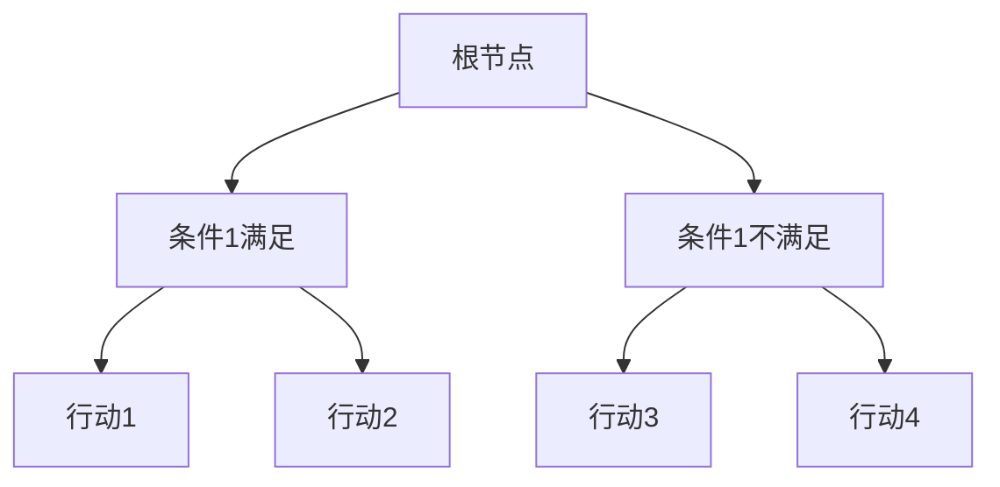

**贝叶斯网络模型**：贝叶斯网络是一种概率图模型，通过表示变量之间的依赖关系来推理变量值。贝叶斯网络模型在处理不确定性和复杂决策时具有显著优势。通过贝叶斯推理，角色AI可以根据当前的状态和先验知识，计算每个行动的概率，并选择最优行动。

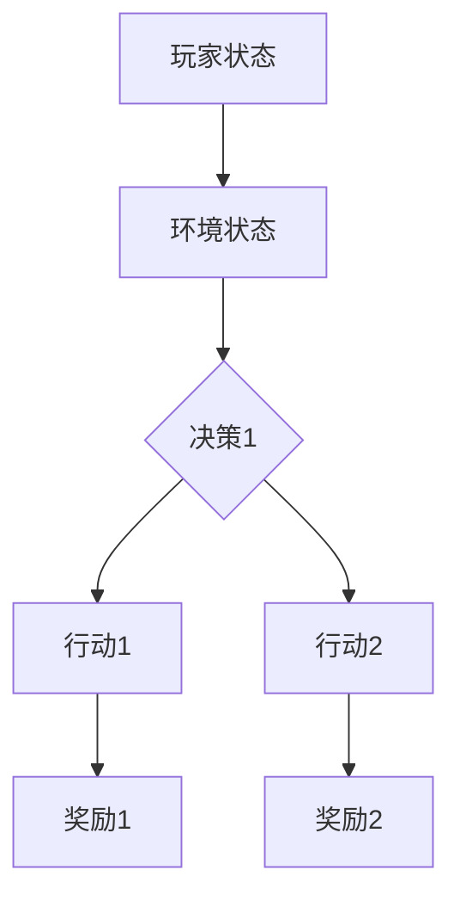

##### 3.1.2 角色AI的动态行为设计

动态行为设计是角色AI智能化的关键。通过引入行为树和行为规划，可以为角色设计出更加复杂和多样化的行为模式。

**行为树模型**：行为树是一种层次化的行为模型，通过一系列条件和分支，描述角色的行为逻辑。行为树模型可以将角色的行为分解为一系列基本动作和条件判断，从而实现复杂的决策逻辑。

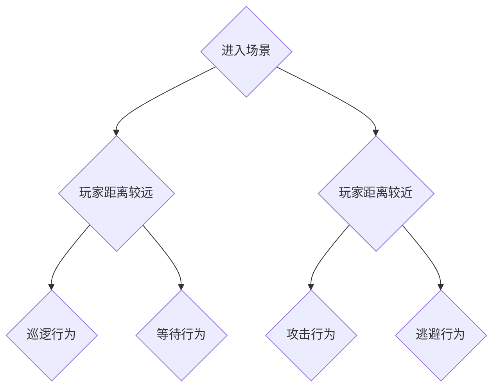

**行为规划**：行为规划是一种通过预先定义行为规则，动态规划角色行为的方法。行为规划可以根据角色的状态和环境变化，实时调整行为，实现角色的智能交互和适应性。

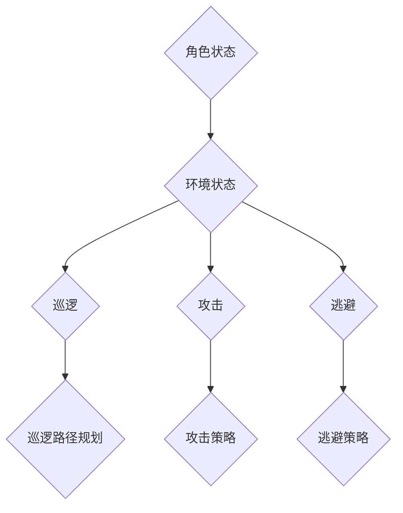

##### 3.1.2.1 行为树模型

行为树是一种层次化的决策模型，通过节点和分支来表示角色的行为逻辑。行为树模型可以将角色的行为分解为一系列基本动作和条件判断，从而实现复杂的决策逻辑。以下是一个简单的行为树示例：

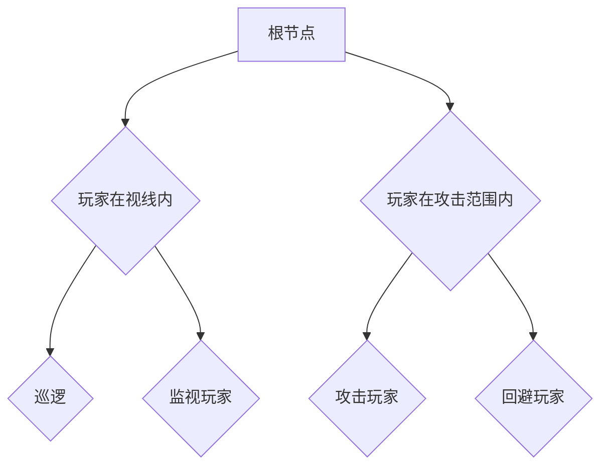

在这个行为树中，角色根据不同的条件进行决策，选择相应的行为。例如，如果玩家在角色的视线内，但不在攻击范围内，角色将执行巡逻行为；如果玩家在攻击范围内，角色将攻击玩家。

**动态行为**：动态行为是指角色根据当前环境和玩家的状态，实时调整行为。通过引入动态行为，角色可以更加灵活地应对不同的情况，提升游戏的可玩性和挑战性。

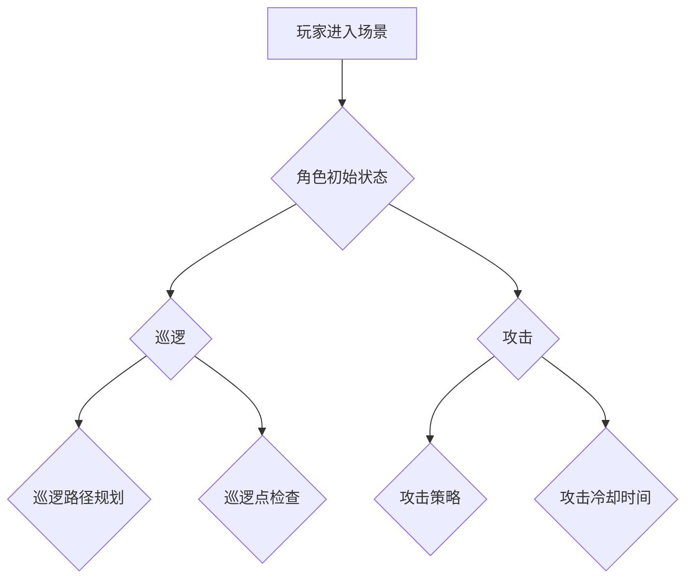

在这个示例中，角色根据玩家的状态（是否进入场景）和自身状态（是否在巡逻状态），动态调整行为。如果玩家进入场景，角色将根据当前的状态选择相应的行为，如巡逻、攻击或回避。

##### 3.1.2.2 角色行动的随机性控制

在游戏设计中，角色行动的随机性控制是一个重要的方面。通过引入随机性，可以增加游戏的多样性和不可预测性，从而提升玩家的兴趣和体验。以下是一些常用的随机性控制方法：

1. **随机概率**：通过设定不同行为的概率，角色在执行行为时，根据概率随机选择行为。例如，角色在巡逻时，可以随机选择不同的巡逻路径。

2. **随机种子**：使用随机种子，可以为游戏生成一个固定的随机序列，从而确保游戏在不同次运行时具有一致性。

3. **随机模块**：使用随机模块，如随机数生成器或随机函数，在游戏中引入随机性。例如，角色在战斗中，可以随机选择攻击动作或防御动作。

通过合理的随机性控制，角色行动将更加真实和多样化，从而提升游戏的设计质量和玩家体验。

### 3.2 AI Agent在游戏任务设计中的应用

AI Agent在游戏任务设计中的应用，旨在提高任务的智能性和可玩性，使游戏更具挑战性和趣味性。以下将探讨AI Agent在任务设计中的应用，包括任务AI的决策算法和任务AI的适应性设计。

##### 3.2.1 任务AI的决策算法

任务AI的决策算法是任务设计中的核心。通过合理的决策算法，任务AI可以根据当前环境和玩家的行为，选择最优的任务策略。常见的决策算法包括强化学习算法和贝叶斯优化算法。

**强化学习算法**：强化学习算法是一种使智能体在与环境互动过程中，通过不断试错和奖励反馈来学习最优行为策略的机器学习方法。在游戏任务设计中，强化学习算法可以用于任务难度的动态调整、任务目标的智能分配等。

例如，在益智游戏中，任务AI可以使用强化学习算法来选择合适的关卡难度。通过不断尝试和优化，任务AI可以找到最适合玩家的关卡难度，提高玩家的游戏体验。

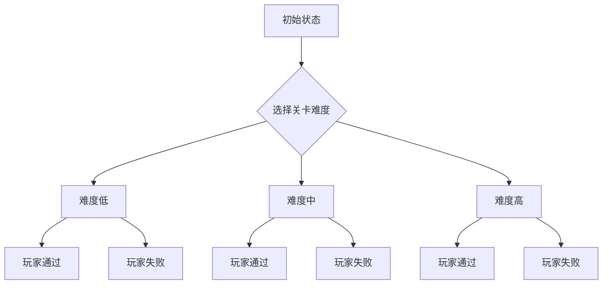

**贝叶斯优化算法**：贝叶斯优化算法是一种基于概率模型的优化方法，通过迭代优化目标函数，找到最优解。在游戏任务设计中，贝叶斯优化算法可以用于任务参数的优化，如任务奖励、任务难度等。

例如，在角色扮演游戏中，任务AI可以使用贝叶斯优化算法来调整任务奖励。通过不断迭代和优化，任务AI可以找到最合适的奖励参数，使任务更具挑战性和吸引力。

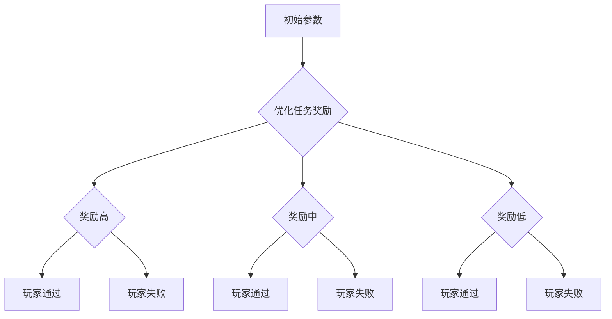

通过强化学习算法和贝叶斯优化算法的应用，任务AI可以动态调整任务策略，提高任务的智能性和可玩性。

##### 3.2.2 任务AI的适应性设计

任务AI的适应性设计是任务设计中的重要一环。通过适应性设计，任务AI可以适应不同的玩家行为和游戏环境，提供个性化的任务体验。

**AI对游戏难度调整**：游戏难度是影响玩家体验的重要因素。通过引入AI Agent，可以动态调整游戏难度，使其适应不同玩家的能力水平。

例如，在动作游戏中，任务AI可以根据玩家的表现，实时调整游戏难度。如果玩家表现优异，任务AI可以增加游戏难度，提供更多挑战；如果玩家表现不佳，任务AI可以降低游戏难度，帮助玩家逐步适应。

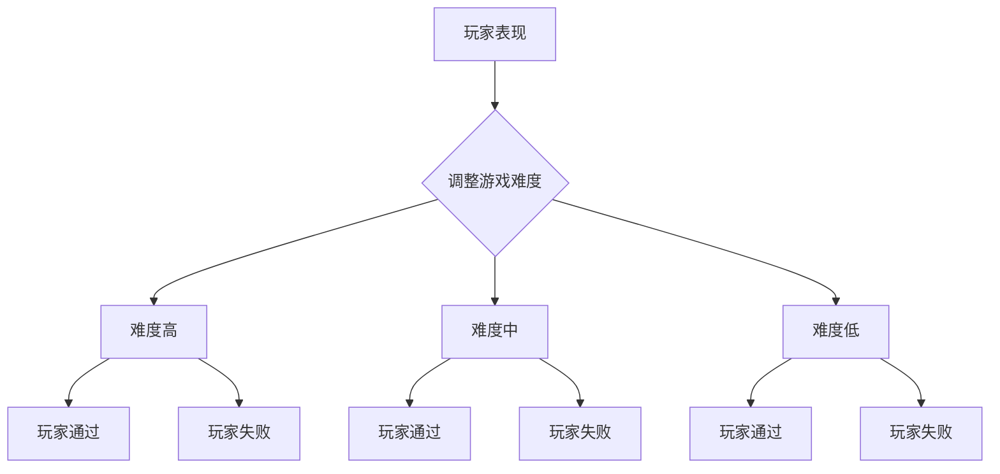

**AI对玩家行为的预测与应对**：通过分析玩家的行为数据，任务AI可以预测玩家的行为模式，并采取相应的应对策略。

例如，在角色扮演游戏中，任务AI可以分析玩家的任务完成情况、游戏时间等数据，预测玩家的行为模式。根据预测结果，任务AI可以调整任务难度、提供个性化奖励等，提高玩家的游戏体验。

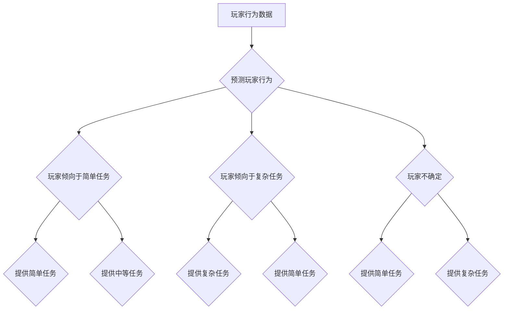

通过适应性设计，任务AI可以更好地适应不同玩家的需求，提供个性化的游戏体验，从而提升游戏的趣味性和玩家满意度。

### 第4章: AI Agent在玩家行为分析中的应用

#### 4.1 玩家行为数据收集与分析

在游戏产业中，玩家行为数据是了解玩家需求、优化游戏设计、提升用户体验的重要资源。AI Agent在玩家行为分析中的应用，可以通过收集和分析这些数据，为游戏开发者提供有价值的洞察和决策支持。以下将详细探讨玩家行为数据的收集与分析方法。

##### 4.1.1 数据收集方法

收集玩家行为数据的方法可以分为两大类：被动收集和主动收集。

**被动收集**：被动收集方法通过游戏系统的自然运行来记录玩家行为，不需要额外的干预。常见的被动收集方法包括：

- **日志记录**：游戏系统在玩家操作时自动生成日志文件，记录玩家的行为数据。例如，玩家登录时间、游戏时长、角色创建和升级记录等。
- **API调用**：通过游戏引擎或后端服务器提供的API，实时收集玩家的操作数据。例如，Unity的Event System、Unreal的GameplaySystem等。
- **传感器数据**：使用游戏设备内置的传感器（如摄像头、麦克风等）收集玩家行为数据。例如，玩家的面部表情、语音交互等。

**主动收集**：主动收集方法需要开发者有意识地引导玩家参与数据收集，常见的方法包括：

- **问卷调查**：在游戏过程中或游戏结束后，通过弹出问卷或邮件邀请玩家填写问卷，收集玩家对游戏的设计、难度、体验等方面的反馈。
- **用户访谈**：通过与玩家进行一对一的深度访谈，了解玩家的游戏行为、需求和痛点，获取更详细的定性数据。
- **实验设计**：设计特定的实验，通过控制变量的方法，观察玩家在不同条件下的行为差异，从而分析玩家行为模式。

##### 4.1.2 数据分析方法

收集到玩家行为数据后，需要进行有效分析，以提取有价值的信息。以下是一些常见的数据分析方法：

**聚类分析**：聚类分析是一种无监督学习方法，通过将玩家行为数据划分为不同的集群，找出具有相似行为的玩家群体。常用的聚类算法包括K-means、DBSCAN等。

- **K-means算法**：K-means算法通过最小化集群内点与中心点的距离平方和，将玩家数据划分为K个集群。算法流程如下：
  1. 初始化K个聚类中心点。
  2. 计算每个玩家与聚类中心点的距离，将玩家分配到最近的聚类中心点。
  3. 更新聚类中心点，计算新的聚类中心点的均值。
  4. 重复步骤2和步骤3，直到聚类中心点不再变化。

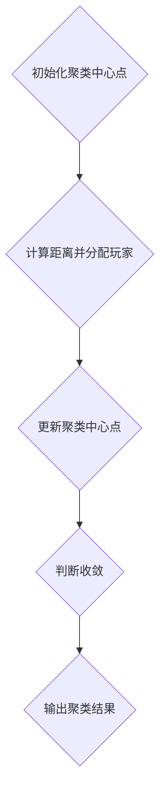

**关联规则挖掘**：关联规则挖掘是一种用于发现数据之间关联关系的方法，常用于分析玩家行为之间的相互影响。常见的算法包括Apriori算法和FP-Growth算法。

- **Apriori算法**：Apriori算法通过逐层挖掘频繁项集，生成关联规则。算法流程如下：
  1. 计算每个项的频率，过滤掉不频繁的项。
  2. 使用频繁项集生成候选频繁项集。
  3. 验证候选频繁项集的频繁性，生成最终的频繁项集。
  4. 使用频繁项集生成关联规则。

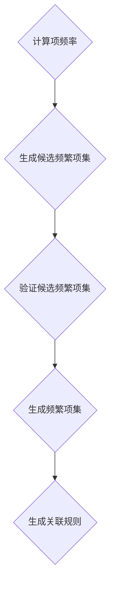

**时间序列分析**：时间序列分析是一种用于分析数据在不同时间点上的变化规律的方法，常用于分析玩家行为的时间模式。常见的时间序列分析方法包括ARIMA模型、LSTM模型等。

- **ARIMA模型**：ARIMA（AutoRegressive Integrated Moving Average）模型是一种用于时间序列预测的自回归积分滑动平均模型，算法流程如下：
  1. 对时间序列进行差分，使其平稳。
  2. 确定自回归项、差分项和移动平均项的参数。
  3. 使用参数拟合模型，进行预测。

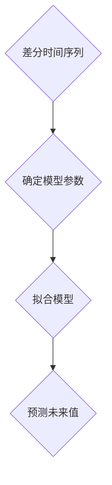

通过以上分析方法，可以从玩家行为数据中提取出有价值的信息，为游戏开发者提供决策支持。例如，通过聚类分析，可以识别出不同类型的玩家群体，并根据他们的行为特点进行个性化推荐和设计优化；通过关联规则挖掘，可以找出玩家行为之间的关联关系，从而优化游戏设计和提高玩家黏性；通过时间序列分析，可以预测玩家行为趋势，为游戏运营策略提供依据。

### 4.2 玩家偏好与行为预测

在游戏产业中，了解玩家的偏好和行为模式对于提升用户体验和游戏设计至关重要。AI Agent通过机器学习算法，可以深入分析玩家行为数据，准确预测玩家的行为，从而为游戏开发和运营提供有力支持。以下将详细探讨AI Agent在玩家偏好分析与行为预测中的应用。

#### 4.2.1 玩家偏好分析

玩家偏好分析是指通过分析玩家在游戏中的行为数据，识别玩家的兴趣、喜好和习惯，从而为游戏内容设计和运营策略提供依据。以下是一些常见的玩家偏好分析方法：

**基于内容的推荐**：基于内容的推荐（Content-Based Recommendation）是一种通过分析玩家过去的行为数据，识别其偏好内容，并推荐类似内容的游戏或游戏元素。

- **特征提取**：首先，从玩家行为数据中提取特征，如游戏类型、游戏时长、游戏难度等。
- **相似性计算**：计算玩家行为数据与其他玩家的行为数据的相似度，使用余弦相似度、Jaccard系数等方法。
- **推荐生成**：根据相似度分数，为玩家推荐与其行为相似的玩游戏内容。

**基于协同过滤的推荐**：基于协同过滤（Collaborative Filtering）是一种通过分析玩家群体的行为数据，发现相似玩家的行为模式，并基于此为玩家推荐内容。

- **用户相似性计算**：计算用户之间的相似性，常用的方法包括用户-用户协同过滤和物品-物品协同过滤。
- **推荐生成**：根据相似用户的行为，为玩家推荐他们可能感兴趣的游戏内容。

**多元线性回归**：多元线性回归是一种统计方法，通过建立玩家行为与偏好之间的线性关系模型，预测玩家的行为偏好。

- **模型建立**：使用多元线性回归方程，建立玩家行为数据（自变量）与偏好评分（因变量）之间的关系。
- **模型训练**：使用历史数据训练模型，确定模型的参数。
- **偏好预测**：使用训练好的模型，预测玩家对特定游戏内容的偏好。

**案例：基于内容的推荐**

以下是一个基于内容的推荐示例，假设我们使用特征提取和相似性计算为玩家推荐游戏。

```python
# 特征提取
player行为的特征 = ['策略游戏', '角色扮演游戏', '射击游戏', '冒险游戏']

# 相似性计算
相似度分数 = 计算相似度(当前玩家行为特征，历史玩家行为特征)

# 推荐生成
推荐的游戏列表 = 找到与玩家行为最相似的游戏
```

通过以上方法，我们可以准确地识别玩家的偏好，为游戏设计提供有针对性的建议。

#### 4.2.2 玩家行为预测

玩家行为预测是指通过分析玩家在游戏中的行为数据，预测玩家在未来可能采取的行为，从而为游戏运营和内容设计提供指导。以下是一些常见的行为预测方法：

**强化学习**：强化学习是一种通过奖励反馈进行学习的方法，可以用于预测玩家在特定情境下的行为。以下是一个强化学习的简单案例：

- **状态定义**：定义游戏中的状态，如玩家当前的角色等级、已完成的任务数量等。
- **动作定义**：定义玩家可以采取的动作，如购买装备、完成任务等。
- **奖励定义**：定义玩家的即时奖励，如完成任务获得的金币、经验值等。
- **模型训练**：使用历史行为数据训练强化学习模型，学习玩家的行为模式。
- **行为预测**：使用训练好的模型，预测玩家在未来可能采取的行为。

**案例：强化学习行为预测**

以下是一个强化学习行为预测的示例：

```python
# 状态
当前状态 = {'等级': 10, '任务完成数': 5}

# 动作
可采取动作 = ['购买装备', '完成任务', '休息']

# 奖励
即时奖励 = {'购买装备': 5, '完成任务': 10, '休息': 0}

# 模型训练
模型 = 训练强化学习模型(历史行为数据)

# 行为预测
预测行为 = 模型.predict(当前状态，可采取动作，即时奖励)
```

**贝叶斯网络**：贝叶斯网络是一种概率图模型，可以用于预测玩家在游戏中的行为概率。以下是一个贝叶斯网络的简单案例：

- **节点定义**：定义游戏中的关键节点，如玩家角色、任务状态、玩家行为等。
- **概率分布定义**：定义每个节点的概率分布，如角色状态的概率分布、任务完成概率等。
- **条件概率定义**：定义节点之间的条件概率，如玩家在某个角色状态下完成任务的概率。
- **模型训练**：使用历史行为数据训练贝叶斯网络模型。
- **行为预测**：使用训练好的模型，预测玩家在未来可能采取的行为概率。

**案例：贝叶斯网络行为预测**

以下是一个贝叶斯网络行为预测的示例：

```mermaid
graph TD
A[玩家角色] --> B[任务状态]
B --> C{完成任务}
C --> D{完成概率}

A --> E{角色状态}
E --> F{任务完成概率}

模型 = 训练贝叶斯网络模型(历史行为数据)

预测行为 = 模型.predict(当前状态，条件概率)
```

通过强化学习和贝叶斯网络等方法，我们可以准确预测玩家在游戏中的行为，为游戏运营和内容设计提供有力支持。

### 4.3 玩家偏好与行为预测的应用实例

为了更好地理解玩家偏好与行为预测在实际游戏产业中的应用，以下将介绍两个具体的应用实例：玩家行为预测模型在游戏内广告投放优化中的应用，以及玩家偏好分析在游戏角色设计中的应用。

**1. 玩家行为预测模型在游戏内广告投放优化中的应用**

**背景**：在游戏产业中，游戏内广告是获取收入的重要方式之一。然而，如何精准投放广告以提高广告效果和玩家满意度是一个挑战。通过引入玩家行为预测模型，可以优化广告投放策略，提高广告投放效果。

**方法**：
- **数据收集**：收集玩家在游戏中的行为数据，包括游戏时长、游戏类型、角色等级、任务完成情况等。
- **特征提取**：从行为数据中提取关键特征，如玩家在游戏中的活跃度、消费行为等。
- **模型训练**：使用强化学习算法（如Q-learning或SARSA）训练玩家行为预测模型，预测玩家在未来可能的行为。
- **广告推荐**：根据预测结果，为不同类型的玩家推荐合适的广告内容。

**效果**：通过优化广告投放策略，提高了广告点击率和收入，同时提升了玩家的游戏体验。

**2. 玩家偏好分析在游戏角色设计中的应用**

**背景**：游戏角色设计是游戏设计中的关键环节，直接影响玩家的游戏体验和满意度。通过分析玩家偏好，可以设计出更加符合玩家需求的角色，提升游戏的可玩性和留存率。

**方法**：
- **数据收集**：收集玩家对游戏角色的评价数据，包括角色外观、能力、交互等。
- **特征提取**：从评价数据中提取关键特征，如玩家对角色外观的偏好、对角色能力的评价等。
- **多元线性回归**：使用多元线性回归模型，建立玩家偏好与角色特征之间的关系，预测玩家对不同角色特征的偏好。
- **角色设计**：根据预测结果，调整角色设计，优化角色外观和能力。

**效果**：通过优化角色设计，提升了玩家的满意度和游戏的留存率，增强了游戏的市场竞争力。

通过以上应用实例，可以看出玩家偏好与行为预测在实际游戏产业中的应用具有显著的效果。通过引入AI Agent技术，可以更加精准地分析玩家行为和偏好，为游戏开发和运营提供有力支持，提升整体用户体验和商业收益。

### 第5章: AI Agent在游戏平衡调整中的应用

#### 5.1 游戏平衡调整的概念与挑战

游戏平衡调整是指通过调整游戏中的各项参数，使游戏在各个层面上达到一种相对公平和富有挑战性的状态。游戏平衡不仅是游戏设计的重要环节，也是保持玩家兴趣和游戏持久性的关键因素。在理想情况下，游戏应能提供适度的挑战，同时确保不同玩家群体都能享受公平的游戏体验。

**游戏平衡的重要性**：游戏平衡直接影响玩家的游戏体验。一个设计不平衡的游戏可能导致部分玩家感到沮丧或失望，从而降低游戏的可玩性和留存率。良好的游戏平衡能够提供以下好处：

- **提升游戏可玩性**：通过调整游戏难度和规则，使游戏在不同阶段都保持新鲜感和挑战性，从而吸引玩家持续游戏。
- **增强玩家参与感**：平衡的游戏可以让所有玩家都能在公平的竞争环境中体验游戏的乐趣，增强玩家的参与感和归属感。
- **优化游戏社区**：良好的游戏平衡有助于建立一个健康、积极的游戏社区，减少玩家间的摩擦和不满，促进友好交流。

**游戏平衡调整的挑战**：

1. **动态调整的复杂性**：游戏中的平衡调整通常是动态的，需要根据玩家的行为和游戏进程实时调整。这增加了设计和实现的复杂性。
2. **玩家群体的多样性**：玩家群体具有多样性，不同玩家对于游戏平衡的要求和期望各不相同。设计一个能够满足所有玩家需求的平衡方案是一个挑战。
3. **平衡与多样性的平衡**：游戏设计不仅要考虑平衡性，还要考虑多样性。过度的平衡可能导致游戏缺乏新鲜感，而过于多样化的游戏机制可能使玩家感到困惑。
4. **测试和验证的困难**：游戏平衡调整需要在多种场景下进行测试和验证，以确保调整措施的有效性和公平性。然而，游戏测试资源有限，全面覆盖所有情况可能不现实。

**AI Agent在游戏平衡调整中的作用**：AI Agent可以通过机器学习和强化学习等技术，实现动态平衡调整，从而应对上述挑战。AI Agent可以实时分析玩家的行为和游戏进程，自动调整游戏参数，以实现最佳的平衡效果。以下将详细探讨AI Agent在游戏平衡调整中的应用。

#### 5.2 AI Agent在游戏平衡调整中的应用

**5.2.1 强化学习在平衡调整中的应用**

强化学习（Reinforcement Learning，RL）是一种通过奖励反馈进行学习的方法，非常适合用于动态平衡调整。强化学习算法可以让AI Agent在与环境互动的过程中，通过不断试错和优化策略，找到最佳的平衡点。

**1. 动态难度调整**

动态难度调整是强化学习在游戏平衡调整中的一种典型应用。通过强化学习，AI Agent可以根据玩家的行为和游戏进程，实时调整游戏的难度。

- **状态定义**：强化学习中的状态（State）可以定义为玩家当前的状态，如角色等级、游戏进度、已完成的任务数量等。
- **动作定义**：动作（Action）可以是调整游戏难度的一个操作，如增加或减少敌人的攻击力、提升角色的技能效果等。
- **奖励定义**：奖励（Reward）可以是玩家在游戏中获得的即时反馈，如击败敌人获得的金币、经验值等。

通过以上定义，强化学习模型可以学习到在特定状态下，哪种动作能够带来最大的奖励。例如，如果AI Agent发现玩家在当前难度下经常失败，它可以降低难度，帮助玩家逐渐适应；如果玩家经常轻松获胜，AI Agent可以提高难度，增加游戏的挑战性。

**2. 游戏规则调整**

除了难度调整，强化学习还可以用于调整游戏规则。通过调整规则，AI Agent可以改变游戏的战略和战术，从而实现平衡调整。

- **规则定义**：游戏规则（Rule）可以是影响游戏平衡的各种因素，如游戏时间、生命值、技能冷却时间等。
- **策略优化**：AI Agent可以通过强化学习算法，优化游戏规则，使其在新的环境中达到平衡。

例如，在多人在线游戏中，AI Agent可以调整玩家的生命值和技能冷却时间，以保持玩家之间的竞争平衡。通过不断试错和优化，AI Agent可以找到最佳的规则组合，使游戏既具有挑战性，又能保持公平。

**案例：动态难度调整的应用**

以下是一个动态难度调整的强化学习案例：

```python
# 状态定义
状态 = {'角色等级': 10, '游戏进度': 50, '任务完成数': 5}

# 动作定义
动作空间 = ['降低难度', '保持难度', '提高难度']

# 奖励定义
即时奖励 = {'降低难度': -1, '保持难度': 0, '提高难度': 1}

# 强化学习模型训练
模型 = 强化学习模型(状态空间，动作空间，即时奖励)

# 模型预测
预测动作 = 模型.predict(当前状态)

# 动态调整游戏难度
游戏难度 = 预测动作
```

通过以上步骤，AI Agent可以根据玩家的行为和游戏进程，动态调整游戏难度，实现游戏平衡。

**5.2.2 贝叶斯优化在平衡调整中的应用**

贝叶斯优化（Bayesian Optimization）是一种基于贝叶斯统计学的优化方法，它通过利用历史数据来预测新的参数设置，从而实现高效的全局优化。贝叶斯优化在游戏平衡调整中，特别是在参数优化方面，具有显著优势。

**1. 参数优化**

贝叶斯优化可以用于优化游戏中的各种参数，如敌人攻击力、角色生命值、技能冷却时间等。

- **参数定义**：定义需要优化的参数，如敌人攻击力、角色生命值等。
- **模型训练**：使用历史游戏数据，训练贝叶斯优化模型，预测不同参数设置下的游戏结果。
- **参数优化**：根据预测结果，调整参数设置，实现游戏平衡。

**2. 策略调整**

贝叶斯优化还可以用于调整游戏策略，如游戏中的任务难度、奖励机制等。

- **策略定义**：定义需要优化的策略，如任务难度、奖励机制等。
- **模型训练**：使用历史玩家行为数据，训练贝叶斯优化模型，预测不同策略设置下的玩家行为。
- **策略优化**：根据预测结果，调整游戏策略，实现游戏平衡。

**案例：贝叶斯优化参数调整**

以下是一个贝叶斯优化参数调整的案例：

```python
# 参数定义
参数空间 = {'敌人攻击力': [1, 10], '角色生命值': [100, 500]}

# 贝叶斯优化模型训练
模型 = 贝叶斯优化模型(参数空间)

# 参数优化
最佳参数 = 模型.optimize()

# 调整游戏参数
敌人攻击力 = 最佳参数['敌人攻击力']
角色生命值 = 最佳参数['角色生命值']
```

通过以上步骤，贝叶斯优化模型可以根据历史数据，找到最佳参数设置，实现游戏平衡。

**5.2.3 AI Agent在平衡调整中的应用优势**

AI Agent在游戏平衡调整中的应用具有以下优势：

- **自适应**：AI Agent可以根据玩家的行为和游戏进程，自适应地调整游戏平衡，确保游戏在不同阶段都保持公平和挑战性。
- **高效**：AI Agent可以高效地处理大量的游戏数据，快速找到最佳的平衡点，节省开发者的时间和精力。
- **全面**：AI Agent可以同时考虑多个因素，如玩家行为、游戏难度、规则调整等，实现全面的平衡调整。
- **优化**：通过机器学习和优化算法，AI Agent可以不断优化游戏平衡，提高游戏的可玩性和玩家满意度。

总之，AI Agent在游戏平衡调整中的应用，为游戏开发者提供了一种高效、全面和自适应的解决方案，有助于实现游戏的最佳平衡效果。

### 5.2.4 案例研究：AI Agent在《英雄联盟》中的游戏平衡调整

《英雄联盟》（League of Legends，简称LOL）是一款全球知名的多玩家在线战斗竞技游戏。其游戏平衡调整是一个复杂而持续的过程，涉及游戏规则的调整、英雄能力的平衡以及玩家行为的分析。AI Agent在《英雄联盟》的游戏平衡调整中发挥了重要作用，以下是一个详细的案例研究。

**背景**：《英雄联盟》自推出以来，一直在不断更新和优化游戏平衡。随着游戏的进化，玩家水平和游戏风格也在不断变化，这使得游戏平衡调整变得更加复杂。为了保持游戏的公平性和可玩性，游戏开发团队需要实时监测和分析游戏数据，调整英雄的能力和游戏规则。

**AI Agent的应用**：

1. **数据收集与预处理**：
   - **数据源**：AI Agent通过游戏服务器收集实时玩家数据，包括游戏进程、玩家行为、英雄选择、胜负结果等。
   - **预处理**：数据预处理包括去除异常值、填补缺失值以及特征提取，如玩家胜率、英雄表现等。

2. **模型训练与预测**：
   - **模型选择**：AI Agent采用强化学习算法（如Q-learning）和贝叶斯优化算法，训练模型预测游戏平衡调整的效果。
   - **模型训练**：使用历史数据训练模型，学习玩家行为和游戏结果的关联，优化英雄能力和游戏规则。
   - **预测**：AI Agent根据实时数据，预测当前游戏平衡的状态，并生成调整建议。

3. **游戏平衡调整**：
   - **英雄能力调整**：根据模型预测，调整英雄的能力参数，如攻击力、防御力、技能效果等。
   - **游戏规则调整**：调整游戏规则，如缩短游戏时间、调整经济系统等，以优化游戏体验。

**具体步骤**：

1. **数据收集**：
   - **实时监测**：AI Agent通过游戏服务器API，实时收集玩家行为数据。
   - **日志分析**：分析游戏日志，提取关键指标，如玩家胜率、英雄使用率、技能释放频率等。

2. **数据预处理**：
   - **特征提取**：从原始数据中提取特征，如玩家胜率、英雄表现等。
   - **去噪与填补**：去除异常数据，填补缺失值，确保数据质量。

3. **模型训练**：
   - **训练集构建**：使用历史数据构建训练集，包括玩家行为和游戏结果。
   - **模型训练**：使用强化学习算法（如Q-learning）和贝叶斯优化算法，训练模型。

4. **预测与调整**：
   - **预测**：AI Agent根据实时数据，预测当前游戏平衡状态。
   - **调整建议**：生成调整建议，包括英雄能力调整和游戏规则调整。

5. **测试与验证**：
   - **A/B测试**：在不同服务器上进行A/B测试，比较调整前后的游戏表现。
   - **数据分析**：分析调整后的游戏数据，验证调整效果。

**效果**：

1. **英雄平衡性提升**：AI Agent通过调整英雄能力参数，提高了英雄之间的平衡性，减少了某些英雄过于强势或过于弱势的情况。
2. **游戏体验优化**：通过调整游戏规则，如缩短游戏时间和优化经济系统，提高了游戏节奏和玩家满意度。
3. **玩家留存率提高**：通过实时平衡调整，提高了游戏的公平性和挑战性，增加了玩家的游戏乐趣和留存率。

**总结**：《英雄联盟》中的AI Agent在游戏平衡调整中的应用，展示了AI技术在游戏产业中的巨大潜力。通过实时数据分析和模型预测，AI Agent能够高效地实现游戏平衡，提升玩家体验，为游戏开发者提供了强有力的支持。

### 5.3 AI Agent在游戏平衡调整中的应用最佳实践与注意事项

在游戏平衡调整中，AI Agent的应用不仅带来了技术上的革新，也带来了一系列最佳实践和注意事项。以下将总结AI Agent在游戏平衡调整中的应用最佳实践，并提出相关注意事项。

#### 最佳实践

**1. 数据驱动的调整**：游戏平衡调整应基于详尽的数据分析，确保调整措施的准确性和有效性。通过收集和解析游戏数据，AI Agent可以识别出游戏中的不平衡现象，并为调整提供数据支持。

**2. 逐步调整**：为了避免对游戏生态造成冲击，游戏平衡调整应采取逐步调整的策略。通过逐步调整参数，开发者可以观察每个调整的影响，并做出相应的调整，确保游戏系统的稳定性。

**3. 实时反馈与迭代**：AI Agent可以实时监测游戏环境，根据玩家的反馈和游戏数据，动态调整游戏平衡。通过不断迭代和优化，AI Agent可以帮助游戏开发者实现最佳的平衡效果。

**4. 多元化调整**：游戏平衡调整不仅涉及英雄能力和游戏规则，还应考虑玩家行为、游戏节奏等因素。通过多元化的调整，AI Agent可以确保游戏在不同层面上都达到平衡。

**5. 用户参与**：在游戏平衡调整中，用户的参与和反馈至关重要。开发者可以通过社区反馈、问卷调查等方式，收集玩家的意见和建议，为AI Agent提供调整方向。

#### 注意事项

**1. 保持公平性**：游戏平衡调整必须确保所有玩家都能在公平的环境中竞争。任何调整都不能导致某些玩家获得不公平的优势，否则会破坏游戏的公正性。

**2. 适度调整**：调整游戏平衡时应避免过度调整，否则可能会破坏游戏的节奏和体验。调整的幅度和频率应适度，确保游戏体验的连贯性。

**3. 避免频繁调整**：频繁的平衡调整可能会让玩家感到困惑和不耐烦。开发者应在必要时进行集中调整，避免频繁的小幅调整。

**4. 测试与验证**：在进行任何调整之前，应进行充分的测试和验证。通过A/B测试等方式，开发者可以评估调整效果，确保调整措施的有效性。

**5. 用户隐私保护**：在收集玩家数据时，应确保用户隐私得到保护。开发者应遵守相关的隐私法规，确保玩家数据的安全和隐私。

通过遵循这些最佳实践和注意事项，开发者可以更有效地利用AI Agent进行游戏平衡调整，提升游戏体验和玩家满意度。

### 总结与拓展阅读

本章详细探讨了AI Agent在游戏平衡调整中的应用，包括强化学习和贝叶斯优化算法的应用、数据驱动的调整方法、逐步调整策略以及多元化调整的重要性。通过具体案例，如《英雄联盟》的平衡调整实践，展示了AI Agent在游戏平衡调整中的实际效果。

为了进一步深入了解AI Agent在游戏产业中的应用，读者可以参考以下拓展阅读：

- 《深度学习》（Goodfellow, I., Bengio, Y., & Courville, A.）：了解深度学习基础，为AI Agent的开发和应用提供理论支持。
- 《强化学习论文集》（Sutton, R. S., & Barto, A. G.）：深入理解强化学习算法，掌握AI Agent的核心原理。
- 《游戏设计艺术》（Bogost, I.）：探讨游戏设计的哲学和方法，为AI Agent在游戏角色设计和任务设计中的应用提供灵感。

通过这些资源，读者可以更全面地了解AI Agent在游戏产业中的应用，为未来的研究和实践提供指导。

