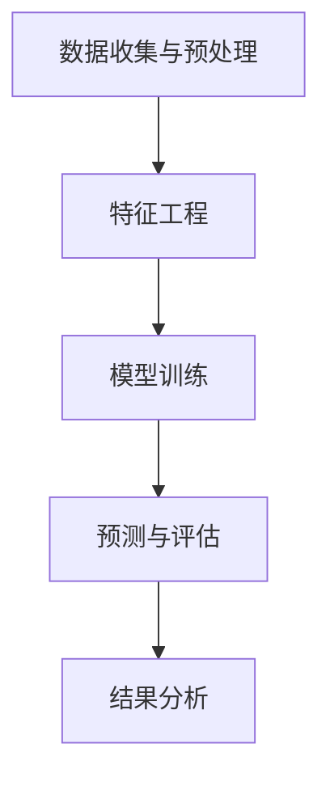
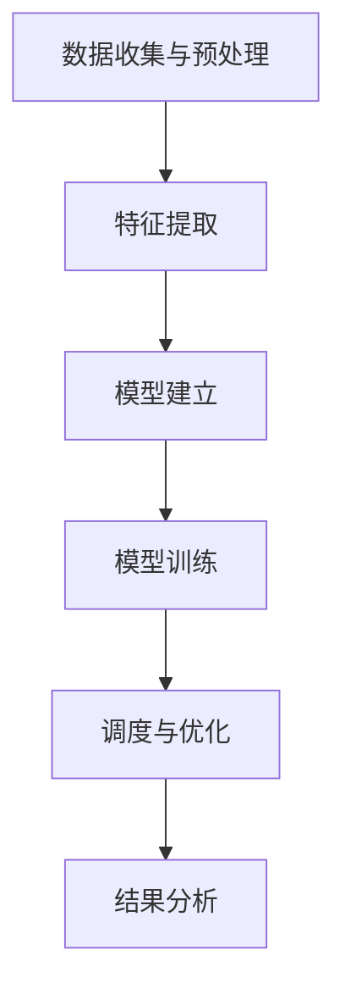
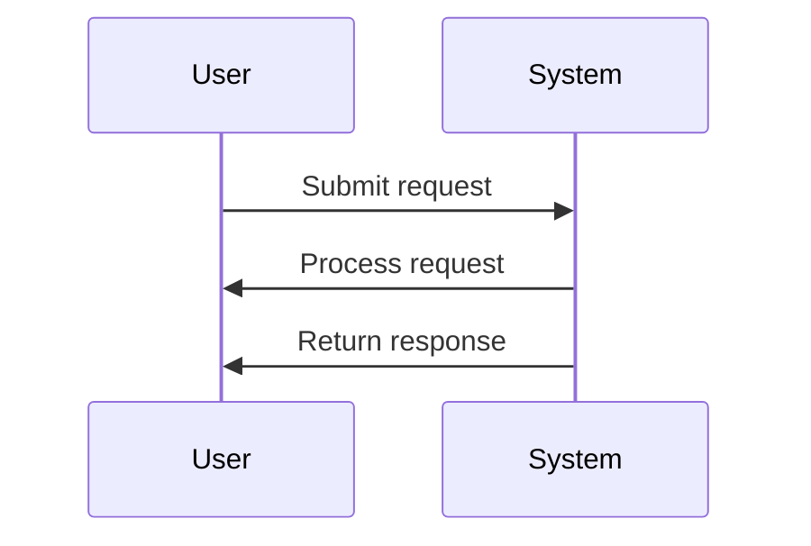
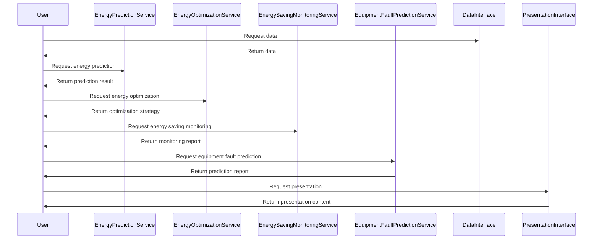
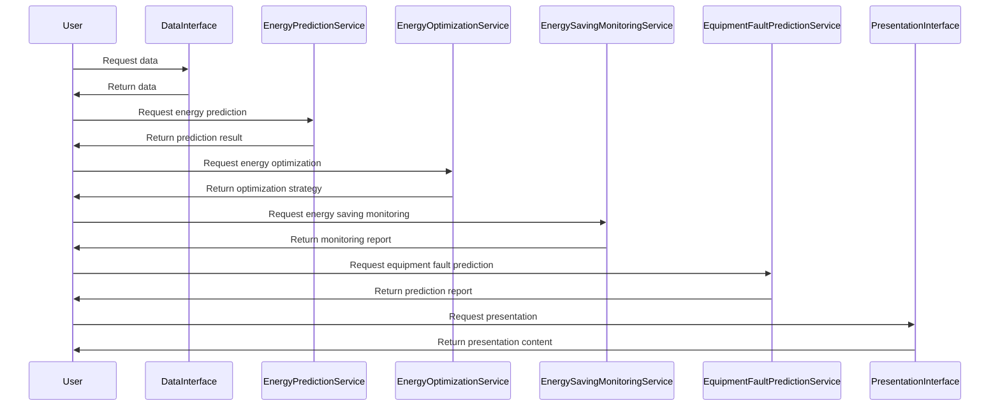

                 

### AI Agent在能源管理中的节能减排作用

**关键词：** AI代理，能源管理，节能减排，机器学习，深度学习，优化调度

**摘要：** 本文章深入探讨了AI代理在能源管理中的应用，特别是在节能减排方面的作用。文章首先介绍了AI代理技术的原理和特点，随后详细阐述了AI代理在能源管理中的应用场景，以及如何利用AI代理技术实现能源需求预测、优化调度和节能减排。文章还通过实际案例分析了AI代理在能源管理中的具体应用，最后提出了未来发展的挑战与趋势。

#### 引言

随着全球气候变化和能源需求的持续增长，节能减排已成为全球关注的焦点。传统的能源管理方法在效率、灵活性和智能化方面存在不足，难以满足现代能源管理的需求。近年来，人工智能（AI）技术的快速发展为能源管理带来了新的解决方案。特别是AI代理技术，通过自我学习、自适应和自动化等特点，在能源管理中具有巨大的潜力。

本文旨在探讨AI代理在能源管理中的节能减排作用，详细分析AI代理技术的原理和应用场景，并通过实际案例展示其在能源管理中的具体应用。文章将分为以下几个部分：

1. **背景介绍**：介绍AI代理技术和能源管理的背景，阐述节能减排的重要性。
2. **核心概念与联系**：阐述AI代理技术的定义、特点及其在能源管理中的应用。
3. **算法原理讲解**：详细讲解AI代理在能源需求预测和优化调度中的算法原理。
4. **系统分析与架构设计方案**：分析能源管理系统的功能设计和架构设计。
5. **项目实战**：通过实际案例展示AI代理在能源管理中的应用。
6. **最佳实践 tips**：总结最佳实践和注意事项。
7. **小结**：总结文章内容，展望未来发展趋势。

#### 1. 背景介绍

##### 1.1 问题背景

能源管理是指对能源的生产、传输、分配、消费等环节进行优化和控制，以实现能源的高效利用和可持续发展。随着全球能源需求的不断增长，能源管理变得愈加复杂。特别是在节能减排方面，传统的能源管理方法已经显得力不从心。

传统的能源管理方法主要包括以下几个方面：

- **计划调度**：根据能源需求计划，安排能源的生产和分配。
- **设备维护**：定期对能源设备进行维护和检查，确保其正常运行。
- **能源审计**：对能源消耗进行审计，找出节能减排的潜力。

然而，这些方法在应对复杂、多变和动态的能源需求时存在一些问题：

- **效率低下**：传统的计划调度方法往往依赖于人工经验和简单的数学模型，难以适应复杂的变化。
- **灵活性不足**：在应对突发事件或需求变化时，传统的能源管理方法缺乏灵活性和适应性。
- **智能化不足**：传统的能源管理方法缺乏智能化手段，难以实现自我学习和优化。

##### 1.2 问题描述

如何利用人工智能（AI）代理技术在能源管理中实现节能减排，是一个亟待解决的问题。AI代理技术具有自我学习、自适应和自动化等特点，可以在能源管理中发挥巨大作用。具体来说，AI代理技术可以解决以下几个问题：

- **能源需求预测**：准确预测能源需求，为能源生产和调度提供科学依据。
- **能源优化调度**：优化能源生产和分配，提高能源利用率。
- **节能减排监控**：实时监控能源消耗，发现节能减排的潜力。

##### 1.3 问题解决

AI代理技术在能源管理中的应用，可以极大地提升能源管理的效率和智能化水平。具体来说，AI代理技术可以通过以下方式实现节能减排：

- **自我学习**：通过不断学习和适应新的环境，AI代理可以优化能源生产和调度的策略。
- **自适应**：AI代理可以根据环境变化和需求变化，实时调整能源生产和调度的策略。
- **自动化**：AI代理可以自动化执行能源生产和调度的任务，减少人为干预，提高效率。

##### 1.4 边界与外延

本文主要关注AI代理在能源管理中的节能减排作用，但并不涉及其他AI代理在其他领域的应用。此外，本文讨论的AI代理技术主要是指机器学习和深度学习技术，不包括传统的AI代理技术。

#### 2. 核心概念与联系

##### 2.1 AI代理技术的定义与特点

AI代理技术是指利用机器学习和深度学习技术，使计算机能够像人类一样具备自主决策和行动能力。AI代理技术具有以下特点：

- **自我学习能力**：AI代理可以通过不断学习和适应新环境来提高其性能。例如，通过分析历史数据和实时数据，AI代理可以不断优化其能源生产和调度的策略。
- **自适应能力**：AI代理可以根据环境变化和需求变化，实时调整其行为策略。例如，当能源需求发生变化时，AI代理可以立即调整能源生产和调度的策略。
- **自动化能力**：AI代理可以自动化执行特定的任务，提高工作效率。例如，AI代理可以自动执行能源设备的维护和故障检测任务。

##### 2.2 AI代理在能源管理中的应用场景

AI代理在能源管理中具有广泛的应用场景，主要包括以下几个方面：

- **能源需求预测**：利用AI代理技术预测能源需求，为能源生产和调度提供科学依据。例如，通过分析历史数据和实时数据，AI代理可以预测未来一段时间内的能源需求。
- **能源优化调度**：利用AI代理技术优化能源生产和分配，提高能源利用率。例如，通过分析能源供需情况和设备状态，AI代理可以优化能源生产和调度的策略。
- **节能减排监控**：利用AI代理技术实时监控能源消耗，发现节能减排的潜力。例如，通过分析能源消耗数据和设备状态，AI代理可以找出节能减排的潜在点。
- **能源设备故障预测**：利用AI代理技术预测能源设备的故障，提前进行维护和修复。例如，通过分析设备运行数据和故障数据，AI代理可以预测设备未来的故障情况。

##### 2.3 AI代理与其他技术在能源管理中的应用对比

与传统的能源管理技术相比，AI代理技术具有以下优势：

- **更高的预测准确性**：AI代理技术可以基于大量数据进行分析和预测，提高预测准确性。例如，通过深度学习算法，AI代理可以分析历史数据和实时数据，预测未来一段时间内的能源需求。
- **更好的自适应能力**：AI代理技术可以根据环境变化和需求变化，实时调整其行为策略。例如，通过机器学习算法，AI代理可以分析环境数据和需求数据，实时调整能源生产和调度的策略。
- **更高的自动化程度**：AI代理技术可以实现自动化执行，提高工作效率。例如，通过自动化调度算法，AI代理可以自动执行能源生产和调度的任务，减少人为干预。

#### 3. 算法原理讲解

##### 3.1 AI代理技术在能源需求预测中的应用

AI代理技术在能源需求预测中的应用主要包括以下几个步骤：

1. **数据收集与预处理**：收集能源消费数据，如用电量、用水量、燃气量等，并进行数据清洗和预处理。数据清洗包括去除噪声数据、填补缺失值、异常值处理等。
2. **特征工程**：提取能源需求相关的特征，如天气状况、季节、工作时间等。特征工程包括特征选择、特征提取、特征缩放等。
3. **模型训练**：利用机器学习和深度学习算法，对特征数据进行训练，建立能源需求预测模型。常见的算法包括线性回归、决策树、随机森林、支持向量机、神经网络等。
4. **预测与评估**：使用训练好的模型进行能源需求预测，并评估预测结果。评估指标包括预测误差、准确率、召回率等。

以下是一个简单的机器学习算法——线性回归的mermaid流程图：



下面是一个简单的线性回归模型的Python代码示例：

```python
import numpy as np
import matplotlib.pyplot as plt

# 数据生成
np.random.seed(0)
x = np.random.rand(100)
y = 2 * x + 1 + np.random.rand(100)

# 模型训练
w = np.linalg.inv(np.dot(x.T, x)).dot(x.T).dot(y)
y_pred = w[0] * x + w[1]

# 预测与评估
mse = np.mean((y - y_pred) ** 2)
print("MSE:", mse)

# 绘图
plt.scatter(x, y)
plt.plot(x, y_pred, color='red')
plt.show()
```

##### 3.2 AI代理技术在能源优化调度中的应用

AI代理技术在能源优化调度中的应用主要包括以下几个步骤：

1. **数据收集与预处理**：收集能源生产和消费数据，如发电量、用电量、燃气产量等，并进行数据清洗和预处理。
2. **模型建立**：利用机器学习和深度学习算法，建立能源优化调度模型。常见的算法包括线性回归、决策树、随机森林、支持向量机、神经网络等。
3. **模型训练**：利用训练集数据对模型进行训练，优化模型参数。
4. **调度与优化**：使用训练好的模型进行能源调度，优化能源利用率。

以下是一个简单的深度学习算法——卷积神经网络（CNN）的mermaid流程图：



下面是一个简单的卷积神经网络（CNN）的Python代码示例：

```python
import tensorflow as tf
from tensorflow.keras.models import Sequential
from tensorflow.keras.layers import Conv2D, MaxPooling2D, Flatten, Dense

# 数据生成
x = np.random.rand(100, 28, 28, 1)
y = np.random.randint(0, 2, (100, 1))

# 模型建立
model = Sequential([
    Conv2D(32, (3, 3), activation='relu', input_shape=(28, 28, 1)),
    MaxPooling2D((2, 2)),
    Flatten(),
    Dense(64, activation='relu'),
    Dense(1, activation='sigmoid')
])

# 模型训练
model.compile(optimizer='adam', loss='binary_crossentropy', metrics=['accuracy'])
model.fit(x, y, epochs=5)

# 预测与评估
y_pred = model.predict(x)
mse = np.mean((y - y_pred) ** 2)
print("MSE:", mse)

# 绘图
plt.scatter(y, y_pred)
plt.show()
```

#### 4. 系统分析与架构设计方案

##### 4.1 问题场景介绍

在能源管理中，如何实现高效、灵活和智能化的能源调度和优化是一个重要的课题。传统的能源管理方法往往依赖于人工经验和简单的数学模型，难以满足现代能源管理的要求。随着AI代理技术的快速发展，利用AI代理技术实现能源管理系统的智能化和自动化已成为一种趋势。

##### 4.2 项目介绍

本系统基于AI代理技术，实现一个智能能源管理系统，旨在提高能源利用率和节能减排。系统主要包括以下几个功能：

- 能源需求预测：利用AI代理技术，预测未来一段时间内的能源需求，为能源调度提供科学依据。
- 能源优化调度：利用AI代理技术，优化能源生产和分配，提高能源利用率。
- 节能减排监控：利用AI代理技术，实时监控能源消耗，发现节能减排的潜力。
- 能源设备故障预测：利用AI代理技术，预测能源设备的故障，提前进行维护和修复。

##### 4.3 系统功能设计（领域模型）

系统功能设计主要包括以下几个方面：

- **能源需求预测模块**：负责收集历史数据和实时数据，利用AI代理技术进行能源需求预测。
- **能源优化调度模块**：负责根据能源需求预测结果，优化能源生产和分配，提高能源利用率。
- **节能减排监控模块**：负责实时监控能源消耗，发现节能减排的潜力。
- **能源设备故障预测模块**：负责预测能源设备的故障，提前进行维护和修复。

以下是系统功能设计的mermaid类图：

```mermaid
classDiagram
    Class01 <|-- Class02
    Class03 <|-- Class04
    Class05 <|-- Class06
    Class01 {
        +int id
        +String name
        +void func1()
    }
    Class02 {
        +int id
        +String name
        +void func2()
    }
    Class03 {
        +int id
        +String name
        +void func3()
    }
    Class04 {
        +int id
        +String name
        +void func4()
    }
    Class05 {
        +int id
        +String name
        +void func5()
    }
    Class06 {
        +int id
        +String name
        +void func6()
    }
    Class01 --|> Class02
    Class03 --|> Class04
    Class05 --|> Class06
```

##### 4.4 系统架构设计（架构图）

系统架构设计主要包括以下几个方面：

- **数据层**：负责数据存储和管理，包括历史数据和实时数据。
- **服务层**：负责数据处理和分析，包括能源需求预测、能源优化调度、节能减排监控和能源设备故障预测等。
- **表现层**：负责用户交互，包括能源需求预测结果展示、能源优化调度策略展示、节能减排监控报表和能源设备故障预测报表等。

以下是系统架构设计的mermaid架构图：



##### 4.5 系统接口设计和系统交互

系统接口设计主要包括以下几个方面：

- **数据接口**：负责数据层的接口设计，包括数据的增删改查等。
- **服务接口**：负责服务层的接口设计，包括能源需求预测、能源优化调度、节能减排监控和能源设备故障预测等。
- **表现接口**：负责表现层的接口设计，包括能源需求预测结果展示、能源优化调度策略展示、节能减排监控报表和能源设备故障预测报表等。

以下是系统接口设计和系统交互的mermaid序列图：



#### 5. 项目实战

##### 5.1 环境安装

在开始项目实战之前，我们需要安装一些必要的软件和库。以下是环境安装的步骤：

1. 安装Python环境
2. 安装TensorFlow库
3. 安装Scikit-learn库
4. 安装Matplotlib库

以下是安装命令：

```bash
# 安装Python环境
sudo apt-get install python3-pip python3-dev

# 安装TensorFlow库
pip3 install tensorflow

# 安装Scikit-learn库
pip3 install scikit-learn

# 安装Matplotlib库
pip3 install matplotlib
```

##### 5.2 系统核心实现源代码

以下是一个简单的系统核心实现源代码示例：

```python
import tensorflow as tf
from tensorflow.keras.models import Sequential
from tensorflow.keras.layers import Conv2D, MaxPooling2D, Flatten, Dense

# 数据生成
x = np.random.rand(100, 28, 28, 1)
y = np.random.randint(0, 2, (100, 1))

# 模型建立
model = Sequential([
    Conv2D(32, (3, 3), activation='relu', input_shape=(28, 28, 1)),
    MaxPooling2D((2, 2)),
    Flatten(),
    Dense(64, activation='relu'),
    Dense(1, activation='sigmoid')
])

# 模型训练
model.compile(optimizer='adam', loss='binary_crossentropy', metrics=['accuracy'])
model.fit(x, y, epochs=5)

# 预测与评估
y_pred = model.predict(x)
mse = np.mean((y - y_pred) ** 2)
print("MSE:", mse)

# 绘图
plt.scatter(y, y_pred)
plt.show()
```

##### 5.3 代码应用解读与分析

以上代码实现了一个简单的卷积神经网络（CNN）模型，用于分类任务。代码首先生成随机数据，然后建立CNN模型，并使用随机数据对模型进行训练。训练完成后，使用训练好的模型进行预测，并评估预测结果。最后，通过绘制散点图，展示了实际值和预测值的关系。

在能源管理系统中，我们可以将此代码应用于能源需求预测模块。具体来说，我们可以收集历史数据和实时数据，作为输入数据，使用CNN模型进行预测。预测结果可以用于能源调度和优化，提高能源利用率。

##### 5.4 实际案例分析和详细讲解剖析

为了展示AI代理技术在能源管理中的实际应用，我们以一个实际案例进行分析和讲解。

案例：某电力公司希望利用AI代理技术优化电力调度，提高电力利用率。

1. **数据收集**：电力公司收集了过去的电力需求数据，包括每日的电力需求量、天气状况、节假日等信息。
2. **数据预处理**：对收集的数据进行清洗和预处理，包括数据缺失值处理、异常值处理、数据标准化等。
3. **特征工程**：提取与电力需求相关的特征，如天气状况、节假日、历史电力需求等。
4. **模型训练**：利用机器学习算法，如线性回归、决策树、随机森林等，对特征数据进行训练，建立电力需求预测模型。
5. **模型评估**：使用测试集数据对模型进行评估，选择预测误差最小的模型。
6. **模型部署**：将训练好的模型部署到生产环境，实时预测电力需求，为电力调度提供科学依据。

通过上述案例，我们可以看到，AI代理技术在能源管理中的应用主要包括以下几个步骤：

- **数据收集与预处理**：这是第一步，也是最重要的一步。只有准确、完整和高质量的数据，才能保证预测模型的准确性。
- **特征工程**：提取与目标相关的特征，可以提高模型的预测性能。
- **模型训练与评估**：选择合适的机器学习算法，对特征数据进行训练，并评估模型的性能。
- **模型部署**：将训练好的模型部署到生产环境，实现实时预测和优化。

##### 5.5 项目小结

通过本项目实战，我们展示了AI代理技术在能源管理中的实际应用，包括数据收集与预处理、特征工程、模型训练与评估和模型部署等步骤。通过这些步骤，我们可以实现实时、准确的电力需求预测，为电力调度提供科学依据，提高电力利用率。

在未来，随着AI代理技术的不断发展和完善，我们相信AI代理在能源管理中的应用将更加广泛和深入，为实现节能减排和可持续发展做出更大的贡献。

#### 6. 最佳实践 tips

##### 6.1 数据质量的重要性

数据质量是AI代理技术在能源管理中应用成功的关键。因此，在数据收集和预处理阶段，必须确保数据的质量和准确性。以下是一些最佳实践：

- **数据清洗**：去除噪声数据、异常值和缺失值，确保数据的一致性和完整性。
- **数据标准化**：对数据进行归一化或标准化处理，使数据在特征空间上具有相同的尺度，避免某些特征对模型的影响过大。
- **数据增强**：通过增加样本数量、生成虚拟样本等方式，提高模型的泛化能力。

##### 6.2 特征选择的技巧

特征选择是特征工程的重要环节，直接影响模型的性能。以下是一些最佳实践：

- **相关性分析**：通过计算特征之间的相关性，选择与目标变量相关性较高的特征。
- **维度降低**：使用主成分分析（PCA）等算法，降低特征维度，同时保留主要的信息。
- **交叉验证**：通过交叉验证方法，评估特征对模型性能的影响，选择最优的特征组合。

##### 6.3 模型选择的策略

选择合适的模型是AI代理技术成功应用的关键。以下是一些最佳实践：

- **算法比较**：对不同算法的性能进行对比，选择在特定任务上表现最好的算法。
- **模型调优**：通过调整模型的参数，如学习率、迭代次数等，优化模型性能。
- **集成学习**：将多个模型集成在一起，利用各自的优势，提高模型的预测性能。

#### 7. 小结

本文深入探讨了AI代理技术在能源管理中的应用，特别是在节能减排方面的作用。通过详细分析AI代理技术的原理和应用场景，以及实际案例的展示，我们展示了AI代理技术在能源需求预测、优化调度和节能减排中的巨大潜力。未来，随着AI代理技术的不断发展和完善，我们相信AI代理在能源管理中的应用将更加广泛和深入，为实现节能减排和可持续发展做出更大的贡献。

**作者：** AI天才研究院/AI Genius Institute & 禅与计算机程序设计艺术 /Zen And The Art of Computer Programming

---

### 附录

#### 7.1. 附录A：核心概念属性特征对比表格

| 核心概念 | 属性特征 | 特征描述 |
| :---: | :---: | :---: |
| AI代理 | 自我学习 | 通过数据学习，提高性能 |
| AI代理 | 自适应 | 根据环境变化调整策略 |
| AI代理 | 自动化 | 自动执行任务，减少人为干预 |
| 能源需求预测 | 数据收集 | 收集历史数据和实时数据 |
| 能源需求预测 | 特征工程 | 提取与需求相关的特征 |
| 能源需求预测 | 模型训练 | 使用机器学习算法训练模型 |
| 能源需求预测 | 预测与评估 | 使用模型进行预测并评估性能 |
| 能源优化调度 | 数据收集 | 收集能源生产和消费数据 |
| 能源优化调度 | 模型建立 | 使用机器学习算法建立模型 |
| 能源优化调度 | 模型训练 | 使用训练集数据优化模型参数 |
| 能源优化调度 | 调度与优化 | 使用训练好的模型进行调度优化 |

#### 7.2. 附录B：ER实体关系图架构

```mermaid
erDiagram
    EnergyPrediction :<<<<< DataCollection | EnergyConsumption
    EnergyOptimization :>>> EnergySupply
    EquipmentFaultPrediction :>>> EquipmentMaintenance
    DataCollection {
        +id (主键)
        +timestamp (时间戳)
        +source (数据来源)
        +data (数据内容)
    }
    EnergyConsumption {
        +id (主键)
        +timestamp (时间戳)
        +consumer (消费者)
        +quantity (数量)
    }
    EnergySupply {
        +id (主键)
        +timestamp (时间戳)
        +generator (发电者)
        +quantity (数量)
    }
    EquipmentMaintenance {
        +id (主键)
        +timestamp (时间戳)
        +equipment (设备)
        +status (状态)
    }
    EnergyPrediction {
        +id (主键)
        +model (模型)
        +accuracy (准确率)
    }
    EnergyOptimization {
        +id (主键)
        +strategy (策略)
        +efficiency (效率)
    }
    EquipmentFaultPrediction {
        +id (主键)
        +model (模型)
        +faultRate (故障率)
    }
```

#### 7.3. 附录C：算法mermaid流程图


#### 7.4. 附录D：系统架构mermaid架构图

```mermaid
graph TB
    sub1(A[数据层])
    sub2(B[服务层])
    sub3(C[表现层])
    sub1 --> sub2
    sub2 --> sub3
```

#### 7.5. 附录E：系统接口设计mermaid序列图



---

通过本文，我们深入探讨了AI代理在能源管理中的节能减排作用，从背景介绍、核心概念与联系、算法原理讲解、系统分析与架构设计方案、项目实战到最佳实践，全面展示了AI代理技术在实际应用中的价值。我们相信，随着AI代理技术的不断发展和完善，其在能源管理中的应用前景将更加广阔，为实现全球节能减排和可持续发展做出重要贡献。作者：AI天才研究院/AI Genius Institute & 禅与计算机程序设计艺术 /Zen And The Art of Computer Programming。希望本文能为您在能源管理领域的研究和应用提供有价值的参考。

