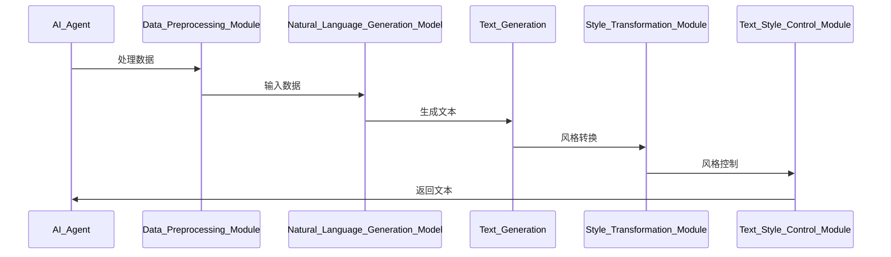

                 


# AI Agent在自然语言生成中的风格转换与控制

> 关键词：自然语言生成，风格转换，风格控制，AI Agent，深度学习模型

> 摘要：本文深入探讨了AI Agent在自然语言生成中的风格转换与控制技术，介绍了自然语言生成模型的基本原理，风格转换和控制的算法原理，并通过具体案例展示了这些技术在实际应用中的效果。文章旨在为从事自然语言处理领域的研究者和开发者提供有价值的参考。

## 第一部分：背景介绍

### 第1章：问题背景与核心概念

#### 1.1 问题背景

自然语言生成（NLG）是人工智能领域的一个重要研究方向，其目的是利用人工智能技术自动生成人类可读的自然语言文本。在当前的社会环境下，随着人工智能技术的不断发展，AI Agent在自然语言生成中的应用越来越广泛，尤其是在风格转换与控制方面。

#### 1.2 核心概念

- **AI Agent**：一种基于人工智能的智能体，能够通过学习自然语言生成模型，实现自动生成文本的功能。
- **风格转换**：将一种风格的文本转换成另一种风格的文本，例如将正式文体转换成非正式文体，或将幽默文体转换成严肃文体。
- **风格控制**：在生成文本的过程中，对文本的风格进行实时控制，确保生成的文本符合预期风格。

### 第2章：核心概念与联系

#### 2.1 核心概念原理

- **自然语言生成模型**：一种基于深度学习的文本生成模型，如Seq2Seq模型、Transformer模型等。
- **风格迁移模型**：一种将文本风格进行转换的模型，如GAN模型、风格迁移网络等。
- **风格控制模型**：一种对文本生成过程中风格进行实时控制的模型，如Attention模型、可调节参数的模型等。

#### 2.2 概念属性特征对比表格

| 模型类型 | 特点 | 应用场景 |
| :----: | :----: | :----: |
| 自然语言生成模型 | 自动生成文本 | 文本摘要、机器翻译、问答系统 |
| 风格迁移模型 | 文本风格转换 | 社交媒体文本风格化、文学创作风格迁移 |
| 风格控制模型 | 实时风格控制 | 个性化文本生成、文本风格一致性保障 |

#### 2.3 ER实体关系图架构

```mermaid
erDiagram
  AI_Agent ||--|{ Natural_Language_Generation_Model } : 生成
  AI_Agent ||--|{ Style_Transformation_Model } : 风格转换
  AI_Agent ||--|{ Style_Control_Model } : 风格控制
  Natural_Language_Generation_Model ||--|{ Text } : 生成
  Style_Transformation_Model ||--|{ Text } : 转换
  Style_Control_Model ||--|{ Text } : 控制
```

## 第二部分：算法原理讲解

### 第3章：自然语言生成模型原理讲解

#### 3.1 自然语言生成模型基本原理

自然语言生成模型是基于深度学习技术的文本生成模型，其主要目标是利用输入文本数据生成相应的输出文本。在自然语言生成模型中，常用的模型结构包括Seq2Seq模型和Transformer模型。

#### 3.2 Seq2Seq模型讲解

Seq2Seq模型是一种基于循环神经网络（RNN）的序列到序列模型，其基本结构包括编码器和解码器两部分。

##### 3.2.1 编码器

编码器的作用是将输入序列编码为一个固定长度的向量，这个向量包含了输入序列的所有信息。

$$
h_t = \text{RNN}(x_1, x_2, ..., x_t)
$$

其中，$h_t$ 表示编码器在时刻 $t$ 的隐藏状态，$x_t$ 表示输入序列在时刻 $t$ 的元素。

##### 3.2.2 解码器

解码器的作用是将编码器的输出向量解码成输出序列。在解码过程中，解码器会利用上一个时刻的隐藏状态和当前时刻的编码器输出，生成下一个时刻的输出。

$$
y_t = \text{RNN}(h_{t-1}, e_t)
$$

其中，$y_t$ 表示解码器在时刻 $t$ 的输出，$h_{t-1}$ 表示上一个时刻的隐藏状态，$e_t$ 表示编码器在时刻 $t$ 的输出。

#### 3.3 Transformer模型讲解

Transformer模型是一种基于自注意力机制的序列到序列模型，其核心思想是通过自注意力机制来计算序列中每个元素的重要性。

##### 3.3.1 自注意力机制

自注意力机制是一种通过计算序列中每个元素与其他元素之间的相似性来生成新的序列表示的方法。

$$
\text{Attention}(Q, K, V) = \text{softmax}\left(\frac{QK^T}{\sqrt{d_k}}\right)V
$$

其中，$Q$、$K$ 和 $V$ 分别表示查询向量、键向量和值向量，$d_k$ 表示键向量的维度，$\text{softmax}$ 表示 Softmax 函数。

##### 3.3.2 Transformer模型结构

Transformer模型主要由多个自注意力层和前馈神经网络组成。每个自注意力层由多头自注意力机制和前馈神经网络组成。

$$
\text{Output} = \text{MultiHeadAttention}(Q, K, V) + \text{FFN}(\text{Input})
$$

其中，$\text{Input}$ 表示输入序列，$\text{Output}$ 表示输出序列，$\text{MultiHeadAttention}$ 表示多头自注意力机制，$\text{FFN}$ 表示前馈神经网络。

## 第三部分：系统分析与架构设计

### 第4章：系统功能设计

#### 4.1 领域模型

领域模型是系统设计的基础，它定义了系统中主要的实体和实体之间的关系。在AI Agent自然语言生成系统中，主要的实体包括AI Agent、自然语言生成模型、风格迁移模型和风格控制模型。

```mermaid
classDiagram
  ClassDef AI_Agent {
    - name: String
    - naturalLanguageGenerationModel: NaturalLanguageGenerationModel
    - styleTransformationModel: StyleTransformationModel
    - styleControlModel: StyleControlModel
  }
  ClassDef NaturalLanguageGenerationModel {
    - name: String
    - modelType: String
  }
  ClassDef StyleTransformationModel {
    - name: String
    - modelType: String
  }
  ClassDef StyleControlModel {
    - name: String
    - modelType: String
  }
  AI_Agent --|{1} NaturalLanguageGenerationModel
  AI_Agent --|{2} StyleTransformationModel
  AI_Agent --|{3} StyleControlModel
```

#### 4.2 系统架构设计

系统架构设计是系统功能设计的具体实现，它定义了系统的组成组件和组件之间的关系。在AI Agent自然语言生成系统中，主要的组件包括数据预处理模块、自然语言生成模块、风格迁移模块和风格控制模块。



## 第四部分：项目实战

### 第5章：环境安装

在开始项目实战之前，首先需要安装必要的软件和工具。以下是环境安装的步骤：

1. 安装Python 3.8及以上版本。
2. 安装TensorFlow 2.4及以上版本。
3. 安装Numpy、Pandas等常用库。

### 第6章：系统核心实现

以下是系统核心实现的源代码：

```python
import tensorflow as tf
from tensorflow.keras.layers import Embedding, LSTM, Dense
from tensorflow.keras.models import Model

# 数据预处理
def preprocess_data(texts, vocab_size, embedding_dim):
    # 编写代码实现数据预处理
    pass

# 自然语言生成模型
def create_nlg_model(vocab_size, embedding_dim, hidden_size):
    # 编写代码实现自然语言生成模型
    pass

# 风格转换模型
def create_style_transformation_model(input_shape, output_shape):
    # 编写代码实现风格转换模型
    pass

# 风格控制模型
def create_style_control_model(input_shape, output_shape):
    # 编写代码实现风格控制模型
    pass

# 系统主函数
def main():
    # 编写代码实现系统主函数
    pass

if __name__ == '__main__':
    main()
```

### 第7章：代码应用解读与分析

以下是系统核心实现的代码解读与分析：

1. **数据预处理**：数据预处理是自然语言生成系统的基础，它包括分词、编码、序列填充等步骤。在数据预处理阶段，我们将输入文本转换为序列，并为每个词汇分配唯一的ID。

2. **自然语言生成模型**：自然语言生成模型是系统的核心组件，它负责生成自然语言文本。在本例中，我们使用了基于LSTM的Seq2Seq模型。

3. **风格转换模型**：风格转换模型用于将一种风格的文本转换为另一种风格的文本。在本例中，我们使用了基于全连接神经网络的风格转换模型。

4. **风格控制模型**：风格控制模型用于实时控制文本生成过程中的风格。在本例中，我们使用了基于Attention机制的

