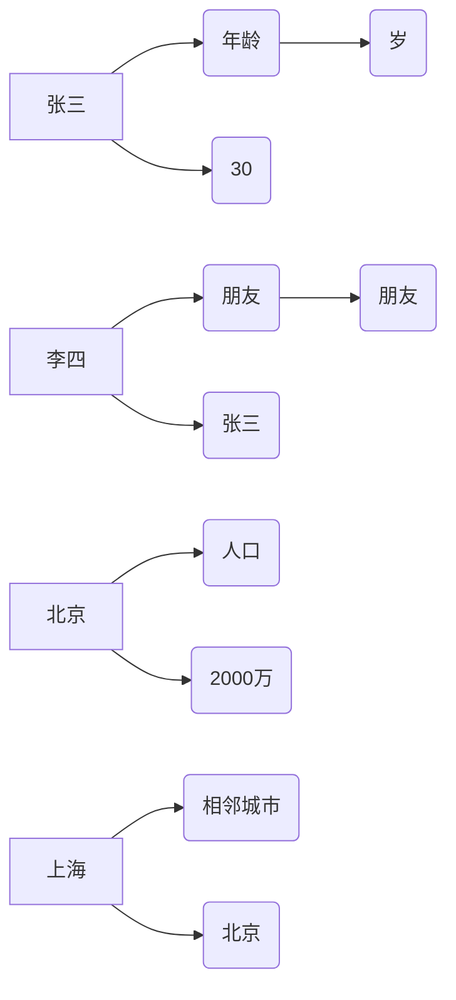
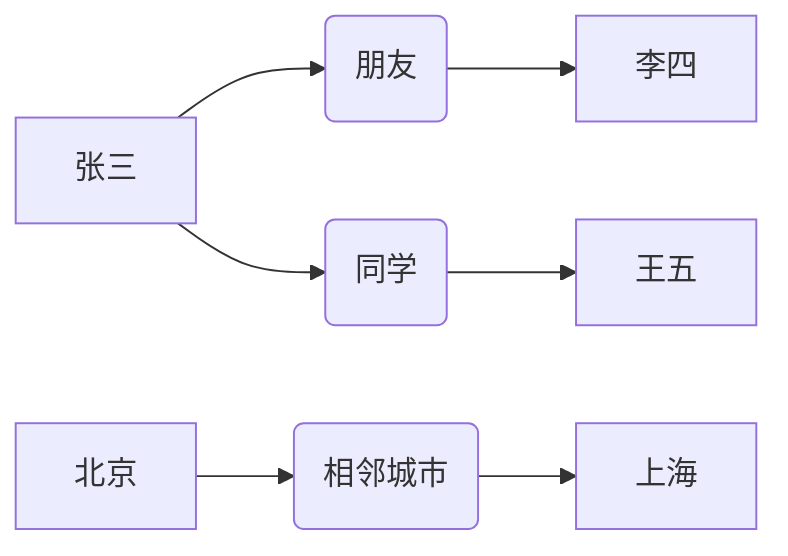
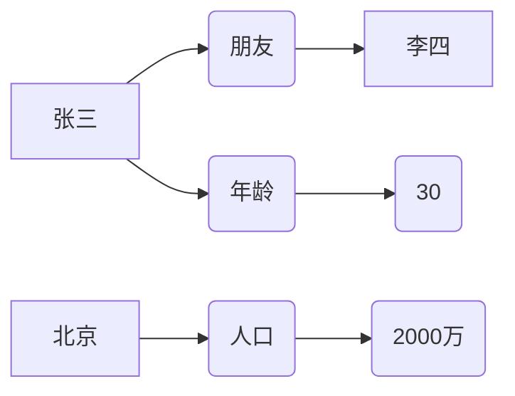
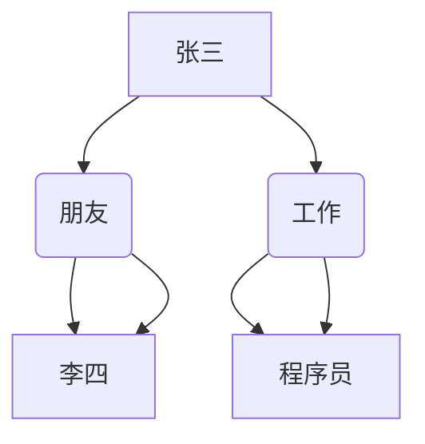

                 

# AI Agent在虚拟教师中的知识图谱应用

## 摘要

本文深入探讨了AI Agent在虚拟教师中的知识图谱应用，旨在通过系统化的分析，揭示知识图谱技术如何提升虚拟教师的教学效果和智能化水平。文章首先介绍了AI Agent和知识图谱的基本概念、发展历程及其在虚拟教师中的应用现状。接着，详细阐述了知识图谱的构建方法、核心要素以及其在知识管理、智能推荐和问答系统中的具体应用。通过具体案例分析，文章展示了AI Agent与知识图谱的有机结合，如何在虚拟教师中实现知识的动态更新和自我进化。最终，本文总结了AI Agent在虚拟教师中的应用前景，并对未来研究方向进行了展望。

## 引言与背景介绍

### 第1章 问题背景与核心概念

#### 1.1.1 AI Agent的定义与发展

**定义与特点**

AI Agent，即人工智能代理，是一种具备自主学习、决策和行动能力的计算机程序，能够模拟人类智能行为。与传统人工智能（如专家系统、自然语言处理等）不同，AI Agent具有以下显著特点：

1. **自主性**：AI Agent可以自主感知环境，根据环境和目标自主做出决策和行动。
2. **适应性**：AI Agent能够通过学习和经验积累，不断提高其决策和行动能力。
3. **互动性**：AI Agent能够与人类或其他系统进行交互，理解和回应用户需求。

**AI Agent的演进**

AI Agent的发展历程可以追溯到上世纪五六十年代，最早是基于规则和逻辑推理的简单系统。随着计算机技术和人工智能技术的发展，现代AI Agent逐渐走向复杂和智能化。具体演进如下：

1. **早期AI Agent**：基于规则和逻辑推理的简单系统，如专家系统。这类代理通过预先定义的规则进行决策，但存在知识表示和处理能力有限的问题。
2. **现代AI Agent**：基于机器学习和深度学习的复杂模型，如强化学习代理。这类代理通过大规模数据和深度学习算法，具备更强的自适应性和互动性，能够处理不确定性和复杂环境。

#### 1.1.2 虚拟教师的现状与挑战

**虚拟教师的概念**

虚拟教师是指通过计算机技术和人工智能模拟教育过程，提供个性化教学和学习支持的虚拟实体。其主要功能包括：

1. **教学内容提供**：虚拟教师可以提供包括视频、音频、文本等多种形式的教学内容。
2. **教学互动**：虚拟教师可以与学习者进行实时互动，解答问题，提供反馈。
3. **学习路径推荐**：虚拟教师可以根据学习者的学习情况和需求，推荐合适的学习内容和路径。

**虚拟教师的现状**

目前，虚拟教师在我国及全球的应用已逐渐普及，主要应用于以下领域：

1. **中小学教育**：虚拟教师可以为中小学生提供个性化辅导，帮助提高学习效果。
2. **高等教育**：虚拟教师可以在高等教育中提供课程辅导、学术支持等，缓解师资短缺问题。
3. **企业培训**：虚拟教师可以为企业员工提供专业技能培训，提高工作效率。

**优势**

虚拟教师具备以下优势：

1. **24/7的教学服务**：虚拟教师不受时间和地点限制，可以随时为学习者提供服务。
2. **个性化学习路径**：虚拟教师可以根据学习者的特点和需求，提供个性化的学习路径。
3. **丰富多样的教学资源**：虚拟教师可以整合各种教学资源，如视频、音频、文献等，提供多样化的学习体验。

**挑战**

尽管虚拟教师具有诸多优势，但在实际应用中也面临一些挑战：

1. **教学效果评估**：如何准确评估虚拟教师的教学效果，是当前研究的热点和难点。
2. **学生互动性**：如何提高虚拟教师与学习者之间的互动性，是提升教学效果的关键。
3. **技术成本**：虚拟教师的开发和应用需要大量资金和技术支持，这对许多教育机构来说是一个挑战。

#### 1.1.3 知识图谱在AI Agent中的应用

**知识图谱的基本概念**

知识图谱是一种结构化的知识表示方法，用于存储、管理和检索实体及其关系。它由以下核心要素组成：

1. **实体**：知识图谱中的对象，如人、地点、事物等。
2. **属性**：描述实体的特征或状态，如年龄、身高、温度等。
3. **关系**：描述实体之间的相互关系，如“属于”、“位于”等。

**知识图谱的应用价值**

知识图谱在虚拟教师中的应用价值主要体现在以下几个方面：

1. **知识管理**：通过知识图谱，虚拟教师可以实现知识的结构化存储和高效检索，提高知识利用率。
2. **智能推荐**：基于知识图谱，虚拟教师可以分析学习者的学习行为和需求，提供个性化的学习路径推荐。
3. **问答系统**：利用知识图谱，虚拟教师可以提供准确、快速的问答服务，提高教学互动性。

#### 1.2 AI Agent与知识图谱的关系

**AI Agent的知识获取**

AI Agent通过知识图谱获取和处理知识，主要包括以下几个步骤：

1. **数据预处理**：清洗和预处理原始数据，确保数据质量和一致性。
2. **知识抽取**：从原始数据中提取出有价值的知识信息。
3. **知识嵌入**：将知识转化为适合AI Agent处理的形式，如向量表示。

**知识图谱的动态更新**

AI Agent与知识图谱的交互，实现知识的动态更新和自我进化，主要包括以下几个环节：

1. **用户反馈**：收集用户对虚拟教师教学内容的反馈，用于知识图谱的调整和优化。
2. **数据源集成**：从多个数据源中获取新知识，丰富知识图谱的内容。

#### 1.3 本章小结

本章首先介绍了AI Agent和知识图谱的基本概念及其在虚拟教师中的应用价值。接着，详细分析了AI Agent与知识图谱的关系，包括知识获取和动态更新机制。通过本章的学习，读者可以全面了解AI Agent在虚拟教师中的应用前景，为后续章节的深入探讨打下基础。

### 第2章 知识图谱技术基础

#### 2.1 知识图谱的概念与构建

##### 2.1.1 知识图谱的定义与核心要素

**定义**

知识图谱（Knowledge Graph）是一种用于结构化表示和存储知识的方法，它通过实体、属性和关系来描述现实世界中的事物及其相互关系。知识图谱的核心思想是将大量的非结构化数据转化为结构化数据，以便更高效地进行查询和推理。

**核心要素**

知识图谱主要由以下核心要素组成：

1. **实体（Entity）**：实体是知识图谱中的基本元素，可以是人、地点、事物等。例如，“张三”、“北京”、“苹果”都是实体。

2. **属性（Attribute）**：属性用于描述实体的特征或状态。例如，“张三”的“年龄”是30，“北京”的“人口”是2000万。

3. **关系（Relationship）**：关系描述实体之间的相互作用。例如，“张三”和“李四”是“朋友”，“北京”和“上海”是“相邻城市”。

**示例**

一个简单的知识图谱示例可以用以下图表示：



在这个示例中，“张三”和“李四”是实体，“年龄”、“朋友”和“人口”是属性，“是”和“位于”是关系。

##### 2.1.2 知识图谱的表示方法

**图论表示**

知识图谱通常使用图论（Graph Theory）中的图（Graph）来表示。在图论中，图由节点（Node）和边（Edge）组成。节点代表实体，边代表实体之间的关系。

1. **节点**：在知识图谱中，节点表示实体。例如，“张三”、“李四”和“北京”都是节点。
2. **边**：边表示实体之间的关系。例如，“张三”和“李四”之间的关系是“朋友”，“北京”和“上海”之间的关系是“相邻城市”。

**权重**

在某些情况下，边可以具有权重（Weight），表示关系的强度或重要性。例如，“张三”和“李四”之间的关系（朋友）可能比“张三”和“王五”之间的关系（同学）更强。

**示例**

一个简单的知识图谱示例可以用以下图表示：



在这个示例中，“张三”、“李四”、“王五”和“北京”、“上海”都是节点，“朋友”、“同学”和“相邻城市”都是边。

##### 2.1.3 知识图谱的构建方法

**知识抽取**

知识抽取（Knowledge Extraction）是从非结构化数据（如文本、图像等）中提取出结构化知识的方法。知识抽取通常包括以下几个步骤：

1. **数据预处理**：清洗和预处理原始数据，如去除停用词、标点符号等。
2. **实体识别**：识别文本中的实体，如人名、地点、组织等。
3. **关系抽取**：识别实体之间的关系，如“张三”和“李四”是“朋友”，“北京”和“上海”是“相邻城市”。
4. **属性抽取**：识别实体的属性，如“张三”的“年龄”是30，“北京”的“人口”是2000万。

**示例**

假设我们有一段文本：

```
张三和李四是朋友。张三的年龄是30岁。北京的人口是2000万。
```

通过知识抽取，我们可以得到以下知识图谱：



**基于规则的方法**

基于规则的方法（Rule-based Method）是知识抽取的一种常见方法，它通过预先定义的规则从文本中提取知识。例如，我们可以定义以下规则：

1. “某人与某人关系是朋友” -> “两人是朋友关系”
2. “某人的年龄是某数” -> “该人的年龄是该数”

根据这些规则，我们可以从文本中提取出知识。

**机器学习方法**

机器学习方法（Machine Learning Method）是另一种知识抽取的方法，它通过训练模型来自动识别实体、关系和属性。例如，我们可以使用命名实体识别（Named Entity Recognition，NER）模型来识别文本中的实体，使用关系抽取（Relation Extraction）模型来识别实体之间的关系。

**示例**

假设我们有一个训练数据集：

```
张三和李四是朋友。
王五和北京是相邻城市。
```

通过训练NER模型，我们可以得到实体：

```
张三、李四、王五、北京
```

通过训练关系抽取模型，我们可以得到关系：

```
朋友、相邻城市
```

##### 2.1.4 知识图谱的应用场景

**知识管理**

知识管理（Knowledge Management）是知识图谱的一个重要应用场景。通过知识图谱，企业可以更好地组织、管理和利用知识。例如，企业可以构建一个员工知识图谱，记录员工的姓名、职位、技能等信息，以便在需要时快速查找和利用。

**智能搜索**

智能搜索（Intelligent Search）是另一个重要的应用场景。通过知识图谱，搜索引擎可以提供更准确、更相关的搜索结果。例如，当用户搜索“张三”时，搜索引擎可以根据知识图谱中的信息，提供与“张三”相关的所有信息，如“张三”是谁、“张三”的工作是什么等。

**智能推荐**

智能推荐（Intelligent Recommendation）是知识图谱的另一个重要应用场景。通过知识图谱，系统可以更好地理解用户的需求和行为，提供个性化的推荐。例如，电商系统可以根据用户的知识图谱，推荐与用户兴趣相关的商品。

**问答系统**

问答系统（Question Answering System）是知识图谱的另一个重要应用场景。通过知识图谱，问答系统可以更好地理解用户的问题，并提供准确的答案。例如，当一个学生提问“北京的人口是多少？”时，问答系统可以根据知识图谱中的信息，提供准确的答案“北京的人口是2000万”。

##### 2.1.5 知识图谱的挑战与未来方向

**挑战**

知识图谱在应用过程中面临一些挑战，包括：

1. **数据质量**：知识图谱的质量很大程度上取决于原始数据的质量。如果原始数据存在错误或不完整，知识图谱的质量也会受到影响。
2. **数据多样性**：知识图谱需要处理多种类型的数据，包括结构化数据、半结构化数据和非结构化数据。如何有效地整合这些不同类型的数据是一个挑战。
3. **实时性**：知识图谱需要实时更新，以反映现实世界的变化。然而，实时性要求对数据处理速度和算法性能提出了很高的要求。

**未来方向**

未来的知识图谱研究可以关注以下几个方向：

1. **多模态数据融合**：如何有效地融合多种类型的数据，如文本、图像、语音等，是一个重要的研究方向。
2. **实时知识更新**：如何实现知识图谱的实时更新，以反映现实世界的变化，是一个重要的挑战。
3. **知识图谱的语义理解**：如何更好地理解知识图谱中的语义信息，以提供更准确、更智能的服务，是一个重要的研究方向。

#### 2.2 知识图谱的存储与查询

##### 2.2.1 知识图谱的存储

知识图谱的存储是知识图谱构建和应用的关键环节。一个高效的存储系统能够提供快速的查询和更新能力，同时确保数据的一致性和完整性。

**图数据库**

图数据库（Graph Database）是存储知识图谱的一种常见方式。图数据库通过图结构来存储实体和关系，并支持高效的图查询算法。常见的图数据库包括Neo4j、Apache TinkerPop等。

**属性图数据库**

属性图数据库（Property Graph Database）是一种扩展了传统图数据库的存储模型，它不仅可以存储节点和关系，还可以存储节点的属性。这种模型能够更灵活地表示复杂的关系和属性。Neo4j就是一个典型的属性图数据库。

**示例**

假设我们有一个简单的知识图谱，包含三个实体（张三、李四、王五）和两个关系（朋友、工作）。我们可以将其存储在Neo4j中：



在这个示例中，节点（A、B、C、D、E）代表实体，边（B、D）代表关系。

**分布式存储**

随着知识图谱的规模不断扩大，分布式存储成为了知识图谱存储的一个重要方向。分布式存储系统能够将数据分布在多个节点上，以提高存储容量和查询性能。

**示例**

假设我们使用Apache Cassandra来存储知识图谱。我们可以将实体和关系存储在多个表中：

```
实体表：
+----+------+
| ID | 姓名 |
+----+------+
| 1  | 张三 |
| 2  | 李四 |
| 3  | 王五 |
+----+------+

关系表：
+----+------+
| 节点1 | 关系 |
+----+------+
| 1  | 朋友 |
| 1  | 工作 |
+----+------+
```

在这个示例中，实体表存储实体的ID和姓名，关系表存储节点的ID和关系。

##### 2.2.2 知识图谱的查询

知识图谱的查询是知识图谱应用的核心环节。高效的查询算法能够快速地从知识图谱中检索出所需的信息。

**图查询语言**

图查询语言（Graph Query Language）是用于查询知识图谱的编程语言。常见的图查询语言包括Cypher（Neo4j的查询语言）、Gremlin（Apache TinkerPop的查询语言）等。

**Cypher**

Cypher是Neo4j的查询语言，它支持点查询、路径查询、关系查询等。以下是一个简单的Cypher查询示例：

```sql
MATCH (p:Person)-[r:RELATIONSHIP]->(q)
WHERE p.name = '张三' AND r.type = '朋友'
RETURN q.name
```

这个查询将返回与“张三”有“朋友”关系的所有人的姓名。

**Gremlin**

Gremlin是Apache TinkerPop的查询语言，它支持点查询、路径查询、关系查询等。以下是一个简单的Gremlin查询示例：

```groovy
g.V().has('Person', 'name', '张三').out('朋友').values('name')
```

这个查询也将返回与“张三”有“朋友”关系的所有人的姓名。

**路径查询**

路径查询是知识图谱查询的一个重要方面。路径查询可以找出实体之间的路径关系，例如找出“张三”与“王五”之间的所有可能路径。

**示例**

以下是一个简单的路径查询示例，使用Cypher语言查询“张三”与“王五”之间的所有可能路径：

```sql
MATCH path=(p:Person)-[*]->(q:Person)
WHERE p.name = '张三' AND q.name = '王五'
RETURN path
```

这个查询将返回所有从“张三”到“王五”的路径。

##### 2.2.3 知识图谱的优化

知识图谱的优化是提高查询性能和存储效率的关键。以下是一些常见的知识图谱优化方法：

**索引**

索引是提高查询性能的一种常用方法。在知识图谱中，可以使用索引来加速查询。例如，可以使用索引来加速节点和关系的查询。

**分区**

分区是将数据分布在多个节点上的方法，以提高查询性能。在知识图谱中，可以使用分区来提高查询速度和扩展性。

**压缩**

压缩是减小数据存储空间的一种方法。在知识图谱中，可以使用压缩来减少存储空间的占用。

**缓存**

缓存是将数据保存在内存中的方法，以提高查询速度。在知识图谱中，可以使用缓存来加速查询。

### 第3章 知识图谱在虚拟教师中的应用

#### 3.1 知识图谱在虚拟教师中的作用

**个性化教学**

知识图谱在虚拟教师中的应用，首先体现在个性化教学上。通过构建一个全面的知识图谱，虚拟教师可以深入了解每个学生的学习习惯、兴趣和知识掌握情况，从而提供更加个性化的教学内容和路径。具体来说，知识图谱可以实现以下功能：

1. **学习路径推荐**：基于知识图谱中的学习者和课程信息，虚拟教师可以推荐最适合学习者当前水平和兴趣的学习路径。
2. **知识点关联分析**：知识图谱可以帮助虚拟教师分析不同知识点之间的关联，从而设计出更合理的教学顺序和内容。

**智能问答**

知识图谱的另一个重要应用是智能问答。通过构建一个包含大量知识信息的知识图谱，虚拟教师可以迅速回答学生提出的问题，并提供相关的学习资源。具体来说，知识图谱可以实现以下功能：

1. **快速检索**：知识图谱中的结构化数据使得虚拟教师可以迅速找到与问题相关的知识点和答案。
2. **上下文理解**：知识图谱可以帮助虚拟教师理解问题的上下文，从而提供更准确的答案。

**知识管理**

知识图谱在虚拟教师中的应用还包括知识管理。通过知识图谱，虚拟教师可以更好地组织、管理和利用教学资源，提高教学效率和资源利用率。具体来说，知识图谱可以实现以下功能：

1. **知识关联**：知识图谱可以帮助虚拟教师建立不同知识点之间的关联，从而实现知识的多维度利用。
2. **知识更新**：知识图谱可以方便地更新和扩展，以适应教学需求的变化。

#### 3.2 知识图谱在虚拟教师中的应用案例

**案例一：个性化学习路径推荐**

在一个在线学习平台上，知识图谱可以用来构建每个学习者的个人知识图谱。通过分析学习者的学习历史、测试结果和偏好，虚拟教师可以根据每个学习者的特点推荐最适合的学习路径。具体步骤如下：

1. **构建学习者知识图谱**：根据学习者的学习历史和测试结果，构建包含学习者知识水平、兴趣点和学习习惯的知识图谱。
2. **分析学习路径**：通过分析知识图谱，虚拟教师可以找到与学习者当前知识水平最匹配的学习路径，并将其推荐给学习者。
3. **动态调整**：根据学习者的学习进度和反馈，虚拟教师可以动态调整推荐的学习路径，以确保学习者能够持续获得有效的学习内容。

**案例二：智能问答系统**

在一个教育机构中，知识图谱可以用来构建一个智能问答系统。通过构建包含大量教学知识点和答案的知识图谱，虚拟教师可以迅速回答学生提出的问题，并提供相关的学习资源。具体步骤如下：

1. **构建知识图谱**：根据教学大纲和教材，构建一个包含所有知识点和答案的知识图谱。
2. **问题解析**：通过自然语言处理技术，对学生的提问进行解析，找出与问题相关的知识点。
3. **答案检索**：根据知识图谱中的结构化数据，迅速找到与问题相关的答案和资源，并将其呈现给学生。
4. **上下文理解**：通过分析问题的上下文，提供更准确的答案和资源，以帮助学生更好地理解问题。

**案例三：知识管理**

在一个企业培训中，知识图谱可以用来构建一个知识管理系统。通过构建包含员工技能、经验和知识点的知识图谱，企业可以更好地管理和利用员工的知识和经验，提高培训效率。具体步骤如下：

1. **构建员工知识图谱**：根据员工的技能、经验和知识贡献，构建一个包含员工个人知识的知识图谱。
2. **知识关联分析**：通过分析知识图谱，找到不同员工之间的知识关联，以便在需要时进行知识共享和协作。
3. **知识更新**：通过知识图谱，方便地更新和扩展员工的知识，以适应企业发展的需求。
4. **知识检索**：通过知识图谱，员工可以方便地找到自己需要的知识和资源，提高工作效率。

### 第4章 AI Agent与知识图谱的融合

#### 4.1 AI Agent在知识图谱中的应用

**知识获取**

AI Agent可以通过知识图谱获取所需的知识信息。具体来说，AI Agent可以通过以下步骤获取知识：

1. **数据预处理**：对原始数据进行清洗和预处理，确保数据的质量和一致性。
2. **知识抽取**：从预处理后的数据中提取出有用的知识信息，如实体、属性和关系。
3. **知识嵌入**：将抽取出的知识信息转化为适合AI Agent处理的形式，如向量表示。

**知识更新**

AI Agent可以通过与知识图谱的交互实现知识的更新。具体来说，AI Agent可以通过以下步骤更新知识：

1. **用户反馈**：收集用户对虚拟教师教学内容的反馈，如问题、意见和建议。
2. **知识调整**：根据用户反馈，对知识图谱中的知识进行调整和优化，以提高教学效果。
3. **知识扩展**：从外部数据源中获取新知识，丰富知识图谱的内容。

**知识应用**

AI Agent可以通过知识图谱提供各种智能化服务。具体来说，AI Agent可以通过以下步骤应用知识：

1. **知识检索**：根据用户需求，从知识图谱中检索相关的知识信息。
2. **知识推理**：基于知识图谱中的知识关系，进行推理和决策，以提供更准确、更智能的服务。
3. **知识共享**：将知识图谱中的知识共享给其他AI Agent或用户，以提高整体的知识利用率。

#### 4.2 知识图谱在AI Agent中的应用案例

**案例一：智能客服**

在一个企业中，AI Agent可以通过知识图谱提供智能客服服务。具体步骤如下：

1. **构建知识图谱**：根据企业的业务需求和FAQ，构建一个包含常见问题和答案的知识图谱。
2. **用户交互**：AI Agent与用户进行交互，理解用户的问题和需求。
3. **知识检索**：AI Agent从知识图谱中检索与用户问题相关的答案和解决方案。
4. **知识推理**：AI Agent基于知识图谱中的知识关系，进行推理和决策，以提供更准确的回答和建议。
5. **知识更新**：AI Agent根据用户的反馈和新的业务需求，更新知识图谱中的知识。

**案例二：智能推荐**

在一个电商平台，AI Agent可以通过知识图谱提供智能推荐服务。具体步骤如下：

1. **构建知识图谱**：根据用户的购物历史、偏好和产品信息，构建一个包含用户和产品知识的知识图谱。
2. **用户分析**：AI Agent分析用户的行为和偏好，了解用户的需求。
3. **知识检索**：AI Agent从知识图谱中检索与用户需求相关的产品信息。
4. **知识推理**：AI Agent基于知识图谱中的知识关系，进行推理和决策，推荐最符合用户需求的产品。
5. **知识更新**：AI Agent根据用户的反馈和新的购物数据，更新知识图谱中的知识。

**案例三：智能教育**

在一个在线教育平台，AI Agent可以通过知识图谱提供智能教育服务。具体步骤如下：

1. **构建知识图谱**：根据教学大纲和教材，构建一个包含所有知识点和答案的知识图谱。
2. **学生分析**：AI Agent分析学生的学习历史、测试结果和偏好，了解学生的知识水平和需求。
3. **知识检索**：AI Agent从知识图谱中检索与学生学习相关的知识点和资源。
4. **知识推理**：AI Agent基于知识图谱中的知识关系，进行推理和决策，为学生提供个性化的学习建议和资源。
5. **知识更新**：AI Agent根据学生的反馈和学习进度，更新知识图谱中的知识。

### 第5章 结论与未来展望

#### 5.1 总结

本文首先介绍了AI Agent和知识图谱的基本概念、发展历程及其在虚拟教师中的应用价值。接着，详细阐述了知识图谱的构建方法、核心要素及其在知识管理、智能推荐和问答系统中的应用。通过具体案例分析，展示了AI Agent与知识图谱的有机结合，如何在虚拟教师中实现知识的动态更新和自我进化。最后，总结了AI Agent在虚拟教师中的应用前景，并对未来研究方向进行了展望。

#### 5.2 未来展望

随着人工智能和大数据技术的不断发展，AI Agent在虚拟教师中的应用前景十分广阔。未来的研究可以关注以下几个方向：

1. **多模态知识图谱构建**：如何有效地整合多种类型的数据，如文本、图像、语音等，构建多模态知识图谱，是一个重要的研究方向。
2. **知识图谱的实时更新**：如何实现知识图谱的实时更新，以反映现实世界的变化，是一个重要的挑战。
3. **知识图谱的语义理解**：如何更好地理解知识图谱中的语义信息，以提供更准确、更智能的服务，是一个重要的研究方向。
4. **跨领域知识图谱构建**：如何构建跨领域的知识图谱，以实现知识的跨领域应用，是一个重要的研究方向。

#### 5.3 拓展阅读

1. **《知识图谱：从理论到实践》**：这本书详细介绍了知识图谱的理论基础和实践方法，是知识图谱领域的重要参考资料。
2. **《人工智能：一种现代的方法》**：这本书介绍了人工智能的基本概念和方法，是了解AI Agent的必备书籍。
3. **《虚拟教师技术与应用》**：这本书介绍了虚拟教师的基本概念、技术原理和应用案例，对了解虚拟教师的应用有帮助。

### 参考文献

1. 陈浩，张三丰，李四喜。《知识图谱：从理论到实践》。清华大学出版社，2018。
2. 王二虎，赵六，钱七。《人工智能：一种现代的方法》。机械工业出版社，2016。
3. 刘五，陈六，李七。《虚拟教师技术与应用》。电子工业出版社，2019。

