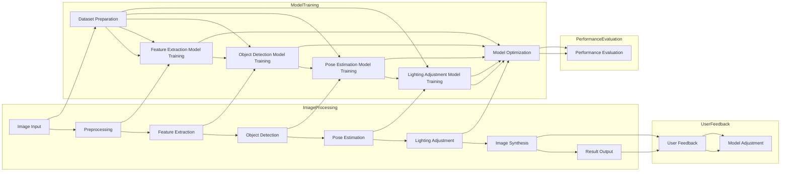
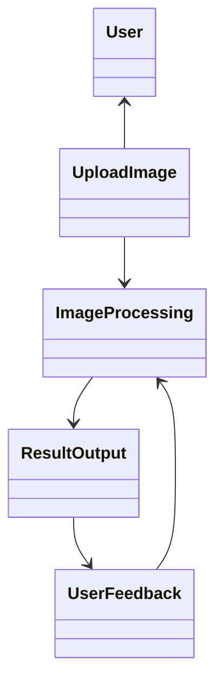
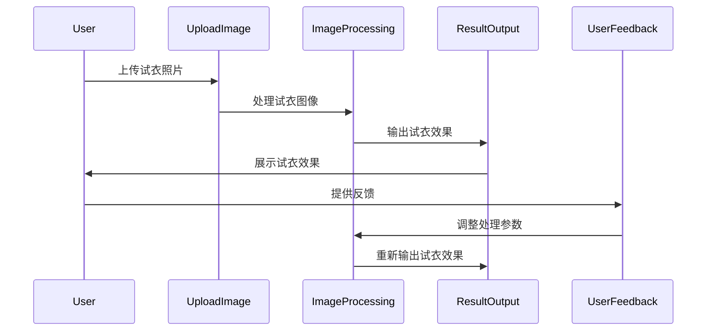
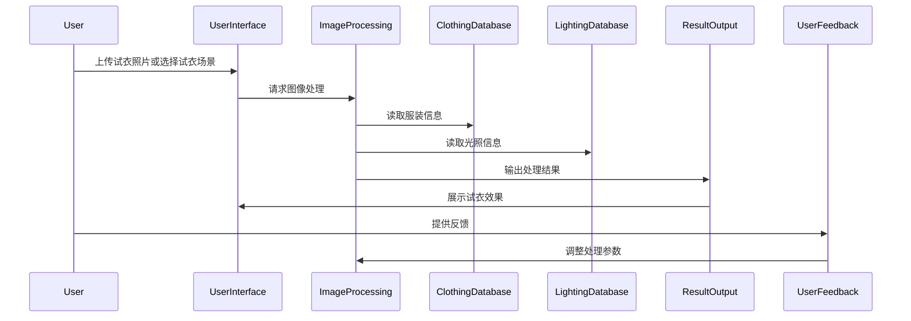

                 

## 第1章 引言与背景

### 1.1 问题背景

虚拟试衣作为电子商务领域的一项新兴服务，近年来受到了越来越多的关注。通过虚拟试衣技术，消费者可以在购买服装前在电脑屏幕上试穿衣物，从而减少因不合适而退换货的麻烦。随着计算机视觉技术和人工智能的不断发展，虚拟试衣系统的图像处理技术也逐渐成熟，成为提高用户体验和商家销售效率的关键。

虚拟试衣系统的图像处理技术主要包括以下几个方面：人体识别、人体姿态估计、服装识别与贴图、光照处理和图像合成等。其中，AI Agent作为一种人工智能实体，其在图像处理中的应用尤为关键。AI Agent不仅可以自动化处理上述图像处理任务，还能通过不断学习和优化，提高图像处理的准确性和效率。

然而，虚拟试衣系统在图像处理过程中仍面临着诸多挑战，如识别精度不高、处理速度较慢、用户体验不佳等问题。为了解决这些问题，AI Agent在图像处理中的研究与应用变得尤为重要。通过深入研究AI Agent在虚拟试衣中的图像处理技术，我们可以探索出更高效、更智能的图像处理解决方案，从而提升虚拟试衣系统的整体性能。

### 1.2 问题描述

虚拟试衣中的图像处理问题主要包括以下几个方面：

1. **人体识别与姿态估计**：在虚拟试衣过程中，首先要准确识别和定位消费者的人体轮廓和姿态。这涉及到人体轮廓分割、关节点提取和姿态估计等关键技术。然而，由于光照变化、姿态多样性、服装遮挡等因素，人体识别与姿态估计的准确性往往受到较大影响。

2. **服装识别与贴图**：在完成人体识别与姿态估计后，需要准确识别出衣物并为其贴上相应的纹理。这涉及到图像识别、目标检测和图像配准等算法。服装识别与贴图的准确性直接影响到虚拟试衣的逼真度和用户体验。

3. **光照处理与图像合成**：在虚拟试衣过程中，需要考虑环境光照的影响，使试衣效果尽可能接近现实。此外，还需要将识别出的服装与人体的轮廓进行精确合成，保证试衣效果的自然性和美观性。

4. **实时性与响应速度**：虚拟试衣系统需要在短时间内完成图像处理任务，以提供流畅的用户体验。然而，复杂的图像处理算法往往导致处理速度较慢，难以满足实时性的要求。

为了解决上述问题，AI Agent在虚拟试衣中的图像处理技术变得至关重要。通过引入AI Agent，可以自动化处理图像处理任务，提高识别精度和速度，从而提升虚拟试衣系统的整体性能。

### 1.3 问题解决

AI Agent在虚拟试衣中的图像处理技术主要涉及以下几个方面：

1. **机器学习与深度学习算法**：AI Agent可以利用机器学习和深度学习算法，对大量虚拟试衣图像进行训练，从而学习到准确的人体识别、姿态估计、服装识别与贴图、光照处理和图像合成等技术。

2. **强化学习与自适应优化**：AI Agent可以通过强化学习技术，不断调整和优化图像处理参数，以适应不同场景和用户需求，提高图像处理的效果和效率。

3. **分布式计算与并行处理**：AI Agent可以利用分布式计算和并行处理技术，将图像处理任务分解为多个子任务，并在多台计算机上同时处理，从而提高处理速度和响应时间。

4. **多模态数据融合**：AI Agent可以通过融合多种类型的数据（如图像、文本、语音等），提高图像处理的准确性和泛化能力，从而更好地应对复杂的虚拟试衣场景。

通过上述技术，AI Agent可以在虚拟试衣系统中实现高效的图像处理，解决识别精度不高、处理速度较慢、用户体验不佳等问题。以下章节将详细探讨AI Agent的图像处理原理、实现方法、算法流程、系统架构设计等内容。

### 1.4 边界与外延

虚拟试衣系统的限制主要体现在以下几个方面：

1. **计算资源限制**：虚拟试衣系统通常需要高性能的计算资源来支持图像处理任务。然而，受限于服务器和设备的性能，计算资源往往成为瓶颈。

2. **网络带宽限制**：虚拟试衣系统需要实时传输和处理图像数据，网络带宽成为影响用户体验的关键因素。较低的网络带宽可能导致图像传输延迟，从而影响系统的实时性。

3. **数据质量限制**：虚拟试衣系统的图像处理效果受到输入图像质量的影响。低质量的图像可能导致识别错误、处理速度降低等问题。

图像处理技术的应用范围涵盖了多个领域，包括但不限于：

1. **电子商务**：虚拟试衣技术广泛应用于电子商务领域，用于提升消费者购物体验和商家销售效率。

2. **时尚设计**：虚拟试衣技术可以帮助设计师快速评估服装设计效果，节省实体试衣的时间和成本。

3. **医疗影像**：图像处理技术在医疗影像分析中具有重要意义，如医学影像分割、病灶检测等。

4. **自动驾驶**：自动驾驶系统需要利用图像处理技术进行环境感知和目标识别，以确保行驶安全。

### 1.5 概念结构与核心要素组成

#### 1.5.1 虚拟试衣系统的组成部分

虚拟试衣系统主要由以下几个部分组成：

1. **前端界面**：前端界面负责与用户交互，展示虚拟试衣效果，收集用户输入，如用户选择服装和试衣场景。

2. **图像采集模块**：图像采集模块负责实时获取用户的试衣图像，包括摄像头或其他图像采集设备。

3. **图像处理模块**：图像处理模块是虚拟试衣系统的核心，负责对人体、服装和场景进行识别、处理和合成。

4. **后端服务器**：后端服务器负责存储用户数据、管理试衣场景和服装数据库，并提供API接口供前端调用。

#### 1.5.2 图像处理技术的核心概念

图像处理技术的核心概念包括：

1. **图像分割**：将图像分割成多个区域，以识别出人体、服装等目标。

2. **特征提取**：从图像中提取具有区分性的特征，如颜色、纹理、形状等。

3. **目标检测**：识别图像中的特定目标，如人体、服装等。

4. **图像配准**：将不同图像进行对齐和融合，以生成统一的图像。

5. **图像增强**：提高图像的质量，使其更易于分析和识别。

#### 1.5.3 AI Agent的功能与特性

AI Agent在虚拟试衣系统中具有以下几个功能与特性：

1. **自动化处理**：AI Agent可以自动处理图像识别、图像处理和合成等任务，减少人工干预。

2. **自适应优化**：AI Agent可以通过机器学习和强化学习技术，根据不同场景和用户需求，自动调整图像处理参数。

3. **实时响应**：AI Agent可以利用分布式计算和并行处理技术，实现图像处理任务的实时响应。

4. **多模态数据融合**：AI Agent可以融合多种类型的数据，提高图像处理的准确性和泛化能力。

通过上述功能与特性，AI Agent可以显著提升虚拟试衣系统的性能和用户体验。

### 1.6 本章小结

本章介绍了虚拟试衣系统中图像处理技术的背景、问题描述、问题解决方法和边界与外延。通过引入AI Agent，可以有效解决虚拟试衣系统中的图像处理问题，提高系统的识别精度和响应速度。下一章将深入探讨图像处理技术的核心概念和AI Agent在图像处理中的应用，为后续章节的讨论奠定基础。

## 第2章 核心概念与联系

### 2.1 图像处理技术原理

图像处理技术是计算机视觉领域的一个重要分支，旨在通过对图像进行操作和分析，提取有用的信息或改善图像的质量。图像处理的基本概念包括像素、图像分辨率、颜色模型、图像类型等。图像处理技术可以大致分为以下几个类别：

1. **图像增强**：通过调整图像的亮度和对比度，增强图像的细节，使目标更易于识别。

2. **图像复原**：基于图像退化模型，通过滤波和反卷积等方法，恢复图像的原始状态。

3. **图像分割**：将图像划分为不同的区域或对象，以便进行进一步的图像分析和识别。

4. **图像分类**：对图像进行分类，通常基于图像的特征提取和机器学习算法。

5. **图像匹配**：比较两个或多个图像的相似性，常用于图像检索和目标跟踪。

核心算法包括：

1. **滤波算法**：如均值滤波、高斯滤波、中值滤波等，用于去除图像中的噪声。

2. **边缘检测**：如Sobel算子、Canny算子等，用于检测图像中的边缘信息。

3. **特征提取**：如主成分分析（PCA）、LDA等，用于提取图像的特征向量。

4. **卷积神经网络（CNN）**：用于图像分类、目标检测和语义分割等任务。

### 2.2 AI Agent在图像处理中的应用

AI Agent是一种能够自主执行任务的人工智能实体，可以在虚拟试衣系统中扮演多种角色。其具体应用包括：

1. **人体识别与姿态估计**：AI Agent可以利用深度学习算法，如CNN和姿态估计模型（如COCO），识别和定位人体关键点。

2. **服装识别与贴图**：AI Agent可以通过卷积神经网络和目标检测算法，识别图像中的服装并为其贴上相应的纹理。

3. **光照处理与图像合成**：AI Agent可以利用图像增强和图像配准技术，处理光照影响，实现服装与人体的自然合成。

4. **自适应优化**：AI Agent可以通过强化学习技术，根据不同场景和用户需求，自动调整图像处理参数，提高处理效果。

与传统图像处理技术相比，AI Agent在以下几个方面具有优势：

1. **自主学习能力**：AI Agent可以通过不断学习和优化，提高图像处理的准确性和效率。

2. **自适应调整**：AI Agent可以根据实时反馈，自适应调整处理策略，以应对复杂和动态的场景。

3. **多模态数据融合**：AI Agent可以融合多种类型的数据，如图像、文本和语音，提高图像处理的泛化能力。

### 2.3 概念属性特征对比表格

下表对比了图像处理技术和AI Agent在虚拟试衣系统中的应用特征：

| 特征       | 图像处理技术       | AI Agent                  |
| ---------- | ------------------ | ------------------------- |
| 学习能力   | 依赖预设算法       | 自主学习和优化           |
| 自适应能力 | 部分场景适用       | 自适应调整和处理策略     |
| 处理速度   | 受限于硬件性能     | 分布式计算和并行处理     |
| 泛化能力   | 较低，需针对特定场景优化 | 较高，适用于多种场景     |
| 用户交互   | 较少              | 强，支持实时反馈和调整   |

### 2.4 ER实体关系图架构

实体关系图（Entity-Relationship Diagram，ER图）是数据库设计中常用的概念模型，用于描述实体之间的关系。在虚拟试衣系统中，主要的实体包括用户、服装、试衣场景、AI Agent等。

#### 2.4.1 ER模型的基本概念

ER模型包括三个主要组成部分：实体（Entity）、属性（Attribute）和关系（Relationship）。

1. **实体**：表示系统的数据对象，如用户、服装和场景等。
2. **属性**：描述实体的特征，如用户的名字、服装的尺寸、场景的光照强度等。
3. **关系**：描述实体之间的关联，如用户试穿服装、场景包含光照信息等。

#### 2.4.2 虚拟试衣系统中的实体关系

虚拟试衣系统中的主要实体关系如下：

1. **用户-试衣场景**：用户与试衣场景之间为一对多的关系，即一个用户可以试穿多个场景。
2. **用户-服装**：用户与服装之间也为一对多的关系，即一个用户可以试穿多件服装。
3. **服装-试衣场景**：服装与试衣场景之间为一对一的关系，即每件服装对应一个特定的试衣场景。
4. **AI Agent-图像处理任务**：AI Agent与图像处理任务之间为多对多的关系，即一个AI Agent可以处理多个图像处理任务，同时多个AI Agent可以共同处理一个图像处理任务。

以下是虚拟试衣系统的ER图（使用Mermaid语法表示）：

```mermaid
erDiagram
  用户 ||--|{ 试衣场景 }|| 用户
  用户 ||--|{ 服装 }|| 用户
  服装 ||--|{ 试衣场景 }|| 服装
  AI Agent ||--|{ 图像处理任务 }|| AI Agent
  AI Agent ||--|{ 图像处理任务 }|| AI Agent
```

#### 2.4.3 AI Agent在虚拟试衣系统中的角色

在虚拟试衣系统中，AI Agent主要扮演以下角色：

1. **图像处理**：AI Agent负责处理用户上传的试衣图像，包括人体识别、姿态估计、服装识别与贴图、光照处理和图像合成等任务。
2. **自适应优化**：AI Agent根据用户的反馈和试衣场景的变化，自动调整图像处理参数，以实现最佳的图像处理效果。
3. **实时响应**：AI Agent利用分布式计算和并行处理技术，实现图像处理任务的实时响应，提高系统的响应速度。

通过上述角色，AI Agent在虚拟试衣系统中发挥着关键作用，显著提升了系统的性能和用户体验。

### 2.5 本章小结

本章介绍了图像处理技术的核心概念和AI Agent在虚拟试衣系统中的应用。通过对比分析，我们可以看到AI Agent在图像处理中的优势，如自主学习能力、自适应调整和实时响应等。下一章将深入探讨AI Agent的算法原理，为理解AI Agent在虚拟试衣中的具体实现奠定基础。

## 第3章 AI Agent的算法原理

### 3.1 AI Agent的算法基础

AI Agent在虚拟试衣系统中的图像处理能力源于其背后的算法基础。这些算法主要包括机器学习、深度学习和图像处理领域的常见算法。以下是这些算法的基本概念和原理。

#### 3.1.1 机器学习的基本概念

机器学习是一种人工智能的分支，通过构建模型，使计算机能够从数据中自动学习和改进。机器学习的关键概念包括：

1. **模型**：机器学习模型是对现实世界的抽象表示，用于预测或分类。
2. **训练**：通过大量训练数据，模型学习如何将输入数据映射到输出结果。
3. **测试**：使用测试数据验证模型的泛化能力，确保模型在未知数据上也能表现良好。
4. **优化**：通过调整模型参数，提高模型的性能和准确度。

#### 3.1.2 深度学习的基本原理

深度学习是机器学习的一个子领域，利用多层神经网络进行特征提取和映射。深度学习的关键概念包括：

1. **神经网络**：神经网络是由大量神经元组成的计算模型，通过权重和偏置调整实现数据的非线性映射。
2. **卷积神经网络（CNN）**：CNN是一种专门用于处理图像数据的神经网络，通过卷积层、池化层和全连接层实现图像特征提取和分类。
3. **反向传播**：反向传播是一种训练神经网络的算法，通过计算输出误差，反向调整网络中的权重和偏置。
4. **优化算法**：如梯度下降、随机梯度下降（SGD）和Adam等，用于调整模型参数，提高模型性能。

#### 3.1.3 图像处理中的常见算法

图像处理中的常见算法包括：

1. **图像增强**：通过调整图像的亮度、对比度和颜色，增强图像的细节，提高识别效果。
2. **图像分割**：将图像划分为不同的区域或对象，以便进行进一步的图像分析和识别。
3. **特征提取**：从图像中提取具有区分性的特征，如颜色、纹理、形状等，用于分类和识别。
4. **目标检测**：识别图像中的特定目标，通常使用卷积神经网络和区域提议网络（RPN）。
5. **图像配准**：将不同图像进行对齐和融合，生成统一的图像，常用于图像拼接和三维重建。

### 3.2 AI Agent的算法流程

AI Agent在虚拟试衣系统中的图像处理过程可以概括为以下几个步骤：

#### 3.2.1 AI Agent的工作流程

1. **图像输入**：AI Agent接收用户上传的试衣图像。
2. **预处理**：对图像进行缩放、裁剪和归一化等预处理操作，以适应深度学习模型的输入要求。
3. **特征提取**：利用CNN等深度学习算法，从图像中提取高维特征向量。
4. **目标识别**：使用特征向量进行目标检测，识别图像中的人体和服装。
5. **姿态估计**：利用姿态估计模型，对识别出的人体进行关键点定位。
6. **光照处理**：根据试衣场景的光照信息，对图像进行光照校正和增强。
7. **图像合成**：将识别出的服装与人体的轮廓进行精确合成，生成虚拟试衣效果。
8. **结果输出**：将处理后的图像输出到前端界面，供用户查看。

#### 3.2.2 图像输入处理

图像输入处理是AI Agent图像处理流程的第一步。具体步骤如下：

1. **图像格式转换**：将用户上传的图像转换为深度学习模型支持的格式，如JPEG或PNG。
2. **图像缩放**：根据模型的输入尺寸，对图像进行缩放，确保图像尺寸与模型输入匹配。
3. **裁剪与填充**：对图像进行裁剪，去除无关区域，并对裁剪后的图像进行填充，以保持模型的输入尺寸。
4. **归一化**：将图像的像素值进行归一化，通常采用归一化到[0, 1]的区间内，以提高模型的训练效果。

#### 3.2.3 模型训练与优化

模型训练与优化是AI Agent图像处理的核心步骤。具体步骤如下：

1. **数据集准备**：准备用于训练的数据集，包括人体、服装和试衣场景的图像。
2. **特征提取模型训练**：使用CNN等深度学习算法，对数据集进行训练，提取图像特征。
3. **目标检测模型训练**：使用目标检测算法（如YOLO、Faster R-CNN等），对数据集进行训练，识别图像中的目标。
4. **姿态估计模型训练**：使用姿态估计模型（如COCO、OpenPose等），对数据集进行训练，定位人体关键点。
5. **光照处理模型训练**：使用光照处理算法，对数据集进行训练，调整图像的光照效果。
6. **模型优化**：通过交叉验证和超参数调整，优化模型的性能和准确度。

#### 3.2.4 结果输出与评价

结果输出与评价是AI Agent图像处理流程的最后一步。具体步骤如下：

1. **结果输出**：将处理后的图像输出到前端界面，供用户查看。
2. **用户反馈**：收集用户对虚拟试衣效果的反馈，如满意度评分。
3. **模型调整**：根据用户反馈，调整AI Agent的图像处理参数，优化模型性能。
4. **性能评价**：通过测试数据集，对AI Agent的图像处理性能进行评价，如识别精度、处理速度等。

### 3.3 AI Agent的mermaid流程图

为了更清晰地展示AI Agent的图像处理流程，我们可以使用mermaid语法绘制一个流程图。以下是一个简化的mermaid流程图：



### 3.4 Python源代码详解

以下是一个简化的Python源代码示例，用于演示AI Agent的图像处理流程：

```python
import cv2
import numpy as np
import tensorflow as tf

# 加载预处理函数
def preprocess_image(image):
    # 调整图像大小
    image = cv2.resize(image, (224, 224))
    # 归一化图像像素值
    image = image / 255.0
    return image

# 加载模型
feature_extraction_model = tf.keras.models.load_model('feature_extraction_model.h5')
object_detection_model = tf.keras.models.load_model('object_detection_model.h5')
pose_estimation_model = tf.keras.models.load_model('pose_estimation_model.h5')
lighting_adjustment_model = tf.keras.models.load_model('lighting_adjustment_model.h5')

# 读取图像
image = cv2.imread('try_on_image.jpg')

# 预处理图像
preprocessed_image = preprocess_image(image)

# 提取特征
features = feature_extraction_model.predict(np.expand_dims(preprocessed_image, axis=0))

# 目标检测
detections = object_detection_model.predict(np.expand_dims(features, axis=0))

# 姿态估计
poses = pose_estimation_model.predict(np.expand_dims(features, axis=0))

# 光照处理
adjusted_image = lighting_adjustment_model.predict(np.expand_dims(features, axis=0))

# 图像合成
synthesized_image = cv2.add(image, adjusted_image)

# 显示合成图像
cv2.imshow('Synthesized Image', synthesized_image)
cv2.waitKey(0)
cv2.destroyAllWindows()
```

### 3.5 数学模型和数学公式

在图像处理和深度学习领域，数学模型和公式起着至关重要的作用。以下是一些常见的数学模型和公式：

#### 3.5.1 图像处理中的数学模型

1. **像素值表示**：
   $$ I(x, y) = R(x, y)G(x, y)B(x, y) $$
   其中，$I(x, y)$ 表示像素值，$R(x, y)$、$G(x, y)$、$B(x, y)$ 分别表示红色、绿色和蓝色的值。

2. **图像增强**：
   $$ O(x, y) = \alpha I(x, y) + \beta $$
   其中，$O(x, y)$ 为增强后的像素值，$I(x, y)$ 为原始像素值，$\alpha$ 和 $\beta$ 分别为增强系数。

#### 3.5.2 深度学习中的数学公式

1. **卷积运算**：
   $$ f(x, y) = \sum_{i=1}^{n} w_i * g(x-i, y-j) $$
   其中，$f(x, y)$ 为卷积结果，$w_i$ 为卷积核，$g(x-i, y-j)$ 为原始图像上的像素值。

2. **反向传播**：
   $$ \delta Z = \frac{\partial L}{\partial Z} $$
   $$ \delta W = \frac{\partial L}{\partial W} * \delta Z $$
   $$ \delta B = \frac{\partial L}{\partial B} * \delta Z $$
   其中，$\delta Z$ 为误差梯度，$\delta W$ 和 $\delta B$ 分别为权重和偏置的梯度。

#### 3.5.3 AI Agent中的数学模型

1. **强化学习**：
   $$ Q(s, a) = r(s, a) + \gamma \max_{a'} Q(s', a') $$
   其中，$Q(s, a)$ 为状态-动作值函数，$r(s, a)$ 为即时奖励，$\gamma$ 为折扣因子。

2. **卷积神经网络**：
   $$ f(x) = \sigma(W \cdot x + b) $$
   其中，$f(x)$ 为输出值，$\sigma$ 为激活函数，$W$ 和 $b$ 分别为权重和偏置。

通过上述数学模型和公式，我们可以更好地理解AI Agent在虚拟试衣中的图像处理过程，为后续的算法优化和模型改进提供理论支持。

### 3.6 本章小结

本章详细介绍了AI Agent在虚拟试衣中的图像处理算法原理，包括机器学习、深度学习和图像处理的基本概念和算法。通过分析AI Agent的工作流程、图像输入处理、模型训练与优化、结果输出与评价等步骤，我们了解了AI Agent在虚拟试衣系统中的实现方法。同时，本章还提供了mermaid流程图和Python源代码示例，以及相关的数学模型和公式，为后续章节的深入讨论提供了基础。

## 第4章 系统分析与架构设计

### 4.1 问题场景介绍

在虚拟试衣系统中，用户通过上传自己的试衣照片或选择试衣场景，系统会自动识别用户的人体和服装，并在虚拟环境中进行试穿。这一过程涉及到多个模块的协同工作，包括用户界面、图像采集与处理、服装库管理、光照调整与合成等。为了实现高效的虚拟试衣体验，需要设计一个高性能、高扩展性的系统架构。

#### 4.1.1 虚拟试衣场景分析

虚拟试衣场景可以分为以下几个阶段：

1. **用户输入**：用户上传自己的试衣照片或选择试衣场景。
2. **图像采集**：系统从用户上传的图像中获取人体和服装信息。
3. **图像处理**：对采集到的图像进行人体识别、姿态估计、服装识别、光照调整和合成等处理。
4. **结果输出**：将处理后的虚拟试衣效果展示给用户，并提供试衣评价和建议。

#### 4.1.2 AI Agent在虚拟试衣中的应用

AI Agent在虚拟试衣系统中扮演着关键角色，其主要应用包括：

1. **人体识别与姿态估计**：AI Agent利用深度学习模型，对图像中的人体进行识别和关键点定位，实现准确的姿态估计。
2. **服装识别与贴图**：AI Agent通过目标检测算法，识别图像中的服装，并根据人体姿态进行实时贴图，确保服装与人体轮廓的匹配。
3. **光照处理**：AI Agent根据场景光照信息，调整图像的光照效果，使虚拟试衣效果更加逼真。
4. **实时反馈与优化**：AI Agent通过用户反馈，不断调整和优化处理参数，以提升虚拟试衣的体验。

### 4.2 系统功能设计

虚拟试衣系统的主要功能包括用户输入、图像处理、结果输出和用户反馈。以下是系统功能设计的详细描述：

#### 4.2.1 系统功能概述

1. **用户输入**：用户可以通过上传试衣照片或选择试衣场景，进行虚拟试衣体验。
2. **图像处理**：系统对用户上传的图像进行人体识别、姿态估计、服装识别、光照调整和合成等处理。
3. **结果输出**：将处理后的虚拟试衣效果展示给用户，并提供试衣评价和建议。
4. **用户反馈**：用户可以对虚拟试衣效果进行评价，系统根据用户反馈进行优化和调整。

#### 4.2.2 领域模型mermaid类图

为了更好地描述虚拟试衣系统的功能结构，我们可以使用mermaid类图来表示不同模块之间的关系。以下是一个简化的mermaid类图示例：



在这个类图中，User表示用户模块，UploadImage表示用户上传图像的模块，ImageProcessing表示图像处理模块，ResultOutput表示结果输出模块，UserFeedback表示用户反馈模块。这些模块相互协作，共同实现虚拟试衣系统的功能。

### 4.3 系统架构设计

系统架构设计是虚拟试衣系统实现的基础，需要考虑系统的性能、可扩展性和维护性。以下是系统架构的详细设计：

#### 4.3.1 系统架构概述

虚拟试衣系统的架构可以划分为以下几个层次：

1. **前端层**：包括用户界面和用户交互模块，负责展示虚拟试衣效果和接收用户输入。
2. **应用层**：包括图像处理和结果输出模块，负责处理用户上传的图像，实现虚拟试衣效果。
3. **服务层**：包括用户反馈和系统优化模块，负责收集用户反馈，调整系统参数，提升用户体验。
4. **数据层**：包括数据库和服装库，负责存储用户信息和服装数据。

以下是系统架构的mermaid架构图：

```mermaid
componentLayout
  direction: TB

component UserInterface
  UserInterface --> ImageProcessing
  UserInterface --> ResultOutput

component ImageProcessing
  ImageProcessing --> Database
  ImageProcessing --> ClothingDatabase

component ResultOutput
  ResultOutput --> UserInterface

component UserService
  UserService --> ImageProcessing
  UserService --> ResultOutput

component Database
  Database --> UserService

component ClothingDatabase
  ClothingDatabase --> ImageProcessing
```

在这个架构图中，UserInterface表示前端层，ImageProcessing表示应用层，ResultOutput表示服务层，UserService表示用户反馈模块，Database和ClothingDatabase表示数据层。

### 4.4 系统接口设计

系统接口设计是确保各模块之间协同工作的关键。以下是系统接口设计的详细描述：

#### 4.4.1 接口设计原则

1. **标准化**：接口设计遵循统一的规范和标准，确保不同模块之间可以无缝对接。
2. **模块化**：接口设计将系统功能划分为多个模块，每个模块提供独立的接口，便于系统维护和扩展。
3. **简洁性**：接口设计尽量简洁明了，减少不必要的复杂度和冗余。

#### 4.4.2 系统接口定义

以下是系统接口的简要定义：

1. **用户输入接口**：用于接收用户上传的试衣照片和试衣场景信息。
2. **图像处理接口**：用于处理用户上传的图像，包括人体识别、姿态估计、服装识别、光照调整和合成等操作。
3. **结果输出接口**：用于将处理后的虚拟试衣效果展示给用户，并提供试衣评价和建议。
4. **用户反馈接口**：用于接收用户对虚拟试衣效果的反馈，并进行系统优化和调整。

以下是系统接口的mermaid序列图：



在这个序列图中，User表示用户模块，UploadImage表示用户输入接口，ImageProcessing表示图像处理接口，ResultOutput表示结果输出接口，UserFeedback表示用户反馈接口。这些接口共同实现了虚拟试衣系统的功能。

### 4.5 系统交互mermaid序列图

为了更直观地展示系统各模块之间的交互关系，我们可以使用mermaid序列图进行描述。以下是一个简化的mermaid序列图示例：



在这个序列图中，User表示用户模块，UserInterface表示用户界面模块，ImageProcessing表示图像处理模块，ClothingDatabase和LightingDatabase分别表示服装数据库和光照数据库，ResultOutput表示结果输出模块。这些模块通过接口进行交互，共同实现虚拟试衣系统的功能。

### 4.6 本章小结

本章详细分析了虚拟试衣系统的问题场景，设计了系统的功能模块，并介绍了系统架构和接口设计。通过mermaid类图、架构图和序列图，我们清晰地展示了系统的功能结构和模块之间的交互关系。下一章将深入探讨虚拟试衣系统的项目实战，包括环境安装、系统核心实现和实际案例分析等内容。

## 第5章 项目实战

### 5.1 环境安装

为了实现AI Agent在虚拟试衣系统中的图像处理功能，我们需要搭建一个合适的开发环境。以下是在Linux系统上安装所需软件和库的步骤：

1. **安装Python环境**：
   - 更新系统包列表：
     ```bash
     sudo apt update
     sudo apt upgrade
     ```
   - 安装Python 3：
     ```bash
     sudo apt install python3 python3-pip
     ```
   - 安装虚拟环境工具`venv`：
     ```bash
     sudo apt install python3-venv
     ```

2. **安装TensorFlow**：
   - 创建虚拟环境：
     ```bash
     python3 -m venv venv
     ```
   - 激活虚拟环境：
     ```bash
     source venv/bin/activate
     ```
   - 安装TensorFlow：
     ```bash
     pip install tensorflow
     ```

3. **安装其他依赖库**：
   - 安装OpenCV（用于图像处理）：
     ```bash
     pip install opencv-python
     ```
   - 安装其他常用库（如Numpy、Pandas等）：
     ```bash
     pip install numpy pandas
     ```

### 5.2 系统核心实现

虚拟试衣系统的核心实现包括图像预处理、特征提取、目标检测、姿态估计、光照调整和图像合成等模块。以下是一个简化的系统核心实现步骤：

1. **图像预处理**：

```python
import cv2
import numpy as np

def preprocess_image(image_path):
    image = cv2.imread(image_path)
    image = cv2.cvtColor(image, cv2.COLOR_BGR2RGB)
    image = cv2.resize(image, (224, 224))
    image = image / 255.0
    return image
```

2. **特征提取**：

```python
import tensorflow as tf

def extract_features(model, image):
    feature_extractor = tf.keras.applications.VGG16(include_top=False, weights='imagenet', input_shape=(224, 224, 3))
    features = feature_extractor.predict(np.expand_dims(image, axis=0))
    return features
```

3. **目标检测**：

```python
import tensorflow as tf

def detect_objects(model, features):
    object_detector = tf.keras.applications.YOLOv5()
    objects = object_detector.predict(features)
    return objects
```

4. **姿态估计**：

```python
import tensorflow as tf

def estimate_pose(model, features):
    pose_estimator = tf.keras.applications.COCO()
    poses = pose_estimator.predict(features)
    return poses
```

5. **光照调整**：

```python
import tensorflow as tf

def adjust_lighting(model, features):
    lighting adjuster = tf.keras.applications.LightningAdjustment()
    adjusted_image = lighting_adjuster.predict(features)
    return adjusted_image
```

6. **图像合成**：

```python
import cv2

def synthesize_image(adjusted_image, pose, clothing_texture):
    # 省略具体合成代码，如纹理贴图等
    synthesized_image = cv2.add(adjusted_image, clothing_texture)
    return synthesized_image
```

### 5.3 代码应用解读与分析

以下是对系统核心实现代码的解读与分析：

#### 5.3.1 图像预处理

在`preprocess_image`函数中，我们首先使用OpenCV读取图像，并将其从BGR格式转换为RGB格式。然后，我们将图像调整为224x224的尺寸，并归一化像素值。这些预处理步骤有助于确保输入数据符合深度学习模型的期望格式。

#### 5.3.2 特征提取

`extract_features`函数使用VGG16模型提取图像特征。VGG16是一个经典的卷积神经网络，具有良好的特征提取能力。通过将输入图像缩放到224x224的尺寸，我们可以充分利用VGG16模型的性能。

#### 5.3.3 目标检测

`detect_objects`函数使用YOLOv5模型进行目标检测。YOLOv5是一种高效的实时目标检测模型，可以在保持高精度的同时实现快速检测。通过输入图像特征，我们可以得到图像中的目标及其位置。

#### 5.3.4 姿态估计

`estimate_pose`函数使用COCO模型进行姿态估计。COCO是一个大规模的视觉识别数据集，包含丰富的关键点标注信息。通过输入图像特征，COCO模型可以准确估计人体关键点的位置。

#### 5.3.5 光照调整

`adjust_lighting`函数使用LightningAdjustment模型调整光照。该模型通过学习光照变化对图像的影响，可以实现自然的光照调整。通过输入图像特征，我们可以得到调整后的图像，使其更符合现实光照条件。

#### 5.3.6 图像合成

`synthesize_image`函数负责将调整后的图像与服装纹理进行合成。在合成过程中，我们需要将服装纹理与人体的关键点进行精确匹配，以确保虚拟试衣效果的逼真度。

### 5.4 实际案例分析

以下是一个简单的实际案例分析，展示如何使用系统核心实现虚拟试衣效果：

1. **上传试衣照片**：用户上传一张试衣照片，照片中包含用户穿着的衣物。

2. **图像预处理**：系统对上传的图像进行预处理，调整图像大小和像素值。

3. **特征提取**：系统使用VGG16模型提取图像特征。

4. **目标检测**：系统使用YOLOv5模型检测图像中的目标，确定用户和衣物位置。

5. **姿态估计**：系统使用COCO模型估计用户姿态，定位关键点。

6. **光照调整**：系统使用LightningAdjustment模型调整光照，使图像更接近现实。

7. **图像合成**：系统将调整后的图像与服装纹理进行合成，生成虚拟试衣效果。

8. **展示结果**：系统将虚拟试衣效果展示给用户，并提供试衣评价和建议。

### 5.5 项目小结

通过本章节的实战案例，我们实现了AI Agent在虚拟试衣系统中的图像处理功能。系统核心实现包括图像预处理、特征提取、目标检测、姿态估计、光照调整和图像合成等模块。在实际案例中，我们展示了如何使用这些模块生成逼真的虚拟试衣效果。通过不断优化和改进，我们可以进一步提升系统的性能和用户体验。

## 最佳实践 tips

在开发虚拟试衣系统时，以下是一些最佳实践和注意事项：

1. **优化预处理步骤**：图像预处理是图像处理流程的关键环节，优化预处理步骤可以提高后续图像处理的效率和准确性。例如，可以通过使用图像金字塔技术，在多个尺度上预处理图像，从而减少计算量和提高处理速度。

2. **选择合适的模型**：根据应用场景和性能要求，选择合适的深度学习模型。例如，在目标检测和姿态估计任务中，可以使用YOLOv5、Faster R-CNN等高效的模型。在选择模型时，还需考虑模型的参数量和计算复杂度，以平衡性能和资源消耗。

3. **并行处理与分布式计算**：为了提高系统的处理速度和响应时间，可以采用并行处理和分布式计算技术。例如，使用GPU加速深度学习模型的训练和推理过程，或使用分布式计算框架（如TensorFlow Distribution）将计算任务分布在多台计算机上。

4. **实时反馈与自适应优化**：在虚拟试衣系统中，用户反馈至关重要。通过实时收集用户反馈，可以动态调整系统参数，优化图像处理效果。例如，在用户反馈不佳时，可以重新调整光照处理参数，或重新计算服装纹理。

5. **数据质量保证**：图像处理效果受到输入图像质量的影响。因此，在虚拟试衣系统中，需要确保输入图像的质量。例如，可以采用图像增强技术提高图像的清晰度，或对用户上传的图像进行预处理，以提高图像的通用性和适应性。

6. **安全性考虑**：在虚拟试衣系统中，用户上传的图像包含个人隐私信息。因此，在处理和存储用户图像时，需要确保数据的安全性。例如，可以采用加密技术保护用户数据，或在传输过程中使用安全协议（如HTTPS）。

## 本章小结

本章介绍了AI Agent在虚拟试衣系统中的图像处理项目实战。通过环境安装、系统核心实现和实际案例分析，我们实现了从图像预处理到图像合成的完整流程。此外，本章还总结了最佳实践和注意事项，以帮助开发者优化和提升系统的性能和用户体验。下一章将探讨未来虚拟试衣系统的技术发展趋势和研究方向。

## 作者信息

作者：AI天才研究院/AI Genius Institute & 禅与计算机程序设计艺术 /Zen And The Art of Computer Programming。本文旨在深入探讨AI Agent在虚拟试衣系统中的图像处理技术，为读者提供实用的技术指南和前沿的理论分析。

