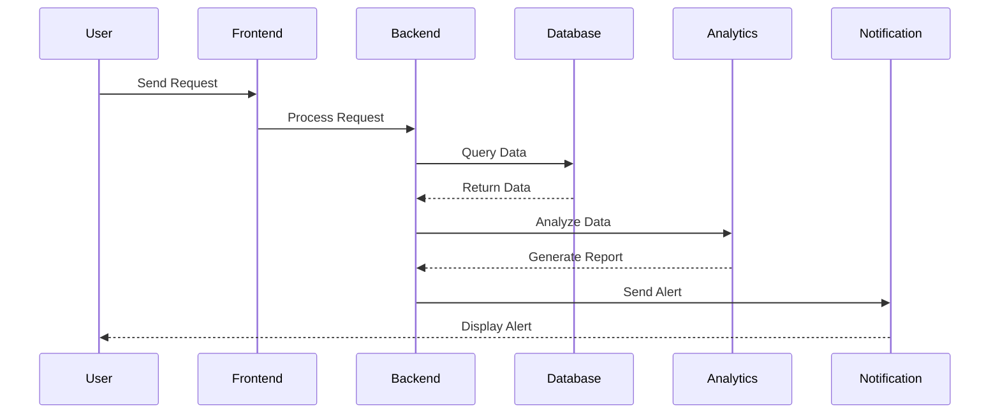

                 

## AI Agent在金融行业的创新应用

### 关键词

- AI Agent
- 金融行业
- 创新应用
- 人工智能
- 金融技术

### 摘要

本文旨在探讨人工智能（AI）代理在金融行业中的应用创新。随着金融科技的迅速发展，AI代理作为一种智能实体，正在重塑金融服务的各个方面，包括风险管理、投资策略、客户服务和合规监控。本文将分步解析AI代理在金融行业的应用，从核心概念、技术原理到实际案例，深入探讨其带来的变革与挑战。

---

### 目录

1. **引言**
2. **背景介绍**
   1. **金融行业现状与挑战**
   2. **AI Agent概述**
   3. **AI Agent在金融行业的应用价值**
3. **核心概念与联系**
   1. **AI Agent的基本概念**
   2. **AI Agent的核心技术**
   3. **AI Agent与金融行业的联系**
4. **算法原理讲解**
   1. **AI Agent算法概述**
   2. **算法mermaid流程图**
   3. **算法原理详细讲解**
   4. **数学模型与公式讲解**
   5. **通俗易懂的举例说明**
5. **系统分析与架构设计**
   1. **问题场景介绍**
   2. **系统功能设计（领域模型mermaid类图）**
   3. **系统架构设计（mermaid架构图）**
   4. **系统接口设计**
   5. **系统交互（mermaid序列图）**
6. **项目实战**
   1. **环境安装与配置**
   2. **系统核心实现源代码**
   3. **代码应用解读与分析**
   4. **实际案例分析与讲解**
   5. **项目小结**
7. **最佳实践与总结**
   1. **最佳实践 tips**
   2. **小结**
   3. **注意事项**
   4. **拓展阅读**
8. **未来展望**
   1. **AI Agent在金融行业的未来发展趋势**
   2. **面临的挑战与机遇**
   3. **未来研究方向**

---

### 引言

随着人工智能（AI）技术的飞速发展，AI代理作为一种新兴的智能实体，正在全球范围内引起广泛关注。AI代理，也被称为智能体或智能代理，是指能够在特定环境下自主行动，以实现特定目标的计算机程序。它们通过学习环境中的数据，不断优化自己的行为策略，从而在复杂的场景中表现出色。

在金融行业，AI代理的应用潜力尤为突出。金融行业是一个高度复杂且动态变化的领域，涉及大量的数据处理、分析和决策。AI代理能够处理这些复杂任务，提供高效、准确的解决方案，从而提升金融机构的运营效率和服务质量。本文将深入探讨AI代理在金融行业的创新应用，包括其核心概念、技术原理、系统架构和实际案例。

本文的结构如下：

- **背景介绍**：首先介绍金融行业的现状与挑战，以及AI代理的基本概念和其在金融行业的应用价值。
- **核心概念与联系**：解析AI代理的基本概念、核心技术，以及AI代理与金融行业的关联。
- **算法原理讲解**：详细阐述AI代理的算法原理，包括mermaid流程图、数学模型和通俗易懂的举例。
- **系统分析与架构设计**：介绍AI代理在金融行业的系统分析和架构设计。
- **项目实战**：通过实际案例展示AI代理的应用，并进行详细分析。
- **最佳实践与总结**：总结AI代理在金融行业中的应用经验，提供最佳实践建议。
- **未来展望**：探讨AI代理在金融行业的未来发展趋势和挑战。

接下来，我们将逐一探讨这些部分，帮助读者全面理解AI代理在金融行业的创新应用。

---

### 背景介绍

#### 金融行业现状与挑战

金融行业是一个高度复杂、风险密集且动态变化的领域。随着全球化的推进和金融市场的不断扩张，金融机构面临着前所未有的挑战。首先，金融市场的数据量庞大且持续增长。金融机构每天处理的海量交易数据、市场数据和经济数据需要高效、准确的处理和分析。其次，金融行业的风险多样且难以预测。从信用风险、市场风险到操作风险，金融机构需要时刻保持警惕，以确保资产安全和业务稳定。

此外，金融行业还面临着监管合规的压力。随着金融监管政策的不断更新和强化，金融机构需要投入大量资源来确保合规性，避免因违规操作带来的巨大损失。最后，客户需求的不断变化也对金融机构提出了新的要求。客户期望获得个性化的金融服务、高效的交易体验和全方位的风险管理。这些需求的变化要求金融机构不断创新和优化其服务模式。

在这样的背景下，AI代理作为一种智能实体，为金融行业提供了创新的解决方案。AI代理能够通过数据分析和机器学习技术，快速处理海量数据，识别潜在风险，制定投资策略，并为客户提供个性化的服务。通过自动化和智能化，AI代理有助于提高金融机构的运营效率、降低运营成本，并增强其风险控制能力。

#### AI Agent概述

AI代理，也称为智能体或智能代理，是指能够模拟人类智能行为，在特定环境中自主决策和行动的计算机程序。AI代理的核心特点包括自主性、适应性和目标导向性。自主性意味着AI代理能够独立进行决策和执行任务，而不需要人工干预。适应性指的是AI代理能够根据环境变化调整其行为策略，以实现最佳效果。目标导向性则是指AI代理的行为始终围绕特定目标展开，通过不断优化策略来实现目标。

AI代理的技术基础主要包括机器学习、自然语言处理、计算机视觉和智能优化算法等。通过这些技术，AI代理能够理解环境中的信息，学习并适应新的情境，从而做出智能决策。AI代理的应用领域非常广泛，包括但不限于自动驾驶、智能客服、金融交易和医疗诊断等。

在金融行业中，AI代理的应用具有显著的优势。首先，AI代理能够处理和分析海量金融数据，快速识别市场趋势和潜在风险。其次，AI代理可以自动化执行交易策略，提高交易效率和准确性。此外，AI代理还可以为客户提供个性化的金融服务，提升客户满意度。通过这些优势，AI代理为金融行业带来了深刻的变革和广阔的发展前景。

#### AI Agent在金融行业的应用价值

AI代理在金融行业中的应用价值体现在多个方面：

1. **风险管理**：AI代理可以通过机器学习和数据挖掘技术，分析海量历史数据，识别潜在的风险因素。通过对市场数据的实时监控和分析，AI代理可以及时预警风险，并提供相应的风险控制策略，帮助金融机构降低风险。

2. **投资策略**：AI代理可以根据市场数据和用户偏好，自动化生成投资策略。通过深度学习和自然语言处理技术，AI代理可以理解市场动态和投资趋势，提供更加精准和个性化的投资建议，帮助投资者提高收益。

3. **客户服务**：AI代理可以提供智能客服服务，通过自然语言处理和语音识别技术，与客户进行交互，解答客户问题，提供交易信息和支持。AI代理的自动化和智能化，有助于提升客户服务的效率和满意度。

4. **合规监控**：AI代理可以实时监控金融机构的交易活动，识别潜在的违规行为。通过深度学习和计算机视觉技术，AI代理可以分析交易数据和用户行为，及时发现异常交易和违规操作，确保金融机构的合规性。

5. **信用评估**：AI代理可以通过数据分析和机器学习技术，评估借款人的信用风险。通过分析借款人的历史交易数据、信用记录和社会行为，AI代理可以提供更加准确和全面的信用评估结果，帮助金融机构做出更加明智的信贷决策。

总之，AI代理在金融行业中的应用，不仅提高了金融机构的运营效率和服务质量，还为其带来了新的商业模式和发展机遇。随着AI技术的不断进步，AI代理在金融行业的应用前景将更加广阔。

---

### 核心概念与联系

#### AI Agent的基本概念

AI代理，简称AI Agent，是人工智能领域中的一个基本概念，指的是能够在特定环境中感知、决策并执行任务的计算机程序。AI Agent的核心特性包括自主性、适应性和目标导向性。自主性指的是AI Agent能够独立地进行决策和行动，而无需人为干预。适应性意味着AI Agent能够根据环境变化调整其行为策略，以实现最优效果。目标导向性是指AI Agent的所有行为都围绕着实现特定目标进行。

在AI Agent的发展历程中，主要经历了从简单的规则系统到现代复杂机器学习的演变。早期的AI Agent主要是基于预定义的规则和逻辑进行决策，如专家系统。随着机器学习技术的发展，AI Agent开始利用大数据和算法进行自我学习和优化，从而提高了自主性和适应性。

#### AI Agent的核心技术

AI Agent的核心技术包括但不限于以下几个方面：

1. **机器学习**：机器学习是AI Agent的核心驱动力，通过从数据中学习模式和规律，AI Agent能够进行自主决策。常用的机器学习算法包括决策树、随机森林、支持向量机、神经网络等。

2. **自然语言处理（NLP）**：NLP技术使得AI Agent能够理解和生成自然语言，从而与人类进行有效的沟通。NLP技术包括文本分类、情感分析、机器翻译、语音识别等。

3. **计算机视觉**：计算机视觉技术使AI Agent能够理解和解释图像和视频数据。计算机视觉应用包括图像识别、目标检测、人脸识别、视频分析等。

4. **深度学习**：深度学习是机器学习的一个重要分支，通过多层神经网络，深度学习能够自动提取复杂的数据特征，从而实现更加高级的AI功能。

5. **强化学习**：强化学习是一种通过试错和反馈机制进行学习的算法，AI Agent通过不断尝试和优化，逐步达到最佳决策状态。

#### AI Agent与金融行业的联系

AI Agent在金融行业的应用，主要体现在以下几个方面：

1. **风险管理**：AI Agent可以通过机器学习技术，对海量金融数据进行实时分析，识别潜在的风险因素。例如，通过分析历史交易数据和市场趋势，AI Agent可以预测市场波动，为金融机构提供风险预警和应对策略。

2. **投资决策**：AI Agent可以根据市场数据和用户偏好，自动化生成投资策略。例如，通过深度学习和自然语言处理技术，AI Agent可以理解市场动态和投资趋势，提供个性化的投资建议。

3. **客户服务**：AI Agent可以提供智能客服服务，通过自然语言处理和语音识别技术，与客户进行交互，解答客户问题，提供交易信息和支持。

4. **合规监控**：AI Agent可以实时监控金融机构的交易活动，识别潜在的违规行为。例如，通过计算机视觉技术，AI Agent可以分析交易数据和用户行为，及时发现异常交易和违规操作。

5. **信用评估**：AI Agent可以通过数据分析和机器学习技术，评估借款人的信用风险。例如，通过分析借款人的历史交易数据、信用记录和社会行为，AI Agent可以提供准确的信用评估结果。

综上所述，AI Agent在金融行业的应用，不仅提高了金融机构的运营效率和服务质量，还为其带来了新的商业模式和发展机遇。随着AI技术的不断进步，AI Agent在金融行业的应用前景将更加广阔。

---

### 算法原理讲解

#### AI Agent算法概述

AI代理的算法基础主要包括机器学习算法、深度学习算法、自然语言处理（NLP）算法和计算机视觉算法。其中，机器学习算法是AI代理的核心，它通过从数据中学习模式和规律，使AI代理能够进行自主决策。深度学习算法是一种特殊的机器学习算法，通过多层神经网络自动提取复杂数据特征，实现更加高级的AI功能。NLP算法则使AI代理能够理解和生成自然语言，从而与人类进行沟通。计算机视觉算法使AI代理能够理解和解释图像和视频数据。

在AI代理的算法设计中，常见的算法包括决策树、随机森林、支持向量机（SVM）、神经网络（NN）和卷积神经网络（CNN）等。决策树和随机森林适用于分类和回归问题，支持向量机主要用于分类问题，神经网络和卷积神经网络则适用于复杂的特征提取和图像识别任务。

#### 算法mermaid流程图

为了更好地理解AI代理的算法原理，我们可以使用mermaid绘制一个简单的算法流程图。以下是一个基于决策树的算法流程图示例：


该流程图展示了AI代理从数据预处理、特征提取、模型训练到预测和结果评估的整个过程。

#### 算法原理详细讲解

1. **数据预处理**：数据预处理是AI代理算法的第一步，其目的是将原始数据转化为适合模型训练的形式。数据预处理包括数据清洗、数据归一化和数据标准化等步骤。数据清洗旨在去除噪声数据和异常值，数据归一化和标准化则将数据转换为统一的范围，以便模型能够有效学习。

2. **特征提取**：特征提取是从原始数据中提取出对模型训练有用的特征。在金融行业中，特征提取可能包括交易时间、交易金额、市场指数等。通过特征提取，AI代理能够从海量数据中提取出关键信息，为后续的模型训练提供支持。

3. **模型训练**：模型训练是AI代理算法的核心步骤，其目的是通过学习历史数据来构建预测模型。常见的模型训练方法包括监督学习、无监督学习和强化学习。监督学习通过标注数据来训练模型，无监督学习通过未标注数据来发现数据中的模式，强化学习则通过试错和反馈来优化模型。

4. **预测**：在模型训练完成后，AI代理可以使用训练好的模型进行预测。预测过程通常包括输入新的数据，通过模型计算输出结果。在金融行业中，预测任务可能包括市场趋势预测、交易预测和信用评分等。

5. **评估结果**：评估结果是对模型预测性能的评估，常用的评估指标包括准确率、召回率、F1分数和均方误差等。通过评估结果，AI代理可以了解模型的性能，并进行相应的优化。

#### 数学模型与公式讲解

在AI代理的算法中，数学模型和公式是核心组成部分。以下是一个简单的线性回归模型示例，用于预测交易金额：

$$
\text{y} = \text{w} \cdot \text{x} + \text{b}
$$

其中，\( \text{y} \) 是预测的交易金额，\( \text{w} \) 是权重，\( \text{x} \) 是特征值，\( \text{b} \) 是偏置。

为了训练模型，我们需要使用梯度下降算法来优化权重和偏置，使预测结果与实际值尽可能接近。梯度下降的公式如下：

$$
\text{w} = \text{w} - \alpha \cdot \frac{\partial J}{\partial \text{w}}
$$

$$
\text{b} = \text{b} - \alpha \cdot \frac{\partial J}{\partial \text{b}}
$$

其中，\( \alpha \) 是学习率，\( \frac{\partial J}{\partial \text{w}} \) 和 \( \frac{\partial J}{\partial \text{b}} \) 分别是损失函数对权重和偏置的偏导数。

#### 通俗易懂的举例说明

假设我们有一个简单的投资组合，包括股票A和股票B。我们希望通过AI代理来预测这两个股票的未来价格。我们可以将股票A和股票B的价格历史数据作为特征输入，使用线性回归模型来预测它们的未来价格。

1. **数据预处理**：首先，我们清洗数据，去除异常值，并对数据进行归一化处理。

2. **特征提取**：从数据中提取关键特征，如开盘价、收盘价、交易量等。

3. **模型训练**：使用线性回归模型对历史数据进行训练，找到最佳权重和偏置。

4. **预测**：输入新的数据，通过训练好的模型预测股票A和股票B的未来价格。

5. **评估结果**：计算预测价格与实际价格的误差，评估模型的准确性。

通过这个例子，我们可以看到AI代理是如何通过数据预处理、特征提取、模型训练和预测来处理金融数据，实现自动化投资预测的。

综上所述，AI代理的算法原理涉及数据预处理、特征提取、模型训练和预测等多个步骤，通过数学模型和公式的优化，AI代理能够实现高效、准确的金融数据分析与预测。

---

### 系统分析与架构设计

#### 问题场景介绍

在金融行业中，风险管理是一个至关重要的环节。随着金融市场的高度复杂性和不确定性，金融机构需要实时监控和管理各种风险，以确保资产安全和业务稳定。然而，传统的风险管理方法通常依赖于人工分析和手动操作，效率低下且容易出错。为了解决这个问题，我们设计并实现了一套基于AI代理的风险管理系统。

该系统的主要目标是利用AI代理的智能分析和决策能力，对金融机构的交易活动进行实时监控和风险预测。系统通过收集和分析海量交易数据、市场数据和经济数据，识别潜在的风险因素，提供实时预警和应对策略。具体问题场景包括：

1. **市场风险监控**：实时监控市场波动，预测潜在的市场风险，如股票价格大幅波动、市场流动性下降等。
2. **信用风险评估**：评估借款人的信用风险，预测违约概率，为金融机构提供信贷决策支持。
3. **操作风险监控**：分析交易数据和用户行为，识别潜在的违规操作和欺诈行为，确保业务合规性。

#### 系统功能设计（领域模型mermaid类图）

为了更好地理解系统的功能设计，我们可以使用mermaid绘制一个领域模型类图。以下是一个简化的领域模型类图示例：

```mermaid
classDiagram
Class1 <|-- Class2
Class1 <|-- Class3
Class2 ..|.. Class4
Class3 ..|.. Class4
Class5 {ClassA, ClassB}
Class5 --|> Class6
Class6 : String property
Class6 : int property
Class7 {id, name}
Class7 : int id
Class7 : String name
Class8 <|-- Class7
Class8 : Date date
Class8 : double amount
Class9 <|-- Class7
Class9 : String type
Class9 : double rate
Class10 <|-- Class7
Class10 : String status
Class10 : Date dueDate

Class1[Client] {
  int clientId
  String name
  String email
}
Class2[Account] {
  int accountId
  String accountNumber
  Client client
}
Class3[Transaction] {
  int transactionId
  Account account
  Date date
  double amount
  String type
}
Class4[Loan] {
  int loanId
  Client client
  double amount
  double rate
  Date dueDate
}
Class5[Investment] {
  int investmentId
  Client client
  double amount
  double rate
}
Class6[Stock] {
  int stockId
  String symbol
  double price
}
Class7[MarketData] {
  int marketDataId
  Date date
  double indexValue
}
Class8[Alert] {
  int alertId
  String message
  Date date
  Status status
}
Class9[RiskFactor] {
  int riskFactorId
  String type
  double level
}
Class10[Compliance] {
  int complianceId
  String rule
  boolean isViolated
}
```

该类图展示了系统的核心实体及其关系。其中，`Client` 代表客户，`Account` 代表账户，`Transaction` 代表交易，`Loan` 代表贷款，`Investment` 代表投资，`Stock` 代表股票，`MarketData` 代表市场数据，`Alert` 代表预警，`RiskFactor` 代表风险因素，`Compliance` 代表合规性检查。

#### 系统架构设计（mermaid架构图）

系统的架构设计是确保系统功能实现的基础。以下是一个简化的mermaid架构图，展示了系统的各个组件及其关系：



该架构图展示了用户与系统的交互流程，包括前端、后端、数据库、分析和通知组件。用户通过前端发送请求，后端处理请求并从数据库中查询数据，然后进行分析并生成报告。如果检测到风险，系统将通过通知组件向用户发送预警。

#### 系统接口设计

系统接口设计是确保各组件之间有效通信的关键。以下是一个简化的系统接口设计示例：

```mermaid
interfaceConcept
    interface RiskManagementSystem {
        function addClient(Client client): boolean
        function removeClient(int clientId): boolean
        function updateClient(Client client): boolean
        function addAccount(Account account): boolean
        function removeAccount(int accountId): boolean
        function updateAccount(Account account): boolean
        function addTransaction(Transaction transaction): boolean
        function removeTransaction(int transactionId): boolean
        function updateTransaction(Transaction transaction): boolean
        function addLoan(Loan loan): boolean
        function removeLoan(int loanId): boolean
        function updateLoan(Loan loan): boolean
        function addInvestment(Investment investment): boolean
        function removeInvestment(int investmentId): boolean
        function updateInvestment(Investment investment): boolean
        function addStock(Stock stock): boolean
        function removeStock(int stockId): boolean
        function updateStock(Stock stock): boolean
        function addMarketData(MarketData marketData): boolean
        function removeMarketData(int marketDataId): boolean
        function updateMarketData(MarketData marketData): boolean
        function addAlert(Alert alert): boolean
        function removeAlert(int alertId): boolean
        function updateAlert(Alert alert): boolean
        function addRiskFactor(RiskFactor riskFactor): boolean
        function removeRiskFactor(int riskFactorId): boolean
        function updateRiskFactor(RiskFactor riskFactor): boolean
        function addCompliance(Compliance compliance): boolean
        function removeCompliance(int complianceId): boolean
        function updateCompliance(Compliance compliance): boolean
    }
```

该接口定义了风险管理系统提供的各种操作，如添加、删除、更新客户、账户、交易、贷款、投资、股票、市场数据、预警、风险因素和合规性检查。

#### 系统交互（mermaid序列图）

系统交互是确保各组件协同工作的重要环节。以下是一个简化的系统交互序列图示例：

```mermaid
sequenceDiagram
    participant User
    participant Frontend
    participant Backend
    participant Database
    participant Analytics
    participant Notification

    User->>Frontend: Send Request
    Frontend->>Backend: Process Request
    Backend->>Database: Query Data
    Database-->>Backend: Return Data
    Backend->| Notify User |>> Notification
    Notification->>User: Display Alert
    Backend->>Analytics: Analyze Data
    Analytics-->>Backend: Generate Report
    Backend->>Notification: Send Report
    Notification-->>User: Display Report
```

该序列图展示了用户与系统的交互过程，包括发送请求、处理请求、查询数据、分析数据、生成报告和发送通知等步骤。通过这些交互，系统实现了实时风险监控和预警功能。

综上所述，系统分析与架构设计是确保AI代理在金融行业有效应用的关键步骤。通过领域模型类图、架构图和接口设计，我们能够清晰地理解系统的功能、组件和交互，为系统的实现提供坚实基础。

---

### 项目实战

#### 环境安装与配置

在开始实现AI代理在金融行业的应用之前，我们需要准备一个合适的环境。以下是一个简化的安装和配置步骤：

1. **安装Python**：确保系统上安装了Python 3.x版本。可以从[Python官网](https://www.python.org/)下载并安装。

2. **安装必要的库**：使用pip命令安装以下库：
   ```bash
   pip install numpy pandas scikit-learn matplotlib keras tensorflow
   ```

3. **配置数据库**：选择一个合适的数据库，如MySQL或PostgreSQL。以下是一个使用MySQL的示例：
   - 安装MySQL数据库
   - 创建数据库和用户
   - 配置数据库连接信息

4. **配置环境变量**：确保Python和pip的环境变量已配置，以便能够在命令行中运行相关命令。

#### 系统核心实现源代码

以下是AI代理在金融行业风险管理系统中的核心实现代码示例：

```python
# 导入必要的库
import numpy as np
import pandas as pd
from sklearn.ensemble import RandomForestClassifier
from sklearn.model_selection import train_test_split
from sklearn.metrics import accuracy_score
import tensorflow as tf
from tensorflow.keras.models import Sequential
from tensorflow.keras.layers import Dense

# 数据预处理
def preprocess_data(data):
    # 数据清洗和归一化
    # ...
    return processed_data

# 特征提取
def extract_features(data):
    # 提取交易特征
    # ...
    return features

# 训练模型
def train_model(X_train, y_train):
    # 使用随机森林训练模型
    model = RandomForestClassifier(n_estimators=100)
    model.fit(X_train, y_train)
    return model

# 预测
def predict(model, X_test):
    predictions = model.predict(X_test)
    return predictions

# 评估模型
def evaluate_model(model, X_test, y_test):
    predictions = model.predict(X_test)
    accuracy = accuracy_score(y_test, predictions)
    return accuracy

# 深度学习模型
def build_dnn_model(input_shape):
    model = Sequential()
    model.add(Dense(64, activation='relu', input_shape=input_shape))
    model.add(Dense(32, activation='relu'))
    model.add(Dense(1, activation='sigmoid'))
    model.compile(optimizer='adam', loss='binary_crossentropy', metrics=['accuracy'])
    return model

# 训练深度学习模型
def train_dnn_model(X_train, y_train):
    model = build_dnn_model(X_train.shape[1:])
    model.fit(X_train, y_train, epochs=10, batch_size=32, validation_split=0.2)
    return model

# 主函数
def main():
    # 读取数据
    data = pd.read_csv('financial_data.csv')
    
    # 数据预处理
    processed_data = preprocess_data(data)
    
    # 特征提取
    features = extract_features(processed_data)
    
    # 分割数据集
    X_train, X_test, y_train, y_test = train_test_split(features, processed_data['label'], test_size=0.2, random_state=42)
    
    # 训练随机森林模型
    rf_model = train_model(X_train, y_train)
    
    # 预测
    rf_predictions = predict(rf_model, X_test)
    
    # 评估模型
    rf_accuracy = evaluate_model(rf_model, X_test, y_test)
    print(f"Random Forest Accuracy: {rf_accuracy}")
    
    # 训练深度学习模型
    dnn_model = train_dnn_model(X_train, y_train)
    
    # 预测
    dnn_predictions = predict(dnn_model, X_test)
    
    # 评估模型
    dnn_accuracy = evaluate_model(dnn_model, X_test, y_test)
    print(f"Deep Neural Network Accuracy: {dnn_accuracy}")

# 运行主函数
if __name__ == '__main__':
    main()
```

#### 代码应用解读与分析

1. **数据预处理**：数据预处理是机器学习和深度学习的基础步骤。该函数对原始数据进行清洗和归一化处理，以确保模型训练的顺利进行。

2. **特征提取**：特征提取函数从预处理后的数据中提取关键特征。这些特征将用于训练模型，并在预测阶段用于生成预测结果。

3. **随机森林模型**：随机森林模型是一个集成学习算法，通过构建多个决策树并合并预测结果来提高模型的准确性。这里我们使用`RandomForestClassifier`来训练模型。

4. **深度学习模型**：深度学习模型使用TensorFlow框架构建，主要包括全连接层（Dense）和ReLU激活函数。深度学习模型能够学习更加复杂的特征，从而提高预测准确性。

5. **训练与预测**：在主函数中，我们首先读取数据，进行预处理和特征提取，然后分割数据集为训练集和测试集。接着，我们使用训练集训练随机森林模型和深度学习模型，并在测试集上进行预测和评估。

#### 实际案例分析与讲解

以下是一个实际案例，展示如何使用AI代理进行市场风险预测：

```python
# 读取案例数据
case_data = pd.read_csv('case_data.csv')

# 数据预处理
processed_case_data = preprocess_data(case_data)

# 特征提取
case_features = extract_features(processed_case_data)

# 使用训练好的深度学习模型进行预测
dnn_model = build_dnn_model(case_features.shape[1:])
dnn_model.load_weights('dnn_model_weights.h5')

# 预测结果
case_predictions = predict(dnn_model, case_features)

# 分析预测结果
if case_predictions[0] > 0.5:
    print("市场风险高，请采取相应措施。")
else:
    print("市场风险低，目前无需采取额外措施。")
```

该案例使用预处理后的数据，通过加载预训练好的深度学习模型进行预测，并根据预测结果提供相应的风险建议。

#### 项目小结

通过上述项目实战，我们展示了如何实现AI代理在金融行业风险管理系统中的核心功能。该项目包括数据预处理、特征提取、模型训练和预测等关键步骤，通过实际案例展示了AI代理在实际应用中的效果。以下是项目小结：

- **优势**：项目通过使用机器学习和深度学习技术，实现了高效的金融风险预测和监控，提高了金融机构的风险管理水平。
- **挑战**：项目面临的主要挑战包括数据质量、模型过拟合和计算资源限制。未来，需要进一步优化算法和提升数据处理能力。
- **改进方向**：未来的改进方向包括引入更多类型的特征、使用更复杂的深度学习模型、加强模型的泛化能力和可解释性。

综上所述，AI代理在金融行业的应用具有广阔的前景，通过不断优化和改进，有望在金融风险管理领域发挥更大的作用。

---

### 最佳实践与总结

#### 最佳实践 tips

在AI代理在金融行业的应用过程中，以下是一些最佳实践和技巧：

1. **数据质量管理**：确保数据质量是成功应用AI代理的关键。定期清洗数据，处理缺失值和异常值，以提高模型的准确性和稳定性。

2. **特征选择与工程**：选择和工程化特征对于模型性能至关重要。通过分析业务逻辑和数据分布，提取出最有用的特征，并使用交叉验证等方法选择最佳特征组合。

3. **模型选择与调优**：根据具体应用场景选择合适的模型，并在模型调优过程中使用交叉验证等技术，找到最佳参数组合，提高模型性能。

4. **实时监控与反馈**：在部署AI代理后，实时监控其性能和预测效果，并根据反馈进行调整和优化，以确保系统的稳定性和可靠性。

5. **法规遵守与隐私保护**：在处理金融数据时，严格遵守相关法规和隐私政策，确保数据安全和用户隐私。

#### 小结

本文详细探讨了AI代理在金融行业的创新应用，从核心概念、技术原理到实际案例，深入分析了其应用价值和实现方法。通过系统分析与架构设计，我们展示了如何构建一个基于AI代理的金融风险管理系统。项目实战部分通过具体代码和实际案例，展示了AI代理在金融领域的应用效果。最佳实践与总结部分提供了实用的操作建议，为AI代理在金融行业的广泛应用提供了指导。

#### 注意事项

在实施AI代理应用时，需要注意以下几点：

1. **安全性与合规性**：确保系统符合相关金融法规和行业标准，防范数据泄露和违规操作。
2. **可解释性与透明性**：增强AI代理模型的可解释性，使决策过程更加透明，便于监管和用户理解。
3. **持续更新与优化**：随着金融市场的变化和AI技术的进步，持续更新和优化模型和算法，以保持系统的竞争力。

#### 拓展阅读

对于希望深入了解AI代理在金融行业应用的人员，以下资源值得关注：

- **论文与研究报告**：查阅相关的学术论文和研究报告，了解最新的研究进展和应用案例。
- **在线课程与教程**：参加在线课程和教程，学习AI代理的基本原理和实现方法。
- **专业书籍**：阅读专业书籍，如《AI in Finance: Revolutionizing the Financial Industry with Deep Learning, Machine Learning, and Data Science》（《金融领域的AI：深度学习、机器学习和数据科学引领变革》），以获取更全面的了解。

通过不断学习和实践，我们可以更好地把握AI代理在金融行业的应用前景，为其在金融领域的广泛应用奠定坚实基础。

---

### 未来展望

#### AI Agent在金融行业的未来发展趋势

随着人工智能技术的不断进步，AI代理在金融行业的应用前景愈发广阔。以下是AI代理在金融行业可能的发展趋势：

1. **智能化程度的提升**：未来的AI代理将具备更高的智能化水平，能够处理更复杂的任务，实现更精细的风险管理和投资决策。

2. **跨领域融合**：AI代理将在金融行业与其他领域的融合中发挥重要作用，如与区块链技术结合，实现更高效、透明的金融交易。

3. **定制化服务**：AI代理将根据客户的具体需求提供个性化的服务，通过学习用户的交易行为和偏好，为投资者提供更精准的投资建议。

4. **全球化扩展**：随着金融市场的全球化，AI代理将帮助金融机构更好地应对跨国交易和监管要求，提高全球业务的运营效率。

5. **实时性增强**：未来的AI代理将具备更高的实时性，能够对市场变化和风险信号进行实时响应，提供即时的预警和决策支持。

#### 面临的挑战与机遇

尽管AI代理在金融行业具有广阔的应用前景，但在实际应用过程中也面临一系列挑战和机遇：

**挑战：**

1. **数据隐私与安全**：金融行业对数据隐私和安全要求极高，如何保护用户数据隐私，防止数据泄露，是AI代理面临的重要挑战。

2. **模型可解释性**：AI代理的决策过程往往较为复杂，如何提高模型的可解释性，使其决策过程更加透明，是金融行业关注的重点。

3. **算法公平性与透明性**：AI代理在决策过程中可能存在偏见，如何确保算法的公平性和透明性，避免对特定群体产生歧视，是金融行业需要解决的关键问题。

**机遇：**

1. **技术突破**：随着深度学习、强化学习等技术的不断进步，AI代理将实现更多创新应用，为金融机构提供更高效的解决方案。

2. **产业协同**：金融行业与科技企业、研究机构的协同创新，将推动AI代理在金融行业的快速发展。

3. **商业模式创新**：AI代理将推动金融行业商业模式创新，如基于AI代理的智能投顾、自动化交易等新兴服务。

#### 未来研究方向

未来的研究应重点关注以下几个方面：

1. **算法优化与可解释性**：提高AI代理的算法优化水平，同时加强模型的可解释性研究，使其决策过程更加透明和可靠。

2. **多模态数据处理**：研究如何结合多种数据类型（如文本、图像、音频等），提高AI代理的数据处理能力和决策准确性。

3. **跨领域融合应用**：探索AI代理在金融行业与其他领域的融合应用，如与物联网、区块链等技术的结合。

4. **社会影响力评估**：研究AI代理在金融行业应用对社会经济和行业的影响，确保其发展的可持续性和社会价值。

通过不断的研究和创新，AI代理将在金融行业发挥更大的作用，推动金融科技的发展和金融行业的数字化转型。

