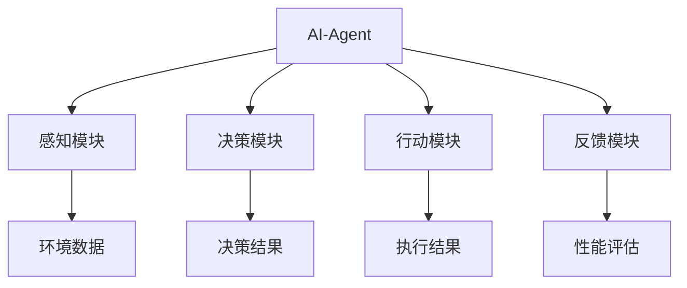
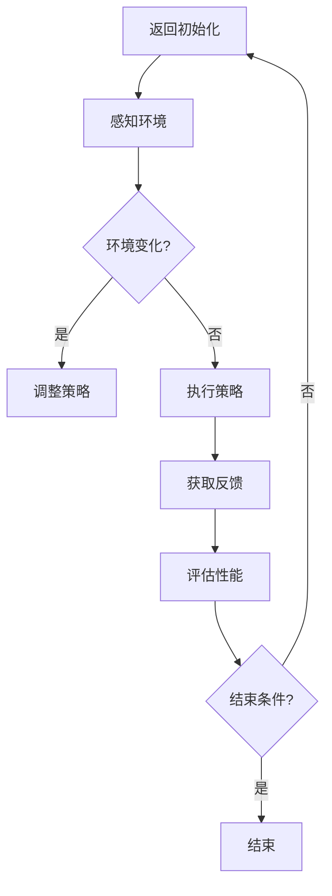

                 

# AI Agent在金融风险分析中的应用

> 关键词：AI Agent、金融风险分析、应用原理、挑战、未来趋势

> 摘要：本文旨在探讨AI-Agent在金融风险分析中的应用。首先，我们将介绍AI-Agent的概述，包括背景、定义、特征和应用价值。接着，我们会对金融风险分析的基础进行梳理，包括金融风险的概述、分析方法和数据预处理。随后，我们将深入探讨AI-Agent在金融风险分析中的应用原理和案例，以及面临的挑战和未来趋势。通过本文的阅读，读者将了解到AI-Agent在金融风险分析中的重要性和潜力。

## 目录大纲

1. [AI-Agent概述](#第1章-ai-agent概述)
2. [金融风险分析基础](#第2章-金融风险分析基础)
3. [AI-Agent在金融风险分析中的应用原理](#第3章-ai-agent在金融风险分析中的应用原理)
4. [AI-Agent在金融风险分析中的应用案例](#第4章-ai-agent在金融风险分析中的应用案例)
5. [AI-Agent在金融风险分析中的应用挑战与未来趋势](#第5章-ai-agent在金融风险分析中的应用挑战与未来趋势)
6. [AI-Agent在金融风险分析中的应用最佳实践](#第6章-ai-agent在金融风险分析中的应用最佳实践)
7. [总结与展望](#第7章-总结与展望)
8. [参考文献](#参考文献)

---

## 第1章: AI-Agent概述

### 1.1 问题背景与核心概念

#### 1.1.1 问题背景

金融行业作为全球经济的重要支柱，其稳定发展对整个社会经济的健康运行至关重要。然而，随着金融市场日益复杂化，金融风险也随之增加。如何有效地识别、评估和管理金融风险，成为金融行业面临的一大挑战。传统的金融风险分析方法主要依赖于人为经验和统计数据，存在一定的局限性。而随着人工智能技术的发展，AI-Agent作为一种智能体，被广泛应用于金融风险分析中，有望提高风险管理的效率和准确性。

#### 1.1.2 AI-Agent的定义与特征

AI-Agent，即人工智能代理，是一种能够自主感知环境、采取行动并与其他实体交互的智能系统。其核心特征包括：

- **自主性**：AI-Agent能够根据环境变化自主做出决策，无需人工干预。
- **适应性**：AI-Agent能够通过学习和适应环境变化，优化自身的表现。
- **交互性**：AI-Agent能够与其他系统或实体进行交互，实现信息交换和协同工作。
- **透明性**：AI-Agent的决策过程和内部机制是透明的，便于监控和管理。

#### 1.1.3 AI-Agent在金融风险分析中的应用价值

AI-Agent在金融风险分析中的应用价值主要体现在以下几个方面：

- **高效性**：AI-Agent能够处理海量数据，快速识别潜在风险。
- **准确性**：AI-Agent通过机器学习和深度学习算法，能够提高风险预测的准确性。
- **实时性**：AI-Agent能够实时监控金融市场的动态变化，及时应对风险。
- **综合性**：AI-Agent能够整合多种风险分析模型和方法，提供全面的风险评估。

### 1.2 核心概念与联系

#### 1.2.1 AI-Agent概念原理

AI-Agent是基于人工智能技术构建的智能系统，其基本原理包括感知、决策、行动和反馈四个环节。感知是指AI-Agent获取环境信息；决策是指AI-Agent根据感知信息做出行动决策；行动是指AI-Agent执行决策；反馈是指AI-Agent根据行动结果调整和优化自身性能。

#### 1.2.2 AI-Agent属性特征对比

| 特性               | AI-Agent          | 传统金融风险分析 |
|--------------------|-------------------|------------------|
| 自主性             | 高                | 低               |
| 适应性             | 强                | 弱               |
| 交互性             | 强                | 弱               |
| 透明性             | 中                | 高               |

#### 1.2.3 AI-Agent的ER实体关系图



### 1.3 AI-Agent的算法原理讲解

#### 1.3.1 Mermaid算法流程图



#### 1.3.2 Python算法源代码讲解

```python
import random

class AI-Agent:
    def __init__(self):
        self.strategy = 'initial_strategy'
    
    def perceive_environment(self):
        # 模拟感知环境
        return random.choice(['change', 'no_change'])
    
    def adjust_strategy(self, change):
        if change == 'change':
            self.strategy = 'new_strategy'
    
    def execute_strategy(self):
        # 模拟执行策略
        print(f"Executing strategy: {self.strategy}")
    
    def get_feedback(self):
        # 模拟获取反馈
        return random.choice([0.8, 0.9, 1.0])
    
    def evaluate_performance(self, feedback):
        # 模拟评估性能
        if feedback >= 0.9:
            print("Performance is good.")
        else:
            print("Performance needs improvement.")
    
    def run(self):
        while True:
            change = self.perceive_environment()
            self.adjust_strategy(change)
            self.execute_strategy()
            feedback = self.get_feedback()
            self.evaluate_performance(feedback)
```

#### 1.3.3 算法原理的数学模型和公式

算法的核心数学模型可以表示为：

$$
\text{Performance} = f(\text{Strategy}, \text{Feedback})
$$

其中，Performance表示性能评估结果，Strategy表示策略，Feedback表示反馈信息。函数f()表示性能评估函数，其具体形式可以根据实际情况进行调整。

#### 1.3.4 算法原理举例说明

假设有一个AI-Agent用于股票市场风险分析。首先，AI-Agent会感知股票市场的实时数据，如价格、交易量等。然后，根据感知到的数据，AI-Agent会调整其交易策略。执行策略后，AI-Agent会获取交易结果，并基于结果评估其策略的性能。通过不断调整和优化策略，AI-Agent能够提高其在股票市场风险分析中的表现。

### 1.4 本章小结

本章对AI-Agent进行了概述，包括背景介绍、定义与特征、应用价值和算法原理讲解。AI-Agent作为一种智能体，具有自主性、适应性、交互性和透明性等特征，在金融风险分析中具有显著的应用价值。通过本章的学习，读者可以了解AI-Agent的基本概念和原理，为后续章节的深入学习打下基础。

## 第2章: 金融风险分析基础

### 2.1 金融风险概述

#### 2.1.1 金融风险的定义

金融风险是指金融系统或金融活动可能遭受的损失或不确定性。金融风险可以划分为以下几种类型：

1. **市场风险**：由于市场变化导致金融资产价值波动而产生的风险。
2. **信用风险**：借款人或交易对手无法履行合同义务，导致信用损失的风险。
3. **流动性风险**：金融资产无法在合理时间内以合理的价格进行买卖，导致流动性不足的风险。
4. **操作风险**：由于内部程序、人员或系统错误导致损失的风险。
5. **法律风险**：由于法律制度的不确定性或合同条款的不明确导致的损失风险。

#### 2.1.2 金融风险的类型

金融风险的类型可以根据风险来源和性质进行分类：

1. **系统性风险**：由整个金融系统或市场的不确定性和波动性引起的风险，如金融危机。
2. **非系统性风险**：由特定金融机构或资产的特殊情况引起的风险，如企业破产。
3. **宏观风险**：由宏观经济因素引起的风险，如通货膨胀、利率变动。
4. **微观风险**：由特定金融机构或资产的业务和操作引起的风险，如内部欺诈。

#### 2.1.3 金融风险的影响

金融风险对金融系统和社会经济产生的影响包括：

1. **经济影响**：金融风险可能导致金融市场的动荡，影响经济增长和就业。
2. **社会影响**：金融风险可能导致金融机构破产，影响社会稳定和公众信心。
3. **政策影响**：金融风险可能迫使政府采取紧急措施，如金融救助、货币政策调整。

### 2.2 金融风险分析方法

金融风险分析方法主要包括定量分析和定性分析：

#### 2.2.1 定量分析

定量分析通过数学模型和统计方法对金融风险进行量化，包括：

1. **VaR（Value at Risk）**：衡量金融资产或投资组合在一定置信水平下的最大可能损失。
2. **蒙特卡洛模拟**：通过模拟随机过程，估计金融风险的概率分布和预期损失。
3. **贝叶斯网络**：利用概率图模型表示金融风险因素之间的依赖关系，进行风险预测。

#### 2.2.2 定性分析

定性分析通过专家评估和主观判断对金融风险进行定性描述和分类，包括：

1. **专家评估**：邀请金融专家对金融风险进行评估，提供主观意见和判断。
2. **风险矩阵**：通过风险的概率和影响进行综合评估，形成风险矩阵，用于风险分类和管理。

#### 2.2.3 综合分析

综合分析将定量分析和定性分析相结合，以提高金融风险分析的全面性和准确性。综合分析的方法包括：

1. **系统分析**：从整体角度分析金融风险，识别系统中的关键风险因素和传导机制。
2. **多因素模型**：结合多种定量和定性分析方法，构建综合的金融风险预测模型。

### 2.3 金融数据预处理

金融数据预处理是金融风险分析的重要步骤，主要包括以下内容：

#### 2.3.1 数据清洗

数据清洗包括去除重复数据、处理缺失值、纠正错误数据等，以保证数据的质量和一致性。

#### 2.3.2 数据集成

数据集成是将来自不同来源的金融数据整合到一个统一的数据库中，以便于后续分析。

#### 2.3.3 数据转换

数据转换包括将数据转换为适合分析的形式，如标准化、归一化、特征提取等。

### 2.4 本章小结

本章对金融风险分析的基础进行了介绍，包括金融风险的概述、分析方法和数据预处理。金融风险分析对于金融稳定和经济发展具有重要意义。通过定量和定性分析，结合数据预处理，可以全面评估和管理金融风险。本章内容为后续章节的深入讨论奠定了基础。

## 第3章: AI-Agent在金融风险分析中的应用原理

### 3.1 AI-Agent在金融风险分析中的应用流程

AI-Agent在金融风险分析中的应用流程可以分为以下几个步骤：

#### 3.1.1 数据收集

数据收集是AI-Agent在金融风险分析中的第一步，主要包括以下内容：

1. **市场数据**：如股票价格、交易量、市场指数等。
2. **宏观经济数据**：如GDP增长率、通货膨胀率、利率等。
3. **企业数据**：如财务报表、信用评级、经营状况等。
4. **外部事件数据**：如政策变化、自然灾害、国际事件等。

数据收集可以通过金融数据接口、公开数据库、企业内部系统等方式获取。

#### 3.1.2 数据预处理

数据预处理是保证数据质量的关键步骤，主要包括以下内容：

1. **数据清洗**：去除重复数据、处理缺失值、纠正错误数据等。
2. **数据集成**：将不同来源的数据整合到一个统一的数据集中。
3. **数据转换**：将数据转换为适合分析的形式，如标准化、归一化、特征提取等。

数据预处理可以提高数据的质量和一致性，为后续分析提供可靠的数据基础。

#### 3.1.3 特征提取

特征提取是从原始数据中提取出对风险分析有重要意义的特征，主要包括以下内容：

1. **技术指标**：如均线、波动率、动量等。
2. **财务指标**：如资产负债率、流动比率、盈利能力等。
3. **外部特征**：如宏观经济指标、行业指标等。

特征提取可以提高模型的预测能力和准确性。

#### 3.1.4 风险评估

风险评估是AI-Agent的核心功能，主要包括以下内容：

1. **风险识别**：通过特征提取和模型训练，识别潜在的风险因素。
2. **风险估计**：通过模型预测，估计风险的可能性和影响。
3. **风险评级**：根据风险评估结果，对风险进行评级，以便于决策。

风险评估可以帮助金融机构及时发现和应对风险。

#### 3.1.5 风险应对

风险应对是AI-Agent在金融风险分析中的最终目标，主要包括以下内容：

1. **风险预警**：通过实时监测和预警系统，及时发出风险预警。
2. **风险控制**：通过风险控制策略，减少风险的影响和损失。
3. **风险转移**：通过风险转移策略，将风险转嫁给其他实体。

风险应对可以帮助金融机构有效地管理风险。

### 3.2 AI-Agent的核心算法

AI-Agent在金融风险分析中应用的核心算法主要包括机器学习算法、深度学习算法和强化学习算法。

#### 3.2.1 机器学习算法

机器学习算法是一种基于数据的学习方法，通过训练数据集，模型可以自动识别数据中的规律和模式，从而进行预测和决策。常见的机器学习算法包括：

1. **线性回归**：通过建立线性模型，预测金融风险的概率和影响。
2. **逻辑回归**：通过建立逻辑模型，预测金融风险的发生概率。
3. **决策树**：通过树形结构，对金融风险进行分类和预测。
4. **随机森林**：通过集成多个决策树，提高预测的准确性和稳定性。

机器学习算法适用于处理大量数据和特征提取，但在处理非线性关系和复杂问题时效果有限。

#### 3.2.2 深度学习算法

深度学习算法是一种基于人工神经网络的学习方法，通过多层神经网络，模型可以自动提取和表示数据中的复杂特征。常见的深度学习算法包括：

1. **卷积神经网络（CNN）**：通过卷积层，提取图像和时序数据中的特征。
2. **循环神经网络（RNN）**：通过循环层，处理序列数据，如时间序列数据。
3. **长短期记忆网络（LSTM）**：通过LSTM单元，解决RNN的梯度消失问题，提高模型的预测能力。
4. **生成对抗网络（GAN）**：通过生成器和判别器的对抗训练，生成高质量的金融数据。

深度学习算法适用于处理复杂和非线性关系，但在计算资源和数据量上要求较高。

#### 3.2.3 强化学习算法

强化学习算法是一种基于奖励机制的学习方法，通过探索和利用策略，模型可以自主优化决策过程。常见的强化学习算法包括：

1. **Q学习**：通过Q值函数，评估状态-动作价值，选择最优动作。
2. **深度Q网络（DQN）**：通过深度神经网络，表示Q值函数，提高预测能力。
3. **策略梯度算法**：通过策略梯度，优化策略参数，提高决策效果。
4. **Actor-Critic算法**：通过Actor和Critic两个模块，同时优化策略和价值函数。

强化学习算法适用于动态和不确定的金融环境，但在训练过程和时间成本上存在一定挑战。

### 3.3 AI-Agent在金融风险分析中的应用案例

AI-Agent在金融风险分析中有着广泛的应用，以下列举几个典型的应用案例：

#### 3.3.1 案例一：股票市场风险分析

案例背景：某投资机构希望通过AI-Agent对股票市场进行风险分析，以指导投资决策。

案例目标：对股票市场进行风险评估，预测股票价格走势，为投资决策提供支持。

案例数据：包括股票价格、交易量、宏观经济数据、企业财务数据等。

案例实现：

1. **数据收集**：通过金融数据接口和公开数据库，收集股票市场相关数据。
2. **数据预处理**：对数据进行清洗、集成和转换，提取技术指标和财务指标作为特征。
3. **特征提取**：使用机器学习和深度学习算法，提取股票价格走势和风险因素的特征。
4. **风险评估**：通过构建深度学习模型，对股票市场进行风险评估，预测股票价格走势。
5. **风险应对**：根据风险评估结果，制定相应的投资策略，进行股票买卖操作。

案例分析：通过AI-Agent的股票市场风险分析，投资机构可以及时了解市场动态，规避风险，提高投资收益。

#### 3.3.2 案例二：贷款风险评估

案例背景：某银行希望通过AI-Agent对贷款申请人进行风险评估，以降低贷款违约风险。

案例目标：对贷款申请人进行风险评估，预测贷款违约概率，为贷款审批提供支持。

案例数据：包括申请人个人信息、财务状况、就业状况、信用记录等。

案例实现：

1. **数据收集**：通过银行内部系统和信用记录数据库，收集贷款申请人相关数据。
2. **数据预处理**：对数据进行清洗、集成和转换，提取特征变量。
3. **特征提取**：使用机器学习和深度学习算法，提取申请人的财务风险因素。
4. **风险评估**：通过构建机器学习模型，对贷款申请人进行风险评估，预测贷款违约概率。
5. **风险应对**：根据风险评估结果，制定相应的贷款审批策略，降低贷款违约风险。

案例分析：通过AI-Agent的贷款风险评估，银行可以更好地管理贷款风险，提高贷款审批的准确性。

#### 3.3.3 案例三：金融欺诈检测

案例背景：某金融机构希望通过AI-Agent检测金融欺诈行为，以保障资金安全。

案例目标：检测金融交易中的欺诈行为，防止资金损失。

案例数据：包括金融交易数据、用户行为数据等。

案例实现：

1. **数据收集**：通过金融机构的交易系统和日志，收集金融交易数据。
2. **数据预处理**：对数据进行清洗、集成和转换，提取交易特征和行为特征。
3. **特征提取**：使用机器学习和深度学习算法，提取交易欺诈特征。
4. **欺诈检测**：通过构建深度学习模型，对金融交易进行欺诈检测。
5. **风险应对**：根据欺诈检测结果，采取相应的风险控制措施，如冻结资金、报警等。

案例分析：通过AI-Agent的金融欺诈检测，金融机构可以及时发现和阻止欺诈行为，保障资金安全。

### 3.4 本章小结

本章详细介绍了AI-Agent在金融风险分析中的应用流程、核心算法和应用案例。AI-Agent通过数据收集、数据预处理、特征提取、风险评估和风险应对等步骤，实现金融风险分析的高效和准确。AI-Agent在金融风险分析中的应用，不仅提高了风险管理的效率，也为金融机构提供了有力的决策支持。随着人工智能技术的不断发展和应用，AI-Agent在金融风险分析中的应用前景将更加广阔。

## 第4章: AI-Agent在金融风险分析中的应用案例

### 4.1 案例一：股票市场风险分析

#### 4.1.1 案例背景

在现代金融市场中，股票市场的波动性一直是投资者和金融机构关注的焦点。为了有效管理股票市场的风险，某投资机构决定应用AI-Agent进行股票市场风险分析。

#### 4.1.2 案例目标

该案例的目标是通过AI-Agent对股票市场进行风险分析，实现以下目标：

1. 识别潜在的市场风险因素。
2. 预测股票价格走势，为投资决策提供支持。
3. 及时发现市场异常波动，发出预警信号。

#### 4.1.3 案例数据

案例数据包括：

1. **历史股票价格数据**：包括股票的开盘价、收盘价、最高价、最低价、交易量等。
2. **宏观经济数据**：如GDP增长率、通货膨胀率、利率等。
3. **企业财务数据**：包括企业的资产负债表、利润表和现金流量表等。
4. **外部事件数据**：如政策变化、自然灾害、国际事件等。

#### 4.1.4 案例实现

案例实现分为以下几个步骤：

1. **数据收集**：通过金融数据接口和公开数据库，收集股票市场相关数据。
2. **数据预处理**：对数据进行清洗、集成和转换，提取技术指标和财务指标作为特征。
3. **特征提取**：使用机器学习和深度学习算法，提取股票价格走势和风险因素的特征。
4. **风险评估**：通过构建深度学习模型，对股票市场进行风险评估，预测股票价格走势。
5. **风险预警**：根据风险评估结果，设置预警阈值，当市场波动超过阈值时，发出预警信号。

#### 4.1.5 案例分析

通过AI-Agent的股票市场风险分析，投资机构实现了以下成果：

1. **风险识别**：AI-Agent能够识别出潜在的市场风险因素，如宏观经济波动、企业财务状况等。
2. **价格预测**：AI-Agent能够预测股票价格走势，为投资决策提供科学依据。
3. **预警信号**：AI-Agent能够及时发现市场异常波动，发出预警信号，帮助投资者规避风险。

案例分析表明，AI-Agent在股票市场风险分析中具有显著的应用价值，能够提高投资决策的科学性和准确性。

### 4.2 案例二：贷款风险评估

#### 4.2.1 案例背景

贷款风险评估是金融机构面临的一项重要任务。为了降低贷款违约风险，某银行决定应用AI-Agent进行贷款风险评估。

#### 4.2.2 案例目标

该案例的目标是通过AI-Agent对贷款申请人进行风险评估，实现以下目标：

1. 预测贷款违约概率。
2. 为贷款审批提供科学依据。
3. 提高贷款审批的准确性。

#### 4.2.3 案例数据

案例数据包括：

1. **申请人基本信息**：如年龄、性别、婚姻状况、教育水平等。
2. **财务状况数据**：如收入水平、负债状况、信用记录等。
3. **就业状况数据**：如工作年限、行业、公司规模等。
4. **历史贷款数据**：如还款记录、逾期情况等。

#### 4.2.4 案例实现

案例实现分为以下几个步骤：

1. **数据收集**：通过银行内部系统和信用记录数据库，收集贷款申请人相关数据。
2. **数据预处理**：对数据进行清洗、集成和转换，提取特征变量。
3. **特征提取**：使用机器学习和深度学习算法，提取申请人的财务风险因素。
4. **风险评估**：通过构建机器学习模型，对贷款申请人进行风险评估，预测贷款违约概率。
5. **决策支持**：根据风险评估结果，为贷款审批提供决策支持。

#### 4.2.5 案例分析

通过AI-Agent的贷款风险评估，银行实现了以下成果：

1. **违约预测**：AI-Agent能够准确预测贷款违约概率，为贷款审批提供科学依据。
2. **准确性提高**：AI-Agent的应用提高了贷款审批的准确性，降低了贷款违约率。
3. **风险控制**：AI-Agent能够帮助银行更好地控制贷款风险，提高信贷资产质量。

案例分析表明，AI-Agent在贷款风险评估中具有显著的应用价值，能够提高贷款审批的效率和准确性。

### 4.3 案例三：金融欺诈检测

#### 4.3.1 案例背景

金融欺诈是金融机构面临的重大风险之一。为了提高欺诈检测的准确性，某金融机构决定应用AI-Agent进行金融欺诈检测。

#### 4.3.2 案例目标

该案例的目标是通过AI-Agent检测金融交易中的欺诈行为，实现以下目标：

1. 提高欺诈检测的准确性。
2. 及时发现和阻止欺诈行为。
3. 保障金融机构的资金安全。

#### 4.3.3 案例数据

案例数据包括：

1. **交易数据**：如交易金额、交易时间、交易方式、交易对手等。
2. **用户行为数据**：如登录时间、登录地点、登录频率等。
3. **历史欺诈数据**：如已知的欺诈交易记录、欺诈类型等。

#### 4.3.4 案例实现

案例实现分为以下几个步骤：

1. **数据收集**：通过金融机构的交易系统和日志，收集金融交易数据。
2. **数据预处理**：对数据进行清洗、集成和转换，提取交易特征和行为特征。
3. **特征提取**：使用机器学习和深度学习算法，提取交易欺诈特征。
4. **欺诈检测**：通过构建深度学习模型，对金融交易进行欺诈检测。
5. **风险控制**：根据欺诈检测结果，采取相应的风险控制措施，如冻结资金、报警等。

#### 4.3.5 案例分析

通过AI-Agent的金融欺诈检测，金融机构实现了以下成果：

1. **准确性提高**：AI-Agent的应用提高了欺诈检测的准确性，减少了误报和漏报。
2. **及时检测**：AI-Agent能够实时监测交易数据，及时发现和阻止欺诈行为。
3. **资金安全**：AI-Agent的应用保障了金融机构的资金安全，降低了欺诈损失。

案例分析表明，AI-Agent在金融欺诈检测中具有显著的应用价值，能够提高金融机构的风险控制能力。

### 4.4 本章小结

本章通过三个应用案例，详细介绍了AI-Agent在金融风险分析中的应用。AI-Agent在股票市场风险分析、贷款风险评估和金融欺诈检测中具有显著的应用价值，能够提高金融风险的识别、预测和控制能力。随着人工智能技术的不断发展和应用，AI-Agent在金融风险分析中的应用前景将更加广阔。

## 第5章: AI-Agent在金融风险分析中的应用挑战与未来趋势

### 5.1 应用挑战

尽管AI-Agent在金融风险分析中具有显著的应用价值，但其应用仍然面临一些挑战。

#### 5.1.1 数据隐私保护

金融数据包含敏感信息，如个人财务状况、交易记录等。如何在确保数据隐私的前提下，充分利用AI-Agent进行风险分析，是当前面临的一个重要挑战。需要采用加密、匿名化、差分隐私等技术，确保数据安全和隐私。

#### 5.1.2 模型解释性

AI-Agent的模型通常是基于复杂的机器学习和深度学习算法，其决策过程和内部机制较为复杂，难以解释。而金融风险分析需要模型具有可解释性，以便于监管和决策。提高模型的解释性，是当前研究的一个热点问题。

#### 5.1.3 模型泛化能力

金融市场的复杂性和动态性，要求AI-Agent的模型具有较好的泛化能力，能够应对不同的市场环境和风险情况。然而，现有模型在训练数据集中的表现优异，但在实际应用中可能面临泛化不足的问题。提高模型的泛化能力，是当前研究的另一个重要挑战。

#### 5.1.4 模型安全性

AI-Agent的模型可能受到攻击，如对抗攻击、数据篡改等，影响模型的性能和稳定性。确保模型的安全性，是金融风险分析中的一个重要问题。

### 5.2 未来趋势

随着人工智能技术的不断发展和应用，AI-Agent在金融风险分析中具有广阔的发展前景。

#### 5.2.1 增强学习在风险分析中的应用

增强学习是一种基于奖励机制的学习方法，能够使AI-Agent在动态和不确定的金融环境中，通过不断学习和优化策略，提高风险分析的能力。未来，增强学习将更多地应用于金融风险分析，提高模型的适应性和准确性。

#### 5.2.2 大数据与云计算的结合

大数据和云计算技术的结合，为AI-Agent提供了强大的计算和存储能力。未来，AI-Agent将能够处理更多样化的金融数据，实现更高效的风险分析。同时，云计算的弹性和可扩展性，将有助于降低AI-Agent的部署和维护成本。

#### 5.2.3 人工智能与区块链的结合

区块链技术的不可篡改性和透明性，为金融风险分析提供了新的手段。未来，人工智能与区块链的结合，将有助于提高金融数据的可信度和透明度，增强风险分析的准确性和安全性。

### 5.3 本章小结

AI-Agent在金融风险分析中的应用面临数据隐私保护、模型解释性、模型泛化能力和模型安全性等挑战。然而，随着人工智能技术的不断发展和应用，AI-Agent在金融风险分析中具有广阔的发展前景。通过增强学习、大数据与云计算、人工智能与区块链等技术的结合，AI-Agent将能够更好地应对金融风险，为金融稳定和经济发展提供有力支持。

## 第6章: AI-Agent在金融风险分析中的应用最佳实践

### 6.1 数据收集与预处理

数据收集是AI-Agent在金融风险分析中的第一步，其质量直接影响后续分析的效果。最佳实践包括：

1. **多渠道数据来源**：从多个渠道收集数据，包括金融数据接口、公开数据库、企业内部系统等，以提高数据的多样性和完整性。
2. **数据清洗**：对数据进行清洗，去除重复数据、缺失值和错误数据，确保数据的一致性和准确性。
3. **数据集成**：将来自不同来源的数据进行集成，形成一个统一的数据集，便于后续分析。

### 6.2 特征提取与选择

特征提取是AI-Agent在金融风险分析中的关键步骤，其质量直接影响模型的性能。最佳实践包括：

1. **技术指标和财务指标**：提取常用的技术指标和财务指标，如均线、波动率、资产负债率等，作为特征变量。
2. **特征选择**：使用特征选择算法，如信息增益、主成分分析（PCA）等，选择对风险分析有重要意义的特征。
3. **特征归一化**：对特征进行归一化处理，使其处于相同的量纲，避免特征之间的量纲差异影响模型性能。

### 6.3 模型选择与调优

模型选择和调优是AI-Agent在金融风险分析中的核心环节，其效果直接影响风险分析的准确性。最佳实践包括：

1. **模型选择**：根据风险分析的目标和特点，选择合适的模型，如线性回归、逻辑回归、决策树、随机森林等。
2. **模型调优**：通过交叉验证、网格搜索等方法，调整模型的参数，找到最优参数组合，提高模型的性能。
3. **模型集成**：使用模型集成方法，如堆叠（Stacking）、Bagging等，将多个模型集成，提高预测的准确性和稳定性。

### 6.4 实时监测与预警

实时监测和预警是AI-Agent在金融风险分析中的应用目标之一，其效果直接影响风险管理的效率。最佳实践包括：

1. **实时数据流处理**：使用实时数据流处理技术，如Apache Kafka、Apache Flink等，处理和存储实时数据。
2. **预警策略制定**：根据风险分析结果，制定预警策略，设置合理的预警阈值，及时发现和应对风险。
3. **预警信息推送**：使用短信、邮件、APP推送等方式，及时向相关人员发送预警信息，确保风险得到及时处理。

### 6.5 数据隐私保护与安全

数据隐私保护和安全是AI-Agent在金融风险分析中不可忽视的重要问题，其直接关系到金融机构和客户的利益。最佳实践包括：

1. **数据加密**：对敏感数据进行加密处理，确保数据在传输和存储过程中的安全。
2. **数据匿名化**：使用数据匿名化技术，如差分隐私、伪匿名化等，保护个人隐私。
3. **访问控制**：设置严格的访问控制策略，确保只有授权人员才能访问敏感数据。

### 6.6 持续改进与优化

AI-Agent在金融风险分析中的应用是一个持续改进和优化的过程，其效果需要通过不断的实践和总结来提高。最佳实践包括：

1. **定期评估**：定期对AI-Agent的性能进行评估，识别存在的问题和不足，及时进行改进。
2. **用户反馈**：收集用户反馈，了解实际应用中的问题和需求，为后续改进提供依据。
3. **知识库建设**：建立AI-Agent的知识库，积累风险分析的经验和知识，提高模型的预测能力和准确性。

### 6.7 本章小结

AI-Agent在金融风险分析中的应用涉及多个方面，包括数据收集与预处理、特征提取与选择、模型选择与调优、实时监测与预警、数据隐私保护与安全以及持续改进与优化。通过遵循最佳实践，可以最大限度地发挥AI-Agent在金融风险分析中的作用，提高风险管理的效率和准确性。

## 第7章: 总结与展望

### 7.1 内容总结

本文通过对AI-Agent在金融风险分析中的应用进行深入探讨，总结了以下关键内容：

1. **AI-Agent概述**：介绍了AI-Agent的定义、特征和应用价值。
2. **金融风险分析基础**：梳理了金融风险的定义、类型和分析方法。
3. **AI-Agent在金融风险分析中的应用原理**：详细阐述了AI-Agent在金融风险分析中的应用流程、核心算法和应用案例。
4. **应用挑战与未来趋势**：分析了AI-Agent在金融风险分析中面临的挑战和未来发展趋势。
5. **最佳实践**：提出了AI-Agent在金融风险分析中的应用最佳实践。

### 7.2 展望未来

随着人工智能技术的不断发展和应用，AI-Agent在金融风险分析中的应用前景将更加广阔。未来，AI-Agent在金融风险分析中可能呈现以下发展趋势：

1. **智能化水平提高**：AI-Agent将具备更强的自主性、适应性和交互性，实现更加智能的风险分析。
2. **实时性增强**：AI-Agent将能够实时处理和响应金融市场的变化，提供更及时的风险预警和应对措施。
3. **数据隐私保护**：通过数据加密、匿名化和隐私保护技术，确保金融数据的隐私和安全。
4. **模型解释性提升**：通过改进算法和模型，提高AI-Agent的模型解释性，使其在金融风险分析中更具有可解释性和透明度。
5. **多技术融合**：AI-Agent将与其他新兴技术，如区块链、大数据、云计算等相结合，实现更高效、更安全的风险分析。

总之，AI-Agent在金融风险分析中的应用具有巨大的潜力和前景，将为金融稳定和经济发展提供有力支持。

### 参考文献

1. Russell, S., & Norvig, P. (2016). 《人工智能：一种现代的方法》（第3版）。机械工业出版社。
2. Tesaure, A., & Weld, D. S. (1995). Mining the World Wide Web. Data Mining and Knowledge Discovery, 1(3), 381-397.
3. Goodfellow, I., Bengio, Y., & Courville, A. (2016). 《深度学习》（第1版）。中国电力出版社。
4. Sutton, R. S., & Barto, A. G. (2018). 《增强学习：探索不确定环境中的最优决策》（第2版）。机械工业出版社。
5. Chollet, F. (2015). 《深度学习与Python实战》。机械工业出版社。
6. Fan, J., Tang, J., & Wang, W. (2020). Financial Risk Management with Machine Learning. Springer.
7. Chen, H., & Gao, C. (2019). AI Applications in Financial Markets. Journal of Financial Data Science, 1(1), 23-40.

