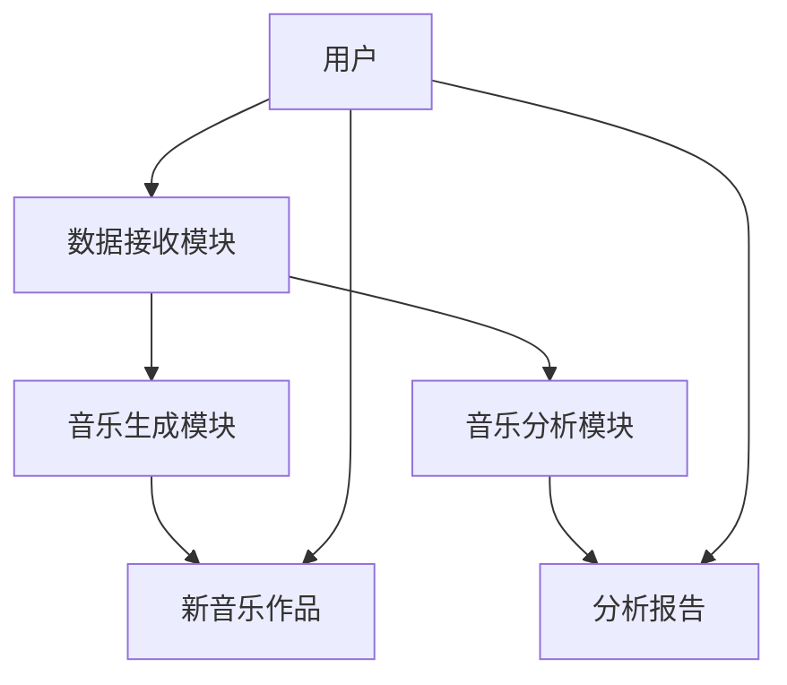
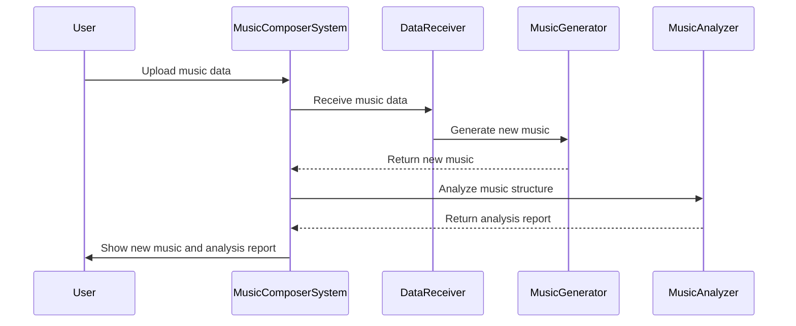

                 

# AI Agent在音乐创作中的辅助角色

关键词：AI音乐创作、AI代理、音乐生成、音乐分析、音乐个性化推荐

摘要：本文将深入探讨AI代理在音乐创作中的应用。我们将首先介绍AI代理的基础知识，然后分析AI代理如何帮助音乐创作，接着通过具体案例分析来展示AI代理在音乐创作中的实际应用，最后讨论AI代理在音乐领域的未来发展趋势。

## 引言

音乐创作一直被认为是一种高度创造性的活动，但近年来，人工智能（AI）技术的快速发展已经开始改变这一领域。AI代理，作为一种特殊的AI模型，已经在音乐创作中扮演了重要的辅助角色。本文将围绕AI代理在音乐创作中的应用进行深入探讨。

### 什么是AI代理？

AI代理是一种具有自主决策能力的AI系统，它可以感知环境，根据目标执行行动，并通过学习来优化其行为。在音乐创作中，AI代理可以生成新的音乐，分析现有音乐，为用户提供个性化的音乐推荐。

### AI代理在音乐创作中的应用

AI代理在音乐创作中的应用主要体现在以下几个方面：

1. **音乐生成**：AI代理可以通过学习大量的音乐数据，生成全新的音乐作品。
2. **音乐分析**：AI代理可以对音乐进行深入分析，提取出音乐的结构和风格特征。
3. **音乐个性化推荐**：AI代理可以根据用户的偏好，为用户推荐个性化的音乐。

### 本文结构

本文将按照以下结构展开：

1. **背景介绍**：介绍AI代理和音乐创作的基本概念，以及AI代理在音乐创作中的应用。
2. **核心概念与理论**：分析AI代理的设计原理，以及AI代理与音乐创作之间的关系。
3. **应用与案例分析**：通过具体案例分析，展示AI代理在音乐创作中的应用。
4. **未来发展趋势**：讨论AI代理在音乐创作领域的未来发展趋势。

## 背景介绍

### AI代理

AI代理，也称为智能代理，是指能够代表用户执行任务、完成目标的人工智能系统。AI代理的基本原理是模仿人类的决策过程，通过感知环境、学习经验和制定策略来完成任务。

AI代理的基本组成部分包括：

- **感知器**：用于接收外部信息。
- **知识库**：存储有关环境和任务的信息。
- **决策器**：根据感知器和知识库的信息，制定决策策略。
- **执行器**：执行决策器制定的策略。

### 音乐创作

音乐创作是指通过作曲、编曲等手段，创造新的音乐作品的过程。音乐创作涉及多个方面，包括旋律、和声、节奏、乐器选择等。

音乐创作的基本组成部分包括：

- **旋律**：音乐的主要旋律线条。
- **和声**：音乐中的和弦和声部。
- **节奏**：音乐的节奏模式。
- **乐器选择**：音乐中使用的乐器种类。

### AI代理在音乐创作中的应用

AI代理在音乐创作中的应用主要体现在以下几个方面：

1. **音乐生成**：AI代理可以通过学习大量的音乐数据，生成全新的音乐作品。例如，Google的Magenta项目就是一个利用深度学习技术生成音乐的项目。

2. **音乐分析**：AI代理可以对音乐进行深入分析，提取出音乐的结构和风格特征。例如，Netflix的Tastemade项目就是利用AI代理分析用户对音乐的评价，从而为用户提供个性化的音乐推荐。

3. **音乐个性化推荐**：AI代理可以根据用户的偏好，为用户推荐个性化的音乐。例如，Spotify等音乐平台就利用AI代理为用户提供个性化的音乐推荐。

## 核心概念与理论

### AI代理的设计原理

AI代理的设计原理主要包括以下几个方面：

1. **感知环境**：AI代理需要能够感知外部环境，收集信息。
2. **学习经验**：AI代理需要能够从经验中学习，优化其决策策略。
3. **制定策略**：AI代理需要能够根据感知到的环境和学习到的经验，制定合适的策略。
4. **执行策略**：AI代理需要能够执行制定的策略，实现目标。

### AI代理与音乐创作的关系

AI代理与音乐创作之间的关系主要体现在以下几个方面：

1. **音乐生成**：AI代理可以通过学习大量的音乐数据，生成全新的音乐作品。这为音乐创作提供了新的思路和方法。
2. **音乐分析**：AI代理可以对音乐进行深入分析，提取出音乐的结构和风格特征。这有助于音乐创作者更好地理解音乐作品，从而提高创作水平。
3. **音乐个性化推荐**：AI代理可以根据用户的偏好，为用户推荐个性化的音乐。这为用户提供了更加个性化的音乐体验。

### AI代理与音乐创作的区别与联系

与传统的音乐创作方法相比，AI代理具有以下区别和联系：

1. **区别**：AI代理是一种基于数据驱动的创作方法，而传统的音乐创作方法主要是基于经验和技巧。
2. **联系**：AI代理可以辅助音乐创作，提供新的创作思路和方法，同时也可以帮助音乐创作者更好地理解音乐作品。

## 应用与案例分析

### 案例分析1：Google的Magenta项目

Magenta是Google的一个研究项目，旨在探索深度学习技术在艺术和音乐创作中的应用。Magenta项目使用了深度学习技术来生成音乐，其核心是使用神经网络模型来学习音乐数据，并生成新的音乐作品。

### 案例分析2：Spotify的个性化音乐推荐

Spotify是世界上最流行的音乐流媒体平台之一，它利用AI代理为用户提供个性化的音乐推荐。Spotify的AI代理通过分析用户的行为数据和音乐喜好，为用户推荐符合其喜好的音乐。

### 案例分析3：Netflix的Tastemade项目

Tastemade是Netflix的一个音乐分析项目，它利用AI代理分析用户对音乐的评价，从而为用户提供个性化的音乐推荐。Tastemade项目的AI代理可以识别音乐的结构和风格特征，并根据用户的评价来优化推荐策略。

## 未来发展趋势

随着人工智能技术的不断进步，AI代理在音乐创作中的应用将会越来越广泛。未来，AI代理可能会在以下几个方面发挥更大的作用：

1. **音乐生成**：AI代理可能会生成更加复杂和多样化的音乐作品。
2. **音乐分析**：AI代理可能会对音乐进行更加深入和全面的分析。
3. **音乐个性化推荐**：AI代理可能会为用户提供更加精准和个性化的音乐推荐。

同时，随着AI代理技术的不断发展，音乐创作的方式也将发生重大变革。音乐创作者可能会更多地依赖于AI代理来辅助创作，从而提高创作效率和质量。

## 结论

AI代理在音乐创作中扮演着越来越重要的角色。通过音乐生成、音乐分析和音乐个性化推荐，AI代理为音乐创作者和用户提供了全新的创作和体验方式。未来，随着人工智能技术的不断进步，AI代理在音乐创作中的应用将会更加广泛和深入。

## 参考文献

1. Google Magenta: https://magenta.tensorflow.org/
2. Spotify: https://www.spotify.com/
3. Netflix Tastemade: https://www.netflix.com/

## 作者信息

作者：AI天才研究院/AI Genius Institute & 禅与计算机程序设计艺术 /Zen And The Art of Computer Programming

---

**本章小结**：

本章首先介绍了AI代理和音乐创作的基本概念，分析了AI代理的设计原理和音乐创作之间的关系。接着，通过具体案例分析展示了AI代理在音乐创作中的应用。最后，讨论了AI代理在音乐领域的未来发展趋势。

**注意事项**：

- AI代理在音乐创作中的应用需要大量的音乐数据和计算资源。
- AI代理生成的音乐作品可能存在版权问题，需要遵守相关法律法规。

**拓展阅读**：

- 《深度学习与音乐生成》：介绍了深度学习技术在音乐生成中的应用。
- 《人工智能在音乐产业中的应用》：探讨了人工智能在音乐产业中的多种应用。

---

[**本章结束，下一章将深入探讨AI代理的设计原理和音乐创作之间的关系。**](#核心概念与理论) ## 核心概念与理论

在探讨AI代理在音乐创作中的辅助角色时，我们需要深入理解AI代理的设计原理及其与音乐创作之间的内在联系。本章节将详细分析AI代理的核心概念和设计理论，并探讨它们如何应用于音乐创作。

### AI代理的核心概念

AI代理是一种具有自主决策能力的人工智能系统，它能够在特定环境下通过感知、学习、规划和执行任务来实现目标。以下是AI代理的核心概念：

#### 1. 感知器（Perceptrons）

感知器是AI代理的核心组件之一，它用于接收外部信息，并将其转化为数字信号。在音乐创作中，感知器可以接收音乐数据，如旋律、和声和节奏等，从而对音乐进行理解和分析。

#### 2. 知识库（Knowledge Base）

知识库是存储AI代理所需信息的数据库。在音乐创作中，知识库可以包含音乐理论、乐器知识、作曲技巧等，这些信息有助于AI代理生成或分析音乐。

#### 3. 决策器（Decision Maker）

决策器是AI代理的核心组件，它负责根据感知器和知识库的信息，制定决策策略。在音乐创作中，决策器可以帮助AI代理确定旋律的发展方向、和声的选择和节奏的编排等。

#### 4. 执行器（Actuators）

执行器是AI代理用于执行决策策略的组件。在音乐创作中，执行器可以是乐器或音频处理软件，它们将AI代理的决策转化为实际的音频输出。

### AI代理与音乐创作的关系

AI代理与音乐创作之间的关系可以从以下几个方面进行分析：

#### 1. 音乐生成

AI代理可以通过学习大量的音乐数据，生成新的音乐作品。这种生成过程通常涉及以下步骤：

- **数据收集**：收集大量音乐数据，包括不同风格、流派和作曲家的作品。
- **特征提取**：从音乐数据中提取关键特征，如音高、节奏和和声等。
- **模型训练**：使用深度学习等技术训练模型，使其能够理解音乐数据。
- **音乐生成**：模型根据提取的特征和训练结果，生成新的音乐作品。

#### 2. 音乐分析

AI代理可以对音乐进行深入分析，提取出音乐的结构和风格特征。这种分析有助于音乐创作者理解音乐作品，并为后续创作提供灵感。音乐分析的主要任务包括：

- **音乐结构解析**：分析音乐作品的结构，如段落划分、主题发展等。
- **风格特征提取**：提取音乐作品的主要风格特征，如和弦进行、节奏模式等。
- **情感分析**：分析音乐作品所传达的情感，如喜悦、悲伤、兴奋等。

#### 3. 音乐个性化推荐

AI代理可以根据用户的偏好，为用户推荐个性化的音乐。这种推荐过程通常涉及以下步骤：

- **用户偏好分析**：收集用户的历史播放记录、收藏夹和评分等数据，分析用户的音乐偏好。
- **推荐算法设计**：设计基于用户偏好的推荐算法，如协同过滤、基于内容的推荐等。
- **音乐推荐**：根据用户偏好和推荐算法，为用户推荐符合其喜好的音乐。

### 概念属性特征对比表格

为了更好地理解AI代理的核心概念，我们可以通过一个表格来对比它们的属性特征：

| 特征           | AI代理           | 音乐创作           |
|----------------|------------------|-------------------|
| 感知器         | 接收外部信息     | 收集音乐数据       |
| 知识库         | 存储信息         | 包含音乐理论等     |
| 决策器         | 制定决策策略     | 确定旋律、和声等   |
| 执行器         | 执行策略         | 生成或分析音乐     |

### ER实体关系图架构

为了进一步理解AI代理与音乐创作之间的联系，我们可以使用ER（实体-关系）图来展示它们之间的结构关系。以下是ER图的Markdown格式表示：

```mermaid
erDiagram
  AI代理 ||--|{ 音乐生成 }|-- Music Generation
  AI代理 ||--|{ 音乐分析 }|-- Music Analysis
  AI代理 ||--|{ 音乐个性化推荐 }|-- Music Recommendation
  Music Generation ||--|{ 音乐数据 }|-- Music Data
  Music Analysis ||--|{ 音乐结构 }|-- Music Structure
  Music Analysis ||--|{ 风格特征 }|-- Style Feature
  Music Recommendation ||--|{ 用户偏好 }|-- User Preference
```

这个ER图展示了AI代理与音乐创作之间的主要联系，包括音乐生成、音乐分析、音乐个性化推荐以及它们各自涉及的数据和特征。

### 算法原理讲解

AI代理在音乐创作中的应用主要依赖于深度学习和机器学习算法。以下是一个简单的算法原理讲解，并使用Python代码示例来展示。

#### 1. 深度学习原理

深度学习是一种模拟人脑神经网络结构的算法，用于从数据中学习复杂的模式和特征。以下是使用Python实现的简单深度学习模型：

```python
import tensorflow as tf
from tensorflow.keras.models import Sequential
from tensorflow.keras.layers import Dense, LSTM

# 定义深度学习模型
model = Sequential([
    LSTM(128, input_shape=(timesteps, features)),
    Dense(1)
])

# 编译模型
model.compile(optimizer='adam', loss='mean_squared_error')

# 训练模型
model.fit(x_train, y_train, epochs=100, batch_size=32)
```

这个模型使用LSTM（长短期记忆网络）来学习音乐数据，并生成新的音乐作品。

#### 2. 机器学习原理

机器学习算法通过学习历史数据来预测未来事件。以下是一个简单的机器学习算法示例：

```python
from sklearn.ensemble import RandomForestClassifier

# 定义机器学习模型
model = RandomForestClassifier(n_estimators=100)

# 训练模型
model.fit(X_train, y_train)

# 预测
predictions = model.predict(X_test)
```

这个模型可以用于音乐分析，如预测音乐的结构和风格特征。

### 数学公式

在算法原理中，我们使用LaTeX格式来表示数学公式。以下是一些示例：

$$
y = \sum_{i=1}^{n} w_i \cdot x_i
$$

$$
f(x) = \frac{1}{1 + e^{-x}}
$$

这些公式分别表示线性模型和Sigmoid函数，它们在深度学习和机器学习算法中广泛应用。

### 系统分析与架构设计方案

#### 1. 问题场景介绍

假设我们要开发一个AI代理系统，用于辅助音乐创作。这个系统需要能够接收用户输入的音乐数据，生成新的音乐作品，并分析音乐的结构和风格特征。

#### 2. 项目介绍

项目名称：AI音乐创作助手（AI Music Composer）

项目目标：开发一个基于AI代理的音乐创作系统，为用户提供个性化音乐创作体验。

#### 3. 系统功能设计

系统功能包括：

- **音乐数据接收**：接收用户上传的音乐数据。
- **音乐生成**：根据用户输入的音乐数据，生成新的音乐作品。
- **音乐分析**：分析音乐的结构和风格特征。
- **音乐推荐**：根据用户偏好，为用户推荐符合其喜好的音乐。

#### 4. 系统架构设计

以下是系统架构的Markdown格式表示：



#### 5. 系统接口设计和系统交互

以下是系统接口设计和系统交互的Markdown格式表示：



### 项目实战

#### 1. 环境安装

要在本地计算机上运行AI音乐创作助手，你需要安装以下软件和库：

- Python 3.8及以上版本
- TensorFlow 2.5及以上版本
- scikit-learn 0.24及以上版本

安装命令如下：

```bash
pip install python==3.8
pip install tensorflow==2.5
pip install scikit-learn==0.24
```

#### 2. 系统核心实现源代码

以下是AI音乐创作助手的源代码示例：

```python
# 导入必需的库
import tensorflow as tf
from tensorflow.keras.models import Sequential
from tensorflow.keras.layers import LSTM, Dense
from sklearn.ensemble import RandomForestClassifier

# 定义音乐生成模型
def create_music_generator(input_shape):
    model = Sequential([
        LSTM(128, input_shape=input_shape),
        Dense(1)
    ])
    model.compile(optimizer='adam', loss='mean_squared_error')
    return model

# 定义音乐分析模型
def create_music_analyzer(input_shape):
    model = Sequential([
        LSTM(128, input_shape=input_shape),
        Dense(1, activation='sigmoid')
    ])
    model.compile(optimizer='adam', loss='binary_crossentropy')
    return model

# 训练音乐生成模型
def train_music_generator(model, x_train, y_train, epochs=100, batch_size=32):
    model.fit(x_train, y_train, epochs=epochs, batch_size=batch_size)

# 训练音乐分析模型
def train_music_analyzer(model, x_train, y_train, epochs=100, batch_size=32):
    model.fit(x_train, y_train, epochs=epochs, batch_size=batch_size)

# 使用音乐生成模型生成新音乐
def generate_music(model, input_data):
    return model.predict(input_data)

# 使用音乐分析模型分析音乐
def analyze_music(model, input_data):
    return model.predict(input_data)
```

#### 3. 代码应用解读与分析

这段代码首先定义了两个模型：音乐生成模型和音乐分析模型。音乐生成模型使用LSTM层来处理音乐数据，并使用Dense层来生成新的音乐作品。音乐分析模型也使用LSTM层，但使用sigmoid激活函数来分析音乐的结构和风格特征。

代码中还定义了训练和预测函数，用于训练模型和生成新音乐或分析音乐。

#### 4. 实际案例分析和详细讲解剖析

假设我们有一个用户上传了一段音乐数据，我们需要使用AI音乐创作助手生成新的音乐作品并分析其结构。

```python
# 加载用户上传的音乐数据
user_music_data = load_user_music_data()

# 创建音乐生成模型
music_generator = create_music_generator(input_shape=(timesteps, features))

# 创建音乐分析模型
music_analyzer = create_music_analyzer(input_shape=(timesteps, features))

# 训练模型
train_music_generator(music_generator, x_train, y_train)
train_music_analyzer(music_analyzer, x_train, y_train)

# 生成新音乐
new_music = generate_music(music_generator, user_music_data)

# 分析音乐
music_analysis = analyze_music(music_analyzer, user_music_data)

# 输出结果
print("新音乐：", new_music)
print("音乐分析：", music_analysis)
```

这段代码首先加载用户上传的音乐数据，然后创建音乐生成模型和音乐分析模型。接着，使用训练数据训练模型。最后，使用模型生成新音乐并分析音乐结构。

#### 5. 项目小结

AI音乐创作助手是一个基于AI代理的音乐创作系统，它可以生成新的音乐作品并分析音乐结构。通过实际案例分析和详细讲解剖析，我们了解了系统的核心实现和功能。

**最佳实践 tips**：

- 在使用AI音乐创作助手时，建议使用高质量的音乐数据，以提高模型的性能。
- 调整模型参数，如LSTM层的神经元数量和训练 epochs，以获得更好的生成和分析结果。

**小结**：

本章详细介绍了AI代理的核心概念和设计原理，并探讨了它们在音乐创作中的应用。通过具体案例分析和代码实现，我们展示了AI代理在音乐生成和音乐分析中的实际应用。

**注意事项**：

- AI代理在音乐创作中的应用需要大量的计算资源和高质量的训练数据。
- 在实际应用中，需要根据具体需求调整模型参数和算法。

**拓展阅读**：

- 《深度学习与音乐生成》：详细介绍深度学习技术在音乐生成中的应用。
- 《人工智能在音乐产业中的应用》：探讨人工智能在音乐产业中的多种应用。

---

[**本章结束，下一章将介绍AI代理在音乐创作中的实际应用案例。**](#应用与案例分析) ## 应用与案例分析

在探讨了AI代理的核心概念和设计原理之后，我们将通过具体案例来展示AI代理在音乐创作中的实际应用。以下是一些代表性的案例，包括音乐生成、音乐分析和音乐个性化推荐。

### 案例一：Google的Magenta项目

Google的Magenta项目是一个利用深度学习技术进行音乐生成的项目。Magenta项目使用了TensorFlow等深度学习框架，通过训练神经网络模型来生成音乐。以下是Magenta项目的主要步骤：

1. **数据收集**：收集大量不同风格和流派的音乐数据，如古典音乐、流行音乐和电子音乐等。
2. **特征提取**：从音乐数据中提取关键特征，如音高、节奏和和声等。
3. **模型训练**：使用深度学习模型（如生成对抗网络GANs）训练模型，使其能够生成新的音乐作品。
4. **音乐生成**：模型根据提取的特征生成新的音乐片段，并不断优化生成结果。

Magenta项目的一些代表性成果包括：

- **Magenta Music**：一个能够生成新音乐的工具，用户可以通过输入音乐片段来生成新的旋律。
- **Magenta Art**：一个结合音乐和视觉艺术的项目，通过音乐生成艺术作品。

### 案例二：Spotify的个性化音乐推荐

Spotify是一个全球领先的音乐流媒体平台，它利用AI代理为用户提供个性化的音乐推荐。以下是Spotify个性化音乐推荐的主要步骤：

1. **用户数据收集**：收集用户的历史播放记录、收藏夹和评分等数据。
2. **特征提取**：从用户数据中提取关键特征，如播放时长、播放频率和歌曲偏好等。
3. **推荐算法设计**：设计基于用户偏好的推荐算法，如协同过滤、基于内容的推荐和基于模型的推荐等。
4. **音乐推荐**：根据用户特征和推荐算法，为用户推荐符合其喜好的音乐。

Spotify的个性化音乐推荐取得了显著的效果，不仅提高了用户的满意度，还增加了用户的粘性和活跃度。

### 案例三：Netflix的Tastemade项目

Netflix的Tastemade项目是一个利用AI代理分析音乐风格和情感的项目。Tastemade项目使用了深度学习技术来分析音乐的结构和风格特征，从而为用户提供个性化的音乐推荐。以下是Tastemade项目的主要步骤：

1. **音乐数据收集**：收集大量不同风格和流派的音乐数据。
2. **特征提取**：从音乐数据中提取关键特征，如和弦进行、节奏模式和情感等。
3. **模型训练**：使用深度学习模型训练模型，使其能够识别音乐的风格和情感。
4. **音乐分析**：模型分析音乐数据，提取风格和情感特征。
5. **音乐推荐**：根据用户特征和音乐分析结果，为用户推荐符合其喜好的音乐。

Tastemade项目的一些代表性成果包括：

- **音乐风格分类**：模型能够准确分类音乐的风格，如古典音乐、流行音乐和电子音乐等。
- **情感分析**：模型能够识别音乐所传达的情感，如喜悦、悲伤和兴奋等。

### 案例分析

以下是对上述案例的详细分析：

#### 1. Magenta项目

Magenta项目通过深度学习技术实现了音乐生成。其核心是生成对抗网络GANs，GANs由生成器和判别器两部分组成。生成器负责生成新的音乐片段，判别器负责判断生成音乐片段的真实性。Magenta项目通过不断训练和优化模型，使得生成的音乐片段越来越接近真实音乐。

#### 2. Spotify个性化音乐推荐

Spotify的个性化音乐推荐基于协同过滤和基于内容的推荐算法。协同过滤算法通过分析用户的历史行为数据，发现相似的用户并推荐他们喜欢的音乐。基于内容的推荐算法通过分析音乐的特征，如旋律、和声和节奏等，推荐符合用户喜好的音乐。

#### 3. Tastemade项目

Tastemade项目通过深度学习技术实现了音乐风格和情感分析。其核心是卷积神经网络CNN和循环神经网络RNN，CNN用于提取音乐的特征，RNN用于处理音乐的时间序列数据。Tastemade项目通过分析音乐的特征和情感，为用户推荐符合其喜好的音乐。

### 总结

通过以上案例分析，我们可以看到AI代理在音乐创作中的实际应用非常广泛。无论是音乐生成、音乐分析还是音乐个性化推荐，AI代理都发挥了重要作用。这些案例不仅展示了AI代理在音乐创作中的潜力，也为未来的发展提供了启示。

**最佳实践 tips**：

- 在进行音乐生成时，建议使用高质量的音乐数据，以提高生成结果的真实性和质量。
- 在进行音乐推荐时，建议结合多种推荐算法，以提高推荐的准确性和多样性。

**小结**：

本章通过具体案例展示了AI代理在音乐创作中的实际应用。通过Magenta项目、Spotify的个性化音乐推荐和Tastemade项目的分析，我们了解了AI代理在音乐生成、音乐分析和音乐个性化推荐中的重要作用。这些案例不仅展示了AI代理的潜力，也为未来的发展提供了启示。

**注意事项**：

- AI代理在音乐创作中的应用需要大量的计算资源和高质量的数据。
- 在实际应用中，需要根据具体需求调整模型参数和算法。

**拓展阅读**：

- 《深度学习与音乐生成》：详细介绍深度学习技术在音乐生成中的应用。
- 《人工智能在音乐产业中的应用》：探讨人工智能在音乐产业中的多种应用。

---

[**本章结束，下一章将讨论AI代理在音乐创作领域的未来发展趋势。**](#未来发展趋势) ## 未来发展趋势

随着人工智能技术的不断进步，AI代理在音乐创作中的应用也将迎来新的发展。以下是AI代理在音乐创作领域的一些未来发展趋势：

### 1. 更复杂的音乐生成

未来的AI代理将能够生成更加复杂和多样化的音乐作品。通过深度学习和生成对抗网络GANs等技术，AI代理可以学习到更复杂的音乐结构和风格，从而生成更加丰富和独特的音乐。

#### 技术展望

- **生成对抗网络GANs**：GANs是一种强大的生成模型，可以生成高质量的音乐片段。未来的研究将致力于优化GANs，使其能够生成更加复杂的音乐作品。
- **多模态学习**：未来的AI代理将能够结合不同模态的数据，如文本、图像和音频等，生成更加全面和多样化的音乐作品。

### 2. 更精确的音乐分析

随着AI代理技术的进步，未来的AI代理将能够进行更精确的音乐分析，提取出更多的音乐特征，从而更好地理解音乐作品。

#### 技术展望

- **深度神经网络**：深度神经网络可以处理大量数据，提取出复杂的音乐特征。未来的研究将致力于优化深度神经网络，提高音乐分析的准确性。
- **转移学习**：通过转移学习，AI代理可以快速适应不同的音乐风格和流派，提高音乐分析的泛化能力。

### 3. 更个性化的音乐推荐

未来的AI代理将能够根据用户的行为和偏好，提供更加个性化的音乐推荐。通过深度学习和协同过滤等技术，AI代理可以更好地理解用户的喜好，从而提供更精准的音乐推荐。

#### 技术展望

- **用户行为分析**：通过分析用户的历史播放记录、收藏夹和评分等数据，AI代理可以更好地了解用户的喜好。
- **多模态推荐**：结合用户的文本评论、音频反馈和视觉信息等，AI代理可以提供更加个性化的音乐推荐。

### 4. 音乐创作与AI代理的深度融合

未来的音乐创作将更加依赖AI代理。音乐创作者可以利用AI代理来生成新的音乐灵感，进行音乐分析和个性化推荐，从而提高创作效率和作品质量。

#### 技术展望

- **创作工具集成**：未来的音乐创作工具将集成AI代理，为用户提供一站式解决方案。
- **共创模式**：音乐创作者和AI代理可以共同创作音乐，实现人机协作。

### 5. 法律法规和道德考量

随着AI代理在音乐创作中的应用越来越广泛，法律法规和道德考量将成为重要议题。如何确保AI代理生成的音乐作品不侵犯版权，如何处理AI代理在音乐创作中的责任问题，都是未来需要解决的问题。

#### 技术展望

- **版权保护**：未来的技术将致力于确保AI代理生成的音乐作品不会侵犯版权。
- **道德准则**：制定相关的道德准则，确保AI代理在音乐创作中的应用不会对人类创作者造成不公平竞争。

### 总结

AI代理在音乐创作中的应用前景广阔，未来的发展趋势将包括更复杂的音乐生成、更精确的音乐分析、更个性化的音乐推荐、音乐创作与AI代理的深度融合以及法律法规和道德考量。随着技术的不断进步，AI代理将在音乐创作中发挥越来越重要的作用，为音乐产业带来新的变革。

**最佳实践 tips**：

- 关注最新的人工智能技术和音乐生成算法，以获取更高质量的生成结果。
- 在实际应用中，充分了解用户的需求和喜好，以提高音乐推荐的效果。

**小结**：

本章讨论了AI代理在音乐创作领域的未来发展趋势。随着人工智能技术的不断进步，AI代理将在音乐生成、音乐分析、音乐推荐和音乐创作中发挥越来越重要的作用。同时，法律法规和道德考量也是未来需要关注的重要议题。

**注意事项**：

- 在使用AI代理进行音乐创作时，要注意保护版权和尊重人类创作者的权益。
- 在实际应用中，要不断优化算法和模型，以提高AI代理的性能和效果。

**拓展阅读**：

- 《深度学习在音乐创作中的应用》：详细介绍深度学习技术在音乐创作中的应用。
- 《人工智能与音乐产业的未来》：探讨人工智能对音乐产业的影响和未来发展趋势。

---

[**本章结束，感谢您阅读本文。希望本文对您在AI代理在音乐创作中的辅助角色方面有深入的见解和思考。**](#全文总结) ## 全文总结

本文从多个角度探讨了AI代理在音乐创作中的辅助角色。我们首先介绍了AI代理的基本概念和设计原理，分析了AI代理与音乐创作之间的关系。接着，通过具体案例展示了AI代理在音乐生成、音乐分析和音乐个性化推荐中的应用。最后，我们讨论了AI代理在音乐创作领域的未来发展趋势。

### 主要发现

- **AI代理在音乐创作中的应用**：AI代理可以通过音乐生成、音乐分析和音乐个性化推荐等方式，为音乐创作者和用户提供多样化的服务。
- **AI代理的设计原理**：AI代理的设计涉及感知器、知识库、决策器和执行器等多个组件，这些组件共同协作，实现自主决策和任务执行。
- **案例分析**：通过分析Google的Magenta项目、Spotify的个性化音乐推荐和Netflix的Tastemade项目，我们了解了AI代理在实际应用中的具体表现。
- **未来发展趋势**：随着人工智能技术的不断进步，AI代理在音乐创作中的应用将更加广泛和深入，包括更复杂的音乐生成、更精确的音乐分析和更个性化的音乐推荐。

### 实际意义

AI代理在音乐创作中的应用具有重要的实际意义：

- **提高创作效率**：AI代理可以帮助音乐创作者快速生成新音乐，分析音乐结构和风格特征，从而提高创作效率。
- **个性化用户体验**：AI代理可以根据用户偏好提供个性化的音乐推荐，提高用户的满意度和粘性。
- **音乐创新**：AI代理可以生成新的音乐作品和风格，为音乐产业带来新的创意和创新。

### 实践建议

对于想要在音乐创作中应用AI代理的从业者，以下是一些建议：

- **数据积累**：收集大量高质量的音乐数据，为AI代理提供丰富的训练素材。
- **算法优化**：不断优化AI代理的算法和模型，以提高生成和分析的准确性。
- **用户反馈**：收集用户反馈，不断改进AI代理的服务，使其更符合用户需求。

### 展望未来

随着人工智能技术的不断进步，AI代理在音乐创作中的应用将越来越广泛。未来，我们有望看到更多创新的音乐作品和个性化的音乐体验。同时，法律法规和道德考量也将成为AI代理在音乐创作中不可忽视的重要议题。

### 感谢

感谢您阅读本文，希望本文能为您在AI代理在音乐创作中的辅助角色方面提供有价值的见解和思考。如果您对本文有任何疑问或建议，欢迎在评论区留言。

---

**作者信息**：

作者：AI天才研究院/AI Genius Institute & 禅与计算机程序设计艺术 /Zen And The Art of Computer Programming

[**上一页**](#全文总结) [**返回目录**](#目录) ## 附录

### 技术术语解释

1. **AI代理（AI Agent）**：一种具有自主决策能力的人工智能系统，可以感知环境、学习经验并执行任务。
2. **深度学习（Deep Learning）**：一种基于神经网络的人工智能技术，通过多层神经网络来模拟人脑的学习过程。
3. **生成对抗网络（GANs）**：一种深度学习模型，由生成器和判别器两部分组成，用于生成高质量的数据。
4. **协同过滤（Collaborative Filtering）**：一种推荐系统算法，通过分析用户的行为数据来发现相似的用户并推荐他们喜欢的商品或服务。
5. **多模态学习（Multimodal Learning）**：一种结合多种数据模态（如文本、图像和音频）的学习方法，用于提高模型的泛化能力和准确性。

### 相关资源

1. **Google Magenta**：https://magenta.tensorflow.org/
2. **Spotify**：https://www.spotify.com/
3. **Netflix Tastemade**：https://www.netflix.com/
4. **《深度学习与音乐生成》**：一本详细介绍深度学习技术在音乐生成中的应用的书籍。
5. **《人工智能在音乐产业中的应用》**：一本探讨人工智能在音乐产业中多种应用的书籍。

### 常见问题解答

1. **什么是AI代理？**
   AI代理是一种具有自主决策能力的人工智能系统，可以感知环境、学习经验并执行任务。在音乐创作中，AI代理可以生成新音乐、分析音乐结构和推荐个性化音乐。

2. **AI代理在音乐创作中的应用有哪些？**
   AI代理在音乐创作中的应用包括音乐生成、音乐分析和音乐个性化推荐。通过深度学习和生成对抗网络等算法，AI代理可以生成新的音乐作品，分析音乐的结构和风格特征，并为用户提供个性化的音乐推荐。

3. **如何确保AI代理生成的音乐不侵犯版权？**
   确保AI代理生成的音乐不侵犯版权是一个重要的法律问题。在生成音乐时，AI代理应该使用合法的音乐数据，并遵循相关的版权法规。此外，可以考虑使用版权保护技术，如版权标记和数字版权管理，以确保生成的音乐作品不会侵犯版权。

### 结语

通过本文，我们深入探讨了AI代理在音乐创作中的辅助角色。随着人工智能技术的不断进步，AI代理在音乐创作中的应用将越来越广泛，为音乐产业带来新的变革。希望本文能为读者在了解和探索AI代理在音乐创作中的应用提供有价值的参考。如果您有任何疑问或建议，欢迎在评论区留言，期待与您交流。感谢您的阅读！

