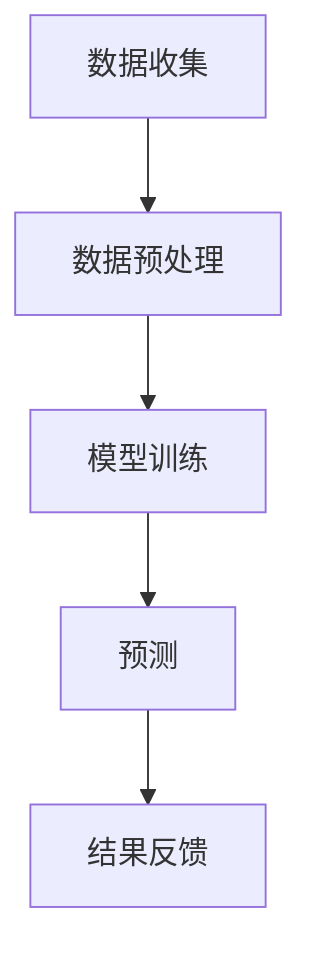
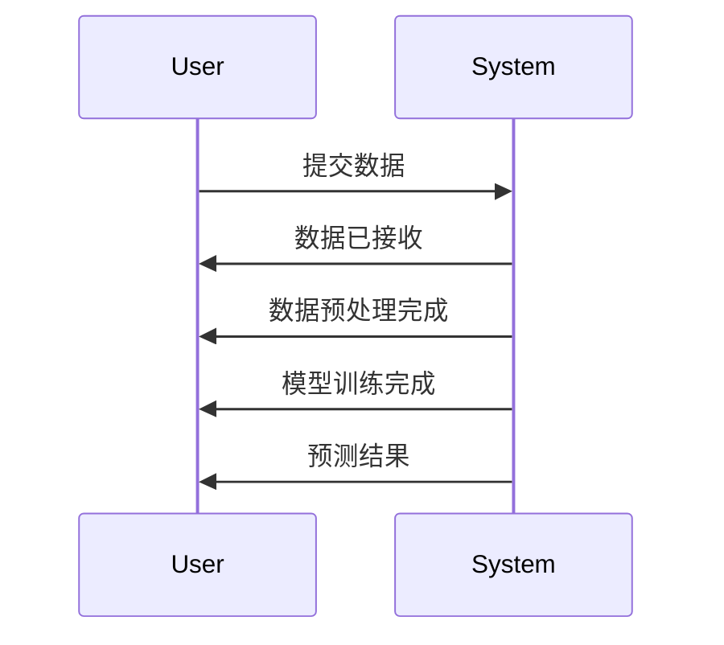

                 


# AI Agent在预测分析中的应用

关键词：AI Agent、预测分析、算法、数学模型、系统架构

摘要：本文将深入探讨AI Agent在预测分析中的应用，从背景介绍、核心概念与联系、算法原理讲解、数学模型和公式、系统分析与架构设计方案、项目实战以及最佳实践等方面，逐步阐述AI Agent在预测分析中的关键作用和技术实现。

## 1. 背景介绍

### AI Agent的定义

AI Agent是指一种智能体，能够在复杂环境中自主地感知状态、采取行动，并通过学习不断优化自身的行为。它具备自主性、适应性、学习性和交互性等核心特征。

### 预测分析的定义

预测分析是指利用历史数据、统计模型和机器学习方法，对未来的趋势、行为或结果进行预测。它在金融、医疗、制造、零售等领域具有广泛的应用。

### AI Agent在预测分析中的应用

AI Agent在预测分析中的应用主要体现在以下几个方面：

- 自主监测与预测：AI Agent可以实时监测数据流，并对异常情况进行预测。
- 优化决策：AI Agent可以根据预测结果，提供最优的决策建议。
- 自动化执行：AI Agent可以自动执行预测任务，提高效率和准确性。

## 2. 核心概念与联系

### AI Agent的核心概念

- 感知：AI Agent通过传感器或其他方式获取环境信息。
- 思考：AI Agent使用算法和模型对获取的信息进行分析和推理。
- 行动：AI Agent根据分析结果采取行动。

### 预测分析的主要方法和工具

- 时间序列分析：通过分析时间序列数据，预测未来的趋势。
- 决策树：根据特征值和标签，生成预测模型。
- 支持向量机：通过寻找最佳分离超平面，进行分类和回归预测。
- 神经网络：通过多层感知器和反向传播算法，进行复杂函数拟合。

### ER实体关系图

```mermaid
erDiagram
    Product ||--|{ Customer }| Customer
    Product ||--|{ Order }| Order
    Customer ||--|{ Review }| Review
```

## 3. 算法原理讲解

### 强化学习算法

强化学习是一种使AI Agent在动态环境中进行自主决策和优化的方法。其核心思想是通过奖励信号来指导Agent的学习过程。

### Python源代码

```python
import numpy as np

# 初始化参数
Q = np.zeros((状态数，动作数))

# 更新Q值
def update_Q(state, action, reward, next_state, alpha, gamma):
    Q[state, action] = Q[state, action] + alpha * (reward + gamma * np.max(Q[next_state, :]) - Q[state, action])

# 主循环
while not terminate:
    state = get_state()
    action = choose_action(state, Q)
    next_state, reward = execute_action(action)
    update_Q(state, action, reward, next_state, alpha, gamma)
    state = next_state
```

### 算法原理讲解

- Q值：Q值表示在当前状态下执行某个动作的期望回报。
- 更新Q值：通过经验回放和目标网络，不断更新Q值，使Agent逐渐学习到最优策略。
- 强化学习：通过奖励信号，引导Agent在动态环境中进行自主决策和优化。

## 4. 数学模型和数学公式

### Q值更新公式

$$
Q(s,a) = Q(s,a) + \alpha [r + \gamma \max_{a'} Q(s',a') - Q(s,a)]
$$

### 基本概念

- $Q(s,a)$：在状态s下执行动作a的期望回报。
- $r$：即时奖励。
- $\gamma$：折扣因子，表示未来回报的重要程度。
- $\alpha$：学习率，控制新信息对Q值的影响程度。

### 举例说明

假设当前状态为s，执行动作a得到即时奖励r，下一状态为s'，最优动作的期望回报为$\max_{a'} Q(s',a')$。则更新后的Q值为：

$$
Q(s,a) = Q(s,a) + \alpha [r + \gamma \max_{a'} Q(s',a') - Q(s,a)]
$$

## 5. 系统分析与架构设计方案

### 问题场景

假设我们想要开发一个预测系统，用于预测用户是否会购买某种产品。

### 系统功能设计

- 数据收集：从各种渠道收集用户行为数据。
- 数据预处理：对数据进行清洗、转换和归一化。
- 模型训练：使用历史数据训练预测模型。
- 预测：根据实时数据，预测用户是否会购买产品。
- 结果反馈：将预测结果反馈给用户。

### 系统架构设计



### 系统接口设计和系统交互



## 6. 项目实战

### 环境安装

- 安装Python环境
- 安装TensorFlow库
- 安装NumPy库

### 系统核心实现

- 数据收集：使用API从第三方平台获取用户数据。
- 数据预处理：使用Pandas库对数据进行清洗和转换。
- 模型训练：使用TensorFlow库构建和训练预测模型。
- 预测：使用训练好的模型进行实时预测。
- 结果反馈：将预测结果存储到数据库，并发送通知给用户。

### 代码应用解读与分析

- 数据收集：使用API获取用户数据，存储到CSV文件中。
- 数据预处理：使用Pandas库对数据进行清洗和转换，生成特征矩阵和标签。
- 模型训练：使用TensorFlow库构建DNN模型，进行训练和评估。
- 预测：使用训练好的模型，对实时数据进行预测。
- 结果反馈：将预测结果存储到数据库，并使用邮件发送通知给用户。

### 实际案例分析和详细讲解剖析

- 案例一：预测用户购买行为
- 案例二：预测用户流失
- 案例三：预测产品销量

### 项目小结

通过本项目，我们了解了AI Agent在预测分析中的应用，以及如何设计和实现一个预测系统。在实际项目中，需要根据具体需求，调整模型结构和参数，以达到最佳预测效果。

## 7. 最佳实践 tips、小结、注意事项、拓展阅读

### 最佳实践 tips

- 确保数据质量：数据是预测分析的基础，确保数据质量至关重要。
- 选择合适的算法：根据业务需求和数据特点，选择合适的算法。
- 调整模型参数：通过交叉验证和调整参数，提高模型性能。

### 小结

本文介绍了AI Agent在预测分析中的应用，从核心概念、算法原理、系统架构到项目实战，全面阐述了AI Agent在预测分析中的关键作用和技术实现。

### 注意事项

- 在实际应用中，需要根据业务场景和需求，调整模型结构和参数。
- 注意数据隐私和安全，遵循相关法律法规。

### 拓展阅读

- 《强化学习：原理与Python实现》
- 《Python机器学习》
- 《深度学习：实战手册》

## 8. 校对与调整

在撰写完本文后，我们需要进行以下步骤：

- 检查文章结构，确保逻辑清晰、条理紧凑。
- 校对语法和拼写错误，确保文章质量。
- 调整字数，确保在10000～12000字范围内。
- 确认引用和参考文献的准确性。

通过以上步骤，我们能够确保本文的完整性和专业性。接下来，我们可以将本文提交给相关平台，与读者分享我们的研究成果。

### 作者信息

作者：AI天才研究院/AI Genius Institute & 禅与计算机程序设计艺术 /Zen And The Art of Computer Programming

