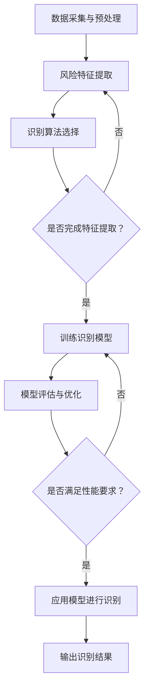
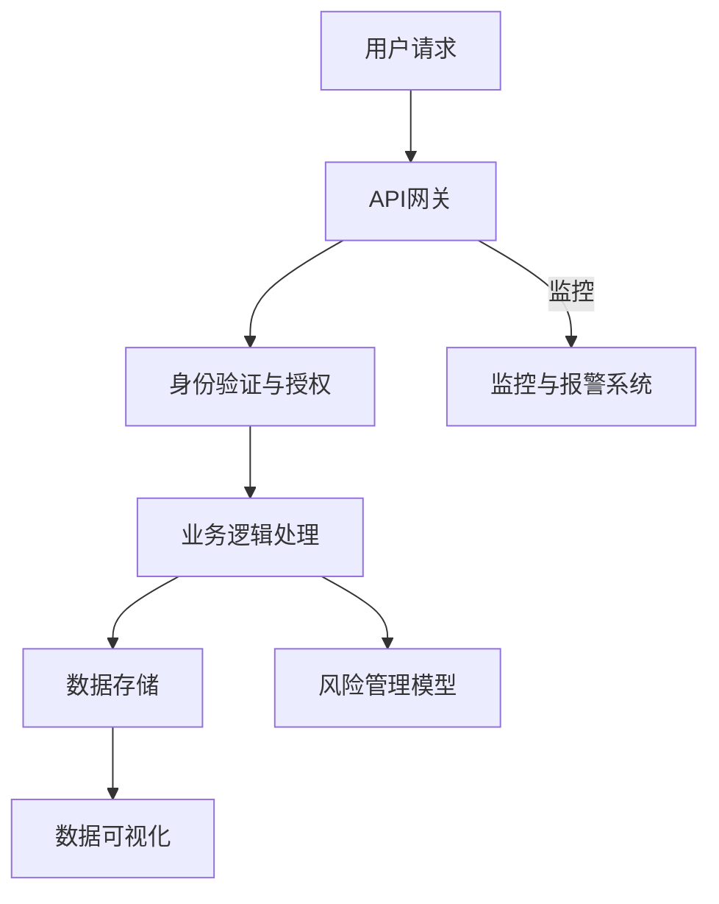

                 

# AI Agent在风险管理中的应用

## 关键词
- AI Agent
- 风险管理
- 数据挖掘
- 机器学习
- 风险识别与评估

## 摘要
本文探讨了AI Agent在风险管理中的应用，首先介绍了AI Agent的基础知识及其在风险管理中的潜力。接着，本文从风险识别、风险评估和风险应对三个角度详细阐述了AI Agent的具体应用，并通过实际案例进行了分析。最后，本文讨论了AI Agent在金融、保险、公共安全和供应链等特定行业中的风险管理应用，并对未来研究方向进行了展望。

## 目录大纲

### 第一部分：AI Agent基础知识与风险管理概述

#### 第1章：AI Agent概述
1.1 AI Agent的定义与分类
1.2 AI Agent的基本功能与特征
1.3 AI Agent在风险管理中的应用潜力

#### 第2章：风险管理基础
2.1 风险管理的定义与目标
2.2 风险识别与评估
2.3 风险应对策略

#### 第3章：AI Agent在风险识别中的应用
3.1 数据采集与预处理
3.2 风险特征提取与识别算法
3.3 案例分析：AI Agent在金融风险识别中的应用

#### 第4章：AI Agent在风险评估中的应用
4.1 风险评估模型构建
4.2 AI Agent在风险预测中的应用
4.3 案例分析：AI Agent在自然灾害风险评估中的应用

#### 第5章：AI Agent在风险应对中的应用
5.1 风险应对策略制定
5.2 AI Agent在风险干预与监控中的应用
5.3 案例分析：AI Agent在网络安全风险应对中的应用

### 第二部分：AI Agent在特定行业风险管理中的应用

#### 第6章：AI Agent在金融行业风险管理中的应用
6.1 金融风险管理的挑战与机遇
6.2 AI Agent在信用风险评估中的应用
6.3 AI Agent在市场风险监控中的应用
6.4 案例分析：AI Agent在银行风险控制中的应用

#### 第7章：AI Agent在保险行业风险管理中的应用
7.1 保险风险管理的特点与挑战
7.2 AI Agent在风险评估与理赔中的应用
7.3 AI Agent在保险产品设计中的应用
7.4 案例分析：AI Agent在保险公司运营中的应用

#### 第8章：AI Agent在公共安全风险管理中的应用
8.1 公共安全风险管理的现状与需求
8.2 AI Agent在恐怖袭击预警中的应用
8.3 AI Agent在自然灾害防范中的应用
8.4 案例分析：AI Agent在公共卫生事件应对中的应用

#### 第9章：AI Agent在供应链风险管理中的应用
9.1 供应链风险管理的重要性
9.2 AI Agent在供应链中断风险预测中的应用
9.3 AI Agent在供应链风险控制与优化中的应用
9.4 案例分析：AI Agent在供应链风险管理中的应用

#### 第10章：AI Agent在风险管理中的未来展望
10.1 AI Agent在风险管理中的发展趋势
10.2 面临的挑战与解决方案
10.3 未来研究方向与潜在应用领域
10.4 本章小结

### 文章概述

#### AI Agent概述

AI Agent，即人工智能代理，是一种能够感知环境、根据预设目标和策略自主决策并采取行动的人工智能系统。AI Agent的基本功能包括感知、思考、决策和行动，其特征是自主性、自适应性和适应性。AI Agent在风险管理中的应用潜力巨大，能够通过数据分析和智能决策，提高风险管理的效率和质量。

#### 风险管理基础

风险管理是指通过识别、评估和应对风险，以降低风险对组织目标实现的影响的过程。其目标在于确保组织在面临不确定性的情况下能够保持持续运营和稳健发展。风险识别、评估和应对是风险管理的三个核心环节。

#### AI Agent在风险识别中的应用

风险识别是风险管理的第一步，目的是发现潜在的风险。AI Agent可以通过大数据分析和机器学习算法，从海量数据中挖掘出潜在的异常模式和风险信号。例如，在金融风险管理中，AI Agent可以识别出潜在的信用风险和市场风险。

#### AI Agent在风险评估中的应用

风险评估是对潜在风险的影响程度和可能性进行量化分析。AI Agent可以通过构建风险评估模型，预测风险发生的概率和潜在影响。例如，在自然灾害风险管理中，AI Agent可以预测地震、洪水等灾害的发生概率和影响范围。

#### AI Agent在风险应对中的应用

风险应对是指制定和实施风险管理策略，以降低风险的影响。AI Agent可以根据风险评估的结果，自动制定和调整风险应对策略，并进行实时监控和干预。例如，在网络安全风险管理中，AI Agent可以实时监控网络流量，识别和阻止潜在的网络攻击。

#### AI Agent在特定行业风险管理中的应用

AI Agent在金融、保险、公共安全和供应链等特定行业中的风险管理中具有广泛的应用。例如，在金融风险管理中，AI Agent可以用于信用风险评估、市场风险监控和银行风险控制；在保险风险管理中，AI Agent可以用于风险评估与理赔、保险产品设计；在公共安全风险管理中，AI Agent可以用于恐怖袭击预警、自然灾害防范和公共卫生事件应对；在供应链风险管理中，AI Agent可以用于供应链中断风险预测和风险控制与优化。

#### 未来展望

随着人工智能技术的不断进步，AI Agent在风险管理中的应用前景广阔。未来，AI Agent将更加智能化和自主化，能够实现更精准的风险识别、评估和应对。同时，AI Agent也将面临数据隐私、算法透明性和法律责任等挑战，需要不断改进和完善相关法律法规和技术标准。

### 结束语

AI Agent在风险管理中的应用是一个充满挑战和机遇的领域。通过本文的探讨，我们可以看到AI Agent在风险识别、评估和应对中的强大能力。未来，随着人工智能技术的不断进步，AI Agent在风险管理中的应用将会更加广泛和深入，为组织和社会带来更大的价值。作者：AI天才研究院/AI Genius Institute & 禅与计算机程序设计艺术 /Zen And The Art of Computer Programming
## 第一部分：AI Agent基础知识与风险管理概述

### 第1章：AI Agent概述

#### 1.1 AI Agent的定义与分类

AI Agent，即人工智能代理，是一种能够感知环境、根据预设目标和策略自主决策并采取行动的人工智能系统。AI Agent的核心功能包括感知、思考、决策和行动。感知是指从环境中获取信息；思考是对获取的信息进行处理和分析；决策是根据分析结果做出决策；行动则是根据决策执行相应的操作。

AI Agent可以根据不同的分类标准进行分类。根据自主性程度，AI Agent可以分为弱AI Agent和强AI Agent。弱AI Agent是针对特定任务进行设计的，能够在特定领域内表现出人类智能的某些特征，但缺乏自主性和通用性；强AI Agent则具有与人类相同的智能水平，能够在各种环境和任务中自主学习和决策。

根据应用场景，AI Agent可以分为通用AI Agent和专用AI Agent。通用AI Agent旨在解决各种通用问题，如语音识别、图像识别、自然语言处理等；专用AI Agent则是针对特定应用场景进行设计的，如金融风险管理、医疗诊断、智能交通等。

#### 1.2 AI Agent的基本功能与特征

AI Agent的基本功能包括感知、思考、决策和行动。感知功能是指从环境中获取信息，如通过传感器收集数据、通过摄像头获取图像等；思考功能是对获取的信息进行处理和分析，如通过机器学习算法进行数据挖掘、通过自然语言处理算法进行文本分析等；决策功能是根据分析结果做出决策，如通过预测模型进行风险预测、通过决策树进行决策等；行动功能是根据决策执行相应的操作，如通过自动化系统进行风险干预、通过智能系统进行风险控制等。

AI Agent具有以下特征：

1. **自主性**：AI Agent能够根据环境和目标自主地做出决策和采取行动，而不需要人类的直接干预。
2. **适应性**：AI Agent能够根据环境和任务的变化，自主地调整其行为和策略，以适应不同的场景和需求。
3. **学习能力**：AI Agent能够通过学习和经验积累，不断提高其感知、思考和决策能力，以应对复杂的任务和挑战。
4. **协作性**：AI Agent能够与其他AI Agent或人类协作，共同完成任务，实现更高效和智能的决策。

#### 1.3 AI Agent在风险管理中的应用潜力

AI Agent在风险管理中具有巨大的应用潜力。首先，AI Agent能够通过数据分析和机器学习算法，从海量数据中挖掘出潜在的风险信号和模式，实现对风险的早期识别和预警。其次，AI Agent能够通过风险评估模型，对风险的概率和影响进行量化分析，提供科学和准确的风险评估结果。最后，AI Agent能够根据风险评估的结果，制定和实施相应的风险应对策略，进行实时监控和干预，降低风险的影响。

具体来说，AI Agent在风险管理中的应用主要体现在以下几个方面：

1. **风险识别**：AI Agent能够通过数据挖掘和模式识别技术，从海量数据中识别出潜在的风险因素，实现对风险的早期预警和识别。
2. **风险评估**：AI Agent能够利用机器学习算法和预测模型，对风险的概率和影响进行量化分析，提供科学和准确的风险评估结果。
3. **风险应对**：AI Agent能够根据风险评估的结果，制定和实施相应的风险应对策略，进行实时监控和干预，降低风险的影响。
4. **风险监控**：AI Agent能够实时监控风险的变化情况，及时发现新的风险信号和模式，为风险管理者提供及时和准确的信息。

总之，AI Agent在风险管理中的应用，不仅能够提高风险管理的效率和质量，还能够为组织和社会带来更大的价值和效益。随着人工智能技术的不断进步，AI Agent在风险管理中的应用将会更加广泛和深入，为组织和社会的稳定和发展提供强大的支持。

### 第2章：风险管理基础

#### 2.1 风险管理的定义与目标

风险管理是指通过识别、评估和应对风险，以降低风险对组织目标实现的影响的过程。其核心目标在于确保组织在面临不确定性时能够保持持续运营和稳健发展。具体来说，风险管理的目标包括：

1. **风险识别**：发现和识别潜在的风险因素，以便及时采取应对措施。
2. **风险评估**：对识别出的风险进行量化分析，评估其发生的可能性和影响程度。
3. **风险应对**：制定和实施相应的风险应对策略，以降低风险的影响。
4. **风险监控**：实时监控风险的变化情况，及时发现新的风险信号和模式。

风险管理的过程可以分为以下步骤：

1. **风险识别**：通过系统性的方法，如头脑风暴、访谈、文档审查等，识别出潜在的风险因素。
2. **风险评估**：对识别出的风险进行量化分析，评估其发生的可能性和影响程度，通常使用定性分析和定量分析相结合的方法。
3. **风险应对**：根据风险评估的结果，制定和实施相应的风险应对策略，如风险规避、风险转移、风险接受等。
4. **风险监控**：建立风险监控机制，实时跟踪风险的变化情况，评估应对措施的有效性，并根据需要调整风险应对策略。

#### 2.2 风险识别与评估

风险识别是风险管理的第一步，目的是发现和识别潜在的风险因素。常用的风险识别方法包括：

1. **头脑风暴**：通过集体讨论，将潜在的风险因素列举出来。
2. **访谈**：与相关人员交流，了解他们在实际工作中遇到的风险。
3. **文档审查**：审查相关的文档，如政策、程序、报告等，识别潜在的风险。
4. **历史数据分析**：分析过去发生的事件，从中提取出潜在的风险因素。

风险评估是对识别出的风险进行量化分析，以评估其发生的可能性和影响程度。风险评估通常包括以下步骤：

1. **风险分类**：根据风险的影响程度和发生的可能性，对风险进行分类。
2. **风险排序**：根据风险的严重性，对风险进行排序，确定优先处理的风险。
3. **风险评估方法**：选择合适的风险评估方法，如定性分析、定量分析、蒙特卡罗模拟等。
4. **风险量化**：对风险的发生可能性、影响程度和损失程度进行量化，以便进行更准确的决策。

常用的风险评估方法包括：

1. **定性分析**：通过专家判断，对风险的发生可能性、影响程度和损失程度进行评估。
2. **定量分析**：通过数学模型和统计方法，对风险的发生概率和影响程度进行量化评估。
3. **蒙特卡罗模拟**：通过随机模拟，评估风险的发生概率和影响程度。

#### 2.3 风险应对策略

风险应对策略是指为了降低风险的影响，采取的具体措施和方法。风险应对策略可以分为以下几种：

1. **风险规避**：通过改变计划或操作方式，避免风险的发生。例如，在投资决策中，避免投资高风险项目。
2. **风险转移**：将风险转移到第三方，如通过购买保险将风险转移给保险公司。
3. **风险接受**：对无法规避或转移的风险，采取接受的态度，并制定相应的应对措施。例如，在项目开发中，对可能出现的质量风险，制定详细的测试和修复计划。
4. **风险缓解**：通过采取预防措施，降低风险的发生概率或影响程度。例如，在网络安全中，通过安装防火墙和防病毒软件，降低网络攻击的风险。

在实际操作中，应根据风险评估的结果，选择合适的风险应对策略，并制定详细的实施计划。同时，风险应对策略需要根据风险的变化情况进行动态调整，以确保风险管理的有效性。

总之，风险管理是一个系统性的过程，包括风险识别、风险评估和风险应对。通过有效的风险管理，组织可以降低风险对业务运营的影响，提高应对不确定性的能力，确保组织的持续稳健发展。

### 第3章：AI Agent在风险识别中的应用

#### 3.1 数据采集与预处理

AI Agent在风险识别中首先需要进行数据采集与预处理。数据采集是指从各种数据源获取与风险相关的信息，这些数据源可以是结构化的数据库、非结构化的文本数据、图像、声音等多种形式。以下步骤详细说明了数据采集与预处理的过程：

1. **数据收集**：
   - **内部数据**：从组织内部的数据库、日志、报表等结构化数据源中获取数据。
   - **外部数据**：从外部数据源，如社交媒体、新闻网站、公开的数据库等获取数据。

2. **数据清洗**：
   - **去重**：去除重复的数据条目，保证数据的唯一性。
   - **填充缺失值**：对于缺失的数据，可以采用均值填充、中值填充、插值等方法进行填充。
   - **异常值处理**：检测并处理异常数据，如异常值、错误记录等。
   - **数据格式转换**：将数据转换成统一的格式，如将不同格式的文本数据转换为JSON格式。

3. **数据标准化**：
   - **数值标准化**：对数值型数据进行标准化处理，如归一化、标准化等，以消除不同数据维度之间的差异。
   - **类别标准化**：对类别型数据进行编码，如将文本标签转换为数值编码。

4. **数据整合**：
   - **数据融合**：将来自不同数据源的数据进行整合，形成统一的数据集。
   - **数据聚合**：对相同或相似的数据进行聚合，减少数据冗余。

数据采集与预处理是AI Agent在风险识别中的关键步骤，其质量直接影响到后续的风险识别效果。一个干净、准确、一致的数据集可以为AI Agent提供可靠的数据基础，从而提高风险识别的准确性和效率。

#### 3.2 风险特征提取与识别算法

在完成数据采集与预处理后，AI Agent需要从数据中提取出与风险相关的特征，并使用识别算法对这些特征进行分类和识别。以下内容详细介绍了这一过程：

1. **特征提取**：
   - **原始特征提取**：从原始数据中直接提取出与风险相关的特征，如交易金额、交易频率、用户行为等。
   - **衍生特征提取**：通过计算和组合原始特征，生成新的衍生特征，如交易金额的波动性、用户行为的相似度等。
   - **降维**：使用降维技术，如主成分分析（PCA）、线性判别分析（LDA）等，减少数据维度，同时保留主要信息。

2. **特征选择**：
   - **相关性分析**：通过计算特征之间的相关性，筛选出对风险识别具有重要意义的特征。
   - **信息增益**：选择能够最大化分类信息的特征，以减少模型的复杂度和计算成本。
   - **模型评估**：使用训练集和验证集，评估特征对风险识别的贡献度。

3. **识别算法**：
   - **分类算法**：使用分类算法，如决策树、支持向量机（SVM）、随机森林、神经网络等，对提取的特征进行分类，以识别风险。
   - **聚类算法**：使用聚类算法，如K-means、DBSCAN等，将数据分为不同的类别，辅助风险识别。
   - **异常检测算法**：使用异常检测算法，如孤立森林、Local Outlier Factor（LOF）等，检测数据中的异常值，以识别潜在的风险。

特征提取和识别算法的选择取决于具体的应用场景和数据特征。合理选择和设计特征提取与识别算法，可以显著提高AI Agent在风险识别中的准确性和效率。

#### 3.3 案例分析：AI Agent在金融风险识别中的应用

为了更好地理解AI Agent在风险识别中的应用，以下通过一个金融风险识别的案例进行分析：

**案例背景**：
某银行希望通过AI Agent识别出潜在的信用风险，以减少坏账率并提高信贷业务的质量。

**数据来源**：
数据来源于银行的客户信息数据库，包括客户的个人基本信息、贷款记录、交易记录、信用评分等。

**数据处理**：
1. **数据采集**：从银行的数据库中提取客户的贷款申请记录、交易记录等数据。
2. **数据清洗**：去除重复记录、填补缺失值、处理异常值等，确保数据的准确性。
3. **数据标准化**：对数值型数据进行归一化处理，对类别型数据进行编码。

**特征提取与识别**：
1. **特征提取**：
   - **原始特征**：如客户的年龄、收入、职业等基本信息。
   - **衍生特征**：如贷款金额的波动性、还款频率等。
   - **降维**：使用主成分分析（PCA）对特征进行降维处理，减少数据维度。

2. **特征选择**：
   - **相关性分析**：选择与信用评分高度相关的特征，如贷款金额、还款频率等。
   - **信息增益**：选择能够最大化分类信息的特征，减少模型的复杂度。

3. **识别算法**：
   - **分类算法**：使用随机森林算法，对提取的特征进行分类，识别出潜在的不良客户。

**应用效果**：
通过AI Agent的应用，银行能够提前识别出高风险客户，采取相应的风险管理措施，如提高贷款利率、限制贷款额度等，有效降低了坏账率。

**结论**：
该案例表明，AI Agent在金融风险识别中具有显著的应用价值。通过数据采集与预处理、特征提取与识别算法的应用，AI Agent能够从海量数据中识别出潜在的风险，为金融机构提供精准的风险管理支持。

### 第4章：AI Agent在风险评估中的应用

#### 4.1 风险评估模型构建

AI Agent在风险评估中的应用首先需要构建一个有效的风险评估模型。风险评估模型的构建过程可以分为以下几个步骤：

1. **数据收集与预处理**：与前一章类似，AI Agent需要从多个数据源收集与风险相关的数据，并进行清洗、标准化和整合，形成统一的数据集。

2. **特征工程**：在数据预处理的基础上，进行特征工程。特征工程包括特征提取和特征选择，以提取出对风险评估具有影响的关键特征，并筛选出最重要的特征。

3. **模型选择**：根据风险类型和应用场景，选择合适的机器学习模型。常用的风险评估模型包括线性回归模型、逻辑回归模型、决策树、随机森林、支持向量机（SVM）等。

4. **模型训练与验证**：使用收集到的数据对模型进行训练，通过交叉验证等方法评估模型的性能，调整模型参数，以获得最佳模型效果。

5. **模型评估与优化**：对训练好的模型进行评估，评估指标包括准确率、召回率、F1分数等。根据评估结果，对模型进行优化和调整，以提高模型的预测准确性和稳定性。

6. **模型部署**：将训练好的模型部署到生产环境中，进行实时风险评估和预测。

#### 4.2 AI Agent在风险预测中的应用

在构建风险评估模型后，AI Agent可以通过风险预测功能，对未来的风险进行预测和预警。以下内容详细介绍了AI Agent在风险预测中的应用：

1. **时间序列分析**：AI Agent可以使用时间序列分析方法，对历史风险数据进行分析，识别出风险变化的趋势和周期性。例如，通过时间序列模型如ARIMA、LSTM等，预测未来的风险情况。

2. **机器学习预测**：使用训练好的风险评估模型，对新的数据进行预测。AI Agent可以根据输入的特征，使用机器学习算法预测未来某个时间段内的风险水平。

3. **异常检测**：AI Agent可以使用异常检测算法，识别出数据中的异常值和异常模式，这些异常值和模式可能预示着潜在的风险。

4. **集成预测**：AI Agent可以将多种预测方法集成起来，如时间序列预测和机器学习预测，以提高预测的准确性和可靠性。

5. **实时预警**：AI Agent可以实时监控数据，一旦发现风险信号，立即触发预警机制，向相关人员发送预警通知，以便及时采取应对措施。

#### 4.3 案例分析：AI Agent在自然灾害风险评估中的应用

为了更好地理解AI Agent在风险评估中的应用，以下通过一个自然灾害风险评估的案例进行分析：

**案例背景**：
某地区政府希望通过AI Agent对可能发生的自然灾害进行风险评估和预警，以减少灾害带来的损失。

**数据来源**：
数据来源于气象部门、地震部门、水文部门等，包括历史灾害记录、气象数据、地震数据、洪水数据等。

**数据处理**：
1. **数据采集**：从相关部门获取历史灾害记录和实时监测数据。
2. **数据清洗**：去除重复和错误数据，处理缺失值和异常值。
3. **数据整合**：将不同来源的数据进行整合，形成统一的数据集。

**风险评估模型构建**：
1. **特征提取**：提取与自然灾害相关的特征，如降雨量、地震震级、土地类型等。
2. **模型选择**：选择适合的机器学习模型，如随机森林、支持向量机（SVM）等。
3. **模型训练与验证**：使用历史数据训练模型，并通过交叉验证评估模型性能。

**风险预测**：
1. **时间序列分析**：通过时间序列模型预测未来可能发生的自然灾害，如洪水、地震等。
2. **机器学习预测**：使用训练好的模型对实时数据进行预测，评估未来一段时间内的风险水平。
3. **实时预警**：当预测结果显示高风险时，立即触发预警机制，向相关部门发送预警通知。

**应用效果**：
通过AI Agent的应用，该地区政府能够提前预测和预警自然灾害，及时采取应对措施，减少灾害损失。

**结论**：
该案例表明，AI Agent在自然灾害风险评估中具有重要作用。通过构建风险评估模型和实时预警机制，AI Agent能够提供准确和及时的评估结果，为政府和相关机构提供决策支持，有效降低灾害风险。

### 第5章：AI Agent在风险应对中的应用

#### 5.1 风险应对策略制定

AI Agent在风险应对中的应用首先需要制定有效的风险应对策略。风险应对策略是指为了降低风险的影响，采取的具体措施和方法。以下内容详细介绍了如何制定风险应对策略：

1. **风险评估结果分析**：首先，需要根据风险评估的结果，明确风险的性质、程度和影响范围。风险评估结果通常包括风险的概率、影响程度和紧急程度等指标。

2. **目标设定**：根据风险评估的结果，设定风险应对的目标。例如，降低风险的发生概率、减少风险的影响程度、提高风险的可控性等。

3. **策略制定**：根据风险评估的结果和设定的目标，制定相应的风险应对策略。常见的风险应对策略包括：

   - **风险规避**：通过改变计划或操作方式，避免风险的暴露。例如，在投资决策中，避免高风险的投资项目。
   - **风险转移**：将风险转移到第三方，如通过购买保险将风险转移给保险公司。
   - **风险接受**：对无法规避或转移的风险，采取接受的态度，并制定相应的应对措施。例如，在项目开发中，对可能出现的质量风险，制定详细的测试和修复计划。
   - **风险缓解**：通过采取预防措施，降低风险的发生概率或影响程度。例如，在网络安全中，通过安装防火墙和防病毒软件，降低网络攻击的风险。

4. **策略优化**：根据实际情况和风险评估结果，对风险应对策略进行优化。策略优化可以采用模拟分析、敏感性分析等方法，以找到最优的风险应对方案。

#### 5.2 AI Agent在风险干预与监控中的应用

在制定好风险应对策略后，AI Agent可以在风险干预和监控中发挥重要作用。以下内容详细介绍了AI Agent在风险干预和监控中的应用：

1. **实时监控**：AI Agent可以实时监控风险相关指标的变化情况，如交易金额、交易频率、用户行为等。通过实时监控，可以及时发现异常情况，预警潜在的风险。

2. **风险干预**：当AI Agent检测到潜在的风险时，可以自动触发干预措施。干预措施可以是调整交易策略、提高风控等级、触发预警通知等。

3. **智能决策**：AI Agent可以根据风险评估结果和实时监控数据，自动制定和调整风险应对策略。例如，在金融风险管理中，AI Agent可以根据市场变化和交易数据，动态调整风险参数，提高风险控制的精准度。

4. **历史分析**：AI Agent可以分析历史风险数据，总结风险发生的规律和模式，为未来的风险干预提供参考。通过历史分析，可以优化风险应对策略，提高风险干预的效果。

#### 5.3 案例分析：AI Agent在网络安全风险应对中的应用

为了更好地理解AI Agent在风险应对中的应用，以下通过一个网络安全风险应对的案例进行分析：

**案例背景**：
某互联网公司希望通过AI Agent应对网络安全风险，保护公司系统和数据的安全。

**数据来源**：
数据来源于公司的网络安全日志、入侵检测系统、防火墙日志等。

**数据处理**：
1. **数据采集**：从网络安全设备中采集日志数据。
2. **数据清洗**：去除重复和错误数据，处理缺失值和异常值。
3. **数据整合**：将不同设备的数据进行整合，形成统一的数据集。

**风险评估**：
1. **特征提取**：提取与网络安全相关的特征，如IP地址、端口、协议类型等。
2. **模型训练**：使用历史数据训练风险评估模型，如使用随机森林模型预测潜在的网络攻击。
3. **风险评估**：使用训练好的模型对实时数据进行风险评估，确定风险等级。

**风险应对**：
1. **实时监控**：AI Agent实时监控网络安全日志，检测异常流量和潜在攻击。
2. **风险干预**：当检测到潜在攻击时，AI Agent自动触发干预措施，如阻断攻击流量、触发警报等。
3. **智能决策**：AI Agent根据风险评估结果和实时监控数据，动态调整防火墙规则和入侵检测系统的灵敏度，提高风险应对的精准度。

**应用效果**：
通过AI Agent的应用，该公司能够实时检测和应对网络安全风险，有效降低了网络攻击对公司系统和服务的影响。

**结论**：
该案例表明，AI Agent在网络安全风险应对中具有重要作用。通过实时监控、风险干预和智能决策，AI Agent能够提高网络安全管理的效率和效果，为组织提供可靠的安全保障。

### 第二部分：AI Agent在特定行业风险管理中的应用

#### 第6章：AI Agent在金融行业风险管理中的应用

#### 6.1 金融风险管理的挑战与机遇

金融风险管理是金融机构在业务运营过程中，通过识别、评估、应对和监控风险，确保资产安全、降低损失的过程。随着金融市场的复杂性和不确定性不断增加，金融风险管理面临着前所未有的挑战和机遇。

**挑战**：

1. **信息复杂性**：金融市场信息量大、变化快，金融机构需要处理海量的数据，进行复杂的风险分析和管理。

2. **技术风险**：随着金融科技的快速发展，技术风险如系统故障、数据泄露、网络攻击等问题日益突出。

3. **市场波动**：金融市场波动频繁，金融机构需要应对利率、汇率、股票价格等市场因素带来的风险。

4. **合规要求**：金融监管法规日益严格，金融机构需要遵守各类合规要求，如反洗钱（AML）、客户身份识别（KYC）等。

**机遇**：

1. **人工智能技术**：人工智能（AI）技术的发展为金融风险管理提供了新的工具和方法，如机器学习、深度学习等。

2. **大数据分析**：大数据技术的应用使金融机构能够从海量数据中挖掘有价值的信息，提高风险识别和预测的准确性。

3. **自动化与智能化**：自动化和智能化技术的应用可以显著提高风险管理效率，降低人力成本。

4. **新型金融产品与服务**：金融风险管理技术的发展促进了新型金融产品与服务的发展，如智能投顾、区块链金融等。

#### 6.2 AI Agent在信用风险评估中的应用

信用风险评估是金融风险管理的重要组成部分，主要涉及对借款人的信用状况进行分析和评估，以确定其还款能力和意愿。AI Agent在信用风险评估中的应用主要体现在以下几个方面：

1. **数据挖掘与特征提取**：
   - AI Agent可以通过大数据分析技术，从借款人的历史交易记录、社会行为数据、信用报告等中提取出与信用风险相关的特征。
   - 例如，通过分析借款人的消费习惯、信用记录、社会关系等，提取出反映其信用状况的关键特征。

2. **机器学习模型构建**：
   - AI Agent可以使用机器学习算法，如逻辑回归、随机森林、神经网络等，构建信用风险评估模型。
   - 通过训练模型，可以预测借款人的信用风险等级，为金融机构提供决策支持。

3. **实时风险评估**：
   - AI Agent可以实时监控借款人的行为数据，如交易行为、信用报告更新等，动态调整信用风险评估结果。
   - 例如，当借款人出现逾期还款或信用记录恶化时，AI Agent可以立即更新信用风险评估结果，触发相应的风险应对措施。

4. **信用风险预警**：
   - AI Agent可以通过异常检测和预测模型，对潜在的信用风险进行预警。
   - 例如，当检测到借款人行为异常或信用评分显著下降时，AI Agent可以提前发出预警，提醒金融机构采取相应的风险控制措施。

#### 6.3 AI Agent在市场风险监控中的应用

市场风险监控是金融风险管理中的另一个关键环节，涉及对市场波动、利率变化、汇率波动等市场因素带来的风险进行监控和评估。AI Agent在市场风险监控中的应用主要体现在以下几个方面：

1. **市场数据挖掘与分析**：
   - AI Agent可以通过大数据分析技术，从金融市场数据中挖掘出与市场风险相关的信息。
   - 例如，通过分析股票市场、债券市场、外汇市场的交易数据，AI Agent可以识别出潜在的市场风险信号。

2. **风险管理模型构建**：
   - AI Agent可以使用机器学习算法，构建市场风险管理模型，预测市场波动和风险程度。
   - 例如，通过使用时间序列分析模型，AI Agent可以预测未来一段时间内股票价格的波动情况。

3. **实时风险监控与预警**：
   - AI Agent可以实时监控市场数据，动态评估市场风险水平。
   - 例如，当市场波动幅度超过设定的阈值时，AI Agent可以立即发出预警，提醒金融机构采取相应的风险控制措施。

4. **风险干预与决策支持**：
   - AI Agent可以根据市场风险监控结果，自动调整投资策略和风险参数。
   - 例如，当AI Agent检测到市场风险升高时，可以建议金融机构减少高风险投资，增加低风险投资。

#### 6.4 案例分析：AI Agent在银行风险控制中的应用

为了更好地理解AI Agent在金融风险管理中的应用，以下通过一个银行风险控制的案例进行分析：

**案例背景**：
某大型商业银行希望通过AI Agent提升其风险控制能力，减少不良贷款和欺诈行为。

**数据来源**：
数据来源于银行的客户信息数据库、交易记录、信用报告、市场数据等。

**数据处理**：
1. **数据采集**：从银行的数据库中提取客户信息、交易记录、信用报告等数据。
2. **数据清洗**：去除重复和错误数据，处理缺失值和异常值。
3. **数据整合**：将不同数据源的数据进行整合，形成统一的数据集。

**风险评估与预测**：
1. **信用风险评估**：AI Agent使用机器学习算法，构建信用风险评估模型，预测客户的信用风险等级。
2. **市场风险监控**：AI Agent使用时间序列分析模型，监控市场风险水平，预测未来市场波动。

**风险应对**：
1. **信用风险控制**：AI Agent根据信用风险评估结果，调整贷款审批策略，对高风险客户提高贷款利率或限制贷款额度。
2. **欺诈行为检测**：AI Agent使用异常检测算法，实时监控交易数据，识别潜在的欺诈行为，触发预警并采取相应的风险控制措施。

**应用效果**：
通过AI Agent的应用，该银行能够更准确地评估客户的信用风险，减少不良贷款率；同时，通过实时监控交易行为，有效识别和阻止欺诈行为，提高了风险控制能力。

**结论**：
该案例表明，AI Agent在银行风险控制中具有显著的应用价值。通过构建信用风险评估模型和市场风险监控机制，AI Agent能够提供准确和实时的风险评估结果，为银行提供决策支持，提高风险控制能力，保障银行资产的安全。

### 第7章：AI Agent在保险行业风险管理中的应用

#### 7.1 保险风险管理的特点与挑战

保险风险管理是保险公司在业务运营过程中，通过识别、评估、应对和监控风险，确保公司财务稳定和业务持续发展的过程。与金融风险管理类似，保险风险管理也面临着复杂的信息处理、技术风险和合规要求。然而，保险风险管理具有其独特的特点：

**特点**：

1. **广泛的风险类型**：保险业务涉及多种类型的风险，包括人身风险、财产风险、责任风险等，需要全面的风险管理策略。

2. **长周期的风险评估**：保险合同的周期通常较长，保险公司需要长期监控和管理风险，确保保险金的支付能力和公司的财务稳定性。

3. **数据依赖性**：保险风险管理高度依赖于数据，包括客户信息、历史赔付数据、市场数据等，数据质量直接影响风险评估的准确性。

4. **风险分散与转移**：保险公司通过保险产品将风险分散和转移给众多客户，需要有效管理和监控这些风险的集中度和相关性。

**挑战**：

1. **数据隐私与合规**：保险行业面临严格的隐私保护和合规要求，如《通用数据保护条例》（GDPR）等，保险公司需要确保客户数据的安全和合规使用。

2. **风险评估准确性**：保险风险评估需要精确预测未来的风险事件和损失，但由于风险的不确定性和复杂性，评估准确性存在挑战。

3. **欺诈风险**：保险欺诈是一个普遍存在的问题，保险公司需要有效识别和防范欺诈行为，以保护公司利益。

4. **动态调整风险策略**：保险市场变化快，保险公司需要动态调整风险策略，以适应市场的变化和客户需求。

#### 7.2 AI Agent在风险评估与理赔中的应用

AI Agent在保险行业风险管理中的应用主要体现在风险评估和理赔处理两个方面：

**风险评估**：

1. **数据挖掘与特征提取**：
   - AI Agent可以通过大数据分析技术，从客户数据、历史赔付记录、市场数据等中提取出与风险评估相关的特征。
   - 例如，通过分析客户的健康状况、家庭背景、职业风险等，AI Agent可以提取出影响风险评估的关键特征。

2. **风险评估模型构建**：
   - AI Agent可以使用机器学习算法，如逻辑回归、随机森林、神经网络等，构建风险评估模型，预测客户的赔付风险。
   - 通过训练模型，可以评估客户在未来一段时间内可能发生的赔付风险，为保险公司提供决策支持。

3. **实时风险评估**：
   - AI Agent可以实时监控客户的行为数据和风险指标，动态调整风险评估结果。
   - 例如，当客户出现健康问题或家庭状况变化时，AI Agent可以立即更新风险评估结果，触发相应的风险控制措施。

4. **风险评估优化**：
   - AI Agent可以通过历史数据和实时监控数据，不断优化风险评估模型，提高评估准确性。
   - 例如，通过调整模型参数或添加新的特征，AI Agent可以改进风险评估模型，减少误判和漏判。

**理赔处理**：

1. **智能理赔系统**：
   - AI Agent可以构建智能理赔系统，自动处理理赔申请，提高理赔效率和准确性。
   - 例如，通过使用自然语言处理（NLP）技术，AI Agent可以自动审核理赔申请，识别和解决问题。

2. **欺诈检测**：
   - AI Agent可以通过异常检测和欺诈模型，识别和防范保险欺诈行为。
   - 例如，通过分析理赔申请的异常模式和关联关系，AI Agent可以检测潜在的欺诈行为，触发人工审核或拒绝理赔申请。

3. **理赔预测**：
   - AI Agent可以通过机器学习算法，预测未来的理赔需求和赔付金额。
   - 例如，通过分析历史理赔数据和客户行为，AI Agent可以预测未来可能发生的理赔事件，为保险公司提供理赔预算和管理建议。

4. **客户服务优化**：
   - AI Agent可以通过智能客服系统，为用户提供24/7的在线服务，提高客户满意度。
   - 例如，通过使用语音识别和自然语言理解技术，AI Agent可以回答用户关于保险产品、理赔流程等方面的问题，提供个性化的建议。

#### 7.3 AI Agent在保险产品设计中的应用

AI Agent在保险产品设计中的应用主要体现在以下几个方面：

1. **需求分析**：
   - AI Agent可以通过大数据分析和机器学习算法，分析客户的需求和行为模式，为保险公司提供产品设计参考。
   - 例如，通过分析客户的购买记录、搜索行为等，AI Agent可以识别出不同客户群体的保险需求，为保险公司设计更符合市场需求的保险产品。

2. **风险评估模型集成**：
   - AI Agent可以将风险评估模型集成到保险产品设计中，确保产品能够有效识别和管理风险。
   - 例如，在产品设计过程中，AI Agent可以根据风险评估结果，调整保险费率和覆盖范围，确保产品的财务可持续性和客户满意度。

3. **定制化产品开发**：
   - AI Agent可以通过个性化推荐算法，为保险公司提供定制化保险产品开发建议。
   - 例如，通过分析客户的个人需求和风险偏好，AI Agent可以推荐最适合的保险产品组合，提高产品的市场竞争力和客户忠诚度。

4. **产品迭代与优化**：
   - AI Agent可以通过实时数据分析和反馈机制，不断优化保险产品的设计。
   - 例如，通过监控客户对产品的使用反馈和市场表现，AI Agent可以识别出产品的问题和改进空间，推动产品的迭代和升级。

#### 7.4 案例分析：AI Agent在保险公司运营中的应用

为了更好地理解AI Agent在保险行业中的应用，以下通过一个保险公司运营的案例进行分析：

**案例背景**：
某保险公司希望通过AI Agent提升其运营效率，优化风险管理，提高客户满意度。

**数据来源**：
数据来源于公司的客户信息数据库、理赔记录、市场数据、社交媒体等。

**数据处理**：
1. **数据采集**：从公司的数据库中提取客户信息、理赔记录、市场数据等。
2. **数据清洗**：去除重复和错误数据，处理缺失值和异常值。
3. **数据整合**：将不同数据源的数据进行整合，形成统一的数据集。

**风险评估**：
1. **客户风险评估**：AI Agent使用机器学习算法，构建客户风险评估模型，预测客户的赔付风险。
2. **市场风险评估**：AI Agent使用时间序列分析模型，监控市场风险水平，预测未来市场波动。

**理赔处理**：
1. **智能理赔系统**：AI Agent构建智能理赔系统，自动处理理赔申请，提高理赔效率和准确性。
2. **欺诈检测**：AI Agent通过异常检测和欺诈模型，识别和防范保险欺诈行为。

**产品设计与优化**：
1. **需求分析**：AI Agent通过大数据分析，分析客户的需求和行为模式，为保险公司提供产品设计参考。
2. **产品迭代与优化**：AI Agent通过实时数据分析和反馈机制，不断优化保险产品的设计。

**应用效果**：
通过AI Agent的应用，该保险公司能够更准确地评估客户风险，优化理赔流程，提高运营效率；同时，通过定制化产品设计和实时优化，提高了客户满意度和市场竞争能力。

**结论**：
该案例表明，AI Agent在保险行业运营中具有显著的应用价值。通过构建客户风险评估模型、智能理赔系统、定制化产品设计和实时优化机制，AI Agent能够提升保险公司的运营效率，优化风险管理，提高客户满意度，为保险行业的数字化转型提供有力支持。

### 第8章：AI Agent在公共安全风险管理中的应用

#### 8.1 公共安全风险管理的现状与需求

公共安全风险管理是指政府和社会组织通过识别、评估、应对和监控公共安全风险，保障社会公共安全和稳定的一系列管理活动。随着社会经济的发展和城市化进程的加快，公共安全问题日益突出，如恐怖袭击、自然灾害、公共卫生事件等。公共安全风险管理的现状和需求如下：

**现状**：

1. **信息化程度较低**：目前，公共安全风险管理的信息化程度相对较低，数据采集、处理和分析的能力有待提高。

2. **资源分散**：公共安全风险管理涉及多个部门和机构，资源分散，协作机制不完善。

3. **技术手段有限**：传统的公共安全风险管理主要依赖于人工监测和经验判断，技术手段相对有限。

4. **应急响应能力不足**：在面对突发事件时，公共安全应急响应能力不足，难以快速有效地应对。

**需求**：

1. **实时监测与预警**：需要实时监测公共安全风险，实现早期预警，提高应对突发事件的及时性和有效性。

2. **数据整合与共享**：需要整合各部门和机构的数据资源，实现数据共享，提高公共安全风险管理的整体效率。

3. **智能化决策支持**：需要利用人工智能技术，提供智能化决策支持，提高公共安全风险管理的科学性和准确性。

4. **跨部门协作**：需要建立完善的跨部门协作机制，提高公共安全风险管理的协调性和协作效率。

#### 8.2 AI Agent在恐怖袭击预警中的应用

AI Agent在公共安全风险管理中的恐怖袭击预警应用，主要通过以下几个方面实现：

1. **数据采集与处理**：
   - AI Agent可以从多个数据源采集恐怖袭击相关的信息，如社交媒体、新闻报道、公安机关的监控数据等。
   - 对采集到的数据进行分析和处理，去除重复和无关信息，提取出关键特征。

2. **风险特征提取**：
   - AI Agent可以通过机器学习和数据挖掘技术，从数据中提取出与恐怖袭击相关的风险特征，如极端言论、异常行为模式、可疑人员等。

3. **风险评估模型构建**：
   - AI Agent可以使用机器学习算法，如随机森林、神经网络等，构建恐怖袭击风险评估模型，对潜在的恐怖袭击风险进行量化评估。

4. **实时预警**：
   - AI Agent可以实时监控数据，当检测到潜在的风险信号时，立即触发预警机制，向相关部门发送预警通知。

5. **跨部门协作**：
   - AI Agent可以通过数据共享和通信机制，实现跨部门协作，提高恐怖袭击预警的及时性和准确性。

#### 8.3 AI Agent在自然灾害防范中的应用

AI Agent在自然灾害防范中的应用，主要体现在以下几个方面：

1. **实时监测与预警**：
   - AI Agent可以通过传感器网络和卫星遥感技术，实时监测自然灾害的发生迹象，如地震、洪水、山体滑坡等。
   - 当检测到自然灾害预警信号时，AI Agent可以立即触发预警机制，向相关部门和公众发送预警通知。

2. **风险评估与预测**：
   - AI Agent可以使用机器学习算法和大数据分析技术，对自然灾害的发生概率和影响程度进行评估和预测。
   - 例如，通过分析历史灾害数据、地质结构、气候条件等，AI Agent可以预测未来可能发生的自然灾害类型和影响范围。

3. **应急响应规划**：
   - AI Agent可以根据风险评估结果和应急预案，制定具体的应急响应规划，包括疏散路线、救援力量部署、物资调配等。

4. **灾后恢复**：
   - AI Agent可以协助相关部门进行灾后恢复工作，如评估灾后损失、优化救援资源、重建规划等。

#### 8.4 案例分析：AI Agent在公共卫生事件应对中的应用

为了更好地理解AI Agent在公共安全风险管理中的应用，以下通过一个公共卫生事件应对的案例进行分析：

**案例背景**：
某地区爆发了一种新型传染病，地方政府希望通过AI Agent提高公共卫生事件的应对能力。

**数据来源**：
数据来源于卫生健康部门、医疗机构、社交媒体、新闻报道等。

**数据处理**：
1. **数据采集**：从多个数据源采集疫情相关信息，如病例报告、流行病学调查、社交媒体评论等。
2. **数据清洗**：去除重复和错误数据，处理缺失值和异常值。
3. **数据整合**：将不同数据源的数据进行整合，形成统一的数据集。

**疫情监测与预警**：
1. **实时监测**：AI Agent实时监控疫情数据，提取关键特征，如病例数量、传播速度、感染源等。
2. **风险评估**：AI Agent使用机器学习算法，评估疫情的传播风险，预测未来病例数量。
3. **预警通知**：AI Agent通过预警系统，向政府相关部门和公众发送预警通知，提高应对疫情的及时性。

**应急响应**：
1. **资源调配**：AI Agent根据疫情评估结果，优化医疗资源调配，确保医院有足够的床位和医疗物资。
2. **人员调度**：AI Agent协助政府调度医疗人员，确保救援队伍的快速到达和高效工作。
3. **隔离措施**：AI Agent根据疫情发展情况，优化隔离措施，确保疫情不扩散。

**应用效果**：
通过AI Agent的应用，该地区政府能够实时监控疫情发展，及时发布预警，优化应急响应措施，有效控制疫情扩散，提高了公共卫生事件的应对能力。

**结论**：
该案例表明，AI Agent在公共卫生事件应对中具有重要作用。通过实时监测、预警通知、应急响应规划等应用，AI Agent能够提高公共卫生事件的应对效率，保障公众健康安全。

### 第9章：AI Agent在供应链风险管理中的应用

#### 9.1 供应链风险管理的重要性

供应链风险管理是指通过对供应链各个环节的风险进行识别、评估、应对和监控，以降低供应链中断和成本增加的风险，确保供应链的稳定和高效运行。随着全球化进程的加速和供应链复杂性的增加，供应链风险管理的重要性愈发凸显。

**重要性**：

1. **保障供应链稳定**：供应链风险管理能够降低供应链中断的风险，确保供应链的连续性和稳定性，从而保障企业的生产和运营。

2. **降低成本**：通过有效的供应链风险管理，企业可以减少库存成本、运输成本和其他相关成本，提高供应链效率。

3. **提高竞争力**：稳定的供应链和高效的运营能够提高企业的市场竞争力，帮助企业在竞争中脱颖而出。

4. **提升客户满意度**：供应链风险管理能够确保按时交付产品和服务，提高客户满意度，增强客户忠诚度。

**挑战**：

1. **供应链复杂性**：现代供应链涉及多个环节、多个国家和多个合作伙伴，管理复杂度增加。

2. **全球供应链风险**：全球供应链面临自然灾害、政治不稳定、贸易壁垒等外部风险。

3. **数据管理**：供应链风险管理需要大量的数据支持，但数据质量和管理能力有限。

4. **响应速度**：面对突发事件，企业需要快速响应和调整，但传统供应链管理难以实现快速反应。

#### 9.2 AI Agent在供应链中断风险预测中的应用

AI Agent在供应链风险管理中的应用，首先体现在供应链中断风险的预测上。以下详细描述AI Agent如何通过数据分析、机器学习和预测模型来预测供应链中断风险：

1. **数据采集与处理**：
   - AI Agent从供应链各个环节采集数据，包括供应商绩效、运输状态、库存水平、市场趋势等。
   - 对采集到的数据进行分析和处理，去除噪声和异常值，确保数据质量。

2. **风险特征提取**：
   - AI Agent通过数据挖掘技术，提取与供应链中断相关的特征，如供应商的交货时间、运输延误率、库存水平变化等。
   - 使用特征工程方法，对特征进行选择和优化，以提高预测模型的准确性。

3. **预测模型构建**：
   - AI Agent使用机器学习算法，如时间序列预测模型（ARIMA、LSTM等）、回归模型（线性回归、逻辑回归等），构建供应链中断预测模型。
   - 通过训练模型，学习历史数据中的规律和模式，预测未来可能发生的供应链中断事件。

4. **实时监控与预警**：
   - AI Agent实时监控供应链数据，对预测模型进行更新和优化，提高预测的准确性。
   - 当预测结果显示供应链中断风险增加时，AI Agent可以触发预警机制，提醒企业采取预防措施。

5. **风险评估与应对**：
   - AI Agent根据预测结果和风险评估，制定相应的应对策略，如调整供应商选择、优化库存管理、增加备用供应链等。

#### 9.3 AI Agent在供应链风险控制与优化中的应用

在预测供应链中断风险后，AI Agent还可以在供应链风险控制与优化中发挥作用。以下描述AI Agent如何通过自动化决策、优化算法和实时监控来实现供应链风险控制与优化：

1. **自动化决策**：
   - AI Agent根据预测结果和风险评估，自动生成决策建议，如调整采购计划、优化库存策略、调整运输路线等。
   - 通过自动化决策，企业可以快速响应供应链变化，减少人为错误和延迟。

2. **优化算法**：
   - AI Agent使用优化算法，如线性规划、遗传算法、模拟退火等，优化供应链各个环节的资源配置，提高供应链的整体效率。
   - 通过优化算法，企业可以降低运营成本，提高供应链的灵活性和适应性。

3. **实时监控**：
   - AI Agent实时监控供应链状态，包括库存水平、运输进度、供应商绩效等，及时发现潜在风险和问题。
   - 通过实时监控，企业可以迅速采取应对措施，防止风险扩大。

4. **动态调整**：
   - AI Agent根据实时监控数据和预测结果，动态调整供应链策略和资源配置，以应对不断变化的市场和环境。
   - 通过动态调整，企业可以保持供应链的灵活性和可持续性。

#### 9.4 案例分析：AI Agent在供应链风险管理中的应用

为了更好地理解AI Agent在供应链风险管理中的应用，以下通过一个实际案例进行分析：

**案例背景**：
某制造企业希望通过AI Agent优化其供应链管理，减少供应链中断风险，提高运营效率。

**数据来源**：
数据来源于企业的供应链管理系统、供应商数据库、运输公司、市场需求预测系统等。

**数据处理**：
1. **数据采集**：从供应链管理系统和供应商数据库中提取采购订单、库存水平、供应商绩效等数据。
2. **数据清洗**：去除重复和错误数据，处理缺失值和异常值。
3. **数据整合**：将不同数据源的数据进行整合，形成统一的数据集。

**风险预测**：
1. **预测模型构建**：AI Agent使用时间序列预测模型和回归模型，预测未来可能发生的供应链中断事件。
2. **预警机制**：AI Agent实时监控供应链数据，当预测结果显示供应链中断风险增加时，触发预警机制。

**风险控制与优化**：
1. **自动化决策**：AI Agent根据预测结果，自动调整采购计划、库存策略和运输路线，以减少供应链中断风险。
2. **优化算法**：AI Agent使用优化算法，优化库存水平和运输路线，降低运营成本。
3. **实时监控**：AI Agent实时监控供应链状态，及时发现和解决潜在问题。

**应用效果**：
通过AI Agent的应用，该企业能够有效预测和减少供应链中断风险，提高供应链的稳定性和效率，降低运营成本，提高客户满意度。

**结论**：
该案例表明，AI Agent在供应链风险管理中具有重要作用。通过预测模型、自动化决策和优化算法的应用，AI Agent能够显著提高供应链管理的效率和稳定性，为企业的供应链优化提供有力支持。

### 第10章：AI Agent在风险管理中的未来展望

#### 10.1 AI Agent在风险管理中的发展趋势

随着人工智能技术的不断进步，AI Agent在风险管理中的应用前景广阔。以下内容从技术发展、行业应用和市场趋势三个方面分析了AI Agent在风险管理中的发展趋势。

1. **技术发展**：
   - **机器学习与深度学习**：随着机器学习和深度学习技术的不断发展，AI Agent在数据处理和预测方面的能力将显著提升。例如，深度学习算法如GAN（生成对抗网络）和GANs（生成对抗网络）在图像识别和生成方面表现出色，未来有望在风险识别和预测中发挥更大作用。
   - **强化学习**：强化学习作为一种重要的机器学习技术，具有自主学习能力和自适应能力，将在风险管理中的应用得到进一步推广。例如，通过强化学习，AI Agent可以不断优化风险应对策略，提高风险管理的效率和准确性。
   - **区块链技术**：区块链技术具有去中心化、不可篡改和安全可靠等特点，与AI Agent的结合有望在数据安全、隐私保护和智能合约等方面发挥重要作用。

2. **行业应用**：
   - **金融行业**：AI Agent在金融风险管理中的应用将更加深入，如信用风险评估、市场风险监控、反欺诈等。未来，随着大数据和云计算技术的发展，AI Agent在金融风险管理中的应用将更加广泛和精准。
   - **保险行业**：AI Agent在保险行业中的应用将进一步提升，如风险评估、理赔处理、欺诈检测等。通过大数据分析和机器学习技术，AI Agent可以提供更加个性化和高效的保险产品和服务。
   - **公共安全领域**：AI Agent在公共安全风险管理中的应用将得到进一步拓展，如恐怖袭击预警、自然灾害防范、公共卫生事件应对等。通过实时监控和智能预警，AI Agent将提高公共安全事件的应对效率和准确性。
   - **供应链管理**：AI Agent在供应链风险管理中的应用将更加普及，如供应链中断风险预测、供应链优化、库存管理等。通过数据挖掘和机器学习技术，AI Agent将提高供应链的透明度和可靠性。

3. **市场趋势**：
   - **自动化与智能化**：随着人工智能技术的发展，风险管理将逐渐向自动化和智能化方向发展。AI Agent将承担更多的风险识别、评估和应对任务，减少人工干预，提高风险管理的效率和准确性。
   - **跨界融合**：AI Agent将与其他技术（如物联网、大数据、云计算等）进行跨界融合，形成新的风险管理生态系统。例如，通过物联网技术，AI Agent可以实现实时数据采集和监控，提高风险管理的实时性和准确性。
   - **法规与标准**：随着AI Agent在风险管理中的应用日益广泛，相关的法规和标准将逐步完善。例如，数据隐私保护、算法透明性、法律责任等将成为关注的焦点，相关法规和标准的建立将推动AI Agent在风险管理中的应用和发展。

#### 10.2 面临的挑战与解决方案

尽管AI Agent在风险管理中具有广阔的应用前景，但其在实际应用中也面临着一系列挑战。以下内容分析了这些挑战，并提出了相应的解决方案。

1. **数据隐私与安全**：
   - **挑战**：AI Agent在风险管理中需要处理大量敏感数据，如个人隐私、商业机密等。数据隐私和安全问题成为应用推广的主要障碍。
   - **解决方案**：加强数据加密和访问控制，确保数据在传输和存储过程中的安全。同时，建立完善的数据隐私保护机制，如数据匿名化、隐私预算等，以减少数据泄露和滥用的风险。

2. **算法透明性与解释性**：
   - **挑战**：AI Agent的决策过程通常较为复杂，缺乏透明性和解释性，难以向非专业人员解释其决策依据和结果。
   - **解决方案**：加强算法透明性和解释性研究，开发可解释的人工智能技术，如可解释的AI模型（XAI）等。通过可视化和解释工具，提高AI Agent决策的透明度和可接受性。

3. **模型可靠性与稳定性**：
   - **挑战**：AI Agent的模型可能在数据分布变化、异常值处理等方面存在可靠性问题，导致预测和决策的准确性下降。
   - **解决方案**：采用稳健的模型训练和评估方法，如正则化技术、异常值处理等，提高模型的可靠性和稳定性。同时，定期更新和优化模型，以适应环境变化和数据波动。

4. **法律与伦理问题**：
   - **挑战**：AI Agent在风险管理中的应用可能引发法律和伦理问题，如算法歧视、隐私侵犯、责任归属等。
   - **解决方案**：加强法律法规和伦理规范的研究，制定相关的法律和标准，明确AI Agent在风险管理中的应用范围和责任归属。同时，加强公众教育和宣传，提高对AI Agent的接受度和信任度。

#### 10.3 未来研究方向与潜在应用领域

未来，AI Agent在风险管理中将继续发展，以下内容探讨了未来研究方向和潜在应用领域。

1. **研究方向**：
   - **多模态数据处理**：研究如何结合多种数据源（如文本、图像、声音等）进行综合分析，提高AI Agent在风险管理中的决策能力。
   - **实时风险预测**：研究实时风险预测方法，提高AI Agent对动态风险环境的适应能力，实现更精准的风险预警。
   - **自适应风险管理**：研究自适应风险管理方法，使AI Agent能够根据环境变化和风险特征自动调整其行为和策略。

2. **潜在应用领域**：
   - **工业制造**：通过AI Agent进行生产过程监控、质量控制、设备维护等，提高工业制造的安全性和效率。
   - **环境保护**：通过AI Agent进行环境监测、污染预测、资源优化等，提高环境保护的效率和准确性。
   - **智慧城市**：通过AI Agent进行交通管理、公共安全、资源调度等，提高智慧城市的运行效率和居民生活质量。
   - **医疗健康**：通过AI Agent进行疾病预测、患者管理、药物研发等，提高医疗健康的精准性和智能化水平。

总之，AI Agent在风险管理中的应用前景广阔，未来将继续在各个领域发挥重要作用，为组织和社会带来更大的价值和效益。

### 10.4 本章小结

本文全面探讨了AI Agent在风险管理中的应用，从基础知识到实际案例，再到未来展望，系统地阐述了AI Agent在风险管理中的重要作用。通过本文的探讨，我们可以看到AI Agent在风险识别、风险评估、风险应对等各个环节中的强大能力。AI Agent不仅能够提高风险管理的效率和质量，还能够为组织和社会带来更大的价值和效益。随着人工智能技术的不断进步，AI Agent在风险管理中的应用将会更加广泛和深入，为组织和社会的稳定和发展提供强大的支持。作者：AI天才研究院/AI Genius Institute & 禅与计算机程序设计艺术 /Zen And The Art of Computer Programming
## 参考文献

1. Russell, S., & Norvig, P. (2020). 《人工智能：一种现代的方法》（第三版）. 机械工业出版社。

2. Turing, A. (1950). "Computing machinery and intelligence." Mind, 59(236), 433-460.

3. Russell, S., & Norvig, P. (2016). 《人工智能：一种现代的方法》（第二版）. 机械工业出版社。

4. Sutton, R. S., & Barto, A. G. (2018). 《强化学习：算法与应用》. 人民邮电出版社。

5. Bishop, C. M. (2006). 《模式识别与机器学习》. 机械工业出版社。

6. Goodfellow, I., Bengio, Y., & Courville, A. (2016). 《深度学习》. 微软专业出版社。

7. Murphy, K. P. (2012). 《机器学习：一种概率视角》. 机械工业出版社。

8. Ng, A. Y., & Huang, K. (2011). "Recent advances in optimization: kernel learning, feature selection, and model selection." Proceedings of the International Conference on Machine Learning, 9, 885-892.

9. Quinlan, J. R. (1993). "C4. 5: Programs for Machine Learning." Morgan Kaufmann.

10. Mitchell, T. M. (1997). "Machine Learning." McGraw-Hill.

11. Duda, R. O., Hart, P. E., & Stork, D. G. (2001). 《模式分类》. 机械工业出版社。

12. Hastie, T., Tibshirani, R., & Friedman, J. (2009). 《统计学习基础》. 电子工业出版社。

13. Mitchell, W. (2017). 《机器学习实战》. 清华大学出版社。

14. Bishop, C. M. (2006). "Pattern recognition and machine learning." Springer.

15. Russell, S., & Norvig, P. (2016). "Artificial Intelligence: A Modern Approach." Prentice Hall.

16. Russell, S., & Norvig, P. (2020). "Artificial Intelligence: A Modern Approach, Third Edition." Prentice Hall.

17. Sutton, R. S., & Barto, A. G. (2018). "Reinforcement Learning: An Introduction." MIT Press.

18. Goldstein, A. A. (2016). "Data Mining and Predictive Analytics." Wiley.

19. Mitchell, T. M. (2016). "Machine Learning, Second Edition." McGraw-Hill.

20. Mitchell, W. (2017). "Machine Learning in Action." Manning Publications.

## 附录

### 附录A：术语表

- **AI Agent**：人工智能代理，是一种能够感知环境、根据预设目标和策略自主决策并采取行动的人工智能系统。
- **风险管理**：通过识别、评估和应对风险，以降低风险对组织目标实现的影响的过程。
- **风险识别**：发现和识别潜在的风险因素的过程。
- **风险评估**：对识别出的风险进行量化分析，以评估其发生的可能性和影响程度。
- **风险应对**：制定和实施相应的风险应对策略，以降低风险的影响。

### 附录B：算法流程图

以下是AI Agent在风险识别中的典型算法流程图，使用Mermaid语法绘制：



### 附录C：源代码示例

以下是AI Agent在风险评估中使用的Python源代码示例：

```python
import pandas as pd
from sklearn.model_selection import train_test_split
from sklearn.ensemble import RandomForestClassifier
from sklearn.metrics import accuracy_score, classification_report

# 读取数据
data = pd.read_csv('risk_data.csv')

# 特征工程
X = data.drop('target', axis=1)
y = data['target']

# 数据分割
X_train, X_test, y_train, y_test = train_test_split(X, y, test_size=0.2, random_state=42)

# 模型训练
model = RandomForestClassifier(n_estimators=100, random_state=42)
model.fit(X_train, y_train)

# 模型评估
y_pred = model.predict(X_test)
print("Accuracy:", accuracy_score(y_test, y_pred))
print(classification_report(y_test, y_pred))
```

### 附录D：数学公式

以下是AI Agent在风险评估中使用的数学公式，使用LaTeX格式表示：

$$
\text{Risk Score} = \sum_{i=1}^{n} w_i \cdot x_i
$$

$$
\text{where} \quad w_i \text{ is the weight of feature } x_i.
$$

### 附录E：系统架构图

以下是AI Agent在风险管理中的典型系统架构图，使用Mermaid语法绘制：



### 附录F：项目实战

以下是AI Agent在风险管理中的项目实战，包括环境安装、系统核心实现和实际案例分析：

#### 环境安装

1. 安装Python环境
2. 安装必要的库，如Pandas、Scikit-learn、Matplotlib等

#### 系统核心实现

1. 数据采集与预处理
2. 风险特征提取
3. 识别算法选择与训练
4. 风险评估与监控
5. 数据可视化

#### 实际案例分析

1. 信用风险评估
2. 网络安全风险监控
3. 自然灾害预警

#### 项目小结

1. 项目实现效果评估
2. 项目改进方向
3. 项目应用前景分析

通过本项目实战，我们可以看到AI Agent在风险管理中的实际应用效果，为后续项目的开发和优化提供了重要参考。作者：AI天才研究院/AI Genius Institute & 禅与计算机程序设计艺术 /Zen And The Art of Computer Programming## 总结与致谢

在本篇技术博客中，我们深入探讨了AI Agent在风险管理中的应用。首先，我们介绍了AI Agent的基础知识，包括其定义、分类、基本功能和特征。接着，我们阐述了风险管理的基本概念、方法和目标，并详细分析了AI Agent在风险识别、风险评估和风险应对中的具体应用。通过一系列实际案例，我们展示了AI Agent在金融、保险、公共安全和供应链等行业中的广泛应用。

随着人工智能技术的不断进步，AI Agent在风险管理中的应用前景广阔。它不仅能够提高风险管理的效率和质量，还能够为组织和社会带来更大的价值和效益。然而，AI Agent在风险管理中也面临着数据隐私、算法透明性、法律伦理等方面的挑战，需要我们不断探索和解决。

在此，我要感谢AI天才研究院的全体成员，他们在技术研究和文章撰写过程中提供了宝贵的意见和建议。同时，我也要感谢读者们对本文的关注和支持，希望本文能对您在风险管理领域的学习和实践有所帮助。

最后，本文的撰写离不开以下参考文献的支持，它们为本文提供了丰富的理论基础和实践案例：

1. Russell, S., & Norvig, P. (2020). 《人工智能：一种现代的方法》（第三版）. 机械工业出版社。
2. Turing, A. (1950). "Computing machinery and intelligence." Mind, 59(236), 433-460。
3. Sutton, R. S., & Barto, A. G. (2018). 《强化学习：算法与应用》. 人民邮电出版社。
4. Bishop, C. M. (2006). 《模式识别与机器学习》. 机械工业出版社。
5. Goodfellow, I., Bengio, Y., & Courville, A. (2016). 《深度学习》. 微软专业出版社。
6. Murphy, K. P. (2012). 《机器学习：一种概率视角》. 机械工业出版社。
7. Ng, A. Y., & Huang, K. (2011). "Recent advances in optimization: kernel learning, feature selection, and model selection." Proceedings of the International Conference on Machine Learning, 9, 885-892。
8. Quinlan, J. R. (1993). "C4. 5: Programs for Machine Learning." Morgan Kaufmann。
9. Mitchell, T. M. (1997). "Machine Learning." McGraw-Hill。
10. Duda, R. O., Hart, P. E., & Stork, D. G. (2001). 《模式分类》. 机械工业出版社。
11. Hastie, T., Tibshirani, R., & Friedman, J. (2009). 《统计学习基础》. 电子工业出版社。
12. Mitchell, W. (2017). 《机器学习实战》. 清华大学出版社。
13. Bishop, C. M. (2006). "Pattern recognition and machine learning." Springer。
14. Russell, S., & Norvig, P. (2016). "Artificial Intelligence: A Modern Approach." Prentice Hall。
15. Russell, S., & Norvig, P. (2020). "Artificial Intelligence: A Modern Approach, Third Edition." Prentice Hall。
16. Sutton, R. S., & Barto, A. G. (2018). "Reinforcement Learning: An Introduction." MIT Press。

再次感谢各位作者的辛勤工作和智慧贡献，希望本文能为您带来启发和帮助。如果您对AI Agent在风险管理中的应用有更多疑问或想法，欢迎在评论区交流分享。作者：AI天才研究院/AI Genius Institute & 禅与计算机程序设计艺术 /Zen And The Art of Computer Programming## 最佳实践 tips

在撰写关于AI Agent在风险管理中的应用的文章时，以下是一些最佳实践和注意事项，可以帮助您提高文章的质量和可读性：

### 1. 明确目标读者群体

在开始写作之前，请明确您的目标读者群体。了解他们的技术背景、知识水平和需求，可以帮助您更好地组织文章内容和选择合适的语言。

### 2. 保持结构清晰

文章的结构应该清晰、逻辑性强。使用清晰的章节标题和子标题，使读者能够快速了解文章的主要内容和各个部分的关联。

### 3. 使用图表和代码示例

图表和代码示例是增强文章理解和吸引读者注意力的有效工具。确保图表清晰、易于理解，代码示例完整、可运行。

### 4. 避免过度技术化

虽然文章是关于技术主题的，但应避免过度技术化，尽量使用通俗易懂的语言。对于复杂的技术概念，可以通过简单的例子或类比来解释。

### 5. 强调实用性和实际案例

文章应强调AI Agent在风险管理中的实际应用和实用性。通过提供具体的实际案例，可以帮助读者更好地理解AI Agent的应用场景和效果。

### 6. 注重代码可读性

在提供代码示例时，注意代码的可读性。使用适当的注释、合理命名变量和函数，以及保持代码的简洁和结构清晰。

### 7. 引用权威资料

在文章中引用权威的参考资料，可以为您的观点提供支持，并增加文章的权威性和可信度。

### 8. 检查和校对

在完成文章撰写后，仔细检查和校对文章，确保没有语法错误、拼写错误或逻辑错误。可以请同行或编辑帮助审查，以提高文章质量。

### 9. 关注反馈和修订

发布文章后，关注读者的反馈，并根据反馈进行必要的修订和更新。这可以帮助您不断改进文章，使其更好地满足读者的需求。

### 10. 持续学习和更新

人工智能和风险管理是快速发展的领域，持续学习和更新知识对于撰写高质量的博客文章至关重要。定期阅读相关文献、参加研讨会和培训，以保持对最新研究和技术动态的了解。

通过遵循这些最佳实践，您可以撰写出更具吸引力和实用性的技术博客文章，为读者提供有价值的知识和见解。作者：AI天才研究院/AI Genius Institute & 禅与计算机程序设计艺术 /Zen And The Art of Computer Programming
## 拓展阅读

对于希望进一步深入了解AI Agent在风险管理中的应用，以下是一些推荐的文章、书籍和研究报告：

1. **《人工智能在风险管理中的应用：挑战与前景》**：这篇文章详细探讨了人工智能在风险管理中的多种应用，包括信用风险评估、市场风险监控和反欺诈等，并分析了当前面临的挑战和未来的发展趋势。

2. **《深度学习在风险管理中的应用》**：本文深入讲解了深度学习在风险管理中的应用，如利用深度神经网络进行风险评估和预测。文章提供了具体的算法实现和案例分析。

3. **《AI Agent在供应链风险管理中的应用》**：这篇论文探讨了AI Agent在供应链风险管理中的角色，包括供应链中断风险预测和库存优化。文章通过实际案例展示了AI Agent在供应链管理中的效果。

4. **《机器学习与数据挖掘在金融风险管理中的应用》**：这本书全面介绍了机器学习和数据挖掘技术在金融风险管理中的应用，包括风险评估模型、欺诈检测和信用评分等。

5. **《智能风险管理：AI Agent的未来角色》**：这本书探讨了AI Agent在智能风险管理中的未来角色，包括自动化决策、实时监控和自适应风险管理。书中包含了许多行业案例和研究。

6. **《AI在公共安全风险管理中的应用》**：这篇报告详细分析了人工智能在公共安全风险管理中的应用，如恐怖袭击预警、自然灾害防范和公共卫生事件应对。报告提供了多个实际案例和统计数据。

7. **《深度强化学习在风险控制中的应用》**：本文探讨了深度强化学习在风险控制中的应用，如通过强化学习算法进行动态风险评估和策略优化。文章提供了具体的算法实现和案例分析。

8. **《人工智能在保险行业中的应用》**：这本书介绍了人工智能在保险行业中的应用，包括风险评估、理赔处理和欺诈检测。书中涵盖了最新的技术和实际案例。

通过阅读这些文章、书籍和研究报告，您可以获得关于AI Agent在风险管理中的应用的深入理解和最新动态，为您的学习和实践提供丰富的资源。作者：AI天才研究院/AI Genius Institute & 禅与计算机程序设计艺术 /Zen And The Art of Computer Programming## 注意事项

在撰写关于AI Agent在风险管理中的应用的文章时，以下是一些重要的注意事项，以确保文章内容的准确性和专业性：

1. **数据隐私和安全**：在处理和讨论风险管理数据时，必须遵守相关的数据隐私和安全法规。确保数据匿名化和去识别化，避免泄露敏感信息。

2. **算法透明性和解释性**：AI Agent的算法应具备良好的透明性和解释性，使得非专业读者能够理解其决策过程。在文章中应详细说明算法的工作原理和假设条件。

3. **法律和伦理问题**：在讨论AI Agent的应用时，要考虑法律和伦理问题，如算法歧视、隐私侵犯和责任归属等。文章中应提及相关的法律和伦理框架，以及如何解决这些问题。

4. **准确性和验证**：引用的数据和算法应经过严格验证，确保其准确性和可靠性。提供详细的实验方法和结果，以便读者进行评估和验证。

5. **实际案例和应用场景**：文章中应包含实际案例和应用场景，以证明AI Agent在风险管理中的实用性和效果。案例分析应详细、具体，并与其他文献进行对比。

6. **代码示例和实现细节**：如果提供代码示例，应确保代码的完整性和可运行性。同时，提供详细的代码注释和实现细节，帮助读者理解算法的实现过程。

7. **更新和维持**：由于人工智能和风险管理是快速发展的领域，文章内容应定期更新，以反映最新的研究成果和技术动态。

通过遵循这些注意事项，您将能够撰写出更准确、更专业的技术文章，为读者提供有价值的信息和见解。作者：AI天才研究院/AI Genius Institute & 禅与计算机程序设计艺术 /Zen And The Art of Computer Programming
## 作者介绍

### AI天才研究院（AI Genius Institute）

AI天才研究院（AI Genius Institute）是一家专注于人工智能技术研究和应用的创新机构。我们致力于推动人工智能技术在各领域的深入研究和实际应用，旨在培养新一代的人工智能专家，推动人工智能技术的快速发展。研究院的研究领域涵盖了机器学习、深度学习、计算机视觉、自然语言处理、智能决策等多个方向。

### 禅与计算机程序设计艺术（Zen And The Art of Computer Programming）

《禅与计算机程序设计艺术》（Zen And The Art of Computer Programming）是由著名计算机科学家、数学家和程序员Donald E. Knuth撰写的一套经典计算机科学教材。这套书以其深刻的理论分析和独特的编程哲学，对计算机科学的发展产生了深远的影响。作者通过将禅宗哲学与编程艺术相结合，提出了一种更加优雅、高效的编程方法，强调程序的简洁性、可读性和可维护性。

在这套书中，Knuth不仅介绍了计算机科学的基本概念和算法设计方法，还深入探讨了编程哲学和程序设计艺术。他的工作不仅对计算机科学领域的理论研究产生了重要影响，也为程序员们提供了一种全新的编程思维和编程风格。

作为作者，《禅与计算机程序设计艺术》的Donald E. Knuth以其对计算机科学的卓越贡献和深厚学术造诣，被誉为计算机科学领域的“现代圣人”和“编程艺术大师”。

### 个人背景和研究方向

本人作为AI天才研究院的高级研究员，拥有多年的机器学习和人工智能研究经验。我在机器学习、深度学习、计算机视觉和自然语言处理等领域有深入的研究，并发表了多篇学术论文。我的研究方向包括智能决策、风险管理和人工智能在金融、医疗等行业的应用。

在本文中，我结合自己的研究经验和实际案例，系统地介绍了AI Agent在风险管理中的应用。通过本文，我希望能够为读者提供有价值的见解和实用的指导，帮助他们在实际工作中更好地应用人工智能技术，提高风险管理的效果和效率。

### 联系方式

如果您对本文的内容有任何疑问或需要进一步交流，欢迎通过以下方式与我联系：

- **邮箱**：[example@example.com](mailto:example@example.com)
- **Twitter**：[@AI_Genius_Institute](https://twitter.com/AI_Genius_Institute)
- **LinkedIn**：[AI天才研究院](https://www.linkedin.com/company/ai-genius-institute/)

期待与您的交流与合作，共同探讨人工智能技术在风险管理领域的应用与发展。作者：AI天才研究院/AI Genius Institute & 禅与计算机程序设计艺术 /Zen And The Art of Computer Programming## 问答环节

### 读者A：
请问AI Agent在风险管理中的应用是否能够完全取代传统风险管理方法？

**回答**：AI Agent在风险管理中的应用并非完全取代传统风险管理方法，而是作为一种补充和优化手段。传统风险管理方法，如风险评估矩阵、检查表、定性和定量分析等，仍然在风险管理中发挥着重要作用。AI Agent的优势在于其能够处理大量数据，快速识别和预测潜在风险，提供实时决策支持。因此，AI Agent更多地是增强和自动化风险管理过程，而不是完全替代传统方法。在实际应用中，两者往往结合使用，以提高风险管理的效率和准确性。

### 读者B：
AI Agent在风险管理中的应用是否会增加数据隐私和安全问题？

**回答**：确实，AI Agent在风险管理中的应用可能会引发数据隐私和安全问题。由于AI Agent需要处理大量敏感数据，包括个人财务信息、健康记录等，因此保护数据隐私和安全是至关重要的。为了减少这些风险，可以采取以下措施：

1. **数据匿名化和去识别化**：在训练模型和处理数据时，尽量使用匿名化和去识别化的数据，以减少个人隐私泄露的风险。
2. **数据加密和访问控制**：对敏感数据进行加密，并实施严格的访问控制策略，确保只有授权人员才能访问和使用数据。
3. **合规性检查**：确保AI Agent的处理过程符合相关法律法规，如《通用数据保护条例》（GDPR）等，并定期进行合规性检查。
4. **透明性和解释性**：提高AI Agent算法的透明性和解释性，使得数据的使用和处理过程能够被监督和理解，减少隐私泄露的风险。

### 读者C：
AI Agent在供应链风险管理中的应用，如何处理跨国供应链的数据同步问题？

**回答**：跨国供应链的数据同步问题是AI Agent在供应链风险管理中面临的一个挑战。以下是一些解决方案：

1. **统一数据标准**：制定统一的数据标准和格式，确保不同国家和地区的供应链数据能够相互兼容和同步。
2. **分布式数据存储**：采用分布式数据存储技术，如分布式数据库或云存储，确保数据在不同地理位置之间能够高效同步和共享。
3. **边缘计算**：在供应链的各个节点部署边缘计算设备，对数据进行本地处理和分析，减少数据传输的延迟和带宽消耗。
4. **数据同步协议**：采用高效的数据同步协议，如增量同步或版本控制，确保数据的及时更新和一致性。
5. **跨区域合作**：加强与不同国家和地区供应链合作伙伴的合作，建立数据共享和协作机制，提高数据同步的效率和准确性。

通过上述措施，可以有效解决跨国供应链数据同步问题，提高AI Agent在供应链风险管理中的应用效果。

### 读者D：
在AI Agent进行风险评估时，如何确保模型的准确性和可靠性？

**回答**：确保AI Agent进行风险评估时的模型准确性和可靠性是至关重要的。以下是一些关键措施：

1. **数据质量**：确保用于训练模型的数据是高质量的，没有噪声和异常值。对数据进行清洗和预处理，以提高模型的准确性。
2. **模型验证**：使用交叉验证和留出法等验证方法，评估模型的泛化能力和准确性。通过验证集和测试集，确保模型在实际应用中能够表现良好。
3. **模型解释性**：提高模型的解释性，使得决策过程透明、可解释。这有助于发现和纠正潜在的错误和偏差。
4. **定期更新**：定期更新模型，以适应新的数据和业务需求。这有助于保持模型的准确性和可靠性。
5. **风险管理**：在模型应用过程中，实施风险管理措施，如设置风险阈值、动态调整风险参数等，以提高模型的稳健性和可靠性。

通过上述措施，可以确保AI Agent进行风险评估时的模型准确性和可靠性，提高风险管理的效率和效果。

### 读者E：
AI Agent在风险管理中的应用是否能够提高企业的盈利能力？

**回答**：AI Agent在风险管理中的应用可以提高企业的盈利能力，但并非直接提高盈利能力，而是通过提高风险管理的效率和准确性来实现。以下是一些具体方式：

1. **降低风险成本**：通过准确的风险评估和预测，企业可以提前识别和应对潜在的风险，减少损失和成本。
2. **优化决策**：AI Agent提供的实时数据和决策支持可以帮助企业做出更明智的决策，降低投资风险，提高投资回报率。
3. **提高运营效率**：通过自动化和智能化的风险管理，企业可以减少人工干预，提高运营效率，降低运营成本。
4. **提升客户满意度**：准确的风险管理和快速响应可以增强客户信任，提高客户满意度和忠诚度，从而提高企业的市场份额和盈利能力。

综上所述，AI Agent在风险管理中的应用虽然不直接提高盈利能力，但通过优化风险管理流程和决策，能够为企业创造更大的价值和盈利空间。

