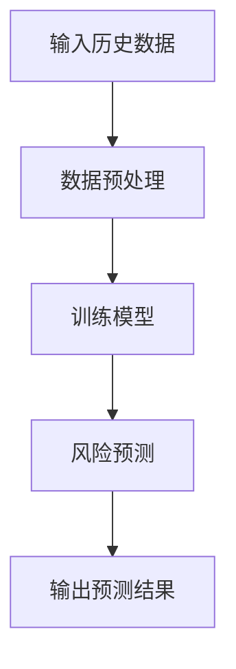
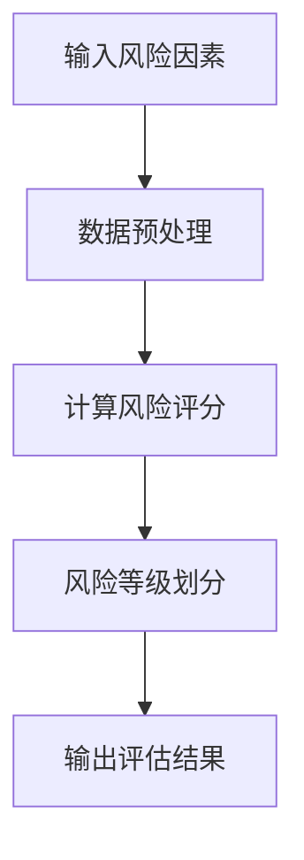
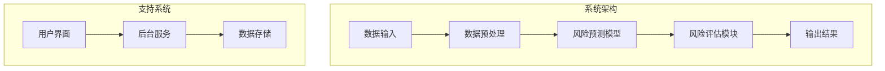
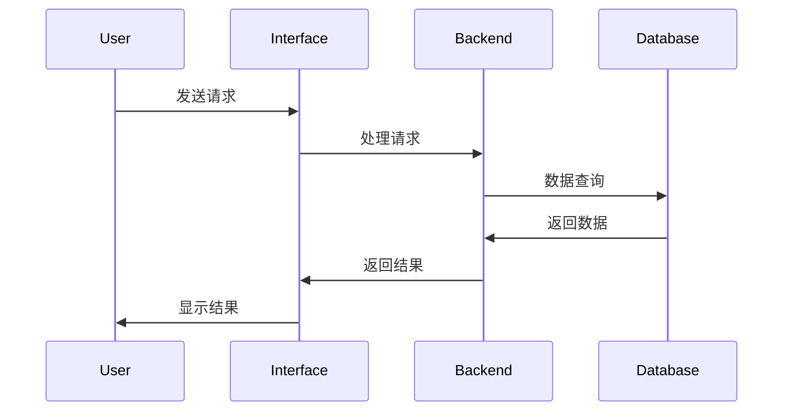
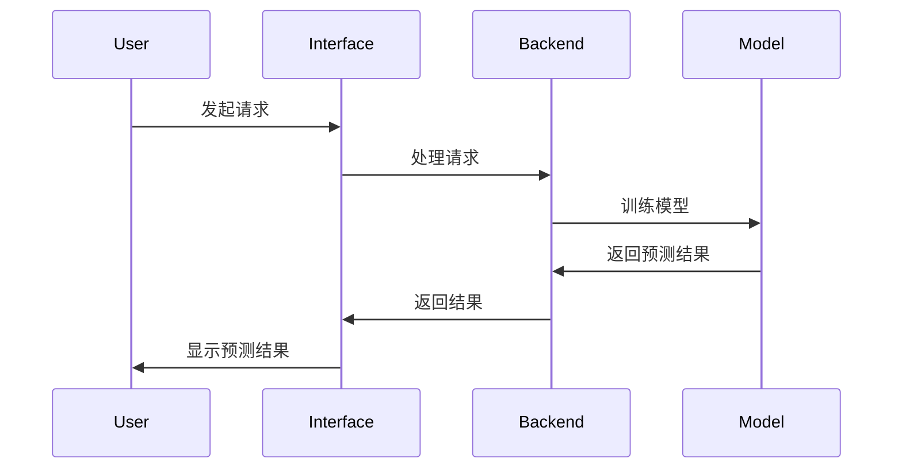

                 

### 目录

---

# AI Agent在风险评估中的应用

> 关键词：人工智能，风险评估，算法设计，系统架构，实际案例

> 摘要：本文深入探讨了AI Agent在风险评估中的应用，从核心概念、算法设计到系统架构，逐步解析了AI Agent在风险预测、评估和决策中的作用。通过实际案例展示，本文旨在为读者提供全面的技术指导和实践参考。

---

## 引言

在当今复杂多变的环境中，风险无处不在。无论是商业决策、金融市场、医疗诊断还是公共安全，风险评估都扮演着至关重要的角色。随着人工智能技术的飞速发展，AI Agent作为一种智能化实体，逐渐成为风险管理的有力工具。

### AI Agent是什么？

AI Agent是指能够自主感知环境、制定计划并采取行动的智能体。它们基于机器学习、自然语言处理、计算机视觉等技术，具备高度的数据处理和分析能力。

### 风险评估的重要性

风险评估是识别、评估和优先处理潜在风险的过程。有效的风险评估可以帮助组织做出更明智的决策，降低损失，提高安全性和效率。

### AI Agent与风险评估的结合

AI Agent能够通过分析大量数据，发现潜在的风险因素，并提供实时、准确的评估结果。这种结合不仅提高了风险评估的效率，还大大增强了其准确性和全面性。

---

## AI Agent在风险评估中的应用

### 1. 风险预测

AI Agent通过历史数据和模式识别，预测未来可能出现的风险。这种预测能力有助于组织提前采取预防措施，减少潜在损失。

### 2. 风险评估

AI Agent能够对各种风险因素进行定量评估，提供风险等级和影响分析。这种评估结果为决策者提供了重要的参考依据。

### 3. 风险决策

基于预测和评估结果，AI Agent可以提出最优的风险应对策略，辅助决策者做出明智的决策。

---

## 核心概念和原理

### 1. 机器学习

机器学习是AI Agent的核心技术之一。通过训练模型，AI Agent可以从数据中学习，提高预测和评估的准确性。

### 2. 数据分析

数据分析是风险评估的重要环节。AI Agent通过分析大量数据，识别风险因素和模式。

### 3. 决策树

决策树是一种常用的机器学习算法，用于构建风险预测模型。通过决策树，AI Agent可以逐步筛选数据，提高预测精度。

### 4. 概率模型

概率模型用于计算风险发生的可能性。AI Agent可以通过概率模型，提供更加准确的风险预测。

---

## 算法设计

### 1. 风险预测算法

- **算法描述**：通过历史数据和模式识别，预测未来可能出现的风险。
- **Mermaid流程图**：



### 2. 风险评估算法

- **算法描述**：对各种风险因素进行定量评估，提供风险等级和影响分析。
- **Mermaid流程图**：



---

## 系统架构设计

### 1. 问题场景

在金融领域，AI Agent可以用于预测和评估金融风险，如股市波动、信用风险等。

### 2. 项目介绍

本项目旨在开发一个金融风险预测系统，利用AI Agent进行风险评估和预测。

### 3. 系统功能设计

- **领域模型**：使用Mermaid绘制领域模型类图。

```mermaid
classDiagram
    RiskPredictionSystem <|-- DataPreprocessing
    RiskPredictionSystem <|-- RiskPredictionModel
    RiskPredictionSystem <|-- RiskAssessment
    DataPreprocessing o---> RiskPredictionModel
    RiskPredictionModel o---> RiskAssessment
```

- **系统架构设计**：使用Mermaid绘制系统架构图。



### 4. 系统接口设计

- **接口设计**：定义API接口，如预测接口、评估接口等。



### 5. 系统交互

- **序列图**：使用Mermaid绘制系统交互序列图。



---

## 项目实战

### 1. 环境安装

- **Python环境搭建**：安装Python和必要的库，如scikit-learn、pandas等。

### 2. 系统核心实现

- **源代码**：

```python
import pandas as pd
from sklearn.model_selection import train_test_split
from sklearn.ensemble import RandomForestClassifier
from sklearn.metrics import accuracy_score

# 数据预处理
def preprocess_data(data):
    # 数据清洗、归一化等操作
    return processed_data

# 训练模型
def train_model(data):
    X_train, X_test, y_train, y_test = train_test_split(data['features'], data['label'], test_size=0.2)
    model = RandomForestClassifier()
    model.fit(X_train, y_train)
    return model

# 风险预测
def predict_risk(model, data):
    predictions = model.predict(data['features'])
    return predictions

# 评估模型
def evaluate_model(model, data):
    predictions = model.predict(data['features'])
    accuracy = accuracy_score(data['label'], predictions)
    return accuracy
```

- **代码应用解读**：

```python
# 加载数据
data = pd.read_csv('financial_data.csv')

# 预处理数据
processed_data = preprocess_data(data)

# 训练模型
model = train_model(processed_data)

# 预测风险
predictions = predict_risk(model, processed_data)

# 评估模型
accuracy = evaluate_model(model, processed_data)
print(f"Model accuracy: {accuracy}")
```

### 3. 实际案例分析与详细讲解

- **案例背景**：分析某金融机构的信用风险。
- **案例分析**：使用AI Agent预测信用风险，评估模型准确性，提出风险应对策略。

### 4. 项目小结

本文通过实际案例展示了AI Agent在风险评估中的应用，证明了其在提高风险评估效率和准确性方面的优势。

---

## 最佳实践 Tips

- **数据质量**：确保数据质量是风险预测和评估的基础。
- **算法选择**：根据具体需求选择合适的算法。
- **持续优化**：定期更新模型和算法，提高预测准确性。

## 小结

AI Agent在风险评估中的应用具有重要意义。通过本文的探讨，我们了解了AI Agent的核心概念、算法设计、系统架构以及实际应用案例。未来，随着人工智能技术的不断发展，AI Agent将在更多领域发挥重要作用。

## 注意事项

- **数据安全**：在数据处理过程中，确保数据安全。
- **模型解释性**：提高模型的解释性，便于决策者理解和使用。

## 拓展阅读

- **相关文献**：了解AI Agent在风险评估领域的最新研究成果。
- **实践指南**：参考实际项目经验，提高风险评估能力。

---

**作者：AI天才研究院/AI Genius Institute & 禅与计算机程序设计艺术 /Zen And The Art of Computer Programming**

