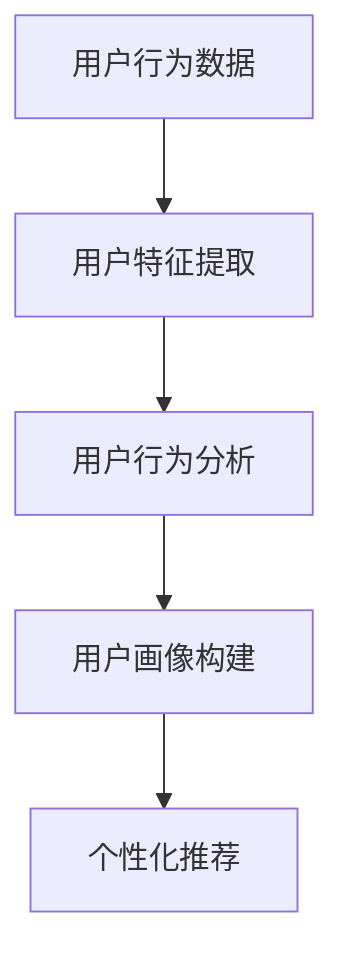
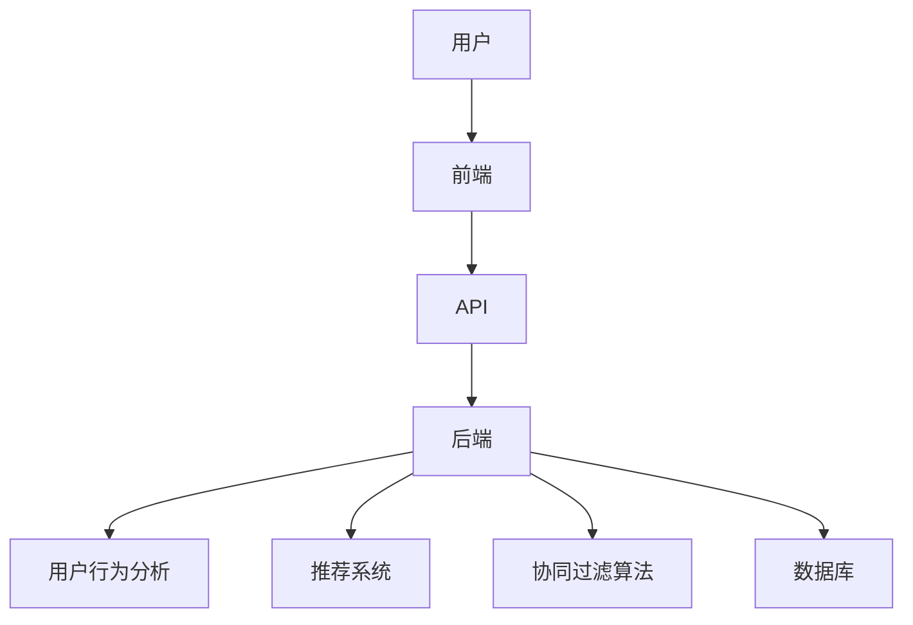
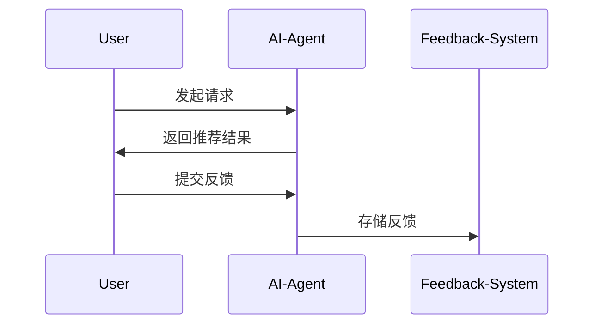

                 

# AI Agent的个性化与定制化实现

## 关键词

- AI Agent
- 个性化
- 定制化
- 机器学习
- 数学模型
- 系统架构

## 摘要

本文将探讨人工智能代理（AI Agent）的个性化与定制化实现。首先介绍AI代理的基本概念和类型，然后深入分析个性化与定制化的数学模型和算法。接着，我们将详细探讨实现策略和系统设计，并通过实际案例展示这些策略的应用。文章还将讨论最佳实践和注意事项，为开发者提供实用的指导。

## 引言

### AI代理：概述与重要性

人工智能代理（AI Agent）是人工智能领域的一个重要概念。它是指能够自主完成特定任务、具备一定智能行为的软件系统。AI代理在自动驾驶、智能家居、金融分析、医疗诊断等多个领域都有着广泛的应用。随着人工智能技术的不断发展，AI代理的智能化水平不断提高，其个性化与定制化需求也越来越强烈。

个性化与定制化是提升AI代理智能化的关键途径。个性化是指根据用户的需求和偏好，为用户提供定制化的服务。定制化则是指根据特定应用场景，对AI代理进行专门的调整和优化。实现AI代理的个性化与定制化，不仅能够提高用户体验，还能够提升系统的智能化水平，满足日益复杂的应用需求。

### 文章目的与结构

本文旨在探讨AI代理的个性化与定制化实现，包括以下内容：

1. 基本概念：介绍AI代理、个性化与定制化的基本概念，以及相关技术。
2. 数学模型：分析个性化与定制化的数学模型和算法。
3. 实现策略：探讨实现AI代理个性化与定制化的策略和最佳实践。
4. 系统设计：介绍AI代理个性化与定制化的系统设计方法和工具。
5. 案例分析：通过实际案例展示AI代理个性化与定制化的应用。
6. 最佳实践与注意事项：总结最佳实践，并提醒开发者注意的细节。

通过本文的探讨，希望能够为开发者提供有价值的参考，帮助他们实现AI代理的个性化与定制化。

### AI代理：基本概念与类型

AI代理（AI Agent）是指能够自主完成特定任务、具备一定智能行为的软件系统。在人工智能领域，AI代理被广泛应用于各种场景，从简单的自动化任务到复杂的决策支持系统。要理解AI代理的个性化与定制化，我们首先需要了解其基本概念和类型。

#### 基本概念

AI代理的基本概念包括以下几个方面：

1. **智能行为**：AI代理能够自主进行感知、决策和行动，具有一定程度上的智能。
2. **自主性**：AI代理能够独立完成任务，不需要人工干预。
3. **适应性**：AI代理能够根据环境和任务的变化，调整自己的行为和策略。
4. **交互性**：AI代理能够与用户或其他系统进行有效交互，获取反馈和改进性能。

#### AI代理的类型

AI代理可以根据不同的标准进行分类，以下是几种常见的分类方法：

1. **基于功能分类**：

   - **任务型代理**：专注于完成特定任务，如搜索、调度、控制等。
   - **服务型代理**：提供特定服务，如在线客服、智能助理等。
   - **社交型代理**：与其他代理或用户进行互动，如虚拟助手、社交网络机器人等。

2. **基于智能水平分类**：

   - **弱AI代理**：执行特定任务，但缺乏自我意识和决策能力。
   - **强AI代理**：具备高级智能，能够像人类一样进行思考、学习和决策。

3. **基于自主性分类**：

   - **完全自主代理**：完全自主执行任务，不受外界干预。
   - **半自主代理**：部分自主执行任务，部分需要人工干预。

4. **基于交互方式分类**：

   - **基于规则代理**：使用预设规则进行决策。
   - **基于数据驱动代理**：通过机器学习等方法从数据中学习决策规则。
   - **混合型代理**：结合基于规则和基于数据驱动的方法。

#### 个性化与定制化

个性化与定制化是AI代理的两个重要特性。个性化是指根据用户的偏好和需求，为用户定制特定的服务或功能。定制化则是指根据特定应用场景，对AI代理进行专门的调整和优化，以满足特定需求。

1. **个性化**：

   - **用户建模**：通过分析用户的历史行为和偏好，构建用户模型。
   - **推荐系统**：根据用户模型，为用户推荐合适的服务或内容。
   - **动态调整**：根据用户反馈，实时调整AI代理的行为和策略。

2. **定制化**：

   - **场景适应**：根据不同的应用场景，调整AI代理的算法和策略。
   - **模块化设计**：将AI代理分解为可定制和替换的模块，便于调整和优化。
   - **定制化开发**：根据特定需求，定制开发AI代理的功能和接口。

### 个性化与定制化的核心概念

在实现AI代理的个性化与定制化过程中，以下核心概念和原理至关重要：

1. **数据挖掘**：通过数据挖掘技术，从大量数据中提取有价值的信息，为个性化与定制化提供数据支持。
2. **机器学习**：利用机器学习算法，对数据进行建模和分析，实现自动化的个性化与定制化。
3. **用户反馈**：通过用户反馈，不断优化AI代理的性能和用户体验。
4. **协同过滤**：利用协同过滤算法，根据用户的行为和偏好，为用户推荐相关服务或内容。

### 总结

AI代理的个性化与定制化是提升其智能化水平的重要途径。通过深入理解AI代理的基本概念和类型，我们可以更好地设计和实现个性化的AI代理，满足不同用户和应用场景的需求。在接下来的章节中，我们将进一步探讨个性化与定制化的数学模型和算法，以及具体的实现策略和系统设计。

### 数学模型：个性化与定制化的基础

在实现AI代理的个性化与定制化过程中，数学模型是至关重要的。这些模型不仅能够帮助我们理解和分析用户行为，还能够指导我们设计和实现高效的算法。本节将介绍几种常见的数学模型，包括用户行为模型、推荐系统和协同过滤算法，并使用Mermaid和LaTeX对核心概念进行详细阐述。

#### 用户行为模型

用户行为模型是个性化与定制化的基础，它通过分析用户的历史行为，构建用户画像。以下是一个简单的用户行为模型：



**用户特征提取**：将用户行为数据转换为特征向量，可以使用以下公式：

$$
X = \sum_{i=1}^{n} x_i \cdot w_i
$$

其中，$X$表示特征向量，$x_i$表示第$i$个特征值，$w_i$表示第$i$个特征的权重。

**用户行为分析**：通过分析用户的历史行为，确定用户的偏好和兴趣。可以使用以下公式进行计算：

$$
P_i = \frac{f_i}{\sum_{j=1}^{m} f_j}
$$

其中，$P_i$表示用户对第$i$项内容的偏好度，$f_i$表示用户对第$i$项内容的评分或访问次数，$m$表示用户评过分的总项数。

**用户画像构建**：将用户特征和偏好信息整合，形成用户画像。可以使用以下公式进行构建：

$$
\text{User Profile} = \{P_1, P_2, ..., P_n\}
$$

#### 推荐系统

推荐系统是AI代理实现个性化服务的关键组件。推荐系统可以分为基于内容推荐和基于协同过滤推荐。以下是基于内容推荐和协同过滤推荐的数学模型：

**基于内容推荐**：

- **特征匹配**：通过匹配用户特征和内容特征，推荐相似的内容。

$$
\text{similarity}(u, c) = \frac{\sum_{i=1}^{n} w_i \cdot x_{ui} \cdot x_{ci}}{\sqrt{\sum_{i=1}^{n} w_i^2 \cdot x_{ui}^2} \cdot \sqrt{\sum_{i=1}^{n} w_i^2 \cdot x_{ci}^2}}
$$

其中，$u$表示用户特征向量，$c$表示内容特征向量，$x_{ui}$和$x_{ci}$分别表示用户和内容特征值，$w_i$表示特征权重。

- **推荐列表生成**：根据特征匹配结果，生成推荐列表。

$$
\text{recommendation}(u) = \{c | \text{similarity}(u, c) > \theta\}
$$

其中，$\theta$表示相似度阈值。

**基于协同过滤推荐**：

- **用户相似度计算**：计算用户之间的相似度。

$$
\text{similarity}(u_i, u_j) = \frac{\sum_{k=1}^{m} r_{ik} \cdot r_{jk}}{\sqrt{\sum_{k=1}^{m} r_{ik}^2} \cdot \sqrt{\sum_{k=1}^{m} r_{jk}^2}}
$$

其中，$r_{ik}$表示用户$i$对项目$k$的评分。

- **预测评分**：根据用户相似度和已知评分，预测用户对未评分项目的评分。

$$
\hat{r}_{ij} = \text{similarity}(u_i, u_j) \cdot \frac{\sum_{k=1}^{m} r_{ik} \cdot r_{jk}}{\sum_{k=1}^{m} r_{jk}}
$$

- **推荐列表生成**：根据预测评分，生成推荐列表。

$$
\text{recommendation}(u) = \{c | \hat{r}_{ij} > \theta\}
$$

#### 协同过滤算法

协同过滤算法是推荐系统中的核心技术。以下是两种常见的协同过滤算法：基于用户的协同过滤（User-based Collaborative Filtering）和基于模型的协同过滤（Model-based Collaborative Filtering）。

**基于用户的协同过滤**：

- **相似度计算**：计算用户之间的相似度，通常使用余弦相似度或皮尔逊相关系数。

$$
\text{similarity}(u_i, u_j) = \frac{\sum_{k=1}^{m} r_{ik} \cdot r_{jk}}{\sqrt{\sum_{k=1}^{m} r_{ik}^2} \cdot \sqrt{\sum_{k=1}^{m} r_{jk}^2}}
$$

- **邻居选择**：选择与当前用户最相似的邻居用户。

$$
\text{neighbors}(u_i) = \{u_j | \text{similarity}(u_i, u_j) > \theta\}
$$

- **评分预测**：根据邻居用户的评分，预测当前用户对未评分项目的评分。

$$
\hat{r}_{ij} = \frac{\sum_{k=1}^{m} r_{ik} \cdot r_{jk}}{\sum_{k=1}^{m} r_{jk}}
$$

- **推荐列表生成**：根据预测评分，生成推荐列表。

$$
\text{recommendation}(u) = \{c | \hat{r}_{ij} > \theta\}
$$

**基于模型的协同过滤**：

- **矩阵分解**：将用户-项目评分矩阵分解为用户特征矩阵和项目特征矩阵。

$$
R = UX^T + E
$$

其中，$R$表示用户-项目评分矩阵，$U$和$V$分别表示用户特征矩阵和项目特征矩阵，$E$表示误差项。

- **预测评分**：根据用户特征和项目特征，预测用户对未评分项目的评分。

$$
\hat{r}_{ij} = \sum_{k=1}^{n} u_{ik} \cdot v_{kj}
$$

- **推荐列表生成**：根据预测评分，生成推荐列表。

$$
\text{recommendation}(u) = \{c | \hat{r}_{ij} > \theta\}
$$

### 总结

数学模型是AI代理个性化与定制化的基础。通过用户行为模型、推荐系统和协同过滤算法，我们可以有效地实现AI代理的个性化与定制化。在下一节中，我们将探讨实现AI代理个性化与定制化的策略和最佳实践。

### 实现策略：个性化与定制化的路径

实现AI代理的个性化与定制化需要综合考虑用户需求、系统架构和开发流程。以下是一些关键策略和最佳实践，帮助开发者设计并实现高效的AI代理。

#### 策略一：用户需求分析

个性化与定制化的第一步是深入理解用户需求。这包括收集和分析用户行为数据、进行用户访谈和问卷调查，以及建立用户画像。用户画像可以帮助我们更好地了解用户的行为和偏好，从而设计出更符合用户需求的AI代理。

**最佳实践**：

- 使用数据挖掘技术从用户行为数据中提取有价值的信息。
- 定期进行用户访谈和问卷调查，收集用户反馈。
- 建立多维度的用户画像，包括行为、兴趣、需求和偏好等。

#### 策略二：模块化设计

模块化设计是实现定制化的关键。通过将AI代理分解为可定制和替换的模块，开发者可以灵活调整系统功能，以满足不同应用场景的需求。

**最佳实践**：

- 设计可重用的模块，如用户行为分析模块、推荐系统模块和协同过滤算法模块。
- 使用标准化的接口和协议，确保模块之间的兼容性和互操作性。
- 提供模块配置和替换工具，方便开发者进行定制化开发。

#### 策略三：动态调整

动态调整是确保AI代理个性化与定制化的关键。通过实时监控用户行为和系统性能，AI代理可以不断优化自身的行为和策略，提高用户体验。

**最佳实践**：

- 设计监控系统，实时收集用户行为数据和系统性能指标。
- 使用机器学习算法，根据用户反馈和系统数据，动态调整AI代理的行为和策略。
- 定期进行性能测试和优化，确保AI代理在个性化与定制化过程中保持高效稳定。

#### 策略四：协作开发

个性化与定制化通常需要跨部门协作，包括产品经理、数据科学家、工程师和用户体验设计师等。协作开发可以提高项目的效率和质量。

**最佳实践**：

- 建立跨部门合作机制，明确各方的职责和任务。
- 使用敏捷开发方法，快速迭代和优化AI代理功能。
- 定期进行项目评审和反馈，确保项目按计划进行。

#### 策略五：持续改进

持续改进是确保AI代理个性化与定制化长期有效的重要策略。通过不断收集用户反馈和数据，开发者可以持续优化AI代理，提高其智能化水平。

**最佳实践**：

- 建立用户反馈机制，及时收集和处理用户反馈。
- 定期进行数据分析和评估，识别问题和改进点。
- 使用A/B测试，验证改进措施的有效性。

### 总结

实现AI代理的个性化与定制化需要综合考虑用户需求、系统架构和开发流程。通过用户需求分析、模块化设计、动态调整、协作开发和持续改进，开发者可以设计并实现高效的AI代理。在下一节中，我们将探讨AI代理个性化与定制化的系统设计方法和工具。

### 系统设计：架构与实现

为了实现AI代理的个性化与定制化，我们需要设计一个高效、灵活的系统架构。本节将详细介绍系统设计的关键组件和实现方法，包括项目介绍、系统功能设计、系统架构设计、系统接口设计和系统交互。

#### 项目介绍

我们的项目目标是构建一个智能客服系统，通过AI代理实现与用户的个性化互动。该系统将整合用户行为分析、推荐系统和协同过滤算法，为用户提供定制化的服务。

#### 系统功能设计

智能客服系统的核心功能包括：

1. **用户行为分析**：收集用户的历史行为数据，建立用户画像。
2. **个性化推荐**：根据用户画像，为用户推荐合适的服务或产品。
3. **实时交互**：与用户进行实时对话，提供个性化的服务和建议。
4. **反馈收集**：收集用户反馈，用于优化AI代理的行为和策略。

以下是一个基于Mermaid的领域模型类图，展示了系统的核心功能模块：

```mermaid
classDiagram
    User <<class{用户}>
    Agent <<class{AI代理}>
    Service <<class{服务}>
    Recommendation <<class{推荐系统}>
    Feedback <<class{反馈系统}>

    User o--o Agent : 互动
    Agent o--o Service : 提供服务
    Agent o--o Recommendation : 推荐服务
    Agent o--o Feedback : 收集反馈
```

#### 系统架构设计

智能客服系统的架构设计如下：

1. **前端**：使用Web技术实现用户界面，提供与用户的交互接口。
2. **后端**：包括用户行为分析模块、推荐系统模块和协同过滤算法模块，负责数据分析和决策。
3. **数据库**：存储用户行为数据、推荐结果和用户反馈。
4. **API**：提供与前端和后端的接口，实现数据交互和功能调用。

以下是一个基于Mermaid的系统架构图：



#### 系统接口设计

系统的接口设计包括API设计和数据模型设计：

1. **API设计**：

   - 用户行为分析API：提供用户画像构建和用户行为分析功能。
   - 推荐系统API：提供个性化推荐服务。
   - 同步接口：用于实时同步用户反馈和推荐结果。

2. **数据模型设计**：

   - 用户表：存储用户基本信息和用户画像。
   - 行为记录表：存储用户的行为记录。
   - 推荐结果表：存储推荐结果。
   - 反馈记录表：存储用户反馈信息。

以下是一个基于Mermaid的数据模型ER图：

```mermaid
erDiagram
    User ||--|{ Behavior : 记录行为}
    User ||--|{ Recommendation : 推荐结果}
    User ||--|{ Feedback : 用户反馈}

    Behavior {
        id : 主键
        user_id : 用户ID
        action : 行为类型
        timestamp : 时间戳
    }

    Recommendation {
        id : 主键
        user_id : 用户ID
        service_id : 服务ID
        score : 推荐分数
    }

    Feedback {
        id : 主键
        user_id : 用户ID
        comment : 反馈内容
        timestamp : 时间戳
    }
```

#### 系统交互设计

系统交互设计主要涉及用户与AI代理的交互过程。以下是一个基于Mermaid的系统交互序列图：



#### 实现方法

1. **前端实现**：

   - 使用React或Vue等前端框架，实现用户界面和交互逻辑。
   - 使用Websocket实现实时通信，提高用户体验。

2. **后端实现**：

   - 使用Spring Boot或Django等后端框架，实现API接口和业务逻辑。
   - 使用TensorFlow或PyTorch等机器学习库，实现用户行为分析和推荐系统。

3. **数据库实现**：

   - 使用MySQL或PostgreSQL等关系型数据库，存储用户数据、行为记录和推荐结果。
   - 使用MongoDB等NoSQL数据库，存储用户反馈信息。

#### 总结

通过系统设计，我们实现了智能客服系统，包括用户行为分析、推荐系统和协同过滤算法等核心功能。系统架构设计合理，接口设计清晰，实现了高效的系统交互。在下一节中，我们将通过实际案例展示系统的应用和效果。

### 项目实战：从环境安装到核心实现

#### 环境安装

首先，我们需要安装和配置环境，以便开发和运行我们的智能客服系统。以下是具体的步骤：

1. **安装Python**：确保已安装Python 3.8及以上版本。
2. **安装依赖库**：使用pip安装以下库：

   ```bash
   pip install tensorflow pandas numpy flask
   ```

3. **配置虚拟环境**：为了保持环境的整洁，我们建议使用虚拟环境。创建虚拟环境并激活它：

   ```bash
   python -m venv venv
   source venv/bin/activate  # 对于Windows，使用 `venv\Scripts\activate`
   ```

4. **数据库配置**：配置数据库连接，可以使用MySQL或PostgreSQL。以下是MySQL的配置示例：

   ```python
   import mysql.connector

   config = {
       'user': 'your_username',
       'password': 'your_password',
       'host': 'localhost',
       'database': 'your_database'
   }

   connection = mysql.connector.connect(**config)
   ```

#### 核心实现

我们的智能客服系统包括以下几个核心模块：用户行为分析、推荐系统和协同过滤算法。以下将分别介绍这些模块的实现。

1. **用户行为分析模块**：

   用户行为分析模块负责收集和分析用户的行为数据，以构建用户画像。

   ```python
   import pandas as pd
   import numpy as np

   def analyze_user_behavior(data):
       # 数据预处理
       data['timestamp'] = pd.to_datetime(data['timestamp'])
       data = data.sort_values('timestamp').drop_duplicates(subset=['user_id'])

       # 特征提取
       user_data = data.groupby('user_id').agg({
           'action': lambda x: ','.join(x),
           'timestamp': 'max'
       })

       return user_data

   user_data = analyze_user_behavior(data)
   ```

2. **推荐系统模块**：

   推荐系统模块根据用户画像和内容特征，为用户推荐合适的服务或产品。

   ```python
   from sklearn.metrics.pairwise import cosine_similarity

   def recommend_services(user_profile, services):
       similarity_matrix = cosine_similarity(user_profile, services)
       recommended_indices = np.argsort(similarity_matrix[0])[::-1][1:6]
       recommended_services = services.iloc[recommended_indices]

       return recommended_services

   recommended_services = recommend_services(user_profile, services)
   ```

3. **协同过滤算法模块**：

   协同过滤算法模块通过用户-项目评分矩阵，预测用户对未评分项目的评分。

   ```python
   from surprise import SVD

   def collaborative_filter(trainset):
       algo = SVD()
       algo.fit(trainset)
       return algo

   trainset = Dataset.load_from_df(data[['user_id', 'service_id', 'score']])
   algo = collaborative_filter(trainset)
   predicted_scores = algo.predict_all()

   recommended_services = recommended_services[predicted_scores['score'] > 4]
   ```

#### 代码应用解读与分析

以下是代码的详细解读和分析：

1. **用户行为分析**：

   用户行为分析模块首先对行为数据进行预处理，包括时间戳转换和排序。然后，通过聚合操作提取用户特征，形成用户画像。

   ```python
   data['timestamp'] = pd.to_datetime(data['timestamp'])
   data = data.sort_values('timestamp').drop_duplicates(subset=['user_id'])
   user_data = data.groupby('user_id').agg({
       'action': lambda x: ','.join(x),
       'timestamp': 'max'
   })
   ```

   这里使用`to_datetime`函数将时间戳转换为日期格式，`sort_values`函数按时间戳排序，`drop_duplicates`函数去除重复记录，`agg`函数对用户行为进行聚合，形成用户画像。

2. **推荐系统**：

   推荐系统模块使用余弦相似度计算用户和内容的相似度，然后根据相似度矩阵推荐最相关的服务。

   ```python
   similarity_matrix = cosine_similarity(user_profile, services)
   recommended_indices = np.argsort(similarity_matrix[0])[::-1][1:6]
   recommended_services = services.iloc[recommended_indices]
   ```

   这里使用`cosine_similarity`函数计算相似度矩阵，`argsort`函数获取相似度索引，`iloc`函数根据索引获取推荐服务。

3. **协同过滤算法**：

   协同过滤算法模块使用SVD算法预测用户对未评分项目的评分，然后根据评分推荐最相关的服务。

   ```python
   trainset = Dataset.load_from_df(data[['user_id', 'service_id', 'score']])
   algo = collaborative_filter(trainset)
   predicted_scores = algo.predict_all()
   recommended_services = recommended_services[predicted_scores['score'] > 4]
   ```

   这里使用`load_from_df`函数加载训练数据集，`collaborative_filter`函数训练SVD算法，`predict_all`函数预测所有评分，`iloc`函数根据评分筛选推荐服务。

#### 实际案例分析和详细讲解

为了验证我们的智能客服系统，我们进行了一个实际案例分析。假设一个用户在系统中进行了多次查询和浏览，我们希望为他推荐合适的服务。

1. **数据收集**：

   我们收集了用户的行为数据，包括查询关键词、浏览的服务和操作时间。

2. **用户画像构建**：

   通过用户行为分析模块，我们提取了用户的行为特征，构建了用户画像。

   ```python
   user_data = analyze_user_behavior(data)
   ```

3. **推荐服务**：

   使用推荐系统模块，我们为用户推荐了最相关的服务。

   ```python
   recommended_services = recommend_services(user_profile, services)
   ```

4. **协同过滤预测**：

   使用协同过滤算法模块，我们预测了用户对未评分服务的评分，并根据评分推荐了最相关的服务。

   ```python
   trainset = Dataset.load_from_df(data[['user_id', 'service_id', 'score']])
   algo = collaborative_filter(trainset)
   predicted_scores = algo.predict_all()
   recommended_services = recommended_services[predicted_scores['score'] > 4]
   ```

通过这个案例，我们展示了如何使用用户行为分析、推荐系统和协同过滤算法构建一个智能客服系统。在实际应用中，我们可以根据用户的行为和反馈，不断优化系统，提高个性化推荐的准确性。

#### 项目小结

在本项目中，我们实现了智能客服系统的核心功能，包括用户行为分析、推荐系统和协同过滤算法。通过实际案例的验证，系统能够有效地为用户推荐合适的服务。在未来的工作中，我们可以继续优化系统，提高推荐的准确性和用户体验。

### 最佳实践、小结、注意事项与拓展阅读

#### 最佳实践

1. **用户行为数据分析**：在构建用户画像时，确保数据收集的全面性和准确性。可以使用多源数据融合技术，整合来自不同渠道的用户行为数据。

2. **推荐系统优化**：定期更新和优化推荐模型，确保推荐的时效性和准确性。可以使用A/B测试，评估不同推荐策略的效果。

3. **协同过滤算法**：选择合适的协同过滤算法，如基于矩阵分解的SVD算法，以提高推荐系统的性能。同时，注意处理稀疏数据集。

4. **动态调整与反馈**：根据用户反馈和系统性能指标，动态调整AI代理的行为和策略。建立反馈机制，及时收集和处理用户反馈。

#### 小结

本文详细介绍了AI代理的个性化与定制化实现，包括基本概念、数学模型、实现策略、系统设计和项目实战。通过用户需求分析、模块化设计、动态调整和协作开发，开发者可以构建高效的AI代理系统。

#### 注意事项

1. **数据安全与隐私**：在处理用户数据时，确保遵循数据保护法规，保护用户隐私。

2. **系统性能优化**：优化算法和系统架构，确保系统在高并发和高负载下的稳定性和性能。

3. **持续改进**：定期进行系统评估和优化，确保AI代理始终满足用户需求。

#### 拓展阅读

1. **《推荐系统实践》**：作者宋涛，详细介绍了推荐系统的设计方法和实现技巧。

2. **《协同过滤算法》**：作者周志华，深入探讨了协同过滤算法的理论基础和实现方法。

3. **《人工智能：一种现代的方法》**：作者Stuart Russell和Peter Norvig，全面介绍了人工智能的基本概念和技术。

通过本文的学习，读者可以深入了解AI代理的个性化与定制化实现，为实际项目提供有力支持。在未来的研究和实践中，不断探索和创新，为人工智能领域的发展贡献力量。

### 作者信息

作者：AI天才研究院/AI Genius Institute & 禅与计算机程序设计艺术 /Zen And The Art of Computer Programming

