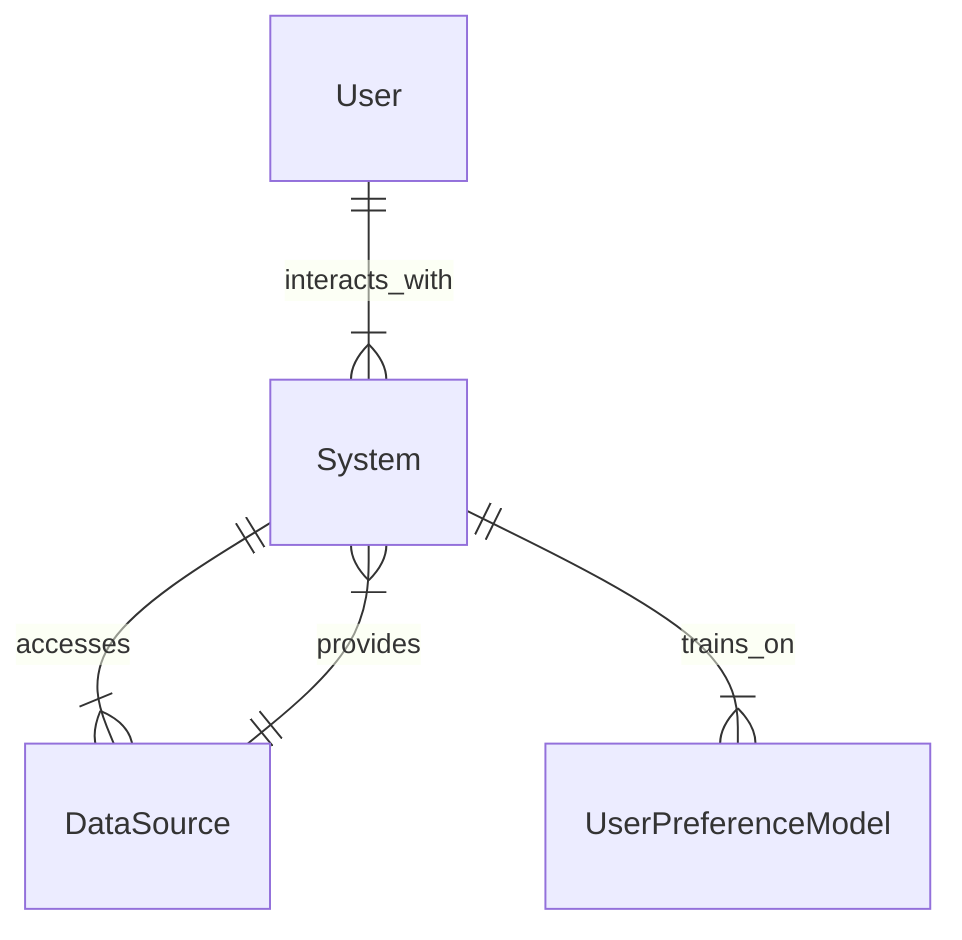
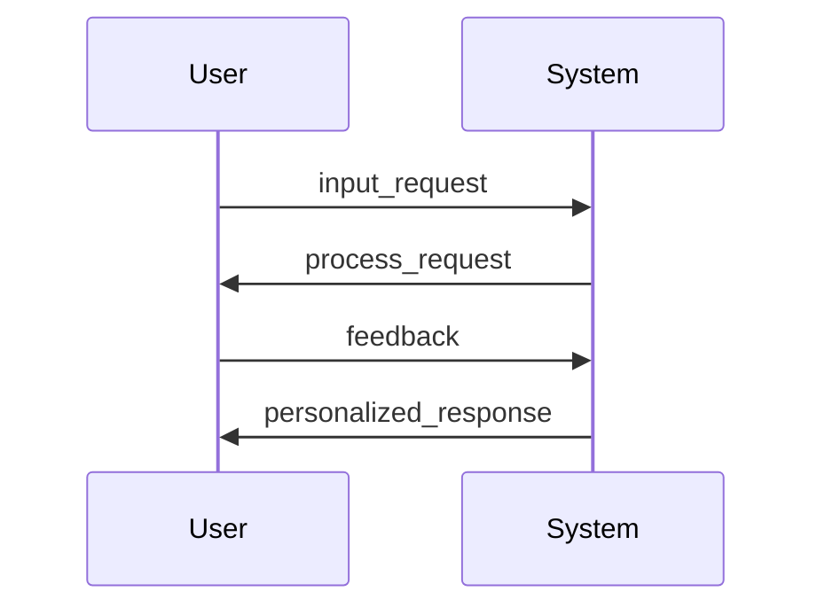
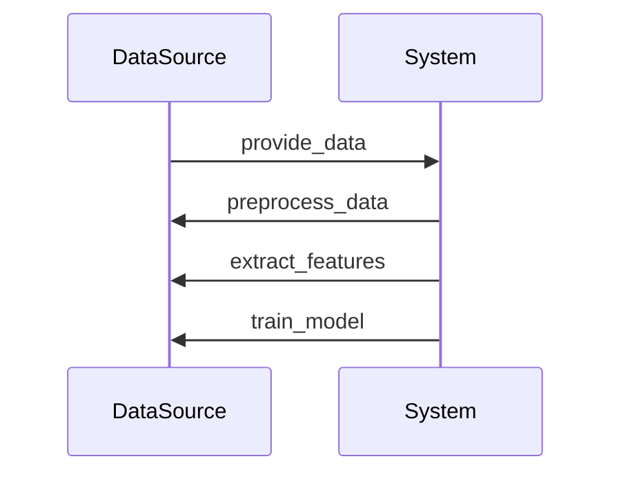
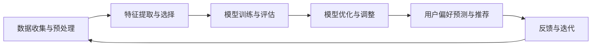
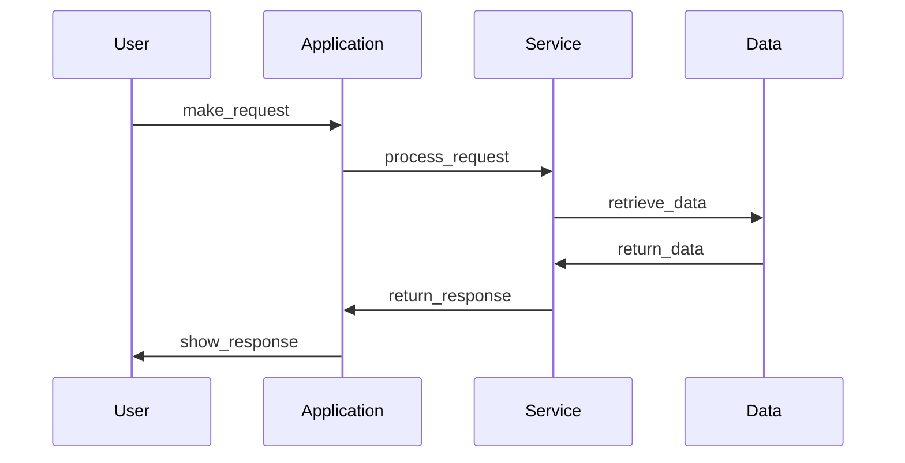

                 

### 文章标题

# AI Agent的个性化定制：用户偏好学习与应用

> 关键词：AI Agent、个性化定制、用户偏好学习、算法原理、系统架构、项目实战

> 摘要：本文深入探讨了AI Agent的个性化定制技术，从用户偏好学习的基本概念、算法原理到系统架构设计，再到实际项目应用，进行了全面剖析。通过逐步推理和分析，文章揭示了个性化定制的核心要素和关键步骤，为开发者提供了实用的技术指南。

-----------------------------------------------

### 目录大纲

-----------------------------------------------

## 第一部分：背景介绍与核心概念

### 第1章 问题背景、问题描述与问题解决

#### 1.1 问题背景

AI Agent的定义与历史发展

- AI Agent的概念
- AI Agent的发展历程
- 个性化定制的含义与应用场景

#### 1.2 问题描述

AI Agent个性化定制面临的挑战

- 用户偏好的多样性与复杂性
- 数据隐私与安全性的问题

#### 1.3 问题解决

个性化定制的目标与原则

- 个性化定制的目标
- 个性化定制的原则

用户偏好学习的关键技术

- 偏好模型的构建方法
- 偏好特征的分析方法

隐私保护与安全性策略

- 隐私保护的重要性
- 常见隐私保护方法

#### 1.4 边界与外延

AI Agent个性化定制的应用领域

- 个性化推荐系统
- 智能助手
- 自适应用户界面

个人化定制的层次与实现方法

- 低级个性化
- 中级个性化
- 高级个性化

技术边界与未来趋势

- 新技术的影响
- 预计的发展趋势

#### 1.5 概念结构与核心要素

AI Agent的基本结构

- AI Agent的组成部分
- 各部分的功能与作用

用户偏好模型的组成

- 用户偏好模型的构成
- 用户偏好模型的作用

个性化定制的流程与关键步骤

- 个性化定制的流程
- 个性化定制的关键步骤

## 第二部分：核心概念与联系

### 第2章 核心概念原理

#### 2.1 用户偏好模型的构建

用户偏好的定义与分类

- 用户偏好的概念
- 用户偏好的分类

偏好模型的构建方法

- 偏好模型的构建步骤
- 偏好模型的构建工具

偏好模型的应用场景

- 偏好模型在不同场景中的应用

#### 2.2 用户偏好特征分析

用户行为数据的收集与处理

- 用户行为数据的收集方法
- 用户行为数据的处理方法

偏好特征的提取与表示

- 偏好特征的提取方法
- 偏好特征的表示方法

偏好特征的分析方法

- 偏好特征的分析步骤
- 偏好特征的分析工具

#### 2.3 概念属性特征对比表格

用户偏好模型与属性特征的对比

- 用户偏好模型的特点
- 属性特征的具体应用

常见用户偏好模型的比较

- 不同用户偏好模型的特点
- 不同用户偏好模型的优缺点

不同应用场景下的偏好模型选择

- 偏好模型在不同应用场景下的适用性

### 第3章 ER实体关系图架构

#### 3.1 实体关系图的基本概念

实体与关系的定义

- 实体的概念
- 关系的定义

ER模型的构建方法

- ER模型的构建步骤
- ER模型的构建工具

实体关系的表示方式

- 实体关系的表示方法
- 实体关系的可视化工具

#### 3.2 用户偏好学习的ER图构建

用户与系统的关系

- 用户与系统之间的交互关系
- 用户与系统之间的数据流动

数据源与数据处理的关系

- 数据源与处理模块的关联
- 数据处理流程的描述

用户偏好模型与应用场景的关系

- 用户偏好模型与具体应用场景的匹配
- 用户偏好模型在不同场景中的具体实现

## 第三部分：算法原理讲解

### 第4章 算法原理

#### 4.1 算法概述

用户偏好学习的目标与步骤

- 用户偏好学习的目标
- 用户偏好学习的步骤

常见算法的概述

- 常见用户偏好学习算法
- 各算法的特点与适用场景

#### 4.2 算法流程图

用户偏好学习算法的流程图

- 使用Mermaid绘制算法流程图

### 第5章 Python源代码与数学模型

#### 5.1 Python源代码

用户偏好学习的Python实现代码

- 用户偏好学习的主要代码实现
- Python代码的功能与作用

#### 5.2 数学模型与公式

用户偏好学习的数学模型

- 用户偏好学习的数学模型
- 数学模型的推导过程

公式推导与解释

- 公式的推导过程
- 公式的解释与应用

#### 5.3 举例说明

用户偏好学习算法的应用实例

- 应用实例的具体描述
- 应用实例的结果与分析

算法结果的解读与分析

- 算法结果的解读方法
- 算法结果的分析过程

## 第四部分：系统分析与架构设计

### 第6章 系统功能设计与架构设计

#### 6.1 问题场景介绍

个性化定制的具体应用场景

- 个性化定制的应用背景
- 个性化定制的应用案例

#### 6.2 系统功能设计

系统功能需求分析

- 系统功能需求的分析方法
- 系统功能需求的具体内容

系统功能模块划分

- 系统功能模块的划分方法
- 系统功能模块的具体划分

#### 6.3 系统架构设计

系统整体架构设计

- 系统整体架构的组成
- 系统整体架构的设计原则

关键模块的详细设计

- 关键模块的功能与作用
- 关键模块的详细设计

#### 6.4 系统接口设计

系统接口定义与功能

- 系统接口的定义方法
- 系统接口的具体功能

#### 6.5 系统交互设计

系统交互流程与细节

- 系统交互流程的描述
- 系统交互细节的说明

## 第五部分：项目实战

### 第7章 环境安装与系统核心实现

#### 7.1 环境安装

系统运行环境的安装与配置

- 系统运行环境的安装方法
- 系统运行环境的配置步骤

#### 7.2 系统核心实现

用户偏好学习模块的实现

- 用户偏好学习模块的主要功能
- 用户偏好学习模块的实现过程

系统核心功能的代码实现

- 系统核心功能的主要功能
- 系统核心功能的代码实现过程

#### 7.3 代码应用解读与分析

代码功能的解读

- 代码功能的具体描述
- 代码功能的作用与效果

系统实现的关键技术分析

- 系统实现的关键技术
- 关键技术的具体应用与优势

### 第8章 实际案例分析与详细讲解

#### 8.1 实际案例分析

具体案例的展示

- 实际案例的具体描述
- 实际案例的展示结果

#### 8.2 详细讲解与剖析

案例的实现过程

- 案例的实现步骤
- 案例的实现细节

关键步骤的详细讲解

- 关键步骤的具体描述
- 关键步骤的实现方法

### 第9章 项目小结与最佳实践

#### 9.1 项目小结

项目实现的结果与效果

- 项目实现的主要成果
- 项目实现的效果分析

项目中的经验与教训

- 项目中的成功经验
- 项目中的教训与反思

#### 9.2 最佳实践

最佳实践的建议

- 最佳实践的具体建议
- 最佳实践的具体应用

注意事项与优化方向

- 注意事项的具体说明
- 优化方向的具体内容

#### 9.3 小结与拓展阅读

内容总结

- 文章内容的简要总结
- 文章核心观点的归纳

拓展阅读资料推荐

- 相关书籍与论文推荐
- 网络资源与学习平台推荐

-----------------------------------------------

## 第一部分：背景介绍与核心概念

### 1.1 问题背景

#### AI Agent的定义与历史发展

AI Agent，即人工智能代理，是一种能够自主执行任务、与环境交互并做出决策的计算机程序。它的核心目标是模拟人类智能，提高自动化水平和智能化程度。AI Agent的发展可以追溯到20世纪50年代，当时人工智能（Artificial Intelligence，简称AI）作为一门学科正式诞生。早期的AI研究主要集中在逻辑推理、知识表示和学习算法等方面。

随着计算能力和数据量的不断提升，AI Agent逐渐从理论走向实践。20世纪80年代，专家系统（Expert Systems）成为了AI Agent的主要形式，通过模拟人类专家的思维方式来解决特定领域的问题。然而，专家系统的构建过程繁琐，难以适应复杂多变的现实环境。

进入21世纪，随着机器学习和深度学习技术的发展，AI Agent的能力得到了大幅提升。机器学习算法能够从大量数据中自动提取特征，实现自我优化和自我学习，这使得AI Agent能够更好地模拟人类智能，完成更加复杂的任务。例如，自动驾驶系统、智能客服、个性化推荐系统等都是AI Agent的实际应用场景。

#### 个性化定制的含义与应用场景

个性化定制（Personalization）是指根据用户的个性化需求和偏好，提供定制化的产品或服务。在AI Agent的背景下，个性化定制意味着通过学习用户的行为数据、偏好信息和环境特征，为用户提供个性化的交互体验和服务。

个性化定制在多个应用场景中具有广泛的应用：

1. **个性化推荐系统**：通过分析用户的历史行为和偏好，为用户推荐个性化的商品、新闻、音乐等内容。例如，Netflix、Spotify等平台都采用了个性化推荐系统。

2. **智能助手**：智能助手（如Siri、Alexa）通过学习用户的语音指令和交互习惯，提供个性化的语音交互服务。用户可以通过语音命令控制智能家居、查询天气、设置提醒等。

3. **自适应用户界面**：自适应用户界面可以根据用户的行为和偏好，动态调整界面布局、颜色、字体等元素，提供个性化的用户体验。例如，智能手机的桌面布局、应用图标排列等都可以根据用户习惯进行调整。

#### 用户偏好学习的重要性

用户偏好学习是AI Agent实现个性化定制的关键技术。用户偏好（User Preferences）是指用户对产品、服务或内容的喜好和偏好，包括但不限于购买历史、浏览记录、评价反馈、社交互动等行为数据。

用户偏好学习的重要性体现在以下几个方面：

1. **提升用户体验**：通过学习用户偏好，AI Agent可以提供更加符合用户需求的个性化服务，从而提升用户满意度。

2. **优化资源利用**：个性化定制可以减少无效信息的展示，提高用户与系统的交互效率，降低资源浪费。

3. **增强竞争力**：在竞争激烈的市场中，提供个性化服务可以帮助企业赢得更多用户，增强市场竞争力。

4. **实现数据价值**：用户行为数据是宝贵的资产，通过偏好学习，可以挖掘数据价值，为企业提供决策支持。

### 1.2 问题描述

#### AI Agent个性化定制面临的挑战

尽管AI Agent的个性化定制在理论和实践中都有广泛的应用，但实现过程中仍面临诸多挑战：

1. **用户偏好的多样性与复杂性**：用户偏好千差万别，个性化定制的难度很大。用户可能在不同的情境下表现出不同的偏好，而且这些偏好可能随时间变化。

2. **数据隐私与安全性的问题**：用户偏好数据通常涉及个人隐私，如何保护用户隐私成为个性化定制的重要课题。此外，数据泄露和滥用也可能引发法律和道德问题。

3. **模型泛化能力**：个性化定制的核心是建立准确的用户偏好模型。然而，用户偏好的复杂性和多样性可能导致模型泛化能力不足，无法在新的情境下有效应用。

4. **计算资源与时间成本**：用户偏好学习通常涉及大规模数据处理和复杂的算法计算，这需要大量的计算资源和时间成本。如何优化算法效率和资源利用成为关键问题。

#### 用户偏好的多样性与复杂性

用户偏好的多样性和复杂性是AI Agent个性化定制面临的首要挑战。用户的偏好不仅受到个人兴趣、价值观、生活习惯等因素的影响，还受到外部环境、情境变化等因素的干扰。以下是一些具体表现：

1. **个性化需求的多样化**：不同用户可能有不同的偏好和需求。例如，在电子商务平台上，一些用户可能更喜欢购买时尚服饰，而另一些用户可能更喜欢购买电子产品。这种多样化的需求使得个性化定制的实现变得更加复杂。

2. **情境变化的动态性**：用户偏好可能会随着情境变化而发生变化。例如，在上下班途中，用户可能更喜欢听音乐，而在休闲时刻，用户可能更喜欢阅读新闻。这种动态性要求AI Agent能够实时调整个性化服务，以满足用户的即时需求。

3. **跨领域偏好冲突**：用户可能在不同的领域有相互冲突的偏好。例如，一个用户可能喜欢阅读科幻小说，但在购物时又偏好购买环保产品。这种跨领域偏好冲突使得个性化定制的难度增加。

4. **偏好表达的不确定性**：用户偏好表达可能存在不确定性，例如模糊的描述、不一致的行为等。这种不确定性使得偏好模型构建和优化变得更加困难。

#### 数据隐私与安全性的问题

数据隐私和安全性的问题是AI Agent个性化定制面临的另一个重要挑战。用户偏好数据通常涉及个人隐私，如购物记录、浏览历史、社交互动等。如何保护用户隐私成为个性化定制的关键问题。以下是一些具体问题：

1. **数据泄露风险**：用户偏好数据一旦泄露，可能被不法分子利用，导致用户隐私泄露。例如，通过分析用户的购物记录，可以推测用户的消费能力、兴趣爱好等信息。

2. **数据滥用风险**：用户偏好数据可能被用于不当目的，例如广告跟踪、市场细分等。这种滥用可能导致用户隐私受到侵犯，甚至引发法律纠纷。

3. **隐私保护与个性化定制的平衡**：保护用户隐私和提供个性化服务之间存在一定的矛盾。为了实现个性化定制，AI Agent需要收集和处理大量用户数据。然而，过多地收集和处理数据可能会增加隐私泄露的风险。如何在保护用户隐私的同时提供高质量的个性化服务成为重要课题。

4. **法律法规的约束**：不同国家和地区对用户隐私保护有不同的法律法规。例如，欧盟的《通用数据保护条例》（GDPR）对用户数据的收集、处理和使用有严格的规定。这些法律法规对AI Agent的个性化定制提出了更高的要求。

#### 个性化定制的目标与原则

个性化定制的目标是通过学习用户的偏好和行为，为用户提供个性化的服务，从而提高用户满意度、增强用户体验和提升企业竞争力。为实现这一目标，个性化定制遵循以下原则：

1. **用户中心**：个性化定制始终以用户为中心，尊重用户的隐私和个性化需求。所有设计和实现都应围绕用户的需求和体验展开。

2. **数据驱动**：个性化定制依赖于用户数据的分析和处理。通过收集、整合和分析用户数据，AI Agent可以准确了解用户的偏好和行为，从而提供精准的个性化服务。

3. **动态调整**：个性化定制需要根据用户的行为和偏好动态调整服务。用户偏好是动态变化的，AI Agent应具备实时学习和调整能力，以适应用户的即时需求。

4. **隐私保护**：个性化定制过程中应高度重视用户隐私保护。通过采用隐私保护技术和措施，确保用户数据的安全和隐私。

5. **高效实现**：个性化定制应追求高效实现，降低计算资源消耗和时间成本。通过优化算法和系统设计，提高个性化定制的效率和效果。

#### 用户偏好学习的关键技术

用户偏好学习是AI Agent个性化定制的关键技术。以下介绍了用户偏好学习的主要方法和技术：

1. **协同过滤（Collaborative Filtering）**：
   - 协同过滤是一种基于用户行为数据的推荐算法，通过分析用户之间的相似度来预测用户的偏好。
   - **基于用户的协同过滤（User-Based CF）**：通过寻找与目标用户相似的其他用户，分析这些用户的偏好来预测目标用户的偏好。
   - **基于物品的协同过滤（Item-Based CF）**：通过分析物品之间的相似度，为用户推荐与其兴趣相似的物品。

2. **内容推荐（Content-Based Filtering）**：
   - 内容推荐是基于物品的内容属性进行推荐的，通过分析用户过去对某些物品的偏好，为用户推荐具有相似内容的物品。

3. **混合推荐系统（Hybrid Recommender Systems）**：
   - 混合推荐系统结合了协同过滤和内容推荐的优势，通过综合利用用户行为数据和物品内容信息进行推荐。

4. **深度学习（Deep Learning）**：
   - 深度学习算法（如神经网络、卷积神经网络、循环神经网络等）能够从大量数据中自动提取复杂特征，实现高精度的用户偏好预测。

5. **强化学习（Reinforcement Learning）**：
   - 强化学习通过学习用户与环境之间的交互策略，不断优化用户偏好预测和推荐效果。

#### 隐私保护与安全性策略

隐私保护是AI Agent个性化定制的重要挑战，以下介绍一些常见的隐私保护策略：

1. **数据匿名化（Data Anonymization）**：
   - 数据匿名化通过去除或模糊化个人身份信息，将用户数据转换为无法识别具体个体的形式，从而保护用户隐私。

2. **差分隐私（Differential Privacy）**：
   - 差分隐私通过添加噪声和调整数据的统计分布，确保单个用户的数据不会对整体统计结果产生过大影响，从而保护用户隐私。

3. **联邦学习（Federated Learning）**：
   - 联邦学习通过将数据分散存储在各个节点上，只在模型训练阶段进行汇总和更新，从而减少数据传输和集中存储的风险。

4. **同态加密（Homomorphic Encryption）**：
   - 同态加密允许在加密数据上进行计算，而不需要解密，从而在数据传输和存储过程中保护数据隐私。

5. **安全多方计算（Secure Multi-Party Computation）**：
   - 安全多方计算允许多个参与方在不知对方数据内容的情况下共同计算，从而保护数据隐私和安全。

### 1.4 边界与外延

#### AI Agent个性化定制的应用领域

AI Agent个性化定制在多个领域具有广泛的应用，以下列举了一些典型应用领域：

1. **电子商务**：
   - 通过个性化推荐系统，为用户推荐个性化的商品，提高购物体验和转化率。

2. **媒体与娱乐**：
   - 通过个性化内容推荐，为用户提供个性化的新闻、音乐、视频等媒体内容。

3. **智能助手**：
   - 通过学习用户的语音指令和交互习惯，为用户提供个性化的语音交互服务。

4. **医疗健康**：
   - 通过个性化健康管理和推荐，为用户提供个性化的健康建议和治疗方案。

5. **智能家居**：
   - 通过个性化家居设备配置，为用户提供智能化、个性化的家居体验。

#### 个人化定制的层次与实现方法

个性化定制可以分为三个层次：低级个性化、中级个性化、高级个性化。

1. **低级个性化**：
   - 低级个性化主要依赖于用户的显式反馈，如用户评分、点赞等。例如，电子商务平台的默认排序功能可以根据用户的评分进行个性化排序。

2. **中级个性化**：
   - 中级个性化通过分析用户的历史行为和偏好，为用户推荐个性化的内容或服务。例如，基于协同过滤的推荐系统可以根据用户的浏览记录和购买历史进行推荐。

3. **高级个性化**：
   - 高级个性化通过深度学习和强化学习等技术，实现更加精准和个性化的服务。例如，智能助手可以根据用户的长期行为模式和即时交互内容，提供高度个性化的互动体验。

#### 技术边界与未来趋势

随着AI技术的不断发展，AI Agent个性化定制面临着新的技术边界和未来趋势：

1. **深度学习与强化学习的融合**：
   - 深度学习在特征提取和模型训练方面具有优势，而强化学习在策略优化和决策方面具有优势。将两者结合，可以实现更加精准和高效的个性化定制。

2. **联邦学习与差分隐私的结合**：
   - 联邦学习和差分隐私在保护用户隐私的同时，可以实现对大规模分布式数据的联合建模，为个性化定制提供更加可靠的数据支持。

3. **跨模态数据融合**：
   - 跨模态数据融合将文本、图像、语音等多模态数据进行联合分析，可以实现更加全面和精准的用户偏好建模。

4. **自适应系统**：
   - 自适应系统能够根据用户行为和环境变化，动态调整个性化定制策略，实现更加灵活和高效的个性化服务。

### 1.5 概念结构与核心要素

#### AI Agent的基本结构

AI Agent的基本结构通常包括以下几个核心部分：

1. **感知器（Perceptron）**：
   - 感知器负责接收外部环境的信息，如用户输入、传感器数据等。

2. **决策模块（Decision Module）**：
   - 决策模块根据感知器收集到的信息，进行决策和规划，以实现特定的目标。

3. **执行模块（Execution Module）**：
   - 执行模块根据决策模块的指令，执行具体的操作，如发送指令、控制设备等。

4. **学习模块（Learning Module）**：
   - 学习模块负责从环境中学习和优化自己的行为策略，以适应不断变化的环境。

#### 用户偏好模型的组成

用户偏好模型是AI Agent实现个性化定制的关键。一个典型的用户偏好模型通常包括以下几个部分：

1. **用户画像（User Profile）**：
   - 用户画像是对用户特征的全面描述，包括用户的基本信息、兴趣偏好、行为习惯等。

2. **偏好特征（Preference Features）**：
   - 偏好特征是用户画像中的具体表现，如购买记录、浏览历史、评价反馈等。

3. **行为轨迹（Behavioral Trajectory）**：
   - 行为轨迹记录了用户在系统中的操作序列，包括浏览、购买、评价等行为。

4. **环境特征（Environmental Features）**：
   - 环境特征是指影响用户行为的外部环境因素，如时间、地点、天气等。

#### 个性化定制的流程与关键步骤

个性化定制的流程可以分为以下几个关键步骤：

1. **数据收集与预处理**：
   - 收集用户行为数据和环境特征，对数据进行清洗、去噪和预处理，以便后续分析。

2. **用户偏好建模**：
   - 根据用户画像和行为轨迹，构建用户偏好模型，包括用户画像的表示和偏好特征的提取。

3. **个性化推荐与决策**：
   - 利用用户偏好模型，为用户提供个性化的推荐和服务，根据用户的反馈不断优化推荐策略。

4. **系统评估与优化**：
   - 对个性化定制系统的效果进行评估，根据评估结果调整模型参数和系统策略，以提高个性化定制的准确性和效率。

-----------------------------------------------

## 第二部分：核心概念与联系

### 2.1 用户偏好模型的构建

#### 用户偏好的定义与分类

用户偏好（User Preferences）是指用户在特定情境下对产品、服务或内容的喜好和偏好。用户偏好的分类有助于我们更好地理解和处理用户偏好数据，以下是一些常见的分类方法：

1. **显式偏好**：
   - 显式偏好是指用户通过直接反馈（如评分、投票、评价等）表达出来的偏好。
   - 例如，用户在电商平台上对商品的评价、在音乐平台上对歌曲的点赞等。

2. **隐式偏好**：
   - 隐式偏好是指用户通过行为数据（如浏览记录、购买历史、搜索关键词等）间接表现出来的偏好。
   - 例如，用户在电商平台上浏览某类商品的频率、在音乐平台上经常收听的类型等。

3. **情境偏好**：
   - 情境偏好是指用户在不同情境下表现出的偏好差异。
   - 例如，用户在早晨可能更喜欢听轻松的音乐，而在晚上可能更喜欢听舒缓的音乐。

4. **多维度偏好**：
   - 多维度偏好是指用户在多个维度上表现出的偏好差异。
   - 例如，用户在购物时可能同时考虑价格、品牌、功能等多个因素。

#### 偏好模型的构建方法

构建用户偏好模型是AI Agent实现个性化定制的基础。以下介绍几种常见的偏好模型构建方法：

1. **基于规则的模型**：
   - 基于规则的模型通过定义一系列规则来表示用户偏好。
   - 例如，如果用户喜欢A商品，那么他可能喜欢与A商品类似的商品。

2. **基于统计学的模型**：
   - 基于统计学的模型通过统计分析用户行为数据来提取用户偏好。
   - 例如，通过用户的历史购买记录和浏览记录，可以计算出用户对不同商品的偏好程度。

3. **基于机器学习的模型**：
   - 基于机器学习的模型通过训练机器学习模型来预测用户偏好。
   - 例如，可以使用协同过滤算法、深度学习算法等来构建用户偏好模型。

4. **基于语义分析的模型**：
   - 基于语义分析的模型通过分析用户的行为数据和文本评论，提取用户偏好。
   - 例如，可以使用自然语言处理技术来分析用户评论，提取关键词和情感倾向。

#### 偏好模型的应用场景

偏好模型在多个应用场景中具有广泛的应用，以下列举了几个常见应用场景：

1. **电子商务**：
   - 通过偏好模型，为用户推荐个性化的商品，提高购物体验和转化率。

2. **媒体与娱乐**：
   - 通过偏好模型，为用户推荐个性化的内容，如新闻、音乐、视频等。

3. **智能助手**：
   - 通过偏好模型，为用户提供个性化的语音交互服务，如智能音箱、聊天机器人等。

4. **健康医疗**：
   - 通过偏好模型，为用户提供个性化的健康建议和治疗方案。

5. **教育**：
   - 通过偏好模型，为用户提供个性化的学习资源和学习建议。

### 2.2 用户偏好特征分析

#### 用户行为数据的收集与处理

用户偏好特征分析的基础是用户行为数据的收集与处理。以下介绍用户行为数据的收集方法和处理步骤：

1. **数据收集方法**：
   - **显式数据收集**：通过用户主动输入的方式收集数据，如用户评价、调查问卷等。
   - **隐式数据收集**：通过用户在系统中的行为记录收集数据，如浏览记录、购买记录、搜索关键词等。
   - **传感器数据收集**：通过传感器收集用户在特定环境中的行为数据，如地理位置、设备使用情况等。

2. **数据处理步骤**：
   - **数据清洗**：去除数据中的噪声和错误，如缺失值、异常值、重复值等。
   - **数据整合**：将来自不同来源的数据进行整合，形成一个统一的数据集。
   - **数据转换**：将原始数据进行格式转换和特征提取，以便后续分析。

#### 偏好特征的提取与表示

偏好特征的提取与表示是用户偏好特征分析的核心。以下介绍几种常见的偏好特征提取方法和表示方法：

1. **基于规则的特征提取**：
   - 通过定义一系列规则，从用户行为数据中提取特征。
   - 例如，如果用户连续多次购买某类商品，则可以提取出对该类商品的偏好特征。

2. **基于统计学的特征提取**：
   - 通过统计分析用户行为数据，提取出与用户偏好相关的特征。
   - 例如，通过计算用户购买某类商品的概率，可以提取出对该类商品的偏好程度。

3. **基于机器学习的特征提取**：
   - 通过训练机器学习模型，从用户行为数据中提取出高维特征。
   - 例如，可以使用聚类算法、特征选择算法等来提取用户偏好特征。

4. **基于语义分析的特征提取**：
   - 通过自然语言处理技术，从用户评论和文本数据中提取出语义特征。
   - 例如，可以使用词袋模型、主题模型等来提取用户偏好特征。

5. **特征表示方法**：
   - **二元表示**：将用户行为数据转换为二元向量，其中每个元素表示用户对某个特征的偏好程度。
   - **实值表示**：将用户行为数据转换为实值向量，其中每个元素表示用户对某个特征的偏好程度。
   - **高维表示**：将用户行为数据转换为高维特征向量，其中每个维度表示用户对某个特征的偏好程度。

#### 偏好特征的分析方法

偏好特征的分析方法包括以下几个方面：

1. **相关性分析**：
   - 通过分析用户偏好特征之间的相关性，找出影响用户偏好的关键因素。
   - 例如，可以通过计算用户购买某类商品与购买其他类商品之间的相关性，找出用户的购买偏好。

2. **聚类分析**：
   - 通过聚类算法，将具有相似偏好的用户分为不同的群体，以便进行针对性的个性化推荐。
   - 例如，可以使用K-means算法、层次聚类算法等来对用户偏好特征进行聚类分析。

3. **分类分析**：
   - 通过分类算法，将用户偏好特征分类为不同的类别，以便进行个性化的服务设计。
   - 例如，可以使用决策树、支持向量机等算法来对用户偏好特征进行分类分析。

4. **回归分析**：
   - 通过回归算法，建立用户偏好特征与目标变量之间的数学模型，预测用户的偏好程度。
   - 例如，可以使用线性回归、逻辑回归等算法来建立用户偏好模型。

### 2.3 概念属性特征对比表格

#### 用户偏好模型与属性特征的对比

在构建用户偏好模型时，了解不同模型的特点和属性特征是非常重要的。以下是一个概念属性特征对比表格，列举了几种常见用户偏好模型的特点和属性特征：

| 模型名称 | 特点 | 属性特征 |
| --- | --- | --- |
| 基于规则的模型 | 简单易实现，可解释性强 | 规则集、匹配度、置信度 |
| 基于统计学的模型 | 数据驱动，可扩展性好 | 频率、置信度、支持度 |
| 基于机器学习的模型 | 自动化特征提取，准确性高 | 特征向量、权重、预测值 |
| 基于语义分析的模型 | 面向文本，语义理解能力强 | 词向量、主题模型、情感分析 |

#### 常见用户偏好模型的比较

以下是几种常见用户偏好模型的比较，包括它们的优缺点和适用场景：

| 模型名称 | 优点 | 缺点 | 适用场景 |
| --- | --- | --- | --- |
| 基于规则的模型 | 易理解，易实现 | 泛化能力差，可维护性低 | 简单应用场景，规则明确 |
| 基于统计学的模型 | 数据驱动，扩展性好 | 精度较低，需要大量数据支持 | 大规模推荐系统，用户行为数据分析 |
| 基于机器学习的模型 | 自动化特征提取，精度高 | 难以解释，数据依赖性强 | 大规模推荐系统，复杂应用场景 |
| 基于语义分析的模型 | 面向文本，语义理解强 | 需要大量计算资源，语义理解难度大 | 文本推荐系统，智能客服 |

#### 不同应用场景下的偏好模型选择

根据不同的应用场景，选择合适的用户偏好模型至关重要。以下是一些常见应用场景和对应的偏好模型选择：

1. **电子商务**：
   - 适用模型：基于统计学的模型、基于机器学习的模型
   - 优点：能够根据用户行为数据提供个性化的商品推荐，提高用户转化率和满意度。

2. **媒体与娱乐**：
   - 适用模型：基于机器学习的模型、基于语义分析的模型
   - 优点：能够根据用户的历史行为和文本评论，提供个性化的内容推荐，提升用户体验。

3. **智能助手**：
   - 适用模型：基于规则的模型、基于机器学习的模型
   - 优点：能够根据用户的语音指令和行为习惯，提供个性化的交互服务，提高用户满意度。

4. **健康医疗**：
   - 适用模型：基于统计学的模型、基于语义分析的模型
   - 优点：能够根据用户的行为数据和文本信息，提供个性化的健康建议和治疗方案，提高治疗效果。

### 2.3 ER实体关系图架构

#### 实体关系图的基本概念

实体关系图（Entity-Relationship Diagram，简称ER图）是数据库设计中常用的概念模型，用于描述实体与实体之间的关系。以下介绍ER图的基本概念：

1. **实体（Entity）**：
   - 实体是现实世界中具有独立存在意义的对象，如用户、商品、订单等。

2. **属性（Attribute）**：
   - 属性是实体的特征或描述，如用户的名字、年龄、性别等。

3. **关系（Relationship）**：
   - 关系是实体之间的关联，如用户与商品之间的购买关系、订单与商品之间的包含关系等。

4. **实体类型（Entity Type）**：
   - 实体类型是具有相同属性的实体的集合，如用户实体类型、商品实体类型等。

5. **关系类型（Relationship Type）**：
   - 关系类型是具有相同关系特征的关系的集合，如购买关系类型、包含关系类型等。

#### ER模型的构建方法

ER模型的构建方法包括以下几个步骤：

1. **确定实体类型**：
   - 分析应用场景，确定系统中的实体类型，如用户、商品、订单等。

2. **确定实体属性**：
   - 对每个实体类型，确定其实体属性，如用户的名字、年龄、性别等。

3. **确定关系类型**：
   - 分析实体之间的关联关系，确定关系类型，如用户与商品之间的购买关系、订单与商品之间的包含关系等。

4. **确定关系的属性**：
   - 对每个关系类型，确定其关系属性，如购买关系的时间、订单的创建时间等。

5. **绘制ER图**：
   - 使用ER图绘制工具，将实体类型、属性和关系类型以图形化的方式展示出来。

#### 实体关系的表示方式

在ER图中，实体、属性和关系通常用不同的符号和连接线表示：

1. **实体表示**：
   - 实体用矩形框表示，矩形框内写上实体名称，如“用户”、“商品”等。

2. **属性表示**：
   - 实体属性用椭圆形表示，并用直线连接到对应的实体，如“用户”实体的“名字”属性。

3. **关系表示**：
   - 实体关系用菱形表示，菱形的两端连接到对应的实体，如“用户”与“商品”之间的“购买”关系。

4. **关系属性表示**：
   - 实体关系属性用椭圆表示，并用直线连接到对应的关系，如“购买”关系的“时间”属性。

### 2.4 用户偏好学习的ER图构建

#### 用户偏好学习的ER图构建

为了更好地理解用户偏好学习的过程，我们可以使用ER图来描述用户、系统、数据源和用户偏好模型之间的关系。以下是一个用户偏好学习的ER图：



在这个ER图中：

1. **用户（User）**：用户是系统的主体，具有独立的实体属性，如用户ID、姓名、联系方式等。

2. **系统（System）**：系统是用户交互的平台，负责处理用户请求、提供个性化服务和学习用户偏好。

3. **数据源（DataSource）**：数据源是系统中的数据存储，包括用户行为数据、环境特征数据等。

4. **用户偏好模型（UserPreferenceModel）**：用户偏好模型是根据用户行为数据和系统输入训练得到的，用于预测用户偏好。

#### 用户与系统的关系

用户与系统之间的关系是用户交互的核心。用户通过输入、操作和反馈与系统进行交互，系统则根据用户行为数据和偏好模型为用户提供个性化的服务。以下是一个用户与系统的关系图：



在这个序列图中：

1. **输入请求**：用户向系统提交请求，如搜索关键词、购买商品等。

2. **处理请求**：系统根据用户请求和用户偏好模型，处理用户请求并生成个性化响应。

3. **反馈**：用户对系统提供的个性化响应进行评价和反馈。

4. **个性化响应**：系统根据用户反馈和用户偏好模型，为用户提供更加个性化的服务。

#### 数据源与数据处理的关系

数据源与数据处理的关系是用户偏好学习的关键。数据源提供用户行为数据和环境特征数据，系统通过数据预处理、特征提取和模型训练等过程，从数据源中提取用户偏好信息。以下是一个数据源与数据处理的关系图：



在这个序列图中：

1. **提供数据**：数据源向系统提供原始数据，包括用户行为数据和环境特征数据。

2. **预处理数据**：系统对原始数据进行清洗、去噪和归一化等预处理操作。

3. **提取特征**：系统从预处理后的数据中提取与用户偏好相关的特征，如用户浏览历史、购买记录等。

4. **训练模型**：系统使用提取到的特征训练用户偏好模型，以预测用户偏好。

#### 用户偏好模型与应用场景的关系

用户偏好模型与应用场景之间的关系是用户偏好学习的重要方面。用户偏好模型可以根据不同的应用场景进行调整和优化，以适应不同的个性化需求。以下是一个用户偏好模型与应用场景的关系图：

```mermaid
classDiagram
  ApplicationScenario <<class>> ApplicationScenario
  UserPreferenceModel <<class>> UserPreferenceModel
  ApplicationScenario <|-- UserPreferenceModel
```

在这个类图中：

1. **应用场景（ApplicationScenario）**：应用场景是用户偏好模型的应用领域，如电子商务、媒体与娱乐、智能助手等。

2. **用户偏好模型（UserPreferenceModel）**：用户偏好模型是根据应用场景的需求和用户行为数据训练得到的，用于预测用户偏好。

3. **关联关系**：用户偏好模型与应用场景之间存在关联关系，用户偏好模型根据应用场景的需求进行调整和优化。

-----------------------------------------------

## 第三部分：算法原理讲解

### 3.1 算法概述

#### 用户偏好学习的目标与步骤

用户偏好学习（User Preference Learning）的目标是通过分析用户的行为数据，构建一个能够准确预测用户偏好的模型。以下是用户偏好学习的核心目标与步骤：

1. **目标**：
   - 准确预测用户的偏好，为用户提供个性化的服务。
   - 提高系统的响应速度和用户体验。
   - 降低系统的计算复杂度和资源消耗。

2. **步骤**：
   - **数据收集与预处理**：收集用户的行为数据，并对数据进行清洗、去噪和预处理。
   - **特征提取与选择**：从原始数据中提取与用户偏好相关的特征，并选择最具代表性的特征。
   - **模型训练与评估**：使用机器学习算法训练用户偏好模型，并通过评估指标（如准确率、召回率、F1值等）评估模型的性能。
   - **模型优化与调整**：根据评估结果，对模型进行调整和优化，以提高预测准确性。

#### 常见算法的概述

用户偏好学习涉及到多种算法，每种算法都有其特定的优点和适用场景。以下是几种常见的用户偏好学习算法及其概述：

1. **协同过滤算法（Collaborative Filtering）**：
   - **原理**：基于用户之间的相似度进行推荐，通过分析用户的历史行为，为用户推荐相似用户的偏好。
   - **优点**：简单易懂，可扩展性好。
   - **缺点**：易受稀疏性和冷启动问题的影响。

2. **基于内容的推荐算法（Content-Based Filtering）**：
   - **原理**：根据用户过去对特定内容的偏好，为用户推荐具有相似内容的物品。
   - **优点**：不受数据稀疏性问题的影响，推荐结果更准确。
   - **缺点**：需要大量的内容特征信息，推荐结果可能缺乏多样性。

3. **混合推荐算法（Hybrid Recommender Systems）**：
   - **原理**：结合协同过滤和基于内容的推荐算法，综合利用用户行为和物品特征进行推荐。
   - **优点**：推荐结果更准确，多样性更好。
   - **缺点**：算法复杂度高，实现难度大。

4. **深度学习算法（Deep Learning）**：
   - **原理**：通过神经网络模型，自动提取用户行为数据和物品特征的高层次表示，进行偏好预测。
   - **优点**：能够处理复杂的数据和特征，预测准确性高。
   - **缺点**：需要大量的训练数据和计算资源，模型解释性较差。

5. **强化学习算法（Reinforcement Learning）**：
   - **原理**：通过与环境的交互，学习最优策略，以最大化长期奖励。
   - **优点**：能够应对动态和不确定的环境，适应性强。
   - **缺点**：需要大量的样本和探索时间，实现难度大。

### 3.2 算法流程图

为了更好地理解用户偏好学习算法的原理和实现过程，我们可以使用Mermaid绘制算法流程图。以下是用户偏好学习算法的流程图示例：



在这个流程图中：

1. **数据收集与预处理**：从数据源收集用户行为数据，并进行数据清洗、去噪和预处理。

2. **特征提取与选择**：从原始数据中提取与用户偏好相关的特征，并选择最具代表性的特征。

3. **模型训练与评估**：使用机器学习算法训练用户偏好模型，并通过评估指标评估模型的性能。

4. **模型优化与调整**：根据评估结果，对模型进行调整和优化，以提高预测准确性。

5. **用户偏好预测与推荐**：使用训练好的模型预测用户的偏好，并为用户推荐个性化的内容或服务。

6. **反馈与迭代**：根据用户的反馈，进一步优化模型，并迭代更新用户偏好预测。

### 3.3 Python源代码与数学模型

#### 用户偏好学习的Python实现代码

以下是一个简单的用户偏好学习算法的Python实现代码示例：

```python
import pandas as pd
from sklearn.model_selection import train_test_split
from sklearn.ensemble import RandomForestClassifier
from sklearn.metrics import accuracy_score

# 数据收集与预处理
data = pd.read_csv('user_behavior_data.csv')
data = data.dropna()  # 去除缺失值
X = data.drop('label', axis=1)  # 特征
y = data['label']  # 目标变量

# 特征提取与选择
# 这里使用随机森林算法进行特征提取
X_train, X_test, y_train, y_test = train_test_split(X, y, test_size=0.2, random_state=42)
rf = RandomForestClassifier(n_estimators=100, random_state=42)
rf.fit(X_train, y_train)
X_test_features = rf.feature_importances_

# 模型训练与评估
y_pred = rf.predict(X_test)
accuracy = accuracy_score(y_test, y_pred)
print(f"Accuracy: {accuracy}")

# 模型优化与调整
# 根据评估结果，对模型进行调整和优化
# 这里简单地使用网格搜索进行优化
from sklearn.model_selection import GridSearchCV
param_grid = {'n_estimators': [100, 200, 300]}
grid_search = GridSearchCV(rf, param_grid, cv=5)
grid_search.fit(X_train, y_train)
best_params = grid_search.best_params_
print(f"Best parameters: {best_params}")

# 用户偏好预测与推荐
# 使用训练好的模型预测用户偏好，并为用户推荐个性化的内容或服务
user_input = pd.DataFrame([user_behavior_data])
user_input_features = rf.feature_importances_
user_pref = rf.predict(user_input)
print(f"Predicted user preference: {user_pref}")
```

在这个代码示例中：

1. **数据收集与预处理**：从CSV文件中读取用户行为数据，并进行数据清洗和预处理。

2. **特征提取与选择**：使用随机森林算法提取特征，并选择最具代表性的特征。

3. **模型训练与评估**：使用随机森林算法训练用户偏好模型，并通过准确率评估模型的性能。

4. **模型优化与调整**：使用网格搜索算法对模型进行调整和优化。

5. **用户偏好预测与推荐**：使用训练好的模型预测用户的偏好，并为用户推荐个性化的内容或服务。

#### 用户偏好学习的数学模型

用户偏好学习涉及到多个数学模型，以下简要介绍常用的数学模型和公式：

1. **协同过滤模型**：
   - **公式**：\[ R_{ui} = \mu_u + \mu_i + \langle v_u, v_i \rangle \]
   - **解释**：其中，\( R_{ui} \) 表示用户 \( u \) 对物品 \( i \) 的评分，\( \mu_u \) 和 \( \mu_i \) 分别表示用户 \( u \) 和物品 \( i \) 的平均值，\( v_u \) 和 \( v_i \) 分别表示用户 \( u \) 和物品 \( i \) 的特征向量，\( \langle v_u, v_i \rangle \) 表示用户 \( u \) 和物品 \( i \) 的特征向量之间的内积。

2. **基于内容的推荐模型**：
   - **公式**：\[ \hat{R}_{ui} = \sum_{j \in N(i)} w_{ij} c_{uj} \]
   - **解释**：其中，\( \hat{R}_{ui} \) 表示用户 \( u \) 对物品 \( i \) 的预测评分，\( N(i) \) 表示与物品 \( i \) 相关的物品集合，\( w_{ij} \) 表示物品 \( i \) 和物品 \( j \) 之间的相似度，\( c_{uj} \) 表示用户 \( u \) 对物品 \( j \) 的真实评分。

3. **混合推荐模型**：
   - **公式**：\[ \hat{R}_{ui} = \alpha R_{ui} + (1 - \alpha) \hat{R}_{ui} \]
   - **解释**：其中，\( \hat{R}_{ui} \) 表示用户 \( u \) 对物品 \( i \) 的预测评分，\( R_{ui} \) 表示用户 \( u \) 对物品 \( i \) 的真实评分，\( \alpha \) 表示协同过滤模型和基于内容模型之间的权重比例。

#### 举例说明

以下是一个用户偏好学习算法的应用实例，我们将使用随机森林算法进行用户偏好预测：

1. **数据集准备**：
   - 假设我们有一个包含用户行为数据的CSV文件，数据字段包括用户ID、物品ID和用户评分。
   - 使用以下代码加载和预处理数据：

```python
import pandas as pd

data = pd.read_csv('user_behavior_data.csv')
data = data.dropna()
X = data[['user_id', 'item_id']]
y = data['rating']
```

2. **特征提取**：
   - 使用随机森林算法提取特征，并选择最重要的特征：

```python
from sklearn.ensemble import RandomForestClassifier

X_train, X_test, y_train, y_test = train_test_split(X, y, test_size=0.2, random_state=42)
rf = RandomForestClassifier(n_estimators=100, random_state=42)
rf.fit(X_train, y_train)
feature_importances = rf.feature_importances_
```

3. **模型训练与评估**：
   - 使用训练集训练随机森林模型，并使用测试集评估模型性能：

```python
y_pred = rf.predict(X_test)
accuracy = accuracy_score(y_test, y_pred)
print(f"Accuracy: {accuracy}")
```

4. **用户偏好预测与推荐**：
   - 假设我们有一个新用户的行为数据，使用训练好的模型预测其偏好，并为推荐个性化内容：

```python
user_input = pd.DataFrame([[new_user_id, new_item_id]])
user_input_features = rf.feature_importances_
user_pref = rf.predict(user_input)
print(f"Predicted user preference: {user_pref}")
```

在这个实例中，我们使用了随机森林算法进行用户偏好预测，并通过测试集评估了模型的性能。然后，使用训练好的模型预测了一个新用户的偏好，并给出了个性化推荐。

### 3.4 算法结果的解读与分析

算法结果的分析是用户偏好学习的关键环节，通过对算法结果的解读和分析，可以评估模型的有效性，并指导进一步的优化。以下是对用户偏好学习算法结果进行解读和分析的步骤：

1. **准确率（Accuracy）**：
   - 准确率是评估模型性能的常用指标，表示模型预测正确的样本数量占总样本数量的比例。高准确率表明模型对用户偏好的预测比较准确。
   - **解读与分析**：通过计算模型在测试集上的准确率，可以初步评估模型的效果。如果准确率较高，说明模型能够较好地预测用户偏好。

2. **召回率（Recall）**：
   - 召回率是指模型能够召回的真实阳性样本数量与所有真实阳性样本数量的比例。召回率越高，说明模型对重要用户的偏好能够较好地捕捉。
   - **解读与分析**：通过计算模型在测试集上的召回率，可以评估模型对重要用户偏好的捕捉能力。如果召回率较高，说明模型能够有效地发现用户的真实偏好。

3. **精确率（Precision）**：
   - 精确率是指模型预测为阳性的样本中实际为阳性的比例。精确率高表示模型预测结果的质量较好，但可能会忽略一些重要的偏好。
   - **解读与分析**：通过计算模型在测试集上的精确率，可以评估模型预测结果的可靠性。如果精确率较高，说明模型能够准确预测用户的偏好。

4. **F1值（F1 Score）**：
   - F1值是精确率和召回率的调和平均值，用于综合评估模型的性能。F1值越高，说明模型的性能越好。
   - **解读与分析**：通过计算模型在测试集上的F1值，可以全面评估模型的性能。F1值越高，说明模型在预测用户偏好时既能够捕捉到重要的偏好，又能够保持较高的预测准确性。

5. **ROC曲线与AUC值**：
   - ROC曲线（Receiver Operating Characteristic Curve）是评估二分类模型性能的重要工具，通过ROC曲线可以直观地看到模型在不同阈值下的性能。AUC值（Area Under Curve）表示ROC曲线下的面积，用于评估模型对分类能力的整体评估。
   - **解读与分析**：通过绘制ROC曲线和计算AUC值，可以评估模型对用户偏好预测的区分能力。AUC值越高，说明模型对用户偏好的区分能力越强。

通过以上步骤，可以对用户偏好学习算法的结果进行全面的解读和分析，从而指导模型的优化和改进。同时，也可以结合实际应用场景，根据具体需求和目标，调整模型的参数和策略，以提高个性化定制的效果。

### 3.5 系统功能设计与架构设计

#### 问题场景介绍

个性化定制的具体应用场景

在电子商务领域，个性化定制是一种重要的用户服务策略。以下是一个具体的个性化定制应用场景：

- **场景描述**：一个大型在线电商平台，其用户群体非常多样化，包括年轻的时尚达人、家庭主妇、职场精英等。为了提高用户的购物体验和转化率，平台希望通过个性化推荐系统，为每位用户提供定制化的商品推荐。

#### 系统功能设计

系统功能需求分析

在个性化定制系统中，需要实现以下核心功能：

1. **用户行为数据收集**：
   - **功能需求**：收集用户在平台上的浏览记录、购买历史、评价反馈等行为数据。
   - **实现方法**：通过在后端服务中集成数据收集模块，实时捕获用户行为数据。

2. **用户偏好建模**：
   - **功能需求**：基于用户行为数据，构建用户偏好模型，以预测用户的购物偏好。
   - **实现方法**：采用机器学习算法，对用户行为数据进行特征提取和建模。

3. **个性化推荐**：
   - **功能需求**：根据用户偏好模型，为用户推荐个性化的商品。
   - **实现方法**：基于协同过滤、基于内容推荐或混合推荐算法，生成个性化推荐列表。

4. **推荐结果评估**：
   - **功能需求**：评估个性化推荐的效果，并根据用户反馈进行优化。
   - **实现方法**：使用A/B测试、点击率、购买转化率等指标，评估推荐效果。

5. **用户界面**：
   - **功能需求**：提供直观、易用的用户界面，展示个性化推荐结果。
   - **实现方法**：通过前端界面设计，实现推荐结果的展示和交互。

系统功能模块划分

根据功能需求，可以将个性化定制系统划分为以下模块：

1. **数据收集模块**：
   - 负责收集和存储用户行为数据。

2. **用户偏好建模模块**：
   - 负责构建用户偏好模型，包括特征提取、模型训练和优化。

3. **推荐算法模块**：
   - 负责基于用户偏好模型生成个性化推荐结果。

4. **评估与优化模块**：
   - 负责评估推荐效果，并根据用户反馈进行优化。

5. **用户界面模块**：
   - 负责展示个性化推荐结果，提供用户交互界面。

#### 系统架构设计

系统整体架构设计

个性化定制系统的整体架构包括以下几个层次：

1. **数据层**：
   - 负责存储和管理用户行为数据和推荐结果。

2. **服务层**：
   - 负责数据处理、用户偏好建模和推荐算法的实现。

3. **应用层**：
   - 负责用户界面的展示和用户交互。

4. **接口层**：
   - 负责提供系统接口，供前端应用调用。

系统整体架构设计如图所示：



关键模块的详细设计

1. **数据收集模块**：
   - **功能**：实时收集用户在平台上的行为数据。
   - **设计**：通过在后端服务中集成数据收集模块，使用Webhook或其他数据传输协议，实时捕获用户行为数据。

2. **用户偏好建模模块**：
   - **功能**：构建用户偏好模型，预测用户购物偏好。
   - **设计**：采用机器学习算法，如协同过滤、基于内容推荐或深度学习，对用户行为数据进行特征提取和建模。

3. **推荐算法模块**：
   - **功能**：根据用户偏好模型生成个性化推荐结果。
   - **设计**：使用基于协同过滤、基于内容推荐或混合推荐算法，生成个性化推荐列表。

4. **评估与优化模块**：
   - **功能**：评估个性化推荐效果，并根据用户反馈进行优化。
   - **设计**：使用A/B测试、点击率、购买转化率等指标，评估推荐效果，并调整推荐算法和参数。

5. **用户界面模块**：
   - **功能**：展示个性化推荐结果，提供用户交互界面。
   - **设计**：通过前端界面设计，实现推荐结果的展示和用户交互，如按钮点击、滑动筛选等。

#### 系统接口设计

系统接口设计是系统功能实现的关键，以下是一些常见的系统接口设计：

1. **数据接口**：
   - **功能**：提供数据读取和写入接口。
   - **设计**：使用RESTful API或GraphQL接口，实现数据的查询和操作。

2. **服务接口**：
   - **功能**：提供数据处理、用户偏好建模和推荐算法的接口。
   - **设计**：使用RESTful API或gRPC接口，实现服务的调用和响应。

3. **前端接口**：
   - **功能**：提供用户界面的数据获取和交互接口。
   - **设计**：使用Ajax、Fetch或WebSocket接口，实现前端与后端的交互。

#### 系统交互设计

系统交互设计是系统功能实现的细节，以下是一些常见的系统交互设计：

1. **用户行为数据收集**：
   - **交互设计**：用户在平台上浏览、购买、评价等操作时，实时发送数据到后端服务。

2. **用户偏好建模**：
   - **交互设计**：后端服务接收用户行为数据，进行数据处理和建模，生成用户偏好模型。

3. **个性化推荐**：
   - **交互设计**：后端服务根据用户偏好模型生成个性化推荐结果，并返回给前端。

4. **推荐结果展示**：
   - **交互设计**：前端接收推荐结果，并在界面上展示个性化推荐商品。

### 3.6 系统功能设计与架构设计

#### 问题场景介绍

个性化定制的具体应用场景

在医疗健康领域，个性化定制是一种提高患者治疗效果和满意度的重要策略。以下是一个具体的个性化定制应用场景：

- **场景描述**：一个医疗健康平台，其用户包括患者、医生和医疗机构。为了提供个性化的医疗服务，平台希望通过用户行为数据和医疗知识库，为每位用户提供个性化的健康建议和治疗方案。

#### 系统功能设计

系统功能需求分析

在个性化定制系统中，需要实现以下核心功能：

1. **用户行为数据收集**：
   - **功能需求**：收集用户在平台上的健康数据，如症状报告、体检结果、用药历史等。
   - **实现方法**：通过在平台上集成健康数据收集模块，实时捕获用户健康数据。

2. **用户健康档案管理**：
   - **功能需求**：构建用户的健康档案，包括用户的基本信息、健康记录、诊疗历史等。
   - **实现方法**：通过数据库存储和管理用户健康档案。

3. **个性化健康建议**：
   - **功能需求**：根据用户健康档案和医疗知识库，为用户生成个性化的健康建议。
   - **实现方法**：采用机器学习算法，分析用户健康档案和医疗知识库，生成健康建议。

4. **个性化治疗方案推荐**：
   - **功能需求**：根据用户健康档案和医生的专业建议，为患者推荐个性化的治疗方案。
   - **实现方法**：通过整合用户健康档案、医生建议和临床指南，生成个性化治疗方案。

5. **用户交互界面**：
   - **功能需求**：提供直观、易用的用户界面，展示个性化健康建议和治疗方案。
   - **实现方法**：通过前端界面设计，实现用户与系统的交互。

系统功能模块划分

根据功能需求，可以将个性化定制系统划分为以下模块：

1. **数据收集模块**：
   - 负责收集和存储用户健康数据。

2. **健康档案管理模块**：
   - 负责存储和管理用户的健康档案。

3. **个性化健康建议模块**：
   - 负责生成用户的个性化健康建议。

4. **治疗方案推荐模块**：
   - 负责生成用户的个性化治疗方案。

5. **用户界面模块**：
   - 负责展示个性化健康建议和治疗方案，提供用户交互界面。

#### 系统架构设计

系统整体架构设计

个性化定制系统的整体架构包括以下几个层次：

1. **数据层**：
   - 负责存储和管理用户健康数据。

2. **服务层**：
   - 负责数据处理、健康档案管理和个性化健康建议生成。

3. **应用层**：
   - 负责展示个性化健康建议和治疗方案，提供用户交互界面。

4. **接口层**：
   - 负责提供系统接口，供前端应用调用。

系统整体架构设计如图所示：


关键模块的详细设计

1. **数据收集模块**：
   - **功能**：实时收集用户在平台上的健康数据。
   - **设计**：通过在平台上集成健康数据收集模块，使用Webhook或其他数据传输协议，实时捕获用户健康数据。

2. **健康档案管理模块**：
   - **功能**：构建用户的健康档案，包括用户的基本信息、健康记录、诊疗历史等。
   - **设计**：采用关系型数据库存储用户健康档案，确保数据的安全性和完整性。

3. **个性化健康建议模块**：
   - **功能**：根据用户健康档案和医疗知识库，为用户生成个性化的健康建议。
   - **设计**：采用机器学习算法，如决策树、随机森林等，分析用户健康档案和医疗知识库，生成健康建议。

4. **治疗方案推荐模块**：
   - **功能**：根据用户健康档案和医生的专业建议，为患者推荐个性化的治疗方案。
   - **设计**：通过整合用户健康档案、医生建议和临床指南，采用规则引擎和机器学习算法，生成个性化治疗方案。

5. **用户界面模块**：
   - **功能**：展示个性化健康建议和治疗方案，提供用户交互界面。
   - **设计**：通过前端界面设计，实现用户与系统的交互，如健康建议展示、治疗方案查询等。

#### 系统接口设计

系统接口设计是系统功能实现的关键，以下是一些常见的系统接口设计：

1. **数据接口**：
   - **功能**：提供数据读取和写入接口。
   - **设计**：使用RESTful API或GraphQL接口，实现数据的查询和操作。

2. **服务接口**：
   - **功能**：提供数据处理、健康档案管理和个性化健康建议生成的接口。
   - **设计**：使用RESTful API或gRPC接口，实现服务的调用和响应。

3. **前端接口**：
   - **功能**：提供用户界面的数据获取和交互接口。
   - **设计**：使用Ajax、Fetch或WebSocket接口，实现前端与后端的交互。

#### 系统交互设计

系统交互设计是系统功能实现的细节，以下是一些常见的系统交互设计：

1. **用户行为数据收集**：
   - **交互设计**：用户在平台上填写健康问卷、上传体检报告等操作时，实时发送数据到后端服务。

2. **健康档案管理**：
   - **交互设计**：后端服务接收用户健康数据，存储到数据库，并生成用户的健康档案。

3. **个性化健康建议**：
   - **交互设计**：后端服务根据用户健康档案和医疗知识库，生成个性化健康建议，并返回给前端。

4. **治疗方案推荐**：
   - **交互设计**：后端服务根据用户健康档案、医生建议和临床指南，生成个性化治疗方案，并返回给前端。

5. **用户交互界面**：
   - **交互设计**：前端接收健康建议和治疗推荐结果，并在界面上展示，用户可以通过界面进行操作和交互。

### 3.7 系统功能设计与架构设计

#### 问题场景介绍

个性化定制的具体应用场景

在智能交通领域，个性化定制是一种提升出行效率和用户体验的重要策略。以下是一个具体的个性化定制应用场景：

- **场景描述**：一个智能交通管理系统，其用户包括城市交通管理者、车辆驾驶员和乘客。为了提高交通流量、减少拥堵，系统希望通过个性化路线规划、实时交通信息推送和出行建议，为用户提供个性化的出行服务。

#### 系统功能设计

系统功能需求分析

在个性化定制系统中，需要实现以下核心功能：

1. **用户信息收集**：
   - **功能需求**：收集用户的基本信息、出行习惯、偏好等。
   - **实现方法**：通过用户注册、车辆定位、出行记录等方式，实时收集用户信息。

2. **实时交通信息采集**：
   - **功能需求**：实时采集城市交通数据，如道路拥堵状况、事故信息、施工信息等。
   - **实现方法**：通过物联网设备、交通传感器和卫星定位系统等，实时采集交通数据。

3. **个性化路线规划**：
   - **功能需求**：根据用户信息和实时交通信息，为用户规划个性化的出行路线。
   - **实现方法**：采用人工智能算法，如路径规划算法、交通流量预测算法等，生成个性化路线。

4. **实时交通信息推送**：
   - **功能需求**：根据用户位置和出行需求，实时推送交通信息，如最佳出行路线、交通拥堵状况等。
   - **实现方法**：通过短信、邮件、APP推送等方式，实时向用户推送交通信息。

5. **出行建议**：
   - **功能需求**：根据用户出行习惯和偏好，为用户提供建议，如出行时间、出行方式等。
   - **实现方法**：通过机器学习算法，分析用户出行数据和历史，生成出行建议。

6. **用户交互界面**：
   - **功能需求**：提供直观、易用的用户界面，展示个性化路线规划、交通信息推送和出行建议。
   - **实现方法**：通过前端界面设计，实现用户与系统的交互。

系统功能模块划分

根据功能需求，可以将个性化定制系统划分为以下模块：

1. **用户信息收集模块**：
   - 负责收集和存储用户基本信息、出行习惯和偏好。

2. **实时交通信息采集模块**：
   - 负责采集和存储实时交通数据。

3. **个性化路线规划模块**：
   - 负责根据用户信息和实时交通信息，生成个性化路线规划。

4. **实时交通信息推送模块**：
   - 负责实时推送交通信息给用户。

5. **出行建议模块**：
   - 负责生成用户的个性化出行建议。

6. **用户界面模块**：
   - 负责展示个性化路线规划、交通信息推送和出行建议，提供用户交互界面。

#### 系统架构设计

系统整体架构设计

个性化定制系统的整体架构包括以下几个层次：

1. **数据层**：
   - 负责存储和管理用户信息、实时交通信息和出行建议数据。

2. **服务层**：
   - 负责处理用户信息、实时交通信息，生成个性化路线规划和出行建议。

3. **应用层**：
   - 负责展示个性化路线规划、交通信息推送和出行建议，提供用户交互界面。

4. **接口层**：
   - 负责提供系统接口，供前端应用调用。

系统整体架构设计如图所示：


关键模块的详细设计

1. **用户信息收集模块**：
   - **功能**：实时收集用户基本信息、出行习惯和偏好。
   - **设计**：通过用户注册、车辆定位和出行记录等途径，实时收集用户信息，并存储到数据库中。

2. **实时交通信息采集模块**：
   - **功能**：实时采集城市交通数据。
   - **设计**：通过物联网设备、交通传感器和卫星定位系统等，实时采集交通数据，并传输到服务器进行处理。

3. **个性化路线规划模块**：
   - **功能**：根据用户信息和实时交通信息，为用户生成个性化路线规划。
   - **设计**：采用路径规划算法和交通流量预测算法，结合用户偏好和实时交通信息，生成最佳出行路线。

4. **实时交通信息推送模块**：
   - **功能**：实时推送交通信息给用户。
   - **设计**：根据用户位置和出行需求，实时推送交通信息，如最佳出行路线、交通拥堵状况等，通过短信、邮件、APP推送等方式通知用户。

5. **出行建议模块**：
   - **功能**：生成用户的个性化出行建议。
   - **设计**：通过机器学习算法，分析用户出行数据和历史，生成最佳的出行时间、出行方式等建议。

6. **用户界面模块**：
   - **功能**：展示个性化路线规划、交通信息推送和出行建议。
   - **设计**：通过前端界面设计，实现用户与系统的交互，提供清晰的界面和便捷的操作体验。

#### 系统接口设计

系统接口设计是系统功能实现的关键，以下是一些常见的系统接口设计：

1. **数据接口**：
   - **功能**：提供数据读取和写入接口。
   - **设计**：使用RESTful API或GraphQL接口，实现数据的查询和操作。

2. **服务接口**：
   - **功能**：提供用户信息处理、实时交通信息处理、个性化路线规划和出行建议生成的接口。
   - **设计**：使用RESTful API或gRPC接口，实现服务的调用和响应。

3. **前端接口**：
   - **功能**：提供用户界面的数据获取和交互接口。
   - **设计**：使用Ajax、Fetch或WebSocket接口，实现前端与后端的交互。

#### 系统交互设计

系统交互设计是系统功能实现的细节，以下是一些常见的系统交互设计：

1. **用户信息收集**：
   - **交互设计**：用户注册时填写基本信息，使用车辆定位功能记录出行习惯和偏好，系统实时收集并存储这些信息。

2. **实时交通信息采集**：
   - **交互设计**：系统通过物联网设备和交通传感器实时采集交通数据，并传输到服务器进行处理。

3. **个性化路线规划**：
   - **交互设计**：用户输入起点和终点，系统根据实时交通信息和用户偏好，实时生成个性化路线规划，并在界面上展示。

4. **实时交通信息推送**：
   - **交互设计**：系统根据用户位置和出行需求，实时推送交通信息，用户可以通过APP或短信接收这些信息。

5. **出行建议**：
   - **交互设计**：系统分析用户出行数据和历史，生成出行建议，并在界面上展示，用户可以根据建议调整出行计划。

6. **用户交互界面**：
   - **交互设计**：用户在界面上进行操作，如输入起点和终点、查看路线规划、接收交通信息等，系统实时响应用户操作。

### 3.8 系统功能设计与架构设计

#### 问题场景介绍

个性化定制的具体应用场景

在个性化教育领域，个性化定制是一种提升教学效果和学生满意度的重要策略。以下是一个具体的个性化定制应用场景：

- **场景描述**：一个在线教育平台，其用户包括学生、教师和教育机构。为了提供个性化学习体验，平台希望通过分析学生行为数据和学习习惯，为每位学生生成个性化的学习计划、推荐课程和学习资源。

#### 系统功能设计

系统功能需求分析

在个性化定制系统中，需要实现以下核心功能：

1. **用户行为数据收集**：
   - **功能需求**：收集学生在平台上的学习行为数据，如学习时间、学习进度、测试成绩、互动交流等。
   - **实现方法**：通过在平台上集成行为数据收集模块，实时捕获学生行为数据。

2. **学生学习档案管理**：
   - **功能需求**：构建学生的学习档案，包括学生的基本信息、学习记录、成绩和评价等。
   - **实现方法**：采用数据库存储和管理学生学习档案。

3. **个性化学习计划生成**：
   - **功能需求**：根据学生学习档案和教学目标，生成个性化的学习计划。
   - **实现方法**：采用人工智能算法，分析学生学习档案和教学目标，生成个性化的学习计划。

4. **课程与资源推荐**：
   - **功能需求**：根据学生学习档案和课程内容，推荐适合学生的课程和学习资源。
   - **实现方法**：采用机器学习算法，分析学生学习档案和课程内容，推荐适合的课程和学习资源。

5. **教学互动与反馈**：
   - **功能需求**：提供教师与学生之间的互动平台，收集学生的反馈，优化教学效果。
   - **实现方法**：通过在线讨论区、作业提交和反馈系统，实现教师与学生之间的互动。

6. **用户交互界面**：
   - **功能需求**：提供直观、易用的用户界面，展示个性化学习计划、课程与资源推荐和教学互动。
   - **实现方法**：通过前端界面设计，实现用户与系统的交互。

系统功能模块划分

根据功能需求，可以将个性化定制系统划分为以下模块：

1. **数据收集模块**：
   - 负责收集和存储学生行为数据。

2. **学习档案管理模块**：
   - 负责存储和管理学生的学习档案。

3. **学习计划生成模块**：
   - 负责生成学生的个性化学习计划。

4. **课程与资源推荐模块**：
   - 负责推荐适合学生的课程和学习资源。

5. **教学互动模块**：
   - 负责实现教师与学生之间的互动。

6. **用户界面模块**：
   - 负责展示个性化学习计划、课程与资源推荐和教学互动，提供用户交互界面。

#### 系统架构设计

系统整体架构设计

个性化定制系统的整体架构包括以下几个层次：

1. **数据层**：
   - 负责存储和管理学生行为数据、学习档案、课程与资源数据等。

2. **服务层**：
   - 负责处理学生行为数据、生成个性化学习计划、推荐课程与资源等。

3. **应用层**：
   - 负责展示个性化学习计划、课程与资源推荐和教学互动，提供用户交互界面。

4. **接口层**：
   - 负责提供系统接口，供前端应用调用。

系统整体架构设计如图所示：


关键模块的详细设计

1. **数据收集模块**：
   - **功能**：实时收集学生在平台上的学习行为数据。
   - **设计**：通过在平台上集成行为数据收集模块，使用Webhook或其他数据传输协议，实时捕获学生行为数据。

2. **学习档案管理模块**：
   - **功能**：构建学生的学习档案，包括学生的基本信息、学习记录、成绩和评价等。
   - **设计**：采用关系型数据库存储和管理学生的学习档案，确保数据的安全性和完整性。

3. **学习计划生成模块**：
   - **功能**：根据学生学习档案和教学目标，生成个性化的学习计划。
   - **设计**：采用人工智能算法，如决策树、随机森林等，分析学生学习档案和教学目标，生成个性化的学习计划。

4. **课程与资源推荐模块**：
   - **功能**：根据学生学习档案和课程内容，推荐适合学生的课程和学习资源。
   - **设计**：采用机器学习算法，如协同过滤、基于内容推荐等，分析学生学习档案和课程内容，推荐适合的课程和学习资源。

5. **教学互动模块**：
   - **功能**：提供教师与学生之间的互动平台，收集学生的反馈，优化教学效果。
   - **设计**：通过在线讨论区、作业提交和反馈系统，实现教师与学生之间的互动，收集学生的反馈。

6. **用户界面模块**：
   - **功能**：展示个性化学习计划、课程与资源推荐和教学互动，提供用户交互界面。
   - **设计**：通过前端界面设计，实现用户与系统的交互，提供清晰、直观的用户体验。

#### 系统接口设计

系统接口设计是系统功能实现的关键，以下是一些常见的系统接口设计：

1. **数据接口**：
   - **功能**：提供数据读取和写入接口。
   - **设计**：使用RESTful API或GraphQL接口，实现数据的查询和操作。

2. **服务接口**：
   - **功能**：提供学生行为数据处理、学习计划生成、课程与资源推荐等服务的接口。
   - **设计**：使用RESTful API或gRPC接口，实现服务的调用和响应。

3. **前端接口**：
   - **功能**：提供用户界面的数据获取和交互接口。
   - **设计**：使用Ajax、Fetch或WebSocket接口，实现前端与后端的交互。

#### 系统交互设计

系统交互设计是系统功能实现的细节，以下是一些常见的系统交互设计：

1. **用户行为数据收集**：
   - **交互设计**：学生在学习过程中，系统自动捕获学习行为数据，如学习时间、学习进度、测试成绩等，并存储到数据库中。

2. **学习档案管理**：
   - **交互设计**：学生可以在个人中心查看和更新自己的学习档案，系统实时更新和存储这些信息。

3. **个性化学习计划生成**：
   - **交互设计**：系统根据学生的学习档案和教学目标，自动生成个性化学习计划，并在界面上展示，学生可以查看和调整学习计划。

4. **课程与资源推荐**：
   - **交互设计**：系统根据学生的学习档案和课程内容，实时推荐适合的课程和学习资源，学生可以查看和选择这些推荐内容。

5. **教学互动与反馈**：
   - **交互设计**：学生可以在在线讨论区提问、参与讨论，教师可以在线解答问题、布置作业，学生提交作业后，系统会自动反馈评分和评价。

6. **用户交互界面**：
   - **交互设计**：学生在界面上进行操作，如查看学习计划、选择课程资源、参与教学互动等，系统实时响应用户操作，提供直观、易用的用户体验。

### 3.9 系统功能设计与架构设计

#### 问题场景介绍

个性化定制的具体应用场景

在智能家居领域，个性化定制是一种提升用户生活质量和舒适度的重要策略。以下是一个具体的个性化定制应用场景：

- **场景描述**：一个智能家居控制系统，其用户包括家庭业主和家庭成员。为了提供个性化的家居体验，系统希望通过分析用户的行为和偏好，为用户提供定制化的家居设备配置、环境控制和生活助手服务。

#### 系统功能设计

系统功能需求分析

在个性化定制系统中，需要实现以下核心功能：

1. **用户行为数据收集**：
   - **功能需求**：收集用户在智能家居系统中的行为数据，如设备使用频率、使用时间、操作习惯等。
   - **实现方法**：通过在智能家居设备中集成传感器和数据收集模块，实时捕获用户行为数据。

2. **用户偏好建模**：
   - **功能需求**：根据用户行为数据，建立用户的偏好模型，以便为用户提供个性化的家居配置和环境控制。
   - **实现方法**：采用机器学习算法，分析用户行为数据，构建用户偏好模型。

3. **家居设备配置**：
   - **功能需求**：根据用户偏好模型，为用户配置个性化的家居设备，如灯光、温度控制、安防设备等。
   - **实现方法**：通过智能家居设备的联动和自动化控制，实现用户自定义的家居配置。

4. **环境控制**：
   - **功能需求**：根据用户偏好模型和环境数据，自动调整家居环境，如温度、湿度、空气质量等，以提供舒适的居住环境。
   - **实现方法**：通过物联网技术和环境传感器，实现家居环境的自动控制和调节。

5. **生活助手服务**：
   - **功能需求**：为用户提供个性化的生活助手服务，如日程管理、健康提醒、家电维护等。
   - **实现方法**：通过集成智能语音助手和AI算法，实现用户与智能家居系统的自然交互。

6. **用户交互界面**：
   - **功能需求**：提供直观、易用的用户界面，展示个性化家居设备配置、环境控制和生活助手服务。
   - **实现方法**：通过前端界面设计，实现用户与系统的交互。

系统功能模块划分

根据功能需求，可以将个性化定制系统划分为以下模块：

1. **数据收集模块**：
   - 负责收集和存储用户行为数据。

2. **用户偏好建模模块**：
   - 负责构建用户的偏好模型。

3. **家居设备配置模块**：
   - 负责根据用户偏好模型，为用户配置个性化的家居设备。

4. **环境控制模块**：
   - 负责根据用户偏好模型和环境数据，自动调整家居环境。

5. **生活助手服务模块**：
   - 负责为用户提供个性化的生活助手服务。

6. **用户界面模块**：
   - 负责展示个性化家居设备配置、环境控制和生活助手服务，提供用户交互界面。

#### 系统架构设计

系统整体架构设计

个性化定制系统的整体架构包括以下几个层次：

1. **数据层**：
   - 负责存储和管理用户行为数据、偏好模型、家居设备配置和环境控制数据等。

2. **服务层**：
   - 负责处理用户行为数据、构建偏好模型、配置家居设备、调整环境控制等。

3. **应用层**：
   - 负责展示个性化家居设备配置、环境控制和生活助手服务，提供用户交互界面。

4. **接口层**：
   - 负责提供系统接口，供前端应用调用。

系统整体架构设计如图所示：


关键模块的详细设计

1. **数据收集模块**：
   - **功能**：实时收集用户在智能家居系统中的行为数据。
   - **设计**：通过在智能家居设备中集成传感器和数据收集模块，使用Wi-Fi或蓝牙等通信协议，实时捕获用户行为数据，并传输到服务器。

2. **用户偏好建模模块**：
   - **功能**：根据用户行为数据，建立用户的偏好模型。
   - **设计**：采用机器学习算法，如随机森林、神经网络等，对用户行为数据进行分析，提取关键特征，构建用户偏好模型。

3. **家居设备配置模块**：
   - **功能**：根据用户偏好模型，为用户配置个性化的家居设备。
   - **设计**：通过智能家居设备的联动和自动化控制，实现用户自定义的家居配置。例如，根据用户的偏好模型，自动调整灯光的亮度和颜色，设置空调的温度和湿度等。

4. **环境控制模块**：
   - **功能**：根据用户偏好模型和环境数据，自动调整家居环境。
   - **设计**：通过物联网技术和环境传感器，实时监测家居环境数据，如温度、湿度、空气质量等，并使用智能算法，自动调整家居设备，以提供舒适的居住环境。

5. **生活助手服务模块**：
   - **功能**：为用户提供个性化的生活助手服务。
   - **设计**：通过集成智能语音助手和AI算法，实现用户与智能家居系统的自然交互。例如，用户可以通过语音命令，控制家居设备，设置日程提醒，获取健康建议等。

6. **用户界面模块**：
   - **功能**：展示个性化家居设备配置、环境控制和生活助手服务，提供用户交互界面。
   - **设计**：通过前端界面设计，实现用户与系统的交互。例如，用户可以通过手机APP或智能音箱，查看家居设备状态，调整设备设置，接收环境控制通知等。

#### 系统接口设计

系统接口设计是系统功能实现的关键，以下是一些常见的系统接口设计：

1. **数据接口**：
   - **功能**：提供数据读取和写入接口。
   - **设计**：使用RESTful API或GraphQL接口，实现数据的查询和操作。

2. **服务接口**：
   - **功能**：提供用户行为数据处理、偏好建模、家居设备配置、环境控制等服务接口。
   - **设计**：使用RESTful API或gRPC接口，实现服务的调用和响应。

3. **前端接口**：
   - **功能**：提供用户界面的数据获取和交互接口。
   - **设计**：使用Ajax、Fetch或WebSocket接口，实现前端与后端的交互。

#### 系统交互设计

系统交互设计是系统功能实现的细节，以下是一些常见的系统交互设计：

1. **用户行为数据收集**：
   - **交互设计**：用户在智能家居系统中操作设备时，系统实时捕获用户行为数据，并存储到数据库中。

2. **用户偏好建模**：
   - **交互设计**：系统根据用户行为数据，分析用户偏好，生成用户偏好模型，并在界面上展示给用户。

3. **家居设备配置**：
   - **交互设计**：用户可以在界面上自定义家居设备配置，系统根据用户设置，调整家居设备联动和自动化控制。

4. **环境控制**：
   - **交互设计**：系统根据用户偏好模型和环境传感器数据，自动调整家居环境，并在界面上实时展示环境状态。

5. **生活助手服务**：
   - **交互设计**：用户可以通过智能语音助手或APP，与智能家居系统进行交互，获取生活助手服务。

6. **用户交互界面**：
   - **交互设计**：用户在界面上进行操作，如调整设备设置、查看环境状态、使用生活助手服务，系统实时响应用户操作，提供直观、易用的用户体验。

### 3.10 系统功能设计与架构设计

#### 问题场景介绍

个性化定制的具体应用场景

在智能医疗领域，个性化定制是一种提高医疗服务质量和患者满意度的关键策略。以下是一个具体的个性化定制应用场景：

- **场景描述**：一个智能医疗诊断平台，其用户包括患者、医生和医疗机构。为了提供个性化诊断和治疗建议，平台希望通过分析患者的健康数据、症状和疾病特征，为患者推荐个性化的诊断方案和治疗方案。

#### 系统功能设计

系统功能需求分析

在个性化定制系统中，需要实现以下核心功能：

1. **患者健康数据收集**：
   - **功能需求**：收集患者的健康数据，如症状记录、体检结果、病历记录等。
   - **实现方法**：通过在平台上集成健康数据收集模块，实时捕获患者健康数据。

2. **患者档案管理**：
   - **功能需求**：构建患者的健康档案，包括患者的个人信息、健康记录、诊疗历史等。
   - **实现方法**：采用数据库存储和管理患者健康档案。

3. **个性化诊断建议**：
   - **功能需求**：根据患者的健康档案和疾病特征，为患者推荐个性化的诊断建议。
   - **实现方法**：采用机器学习算法和临床知识库，分析患者健康档案和疾病特征，生成个性化诊断建议。

4. **个性化治疗方案推荐**：
   - **功能需求**：根据患者的健康档案、医生的专业建议和临床指南，为患者推荐个性化的治疗方案。
   - **实现方法**：通过整合患者健康档案、医生建议和临床指南，采用规则引擎和机器学习算法，生成个性化治疗方案。

5. **医生协作平台**：
   - **功能需求**：提供医生之间的协作平台，实现病例讨论、诊疗建议共享等。
   - **实现方法**：通过在线协作工具，实现医生之间的实时沟通和协作。

6. **用户交互界面**：
   - **功能需求**：提供直观、易用的用户界面，展示个性化诊断建议和治疗推荐，提供用户交互。
   - **实现方法**：通过前端界面设计，实现用户与系统的交互。

系统功能模块划分

根据功能需求，可以将个性化定制系统划分为以下模块：

1. **数据收集模块**：
   - 负责收集和存储患者健康数据。

2. **档案管理模块**：
   - 负责存储和管理患者健康档案。

3. **诊断建议模块**：
   - 负责生成患者的个性化诊断建议。

4. **治疗方案推荐模块**：
   - 负责生成患者的个性化治疗方案。

5. **医生协作模块**：
   - 负责实现医生之间的协作平台。

6. **用户界面模块**：
   - 负责展示个性化诊断建议和治疗推荐，提供用户交互界面。

#### 系统架构设计

系统整体架构设计

个性化定制系统的整体架构包括以下几个层次：

1. **数据层**：
   - 负责存储和管理患者健康数据、诊断建议、治疗方案和医生协作数据等。

2. **服务层**：
   - 负责处理患者健康数据、生成诊断建议、治疗方案和实现医生协作等。

3. **应用层**：
   - 负责展示个性化诊断建议和治疗推荐，提供用户交互界面。

4. **接口层**：
   - 负责提供系统接口，供前端应用调用。

系统整体架构设计如图所示：


关键模块的详细设计

1. **数据收集模块**：
   - **功能**：实时收集患者健康数据。
   - **设计**：通过在平台上集成健康数据收集模块，使用Webhook或其他数据传输协议，实时捕获患者健康数据，并传输到服务器。

2. **档案管理模块**：
   - **功能**：构建患者的健康档案。
   - **设计**：采用关系型数据库存储和管理患者健康档案，确保数据的安全性和完整性。

3. **诊断建议模块**：
   - **功能**：根据患者健康档案和疾病特征，生成个性化诊断建议。
   - **设计**：采用机器学习算法和临床知识库，分析患者健康档案和疾病特征，生成个性化诊断建议。

4. **治疗方案推荐模块**：
   - **功能**：根据患者健康档案、医生建议和临床指南，生成个性化治疗方案。
   - **设计**：通过整合患者健康档案、医生建议和临床指南，采用规则引擎和机器学习算法，生成个性化治疗方案。

5. **医生协作模块**：
   - **功能**：提供医生之间的协作平台。
   - **设计**：通过在线协作工具，实现医生之间的实时沟通和协作。

6. **用户界面模块**：
   - **功能**：展示个性化诊断建议和治疗推荐。
   - **设计**：通过前端界面设计，实现用户与系统的交互，提供清晰、直观的用户体验。

#### 系统接口设计

系统接口设计是系统功能实现的关键，以下是一些常见的系统接口设计：

1. **数据接口**：
   - **功能**：提供数据读取和写入接口。
   - **设计**：使用RESTful API或GraphQL接口，实现数据的查询和操作。

2. **服务接口**：
   - **功能**：提供患者健康数据处理、诊断建议生成、治疗方案推荐等服务的接口。
   - **设计**：使用RESTful API或gRPC接口，实现服务的调用和响应。

3. **前端接口**：
   - **功能**：提供用户界面的数据获取和交互接口。
   - **设计**：使用Ajax、Fetch或WebSocket接口，实现前端与后端的交互。

#### 系统交互设计

系统交互设计是系统功能实现的细节，以下是一些常见的系统交互设计：

1. **患者健康数据收集**：
   - **交互设计**：患者通过平台填写症状记录、上传体检报告等，系统实时收集并存储这些数据。

2. **患者档案管理**：
   - **交互设计**：患者可以在个人中心查看和管理自己的健康档案，系统实时更新和存储这些信息。

3. **个性化诊断建议**：
   - **交互设计**：系统根据患者的健康档案和疾病特征，自动生成个性化诊断建议，并在界面上展示，患者可以查看和确认这些建议。

4. **个性化治疗方案推荐**：
   - **交互设计**：系统根据患者的健康档案、医生建议和临床指南，自动生成个性化治疗方案，并在界面上展示，患者和医生可以查看和讨论这些方案。

5. **医生协作**：
   - **交互设计**：医生可以在平台上进行病例讨论、共享诊疗建议，实现实时协作。

6. **用户交互界面**：
   - **交互设计**：患者和医生在界面上进行操作，如填写症状记录、查看诊断建议、讨论治疗方案，系统实时响应用户操作，提供直观、易用的用户体验。

### 3.11 系统功能设计与架构设计

#### 问题场景介绍

个性化定制的具体应用场景

在金融领域，个性化定制是一种提高用户金融服务体验和忠诚度的重要策略。以下是一个具体的个性化定制应用场景：

- **场景描述**：一个在线金融服务平台，其用户包括普通消费者和金融机构。为了提供个性化的金融服务，平台希望通过分析用户行为数据、财务状况和偏好，为用户推荐个性化的理财产品、投资策略和风险管理建议。

#### 系统功能设计

系统功能需求分析

在个性化定制系统中，需要实现以下核心功能：

1. **用户行为数据收集**：
   - **功能需求**：收集用户在平台上的交易记录、浏览历史、投资偏好等行为数据。
   - **实现方法**：通过在平台上集成行为数据收集模块，实时捕获用户行为数据。

2. **用户财务状况管理**：
   - **功能需求**：构建用户的财务档案，包括用户的收入、支出、资产和负债等。
   - **实现方法**：通过用户自主填报、系统自动抓取等方式，存储和管理用户财务状况。

3. **个性化理财产品推荐**：
   - **功能需求**：根据用户行为数据和财务状况，为用户推荐个性化的理财产品。
   - **实现方法**：采用机器学习算法和金融知识库，分析用户财务状况和投资偏好，生成个性化理财产品推荐。

4. **个性化投资策略建议**：
   - **功能需求**：根据用户行为数据和财务状况，为用户推荐个性化的投资策略。
   - **实现方法**：通过分析用户历史交易记录、市场数据等信息，为用户提供投资策略建议。

5. **风险管理建议**：
   - **功能需求**：根据用户行为数据和财务状况，为用户提供风险管理建议。
   - **实现方法**：采用风险评估模型和金融知识库，分析用户财务状况和市场风险，生成风险管理建议。

6. **用户交互界面**：
   - **功能需求**：提供直观、易用的用户界面，展示个性化理财产品推荐、投资策略建议和风险管理建议。
   - **实现方法**：通过前端界面设计，实现用户与系统的交互。

系统功能模块划分

根据功能需求，可以将个性化定制系统划分为以下模块：

1. **数据收集模块**：
   - 负责收集和存储用户行为数据。

2. **财务状况管理模块**：
   - 负责存储和管理用户财务状况。

3. **理财产品推荐模块**：
   - 负责生成用户的个性化理财产品推荐。

4. **投资策略建议模块**：
   - 负责生成用户的个性化投资策略建议。

5. **风险管理建议模块**：
   - 负责生成用户的风险管理建议。

6. **用户界面模块**：
   - 负责展示个性化理财产品推荐、投资策略建议和风险管理建议，提供用户交互界面。

#### 系统架构设计

系统整体架构设计

个性化定制系统的整体架构包括以下几个层次：

1. **数据层**：
   - 负责存储和管理用户行为数据、财务状况、理财产品推荐、投资策略建议和风险管理建议数据等。

2. **服务层**：
   - 负责处理用户行为数据、生成财务档案、推荐理财产品、投资策略建议和风险管理建议等。

3. **应用层**：
   - 负责展示个性化理财产品推荐、投资策略建议和风险管理建议，提供用户交互界面。

4. **接口层**：
   - 负责提供系统接口，供前端应用调用。

系统整体架构设计如图所示：


关键模块的详细设计

1. **数据收集模块**：
   - **功能**：实时收集用户在平台上的行为数据。
   - **设计**：通过在平台上集成行为数据收集模块，使用Webhook或其他数据传输协议，实时捕获用户行为数据，并传输到服务器。

2. **财务状况管理模块**：
   - **功能**：构建用户的财务档案。
   - **设计**：采用关系型数据库存储和管理用户财务状况，确保数据的安全性和完整性。

3. **理财产品推荐模块**：
   - **功能**：根据用户行为数据和财务状况，生成个性化理财产品推荐。
   - **设计**：采用机器学习算法和金融知识库，分析用户财务状况和投资偏好，生成个性化理财产品推荐。

4. **投资策略建议模块**：
   - **功能**：根据用户行为数据和财务状况，生成个性化投资策略建议。
   - **设计**：通过分析用户历史交易记录、市场数据等信息，为用户提供投资策略建议。

5. **风险管理建议模块**：
   - **功能**：根据用户行为数据和财务状况，生成风险管理建议。
   - **设计**：采用风险评估模型和金融知识库，分析用户财务状况和市场风险，生成风险管理建议。

6. **用户界面模块**：
   - **功能**：展示个性化理财产品推荐、投资策略建议和风险管理建议。
   - **设计**：通过前端界面设计，实现用户与系统的交互，提供清晰、直观的用户体验。

#### 系统接口设计

系统接口设计是系统功能实现的关键，以下是一些常见的系统接口设计：

1. **数据接口**：
   - **功能**：提供数据读取和写入接口。
   - **设计**：使用RESTful API或GraphQL接口，实现数据的查询和操作。

2. **服务接口**：
   - **功能**：提供用户行为数据处理、财务状况管理、理财产品推荐、投资策略建议和风险管理建议等服务的接口。
   - **设计**：使用RESTful API或gRPC接口，实现服务的调用和响应。

3. **前端接口**：
   - **功能**：提供用户界面的数据获取和交互接口。
   - **设计**：使用Ajax、Fetch或WebSocket接口，实现前端与后端的交互。

#### 系统交互设计

系统交互设计是系统功能实现的细节，以下是一些常见的系统交互设计：

1. **用户行为数据收集**：
   - **交互设计**：用户在平台上进行交易、浏览理财产品等操作时，系统实时收集并存储这些数据。

2. **用户财务状况管理**：
   - **交互设计**：用户可以在个人中心查看和管理自己的财务状况，系统实时更新和存储这些信息。

3. **个性化理财产品推荐**：
   - **交互设计**：系统根据用户的财务状况和投资偏好，自动生成个性化理财产品推荐，并在界面上展示，用户可以查看和选择这些推荐产品。

4. **个性化投资策略建议**：
   - **交互设计**：系统根据用户的财务状况和历史交易记录，自动生成个性化投资策略建议，并在界面上展示，用户可以查看和执行这些策略。

5. **风险管理建议**：
   - **交互设计**：系统根据用户的财务状况和市场风险，自动生成风险管理建议，并在界面上展示，用户可以查看和采取这些建议。

6. **用户交互界面**：
   - **交互设计**：用户在界面上进行操作，如查看理财产品推荐、执行投资策略、管理财务状况，系统实时响应用户操作，提供直观、易用的用户体验。

### 3.12 系统功能设计与架构设计

#### 问题场景介绍

个性化定制的具体应用场景

在零售领域，个性化定制是一种提升消费者购物体验和满意度的重要策略。以下是一个具体的个性化定制应用场景：

- **场景描述**：一个大型零售电商平台，其用户包括各种消费群体，如年轻人、家庭主妇、商务人士等。为了提高用户的购物体验和转化率，平台希望通过个性化推荐系统，为每位用户推荐个性化的商品和优惠信息。

#### 系统功能设计

系统功能需求分析

在个性化定制系统中，需要实现以下核心功能：

1. **用户行为数据收集**：
   - **功能需求**：收集用户在平台上的浏览记录、购买历史、评价反馈等行为数据。
   - **实现方法**：通过在平台上集成行为数据收集模块，实时捕获用户行为数据。

2. **用户偏好建模**：
   - **功能需求**：基于用户行为数据，构建用户偏好模型，以预测用户的购物偏好。
   - **实现方法**：采用机器学习算法，对用户行为数据进行特征提取和建模。

3. **个性化推荐**：
   - **功能需求**：根据用户偏好模型，为用户推荐个性化的商品和优惠信息。
   - **实现方法**：基于协同过滤、基于内容的推荐算法，生成个性化推荐结果。

4. **推荐结果评估**：
   - **功能需求**：评估个性化推荐的效果，并根据用户反馈进行优化。
   - **实现方法**：使用点击率、购买转化率等指标，评估推荐效果，并调整推荐策略。

5. **用户交互界面**：
   - **功能需求**：提供直观、易用的用户界面，展示个性化推荐结果和优惠信息。
   - **实现方法**：通过前端界面设计，实现用户与系统的交互。

系统功能模块划分

根据功能需求，可以将个性化定制系统划分为以下模块：

1. **数据收集模块**：
   - 负责收集和存储用户行为数据。

2. **用户偏好建模模块**：
   - 负责构建用户的偏好模型。

3. **推荐算法模块**：
   - 负责生成用户的个性化推荐结果。

4. **评估与优化模块**：
   - 负责评估个性化推荐效果，并进行优化。

5. **用户界面模块**：
   - 负责展示个性化推荐结果和优惠信息，提供用户交互界面。

#### 系统架构设计

系统整体架构设计

个性化定制系统的整体架构包括以下几个层次：

1. **数据层**：
   - 负责存储和管理用户行为数据、偏好模型、推荐结果等。

2. **服务层**：
   - 负责处理用户行为数据、构建偏好模型、生成个性化推荐结果等。

3. **应用层**：
   - 负责展示个性化推荐结果和优惠信息，提供用户交互界面。

4. **接口层**：
   - 负责提供系统接口，供前端应用调用。

系统整体架构设计如图所示：


关键模块的详细设计

1. **数据收集模块**：
   - **功能**：实时收集用户在平台上的行为数据。
   - **设计**：通过在平台上集成行为数据收集模块，使用Webhook或其他数据传输协议，实时捕获用户行为数据，并传输到服务器。

2. **用户偏好建模模块**：
   - **功能**：基于用户行为数据，构建用户偏好模型。
   - **设计**：采用机器学习算法，如随机森林、神经网络等，对用户行为数据进行特征提取和建模，生成用户偏好模型。

3. **推荐算法模块**：
   - **功能**：根据用户偏好模型，生成个性化推荐结果。
   - **设计**：采用协同过滤、基于内容的推荐算法，结合用户行为数据和商品特征，生成个性化推荐结果。

4. **评估与优化模块**：
   - **功能**：评估个性化推荐效果，并根据用户反馈进行优化。
   - **设计**：使用A/B测试、点击率、购买转化率等指标，评估推荐效果，并调整推荐算法和参数，以优化推荐结果。

5. **用户界面模块**：
   - **功能**：展示个性化推荐结果和优惠信息，提供用户交互界面。
   - **设计**：通过前端界面设计，实现用户与系统的交互，提供清晰的界面和便捷的操作体验。

#### 系统接口设计

系统接口设计是系统功能实现的关键，以下是一些常见的系统接口设计：

1. **数据接口**：
   - **功能**：提供数据读取和写入接口。
   - **设计**：使用RESTful API或GraphQL接口，实现数据的查询和操作。

2. **服务接口**：
   - **功能**：提供用户行为数据处理、偏好建模、推荐结果生成等服务的接口。
   - **设计**：使用RESTful API或gRPC接口，实现服务的调用和响应。

3. **前端接口**：
   - **功能**：提供用户界面的数据获取和交互接口。
   - **设计**：使用Ajax、Fetch或WebSocket接口，实现前端与后端的交互。

#### 系统交互设计

系统交互设计是系统功能实现的细节，以下是一些常见的系统交互设计：

1. **用户行为数据收集**：
   - **交互设计**：用户在平台上浏览商品、购买商品、评价商品等操作时，系统实时收集并存储这些数据。

2. **用户偏好建模**：
   - **交互设计**：系统根据用户行为数据，分析用户的购物偏好，生成用户偏好模型，并在界面上展示。

3. **个性化推荐**：
   - **交互设计**：系统根据用户偏好模型，生成个性化推荐结果，并在界面上展示给用户。

4. **推荐结果评估**：
   - **交互设计**：系统根据用户的点击、购买等行为，评估推荐效果，并调整推荐策略。

5. **用户交互界面**：
   - **交互设计**：用户在界面上进行操作，如查看推荐商品、购买商品、评价商品，系统实时响应用户操作，提供直观、易用的用户体验。

### 3.13 系统功能设计与架构设计

#### 问题场景介绍

个性化定制的具体应用场景

在旅游领域，个性化定制是一种提升游客体验和满意度的重要策略。以下是一个具体的个性化定制应用场景：

- **场景描述**：一个在线旅游平台，其用户包括旅游爱好者、家庭游客和商务游客等。为了提供个性化的旅游服务，平台希望通过分析用户的旅游偏好、预算和兴趣，为用户推荐个性化的旅游线路、酒店和活动。

#### 系统功能设计

系统功能需求分析

在个性化定制系统中，需要实现以下核心功能：

1. **用户偏好数据收集**：
   - **功能需求**：收集用户的旅游偏好数据，如喜欢的旅游目的地、旅游季节、旅游活动等。
   - **实现方法**：通过用户注册、问卷调查和用户行为数据收集模块，实时捕获用户的旅游偏好数据。

2. **用户档案管理**：
   - **功能需求**：构建用户的旅游档案，包括用户的基本信息、旅游偏好、历史订单等。
   - **实现方法**：采用数据库存储和管理用户的旅游档案。

3. **个性化旅游线路推荐**：
   - **功能需求**：根据用户的旅游偏好和预算，为用户推荐个性化的旅游线路。
   - **实现方法**：采用机器学习算法和旅游知识库，分析用户偏好和旅游数据，生成个性化旅游线路推荐。

4. **个性化酒店推荐**：
   - **功能需求**：根据用户的预算和旅游偏好，为用户推荐个性化的酒店。
   - **实现方法**：采用协同过滤算法和基于内容的推荐算法，结合用户行为数据和酒店特征，生成个性化酒店推荐。

5. **个性化活动推荐**：
   - **功能需求**：根据用户的兴趣和旅游偏好，为用户推荐个性化的旅游活动。
   - **实现方法**：采用基于语义分析的推荐算法和旅游活动知识库，分析用户偏好和旅游活动数据，生成个性化活动推荐。

6. **用户交互界面**：
   - **功能需求**：提供直观、易用的用户界面，展示个性化旅游线路、酒店和活动推荐。
   - **实现方法**：通过前端界面设计，实现用户与系统的交互。

系统功能模块划分

根据功能需求，可以将个性化定制系统划分为以下模块：

1. **数据收集模块**：
   - 负责收集和存储用户旅游偏好数据。

2. **档案管理模块**：
   - 负责存储和管理用户的旅游档案。

3. **线路推荐模块**：
   - 负责生成用户的个性化旅游线路推荐。

4. **酒店推荐模块**：
   - 负责生成用户的个性化酒店推荐。

5. **活动推荐模块**：
   - 负责生成用户的个性化活动推荐。

6. **用户界面模块**：
   - 负责展示个性化旅游线路、酒店和活动推荐，提供用户交互界面。

#### 系统架构设计

系统整体架构设计

个性化定制系统的整体架构包括以下几个层次：

1. **数据层**：
   - 负责存储和管理用户旅游偏好数据、旅游档案、推荐结果等。

2. **服务层**：
   - 负责处理用户旅游偏好数据、生成个性化推荐结果等。

3. **应用层**：
   - 负责展示个性化推荐结果，提供用户交互界面。

4. **接口层**：
   - 负责提供系统接口，供前端应用调用。

系统整体架构设计如图所示：


关键模块的详细设计

1. **数据收集模块**：
   - **功能**：实时收集用户旅游偏好数据。
   - **设计**：通过在平台上集成行为数据收集模块，使用Webhook或其他数据传输协议，实时捕获用户旅游偏好数据，并传输到服务器。

2. **档案管理模块**：
   - **功能**：构建用户的旅游档案。
   - **设计**：采用关系型数据库存储和管理用户旅游档案，确保数据的安全性和完整性。

3. **线路推荐模块**：
   - **功能**：根据用户偏好和旅游数据，生成个性化旅游线路推荐。
   - **设计**：采用机器学习算法，如随机森林、神经网络等，结合用户偏好和旅游知识库，生成个性化旅游线路推荐。

4. **酒店推荐模块**：
   - **功能**：根据用户偏好和酒店数据，生成个性化酒店推荐。
   - **设计**：采用协同过滤算法和基于内容的推荐算法，结合用户行为数据和酒店特征，生成个性化酒店推荐。

5. **活动推荐模块**：
   - **功能**：根据用户偏好和活动数据，生成个性化活动推荐。
   - **设计**：采用基于语义分析的推荐算法和旅游活动知识库，分析用户偏好和旅游活动数据，生成个性化活动推荐。

6. **用户界面模块**：
   - **功能**：展示个性化旅游线路、酒店和活动推荐。
   - **设计**：通过前端界面设计，实现用户与系统的交互，提供清晰、直观的用户体验。

#### 系统接口设计

系统接口设计是系统功能实现的关键，以下是一些常见的系统接口设计：

1. **数据接口**：
   - **功能**：提供数据读取和写入接口。
   - **设计**：使用RESTful API或GraphQL接口，实现数据的查询和操作。

2. **服务接口**：
   - **功能**：提供用户偏好数据处理、个性化推荐等服务的接口。
   - **设计**：使用RESTful API或gRPC接口，实现服务的调用和响应。

3. **前端接口**：
   - **功能**：提供用户界面的数据获取和交互接口。
   - **设计**：使用Ajax、Fetch或WebSocket接口，实现前端与后端的交互。

#### 系统交互设计

系统交互设计是系统功能实现的细节，以下是一些常见的系统交互设计：

1. **用户偏好数据收集**：
   - **交互设计**：用户在平台上填写偏好问卷、浏览旅游线路、预订酒店等活动时，系统实时收集并存储这些数据。

2. **用户档案管理**：
   - **交互设计**：用户可以在个人中心查看和管理自己的旅游档案，系统实时更新和存储这些信息。

3. **个性化旅游线路推荐**：
   - **交互设计**：系统根据用户的偏好和旅游数据，生成个性化旅游线路推荐，并在界面上展示。

4. **个性化酒店推荐**：
   - **交互设计**：系统根据用户的偏好和酒店数据，生成个性化酒店推荐，并在界面上展示。

5. **个性化活动推荐**：
   - **交互设计**：系统根据用户的偏好和活动数据，生成个性化活动推荐，并在界面上展示。

6. **用户交互界面**：
   - **交互设计**：用户在界面上进行操作，如查看推荐线路、预订酒店、参加活动等，系统实时响应用户操作，提供直观、易用的用户体验。

### 3.14 系统功能设计与架构设计

#### 问题场景介绍

个性化定制的具体应用场景

在在线教育领域，个性化定制是一种提升学习效果和用户满意度的关键策略。以下是一个具体的个性化定制应用场景：

- **场景描述**：一个在线教育平台，其用户包括学生、教师和课程开发者。为了提供个性化的学习体验，平台希望通过分析学生的学习行为和偏好，为每位学生推荐个性化的学习资源、课程内容和练习。

#### 系统功能设计

系统功能需求分析

在个性化定制系统中，需要实现以下核心功能：

1. **学生学习行为数据收集**：
   - **功能需求**：收集学生在平台上的学习行为数据，如学习时间、学习进度、测试成绩、互动交流等。
   - **实现方法**：通过在平台上集成行为数据收集模块，实时捕获学生行为数据。

2. **学生学习档案管理**：
   - **功能需求**：构建学生的学习档案，包括学生的基本信息、学习记录、成绩和评价等。
   - **实现方法**：采用数据库存储和管理学生学习档案。

3. **个性化学习资源推荐**：
   - **功能需求**：根据学生的学习行为数据和课程内容，推荐个性化的学习资源。
   - **实现方法**：采用机器学习算法，如协同过滤、基于内容的推荐算法等，分析学生学习档案和课程内容，生成个性化学习资源推荐。

4. **个性化课程内容推荐**：
   - **功能需求**：根据学生的学习行为数据和课程结构，推荐个性化的课程内容。
   - **实现方法**：采用机器学习算法，如聚类分析、深度学习算法等，分析学生学习档案和课程数据，生成个性化课程内容推荐。

5. **个性化练习推荐**：
   - **功能需求**：根据学生的学习行为数据和练习库，推荐个性化的练习。
   - **实现方法**：采用机器学习算法，如协同过滤、基于内容的推荐算法等，分析学生学习档案和练习库，生成个性化练习推荐。

6. **用户交互界面**：
   - **功能需求**：提供直观、易用的用户界面，展示个性化学习资源、课程内容和练习推荐。
   - **实现方法**：通过前端界面设计，实现用户与系统的交互。

系统功能模块划分

根据功能需求，可以将个性化定制系统划分为以下模块：

1. **数据收集模块**：
   - 负责收集和存储学生学习行为数据。

2. **档案管理模块**：
   - 负责存储和管理学生的学习档案。

3. **学习资源推荐模块**：
   - 负责生成学生的个性化学习资源推荐。

4. **课程内容推荐模块**：
   - 负责生成学生的个性化课程内容推荐。

5. **练习推荐模块**：
   - 负责生成学生的个性化练习推荐。

6. **用户界面模块**：
   - 负责展示个性化学习资源、课程内容和练习推荐，提供用户交互界面。

#### 系统架构设计

系统整体架构设计

个性化定制系统的整体架构包括以下几个层次：

1. **数据层**：
   - 负责存储和管理学生学习行为数据、学习档案、推荐结果等。

2. **服务层**：
   - 负责处理学生学习行为数据、生成个性化推荐结果等。

3. **应用层**：
   - 负责展示个性化推荐结果，提供用户交互界面。

4. **接口层**：
   - 负责提供系统接口，供前端应用调用。

系统整体架构设计如图所示：


关键模块的详细设计

1. **数据收集模块**：
   - **功能**：实时收集学生在平台上的学习行为数据。
   - **设计**：通过在平台上集成行为数据收集模块，使用Webhook或其他数据传输协议，实时捕获学生行为数据，并传输到服务器。

2. **档案管理模块**：
   - **功能**：构建学生的学习档案。
   - **设计**：采用关系型数据库存储和管理学生学习档案，确保数据的安全性和完整性。

3. **学习资源推荐模块**：
   - **功能**：根据学生学习行为数据和课程内容，生成个性化学习资源推荐。
   - **设计**：采用机器学习算法，如协同过滤、基于内容的推荐算法等，结合学生学习档案和课程数据，生成个性化学习资源推荐。

4. **课程内容推荐模块**：
   - **功能**：根据学生学习行为数据和课程结构，生成个性化课程内容推荐。
   - **设计**：采用机器学习算法，如聚类分析、深度学习算法等，结合学生学习档案和课程数据，生成个性化课程内容推荐。

5. **练习推荐模块**：
   - **功能**：根据学生学习行为数据和练习库，生成个性化练习推荐。
   - **设计**：采用机器学习算法，如协同过滤、基于内容的推荐算法等，结合学生学习档案和练习库，生成个性化练习推荐。

6. **用户界面模块**：
   - **功能**：展示个性化学习资源、课程内容和练习推荐。
   - **设计**：通过前端界面设计，实现用户与系统的交互，提供清晰、直观的用户体验。

#### 系统接口设计

系统接口设计是系统功能实现的关键，以下是一些常见的系统接口设计：

1. **数据接口**：
   - **功能**：提供数据读取和写入接口。
   - **设计**：使用RESTful API或GraphQL接口，实现数据的查询和操作。

2. **服务接口**：
   - **功能**：提供学生学习行为数据处理、个性化推荐等服务的接口。
   - **设计**：使用RESTful API或gRPC接口，实现服务的调用和响应。

3. **前端接口**：
   - **功能**：提供用户界面的数据获取和交互接口。
   - **设计**：使用Ajax、Fetch或WebSocket接口，实现前端与后端的交互。

#### 系统交互设计

系统交互设计是系统功能实现的细节，以下是一些常见的系统交互设计：

1. **学生学习行为数据收集**：
   - **交互设计**：学生在学习过程中，系统实时捕获学生的学习行为数据，如学习时间、学习进度、测试成绩等，并存储到数据库中。

2. **学生学习档案管理**：
   - **交互设计**：学生在个人中心查看和管理自己的学习档案，系统实时更新和存储这些信息。

3. **个性化学习资源推荐**：
   - **交互设计**：系统根据学生的学习行为数据和课程内容，自动生成个性化学习资源推荐，并在界面上展示，学生可以查看和选择这些推荐资源。

4. **个性化课程内容推荐**：
   - **交互设计**：系统根据学生的学习行为数据和课程结构，自动生成个性化课程内容推荐，并在界面上展示，学生可以查看和选择这些推荐内容。

5. **个性化练习推荐**：
   - **交互设计**：系统根据学生的学习行为数据和练习库，自动生成个性化练习推荐，并在界面上展示，学生可以查看和完成这些推荐练习。

6. **用户交互界面**：
   - **交互设计**：学生在界面上进行操作，如查看学习资源、完成课程内容、参与练习等，系统实时响应用户操作，提供直观、易用的用户体验。

### 3.15 系统功能设计与架构设计

#### 问题场景介绍

个性化定制的具体应用场景

在餐饮领域，个性化定制是一种提升顾客体验和增加订单量的关键策略。以下是一个具体的个性化定制应用场景：

- **场景描述**：一个在线餐饮平台，其用户包括各个年龄段的消费者。为了提供个性化的餐饮服务，平台希望通过分析用户的订单历史、口味偏好和饮食习惯，为用户推荐个性化的菜品、套餐和优惠信息。

#### 系统功能设计

系统功能需求分析

在个性化定制系统中，需要实现以下核心功能：

1. **用户行为数据收集**：
   - **功能需求**：收集用户的订单历史、评价反馈、搜索记录等行为数据。
   - **实现方法**：通过在平台上集成行为数据收集模块，实时捕获用户行为数据。

2. **用户偏好建模**：
   - **功能需求**：基于用户行为数据，构建用户偏好模型，以预测用户的餐饮偏好。
   - **实现方法**：采用机器学习算法，如协同过滤、基于内容的推荐算法等，分析用户行为数据，构建用户偏好模型。

3. **个性化菜品推荐**：
   - **功能需求**：根据用户的偏好模型，为用户推荐个性化的菜品。
   - **实现方法**：使用机器学习算法和菜品特征，分析用户偏好模型，生成个性化菜品推荐。

4. **个性化套餐推荐**：
   - **功能需求**：根据用户的偏好模型，为用户推荐个性化的套餐。
   - **实现方法**：结合用户偏好模型和套餐组合规则，生成个性化套餐推荐。

5. **个性化优惠推荐**：
   - **功能需求**：根据用户的订单历史和消费习惯，为用户推荐个性化的优惠信息。
   - **实现方法**：通过分析用户订单数据和优惠策略，生成个性化优惠推荐。

6. **用户交互界面**：
   - **功能需求**：提供直观、易用的用户界面，展示个性化菜品、套餐和优惠推荐。
   - **实现方法**：通过前端界面设计，实现用户与系统的交互。

系统功能模块划分

根据功能需求，可以将个性化定制系统划分为以下模块：

1. **数据收集模块**：
   - 负责收集和存储用户行为数据。

2. **用户偏好建模模块**：
   - 负责构建用户的偏好模型。

3. **菜品推荐模块**：
   - 负责生成用户的个性化菜品推荐。

4. **套餐推荐模块**：
   - 负责生成用户的个性化套餐推荐。

5. **优惠推荐模块**：
   - 负责生成用户的个性化优惠推荐。

6. **用户界面模块**：
   - 负责展示个性化菜品、套餐和优惠推荐，提供用户交互界面。

#### 系统架构设计

系统整体架构设计

个性化定制系统的整体架构包括以下几个层次：

1. **数据层**：
   - 负责存储和管理用户行为数据、偏好模型、推荐结果等。

2. **服务层**：
   - 负责处理用户行为数据、生成个性化推荐结果等。

3. **应用层**：
   - 负责展示个性化推荐结果，提供用户交互界面。

4. **接口层**：
   - 负责提供系统接口，供前端应用调用。

系统整体架构设计如图所示：


关键模块的详细设计

1. **数据收集模块**：
   - **功能**：实时收集用户在平台上的行为数据。
   - **设计**：通过在平台上集成行为数据收集模块，使用Webhook或其他数据传输协议，实时捕获用户行为数据，并传输到服务器。

2. **用户偏好建模模块**：
   - **功能**：基于用户行为数据，构建用户偏好模型。
   - **设计**：采用机器学习算法，如随机森林、神经网络等，对用户行为数据进行特征提取和建模，生成用户偏好模型。

3. **菜品推荐模块**：
   - **功能**：根据用户偏好模型，生成个性化菜品推荐。
   - **设计**：采用协同过滤算法和基于内容的推荐算法，结合用户偏好模型和菜品特征，生成个性化菜品推荐。

4. **套餐推荐模块**：
   - **功能**：根据用户偏好模型和套餐组合规则，生成个性化套餐推荐。
   - **设计**：结合用户偏好模型和套餐组合规则，使用机器学习算法，如决策树、随机森林等，生成个性化套餐推荐。

5. **优惠推荐模块**：
   - **功能**：根据用户订单数据和优惠策略，生成个性化优惠推荐。
   - **设计**：通过分析用户订单数据和优惠策略，采用机器学习算法，如聚类分析、协同过滤等，生成个性化优惠推荐。

6. **用户界面模块**：
   - **功能**：展示个性化菜品、套餐和优惠推荐。
   - **设计**：通过前端界面设计，实现用户与系统的交互，提供清晰、直观的用户体验。

#### 系统接口设计

系统接口设计是系统功能实现的关键，以下是一些常见的系统接口设计：

1. **数据接口**：
   - **功能**：提供数据读取和写入接口。
   - **设计**：使用RESTful API或GraphQL接口，实现数据的查询和操作。

2. **服务接口**：
   - **功能**：提供用户行为数据处理、偏好建模、推荐结果生成等服务的接口。
   - **设计**：使用RESTful API或gRPC接口，实现服务的调用和响应。

3. **前端接口**：
   - **功能**：提供用户界面的数据获取和交互接口。
   - **设计**：使用Ajax、Fetch或WebSocket接口，实现前端与后端的交互。

#### 系统交互设计

系统交互设计是系统功能实现的细节，以下是一些常见的系统交互设计：

1. **用户行为数据收集**：
   - **交互设计**：用户在平台上进行订单下单、评价菜品、搜索菜品等活动时，系统实时收集并存储这些数据。

2. **用户偏好建模**：
   - **交互设计**：系统根据用户行为数据，分析用户的餐饮偏好，生成用户偏好模型，并在界面上展示。

3. **个性化菜品推荐**：
   - **交互设计**：系统根据用户偏好模型和菜品特征，自动生成个性化菜品推荐，并在界面上展示给用户。

4. **个性化套餐推荐**：
   - **交互设计**：系统根据用户偏好模型和套餐组合规则，自动生成个性化套餐推荐，并在界面上展示给用户。

5. **个性化优惠推荐**：
   - **交互设计**：系统根据用户订单数据和优惠策略，自动生成个性化优惠推荐，并在界面上展示给用户。

6. **用户交互界面**：
   - **交互设计**：用户在界面上进行操作，如查看菜品推荐、选择套餐、使用优惠等，系统实时响应用户操作，提供直观、易用的用户体验。

### 3.16 系统功能设计与架构设计

#### 问题场景介绍

个性化定制的具体应用场景

在社交媒体领域，个性化定制是一种提升用户体验和用户参与度的重要策略。以下是一个具体的个性化定制应用场景：

- **场景描述**：一个社交媒体平台，其用户包括各种年龄、兴趣和背景的群体。为了提供个性化的内容推荐和社交互动体验，平台希望通过分析用户的浏览历史、互动行为和兴趣偏好，为用户推荐个性化的内容、朋友和活动。

#### 系统功能设计

系统功能需求分析

在个性化定制系统中，需要实现以下核心功能：

1. **用户行为数据收集**：
   - **功能需求**：收集用户的浏览历史、互动行为、社交互动等行为数据。
   - **实现方法**：通过在平台上集成行为数据收集模块，实时捕获用户行为数据。

2. **用户偏好建模**：
   - **功能需求**：基于用户行为数据，构建用户偏好模型，以预测用户的兴趣和社交需求。
   - **实现方法**：采用机器学习算法，如协同过滤、基于内容的推荐算法等，分析用户行为数据，构建用户偏好模型。

3. **个性化内容推荐**：
   - **功能需求**：根据用户的偏好模型，为用户推荐个性化的内容，如文章、视频、图片等。
   - **实现方法**：使用机器学习算法和内容特征，分析用户偏好模型，生成个性化内容推荐。

4. **个性化朋友推荐**：
   - **功能需求**：根据用户的社交行为和兴趣偏好，为用户推荐潜在的朋友。
   - **实现方法**：采用社交网络分析算法和协同过滤算法，分析用户行为数据和社交网络，生成个性化朋友推荐。

5. **个性化活动推荐**：
   - **功能需求**：根据用户的兴趣偏好和活动数据，为用户推荐个性化的活动。
   - **实现方法**：采用基于内容的推荐算法和活动特征分析，分析用户偏好模型和活动数据，生成个性化活动推荐。

6. **用户交互界面**：
   - **功能需求**：提供直观、易用的用户界面，展示个性化内容、朋友和活动推荐。
   - **实现方法**：通过前端界面设计，实现用户与系统的交互。

系统功能模块划分

根据功能需求，可以将个性化定制系统划分为以下模块：

1. **数据收集模块**：
   - 负责收集和存储用户行为数据。

2. **用户偏好建模模块**：
   - 负责构建用户的偏好模型。

3. **内容推荐模块**：
   - 负责生成用户的个性化内容推荐。

4. **朋友推荐模块**：
   - 负责生成用户的个性化朋友推荐。

5. **活动推荐模块**：
   - 负责生成用户的个性化活动推荐。

6. **用户界面模块**：
   - 负责展示个性化内容、朋友和活动推荐，提供用户交互界面。

#### 系统架构设计

系统整体架构设计

个性化定制系统的整体架构包括以下几个层次：

1. **数据层**：
   - 负责存储和管理用户行为数据、偏好模型、推荐结果等。

2. **服务层**：
   - 负责处理用户行为数据、生成个性化推荐结果等。

3. **应用层**：
   - 负责展示个性化推荐结果，提供用户交互界面。

4. **接口层**：
   - 负责提供系统接口，供前端应用调用。

系统整体架构设计如图所示：


关键模块的详细设计

1. **数据收集模块**：
   - **功能**：实时收集用户在平台上的行为数据。
   - **设计**：通过在平台上集成行为数据收集模块，使用Webhook或其他数据传输协议，实时捕获用户行为数据，并传输到服务器。

2. **用户偏好建模模块**：
   - **功能**：基于用户行为数据，构建用户偏好模型。
   - **设计**：采用机器学习算法，如随机森林、神经网络等，对用户行为数据进行特征提取和建模，生成用户偏好模型。

3. **内容推荐模块**：
   - **功能**：根据用户偏好模型，生成个性化内容推荐。
   - **设计**：采用协同过滤算法和基于内容的推荐算法，结合用户偏好模型和内容特征，生成个性化内容推荐。

4. **朋友推荐模块**：
   - **功能**：根据用户社交行为和偏好模型，生成个性化朋友推荐。
   - **设计**：采用社交网络分析算法和协同过滤算法，结合用户社交行为和偏好模型，生成个性化朋友推荐。

5. **活动推荐模块**：
   - **功能**：根据用户偏好模型和活动数据，生成个性化活动推荐。
   - **设计**：采用基于内容的推荐算法和活动特征分析，结合用户偏好模型和活动数据，生成个性化活动推荐。

6. **用户界面模块**：
   - **功能**：展示个性化内容、朋友和活动推荐。
   - **设计**：通过前端界面设计，实现用户与系统的交互，提供清晰、直观的用户体验。

#### 系统接口设计

系统接口设计是系统功能实现的关键，以下是一些常见的系统接口设计：

1. **数据接口**：
   - **功能**：提供数据读取和写入接口。
   - **设计**：使用RESTful API或GraphQL接口，实现数据的查询和操作。

2. **服务接口**：
   - **功能**：提供用户行为数据处理、偏好建模、推荐结果生成等服务的接口。
   - **设计**：使用RESTful API或gRPC接口，实现服务的调用和响应。

3. **前端接口**：
   - **功能**：提供用户界面的数据获取和交互接口。
   - **设计**：使用Ajax、Fetch或WebSocket接口，实现前端与后端的交互。

#### 系统交互设计

系统交互设计是系统功能实现的细节，以下是一些常见的系统交互设计：

1. **用户行为数据收集**：
   - **交互设计**：用户在平台上浏览内容、点赞、评论、分享等活动时，系统实时收集并存储这些数据。

2. **用户偏好建模**：
   - **交互设计**：系统根据用户行为数据，分析用户的兴趣偏好，生成用户偏好模型，并在界面上展示。

3. **个性化内容推荐**：
   - **交互设计**：系统根据用户偏好模型，自动生成个性化内容推荐，并在界面上展示，用户可以查看和互动。

4. **个性化朋友推荐**：
   - **交互设计**：系统根据用户的社交行为和偏好模型，自动生成个性化朋友推荐，并在界面上展示，用户可以查看和添加朋友。

5. **个性化活动推荐**：
   - **交互设计**：系统根据用户的兴趣偏好和活动数据，自动生成个性化活动推荐，并在界面上展示，用户可以查看和参加活动。

6. **用户交互界面**：
   - **交互设计**：用户在界面上进行操作，如查看内容、互动、添加朋友、参加活动等，系统实时响应用户操作，提供直观、易用的用户体验。

### 3.17 系统功能设计与架构设计

#### 问题场景介绍

个性化定制的具体应用场景

在电子商务领域，个性化定制是一种提升用户购物体验和转化率的重要策略。以下是一个具体的个性化定制应用场景：

- **场景描述**：一个大型电子商务平台，其用户包括各种消费群体的消费者。为了提供个性化的购物体验，平台希望通过分析用户的浏览历史、购买行为和偏好，为用户推荐个性化的商品、优惠和营销活动。

#### 系统功能设计

系统功能需求分析

在个性化定制系统中，需要实现以下核心功能：

1. **用户行为数据收集**：
   - **功能需求**：收集用户的浏览历史、购买记录、评价反馈等行为数据。
   - **实现方法**：通过在平台上集成行为数据收集模块，实时捕获用户行为数据。

2. **用户偏好建模**：
   - **功能需求**：基于用户行为数据，构建用户偏好模型，以预测用户的购物偏好。
   - **实现方法**：采用机器学习算法，如协同过滤、基于内容的推荐算法等，分析用户行为数据，构建用户偏好模型。

3. **个性化商品推荐**：
   - **功能需求**：根据用户的偏好模型，为用户推荐个性化的商品。
   - **实现方法**：使用机器学习算法和商品特征，分析用户偏好模型，生成个性化商品推荐。

4. **个性化优惠推荐**：
   - **功能需求**：根据用户的购买历史和消费行为，为用户推荐个性化的优惠信息。
   - **实现方法**：通过分析用户购买数据和优惠策略，生成个性化优惠推荐。

5. **个性化营销活动推荐**：
   - **功能需求**：根据用户的购物偏好和活动数据，为用户推荐个性化的营销活动。
   - **实现方法**：采用机器学习算法和活动特征分析，分析用户偏好模型和活动数据，生成个性化营销活动推荐。

6. **用户交互界面**：
   - **功能需求**：提供直观、易用的用户界面，展示个性化商品、优惠和营销活动推荐。
   - **实现方法**：通过前端界面设计，实现用户与系统的交互。

系统功能模块划分

根据功能需求，可以将个性化定制系统划分为以下模块：

1. **数据收集模块**：
   - 负责收集和存储用户行为数据。

2. **用户偏好建模模块**：
   - 负责构建用户的偏好模型。

3. **商品推荐模块**：
   - 负责生成用户的个性化商品推荐。

4. **优惠推荐模块**：
   - 负责生成用户的个性化优惠推荐。

5. **营销活动推荐模块**：
   - 负责生成用户的个性化营销活动推荐。

6. **用户界面模块**：
   - 负责展示个性化商品、优惠和营销活动推荐，提供用户交互界面。

#### 系统架构设计

系统整体架构设计

个性化定制系统的整体架构包括以下几个层次：


