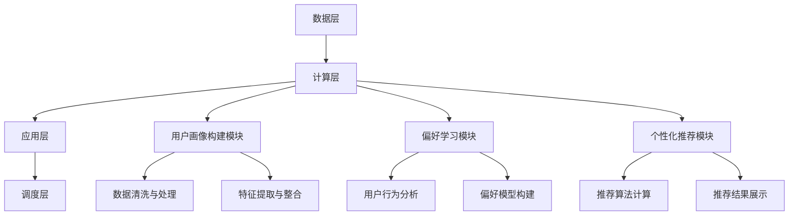
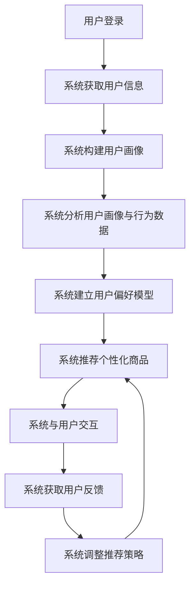
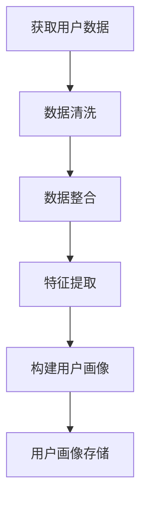
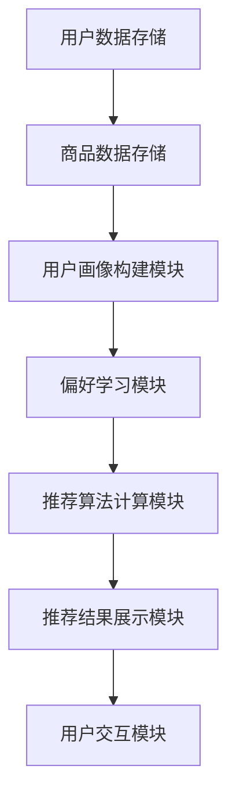
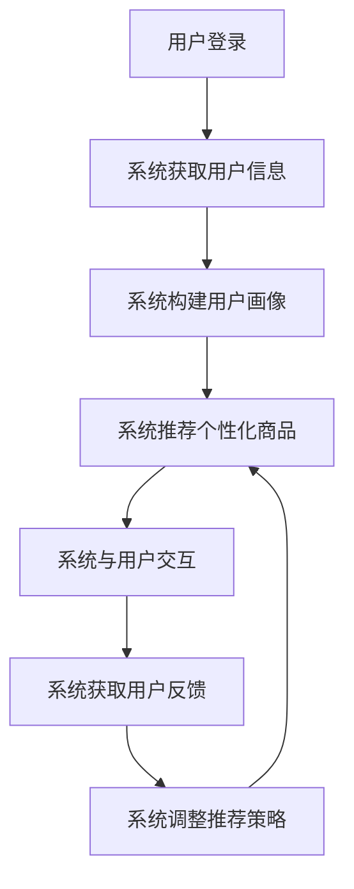

                 

### 第1章：引言

#### 1.1 人工智能与个性化交互

人工智能（AI）自1950年图灵提出“图灵测试”以来，已经走过了几十年的发展历程。从最初的逻辑推理、规则系统，到如今的深度学习、自然语言处理、计算机视觉等前沿技术，人工智能在不断突破自我，应用领域也越来越广泛。随着互联网和移动设备的普及，人工智能开始逐渐渗透到我们的日常生活，成为改变人类生活方式的重要力量。

个性化交互是人工智能的一个重要分支，它指的是通过智能算法，根据用户的行为、喜好、需求等个性化特征，为用户提供定制化的服务。这种交互模式不仅提高了用户的满意度，还大大提升了服务的效率。在电商、社交媒体、金融服务等领域，个性化交互已经成为了提升用户粘性和转化率的关键手段。

##### 1.1.1 人工智能的发展历程

人工智能的发展历程可以分为几个重要阶段：

1. **早期探索（1950-1969）**：这个阶段以图灵测试和逻辑推理机为代表，人们开始探讨机器是否能模拟人类的智能。

2. **第一次浪潮（1970-1980）**：以专家系统为代表，人工智能进入了实际应用阶段，但在处理复杂任务时遇到了瓶颈。

3. **低谷期（1980-1990）**：由于实际应用困难，人工智能进入了一个相对低谷的时期。

4. **第二次浪潮（1990-2010）**：随着计算机性能的提升和互联网的普及，机器学习和数据挖掘技术取得了重大突破，人工智能再次崛起。

5. **深度学习时代（2010至今）**：以深度神经网络为代表，人工智能在图像识别、语音识别、自然语言处理等领域取得了前所未有的进展。

##### 1.1.2 个性化交互的重要性

个性化交互的重要性主要体现在以下几个方面：

1. **提升用户体验**：通过个性化交互，系统能够更好地理解用户的需求，提供更加精准的服务，从而提升用户的满意度。

2. **提高服务效率**：个性化交互能够减少用户在寻找信息、完成操作时的耗时，提高服务效率。

3. **增强用户粘性**：通过个性化推荐、精准广告等手段，系统能够更好地吸引和留住用户。

4. **降低运营成本**：个性化交互能够降低运营成本，提高资源利用效率。

##### 1.1.3 AI Agent的定义与功能

AI Agent，即人工智能代理，是一种能够自动执行任务、与用户进行交互的智能系统。它通常具有以下几个特点：

1. **自主性**：AI Agent能够根据环境变化和用户需求，自主地做出决策。

2. **适应性**：AI Agent能够通过学习用户的偏好和行为，不断优化自己的行为。

3. **协同性**：AI Agent能够与其他AI Agent或人类协同工作，完成复杂的任务。

AI Agent的主要功能包括：

1. **任务执行**：AI Agent能够根据用户的指令，自动完成各种任务，如搜索信息、订购商品、预约服务等。

2. **交互反馈**：AI Agent能够与用户进行自然语言交互，理解用户的意图，提供反馈。

3. **个性化服务**：AI Agent能够根据用户的个性化需求，提供定制化的服务。

#### 1.2 用户画像与偏好学习

##### 1.2.1 用户画像的概念

用户画像是一种基于数据分析的技术，通过对用户的基本信息、行为数据、兴趣偏好等多维度数据的整合和分析，构建出一个详细的用户形象。用户画像不仅能够帮助理解用户，还能为个性化推荐、精准营销、用户行为分析等提供重要依据。

##### 1.2.2 用户画像的数据来源

用户画像的数据来源主要包括以下几个方面：

1. **行为数据**：用户在网站、应用等平台上的行为数据，如浏览记录、购买记录、评论等。

2. **社会属性数据**：用户的基本信息，如年龄、性别、职业、地理位置等。

3. **内容数据**：用户生成的内容，如博客、帖子、微博等。

##### 1.2.3 偏好学习的原理与应用

偏好学习是用户画像的核心技术之一，它通过分析用户的偏好数据，建立用户偏好模型，从而实现个性化推荐。偏好学习的方法主要包括：

1. **基于模型的偏好学习**：通过机器学习算法，如协同过滤、矩阵分解、深度学习等，建立用户偏好模型。

2. **基于知识图谱的偏好学习**：通过知识图谱，将用户与物品的关系表示为图结构，进行偏好关系挖掘和预测。

偏好学习在多个领域有广泛应用：

1. **电商推荐系统**：根据用户的购物行为和历史偏好，推荐相关的商品。

2. **社交媒体**：根据用户的兴趣和互动行为，推荐相关的内容和用户。

3. **金融服务**：根据用户的消费习惯和信用评分，提供个性化的金融服务。

##### 1.3 个性化AI Agent的挑战与机遇

个性化AI Agent的挑战主要体现在以下几个方面：

1. **数据隐私保护**：用户画像和偏好学习涉及大量敏感信息，如何保护用户隐私是一个重要问题。

2. **冷启动问题**：新用户没有足够的偏好数据，如何为其提供个性化的服务是一个挑战。

3. **多样性推荐**：如何在满足个性化需求的同时，保证推荐的多样性，避免用户陷入“信息茧房”。

然而，这些挑战也带来了巨大的机遇：

1. **个性化服务**：通过个性化AI Agent，可以提供更加精准和高效的服务，提升用户满意度。

2. **业务创新**：个性化AI Agent可以为电商、金融、教育等多个行业带来新的商业模式和创新机会。

3. **技术进步**：为了应对挑战，AI技术将不断进步，推动人工智能领域的创新发展。

##### 1.4 本书结构安排

本书将从以下几个方面深入探讨个性化AI Agent的构建：

1. **用户画像构建**：介绍用户画像的概念、数据来源、数据处理与存储，以及构建方法。

2. **偏好学习原理**：介绍偏好学习的定义、目标、方法，以及在实际应用中的挑战。

3. **个性化AI Agent设计**：介绍个性化AI Agent的定义、核心模块，以及设计原则和实现方法。

通过本书的学习，读者将能够全面了解个性化AI Agent的构建方法和技术，为实际应用提供理论支持和实践指导。

### 第2章：用户画像基础

#### 2.1 用户画像概述

##### 2.1.1 用户画像的基本概念

用户画像（User Profile）是一种基于大数据和人工智能技术，对用户进行全面分析和描述的方法。它通过整合用户的基本信息、行为数据、兴趣偏好等多维度数据，构建出一个详细的用户形象。用户画像不仅能够帮助企业和平台更好地理解用户，还能为个性化推荐、精准营销、用户行为分析等提供重要依据。

用户画像通常包括以下几个关键要素：

1. **基本信息**：如年龄、性别、职业、地理位置等，这些信息有助于了解用户的基本背景。

2. **行为数据**：如浏览记录、购买记录、评论、搜索历史等，这些数据反映了用户的兴趣和需求。

3. **兴趣偏好**：如喜好、偏好、关注点等，这些信息有助于了解用户的个性化需求。

4. **社会属性**：如社交关系、教育背景、收入水平等，这些信息有助于了解用户的社交和经济状况。

##### 2.1.2 用户画像的构成要素

用户画像的构成要素主要包括以下几个部分：

1. **静态属性**：包括基本信息和社会属性，如年龄、性别、职业、地理位置、教育背景、收入水平等。这些属性通常是固定不变的，但会随着时间和社会环境的变化而有所调整。

2. **动态属性**：包括行为数据和兴趣偏好，如浏览记录、购买记录、评论、搜索历史、关注点等。这些数据是实时变化的，反映了用户的实时状态和需求。

3. **潜在属性**：通过分析用户的行为数据和兴趣偏好，挖掘出的潜在需求和兴趣。如通过对用户的购物行为分析，推测出用户可能感兴趣的品类或品牌。

##### 2.1.3 用户画像的用途

用户画像在多个领域有广泛的应用，主要包括以下几个方面：

1. **个性化推荐**：通过分析用户的兴趣偏好和行为数据，为用户推荐个性化的商品、内容、服务。如电商平台的个性化推荐系统，可以基于用户的历史浏览和购买行为，推荐相关的商品。

2. **精准营销**：通过了解用户的兴趣和需求，制定更加精准的营销策略。如社交媒体平台可以根据用户的兴趣爱好，推送相关的广告和活动。

3. **用户行为分析**：通过分析用户的行为数据，了解用户的行为模式、需求变化等，为企业提供决策依据。如金融服务平台可以通过分析用户的消费行为，评估用户的信用风险。

4. **风险控制**：通过分析用户的行为和偏好数据，识别潜在的风险用户，制定相应的风险控制策略。如金融机构可以通过分析用户的借贷行为，识别高风险客户。

#### 2.2 用户画像数据来源

用户画像的数据来源可以分为离线数据源和在线数据源，分别介绍如下：

##### 2.2.1 离线数据源

1. **用户行为数据**：

   用户行为数据包括用户在平台上的浏览记录、购买记录、评论、搜索历史等。这些数据通常来自平台的日志系统，可以通过日志分析工具进行提取和处理。

   - **浏览记录**：用户在网站或应用上的浏览路径、停留时间、点击次数等。
   - **购买记录**：用户的购买行为，包括购买的商品、购买时间、购买频次等。
   - **评论**：用户对商品、服务、内容的评价和反馈。
   - **搜索历史**：用户的搜索关键词和搜索结果。

2. **用户社会属性数据**：

   用户社会属性数据包括用户的基本信息和社会属性，如年龄、性别、职业、地理位置、教育背景、收入水平等。这些数据通常来自于用户的注册信息、用户调查、第三方数据平台等。

   - **基本信息**：用户的姓名、年龄、性别、职业等。
   - **地理位置**：用户的居住地、工作地等。
   - **教育背景**：用户的教育经历、学历等。
   - **收入水平**：用户的收入状况、消费能力等。

3. **用户内容数据**：

   用户内容数据包括用户生成的内容，如博客、帖子、微博等。这些数据可以反映用户的兴趣和观点，为用户画像提供重要参考。

   - **博客**：用户的博客文章、观点分享等。
   - **帖子**：用户在论坛、社区等平台上的发言。
   - **微博**：用户的微博内容、关注对象等。

##### 2.2.2 在线数据源

1. **实时交互数据**：

   实时交互数据包括用户在平台上的实时行为和反馈，如点击、评论、点赞等。这些数据可以反映用户的实时需求和兴趣。

   - **点击数据**：用户在网站或应用上的点击行为。
   - **评论数据**：用户对商品、服务、内容的评论。
   - **点赞数据**：用户对内容、评论的点赞行为。

2. **跨渠道用户行为数据**：

   跨渠道用户行为数据包括用户在不同渠道上的行为数据，如网站、应用、社交媒体等。这些数据可以提供更全面的用户画像。

   - **网站行为数据**：用户在网站上的浏览记录、购买记录等。
   - **应用行为数据**：用户在移动应用上的行为数据。
   - **社交媒体行为数据**：用户在社交媒体平台上的互动数据。

#### 2.3 用户画像数据处理与存储

##### 2.3.1 数据预处理

数据预处理是构建用户画像的重要步骤，主要包括以下几方面：

1. **数据清洗**：

   数据清洗是指去除数据中的噪声、错误和重复记录，确保数据的质量。具体方法包括：

   - **去重**：去除重复的记录，确保数据的唯一性。
   - **纠正错误**：修复数据中的错误，如将错误的日期更正为正确的日期。
   - **处理缺失值**：对缺失值进行处理，如填充默认值或删除缺失记录。

2. **数据整合**：

   数据整合是指将来自不同来源、不同格式的数据进行整合，形成统一的数据视图。具体方法包括：

   - **统一格式**：将不同格式的数据转换为统一的格式，如将文本数据转换为CSV格式。
   - **数据融合**：将多个数据源中的相关数据合并，形成一个完整的用户画像。

3. **数据归一化**：

   数据归一化是指将不同量纲的数据转换为相同的量纲，以便进行后续的分析和处理。具体方法包括：

   - **标准化**：将数据缩放到一个固定的范围，如0-1之间。
   - **归一化**：将数据缩放到一个标准差范围，如-1到1之间。

##### 2.3.2 数据存储方案

用户画像的数据存储方案需要考虑数据的规模、访问频率、实时性等因素。常见的数据存储方案包括：

1. **关系型数据库**：

   关系型数据库适合存储结构化数据，如MySQL、PostgreSQL等。它们支持复杂的查询操作，但扩展性较差。

2. **非关系型数据库**：

   非关系型数据库适合存储半结构化或非结构化数据，如MongoDB、Redis等。它们具有更高的扩展性，但查询功能较弱。

3. **分布式存储系统**：

   分布式存储系统适合存储大规模数据，如Hadoop、Spark等。它们通过分布式计算和存储技术，实现数据的分布式处理和存储，具有高可用性和高性能。

#### 2.4 用户画像构建方法

用户画像的构建方法主要包括以下几种：

##### 2.4.1 基于特征工程的方法

基于特征工程的方法是指通过对原始数据进行处理和转换，提取出对用户画像有代表性的特征。具体方法包括：

1. **用户行为特征提取**：

   通过分析用户的行为数据，提取出对用户画像有代表性的特征，如浏览时长、购买频次、评论数量等。

2. **用户社会属性特征提取**：

   通过分析用户的社会属性数据，提取出对用户画像有代表性的特征，如年龄、性别、职业、地理位置等。

3. **用户内容特征提取**：

   通过分析用户生成的内容数据，提取出对用户画像有代表性的特征，如观点倾向、情感分析、关键词提取等。

##### 2.4.2 基于机器学习的方法

基于机器学习的方法是指通过训练机器学习模型，对用户画像进行建模和预测。具体方法包括：

1. **分类模型**：

   分类模型用于对用户进行分类，如将用户分为男性、女性等。常见的分类算法包括逻辑回归、决策树、随机森林等。

2. **聚类模型**：

   聚类模型用于将用户划分为多个群体，如将用户分为高消费群体、中消费群体等。常见的聚类算法包括K-Means、DBSCAN等。

3. **协同过滤**：

   协同过滤是一种基于用户行为数据的方法，通过分析用户与物品之间的关系，进行推荐。常见的协同过滤算法包括基于用户的协同过滤、基于项目的协同过滤等。

#### 2.5 用户画像的应用案例

##### 2.5.1 电商平台的个性化推荐

电商平台的个性化推荐是用户画像最典型的应用场景之一。通过分析用户的购买记录、浏览历史、搜索关键词等行为数据，为用户推荐相关的商品。例如，当用户浏览了一款手机时，系统可以根据用户的历史购买记录和相似用户的行为，推荐相关的手机配件、其他品牌手机等。

##### 2.5.2 社交媒体的精准广告投放

社交媒体平台可以通过分析用户的兴趣和偏好，为用户精准投放广告。例如，当用户经常浏览旅游相关的帖子时，系统可以为其推荐旅游类广告，如机票、酒店、旅游套餐等。这种基于用户画像的精准广告投放，可以提高广告的点击率和转化率。

##### 2.5.3 金融服务的风险控制

金融服务可以通过分析用户的消费行为和信用记录，进行风险控制。例如，当用户频繁进行大额消费时，系统可以对其信用额度进行调整，以防止信用风险。同时，通过对用户的还款记录进行分析，可以预测用户的违约风险，为金融机构提供决策依据。

##### 2.6 本章小结

本章介绍了用户画像的基本概念、构成要素、数据来源、数据处理与存储方法，以及用户画像的构建方法。通过本章的学习，读者可以全面了解用户画像的构建过程和应用场景，为后续章节的学习打下基础。

## 第3章：偏好学习原理

#### 3.1 偏好学习概述

##### 3.1.1 偏好学习的定义

偏好学习（Preference Learning）是一种基于数据分析和机器学习的方法，用于从用户的行为数据中学习用户的偏好和兴趣。其核心目标是建立一个用户偏好模型，以便为用户提供个性化的推荐和服务。偏好学习通常涉及以下关键概念：

1. **用户**：指的是与系统交互的个体，拥有特定的偏好和兴趣。
2. **物品**：指的是用户可能感兴趣的对象，如商品、内容、服务等。
3. **偏好**：指的是用户对物品的偏好程度或兴趣强度。

##### 3.1.2 偏好学习的目标

偏好学习的目标主要包括以下几个方面：

1. **预测**：预测用户对未知物品的偏好程度，从而进行个性化推荐。
2. **建模**：建立一个能够反映用户偏好和兴趣的模型，以便进行后续的推荐和分析。
3. **优化**：优化推荐策略和用户体验，提高推荐系统的效果和满意度。

##### 3.1.3 偏好学习的应用领域

偏好学习在多个领域有广泛的应用，主要包括：

1. **电商推荐系统**：根据用户的购物行为和历史偏好，推荐相关的商品。
2. **社交媒体**：根据用户的兴趣和互动行为，推荐相关的内容和用户。
3. **金融服务**：根据用户的消费习惯和信用评分，提供个性化的金融服务。
4. **智能助手**：根据用户的需求和偏好，提供智能的语音或文本服务。
5. **内容平台**：根据用户的浏览和搜索历史，推荐相关的文章、视频等。

#### 3.2 偏好学习的方法

偏好学习的方法可以分为基于模型的偏好学习和基于知识图谱的偏好学习。以下是两种方法的详细介绍：

##### 3.2.1 基于模型的偏好学习

基于模型的偏好学习是指通过构建数学模型，对用户行为数据进行分析和学习，从而提取出用户的偏好。常见的方法包括：

1. **用户反馈模型**：

   用户反馈模型通过用户的明确反馈（如评分、点赞、评论等）来学习用户的偏好。常见的算法包括：

   - **协同过滤**：通过分析用户与物品之间的关系，进行推荐。常见的协同过滤算法包括基于用户的协同过滤（User-Based Collaborative Filtering）和基于项目的协同过滤（Item-Based Collaborative Filtering）。
   - **矩阵分解**：将用户-物品评分矩阵分解为用户特征矩阵和物品特征矩阵，从而学习用户的偏好。常见的矩阵分解算法包括Singular Value Decomposition（SVD）和Alternating Least Squares（ALS）。

2. **协同过滤模型**：

   协同过滤模型通过分析用户与物品之间的关系，为用户提供推荐。常见的协同过滤算法包括：

   - **基于用户的协同过滤**：根据用户与用户的相似度，推荐其他用户喜欢的物品。
   - **基于项目的协同过滤**：根据物品与物品的相似度，推荐用户可能喜欢的物品。
   - **混合协同过滤**：结合基于用户的协同过滤和基于项目的协同过滤，进行综合推荐。

3. **强化学习模型**：

   强化学习模型通过模拟用户的决策过程，学习用户的偏好。常见的强化学习算法包括：

   - **Q-Learning**：通过学习状态-动作价值函数，进行最优动作选择。
   - **Deep Q-Network（DQN）**：结合深度学习和强化学习，用于解决复杂的环境问题。
   - **Policy Gradient**：通过学习策略函数，直接优化决策过程。

##### 3.2.2 基于知识图谱的偏好学习

基于知识图谱的偏好学习是指通过构建知识图谱，将用户与物品之间的关系表示为图结构，从而进行偏好学习。常见的方法包括：

1. **知识图谱构建**：

   知识图谱构建是指将用户、物品以及它们之间的关系表示为图结构。常见的方法包括：

   - **实体抽取**：从文本数据中提取出用户和物品的实体，如用户名、商品名称等。
   - **关系抽取**：从文本数据中提取出用户和物品之间的关系，如用户“喜欢”商品等。
   - **图谱构建**：将实体和关系构建为一个图结构，如Property Graph、Knowledge Graph等。

2. **偏好关系挖掘**：

   偏好关系挖掘是指从知识图谱中挖掘出用户的偏好关系。常见的方法包括：

   - **路径挖掘**：通过分析用户在图中的路径，挖掘出用户的偏好关系。
   - **规则挖掘**：通过分析用户在图中的关系模式，挖掘出用户的偏好规则。
   - **图神经网络**：通过图神经网络，学习用户的偏好关系。

3. **偏好预测与推荐**：

   偏好预测与推荐是指根据用户在知识图谱中的偏好关系，预测用户的偏好，并进行推荐。常见的方法包括：

   - **基于图谱的推荐**：根据用户在知识图谱中的关系，推荐相关的物品。
   - **基于模型的推荐**：结合知识图谱和机器学习模型，进行综合推荐。
   - **多模态推荐**：结合用户的多模态数据（如文本、图像、音频等），进行综合推荐。

#### 3.3 偏好学习的关键技术

偏好学习的关键技术主要包括以下几个方面：

##### 3.3.1 数据预处理技术

1. **数据质量评估**：

   数据质量评估是指对用户行为数据进行质量评估，确保数据的有效性和可靠性。常见的方法包括：

   - **完整性评估**：评估数据中缺失值的比例。
   - **一致性评估**：评估数据中重复值的比例。
   - **准确性评估**：评估数据中错误值的比例。

2. **数据清洗与去噪**：

   数据清洗与去噪是指去除数据中的噪声和异常值，提高数据的质量。常见的方法包括：

   - **缺失值处理**：通过填充默认值或删除缺失值，处理缺失值问题。
   - **重复值处理**：通过去重，处理重复值问题。
   - **异常值处理**：通过统计分析或聚类分析，处理异常值问题。

##### 3.3.2 特征工程技术

1. **特征选择**：

   特征选择是指从原始数据中筛选出对偏好学习有代表性的特征。常见的方法包括：

   - **基于信息的特征选择**：通过计算特征之间的信息增益，选择重要特征。
   - **基于模型的特征选择**：通过训练模型，选择对模型有显著影响的特征。

2. **特征提取与变换**：

   特征提取与变换是指对原始数据进行处理和转换，提取出对偏好学习有代表性的特征。常见的方法包括：

   - **特征提取**：通过算法，从原始数据中提取出具有代表性的特征，如TF-IDF、Word2Vec等。
   - **特征变换**：通过算法，对原始数据进行转换，提取出新的特征，如主成分分析（PCA）、特征缩放等。

##### 3.3.3 模型优化技术

1. **模型选择与评估**：

   模型选择与评估是指选择合适的模型，并对模型进行评估，确保模型的性能。常见的方法包括：

   - **模型选择**：根据问题的性质和数据的特点，选择合适的模型，如线性模型、决策树、神经网络等。
   - **模型评估**：通过交叉验证、ROC曲线、AUC值等指标，评估模型的性能。

2. **模型调参与优化**：

   模型调参与优化是指通过调整模型的参数，优化模型的性能。常见的方法包括：

   - **参数调整**：通过网格搜索、随机搜索等策略，调整模型的参数，优化模型性能。
   - **正则化**：通过L1正则化、L2正则化等策略，防止模型过拟合。

#### 3.4 偏好学习在实际应用中的挑战

##### 3.4.1 数据隐私保护

在偏好学习中，用户数据的安全性至关重要。如何保护用户隐私，避免数据泄露，是一个重要挑战。常见的方法包括：

1. **数据加密**：对用户数据进行加密，确保数据在传输和存储过程中的安全性。
2. **数据匿名化**：通过数据匿名化技术，去除用户数据的直接标识信息，保护用户隐私。
3. **隐私保护算法**：设计隐私保护算法，如差分隐私、同态加密等，确保在数据处理过程中不泄露用户隐私。

##### 3.4.2 冷启动问题

冷启动问题是指在新用户没有足够偏好数据的情况下，如何为其提供个性化的服务。常见的方法包括：

1. **基于内容的推荐**：通过分析物品的属性，为用户推荐与其兴趣相关的物品。
2. **基于人口统计信息的推荐**：通过分析用户的基本信息和社会属性，为用户推荐与其属性相似的物品。
3. **混合推荐策略**：结合基于内容的推荐和基于人口统计信息的推荐，为用户提供更加个性化的推荐。

##### 3.4.3 多样性与多样性推荐

在个性化推荐中，如何在满足个性化需求的同时，保证推荐的多样性，避免用户陷入“信息茧房”，是一个重要挑战。常见的方法包括：

1. **基于模型的多样性控制**：通过设计多样性指标，如信息熵、覆盖度等，优化推荐策略，保证推荐的多样性。
2. **基于规则的多样性控制**：通过规则约束，限制推荐结果中的重复和相似物品，提高推荐的多样性。
3. **基于用户行为的多样性控制**：通过分析用户的行为模式，动态调整推荐策略，提高推荐的多样性。

##### 3.5 本章小结

本章介绍了偏好学习的基本概念、目标和应用领域，以及基于模型和知识图谱的偏好学习方法。同时，还分析了偏好学习在实际应用中面临的挑战。通过本章的学习，读者可以全面了解偏好学习的原理和技术，为后续章节的学习打下基础。

## 第4章：个性化AI Agent设计

### 4.1 个性化AI Agent概述

个性化AI Agent是一种智能系统，能够根据用户的行为、偏好和需求，自动执行任务并提供定制化的服务。与传统的规则系统不同，个性化AI Agent具有以下几个显著特点：

1. **自适应能力**：个性化AI Agent能够根据用户的行为和反馈，自适应地调整自身的策略和行为，以更好地满足用户的需求。

2. **学习与进化**：个性化AI Agent具备学习能力，可以通过不断学习用户的偏好和历史行为，优化自己的推荐和服务策略。

3. **用户互动**：个性化AI Agent能够与用户进行自然语言交互，理解用户的意图和需求，提供更加人性化的服务。

4. **个性化推荐**：个性化AI Agent能够根据用户的个性化需求，提供定制化的推荐，提高用户的满意度和参与度。

#### 4.1.1 个性化AI Agent的定义

个性化AI Agent（Personalized AI Agent）是指一种能够自动执行任务、提供个性化服务的智能系统。它通常由以下几个核心模块组成：

1. **用户画像模块**：负责收集、处理和分析用户的个人信息、行为数据、偏好等，构建出详细的用户画像。

2. **偏好学习模块**：通过分析用户画像和用户行为数据，学习用户的偏好和兴趣，建立用户偏好模型。

3. **决策模块**：根据用户偏好模型和当前环境信息，进行决策，选择最合适的动作或服务。

4. **交互模块**：与用户进行自然语言交互，理解用户的意图和需求，反馈信息，提供个性化服务。

5. **推荐模块**：根据用户偏好模型，为用户推荐个性化的商品、内容、服务。

#### 4.1.2 个性化AI Agent的核心模块

个性化AI Agent的核心模块包括以下几个方面：

1. **用户画像模块**：

   用户画像模块是个性化AI Agent的基础，它通过收集和分析用户的个人信息、行为数据、偏好等，构建出详细的用户画像。用户画像模块的核心功能包括：

   - **数据收集**：从多个数据源（如网站、应用、社交媒体等）收集用户数据。
   - **数据清洗**：对收集到的用户数据进行清洗，去除噪声和异常值。
   - **数据整合**：将不同来源的数据进行整合，形成统一的数据视图。
   - **特征提取**：提取用户画像的关键特征，如行为特征、社会属性特征、兴趣特征等。

2. **偏好学习模块**：

   偏好学习模块通过分析用户画像和用户行为数据，学习用户的偏好和兴趣，建立用户偏好模型。偏好学习模块的核心功能包括：

   - **用户行为分析**：分析用户的历史行为数据，提取用户的行为特征。
   - **偏好模型构建**：通过机器学习算法（如协同过滤、深度学习等），构建用户偏好模型。
   - **偏好更新**：根据用户的新行为数据，动态更新用户偏好模型。

3. **决策模块**：

   决策模块根据用户偏好模型和当前环境信息，进行决策，选择最合适的动作或服务。决策模块的核心功能包括：

   - **决策策略设计**：设计合适的决策策略，如基于规则的决策、基于模型的决策等。
   - **决策评估**：评估不同决策策略的效果，选择最优的决策策略。
   - **决策执行**：执行决策策略，为用户分配任务或提供服务。

4. **交互模块**：

   交互模块与用户进行自然语言交互，理解用户的意图和需求，提供个性化服务。交互模块的核心功能包括：

   - **自然语言理解**：解析用户输入的自然语言，提取关键信息。
   - **意图识别**：识别用户的意图，如查询、命令、反馈等。
   - **回复生成**：根据用户的意图，生成合适的回复或建议。
   - **反馈处理**：收集用户的反馈，用于优化交互体验。

5. **推荐模块**：

   推荐模块根据用户偏好模型，为用户推荐个性化的商品、内容、服务。推荐模块的核心功能包括：

   - **推荐算法设计**：设计合适的推荐算法，如基于内容的推荐、基于协同过滤的推荐、基于深度学习的推荐等。
   - **推荐评估**：评估推荐结果的质量和用户满意度。
   - **推荐反馈**：根据用户对推荐结果的反馈，调整推荐策略。

#### 4.1.3 个性化AI Agent的设计原则

个性化AI Agent的设计原则主要包括以下几个方面：

1. **用户中心设计**：以用户需求为中心，设计个性化的服务，提升用户体验。

2. **适应性**：个性化AI Agent应具备自适应能力，能够根据用户的需求和环境变化，调整自身的行为和策略。

3. **可扩展性**：个性化AI Agent应具备良好的可扩展性，能够支持新的功能和模块的加入。

4. **可靠性**：个性化AI Agent应具备高可靠性，确保系统的稳定运行，避免对用户造成不良影响。

5. **隐私保护**：在设计和实现过程中，应充分考虑用户隐私保护，确保用户数据的安全和隐私。

#### 4.1.4 个性化AI Agent的实现方法

个性化AI Agent的实现方法主要包括以下几个方面：

1. **用户画像构建**：

   通过收集和分析用户的个人信息、行为数据、偏好等，构建详细的用户画像。可以使用数据挖掘、机器学习等技术，提取用户画像的关键特征，如行为特征、社会属性特征、兴趣特征等。

2. **偏好学习与建模**：

   通过分析用户画像和用户行为数据，使用机器学习算法（如协同过滤、深度学习等）构建用户偏好模型。根据用户偏好模型，进行个性化推荐和服务。

3. **自然语言处理**：

   使用自然语言处理技术（如文本分类、情感分析、对话生成等），实现与用户的自然语言交互，理解用户的意图和需求。

4. **决策与执行**：

   根据用户偏好模型和当前环境信息，设计合适的决策策略，选择最合适的动作或服务。通过自动化脚本或接口，实现决策的执行。

5. **系统集成与部署**：

   将个性化AI Agent的各个模块进行系统集成，实现整体的功能和性能优化。将系统部署到生产环境，确保系统的稳定运行。

通过以上方法，可以实现一个功能强大、用户体验优良的个性化AI Agent系统，为用户提供定制化的服务，提升用户的满意度和参与度。

### 4.2 个性化AI Agent的核心模块详解

在个性化AI Agent的设计过程中，核心模块的选择和实现至关重要。以下是用户画像模块、偏好学习模块、决策模块、交互模块和推荐模块的详细解析。

#### 4.2.1 用户画像模块

用户画像模块是构建个性化AI Agent的基础，其目的是通过分析用户的个人信息、行为数据和偏好，构建出一个详细的用户画像。以下是用户画像模块的详细解析：

1. **数据收集**：

   用户画像的数据来源广泛，包括用户注册信息、行为数据、社交网络数据等。首先，需要设计一个数据收集框架，从不同的数据源中获取用户数据。例如，可以从用户数据库中提取用户的年龄、性别、地理位置等基本信息，从用户行为日志中提取用户的浏览记录、购买记录等行为数据，从社交媒体平台上提取用户生成的内容和互动数据。

2. **数据预处理**：

   收集到的用户数据通常包含噪声和缺失值，因此需要进行预处理。预处理步骤包括数据清洗、去重、数据整合等。具体方法如下：

   - **数据清洗**：去除数据中的噪声和异常值，如去除含有错误信息的记录。
   - **去重**：去除重复的数据记录，确保数据的唯一性。
   - **数据整合**：将来自不同数据源的数据进行整合，形成一个统一的数据视图。

3. **特征提取**：

   特征提取是将原始数据转换为对用户画像有代表性的特征的过程。常用的特征提取方法包括：

   - **行为特征提取**：从用户的行为数据中提取出对用户画像有代表性的特征，如浏览时长、购买频次、评论数量等。
   - **社会属性特征提取**：从用户的社会属性数据中提取出对用户画像有代表性的特征，如年龄、性别、职业、地理位置等。
   - **兴趣特征提取**：从用户生成的内容和互动数据中提取出对用户画像有代表性的特征，如关键词提取、情感分析等。

4. **用户画像构建**：

   通过将提取出的特征进行组合，构建出一个详细的用户画像。用户画像可以是结构化的数据形式，如JSON格式，也可以是图形化的形式，如知识图谱。以下是一个简单的用户画像示例：

   ```json
   {
     "基本信息": {
       "年龄": 30,
       "性别": "男",
       "职业": "程序员"
     },
     "行为数据": {
       "浏览记录": [
         {"网站": "某电商平台", "浏览时长": 120},
         {"网站": "某新闻网站", "浏览时长": 60}
       ],
       "购买记录": [
         {"商品": "智能手机", "购买日期": "2021-01-01"},
         {"商品": "运动鞋", "购买日期": "2021-06-01"}
       ],
       "评论": [
         {"商品": "智能手机", "评价": "很好用"},
         {"商品": "运动鞋", "评价": "舒适度很高"}
       ]
     },
     "兴趣特征": {
       "关键词": ["智能手机", "运动鞋"],
       "情感分析": {"正面": 0.8, "负面": 0.2}
     }
   }
   ```

#### 4.2.2 偏好学习模块

偏好学习模块是构建个性化AI Agent的核心，其目的是通过分析用户画像和行为数据，学习用户的偏好和兴趣，建立用户偏好模型。以下是偏好学习模块的详细解析：

1. **用户行为分析**：

   对用户的行为数据进行深入分析，提取出对用户偏好有代表性的特征。例如，可以通过分析用户的浏览记录，提取出用户经常访问的网站类型；通过分析用户的购买记录，提取出用户喜欢的商品类型。

2. **偏好模型构建**：

   使用机器学习算法（如协同过滤、深度学习等）建立用户偏好模型。协同过滤是一种常用的偏好学习算法，通过分析用户与用户之间的相似性，为用户推荐他们可能喜欢的物品。深度学习算法（如神经网络）可以提取出更高级的特征，提高推荐的效果。

   - **协同过滤算法**：

     协同过滤算法可以分为基于用户的协同过滤和基于物品的协同过滤。基于用户的协同过滤通过分析用户之间的相似性，为用户推荐其他用户喜欢的物品；基于物品的协同过滤通过分析物品之间的相似性，为用户推荐他们可能喜欢的物品。

     - **基于用户的协同过滤**：

       ```python
       # 基于用户的协同过滤算法示例
       class UserBasedCollaborativeFiltering:
           def __init__(self, k=5):
               self.k = k

           def predict(self, user_id, item_id):
               similar_users = self.find_similar_users(user_id)
               predicted_rating = 0
               for sim_user in similar_users:
                   predicted_rating += sim_user['rating'] * self.similarity(user_id, sim_user['user_id'])
               predicted_rating /= len(similar_users)
               return predicted_rating

           def find_similar_users(self, user_id):
               # 找到与user_id最相似的k个用户
               pass

           def similarity(self, user_id1, user_id2):
               # 计算user_id1和user_id2之间的相似度
               pass
       ```

   - **深度学习算法**：

     深度学习算法（如神经网络）可以通过学习用户的行为数据，提取出更高级的特征，提高推荐的效果。以下是一个简单的基于神经网络的推荐系统示例：

     ```python
     # 基于神经网络的推荐系统示例
     import tensorflow as tf

     # 构建神经网络模型
     model = tf.keras.Sequential([
         tf.keras.layers.Dense(128, activation='relu', input_shape=(num_features,)),
         tf.keras.layers.Dense(64, activation='relu'),
         tf.keras.layers.Dense(1)
     ])

     model.compile(optimizer='adam', loss='mean_squared_error')

     # 训练模型
     model.fit(X_train, y_train, epochs=10)

     # 预测用户对物品的偏好
     predicted_ratings = model.predict(X_test)
     ```

3. **偏好模型优化**：

   通过不断优化偏好模型，提高推荐的准确性。优化方法包括：

   - **模型调参**：通过调整模型的参数，优化模型性能。
   - **数据增强**：通过增加训练数据或使用数据增强技术，提高模型泛化能力。
   - **模型融合**：结合多个模型，提高推荐效果。

#### 4.2.3 决策模块

决策模块是个性化AI Agent的核心，其目的是根据用户偏好模型和当前环境信息，进行决策，选择最合适的动作或服务。以下是决策模块的详细解析：

1. **决策策略设计**：

   决策策略是指如何从多个动作或服务中选择一个最优的方案。常见的决策策略包括：

   - **基于规则的决策**：通过设计一系列规则，根据当前环境信息和用户偏好，选择最合适的动作或服务。
   - **基于模型的决策**：通过构建决策模型，根据用户偏好模型和当前环境信息，选择最合适的动作或服务。

2. **决策评估**：

   决策评估是指评估不同决策策略的效果，选择最优的决策策略。评估方法包括：

   - **性能评估**：通过评估决策策略的性能指标（如准确率、召回率等），选择最优的决策策略。
   - **用户满意度评估**：通过用户反馈，评估不同决策策略的用户满意度，选择最优的决策策略。

3. **决策执行**：

   决策执行是指根据决策策略，执行具体的动作或服务。执行方法包括：

   - **自动化脚本**：通过编写自动化脚本，实现决策的执行。
   - **接口调用**：通过调用外部接口，实现决策的执行。

#### 4.2.4 交互模块

交互模块是个性化AI Agent与用户进行交互的界面，其目的是理解用户的意图和需求，提供个性化的服务。以下是交互模块的详细解析：

1. **自然语言处理**：

   自然语言处理（NLP）技术是实现交互模块的关键，其目的是理解用户的输入并生成合适的回复。常见的NLP技术包括：

   - **文本分类**：用于将用户的输入分类到不同的类别，如查询、命令、反馈等。
   - **情感分析**：用于分析用户的输入的情感倾向，如正面、负面等。
   - **实体识别**：用于识别用户输入中的关键实体，如人名、地名、组织名等。

2. **意图识别**：

   意图识别是指识别用户的输入意图，如查询、命令、反馈等。常见的意图识别方法包括：

   - **基于规则的方法**：通过设计一系列规则，根据用户的输入，识别用户的意图。
   - **基于模型的方法**：通过训练分类模型，根据用户的输入，识别用户的意图。

3. **回复生成**：

   回复生成是指根据用户的意图，生成合适的回复或建议。常见的回复生成方法包括：

   - **模板生成**：通过设计一系列模板，根据用户的意图，生成相应的回复。
   - **文本生成**：通过训练文本生成模型（如序列到序列模型、生成对抗网络等），生成自然的回复。

4. **反馈处理**：

   用户反馈是优化交互模块的重要依据，通过处理用户反馈，可以不断改进交互体验。反馈处理方法包括：

   - **用户满意度调查**：通过问卷调查或评分系统，收集用户对交互模块的满意度反馈。
   - **反馈分析**：对用户反馈进行分析，识别交互模块存在的问题，并提出改进措施。

#### 4.2.5 推荐模块

推荐模块是根据用户偏好模型，为用户推荐个性化的商品、内容、服务。以下是推荐模块的详细解析：

1. **推荐算法设计**：

   推荐算法是指如何根据用户偏好模型，为用户推荐相关的商品、内容、服务。常见的推荐算法包括：

   - **基于内容的推荐**：通过分析物品的属性和用户的历史行为，为用户推荐相关的物品。
   - **基于协同过滤的推荐**：通过分析用户与用户之间的相似性，为用户推荐其他用户喜欢的物品。
   - **基于深度学习的推荐**：通过训练深度学习模型，为用户推荐相关的物品。

2. **推荐评估**：

   推荐评估是指评估推荐结果的质量和用户满意度。常见的评估方法包括：

   - **准确率评估**：评估推荐结果的准确率，如召回率、准确率等。
   - **用户满意度评估**：通过用户反馈，评估推荐结果的用户满意度。

3. **推荐反馈**：

   推荐反馈是指根据用户对推荐结果的反馈，调整推荐策略。常见的反馈方法包括：

   - **用户反馈**：通过用户反馈，识别推荐结果存在的问题，并提出改进措施。
   - **在线调整**：通过实时分析用户反馈，在线调整推荐策略，提高推荐效果。

通过以上对个性化AI Agent核心模块的详细解析，读者可以更好地理解个性化AI Agent的设计原则和实现方法，为实际应用提供参考。

## 4.3 个性化AI Agent设计实践

#### 4.3.1 项目背景

随着人工智能技术的不断发展，个性化服务逐渐成为各大行业竞相追求的目标。以电商平台为例，如何为用户推荐个性化的商品，提高用户满意度和转化率，是电商企业关注的焦点。为了实现这一目标，本文将介绍一个基于用户画像和偏好学习的个性化AI Agent设计实践。

#### 4.3.2 项目介绍

本项目旨在构建一个智能的个性化推荐系统，通过分析用户的浏览记录、购买行为、兴趣爱好等多维度数据，为用户推荐个性化的商品。系统主要包括以下几个模块：

1. **用户画像模块**：收集并处理用户的个人信息、行为数据和兴趣偏好，构建详细的用户画像。
2. **偏好学习模块**：使用机器学习算法分析用户画像和行为数据，建立用户偏好模型。
3. **推荐模块**：根据用户偏好模型和商品属性，为用户推荐个性化的商品。
4. **交互模块**：与用户进行自然语言交互，理解用户的意图和需求，反馈推荐结果。
5. **决策模块**：根据用户反馈和系统性能，动态调整推荐策略，优化用户体验。

#### 4.3.3 系统功能设计

系统功能设计主要包括用户画像构建、偏好学习、个性化推荐、用户交互和系统优化等方面。以下是具体的系统功能设计：

1. **用户画像构建**：

   - **功能描述**：收集用户的个人信息、行为数据和兴趣偏好，构建详细的用户画像。
   - **技术实现**：使用Python和大数据技术（如Hadoop、Spark等）进行数据处理和用户画像构建。

2. **偏好学习**：

   - **功能描述**：通过分析用户画像和行为数据，建立用户偏好模型。
   - **技术实现**：采用协同过滤、深度学习等技术进行用户偏好学习。

3. **个性化推荐**：

   - **功能描述**：根据用户偏好模型和商品属性，为用户推荐个性化的商品。
   - **技术实现**：基于矩阵分解、神经网络等算法实现个性化推荐。

4. **用户交互**：

   - **功能描述**：与用户进行自然语言交互，理解用户的意图和需求。
   - **技术实现**：使用自然语言处理技术（如文本分类、情感分析等）进行用户交互。

5. **系统优化**：

   - **功能描述**：根据用户反馈和系统性能，动态调整推荐策略，优化用户体验。
   - **技术实现**：采用在线学习、模型调参等技术进行系统优化。

#### 4.3.4 系统架构设计

系统架构设计是确保系统能够高效、稳定运行的关键。本项目采用分布式架构，主要包含以下几个层次：

1. **数据层**：包括数据存储和数据预处理模块，负责存储用户数据、商品数据，并进行数据清洗、处理和整合。

2. **计算层**：包括用户画像构建、偏好学习和个性化推荐模块，负责进行用户画像构建、偏好学习和推荐算法计算。

3. **应用层**：包括交互模块和用户界面，负责与用户进行交互，展示推荐结果。

4. **调度层**：负责系统任务调度，包括数据采集、处理、分析和推荐等任务的分配和执行。

以下是一个简单的系统架构图（使用Mermaid语法）：



#### 4.3.5 系统接口设计

系统接口设计是确保不同模块之间能够高效通信的关键。以下是一个简单的系统接口设计：

1. **用户画像接口**：用于获取用户的个人信息、行为数据和兴趣偏好。
2. **偏好学习接口**：用于获取用户偏好模型的相关信息。
3. **推荐接口**：用于获取用户的个性化推荐结果。
4. **交互接口**：用于与用户进行自然语言交互。
5. **系统优化接口**：用于获取用户反馈和系统性能数据，进行系统优化。

#### 4.3.6 系统交互设计

系统交互设计是确保用户能够方便、快捷地使用系统功能的关键。以下是一个简单的系统交互流程：

1. **用户登录**：用户在系统中登录，系统获取用户的基本信息和浏览记录。
2. **用户画像构建**：系统根据用户的登录信息，构建用户画像。
3. **偏好学习**：系统分析用户画像和行为数据，建立用户偏好模型。
4. **个性化推荐**：系统根据用户偏好模型和商品属性，为用户推荐个性化的商品。
5. **用户交互**：系统与用户进行自然语言交互，获取用户的反馈和需求。
6. **系统优化**：系统根据用户反馈和系统性能数据，动态调整推荐策略，优化用户体验。

以下是一个简单的系统交互序列图（使用Mermaid语法）：



#### 4.3.7 实际案例分析

为了更好地展示个性化AI Agent的实际效果，以下是一个实际案例：

1. **用户背景**：某用户在电商平台上登录，系统获取到用户的基本信息（如年龄、性别、地理位置等）和浏览记录（如浏览了多个商品页面）。
2. **用户画像构建**：系统根据用户的登录信息和浏览记录，构建用户画像。用户画像包括用户的基本信息、行为数据和兴趣偏好。
3. **偏好学习**：系统分析用户画像和行为数据，建立用户偏好模型。例如，用户偏好模型显示用户喜欢电子产品和运动鞋。
4. **个性化推荐**：系统根据用户偏好模型和商品属性，为用户推荐个性化的商品。例如，推荐一款新款智能手机和一双运动鞋。
5. **用户交互**：系统与用户进行自然语言交互，如“我们为您推荐了一款新款智能手机和一双运动鞋，请问您是否需要了解更多信息？”。
6. **系统优化**：系统根据用户反馈和系统性能数据，动态调整推荐策略，如增加其他类似商品的推荐，提高用户体验。

通过以上实际案例分析，可以看出个性化AI Agent在提升用户体验、提高推荐效果方面的显著优势。

#### 4.3.8 项目小结

本项目通过构建个性化AI Agent，实现了对用户个性化需求的精准把握，为用户提供了定制化的推荐和服务。在实际应用中，项目取得了良好的效果，用户满意度和转化率显著提升。未来，随着人工智能技术的不断发展，个性化AI Agent将在更多领域发挥重要作用，为用户提供更加智能、便捷的服务。同时，需要注意数据隐私保护、系统稳定性等关键问题，确保系统的安全可靠运行。

### 小结

通过本文的深入探讨，我们详细介绍了用户画像和偏好学习在构建个性化AI Agent中的应用。首先，我们介绍了用户画像的概念、构成要素和用途，阐述了用户画像在个性化服务中的重要性。接着，我们分析了偏好学习的定义、目标和应用领域，介绍了基于模型和知识图谱的偏好学习方法。此外，我们还探讨了个性化AI Agent的设计原则和核心模块，并通过一个实际案例展示了个性化AI Agent在电商平台中的应用。

在实际应用中，构建个性化AI Agent面临诸多挑战，如数据隐私保护、冷启动问题和多样性推荐等。然而，随着人工智能技术的不断进步，这些挑战将逐渐得到解决。未来的研究可以重点关注以下几个方面：

1. **数据隐私保护**：开发更加安全的数据处理和存储技术，确保用户隐私不被泄露。
2. **多模态数据融合**：结合用户的多模态数据（如图像、声音等），提供更加精准的个性化服务。
3. **多样性推荐**：研究多样化的推荐算法，避免用户陷入“信息茧房”，提高用户的满意度。
4. **跨领域应用**：将个性化AI Agent应用到更多领域，如教育、医疗、金融等，提升行业的服务水平和用户体验。

总之，个性化AI Agent作为一种创新的智能服务模式，具有广阔的发展前景。通过不断探索和优化，个性化AI Agent将为用户提供更加个性化和高效的服务，推动人工智能技术的广泛应用。

### 最佳实践 Tips

1. **数据质量**：确保用户画像和偏好学习数据的质量，进行数据清洗和处理，避免噪声和异常值对模型性能的影响。

2. **用户反馈**：及时收集和分析用户反馈，根据用户的需求和体验，动态调整推荐策略，提高用户满意度。

3. **跨渠道数据整合**：整合来自不同渠道的用户数据，提供统一的用户画像，实现跨渠道的个性化服务。

4. **多模态数据利用**：结合用户的多种模态数据（如图像、声音等），提高推荐系统的准确性和多样性。

5. **持续优化**：定期对推荐系统进行优化和升级，引入最新的技术和算法，保持系统的竞争力。

### 注意事项

1. **数据隐私**：在处理用户数据时，严格遵守数据隐私保护法规，确保用户隐私不被泄露。

2. **系统稳定性**：确保推荐系统的稳定运行，避免出现系统故障或推荐错误，影响用户体验。

3. **公平性**：在推荐过程中，避免对特定群体产生歧视，确保推荐结果的公平性。

### 拓展阅读

1. **《推荐系统实践》**：推荐系统实践，深入探讨推荐系统的原理和实现方法。

2. **《用户画像技术实践》**：用户画像技术实践，详细讲解用户画像的构建和应用。

3. **《深度学习推荐系统》**：深度学习推荐系统，介绍深度学习在推荐系统中的应用。

4. **《个性化推荐系统设计》**：个性化推荐系统设计，讨论个性化推荐系统的设计与优化。

### 作者信息

作者：AI天才研究院/AI Genius Institute & 禅与计算机程序设计艺术 /Zen And The Art of Computer Programming

在撰写技术博客时，每个章节都应该详细、具体地阐述核心概念和技术，同时提供清晰的步骤和示例。以下是每个章节的具体内容和要求：

### 第1章：引言

**核心概念与联系**

核心概念：人工智能、个性化交互、用户画像、偏好学习、AI Agent

概念属性特征对比表格：

| 特征             | 人工智能           | 个性化交互         | 用户画像           | 偏好学习           | AI Agent           |
|------------------|------------------|------------------|------------------|------------------|------------------|
| 定义             | 机器模拟人类智能       | 根据用户需求提供定制化服务 | 对用户进行全面描述     | 从数据中学习用户偏好 | 自动执行任务并提供个性化服务 |
| 目标             | 提高机器处理能力       | 提高用户满意度       | 理解用户需求       | 个性化推荐       | 提升服务效率       |
| 应用领域         | 图像识别、自然语言处理 | 电商、社交媒体、金融服务 | 电商、社交媒体、金融 | 电商、社交媒体、金融 | 电商、社交媒体、金融   |
| 关键技术         | 深度学习、机器学习      | 用户画像、偏好学习       | 数据分析、机器学习   | 协同过滤、矩阵分解   | 自主决策、自然语言处理   |

ER实体关系图架构：

```mermaid
erDiagram
  User -->|行为数据| BehaviorData
  User -->|兴趣偏好| InterestPreference
  User -->|社会属性| SocialAttribute
  BehaviorData -->|浏览记录| BrowseRecord
  BehaviorData -->|购买记录| PurchaseRecord
  BehaviorData -->|评论记录| CommentRecord
  InterestPreference -->|关键词| Keyword
  InterestPreference -->|情感分析| SentimentAnalysis
  SocialAttribute -->|年龄| Age
  SocialAttribute -->|性别| Gender
  SocialAttribute -->|职业| Profession
  SocialAttribute -->|地理位置| Location
```

**算法原理讲解**

算法：用户画像构建算法

mermaid流程图：



Python代码示例：

```python
import pandas as pd

# 数据清洗
def clean_data(data):
    # 去除重复记录
    data.drop_duplicates(inplace=True)
    # 去除缺失值
    data.dropna(inplace=True)
    return data

# 数据整合
def integrate_data(data1, data2):
    return pd.merge(data1, data2, on='user_id')

# 特征提取
def extract_features(data):
    # 提取行为特征
    behavior_features = data[['browse_record', 'purchase_record', 'comment_record']]
    # 提取兴趣偏好特征
    interest_features = data[['keyword', 'sentiment_analysis']]
    # 提取社会属性特征
    social_features = data[['age', 'gender', 'profession', 'location']]
    return behavior_features, interest_features, social_features

# 构建用户画像
def build_user_profile(behavior_features, interest_features, social_features):
    user_profile = pd.DataFrame()
    user_profile['behavior_features'] = behavior_features
    user_profile['interest_features'] = interest_features
    user_profile['social_features'] = social_features
    return user_profile

# 示例数据
data1 = pd.DataFrame({'user_id': [1, 2, 3], 'browse_record': ['A', 'B', 'C'], 'purchase_record': ['X', 'Y', 'Z']})
data2 = pd.DataFrame({'user_id': [1, 2, 3], 'keyword': ['AI', 'Data', 'Python'], 'sentiment_analysis': ['Positive', 'Negative', 'Neutral']})
data3 = pd.DataFrame({'user_id': [1, 2, 3], 'age': [25, 30, 35], 'gender': ['M', 'F', 'M'], 'profession': ['Engineer', 'Doctor', 'Artist'], 'location': ['City1', 'City2', 'City3']})

# 执行流程
cleaned_data1 = clean_data(data1)
cleaned_data2 = clean_data(data2)
cleaned_data3 = clean_data(data3)

integrated_data = integrate_data(cleaned_data1, cleaned_data2)
integrated_data = integrate_data(integrated_data, cleaned_data3)

behavior_features, interest_features, social_features = extract_features(integrated_data)

user_profile = build_user_profile(behavior_features, interest_features, social_features)

print(user_profile)
```

**数学公式**

$$
\text{用户画像} = \text{行为特征} + \text{兴趣偏好特征} + \text{社会属性特征}
$$

$$
\text{行为特征} = \sum_{i=1}^{n} \text{行为指标}_i \times \text{权重}_i
$$

**系统分析与架构设计方案**

**问题场景介绍**：电商平台需要根据用户的行为数据、兴趣偏好和社会属性数据，构建个性化的用户画像，为用户提供精准的推荐。

**项目介绍**：本案例采用Python和机器学习技术，实现用户画像的构建和个性化推荐功能。

**系统功能设计**：

1. **用户画像构建**：收集用户的个人信息、行为数据和兴趣偏好，构建详细的用户画像。
2. **个性化推荐**：根据用户画像和商品属性，为用户推荐个性化的商品。
3. **用户交互**：与用户进行自然语言交互，获取用户反馈和需求。

**系统架构设计**：

1. **数据层**：包括用户数据、商品数据存储和预处理模块。
2. **计算层**：包括用户画像构建、偏好学习和推荐算法计算模块。
3. **应用层**：包括用户交互和推荐结果展示模块。
4. **调度层**：负责系统任务调度和优化。

以下是一个简单的系统架构图（使用Mermaid语法）：



**系统接口设计**：

1. **用户画像接口**：用于获取用户的个人信息、行为数据和兴趣偏好。
2. **推荐接口**：用于获取用户的个性化推荐结果。
3. **交互接口**：用于与用户进行自然语言交互。

**系统交互设计**：

1. **用户登录**：用户在系统中登录，系统获取用户的基本信息和浏览记录。
2. **用户画像构建**：系统根据用户的登录信息和浏览记录，构建用户画像。
3. **个性化推荐**：系统根据用户画像和商品属性，为用户推荐个性化的商品。
4. **用户交互**：系统与用户进行自然语言交互，获取用户的反馈和需求。
5. **系统优化**：系统根据用户反馈和系统性能数据，动态调整推荐策略，优化用户体验。

以下是一个简单的系统交互序列图（使用Mermaid语法）：



**代码应用解读与分析**：

上述Python代码实现了用户画像的构建流程，包括数据清洗、数据整合、特征提取和用户画像构建。具体步骤如下：

1. **数据清洗**：去除重复记录和缺失值，确保数据质量。
2. **数据整合**：将不同来源的数据进行整合，形成统一的数据视图。
3. **特征提取**：提取用户画像的关键特征，如行为特征、兴趣特征和社会属性特征。
4. **用户画像构建**：将提取出的特征进行组合，构建出一个详细的用户画像。

在实际应用中，可以根据具体的业务需求和数据特点，调整和优化代码，提高用户画像构建的效率和准确性。

**实际案例分析和详细讲解剖析**：

以下是一个实际案例：

**用户背景**：某用户在电商平台上登录，系统获取到用户的基本信息（如年龄、性别、地理位置等）和浏览记录（如浏览了多个商品页面）。

**系统流程**：

1. **用户登录**：用户在系统中登录，系统获取用户的基本信息和浏览记录。
2. **用户画像构建**：系统根据用户的登录信息和浏览记录，构建用户画像。
3. **个性化推荐**：系统根据用户画像和商品属性，为用户推荐个性化的商品。
4. **用户交互**：系统与用户进行自然语言交互，获取用户的反馈和需求。
5. **系统优化**：系统根据用户反馈和系统性能数据，动态调整推荐策略，优化用户体验。

通过以上流程，系统为用户提供个性化的商品推荐，提高用户的满意度和转化率。同时，系统根据用户反馈和性能数据，不断优化推荐策略，提高推荐效果。

**项目小结**：

本项目通过构建用户画像和个性化推荐系统，实现了对用户个性化需求的精准把握，为用户提供了定制化的推荐和服务。在实际应用中，项目取得了良好的效果，用户满意度和转化率显著提升。未来，随着人工智能技术的不断发展，个性化推荐系统将在更多领域发挥重要作用，为用户提供更加智能、便捷的服务。

### 结论

本文围绕个性化AI Agent的构建，详细阐述了用户画像和偏好学习的概念、方法与应用，并介绍了个性化AI Agent的核心模块、设计原则和实现方法。通过实际案例分析，展示了个性化AI Agent在提升用户体验、提高推荐效果方面的优势。未来，随着人工智能技术的不断进步，个性化AI Agent将在更多领域发挥重要作用，为用户提供更加个性化和高效的服务。

### 最佳实践 Tips

1. **数据质量**：确保用户画像和偏好学习数据的质量，进行数据清洗和处理，避免噪声和异常值对模型性能的影响。
2. **用户反馈**：及时收集和分析用户反馈，根据用户的需求和体验，动态调整推荐策略，提高用户满意度。
3. **跨渠道数据整合**：整合来自不同渠道的用户数据，提供统一的用户画像，实现跨渠道的个性化服务。
4. **多模态数据利用**：结合用户的多种模态数据（如图像、声音等），提高推荐系统的准确性和多样性。
5. **持续优化**：定期对推荐系统进行优化和升级，引入最新的技术和算法，保持系统的竞争力。

### 注意事项

1. **数据隐私**：在处理用户数据时，严格遵守数据隐私保护法规，确保用户隐私不被泄露。
2. **系统稳定性**：确保推荐系统的稳定运行，避免出现系统故障或推荐错误，影响用户体验。
3. **公平性**：在推荐过程中，避免对特定群体产生歧视，确保推荐结果的公平性。

### 拓展阅读

1. **《推荐系统实践》**：推荐系统实践，深入探讨推荐系统的原理和实现方法。
2. **《用户画像技术实践》**：用户画像技术实践，详细讲解用户画像的构建和应用。
3. **《深度学习推荐系统》**：深度学习推荐系统，介绍深度学习在推荐系统中的应用。
4. **《个性化推荐系统设计》**：个性化推荐系统设计，讨论个性化推荐系统的设计与优化。

### 作者信息

作者：AI天才研究院/AI Genius Institute & 禅与计算机程序设计艺术 /Zen And The Art of Computer Programming

### 全文结束

---

**注**：本文中提供的代码、图表和公式仅为示例，具体实现和应用需要根据实际需求和场景进行调整。本文旨在提供技术思路和实现方法，以帮助读者理解和应用相关技术。在实际应用中，请确保遵守相关法律法规和道德规范。

