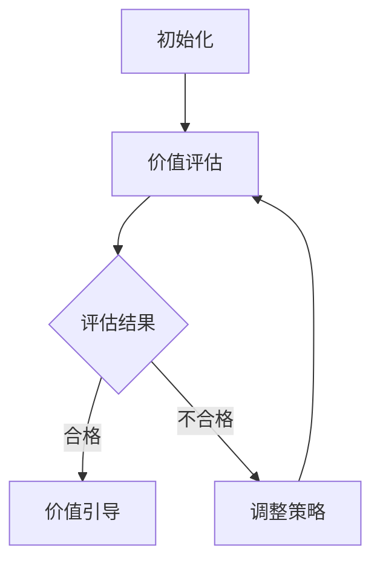

                 

## AI Agent的价值对齐：在LLM中植入人类价值观

> 关键词：价值对齐、AI Agent、Large Language Models (LLM)、伦理约束、算法实现、应用案例

> 摘要：本文探讨了AI Agent价值对齐的重要性，特别是在大型语言模型（LLM）中的应用。通过深入分析价值对齐的背景、核心概念和实现方法，本文旨在提供一套系统化的策略，以确保AI Agent在执行任务时符合人类的价值观和伦理标准。此外，文章通过实际案例展示了价值对齐在现实世界中的应用，并提出了未来发展的挑战与展望。

## 第一部分: AI Agent的价值对齐基础

### 第1章: 价值对齐背景与意义

#### 1.1 AI Agent的定义与作用

**AI Agent的概念：** AI Agent是一种自主执行任务的智能实体，能够在复杂的动态环境中通过感知、决策和行动来实现特定的目标。它通常由多个子系统和组件组成，包括感知模块、决策模块、执行模块等。

**AI Agent的应用场景：** AI Agent被广泛应用于自动化控制、智能机器人、自主驾驶、虚拟助手等多个领域。例如，自动驾驶汽车中的AI Agent需要处理复杂的交通信息，并做出安全的驾驶决策；虚拟助手需要理解用户的语言和意图，并提供相应的服务。

#### 1.2 价值对齐的背景

**人工智能的发展历程：** 随着深度学习、自然语言处理和计算机视觉等技术的发展，人工智能逐渐从理论研究走向实际应用。然而，随着AI系统的广泛应用，其潜在的伦理和道德问题也日益凸显。

**价值对齐的重要性：** 价值对齐旨在确保AI Agent在执行任务时能够遵循人类的价值观和伦理标准。这不仅可以提高AI系统的可信度，还可以避免由于价值偏差导致的错误决策。

#### 1.3 价值对齐的意义

**提高AI系统的可信度：** 通过价值对齐，AI Agent能够更好地理解人类的需求和价值观，从而提高系统的可信度和用户满意度。

**避免AI决策偏差：** 价值对齐可以帮助AI Agent避免由于偏见、误解或不当激励导致的错误决策。

**促进AI技术的可持续发展：** 价值对齐是确保AI技术可持续发展的重要环节，有助于建立社会对AI技术的信任，促进技术的长期发展。

### 第2章: 价值对齐的核心概念

#### 2.1 价值对齐的基本原理

**价值体系概述：** 价值体系是指一组用于指导人类行为的核心价值观念。在AI Agent的价值对齐过程中，价值体系是确定对齐目标和标准的基础。

**价值对齐的过程：** 价值对齐的过程包括价值评估、价值引导和效果评估等环节。通过这一过程，AI Agent能够不断调整和优化其行为，以更好地符合人类的价值观。

#### 2.2 核心概念与联系

**价值准则：** 价值准则是指导AI Agent行为的核心价值观念。它通常包括公平性、透明性、责任性等原则。

**行为规范：** 行为规范是详细规定AI Agent在特定情境下应该如何行动的规范。它通常包括具体的行为指南和操作流程。

**伦理约束：** 伦理约束是针对AI Agent行为进行道德伦理上的限制和规范。它通常涉及隐私、安全、公平等方面的伦理考量。

#### 2.3 概念属性特征对比表格

| 概念         | 描述                                                         | 特征                                                         |
| ------------ | ------------------------------------------------------------ | ------------------------------------------------------------ |
| 价值准则     | 用于指导AI Agent行为的核心价值观念                             | 明确性、一致性、适用性                                       |
| 行为规范     | 详细规定AI Agent在特定情境下应该如何行动的规范                | 可操作性、灵活性、适应性                                     |
| 伦理约束     | 针对AI Agent行为进行道德伦理上的限制和规范                    | 强制性、普遍性、动态性                                       |

### 第3章: 价值对齐的实现方法

#### 3.1 价值对齐技术概述

**价值评估方法：** 价值评估方法用于确定AI Agent在不同情境下的价值取向。常见的评估方法包括价值评估矩阵和价值评估模型等。

**价值引导机制：** 价值引导机制用于指导AI Agent的行为，使其符合人类的价值观。常见的引导机制包括激励系统、反馈机制和调整策略等。

#### 3.2 价值对齐算法原理讲解

**算法流程：** 价值对齐算法通常包括以下步骤：

1. 初始化：设置初始价值取向和参数。
2. 价值评估：对AI Agent的行为进行价值评估。
3. 价值引导：根据评估结果对AI Agent的行为进行引导。
4. 效果评估：评估价值对齐的效果，并调整参数。

**数学模型：** 价值对齐的数学模型通常基于多目标优化或决策理论。例如，可以使用目标函数和约束条件来描述价值对齐的目标和限制。

**公式推导：** 价值对齐的公式推导通常涉及目标函数的构建、约束条件的处理和优化算法的选择。

#### 3.3 Mermaid算法流程图

### 第4章: AI Agent在LLM中的应用

#### 4.1 LLM的基本概念与原理

**LLM的定义：** LLM（Large Language Model）是一种具有强大语言理解和生成能力的预训练模型，通常基于大规模的文本数据进行训练。

**LLM的架构：** LLM的架构通常包括嵌入层、编码器和解码器等模块。这些模块共同工作，实现文本输入到文本输出的转换。

#### 4.2 AI Agent在LLM中的价值对齐

**对齐策略：** AI Agent在LLM中的价值对齐可以通过以下策略实现：

1. 数据清洗：对训练数据中的不当内容进行过滤和清洗。
2. 价值导向训练：在模型训练过程中，引入价值导向的损失函数。
3. 预处理和后处理：对模型生成的文本进行预处理和后处理，以消除潜在的伦理风险。

**应用案例：** AI Agent在LLM中的价值对齐可以应用于智能客服、智能写作、智能翻译等多个领域。例如，智能客服系统中的AI Agent需要遵循公平、尊重用户隐私等价值准则，以确保服务的质量和用户的满意度。

### 第5章: 实际案例分析

#### 5.1 案例背景与问题描述

**案例背景：** 某智能客服系统在使用过程中出现了用户隐私泄露的问题。

**问题描述：** 用户在使用智能客服系统时，其个人信息被意外泄露，导致用户隐私受到侵犯。

#### 5.2 案例分析与解决方案

**案例分析：** 通过对案例的分析，发现智能客服系统在处理用户请求时，没有充分考虑用户隐私保护的价值准则。

**解决方案设计：** 为了解决这一问题，可以采取以下措施：

1. 数据加密：对用户数据进行加密处理，确保数据在传输和存储过程中的安全性。
2. 权限管理：对智能客服系统的权限进行严格管理，确保只有授权人员可以访问用户数据。
3. 价值导向培训：对智能客服系统的操作人员进行价值导向培训，提高其隐私保护意识。

#### 5.3 案例实现与效果评估

**实现步骤：** 
1. 数据加密：采用AES算法对用户数据进行加密处理。
2. 权限管理：采用RBAC（基于角色的访问控制）机制对系统权限进行管理。
3. 价值导向培训：制定详细的培训计划，对操作人员进行价值导向培训。

**效果评估：** 
1. 数据加密测试：通过模拟攻击测试，验证数据加密的有效性。
2. 权限管理测试：通过模拟操作测试，验证权限管理的有效性。
3. 培训效果评估：通过问卷调查和访谈，评估培训效果。

### 第6章: 未来展望与挑战

#### 6.1 价值对齐技术的发展趋势

**技术发展现状：** 当前，价值对齐技术在AI领域得到了广泛关注和研究。许多机构和研究人员都在探索如何将价值对齐应用于AI Agent，以提高系统的伦理和道德水平。

**未来研究方向：** 未来，价值对齐技术将继续向以下几个方面发展：

1. 多模态价值对齐：结合图像、语音、文本等多种模态，实现更全面的价值对齐。
2. 自适应价值对齐：通过学习用户行为和反馈，实现动态的价值对齐。
3. 价值对齐标准化：制定统一的评估标准和指南，以提高价值对齐的可操作性和一致性。

#### 6.2 价值对齐面临的挑战

**道德伦理问题：** 价值对齐涉及到道德伦理问题，如何确保AI Agent的行为符合人类的价值观和伦理标准，是一个亟待解决的问题。

**技术实现难题：** 价值对齐技术涉及到复杂的算法设计和实现，如何高效地实现价值评估、价值引导和效果评估，是一个技术挑战。

#### 6.3 价值对齐的最佳实践与建议

**最佳实践：** 
1. 数据隐私保护：在AI Agent的设计和应用过程中，必须充分考虑用户隐私保护，采取有效的数据加密和权限管理措施。
2. 价值导向培训：对AI Agent的操作人员进行价值导向培训，提高其伦理和道德意识。
3. 多方协作：建立多方协作机制，包括政策制定者、技术专家和用户代表，共同推动价值对齐技术的发展。

**建议与展望：** 
1. 加强政策法规建设：制定相关政策和法规，规范AI Agent的价值对齐行为。
2. 推动技术研发：加大对价值对齐技术的研究投入，开发高效、可操作的解决方案。
3. 促进社会共识：加强社会宣传和引导，提高公众对价值对齐技术的认知和理解。

### 总结

AI Agent的价值对齐是确保AI技术可持续发展的重要环节。通过本文的探讨，我们深入分析了价值对齐的背景、核心概念和实现方法，并展示了其在LLM中的应用案例。未来，随着技术的不断发展，价值对齐将面临更多的挑战和机遇。我们期待能够共同推动价值对齐技术的发展，为构建一个更加公平、透明和可信赖的AI生态系统贡献力量。

### 作者信息

作者：AI天才研究院/AI Genius Institute & 禅与计算机程序设计艺术 /Zen And The Art of Computer Programming

