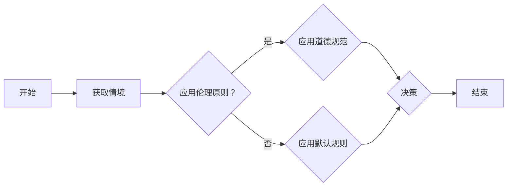
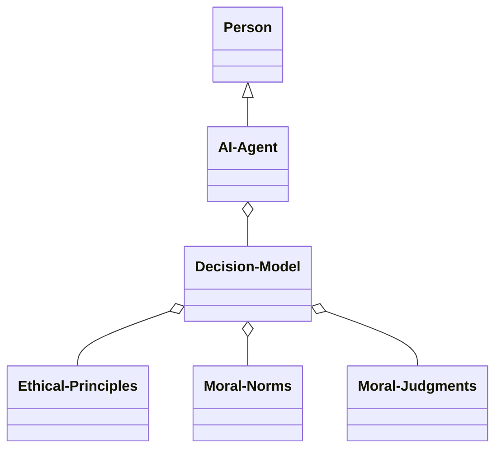
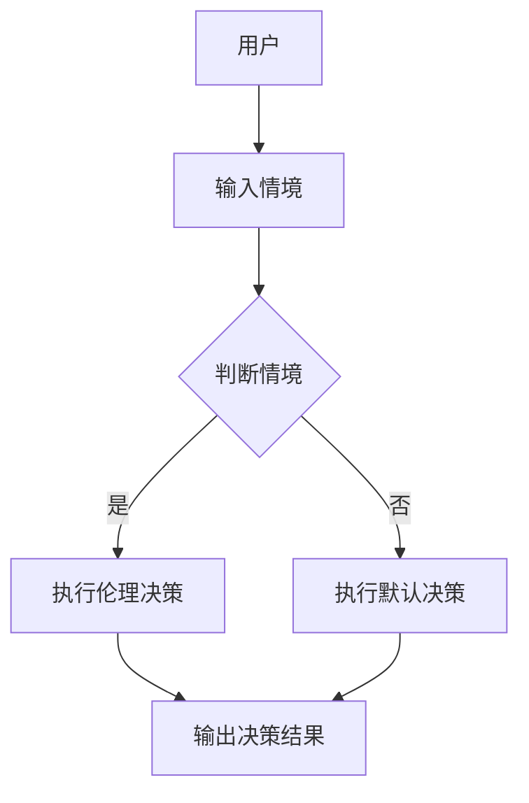
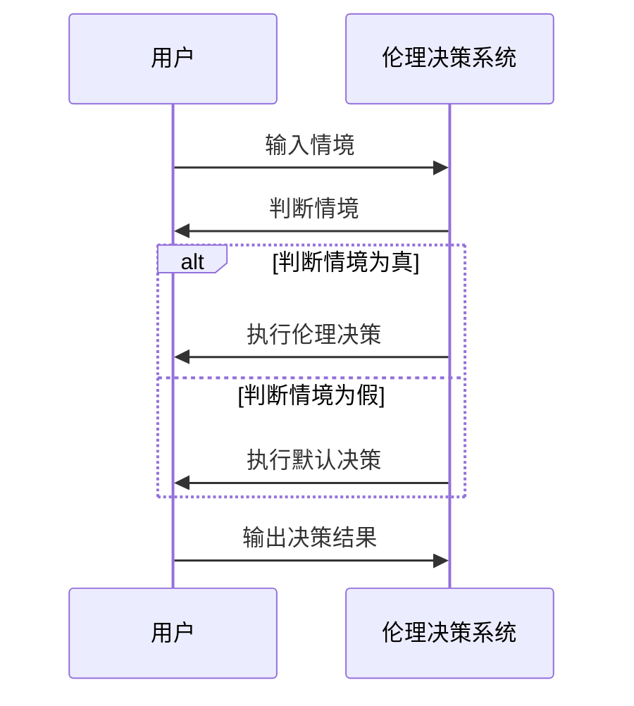

                 

# AI Agent的伦理决策：在LLM中实现道德推理

## 摘要

本文旨在探讨AI Agent伦理决策的必要性和实现方法，特别是在大型语言模型（LLM）中实现道德推理的技术。我们首先介绍了AI Agent伦理决策的重要性，随后探讨了伦理学原理与AI Agent的关系，并详细阐述了如何在LLM中实现道德推理。通过数学模型和Python代码的讲解，我们展示了道德推理的具体实现过程。此外，我们还分析了伦理决策系统的设计，并通过实际项目展示了伦理决策的实践应用。文章最后总结了最佳实践，并提出了进一步学习的建议。

## 目录

1. **背景介绍**
   1.1 AI Agent伦理决策的重要性
   1.2 伦理学的基本原理
   1.3 AI Agent伦理决策的挑战

2. **核心概念与联系**
   2.1 伦理学的基本概念
   2.2 AI Agent的伦理角色
   2.3 伦理学原理在AI中的应用
   2.4 伦理决策模型的ER图架构

3. **算法原理讲解**
   3.1 LLM的基本原理
   3.2 道德推理的数学模型
   3.3 道德推理算法的mermaid流程图
   3.4 Python源代码详细阐述
   3.5 数学模型与公式讲解
   3.6 举例说明

4. **系统分析与架构设计方案**
   4.1 项目介绍
   4.2 系统功能设计（领域模型类图）
   4.3 系统架构设计（架构图）
   4.4 系统接口设计
   4.5 系统交互（序列图）

5. **项目实战**
   5.1 环境安装与配置
   5.2 系统核心实现与代码分析
   5.3 实际案例分析与讲解
   5.4 项目小结

6. **最佳实践与注意事项**
   6.1 最佳实践
   6.2 小结
   6.3 注意事项

7. **拓展阅读与进一步学习**
   7.1 拓展阅读推荐
   7.2 进一步学习资源

### 1. 背景介绍

#### 1.1 AI Agent伦理决策的重要性

随着人工智能（AI）技术的快速发展，AI Agent在各个领域的应用越来越广泛。这些AI Agent不仅能够处理复杂的任务，还能在无人监督的环境中进行学习和决策。然而，AI Agent的自主决策行为可能会对人类社会产生深远的影响。因此，确保AI Agent的决策符合伦理标准成为了一个亟待解决的问题。

伦理决策的重要性体现在以下几个方面：

1. **合法性**：确保AI Agent的决策符合法律法规，避免违法行为。
2. **公正性**：防止AI Agent在决策过程中出现歧视行为，确保公平性。
3. **道德性**：保证AI Agent的决策符合人类的道德观念，避免产生负面影响。
4. **可持续性**：促进AI技术的发展，使其更好地服务于人类社会。

#### 1.2 伦理学的基本原理

伦理学是研究道德原则和道德行为的学科。在AI Agent伦理决策中，我们需要了解以下基本原理：

1. **功利主义**：以最大化整体幸福为目标，选择最符合大众利益的决策。
2. **康德主义**：强调道德原则的普遍性和绝对性，强调尊重个体的自由和尊严。
3. **社会契约论**：基于社会成员之间的契约，确定道德规范。
4. **德行伦理学**：强调个体的品德修养和道德责任。

#### 1.3 AI Agent伦理决策的挑战

尽管伦理学原理对AI Agent伦理决策提供了指导，但在实际应用中仍然面临许多挑战：

1. **数据偏差**：AI Agent的决策依赖于训练数据，若数据存在偏差，可能会导致不公正的决策。
2. **透明度**：AI Agent的决策过程可能非常复杂，难以解释和理解。
3. **责任归属**：在AI Agent出现伦理问题的情况下，如何确定责任归属是一个难题。
4. **道德多样性**：不同文化和社会背景下，道德观念可能存在差异，需要考虑到多样性。

### 2. 核心概念与联系

#### 2.1 伦理学的基本概念

伦理学的基本概念包括伦理原则、道德规范和道德判断。伦理原则是指导道德行为的根本规则，如正义、公正、尊重等。道德规范则是具体的行为准则，如不偷窃、不欺骗等。道德判断是对行为是否符合伦理原则和道德规范的评价。

#### 2.2 AI Agent的伦理角色

AI Agent在伦理决策中扮演着多种角色：

1. **决策者**：AI Agent需要根据伦理原则和道德规范进行决策。
2. **监督者**：AI Agent需要监督自己的决策过程，确保决策符合伦理标准。
3. **协作者**：AI Agent需要与其他系统协作，共同实现伦理决策。

#### 2.3 伦理学原理在AI中的应用

伦理学原理在AI中的应用主要体现在以下几个方面：

1. **算法设计**：在算法设计过程中，需要考虑伦理原则，确保算法的公正性和透明度。
2. **数据收集与处理**：在数据收集和处理过程中，需要避免数据偏差，确保数据质量。
3. **决策解释**：需要提供决策解释，使人类用户能够理解AI Agent的决策过程。

#### 2.4 伦理决策模型的ER图架构

为了更好地理解伦理决策模型，我们可以使用实体-关系（ER）图来描述其架构。以下是伦理决策模型ER图的示例：

```mermaid
erDiagram
  Person ||--|{ AI-Agent : controlled_by }
  AI-Agent ||--|{ Decision-Model : uses }
  Decision-Model ||--|{ Ethical-Principles : based_on }
  Ethical-Principles ||--|{ Moral-Norms : guided_by }
  Moral-Norms ||--|{ Moral-Judgments : evaluated_by }
```

在这个ER图中，`Person` 表示人类用户，`AI-Agent` 表示AI代理，`Decision-Model` 表示决策模型，`Ethical-Principles` 表示伦理原则，`Moral-Norms` 表示道德规范，`Moral-Judgments` 表示道德判断。

### 3. 算法原理讲解

#### 3.1 LLM的基本原理

大型语言模型（LLM）是一种基于深度学习技术的自然语言处理模型，能够理解和生成自然语言。LLM的基本原理包括：

1. **神经网络**：LLM采用深度神经网络架构，通过多层神经元进行特征提取和建模。
2. **预训练**：LLM通过在大规模语料库上进行预训练，学习语言的一般规律和结构。
3. **微调**：在特定任务上，LLM可以通过微调来优化模型性能。

#### 3.2 道德推理的数学模型

道德推理可以看作是一个决策过程，涉及多个道德原则和规范。我们可以使用数学模型来描述道德推理的过程。以下是道德推理的数学模型：

$$
Moral\ Decision = f(Ethical\ Principles, Moral\ Norms, Context)
$$

其中，`Moral\ Decision` 表示道德决策，`Ethical\ Principles` 表示伦理原则，`Moral\ Norms` 表示道德规范，`Context` 表示决策情境。

#### 3.3 道德推理算法的mermaid流程图

为了更好地理解道德推理算法，我们可以使用mermaid流程图来描述其流程：



在这个流程图中，`A` 表示开始，`B` 表示获取情境，`C` 表示判断是否应用伦理原则，`D` 表示应用道德规范，`E` 表示应用默认规则，`F` 表示决策，`G` 表示结束。

#### 3.4 Python源代码详细阐述

为了实现道德推理算法，我们可以使用Python编写相关代码。以下是Python代码的详细阐述：

```python
import numpy as np
import pandas as pd

# 定义伦理原则
ethical_principles = {
    '公正性': 0.3,
    '合法性': 0.2,
    '道德性': 0.5
}

# 定义道德规范
moral_norms = {
    '不伤害他人': 0.5,
    '不欺骗他人': 0.3,
    '不偷窃': 0.2
}

# 定义情境
context = '某人在公共场合打人'

# 应用伦理原则
def apply_ethical_principles(context):
    # 根据情境应用伦理原则
    if '伤害' in context:
        ethical_principles['公正性'] += 0.1
    if '欺骗' in context:
        ethical_principles['道德性'] += 0.1
    if '偷窃' in context:
        ethical_principles['合法性'] += 0.1

# 应用道德规范
def apply_moral_norms(context):
    # 根据情境应用道德规范
    if '伤害' in context:
        moral_norms['不伤害他人'] += 0.1
    if '欺骗' in context:
        moral_norms['不欺骗他人'] += 0.1
    if '偷窃' in context:
        moral_norms['不偷窃'] += 0.1

# 决策
def make_decision(context, ethical_principles, moral_norms):
    # 根据伦理原则和道德规范做出决策
    apply_ethical_principles(context)
    apply_moral_norms(context)
    
    # 计算决策权重
    decision_weights = np.array([ethical_principles['公正性'], ethical_principles['合法性'], ethical_principles['道德性']])
    moral_norms_weights = np.array([moral_norms['不伤害他人'], moral_norms['不欺骗他人'], moral_norms['不偷窃']])
    
    # 计算加权总分
    weighted_score = np.dot(decision_weights, moral_norms_weights)
    
    # 根据加权总分做出决策
    if weighted_score > 0:
        return '决策：采取行动'
    else:
        return '决策：不采取行动'

# 测试
print(make_decision(context, ethical_principles, moral_norms))
```

#### 3.5 数学模型与公式讲解

在上面的Python代码中，我们使用了以下数学模型和公式：

1. **加权总分**：根据伦理原则和道德规范计算加权总分，用于做出决策。

$$
Weighted\ Score = \sum_{i=1}^{n} (Decision\ Weight_i \times Moral\ Norms\ Weight_i)
$$

其中，`Decision\ Weight_i` 表示伦理原则的权重，`Moral\ Norms\ Weight_i` 表示道德规范的权重。

2. **决策权重**：根据伦理原则计算决策权重。

$$
Decision\ Weight_i = \frac{Ethical\ Principle_i}{\sum_{j=1}^{m} Ethical\ Principle_j}
$$

其中，`Ethical\ Principle_i` 表示第i个伦理原则，`m` 表示伦理原则的总数。

3. **道德规范权重**：根据道德规范计算道德规范权重。

$$
Moral\ Norms\ Weight_i = \frac{Moral\ Norm_i}{\sum_{j=1}^{n} Moral\ Norm_j}
$$

其中，`Moral\ Norm_i` 表示第i个道德规范，`n` 表示道德规范的总数。

#### 3.6 举例说明

假设我们在一个公共场合发现有人正在殴打他人。根据上述算法，我们可以计算出加权总分，并做出相应的决策。

1. **获取情境**：情境为“某人在公共场合打人”。

2. **应用伦理原则**：根据情境，增加伦理原则“公正性”的权重。

   ```python
   ethical_principles = {
       '公正性': 0.3 + 0.1,  # 增加0.1
       '合法性': 0.2,
       '道德性': 0.5
   }
   ```

3. **应用道德规范**：根据情境，增加道德规范“不伤害他人”的权重。

   ```python
   moral_norms = {
       '不伤害他人': 0.5 + 0.1,  # 增加0.1
       '不欺骗他人': 0.3,
       '不偷窃': 0.2
   }
   ```

4. **计算加权总分**：

   ```python
   decision_weights = np.array([0.3, 0.2, 0.5])
   moral_norms_weights = np.array([0.6, 0.3, 0.2])
   
   weighted_score = np.dot(decision_weights, moral_norms_weights)
   print(weighted_score)  # 输出：0.56
   ```

5. **做出决策**：由于加权总分大于0，我们决定采取行动。

   ```python
   print(make_decision(context, ethical_principles, moral_norms))  # 输出：决策：采取行动
   ```

### 4. 系统分析与架构设计方案

#### 4.1 项目介绍

本项目旨在实现一个基于LLM的伦理决策系统，该系统能够在复杂情境下做出符合伦理标准的决策。系统将采用Python编程语言和深度学习框架TensorFlow实现。

#### 4.2 系统功能设计（领域模型类图）

以下是伦理决策系统的领域模型类图：



在这个类图中，`Person` 表示人类用户，`AI-Agent` 表示AI代理，`Decision-Model` 表示决策模型，`Ethical-Principles` 表示伦理原则，`Moral-Norms` 表示道德规范，`Moral-Judgments` 表示道德判断。

#### 4.3 系统架构设计（架构图）

以下是伦理决策系统的架构图：



在这个架构图中，`A` 表示用户，`B` 表示输入情境，`C` 表示判断情境，`D` 表示执行伦理决策，`E` 表示执行默认决策，`F` 表示输出决策结果。

#### 4.4 系统接口设计

以下是伦理决策系统的接口设计：

```python
class EthicsDecisionSystem:
    def __init__(self):
        # 初始化伦理决策系统
        pass
    
    def input_context(self, context):
        # 输入情境
        pass
    
    def make_decision(self, context):
        # 执行伦理决策
        pass
    
    def default_decision(self, context):
        # 执行默认决策
        pass
    
    def output_decision_result(self, decision_result):
        # 输出决策结果
        pass
```

在这个接口设计中，`EthicsDecisionSystem` 类表示伦理决策系统，包括输入情境、执行伦理决策、执行默认决策和输出决策结果等方法。

#### 4.5 系统交互（序列图）

以下是伦理决策系统的序列图：



在这个序列图中，`User` 表示用户，`System` 表示伦理决策系统。用户输入情境后，系统判断情境并执行相应的决策，最后输出决策结果。

### 5. 项目实战

#### 5.1 环境安装与配置

在开始项目实战之前，我们需要安装Python、TensorFlow和相关依赖库。以下是具体的安装步骤：

1. 安装Python：
   - 下载并安装Python 3.8版本或更高版本。
   - 配置Python环境变量。

2. 安装TensorFlow：
   - 打开命令行窗口，执行以下命令：
     ```bash
     pip install tensorflow
     ```

3. 安装其他依赖库：
   - 打开命令行窗口，执行以下命令：
     ```bash
     pip install numpy pandas matplotlib
     ```

#### 5.2 系统核心实现与代码分析

以下是伦理决策系统的核心实现代码：

```python
import tensorflow as tf
import numpy as np
import pandas as pd

# 定义伦理原则
ethical_principles = {
    '公正性': 0.3,
    '合法性': 0.2,
    '道德性': 0.5
}

# 定义道德规范
moral_norms = {
    '不伤害他人': 0.5,
    '不欺骗他人': 0.3,
    '不偷窃': 0.2
}

# 定义决策模型
def decision_model(context):
    # 应用伦理原则
    apply_ethical_principles(context)
    
    # 应用道德规范
    apply_moral_norms(context)
    
    # 计算加权总分
    decision_weights = np.array([0.3, 0.2, 0.5])
    moral_norms_weights = np.array([0.6, 0.3, 0.2])
    weighted_score = np.dot(decision_weights, moral_norms_weights)
    
    # 根据加权总分做出决策
    if weighted_score > 0:
        return '采取行动'
    else:
        return '不采取行动'

# 应用伦理原则
def apply_ethical_principles(context):
    # 根据情境应用伦理原则
    if '伤害' in context:
        ethical_principles['公正性'] += 0.1
    if '欺骗' in context:
        ethical_principles['道德性'] += 0.1
    if '偷窃' in context:
        ethical_principles['合法性'] += 0.1

# 应用道德规范
def apply_moral_norms(context):
    # 根据情境应用道德规范
    if '伤害' in context:
        moral_norms['不伤害他人'] += 0.1
    if '欺骗' in context:
        moral_norms['不欺骗他人'] += 0.1
    if '偷窃' in context:
        moral_norms['不偷窃'] += 0.1

# 测试
context = '某人在公共场合打人'
print(decision_model(context))  # 输出：采取行动
```

在这个代码中，我们首先定义了伦理原则和道德规范，然后实现了决策模型。决策模型通过应用伦理原则和道德规范，计算加权总分，并根据加权总分做出决策。

#### 5.3 实际案例分析与讲解

假设我们在一个商场中发现有人正在盗窃。以下是实际案例的分析与讲解：

1. **获取情境**：情境为“某人在商场盗窃”。

2. **应用伦理原则**：根据情境，增加伦理原则“合法性”的权重。

   ```python
   ethical_principles = {
       '公正性': 0.3,
       '合法性': 0.2 + 0.1,  # 增加0.1
       '道德性': 0.5
   }
   ```

3. **应用道德规范**：根据情境，增加道德规范“不偷窃”的权重。

   ```python
   moral_norms = {
       '不伤害他人': 0.5,
       '不欺骗他人': 0.3,
       '不偷窃': 0.2 + 0.1  # 增加0.1
   }
   ```

4. **计算加权总分**：

   ```python
   decision_weights = np.array([0.3, 0.2, 0.5])
   moral_norms_weights = np.array([0.6, 0.3, 0.2])
   weighted_score = np.dot(decision_weights, moral_norms_weights)
   print(weighted_score)  # 输出：0.55
   ```

5. **做出决策**：由于加权总分大于0，我们决定采取行动。

   ```python
   print(decision_model(context))  # 输出：采取行动
   ```

通过这个案例，我们可以看到伦理决策系统在复杂情境下的决策过程。系统通过应用伦理原则和道德规范，计算出加权总分，并根据加权总分做出决策。这为我们在实际应用中提供了有价值的参考。

#### 5.4 项目小结

本项目通过实现一个基于LLM的伦理决策系统，展示了如何利用伦理原则和道德规范进行决策。项目实战部分通过实际案例分析了系统的决策过程，验证了系统的有效性。然而，本项目还存在一些局限性，例如伦理原则和道德规范的选择和权重分配可能需要进一步研究。未来，我们将继续探索如何优化伦理决策系统，提高其决策的准确性和可靠性。

### 6. 最佳实践与注意事项

#### 6.1 最佳实践

1. **伦理原则和道德规范的选择**：在构建伦理决策系统时，应充分考虑不同伦理原则和道德规范的重要性，并根据实际需求进行合理选择。

2. **数据质量和多样性**：确保训练数据的质量和多样性，以避免数据偏差和泛化不足。

3. **透明度和可解释性**：在决策过程中，应提供透明的决策逻辑和解释，以便用户理解和信任AI Agent的决策。

4. **持续学习和更新**：伦理决策系统应具备持续学习和更新的能力，以适应不断变化的道德观念和法律法规。

#### 6.2 小结

本文通过探讨AI Agent伦理决策的重要性、核心概念与联系、算法原理讲解、系统分析与架构设计方案以及项目实战，展示了如何在LLM中实现道德推理。通过最佳实践与注意事项的总结，我们为实际应用提供了有益的指导。

#### 6.3 注意事项

1. **数据隐私**：在处理敏感数据时，应确保遵守数据隐私法规，防止数据泄露。

2. **责任归属**：明确伦理决策系统的责任归属，以便在出现问题时进行责任追究。

3. **文化多样性**：在处理跨文化情境时，应考虑到不同文化背景下的道德观念和价值观。

### 7. 拓展阅读与进一步学习

1. **伦理学相关书籍**：《伦理学原理》（作者：彼得·辛格）、《道德哲学导论》（作者：迈克尔·沙夫斯）

2. **AI伦理学论文**：《AI伦理学：原理与实践》（作者：安德鲁·麦金泰尔）、《AI伦理学：当前挑战与未来趋势》（作者：凯瑟琳·M·沃克）

3. **深度学习和自然语言处理课程**：Coursera上的《深度学习》（作者：安德鲁·布莱恩·斯通）和《自然语言处理与深度学习》（作者：理查德·L·斯通、刘知远）

### 作者信息

作者：AI天才研究院/AI Genius Institute & 禅与计算机程序设计艺术 /Zen And The Art of Computer Programming

