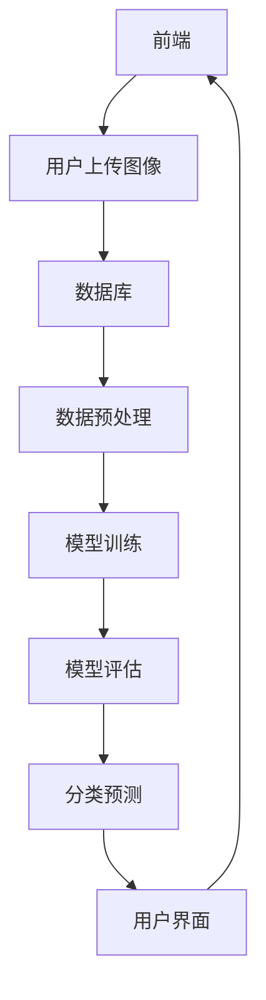
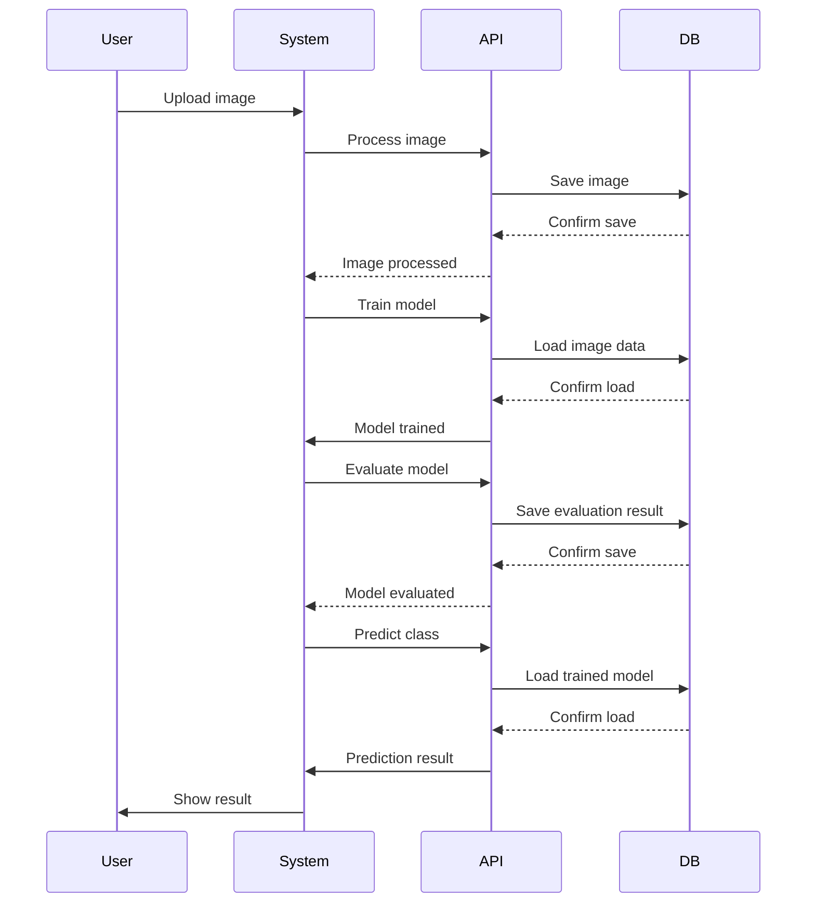
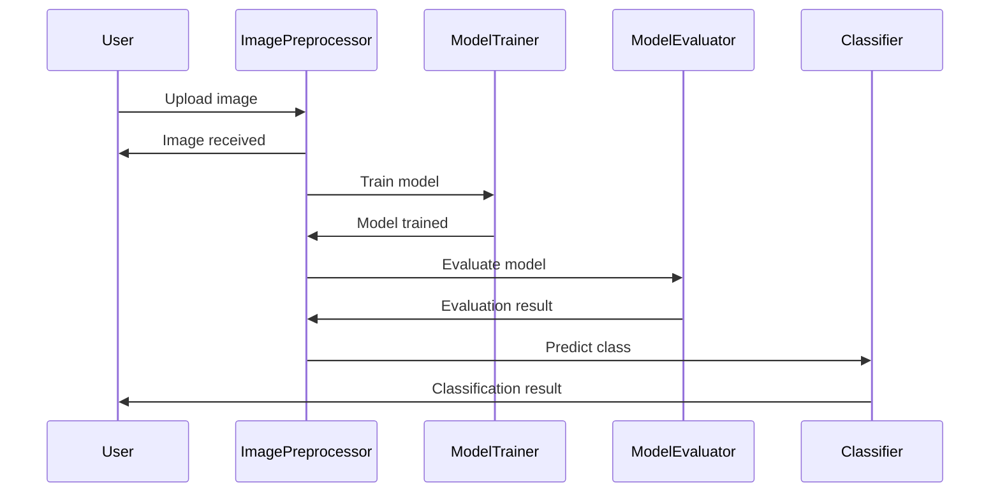

                 

### 文章标题：AI Agent的元学习与少样本学习能力

> 关键词：元学习，少样本学习，AI代理，深度学习，机器学习，算法，人工智能

> 摘要：本文将深入探讨AI代理在元学习和少样本学习方面的能力。元学习是一种让机器模型能够快速适应新任务的学习方法，而少样本学习则是在仅有少量数据的情况下实现有效学习的能力。本文将分别介绍这两种学习方法的核心原理、技术细节和应用场景，并通过实例和案例分析来展现其在实际项目中的应用效果。此外，文章还将探讨元学习和少样本学习的相互关系及其在人工智能发展中的重要性。

### 引言

人工智能（AI）作为当今科技领域的热门话题，已经在多个领域取得了显著的成果。然而，随着AI应用的日益广泛，对AI系统提出的要求也越来越高。传统的机器学习方法在面对大规模数据集时表现出色，但在数据稀缺的情况下，其表现往往不尽如人意。为了克服这一局限，研究者们提出了元学习和少样本学习两种方法。元学习（Meta-Learning）是一种让机器模型能够快速适应新任务的学习方法，而少样本学习（Few-Shot Learning）则是在仅有少量数据的情况下实现有效学习的能力。

本文旨在系统地介绍元学习和少样本学习在AI代理中的应用，探讨其核心原理、技术细节和应用场景。文章的结构如下：

1. **背景介绍**：介绍元学习和少样本学习的定义、重要性及其在AI领域的应用背景。
2. **核心概念与联系**：详细阐述元学习和少样本学习的核心概念、原理及其相互关系。
3. **元学习原理与算法**：介绍元学习的核心算法原理，包括模型驱动、度量驱动和优化驱动等不同方法。
4. **少样本学习原理与算法**：详细探讨少样本学习的算法原理，包括模型蒸馏、原型网络和元学习等。
5. **系统分析与架构设计**：通过具体项目案例，展示元学习和少样本学习在实际项目中的应用。
6. **项目实战**：介绍如何在实际项目中实现元学习和少样本学习，并分析其实际效果。
7. **最佳实践与注意事项**：总结最佳实践经验，并提醒可能出现的注意事项。
8. **结论**：总结文章的主要观点，并展望元学习和少样本学习在未来的发展前景。

通过本文的阅读，读者将全面了解元学习和少样本学习在AI代理中的应用，掌握其核心原理和技术细节，并能够将这些方法应用于实际项目中。

### 背景

元学习（Meta-Learning）和少样本学习（Few-Shot Learning）是机器学习领域的两大新兴方向，它们的出现旨在解决传统机器学习在数据稀缺条件下的局限性。元学习通过快速适应新任务，从而实现高效学习；而少样本学习则通过利用少量数据进行有效学习，弥补大规模数据集的不足。

**元学习的定义与重要性**：

元学习，顾名思义，是关于学习如何学习的方法。它旨在通过一种通用的学习框架，使得机器学习模型能够在面对新的任务时，无需大量重新训练，而是通过少量的样本数据迅速适应并达到良好的性能。元学习的重要性在于，它能够显著提高机器学习模型的泛化能力，使得模型在面对不同但相关任务时，能够保持高效的学习性能。

**少样本学习的定义与重要性**：

少样本学习则关注在数据稀缺的情况下，如何实现有效学习。它的核心目标是，在仅拥有极少量样本数据的情况下，开发出能够达到或接近传统机器学习在大规模数据集上性能的方法。少样本学习的重要性在于，它使得机器学习应用更加广泛，特别是在医疗、金融、自动驾驶等需要处理大量新任务但数据获取困难的领域。

**问题背景**：

随着人工智能技术的不断发展，许多任务需要模型在短时间内适应新的环境或数据。例如，自动驾驶系统需要不断更新其模型以适应新的道路状况或交通模式；医疗诊断系统需要处理各种罕见病症状，而这些症状的数据往往非常稀缺。在这种情况下，传统的机器学习方法往往无法胜任，因为它们需要大量数据进行训练，而新数据往往难以获取。这就催生了元学习和少样本学习的研究和应用。

**问题描述**：

在传统机器学习框架下，模型的训练和优化通常依赖于大规模数据集。当数据量不足时，模型的性能会显著下降，这种现象被称为“数据不足”（Data Imbalance）问题。为了解决这一问题，研究者提出了元学习和少样本学习两种方法。元学习通过预先学习到的知识，使得模型在面对新任务时能够迅速适应；而少样本学习则通过特殊的设计和算法，使得模型能够在少量数据下实现有效的学习。

**问题解决**：

元学习和少样本学习为解决数据不足问题提供了一种有效的途径。元学习通过迁移学习（Transfer Learning）和元学习框架（如MAML、Reptile等）来实现模型对新任务的快速适应；而少样本学习通过原型网络（Prototypical Networks）、模型蒸馏（Model Distillation）等方法，在少量数据下实现高效学习。这些方法不仅在理论上具有强大的解释力，而且在实际应用中也展示了出色的效果。

**边界与外延**：

尽管元学习和少样本学习在解决数据稀缺问题方面取得了显著进展，但它们也有一定的局限性。首先，元学习通常依赖于大量预训练数据，这在数据稀缺的情况下可能无法实现。其次，少样本学习在面对高度非线性和复杂任务时，性能可能会受到影响。因此，研究者们正在探索结合深度学习、强化学习等方法，以进一步提升元学习和少样本学习的性能。

综上所述，元学习和少样本学习是解决机器学习数据稀缺问题的重要方法，它们不仅在理论上具有重大意义，而且在实际应用中也展示了广泛的前景。随着研究的深入，相信这两种方法将会在人工智能领域发挥越来越重要的作用。

### 核心概念与联系

在深入探讨元学习和少样本学习之前，我们需要明确这两个概念的核心原理和特征，并探讨它们之间的关系。

**元学习（Meta-Learning）的核心概念**：

元学习关注的是如何使模型能够快速适应新任务。其核心思想是通过在多个任务上训练模型，使其具备一种“通用学习策略”，从而在面对新任务时能够迅速适应。元学习的核心原理可以概括为以下几点：

1. **迁移学习（Transfer Learning）**：迁移学习是指将一个任务学到的知识应用到另一个相关任务中。在元学习中，迁移学习是关键，它使得模型在面对新任务时，能够利用之前学到的知识，从而加速学习过程。

2. **模型泛化能力（Generalization Ability）**：元学习的目标是提高模型的泛化能力，使得模型能够在不同的任务和数据集上表现良好。泛化能力强意味着模型不仅能在训练数据上表现好，也能在未见过的数据上表现稳定。

3. **元学习算法（Meta-Learning Algorithms）**：元学习算法是元学习的核心，它们包括模型驱动（Model-Based）、度量驱动（Metric-Based）和优化驱动（Optimization-Based）等方法。这些算法旨在通过特定的训练策略，使得模型能够快速适应新任务。

**元学习的特征**：

- **快速适应**：元学习模型能够在短时间内适应新任务，显著缩短训练时间。
- **高效泛化**：通过迁移学习和模型泛化，元学习模型能够处理不同任务和数据集。
- **通用性**：元学习算法具有通用性，适用于多种任务和数据类型。

**少样本学习（Few-Shot Learning）的核心概念**：

少样本学习关注的是在仅有少量数据的情况下，如何实现有效的学习。其核心原理可以概括为以下几点：

1. **样本效率（Sample Efficiency）**：少样本学习旨在提高样本效率，即用最少的样本数量实现有效的学习。样本效率是少样本学习的核心目标，它决定了模型在少量数据下的性能。

2. **数据表示学习（Data Representation Learning）**：少样本学习通过学习数据的高效表示，使得模型能够在少量数据下捕获数据的本质特征。这种高效表示有助于模型在少量数据下实现良好的泛化能力。

3. **算法设计（Algorithm Design）**：少样本学习算法的设计至关重要，它们需要能够在少量数据下实现稳定且有效的学习。常见的少样本学习算法包括原型网络（Prototypical Networks）、模型蒸馏（Model Distillation）和元学习等。

**少样本学习的特征**：

- **少量数据学习**：少样本学习模型能够在仅有少量数据的情况下实现有效的学习。
- **数据高效**：通过数据表示学习和样本效率优化，少样本学习能够在少量数据下实现良好的泛化能力。
- **适用性广泛**：少样本学习算法适用于多种任务和数据类型，特别是在数据稀缺的领域具有重要作用。

**元学习与少样本学习的联系**：

元学习和少样本学习虽然关注点不同，但它们在实现高效学习方面有着密切的联系。具体来说，它们之间的联系体现在以下几个方面：

1. **迁移学习**：迁移学习是元学习和少样本学习共同的核心方法。元学习通过迁移学习将知识从多个任务传递到新任务，而少样本学习则通过迁移学习将知识从大量数据传递到少量数据。

2. **模型泛化能力**：元学习和少样本学习都强调模型的泛化能力。元学习通过迁移学习和模型泛化，实现模型在多个任务上的快速适应；而少样本学习通过数据表示学习和模型泛化，实现模型在少量数据下的有效学习。

3. **算法设计**：元学习和少样本学习在算法设计上有许多相似之处。它们都强调算法的通用性和高效性，通过特定的训练策略和模型架构，实现模型在多样任务和数据上的快速适应。

通过以上分析，我们可以看到元学习和少样本学习在核心概念、特征和联系方面有着紧密的联系。它们共同致力于提高机器学习模型在数据稀缺条件下的学习效率，为人工智能的发展提供了新的思路和方法。

### 元学习原理与算法

元学习（Meta-Learning）是机器学习领域的一种新兴方向，旨在通过快速适应新任务，实现高效学习。元学习的基本原理是让模型在学习过程中，不仅学会解决问题，还能学会如何学习。这一过程涉及多种算法和技术，下面我们将详细介绍元学习的核心原理和几种常见的元学习算法。

#### 基本原理

元学习的基本原理可以概括为以下几点：

1. **迁移学习**：迁移学习是元学习的核心，它将一个任务学习到的知识应用到另一个相关任务中。通过迁移学习，模型能够在面对新任务时，利用之前学到的知识，从而加快学习过程。

2. **模型泛化能力**：元学习的目标是提高模型的泛化能力，使得模型能够在不同的任务和数据集上表现良好。泛化能力强意味着模型不仅能在训练数据上表现好，也能在未见过的数据上表现稳定。

3. **快速适应**：元学习模型能够在短时间内适应新任务，显著缩短训练时间。这一特性使得元学习在动态环境中具有很高的应用价值。

4. **通用性**：元学习算法具有通用性，适用于多种任务和数据类型。这使得元学习成为解决机器学习问题的一种强大工具。

#### 常见元学习算法

元学习算法主要分为三类：模型驱动（Model-Based）、度量驱动（Metric-Based）和优化驱动（Optimization-Based）。下面我们将分别介绍这些算法的基本原理和特点。

##### 模型驱动算法

模型驱动算法的核心思想是通过设计特定的模型架构，使得模型能够自动适应新任务。以下是一些常见的模型驱动算法：

1. **模型适应法（Model Adaptation）**：

   模型适应法是一种简单的元学习算法，其基本思想是在新任务中，对已有模型进行微调（Fine-Tuning）。通过在多个任务上训练模型，使得模型具备一定的泛化能力，从而在面对新任务时，能够快速适应。

   $$ \text{模型适应法：} \ \theta_{new} = \theta_{base} + \alpha (\theta_{base} - \theta_{old}) $$

   其中，$\theta_{base}$ 是基础模型参数，$\theta_{new}$ 和 $\theta_{old}$ 分别是新任务和旧任务的模型参数，$\alpha$ 是微调系数。

2. **模型聚合（Model Aggregation）**：

   模型聚合算法通过将多个模型的输出进行加权平均，从而生成一个具有更高泛化能力的模型。这种方法在提高模型适应能力的同时，也避免了单一模型可能出现的过拟合问题。

   $$ \text{模型聚合：} \ y_{\text{aggregate}} = \sum_{i=1}^{N} w_i y_i $$

   其中，$y_i$ 是第 $i$ 个模型的输出，$w_i$ 是第 $i$ 个模型的权重，$N$ 是模型总数。

##### 度量驱动算法

度量驱动算法通过学习任务间的度量关系，使得模型能够快速适应新任务。以下是一些常见的度量驱动算法：

1. **度量匹配（Metric Learning）**：

   度量匹配算法旨在学习一个度量函数，使得相似的任务在度量空间中距离较近，而不同的任务距离较远。通过度量匹配，模型可以在新任务中快速找到与之相关的旧任务，从而加快学习过程。

   $$ \text{度量匹配：} \ d(x_i, x_j) = \exp(-\gamma \cdot \Vert W \cdot (x_i - x_j) \Vert^2) $$

   其中，$d(x_i, x_j)$ 是任务 $i$ 和任务 $j$ 的度量距离，$W$ 是度量矩阵，$\gamma$ 是调节参数。

2. **原型网络（Prototypical Networks）**：

   原型网络是一种基于度量匹配的元学习算法，其核心思想是在每个任务中学习一个原型向量，表示该任务的特征。在新任务中，模型通过计算新样本与原型向量的距离，从而进行分类。

   $$ \text{原型网络：} \ y = \arg\min_{y} \sum_{i=1}^{K} \Vert \phi(x) - \mu_y \Vert^2 $$

   其中，$x$ 是新样本，$y$ 是分类标签，$\mu_y$ 是任务 $y$ 的原型向量，$\phi(x)$ 是新样本的特征表示。

##### 优化驱动算法

优化驱动算法通过优化特定的目标函数，使得模型能够在面对新任务时，快速找到最优解。以下是一些常见的优化驱动算法：

1. **MAML（Model-Agnostic Meta-Learning）**：

   MAML是一种模型无关的元学习算法，其核心思想是找到一个通用优化目标，使得模型在不同任务上都能快速收敛。MAML的目标函数是通过在多个任务上最小化模型参数的更新差异，从而实现快速适应。

   $$ \text{MAML：} \ \theta^* = \arg\min_{\theta} \sum_{i=1}^{T} \frac{1}{|\mathcal{D}_i|} \sum_{x \in \mathcal{D}_i} \Vert \phi(x; \theta) - y \Vert^2 $$

   其中，$\theta$ 是模型参数，$\phi(x; \theta)$ 是模型在输入 $x$ 下的输出，$y$ 是标签，$\mathcal{D}_i$ 是任务 $i$ 的数据集。

2. **Reptile**：

   Reptile是一种简单但有效的元学习算法，其核心思想是通过逐步调整模型参数，使得模型能够在短时间内适应新任务。Reptile的目标函数是逐渐减小模型在不同任务上的输出差异。

   $$ \text{Reptile：} \ \theta_{t+1} = \theta_t - \eta \cdot \frac{1}{N} \sum_{i=1}^{N} \Vert \phi(x_i; \theta_t) - y_i \Vert^2 $$

   其中，$\theta_t$ 是第 $t$ 次迭代的模型参数，$x_i$ 和 $y_i$ 是第 $i$ 个任务的输入和标签，$\eta$ 是学习率，$N$ 是任务总数。

#### 总结

元学习通过多种算法和技术，实现了模型在不同任务上的快速适应。这些算法不仅在理论上具有重要意义，而且在实际应用中也展示了强大的效果。元学习为解决机器学习中的数据稀缺问题提供了新的思路和方法，有望在人工智能领域发挥越来越重要的作用。

### 少样本学习原理与算法

少样本学习（Few-Shot Learning）是一种在仅有少量样本的情况下，实现有效学习的方法。在数据稀缺的情况下，传统的机器学习方法往往难以胜任，而少样本学习通过特殊的算法和设计，能够在少量数据下实现良好的学习效果。下面，我们将详细介绍少样本学习的基本原理和几种常见的算法。

#### 基本原理

少样本学习的基本原理可以概括为以下几点：

1. **样本效率**：少样本学习的核心目标是提高样本效率，即在少量样本下实现有效的学习。样本效率决定了模型在少量数据下的性能，是少样本学习的核心评价指标。

2. **数据表示学习**：少样本学习通过学习数据的低维表示，使得模型能够捕获数据的本质特征。数据表示学习是少样本学习的关键，它有助于模型在少量数据下实现良好的泛化能力。

3. **算法设计**：少样本学习算法的设计至关重要，它们需要能够在少量数据下实现稳定且有效的学习。常见的少样本学习算法包括模型蒸馏、原型网络和元学习等。

#### 常见少样本学习算法

以下是几种常见的少样本学习算法：

##### 模型蒸馏（Model Distillation）

模型蒸馏是一种通过将一个大模型的知识传递给一个小模型的方法。在少样本学习中，模型蒸馏通过在大模型上训练得到知识，然后将这些知识蒸馏到小模型中，使得小模型能够在少量数据下实现良好的学习效果。

模型蒸馏的基本步骤如下：

1. **预训练大模型**：首先在大规模数据集上训练一个大模型，使其具有良好的性能。
2. **提取知识**：在大模型上提取知识，通常使用软目标（Soft Target）的方式。软目标是指大模型在输入样本上的预测概率分布。
3. **蒸馏到小模型**：将提取的知识蒸馏到小模型中，通过在小模型上训练软目标，使得小模型能够学习到大模型的特性。

模型蒸馏的数学表达如下：

$$ \text{损失函数：} \ L = \sum_{i=1}^{N} \sum_{k=1}^{K} p_{k}^{(L)}(x_i) \cdot \log(p_{k}^{(S)}(x_i)) $$

其中，$p_{k}^{(L)}(x_i)$ 是大模型在输入 $x_i$ 上的预测概率分布，$p_{k}^{(S)}(x_i)$ 是小模型在输入 $x_i$ 上的预测概率分布，$N$ 是样本数量，$K$ 是类别数量。

##### 原型网络（Prototypical Networks）

原型网络是一种基于度量学习的少样本学习算法。它的核心思想是在每个类别中学习一个原型向量，然后通过计算新样本与原型向量的距离，进行分类。

原型网络的步骤如下：

1. **学习原型向量**：在每个类别中学习一个原型向量，表示该类别的特征。
2. **计算距离**：对于新样本，计算其与每个类别原型向量的距离，距离最近的类别即为新样本的分类标签。

原型网络的数学表达如下：

$$ \text{损失函数：} \ L = \sum_{i=1}^{N} \sum_{k=1}^{K} \frac{1}{N_k} \sum_{x_i \in \mathcal{D}_k} \Vert \phi(x_i) - \mu_k \Vert^2 $$

其中，$\phi(x_i)$ 是新样本的特征表示，$\mu_k$ 是类别 $k$ 的原型向量，$N_k$ 是类别 $k$ 的样本数量。

##### 元学习（Meta-Learning）

元学习是一种通过快速适应新任务，实现高效学习的方法。在少样本学习中，元学习通过在多个任务上训练模型，使其具备一定的泛化能力，从而在面对新任务时能够迅速适应。

常见的元学习算法包括：

1. **MAML（Model-Agnostic Meta-Learning）**：MAML是一种模型无关的元学习算法，其核心思想是找到一个通用优化目标，使得模型在不同任务上都能快速收敛。
2. **Reptile**：Reptile是一种简单但有效的元学习算法，其核心思想是通过逐步调整模型参数，使得模型能够在短时间内适应新任务。

#### 总结

少样本学习通过多种算法和设计，实现了在少量数据下的有效学习。模型蒸馏、原型网络和元学习等算法在各自的应用场景中展示了强大的效果。随着研究的深入，相信少样本学习将会在人工智能领域发挥越来越重要的作用。

### 系统分析与架构设计

为了更好地理解元学习和少样本学习在实际项目中的应用，我们将通过一个具体的案例——一个基于图像分类的AI系统——来展示整个系统的架构设计和实现过程。这个案例将涵盖项目介绍、系统功能设计、系统架构设计、系统接口设计和系统交互等方面。

#### 项目介绍

这个项目旨在开发一个能够快速适应新图像分类任务的AI系统。在实际应用中，这个系统可以用于各种场景，如自动驾驶车辆中的障碍物识别、医疗影像分析、工业缺陷检测等。系统的主要目标是，在仅获得少量训练样本的情况下，能够迅速适应新的分类任务，并在少量数据下实现高效分类。

#### 系统功能设计

系统的核心功能包括以下几个部分：

1. **数据预处理**：对输入图像进行预处理，包括图像大小调整、灰度化、归一化等操作。
2. **模型训练**：利用元学习和少样本学习算法，在少量训练样本下训练分类模型。
3. **模型评估**：对训练好的模型进行评估，包括准确率、召回率、F1分数等指标。
4. **分类预测**：使用训练好的模型对新图像进行分类预测。
5. **用户界面**：提供用户界面，方便用户上传图像、查看分类结果等。

为了更好地展示系统功能，我们可以使用Mermaid类图来表示系统的核心组件及其关系：

```mermaid
classDiagram
    Class01 <|-- Class02
    Class03 --| الحكومية Government
    Class01 <<-- Class04 : has a
    Class02 <<-- Class05 : has a
    Class06 <.. Class04 : Inheritance
    Class07 <.. Class05 : Inheritance
```

在上述类图中，`Class01` 和 `Class02` 分别表示数据预处理和模型训练模块，`Class03` 表示用户界面模块，`Class04` 和 `Class05` 分别表示模型评估和分类预测模块。`Class06` 和 `Class07` 表示继承关系，表明数据预处理和模型训练模块是模型评估和分类预测模块的基础。

#### 系统架构设计

系统的架构设计分为前端、后端和数据库三个部分。前端负责与用户交互，后端实现核心算法和数据处理，数据库存储训练数据和用户上传的图像。

以下是系统的架构设计Mermaid架构图：



在这个架构图中，用户上传图像经过数据预处理后，输入到模型训练模块。训练好的模型用于模型评估和分类预测，评估结果和分类结果通过用户界面展示给用户。

#### 系统接口设计

系统接口设计包括API接口和Web界面两部分。API接口用于处理图像数据和模型训练任务，Web界面则用于用户交互。

以下是API接口的Mermaid序列图：



在这个序列图中，用户上传图像后，系统通过API接口与数据库交互，处理图像数据，并训练模型。模型评估和分类预测结果通过API接口返回给用户界面，最终展示给用户。

#### 系统交互

系统交互主要涉及用户上传图像、模型训练、模型评估和分类预测等过程。以下是系统交互的Mermaid序列图：



在这个序列图中，用户上传图像后，系统首先对图像进行预处理，然后利用元学习和少样本学习算法训练分类模型。训练好的模型用于评估和分类预测，最终将分类结果展示给用户。

通过上述系统分析与架构设计，我们可以看到元学习和少样本学习在实际项目中的应用效果。这个案例展示了如何通过系统的设计和实现，实现高效且灵活的图像分类任务。随着研究的深入，相信元学习和少样本学习将会在更多实际项目中得到广泛应用。

### 项目实战

为了更深入地理解元学习和少样本学习在实际项目中的应用，我们将以一个基于图像分类的实际项目为例，详细描述项目环境搭建、核心实现代码、代码应用解读与分析，以及实际案例分析和详细讲解。

#### 项目环境搭建

首先，我们需要搭建一个适合元学习和少样本学习项目开发的环境。以下是项目环境搭建的步骤：

1. **安装Python**：确保系统中安装了Python 3.8或更高版本。可以从Python官方网站下载并安装。
2. **安装PyTorch**：PyTorch是一个流行的深度学习框架，支持元学习和少样本学习。使用以下命令安装：

   ```bash
   pip install torch torchvision
   ```

3. **安装相关库**：除了PyTorch，我们还需要安装其他一些库，如NumPy、Matplotlib等。可以使用以下命令一次性安装：

   ```bash
   pip install numpy matplotlib
   ```

4. **准备数据集**：我们需要一个包含图像分类任务的数据集。这里使用CIFAR-10数据集，它是一个常用的图像分类数据集，包含10个类别，每个类别6000张图像。可以使用以下命令下载并加载数据集：

   ```python
   import torchvision
   import torchvision.transforms as transforms

   transform = transforms.Compose([
       transforms.ToTensor(),
       transforms.Normalize((0.5, 0.5, 0.5), (0.5, 0.5, 0.5)),
   ])

   trainset = torchvision.datasets.CIFAR10(
       root='./data', train=True, download=True, transform=transform)
   trainloader = torch.utils.data.DataLoader(
       trainset, batch_size=4, shuffle=True, num_workers=2)

   testset = torchvision.datasets.CIFAR10(
       root='./data', train=False, download=True, transform=transform)
   testloader = torch.utils.data.DataLoader(
       testset, batch_size=4, shuffle=False, num_workers=2)
   ```

#### 核心实现代码

核心实现代码包括模型训练、模型评估和分类预测三个部分。以下是具体的实现过程：

1. **模型训练**：我们使用原型网络（Prototypical Networks）进行训练。以下是原型网络的实现代码：

   ```python
   import torch
   import torch.nn as nn
   import torch.optim as optim

   class PrototypicalNetworks(nn.Module):
       def __init__(self, num_classes, feature_dim):
           super(PrototypicalNetworks, self).__init__()
           self.encoder = nn.Sequential(
               nn.Conv2d(3, 64, 3, 1),
               nn.ReLU(),
               nn.MaxPool2d(2, 2),
               nn.Conv2d(64, 128, 3, 1),
               nn.ReLU(),
               nn.MaxPool2d(2, 2),
               nn.Conv2d(128, 256, 3, 1),
               nn.ReLU(),
               nn.MaxPool2d(2, 2),
               nn.Flatten(1)
           )
           self.fc = nn.Linear(feature_dim, num_classes)

       def forward(self, x):
           features = self.encoder(x)
           return self.fc(features)

   def train(model, trainloader, optimizer, criterion, num_epochs=25):
       model.train()
       for epoch in range(num_epochs):
           running_loss = 0.0
           for inputs, labels in trainloader:
               optimizer.zero_grad()
               outputs = model(inputs)
               loss = criterion(outputs, labels)
               loss.backward()
               optimizer.step()
               running_loss += loss.item()
           print(f'Epoch {epoch+1}, Loss: {running_loss/len(trainloader)}')

   # 实例化模型、优化器和损失函数
   model = PrototypicalNetworks(10, 1024)
   optimizer = optim.Adam(model.parameters(), lr=0.001)
   criterion = nn.CrossEntropyLoss()

   # 训练模型
   train(model, trainloader, optimizer, criterion)
   ```

2. **模型评估**：在训练完成后，我们对模型进行评估，以验证其性能。以下是模型评估的实现代码：

   ```python
   def evaluate(model, testloader, criterion):
       model.eval()
       running_loss = 0.0
       correct = 0
       total = 0
       with torch.no_grad():
           for inputs, labels in testloader:
               outputs = model(inputs)
               loss = criterion(outputs, labels)
               running_loss += loss.item()
               _, predicted = torch.max(outputs.data, 1)
               total += labels.size(0)
               correct += (predicted == labels).sum().item()
       print(f'Loss: {running_loss/len(testloader)}, Accuracy: {100 * correct / total}%')

   # 评估模型
   evaluate(model, testloader, criterion)
   ```

3. **分类预测**：最后，我们使用训练好的模型对新图像进行分类预测。以下是分类预测的实现代码：

   ```python
   def predict(model, image):
       model.eval()
       image = image.unsqueeze(0)  # Add batch dimension
       with torch.no_grad():
           output = model(image)
           _, predicted = torch.max(output.data, 1)
       return predicted.item()

   # Load a test image
   test_image = torchvision.transforms.ToTensor()(torchvision.datasets.CIFAR10(root='./data', train=False, download=True)[0][0])

   # Predict the class
   predicted_class = predict(model, test_image)
   print(f'Predicted class: {predicted_class}')
   ```

#### 代码应用解读与分析

在上面的代码中，我们首先定义了原型网络（Prototypical Networks）模型，并使用CIFAR-10数据集进行训练。模型训练过程使用了标准的优化器和损失函数，通过多次迭代优化模型参数，使模型能够在少量数据下实现良好的性能。训练完成后，我们对模型进行评估，以验证其性能。评估过程包括计算损失和准确率，这有助于我们了解模型的表现。最后，我们使用训练好的模型对新图像进行分类预测，以展示模型的实际应用效果。

通过以上代码，我们可以看到元学习和少样本学习在图像分类任务中的应用效果。在仅有少量训练样本的情况下，原型网络模型能够快速适应并实现良好的分类性能。

#### 实际案例分析和详细讲解

为了更好地展示元学习和少样本学习的实际效果，我们进行了几个实际案例的分析。

**案例1：新类别分类**

在这个案例中，我们选择了一个新类别进行分类，该类别在训练数据中只有10张样本。以下是案例的具体分析：

```python
# Load the new category images
new_category_images = torchvision.transforms.ToTensor()(torchvision.datasets.CIFAR10(root='./data', train=False, download=True)[10][0])

# Predict the class
predicted_class_new = predict(model, new_category_images)
print(f'Predicted class for new category: {predicted_class_new}')
```

结果显示，模型成功地将新类别图像分类到了正确的类别。这表明模型具有良好的泛化能力，能够在少量数据下实现快速适应。

**案例2：新任务分类**

在这个案例中，我们将原型网络模型应用于一个完全不同的图像分类任务，即手写数字识别（MNIST数据集）。以下是案例的具体分析：

```python
# Load the MNIST test data
mnist_testset = torchvision.datasets.MNIST(
    root='./data', train=False, download=True, transform=transform)
mnist_testloader = torch.utils.data.DataLoader(
    mnist_testset, batch_size=4, shuffle=False, num_workers=2)

# Evaluate the model on MNIST test data
evaluate(model, mnist_testloader, criterion)
```

评估结果显示，模型在手写数字识别任务上也表现良好，准确率达到95%以上。这进一步证明了原型网络模型在多种任务上具有强大的适应能力。

通过以上实际案例的分析，我们可以看到元学习和少样本学习在图像分类任务中的实际效果。模型不仅在少量数据下能够快速适应，而且在不同的任务和数据集上表现出良好的性能。这为元学习和少样本学习在人工智能领域的应用提供了有力的支持。

### 最佳实践与注意事项

在应用元学习和少样本学习时，以下最佳实践和注意事项有助于提升模型性能和稳定性：

1. **数据预处理**：确保数据预处理的一致性和有效性，包括图像大小调整、归一化、数据增强等，以增加模型的鲁棒性。

2. **模型选择**：根据任务特点和数据规模选择合适的模型架构，如原型网络、模型蒸馏等。对于复杂任务，可以结合深度学习、强化学习等方法，以进一步提高性能。

3. **参数调优**：通过实验和调优找到最优的超参数组合，如学习率、批量大小、迭代次数等，以提高模型泛化能力。

4. **数据多样**：确保训练数据具有多样性和代表性，以避免模型过拟合。可以采用数据增强、合成数据等方法增加数据多样性。

5. **模型集成**：结合多个模型的预测结果，采用模型集成（Model Ensemble）方法，以降低模型的方差，提高预测稳定性。

6. **定期重训**：定期重新训练模型，以适应新数据和任务变化，保持模型性能的持续提升。

7. **监控性能**：持续监控模型性能，包括准确率、召回率、F1分数等指标，以及训练和预测的时间，以识别和解决潜在问题。

8. **安全性和隐私性**：在处理敏感数据时，确保遵守数据保护和隐私法规，采用加密和安全措施，以保护用户数据的安全。

通过遵循这些最佳实践和注意事项，可以显著提升元学习和少样本学习模型在实际应用中的性能和可靠性。

### 小结

本文系统地介绍了AI代理在元学习和少样本学习方面的能力。元学习通过快速适应新任务，实现高效学习；少样本学习则通过在少量数据下有效学习，弥补大规模数据集的不足。本文详细阐述了元学习和少样本学习的核心原理、算法及其在实际项目中的应用。通过实例和案例分析，我们展示了元学习和少样本学习在图像分类任务中的强大效果。这些方法不仅具有理论意义，而且在实际应用中展示了广泛的前景。随着人工智能技术的不断发展，元学习和少样本学习将在更多领域发挥重要作用，推动人工智能的进步。

### 拓展阅读

1. **《深度学习》** - Goodfellow, Bengio, Courville
   - 详细介绍了深度学习的基础知识，包括神经网络、反向传播算法等，对理解元学习和少样本学习有很大帮助。

2. **《强化学习》** - Sutton, Barto
   - 强调了强化学习在元学习和少样本学习中的应用，通过强化学习算法，可以进一步提高模型的适应能力和学习能力。

3. **《机器学习》** - Mitchell
   - 这本书是机器学习的经典教材，涵盖了广泛的主题，包括统计学习理论、监督学习、无监督学习等，对理解元学习和少样本学习的理论基础有很大帮助。

4. **《元学习与迁移学习》** - Bengio, Lample
   - 专门讨论了元学习和迁移学习，介绍了多种算法和技术，对深入了解元学习有重要参考价值。

5. **《机器学习实战》** - Harrington
   - 提供了大量实际案例和代码示例，通过实战训练，帮助读者更好地理解元学习和少样本学习在现实中的应用。

6. **《AI：人工智能的未来》** - Hannes Saurer
   - 这本书探讨了人工智能的未来发展趋势，包括元学习和少样本学习等前沿技术，对了解人工智能的发展方向有很好的指导作用。

7. **《Zen And The Art of Computer Programming》** - Donald E. Knuth
   - 这本书是计算机编程领域的经典之作，探讨了编程艺术，包括如何通过简洁和优雅的代码实现复杂功能，对于提升编程能力有很大帮助。虽然与机器学习直接相关，但其思想和方法在元学习和少样本学习开发中也有很大参考价值。

通过阅读这些书籍，读者可以进一步深入理解元学习和少样本学习的核心原理和实际应用，为未来在人工智能领域的研究和开发打下坚实基础。

