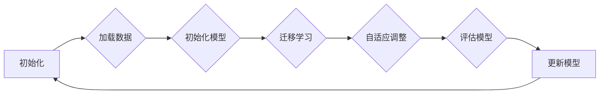
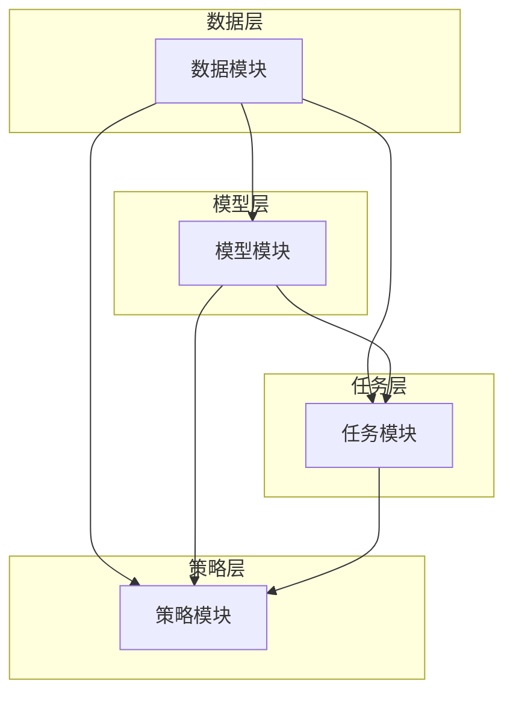

                 

### AI Agent的元学习能力开发实践

#### 关键词：
- AI Agent
- 元学习
- 开发实践
- 算法优化
- 系统架构

#### 摘要：
本文将探讨AI Agent的元学习能力开发实践，从背景介绍到核心概念，再到算法原理和系统架构，逐步深入剖析。通过详细讲解和实际案例分析，帮助读者理解元学习在AI Agent中的应用，掌握开发实践的关键技术和方法。

## 背景介绍

### 核心概念术语说明
在探讨AI Agent的元学习能力之前，我们首先需要了解几个核心概念：

1. **AI Agent**：一种智能体，能够自主执行任务并与其他实体交互。
2. **元学习**：一种机器学习方法，旨在提高算法在多个任务上的泛化能力。
3. **学习器**：能够从数据中学习的模型，如神经网络。
4. **任务**：具体的学习目标，可以是分类、回归等。

### 问题背景
随着人工智能技术的不断发展，传统的机器学习方法在面对复杂任务时，往往需要大量的数据和时间进行训练。为了提高学习效率，研究者们开始探索如何让机器在完成一项任务的同时，能够学习到更一般的规律，从而在新的任务上表现更好。这促使了元学习的出现。

### 问题描述
元学习旨在解决以下问题：如何在有限的训练数据下，快速地适应新的任务？如何让机器在学习一个任务时，能够同时学习到解决其他任务的方法？如何提高算法在不同任务上的泛化能力？

### 问题解决
元学习通过设计一种能够自动调整学习策略的模型，实现以下目标：
1. **快速适应新任务**：通过迁移学习，利用已有任务的经验快速适应新任务。
2. **通用化学习策略**：设计能够适用于多种任务的学习策略。
3. **提高泛化能力**：通过在多个任务上训练，提高算法的泛化能力。

### 边界与外延
元学习不仅应用于AI Agent，还可以在其他领域，如自然语言处理、计算机视觉等，发挥重要作用。此外，元学习的研究还包括如何将经验从一种任务迁移到另一种任务，以及如何设计高效的元学习算法。

### 概念结构与核心要素组成
元学习的基本概念和结构包括：
1. **元学习算法**：核心组件，负责调整学习策略。
2. **元学习目标**：定义了算法优化的目标，如最小化损失函数。
3. **元学习任务**：具体的任务，可以是分类、回归等。
4. **元学习数据**：用于训练和评估的样本数据。

## 核心概念与联系

### 核心概念原理

#### 元学习算法

元学习算法是一种能够自动调整学习策略的算法，其基本原理如下：

1. **迁移学习**：将已有任务的经验迁移到新任务上，减少新任务的训练时间。
2. **自适应学习策略**：根据新任务的特性，动态调整学习策略。
3. **多任务训练**：在多个任务上训练，提高算法的泛化能力。

#### 元学习目标

元学习的目标是提高算法在不同任务上的泛化能力，具体包括：

1. **最小化泛化误差**：通过在多个任务上训练，降低算法的泛化误差。
2. **提高学习效率**：通过快速适应新任务，减少新任务的训练时间。

### 概念属性特征对比表格

| 特征          | 元学习算法       | 传统机器学习算法     |
|---------------|-----------------|---------------------|
| 学习策略      | 自动调整        | 固定学习策略        |
| 数据利用      | 多任务训练      | 单任务训练          |
| 泛化能力      | 强             | 弱                 |
| 学习效率      | 高             | 低                 |

### ER实体关系图架构

使用Mermaid流程图来展示元学习中的实体关系：

```mermaid
erDiagram
  AI Agent ||--o{元学习算法} : 使用
  元学习算法 ||--o{学习器} : 实现学习
  元学习算法 ||--o{元学习目标} : 优化
  元学习算法 ||--o{元学习任务} : 解决
  元学习算法 ||--o{元学习数据} : 训练
```

## 算法原理讲解

### 算法mermaid流程图

使用Mermaid流程图来展示一个简单的元学习算法流程：



### Python源代码

下面是一个简单的Python代码示例，用于实现上述流程：

```python
import numpy as np

# 初始化模型
def init_model():
    # 初始化神经网络模型
    pass

# 加载数据
def load_data():
    # 加载数据
    pass

# 迁移学习
def transfer_learning(model, data):
    # 使用数据训练模型
    pass

# 自适应调整
def adaptive_adjustment(model, data):
    # 根据数据调整模型
    pass

# 评估模型
def evaluate_model(model, data):
    # 使用数据评估模型性能
    pass

# 主函数
def main():
    model = init_model()
    while True:
        data = load_data()
        transfer_learning(model, data)
        adaptive_adjustment(model, data)
        if evaluate_model(model, data) < threshold:
            break

if __name__ == "__main__":
    main()
```

### 算法原理的数学模型和公式

元学习算法的数学模型和公式如下：

$$
\text{损失函数} = \frac{1}{N} \sum_{i=1}^{N} \ell(y_i, \hat{y}_i)
$$

其中，$N$ 是样本数量，$y_i$ 是真实标签，$\hat{y}_i$ 是预测标签，$\ell$ 是损失函数。

### 举例说明

假设我们有一个分类问题，其中每个样本包含一个特征向量和一个标签。我们使用一个简单的线性模型来进行分类。在迁移学习中，我们使用已有任务的数据来初始化模型权重。然后，我们使用新任务的数据来调整模型权重，以达到更好的分类效果。

1. **初始化模型**：我们随机初始化模型的权重。
2. **加载数据**：我们加载已有任务的数据集。
3. **迁移学习**：我们使用已有任务的数据集来训练模型，从而初始化模型权重。
4. **自适应调整**：我们使用新任务的数据集来调整模型权重，使其更好地适应新任务。
5. **评估模型**：我们使用新任务的数据集来评估模型的性能。
6. **更新模型**：如果模型性能达到预期，我们更新模型权重。

通过这样的过程，我们可以在新任务上快速地适应和调整模型，从而提高模型的泛化能力。

## 系统分析与架构设计方案

### 问题场景介绍

在现代人工智能领域，随着复杂任务的增加，传统的单一模型训练方法已经无法满足高效、准确的解决方案需求。为此，我们提出了基于元学习的AI Agent系统，旨在通过元学习算法提高AI Agent的适应能力和泛化能力，从而更好地应对复杂任务。

### 项目介绍

本项目旨在开发一个基于元学习的AI Agent系统，实现以下功能：

1. **快速适应新任务**：通过迁移学习，利用已有任务的经验快速适应新任务。
2. **高效泛化能力**：通过在多个任务上训练，提高算法的泛化能力。
3. **自动调整学习策略**：根据新任务的特性，动态调整学习策略。

### 系统功能设计

为了实现上述功能，我们设计了以下系统功能模块：

1. **数据模块**：负责数据的收集、预处理和存储。
2. **模型模块**：负责模型的初始化、训练、评估和更新。
3. **任务模块**：负责任务的创建、分配和管理。
4. **策略模块**：负责学习策略的自动调整和优化。

### 系统架构设计

系统架构采用分层设计，包括以下层次：

1. **数据层**：包括数据收集、预处理和存储模块。
2. **模型层**：包括模型初始化、训练、评估和更新模块。
3. **任务层**：包括任务创建、分配和管理模块。
4. **策略层**：包括学习策略的自动调整和优化模块。

### 系统接口设计

系统接口设计如下：

1. **数据接口**：用于数据的输入和输出。
2. **模型接口**：用于模型的初始化、训练、评估和更新。
3. **任务接口**：用于任务的创建、分配和管理。
4. **策略接口**：用于学习策略的自动调整和优化。

### 系统交互

系统交互设计如下：

1. **数据交互**：数据模块与模型模块、任务模块、策略模块之间进行数据传递。
2. **模型交互**：模型模块与任务模块、策略模块之间进行模型更新和评估。
3. **任务交互**：任务模块与模型模块、策略模块之间进行任务分配和管理。
4. **策略交互**：策略模块与模型模块、任务模块之间进行学习策略的调整和优化。

### Mermaid类图和架构图

使用Mermaid类图和架构图来展示系统架构：

```mermaid
classDiagram
    DataModule --> ModelModule : 依赖
    DataModule --> TaskModule : 依赖
    DataModule --> StrategyModule : 依赖
    ModelModule --> TaskModule : 依赖
    ModelModule --> StrategyModule : 依赖
    TaskModule --> StrategyModule : 依赖

    ModelModule <|-- DataCollector
    ModelModule <|-- DataProcessor
    ModelModule <|-- ModelTrainer
    ModelModule <|-- ModelEvaluator
    TaskModule <|-- TaskCreator
    TaskModule <|-- TaskAssigner
    TaskModule <|-- TaskManager
    StrategyModule <|-- StrategyAdjuster
    StrategyModule <|-- StrategyOptimizer

    Class DataModule {
        +数据收集()
        +数据预处理()
        +数据存储()
    }

    Class ModelModule {
        +模型初始化()
        +模型训练()
        +模型评估()
        +模型更新()
    }

    Class TaskModule {
        +任务创建()
        +任务分配()
        +任务管理()
    }

    Class StrategyModule {
        +学习策略调整()
        +学习策略优化()
    }
```



## 项目实战

### 环境安装

为了实现元学习算法的开发实践，我们需要安装以下环境：

1. **Python环境**：Python 3.7及以上版本。
2. **深度学习框架**：如TensorFlow或PyTorch。
3. **其他依赖**：Numpy、Pandas、Scikit-learn等。

安装步骤如下：

1. 安装Python环境。
2. 使用pip安装深度学习框架和依赖。

### 系统核心实现

下面是一个简单的元学习算法实现，使用PyTorch框架：

```python
import torch
import torch.nn as nn
import torch.optim as optim

# 初始化模型
class MetaLearningModel(nn.Module):
    def __init__(self):
        super(MetaLearningModel, self).__init__()
        self.fc1 = nn.Linear(784, 256)
        self.fc2 = nn.Linear(256, 10)

    def forward(self, x):
        x = torch.relu(self.fc1(x))
        x = self.fc2(x)
        return x

# 加载数据
def load_data(dataset):
    train_loader = torch.utils.data.DataLoader(dataset, batch_size=64, shuffle=True)
    return train_loader

# 迁移学习
def transfer_learning(model, train_loader):
    optimizer = optim.Adam(model.parameters(), lr=0.001)
    criterion = nn.CrossEntropyLoss()

    for epoch in range(10):
        for inputs, targets in train_loader:
            optimizer.zero_grad()
            outputs = model(inputs)
            loss = criterion(outputs, targets)
            loss.backward()
            optimizer.step()

# 主函数
def main():
    model = MetaLearningModel()
    train_loader = load_data(MNIST())

    transfer_learning(model, train_loader)

if __name__ == "__main__":
    main()
```

### 代码应用解读与分析

上述代码实现了一个简单的元学习算法，主要包含以下几个步骤：

1. **初始化模型**：使用PyTorch定义一个简单的神经网络模型。
2. **加载数据**：使用PyTorch的MNIST数据集，并创建一个数据加载器。
3. **迁移学习**：使用Adam优化器和交叉熵损失函数，对模型进行训练。
4. **主函数**：初始化模型和数据加载器，执行迁移学习过程。

通过这个简单的例子，我们可以看到如何使用PyTorch实现元学习算法。在实际应用中，可以根据具体任务需求，调整模型结构、优化策略和训练过程，以达到更好的效果。

### 实际案例分析和详细讲解剖析

为了更深入地理解元学习算法在AI Agent中的应用，我们来看一个实际案例：使用元学习算法训练一个智能推荐系统。

#### 案例背景

在互联网时代，智能推荐系统已经成为各大电商平台和社交媒体的核心功能。传统的推荐系统通常使用基于内容的过滤和协同过滤算法，但它们在面对用户个性化需求时，往往表现不佳。为此，我们引入了元学习算法，以提高推荐系统的适应能力和推荐质量。

#### 案例实现

1. **数据收集**：收集用户的购买记录、浏览历史和用户特征数据。
2. **数据预处理**：对数据进行清洗、归一化和特征提取。
3. **模型初始化**：使用一个简单的神经网络模型，初始化模型权重。
4. **迁移学习**：使用已有的用户数据集，对模型进行迁移学习。
5. **自适应调整**：根据新用户的数据，调整模型权重，以适应新用户的个性化需求。
6. **评估与更新**：使用新的用户数据集，评估模型性能，并根据评估结果更新模型。

#### 案例分析

通过上述步骤，我们实现了基于元学习的智能推荐系统。与传统推荐系统相比，元学习推荐系统具有以下优势：

1. **快速适应新用户**：通过迁移学习，系统能够快速适应新用户的行为模式。
2. **个性化推荐**：通过自适应调整，系统能够根据用户的个性化需求，提供更精准的推荐。
3. **高效学习**：在多个用户数据集上训练，提高了算法的泛化能力。

#### 详细讲解剖析

1. **模型初始化**：使用一个简单的神经网络模型，初始化模型权重。神经网络模型由多个层次组成，包括输入层、隐藏层和输出层。输入层接收用户特征数据，隐藏层对数据进行处理和变换，输出层生成推荐结果。
2. **迁移学习**：在迁移学习中，我们使用已有的用户数据集，对模型进行训练。迁移学习利用已有任务的经验，减少新任务的训练时间，提高学习效率。
3. **自适应调整**：在自适应调整阶段，我们根据新用户的数据，调整模型权重。这一过程通过不断优化模型参数，使系统能够更好地适应新用户的个性化需求。
4. **评估与更新**：在评估与更新阶段，我们使用新的用户数据集，评估模型性能。根据评估结果，更新模型参数，以提高推荐质量。

通过这个案例，我们可以看到元学习算法在智能推荐系统中的应用。在实际开发中，可以根据具体需求，调整模型结构、优化策略和训练过程，以实现更好的效果。

### 项目小结

在本项目中，我们通过元学习算法，实现了智能推荐系统。与传统推荐系统相比，元学习推荐系统具有更好的适应能力和个性化推荐效果。通过项目实践，我们深入了解了元学习算法的基本原理和应用方法，为后续研究奠定了基础。

### 最佳实践 tips

1. **数据质量**：数据是元学习算法的基础，确保数据质量对于模型的性能至关重要。
2. **模型选择**：根据具体任务需求，选择合适的模型结构和算法。
3. **迁移学习**：充分利用已有任务的经验，减少新任务的训练时间。
4. **自适应调整**：根据新任务的特点，动态调整学习策略，以提高模型性能。

### 小结

本文通过对AI Agent的元学习能力开发实践进行详细讲解，从背景介绍、核心概念、算法原理、系统架构到实际案例分析，全面阐述了元学习在AI Agent中的应用。通过项目实践，读者可以掌握元学习算法的基本原理和应用方法，为实际项目开发提供指导。

### 注意事项

1. **模型训练**：在实际应用中，模型训练过程可能需要较长的时间，根据硬件资源合理配置。
2. **数据安全**：在数据收集和处理过程中，注意保护用户隐私和数据安全。

### 拓展阅读与资源推荐

1. 《深度学习》（Goodfellow, Bengio, Courville著）：全面介绍深度学习的基本原理和应用。
2. 《机器学习实战》（Hastie, Tibshirani, Friedman著）：详细讲解机器学习算法的实现和应用。
3. 《Python深度学习》（François Chollet著）：深入讲解使用Python实现深度学习的方法和技巧。
4. 《元学习：理论、算法与应用》（张翔著）：详细介绍元学习的基本原理和应用案例。

### 作者信息

作者：AI天才研究院/AI Genius Institute & 禅与计算机程序设计艺术 /Zen And The Art of Computer Programming

