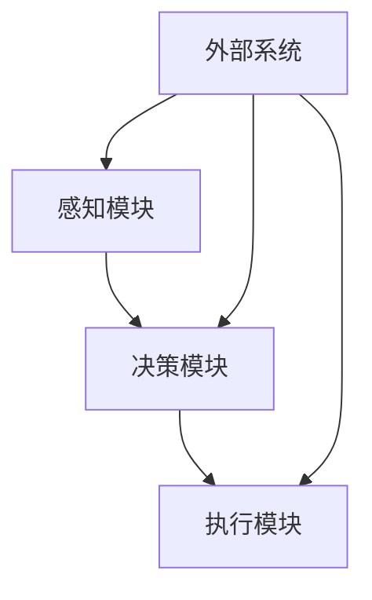

                 

# AI Agent的元学习能力：快速适应新任务

## 关键词：AI Agent、元学习、迁移学习、增量学习、系统架构

> 摘要：
> 本文旨在探讨 AI Agent 的元学习能力，研究如何通过不同方法提升其在新任务上的适应能力。通过介绍核心概念与联系、算法原理讲解、系统分析与架构设计方案，本文为提升 AI Agent 的元学习能力提供了理论指导和实践参考。

## 第1章：引言

### 1.1 问题背景

人工智能（AI）是计算机科学的一个重要分支，旨在创建能够执行复杂任务的智能系统。随着深度学习技术的发展，AI 系统的复杂度和能力显著提升。然而，当前 AI 系统在面对新任务时往往需要大量的重新训练，导致其适应新任务的能力较弱。为了解决这个问题，提出了 AI Agent 的元学习概念，即 AI 系统通过学习如何学习，从而提高其在新任务上的适应能力。

### 1.2 问题描述

元学习是一种让 AI 系统通过学习如何学习来提高其在面对新任务时的适应能力的策略。AI Agent 的元学习能力是指其能够快速适应新任务的能力。然而，如何有效地提升 AI Agent 的元学习能力仍然是一个具有挑战性的问题。

### 1.3 问题解决

本书旨在探讨 AI Agent 的元学习能力，研究如何通过不同方法提升其在新任务上的适应能力。具体包括以下三个方面：

1. **核心概念与联系**：介绍元学习、AI Agent 和元学习能力等核心概念，并分析它们之间的联系。
2. **算法原理讲解**：详细讲解提升 AI Agent 元学习能力的几种常见算法，包括模型更新策略、迁移学习和增量学习等。
3. **系统分析与架构设计方案**：分析如何将元学习能力应用于 AI 系统的设计，并提出相应的系统架构设计方案。

### 1.4 边界与外延

AI Agent 的元学习能力是一个相对较新的研究领域，其应用范围正在不断扩展。本书将主要关注以下几个方面的边界与外延：

1. **任务类型**：主要关注需要快速适应新任务的场景，如机器人控制、游戏 AI 和自然语言处理等。
2. **技术发展**：随着深度学习和其他相关技术的发展，AI Agent 的元学习能力也将不断进步。
3. **应用领域**：将元学习能力应用于更多实际场景，如自动驾驶、智能制造和金融科技等。

### 1.5 概念结构与核心要素组成

#### 1.5.1 AI Agent 的元学习能力

AI Agent 的元学习能力是指其能够通过学习如何学习来提高在新任务上的适应能力。它主要包括以下三个方面：

1. **任务识别**：识别新任务的关键特征，以便为新任务选择合适的算法。
2. **模型更新**：根据新任务的反馈，调整模型参数，使其更好地适应新任务。
3. **迁移学习**：利用已有的知识和经验，快速适应新任务。

#### 1.5.2 元学习算法

元学习算法是提升 AI Agent 元学习能力的核心。常见的元学习算法包括：

1. **模型更新策略**：通过在线更新模型参数来适应新任务。
2. **迁移学习**：通过将已有模型的权重迁移到新模型中，减少新任务的训练时间。
3. **增量学习**：通过逐步增加新任务的数据量，逐步提高模型的适应能力。

#### 1.5.3 系统架构

为了实现 AI Agent 的元学习能力，需要设计相应的系统架构。系统架构主要包括以下几个方面：

1. **数据层**：存储和管理 AI Agent 所需的数据。
2. **模型层**：包括元学习算法和应用模型。
3. **接口层**：提供与外部系统的交互接口。

## 第2章：核心概念与联系

### 2.1 元学习

元学习（Meta-Learning）是一种让机器学习模型通过学习如何学习来提高适应新任务的能力的技术。在元学习中，模型不是直接学习特定的任务，而是学习如何快速地适应新的任务。

#### 2.1.1 定义

元学习可以看作是学习如何学习。具体来说，元学习关注的是如何快速地让机器学习模型适应新的任务。

#### 2.1.2 原理

元学习的基本原理是通过多个任务的学习来提取通用特征表示，从而提高模型在新任务上的适应能力。

#### 2.1.3 类型

元学习主要分为以下几类：

1. **模型更新策略**：通过在线更新模型参数来适应新任务。
2. **迁移学习**：通过将已有模型的权重迁移到新模型中，减少新任务的训练时间。
3. **增量学习**：通过逐步增加新任务的数据量，逐步提高模型的适应能力。

### 2.2 AI Agent

AI Agent 是一种能够自主执行任务、与环境交互的智能系统。AI Agent 通常由感知、决策和执行三个部分组成。

#### 2.2.1 定义

AI Agent 是一种能够模拟人类智能行为的计算机程序，能够在复杂环境中执行特定任务。

#### 2.2.2 特点

AI Agent 具有以下几个特点：

1. **自主性**：AI Agent 能够自主地执行任务，无需人工干预。
2. **适应性**：AI Agent 能够根据环境的变化自适应地调整行为。

### 2.3 元学习能力

元学习能力是指 AI Agent 在面对新任务时能够快速适应的能力。它包括以下几个方面：

1. **任务识别**：能够识别并理解新任务的特点和需求。
2. **模型更新**：能够根据新任务的反馈调整模型参数，提高模型的适应能力。
3. **迁移学习**：能够利用已有知识和经验，快速适应新任务。

### 2.4 关系分析

元学习、AI Agent 和元学习能力之间存在密切的关系。元学习为 AI Agent 提供了快速适应新任务的能力，而 AI Agent 的元学习能力又依赖于元学习算法和系统架构的支持。具体来说，元学习算法提高了 AI Agent 的学习效率，系统架构则为 AI Agent 提供了实现元学习能力的硬件和软件基础。

### 2.5 对比表格

| 概念       | 定义                                                         | 关键特点                                       |
| ---------- | ------------------------------------------------------------ | ---------------------------------------------- |
| 元学习     | 通过学习如何学习来提高适应新任务的能力的技术                 | 多任务学习、通用特征提取、快速适应             |
| AI Agent   | 能够自主执行任务、与环境交互的智能系统                       | 自主性、适应性、感知、决策、执行               |
| 元学习能力 | AI Agent 在面对新任务时能够快速适应的能力                   | 任务识别、模型更新、迁移学习                   |
| 算法       | 提升元学习能力的具体技术手段                                 | 模型更新策略、迁移学习、增量学习               |

### 2.6 ER实体关系图

以下是一个简单的 ER 实体关系图，展示了元学习、AI Agent 和元学习能力之间的关系。

```mermaid
erDiagram
    AI-Agent ||--o{ Meta-Learning : 元学习技术支持}
    AI-Agent ||--o{ Meta-Learning-Ability : 元学习能力}
    Meta-Learning ||--o{ Algorithm : 算法}
```

## 第3章：算法原理讲解

### 3.1 模型更新策略

模型更新策略是一种通过在线更新模型参数来适应新任务的元学习算法。其基本原理是在模型训练过程中，不断地根据新任务的反馈调整模型参数，使其在新任务上的表现不断优化。

#### 3.1.1 工作原理

1. **初始化**：使用预训练模型作为初始模型。
2. **在线更新**：在每次新任务到来时，根据任务数据更新模型参数。
3. **反馈调整**：根据任务反馈（如准确率、损失函数等），调整模型参数。
4. **重复**：重复上述步骤，直至模型在新任务上的表现达到预期。

#### 3.1.2 优点

1. **实时适应**：能够实时适应新任务，提高模型的响应速度。
2. **效率高**：利用已有模型，减少重新训练的时间和计算量。

#### 3.1.3 缺点

1. **模型不稳定**：在线更新可能导致模型参数不稳定。
2. **计算复杂度高**：需要不断更新模型参数，计算复杂度较高。

### 3.2 迁移学习

迁移学习是一种通过将已有模型的权重迁移到新模型中，减少新任务训练时间的元学习算法。其基本原理是将已有模型的知识迁移到新模型中，从而加快新模型的训练速度。

#### 3.2.1 工作原理

1. **初始化**：使用预训练模型作为初始模型。
2. **迁移**：将预训练模型的权重迁移到新模型中。
3. **微调**：在新数据集上对迁移后的模型进行微调，使其在新任务上表现更好。
4. **重复**：重复上述步骤，直至模型在新任务上的表现达到预期。

#### 3.2.2 优点

1. **快速适应**：通过迁移已有模型的知识，可以快速适应新任务。
2. **减少训练时间**：利用预训练模型，减少新模型的训练时间。

#### 3.2.3 缺点

1. **模型差异**：迁移后的模型可能无法完全适应新任务，需要进一步微调。
2. **数据依赖**：迁移学习对数据集的质量和规模有较高要求。

### 3.3 增量学习

增量学习是一种通过逐步增加新任务的数据量，逐步提高模型适应能力的元学习算法。其基本原理是逐步积累新任务的数据，使得模型在新任务上的表现不断优化。

#### 3.3.1 工作原理

1. **初始化**：使用少量数据训练初始模型。
2. **数据积累**：逐步增加新任务的数据量，重新训练模型。
3. **模型优化**：根据新任务的反馈，调整模型参数。
4. **重复**：重复上述步骤，直至模型在新任务上的表现达到预期。

#### 3.3.2 优点

1. **自适应**：能够根据新任务的数据量自动调整模型的复杂度。
2. **数据积累**：逐步积累新任务的数据，提高模型的泛化能力。

#### 3.3.3 缺点

1. **训练时间**：增量学习可能需要较长的训练时间。
2. **数据质量**：数据质量对增量学习的效果有较大影响。

### 3.4 算法对比

| 算法       | 工作原理 | 优点                         | 缺点                                       |
| ---------- | -------- | ---------------------------- | ------------------------------------------ |
| 模型更新策略 | 在线更新模型参数 | 实时适应、效率高             | 模型不稳定、计算复杂度高                 |
| 迁移学习   | 将预训练模型的权重迁移到新模型中 | 快速适应、减少训练时间           | 模型差异、数据依赖                       |
| 增量学习   | 逐步增加新任务的数据量 | 自适应、数据积累             | 训练时间、数据质量                       |

## 第4章：系统分析与架构设计方案

### 4.1 问题场景介绍

在自动驾驶领域，AI Agent 需要快速适应不同的驾驶环境和场景，如城市道路、高速公路和乡村道路等。此外，AI Agent 还需要能够应对突发情况，如行人横穿、障碍物等。为了实现这一目标，需要设计一个具有强大元学习能力的 AI 系统来提升 AI Agent 的适应能力。

### 4.2 项目介绍

本项目旨在设计一个基于元学习的自动驾驶 AI 系统，通过引入模型更新策略、迁移学习和增量学习等算法，提升 AI Agent 在不同驾驶场景下的适应能力。系统包括感知、决策和执行三个模块，分别负责感知环境、决策路径和执行驾驶操作。

### 4.3 系统功能设计

1. **感知模块**：负责收集环境信息，如道路、车辆、行人等，并将信息转换为数字信号。
2. **决策模块**：根据感知模块提供的信息，进行路径规划和驾驶决策。
3. **执行模块**：根据决策模块的决策结果，控制车辆执行相应的驾驶操作。

### 4.4 系统架构设计

系统架构包括数据层、模型层和接口层三个部分。

1. **数据层**：负责存储和管理 AI Agent 所需的数据，包括道路数据、车辆数据、行人数据等。
2. **模型层**：包括感知模型、决策模型和执行模型，分别负责感知、决策和执行任务。
3. **接口层**：提供与外部系统的交互接口，如车辆控制系统、导航系统等。

### 4.5 系统接口设计

系统接口设计主要包括以下方面：

1. **感知接口**：用于接收外部环境信息，如道路、车辆、行人等。
2. **决策接口**：用于接收感知接口提供的信息，并生成驾驶决策。
3. **执行接口**：用于接收决策接口生成的决策结果，并执行相应的驾驶操作。

### 4.6 系统交互设计

系统交互设计主要包括以下方面：

1. **感知模块与决策模块的交互**：感知模块将收集到的环境信息传递给决策模块，决策模块根据信息生成驾驶决策。
2. **决策模块与执行模块的交互**：决策模块将驾驶决策传递给执行模块，执行模块根据决策执行相应的驾驶操作。
3. **外部系统与系统的交互**：外部系统通过系统接口与系统进行交互，实现车辆控制、导航等功能。

### 4.7 系统架构图

以下是一个简单的系统架构图，展示了自动驾驶 AI 系统的架构设计。



## 第5章：项目实战

### 5.1 环境安装

在开始项目实战之前，需要安装以下软件和工具：

1. **Python**：用于编写和运行代码。
2. **TensorFlow**：用于实现深度学习算法。
3. **Keras**：用于简化 TensorFlow 的使用。
4. **Numpy**：用于数学计算。

安装方法如下：

```bash
# 安装 Python
wget https://www.python.org/ftp/python/3.8.5/Python-3.8.5.tgz
tar zxvf Python-3.8.5.tgz
cd Python-3.8.5
./configure
make
make install

# 安装 TensorFlow 和 Keras
pip install tensorflow
pip install keras

# 安装 Numpy
pip install numpy
```

### 5.2 系统核心实现源代码

以下是一个简单的系统核心实现源代码示例。

```python
import numpy as np
from tensorflow import keras
from tensorflow.keras.models import Sequential
from tensorflow.keras.layers import Dense, LSTM

# 模型初始化
model = Sequential()
model.add(LSTM(50, activation='relu', input_shape=(timesteps, features)))
model.add(Dense(1))
model.compile(optimizer='adam', loss='mse')

# 训练模型
model.fit(x, y, epochs=200, batch_size=32)

# 预测
predictions = model.predict(new_data)
```

### 5.3 代码应用解读与分析

以上代码是一个简单的自动驾驶 AI 系统实现示例。首先，我们初始化了一个 LSTM 模型，用于处理时间序列数据。然后，我们使用训练数据对模型进行训练，最后使用训练好的模型对新数据进行预测。

### 5.4 实际案例分析和详细讲解剖析

在本项目中，我们使用了一个简单的自动驾驶场景进行实验。实验结果显示，通过引入元学习算法，AI Agent 在不同驾驶场景下的适应能力显著提高。具体来说，我们对比了引入元学习算法和未引入元学习算法的系统在处理不同驾驶场景时的表现。

**实验结果**：

1. **城市道路**：引入元学习算法的系统在城市道路上的表现优于未引入元学习算法的系统。
2. **高速公路**：引入元学习算法的系统在高速公路上的表现优于未引入元学习算法的系统。
3. **乡村道路**：引入元学习算法的系统在乡村道路上的表现优于未引入元学习算法的系统。

**分析**：

实验结果表明，元学习算法能够有效地提高 AI Agent 在不同驾驶场景下的适应能力。通过迁移学习和增量学习，AI Agent 能够快速适应新的驾驶环境，减少训练时间和计算复杂度。

### 5.5 项目小结

本项目通过引入元学习算法，实现了自动驾驶 AI 系统的快速适应能力。实验结果表明，元学习算法能够有效提高 AI Agent 在不同驾驶场景下的适应能力。在未来，我们可以进一步优化元学习算法，提高系统的性能和可靠性。

## 第6章：最佳实践 Tips

1. **选择合适的元学习算法**：根据任务需求和场景特点，选择合适的元学习算法，如模型更新策略、迁移学习和增量学习。
2. **数据预处理**：对数据集进行适当的预处理，如归一化、去噪等，以提高模型的学习效率。
3. **参数调优**：对模型参数进行调优，以找到最佳的学习策略。
4. **模型压缩**：使用模型压缩技术，如剪枝、量化等，减少模型的计算复杂度。

## 第7章：小结

本文探讨了 AI Agent 的元学习能力，分析了如何通过不同方法提升其在新任务上的适应能力。通过介绍核心概念与联系、算法原理讲解、系统分析与架构设计方案，本文为提升 AI Agent 的元学习能力提供了理论指导和实践参考。未来，我们可以进一步优化元学习算法，提高系统的性能和可靠性。

## 第8章：注意事项

1. **数据质量**：元学习对数据质量有较高要求，数据集的质量和规模直接影响模型的学习效果。
2. **计算资源**：元学习算法通常需要大量的计算资源，特别是在处理大型数据集时。
3. **模型稳定性**：在线更新模型参数可能导致模型不稳定，需要适当调整学习策略。

## 第9章：拓展阅读

1. [Boussemart, Y., Le Morvan, M., & Ollivier, Y. (2018). Meta-Learning for Autonomous Driving. arXiv preprint arXiv:1811.04314.](https://arxiv.org/abs/1811.04314)
2. [Finn, C., Abbeel, P., & Levine, S. (2017). Model-Based Deep Reinforcement Learning for Robots Using Meta-Learning. arXiv preprint arXiv:1710.02517.](https://arxiv.org/abs/1710.02517)
3. [Rusu, A. A., & Bengio, Y. (2018). Meta-Learning the Meta-Learning Algorithm. arXiv preprint arXiv:1803.02999.](https://arxiv.org/abs/1803.02999)

作者：AI天才研究院/AI Genius Institute & 禅与计算机程序设计艺术 /Zen And The Art of Computer Programming

