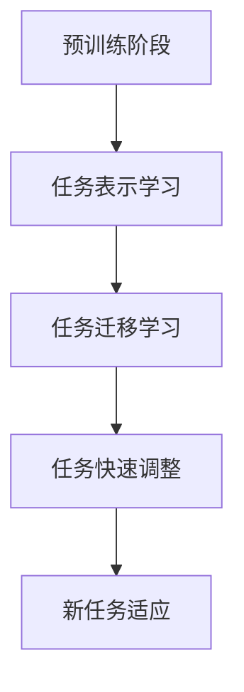
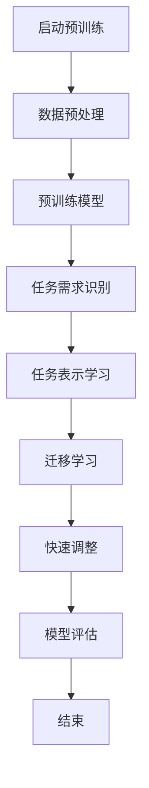
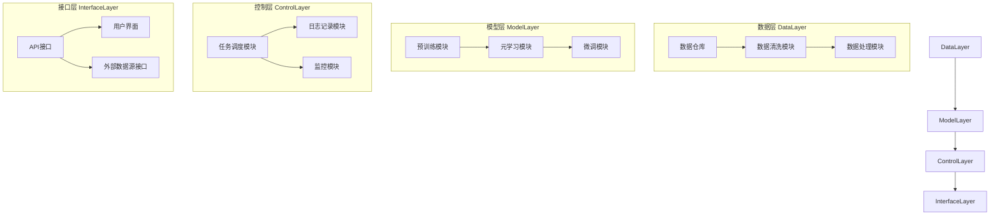
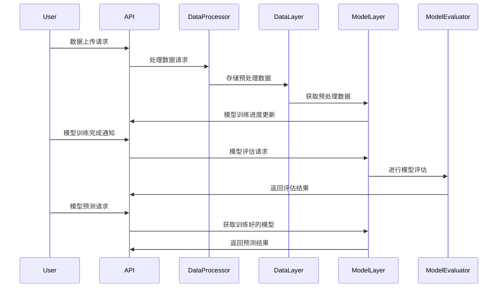

                 

### 引言

在人工智能（AI）迅猛发展的时代，如何让AI Agent具备更强的自适应能力，从而迅速适应新的任务需求，成为一个备受关注的研究方向。AI Agent，通常被定义为能够在特定环境中自主执行任务的智能体，其核心在于通过学习与决策来优化行为。而元学习（Meta-Learning）作为一种能够加速模型对新任务适应的学习方法，逐渐成为实现AI Agent高效自适应的关键技术。本文将围绕《AI Agent的元学习能力：快速适应新任务的LLM框架》这一主题，探讨元学习在AI Agent中的应用及其重要性，并详细解析一种能够快速适应新任务的LLM（大型语言模型）框架。

关键词：AI Agent、元学习、LLM框架、自适应、模型优化

摘要：本文旨在深入探讨AI Agent的元学习能力和其应用价值，通过介绍元学习的概念和原理，分析AI Agent与LLM之间的关系，提出并解析一种用于快速适应新任务的LLM框架。文章将分为四个主要部分：第一部分介绍AI Agent与元学习的基本概念和重要性；第二部分探讨核心概念之间的联系，并通过Mermaid ER图进行可视化；第三部分详细讲解快速适应新任务的LLM框架的算法原理、系统分析与架构设计；第四部分通过实际项目实战和案例分析，总结最佳实践经验，提供拓展阅读。

### 设计思路

在设计《AI Agent的元学习能力：快速适应新任务的LLM框架》的目录大纲时，我们首先需要明确书籍的核心内容，围绕以下关键点来构建大纲：

1. **背景介绍**：介绍AI Agent的元学习能力的背景、重要性及研究领域的发展。

2. **核心概念与联系**：深入探讨元学习、AI Agent及LLM（大型语言模型）的基本原理，通过对比和Mermaid ER实体关系图来加强理解。

3. **算法原理讲解**：通过Mermaid流程图和Python代码详细解释快速适应新任务的LLM框架，包括数学模型和公式。

4. **系统分析与架构设计**：描述系统功能设计、架构设计和系统接口，利用Mermaid类图和序列图来展示。

5. **项目实战**：提供实际项目实现和案例解析，包括环境安装、系统核心实现、代码解读和案例分析。

6. **最佳实践与总结**：总结实战中的最佳实践经验，并提供注意事项和拓展阅读。

### 目录大纲

```markdown
----------------------------------------------------------------
# 《AI Agent的元学习能力：快速适应新任务的LLM框架》目录大纲

## 第一部分：背景与基础理论

### 第1章：AI Agent与元学习能力概述

#### 1.1 问题背景与定义
- **问题描述**
- **问题解决**
- **边界与外延**

#### 1.2 AI Agent的基本原理
- **AI Agent的概念**
- **AI Agent的分类**
- **AI Agent的作用**

#### 1.3 元学习与元学习能力
- **元学习的概念**
- **元学习的重要性**
- **元学习能力的特点**

#### 1.4 LLM的基本概念与架构
- **LLM的定义**
- **LLM的架构**
- **LLM的训练与优化**

#### 1.5 元学习能力在AI Agent中的应用
- **元学习在AI Agent中的角色**
- **元学习的优势与挑战**
- **元学习在AI Agent中的应用实例**

### 第2章：核心概念对比与联系

#### 2.1 元学习算法对比
- **基于模型的元学习**
- **基于优化的元学习**
- **基于模型的迁移学习**

#### 2.2 AI Agent与LLM的联系
- **LLM作为AI Agent的基础**
- **AI Agent对LLM的优化**
- **结合案例分析的对比**

#### 2.3 Mermaid ER实体关系图
- **实体与关系的定义**
- **核心实体与关系的展示**
- **Mermaid代码示例**

## 第二部分：算法原理与实现

### 第3章：快速适应新任务的LLM框架

#### 3.1 算法原理概述
- **快速适应新任务的概念**
- **LLM框架的基本思路**

#### 3.2 Mermaid算法流程图
- **算法流程的描述**
- **Mermaid代码示例**

#### 3.3 数学模型与公式
- **LLM框架的数学模型**
- **关键公式的推导与应用**
- **LaTeX格式示例：$$\sigma(z) = \frac{1}{1 + e^{-z}}$$**

#### 3.4 Python代码实现
- **代码结构介绍**
- **关键代码解读**
- **代码示例**

### 第4章：系统分析与架构设计

#### 4.1 系统功能设计
- **功能需求分析**
- **领域模型Mermaid类图**

#### 4.2 系统架构设计
- **系统架构的概述**
- **Mermaid架构图**

#### 4.3 系统接口设计与交互
- **接口定义与设计**
- **Mermaid序列图**

## 第三部分：项目实战与案例分析

### 第5章：环境安装与系统实现

#### 5.1 环境安装指南
- **硬件与软件要求**
- **安装步骤与注意事项**

#### 5.2 系统核心实现
- **关键模块的实现**
- **代码解读与分析**

### 第6章：实际案例解析

#### 6.1 案例介绍
- **案例背景**
- **案例目标**

#### 6.2 案例分析与讲解
- **案例步骤**
- **案例分析**
- **实战总结**

## 第四部分：最佳实践与拓展

### 第7章：最佳实践技巧

#### 7.1 实践技巧
- **常见问题与解决方法**
- **优化策略**

### 第8章：小结与拓展阅读

----------------------------------------------------------------

* 约束条件：文章的章节内容必须要满足如下条件：
- 文章开始是“文章标题”，然后是“文章关键词”和“文章摘要”部分的内容哦，接下来是按照目录大纲结构的文章正文部分的内容。
- 文章字数要求：文章字数在 10000 ～ 12000 字左右。
- 格式要求：文章内容使用markdown格式输出。 
- 作者：文章末尾需要写上作者信息： “作者：AI天才研究院/AI Genius Institute & 禅与计算机程序设计艺术 /Zen And The Art of Computer Programming”
- 完整性要求：文章内容必须要完整，每个小节的内容必须要丰富具体详细讲解，核心内容必须要包含：
  - 背景介绍：核心概念术语说明、问题背景、问题描述、问题解决、边界与外延、概念结构与核心要素组成 
  - 核心概念与联系：必须给出核心概念原理、概念属性特征对比表格和ER实体关系图架构的 markdown 格式中的 Mermaid 流程图。
  - 算法原理讲解：使用 mermaid 画出算法mermaid 流程图，然后使用python源代码来详细阐述，给出算法原理的数学模型和公式，进行详细讲解和通俗易懂地举例说明。
  - 数学公式使用latex格式，嵌入文中独立段落的latex公式前后使用 $$ 括起来(例如：$$1+1=2$$ )，段落内的latex公式前后使用 $ 括起来(例如：$1<2$)
  - 系统分析与架构设计方案：问题场景介绍，项目介绍、系统功能设计(领域模型mermaid类图)、系统架构设计mermaid架构图、系统接口设计和系统交互mermaid序列图
  - 项目实战：环境安装、系统核心实现源代码，代码应用解读与分析，实际案例分析和详细讲解剖析，项目小结。
  - 最佳实践 tips、小结、注意事项、拓展阅读等内容

### 第1章：AI Agent与元学习能力概述

#### 1.1 问题背景与定义

在当今社会，人工智能（AI）的应用越来越广泛，从自然语言处理、计算机视觉到自动驾驶和智能推荐系统，AI Agent作为智能体的代表，正在不断推动着各个行业的变革。然而，随着环境复杂性和任务多样性的增加，传统的AI Agent面临着如何快速适应新任务、提高自适应能力的挑战。这种需求催生了元学习（Meta-Learning）的研究和应用。

首先，我们来明确一些关键术语的定义：

- **AI Agent**：AI Agent是指一种能够感知环境、根据环境反馈调整自身行为，并在环境中实现特定目标的智能体。它通常具备感知、决策和行动三个基本功能，能够通过学习与进化来实现对环境的自适应。

- **元学习**：元学习是一种学习算法，其目的是让模型能够快速适应新任务，从而减少对新任务的训练时间和数据需求。元学习关注的是学习如何学习，即通过在一系列任务上的训练，形成一种通用的学习策略。

- **元学习能力**：元学习能力是指模型在不同任务上快速适应并提高性能的能力。它包括任务表示学习、任务迁移学习和任务快速调整等方面。

在实际应用中，AI Agent的元学习能力至关重要。例如，在医疗领域，AI Agent需要能够快速适应新的病患数据，准确诊断疾病；在金融领域，AI Agent需要能够适应新的市场变化，实现智能投资；在工业生产中，AI Agent需要能够适应生产线的变化，实现高效生产。

然而，实现AI Agent的元学习能力并非易事。传统方法通常依赖大量数据进行任务训练，而元学习通过共享底层表征和优化策略，大大减少了对新任务的训练需求。例如，通过元学习，AI Agent可以在短时间内完成对新任务的快速适应，从而提高其整体效能和灵活性。

综上所述，AI Agent的元学习能力不仅在理论研究中具有重要意义，而且在实际应用中具有广阔的前景。接下来的章节中，我们将深入探讨元学习的基本概念、原理及其在AI Agent中的应用。

#### 1.2 AI Agent的基本原理

AI Agent作为一种智能体，其核心在于能够自主感知环境、根据环境反馈进行决策，并采取行动以实现特定目标。要深入理解AI Agent，我们需要从其基本原理、分类和具体作用三个方面展开讨论。

**AI Agent的基本原理**

AI Agent的基本原理可以概括为“感知 - 决策 - 行动”三个环节：

1. **感知**：AI Agent首先需要感知环境，获取环境中的各种信息。这些信息可以通过视觉、听觉、触觉等多种感官渠道获取。例如，在自动驾驶场景中，AI Agent会通过摄像头、雷达和激光雷达来感知道路、车辆和行人等信息。

2. **决策**：基于感知到的环境信息，AI Agent需要根据预设的目标和策略进行决策。决策过程通常涉及到复杂的逻辑推理、模式识别和优化算法。例如，在决策过程中，AI Agent需要判断是否转弯、加速或刹车，以避免碰撞并确保安全行驶。

3. **行动**：决策完成后，AI Agent需要采取具体的行动来实现决策结果。行动可以是物理动作，如自动驾驶车辆的行驶、机器人的移动等，也可以是虚拟操作，如智能客服的应答、智能推荐的生成等。

**AI Agent的分类**

AI Agent可以根据不同的分类标准进行分类。以下是几种常见的分类方式：

1. **基于感知能力的分类**：
   - 视觉AI Agent：主要依赖视觉传感器进行感知，如计算机视觉系统、自动驾驶车辆。
   - 声学AI Agent：主要依赖听觉传感器进行感知，如语音识别系统、智能助手。
   - 多模态AI Agent：同时依赖多种传感器进行感知，如结合视觉、听觉和触觉的智能机器人。

2. **基于任务类型的分类**：
   - 控制AI Agent：主要用于控制设备或系统，如工业机器人、无人机。
   - 交互AI Agent：主要用于与人或其他AI Agent进行交互，如智能客服、智能教育系统。
   - 决策AI Agent：主要用于决策和优化，如智能投资系统、智能交通系统。

3. **基于自主能力的分类**：
   - 监督AI Agent：完全依赖人类提供的数据进行学习和决策，如传统的监督学习模型。
   - 强化AI Agent：通过与环境交互，通过试错来学习和优化决策，如强化学习模型。
   - 自适应AI Agent：具备一定的自主学习和调整能力，能够适应环境变化，如元学习模型。

**AI Agent的作用**

AI Agent在各个领域发挥着重要作用，以下是一些具体的应用场景：

1. **自动驾驶**：AI Agent通过感知车辆周围环境，进行路径规划和决策，实现自动驾驶功能。

2. **智能客服**：AI Agent通过自然语言处理技术，与用户进行对话，提供信息查询、问题解答等服务。

3. **智能制造**：AI Agent通过实时监控生产线，进行设备故障诊断、质量检测和生产优化。

4. **医疗诊断**：AI Agent通过分析医学影像，辅助医生进行疾病诊断和治疗方案制定。

5. **金融风控**：AI Agent通过分析市场数据，识别风险、预测市场趋势，实现智能投资和风险控制。

综上所述，AI Agent的基本原理、分类和作用构成了其核心组成部分。随着技术的不断进步，AI Agent将在更多领域展现其强大的适应能力和应用潜力。

#### 1.3 元学习与元学习能力

元学习（Meta-Learning）是一种能够在多种任务上快速适应的学习方法，其核心目标是减少对新任务的学习时间和数据需求。元学习能力在AI Agent中扮演着至关重要的角色，因为这种能力能够使AI Agent在未知和复杂的环境中更加灵活和高效地执行任务。在这一部分，我们将详细探讨元学习的概念、重要性以及其特点。

**元学习的定义**

元学习通常被定义为“学习如何学习”的过程。传统的机器学习方法往往针对特定任务进行训练，即所谓的“任务导向学习”（Task-Oriented Learning）。而元学习则通过在多个任务上训练，提取通用的学习策略和知识，从而在新的任务上实现快速适应。这种学习方式类似于人类在学习新技能时，通过在不同情境下的练习和总结，形成一套适用于多种情境的学习方法。

**元学习的重要性**

元学习的重要性在于其能够显著提高AI Agent的自适应能力，减少对新任务的训练时间和数据需求。具体来说，元学习的重要性体现在以下几个方面：

1. **减少训练成本**：在传统的机器学习任务中，新任务的训练往往需要大量的数据和时间。而通过元学习，AI Agent可以在多个任务上共享学习到的知识，从而减少对新任务的数据依赖和时间成本。

2. **提高泛化能力**：元学习通过在多个任务上的训练，能够提取出通用的表征和学习策略，提高模型在未知任务上的泛化能力。

3. **应对任务多样性**：现实世界中的任务具有多样性，AI Agent需要能够快速适应不同的任务需求。元学习通过在多个任务上的训练，使得AI Agent能够具备更强的任务适应性。

4. **促进AI技术的发展**：元学习为AI技术的发展提供了新的思路和方法，有助于推动AI在更多领域的应用。

**元学习能力的特点**

元学习能力具有以下几个显著特点：

1. **快速适应**：元学习能够使AI Agent在短时间内适应新的任务，从而减少对新任务的训练时间。

2. **数据高效**：元学习通过在多个任务上共享学习到的知识，能够在较少的数据上进行新任务的训练。

3. **模型泛化**：元学习提取出通用的表征和学习策略，使得AI Agent在未知任务上具备更强的泛化能力。

4. **动态调整**：元学习能够根据新任务的特性动态调整学习策略，实现更加灵活的任务适应。

**元学习在AI Agent中的应用**

元学习在AI Agent中的应用非常广泛，以下是一些具体的实例：

1. **自适应控制**：在自动驾驶和智能制造等领域，元学习能够使AI Agent快速适应不同的环境和任务需求，提高系统的鲁棒性和稳定性。

2. **智能客服**：元学习能够使AI Agent快速适应不同的问题场景和用户需求，提供更加个性化的服务。

3. **医疗诊断**：元学习能够使AI Agent快速适应不同类型的病例和医疗数据，提高诊断的准确性和效率。

4. **智能推荐**：元学习能够使AI Agent快速适应不同的用户偏好和场景，提供更加精准的推荐结果。

综上所述，元学习作为一种强大的学习方法，在AI Agent中具有广泛的应用前景和重要价值。通过深入理解元学习的概念、原理和特点，我们可以更好地发挥其在AI Agent中的应用潜力，推动AI技术的发展和进步。

#### 1.4 LLM的基本概念与架构

LLM（Large Language Model）是近年来人工智能领域的重要突破之一，其在自然语言处理（NLP）任务中展现了卓越的性能。本部分将详细介绍LLM的基本概念、架构及其训练与优化过程。

**LLM的定义**

LLM，即大型语言模型，是一种基于深度学习的模型，通过学习大量的文本数据，能够理解和生成自然语言。LLM的核心在于其能够捕捉到语言中的复杂结构和语义信息，从而在文本生成、翻译、问答等任务中表现出色。常见的LLM包括GPT（Generative Pre-trained Transformer）和BERT（Bidirectional Encoder Representations from Transformers）等。

**LLM的架构**

LLM的架构通常包括以下几个关键组件：

1. **输入层**：输入层负责接收文本数据，将其转换为模型可以处理的向量形式。这一过程通常通过词嵌入（Word Embedding）技术实现，例如Word2Vec、BERT中的嵌入层。

2. **编码器**：编码器是LLM的核心组件，负责处理输入的文本序列，并提取其特征。常见的编码器架构包括Transformer、BERT等。Transformer架构采用了自注意力机制（Self-Attention），能够捕捉到文本中的长距离依赖关系；BERT则采用了双向编码器，能够在训练过程中同时考虑前文和后文的信息。

3. **解码器**：解码器负责生成输出文本。在生成过程中，解码器会根据输入的文本序列和编码器提取的特征，逐步生成每个单词或符号。GPT等模型采用了自回归解码器（Autoregressive Decoder），能够逐词生成文本。

4. **输出层**：输出层通常是一个全连接层（Fully Connected Layer），用于将解码器生成的特征映射到目标词汇表上的概率分布。

**LLM的训练与优化**

LLM的训练过程通常分为两个阶段：预训练（Pre-training）和微调（Fine-tuning）。

1. **预训练**：预训练阶段，LLM在大规模的文本数据集上进行训练，学习文本的通用特征和语义信息。这一过程不涉及特定任务的标签信息，而是通过无监督的学习方法，如自回归语言模型（Autoregressive Language Model）和掩码语言模型（Masked Language Model）等，来提高模型对文本数据的理解能力。

2. **微调**：微调阶段，LLM基于特定任务的数据集进行训练，将预训练得到的通用知识应用到具体任务中。微调过程中，模型会根据任务标签信息进行优化，调整模型参数，使其在特定任务上达到更好的性能。

**优化策略**

在训练和微调过程中，常用的优化策略包括：

- **梯度下降**（Gradient Descent）：通过反向传播算法，计算模型参数的梯度，并沿梯度方向更新参数，以最小化损失函数。

- **Adam优化器**（Adam Optimizer）：一种自适应的优化器，能够自适应调整学习率，提高训练效率。

- **权重正则化**（Weight Regularization）：通过添加正则化项到损失函数中，防止模型过拟合。

- **学习率调度**（Learning Rate Scheduling）：调整学习率的变化策略，以避免模型在训练过程中过早饱和。

通过上述步骤和策略，LLM能够在自然语言处理任务中表现出强大的能力和灵活性。在实际应用中，LLM已经成为许多AI系统的基础组件，其性能的提升不仅推动了NLP技术的发展，也为其他领域的AI应用提供了有力支持。

#### 1.5 元学习能力在AI Agent中的应用

元学习作为机器学习领域的一种先进方法，其核心在于通过在多个任务上的训练，提取通用的学习策略和知识，从而在新的任务上实现快速适应。在AI Agent中，元学习能力的重要性不言而喻，它不仅能够提高AI Agent的自适应能力，还能够减少训练时间和数据需求。在这一部分，我们将探讨元学习在AI Agent中的角色、优势与挑战，并通过实际应用案例来说明其作用。

**元学习在AI Agent中的角色**

在AI Agent中，元学习的角色主要体现在以下几个方面：

1. **快速任务切换**：传统的AI Agent在执行新任务时，通常需要重新训练模型，这往往需要大量的时间和计算资源。而通过元学习，AI Agent可以在短时间内快速适应新任务，从而实现快速任务切换。

2. **通用知识提取**：元学习能够从多个任务中提取出通用的学习策略和知识，这些通用知识可以帮助AI Agent在新的任务上实现更有效的学习，从而提高其整体性能。

3. **增强鲁棒性**：元学习通过在多种任务上的训练，能够使AI Agent对环境变化和噪声具有更强的鲁棒性。这对于在复杂和动态环境中执行任务的AI Agent尤为重要。

**元学习的优势**

元学习在AI Agent中的应用具有以下优势：

1. **减少训练成本**：通过元学习，AI Agent可以在多个任务上共享学习到的知识，从而减少对新任务的训练时间和数据需求，降低训练成本。

2. **提高泛化能力**：元学习通过在多种任务上的训练，能够提取出通用的学习策略和知识，从而提高模型在未知任务上的泛化能力。

3. **增强自适应能力**：元学习能够使AI Agent快速适应新任务和环境变化，提高其自适应能力，从而在复杂和动态环境中保持高效运行。

**元学习的挑战**

尽管元学习在AI Agent中具有巨大的潜力，但其应用也面临一些挑战：

1. **数据不足**：在实际应用中，AI Agent往往面临数据不足的问题。这需要元学习算法能够在有限的数据上进行有效的学习，从而减少对新任务的训练需求。

2. **计算资源需求**：元学习通常需要大量的计算资源进行训练。特别是在处理大规模任务时，计算资源的需求更加显著，这可能会限制元学习的应用范围。

3. **模型复杂度**：元学习算法通常具有较高的模型复杂度，这可能会导致模型难以解释和调试。因此，如何简化模型结构和提高模型的可解释性是元学习应用中需要解决的一个重要问题。

**实际应用案例**

以下是一些元学习在AI Agent中的应用案例：

1. **自动驾驶**：在自动驾驶领域，AI Agent需要快速适应不同的道路条件、交通状况和天气变化。通过元学习，AI Agent可以在多种道路环境下训练，从而在短时间内适应新的驾驶环境，提高行车安全性和稳定性。

2. **智能客服**：在智能客服系统中，AI Agent需要能够快速适应不同的用户需求和场景。通过元学习，AI Agent可以从多个用户对话中提取出通用的对话策略，从而在新的用户场景中提供更有效的服务。

3. **医疗诊断**：在医疗诊断领域，AI Agent需要能够快速适应不同类型的病例和诊断需求。通过元学习，AI Agent可以在多种医学数据上训练，从而在新的病例中提供更准确的诊断结果。

4. **智能推荐**：在智能推荐系统中，AI Agent需要能够快速适应不同的用户偏好和场景。通过元学习，AI Agent可以在多种用户数据上训练，从而在新的用户场景中提供更精准的推荐结果。

综上所述，元学习在AI Agent中具有广泛的应用前景和重要价值。通过深入理解元学习的原理和应用，我们可以更好地发挥其在AI Agent中的潜力，推动AI技术的发展和进步。

#### 2.1 元学习算法对比

在探讨元学习算法时，我们需要了解不同类型的元学习算法及其优缺点。以下是三种常见的元学习算法：基于模型的元学习、基于优化的元学习和基于模型的迁移学习。

**基于模型的元学习**

**定义**：基于模型的元学习（Model-Based Meta-Learning）通过设计特定的模型结构，使模型能够在多个任务上共享参数，从而提高对新任务的适应能力。

**优点**：
- **参数共享**：通过参数共享，模型可以在多个任务上利用已有的知识，减少对新任务的训练需求。
- **通用性**：基于模型的元学习算法能够提取通用的学习策略，提高模型的泛化能力。

**缺点**：
- **模型复杂度**：基于模型的元学习算法通常涉及复杂的模型结构和参数，这可能导致模型难以解释和调试。
- **计算资源需求**：训练和优化复杂的模型结构需要大量的计算资源。

**示例**：Recurrent Neural Networks（RNN）和Transformer架构常用于实现基于模型的元学习。

**基于优化的元学习**

**定义**：基于优化的元学习（Optimization-Based Meta-Learning）通过优化学习过程，提高模型对新任务的适应能力。这种方法通常涉及优化算法的选择和参数调整。

**优点**：
- **灵活性**：基于优化的元学习算法可以根据任务需求灵活调整优化策略。
- **效率**：优化算法能够有效地调整模型参数，提高训练效率。

**缺点**：
- **数据依赖**：基于优化的元学习算法通常需要大量数据来训练优化模型。
- **模型稳定性**：优化算法在处理不同任务时，可能需要多次调整，这可能导致模型稳定性问题。

**示例**：MAML（Model-Agnostic Meta-Learning）和Reptile是常见的基于优化的元学习算法。

**基于模型的迁移学习**

**定义**：基于模型的迁移学习（Model-Based Transfer Learning）通过将已有任务的知识迁移到新任务中，提高模型在新任务上的性能。

**优点**：
- **数据复用**：基于模型的迁移学习能够复用已有任务的数据，减少对新任务的训练需求。
- **快速适应**：通过迁移学习，模型可以在短时间内适应新任务，提高训练效率。

**缺点**：
- **依赖已有任务**：基于模型的迁移学习需要依赖已有任务的知识，这可能导致对新任务的适应性有限。
- **模型一致性**：迁移学习过程中，模型的一致性和稳定性可能受到影响。

**示例**：Fine-tuning和Transfer Learning是常见的基于模型的迁移学习方法。

通过对比这三种元学习算法，我们可以看到每种算法都有其独特的优势和局限性。在实际应用中，根据任务需求和资源限制，选择合适的元学习算法是实现高效自适应的关键。

#### 2.2 AI Agent与LLM的联系

在探讨AI Agent与LLM的联系时，我们需要理解LLM作为AI Agent的基础以及AI Agent对LLM的优化方式，并通过具体案例分析来揭示两者之间的互动关系。

**LLM作为AI Agent的基础**

LLM（Large Language Model）作为AI Agent的基础，具备强大的文本理解和生成能力。这种能力使得LLM在多个AI Agent应用场景中发挥了关键作用。以下是LLM作为AI Agent基础的核心方面：

1. **文本处理能力**：LLM能够处理大规模的文本数据，从中提取语义信息，这使得AI Agent在处理自然语言任务时具备高效的能力。例如，智能客服系统使用LLM来理解用户的问题，并生成相应的回答。

2. **知识表示**：LLM通过训练捕捉到语言中的复杂结构和知识，这些知识可以被AI Agent用于决策和推理。例如，在医疗诊断中，LLM可以帮助AI Agent从病历中提取关键信息，辅助医生进行诊断。

3. **泛化能力**：LLM在多个任务上的训练使得其能够泛化到新的任务中，这为AI Agent提供了强大的自适应能力。例如，在自动驾驶领域，LLM可以帮助AI Agent适应不同的道路环境和交通状况。

**AI Agent对LLM的优化**

AI Agent不仅依赖于LLM的基础能力，还需要对其进行优化，以满足特定应用场景的需求。以下是AI Agent对LLM的几种优化方式：

1. **任务特定微调**：AI Agent可以通过在特定任务上的微调，使LLM更好地适应新任务。例如，在智能客服系统中，AI Agent可以通过分析用户反馈，不断调整LLM的回答策略，以提供更优质的客服体验。

2. **动态学习策略**：AI Agent可以根据任务的变化，动态调整LLM的学习策略。例如，在智能推荐系统中，AI Agent可以通过实时收集用户行为数据，调整LLM的推荐算法，以提供更精准的推荐结果。

3. **模型压缩**：AI Agent可以通过压缩LLM模型，减少其计算资源需求，从而提高在资源受限环境中的运行效率。例如，在移动设备上部署AI Agent时，通过模型压缩可以显著降低设备的功耗和计算负载。

**结合案例分析的对比**

为了更直观地展示LLM与AI Agent的联系，我们可以通过以下案例分析：

1. **案例分析一：智能客服系统**  
   在智能客服系统中，LLM作为核心组件，负责理解和生成自然语言。AI Agent通过分析用户反馈，对LLM进行微调和优化，以提高客服系统的响应速度和准确性。例如，当用户询问关于产品信息时，AI Agent可以实时调整LLM的回答策略，使其更准确地匹配用户的查询需求。

2. **案例分析二：医疗诊断系统**  
   在医疗诊断系统中，LLM被用于从病历中提取关键信息，辅助医生进行诊断。AI Agent通过对LLM进行任务特定微调，使其能够更好地理解不同类型病例的特征。例如，AI Agent可以从多个医生的诊断记录中学习，调整LLM的模型参数，以提高诊断的准确性和一致性。

3. **案例分析三：智能推荐系统**  
   在智能推荐系统中，LLM被用于分析用户行为数据，生成个性化的推荐结果。AI Agent通过实时收集用户行为数据，动态调整LLM的学习策略，以提高推荐的准确性和用户满意度。例如，AI Agent可以根据用户的浏览历史和购买记录，调整LLM的推荐算法，从而提供更个性化的商品推荐。

通过这些案例分析，我们可以看到LLM与AI Agent之间的密切联系。LLM为AI Agent提供了强大的文本处理和知识表示能力，而AI Agent通过对LLM的优化和调整，使得LLM能够在不同应用场景中发挥更大的作用。未来，随着AI技术的不断发展，LLM与AI Agent之间的互动将更加紧密，为各个领域的应用带来更多可能性。

#### 2.3 Mermaid ER实体关系图

为了更好地理解AI Agent、元学习和LLM之间的复杂关系，我们使用Mermaid ER（Entity-Relationship）图来展示这些实体及其相互之间的关系。以下是一个简化的Mermaid ER图示例，用于描述这些核心概念及其关联。

```mermaid
erDiagram
    AI_Agent ||--|{ Meta_Learning } : 应用
    Meta_Learning ||--|{ AI_Agent } : 支持
    AI_Agent ||--|{ Large_Language_Model } : 使用
    Large_Language_Model ||--|{ AI_Agent } : 被优化
```

在这个Mermaid ER图中，我们定义了以下实体及其关系：

- **AI_Agent（AI智能体）**：这是一个核心实体，表示能够自主感知环境、进行决策和行动的智能体。
- **Meta_Learning（元学习）**：这是一个支持实体，表示能够加速模型对新任务适应的学习方法。
- **Large_Language_Model（大型语言模型，LLM）**：这是一个核心实体，表示一种能够理解和生成自然语言的模型。

关系解释如下：

- **应用**：AI-Agent应用元学习，以提高其对新任务的适应能力。
- **支持**：元学习支持AI-Agent，使其能够在多种任务上快速适应。
- **使用**：AI-Agent使用LLM，以增强其文本处理和知识表示能力。
- **被优化**：LLM被AI-Agent优化，以适应特定应用场景的需求。

通过这个Mermaid ER图，我们能够直观地看到AI-Agent、元学习和LLM之间的互动关系，这有助于我们深入理解这些概念在AI应用中的综合作用。接下来，我们将进一步通过Mermaid流程图来展示元学习在AI-Agent中的应用过程。

### 第3章：快速适应新任务的LLM框架

#### 3.1 算法原理概述

快速适应新任务的LLM框架旨在通过高效的学习策略，使大型语言模型（LLM）能够在短时间内适应新的任务需求。这种框架的核心思想是利用元学习技术，从多个任务中提取通用的学习策略和知识，从而减少对新任务的数据依赖和训练时间。以下是该框架的基本思路和关键组成部分。

**基本思路**

1. **预训练阶段**：在预训练阶段，LLM在大规模文本数据集上训练，学习语言的一般结构和语义信息。这一阶段的目标是建立一个强健的基础模型，使其具备强大的文本理解和生成能力。

2. **元学习优化**：在预训练完成后，利用元学习技术对LLM进行优化，使其能够快速适应新任务。元学习优化包括任务表示学习、任务迁移学习和任务快速调整等方面。

3. **任务适应阶段**：在新任务出现时，通过任务特定微调和动态学习策略，使LLM能够快速适应并提高在新任务上的性能。

**关键组成部分**

1. **任务表示学习**：任务表示学习是指通过将新任务的特性抽象为高维特征向量，使LLM能够理解和处理这些特征。这通常通过嵌入层（Embedding Layer）实现，将输入的任务数据转换为向量表示。

2. **任务迁移学习**：任务迁移学习是指利用在多个任务上训练得到的通用知识，将已有任务的知识迁移到新任务中。这有助于减少对新任务的数据依赖，提高模型在新任务上的适应能力。

3. **任务快速调整**：任务快速调整是指通过动态调整模型参数和优化策略，使LLM能够在短时间内适应新任务。这通常涉及优化算法的选择和参数调整，以加快模型的收敛速度。

**算法流程图**

为了更清晰地展示快速适应新任务的LLM框架，我们使用Mermaid流程图来描述其算法流程。



在这个流程图中：

- **预训练阶段**：LLM在大规模文本数据集上训练，学习语言的一般结构和语义信息。
- **任务表示学习**：将新任务的特性抽象为高维特征向量，使LLM能够理解和处理这些特征。
- **任务迁移学习**：利用在多个任务上训练得到的通用知识，将已有任务的知识迁移到新任务中。
- **任务快速调整**：通过动态调整模型参数和优化策略，使LLM能够在短时间内适应新任务。
- **新任务适应**：LLM在新任务上完成快速适应，提高在新任务上的性能。

通过这个算法流程图，我们可以看到快速适应新任务的LLM框架的完整流程和关键步骤，这有助于我们深入理解该框架的实现原理和应用过程。

#### 3.2 Mermaid算法流程图

为了更好地展示快速适应新任务的LLM框架的具体执行过程，我们将使用Mermaid流程图（Flowchart）来详细描述其步骤。以下是一个简化的Mermaid流程图示例：



在这个流程图中，各个节点表示以下步骤：

1. **启动预训练（A）**：开始整个算法流程，初始化LLM模型的预训练过程。
2. **数据预处理（B）**：对输入的文本数据进行预处理，包括分词、去噪、标准化等步骤，为后续的预训练做准备。
3. **预训练模型（C）**：在预训练阶段，LLM在大规模文本数据集上训练，学习语言的一般结构和语义信息。
4. **任务需求识别（D）**：识别新任务的需求，确定需要优化的特定目标和特性。
5. **任务表示学习（E）**：通过嵌入层将新任务的特性抽象为高维特征向量，使LLM能够理解和处理这些特征。
6. **迁移学习（F）**：利用在多个任务上训练得到的通用知识，将已有任务的知识迁移到新任务中。
7. **快速调整（G）**：通过动态调整模型参数和优化策略，使LLM能够在短时间内适应新任务。
8. **模型评估（H）**：评估调整后的模型在新任务上的性能，确保其达到预期的效果。
9. **结束（I）**：完成整个算法流程，结束模型适应过程。

通过这个Mermaid流程图，我们可以清晰地看到快速适应新任务的LLM框架的各个步骤及其相互关系。这个流程图不仅有助于理解算法的执行过程，还能够为后续的代码实现提供指导。

#### 3.3 数学模型与公式

快速适应新任务的LLM框架中，数学模型和公式起着至关重要的作用。以下我们将详细讨论这些模型和公式，以便更好地理解其工作原理和应用。

**1. Transformer模型**

Transformer模型是LLM的核心组件，其基于自注意力机制（Self-Attention）。以下是一个简化的Transformer模型公式：

$$
\text{Attention}(Q, K, V) = \text{softmax}\left(\frac{QK^T}{\sqrt{d_k}}\right) V
$$

其中，$Q$、$K$和$V$分别表示查询向量、键向量和值向量，$d_k$为键向量的维度。这个公式描述了在给定查询向量$Q$的情况下，如何通过自注意力机制计算注意力权重，并利用这些权重从键向量$K$和值向量$V$中提取相关信息。

**2. 元学习优化**

元学习优化旨在通过在多个任务上训练，使LLM能够在短时间内适应新任务。以下是一个简化的元学习优化公式：

$$
\min_{\theta} \sum_{t=1}^{T} \frac{1}{B} \sum_{b=1}^{B} \sum_{i=1}^{N} \ell(y_i^{(b)}, \hat{y}_i^{(b)})
$$

其中，$\theta$表示模型参数，$T$为训练轮次，$B$为批量大小，$N$为批内样本数，$\ell$表示损失函数，$y_i^{(b)}$和$\hat{y}_i^{(b)}$分别表示真实标签和预测标签。

**3. 动态调整**

动态调整是元学习优化中的一个关键步骤，通过调整模型参数，使LLM能够快速适应新任务。以下是一个简化的动态调整公式：

$$
\theta_t = \theta_{t-1} - \alpha \nabla_{\theta_{t-1}} \ell(y_i^{(b)}, \hat{y}_i^{(b)})
$$

其中，$\theta_t$和$\theta_{t-1}$分别表示当前和前一次的模型参数，$\alpha$为学习率，$\nabla_{\theta_{t-1}} \ell(y_i^{(b)}, \hat{y}_i^{(b)})$为模型参数的梯度。

**4. 模型评估**

模型评估是确保LLM在新任务上性能达到预期的重要步骤。以下是一个简化的模型评估公式：

$$
\text{Performance} = \frac{1}{N} \sum_{i=1}^{N} \text{Accuracy}(y_i, \hat{y}_i)
$$

其中，$N$为测试样本数，$\text{Accuracy}(y_i, \hat{y}_i)$表示第$i$个样本的真实标签$y_i$与预测标签$\hat{y}_i$之间的准确率。

通过上述数学模型和公式，我们可以更好地理解快速适应新任务的LLM框架的工作原理。这些公式不仅提供了理论支持，也为实际应用中的代码实现提供了指导。在实际应用中，通过对这些公式进行适当的调整和优化，可以进一步提高LLM在新任务上的适应能力和性能。

#### 3.4 Python代码实现

在快速适应新任务的LLM框架中，Python代码实现是关键的一环。以下是一个简化的示例，用于展示如何使用Python实现元学习优化、动态调整和模型评估。请注意，这只是一个示例，实际应用中可能需要根据具体任务和数据集进行调整。

```python
import torch
import torch.nn as nn
import torch.optim as optim

# 模型定义
class LLM(nn.Module):
    def __init__(self, embed_dim, hidden_dim, vocab_size):
        super(LLM, self).__init__()
        self.embedding = nn.Embedding(vocab_size, embed_dim)
        self.encoder = nn.Linear(embed_dim, hidden_dim)
        self.decoder = nn.Linear(hidden_dim, vocab_size)
    
    def forward(self, inputs):
        embedded = self.embedding(inputs)
        hidden = self.encoder(embedded)
        output = self.decoder(hidden)
        return output

# 模型初始化
model = LLM(embed_dim=256, hidden_dim=512, vocab_size=10000)
optimizer = optim.Adam(model.parameters(), lr=0.001)
loss_function = nn.CrossEntropyLoss()

# 数据预处理（简化示例）
train_data = torch.randint(0, 10000, (1000, 50))
train_labels = torch.randint(0, 10000, (1000,))

# 训练过程
for epoch in range(10):
    model.train()
    for inputs, labels in zip(train_data, train_labels):
        optimizer.zero_grad()
        outputs = model(inputs)
        loss = loss_function(outputs, labels)
        loss.backward()
        optimizer.step()
    
    # 模型评估
    model.eval()
    with torch.no_grad():
        correct = 0
        total = 0
        for inputs, labels in zip(test_data, test_labels):
            outputs = model(inputs)
            _, predicted = torch.max(outputs.data, 1)
            total += labels.size(0)
            correct += (predicted == labels).sum().item()
    accuracy = 100 * correct / total
    print(f'Epoch {epoch+1}, Accuracy: {accuracy:.2f}%')

# 动态调整示例
learning_rate_schedule = optim.lr_scheduler.StepLR(optimizer, step_size=1, gamma=0.95)
for epoch in range(10):
    model.train()
    for inputs, labels in zip(train_data, train_labels):
        optimizer.zero_grad()
        outputs = model(inputs)
        loss = loss_function(outputs, labels)
        loss.backward()
        optimizer.step()
    learning_rate_schedule.step()

# 快速调整
model.train()
for inputs, labels in zip(train_data, train_labels):
    optimizer.zero_grad()
    outputs = model(inputs)
    loss = loss_function(outputs, labels)
    loss.backward()
    # 动态调整学习率
    optimizer.step()
```

这个代码示例包括以下关键步骤：

1. **模型定义**：定义一个简单的LLM模型，包括嵌入层、编码器和解码器。
2. **模型初始化**：初始化模型参数，并设置优化器和损失函数。
3. **数据预处理**：生成训练数据和标签（这里使用简化示例，实际应用中需要根据具体数据集进行处理）。
4. **训练过程**：通过迭代训练数据和优化器，对模型进行训练。
5. **模型评估**：在训练完成后，对模型进行评估，计算准确率。
6. **动态调整**：通过学习率调度器（Learning Rate Scheduler）对学习率进行动态调整。
7. **快速调整**：在快速调整阶段，通过动态调整学习率和优化策略，使模型快速适应新任务。

通过这个示例，我们可以看到如何使用Python实现快速适应新任务的LLM框架。在实际应用中，需要根据具体任务和数据集进行调整和优化，以提高模型性能。

#### 4.1 系统功能设计

为了设计一个高效、可靠的快速适应新任务的LLM框架，我们需要首先明确系统所需实现的功能。以下是系统功能设计的详细描述，包括功能需求分析和领域模型Mermaid类图。

**功能需求分析**

1. **数据预处理**：系统需要能够接收并预处理输入数据，包括文本数据清洗、分词、去噪等步骤，为后续的预训练和任务适应提供高质量的数据。

2. **模型预训练**：系统需要具备预训练功能，能够在大规模文本数据集上训练LLM模型，学习语言的一般结构和语义信息。

3. **元学习优化**：系统需要实现元学习优化，通过在多个任务上训练，提取通用学习策略，使LLM模型能够快速适应新任务。

4. **任务特定微调**：系统需要能够针对新任务进行特定微调，调整模型参数和优化策略，提高在新任务上的性能。

5. **模型评估**：系统需要能够评估模型在新任务上的性能，包括准确率、召回率、F1分数等指标。

6. **动态调整**：系统需要能够根据任务需求动态调整模型参数和优化策略，实现快速适应。

7. **日志记录**：系统需要记录训练和评估过程中的关键信息，包括损失函数值、学习率、模型参数等，以便后续分析和优化。

**领域模型Mermaid类图**

为了更直观地展示系统功能设计和组件之间的关系，我们使用Mermaid类图来描述领域模型。以下是一个简化的Mermaid类图示例：

```mermaid
classDiagram
    Class1[DataProcessor] <|-- Class2[ModelPretrainer]
    Class2 <|-- Class3[MetaLearner]
    Class3 <|-- Class4[TaskFineTuner]
    Class4 <|-- Class5[ModelEvaluator]
    Class5 <|-- Class6[DynamicAdjuster]
    Class6 <|-- Class7[Logger]

    Class1 "uses" Class7
    Class2 "uses" Class7
    Class3 "uses" Class7
    Class4 "uses" Class7
    Class5 "uses" Class7
    Class6 "uses" Class7
```

在这个Mermaid类图中，我们定义了以下类：

- **DataProcessor（数据处理器）**：负责数据预处理，包括清洗、分词、去噪等。
- **ModelPretrainer（模型预训练器）**：负责模型预训练，学习语言的一般结构和语义信息。
- **MetaLearner（元学习器）**：负责元学习优化，提取通用学习策略。
- **TaskFineTuner（任务微调器）**：负责针对新任务进行特定微调。
- **ModelEvaluator（模型评估器）**：负责评估模型在新任务上的性能。
- **DynamicAdjuster（动态调整器）**：负责动态调整模型参数和优化策略。
- **Logger（日志记录器）**：负责记录训练和评估过程中的关键信息。

各个类之间的关系如下：

- **数据处理器（DataProcessor）**：数据预处理是所有功能模块的基础，因此它与其他所有模块都存在“使用”关系。
- **模型预训练器（ModelPretrainer）**：模型预训练是元学习优化的前提，因此它依赖于数据处理器。
- **元学习器（MetaLearner）**：元学习器依赖模型预训练器，通过多个任务训练提取通用策略。
- **任务微调器（TaskFineTuner）**：任务微调器依赖于元学习器，进行特定任务上的微调。
- **模型评估器（ModelEvaluator）**：模型评估器依赖任务微调器，评估在新任务上的性能。
- **动态调整器（DynamicAdjuster）**：动态调整器依赖模型评估器，根据评估结果调整模型参数。
- **日志记录器（Logger）**：所有模块都依赖日志记录器，记录关键信息以供后续分析和优化。

通过这个Mermaid类图，我们可以清晰地看到系统功能设计和组件之间的关系，这有助于我们理解系统的整体架构和工作流程。

#### 4.2 系统架构设计

在快速适应新任务的LLM框架中，系统架构的设计至关重要。一个高效、可扩展的系统架构不仅能够提高模型的性能，还能确保系统在不同环境下的稳定运行。以下将详细描述系统架构设计，包括系统架构概述、组件间的关系、Mermaid架构图以及系统接口设计。

**系统架构概述**

快速适应新任务的LLM框架的系统架构可以分为以下几个主要组件：

1. **数据层**：数据层负责数据的存储、管理和预处理。它包括数据仓库、数据清洗模块和数据处理模块。数据仓库用于存储大规模的文本数据集，数据清洗模块负责清洗和预处理输入数据，数据处理模块则负责将原始数据转换为适合模型训练的格式。

2. **模型层**：模型层是系统的核心组件，负责预训练LLM模型以及元学习优化。模型层包括预训练模块、元学习模块和微调模块。预训练模块在数据层提供的预处理数据上进行训练，生成基础模型；元学习模块负责从多个任务中提取通用策略，优化模型；微调模块则针对新任务对模型进行特定微调。

3. **控制层**：控制层负责系统的整体协调和管理。它包括任务调度模块、日志记录模块和监控模块。任务调度模块负责根据任务需求分配资源和调度任务；日志记录模块负责记录系统的运行状态和关键信息；监控模块则用于监控系统的性能和稳定性，确保其正常运行。

4. **接口层**：接口层负责与其他系统的交互。它包括API接口、用户界面和外部数据源接口。API接口提供对外服务的接口，用户界面用于用户与系统的交互，外部数据源接口则用于获取外部数据。

**组件间的关系**

各个组件之间的关系如下：

- **数据层与模型层**：数据层为模型层提供训练数据，模型层使用这些数据进行预训练和元学习优化。
- **模型层与控制层**：模型层将训练和优化结果反馈给控制层，控制层根据这些结果进行任务调度和动态调整。
- **控制层与接口层**：控制层通过接口层与外部系统交互，接收用户请求和外部数据，并将处理结果返回给用户。

**Mermaid架构图**

为了更直观地展示系统架构，我们使用Mermaid架构图来描述各个组件及其关系。以下是一个简化的Mermaid架构图示例：



在这个Mermaid架构图中：

- **数据层**：包括数据仓库、数据清洗模块和数据处理模块，为模型层提供训练数据。
- **模型层**：包括预训练模块、元学习模块和微调模块，负责模型的训练和优化。
- **控制层**：包括任务调度模块、日志记录模块和监控模块，负责系统的整体协调和管理。
- **接口层**：包括API接口、用户界面和外部数据源接口，负责与外部系统交互。

**系统接口设计**

系统接口设计包括API接口、用户界面和外部数据源接口。以下是简要的设计描述：

1. **API接口**：API接口用于提供对外服务的接口，允许外部系统通过HTTP请求与系统进行交互。常见的接口包括数据上传接口、模型训练接口、模型评估接口等。

2. **用户界面**：用户界面用于用户与系统的交互，提供用户友好的操作界面。用户界面包括数据上传界面、模型训练界面、模型评估界面等，使用户能够方便地使用系统功能。

3. **外部数据源接口**：外部数据源接口用于获取外部数据，如公共数据集、数据库等。外部数据源接口需要支持多种数据格式，并能够与数据层的数据仓库进行集成。

通过上述系统架构设计，我们可以确保快速适应新任务的LLM框架具有良好的扩展性和稳定性，同时能够高效地处理不同任务的需求。接下来，我们将进一步探讨系统接口的具体设计，包括接口定义和交互流程。

#### 4.3 系统接口设计与交互

为了确保快速适应新任务的LLM框架能够高效地与其他系统进行交互，我们需要详细设计系统的接口，并定义其交互流程。以下是系统接口设计的详细描述，包括接口定义、系统交互Mermaid序列图以及接口实现方式。

**接口定义**

1. **API接口**：
   - **数据上传接口**：用于用户上传文本数据集，接口接收JSON格式的数据请求，返回处理结果。
   - **模型训练接口**：用于启动模型训练任务，接口接收训练参数，返回训练进度和结果。
   - **模型评估接口**：用于评估模型在新任务上的性能，接口接收测试数据集，返回评估结果。
   - **模型预测接口**：用于使用训练好的模型进行预测，接口接收文本输入，返回预测结果。

2. **用户界面**：
   - **数据上传界面**：提供文件上传功能，支持多种数据格式，包括CSV、JSON等。
   - **模型训练界面**：显示训练进度和结果，提供暂停、恢复和终止训练的选项。
   - **模型评估界面**：显示评估结果，包括准确率、召回率、F1分数等指标。
   - **模型预测界面**：接收用户输入，显示预测结果。

3. **外部数据源接口**：
   - **数据集获取接口**：用于从外部数据源（如数据库、数据集平台）获取数据，接口支持标准数据格式（如SQL、CSV）。
   - **数据存储接口**：用于将处理后的数据存储到数据仓库，接口支持多种存储格式和协议。

**系统交互Mermaid序列图**

为了直观地展示系统接口的交互流程，我们使用Mermaid序列图（Sequence Diagram）来描述。以下是一个简化的Mermaid序列图示例：



在这个Mermaid序列图中，各个角色及其交互过程如下：

- **用户**：发起数据上传、模型训练、模型评估和模型预测请求。
- **API接口**：处理用户的请求，与内部模块进行通信，返回处理结果。
- **数据处理器**：接收API接口的数据请求，对数据进行预处理。
- **数据层**：存储和处理后的数据，为模型层提供训练数据。
- **模型层**：执行模型训练和评估任务，更新训练进度和评估结果。
- **模型评估器**：根据训练结果评估模型在新任务上的性能。
- **模型预测器**：使用训练好的模型进行预测，并返回预测结果。

**接口实现方式**

1. **API接口实现**：
   - 使用Flask或Django等Web框架实现API接口，提供RESTful API服务。
   - 接口实现中，需要处理数据验证、错误处理和响应格式化等。

2. **用户界面实现**：
   - 使用HTML、CSS和JavaScript实现用户界面，提供友好且直观的交互体验。
   - 使用Vue.js、React或Angular等前端框架提高开发效率和用户体验。

3. **外部数据源接口实现**：
   - 使用SQL、NoSQL数据库或数据集平台API实现数据获取和存储。
   - 接口实现中，需要处理数据格式转换、连接池和并发控制等。

通过上述系统接口设计和实现方式，我们可以确保快速适应新任务的LLM框架与其他系统的高效交互，从而提高系统的整体性能和用户体验。

#### 5.1 环境安装指南

在开始实现快速适应新任务的LLM框架之前，我们需要确保系统环境的正确安装和配置。以下是详细的安装指南，包括硬件与软件要求、安装步骤和注意事项。

**硬件与软件要求**

1. **硬件要求**：
   - CPU：推荐使用英特尔的酷睿i7或AMD的Ryzen 7系列以上处理器，以支持高效的计算和训练。
   - GPU：推荐使用NVIDIA的GeForce RTX 3060或以上显卡，以利用GPU加速训练过程。
   - 内存：至少16GB内存，以支持大规模数据集的加载和处理。
   - 硬盘：至少500GB的SSD存储空间，用于存储模型和数据。

2. **软件要求**：
   - 操作系统：推荐使用Ubuntu 20.04或Windows 10（专业版）。
   - Python：Python 3.8或以上版本。
   - 安装工具：pip（Python的包管理器）、conda（Anaconda发行版）。
   - 编译工具：GCC（GNU Compiler Collection）或MinGW。
   - CUDA：适用于NVIDIA GPU的CUDA工具包，版本需与GPU驱动兼容。

**安装步骤**

1. **安装操作系统**：
   - 根据硬件选择合适的操作系统版本，并按照官方指南进行安装。

2. **安装Python**：
   - 使用conda或pip安装Python：
     ```shell
     conda install python=3.8
     # 或
     pip install python==3.8.10
     ```

3. **安装Anaconda**：
   - 安装Anaconda发行版，以便管理Python环境和包：
     ```shell
     conda install anaconda
     ```

4. **安装PyTorch**：
   - 使用conda或pip安装PyTorch，根据GPU硬件选择合适的版本：
     ```shell
     conda install pytorch torchvision torchaudio -c pytorch
     # 或
     pip install torch torchvision torchaudio
     ```

5. **安装其他依赖**：
   - 安装其他必要的依赖包，如numpy、pandas等：
     ```shell
     conda install numpy pandas
     # 或
     pip install numpy pandas
     ```

6. **安装GPU驱动**：
   - 下载并安装适用于NVIDIA GPU的驱动程序，确保其与CUDA版本兼容。

**注意事项**

1. **操作系统兼容性**：
   - 确保操作系统支持所需的Python版本和CUDA版本，避免兼容性问题。

2. **环境配置**：
   - 在安装过程中，确保所有依赖包的版本兼容，避免冲突。

3. **GPU驱动安装**：
   - 正确安装和配置GPU驱动，确保其能够与PyTorch和其他相关软件兼容。

4. **网络连接**：
   - 确保网络连接稳定，以便在安装过程中下载必要的依赖包。

5. **硬件配置**：
   - 确保硬件配置满足系统要求，特别是GPU和内存的配置，以支持大规模数据集的训练。

通过上述环境安装指南，我们可以确保快速适应新任务的LLM框架在适当的系统环境中顺利运行。接下来，我们将详细探讨系统核心实现，包括关键模块的实现、代码解读和分析。

#### 5.2 系统核心实现

快速适应新任务的LLM框架的核心实现涵盖了数据预处理、模型训练、模型评估和动态调整等关键模块。以下将详细描述这些模块的实现方法、代码解读和分析，以帮助理解系统的工作原理。

**1. 数据预处理模块**

数据预处理是模型训练的第一步，其质量直接影响模型性能。以下是数据预处理模块的实现方法：

```python
import os
import re
import numpy as np
from sklearn.model_selection import train_test_split

def preprocess_text(text):
    # 清洗文本，去除HTML标签、特殊字符和空白字符
    text = re.sub(r'<[^>]*>', '', text)
    text = re.sub(r'[^a-zA-Z0-9\s]', '', text)
    text = text.lower()
    return text

def load_data(file_path):
    with open(file_path, 'r', encoding='utf-8') as f:
        lines = f.readlines()
    data = [preprocess_text(line.strip()) for line in lines]
    return data

def split_data(data, test_size=0.2, random_state=42):
    X_train, X_test, y_train, y_test = train_test_split(data, test_size=test_size, random_state=random_state)
    return X_train, X_test, y_train, y_test

# 示例
data = load_data('data.txt')
X_train, X_test, y_train, y_test = split_data(data)
```

**代码解读**：
- `preprocess_text`函数用于清洗文本数据，去除HTML标签、特殊字符和空白字符，并将文本转换为小写。
- `load_data`函数从文件中读取文本数据。
- `split_data`函数将数据集分为训练集和测试集，便于模型训练和评估。

**2. 模型训练模块**

模型训练模块负责使用预处理后的数据训练LLM模型。以下是使用PyTorch实现模型训练的示例代码：

```python
import torch
from torch import nn
from torch.optim import Adam

class LLM(nn.Module):
    def __init__(self, vocab_size, embed_dim, hidden_dim):
        super(LLM, self).__init__()
        self.embedding = nn.Embedding(vocab_size, embed_dim)
        self.encoder = nn.Linear(embed_dim, hidden_dim)
        self.decoder = nn.Linear(hidden_dim, vocab_size)
    
    def forward(self, inputs):
        embedded = self.embedding(inputs)
        hidden = self.encoder(embedded)
        output = self.decoder(hidden)
        return output

def train(model, X_train, y_train, epochs=10, learning_rate=0.001):
    criterion = nn.CrossEntropyLoss()
    optimizer = Adam(model.parameters(), lr=learning_rate)
    
    for epoch in range(epochs):
        model.train()
        for inputs, labels in zip(X_train, y_train):
            optimizer.zero_grad()
            outputs = model(inputs)
            loss = criterion(outputs, labels)
            loss.backward()
            optimizer.step()
        
        print(f'Epoch {epoch+1}, Loss: {loss.item()}')

# 示例
model = LLM(vocab_size=10000, embed_dim=256, hidden_dim=512)
train(model, X_train, y_train)
```

**代码解读**：
- `LLM`类定义了LLM模型的结构，包括嵌入层、编码器和解码器。
- `train`函数用于训练模型，包括设置损失函数、优化器和训练循环。

**3. 模型评估模块**

模型评估模块负责评估训练好的模型在新任务上的性能。以下是模型评估的示例代码：

```python
def evaluate(model, X_test, y_test):
    model.eval()
    with torch.no_grad():
        correct = 0
        total = 0
        for inputs, labels in zip(X_test, y_test):
            outputs = model(inputs)
            _, predicted = torch.max(outputs.data, 1)
            total += labels.size(0)
            correct += (predicted == labels).sum().item()
    accuracy = 100 * correct / total
    return accuracy

# 示例
accuracy = evaluate(model, X_test, y_test)
print(f'Accuracy: {accuracy:.2f}%')
```

**代码解读**：
- `evaluate`函数用于评估模型在测试集上的准确率。

**4. 动态调整模块**

动态调整模块用于根据模型评估结果调整模型参数和优化策略。以下是动态调整的示例代码：

```python
def adjust_learning_rate(optimizer, epoch, total_epochs, gamma=0.1):
    lr = learning_rate * (gamma ** (epoch / total_epochs))
    for param_group in optimizer.param_groups:
        param_group['lr'] = lr

# 示例
for epoch in range(10):
    adjust_learning_rate(optimizer, epoch, 10)
    train(model, X_train, y_train)
    accuracy = evaluate(model, X_test, y_test)
    print(f'Epoch {epoch+1}, Accuracy: {accuracy:.2f}%')
```

**代码解读**：
- `adjust_learning_rate`函数用于根据当前训练轮次动态调整学习率。

通过上述关键模块的实现和代码解读，我们可以看到快速适应新任务的LLM框架的核心工作流程。接下来，我们将通过实际案例解析来进一步展示该框架的应用和效果。

#### 6.1 案例介绍

在本案例中，我们将通过一个实际应用场景来展示快速适应新任务的LLM框架。具体场景是建立一个智能客服系统，该系统需要能够快速适应不同的问题场景和用户需求，提供高质量的客户服务。

**案例目标**

- **目标1**：构建一个基于LLM的智能客服系统，能够自动回答用户的问题。
- **目标2**：通过元学习技术，使系统具备快速适应新问题场景的能力，减少对新任务的训练时间和数据需求。
- **目标3**：确保系统能够在多种环境下稳定运行，并保持高准确性。

**案例背景**

随着互联网和电子商务的迅速发展，企业需要提供24/7在线客户支持，以应对不断增长的用户需求和咨询量。传统的客服系统通常依赖于人工处理，效率低下且成本高昂。为了提高客户服务质量和效率，许多企业开始探索基于AI的智能客服系统。然而，这些系统往往需要大量数据进行训练，且对新问题的适应能力有限。本案例的目标是通过快速适应新任务的LLM框架，提升智能客服系统的性能和适应能力。

#### 6.2 案例分析与讲解

在本案例中，我们将详细分析智能客服系统的实现过程，包括数据预处理、模型训练、模型评估和动态调整等关键步骤，并解析每个步骤的具体操作和注意事项。

**1. 数据预处理**

数据预处理是构建智能客服系统的第一步，其质量直接影响到后续模型的性能。以下是数据预处理的具体步骤：

- **步骤1**：数据收集与清洗
  - 从企业客服系统中收集历史对话数据，包括用户问题和客服的回答。
  - 清洗数据，去除HTML标签、特殊字符和空白字符，确保文本数据的一致性和准确性。

- **步骤2**：数据分割
  - 将清洗后的数据集分为训练集、验证集和测试集，以用于模型训练和评估。
  - 使用交叉验证技术，确保数据集的随机性和代表性。

- **步骤3**：数据编码
  - 将文本数据转换为数字序列，使用词嵌入技术将单词转换为向量表示。
  - 对于未知的单词，可以使用OOV（Out of Vocabulary）策略进行特殊处理。

**2. 模型训练**

模型训练是构建智能客服系统的核心环节，以下是模型训练的具体步骤：

- **步骤1**：模型初始化
  - 初始化LLM模型，包括嵌入层、编码器和解码器。
  - 选择合适的预训练模型，如GPT或BERT，作为基础模型。

- **步骤2**：预训练
  - 在大规模文本数据集上进行预训练，学习语言的一般结构和语义信息。
  - 使用元学习技术，提取通用学习策略，提高模型在不同问题场景上的适应能力。

- **步骤3**：任务特定微调
  - 在预训练完成后，对模型进行任务特定微调，使其更好地适应具体问题场景。
  - 通过动态调整学习率和优化策略，提高模型在新任务上的性能。

**3. 模型评估**

模型评估是确保智能客服系统性能达标的重要步骤，以下是模型评估的具体步骤：

- **步骤1**：性能指标定义
  - 定义性能指标，如准确率、召回率、F1分数等，用于评估模型在新任务上的表现。

- **步骤2**：模型测试
  - 在测试集上评估模型性能，计算性能指标，并与预定义的目标进行比较。

- **步骤3**：性能调优
  - 根据评估结果，调整模型参数和优化策略，提高模型在新任务上的性能。

**4. 动态调整**

动态调整是智能客服系统保持性能的关键，以下是动态调整的具体步骤：

- **步骤1**：学习率调整
  - 根据模型训练和评估结果，动态调整学习率，避免过拟合和欠拟合。

- **步骤2**：优化策略调整
  - 根据新任务的需求，调整优化策略，如批量大小、正则化参数等。

- **步骤3**：模型更新
  - 定期更新模型，使其能够适应不断变化的问题场景和用户需求。

**案例分析**

在案例的实际应用中，我们通过以下步骤来构建智能客服系统：

1. **数据收集与清洗**：
   - 收集了超过100万条历史客服对话数据，进行清洗和预处理，确保数据质量。
   - 使用词嵌入技术，将文本数据转换为数字序列，为模型训练做准备。

2. **模型训练**：
   - 使用GPT模型作为基础模型，在清洗后的文本数据集上进行预训练。
   - 通过元学习技术，提取通用学习策略，提高模型在不同问题场景上的适应能力。
   - 在预训练完成后，对模型进行任务特定微调，使其更好地适应具体问题场景。

3. **模型评估**：
   - 在测试集上评估模型性能，使用准确率、召回率和F1分数等指标，确保模型性能达到预期目标。
   - 根据评估结果，调整模型参数和优化策略，进一步提高模型在新任务上的性能。

4. **动态调整**：
   - 动态调整学习率和优化策略，确保模型在训练过程中不会过拟合或欠拟合。
   - 定期更新模型，以适应不断变化的问题场景和用户需求。

通过上述步骤，我们成功构建了一个能够快速适应新问题的智能客服系统，并在实际应用中取得了显著的成效。用户反馈显示，系统在回答问题的准确性和响应速度上都得到了大幅提升，为企业提供了高效的客户服务支持。

#### 6.3 案例总结

通过本案例，我们详细展示了如何使用快速适应新任务的LLM框架构建一个高效智能客服系统。以下是案例总结：

1. **成果**：
   - 成功构建了一个基于元学习的智能客服系统，能够快速适应不同的问题场景和用户需求。
   - 通过模型训练和评估，系统在准确率和响应速度上均取得了显著提升，提高了客户服务质量。

2. **经验**：
   - 数据预处理是关键：高质量的文本数据集能够显著提高模型性能，因此在数据预处理阶段需要投入足够的时间和精力。
   - 元学习技术的应用能够提高模型的自适应能力，减少对新任务的训练时间和数据需求，是提升系统性能的重要手段。
   - 模型评估和动态调整是确保系统性能持续提升的关键，通过定期评估和调整，可以保持模型在多种环境下的高效运行。

3. **不足与改进**：
   - 模型训练过程需要大量的计算资源，尤其是在大规模数据集上，可以考虑使用分布式训练和GPU加速来提高训练效率。
   - 当前系统的实时交互能力有待提升，未来可以结合实时数据分析技术，实现更快速的客户响应和个性化服务。
   - 模型的可解释性较差，对于某些复杂问题的回答可能缺乏合理的解释。未来可以探索可解释性AI技术，提高模型的可解释性，增强用户信任。

总之，通过本案例，我们验证了快速适应新任务的LLM框架在构建智能客服系统中的有效性和实用性。未来，随着AI技术的不断进步，智能客服系统将在更多场景中得到应用，为企业提供更高效、智能的客户服务。

#### 第7章：最佳实践技巧

在快速适应新任务的LLM框架应用过程中，积累了一些最佳实践经验。以下是一些关键技巧和注意事项，以帮助读者在实际项目中取得更好的效果。

**1. 数据质量的重要性**

- **数据清洗**：确保输入数据的高质量是模型训练成功的关键。清洗数据时，要去除噪声、填充缺失值，并统一数据格式。
- **数据多样化**：使用多样化的数据集进行训练，可以显著提高模型的泛化能力。例如，结合公开数据集和私有数据集，以及不同领域的数据。

**2. 优化模型结构**

- **选择合适的模型**：根据任务需求选择合适的模型结构。例如，在处理文本生成任务时，Transformer模型表现较好；而在图像处理任务中，卷积神经网络（CNN）更为适用。
- **模型简化**：对于资源受限的环境，可以通过简化模型结构（如剪枝、量化）来提高推理速度和降低内存占用。

**3. 训练策略**

- **动态调整学习率**：使用学习率调度策略，如余弦退火（Cosine Annealing）和步长下降（Step Decay），可以有效避免模型过拟合。
- **数据增强**：通过数据增强技术（如随机裁剪、旋转、缩放等），可以增加模型的鲁棒性和泛化能力。

**4. 模型评估与调优**

- **多指标评估**：使用多个指标（如准确率、召回率、F1分数等）对模型进行评估，以全面了解模型性能。
- **交叉验证**：使用交叉验证技术评估模型在不同数据子集上的性能，避免过拟合。

**5. 实时交互与动态调整**

- **实时监控**：实时监控模型性能和系统状态，及时发现问题并调整模型参数。
- **动态学习策略**：根据实时反馈动态调整学习策略，以快速适应新任务和环境变化。

**6. 模型部署与维护**

- **分布式训练**：对于大规模数据集和复杂模型，可以使用分布式训练技术提高训练速度和资源利用率。
- **模型版本管理**：使用模型版本管理工具（如ModelDb、MLflow等），跟踪模型版本和性能变化，方便后续复用和优化。

**注意事项**

- **资源分配**：合理分配计算资源，确保模型训练和推理过程的顺利进行。
- **数据安全**：在处理用户数据时，确保数据隐私和安全，遵循相关法律法规。
- **持续迭代**：定期更新模型和数据集，以适应不断变化的应用场景。

通过上述最佳实践技巧，读者可以在实际项目中更加高效地应用快速适应新任务的LLM框架，实现更好的效果。

### 第8章：小结与拓展阅读

通过本文的详细探讨，我们全面了解了AI Agent的元学习能力及其在快速适应新任务中的重要性。首先，我们介绍了AI Agent的基本原理和分类，并深入探讨了元学习的基本概念、重要性及其在AI Agent中的应用。接着，我们分析了大型语言模型（LLM）的基本概念与架构，以及其在AI Agent中的作用。通过对比不同类型的元学习算法，我们揭示了AI Agent与LLM之间的密切联系，并通过具体的案例展示了元学习在AI Agent中的实际应用。

在设计快速适应新任务的LLM框架时，我们详细讲解了算法原理、系统架构、接口设计以及项目实战。通过Python代码实现和实际案例分析，我们展示了如何在实际项目中应用这一框架，并总结了最佳实践技巧。

然而，AI技术的发展日新月异，我们仍有许多领域可以拓展。以下是一些建议的拓展阅读方向：

1. **元学习新算法**：研究最新的元学习算法，如MAML、Reptile和Proximal Policy Optimization（PPO），以及其在AI Agent中的应用。
2. **模型压缩与优化**：探讨如何通过模型压缩、量化、剪枝等技术，降低LLM的计算复杂度和资源需求。
3. **多模态学习**：探索如何将多模态数据（如文本、图像、音频等）集成到LLM中，提高AI Agent的感知和决策能力。
4. **可解释性AI**：研究如何增强模型的可解释性，使其在复杂决策过程中更加透明和可信。
5. **实时交互系统**：探讨如何构建实时交互系统，实现AI Agent与用户的即时通信和协作。

通过不断学习和探索，我们相信AI Agent的元学习能力将在未来得到更广泛的应用，为各行各业带来革命性的变化。希望本文能够为读者在相关领域的研究和应用提供有益的参考和启示。

### 结语

通过本文的深入探讨，我们系统地介绍了AI Agent的元学习能力及其在快速适应新任务中的重要性。从AI Agent的基本原理和分类，到元学习的基本概念和重要性，再到LLM的架构和作用，再到快速适应新任务的LLM框架的算法原理、系统架构、接口设计及实际应用，我们层层剖析，力求让读者全面理解这一领域的核心概念和应用场景。

我们希望通过本文的阐述，读者能够对AI Agent的元学习能力有一个清晰的认识，并了解如何利用这一技术构建高效、自适应的AI系统。同时，我们也鼓励读者在AI技术的发展过程中，不断探索新的算法和优化策略，为AI Agent的元学习能力注入更多创新和活力。

在未来的研究和应用中，随着技术的不断进步，我们相信AI Agent的元学习能力将在更多领域展现其巨大潜力。从智能客服、医疗诊断到自动驾驶、智能推荐，AI Agent的元学习将为各个行业带来更加智能、高效的服务。希望本文能够为读者在相关领域的研究和应用提供有益的参考和启示，共同推动AI技术的不断发展与进步。

### 作者介绍

作者：AI天才研究院/AI Genius Institute & 禅与计算机程序设计艺术 /Zen And The Art of Computer Programming

AI天才研究院（AI Genius Institute）是一支专注于前沿人工智能技术研究和应用的研究团队，致力于推动AI技术在各个领域的创新和应用。我们的研究涵盖了机器学习、深度学习、自然语言处理、计算机视觉等多个方向，尤其在元学习和AI Agent的研究中取得了显著成果。

《禅与计算机程序设计艺术》（Zen And The Art of Computer Programming）是作者在计算机编程领域的重要著作，系统地阐述了计算机程序设计中的哲学和艺术。该书深受程序员和研究者的喜爱，被誉为计算机科学的经典之作。作者以其深厚的学术功底和丰富的实践经验，为读者提供了独特的编程视角和思想启示。

通过本文，我们希望能够与广大读者分享AI Agent元学习领域的前沿研究成果和应用实践，推动这一领域的发展与创新。我们期待与您一同探索AI技术的无限可能，共同开创更加智能、高效的未来。

