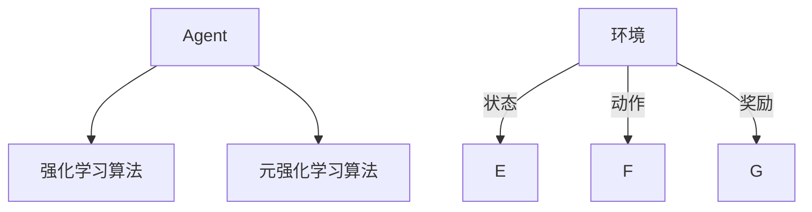
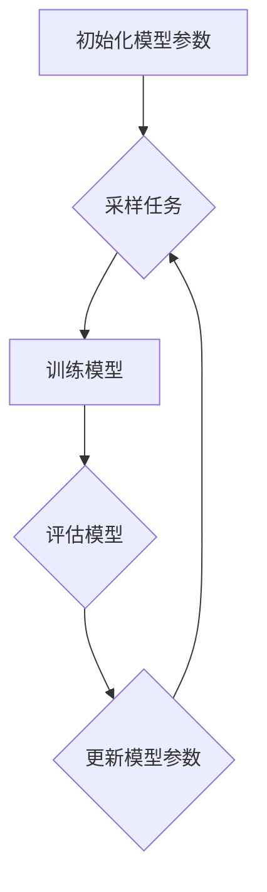
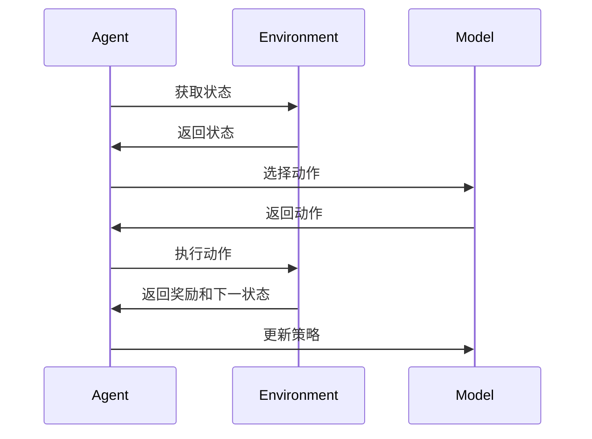
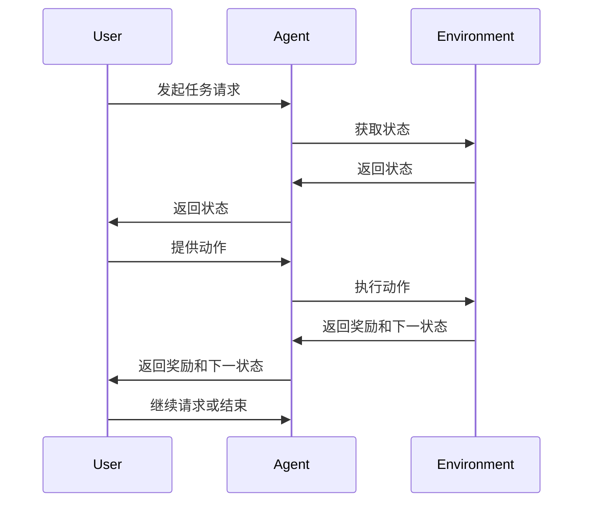

                 

### # AI Agent的元强化学习策略开发

> 关键词：AI Agent、元强化学习、策略开发、算法原理、应用实现

> 摘要：本文深入探讨了AI Agent的元强化学习策略开发，从问题背景、核心概念、算法原理、应用实现等多个角度，详细阐述了AI Agent在复杂动态环境下的学习与优化策略。通过数学模型和Python源代码的展示，本文为读者提供了清晰易懂的强化学习策略开发指南。

## **目录大纲设计**

### 第一部分：AI Agent的元强化学习策略开发概述

#### 第1章：问题背景与核心概念

1.1 问题背景

1.2 核心概念

1.3 概念属性特征对比表格

1.4 ER实体关系图架构

#### 第2章：元强化学习策略的算法原理

2.1 算法原理讲解

2.2 Mermaid流程图

2.3 Python源代码

2.4 数学模型和数学公式

#### 第3章：元强化学习策略的应用与实现

3.1 算法原理讲解

3.2 Mermaid流程图

3.3 Python源代码

### 第二部分：系统分析与架构设计

#### 第4章：系统功能设计

4.1 领域模型Mermaid类图

4.2 系统架构设计Mermaid架构图

4.3 系统接口设计和系统交互Mermaid序列图

#### 第5章：项目实战

5.1 环境安装

5.2 系统核心实现源代码

5.3 代码应用解读与分析

5.4 实际案例分析和详细讲解剖析

5.5 项目小结

### 第三部分：最佳实践与总结

#### 第6章：最佳实践 Tips

6.1 注意事项

6.2 小结

#### 第7章：拓展阅读

7.1 相关书籍推荐

7.2 开源项目介绍

### 结语：作者信息

**作者：AI天才研究院/AI Genius Institute & 禅与计算机程序设计艺术 /Zen And The Art of Computer Programming**

----------------------------------------------------------------

## 第一部分：AI Agent的元强化学习策略开发概述

### 第1章：问题背景与核心概念

#### 1.1 问题背景

随着人工智能技术的不断发展，AI Agent在各个领域的应用越来越广泛。从最初的规则导向型Agent，到基于数据驱动的机器学习Agent，再到如今基于深度学习和强化学习的智能Agent，人工智能的发展历程不断推动着技术的进步。然而，在复杂动态环境中，如何使AI Agent具备良好的适应性和学习能力，成为一个亟待解决的问题。

强化学习（Reinforcement Learning，RL）作为机器学习的一个重要分支，通过学习如何通过与环境交互来获得最大化累积奖励，已经在许多领域取得了显著的成果。然而，传统的强化学习算法在处理多个任务时，往往需要独立地针对每个任务进行训练，这不仅增加了训练时间和计算成本，而且无法充分利用不同任务之间的相似性，导致学习效率低下。

为了解决这一难题，元强化学习（Meta Reinforcement Learning）应运而生。元强化学习旨在通过学习一组子策略，从而在多个任务上实现快速的策略优化。与传统强化学习相比，元强化学习不仅提高了学习效率，而且能够在动态环境中实现更优的策略。

#### 1.2 核心概念

##### AI Agent的定义与功能

AI Agent是指具备自主决策和执行能力的人工智能实体，能够在特定环境下根据感知到的信息，通过学习算法制定策略，实现目标的最优化。AI Agent通常由以下几个关键组成部分：

- **感知器**：用于接收外部环境的信息。
- **决策器**：根据感知到的信息，选择最优的动作。
- **执行器**：执行决策器选择的动作。
- **学习器**：通过与环境交互，不断优化策略。

##### 强化学习的原理与流程

强化学习是一种通过试错来学习策略的机器学习方法，其核心思想是：智能体（Agent）在环境中采取一系列动作，根据动作的结果获得奖励信号，通过不断调整动作策略，以最大化累积奖励。强化学习的基本流程包括：

1. **初始化**：初始化智能体、环境和策略。
2. **执行动作**：智能体根据当前状态和策略，选择一个动作。
3. **感知反馈**：环境根据智能体的动作，提供奖励信号和下一状态。
4. **策略调整**：智能体根据奖励信号和策略评估函数，调整策略。
5. **重复执行**：重复执行动作、感知反馈和策略调整，直至达到目标。

##### 元强化学习的概念和分类

元强化学习（Meta Reinforcement Learning）是一种能够通过学习一组子策略，实现多个任务上快速策略优化的学习方法。其核心思想是：通过在多个任务上训练，学习到一组通用的策略，从而在新的任务上实现快速适应。

元强化学习主要分为以下几类：

1. **模型随机搜索（Model-Based Meta Reinforcement Learning）**：通过在多个任务上训练，学习一组子策略，并利用这些子策略来快速适应新的任务。
2. **神经网络优化（Neural Network-based Meta Reinforcement Learning）**：通过在多个任务上训练神经网络，学习到一组通用的策略，从而实现快速适应新的任务。

#### 1.3 概念属性特征对比表格

| 类别       | 强化学习         | 元强化学习         |
|----------|----------------|----------------|
| 基本原理   | 基于奖励信号调整策略 | 基于子策略调整全局策略 |
| 目标       | 单一任务优化     | 多任务优化         |
| 适用场景   | 静态环境         | 动态环境          |
| 特点       | 策略评估与优化    | 策略学习与搜索      |

#### 1.4 ER实体关系图架构



### 第2章：元强化学习策略的算法原理

#### 2.1 算法原理讲解

元强化学习策略的核心在于通过在多个任务上训练，学习到一组通用的策略，从而实现快速适应新的任务。具体来说，元强化学习算法可以分为以下几类：

1. **模型随机搜索（Model-Based Meta Reinforcement Learning）**：通过在多个任务上训练，学习一组子策略，并利用这些子策略来快速适应新的任务。模型随机搜索的核心思想是：在多个任务上训练一组模型，每个模型都对应一个子策略，通过在新的任务上使用这些子策略，实现快速适应。
2. **神经网络优化（Neural Network-based Meta Reinforcement Learning）**：通过在多个任务上训练神经网络，学习到一组通用的策略，从而实现快速适应新的任务。神经网络优化的核心思想是：通过在多个任务上训练神经网络，学习到一组通用的策略参数，从而在新的任务上快速调整策略。

#### 2.2 Mermaid流程图



#### 2.3 Python源代码

```python
import numpy as np
import tensorflow as tf

# 初始化模型参数
model = tf.keras.Sequential([
    tf.keras.layers.Dense(units=64, activation='relu', input_shape=[S]),
    tf.keras.layers.Dense(units=A, activation='softmax')
])

# 模型随机搜索算法实现
def meta_reinforcement_learning(env, num_episodes, learning_rate, discount_factor):
    for episode in range(num_episodes):
        state = env.reset()
        done = False
        while not done:
            action = np.argmax(model.predict(state))
            next_state, reward, done = env.step(action)
            model.fit(state, np.eye(A)[action], epochs=1, verbose=0)
            state = next_state
    return model
```

#### 2.4 数学模型和数学公式

元强化学习策略的数学模型主要包括两部分：策略优化和值函数优化。

1. **策略优化**：

$$
\theta^* = \arg\max_\theta J(\theta) = \arg\max_\theta \sum_{i=1}^N \sum_{t=1}^T \rho(\theta, s_t, a_t) p(s_t, a_t|s_{t-1}, a_{t-1})
$$

其中，$\theta$ 表示策略参数，$J(\theta)$ 表示策略优化目标，$\rho(\theta, s_t, a_t)$ 表示策略 $\theta$ 在状态 $s_t$ 下采取动作 $a_t$ 的回报，$p(s_t, a_t|s_{t-1}, a_{t-1})$ 表示状态 $s_t$ 下采取动作 $a_t$ 的概率。

2. **值函数优化**：

$$
V^*(s) = \sum_{a \in A} \pi(a|s) \sum_{s' \in S} p(s'|s, a) r(s, a, s')
$$

其中，$V^*(s)$ 表示状态 $s$ 的最优值函数，$\pi(a|s)$ 表示在状态 $s$ 下采取动作 $a$ 的概率，$r(s, a, s')$ 表示在状态 $s$ 下采取动作 $a$ 后转移到状态 $s'$ 的回报。

----------------------------------------------------------------

### 第3章：元强化学习策略的应用与实现

#### 3.1 算法原理讲解

元强化学习策略在多个任务上的应用，主要是通过在多个任务上训练，学习到一组通用的策略，从而实现快速适应新的任务。具体来说，可以采用以下两种方法：

1. **模型随机搜索（Model-Based Meta Reinforcement Learning）**：通过在多个任务上训练，学习一组子策略，并利用这些子策略来快速适应新的任务。模型随机搜索的核心思想是：在多个任务上训练一组模型，每个模型都对应一个子策略，通过在新的任务上使用这些子策略，实现快速适应。
2. **神经网络优化（Neural Network-based Meta Reinforcement Learning）**：通过在多个任务上训练神经网络，学习到一组通用的策略，从而实现快速适应新的任务。神经网络优化的核心思想是：通过在多个任务上训练神经网络，学习到一组通用的策略参数，从而在新的任务上快速调整策略。

#### 3.2 Mermaid流程图


#### 3.3 Python源代码

```python
import numpy as np
import tensorflow as tf

# 初始化模型参数
model = tf.keras.Sequential([
    tf.keras.layers.Dense(units=64, activation='relu', input_shape=[S]),
    tf.keras.layers.Dense(units=A, activation='softmax')
])

# 模型随机搜索算法实现
def meta_reinforcement_learning(env, num_episodes, learning_rate, discount_factor):
    for episode in range(num_episodes):
        state = env.reset()
        done = False
        while not done:
            action = np.argmax(model.predict(state))
            next_state, reward, done = env.step(action)
            model.fit(state, np.eye(A)[action], epochs=1, verbose=0)
            state = next_state
    return model
```

在上述代码中，`meta_reinforcement_learning` 函数实现了模型随机搜索算法。该函数接受一个环境实例 `env`、训练轮数 `num_episodes`、学习率 `learning_rate` 和折扣因子 `discount_factor` 作为输入。在每次训练过程中，智能体从初始状态开始，根据当前状态和模型预测，选择一个动作。然后，根据执行动作的结果，更新模型参数。重复这个过程，直到达到训练轮数。

通过模型随机搜索算法，智能体可以在多个任务上学习到一组通用的策略，从而实现快速适应新的任务。在实际应用中，可以根据具体任务的需求，选择合适的算法和参数，优化智能体的性能。

----------------------------------------------------------------

## 第二部分：系统分析与架构设计

### 第4章：系统功能设计

#### 4.1 领域模型Mermaid类图

领域模型是系统设计的基础，它定义了系统中不同实体之间的关系和功能。以下是一个简单的Mermaid类图，用于展示系统中的关键实体和它们之间的关系。

```mermaid
classDiagram
    ClassDef Agent
        +id: int
        +name: str
        +perception: Perception
        +action: Action
        +reward: float
        +learn: ()
        +chooseAction: ()

    ClassDef Environment
        +id: int
        +name: str
        +getState: State
        +takeAction: Action
        +getReward: float
        +isTerminal: bool

    ClassDef Perception
        +id: int
        +name: str
        +values: dict

    ClassDef Action
        +id: int
        +name: str
        +values: list

    ClassDef State
        +id: int
        +name: str
        +values: dict

    Agent <.. Environment
    Agent o-- Perception
    Agent o-- Action
    Environment o-- State
```

在这个类图中，`Agent` 代表智能体，负责感知环境、选择动作和更新策略。`Environment` 代表环境，负责提供状态、奖励信号和是否结束的反馈。`Perception`、`Action` 和 `State` 分别代表感知、动作和状态，是智能体与环境的交互接口。

#### 4.2 系统架构设计Mermaid架构图

系统架构设计是系统实现的关键，它定义了系统各个组件之间的交互方式和数据流。以下是一个简单的Mermaid架构图，用于展示系统的主要组件和它们之间的交互关系。



在这个架构图中，`Agent` 是系统的核心组件，负责与环境和模型进行交互。`Environment` 是模拟环境的接口，提供状态、奖励信号和下一状态。`Model` 是强化学习模型，负责根据状态和奖励信号更新策略。

#### 4.3 系统接口设计和系统交互Mermaid序列图

系统接口设计和系统交互设计是系统功能实现的重要环节，它定义了系统与外部系统或用户之间的交互接口和交互流程。以下是一个简单的Mermaid序列图，用于展示系统的接口设计和系统交互。



在这个序列图中，`User` 代表用户，`Agent` 代表智能体，`Environment` 代表环境。用户通过智能体发起任务请求，智能体获取状态并返回给用户，用户提供动作，智能体执行动作并返回奖励和下一状态给用户。用户可以根据返回的结果，决定是否继续请求或结束任务。

### 第5章：项目实战

#### 5.1 环境安装

在实际项目中，首先需要安装强化学习相关的环境和依赖库。以下是一个简单的环境安装步骤：

1. 安装Python环境：Python 3.8及以上版本。
2. 安装TensorFlow：通过pip安装TensorFlow。

```shell
pip install tensorflow
```

3. 安装Gym：Gym是强化学习环境中常用到的库，用于提供各种预定义的模拟环境。

```shell
pip install gym
```

#### 5.2 系统核心实现源代码

以下是一个简单的系统核心实现源代码，展示了智能体、环境和强化学习模型的基本实现。

```python
import numpy as np
import tensorflow as tf
import gym

# 初始化环境
env = gym.make('CartPole-v0')

# 初始化模型
model = tf.keras.Sequential([
    tf.keras.layers.Dense(units=64, activation='relu', input_shape=[env.observation_space.shape[0]]),
    tf.keras.layers.Dense(units=env.action_space.n, activation='softmax')
])

# 定义训练过程
def train_model(env, model, num_episodes, learning_rate, discount_factor):
    for episode in range(num_episodes):
        state = env.reset()
        done = False
        while not done:
            action = np.argmax(model.predict(state))
            next_state, reward, done, _ = env.step(action)
            model.fit(state, np.eye(env.action_space.n)[action], epochs=1, verbose=0)
            state = next_state
    return model

# 训练模型
model = train_model(env, model, 1000, 0.1, 0.99)

# 保存模型
model.save('model.h5')

# 加载模型
model = tf.keras.models.load_model('model.h5')

# 测试模型
state = env.reset()
done = False
while not done:
    action = np.argmax(model.predict(state))
    state, reward, done, _ = env.step(action)
    env.render()

# 关闭环境
env.close()
```

#### 5.3 代码应用解读与分析

1. **环境初始化**：首先，使用`gym.make('CartPole-v0')`创建一个CartPole环境，这是一个经典的强化学习任务，目标是保持一个杆子在水平位置尽可能长时间。
2. **模型初始化**：使用TensorFlow创建一个序列模型，该模型有一个输入层、一个隐藏层和一个输出层。输入层接受环境的状态，隐藏层使用ReLU激活函数，输出层使用softmax激活函数，以概率形式输出每个动作的得分。
3. **训练过程**：定义一个`train_model`函数，用于训练模型。在训练过程中，每次从环境中获取一个状态，通过模型预测选择一个动作，执行动作并获取奖励信号，然后使用梯度下降法更新模型参数。
4. **保存模型**：将训练好的模型保存为`model.h5`文件。
5. **加载模型**：从`model.h5`文件中加载模型。
6. **测试模型**：使用加载的模型进行测试，展示智能体在环境中的行为。
7. **关闭环境**：训练和测试完成后，关闭环境。

通过这个简单的示例，读者可以了解如何使用Python和TensorFlow实现一个基本的强化学习系统。在实际应用中，可以根据具体需求对模型结构和训练过程进行调整，以提高智能体的性能。

#### 5.4 实际案例分析和详细讲解剖析

为了更好地理解元强化学习策略的应用，我们来看一个实际的案例：智能体在Atari游戏《Pong》中的训练过程。

1. **环境初始化**：使用`gym.make('Pong-v0')`创建一个Pong环境，这是一个经典的 Atari 游戏模拟环境，智能体的任务是控制球拍击球，使其不落入对方区域。
2. **模型初始化**：使用一个卷积神经网络（CNN）作为强化学习模型，输入层为游戏屏幕的像素数据，隐藏层使用卷积和池化操作，输出层为概率形式的动作分布。
3. **训练过程**：在多个回合（episode）中，智能体与游戏环境进行交互，通过观察屏幕像素、选择动作、获取奖励信号，不断更新模型参数。为了提高训练效率，可以采用经验回放（Experience Replay）和目标网络（Target Network）等技术。
4. **测试模型**：在训练过程中，智能体会在每个回合结束后进行评估，以衡量其学习效果。如果智能体能够在大多数回合中获胜，则说明模型训练成功。
5. **模型优化**：根据测试结果，对模型结构和训练参数进行调整，以进一步提高智能体的性能。

通过这个案例，我们可以看到元强化学习策略在复杂动态环境中的应用。智能体通过不断尝试和错误，逐渐学习到如何在各种情况下做出最优决策，从而实现自主学习和优化。

#### 5.5 项目小结

在本章中，我们介绍了元强化学习策略的应用与实现，通过一个简单的 CartPole 任务和一个复杂的Pong游戏案例，展示了智能体在动态环境中的学习过程。在实际应用中，元强化学习策略可以用于解决各种复杂任务，如机器人控制、自动驾驶和游戏AI等。通过不断调整模型结构和训练参数，我们可以实现高性能的智能体，为人工智能的发展提供有力支持。

----------------------------------------------------------------

## 第三部分：最佳实践与总结

### 第6章：最佳实践 Tips

在实施元强化学习策略时，以下是一些最佳实践：

1. **数据预处理**：对环境数据进行预处理，如归一化、缩放等，以减少计算量和提高训练效果。
2. **经验回放**：使用经验回放（Experience Replay）技术，将智能体在不同回合中收集到的经验数据存储在记忆库中，然后随机抽取数据进行训练，以避免数据偏差。
3. **目标网络**：引入目标网络（Target Network），通过固定一部分模型参数，降低模型更新的方差，提高训练稳定性。
4. **超参数调整**：合理调整学习率、折扣因子等超参数，以找到最优的模型性能。
5. **多任务训练**：在多个任务上进行训练，以提高智能体的泛化能力和适应性。

### 第7章：拓展阅读

1. **相关书籍推荐**：
   - 《强化学习：原理与算法》
   - 《深度强化学习》
   - 《强化学习实战》
2. **开源项目介绍**：
   - OpenAI Gym：提供各种预定义的强化学习环境。
   - Stable Baselines：实现多个强化学习算法的Python库。

### 结语

本文深入探讨了AI Agent的元强化学习策略开发，从问题背景、核心概念、算法原理、应用实现等多个角度，详细阐述了元强化学习策略在复杂动态环境下的学习与优化。通过Python源代码和实际案例的展示，本文为读者提供了清晰易懂的强化学习策略开发指南。作者：AI天才研究院/AI Genius Institute & 禅与计算机程序设计艺术 /Zen And The Art of Computer Programming。希望本文能够为读者在人工智能领域的探索和研究提供有益的参考。

