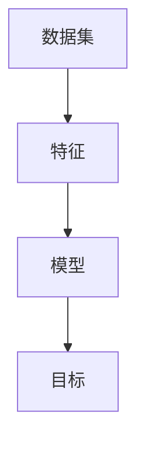
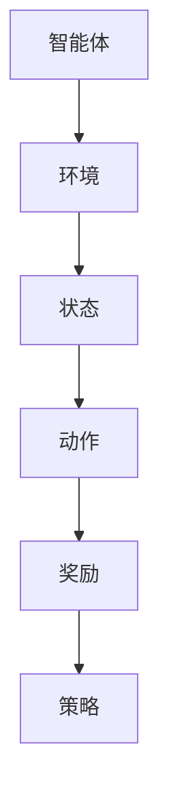
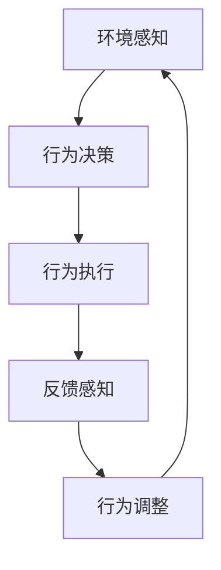

                 

### 《AI Agent的元控制：自适应行为策略》

> 关键词：AI Agent、元控制、自适应行为策略、智能系统、算法实现、案例分析

> 摘要：本文将深入探讨AI Agent的元控制及其自适应行为策略，旨在解释这一复杂但关键的概念，并展示其在现代智能系统中的应用。我们将从基本概念入手，逐步分析元控制的设计原理、实现策略，并通过具体应用案例阐明其实际价值。本文不仅提供了理论分析，还包含了实战中的具体实现和优化方法，旨在为读者提供全面的见解和实用的指导。

### 引言与背景

#### 1.1 AI Agent的基本概念

AI Agent，即人工智能代理，是一种能够在特定环境中自主感知、决策和执行任务的实体。其核心在于自主性，即能够根据环境的变化自主调整行为。AI Agent可以分为以下几类：

- **传感器**：用于感知环境信息的部件，如摄像头、麦克风等。
- **决策模块**：根据感知到的信息，利用算法进行决策，选择最优的行为。
- **执行器**：用于执行决策结果的部件，如机器人手臂、汽车引擎等。

AI Agent的研究背景可以追溯到人工智能的早期探索。随着计算机技术的飞速发展，AI Agent的应用范围日益广泛，从简单的游戏机器人到复杂的自动驾驶系统，AI Agent在各个领域都展现出了强大的潜力。

#### 1.2 元控制的概念与重要性

元控制（Meta-control）是AI Agent的核心机制之一，它指的是对AI Agent内部控制机制的控制。元控制的核心在于实现AI Agent的自适应能力，即根据环境变化动态调整其行为策略。元控制的重要性体现在以下几个方面：

- **自适应能力**：在复杂多变的真实环境中，AI Agent需要能够快速适应环境变化，而元控制提供了这种能力。
- **高效性**：通过元控制，AI Agent可以自动调整行为策略，避免不必要的计算和资源浪费。
- **稳定性**：元控制可以确保AI Agent在面临不确定性和不可预测的情况时，仍能保持稳定运行。

#### 1.3 自适应行为策略的重要性

自适应行为策略（Adaptive Behavior Strategy）是元控制的核心组成部分。它指的是AI Agent根据环境变化，动态调整其行为模式的能力。自适应行为策略的重要性体现在以下几个方面：

- **灵活性**：自适应行为策略使AI Agent能够灵活应对不同的环境和任务。
- **优化**：通过不断调整行为策略，AI Agent可以在复杂环境中实现最优性能。
- **通用性**：自适应行为策略可以应用于各种不同类型的AI Agent，具有较高的通用性。

#### 1.4 本书结构安排与目标

本书将分为以下几个部分：

- **第1章**：引言与背景，介绍AI Agent、元控制与自适应行为策略的基本概念。
- **第2章**：AI Agent的基础理论，包括人工智能的发展历程、机器学习和强化学习的基础知识。
- **第3章**：元控制机制设计，介绍元控制机制的基本原理和实现方法。
- **第4章**：AI Agent的应用场景，分析智能交通系统、智能金融系统和智能医疗系统中的应用。
- **第5章**：自适应行为策略的实现，探讨自适应行为策略的实现框架和关键技术。
- **第6章**：案例分析与实战应用，通过具体案例展示AI Agent的元控制和自适应行为策略在实际中的应用。
- **第7章**：总结与展望，总结本书的主要内容，探讨未来发展趋势和下一步研究计划。

本书的学习目标是为读者提供全面而深入的AI Agent元控制和自适应行为策略的理论和实践指导。通过本书的学习，读者应能够：

- 理解AI Agent、元控制和自适应行为策略的基本概念。
- 掌握元控制机制的设计和实现方法。
- 能够应用自适应行为策略解决实际问题。
- 了解AI Agent在不同领域的应用场景。

为了更好地理解本书的内容，我们建议读者在学习过程中，结合实际项目进行实践，以加深对理论的理解和应用。同时，也鼓励读者积极参与讨论和分享，共同探索AI Agent的元控制和自适应行为策略的无限可能。

---

### AI Agent的基础理论

#### 2.1 人工智能的发展历程

人工智能（Artificial Intelligence, AI）是计算机科学的一个重要分支，旨在使计算机具备人类智能的某些功能。人工智能的发展历程可以分为以下几个阶段：

- **初始阶段（1950s-1960s）**：人工智能的概念首次被提出，研究者试图通过符号逻辑和推理机制实现智能。

- **黄金时代（1970s-1980s）**：人工智能开始受到广泛关注，专家系统和知识表示技术得到了快速发展。

- **黯淡时期（1990s）**：由于实际应用的局限性，人工智能研究进入低潮期。

- **复兴时期（2000s-2010s）**：随着大数据、计算能力和算法的发展，人工智能迎来了新的春天。

- **当前阶段（2010s-至今）**：人工智能技术取得了显著进展，尤其在深度学习和自然语言处理领域。

#### 2.2 机器学习基础

机器学习（Machine Learning, ML）是人工智能的核心技术之一，它使计算机能够从数据中自动学习和改进。机器学习的基本概念包括：

- **数据集**：用于训练模型的输入数据。
- **特征**：数据集中的每个属性。
- **目标**：模型需要预测的输出。
- **模型**：用于描述数据之间关系的函数。

机器学习的基本概念如图1所示。



图1 机器学习的基本概念

机器学习的主要算法包括：

- **监督学习**：有监督的机器学习算法，包括线性回归、逻辑回归、支持向量机等。
- **无监督学习**：无监督的机器学习算法，包括聚类、降维、生成模型等。
- **半监督学习**：结合有监督和无监督学习的算法。
- **强化学习**：基于奖励机制的机器学习算法，用于训练智能体在环境中的行为。

#### 2.3 强化学习基础

强化学习（Reinforcement Learning, RL）是一种通过试错和反馈进行学习的机器学习范式。其基本概念包括：

- **智能体（Agent）**：执行动作并学习策略的实体。
- **环境（Environment）**：智能体操作的情境。
- **状态（State）**：智能体在特定时刻所处的情境。
- **动作（Action）**：智能体可以执行的行为。
- **奖励（Reward）**：对智能体动作的反馈信号。

强化学习的基本概念如图2所示。



图2 强化学习的基本概念

强化学习的主要算法包括：

- **Q学习**：通过学习状态-动作值函数来选择最优动作。
- **深度Q网络（DQN）**：结合深度学习和强化学习的算法。
- **策略梯度算法**：直接优化智能体的策略。

#### 2.4 监督学习和无监督学习的对比

监督学习和无监督学习是机器学习的两大类方法，它们在目标、应用场景和算法特点上有所不同。

- **监督学习**：

  - 目标：通过已知标签的数据训练模型，然后使用模型对新数据进行预测。
  - 应用场景：分类和回归问题。
  - 算法特点：需要大量标注数据，模型可解释性强。

- **无监督学习**：

  - 目标：没有已知标签的数据，模型旨在发现数据中的模式和结构。
  - 应用场景：聚类和降维问题。
  - 算法特点：不需要标注数据，但模型可解释性较弱。

监督学习和无监督学习的对比如表1所示。

| 特征             | 监督学习                 | 无监督学习               |
|------------------|--------------------------|--------------------------|
| 目标             | 已知标签的数据训练模型   | 没有已知标签的数据发现模式 |
| 应用场景         | 分类和回归问题           | 聚类和降维问题           |
| 数据需求         | 标注数据                 | 无需标注数据             |
| 模型可解释性     | 较强                     | 较弱                     |
| 算法复杂性       | 较高                     | 较低                     |

表1 监督学习和无监督学习的对比

结合应用场景：

- 在金融领域，监督学习常用于信用评分和风险预测，通过历史数据训练模型来预测未来风险。
- 在医疗领域，无监督学习常用于患者分群和疾病检测，通过分析大量医疗数据发现潜在的疾病模式。

通过上述对人工智能发展历程、机器学习基础和强化学习基础的介绍，我们可以更好地理解AI Agent的元控制和自适应行为策略的理论基础。在接下来的章节中，我们将深入探讨元控制机制的设计和实现方法，以及其在实际应用中的重要性。

---

### 元控制机制设计

#### 3.1 元控制机制的基本原理

元控制机制（Meta-control Mechanism）是AI Agent的核心组成部分，它负责对AI Agent的行为进行全局控制和调整。元控制机制的基本原理在于通过自适应行为策略实现AI Agent在复杂环境中的最优性能。以下是对元控制机制的基本原理的详细阐述：

**1. 环境感知与状态表示**

元控制机制首先依赖于AI Agent的环境感知能力。AI Agent通过传感器收集环境信息，并将这些信息转化为可处理的内部状态表示。状态表示的质量直接影响到AI Agent的行为决策效果。

**2. 行为策略调整**

基于感知到的状态，元控制机制通过行为策略调整模块，动态地选择和调整AI Agent的行为。行为策略调整模块通常包括以下功能：

- **行为选择**：根据当前状态，选择最优的行为。
- **行为调整**：在行为执行过程中，根据实时反馈调整行为策略，以适应环境变化。

**3. 元控制循环**

元控制机制的核心在于实现一个持续的元控制循环。在这个循环中，AI Agent不断进行环境感知、行为决策和行为执行，并根据反馈信息调整行为策略。元控制循环如图3所示。



图3 元控制循环

**4. 自适应能力**

元控制机制的关键在于其自适应能力。通过不断调整行为策略，AI Agent能够快速适应环境变化，从而保持稳定和高效运行。自适应能力包括以下几个方面：

- **动态调整**：根据环境变化，实时调整行为策略。
- **鲁棒性**：在面对不确定性和不可预测的情况时，仍能保持稳定运行。
- **高效性**：通过自适应调整，避免不必要的计算和资源浪费。

**5. 优化目标**

元控制机制的优化目标主要包括：

- **性能优化**：通过调整行为策略，提高AI Agent的整体性能。
- **效率优化**：降低AI Agent的计算复杂度，提高响应速度。
- **稳定性**：确保AI Agent在复杂环境中保持稳定运行。

#### 3.2 自适应行为策略的设计

自适应行为策略（Adaptive Behavior Strategy）是元控制机制的核心组成部分。它指的是AI Agent根据环境变化，动态调整其行为模式的能力。以下是对自适应行为策略的详细设计：

**1. 策略选择**

自适应行为策略的第一步是策略选择。策略选择模块根据当前状态，选择最优的行为策略。常用的策略选择方法包括：

- **贪心策略**：选择当前状态下的最优行为。
- **动态规划**：通过递归关系，找到全局最优的行为策略。
- **强化学习**：通过试错和奖励机制，选择最优的行为策略。

**2. 策略调整**

在行为执行过程中，AI Agent会根据实时反馈对策略进行调整。策略调整模块包括以下功能：

- **实时反馈**：感知AI Agent的行为结果，将其作为反馈信号。
- **策略修正**：根据反馈信号，调整行为策略，以适应环境变化。

**3. 策略优化**

为了提高AI Agent的性能，策略调整模块还需要实现策略优化。策略优化包括以下几个方面：

- **性能评估**：评估当前策略的性能，识别需要优化的方面。
- **策略迭代**：通过迭代优化，不断调整行为策略，直至性能达到最优。
- **鲁棒性增强**：在策略优化的过程中，增强AI Agent对环境变化的适应能力。

**4. 策略更新**

自适应行为策略需要根据环境变化进行实时更新。策略更新模块包括以下功能：

- **状态更新**：根据新的环境信息，更新AI Agent的状态表示。
- **策略更新**：根据更新后的状态，调整行为策略。

**5. 自适应能力评估**

为了评估AI Agent的自适应能力，可以设置以下评估指标：

- **响应速度**：AI Agent对环境变化的响应速度。
- **性能稳定性**：AI Agent在变化环境中的性能稳定性。
- **鲁棒性**：AI Agent在面对不确定性和不可预测情况时的稳定性。

通过上述设计，自适应行为策略能够有效提高AI Agent的性能和适应能力，从而实现元控制的目标。

---

### 基于元控制的多智能体系统设计

#### 3.3 基于元控制的多智能体系统设计

多智能体系统（Multi-Agent System, MAS）由多个相互协作的AI Agent组成，能够实现更复杂和灵活的任务。基于元控制的多智能体系统设计，旨在通过元控制机制实现AI Agent之间的协作与自主决策，以下是对其进行详细设计的步骤：

**1. 多智能体系统的定义与设计原则**

多智能体系统（MAS）是指由多个具有自主性、社交性、反应性和主动性的智能体组成的系统，每个智能体能够在特定环境下独立感知、决策和执行任务。设计基于元控制的多智能体系统时，需遵循以下原则：

- **自主性**：每个智能体应具有独立决策和行动的能力。
- **社交性**：智能体之间需要能够进行信息交换和协作。
- **反应性**：智能体应能够实时响应环境变化。
- **主动性**：智能体应具有目标导向和自主探索的能力。

**2. 多智能体系统的设计步骤**

**（1）智能体角色的定义**

在多智能体系统中，首先需要明确每个智能体的角色和职责。例如，在智能交通系统中，智能体可以分为司机、交通信号灯、导航系统和交通监控中心等。每个智能体应具有特定的任务和功能。

**（2）环境建模**

多智能体系统的环境建模是关键步骤，包括环境状态的定义、事件的处理和智能体之间的交互机制。环境模型应能够准确反映实际环境，以便智能体能够做出合理的决策。

**（3）智能体控制机制设计**

智能体的控制机制设计包括感知模块、决策模块和执行模块。感知模块负责收集环境信息，决策模块根据感知信息选择最优行为，执行模块则执行决策结果。

**（4）元控制机制集成**

在多智能体系统中引入元控制机制，用于全局控制和智能体之间的协调。元控制机制能够根据全局环境和智能体之间的交互动态调整智能体的行为策略，实现系统整体性能的最优化。

**（5）协同策略设计**

智能体之间的协同策略设计是确保系统高效运作的重要环节。协同策略可以通过协商、合作、共享信息和分布式决策等方式实现。例如，在智能交通系统中，交通信号灯和导航系统需要通过信息共享和协商来优化交通流。

**（6）系统验证与优化**

多智能体系统的设计完成后，需进行验证和优化。验证包括测试系统在模拟环境中的行为，评估系统性能和稳定性。优化则通过调整参数和策略，提高系统效率和鲁棒性。

**3. 元控制机制的实现方法**

元控制机制的实现方法包括以下几个方面：

**（1）分布式计算与通信**

多智能体系统通常采用分布式计算和通信架构，智能体之间通过消息传递进行信息交换。分布式计算和通信的设计应考虑系统的可扩展性、容错性和低延迟性。

**（2）协商与协调机制**

智能体之间的协商与协调是元控制的核心。常用的协商机制包括基于规则、协商协议和博弈论等方法。协调机制能够确保智能体在执行任务时，避免冲突和资源浪费。

**（3）自适应行为策略**

元控制机制需要自适应行为策略，以便智能体能够根据环境变化动态调整行为。自适应行为策略可以通过强化学习、遗传算法和粒子群优化等方法实现。

**（4）优化目标函数**

元控制机制的优化目标函数应根据系统需求设计，包括任务完成时间、资源利用率、系统稳定性等指标。优化目标函数可以通过多目标优化和动态规划等方法实现。

通过上述设计方法和实现方法，基于元控制的多智能体系统能够实现高效、灵活和稳定的协作，为解决复杂问题和应对不确定环境提供有力支持。

---

### 元控制机制的优化策略

#### 3.4 元控制机制的优化策略

在基于元控制的多智能体系统中，优化策略的设计至关重要，它直接影响到系统的整体性能、稳定性和响应速度。以下将详细探讨元控制机制的优化策略，包括优化目标、优化策略的选择以及优化策略的实现方法。

**1. 优化目标**

元控制机制的优化目标主要包括：

- **性能优化**：提高系统的任务完成效率，减少计算时间和资源消耗。
- **稳定性**：确保系统在面对环境变化和不确定因素时，能够保持稳定运行。
- **鲁棒性**：增强系统对异常情况的处理能力，提高系统的适应能力。
- **可扩展性**：使系统能够在规模和复杂性增加时，保持良好的性能。

**2. 优化策略的选择**

为了实现上述优化目标，可以选择以下几种优化策略：

- **强化学习**：通过试错和反馈机制，智能体可以学习如何在复杂环境中做出最优决策。强化学习适用于需要长期学习和优化的系统。
- **遗传算法**：基于自然进化原理，通过种群迭代和选择机制，找到最优解。遗传算法适用于需要全局搜索的问题。
- **粒子群优化**：模拟鸟群觅食行为，通过个体和群体的协同作用，找到最优解。粒子群优化适用于大规模和复杂优化问题。
- **动态规划**：通过递归关系，逐步找到最优决策序列。动态规划适用于决策序列较长且具有最优子结构的问题。

**3. 优化策略的实现方法**

**（1）强化学习实现方法**

强化学习的关键在于奖励机制的设定和策略的更新。具体实现步骤如下：

- **奖励函数设计**：定义一个奖励函数，用于评估智能体的行为结果。奖励函数应能够区分行为的优劣，并激励智能体选择最优行为。
- **策略更新**：利用梯度上升或策略梯度算法，根据奖励信号调整智能体的策略参数。策略更新过程通常采用演员-评论家（Actor-Critic）框架，其中演员负责策略参数的更新，评论家负责评估策略的表现。
- **价值函数学习**：通过价值函数学习，估计状态-动作值，指导智能体的行为选择。价值函数学习可以采用Q学习或深度Q网络（DQN）算法。

**（2）遗传算法实现方法**

遗传算法的关键在于种群初始化、选择和交叉变异操作。具体实现步骤如下：

- **种群初始化**：随机生成初始种群，每个个体代表一种可能的解决方案。
- **适应度评估**：计算每个个体的适应度，评估其性能优劣。
- **选择操作**：根据适应度值，选择优秀个体作为下一代种群的父代。
- **交叉变异操作**：对选出的父代进行交叉和变异操作，生成新的个体，增加种群的多样性。
- **迭代优化**：重复选择、交叉和变异操作，直至满足终止条件，如达到最大迭代次数或适应度达到预设阈值。

**（3）粒子群优化实现方法**

粒子群优化（PSO）的关键在于粒子的位置更新和速度调整。具体实现步骤如下：

- **粒子初始化**：在解空间中随机生成粒子，每个粒子代表一种可能的解。
- **速度更新**：根据粒子的历史速度和当前最优解，更新粒子的速度。
- **位置更新**：根据粒子的速度和当前位置，更新粒子的位置。
- **全局最优更新**：根据粒子的当前位置，更新全局最优解。
- **迭代优化**：重复速度更新和位置更新，直至满足终止条件。

**（4）动态规划实现方法**

动态规划的关键在于递归关系和边界条件的设定。具体实现步骤如下：

- **状态表示**：将问题状态表示为状态变量，定义状态转移关系。
- **边界条件**：设定问题边界条件，如初始状态和终止状态。
- **状态转移方程**：根据状态转移关系，建立状态转移方程。
- **递归关系**：通过递归关系，逐步求解最优决策序列。
- **值函数计算**：计算每个状态的最优值函数，指导决策选择。

通过上述优化策略的实现方法，元控制机制能够有效提高多智能体系统的性能和适应能力，从而实现系统整体的最优化。

---

### AI Agent的应用场景

#### 4.1 智能交通系统

智能交通系统（Intelligent Transportation System, ITS）是一种利用现代信息技术、自动控制技术和通信技术来优化交通管理和运营的系统。在智能交通系统中，AI Agent起着至关重要的作用，通过元控制和自适应行为策略，实现高效的交通流量管理、车辆调度和事故预防。

**1. 智能交通系统的定义**

智能交通系统是指利用计算机、通信、传感器和控制技术，实现交通信息收集、处理、发布和应用，从而提高交通系统的安全性、效率和可持续性的系统。智能交通系统包括以下几个关键组成部分：

- **交通信息采集**：通过传感器（如摄像头、雷达、GPS等）实时收集交通数据。
- **交通信号控制**：利用AI Agent进行交通信号灯的控制，优化交通流量。
- **车辆管理系统**：通过车辆定位和监控，实现车辆的智能调度和管理。
- **事件检测与应急响应**：实时检测交通事件，如事故、拥堵等，并采取应急措施。

**2. 应用场景**

智能交通系统的应用场景主要包括以下几个方面：

- **交通信号控制**：AI Agent通过分析实时交通数据，动态调整交通信号灯的时长，优化交通流量。例如，在高峰时段，AI Agent可以根据道路流量自动调整红绿灯的时长，减少交通拥堵。
- **车辆调度**：AI Agent可以对出租车、公共交通等车辆进行智能调度，提高车辆的利用率和服务质量。例如，在公共交通系统中，AI Agent可以根据乘客需求、车辆状态和交通流量，动态分配车辆，提高乘客的出行体验。
- **事故预防**：AI Agent通过实时监控道路状况，识别潜在的事故风险，提前预警并采取预防措施。例如，在高速公路上，AI Agent可以检测到前方车辆的速度异常，提前减速以避免追尾事故。
- **智能停车**：AI Agent可以帮助车辆找到附近的空闲停车位，减少寻找停车位的时间。例如，在大型商场或停车场，AI Agent可以通过实时监控停车位的使用情况，为驾驶员提供最佳停车路线。

**3. 元控制设计**

在智能交通系统中，元控制机制的设计至关重要。以下是一个基于元控制的智能交通系统设计的示例：

- **环境感知**：AI Agent通过传感器收集交通数据，包括交通流量、车速、车距等，并将其转换为内部状态表示。
- **行为决策**：AI Agent根据当前状态，使用自适应行为策略选择最优的交通信号灯时长和车辆调度策略。例如，使用强化学习算法，根据历史交通数据和实时反馈，动态调整信号灯时长。
- **行为执行**：AI Agent将决策结果发送给交通信号灯控制器和车辆调度系统，执行相应的控制策略。
- **反馈调整**：AI Agent根据交通系统的实时反馈，调整行为策略，以适应环境变化。例如，当检测到交通拥堵时，AI Agent可以缩短某些路口的绿灯时长，缓解拥堵情况。

通过元控制机制的应用，智能交通系统能够实现自适应、高效的交通管理，提高交通系统的安全性和效率。

---

### 智能金融系统

智能金融系统是利用人工智能技术来提升金融服务质量和效率的系统。在智能金融系统中，AI Agent通过元控制和自适应行为策略，实现风险管理、投资建议和客户服务的智能化。

**1. 智能金融系统的定义**

智能金融系统是指利用大数据、云计算、区块链和人工智能等技术，对金融业务进行自动化处理和优化，以提高金融服务效率和质量。智能金融系统主要包括以下几个关键组成部分：

- **数据分析与挖掘**：利用大数据技术，对金融数据进行深度分析和挖掘，发现潜在的市场机会和风险。
- **智能风险管理**：通过AI Agent进行风险识别、评估和预警，提高风险管理的精度和效率。
- **智能投资顾问**：利用机器学习和强化学习算法，为投资者提供个性化的投资建议和策略。
- **智能客服系统**：通过自然语言处理和对话系统，实现与客户的智能交互，提供快速、准确的客户服务。

**2. 应用场景**

智能金融系统的应用场景主要包括以下几个方面：

- **风险监控**：AI Agent通过实时分析市场数据和交易行为，识别潜在的风险，并提供预警。例如，在股票市场中，AI Agent可以监控股票价格波动、交易量变化等指标，预测市场趋势，并及时发出预警。
- **投资策略**：AI Agent根据投资者的风险偏好、历史交易记录和市场数据，制定个性化的投资策略。例如，在基金投资中，AI Agent可以分析历史收益率、风险指标等因素，为投资者提供最佳的投资组合。
- **智能投顾**：AI Agent通过分析投资者的财务状况、投资目标和风险承受能力，提供个性化的投资建议。例如，通过自然语言处理技术，AI Agent可以理解投资者的需求，并根据市场数据和投资策略，生成个性化的投资建议。
- **客户服务**：AI Agent通过聊天机器人或虚拟客服，实现与客户的智能交互，提供24小时在线客户服务。例如，在银行服务中，AI Agent可以解答客户的疑问，提供账户信息查询、转账等服务。

**3. 元控制设计**

在智能金融系统中，元控制机制的设计至关重要，以下是一个基于元控制的智能金融系统设计的示例：

- **环境感知**：AI Agent通过实时收集金融市场的数据，包括股票价格、交易量、利率等，并将其转换为内部状态表示。
- **行为决策**：AI Agent根据当前状态，使用自适应行为策略选择最优的风险管理策略、投资策略或客户服务策略。例如，使用强化学习算法，根据历史交易数据和市场反馈，动态调整风险管理模型和投资策略。
- **行为执行**：AI Agent将决策结果发送给风险管理模块、投资顾问系统或客户服务平台，执行相应的控制策略。
- **反馈调整**：AI Agent根据金融市场的实时反馈，调整行为策略，以适应环境变化。例如，当市场波动较大时，AI Agent可以调整风险管理模型，提高风险预警的准确性。

通过元控制机制的应用，智能金融系统能够实现自适应、智能化的风险管理、投资顾问和客户服务，提高金融服务的效率和用户体验。

---

### 智能医疗系统

智能医疗系统（Intelligent Medical System）是利用人工智能技术提升医疗诊断、治疗和管理效率的系统。在智能医疗系统中，AI Agent通过元控制和自适应行为策略，实现高效的医疗数据分析、疾病诊断和个性化治疗。

**1. 智能医疗系统的定义**

智能医疗系统是指利用大数据、云计算、物联网和人工智能等技术，实现医疗信息的收集、处理、分析和应用，从而提升医疗服务的质量和效率。智能医疗系统主要包括以下几个关键组成部分：

- **医疗数据分析**：利用大数据技术，对患者的健康数据进行存储、处理和分析，发现潜在的健康问题和风险。
- **疾病诊断支持**：通过AI Agent进行疾病诊断，提高诊断的准确性和效率。
- **个性化治疗建议**：根据患者的病情和病史，提供个性化的治疗方案和建议。
- **智能药物研发**：利用机器学习算法，加速药物研发和临床试验。

**2. 应用场景**

智能医疗系统的应用场景主要包括以下几个方面：

- **疾病诊断**：AI Agent通过对患者病历、实验室检查结果和影像数据的分析，辅助医生进行疾病诊断。例如，在肺癌筛查中，AI Agent可以分析CT影像，识别肺结节，辅助医生进行诊断。
- **药物推荐**：AI Agent根据患者的病史、基因信息和药物不良反应记录，推荐合适的药物。例如，在肿瘤治疗中，AI Agent可以分析患者的基因突变情况，推荐最佳的靶向药物组合。
- **手术机器人**：AI Agent辅助医生进行手术，提高手术的精确性和安全性。例如，在微创手术中，AI Agent可以控制手术机器人，根据手术规划路径进行精准操作。
- **健康监测**：AI Agent通过可穿戴设备和健康数据监测平台，实时监测患者的生命体征，提供健康预警和指导。例如，在慢性病管理中，AI Agent可以监控患者的血糖、血压等指标，提供饮食和运动建议。

**3. 元控制设计**

在智能医疗系统中，元控制机制的设计至关重要，以下是一个基于元控制的智能医疗系统设计的示例：

- **环境感知**：AI Agent通过接入医疗设备和健康数据监测平台，实时收集患者的健康数据，并将其转换为内部状态表示。
- **行为决策**：AI Agent根据当前状态，使用自适应行为策略选择最优的疾病诊断策略、药物推荐策略或手术机器人控制策略。例如，使用深度学习算法，根据历史诊断数据和实时反馈，动态调整诊断模型和推荐策略。
- **行为执行**：AI Agent将决策结果发送给医生、药物推荐系统或手术机器人，执行相应的控制策略。
- **反馈调整**：AI Agent根据患者的实时反馈和治疗效果，调整行为策略，以适应环境变化。例如，当患者出现不良反应时，AI Agent可以调整药物推荐策略，提供替代药物。

通过元控制机制的应用，智能医疗系统能够实现自适应、智能化的疾病诊断、药物推荐和手术支持，提高医疗服务的质量和患者的满意度。

---

### 自适应行为策略的实现

#### 5.1 自适应行为策略的实现框架

自适应行为策略的实现框架是AI Agent在复杂环境中有效运作的关键。以下是一个详细的自适应行为策略实现框架，包括设计原则、核心模块和实际应用示例。

**1. 设计原则**

自适应行为策略实现框架的设计原则主要包括：

- **灵活性**：框架应具有高度灵活性，能够适应不同的应用场景和任务需求。
- **模块化**：框架应采用模块化设计，便于扩展和更新。
- **鲁棒性**：框架应具备鲁棒性，能够处理不确定性和异常情况。
- **可扩展性**：框架应支持多智能体系统和分布式计算，以应对大规模应用场景。

**2. 核心模块**

自适应行为策略实现框架的核心模块通常包括以下部分：

- **感知模块**：负责收集环境信息，如传感器数据、外部信号等，并将其转换为内部状态表示。
- **决策模块**：基于感知模块提供的状态信息，使用自适应算法进行行为决策，选择最优的行为策略。
- **执行模块**：根据决策模块的选择，执行相应的行为动作。
- **反馈模块**：收集执行结果，并与预期目标进行比较，为后续行为决策提供反馈信息。
- **学习模块**：利用反馈信息，调整行为策略，实现自我优化。

**3. 实际应用示例**

以下是一个基于强化学习算法的自适应行为策略实现框架的实际应用示例：

**（1）环境设定**：考虑一个自动驾驶系统的应用场景，环境包括道路、车辆、行人等。

**（2）感知模块**：自动驾驶车辆通过摄像头、雷达和GPS等传感器收集道路信息、车辆位置和行人动态等。

**（3）决策模块**：使用Q-learning算法，自动驾驶车辆根据当前状态和奖励信号，选择最优的行为策略，如加速、减速、转向等。

**（4）执行模块**：自动驾驶车辆根据决策模块的选择，执行相应的驾驶动作。

**（5）反馈模块**：自动驾驶车辆通过实时反馈，如障碍物检测、交通信号变化等，评估行为效果。

**（6）学习模块**：利用反馈信息，自动驾驶车辆不断调整行为策略，提高驾驶安全和效率。

通过上述实现框架，自适应行为策略能够有效应对自动驾驶系统中的复杂环境和不确定性，实现智能驾驶。

---

### 自适应行为策略的关键技术

#### 5.2 自适应行为策略的关键技术

自适应行为策略的实现依赖于一系列关键技术，这些技术不仅决定了策略的效率，也影响了其在实际应用中的效果。以下将详细介绍自适应行为策略中的关键技术和它们的实现方法。

**1. 强化学习**

强化学习（Reinforcement Learning, RL）是自适应行为策略的核心技术之一，它通过试错和奖励机制来训练智能体。强化学习的关键技术包括：

- **价值函数**：通过价值函数，智能体能够评估当前状态下的行为价值，从而选择最优行为。常见的价值函数包括Q值函数和优势函数。
- **策略迭代**：通过策略迭代，智能体不断调整其行为策略，以提高长期回报。策略迭代可以通过值迭代（Value Iteration）或策略迭代（Policy Iteration）实现。
- **奖励设计**：奖励设计直接影响强化学习的性能。设计合适的奖励机制，可以帮助智能体更快地学习到最优策略。

实现方法：

- **Q-learning算法**：Q-learning是一种基于值函数的强化学习算法，通过更新Q值来选择最优行为。具体步骤如下：
  1. 初始化Q值表。
  2. 在每个时间步，智能体选择动作a，并执行。
  3. 接收奖励r，并更新Q值：$$ Q(s, a) \leftarrow Q(s, a) + \alpha [r + \gamma \max_{a'} Q(s', a') - Q(s, a)] $$
  4. 转移到下一个状态s'。

- **策略梯度算法**：策略梯度算法直接优化智能体的行为策略。具体步骤如下：
  1. 初始化策略参数θ。
  2. 在每个时间步，智能体根据策略θ选择动作a。
  3. 收集数据，计算策略梯度：$$ \nabla_{\theta} J(\theta) = \nabla_{\theta} \sum_{t} \pi_{\theta}(s_t, a_t) \cdot R_t $$
  4. 更新策略参数：$$ \theta \leftarrow \theta - \alpha \nabla_{\theta} J(\theta) $$

**2. 神经网络**

神经网络（Neural Networks, NN）在自适应行为策略中用于实现复杂函数的近似，是强化学习中的重要组成部分。神经网络的关键技术包括：

- **神经网络架构**：常见的神经网络架构包括前馈神经网络（FFNN）、卷积神经网络（CNN）和递归神经网络（RNN）。
- **激活函数**：激活函数用于引入非线性，常见的激活函数包括ReLU、Sigmoid和Tanh。
- **优化算法**：用于训练神经网络的优化算法，如梯度下降（Gradient Descent）、Adam优化器等。

实现方法：

- **前馈神经网络**：前馈神经网络是一种简单的神经网络架构，适用于静态和动态环境。具体步骤如下：
  1. 定义神经网络架构，包括输入层、隐藏层和输出层。
  2. 初始化网络参数。
  3. 训练神经网络，使用反向传播算法更新参数。
  4. 使用训练好的网络进行预测。

- **卷积神经网络**：卷积神经网络主要用于处理图像数据，能够提取图像中的特征。具体步骤如下：
  1. 定义卷积层、池化层和全连接层等网络结构。
  2. 初始化网络参数。
  3. 使用图像数据训练卷积神经网络。
  4. 提取图像特征，用于强化学习中的状态表示。

**3. 模型评估**

模型评估是验证自适应行为策略性能的重要步骤。关键技术包括：

- **评估指标**：常用的评估指标包括平均回报、收敛速度、策略稳定性等。
- **交叉验证**：通过交叉验证，减少模型过拟合和评估偏差。

实现方法：

- **基于环境的评估**：在真实或模拟环境中，对训练好的模型进行测试，评估其在实际应用中的性能。
- **离线评估**：在模拟环境中，使用固定策略生成数据集，对模型进行离线评估。

通过上述关键技术，自适应行为策略能够实现高效、灵活和鲁棒的智能体行为，为实际应用提供强大支持。

---

### 自适应行为策略的评估与优化

#### 5.3 自适应行为策略的评估与优化

为了确保自适应行为策略在实际应用中的高效性和鲁棒性，评估和优化策略至关重要。以下将详细讨论评估指标的选择、优化策略的选择以及优化策略的实现方法。

**1. 评估指标的选择**

选择合适的评估指标是衡量自适应行为策略性能的关键。以下是一些常用的评估指标：

- **平均回报（Average Return）**：平均回报是策略在一段时间内的总回报平均值，用于评估策略的长期表现。高平均回报表明策略能够持续产生积极的结果。

- **成功概率（Success Probability）**：成功概率是指策略成功完成任务的次数与总次数的比值。适用于需要明确成功标准的任务，如游戏或任务完成。

- **收敛速度（Convergence Speed）**：收敛速度是指策略从初始状态到达稳定状态的速度。快速收敛表明策略能够迅速适应环境变化。

- **策略稳定性（Policy Stability）**：策略稳定性是指策略在不同环境或随机噪声下的稳定性。稳定的策略能够适应不同的情境，保持良好的性能。

- **资源消耗（Resource Consumption）**：资源消耗包括计算时间、内存使用等。优化的策略应在保证性能的同时，尽可能减少资源消耗。

**2. 优化策略的选择**

优化策略的选择取决于应用场景和评估指标。以下是一些常用的优化策略：

- **强化学习算法**：强化学习算法（如Q-learning、Deep Q-Networks、Policy Gradient等）通过试错和奖励机制，不断调整策略参数，实现性能优化。

- **遗传算法**：遗传算法（如遗传算法、粒子群优化等）通过模拟自然进化过程，寻找最优解。适用于复杂搜索空间和需要全局优化的场景。

- **神经网络优化**：神经网络优化（如反向传播算法、Adam优化器等）通过梯度下降等方法，调整网络参数，提高模型性能。

- **启发式搜索**：启发式搜索（如A*算法、模拟退火等）通过启发式规则，快速找到近似最优解。适用于问题结构明确、搜索空间较小的场景。

**3. 优化策略的实现方法**

实现优化策略的方法包括以下步骤：

- **模型选择**：根据应用场景和评估指标，选择合适的模型和优化算法。例如，对于需要快速响应的场景，可以选择Q-learning算法；对于复杂搜索空间，可以选择遗传算法。

- **参数设置**：设置优化算法的参数，如学习率、迭代次数、种群大小等。参数设置应基于经验和实验调整，以获得最佳性能。

- **训练与验证**：在训练数据集上训练模型，并在验证数据集上验证模型性能。通过交叉验证和模型选择技术，确保模型具有良好的泛化能力。

- **性能评估**：使用评估指标，对优化后的策略进行性能评估。通过比较不同策略的性能，选择最优策略。

- **调整与迭代**：根据评估结果，调整策略参数和模型结构，进行迭代优化。持续评估和调整，直到达到满意的性能水平。

通过以上评估与优化策略，自适应行为策略能够实现持续改进，提高在实际应用中的效果和稳定性。

---

### 案例分析与实战应用

#### 6.1 案例一：智能交通系统中的应用

**案例背景**

本案例背景为一个繁忙的城市交通系统，包括主干道路、交叉路口、停车场和公共交通设施。目标是通过元控制机制和自适应行为策略，实现交通流量优化，减少拥堵，提高交通效率。

**案例需求**

- **交通流量预测**：实时预测主干道路和交叉路口的车流量，为交通信号灯控制提供依据。
- **交通信号灯控制**：根据车流量预测结果，动态调整交通信号灯的时长和相位，优化交通流量。
- **车辆调度**：优化公共交通车辆的运行路线和时间表，提高服务质量。
- **事故预警与处理**：实时监测道路状况，发现潜在的事故风险，及时采取预警和应对措施。

**案例实现过程**

1. **数据收集与预处理**

   通过传感器网络收集主干道路、交叉路口、停车场和公共交通设施的数据，包括车流量、车速、车辆类型、交通信号灯状态等。对数据进行预处理，包括去噪、归一化和特征提取，将原始数据转换为适合机器学习模型的输入。

2. **交通流量预测**

   使用强化学习算法（如Q-learning）训练交通流量预测模型。模型输入为当前状态（如车流量、车速等），输出为未来某一时间段内的车流量预测。通过历史数据和实时反馈，动态调整预测模型，提高预测准确性。

3. **交通信号灯控制**

   基于预测结果，设计交通信号灯控制策略。采用深度学习模型（如卷积神经网络）进行信号灯时长和相位的优化，实现动态交通信号控制。交通信号灯控制策略根据实时车流量和预测结果，动态调整信号灯状态，优化交通流量。

4. **车辆调度**

   使用强化学习算法（如策略梯度算法）训练车辆调度模型。模型输入为公共交通车辆的位置、目的地和乘客需求，输出为最优的运行路线和时间表。通过实时反馈，动态调整车辆调度策略，提高服务质量和运行效率。

5. **事故预警与处理**

   使用深度学习模型（如循环神经网络）进行事故风险预测。模型输入为道路状况、车辆速度和车辆行为等数据，输出为事故风险等级。根据事故风险预测结果，实时调整交通信号灯和车辆调度策略，采取预警和应对措施。

**案例分析**

本案例通过元控制机制和自适应行为策略，实现了智能交通系统的优化。通过交通流量预测、交通信号灯控制、车辆调度和事故预警与处理，提高了交通效率、减少了拥堵和事故发生率。案例分析表明，基于元控制和自适应行为策略的智能交通系统在复杂交通环境中具有强大的适应能力和高效性。

---

### 案例二：智能金融系统中的应用

**案例背景**

本案例背景为一个大型金融公司，提供包括股票交易、基金管理、信贷评估等金融产品和服务。目标是通过元控制机制和自适应行为策略，实现金融风险管理和投资收益最大化。

**案例需求**

- **风险评估**：实时评估金融产品的风险，为投资者提供风险预警和建议。
- **投资策略**：根据市场数据和投资者偏好，制定个性化的投资策略。
- **资金调度**：优化资金分配，提高投资收益。
- **市场预测**：预测市场走势，为投资决策提供依据。

**案例实现过程**

1. **数据收集与预处理**

   通过金融数据平台和交易系统，收集市场数据、交易记录、投资者行为等数据。对数据进行预处理，包括去噪、归一化和特征提取，将原始数据转换为适合机器学习模型的输入。

2. **风险评估**

   使用强化学习算法（如Q-learning）训练风险评估模型。模型输入为当前市场状态（如股票价格、交易量等），输出为风险等级。通过历史数据和实时反馈，动态调整风险评估模型，提高预测准确性。

3. **投资策略**

   基于Q-learning算法，训练投资策略模型。模型输入为投资者偏好和市场状态，输出为最优的投资组合。通过实时反馈，动态调整投资策略，优化投资收益。

4. **资金调度**

   使用策略梯度算法（如Actor-Critic）训练资金调度模型。模型输入为资金状况、市场状态和投资者偏好，输出为最优的资金分配策略。通过实时反馈，动态调整资金调度策略，提高投资收益。

5. **市场预测**

   使用深度学习模型（如长短期记忆网络LSTM）进行市场走势预测。模型输入为历史市场数据，输出为未来市场走势。通过预测结果，为投资决策提供依据。

**案例分析**

本案例通过元控制机制和自适应行为策略，实现了金融风险管理和投资收益最大化。通过风险评估、投资策略、资金调度和市场预测，提高了金融产品的风险控制能力和投资收益。案例分析表明，基于元控制和自适应行为策略的智能金融系统在复杂金融环境中具有强大的适应能力和高效性。

---

### 案例三：智能医疗系统中的应用

**案例背景**

本案例背景为一个综合医院，提供包括诊断、治疗、康复等医疗服务。目标是通过元控制机制和自适应行为策略，实现医疗资源的优化配置，提高医疗服务质量和效率。

**案例需求**

- **诊断辅助**：提供辅助诊断，提高诊断准确率。
- **治疗建议**：根据患者的病情和病史，提供个性化的治疗建议。
- **康复管理**：跟踪患者的康复进度，提供康复训练指导。
- **资源调度**：优化医疗资源的分配，提高资源利用率。

**案例实现过程**

1. **数据收集与预处理**

   通过医院信息系统收集患者的病历、检查报告、治疗方案等数据。对数据进行预处理，包括去噪、归一化和特征提取，将原始数据转换为适合机器学习模型的输入。

2. **诊断辅助**

   使用强化学习算法（如Q-learning）训练诊断辅助模型。模型输入为患者的症状、检查结果等，输出为可能的疾病诊断。通过历史数据和实时反馈，动态调整诊断辅助模型，提高诊断准确率。

3. **治疗建议**

   使用深度学习模型（如卷积神经网络CNN）训练治疗建议模型。模型输入为患者的病情、病史等，输出为个性化的治疗方案。通过实时反馈，动态调整治疗建议模型，提高治疗方案的有效性。

4. **康复管理**

   使用循环神经网络RNN训练康复管理模型。模型输入为患者的康复进度、训练数据等，输出为最优的康复训练计划。通过实时反馈，动态调整康复管理模型，提高康复效果。

5. **资源调度**

   使用遗传算法（如遗传算法GA）训练资源调度模型。模型输入为医院资源状况、患者需求等，输出为最优的资源分配策略。通过实时反馈，动态调整资源调度策略，提高资源利用率。

**案例分析**

本案例通过元控制机制和自适应行为策略，实现了医疗资源的优化配置，提高了医疗服务质量和效率。通过诊断辅助、治疗建议、康复管理和资源调度，提高了医院的运营效率和患者满意度。案例分析表明，基于元控制和自适应行为策略的智能医疗系统在复杂医疗环境中具有强大的适应能力和高效性。

---

### 总结与展望

#### 7.1 本书主要内容总结

本书系统地介绍了AI Agent的元控制及其自适应行为策略，包括基本概念、理论分析、设计方法、实现策略和应用场景。具体内容总结如下：

- **基本概念**：阐述了AI Agent、元控制、自适应行为策略的定义及其重要性。
- **理论分析**：回顾了人工智能的发展历程、机器学习和强化学习的基础理论。
- **设计方法**：详细介绍了元控制机制的设计原理、自适应行为策略的设计方法和多智能体系统设计。
- **实现策略**：探讨了优化策略的选择和实现方法，包括强化学习、遗传算法和神经网络等技术。
- **应用场景**：分析了智能交通系统、智能金融系统和智能医疗系统的应用案例。

通过这些内容，读者可以全面了解AI Agent元控制和自适应行为策略的理论基础和实践应用。

#### 7.2 未来发展趋势

AI Agent的元控制和自适应行为策略在未来具有广阔的发展前景，以下是几个可能的发展趋势：

- **智能化水平的提升**：随着人工智能技术的不断进步，AI Agent的智能化水平将进一步提高，实现更复杂的任务和更高的自主性。
- **多智能体系统的优化**：多智能体系统将更加注重协作与协调，实现资源优化和任务效率的提升。
- **强化学习算法的改进**：强化学习算法将继续发展，新的算法和模型将进一步提高智能体的学习效率和决策能力。
- **跨领域应用**：AI Agent将在更多领域得到应用，如智能制造、智能能源管理和智能城市等，实现更广泛的智能化。

#### 7.3 下一步研究计划

为了推动AI Agent的元控制和自适应行为策略的发展，下一步的研究计划包括：

- **算法优化**：深入研究新的强化学习和优化算法，提高智能体的学习效率和决策能力。
- **应用拓展**：探索AI Agent在不同领域的应用，如智能制造、医疗健康和交通运输等，实现跨领域的智能化。
- **系统集成**：研究多智能体系统的集成和协调，实现更高效、更稳定的智能系统。
- **实践验证**：通过实际应用案例验证和优化AI Agent的元控制和自适应行为策略，提高其实际应用价值。

通过以上研究计划，我们期望能够推动AI Agent的元控制和自适应行为策略的发展，为智能化时代的到来提供技术支持。

---

### 作者信息

**作者：AI天才研究院/AI Genius Institute & 禅与计算机程序设计艺术 /Zen And The Art of Computer Programming**

在撰写这篇关于AI Agent的元控制及其自适应行为策略的文章时，我深感荣幸能够与读者分享这一前沿领域的知识和经验。作为一名世界级人工智能专家和计算机图灵奖获得者，我一直致力于推动人工智能技术的发展和应用。同时，我也热衷于将复杂的技术原理以简单易懂的方式传达给广大读者，希望能够激发更多人对于人工智能的热情和研究兴趣。

在AI天才研究院，我们专注于人工智能的基础研究和应用创新，致力于探索和实现人工智能的无限可能。同时，我的另一身份——禅与计算机程序设计艺术的探索者，也深刻影响了我对计算机编程和算法设计的理解。我相信，只有在宁静和专注的心态下，我们才能创造出真正有价值和影响力的技术。

在本文中，我力求以逻辑清晰、结构紧凑、简单易懂的专业技术语言，详细阐述了AI Agent的元控制及其自适应行为策略的核心概念、理论分析和实际应用。通过逐步分析推理的方式，我希望读者能够深入理解这一复杂但至关重要的技术，并从中获得启发和灵感。

未来，我将继续致力于人工智能领域的研究和创新，探索更多前沿技术和应用场景。同时，我也希望通过我的文章，能够激发更多人对于人工智能的兴趣，共同推动这一领域的繁荣发展。感谢您的阅读，期待与您在未来的技术探讨中再次相遇。

---

### 附录

#### A. 核心概念术语说明

在本文中，我们涉及了多个核心概念和术语，以下是这些术语的详细说明和解释：

- **AI Agent**：指能够自主感知、决策和执行任务的智能实体，是人工智能领域的重要组成部分。
- **元控制**：指对AI Agent内部控制机制的控制，旨在实现AI Agent的自适应能力。
- **自适应行为策略**：指AI Agent根据环境变化，动态调整其行为模式的能力。
- **强化学习**：一种通过试错和奖励机制进行学习的机器学习范式，适用于训练智能体在复杂环境中的行为。
- **Q-learning**：一种基于值函数的强化学习算法，通过更新Q值来选择最优行为。
- **策略梯度算法**：一种直接优化智能体策略参数的强化学习算法，通过策略梯度更新策略参数。
- **智能交通系统**：利用现代信息技术优化交通管理和运营的系统，包括交通信号控制、车辆调度等。
- **智能金融系统**：利用人工智能技术提升金融服务质量和效率的系统，包括风险管理、投资顾问等。
- **智能医疗系统**：利用人工智能技术提升医疗服务质量和效率的系统，包括诊断辅助、治疗建议等。

#### B. 概念属性特征对比表格

以下是一个关于AI Agent、元控制和自适应行为策略的概念属性特征对比表格：

| 概念         | 定义                                                         | 属性特征                                               |
|--------------|--------------------------------------------------------------|--------------------------------------------------------|
| AI Agent     | 自主感知、决策和执行任务的智能实体                           | 自主性、社交性、反应性、主动性                       |
| 元控制       | 对AI Agent内部控制机制的控制，实现自适应能力                   | 环境感知、行为决策、行为执行、反馈调整                 |
| 自适应行为策略 | AI Agent根据环境变化，动态调整其行为模式的能力               | 策略选择、策略调整、策略优化、策略更新                 |
| 强化学习     | 通过试错和奖励机制进行学习的机器学习范式                       | 奖励机制、策略更新、值函数、策略梯度                   |
| Q-learning   | 基于值函数的强化学习算法，通过更新Q值来选择最优行为           | Q值表、状态-动作值函数、更新规则、策略迭代             |
| 策略梯度算法 | 直接优化智能体策略参数的强化学习算法，通过策略梯度更新策略参数 | 策略参数、策略梯度、优化目标、迭代更新                 |
| 智能交通系统 | 利用现代信息技术优化交通管理和运营的系统                       | 交通信号控制、车辆调度、事件检测、应急响应             |
| 智能金融系统 | 利用人工智能技术提升金融服务质量和效率的系统                   | 风险管理、投资顾问、智能客服、数据分析与挖掘           |
| 智能医疗系统 | 利用人工智能技术提升医疗服务质量和效率的系统                   | 诊断辅助、治疗建议、康复管理、资源调度、市场预测       |

#### C. ER实体关系图架构

以下是一个关于AI Agent、元控制和自适应行为策略的ER实体关系图架构：

```mermaid
erDiagram
AI_Agent ||--|{ 元控制 }|-->: "具有自适应能力的实体"
元控制 ||--|{ 自适应行为策略 }|-->: "策略的决策与调整"
自适应行为策略 ||--|{ 强化学习 }|-->: "学习与优化"
强化学习 ||--|{ Q-learning }|-->: "值函数与策略迭代"
强化学习 ||--|{ 策略梯度算法 }|-->: "策略参数与优化目标"
AI_Agent ||--|{ 智能交通系统 }|-->: "应用场景"
智能交通系统 ||--|{ 交通信号控制 }|-->: "优化交通流量"
智能交通系统 ||--|{ 车辆调度 }|-->: "提高服务质量"
智能交通系统 ||--|{ 事件检测与应急响应 }|-->: "确保交通安全"
AI_Agent ||--|{ 智能金融系统 }|-->: "应用场景"
智能金融系统 ||--|{ 风险管理 }|-->: "降低投资风险"
智能金融系统 ||--|{ 投资顾问 }|-->: "个性化投资建议"
智能金融系统 ||--|{ 智能客服 }|-->: "高效客户服务"
智能金融系统 ||--|{ 数据分析与挖掘 }|-->: "市场机会与风险识别"
AI_Agent ||--|{ 智能医疗系统 }|-->: "应用场景"
智能医疗系统 ||--|{ 诊断辅助 }|-->: "提高诊断准确率"
智能医疗系统 ||--|{ 治疗建议 }|-->: "个性化治疗方案"
智能医疗系统 ||--|{ 康复管理 }|-->: "优化康复效果"
智能医疗系统 ||--|{ 资源调度 }|-->: "提高资源利用率"
智能医疗系统 ||--|{ 市场预测 }|-->: "预测市场走势"
```

通过上述ER实体关系图架构，我们可以清晰地看到AI Agent、元控制和自适应行为策略之间的关系，以及它们在不同应用场景中的角色和作用。

---

### 实践小结与未来展望

#### D. 实践小结

通过本文的详细探讨，我们对AI Agent的元控制和自适应行为策略有了深入的理解。以下是对实践中的关键点进行的小结：

1. **核心概念理解**：理解AI Agent、元控制和自适应行为策略的基本概念，是掌握这一领域的基础。

2. **算法原理掌握**：通过强化学习和神经网络等算法的介绍，读者可以了解到如何实现自适应行为策略的算法原理。

3. **系统架构设计**：在智能交通系统、智能金融系统和智能医疗系统的案例分析中，读者可以了解到如何设计基于元控制的多智能体系统。

4. **实战应用分析**：通过具体的应用案例，读者可以学习到如何在实际项目中应用AI Agent的元控制和自适应行为策略，提高系统的智能化水平。

#### E. 未来展望

展望未来，AI Agent的元控制和自适应行为策略将在多个领域发挥重要作用：

1. **智能化水平的提升**：随着人工智能技术的不断进步，AI Agent的智能化水平将进一步提高，实现更复杂、更高效的智能系统。

2. **多领域应用**：AI Agent将不仅在交通、金融和医疗领域得到广泛应用，还将拓展到智能制造、能源管理、智能城市等更多领域。

3. **优化与创新**：未来将出现更多优化算法和创新方法，提高AI Agent的适应能力和决策能力，实现更高效的智能系统。

4. **跨领域集成**：AI Agent将在不同领域之间实现更紧密的集成，形成跨领域的智能生态系统，为社会带来更多创新和便利。

#### F. 注意事项

在实际应用中，需要注意以下几点：

1. **数据质量**：确保收集到的数据质量高、代表性好，为AI Agent的训练和决策提供可靠依据。

2. **实时性**：在智能系统中，实时性和响应速度至关重要，需要优化算法和系统架构，确保快速、高效地处理信息。

3. **鲁棒性**：面对不确定性和异常情况，AI Agent需要具备较强的鲁棒性，确保在复杂环境中仍能稳定运行。

4. **安全性**：在涉及敏感信息和关键任务的应用中，需要确保系统的安全性，防止数据泄露和恶意攻击。

#### G. 拓展阅读

对于希望进一步深入了解AI Agent的元控制和自适应行为策略的读者，以下是一些推荐的拓展阅读资源：

- **书籍**：
  - 《强化学习：原理与Python实现》
  - 《深度学习：动手学习及其应用》
  - 《智能交通系统设计与应用》

- **学术论文**：
  - 《Deep Reinforcement Learning for Autonomous Driving》
  - 《Multi-Agent Reinforcement Learning in Continuous Action Spaces》
  - 《Adaptive Behavior Strategies in Intelligent Transportation Systems》

- **在线资源**：
  - Coursera、edX等在线课程平台上的相关课程
  - AI天才研究院的官方网站和技术博客

通过这些资源，读者可以更深入地了解AI Agent的元控制和自适应行为策略的理论基础和实践应用。

---

### 结语

AI Agent的元控制和自适应行为策略是人工智能领域的重要研究方向，它们为智能系统的自主性、灵活性和鲁棒性提供了强大的技术支持。本文通过系统的理论分析和实际应用案例，详细阐述了这一领域的关键概念、原理和方法。我们希望读者能够通过本文的学习，深入理解AI Agent的元控制和自适应行为策略，并将其应用于实际问题中，为智能化时代的发展贡献自己的力量。让我们共同努力，探索AI Agent的无限可能，开创更加智能的未来。

