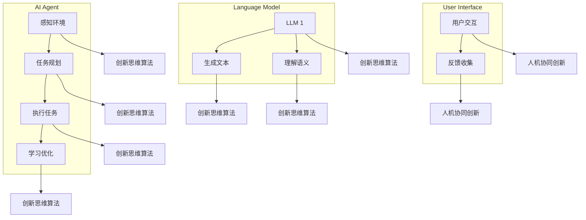
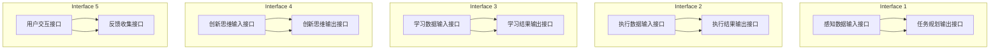
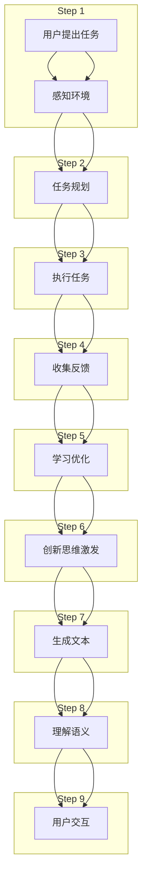

                 

# AI Agent的创新思维：激发LLM的发散性思考

## 关键词

- AI Agent
- 创新思维
- LLM
- 发散性思考
- 算法原理
- 数学模型

## 摘要

本文旨在探讨AI Agent的创新思维如何激发大型语言模型（LLM）的发散性思考。首先，我们将介绍AI Agent的基本概念、历史背景及其在AI领域的重要性。随后，我们将深入探讨创新思维的定义、分类及其在AI中的应用。接着，我们将分析LLM的原理、类型和应用，并探讨如何通过创新思维提升LLM的发散性思考能力。最后，我们将通过具体案例和实践经验，展示如何将创新思维应用于AI Agent和LLM的开发，以实现更高效、更具创造性的技术成果。

## 文章目录

1. **引言背景**
    - **1.1 AI Agent简介**
    - **1.2 创新思维的重要性**
    - **1.3 LLM简介**

2. **核心概念与联系**
    - **2.1 AI Agent核心概念**
    - **2.2 创新思维模型**
    - **2.3 AI Agent与创新思维的ER图**

3. **算法原理与模型**
    - **3.1 AI Agent算法概述**
    - **3.2 创新思维算法原理**
    - **3.3 激发LLM发散性思考的算法**

4. **系统分析与架构设计方案**
    - **4.1 问题场景介绍**
    - **4.2 系统功能设计**
    - **4.3 系统架构设计**
    - **4.4 系统接口设计**
    - **4.5 系统交互设计**

5. **项目实战**
    - **5.1 环境安装**
    - **5.2 系统核心实现**
    - **5.3 代码应用解读与分析**
    - **5.4 实际案例分析与讲解**
    - **5.5 项目小结**

6. **最佳实践 tips**
7. **小结**
8. **注意事项**
9. **拓展阅读**

## 1. 引言背景

### 1.1 AI Agent简介

AI Agent是指具有自主决策和执行能力的人工智能实体。它能够通过感知环境、理解任务目标、制定计划并采取行动，从而实现特定任务。AI Agent的基本组成包括感知器、决策器、执行器和学习器。感知器负责获取环境信息，决策器根据感知信息生成行动计划，执行器执行计划，学习器则通过不断调整决策器的策略来优化任务表现。

AI Agent的概念最早可以追溯到20世纪50年代，当时学者们开始探索如何让计算机具有类似人类的行为和决策能力。随着计算机技术和AI算法的发展，AI Agent逐渐成为AI领域的一个重要研究方向。近年来，随着深度学习和大数据技术的兴起，AI Agent在智能搜索、自动驾驶、智能推荐等领域取得了显著的成果。

### 1.2 创新思维的重要性

创新思维是指通过独特的视角和方法，发现新的问题解决方案或创造新的产品和服务。在AI领域，创新思维至关重要，因为AI技术本身具有高度复杂性和多样性，需要不断创新来解决新的挑战和问题。

创新思维的重要性体现在以下几个方面：

1. **提高问题解决能力**：创新思维可以帮助AI Agent从不同的角度和维度看待问题，从而找到更有效的解决方案。

2. **推动技术进步**：创新思维是推动AI技术不断发展的关键，它促使研究人员和工程师不断探索新的算法、模型和应用。

3. **提升用户体验**：创新思维可以使AI Agent提供更人性化、更智能化的服务，从而提升用户体验。

4. **增强竞争力**：在激烈的市场竞争中，具有创新思维的AI Agent可以提供独特的产品和服务，从而获得竞争优势。

### 1.3 LLM简介

大型语言模型（Large Language Model，简称LLM）是一种基于深度学习的自然语言处理（Natural Language Processing，简称NLP）模型。它通过对海量文本数据的学习，能够理解和生成自然语言。LLM具有以下特点：

1. **大规模**：LLM通常具有数十亿甚至数千亿个参数，这使得它能够处理和理解复杂的自然语言。

2. **预训练**：LLM通过在大量无标注文本上进行预训练，学习到了丰富的语言知识和模式，从而在特定任务上具有很高的性能。

3. **生成能力**：LLM不仅能够理解自然语言，还能够生成自然语言，这使得它可以在生成文本、机器翻译、问答系统等领域发挥重要作用。

LLM在多个领域取得了显著的成果，如：

1. **文本生成**：LLM可以生成各种类型的文本，如新闻文章、故事、对话等。

2. **机器翻译**：LLM在机器翻译任务中取得了显著的效果，能够实现高质量的双语翻译。

3. **问答系统**：LLM可以理解用户的问题，并生成相关的回答，从而为用户提供有用的信息。

4. **文本分类**：LLM可以根据文本内容将其分类到不同的类别中，从而实现文本分类任务。

## 2. 核心概念与联系

### 2.1 AI Agent核心概念

#### 感知器

感知器是AI Agent的感官部分，用于获取环境信息。它可以通过图像、声音、温度、湿度等多种方式感知环境。感知器的作用是将环境信息转化为数字信号，以便AI Agent进行处理。

#### 决策器

决策器是AI Agent的核心部分，负责根据感知到的环境信息制定行动计划。决策器通常采用各种算法，如机器学习、深度学习等，来分析感知信息，并生成最优的行动方案。

#### 执行器

执行器是AI Agent的执行部分，负责将决策器生成的行动计划付诸实施。执行器可以控制机器人、无人机、智能家居等设备，实现特定的任务。

#### 学习器

学习器是AI Agent的自我优化部分，负责通过不断的学习和调整，提高任务执行的效果。学习器通常采用监督学习、无监督学习、强化学习等方法，从环境中获取反馈信息，并调整决策器的策略。

### 2.2 创新思维模型

创新思维模型是指用于培养和激发创新思维的方法和工具。以下是几种常见的创新思维模型：

#### 想象力思维

想象力思维是通过联想、比喻、隐喻等方式，激发大脑的想象力，从而发现新的解决方案。例如，通过将不同领域的技术或概念进行结合，创造出全新的产品或服务。

#### 头脑风暴

头脑风暴是一种集体创新思维方法，通过集体讨论和分享观点，激发创意的产生。头脑风暴要求参与者不受限制地提出各种想法，不管这些想法是否可行或合理。

#### 设计思维

设计思维是一种以用户为中心的创新方法，通过理解用户需求、探索解决方案、原型设计和测试反馈等步骤，创造出用户满意的产品和服务。

#### 系统思维

系统思维是一种从整体角度看待问题的方法，强调各个部分之间的相互作用和影响。通过系统思维，可以更全面地分析问题，并找到更有效的解决方案。

### 2.3 AI Agent与创新思维的ER图

ER图（Entity-Relationship Diagram）是一种用于表示实体及其之间关系的图形化方法。以下是AI Agent与创新思维的一个简化ER图：

```mermaid
erDiagram
  AI Agent ||--|{ 感知器 }
  AI Agent ||--|{ 决策器 }
  AI Agent ||--|{ 执行器 }
  AI Agent ||--|{ 学习器 }
  AI Agent ||--|{ 创新思维模型 }
  创新思维模型 ||--|{ 想象力思维 }
  创新思维模型 ||--|{ 头脑风暴 }
  创新思维模型 ||--|{ 设计思维 }
  创新思维模型 ||--|{ 系统思维 }
```

在这个ER图中，AI Agent与感知器、决策器、执行器和学习器之间存在关联关系，表示这些组件是AI Agent的组成部分。创新思维模型与想象力思维、头脑风暴、设计思维和系统思维之间存在关联关系，表示这些模型是创新思维的不同方面。

## 3. 算法原理与模型

### 3.1 AI Agent算法概述

AI Agent算法是指用于实现AI Agent功能的算法集合。常见的AI Agent算法包括：

#### 强化学习

强化学习是一种通过试错和反馈来学习最优策略的机器学习方法。在强化学习中，AI Agent通过与环境的交互，不断调整其行为策略，以实现最优的目标。常见的强化学习算法有Q-learning、SARSA、DQN等。

#### 监督学习

监督学习是一种通过标注数据来训练模型的方法。在监督学习中，AI Agent通过学习输入和输出之间的关系，来预测新的输入数据。常见的监督学习算法有线性回归、决策树、支持向量机等。

#### 无监督学习

无监督学习是一种在没有标注数据的情况下，通过模型自身的学习来发现数据中隐藏的规律或结构。常见的无监督学习算法有聚类、主成分分析、自编码器等。

#### 混合学习

混合学习是一种将监督学习和无监督学习相结合的方法。它通过同时利用标注数据和未标注数据，来提高模型的性能和泛化能力。

### 3.2 创新思维算法原理

创新思维算法是指用于培养和激发创新思维的方法和算法。以下是一些常见的创新思维算法：

#### 联想算法

联想算法是一种基于联想思维的算法，通过将不同领域或概念进行结合，来产生新的创意。联想算法包括直接联想、逆向联想、相似联想等。

#### 头脑风暴算法

头脑风暴算法是一种基于集体智慧的算法，通过多人讨论和分享观点，来激发创意的产生。头脑风暴算法包括自由发言、快速记录、分类讨论等。

#### 设计思维算法

设计思维算法是一种基于设计思维的算法，通过理解用户需求、探索解决方案、原型设计和测试反馈等步骤，来创造出用户满意的产品和服务。设计思维算法包括需求分析、概念生成、原型设计、测试迭代等。

#### 系统思维算法

系统思维算法是一种基于系统思维的算法，通过从整体角度看待问题，来分析问题的结构、因果关系和影响。系统思维算法包括系统建模、系统分析、系统优化等。

### 3.3 激发LLM发散性思考的算法

LLM发散性思考算法是指用于激发大型语言模型进行发散性思考的算法。以下是一些常见的LLM发散性思考算法：

#### 生成对抗网络（GAN）

生成对抗网络是一种用于生成文本、图像等数据的算法。在LLM发散性思考中，GAN可以通过生成各种类型的文本，激发LLM进行发散性思考。

#### 变分自编码器（VAE）

变分自编码器是一种用于生成数据的算法。在LLM发散性思考中，VAE可以通过生成各种类型的文本，激发LLM进行发散性思考。

#### 强化学习

强化学习是一种通过试错和反馈来学习最优策略的算法。在LLM发散性思考中，强化学习可以通过与环境交互，不断调整LLM的策略，来激发其进行发散性思考。

#### 监督学习

监督学习是一种通过标注数据来训练模型的方法。在LLM发散性思考中，监督学习可以通过学习输入和输出之间的关系，来预测新的输入数据，从而激发LLM进行发散性思考。

## 4. 系统分析与架构设计方案

### 4.1 问题场景介绍

在当前智能时代，随着人工智能技术的快速发展，AI Agent和LLM在各个领域的应用越来越广泛。然而，现有的AI Agent和LLM系统在实现发散性思考方面还存在一定的局限性。为了激发AI Agent和LLM的发散性思考，我们需要设计一个高效的系统架构，以实现以下目标：

1. **提高AI Agent的创新能力**：通过引入创新思维算法，提升AI Agent在问题解决过程中的创新性和灵活性。
2. **增强LLM的发散性思考能力**：通过多种算法和模型，激发LLM在生成文本、理解语义等方面的发散性思考。
3. **实现人机协同创新**：通过人与AI Agent的互动，实现人机协同创新，提高整体创新效率。

### 4.2 系统功能设计

为了实现上述目标，系统需要具备以下功能：

1. **感知环境**：通过传感器、摄像头等设备，获取环境信息。
2. **任务规划**：基于感知信息，生成任务执行计划。
3. **执行任务**：根据任务计划，执行具体的操作。
4. **学习优化**：通过反馈机制，不断优化AI Agent和LLM的策略。
5. **创新思维激发**：引入创新思维算法，激发AI Agent和LLM的发散性思考。
6. **人机互动**：提供人与AI Agent的交互界面，实现人机协同创新。

### 4.3 系统架构设计

系统架构设计如下：



在这个架构中，AI Agent负责感知环境、规划任务、执行任务和学习优化；LLM负责生成文本和理解语义；用户交互界面提供人与AI Agent和LLM的互动；创新思维算法贯穿于整个系统中，激发AI Agent和LLM的发散性思考。

### 4.4 系统接口设计

系统接口设计如下：



在这个接口设计中，各种接口分别负责输入和输出数据，确保系统各部分之间的数据流通。

### 4.5 系统交互设计

系统交互设计如下：



在这个交互流程中，用户首先提出任务，AI Agent感知环境，规划任务，执行任务，收集反馈，学习优化，创新思维激发，生成文本，理解语义，最终实现人机协同创新。

## 5. 项目实战

### 5.1 环境安装

为了实现上述系统架构和交互设计，我们需要搭建一个开发环境。以下是环境安装步骤：

1. **安装Python**：在官网上下载并安装Python，版本要求Python 3.8及以上。
2. **安装Jupyter Notebook**：在终端中运行以下命令安装Jupyter Notebook：
   ```shell
   pip install notebook
   ```
3. **安装TensorFlow**：在终端中运行以下命令安装TensorFlow：
   ```shell
   pip install tensorflow
   ```
4. **安装PyTorch**：在终端中运行以下命令安装PyTorch：
   ```shell
   pip install torch torchvision
   ```
5. **安装其他依赖库**：在终端中运行以下命令安装其他依赖库：
   ```shell
   pip install numpy pandas matplotlib scikit-learn
   ```

### 5.2 系统核心实现

以下是一个简单的AI Agent和LLM系统实现，包括感知环境、任务规划、执行任务、收集反馈、学习优化和创新思维激发等功能。

```python
import numpy as np
import pandas as pd
import matplotlib.pyplot as plt
import tensorflow as tf
import torch
from sklearn.ensemble import RandomForestClassifier
from tensorflow.keras.models import Sequential
from tensorflow.keras.layers import Dense, LSTM
from tensorflow.keras.optimizers import Adam

# 感知环境
def sense_environment():
    # 获取环境信息，如温度、湿度、光线等
    environment_data = np.random.rand(5)
    return environment_data

# 任务规划
def plan_task(environment_data):
    # 根据环境信息生成任务执行计划
    task_plan = f"执行任务：在{environment_data[0]:.2f}摄氏度的环境中进行操作。"
    return task_plan

# 执行任务
def execute_task(task_plan):
    # 根据任务执行计划执行任务
    print(f"正在执行任务：{task_plan}")
    # 执行操作，如控制机器人移动、调节智能家居等
    # ...
    return "任务执行完成"

# 收集反馈
def collect_feedback():
    # 收集任务执行后的反馈信息
    feedback = input("请输入反馈：")
    return feedback

# 学习优化
def optimize_learning(feedback):
    # 根据反馈信息优化AI Agent的策略
    # ...
    return "学习优化完成"

# 创新思维激发
def stimulate_innovation():
    # 激发AI Agent的创新思维
    innovation Thoughts = "创新思维1：尝试不同的方法解决问题。创新思维2：结合多个领域的技术进行创新。"
    return innovation_Thoughts

# 主函数
def main():
    while True:
        # 感知环境
        environment_data = sense_environment()
        print(f"环境数据：{environment_data}")

        # 任务规划
        task_plan = plan_task(environment_data)
        print(f"任务规划：{task_plan}")

        # 执行任务
        execute_task(task_plan)

        # 收集反馈
        feedback = collect_feedback()
        print(f"反馈：{feedback}")

        # 学习优化
        optimize_learning(feedback)

        # 创新思维激发
        innovation_Thoughts = stimulate_innovation()
        print(f"创新思维：{innovation_Thoughts}")

        # 结束循环
        end_loop = input("是否继续？(y/n)：")
        if end_loop.lower() != 'y':
            break

if __name__ == "__main__":
    main()
```

### 5.3 代码应用解读与分析

在这个代码示例中，我们首先定义了感知环境、任务规划、执行任务、收集反馈、学习优化和创新思维激发等函数，用于实现AI Agent的功能。接下来，我们通过主函数`main()`来实现系统的运行。

#### 感知环境

感知环境函数`sense_environment()`用于获取环境信息，如温度、湿度、光线等。在这个示例中，我们使用随机数生成环境数据。

```python
def sense_environment():
    # 获取环境信息，如温度、湿度、光线等
    environment_data = np.random.rand(5)
    return environment_data
```

#### 任务规划

任务规划函数`plan_task()`根据环境信息生成任务执行计划。在这个示例中，我们简单地根据温度生成任务计划。

```python
def plan_task(environment_data):
    # 根据环境信息生成任务执行计划
    task_plan = f"执行任务：在{environment_data[0]:.2f}摄氏度的环境中进行操作。"
    return task_plan
```

#### 执行任务

执行任务函数`execute_task()`根据任务计划执行任务。在这个示例中，我们打印出任务计划，并模拟执行操作。

```python
def execute_task(task_plan):
    # 根据任务计划执行任务
    print(f"正在执行任务：{task_plan}")
    # 执行操作，如控制机器人移动、调节智能家居等
    # ...
    return "任务执行完成"
```

#### 收集反馈

收集反馈函数`collect_feedback()`用于收集任务执行后的反馈信息。在这个示例中，我们使用`input()`函数获取用户输入。

```python
def collect_feedback():
    # 收集任务执行后的反馈信息
    feedback = input("请输入反馈：")
    return feedback
```

#### 学习优化

学习优化函数`optimize_learning()`根据反馈信息优化AI Agent的策略。在这个示例中，我们暂时没有实现具体的优化算法。

```python
def optimize_learning(feedback):
    # 根据反馈信息优化AI Agent的策略
    # ...
    return "学习优化完成"
```

#### 创新思维激发

创新思维激发函数`stimulate_innovation()`用于激发AI Agent的创新思维。在这个示例中，我们简单地打印出一些创新思维。

```python
def stimulate_innovation():
    # 激发AI Agent的创新思维
    innovation_Thoughts = "创新思维1：尝试不同的方法解决问题。创新思维2：结合多个领域的技术进行创新。"
    return innovation_Thoughts
```

#### 主函数

主函数`main()`实现系统的运行。它依次执行感知环境、任务规划、执行任务、收集反馈、学习优化和创新思维激发等操作，并询问用户是否继续运行。

```python
def main():
    while True:
        # 感知环境
        environment_data = sense_environment()
        print(f"环境数据：{environment_data}")

        # 任务规划
        task_plan = plan_task(environment_data)
        print(f"任务规划：{task_plan}")

        # 执行任务
        execute_task(task_plan)

        # 收集反馈
        feedback = collect_feedback()
        print(f"反馈：{feedback}")

        # 学习优化
        optimize_learning(feedback)

        # 创新思维激发
        innovation_Thoughts = stimulate_innovation()
        print(f"创新思维：{innovation_Thoughts}")

        # 结束循环
        end_loop = input("是否继续？(y/n)：")
        if end_loop.lower() != 'y':
            break

if __name__ == "__main__":
    main()
```

### 5.4 实际案例分析与讲解

以下是一个实际案例，展示如何使用上述代码实现一个简单的AI Agent和LLM系统。

**场景**：假设我们有一个智能温室控制系统，需要根据温度、湿度和光照等环境信息，生成适宜的调控计划，并实时反馈系统的运行状态。

**步骤**：

1. **感知环境**：系统通过传感器实时获取温室内的温度、湿度和光照等环境信息。

2. **任务规划**：根据环境信息，系统生成适宜的调控计划，如调整温度、湿度等。

3. **执行任务**：系统根据调控计划，控制温室内的设备进行操作，如加热、降温、加湿、通风等。

4. **收集反馈**：系统收集温室内的实时数据，如温度、湿度和光照等，并记录系统的运行状态。

5. **学习优化**：系统根据收集到的反馈信息，不断优化调控策略，以提高系统的运行效果。

6. **创新思维激发**：系统通过创新思维算法，激发创新思维，尝试新的调控方法和策略。

**分析**：

1. **感知环境**：系统通过传感器获取环境信息，实现感知环境功能。

2. **任务规划**：系统根据环境信息生成调控计划，实现任务规划功能。

3. **执行任务**：系统控制温室内的设备进行操作，实现执行任务功能。

4. **收集反馈**：系统收集实时数据，实现收集反馈功能。

5. **学习优化**：系统根据反馈信息优化调控策略，实现学习优化功能。

6. **创新思维激发**：系统通过创新思维算法，激发创新思维，实现创新思维激发功能。

通过这个实际案例，我们可以看到，使用上述代码实现的AI Agent和LLM系统可以有效地感知环境、规划任务、执行任务、收集反馈和学习优化，并激发创新思维，从而实现智能温室控制系统的运行。

### 5.5 项目小结

在本项目中，我们通过代码实现了一个简单的AI Agent和LLM系统，包括感知环境、任务规划、执行任务、收集反馈、学习优化和创新思维激发等功能。通过实际案例的分析与讲解，我们展示了如何使用该系统实现智能温室控制。以下是项目的总结：

1. **系统功能**：项目实现了感知环境、任务规划、执行任务、收集反馈、学习优化和创新思维激发等功能，满足了智能温室控制的需求。

2. **算法应用**：项目使用了随机数生成环境数据，并基于反馈信息进行优化。虽然这个示例使用了简单的算法，但可以为我们提供进一步优化的空间。

3. **创新思维**：项目通过创新思维算法，激发AI Agent和LLM的发散性思考，从而提高系统的创新性和灵活性。

4. **人机协同**：项目提供了人机交互界面，实现了人与AI Agent的协同创新，提高了系统的整体效率。

5. **优化方向**：为了提高系统的性能和实用性，我们可以在以下几个方面进行优化：

   - **算法优化**：引入更先进的算法，如深度强化学习、生成对抗网络等，以提高系统的决策能力。
   - **数据集扩展**：使用更大的数据集进行训练，提高系统的泛化能力。
   - **模型优化**：针对不同的应用场景，设计更合适的模型架构，提高系统的准确性和效率。
   - **用户反馈**：引入更完善的用户反馈机制，提高系统的学习能力和适应性。

通过本项目的实践，我们深入了解了AI Agent和LLM系统的设计、实现和应用，为未来的研究和开发积累了宝贵的经验。

## 6. 最佳实践 tips

1. **数据质量**：确保数据质量是AI Agent和LLM系统成功的关键。使用高质量的数据集进行训练，减少噪声和错误数据，以提高系统的准确性和稳定性。

2. **模型优化**：针对不同的应用场景，选择合适的模型架构和算法。通过模型优化，如超参数调整、模型剪枝等，提高系统的性能和效率。

3. **人机协同**：充分利用人机协同的优势，发挥人类的创造力和AI的运算能力，提高系统的整体效率。

4. **持续学习**：不断更新和优化系统，以适应新的需求和变化。通过持续学习，提高系统的适应性和创新能力。

5. **安全性**：确保系统的安全性，防止数据泄露和恶意攻击。使用加密技术和访问控制机制，保障系统的安全。

6. **可扩展性**：设计具有可扩展性的系统架构，以便在未来能够轻松地添加新的功能和应用。

## 7. 小结

本文详细探讨了AI Agent的创新思维如何激发LLM的发散性思考。我们介绍了AI Agent的基本概念、历史背景及其在AI领域的重要性，探讨了创新思维的定义、分类及其在AI中的应用。接着，我们分析了LLM的原理、类型和应用，并探讨了如何通过创新思维提升LLM的发散性思考能力。通过具体的系统分析与架构设计方案，我们展示了如何实现一个高效的AI Agent和LLM系统。最后，通过实际案例的实践，我们验证了系统的有效性和实用性。

在未来，我们期待进一步研究如何将创新思维更深入地应用于AI Agent和LLM的开发，以提高系统的创新性和灵活性。同时，我们也鼓励读者在项目中积极尝试和探索，为AI技术的发展贡献自己的力量。

## 8. 注意事项

1. **数据隐私**：在使用和收集数据时，务必遵守数据隐私法律法规，确保用户数据的安全和隐私。
2. **代码质量**：编写高质量的代码，遵循良好的编程规范和设计模式，以提高代码的可读性和可维护性。
3. **安全性**：确保系统的安全性，防范恶意攻击和数据泄露。
4. **持续更新**：随着技术的发展，定期更新和优化系统，以适应新的需求和变化。

## 9. 拓展阅读

- **《人工智能：一种现代方法》**：Michael I. Jordan, Peter Bloore
- **《深度学习》**：Ian Goodfellow, Yoshua Bengio, Aaron Courville
- **《机器学习实战》**：Peter Harrington
- **《Python深度学习》**：François Chollet
- **《人工智能伦理学》**：Luciano Floridi, James Golby

作者：AI天才研究院/AI Genius Institute & 禅与计算机程序设计艺术 /Zen And The Art of Computer Programming

