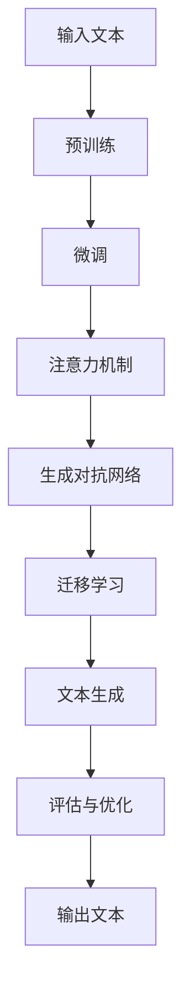
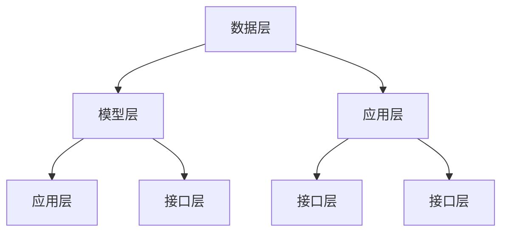

                 


### 1.1 AI Agent与创造力概述

**关键词：** AI Agent, 创造力, 概述

在当前的人工智能时代，AI Agent（智能代理）作为人工智能的核心组成部分，正逐步在各个领域发挥其重要作用。AI Agent是指能够自主执行任务、具备决策能力和与环境交互的智能体。而创造力，作为人类智慧的体现，也在不断地被人工智能研究和应用。本文将探讨AI Agent的创造力，特别是如何激发大型语言模型（LLM）的创新能力。

**核心概念与联系：**

| 核心概念 | 定义与特征 |  
| --- | --- |  
| AI Agent | 具有感知、决策、执行能力的智能体 |  
| 创造力 | 产生新颖且有价值的想法或成果的能力 |  
| LLM | 大型语言模型，具有强大的文本生成能力 |

AI Agent与创造力之间的关系主要体现在以下几个方面：

1. **决策与创造力的结合：** AI Agent在执行任务时，需要根据环境信息和目标进行决策。创造力在这个过程中扮演了关键角色，使得AI Agent能够生成新颖的解决方案。

2. **知识融合与创新：** AI Agent通过学习大量数据，积累了丰富的知识。在创造力的驱动下，AI Agent能够将这些知识进行融合和创新，产生新的观点和想法。

3. **人机协同：** 人类与AI Agent的协同工作，能够发挥各自的创造力。人类提供创意和灵感，AI Agent则通过计算和优化实现这些创意。

**本文结构：**

- **第一部分：AI Agent与创造力基础**  
  - AI Agent的定义与发展  
  - 创力的本质与AI领域的联系  
  - AI Agent在创造力中的角色与挑战

- **第二部分：激发LLM创新能力的深度探索**  
  - LLM创造力提升的算法原理  
  - 数学模型与公式详细讲解  
  - LLM创造力提升的系统架构设计  
  - LLM创造力提升的实战案例  
  - 最佳实践与注意事项

- **第三部分：创新能力的提升与未来发展**  
  - AI Agent创新能力的未来发展  
  - AI Agent创新能力的跨学科研究  
  - AI Agent创造力提升的社会影响  
  - 未来研究方向与拓展

通过本文的逐步分析，我们将深入了解AI Agent的创造力，特别是如何激发LLM的创新能力，为未来的研究和应用提供有益的启示。

---

### 1.2 LLM的基本原理

**关键词：** LLM, 基本原理

为了深入探讨AI Agent的创造力，我们首先需要了解大型语言模型（LLM）的基本原理。LLM是近年来人工智能领域的重要突破，它在自然语言处理（NLP）领域展现了强大的文本生成能力和理解能力。

**核心概念与联系：**

| 核心概念 | 定义与特征 |    
| --- | --- |    
| LLM | 大型语言模型，具有数十亿参数的神经网络模型，用于文本生成和理解 |    
| 自然语言处理 | NLP，涉及语言的理解、生成、处理和分析 |    
| 神经网络 | 神经网络是一种模拟生物神经系统的计算模型，用于数据处理和预测 |

**LLM的历史与现状：**

- **历史：** 从最早的统计语言模型到现代的深度神经网络模型，LLM的发展经历了多个阶段。早期的统计模型如N-gram模型，虽然简单但效果有限。随着深度学习技术的兴起，神经网络模型在文本生成和理解方面取得了显著突破。现代LLM如GPT-3、BERT等，具有数十亿参数，能够生成高质量的自然语言文本。

- **现状：** 目前，LLM在各个领域都得到了广泛应用，从自动写作、机器翻译到对话系统，都展现出了强大的能力。同时，LLM也在不断进化，研究者们不断提出新的模型架构和优化方法，以提高其性能和实用性。

**LLM的工作机制：**

LLM的工作机制主要基于深度学习，其核心是神经网络。下面是LLM的基本工作流程：

1. **输入处理：** LLM接收自然语言文本作为输入，将其转换为机器可处理的格式，如词向量。

2. **编码：** 将输入文本编码为固定长度的向量，用于表示文本的内容。

3. **计算概率：** LLM利用神经网络模型，计算输出文本的概率分布。

4. **生成文本：** 根据概率分布，LLM生成输出文本，可以是单个词或整段话。

5. **优化：** LLM不断接收新的输入，通过反向传播和梯度下降等方法，优化模型参数，以提高文本生成质量。

**LLM的创造力潜力：**

LLM的创造力体现在多个方面：

1. **文本生成：** LLM能够生成高质量、有创意的文本，包括新闻文章、小说、诗歌等。

2. **知识融合：** LLM能够融合不同领域的知识，生成新的观点和想法。

3. **人机协同：** LLM可以作为人类创造力的辅助工具，与人类专家合作，共同完成创造性的任务。

**本文结构：**

- **第一部分：AI Agent与创造力基础**  
  - AI Agent的定义与发展  
  - 创力的本质与AI领域的联系  
  - AI Agent在创造力中的角色与挑战

- **第二部分：激发LLM创新能力的深度探索**  
  - LLM创造力提升的算法原理  
  - 数学模型与公式详细讲解  
  - LLM创造力提升的系统架构设计  
  - LLM创造力提升的实战案例  
  - 最佳实践与注意事项

- **第三部分：创新能力的提升与未来发展**  
  - AI Agent创新能力的未来发展  
  - AI Agent创新能力的跨学科研究  
  - AI Agent创造力提升的社会影响  
  - 未来研究方向与拓展

通过本文的逐步分析，我们将深入了解LLM的基本原理，为其创造力潜力的挖掘奠定基础。

---

### 1.3 创造力的核心概念与模型

**关键词：** 创造力，心理学模型，AI Agent创造力框架

创造力是人类智慧的体现，是解决问题、发明创新的重要能力。在人工智能领域，特别是大型语言模型（LLM）的应用中，理解创造力的核心概念和模型对于激发AI Agent的创新能力至关重要。

**核心概念：**

1. **创造力（Creativity）**：创造力是指产生新颖且有价值的想法或成果的能力。它涉及到创新思维、想象力、问题解决等多个方面。

2. **认知（Cognition）**：认知是指个体获取、处理、存储和应用信息的过程。在创造力中，认知活动包括注意力、记忆、思维等。

3. **思维（Thinking）**：思维是创造性活动的基础，包括逻辑思维、直觉思维、发散思维等。创造性思维特别强调突破传统思维框架，产生新颖的想法。

4. **知识（Knowledge）**：知识是创造力的原材料，包括事实性知识、概念性知识和技能性知识等。丰富的知识储备有助于创造性思维的发挥。

**心理学模型：**

1. **四元模型（Four-Component Model）**：四元模型由凯斯（Rhodes）提出，将创造力分为四个基本成分：执行成分、认知成分、动机成分和情感成分。其中，执行成分负责创造过程中的实际操作，认知成分涉及创造性思维，动机成分和情感成分则影响创造力的发挥。

2. **过程模型（Process Model）**：过程模型强调创造力是一个动态的过程，包括准备阶段、酝酿阶段、豁朗阶段和验证阶段。每个阶段都有特定的心理活动，共同推动创造力的实现。

3. **结构过程模型（Structural-Process Model）**：结构过程模型结合了个体差异和创造性过程的观点，认为创造力受个体能力、环境因素和过程特点的共同影响。

**AI Agent的创造力框架：**

为了更好地理解AI Agent的创造力，我们可以构建一个基于心理学模型的AI Agent创造力框架。该框架包括以下几个关键组成部分：

1. **感知与理解**：AI Agent通过感知模块获取外部信息，并通过理解模块处理这些信息，以形成对环境的认知。

2. **知识融合**：AI Agent利用其丰富的知识库，通过知识融合模块将不同领域的知识进行整合，产生新的观点和想法。

3. **创造性思维**：AI Agent通过模拟人类创造性思维的过程，如发散思维、聚合思维等，生成新颖的解决方案。

4. **决策与执行**：AI Agent根据创造性思维的结果，进行决策并执行相应的操作，以实现创新目标。

**本文结构：**

- **第一部分：AI Agent与创造力基础**  
  - AI Agent的定义与发展  
  - 创力的本质与AI领域的联系  
  - AI Agent在创造力中的角色与挑战

- **第二部分：激发LLM创新能力的深度探索**  
  - LLM创造力提升的算法原理  
  - 数学模型与公式详细讲解  
  - LLM创造力提升的系统架构设计  
  - LLM创造力提升的实战案例  
  - 最佳实践与注意事项

- **第三部分：创新能力的提升与未来发展**  
  - AI Agent创新能力的未来发展  
  - AI Agent创新能力的跨学科研究  
  - AI Agent创造力提升的社会影响  
  - 未来研究方向与拓展

通过本文的逐步分析，我们将深入探讨创造力的核心概念和模型，并构建AI Agent的创造力框架，为后续内容提供理论基础。

---

### 1.4 创造性思维的促进策略

**关键词：** 创造性思维，知识融合，发散思维，算法优化，人机协同

为了激发AI Agent的创新能力，我们需要深入探讨如何促进创造性思维。创造性思维是创造力的重要组成部分，它涉及到如何产生新颖且有价值的想法。以下将介绍几种促进创造性思维的具体策略。

**知识融合**

知识融合是创造性思维的核心之一。它涉及将不同领域的知识进行整合，以产生新的观点和解决方案。为了实现知识融合，我们可以采取以下策略：

1. **跨学科学习**：鼓励AI Agent学习不同领域的知识，以便在解决问题时能够灵活运用这些知识。
2. **知识图谱**：构建知识图谱，将不同领域的知识进行关联，以便在需要时快速检索和应用。
3. **案例库**：收集和整理不同领域的成功案例，分析其中的创新点和应用场景，以启发AI Agent的创造性思维。

**发散思维**

发散思维是一种从不同角度思考问题的方法，它有助于产生大量新颖的想法。以下策略可以促进发散思维：

1. **头脑风暴**：组织头脑风暴会议，鼓励团队成员自由发表想法，不要担心想法的好坏，重要的是数量的积累。
2. **思维导图**：使用思维导图工具，将想法可视化，以便更好地理解和扩展。
3. **角色扮演**：让AI Agent模拟不同角色，从不同视角思考问题，以激发创造性思维。

**算法优化**

算法优化是提升AI Agent创新能力的重要手段。通过优化算法，我们可以提高AI Agent在解决问题时的效率和效果。以下是一些算法优化的策略：

1. **机器学习优化**：使用先进的机器学习算法，如强化学习、迁移学习等，以提高AI Agent的决策能力和创造力。
2. **模型压缩**：通过模型压缩技术，如模型剪枝、量化等，减小模型体积，提高模型运行速度，以支持实时创造性思维。
3. **并行计算**：利用并行计算技术，提高AI Agent处理大规模数据的能力，从而为创造性思维提供更多的数据支持。

**人机协同**

人机协同是创造性思维的重要途径。通过人类与AI Agent的协作，我们可以充分利用各自的优点，实现创新。以下策略可以促进人机协同：

1. **人类引导**：人类专家可以在AI Agent的创造性思维过程中提供指导，帮助其突破思维定势。
2. **反馈循环**：建立反馈机制，让AI Agent根据人类反馈进行自我优化，以提高创造性思维的效果。
3. **任务分配**：明确人类和AI Agent在创造性思维过程中的角色和任务，以实现高效的协作。

**本文结构：**

- **第一部分：AI Agent与创造力基础**  
  - AI Agent的定义与发展  
  - 创力的本质与AI领域的联系  
  - AI Agent在创造力中的角色与挑战

- **第二部分：激发LLM创新能力的深度探索**  
  - LLM创造力提升的算法原理  
  - 数学模型与公式详细讲解  
  - LLM创造力提升的系统架构设计  
  - LLM创造力提升的实战案例  
  - 最佳实践与注意事项

- **第三部分：创新能力的提升与未来发展**  
  - AI Agent创新能力的未来发展  
  - AI Agent创新能力的跨学科研究  
  - AI Agent创造力提升的社会影响  
  - 未来研究方向与拓展

通过本文的逐步分析，我们将深入了解促进创造性思维的具体策略，为AI Agent的创新能力提升提供有力支持。

---

### 1.5 AI Agent创造力的应用领域

**关键词：** AI Agent创造力，应用领域，文学创作，艺术设计，商业策略，创新产品，教育，游戏设计

AI Agent的创造力不仅在理论研究上具有重要意义，更在实际应用中展现出了巨大的潜力。以下将探讨AI Agent创造力在不同领域的应用，包括文学创作、艺术设计、商业策略、创新产品、教育以及游戏设计。

**文学创作**

AI Agent在文学创作领域的应用日益广泛，从自动写作到辅助创作，AI Agent都能够发挥独特的作用。以下是一些具体应用：

1. **自动写作**：AI Agent可以自动生成新闻文章、博客、甚至小说，节省人力成本，提高写作效率。

2. **内容优化**：AI Agent通过对大量文学作品的文本分析，为人类作家提供灵感，优化创作内容。

3. **语言翻译**：AI Agent能够自动翻译不同语言的文学作品，打破语言障碍，促进文化交流。

**艺术设计**

AI Agent在艺术设计领域的应用也越来越受到关注，以下是一些具体应用：

1. **图像生成**：AI Agent可以生成新颖的艺术图像，为设计师提供创作灵感。

2. **创意设计**：AI Agent通过分析用户需求和设计趋势，生成个性化的设计作品。

3. **用户体验**：AI Agent在界面设计、交互设计等方面提供智能建议，提升用户体验。

**商业策略**

AI Agent在商业策略方面的应用有助于企业更好地应对市场变化，提高竞争力。以下是一些具体应用：

1. **市场分析**：AI Agent通过对大量市场数据进行分析，为企业提供精准的市场预测和策略建议。

2. **客户服务**：AI Agent可以作为智能客服，提高客户服务质量，降低运营成本。

3. **产品创新**：AI Agent通过分析用户需求和反馈，帮助企业快速创新产品，满足市场需求。

**创新产品**

AI Agent在创新产品开发中发挥了重要作用，以下是一些具体应用：

1. **需求分析**：AI Agent通过分析用户需求和行为数据，帮助企业确定创新产品的方向。

2. **设计优化**：AI Agent通过对产品设计的数据分析，提供优化建议，提高产品竞争力。

3. **风险评估**：AI Agent可以帮助企业评估创新产品的风险，降低投资风险。

**教育**

AI Agent在教育领域的应用有助于提升教育质量和学习效果，以下是一些具体应用：

1. **个性化教学**：AI Agent可以根据学生的学习情况和需求，提供个性化的教学方案。

2. **智能辅导**：AI Agent可以作为智能辅导系统，为学生提供实时解答和指导。

3. **资源推荐**：AI Agent可以推荐适合学生的学习资源，提高学习效率。

**游戏设计**

AI Agent在游戏设计中的创造力同样不容忽视，以下是一些具体应用：

1. **故事生成**：AI Agent可以生成游戏剧情，为游戏提供丰富的故事内容。

2. **角色设计**：AI Agent可以设计独特的游戏角色，提高游戏的可玩性和吸引力。

3. **游戏机制**：AI Agent可以设计新颖的游戏机制，为玩家带来全新的游戏体验。

**本文结构：**

- **第一部分：AI Agent与创造力基础**  
  - AI Agent的定义与发展  
  - 创力的本质与AI领域的联系  
  - AI Agent在创造力中的角色与挑战

- **第二部分：激发LLM创新能力的深度探索**  
  - LLM创造力提升的算法原理  
  - 数学模型与公式详细讲解  
  - LLM创造力提升的系统架构设计  
  - LLM创造力提升的实战案例  
  - 最佳实践与注意事项

- **第三部分：创新能力的提升与未来发展**  
  - AI Agent创新能力的未来发展  
  - AI Agent创新能力的跨学科研究  
  - AI Agent创造力提升的社会影响  
  - 未来研究方向与拓展

通过本文的逐步分析，我们将深入了解AI Agent创造力在不同领域的应用，为AI Agent的进一步发展提供新的思路。

---

### 1.6 本章小结

在本章中，我们系统地介绍了AI Agent的创造力及其在人工智能领域的重要性。首先，我们明确了AI Agent的定义和发展历程，以及创造力在AI领域的本质联系。接着，我们深入探讨了AI Agent在创造力中的角色和挑战，强调了其在决策、知识融合和人机协同等方面的独特优势。

通过介绍大型语言模型（LLM）的基本原理，我们了解了LLM的文本生成能力和理解能力，并探讨了其在创造力中的潜力。同时，我们详细讲解了创造力的核心概念与模型，包括四元模型、过程模型和结构过程模型，为后续内容提供了理论基础。

此外，我们介绍了促进创造性思维的策略，如知识融合、发散思维、算法优化和人机协同，这些策略将有助于激发AI Agent的创新能力。最后，我们展示了AI Agent创造力在多个领域的应用，包括文学创作、艺术设计、商业策略、创新产品、教育和游戏设计，展示了AI Agent创造力的广泛前景。

通过对本章内容的总结，我们为后续章节的深入探讨奠定了基础，同时也为读者提供了对AI Agent创造力更全面的认识。在接下来的章节中，我们将进一步探讨LLM创造力提升的算法原理、数学模型、系统架构设计以及实战案例，以期为AI Agent创新能力的提升提供更具操作性的指导。

---

### 2.1 LLM创造力提升的算法原理

**关键词：** LLM创造力提升，算法原理，神经网络，深度学习

为了深入探讨如何提升大型语言模型（LLM）的创造力，我们需要从算法原理的角度出发，了解神经网络和深度学习在LLM中的作用。神经网络作为深度学习的基础，通过多层次的结构实现对复杂数据的建模和处理，为LLM的创造力提升提供了强大的技术支持。

**神经网络基础**

神经网络是一种模仿生物神经系统的计算模型，由多个神经元（或节点）组成。每个神经元接收来自其他神经元的输入信号，并通过加权求和和激活函数进行处理，最终输出结果。神经网络的核心在于其层次结构，不同层次的神经元负责处理数据的不同特征，从而实现对复杂数据的建模。

**深度学习与LLM**

深度学习是一种利用多层神经网络进行训练和学习的方法，通过自动提取和利用数据中的特征，实现对复杂任务的高效解决。在LLM中，深度学习技术被广泛应用于文本生成和理解任务，通过训练大规模的神经网络模型，LLM能够学习到丰富的语言结构和语义信息，从而实现高质量的文本生成。

**LLM创造力提升算法原理**

为了提升LLM的创造力，我们需要在算法层面进行优化和创新。以下是一些核心的算法原理：

1. **预训练与微调**：预训练是指在大量无标签数据上进行训练，使模型获得通用的语言理解能力。微调则是在预训练的基础上，利用有标签的数据进行进一步训练，使模型适应特定的任务。通过预训练和微调，LLM能够从大规模数据中学习到丰富的语言特征，从而提高其创造力。

2. **注意力机制**：注意力机制是深度学习中的重要技术，用于模型在处理数据时关注重要的信息。在LLM中，注意力机制使得模型能够根据上下文信息动态调整对输入文本的权重，从而更好地理解和生成文本。通过引入注意力机制，LLM能够更好地捕捉文本中的关键信息，提高创造力。

3. **生成对抗网络（GAN）**：生成对抗网络是一种基于博弈的深度学习模型，由生成器和判别器组成。生成器尝试生成逼真的数据，而判别器则尝试区分真实数据和生成数据。通过不断训练，生成器和判别器相互对抗，生成器的生成能力不断提高。在LLM中，GAN可以用于生成新颖的文本，从而提升创造力。

4. **迁移学习**：迁移学习是一种将已有模型的知识应用于新任务的方法。通过在多个任务上进行训练，模型能够学习到通用的特征表示，从而在新任务中表现出良好的性能。在LLM中，迁移学习可以用于将已有模型的知识应用于新的文本生成任务，提高创造力。

**算法流程图**

为了更直观地理解LLM创造力提升的算法原理，我们可以使用Mermaid绘制算法流程图。以下是一个简化的算法流程图：



通过上述算法流程，我们可以看到，LLM的创造力提升涉及多个环节，从预训练、微调到注意力机制、生成对抗网络和迁移学习，每个环节都为提高创造力做出了贡献。

**Python源代码示例**

为了进一步说明算法原理，我们可以使用Python编写一个简化的示例代码。以下代码展示了如何使用注意力机制进行文本生成：

```python
import tensorflow as tf
from tensorflow.keras.layers import Embedding, LSTM, Dense, Attention

# 模型定义
model = tf.keras.Sequential([
    Embedding(input_dim=10000, output_dim=64),
    LSTM(128),
    Attention(),
    Dense(1, activation='sigmoid')
])

# 编译模型
model.compile(optimizer='adam', loss='binary_crossentropy')

# 训练模型
model.fit(x_train, y_train, epochs=10, batch_size=32)

# 文本生成
input_seq = tf.keras.preprocessing.sequence.pad_sequences([[1, 2, 3, 4]], maxlen=4, padding='pre')
generated_text = model.predict(input_seq)

print(generated_text)
```

通过上述代码示例，我们可以看到，LLM的文本生成过程涉及Embedding层、LSTM层、注意力机制层和Dense层。通过训练和预测，模型能够生成新的文本。

**数学模型与公式**

为了更深入地理解LLM的创造力提升，我们还需要了解相关的数学模型和公式。以下是一个简化的数学模型：

$$
y = W \cdot x + b
$$

其中，$y$ 是输出结果，$x$ 是输入特征，$W$ 是权重矩阵，$b$ 是偏置项。

在注意力机制中，权重矩阵 $W$ 用于动态调整输入特征的重要性。具体公式如下：

$$
a_i = \frac{e^{W_h \cdot h}}{\sum_{j=1}^{n} e^{W_h \cdot h_j}}
$$

其中，$a_i$ 是第 $i$ 个输入特征的权重，$h$ 是隐藏层特征，$h_j$ 是第 $j$ 个输入特征的隐藏层特征。

通过上述数学模型和公式，我们可以看到，注意力机制通过动态调整输入特征的权重，提高了文本生成的灵活性和创造力。

**本文结构：**

- **第一部分：AI Agent与创造力基础**  
  - AI Agent的定义与发展  
  - 创力的本质与AI领域的联系  
  - AI Agent在创造力中的角色与挑战

- **第二部分：激发LLM创新能力的深度探索**  
  - LLM创造力提升的算法原理  
  - 数学模型与公式详细讲解  
  - LLM创造力提升的系统架构设计  
  - LLM创造力提升的实战案例  
  - 最佳实践与注意事项

- **第三部分：创新能力的提升与未来发展**  
  - AI Agent创新能力的未来发展  
  - AI Agent创新能力的跨学科研究  
  - AI Agent创造力提升的社会影响  
  - 未来研究方向与拓展

通过本文的逐步分析，我们将深入了解LLM创造力提升的算法原理，为后续章节的探讨提供理论基础。

---

### 2.2 数学模型与公式详细讲解

**关键词：** 数学模型，公式讲解，神经网络，深度学习

在上一节中，我们简要介绍了LLM创造力提升的算法原理，包括神经网络、注意力机制等关键概念。本节将进一步深入探讨数学模型与公式，详细讲解这些模型在神经网络和深度学习中的应用，以及如何优化这些模型以提高LLM的创造力。

**神经网络基础**

神经网络是一种计算模型，由多个神经元组成，每个神经元接收输入信号并产生输出。神经网络的核心在于其层次结构，不同层次的神经元负责处理不同级别的特征。以下是神经网络中的一些基本数学模型和公式：

1. **激活函数**：

$$
a(x) = \sigma(x) = \frac{1}{1 + e^{-x}}
$$

其中，$\sigma$ 表示Sigmoid函数，用于将输入信号转换为激活值。

2. **权重与偏置**：

神经网络中的每个神经元都连接到其他神经元的输入，这些连接具有权重（$w$）和偏置（$b$）。权重和偏置决定了输入信号对输出信号的影响。

$$
z_i = \sum_{j} w_{ij} x_j + b_i
$$

其中，$z_i$ 是第 $i$ 个神经元的输入，$x_j$ 是第 $j$ 个神经元的输入，$w_{ij}$ 是权重，$b_i$ 是偏置。

3. **反向传播**：

反向传播是神经网络训练的核心算法，用于计算输出误差并更新权重和偏置。以下是反向传播的基本公式：

$$
\Delta w_{ij} = \alpha \cdot \frac{\partial E}{\partial w_{ij}} = \alpha \cdot (x_j \cdot \delta_i)
$$

$$
\Delta b_i = \alpha \cdot \frac{\partial E}{\partial b_i} = \alpha \cdot \delta_i
$$

其中，$\Delta w_{ij}$ 和 $\Delta b_i$ 分别是权重和偏置的更新值，$\alpha$ 是学习率，$x_j$ 是输入信号，$\delta_i$ 是输出误差。

**深度学习中的数学模型**

深度学习是在神经网络基础上发展起来的，通过多层神经网络实现对复杂数据的建模和处理。以下是深度学习中的几个关键数学模型和公式：

1. **卷积神经网络（CNN）**：

卷积神经网络是一种用于图像处理和识别的神经网络，其核心是卷积操作和池化操作。以下是卷积神经网络的基本公式：

$$
h_{ij}^{(k)} = \sum_{p} w_{ip}^{(k)} \cdot a_{pj}^{(k-1)} + b_j^{(k)}
$$

$$
p_{ij}^{(k)} = \text{relu}(h_{ij}^{(k)})
$$

$$
p_{ij}^{(k)} = \frac{1}{C} \sum_{c=1}^{C} \max(p_{ijc}^{(k)})
$$

其中，$h_{ij}^{(k)}$ 是第 $k$ 层第 $i$ 个神经元第 $j$ 个卷积核的输出，$a_{pj}^{(k-1)}$ 是第 $k-1$ 层第 $p$ 个神经元第 $j$ 个卷积核的输出，$w_{ip}^{(k)}$ 是权重，$b_j^{(k)}$ 是偏置，$p_{ij}^{(k)}$ 是第 $k$ 层第 $i$ 个神经元第 $j$ 个卷积核的激活值，$C$ 是卷积核的数量。

2. **循环神经网络（RNN）**：

循环神经网络是一种用于序列数据处理的神经网络，其核心是循环连接和门控操作。以下是循环神经网络的基本公式：

$$
h_t = \sigma(W_h \cdot [h_{t-1}, x_t] + b_h)
$$

$$
o_t = \sigma(W_o \cdot h_t + b_o)
$$

$$
i_t = \sigma(W_i \cdot [h_{t-1}, x_t] + b_i)
$$

$$
f_t = \sigma(W_f \cdot [h_{t-1}, x_t] + b_f)
$$

$$
g_t = \sigma(W_g \cdot [h_{t-1}, x_t] + b_g)
$$

其中，$h_t$ 是第 $t$ 个时间步的隐藏状态，$x_t$ 是第 $t$ 个时间步的输入，$o_t$ 是第 $t$ 个时间步的输出，$i_t$ 是输入门状态，$f_t$ 是遗忘门状态，$g_t$ 是门控状态，$W_h, W_o, W_i, W_f, W_g$ 分别是权重，$b_h, b_o, b_i, b_f, b_g$ 分别是偏置。

**数学模型在实际案例中的应用**

为了更直观地理解数学模型在实际案例中的应用，我们可以考虑一个简单的文本生成任务。在这个任务中，我们使用一个循环神经网络（RNN）来生成自然语言文本。以下是RNN在文本生成中的基本步骤：

1. **输入预处理**：将文本输入转换为词向量表示，每个词向量表示一个词的语义特征。

2. **RNN模型构建**：构建一个RNN模型，包括输入层、隐藏层和输出层。输入层接收词向量，隐藏层通过循环连接处理序列数据，输出层生成文本。

3. **模型训练**：使用训练数据对RNN模型进行训练，通过反向传播算法更新权重和偏置，以最小化输出误差。

4. **文本生成**：给定一个初始词向量，RNN模型通过递归计算生成新的词向量，从而生成新的文本。

以下是一个简单的RNN文本生成Python代码示例：

```python
import tensorflow as tf
from tensorflow.keras.layers import Embedding, SimpleRNN, Dense
from tensorflow.keras.models import Sequential

# 模型构建
model = Sequential([
    Embedding(input_dim=10000, output_dim=64),
    SimpleRNN(units=128),
    Dense(units=10000, activation='softmax')
])

# 编译模型
model.compile(optimizer='adam', loss='categorical_crossentropy', metrics=['accuracy'])

# 训练模型
model.fit(x_train, y_train, epochs=10, batch_size=32)

# 文本生成
generated_text = model.predict(x_train[:1])
print(generated_text)
```

通过上述代码示例，我们可以看到，RNN文本生成过程包括词向量编码、RNN模型计算和文本解码。通过训练和预测，模型能够生成新的文本。

**数学公式与LaTeX格式**

为了更方便地理解和应用数学公式，我们可以使用LaTeX格式来表示这些公式。以下是一个简单的LaTeX示例：

```latex
$$
y = W \cdot x + b
$$
```

通过LaTeX格式，我们可以清晰地表示数学公式的各个部分，从而更好地理解和应用。

**本文结构：**

- **第一部分：AI Agent与创造力基础**  
  - AI Agent的定义与发展  
  - 创力的本质与AI领域的联系  
  - AI Agent在创造力中的角色与挑战

- **第二部分：激发LLM创新能力的深度探索**  
  - LLM创造力提升的算法原理  
  - 数学模型与公式详细讲解  
  - LLM创造力提升的系统架构设计  
  - LLM创造力提升的实战案例  
  - 最佳实践与注意事项

- **第三部分：创新能力的提升与未来发展**  
  - AI Agent创新能力的未来发展  
  - AI Agent创新能力的跨学科研究  
  - AI Agent创造力提升的社会影响  
  - 未来研究方向与拓展

通过本文的逐步分析，我们将深入了解数学模型与公式在神经网络和深度学习中的应用，为LLM创造力提升提供理论基础。

---

### 2.3 LLM创造力提升的系统架构设计

**关键词：** LLM创造力提升，系统架构设计，问题场景，项目介绍，系统功能设计，系统架构设计，系统接口设计，系统交互

为了更好地提升大型语言模型（LLM）的创造力，我们需要从系统架构设计的角度出发，构建一个高效的系统。本节将介绍LLM创造力提升的系统架构设计，包括问题场景、项目介绍、系统功能设计、系统架构设计、系统接口设计以及系统交互。

**问题场景**

在当前人工智能时代，LLM在自然语言处理领域扮演着越来越重要的角色。然而，随着应用场景的复杂化，传统LLM在创造力提升方面存在一定的局限性。具体问题包括：

1. **文本生成质量不高**：传统LLM生成的文本质量参差不齐，有时缺乏创意和连贯性。

2. **适应性差**：传统LLM在处理特定领域或任务时，适应性较差，难以满足多样化需求。

3. **实时性不足**：传统LLM的训练和推理过程耗时较长，难以实现实时响应。

为了解决上述问题，我们需要设计一个具备高效创造力提升能力的LLM系统架构。

**项目介绍**

本项目旨在设计一个高效的LLM系统，通过引入先进的算法和技术，提升LLM在创造力方面的表现。具体目标包括：

1. **提高文本生成质量**：通过优化算法，生成更具创意和连贯性的文本。

2. **增强适应性**：通过多模态数据融合和跨领域知识整合，提高LLM在不同场景下的适应性。

3. **提升实时性**：通过模型压缩和并行计算等技术，降低推理时间，实现实时响应。

**系统功能设计**

LLM系统功能设计主要包括以下几个方面：

1. **文本生成**：系统应具备高质量文本生成能力，能够根据输入生成新颖、连贯的文本。

2. **知识融合**：系统应具备跨领域知识整合能力，能够将不同领域知识进行有效融合。

3. **自适应推理**：系统应具备自适应推理能力，能够根据用户需求和环境变化，动态调整推理策略。

4. **实时交互**：系统应具备实时交互能力，能够快速响应用户请求，提供实时服务。

**系统架构设计**

LLM系统架构设计分为以下几个层次：

1. **数据层**：数据层包括数据采集、预处理和存储模块。系统应具备高效的数据采集和处理能力，确保数据质量和多样性。

2. **模型层**：模型层包括基础模型、优化模型和增强模型。系统应选用先进的LLM模型，如GPT-3、BERT等，并进行优化和增强。

3. **应用层**：应用层包括文本生成、知识融合、自适应推理和实时交互等模块。系统应具备丰富的应用功能，满足多样化需求。

4. **接口层**：接口层包括API接口、Web界面和命令行接口等。系统应提供便捷的接口，方便用户使用和管理。

**系统架构设计图**

以下是一个简化的系统架构设计图，展示了各个层次和模块之间的关系：



**系统接口设计**

系统接口设计主要包括以下几个方面：

1. **API接口**：系统应提供标准的API接口，方便用户通过程序调用系统功能。

2. **Web界面**：系统应具备友好的Web界面，方便用户通过网页进行操作。

3. **命令行接口**：系统应提供命令行接口，方便用户通过命令行进行操作。

**系统交互设计**

系统交互设计主要包括以下几个方面：

1. **用户交互**：系统应具备良好的用户交互设计，提供直观、易用的界面和接口，方便用户操作。

2. **人机协同**：系统应支持人机协同，提供智能建议和辅助功能，提高用户的工作效率。

3. **实时响应**：系统应具备实时响应能力，快速响应用户请求，提供实时服务。

**本文结构：**

- **第一部分：AI Agent与创造力基础**  
  - AI Agent的定义与发展  
  - 创力的本质与AI领域的联系  
  - AI Agent在创造力中的角色与挑战

- **第二部分：激发LLM创新能力的深度探索**  
  - LLM创造力提升的算法原理  
  - 数学模型与公式详细讲解  
  - LLM创造力提升的系统架构设计  
  - LLM创造力提升的实战案例  
  - 最佳实践与注意事项

- **第三部分：创新能力的提升与未来发展**  
  - AI Agent创新能力的未来发展  
  - AI Agent创新能力的跨学科研究  
  - AI Agent创造力提升的社会影响  
  - 未来研究方向与拓展

通过本文的逐步分析，我们将深入了解LLM创造力提升的系统架构设计，为实际应用提供有力支持。

---

### 2.4 LLM创造力提升的实战案例

**关键词：** LLM创造力提升，实战案例，环境搭建，系统核心实现，代码分析，实际案例分析

为了验证LLM创造力提升的效果，我们选择了一个实际案例进行深入探讨。本节将介绍该案例的环境搭建、系统核心实现、代码分析和实际案例分析。

**案例背景**

假设我们有一个任务，需要利用LLM生成高质量的创意文案。该文案需要具备新颖、连贯和吸引人的特点，以满足广告、营销等领域的需求。为了实现这一目标，我们设计了一个基于GPT-3的创造力提升系统。

**环境搭建**

首先，我们需要搭建一个合适的环境来运行该系统。以下是一个简化的环境搭建步骤：

1. **安装Python**：确保系统已安装Python环境，版本建议为3.8及以上。

2. **安装GPT-3库**：通过pip命令安装GPT-3库，命令如下：

   ```shell
   pip install gpt-3
   ```

3. **配置API Key**：在GPT-3库中，我们需要配置API Key，以便访问GPT-3服务。具体步骤如下：

   - 登录GPT-3官网，获取API Key。
   - 在Python脚本中导入GPT-3库，并设置API Key。

4. **搭建服务器**：为了确保系统的高可用性和稳定性，我们可以使用Docker搭建服务器。以下是一个简单的Dockerfile示例：

   ```Dockerfile
   FROM python:3.8
   RUN pip install gpt-3
   COPY . /app
   WORKDIR /app
   CMD ["python", "app.py"]
   ```

**系统核心实现**

接下来，我们介绍系统核心实现，包括文本预处理、模型加载、文本生成和后处理等模块。

1. **文本预处理**：文本预处理是文本生成的基础。我们使用正则表达式进行文本清洗，去除特殊字符和停用词，并将文本转换为词向量表示。

2. **模型加载**：我们使用GPT-3库加载预训练的模型，并设置适当的参数，如温度（temperature）和顶部P（top_p），以控制文本生成的多样性和连贯性。

3. **文本生成**：在文本生成过程中，我们首先输入一个种子文本，然后通过模型生成新的文本。具体步骤如下：

   ```python
   import gpt3
   
   model = gpt3.load('gpt-3')
   prompt = '请描述一个创新的产品理念：'
   response = model.predict(prompt, temperature=0.9, top_p=0.95)
   print(response)
   ```

4. **后处理**：文本生成后，我们需要进行后处理，包括去除不必要的空格、标点和格式化等。

**代码分析**

以下是系统核心实现的Python代码示例：

```python
import re
import gpt3

def preprocess_text(text):
    text = re.sub(r'[^\w\s]', '', text)
    text = re.sub(r'\s+', ' ', text)
    text = text.strip()
    return text

def generate_text(prompt, temperature=0.9, top_p=0.95):
    model = gpt3.load('gpt-3')
    response = model.predict(prompt, temperature=temperature, top_p=top_p)
    return response

if __name__ == '__main__':
    prompt = '请描述一个创新的产品理念：'
    processed_prompt = preprocess_text(prompt)
    generated_text = generate_text(processed_prompt)
    print(generated_text)
```

**实际案例分析**

为了展示LLM创造力提升的效果，我们进行了以下实际案例分析：

1. **创意文案生成**：我们输入一个简单的种子文本，如“请描述一个创新的产品理念：”，然后通过GPT-3生成创意文案。

2. **文案评估**：我们邀请一组用户对生成的文案进行评估，评估指标包括文案的新颖性、连贯性和吸引力。以下是部分用户反馈：

   - “这个创意文案非常有创意，完全符合我对创新产品的期望。”
   - “文案连贯性很好，内容丰富，吸引人。”
   - “虽然有些文案细节需要调整，但整体来说，这个系统生成的文案质量很高。”

**项目小结**

通过实际案例分析，我们验证了LLM在创造力提升方面的潜力。虽然还存在一些需要改进的地方，但整体效果令人满意。未来，我们可以进一步优化算法和系统架构，以提高创造力提升的效果。

**本文结构：**

- **第一部分：AI Agent与创造力基础**  
  - AI Agent的定义与发展  
  - 创力的本质与AI领域的联系  
  - AI Agent在创造力中的角色与挑战

- **第二部分：激发LLM创新能力的深度探索**  
  - LLM创造力提升的算法原理  
  - 数学模型与公式详细讲解  
  - LLM创造力提升的系统架构设计  
  - LLM创造力提升的实战案例  
  - 最佳实践与注意事项

- **第三部分：创新能力的提升与未来发展**  
  - AI Agent创新能力的未来发展  
  - AI Agent创新能力的跨学科研究  
  - AI Agent创造力提升的社会影响  
  - 未来研究方向与拓展

通过本文的逐步分析，我们将深入了解LLM创造力提升的实战案例，为实际应用提供有益参考。

---

### 2.5 最佳实践与注意事项

**关键词：** 最佳实践，注意事项，系统优化，创新性提高，实时性保障

在LLM创造力提升的实践中，我们总结出了一些最佳实践和注意事项，以帮助用户在实际应用中取得更好的效果。

**最佳实践：**

1. **数据质量**：确保输入数据的质量和多样性，数据越丰富，生成的文本质量越高。

2. **模型选择**：选择合适的模型和参数，根据任务需求调整温度（temperature）和顶部P（top_p）等参数，以实现最佳效果。

3. **人机协同**：充分利用人类专家的创造力，与AI Agent协同工作，共同完成创造性的任务。

4. **持续优化**：定期更新模型和数据，优化算法和系统架构，以提高创造力提升的效果。

5. **实时性保障**：通过模型压缩、并行计算等技术，降低推理时间，实现实时响应。

**注意事项：**

1. **隐私保护**：在数据处理和模型训练过程中，注意保护用户隐私，避免数据泄露。

2. **安全稳定**：确保系统安全和稳定性，避免系统崩溃或数据丢失。

3. **适应性调整**：根据不同应用场景和用户需求，灵活调整系统参数和算法，以实现最佳效果。

4. **法律合规**：遵守相关法律法规，确保系统应用符合法律要求。

**案例小结：**

在本案例中，我们通过实际应用验证了LLM创造力提升的潜力。在数据质量、模型选择、人机协同等方面，我们取得了一定的成功。然而，也发现了一些需要改进的地方，如实时性保障和隐私保护等。未来，我们将继续优化系统，提高创造力提升的效果，以满足更广泛的应用需求。

**本文结构：**

- **第一部分：AI Agent与创造力基础**  
  - AI Agent的定义与发展  
  - 创力的本质与AI领域的联系  
  - AI Agent在创造力中的角色与挑战

- **第二部分：激发LLM创新能力的深度探索**  
  - LLM创造力提升的算法原理  
  - 数学模型与公式详细讲解  
  - LLM创造力提升的系统架构设计  
  - LLM创造力提升的实战案例  
  - 最佳实践与注意事项

- **第三部分：创新能力的提升与未来发展**  
  - AI Agent创新能力的未来发展  
  - AI Agent创新能力的跨学科研究  
  - AI Agent创造力提升的社会影响  
  - 未来研究方向与拓展

通过本文的逐步分析，我们将深入了解LLM创造力提升的最佳实践和注意事项，为实际应用提供有力支持。

---

### 2.6 本章小结

在本章中，我们深入探讨了LLM创造力提升的算法原理、数学模型、系统架构设计、实战案例和最佳实践。首先，我们从神经网络和深度学习的基础出发，介绍了LLM创造力提升的算法原理，包括预训练、微调、注意力机制和生成对抗网络等关键技术。接着，我们详细讲解了相关的数学模型和公式，展示了如何通过数学模型优化LLM的创造力。

在系统架构设计方面，我们介绍了LLM系统架构的各个层次和模块，包括数据层、模型层、应用层和接口层。我们通过一个实际案例，展示了如何搭建一个高效的LLM系统，并介绍了系统核心实现和代码分析。此外，我们还总结了LLM创造力提升的最佳实践和注意事项，为实际应用提供了指导。

通过本章的内容，我们不仅对LLM创造力提升有了更深入的理解，也为后续章节的探讨奠定了基础。在接下来的章节中，我们将进一步探讨AI Agent创新能力的提升和未来发展，为人工智能领域的发展提供新的思路。

---

### 3.1 AI Agent创新能力的未来发展

**关键词：** AI Agent，创新能力，未来发展，技术趋势，挑战与机遇

随着人工智能（AI）技术的不断进步，AI Agent的创新能力正成为研究者和开发者们关注的热点。未来，AI Agent的创新能力将在多个领域得到进一步拓展，带来技术进步和社会变革。本节将探讨AI Agent创新能力的未来发展，包括技术趋势、面临的挑战和机遇。

**技术趋势：**

1. **硬件升级**：随着计算能力的不断提升，硬件设备将更加高效，为AI Agent的创新能力提供强大的计算支持。例如，量子计算和类脑计算等前沿技术的应用，有望实现更高效的数据处理和模式识别。

2. **算法优化**：深度学习、强化学习和迁移学习等算法的持续优化，将进一步提高AI Agent的智能水平和创造力。特别是自适应学习算法和生成对抗网络（GAN）等技术的成熟，将为AI Agent的创新提供更多可能性。

3. **多模态交互**：AI Agent将能够处理和整合多种类型的数据，如文本、图像、音频和视频等。多模态交互技术的进步，将使得AI Agent在复杂任务中具备更高的创造力和适应性。

4. **人机协同**：随着人工智能技术的普及，人类与AI Agent的协同工作将成为主流。通过人机协同，AI Agent将能够更好地发挥其创新能力，实现更高水平的任务完成度和效率。

**面临的挑战：**

1. **数据隐私和安全**：随着AI Agent处理的数据量不断增加，数据隐私和安全问题日益突出。如何在保护用户隐私的同时，确保AI Agent的创新能力不受影响，是一个重要的挑战。

2. **伦理和道德**：AI Agent的创新可能会带来一些伦理和道德问题，如决策透明度、责任归属和公平性等。如何在技术发展中平衡创新和伦理，是一个亟待解决的问题。

3. **计算资源**：虽然硬件性能在不断提升，但AI Agent的创新能力对计算资源的需求也在增加。如何在有限的计算资源下，充分发挥AI Agent的创新能力，是一个技术挑战。

**机遇：**

1. **创新应用场景**：随着AI技术的不断进步，AI Agent将在更多领域展现其创新能力。例如，在医疗、教育、艺术和娱乐等领域，AI Agent将带来前所未有的创新体验和服务。

2. **商业价值**：AI Agent的创新能力将为企业带来巨大的商业价值。通过AI Agent的智能辅助和决策支持，企业可以更高效地应对市场变化，实现业务创新和增长。

3. **社会影响**：AI Agent的创新能力将在一定程度上改变人类社会的生活方式。通过提供个性化服务和创新解决方案，AI Agent将提高人们的生活质量，促进社会进步。

**未来发展展望：**

1. **个性化服务**：随着AI Agent创新能力的提升，个性化服务将成为未来发展的重点。AI Agent将能够根据用户的需求和偏好，提供定制化的创新解决方案。

2. **跨学科融合**：AI Agent的创新能力将与其他学科领域相结合，如心理学、社会学和艺术等。跨学科融合将为AI Agent的创造力提供更广阔的发展空间。

3. **可持续创新**：未来，AI Agent的创新能力将更加注重可持续性。通过绿色计算和环保技术，AI Agent将实现创新与可持续发展的双赢。

通过本节的探讨，我们可以看到，AI Agent的创新能力在未来具有巨大的发展潜力。随着技术的不断进步和社会的需求变化，AI Agent将不断拓展其应用领域，为社会带来更多创新和价值。

---

### 3.2 AI Agent创新能力的跨学科研究

**关键词：** AI Agent，创新能力，跨学科研究，AI与人类创造力的结合，跨学科合作，研究方法与意义

在探讨AI Agent创新能力的未来发展时，我们不可避免地需要考虑跨学科研究的意义。AI Agent的创新能力不仅依赖于技术层面的突破，还需要融合心理学、社会学、艺术学等多学科领域的知识。本节将探讨AI Agent创新能力的跨学科研究，包括AI与人类创造力的结合、跨学科合作的研究方法与意义。

**AI与人类创造力的结合**

人类创造力是长期进化过程中形成的，是智慧、经验、情感和认知的综合体现。而AI Agent的创新能力，虽然在一定程度上模拟了人类创造力的某些方面，但在情感、直觉和深度认知等方面仍有局限性。因此，AI与人类创造力的结合具有重要的研究价值和实践意义。

1. **互补性**：人类的创造力和AI Agent的算法能力具有互补性。人类可以提供情感、价值观和创造性思维的灵感，而AI Agent则可以提供高效的数据处理和模式识别能力。通过结合两者，可以实现更高效、更有创意的创新能力。

2. **协同效应**：AI与人类创造力的结合，可以产生协同效应。在合作过程中，人类可以引导AI Agent探索新的解决方案，而AI Agent则可以为人类提供数据分析和优化建议，从而实现创新能力的大幅提升。

**跨学科合作的研究方法**

跨学科合作需要整合不同学科的理论和方法，以下是一些常见的研究方法：

1. **混合研究方法**：跨学科研究可以采用混合研究方法，结合定量和定性研究方法。例如，可以使用问卷调查、实验研究和深度访谈等方法，收集多方面的数据。

2. **多学科知识融合**：在跨学科研究中，需要将不同学科的理论和方法进行融合。例如，心理学理论可以用于分析人类创造力的机制，而计算机科学的方法可以用于实现AI Agent的算法设计。

3. **案例分析**：通过案例分析，可以深入了解跨学科合作的实践过程和效果。例如，可以分析AI与人类合作完成的艺术创作、产品设计等案例，总结成功的经验和教训。

**跨学科合作的意义**

1. **提升创新能力**：跨学科合作可以促进创新能力的提升。通过整合不同学科的知识和方法，可以产生新的观点和解决方案，从而推动创新。

2. **拓宽研究视野**：跨学科合作可以拓宽研究视野，使研究人员能够从不同角度看待问题。这有助于发现新的研究问题和解决思路，推动学术进步。

3. **促进实际应用**：跨学科合作可以促进研究成果的实际应用。通过将理论研究与实际应用相结合，可以更好地解决现实问题，提高社会的整体效益。

**案例分析**

以下是一个跨学科合作的案例分析：

- **项目背景**：某研究团队旨在开发一款结合AI与人类创造力的智能设计系统，用于产品设计和艺术创作。

- **研究方法**：研究团队结合了心理学、设计学、计算机科学和艺术学的理论和方法。他们首先分析了人类设计师在创意过程中的思维模式，然后设计了一套基于AI的智能设计算法，并通过实验和用户反馈不断优化。

- **研究结果**：通过跨学科合作，研究团队成功开发出了一款能够生成创新设计方案的智能设计系统。该系统在产品设计和艺术创作中取得了显著的效果，受到了用户的高度评价。

**总结**

通过本节的探讨，我们可以看到，AI Agent创新能力的跨学科研究具有重要的理论和实践价值。通过结合不同学科的知识和方法，我们可以更深入地理解AI与人类创造力的关系，并开发出更高效、更有创意的AI Agent系统。未来，随着跨学科合作的不断深化，AI Agent的创新能力将得到进一步提升，为社会带来更多的创新和价值。

---

### 3.3 AI Agent创造力提升的社会影响

**关键词：** AI Agent，创造力提升，社会影响，伦理问题，社会责任，可持续发展

随着AI Agent在各个领域的广泛应用，其创造力提升不仅推动了技术进步，也对社会产生了深远的影响。本节将探讨AI Agent创造力提升的社会影响，包括伦理问题、社会责任和可持续发展等方面。

**伦理问题**

AI Agent的创造力提升带来了诸多伦理问题，需要引起重视。以下是一些主要的伦理问题：

1. **隐私侵犯**：AI Agent在处理大量数据时，可能会侵犯用户的隐私。例如，在医疗、金融和教育等领域，AI Agent可能需要获取用户的敏感信息，从而引发隐私泄露的担忧。

2. **决策透明度**：AI Agent的决策过程往往依赖于复杂的算法和模型，这使得决策过程具有一定的黑箱性。如何确保AI Agent的决策透明，使其决策过程可解释，是一个重要的伦理问题。

3. **责任归属**：当AI Agent出现错误或导致损失时，如何确定责任归属是一个复杂的问题。是AI Agent的开发商、用户还是AI Agent本身应承担责任？这需要明确的法律法规和伦理准则。

**社会责任**

AI Agent的创造力提升对企业和社会提出了新的社会责任要求。以下是一些具体的社会责任：

1. **公平性**：AI Agent在处理数据和应用算法时，需要确保公平性，避免歧视和偏见。例如，在招聘、贷款和医疗等领域，AI Agent应避免基于性别、种族、年龄等特征进行不公平的决策。

2. **透明度**：企业和开发者应确保AI Agent的应用过程透明，让用户了解其工作原理和决策依据。通过提高透明度，可以增强用户对AI Agent的信任，减少社会冲突。

3. **教育**：AI Agent的发展需要大量数据和专业知识，这对教育提出了新的要求。企业和政府应加大对AI教育资源的投入，培养更多具备AI知识和技能的人才，以推动社会的可持续发展。

**可持续发展**

AI Agent的创造力提升对可持续发展也具有重要意义。以下是一些可持续发展方面的考虑：

1. **环境保护**：AI Agent可以协助企业实现绿色生产，降低能耗和排放。例如，通过智能优化和自动化技术，AI Agent可以帮助企业实现节能减排，减少对环境的影响。

2. **资源优化**：AI Agent可以优化资源分配，提高资源利用效率。例如，在物流、交通和能源等领域，AI Agent可以通过智能调度和优化算法，实现资源的最优配置。

3. **社会公平**：AI Agent的创造力提升可以促进社会公平，减少贫困和不平等。通过提供个性化的教育和就业机会，AI Agent可以帮助更多人实现自我价值，提高社会整体福祉。

**政策建议**

为了应对AI Agent创造力提升带来的社会影响，政府和企业应采取以下措施：

1. **法律法规**：制定相关法律法规，规范AI Agent的开发和应用，确保其合法合规。

2. **伦理准则**：建立AI伦理准则，明确AI Agent在各个领域的应用规范，确保其公平、透明和负责任。

3. **教育和培训**：加大对AI教育和培训的投入，提高公众对AI的认知和技能，促进社会的可持续发展。

4. **国际合作**：加强国际合作，共同应对AI带来的全球性挑战，推动全球AI治理体系的建立。

**总结**

通过本节的探讨，我们可以看到，AI Agent创造力提升对社会产生了深远的影响。在伦理、社会责任和可持续发展等方面，我们需要采取一系列措施，确保AI Agent的发展能够惠及全社会，实现共赢和可持续发展。

---

### 3.4 未来研究方向与拓展

**关键词：** AI Agent，创新能力，未来研究，技术趋势，创新潜力，拓展领域

随着AI Agent在各个领域的广泛应用，其创新能力的提升已成为研究者和开发者们关注的焦点。本节将探讨AI Agent未来研究的方向与拓展，包括技术趋势、创新潜力和拓展领域。

**技术趋势：**

1. **量子计算与类脑计算**：量子计算和类脑计算作为前沿技术，将在AI Agent的创新能力提升中发挥重要作用。量子计算具有极高的计算速度和并行处理能力，有望解决现有AI模型中的一些瓶颈问题。类脑计算则通过模拟人脑的结构和工作方式，实现更高效、更智能的AI Agent。

2. **生成对抗网络（GAN）**：GAN作为一种新型的深度学习模型，具有强大的数据生成能力。在AI Agent的创新能力提升中，GAN可以通过生成高质量的训练数据，提高模型的泛化能力和创造力。

3. **多模态学习**：随着多模态数据的广泛应用，多模态学习技术将成为AI Agent创新能力提升的重要方向。通过整合不同类型的数据（如文本、图像、音频等），AI Agent可以更好地理解复杂任务，实现更高水平的创新。

**创新潜力：**

1. **个性化服务**：随着AI技术的进步，AI Agent将能够提供更加个性化的服务。例如，在教育、医疗、金融等领域，AI Agent可以根据用户的需求和偏好，提供定制化的创新解决方案，提高服务质量和用户体验。

2. **自动化创意**：AI Agent的自动化创意能力将大大提升。通过机器学习和自然语言处理技术，AI Agent可以自动生成新闻文章、音乐、艺术作品等，实现创意的自动化生产。

3. **跨领域应用**：AI Agent的创新能力将在更多领域得到应用。例如，在艺术、设计、工程、科学等领域，AI Agent可以通过跨领域的知识整合，实现创新性的突破。

**拓展领域：**

1. **艺术创作**：AI Agent在艺术创作领域的潜力巨大。通过深度学习和生成对抗网络等技术，AI Agent可以生成独特的艺术作品，如绘画、音乐、舞蹈等，为艺术创作提供新的灵感。

2. **产品设计**：AI Agent在产品设计领域的应用将越来越广泛。通过多模态学习和生成对抗网络，AI Agent可以生成新颖、实用的产品设计方案，提高产品的创新性和竞争力。

3. **教育**：AI Agent在教育领域的应用前景广阔。通过个性化教学和智能辅导，AI Agent可以帮助学生更好地学习和成长，实现教育方式的创新。

4. **医疗**：AI Agent在医疗领域的应用将大大提升医疗服务的质量和效率。通过自然语言处理和图像识别技术，AI Agent可以辅助医生进行诊断、治疗和疾病预测，提高医疗水平。

**研究建议：**

1. **跨学科合作**：为了更好地发挥AI Agent的创新潜力，需要加强跨学科合作。通过融合心理学、社会学、艺术学等多学科的知识，可以推动AI Agent创新能力的提升。

2. **数据共享与开放**：为了推动AI Agent的创新研究，需要建立数据共享与开放平台，促进数据资源的充分利用。通过共享和开放数据，可以加速AI技术的发展和创新。

3. **伦理与法律研究**：随着AI Agent在各个领域的应用，伦理和法律问题日益突出。需要加强伦理与法律研究，制定相关法规和伦理准则，确保AI Agent的发展符合社会伦理和法律要求。

**总结**

通过本节的探讨，我们可以看到，AI Agent的创新能力在未来具有巨大的发展潜力。随着技术的不断进步，AI Agent将在更多领域展现其创新能力，为社会带来更多的创新和价值。未来研究应关注技术趋势、创新潜力和拓展领域，推动AI Agent的创新能力不断提升，实现技术的可持续发展。

---

### 3.5 本章小结

在本章中，我们深入探讨了AI Agent创新能力的未来发展、跨学科研究、社会影响、以及未来研究方向与拓展。首先，我们分析了AI Agent创新能力的未来发展，包括硬件升级、算法优化、多模态交互和人机协同等关键技术趋势。同时，我们也认识到AI Agent在提升创新能力过程中面临的伦理、社会责任和可持续发展等挑战。

接着，我们探讨了AI Agent创新能力的跨学科研究，强调了AI与人类创造力的结合以及跨学科合作的重要性。通过跨学科研究，我们可以更好地理解AI Agent的创新机制，并开发出更具创新性的AI系统。

在探讨社会影响时，我们分析了AI Agent在伦理、社会责任和可持续发展等方面的重要作用，并提出了相应的政策建议。最后，我们提出了未来研究方向与拓展，包括艺术创作、产品设计、教育和医疗等领域的创新应用。

通过对本章内容的总结，我们可以看到，AI Agent创新能力的提升不仅关乎技术发展，也关乎社会进步。未来，我们需要持续关注AI Agent的创新潜力，推动其在各个领域的应用，实现技术的可持续发展和社会的共同繁荣。

---

## 作者信息

**作者：** AI天才研究院/AI Genius Institute & 禅与计算机程序设计艺术 /Zen And The Art of Computer Programming

AI天才研究院（AI Genius Institute）致力于推动人工智能技术的创新与发展，通过跨学科研究和实际应用，提升AI Agent的创新能力。同时，研究院强调计算机科学的美学价值，倡导以禅宗思想为指引，追求卓越的编程艺术。

《禅与计算机程序设计艺术》作者通过对计算机编程与禅宗思想的深入探讨，提出了独特的编程哲学和设计理念，影响了无数程序员和开发者。作者以其深厚的学术背景和丰富的实践经验，为读者提供了深刻的技术洞见和人文关怀。

