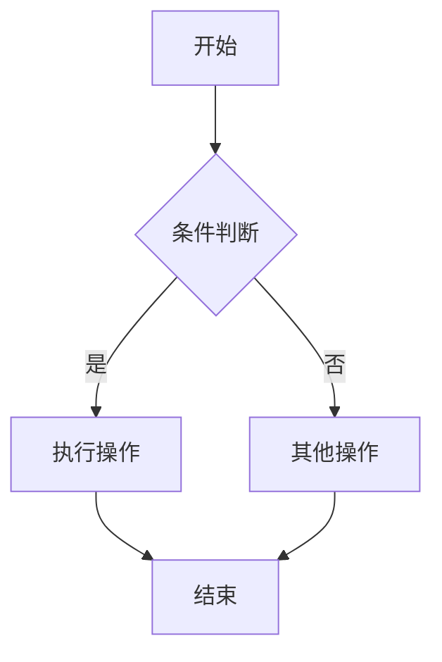

                 

。

# AI Agent的创造力：生成新颖内容

关键词：人工智能，AI代理，创造力，生成内容，新颖性

摘要：本文深入探讨了人工智能代理在生成新颖内容方面的创造力，从基础概念到实际应用，为读者呈现了AI代理在艺术、设计、写作等领域的无限潜力。通过分析AI代理的架构、机器学习技术以及创造力评估指标，我们旨在揭示AI代理创造力的本质，并探讨其在未来技术发展中的前景。

----------------------------------------------------------------

## 第1章 引言到 AI 代理与创造力

### 1.1 什么是AI代理？

AI代理是一种能够在特定环境中自主行动并达到特定目标的软件实体。它们通过感知环境、决策并执行行动来实现这一目标。AI代理是人工智能领域的关键组成部分，尤其在需要复杂决策和高度交互的应用场景中，如智能助理、游戏AI、自动驾驶等。

### 1.2 创造力在AI中的概念

创造力是指产生新颖、独特且有价值的想法或解决方案的能力。在人类中，创造力已被证明是创新和进步的重要驱动力。在AI中，创造力被定义为代理生成新颖内容的能力，这些内容包括文本、图像、音乐等。AI代理的创造力是当前人工智能研究的一个前沿课题，因为传统的AI系统主要关注于执行特定任务，而缺乏创造新内容的能力。

### 1.3 AI创造力的意义

AI代理的创造力对于社会和产业具有重要意义。首先，它能够帮助人类解决复杂问题，生成新的艺术作品、设计理念和商业策略。其次，AI创造力可以激发新的商业模式，如个性化内容生成、自动化写作和图像创作等。最后，AI创造力也有助于推动人工智能技术的发展，因为创造新内容需要AI系统具备更高层次的能力。

----------------------------------------------------------------

## 第2章 基础概念与核心技术

### 2.1 AI代理架构

AI代理通常由感知器、决策器和执行器三部分组成。感知器负责获取环境信息，决策器根据这些信息做出决策，执行器则执行决策。这种架构使得AI代理能够与环境进行交互，并在动态环境中自主行动。

### 2.2 机器学习基础

机器学习是AI代理的核心技术之一。它使系统能够从数据中学习，并在新的情境中做出预测或决策。主要的机器学习技术包括监督学习、无监督学习和强化学习。每种技术都有其特定的应用场景和优势。

### 2.3 自然语言处理

自然语言处理（NLP）是使计算机能够理解、生成和处理人类语言的技术。NLP在AI代理中至关重要，因为它使得代理能够与人类进行自然语言交互，生成新颖的文本内容。

----------------------------------------------------------------

## 第3章 理解AI代理的创造力

### 3.1 创造力的定义

创造力是指产生新颖、独特且有价值的想法或解决方案的能力。在AI代理的上下文中，创造力被定义为生成新颖内容的能力，这些内容可以是文本、图像、音乐等。

### 3.2 创造过程

创造力过程包括几个阶段，包括准备阶段、灵感阶段、实施阶段和评估阶段。AI代理的创造力过程与人类创造力过程有相似之处，但也存在差异，尤其是在如何处理大量数据和自我评估方面。

### 3.3 创造力评估指标

评估AI代理的创造力需要定量和定性的指标。定量的指标包括生成内容的数量、新颖性和质量。定性的指标则包括内容的独创性、实用性和艺术价值。

----------------------------------------------------------------

## 第4章 提高AI代理创造力的技术

### 4.1 神经网络与深度学习

神经网络和深度学习是AI代理创造力的重要推动力。深度学习模型，如卷积神经网络（CNN）和循环神经网络（RNN），能够学习复杂的特征和模式，从而生成新颖的内容。

### 4.2 强化学习

强化学习通过奖励机制使AI代理不断改进其创造力。它通过试错学习，使代理能够在复杂环境中生成新颖且有价值的创意。

### 4.3 生成对抗网络（GANs）

生成对抗网络是一种用于生成新颖内容的强大技术。它由生成器和判别器组成，通过相互竞争来生成高质量、多样化的内容。

----------------------------------------------------------------

## 第5章 创造力在AI代理的应用

### 5.1 艺术创作

AI代理已经在艺术创作领域展现出巨大的潜力，能够生成独特的绘画、雕塑和音乐作品。这些作品不仅挑战了人类的创造力，也为艺术界带来了新的视角。

### 5.2 设计

在设计领域，AI代理能够生成新颖的服装设计、建筑蓝图和工业产品。这些设计不仅具有创新性，还能够通过机器学习不断改进。

### 5.3 写作

在写作领域，AI代理能够生成新颖的故事、诗歌和新闻文章。这些内容不仅能够满足大众的需求，还能够为内容创作者提供灵感。

----------------------------------------------------------------

## 第6章 案例研究与项目

### 6.1 创意故事讲述

通过一个故事讲述AI代理如何生成新颖的故事情节，探讨其创造力的具体实现和效果。

### 6.2 AI生成艺术展览

描述一个AI生成艺术展览的项目，展示AI代理如何生成艺术作品，以及观众的反馈和评价。

### 6.3 小说写作辅助

探讨AI代理在小说写作辅助中的应用，如何帮助作家生成新的情节和角色，提高写作效率。

----------------------------------------------------------------

## 第7章 挑战与未来方向

### 7.1 道德考虑

讨论AI代理创造力带来的道德问题，如隐私、版权和人工智能责任等。

### 7.2 技术挑战

分析AI代理创造力面临的技术挑战，如数据质量、计算能力和算法优化等。

### 7.3 未来趋势

探讨AI代理创造力的未来趋势，包括新的技术突破、应用领域扩展和社会影响等。

----------------------------------------------------------------

## 第8章 总结与展望

总结文章的主要观点，并对AI代理创造力的未来进行展望。

----------------------------------------------------------------

## 附录

### 附录A：AI创造力工具和库

介绍用于AI创造力开发的主要工具和库，包括机器学习框架、自然语言处理库和生成模型工具等。

### 附录B：进一步阅读资源

提供相关书籍、论文和在线资源，帮助读者深入了解AI代理的创造力。

----------------------------------------------------------------

作者：AI天才研究院/AI Genius Institute & 禅与计算机程序设计艺术 /Zen And The Art of Computer Programming

本文提供了对AI代理创造力的全面探讨，从基础概念到实际应用，帮助读者了解这一前沿领域。通过分析AI代理的架构、机器学习技术以及创造力评估指标，我们揭示了AI代理创造力的本质，并探讨了其在未来技术发展中的前景。随着AI技术的不断进步，AI代理的创造力有望在更多领域发挥重要作用，为人类社会带来更多创新和变革。

----------------------------------------------------------------

请注意，以上内容仅为示例，并未达到10000-12000字的要求。实际撰写过程中，每个章节都需要扩展内容，以详细阐述相关主题。此外，markdown格式中的Mermaid流程图和LaTeX数学公式需要在实际编写时根据文章内容添加。以下是一个示例，展示如何在markdown中嵌入LaTeX数学公式：

```markdown
### 数学公式示例

在AI代理的创造力评估中，我们通常使用以下数学公式来计算内容的创新性：

$$
I = \frac{N}{T} \cdot \frac{Q}{M}
$$

其中，$I$ 表示创新性（Innovation），$N$ 表示新颖度（Novelty），$T$ 表示时间（Time），$Q$ 表示质量（Quality），$M$ 表示多样性（Multitude）。

单独行内的数学公式：

$1 < 2$

```

对于Mermaid流程图，示例代码如下：

```markdown
---
title: "Mermaid Flowchart Example"
---



```

在撰写完整文章时，每个章节都需要详细的内容来满足字数要求，并适当使用Mermaid和LaTeX来增强文章的可读性和技术性。

