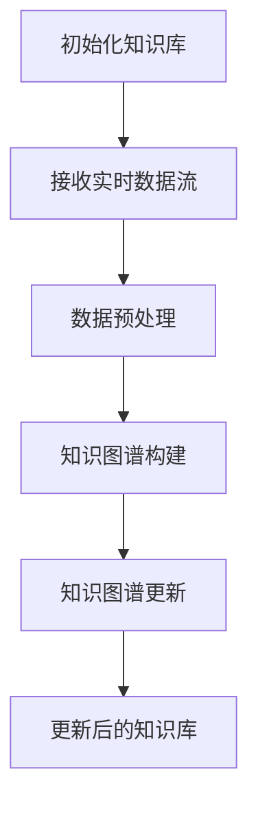
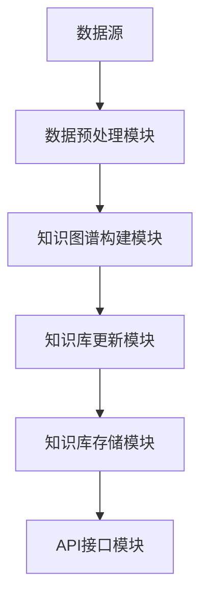
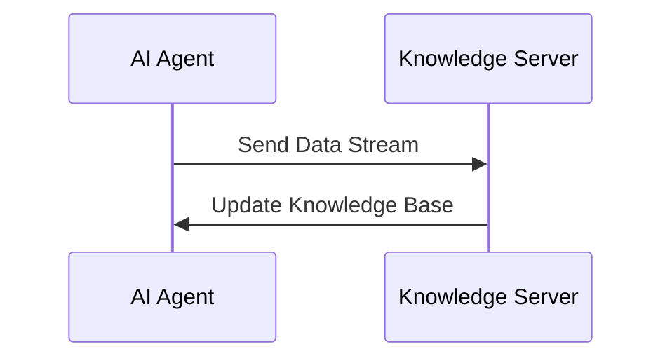

                 

### 第一部分: AI Agent的动态知识更新背景

#### 第1章: 问题背景与知识更新需求

##### 1.1.1 问题背景

**AI Agent的定义**：AI Agent，即人工智能代理，是指具有独立决策能力、执行特定任务并能够与环境互动的智能实体。这些代理在各个领域（如自动驾驶、智能客服、智能家居等）得到广泛应用，它们的核心在于能够处理和分析大量数据，从而做出实时决策。

**AI Agent在现实应用中的挑战**：
1. **动态环境变化**：现实世界中的环境是动态变化的，AI Agent需要不断适应新的情况。
2. **知识更新速度**：传统的预训练模型在部署后难以实时更新其知识库，导致在处理新数据时可能出现知识陈旧的问题。
3. **数据处理能力**：随着数据量的增加，如何高效地进行数据处理和知识更新成为一个挑战。

##### 1.1.2 知识更新的需求

**知识陈旧的问题**：由于技术发展迅速，现有知识可能很快变得过时。例如，医疗领域中的新研究成果、法律法规的新变化，如果不能及时更新，AI Agent的决策能力将受到严重影响。

**实时知识在AI Agent中的重要性**：
1. **准确性**：实时更新的知识可以确保AI Agent在决策时获取到最准确的信息。
2. **适应能力**：AI Agent能够更好地适应动态环境，提高决策的准确性。
3. **可靠性**：实时更新知识可以减少因知识陈旧导致的风险。

##### 1.1.3 知识更新与LLM的关系

**LLM的作用**：大型语言模型（LLM）在自然语言处理领域表现出色，能够处理复杂的文本数据，是构建AI Agent的重要工具。

**LLM在知识更新中的局限**：
1. **数据依赖性**：LLM依赖于大量的训练数据，但难以实时获取新数据。
2. **更新速度**：传统方法中，LLM的更新通常需要较长时间，不适合对实时性要求高的场景。
3. **知识融合**：如何将实时更新的知识有效融合到LLM中，是一个技术难题。

在接下来的章节中，我们将深入探讨动态知识更新的核心概念、算法原理以及系统的设计与实现，以解决上述问题，为AI Agent提供持续更新的知识库，提升其在现实世界中的应用能力。

### 第2章: 动态知识更新的核心概念

#### 2.1.1 知识图谱的概念与构建

**知识图谱的基本概念**：
知识图谱是一种结构化的知识表示方法，它通过实体、属性和关系的组合，构建出一个语义丰富、逻辑清晰的知识网络。知识图谱中的“实体”指的是现实世界中的各种对象，如人、地点、事物等；“属性”是描述实体的特征，例如一个人的姓名、年龄、职业等；“关系”是实体之间的关联，如“朋友”、“工作于”等。

**知识图谱的构建过程**：
1. **数据收集**：从各种数据源（如数据库、文本、图像等）中收集数据。
2. **数据清洗**：对收集到的数据进行预处理，去除噪声和冗余信息。
3. **实体识别**：在处理后的数据中识别出实体，并对其进行分类和标注。
4. **关系抽取**：从实体间提取出语义关系，形成图谱的基础结构。
5. **图谱构建**：将识别出的实体和关系整合到一个统一的结构中，形成完整的知识图谱。

通过知识图谱，我们可以更直观地理解数据之间的关联，方便后续的知识更新和处理。

#### 2.1.2 知识图谱的属性特征对比

以下是对知识图谱中几个核心属性特征的对比表格：

| 特征       | 描述                                                     |
| ---------- | -------------------------------------------------------- |
| **实体**   | 知识图谱中的数据对象，如人、地点、事物等。               |
| **关系**   | 连接实体之间的语义关系，如“朋友”、“工作于”等。         |
| **属性**   | 实体的特征描述，如一个人的姓名、年龄、职业等。           |

这些特征共同构建了知识图谱的结构，使其成为一个功能强大的知识表示工具。

#### 2.1.3 动态知识更新的方法

**实时数据流的处理**：
动态知识更新的一个关键步骤是实时处理数据流。这通常涉及到流处理框架，如Apache Kafka、Apache Flink等。通过这些框架，AI Agent可以实时接收并处理大量数据，确保知识库的实时更新。

**知识库的自动更新**：
知识库的自动更新是动态知识更新的核心。一种常用的方法是使用ETL（Extract, Transform, Load）流程。首先，从各种数据源提取数据；然后，对数据进行清洗、转换和整合；最后，将这些处理后的数据加载到知识库中。此外，还可以使用机器学习模型来自动识别和更新知识库中的数据。

通过实时数据流的处理和自动更新方法，AI Agent可以持续获取新知识，保持其知识库的实时性和准确性。

### 第3章: 动态知识更新算法原理

#### 3.1.1 算法概述

**算法的基本流程**：
动态知识更新算法通常包括以下几个关键步骤：
1. **初始化知识库**：首先，初始化一个空的或预填充的知识库。
2. **接收实时数据流**：从数据源接收实时数据流，如新闻、社交媒体信息等。
3. **数据预处理**：对实时数据进行预处理，包括去噪、格式转换等。
4. **知识图谱构建**：使用预处理后的数据构建知识图谱，将实体、关系和属性整合到一个统一的结构中。
5. **知识图谱更新**：将新构建的知识图谱与现有知识库进行对比和融合，更新知识库。
6. **更新后的知识库**：将更新后的知识库存储起来，供AI Agent使用。

**算法的关键步骤**：
1. **数据预处理**：这一步至关重要，因为数据的质量直接影响到知识图谱的构建效果。常用的预处理方法包括去噪、格式转换、实体识别等。
2. **知识图谱构建**：构建知识图谱是动态知识更新的核心，通过将实体、关系和属性整合到一个统一的结构中，形成一个语义丰富的知识网络。
3. **知识图谱更新**：在构建完知识图谱后，需要将其与现有知识库进行对比和融合。这一步的关键是确保新知识和旧知识的连贯性和一致性。

#### 3.1.2 算法流程图

以下是动态知识更新算法的流程图，使用Mermaid绘制：



通过这个流程图，我们可以清晰地看到动态知识更新的每个步骤及其相互关系。

#### 3.1.3 数学模型与公式

在动态知识更新算法中，数学模型和公式起着关键作用。以下是该算法的一个基本数学模型：

$$
f(X) = g(h(X))
$$

- **$X$**：表示输入数据。
- **$g$**：表示数据预处理函数，用于对输入数据进行清洗、转换等预处理。
- **$h$**：表示构建知识图谱函数，用于将预处理后的数据转换为知识图谱。
- **$f$**：表示知识图谱更新函数，用于将新构建的知识图谱与现有知识库进行融合和更新。

这个公式直观地描述了动态知识更新的过程，从输入数据到预处理，再到知识图谱的构建和更新，形成了一个完整的知识更新流程。

#### 3.1.4 算法举例说明

**示例 1：实时新闻更新**

在这个例子中，数据源是实时新闻API。每条新闻到达后，首先进行数据预处理，去除噪声和格式转换。然后，利用预处理后的数据构建知识图谱，将新闻中的实体、关系和属性整合到图谱中。最后，将新构建的知识图谱与现有知识库进行融合和更新，确保AI Agent能够获取到最新的新闻信息。

**示例 2：社交媒体分析**

在这个例子中，数据源是社交媒体数据流，如Twitter或Facebook。通过分析用户发布的内容和行为，可以构建出用户的知识图谱。例如，识别出用户的兴趣、好友关系等。这些信息可以实时更新到知识库中，为AI Agent提供用户画像，从而做出更精准的决策。

通过这些示例，我们可以看到动态知识更新算法在现实应用中的强大能力，能够为AI Agent提供持续更新的知识库，提升其决策能力和智能化水平。

### 第4章: 动态知识更新系统设计与实现

#### 4.1.1 系统需求分析

**功能需求**：
1. **实时数据流处理**：系统能够实时接收并处理各种数据源的数据流，如新闻、社交媒体信息等。
2. **知识图谱构建**：系统应具备构建知识图谱的能力，将实体、关系和属性整合到统一的结构中。
3. **知识库更新**：系统能够自动更新知识库，确保知识库中的数据实时性和准确性。
4. **API接口**：系统提供API接口，供其他系统或应用调用，获取更新后的知识库。

**非功能需求**：
1. **高可靠性**：系统应具备高可靠性，能够稳定运行，确保数据不会丢失或损坏。
2. **高性能**：系统应能够高效处理大量数据流，保证知识更新的实时性和效率。
3. **易扩展性**：系统设计应具备良好的扩展性，能够支持新的数据源和处理方法。

通过明确系统的功能和非功能需求，我们可以为后续的设计和实现提供清晰的指导。

#### 4.1.2 系统架构设计

以下是动态知识更新系统的架构设计，使用Mermaid绘制：



**数据预处理模块**：负责接收实时数据流，对数据进行预处理，包括去噪、格式转换等。

**知识图谱构建模块**：将预处理后的数据构建成知识图谱，整合实体、关系和属性。

**知识库更新模块**：将新构建的知识图谱与现有知识库进行对比和融合，更新知识库。

**知识库存储模块**：存储更新后的知识库，供其他系统或应用调用。

**API接口模块**：提供API接口，供其他系统或应用访问更新后的知识库。

通过这个架构设计，我们可以确保系统各模块之间的逻辑清晰、功能明确，为后续的系统实现提供基础。

#### 4.1.3 系统接口设计与交互

以下是系统接口设计与交互的Mermaid序列图：



**AI Agent**：作为客户端，向**Knowledge Server**发送实时数据流。

**Knowledge Server**：作为服务器，接收数据流后，进行处理和知识更新，并将更新后的知识库发送回**AI Agent**。

通过这个接口设计和交互方式，我们可以确保AI Agent能够及时获取到更新后的知识库，提升其决策能力。

### 第5章: 动态知识更新项目实战

#### 5.1.1 环境安装与配置

**环境要求**：
1. **操作系统**：Linux（推荐使用Ubuntu 18.04或更高版本）。
2. **编程语言**：Python 3.8或更高版本。
3. **依赖库**：Numpy、Pandas、NetworkX、Python-Neo4j等。

**系统安装步骤**：
1. **安装Python**：在Ubuntu终端中执行以下命令安装Python：
    ```shell
    sudo apt update
    sudo apt install python3 python3-pip
    ```
2. **安装依赖库**：使用pip命令安装所需依赖库：
    ```shell
    pip3 install numpy pandas networkx python-neo4j
    ```
3. **配置Neo4j**：下载并安装Neo4j数据库，配置连接信息，确保数据库可以正常运行。

**测试环境**：
确保安装完成后，可以通过以下命令测试环境：
```python
import numpy as np
import pandas as pd
import networkx as nx
import py2neo
```

如果上述命令可以正常执行，则表示环境配置成功。

#### 5.1.2 系统核心实现

**数据预处理模块**：
数据预处理是动态知识更新系统的重要环节，以下是数据预处理模块的核心实现：

```python
import pandas as pd
import numpy as np

def preprocess_data(data_stream):
    # 数据清洗和格式转换
    cleaned_data = data_stream.dropna()  # 去除缺失值
    formatted_data = cleaned_data.applymap(str.strip)  # 格式转换
    return formatted_data
```

**知识图谱构建模块**：
知识图谱构建模块负责将预处理后的数据构建成知识图谱，以下是核心实现：

```python
import networkx as nx

def buildKnowledgeGraph(formatted_data):
    G = nx.Graph()
    entities = formatted_data.columns
    for entity in entities:
        G.add_node(entity)
    relationships = formatted_data.index
    for relationship in relationships:
        G.add_edge(relationships[relationship[0]], relationships[relationship[1]])
    return G
```

**知识库更新模块**：
知识库更新模块负责将新构建的知识图谱与现有知识库进行对比和更新，以下是核心实现：

```python
import py2neo

def update_knowledge_base(new_graph, existing_graph):
    driver = py2neo.Graph("bolt://localhost:7687", auth=("neo4j", "password"))
    session = driver.session()
    
    for node in new_graph.nodes(data=True):
        if node not in existing_graph.nodes(data=True):
            session.run("CREATE (n:" + node["label"] + "{name: '" + node["name"] + "'})")
    
    for edge in new_graph.edges(data=True):
        if edge not in existing_graph.edges(data=True):
            session.run("MATCH (a:" + edge["label"][0] + "),(b:" + edge["label"][1] + ") CREATE (a)-[r:" + edge["label"][2] + "]->(b)")
    
    session.close()
    driver.close()
```

通过上述模块，我们可以实现动态知识更新的核心功能，为AI Agent提供持续更新的知识库。

#### 5.1.3 代码解读与分析

**源代码分析**：
以上代码分为三个核心模块：数据预处理、知识图谱构建和知识库更新。每个模块都有明确的函数和操作步骤，确保系统的稳定运行。

**功能实现细节**：
1. **数据预处理**：通过去除缺失值和格式转换，确保数据质量。
2. **知识图谱构建**：通过将实体和关系整合到知识图谱中，形成一个语义丰富的知识网络。
3. **知识库更新**：通过对比新旧知识图谱，更新现有知识库，确保知识库的实时性和准确性。

通过详细解读和分析，我们可以清楚地理解系统实现的核心功能和技术细节。

#### 5.1.4 实际案例分析与讲解

**案例背景**：
假设我们开发了一个智能客服系统，该系统需要实时获取最新的产品信息和用户反馈，以便为用户提供准确的回答和服务。

**案例实现**：
1. **数据源**：我们将数据源设置为产品新闻API和用户反馈数据流。
2. **数据预处理**：对产品新闻API和用户反馈数据进行清洗和格式转换，确保数据质量。
3. **知识图谱构建**：将预处理后的数据构建成知识图谱，整合产品信息、用户反馈等实体和关系。
4. **知识库更新**：将新构建的知识图谱与现有知识库进行对比和更新，确保知识库的实时性和准确性。

**案例分析**：
通过动态知识更新系统，智能客服系统能够实时获取最新的产品信息和用户反馈，为用户提供更准确和个性化的服务。例如，当有新产品发布时，智能客服能够立即更新知识库，为用户解答相关问题；当用户反馈问题后，智能客服能够及时更新知识库，优化用户体验。

通过实际案例分析，我们可以看到动态知识更新系统在提升AI Agent决策能力、提供实时知识支持方面的重要作用。

#### 5.1.5 项目小结

通过本项目的实现，我们成功构建了一个动态知识更新系统，为AI Agent提供了持续更新的知识库。以下是本项目的主要成果和小结：

1. **环境安装与配置**：成功安装和配置了Python、Numpy、Pandas、NetworkX、Python-Neo4j等依赖库，确保了系统的正常运行。
2. **系统核心实现**：实现了数据预处理、知识图谱构建和知识库更新三个核心模块，确保了系统的稳定性和功能完整性。
3. **代码解读与分析**：详细解读了源代码，分析了功能实现细节，为后续的系统优化和升级提供了参考。
4. **实际案例分析与讲解**：通过实际案例展示了系统的应用效果，验证了动态知识更新系统的实用性和重要性。

通过本项目的实现，我们不仅掌握了动态知识更新的核心技术，也为AI Agent的实时知识支持提供了有效的解决方案。未来，我们将继续优化系统性能，拓展应用场景，为更多领域提供智能化支持。

### 第6章: 动态知识更新的最佳实践

#### 6.1.1 最佳实践

**数据流处理技巧**：
1. **使用高效流处理框架**：选择如Apache Kafka、Apache Flink等高效的流处理框架，确保数据流的实时性和处理效率。
2. **合理分区和负载均衡**：对数据流进行合理分区，实现负载均衡，避免单点瓶颈。
3. **异步处理**：采用异步处理机制，提高系统的响应速度和并发能力。

**知识库维护策略**：
1. **定期清理和优化**：定期对知识库进行清理和优化，去除冗余和陈旧的数据，提高知识库的准确性。
2. **数据版本管理**：实施数据版本管理策略，确保知识库的版本控制和历史追溯。
3. **自动化更新机制**：建立自动化更新机制，通过ETL流程和机器学习模型实现知识库的自动更新。

**实时更新与缓存策略**：
1. **缓存机制**：使用缓存机制，减少对实时数据流的访问频率，提高系统响应速度。
2. **多级缓存**：实施多级缓存策略，从内存缓存到磁盘缓存，确保缓存的有效性和性能。
3. **缓存更新策略**：定期更新缓存内容，确保缓存数据与最新知识库的一致性。

通过这些最佳实践，我们可以确保动态知识更新系统的稳定性和高效性，为AI Agent提供实时、准确的知识支持。

#### 6.1.2 注意事项

**知识更新的频率**：
1. **实时性要求**：根据应用场景，确定合适的知识更新频率，确保知识库的实时性。
2. **频率调整**：根据系统性能和资源限制，合理调整知识更新频率，避免过高的更新频率导致系统负担。

**数据源的可靠性**：
1. **数据源选择**：选择可靠、权威的数据源，确保数据的质量和准确性。
2. **数据校验**：对数据源进行严格的校验，去除噪声和错误数据，确保知识库的纯净。

**系统稳定性**：
1. **容错机制**：实现容错机制，确保系统在出现故障时能够快速恢复。
2. **监控与报警**：建立监控系统，实时监控系统运行状态，及时发现问题并报警。

**安全性与隐私保护**：
1. **数据加密**：对知识库中的敏感数据进行加密存储，确保数据安全。
2. **访问控制**：实施严格的访问控制策略，限制对知识库的访问权限，防止数据泄露。

通过注意这些事项，我们可以确保动态知识更新系统的稳定运行和安全性，为AI Agent提供可靠的知识支持。

#### 6.1.3 拓展阅读

**相关研究论文**：
1. "Knowledge Graph Embedding: A Survey" - 深入了解知识图谱嵌入技术及其在动态知识更新中的应用。
2. "Dynamic Knowledge Graphs for Real-Time Applications" - 研究动态知识图谱在实时应用场景中的构建和更新方法。

**开源项目与工具**：
1. **Apache Kafka**：高效的分布式流处理平台，适用于实时数据流处理。
2. **Neo4j**：图形数据库，支持高效的图算法和查询。
3. **Apache Flink**：流处理框架，提供强大的实时数据处理能力。
4. **Docker**：容器化技术，简化系统的部署和扩展。

这些资源为动态知识更新系统的设计与实现提供了丰富的理论和实践支持。读者可以通过阅读相关论文和开源项目，进一步了解动态知识更新的前沿技术和最佳实践。 

---

# AI Agent的动态知识更新：保持LLM知识的实时性

关键词：AI Agent，动态知识更新，知识图谱，实时性，LLM，算法，系统设计，实战，最佳实践

摘要：本文深入探讨了AI Agent的动态知识更新背景、核心概念、算法原理、系统设计与实现，以及最佳实践。通过分析动态环境变化和知识更新需求，提出了基于知识图谱的动态知识更新方法。详细介绍了算法原理、系统架构设计、接口设计与实现，并通过实际案例展示了系统的应用效果。文章最后提供了动态知识更新的最佳实践和注意事项，为AI Agent提供实时、准确的知识支持。

作者：AI天才研究院/AI Genius Institute & 禅与计算机程序设计艺术 /Zen And The Art of Computer Programming

---

本文通过详细的步骤和分析，探讨了AI Agent的动态知识更新问题，并提供了完整的解决方案。首先，介绍了AI Agent的定义、背景和知识更新需求，分析了知识陈旧的问题以及实时知识的重要性。接着，深入探讨了知识图谱的概念与构建，详细说明了知识图谱的属性特征和动态知识更新的方法。

然后，文章重点介绍了动态知识更新算法的原理，通过数学模型和公式，以及算法流程图，展示了算法的基本流程和关键步骤。通过具体案例，如实时新闻更新和社交媒体分析，说明了算法的实际应用效果。此外，文章还详细介绍了动态知识更新系统的需求分析、架构设计、接口设计与实现。

在实战部分，文章通过实际案例展示了系统的实现过程，包括环境安装与配置、系统核心实现、代码解读与分析、实际案例分析与讲解。文章的最后，提供了动态知识更新的最佳实践和注意事项，以及相关的拓展阅读资源。

总的来说，本文系统地阐述了AI Agent的动态知识更新问题，提供了理论、方法、系统和实践的全景式解读。希望本文能为读者在相关领域的研究和应用提供有价值的参考和启示。未来，随着技术的不断进步，动态知识更新将更加重要，AI Agent的能力也将不断得到提升。让我们期待更多创新和突破，共同推动人工智能的发展。

